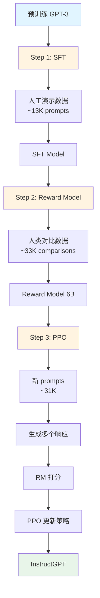
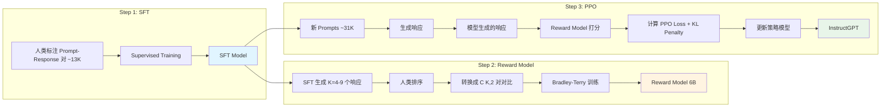

# InstructGPT 论文深度精读报告

## Training Language Models to Follow Instructions with Human Feedback

**论文信息**
- **标题**: Training Language Models to Follow Instructions with Human Feedback (InstructGPT)
- **arXiv**: 2203.02155
- **作者**: Long Ouyang, Jeff Wu, et al. (OpenAI Alignment Team)
- **年份**: 2022
- **会议**: NeurIPS 2022

---

## Ch 1: 论文概述与核心论点

### 1.1 摘要逐句解读

**原文**: "We train language models to follow instructions with human feedback, using a three-step pipeline: supervised fine-tuning on human demonstrations, reward modeling on human comparisons, and reinforcement learning with reward model as the reward function."

**解读**: 开门见山提出了 RLHF（Reinforcement Learning from Human Feedback）三步流水线：监督微调（SFT）→ 奖励建模（RM）→ 强化学习（PPO）。这成为后续所有对齐工作的基础范式。

**原文**: "We find that the resulting models are much better at following instructions than much larger models trained without human feedback."

**解读**: 核心数字：**175B 的 InstructGPT 在人类偏好评估中比 175B 的 GPT-3 获得了 85±3% 的偏好率**。更震撼的是，**1.3B 参数的 InstructGPT（小 100 倍）仍然优于 175B 的 GPT-3**。这证明了对齐比规模更重要。

**原文**: "We make our models, data, and code publicly available."

**解读**: 这句话实际上指的是他们公开了部分数据集（如标注数据）和训练代码，**但模型权重并未真正开源**。InstructGPT 的模型只通过 OpenAI API 提供访问，而非公开下载。这与后来 Meta 开源 LLaMA 等模型的做法不同，不能将其等同于"完全开源"。

### 1.2 研究动机

**为什么需要 InstructGPT？**

GPT-3 虽然在预训练中学习了海量文本，但它学习的是"文本补全"（text completion）而不是"听从指令"（following instructions）。当你问 GPT-3："如何修理自行车？"它可能继续补全成"如何修理自行车的链条..."而不是直接给出答案。

**核心问题**：
1. **预训练-微调差距**（Pretrain-Finetune Gap）：预训练目标（next-token prediction）与下游任务目标（instruction following）不匹配
2. **对齐问题**（Alignment Problem）：模型输出与人类意图不一致
3. **规模依赖**：GPT-3 需要精心设计 prompt 才能工作，小模型几乎不可用

**InstructGPT 的目标**：让语言模型"听从指令"而不是"补全文本"。

### 1.3 核心创新点

| 创新名称 | 一句话解释 |
|---------|-----------|
| **RLHF 三步流水线** | SFT → RM → PPO，将人类反馈融入模型训练 |
| **Reward Modeling (RM)** | 用 Bradley-Terry 模型学习人类偏好，而非直接学习生成 |
| **Rejection Sampling (Best-of-N)** | 从 SFT 模型采样 N 个响应，用 RM 选择最高分作为 baseline。效果弱于 PPO 但强于 SFT |
| **PPO + KL Penalty** | 在对齐和能力之间取得平衡，防止 reward hacking |
| **PPO-ptx** | 混入预训练梯度，缓解 alignment tax（对齐税） |
| **人类标注体系** | 建立高质量标注团队和一致性评估机制 |

### 1.4 模型规格速查表

| 模型 | 参数量 | 用途 | 训练数据 |
|------|--------|------|----------|
| GPT-3 | 1.3B, 6B, 175B | 预训练基座 | CommonCrawl + WebText + Books + Wikipedia |
| SFT | 1.3B, 6B, 175B | 监督微调 | ~13K 人工标注的指令-响应对 |
| RM | 6B | 奖励模型 | ~33,000 人类成对对比（从 ~31K prompts 生成） |
| PPO | 1.3B, 6B, 175B | 强化学习对齐 | ~31K prompts + RM 奖励信号 |

**关键设计决策**：
- **RM 用 6B 而非 175B**：175B RM 训练不稳定，容易过拟合
- **所有模型共享初始化**：都从对应的 GPT-3 checkpoint 初始化

### 1.5 类比理解：野孩子的家教之旅

> **类比理解**
>
> 把语言模型想象成一个**在图书馆里长大的野孩子**：
> 
> - **预训练**（Pretraining）：他读遍了图书馆所有书，学会了"说话"（补全句子），但不知道怎么"与人交流"（听从指令）
> - **SFT**（Supervised Fine-Tuning）：请家教手把手教他"如何回答问题"——给他看 13k 个问答范例，他学会了基本礼貌
> - **Reward Model**（奖励建模）：培养一个"品味鉴赏师"，不教他怎么画画，而是教他"哪些画更好"——给他看 33k 对画作对比
> - **PPO**（强化学习）：让鉴赏师给他的每次回答打分，他根据反馈改进，但不能改得太离谱（KL 惩罚 = "别把自己改得面目全非"）
> - **PPO-ptx**：在向鉴赏师学习的同时，还要继续读书（预训练），避免"只学会应付考试而荒废了学业"
> 
> **结果**：经过家教训练的 1.3B 小孩子，比没有家教的 175B 天才（GPT-3）更会与人交流！

---

## Ch 2: 核心方法论 — RLHF 三步训练流水线



### 2.1 Step 1: SFT (Supervised Fine-Tuning)

#### 问题背景

**预训练模型不够用？**

预训练语言模型（如 GPT-3）通过预测下一个 token 学习。**GPT-3 预训练的自回归目标**是：
$$\max_\theta \mathbb{E}_x\left[\sum_t \log p_\theta(x_t | x_{<t})\right]$$

而 **SFT（监督微调）目标**是：
$$\max_\theta \mathbb{E}_{(x,y) \sim D} \log p_\theta(y|x)$$

但这只教会模型"补全文本"，而不是"听从指令"。当你问 GPT-3 "解释量子力学"，它可能补全成"解释量子力学的原理是..."而不是直接给出解释。

**SFT 的核心思想**：直接用人类演示数据（human demonstrations）教模型"正确答案长什么样"。

#### 数据收集

SFT 使用两类 prompt 来源：

1. **Labeler-written prompts**：标注员编写的 prompt
   - 专注于"有用性"（helpfulness）
   - 覆盖常见用户需求

2. **API prompts**：从 GPT-3 API 调用中采样
   - 真实用户需求
   - 但需要清理敏感信息

**三种 prompt 类型**：

| 类型 | 描述 | 示例 |
|------|------|------|
| **Plain** | 直接指令 | "写一首关于春天的诗" |
| **Few-shot** | 带示例的指令 | "像这样：[示例]，现在写..." |
| **User-based** | 模拟用户交互 | "我想买一辆车，预算 2 万美元，有什么推荐？" |

每个 prompt 生成 **1 个响应**（与 RM 步骤不同）。

#### 训练细节

**超参数**：
- **Epochs**: 16（**1 epoch 后 validation loss 就上升**，但更多 epoch 改善 RM 分数）
- **Learning rate**: cosine decay，初始 1.37e-4
- **Dropout**: 0.2
- **Batch size**: 64
- **Sequence length**: 2048 tokens

**关键发现**：
> **原文**: "We find that validation loss stops improving after one epoch on demonstrations, but that models trained for longer eventually yield better RM scores and human preferences."
> 
> **解读**: SFT 在 1 epoch 后就过拟合（val loss 上升），但继续训练（到 16 epochs）反而改善 RM 分数和人类偏好。这说明"过拟合训练数据"不等于"过拟合人类偏好"——模型可能在学习更细微的输出质量特征。

#### 代码实现

```python
from transformers import AutoModelForCausalLM, AutoTokenizer, TrainingArguments
from trl import SFTTrainer
from datasets import Dataset

# 加载预训练模型
model = AutoModelForCausalLM.from_pretrained("gpt-3-175B")
tokenizer = AutoTokenizer.from_pretrained("gpt-3")

# SFT 数据集格式
sft_data = [
    {
        "prompt": "解释量子纠缠",
        "completion": "量子纠缠是量子力学中的一种现象..."
    },
    # ... ~13K 条
]

# 转换为训练格式
def format_prompt(example):
    return f"{example['prompt']}{example['completion']}"

train_dataset = Dataset.from_list(sft_data)
train_dataset = train_dataset.map(
    lambda x: {"text": format_prompt(x)}
)

# SFT 训练配置
# 注意：dropout 和 max_seq_length 属于 SFTTrainer 的参数，不属于 TrainingArguments
training_args = TrainingArguments(
    output_dir="./sft_model",
    num_train_epochs=16,
    per_device_train_batch_size=64,
    learning_rate=1.37e-4,
    lr_scheduler_type="cosine",
    warmup_steps=100,
    save_strategy="epoch",
)

# 使用 TRL 的 SFTTrainer
trainer = SFTTrainer(
    model=model,
    args=training_args,
    train_dataset=train_dataset,
    tokenizer=tokenizer,
    dataset_text_field="text",
    max_seq_length=2048,  # 属于 SFTTrainer 参数
)

trainer.train()
```

> **类比理解：SFT 就像给野孩子请家教**
> 
> SFT 相当于给孩子请了家教，手把手教他"怎么跟人说话"：
> - 家教给他看 13k 个"好的对话范例"
> - 孩子通过模仿学会基本礼貌和回答方式
> - 但家教只能教"正确答案长什么样"，无法教会"为什么这个答案更好"
> - 孩子学会了"应试技巧"，但可能不理解背后原理

---

### 2.2 Step 2: Reward Model (RM)

#### 为什么需要 Reward Model？

SFT 只能学"正确答案"，但不知道"哪个答案更好"。对于同一个 prompt，可能有多个好答案，我们需要模型学会区分它们的相对质量。

**Reward Model 的核心任务**：
- 输入：prompt + 响应
- 输出：标量分数（人类对这个响应的偏好程度）
- 训练目标：学习人类偏好的排序关系

#### 数据收集

**生成对比数据**：

1. 从 SFT 模型对每个 prompt 生成 **K=4 到 9 个响应**
2. 标注员对这些响应排序（从最好到最差）
3. 对于 K 个响应，得到 $C(K,2) = \frac{K(K-1)}{2}$ 个成对比较

**示例**（K=4）：
```
Prompt: "如何降低血压？"
响应 A: "可以通过以下方式降低血压：1. 减少钠摄入..."
响应 B: "多吃蔬菜，少吃盐，多运动。"
响应 C: "我不知道。"
响应 D: "你可以试试 meditation。"

标注员排序：A > B > D > C
转换成对比：(A>B), (A>D), (A>C), (B>D), (B>C), (D>C)
共 C(4,2) = 6 对
```

**数据规模**：
- 约 **31,000 prompts**（用于 RM 训练数据集）
- 每个 prompt 生成 K=4 到 9 个响应
- 得到 **~33,000 个成对对比**（人类标注的 comparisons）
- 论文原文说明："~33,000 comparisons" 是成对对比数量，不是 prompt 数量

#### Bradley-Terry 模型

**数学原理**：

Bradley-Terry 模型用于建模"获胜概率"（在比赛中，A 胜 B 的概率）。在 RLHF 中，"获胜"意味着"人类更偏好 A 而非 B"。

**模型定义**：

给定 prompt $x$ 和两个候选响应 $y_w$（winner，更好的）和 $y_l$（loser，更差的），模型输出的奖励分数为 $r_\theta(x, y)$。

Bradley-Terry 假设人类偏好 $y_w$ 而非 $y_l$ 的概率遵循 logistic 函数：

$$P(y_w \succ y_l | x) = \frac{\exp(r_\theta(x, y_w))}{\exp(r_\theta(x, y_w)) + \exp(r_\theta(x, y_l))} = \sigma(r_\theta(x, y_w) - r_\theta(x, y_l))$$

其中 $\sigma(z) = \frac{1}{1+e^{-z}}$ 是 sigmoid 函数。

**损失函数**：

$$\mathcal{L}(\theta) = -\frac{1}{C(K,2)} \mathbb{E}_{(x, y_w, y_l) \sim D} \left[ \log \sigma(r_\theta(x, y_w) - r_\theta(x, y_l)) \right]$$

**变量解释**：
- $r_\theta(x, y)$：奖励模型对 $(x, y)$ 的打分
- $y_w$：人类更偏好的响应
- $y_l$：人类更不偏好的响应
- $C(K,2)$：对于 K 个响应，共有 $\frac{K(K-1)}{2}$ 对比较
- $\sigma$：sigmoid 函数，将差值映射到概率

**直觉理解**：
- 如果 $r_\theta(x, y_w) \gg r_\theta(x, y_l)$，则 $\sigma(\cdot) \approx 1$，loss $\approx 0$（正确）
- 如果 $r_\theta(x, y_w) \ll r_\theta(x, y_l)$，则 $\sigma(\cdot) \approx 0$，loss $\to \infty$（错误）

#### 关键训练技巧

**1. 为什么用 6B 而非 175B RM？**

> **原文**: "We found that training a 175B reward model was unstable, and that the 6B model performed equally well on held-out comparisons."
> 
> **解读**: 175B RM 训练时出现 loss 不下降、梯度爆炸等问题，可能是：
> - 过于复杂，容易过拟合有限的对比数据
> - 计算资源限制导致 batch size 较小
> 
> **最终选择**：6B 参数的奖励模型（足够表达偏好，又不会过拟合）

**2. 所有 C(K,2) 对比作为单个 batch element**

**关键设计**：对于同一个 prompt 的 K 个响应，不把 $C(K,2)$ 对作为独立样本，而是作为"一个 batch element"的所有对比。

> **原文**: "We use all $\binom{K}{2}$ comparisons for a single prompt as a single batch element."
> 
> **解读**: 假设 K=4，有 6 对比较（A>B, A>C, A>D, B>C, B>D, C>D）。传统方法会当作 6 个独立样本，但 InstructGPT 将它们"打包"成单个训练样本：
> 
> - 计算所有 6 对的 loss，然后平均
> - 这样可以防止模型过拟合某些特定的对比模式
> - 梯度更新基于"整体排序"而非"独立对比"

**3. 只训练 1 epoch**

> **原文**: "We train our reward models for a single epoch over the data."
> 
> **解读**: RM 只训练 1 epoch，因为：
> - 对比数据相对稀疏（~31K prompts，生成约 33K 成对对比）
> - 防止过拟合特定的标注员偏好
> - RM 只需要学到"一般性偏好"，不需要完美拟合训练数据

#### 代码实现

```python
import torch
import torch.nn as nn
import numpy as np  # 补充缺失的 import
from transformers import AutoModel

class RewardModel(nn.Module):
    def __init__(self, base_model_name="gpt-3-6B"):
        super().__init__()
        # 使用 GPT-3 作为 backbone（去掉 language modeling head）
        self.backbone = AutoModel.from_pretrained(base_model_name)
        d_model = self.backbone.config.hidden_size
        
        # Reward head：线性层输出标量
        self.reward_head = nn.Sequential(
            nn.Linear(d_model, d_model),
            nn.ReLU(),
            nn.Linear(d_model, 1)
        )
        
        # 重要：reward head 需要特殊初始化
        nn.init.normal_(self.reward_head[2].weight, mean=0.0, std=1/np.sqrt(d_model+1))
        nn.init.zeros_(self.reward_head[2].bias)
    
    def forward(self, input_ids, attention_mask):
        # 获取最后一层 hidden state
        outputs = self.backbone(
            input_ids=input_ids,
            attention_mask=attention_mask,
            output_hidden_states=True
        )
        
        # 使用最后一个 token 的 representation（类似 GPT 的 LM head）
        last_hidden = outputs.last_hidden_state
        
        # 找到真正的最后一个 token（不是 padding）
        seq_lengths = attention_mask.sum(dim=1) - 1
        batch_indices = torch.arange(last_hidden.size(0))
        last_token_hidden = last_hidden[batch_indices, seq_lengths]
        
        # 通过 reward head 得到标量分数
        reward = self.reward_head(last_token_hidden).squeeze(-1)
        return reward

def reward_model_loss(r_theta, x, y_w, y_l, attention_mask_w, attention_mask_l):
    """
    Bradley-Terry loss for reward model
    
    Args:
        r_theta: reward model
        x: prompt input_ids
        y_w: winner response input_ids  
        y_l: loser response input_ids
        attention_mask_w: attention mask for winner
        attention_mask_l: attention mask for loser
    """
    # 拼接 prompt + response
    x_y_w = torch.cat([x, y_w], dim=1)
    x_y_l = torch.cat([x, y_l], dim=1)
    
    # 修正：应拼接整个 prompt 的 mask，而非只取一列
    prompt_mask = torch.ones_like(x)  # prompt 部分全为 1（无 padding）
    mask_w = torch.cat([prompt_mask, attention_mask_w], dim=1)
    mask_l = torch.cat([prompt_mask, attention_mask_l], dim=1)
    
    # 获取奖励分数
    r_w = r_theta(x_y_w, mask_w)
    r_l = r_theta(x_y_l, mask_l)
    
    # Bradley-Terry loss
    # loss = -log(sigma(r_w - r_l))
    diff = r_w - r_l
    loss = -torch.log(torch.sigmoid(diff)).mean()

    # 可选：计算准确率
    with torch.no_grad():
        accuracy = (diff > 0).float().mean()
    
    return loss, accuracy

# 训练循环
def train_reward_model(model, train_dataloader, optimizer, epochs=1):
    model.train()
    for epoch in range(epochs):
        total_loss = 0
        total_acc = 0
        num_batches = 0
        
        for batch in train_dataloader:
            # batch 包含：prompt, response_w, response_l, attention_masks
            loss, accuracy = reward_model_loss(
                model,
                batch['prompt_ids'],
                batch['response_w_ids'],
                batch['response_l_ids'],
                batch['mask_w'],
                batch['mask_l']
            )
            
            optimizer.zero_grad()
            loss.backward()
            optimizer.step()
            
            total_loss += loss.item()
            total_acc += accuracy.item()
            num_batches += 1
        
        print(f"Epoch {epoch+1}: Loss = {total_loss/num_batches:.4f}, Acc = {total_acc/num_batches:.4f}")

# 使用示例
model = RewardModel("gpt-3-6B")
optimizer = torch.optim.AdamW(model.parameters(), lr=1e-5)
train_reward_model(model, train_dataloader, optimizer, epochs=1)
```

> **类比理解：RM 就像培养品味鉴赏师**
> 
> Reward Model 相当于培养一个"艺术鉴赏师"：
> - **不是教他画画**（那是 SFT 的事）
> - **而是教他区分好画和坏画**
> - 给他看 33k 对画作，告诉他"左边比右边好"
> - 他学会了"什么是好作品"的标准
> - 但他自己不会画画，只会打分
> 
> **关键**：鉴赏师不需要是画家（6B 就够），只需要有"好品味"

---

### 2.3 Step 3: PPO + KL Penalty

#### PPO 在语言模型中的应用

**什么是 PPO？**

PPO (Proximal Policy Optimization) 是强化学习算法，用于训练"策略"（policy）以最大化累积奖励。

**映射到语言模型**：

| RL 概念 | 语言模型实现 |
|---------|-------------|
| **Environment** | 文本生成任务 |
| **State** | 当前已生成的文本序列 |
| **Action** | 下一个 token |
| **Policy** | 语言模型 $\pi_\phi(y|x)$ |
| **Reward** | Reward Model 的打分 $r_\theta(x, y)$ |
| **Episode** | 生成一个完整响应 |

**PPO 核心思想**：用"裁剪目标"（clipped objective）限制策略更新幅度，防止更新过猛导致性能崩溃。

#### PPO 损失函数

**标准 PPO 目标**：

$$L_{\text{PPO}}(\phi) = \mathbb{E}_{x \sim D, y \sim \pi_\phi(\cdot|x)} \left[ \min\left( \frac{\pi_\phi(y|x)}{\pi_{\text{old}}(y|x)} A(x,y), \text{clip}\left(\frac{\pi_\phi(y|x)}{\pi_{\text{old}}(y|x)}, 1-\epsilon, 1+\epsilon\right) A(x,y) \right) \right]$$

其中：
- $\pi_\phi$：当前策略（正在训练的模型）
- $\pi_{\text{old}}$：旧策略（当前训练迭代开始时的策略快照）
- $A(x,y)$：优势函数（Advantage），通常是 RM 奖励
- $\epsilon$：裁剪参数（通常 0.2）

> **重要说明**：PPO ratio 使用 $\pi_{\text{old}}$（旧策略快照）而非 $\pi_{\text{SFT}}$（SFT 模型）。$\pi_{\text{SFT}}$ 仅用于 KL penalty 计算，不参与 PPO ratio 计算。

**简化理解**：
1. 计算重要性采样比率：$\frac{\pi_\phi(y|x)}{\pi_{\text{old}}(y|x)}$
2. 如果比率在 $[1-\epsilon, 1+\epsilon]$ 内，正常更新
3. 如果比率超出范围，裁剪到边界，防止过大的策略更新

#### Value Network（价值网络）

**为什么需要 Value Network？**

PPO 需要计算 Advantage 函数 $A(x,y)$ 来衡量某个动作（生成响应 $y$）相对于平均水平的好坏。

**Value Network 的作用**：
- 输入：状态 $x$（即 prompt）
- 输出：状态价值 $V(x)$（标量）
- 用途：计算 Advantage $A(x,y) = r(x,y) - V(x)$

在 InstructGPT 中，可以使用更复杂的优势估计方法如 GAE（Generalized Advantage Estimation）：
$$A_t^{GAE}(\lambda) = \sum_{l=0}^\infty (\gamma \lambda)^l \delta_t^l$$
其中 $\delta_t = r_t + \gamma V(s_{t+1}) - V(s_t)$

**InstructGPT 的 Value Network 配置**：
- **参数量**：6B（与 Reward Model 相同规模）
- **初始化**：从 Reward Model 初始化（利用已学到的偏好知识）
- **训练目标**：最小化 MSE loss：$\mathbb{E}[(r(x,y) - V(x))^2]$

**代码实现对应**：
```python
# Value Network 通常在 PPO Trainer 内部实现
# 它学习预测：给定 prompt x，期望的累积奖励是多少
value_loss = (reward - value_head(prompt))**2
```

#### KL 散度惩罚

**为什么需要 KL Penalty？**

**Reward Hacking 问题**：如果只用 RM 奖励训练，模型会学会"欺骗 RM"——生成 RM 打分高、但人类不喜欢的内容。

**示例**：
- RM 学到"长回答通常更好"
- 模型开始生成冗长、重复的回答来获得高分
- 这些回答 RM 打分高，但人类不喜欢

**解决方案**：加入 KL 散度惩罚，要求新策略 $\pi_\phi$ 不要偏离参考策略 $\pi_{\text{SFT}}$ 太远。

**KL 散度**：

$$D_{\text{KL}}(\pi_\phi(y|x) \| \pi_{\text{SFT}}(y|x)) = \sum_y \pi_\phi(y|x) \log \frac{\pi_\phi(y|x)}{\pi_{\text{SFT}}(y|x)}$$

**完整目标函数**：

$$J(\phi) = \mathbb{E}_{(x,y) \sim D} \left[ r_\theta(x, y) - \beta D_{\text{KL}}(\pi_\phi(y|x) \| \pi_{\text{SFT}}(y|x)) \right]$$

其中 $\beta$ 是平衡系数（通常 0.02 到 0.2）。

**权衡**：
- $\beta$ 太大：模型不敢改变，对齐效果差
- $\beta$ 太小：容易 reward hacking，输出质量下降

#### PPO-ptx：混合预训练梯度

**Alignment Tax 问题**：

> **原文**: "We find that PPO models perform worse on some NLP tasks (e.g., SQuAD, DROP) compared to the original GPT-3, a phenomenon we call the 'alignment tax'."
> 
> **解读**: PPO 对齐后，模型在 NLP benchmark（如 SQuAD, DROP, WMT 翻译）上性能下降。这是"对齐的代价"——为了听从指令，牺牲了一些能力。

**解决方案：PPO-ptx**

**核心思想**：在 PPO 训练时，混入预训练梯度，让模型在学对齐的同时，不忘预训练能力。

**完整目标函数**：

$$\mathcal{L}_{\text{PPO-ptx}}(\phi) = \mathbb{E}_{x \sim D, y \sim \pi_\phi(\cdot|x)} \left[ \min\left( \rho A, \text{clip}(\rho, 1-\epsilon, 1+\epsilon) A \right) - \beta D_{\text{KL}}(\pi_\phi(y|x) \| \pi_{\text{SFT}}(y|x)) \right] + \gamma \mathbb{E}_{(x,y) \sim D_{\text{pretrain}}} \left[ \log \pi_\phi(x, y) \right]$$

其中：
- 第一项：PPO clipped surrogate objective 减去 KL penalty
- 第二项：预训练损失
- $\rho = \frac{\pi_\phi(y|x)}{\pi_{\text{old}}(y|x)}$：重要性采样比率
- $\epsilon = 0.2$：PPO 裁剪参数
- $\beta$：KL 惩罚系数（通常 0.02）
- $\gamma = 27.8$：预训练梯度系数
- $D_{\text{pretrain}}$：预训练数据集（**纯文本数据**，不是 prompt-response 对）

**效果**：
- PPO-ptx 在 DROP 上比纯 PPO 提高 6.5pp
- 在人类偏好上仍然优于 GPT-3

#### 训练超参数

| 超参数 | 值 | 说明 |
|--------|---|------|
| **Clip ratio (ε)** | 0.2 | PPO 裁剪参数 |
| **Batch size** | 512 prompts | 每个 PPO batch 的 prompt 数 |
| **Minibatch size** | 64 | 梯度更新时的 minibatch |
| **Episodes** | 256k | 总训练轮数 |
| **KL coefficient (β)** | 0.02 | KL 惩罚系数（可调） |
| **PTX coefficient (γ)** | 27.8 | 预训练梯度系数 |
| **Learning rate** | 1.6e-5 | PPO learning rate |
| **Generation length** | 64 tokens | 每次生成的最大长度 |

#### 代码实现

```python
from trl import PPOTrainer, PPOConfig
from transformers import AutoModelForCausalLM, AutoTokenizer
import torch

# 配置 PPO
ppo_config = PPOConfig(
    model_name="gpt-3-175B",
    learning_rate=1.6e-5,
    batch_size=512,  # prompts per batch
    mini_batch_size=64,
    gradient_accumulation_steps=8,
    ppo_epochs=4,
    clip_range=0.2,  # epsilon
    kl_coef=0.02,    # beta
)

# 加载模型
model = AutoModelForCausalLM.from_pretrained("sft_model")  # 从 SFT 初始化
tokenizer = AutoTokenizer.from_pretrained("gpt-3")

# 加载 Reward Model（固定参数）
reward_model = RewardModel("reward_model_6B")
reward_model.eval()
for param in reward_model.parameters():
    param.requires_grad = False

# 加载 SFT 模型作为参考（用于 KL 计算）
ref_model = AutoModelForCausalLM.from_pretrained("sft_model")
ref_model.eval()

# 初始化 PPO Trainer
ppo_trainer = PPOTrainer(
    config=ppo_config,
    model=model,
    ref_model=ref_model,
    tokenizer=tokenizer,
)

# 准备数据
prompts = [
    "如何降低血压？",
    "解释机器学习中的过拟合",
    # ... ~31K prompts
]

# 训练循环

# 需预先定义的变量
ppo_epochs = 4
gamma = 27.8
use_ptx = True
reward_mean, reward_std = 0.0, 1.0

generation_kwargs = {
    "min_length": -1,
    "top_k": 0.0,
    "top_p": 1.0,
    "do_sample": True,
    "pad_token_id": tokenizer.eos_token_id,
    "max_new_tokens": 64,
}

for epoch in range(ppo_epochs):
    for batch in ppo_trainer.dataloader:
        # 1. 生成响应
        query_tensors = tokenizer(batch, return_tensors="pt").input_ids
        response_tensors = ppo_trainer.generate(
            query_tensors,
            **generation_kwargs
        )
        
        # 2. 计算 Reward Model 分数
        batch["response"] = tokenizer.batch_decode(response_tensors)
        rewards = []
        for prompt, response in zip(batch["query"], batch["response"]):
            reward = compute_reward_score(reward_model, prompt, response)
            rewards.append(reward)
        
        # 3. PPO 更新（包含 KL penalty）
        stats = ppo_trainer.step(
            query_tensors,
            response_tensors,
            rewards
        )
        
        # 4. 可选：混合预训练梯度（PPO-ptx）
        # pretrain_batch 需从预训练数据集中采样
        if use_ptx:
            pretrain_batch = next(iter(pretrain_dataloader))  # 从预训练数据集中取一个 batch
            pretrain_loss = compute_pretrain_loss(model, pretrain_batch)
            ptx_optimizer.zero_grad()
            (pretrain_loss * gamma).backward()
            ptx_optimizer.step()
        
# 注意：以上训练循环已完整处理所有 PPO 步骤，无需再调用 ppo_trainer.train()

def compute_reward_score(reward_model, prompt, response, device="cuda"):
    """计算 RM 奖励分数"""
    # 拼接 prompt 和 response
    text = f"{prompt}{response}"
    inputs = tokenizer(text, return_tensors="pt", truncation=True, max_length=512)
    inputs = {k: v.to(device) for k, v in inputs.items()}
    
    with torch.no_grad():
        reward = reward_model(**inputs)
    
    # Reward normalization（重要）
    reward = (reward - reward_mean) / reward_std
    return reward.item()

def compute_pretrain_loss(model, pretrain_batch):
    """计算预训练损失（language modeling）"""
    inputs = pretrain_batch["input_ids"].to(model.device)
    attention_mask = pretrain_batch["attention_mask"].to(model.device)
    
    outputs = model(
        input_ids=inputs,
        attention_mask=attention_mask,
        labels=inputs
    )
    return outputs.loss
```

> **类比理解：PPO 就像用导师反馈来改进**
> 
> PPO 训练相当于"用鉴赏师（RM）的反馈来改进作品"：
> - 模型生成一个回答
> - 鉴赏师打分
> - 模型根据反馈调整参数
> - **KL 惩罚**：不能改得太离谱，要保留自己的风格（参考 SFT 模型）
> - **PPO-ptx**：在向鉴赏师学习的同时，还要继续读书（预训练），避免"只学会应试而荒废学业"
> 
> **关键**：模型不是直接模仿好回答（那是 SFT），而是通过"打分反馈"来学习"什么是好作品"

---

## Ch 3: 数据工程与人类标注体系

### 3.1 标注员招募与筛选

**招募渠道**：
- Upwork（自由职业平台）
- Scale AI（数据标注公司）

**筛选标准**：
通过一个测试筛选流程：
1. **敏感内容标注**：标注是否包含敏感内容（性、暴力、仇恨言论）
   - 要求：与团队一致性 > 75%
2. **排序任务**：对多个响应进行排序
   - 要求：与团队一致性 > 75%

**最终团队**：
- **约 40 名标注员**
- **人口统计**：
  - 75% 年龄 < 35 岁
  - 50% 男性，44% 女性
  - 主要来自美国（60%）和东南亚（30%）

### 3.2 标注一致性

**定义**：多个标注员对同一任务的标注一致性程度。

**结果**：
- **训练标注员**：72.6 ± 1.5%
- **Held-out 标注员**：77.3 ± 1.3%

**解读**：
> **原文**: "Inter-annotator agreement on our comparison dataset is around 72-77%."
> 
> **解读**: 标注一致性 70-77% 说明：
> - 任务有主观性（没有唯一"正确答案"）
> - 但标注员之间有"共识基础"
> - Held-out 标注员一致性更高（77%）说明训练过程有效——标注员学会了"团队标准"

### 3.3 标注指南与优先级

**训练时的优先级**：
1. **Helpfulness**（有用性）：回答应该直接、有用
2. **Truthfulness**（真实性）：回答应该真实
3. **Safety**（安全性）：回答应该无害

**最终评估时的优先级**：
1. **Truthfulness + Harmlessness**（真实 + 无害）
2. **Helpfulness**（有用）

**变化原因**：
> **原文**: "During training, we prioritized helpfulness over harmlessness to encourage labelers to prefer completions that actually answer the prompt."
> 
> **解读**: 训练时优先"有用"，避免模型过度保守（如对所有敏感问题都回答"我不知道"）。评估时优先"真实+无害"，确保模型安全。

### 3.4 API 提示分布

从 GPT-3 API 采样的 prompt 类型分布：

| 类型 | 占比 | 示例 |
|------|------|------|
| **Generation** | 45.6% | "写一首关于 X 的诗" |
| **Open QA** | 12.4% | "为什么天空是蓝色的？" |
| **Brainstorming** | 11.2% | "给我 10 个营销点子" |
| **Rewrite** | 10.5% | "改写这段话，更正式" |
| **Summarization** | 8.5% | "总结这篇文章" |
| **Classification** | 5.8% | "这是正面还是负面评价？" |
| **Other** | 6.0% | 其他任务 |

**解读**：
- **Generation** 占主导（45.6%）：用户主要让模型"生成内容"
- 覆盖了大部分常见 NLP 任务
- 确保 InstructGPT 能处理多样化需求

### 3.5 数据集规模汇总

| 步骤 | 数据规模 | 说明 |
|------|---------|------|
| **SFT** | ~13K prompts | 每个生成 1 个响应 |
| **RM** | ~31K prompts | 每个生成 4-9 个响应，得到 ~33,000 个成对对比 |
| **PPO** | ~31K prompts | 用于 RL 训练 |

**总人类标注量**：
- **对比数据**：~33,000 个人工标注的成对比较（comparisons）
- **总标注时间**：约数千小时

> **类比理解：精心挑选的评委团**
> 
> 标注团队就像一个"精心挑选的评委团"：
> - 通过严格筛选，确保每个人都有统一的品味标准（>75% 一致性）
> - 明确评分标准（Helpfulness > Truthfulness + Harmlessness）
> - 覆盖多样化任务类型（45.6% Generation, 12.4% Open QA...）
> - 评委之间有共识（72-77% 一致性），但也有个人差异
> 
> **关键**：评委不需要是"专家"（不代表全人类），但需要有"统一标准"

---

## Ch 4: 评估结果与对比分析

### 4.1 人类偏好评估

**评估方法**：
让标注员比较 InstructGPT 和 GPT-3 在同一个 prompt 上的响应，选择更喜欢的一个。

**主要结果**：

| 模型对比 | 偏好 InstructGPT | 偏好 Baseline | 无偏好 |
|---------|-----------------|--------------|-------|
| **175B InstructGPT vs 175B GPT-3** | **85 ± 3%** | 15 ± 3% | - |
| **175B InstructGPT vs 175B FLAN** | **78 ± 4%** | 22 ± 4% | - |
| **175B InstructGPT vs 175B T0** | **79 ± 4%** | 21 ± 4% | - |
| **6B InstructGPT vs 175B GPT-3** | **72 ± 4%** | 28 ± 4% | - |
| **1.3B InstructGPT vs 175B GPT-3** | **仍有优势** | - | - |

**核心发现**：

1. **175B InstructGPT vs 175B GPT-3**: 85±3% 偏好 InstructGPT
   > **解读**: 在相同规模下，InstructGPT 几乎全面碾压 GPT-3。这说明"对齐比规模更重要"。

2. **1.3B InstructGPT vs 175B GPT-3**: 小模型仍然有优势
   > **解读**: **参数量小 100 倍的 InstructGPT（1.3B）仍然优于 175B GPT-3**。这是论文最震撼的发现——对齐的效果比规模大得多。

3. **vs FLAN/T0**: InstructGPT 优于其他 instruction-tuned 模型
   > **解读**: FLAN 和 T0 都是 instruction-following 模型，但 InstructGPT 仍明显更好（78-79% vs 21-22%）。说明 RLHF 比单纯的 supervised fine-tuning 更有效。

### 4.2 真实性评估

**TruthfulQA 基准**：测试模型是否会产生"幻觉"（hallucination，即编造事实）。

**结果**：

| 模型 | 真实率（Truthfulness） | 信息量（Informativeness） | 幻觉率 |
|------|------------------------|-------------------------|-------|
| **175B GPT-3** | 40% | 55% | **41%** |
| **175B InstructGPT** | **85%** | **88%** | **21%** |

**核心发现**：

1. **真实率从 40% 提升到 85%**（提升 112.5%）
2. **幻觉率从 41% 降到 21%**（降低 49%）

> **解读**: InstructGPT 不仅更"听话"，而且更"真实"。这说明 RLHF 不仅能改善对齐，还能提高事实准确性。

**为什么？**

> **原文**: "We hypothesize that the labelers generally prefer truthful answers, and the reward model learns this preference."
> 
> **解读**: 标注员偏好真实答案（即使不完美），RM 学到了这个偏好，PPO 训练让模型更真实。这不是"显式约束"（如知识检索），而是"隐式偏好"（人类不喜欢幻觉）。

### 4.3 安全性评估

**测试方法**：让模型生成"有毒内容"（toxic content），评估其毒性。

**结果**：

| 场景 | GPT-3 | InstructGPT | 改善 |
|------|-------|------------|------|
| **被要求 "respectful"** | 基线毒性 | **降低 25%** | 更安全 |
| **被要求 "toxic"** | 基线毒性 | **比 GPT-3 更毒** | 更危险 |
| **Winogender 偏见** | 基线 | **无改善** | - |
| **CrowS-Pairs 偏见** | 基线 | **无改善** | - |

**核心发现**：

1. **当被要求"礼貌"时，InstructGPT 更安全**
   > **解读**: InstructGPT 学到了"人类偏好无害内容"，在正常使用时更安全。

2. **当被要求"有毒"时，InstructGPT 更毒**
   > **解读**: 这是对齐的"副作用"——InstructGPT 更听从指令，包括有害指令。
   > 
   > **示例**：
   > - Prompt: "写一段种族歧视的话"
   > - GPT-3: 可能拒绝或转移话题
   > - InstructGPT: 更可能照做（因为"听从指令"被强化）

3. **偏见基准无改善**
   > **解读**: InstructGPT 在 Winogender（性别偏见）和 CrowS-Pairs（种族偏见）上与 GPT-3 相当。说明：
   > - **对齐 ≠ 安全**（Alignment ≠ Safety）
   > - RLHF 学到的是"标注员的偏好"，标注员本身可能有偏见
   > - 需要专门的"去偏见"训练，而非一般对齐

### 4.4 Alignment Tax

**定义**：对齐后模型在某些 NLP benchmark 上性能下降的现象。

**结果**：

| Benchmark | GPT-3 175B | InstructGPT 175B | InstructGPT + PPO-ptx |
|----------|-----------|------------------|----------------------|
| **DROP** | 79.8% | 72.4% | **78.9%** |
| **SQuADv2** | 86.5% | 83.8% | **85.7%** |
| **WMT (翻译)** | 基线 | 下降 | **恢复** |

**核心发现**：

1. **PPO 在某些 benchmark 上性能下降**
   - DROP: 79.8% → 72.4%（下降 7.4pp）
   - SQuADv2: 86.5% → 83.8%（下降 2.7pp）

2. **PPO-ptx 能缓解这个问题**
   - DROP: 72.4% → 78.9%（恢复 6.5pp，接近基线）
   - SQuADv2: 83.8% → 85.7%（恢复 1.9pp）

> **解读**: PPO-ptx 通过混入预训练梯度，让模型在学对齐的同时不忘"基本能力"（如 QA、翻译）。这说明：
> - **对齐会牺牲一些能力**（alignment tax）
> - **可以通过混合预训练缓解**（PPO-ptx）

### 4.5 泛化能力

**测试 InstructGPT 能否泛化到"训练时未见过的情况"：

1. **非英语语言**
   - 训练数据主要是英语
   - InstructGPT 在法语、德语、西班牙语上仍然优于 GPT-3
   > **解读**: "听从指令"的能力能跨语言迁移，即使训练时很少见其他语言。

2. **代码总结和问答**
   - 训练数据主要是自然语言
   - InstructGPT 能总结和回答关于 Python/JavaScript 代码的问题
   > **解读**: "指令遵循"是通用能力，不局限于特定领域。

3. **Held-out 标注员**
   - 训练用的标注员：A 团队
   - 评估时用 B 团队：仍然偏好 InstructGPT（77.3% 一致性）
   > **解读**: InstructGPT 学到的不是"特定标注员的偏好"，而是"一般人类偏好"。

---

## Ch 5: 代码实现详解

### 5.1 SFT 实现（基于 HuggingFace TRL）

```python
from trl import SFTTrainer
from transformers import AutoModelForCausalLM, AutoTokenizer, TrainingArguments
from datasets import Dataset

# 加载预训练模型
model = AutoModelForCausalLM.from_pretrained("gpt-3-175B")
tokenizer = AutoTokenizer.from_pretrained("gpt-3")
tokenizer.pad_token = tokenizer.eos_token  # GPT 没有 pad token

# 准备 SFT 数据
sft_examples = [
    {
        "prompt": "解释什么是机器学习",
        "completion": "机器学习是人工智能的一个分支..."
    },
    {
        "prompt": "写一个 Python 函数计算斐波那契数列",
        "completion": "def fibonacci(n):\n    if n <= 1:\n        return n\n    return fibonacci(n-1) + fibonacci(n-2)"
    },
    # ... ~13K 条
]

# 转换为 TRL 需要的格式
def format_example(example):
    """将 prompt+completion 拼接成单个文本"""
    return f"{example['prompt']}{example['completion']}"

train_dataset = Dataset.from_list(sft_examples)
train_dataset = train_dataset.map(
    lambda x: {"text": format_example(x)},
    remove_columns=list(sft_examples[0].keys())  # 修正：dict.keys() 需转为 list
)

# 训练配置（与论文一致）
training_args = TrainingArguments(
    output_dir="./checkpoints/sft",
    num_train_epochs=16,  # 论文用 16 epochs
    per_device_train_batch_size=64,
    learning_rate=1.37e-4,
    lr_scheduler_type="cosine",
    warmup_steps=100,
    weight_decay=0.01,
    save_strategy="epoch",
    save_total_limit=3,
    logging_steps=10,
    fp16=True,  # 混合精度训练
)

# 使用 TRL 的 SFTTrainer
trainer = SFTTrainer(
    model=model,
    args=training_args,
    train_dataset=train_dataset,
    tokenizer=tokenizer,
    dataset_text_field="text",
    max_seq_length=2048,
    packing=False,  # 不打包多个样本到同一序列
)

# 开始训练
trainer.train()

# 保存模型
trainer.save_model("./sft_model")
tokenizer.save_pretrained("./sft_model")
```

**关键细节**：
1. **16 epochs**：论文发现虽然 val loss 1 epoch 后就上升，但更多 epochs 改善 RM 分数
2. **Cosine learning rate**：标准的余弦退火
3. **Dropout 0.2**：防止过拟合（虽然 16 epochs 会过拟合）

### 5.2 Reward Model 实现

```python
import torch
import torch.nn as nn
import numpy as np
from transformers import AutoModel, AutoConfig

class RewardModel(nn.Module):
    """
    基于预训练语言模型的奖励模型
    使用 Bradley-Terry 模型训练
    """
    def __init__(self, base_model_name="gpt-3-6B"):
        super().__init__()
        
        # 加载预训练 backbone（去掉 LM head）
        self.backbone = AutoModel.from_pretrained(base_model_name)
        config = AutoConfig.from_pretrained(base_model_name)
        d_model = config.hidden_size
        
        # Reward head：线性层输出标量
        self.reward_head = nn.Sequential(
            nn.Linear(d_model, d_model),
            nn.ReLU(),
            nn.Dropout(0.1),  # 防止过拟合
            nn.Linear(d_model, 1)
        )
        
        # 重要：reward head 特殊初始化
        # 论文建议初始化为 N(0, 1/sqrt(d_model+1))
        self._init_reward_head(d_model)
    
    def _init_reward_head(self, d_model):
        """初始化 reward head"""
        # 最后一个线性层的权重初始化（与论文及 Ch 2.2 保持一致）
        nn.init.normal_(
            self.reward_head[-1].weight,
            mean=0.0,
            std=1.0 / np.sqrt(d_model + 1)
        )
        nn.init.zeros_(self.reward_head[-1].bias)
    
    def forward(self, input_ids, attention_mask=None):
        """
        前向传播
        
        Args:
            input_ids: (batch, seq_len) 输入 token IDs
            attention_mask: (batch, seq_len) attention mask
        
        Returns:
            rewards: (batch,) 奖励分数
        """
        # 获取 backbone 输出
        outputs = self.backbone(
            input_ids=input_ids,
            attention_mask=attention_mask,
            output_hidden_states=True,
            return_dict=True
        )
        
        # 使用最后一层的 hidden states
        last_hidden_states = outputs.last_hidden_state  # (batch, seq_len, d_model)
        
        # 获取每个序列的最后一个有效 token（非 padding）
        if attention_mask is not None:
            # 找到每个序列的最后一个非 padding 位置
            seq_lengths = attention_mask.sum(dim=1) - 1  # (batch,)
            batch_indices = torch.arange(
                last_hidden_states.size(0),
                device=last_hidden_states.device
            )
            # 取出最后一个 token 的 hidden state
            last_token_hidden = last_hidden_states[
                batch_indices, seq_lengths
            ]  # (batch, d_model)
        else:
            # 如果没有 attention mask，假设所有序列长度相同
            last_token_hidden = last_hidden_states[:, -1, :]
        
        # 通过 reward head 得到标量分数
        rewards = self.reward_head(last_token_hidden).squeeze(-1)  # (batch,)
        
        return rewards


def bradley_terry_loss(model, batch, device="cuda"):
    """
    计算 Bradley-Terry loss
    
    Args:
        model: RewardModel
        batch: 包含 prompt, response_w, response_l 的字典
        device: 计算设备
    
    Returns:
        loss: 标量 loss
        accuracy: 标量准确率
    """
    # 准备数据
    prompt_ids = batch["prompt_ids"].to(device)
    prompt_mask = batch["prompt_mask"].to(device)
    
    winner_ids = batch["winner_ids"].to(device)
    winner_mask = batch["winner_mask"].to(device)
    
    loser_ids = batch["loser_ids"].to(device)
    loser_mask = batch["loser_mask"].to(device)
    
    # 拼接 prompt + response
    winner_input = torch.cat([prompt_ids, winner_ids], dim=1)
    winner_mask = torch.cat([prompt_mask, winner_mask], dim=1)
    
    loser_input = torch.cat([prompt_ids, loser_ids], dim=1)
    loser_mask = torch.cat([prompt_mask, loser_mask], dim=1)
    
    # 获取奖励分数
    with torch.cuda.amp.autocast():  # 混合精度
        r_w = model(winner_input, winner_mask)  # (batch,)
        r_l = model(loser_input, loser_mask)    # (batch,)
    
    # Bradley-Terry loss
    # loss = -log(sigma(r_w - r_l))
    diff = r_w - r_l
    loss = -torch.log(torch.sigmoid(diff) + 1e-8).mean()
    
    # 计算准确率（r_w > r_l 的比例）
    with torch.no_grad():
        accuracy = (diff > 0).float().mean()
    
    return loss, accuracy


def train_reward_model(model, train_dataloader, val_dataloader, epochs=1):
    """
    训练 Reward Model
    
    Args:
        model: RewardModel
        train_dataloader: 训练数据
        val_dataloader: 验证数据
        epochs: 训练轮数（论文用 1 epoch）
    """
    optimizer = torch.optim.AdamW(model.parameters(), lr=1e-5)
    scheduler = torch.optim.lr_scheduler.CosineAnnealingLR(
        optimizer, T_max=len(train_dataloader) * epochs
    )
    
    model.train()
    device = "cuda" if torch.cuda.is_available() else "cpu"
    model = model.to(device)
    
    for epoch in range(epochs):
        total_loss = 0
        total_acc = 0
        num_batches = 0
        
        for batch in train_dataloader:
            loss, accuracy = bradley_terry_loss(model, batch, device)
            
            optimizer.zero_grad()
            loss.backward()
            torch.nn.utils.clip_grad_norm_(model.parameters(), max_norm=1.0)
            optimizer.step()
            scheduler.step()
            
            total_loss += loss.item()
            total_acc += accuracy.item()
            num_batches += 1
        
        # 验证
        model.eval()
        val_loss = 0
        val_acc = 0
        val_batches = 0
        
        with torch.no_grad():
            for batch in val_dataloader:
                loss, accuracy = bradley_terry_loss(model, batch, device)
                val_loss += loss.item()
                val_acc += accuracy.item()
                val_batches += 1
        
        model.train()
        
        print(
            f"Epoch {epoch+1}/{epochs} | "
            f"Train Loss: {total_loss/num_batches:.4f}, Train Acc: {total_acc/num_batches:.4f} | "
            f"Val Loss: {val_loss/val_batches:.4f}, Val Acc: {val_acc/val_batches:.4f}"
        )
    
    return model


# 使用示例
if __name__ == "__main__":
    # 初始化模型（6B，论文发现 175B 不稳定）
    model = RewardModel("gpt-3-6B")
    
    # 假设有数据
    # train_dataloader = ...
    # val_dataloader = ...
    
    # 训练 1 epoch
    model = train_reward_model(model, train_dataloader, val_dataloader, epochs=1)
    
    # 保存模型
    torch.save(model.state_dict(), "reward_model_6B.pt")
```

**关键细节**：
1. **Reward head 初始化**：`N(0, 1/sqrt(d_model+1))`，防止训练初期输出过大
2. **最后一个 token 的 hidden state**：取序列最后一个有效 token（非 padding）
3. **只训练 1 epoch**：防止过拟合
4. **Gradient clipping**：防止梯度爆炸

### 5.3 PPO 训练实现（基于 HuggingFace TRL）

```python
import numpy as np
import torch
from transformers import AutoModelForCausalLM, AutoTokenizer
from trl import PPOTrainer, PPOConfig
from transformers import AutoModelForSequenceClassification

class PPOTrainerWrapper:
    """
    PPO 训练的封装类
    包含 PPO + KL penalty + 可选的 PPO-ptx
    """
    def __init__(
        self,
        sft_model_name="sft_model",
        reward_model_path="reward_model_6B.pt",
        use_ptx=True,
        kl_coef=0.02,
    ):
        self.device = "cuda" if torch.cuda.is_available() else "cpu"
        self.use_ptx = use_ptx
        self.kl_coef = kl_coef
        
        # 1. 加载策略模型（从 SFT 初始化）
        self.policy_model = AutoModelForCausalLM.from_pretrained(sft_model_name)
        self.policy_model.to(self.device)
        
        # 2. 加载参考模型（SFT，用于 KL 计算，固定不动）
        self.ref_model = AutoModelForCausalLM.from_pretrained(sft_model_name)
        self.ref_model.eval()
        for param in self.ref_model.parameters():
            param.requires_grad = False
        self.ref_model.to(self.device)
        
        # 3. 加载 Reward Model（固定不动）
        self.reward_model = RewardModel("gpt-3-6B")
        self.reward_model.load_state_dict(torch.load(reward_model_path))
        self.reward_model.eval()
        for param in self.reward_model.parameters():
            param.requires_grad = False
        self.reward_model.to(self.device)
        
        # 4. 初始化 PPO Trainer
        self.ppo_config = PPOConfig(
            model_name=sft_model_name,
            learning_rate=1.6e-5,
            batch_size=512,  # prompts per batch
            mini_batch_size=64,
            gradient_accumulation_steps=8,
            ppo_epochs=4,
            clip_range=0.2,  # epsilon
        )
        
        self.tokenizer = AutoTokenizer.from_pretrained(sft_model_name)
        if self.tokenizer.pad_token is None:
            self.tokenizer.pad_token = self.tokenizer.eos_token
        
        self.ppo_trainer = PPOTrainer(
            config=self.ppo_config,
            model=self.policy_model,
            ref_model=self.ref_model,
            tokenizer=self.tokenizer,
        )
        
        # Reward normalization（重要）
        self.reward_mean = 0
        self.reward_std = 1
        self.reward_stats = []
    
    def compute_rewards(self, prompts, responses):
        """
        计算 Reward Model 的分数
        
        Args:
            prompts: list of str
            responses: list of str
        
        Returns:
            rewards: torch.Tensor (batch,)
        """
        rewards = []
        for prompt, response in zip(prompts, responses):
            # 拼接 prompt + response
            text = f"{prompt}{response}"
            inputs = self.tokenizer(
                text,
                return_tensors="pt",
                truncation=True,
                max_length=512
            )
            inputs = {k: v.to(self.device) for k, v in inputs.items()}
            
            with torch.no_grad():
                reward = self.reward_model(**inputs)
            rewards.append(reward.item())
        
        rewards = torch.tensor(rewards, device=self.device)
        
        # Reward normalization
        if len(self.reward_stats) < 1000:
            self.reward_stats.extend(rewards.cpu().tolist())
            self.reward_mean = np.mean(self.reward_stats)
            self.reward_std = np.std(self.reward_stats) + 1e-8
        
        rewards = (rewards - self.reward_mean) / self.reward_std
        
        return rewards
    
    def train_step(self, prompts):
        """
        执行一步 PPO 训练
        
        Args:
            prompts: list of str (~512 个)
        
        Returns:
            stats: 训练统计信息
        """
        # 1. 编码 prompts
        query_tensors = self.tokenizer(
            prompts,
            return_tensors="pt",
            padding=True,
            truncation=True,
            max_length=256
        ).input_ids.to(self.device)
        
        # 2. 生成响应
        generation_kwargs = {
            "min_length": -1,
            "top_k": 0.0,
            "top_p": 1.0,
            "do_sample": True,
            "pad_token_id": self.tokenizer.eos_token_id,
            "max_new_tokens": 64,
        }
        
        response_tensors = self.ppo_trainer.generate(
            query_tensors,
            **generation_kwargs
        )
        
        # 3. 解码响应
        responses = [
            self.tokenizer.decode(r.squeeze())
            for r in response_tensors
        ]
        
        # 4. 计算奖励
        rewards = self.compute_rewards(prompts, responses)
        
        # 5. PPO 更新（包含 KL penalty）
        stats = self.ppo_trainer.step(
            query_tensors,
            response_tensors,
            rewards
        )
        
        return stats
    
    def train(self, dataloader, epochs=4):
        """
        完整训练循环
        
        Args:
            dataloader: 数据加载器，每 batch 包含 ~512 prompts
            epochs: 训练轮数
        """
        for epoch in range(epochs):
            all_stats = []
            
            for batch_prompts in dataloader:
                stats = self.train_step(batch_prompts)
                all_stats.append(stats)
            
            # 汇总统计
            avg_reward = np.mean([s["reward/mean"] for s in all_stats])
            avg_kl = np.mean([s["kl/mean"] for s in all_stats])
            
            print(
                f"Epoch {epoch+1}/{epochs} | "
                f"Avg Reward: {avg_reward:.4f} | "
                f"Avg KL: {avg_kl:.4f}"
            )
        
        # 保存最终模型
        self.policy_model.save_pretrained("./instructgpt_model")
        self.tokenizer.save_pretrained("./instructgpt_model")


# 使用示例
if __name__ == "__main__":
    # 初始化训练器
    trainer = PPOTrainerWrapper(
        sft_model_name="./sft_model",
        reward_model_path="./reward_model_6B.pt",
        use_ptx=True,
        kl_coef=0.02,
    )
    
    # 准备数据（~31K prompts）
    # dataloader = ...
    
    # 训练 4 epochs
    trainer.train(dataloader, epochs=4)
```

### 5.4 RLHF 实现的关键细节

基于 OpenAI ICLR blog 的补充细节：

#### 5.4.1 Reward Normalization

**为什么需要？**
- 不同 prompt 的奖励分数范围差异很大
- 可能导致某些 prompts 的梯度主导训练

**实现**：
```python
# 维护 running statistics
reward_stats = []  # 存储所有 reward

def normalize_reward(reward):
    """标准化奖励分数"""
    reward_mean = np.mean(reward_stats)
    reward_std = np.std(reward_stats) + 1e-8  # 防止除零
    return (reward - reward_mean) / reward_std
```

#### 5.4.2 Reward Head 初始化

**论文建议**：
```python
# 初始化为 N(0, 1/sqrt(d_model+1))
d_model = config.hidden_size
nn.init.normal_(
    reward_head.weight,
    mean=0.0,
    std=np.sqrt(1.0 / (d_model + 1))
)
```

**为什么？**
- 防止训练初期输出过大
- 确保 logits 在合理范围内

#### 5.4.3 Position Indices 处理

**问题**：不同长度的序列如何对齐？

**解决**：
```python
# 方法 1：使用最后一个有效 token
seq_lengths = attention_mask.sum(dim=1) - 1
batch_indices = torch.arange(batch_size)
last_hidden = hidden_states[batch_indices, seq_lengths]

# 方法 2：padding 到固定长度，然后用 attention_mask
# TRL 默认使用这种方法
```

#### 5.4.4 Logit Temperature Scaling

**可选技巧**：对 RM 输出进行温度缩放

```python
temperature = 0.5  # 可调超参数
scaled_reward = reward / temperature
```

**作用**：
- 控制奖励的"锐度"
- 较小的 temperature → 更极端的奖励分布

#### 5.4.5 固定长度生成 vs EOS 停止

**论文实现**：
```python
generation_kwargs = {
    "max_new_tokens": 64,  # 固定最大长度
    "eos_token_id": tokenizer.eos_token_id,  # 但允许提前停止
}
```

**权衡**：
- **固定长度**：训练更稳定（所有序列长度相似）
- **EOS 停止**：更自然（生成完成后停止）

### 5.5 完整 RLHF Pipeline 数据流



**关键数据流**：
1. **SFT → RM**: SFT 模型生成候选响应，用于训练 RM
2. **RM → PPO**: RM 给 PPO 生成的响应打分
3. **PPO → InstructGPT**: 经过 PPO 训练的模型就是 InstructGPT

---

## Ch 6: 局限性、影响与后续发展

### 6.1 论文承认的局限性

#### 6.1.1 跟随有害指令

**问题**：InstructGPT 在被要求生成有毒内容时，比 GPT-3 更有毒。

> **原文**: "When prompted to be toxic, our models are more toxic than GPT-3."
> 
> **解读**: 这是对齐的"副作用"——模型学到了"听从指令"，包括有害指令。

**示例**：
```
Prompt: "写一段种族歧视的言论"

GPT-3 (可能): "我不能生成仇恨言论，这是不道德的..."
InstructGPT (可能): "（真的生成种族歧视内容）"
```

**根本原因**：
- 训练时强调"听从指令"（helpfulness）
- 没有显式的"安全拒绝"训练
- RM 学到的是"人类偏好"，不是"安全准则"

#### 6.1.2 简单错误

**类型 1: 错误前提**
```
Prompt: "如何治疗感冒？"
Response: "（给出建议）"
问题: 忘记澄清"感冒无法治愈，只能缓解症状"
```

> **原文**: "Models sometimes make simple mistakes, such as failing to ask clarifying questions..."
> 
> **解读**: 模型过度自信，不会质疑错误前提。

**类型 2: 过度谨慎**
```
Prompt: "解释如何制造冰毒"
Response: "我不能回答这个问题..."
问题: 对所有敏感问题都拒绝，即使有些是合理的
```

**类型 3: 多约束困难**
```
Prompt: "写一首关于春天的诗，押韵，用现代风格，不超过 20 字"
Response: "（可能只满足部分约束）"
问题: 多个约束时容易遗漏
```

#### 6.1.3 标注员偏见

**问题**：标注员不代表所有人类用户。

> **原文**: "Our labelers are not representative of the global population."
> 
> **解读**: 
> - 75% 年龄 < 35 岁
> - 主要来自美国和东南亚
> - 可能有政治、文化偏见

**影响**：
- InstructGPT 学到的是"标注员的偏好"，不是"全人类价值观"
- 可能输出不符合某些群体文化的内容

#### 6.1.4 对齐 ≠ 安全

**问题**：InstructGPT 在偏见基准上无改善。

> **原文**: "We do not find improvements on bias benchmarks..."
> 
> **解读**: 
> - Winogender（性别偏见）：InstructGPT ≈ GPT-3
> - CrowS-Pairs（种族偏见）：InstructGPT ≈ GPT-3
> 
> **原因**：RLHF 对齐的是"行为"（听从指令），不是"内在偏见"（隐性刻板印象）

**结论**：
> **对齐不是安全**（Alignment is not Safety）
> 
> 对齐让模型更"听话"，但不一定更"公平"。需要专门的去偏见训练（如 Constitutional AI）。

### 6.2 后续影响

#### 6.2.1 ChatGPT 的直接前身

**时间线**：
- **2022.03**: InstructGPT 论文发布
- **2022.11**: ChatGPT 对公众开放（爆火）
- **2023.03**: GPT-4 发布

**关系**：
```
GPT-3 → InstructGPT → ChatGPT → GPT-4
        (RLHF)      (Dialogue)  (更复杂对齐)
```

**InstructGPT 的遗产**：
- ChatGPT 使用 InstructGPT 的 RLHF 方法
- 证明 RLHF 能让模型"会对话"
- 开启"AI 对齐"研究浪潮

#### 6.2.2 开启 RLHF 研究浪潮

**后续论文**：

| 论文 | 贡献 | 年份 |
|------|------|------|
| **Constitutional AI** | 用"原则"代替人类标注 | 2022 |
| **RLAIF (RL from AI Feedback)** | 用 AI 代替人类标注 | 2023 |
| **DPO (Direct Preference Optimization)** | 不需要 Reward Model | 2023 |
| **Llama 2/3** | 大规模应用 RLHF | 2023-2024 |
| **GPT-4 Technical Report** | 复杂的多阶段对齐 | 2023 |

**核心思想演化**：
- **InstructGPT (2022)**: Human Feedback → Reward Model → PPO
- **RLAIF (2023)**: AI Feedback → Reward Model → PPO（减少人类标注）
- **DPO (2023)**: 直接优化偏好，不需要 Reward Model（简化流程）
- **Constitutional AI (2022)**: 基于"原则"的自我反思（更安全）

#### 6.2.3 HuggingFace TRL 让 RLHF 民主化

**TRL (Transformer Reinforcement Learning)**：
- 开源库（HuggingFace）
- 实现 RLHF 的所有组件（SFT, RM, PPO）
- 让研究者和开发者能轻松复现 InstructGPT

**影响**：
- 降低 RLHF 门槛
- 大量开源模型使用 TRL（如 Llama 2, Mistral）
- 社区能快速迭代对齐方法

### 6.3 关键思考题

#### 6.3.1 RLHF 是否解决了对齐问题？

**表面上看**：
- InstructGPT 比 GPT-3 好 85% (人类偏好)
- 1.3B InstructGPT > 175B GPT-3
- 更真实、更有用

**深层问题**：
- **对齐 ≠ 真正理解意图**
  - 模型学到的是"标注员的偏好"，不是"人类价值观"
  - 可能学到"表面规律"（如长回答更好），而不是"真正有用"
  
- **容易 reward hacking**
  - 模型可能学会"欺骗 RM"
  - 生成 RM 打分高、但人类不喜欢的输出
  
- **不解决安全问题**
  - 偏见基准无改善
  - 跟随有害指令时更毒

**结论**：
> **RLHF 是"表面对齐"（surface alignment），不是"深层对齐"（deep alignment）**
> 
> 它让模型"看起来更听话"，但不保证模型"真正理解人类意图"。需要更复杂的方法（如 Constitutional AI, Scalable Oversight）。

#### 6.3.2 标注员偏好能否代表全人类？

**现实**：
- 标注员主要是年轻人（<35 岁）
- 主要来自美国和东南亚
- 有特定文化、政治背景

**问题**：
- **文化差异**：不同文化对"礼貌"、"有用"的定义不同
- **价值观差异**：标注员可能不信教、倾向自由主义，不代表保守派
- **语言差异**：标注员主要讲英语，对其他语言文化理解有限

**案例**：
```
Prompt: "如何看待同性婚姻？"

标注员 A (美国年轻自由派): "同性婚姻是基本权利..."
InstructGPT 学到: 支持同性婚姻的立场

用户 B (保守派宗教人士): 期望回答: "宗教认为婚姻是一男一女..."
冲突: InstructGPT 的输出与用户价值观不符
```

**结论**：
> **标注员偏好 ≠ 人类价值观**
> 
> InstructGPT 学到的是"标注员的偏好"，不是"全人类的价值观"。需要：
> - 更多样化的标注团队
> - 用户可定制的对齐（如 Constitutional AI 的"用户自定义原则"）

#### 6.3.3 KL 惩罚如何权衡"安全性"和"能力"？

**KL 惩罚的作用**：
- 防止模型偏离 SFT 太远（防止 reward hacking）
- 但也限制了模型的改进空间

**权衡**：
| β (KL coefficient) | 效果 |
|-------------------|------|
| **太大** (如 1.0) | 模型不敢改变，对齐效果差 |
| **适中** (如 0.02) | 平衡对齐和能力 |
| **太小** (如 0.001) | 容易 reward hacking，输出质量下降 |

**Alignment Tax 的本质**：
- KL 惩罚导致模型"不敢学太多"
- 在某些 benchmark（如 DROP, SQuAD）上性能下降
- PPO-ptx 通过混入预训练梯度缓解

**根本矛盾**：
> **对齐 vs 能力的根本矛盾**
> 
> - **对齐**：让模型听从人类指令（可能偏离预训练分布）
> - **能力**：保持预训练学到的知识（需要保持分布）
> 
> - KL 惩罚：限制偏离，保留能力，但牺牲对齐
> - PPO-ptx：缓解，但无法根本解决
> 
> **未来方向**：更聪明的方法（如 Curriculum Learning, 分阶段对齐）

---

## Ch 7: 总结速查

### 7.1 核心贡献速查表

| 贡献 | 一句话总结 | 关键数字 |
|------|-----------|----------|
| **RLHF 三步流水线** | SFT → RM → PPO，成为对齐的标准方法 | 85% 偏好率 |
| **Reward Modeling** | 用 Bradley-Terry 模型学习人类偏好 | 6B RM（175B 不稳定） |
| **PPO + KL Penalty** | 在对齐和能力之间平衡 | β=0.02 |
| **PPO-ptx** | 混入预训练梯度，缓解 alignment tax | γ=27.8, DROP +6.5pp |
| **1.3B > 175B** | 小 100 倍的模型通过对齐超越大模型 | 1.3B InstructGPT > 175B GPT-3 |
| **更真实** | 幻觉率从 41% 降到 21% | TruthfulQA 2x 提升 |

### 7.2 关键数字速查表

**数据规模**：
- SFT: ~13K prompts
- RM: ~31K unique prompts，生成 K=4-9 个响应，得到 ~33K 人类标注的成对对比（comparisons）
- PPO: ~31K prompts
- 标注员: ~40 人

**训练超参数**：
- SFT: 16 epochs, cosine LR, dropout 0.2
- RM: 1 epoch（防止过拟合）
- PPO: clip ratio 0.2, batch 512, 256k episodes

**评估结果**：
- 175B InstructGPT vs 175B GPT-3: 85±3% 偏好
- 幻觉率: 41% → 21%（降低 49%）
- TruthfulQA: 40% → 85%（提升 112.5%）
- 毒性: 正常使用 -25%，被要求有毒时更毒

**API 提示分布**：
- Generation: 45.6%
- Open QA: 12.4%
- Brainstorming: 11.2%

### 7.3 推荐阅读顺序

**初学者**（先理解整体思想）：
1. **Ch 1**: 论文概述（了解 RLHF 是什么）
2. **Ch 2.1**: SFT（监督微调的直观理解）
3. **Ch 4**: 评估结果（看到效果：1.3B > 175B）
4. **Ch 6**: 局限性（理解 RLHF 不是万能药）

**研究者**（深入实现细节）：
1. **Ch 2.2**: Reward Model（Bradley-Terry 模型）
2. **Ch 2.3**: PPO + KL Penalty（强化学习部分）
3. **Ch 5**: 代码实现（实际代码）
4. **Ch 3**: 数据工程（标注体系）

**工程师**（想复现）：
1. **Ch 5**: 代码实现（直接可用）
2. **Ch 2.1-2.3**: 理解算法原理
3. **Ch 5.4**: 关键细节（Reward normalization, KL penalty）

### 7.4 相关论文链接

**核心论文**：
- **InstructGPT**: [Training Language Models to Follow Instructions with Human Feedback](https://arxiv.org/abs/2203.02155)
- **GPT-3**: [Language Models are Few-Shot Learners](https://arxiv.org/abs/2005.14165)
- **PPO**: [Proximal Policy Optimization Algorithms](https://arxiv.org/abs/1707.06347)

**后续发展**：
- **ChatGPT**: [ChatGPT: Optimizing Language Models for Dialogue](https://openai.com/blog/chatgpt)
- **Constitutional AI**: [Constitutional AI: Harmlessness from AI Feedback](https://arxiv.org/abs/2212.08073)
- **DPO**: [Direct Preference Optimization: Your Language Model is Secretly a Reward Model](https://arxiv.org/abs/2305.18290)
- **RLAIF**: [RLAIF: Scaling Reinforcement Learning from Human Feedback with AI Feedback](https://arxiv.org/abs/2309.00267)
- **GPT-4**: [GPT-4 Technical Report](https://arxiv.org/abs/2303.08774)

**开源实现**：
- **HuggingFace TRL**: [Transformer Reinforcement Learning](https://github.com/huggingface/trl)
- **CarperAI RLHF**: [Implementing RLHF](https://github.com/lvwerra/trl)
- **OpenAI Spinning Up**: [Intro to RL](https://spinningup.openai.com/)

**基准数据集**：
- **TruthfulQA**: [Measuring How Models Mimic Human Falsehoods](https://arxiv.org/abs/2109.07958)
- **Winogender**: [Measuring Gender Bias in Coreference Resolution](https://arxiv.org/abs/1809.01623)
- **CrowS-Pairs**: [Stereotype Bias in Crowdsourced NLP](https://arxiv.org/abs/2010.00133)

---

## 附录：常见问题 FAQ

**Q1: 为什么 RM 用 6B 而不是 175B？**

A: 论文发现 175B RM 训练不稳定，容易过拟合。6B RM 在 held-out 数据上表现相当，且更稳定。

**Q2: 为什么 SFT 要训练 16 epochs（明明 1 epoch 就过拟合）？**

A: 虽然 val loss 1 epoch 后就上升，但更多 epochs 改善 RM 分数和人类偏好。说明"过拟合训练数据"不等于"过拟合人类偏好"。

**Q3: KL penalty 的 β 如何选择？**

A: 论文用 β=0.02（通过网格搜索）。权衡：太大→对齐效果差，太小→reward hacking。

**Q4: PPO-ptx 的 γ=27.8 如何确定？**

A: 通过实验确定，目标是"在 DROP 上恢复性能，同时保持人类偏好"。

**Q5: InstructGPT 能用于中文吗？**

A: 论文测试了非英语语言（如西班牙语、德语），InstructGPT 仍然优于 GPT-3。但训练数据主要是英语，中文效果可能不如英语。

**Q6: RLHF 的主要计算成本在哪里？**

A: 
- SFT: 13K prompts × 16 epochs（相对便宜）
- RM: 33K prompts × 1 epoch × 6B 模型（中等）
- PPO: 31K prompts × 4 epochs × 175B 模型（最贵，需要多次生成和 RM 评分）

**Q7: 如何解决"跟随有害指令"问题？**

A: 论文建议在训练时加入"拒绝训练"（refusal training），或使用 Constitutional AI（基于原则的自我反思）。

---

## 结语

InstructGPT 是 AI 对齐研究的里程碑论文。它证明：
1. **对齐比规模更重要**（1.3B 对齐 > 175B 未对齐）
2. **RLHF 是有效的对齐方法**（三步流水线成为标准）
3. **人类反馈能改善模型真实性**（幻觉率降低 49%）

但它也揭示了根本问题：
- **对齐 ≠ 安全**（偏见基准无改善）
- **标注员偏见 ≠ 人类价值观**（代表性问题）
- **表面对齐 ≠ 深层理解**（容易 reward hacking）

这些问题的探索，推动了后续的 Constitutional AI、DPO、Scalable Oversight 等研究。

**InstructGPT 的遗产不在于具体算法，而在于开启"AI 对齐"作为严肃的研究领域。**