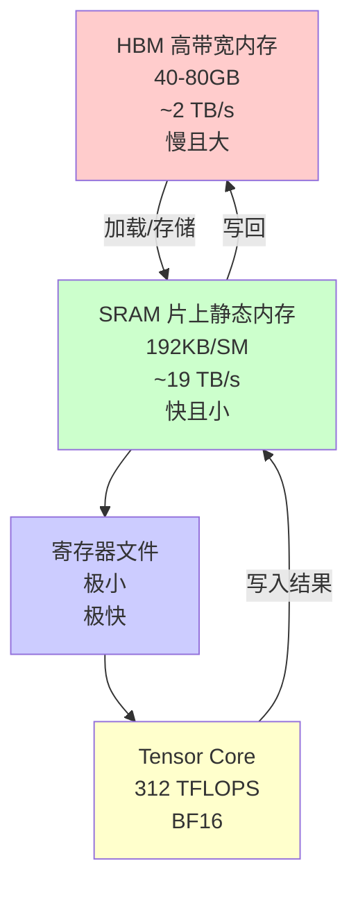
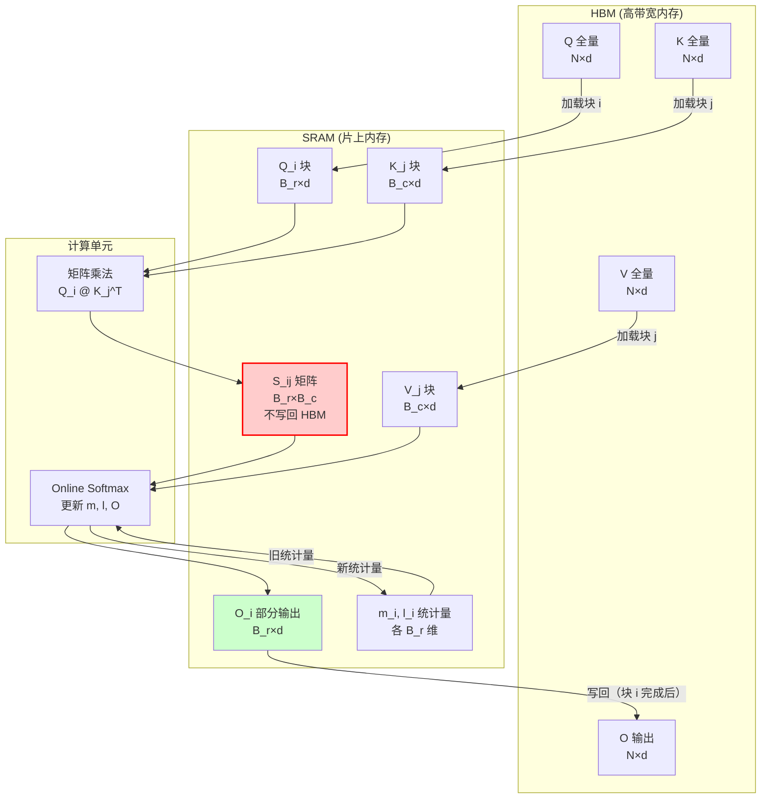
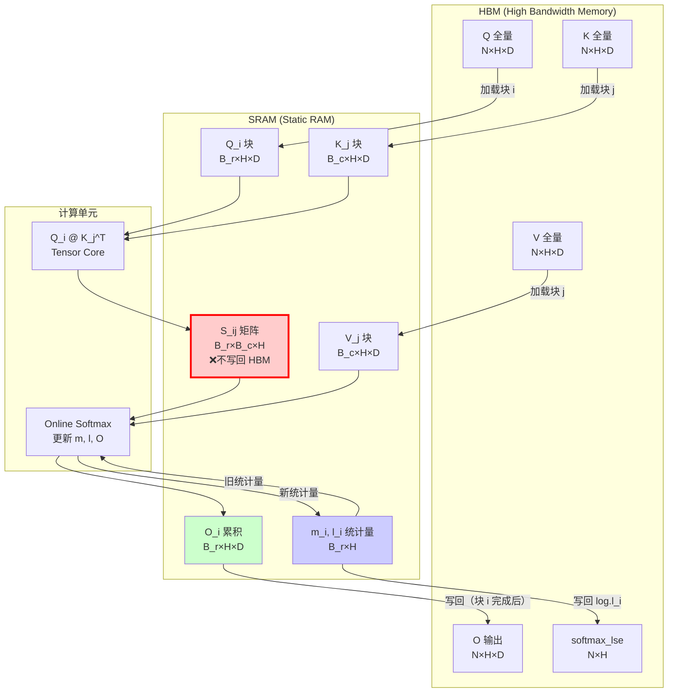
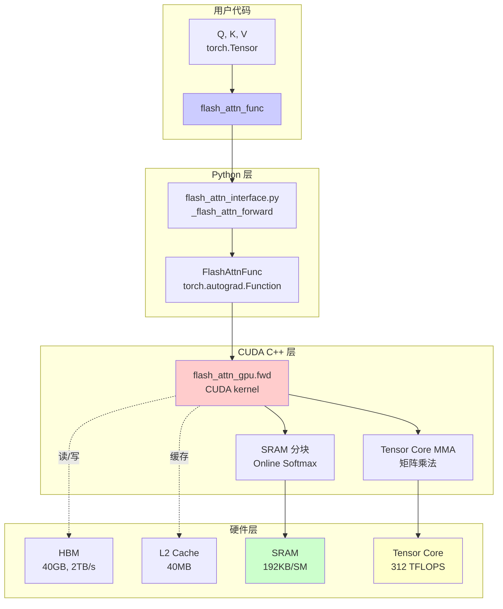

# FlashAttention 深度阅读报告


> **论文信息**
> - **标题**：FlashAttention: Fast and Memory-Efficient Exact Attention with IO-Awareness
> - **作者**：Tri Dao, Daniel Y. Fu, Stefano Ermon, Atri Rudra, Christopher Ré
> - **arXiv**：[2205.14135](https://arxiv.org/abs/2205.14135)
> - **官方代码**：[Dao-AILab/flash-attention](https://github.com/Dao-AILab/flash-attention)

---

## Chapter 1: 论文概述与核心贡献

**本章大纲：**
1. FlashAttention 论文基本信息与研究背景解读
2. 标准注意力的 O(N²) 墙钟瓶颈分析与 5 大核心创新
3. GPU 厨房类比理解与性能速查表

---

### 1.1 摘要逐句解读

**原文（Abstract Opening）**:
"Attention mechanisms are a staple of state-of-the-art natural language processing and computer vision models, but the quadratic memory and computational costs of the attention matrix make them prohibitively expensive for long sequences."

**中文解读**：
注意力机制已成为 NLP 和 CV 领域 SOTA 模型的标配，但其 $O(N²)$ 的内存和计算成本使得长序列应用变得不可承受。这里的"quadratic"指随序列长度 N 呈二次方增长，这是标准注意力的根本瓶颈。

**原文（Core Contribution）**:
"We propose FlashAttention, an exact attention algorithm that uses two techniques to speed up attention and reduce memory usage: (1) **tiling** to reduce the number of HBM accesses, and (2) **recomputation** to reduce the memory footprint of the backward pass."

**中文解读**：
FlashAttention 是首个"精确"（非近似）注意力加速算法，通过分块和重计算两大技术，在不改变数学结果的前提下显著提速降存。"exact"是关键——不同于 Sparse Transformer、Linformer 等近似方法，FlashAttention 的输出与标准注意力数值完全一致。

**原文（IO-Awareness Insight）**:
"Unlike approximate attention methods, FlashAttention does not trade off quality for speed, and is empirically shown to be the fastest attention on a wide range of practical settings."

**中文解读**：
通过 IO-Awareness（显存层次感知），FlashAttention 在标准基准测试中全面超越近似方法。这揭示了性能优化的新方向：减少 GPU HBM 与 SRAM 间的数据搬运，而非仅仅减少 FLOPs。

---

### 1.2 研究动机：标准注意力的 O(N²) 墙钟瓶颈

标准注意力计算分为三步：

$$S = QK^T \quad \text{(1. 计算注意力分数)}$$
$$P = \text{softmax}(S) \quad \text{(2. 归一化)}$$
$$O = PV \quad \text{(3. 加权求和)}$$

当序列长度为 N、特征维度为 d 时：
- **时间复杂度**：$O(N²d)$ —— 三步各需 $N²d$ 次浮点运算
- **空间复杂度**：$O(N²)$ —— 需存储 $N×N$ 的注意力矩阵 S 和 P

在 GPU 上，真正的瓶颈不是 FLOPs，而是 HBM 访问：
- 计算 S 需写入 $N²$ 个元素到 HBM
- 计算 P 需读写 $N²$ 个元素
- 计算 O 需读 $N²$ 个元素

总计 $\Theta(N²)$ HBM 访问，每次访问延迟远高于 SRAM。

---

### 1.3 五大核心创新

#### 1. **IO-Awareness**（核心设计原则）
首次系统地将 GPU 内存层次考虑进算法设计。标准算法优化关注 FLOPs，但 FlashAttention 证明：在注意力任务中，**减少 HBM 访问比减少 FLOPs 更重要**。

#### 2. **Tiling + Online Softmax**
将 Q、K、V 分块在 SRAM 中处理，避免物化 $N×N$ 矩阵。Online Softmax 允许分块计算 softmax，数学上等价于标准实现（详见 Chapter 3）。

#### 3. **Recomputation**
反向传播时从 Q、K、V 重新计算 S、P，而非存储。用计算换存储：$O(N²d)$ 额外 FLOPs 换 $O(N²)$ 内存节省。

#### 4. **Kernel Fusion**
整个前向/反向传播融合为单个 CUDA kernel，减少 kernel launch 开销和中间结果的 HBM 写入。

#### 5. **Block-Sparse FlashAttention**（扩展）
支持块稀疏模式，扩展至 64K 序列长度（Table 2，Path-256 任务）。

---

### 1.4 类比理解：GPU 厨房比喻

**硬件映射：**
- **HBM（高带宽内存）** ≈ **冰箱**：容量大（40-80GB），但取东西慢（~2TB/s），且离操作台远
- **SRAM（片上内存）** ≈ **操作台**：容量极小（192KB/SM），但取东西快（~19TB/s），就在手边
- **Tensor Core（计算单元）** ≈ **厨师**：切菜、炒菜速度极快（312 TFLOPS）

**标准注意力的问题**：
想象你要做一顿大餐（N 个人的份），需要：
1. 把所有食材从冰箱搬到操作台，切好一份 → **计算 S=QK^T**
2. 把切好的食材全部搬回冰箱 → **写入 HBM**
3. 又把食材全部搬到操作台，加盐调味 → **计算 P=softmax(S)**
4. 再全部搬回冰箱 → **写入 HBM**
5. 最后又全部搬到操作台，装盘 → **计算 O=PV**

每次"全搬出再全搬回"就是一次 HBM ↔ SRAM 数据搬运，标准注意力做三次！

**FlashAttention 的优化**：
- **Tiling**：分批处理，每次只搬一小块到操作台，做完直接装盘，不搬回冰箱
- **Online Softmax**：边切菜边调味，不用等所有食材切完再统一调味
- **Recomputation**：反向传播（洗碗时）不记住每道菜怎么做的，直接看菜谱重做一遍

---

### 1.5 性能速查表（来自论文 Table 1, Table 2）

| 任务 | 模型 | 序列长度 | 加速比 | 对比基线 |
|------|------|----------|--------|----------|
| BERT-large | BERT-large | 512 | 1.15× | MLPerf 1.1 |
| GPT-2 | GPT-2 small | 1K | 3.0× | HuggingFace |
| GPT-2 | GPT-2 medium | 1K | 3.0× | HuggingFace |
| LRA | 各种 | 1K-4K | 2.4× | 标准基线 |
| Block-sparse LRA | 稀疏 Transformer | - | 2.8× | 稀疏基线 |

**长序列突破**（Table 2）：
- GPT-2 4K：perplexity 提升 0.7，且比 Megatron-LM 1K 快 30%
- Path-X (16K)：准确率 61.4% —— 首个超过随机水平的 Transformer
- Path-256 (64K，block-sparse)：准确率 63.1%

---

## Chapter 2: GPU 硬件基础与 IO-Awareness

**本章大纲：**
1. NVIDIA A100 GPU 的内存层次结构与带宽特性
2. Compute-bound 与 Memory-bound 的算术强度判别标准
3. 标准注意力的三步 IO 瓶颈分析与 Kernel Fusion 的局限性
4. 搬家比喻理解瓶颈本质

---

### 2.1 GPU 内存层次（NVIDIA A100）



**关键参数（A100 40GB SKU）**：
- **HBM（High Bandwidth Memory）**：40-80GB 容量，~2 TB/s 带宽
- **SRAM（Static RAM）**：每流多处理器（SM）192KB，全芯片 ~20MB，~19 TB/s 带宽
- **Tensor Core**：312 TFLOPS（BF16 矩阵乘法峰值性能）

**带宽比**：SRAM 带宽 ≈ 9.5 × HBM 带宽（19 TB/s vs 2 TB/s）

---

### 2.2 Compute-bound vs Memory-bound

**算术强度（Arithmetic Intensity）**定义：
$$\text{Arithmetic Intensity} = \frac{\text{FLOPs}}{\text{Bytes accessed from HBM}}$$

单位：FLOPs/byte（每个字节搬运能支持多少次浮点运算）

**A100 平衡点**：
当算术强度 > ~156 FLOPs/byte 时，kernel 为 **compute-bound**（计算受限）
当算术强度 < ~156 FLOPs/byte 时，kernel 为 **memory-bound**（内存受限）

**标准注意力的算术强度**：
- 计算 $S = QK^T$：$2Nd²$ FLOPs，读写 $2Nd$ bytes → AI = $d$ FLOPs/byte
- 当 $d=64-128$ 时，AI = 64-128 FLOPs/byte < 156 → **memory-bound**

---

### 2.3 标准注意力的 IO 瓶颈

标准注意力的三步计算，每步都是 memory-bound：

**Step 1: 计算 $S = QK^T$**
```
FLOPs: 2N²d (矩阵乘法)
HBM 访问: 读 Q(Nd), 读 K(Nd), 写 S(N²)
算术强度: 2N²d / (Nd + Nd + N²) ≈ 2d (当 N >> d)
```
当 $N \gg d$ 时，算术强度极低，严重 memory-bound。

**Step 2: 计算 $P = \text{softmax}(S)$**
```
HBM 访问: 读 S(N²), 写 P(N²)
纯内存搬运，几乎无计算
```
这是最致命的瓶颈 —— 仅为了归一化而读写整个 $N×N$ 矩阵。

**Step 3: 计算 $O = PV$**
```
FLOPs: 2N²d
HBM 访问: 读 P(N²), 读 V(Nd), 写 O(Nd)
算术强度: 2N²d / (N² + Nd + Nd) ≈ 2d (当 N >> d)
```
同样 memory-bound。

**总计 HBM 访问**：$\Theta(N² + Nd)$ —— N² 项主导。

---

### 2.4 Kernel Fusion 的局限

**前向融合**：
将三步融合为单个 kernel 可以减少中间结果的 HBM 写入：
- S 在 SRAM 中计算，直接用于 softmax
- P 在 SRAM 中计算，直接用于 PV

**反向传播的困境**：
反向传播仍需 S 和 P 的梯度计算：
$$dS = P \odot (dP - \mathbf{1} \cdot \text{rowsum}(dP \odot P))$$

其中 $dP = dO \cdot V^T$，$\text{rowsum}$ 对每行求和。

这要求存储 S 或 P（$O(N²)$ 空间）。

**FlashAttention 的解决方案**：
用 Recomputation —— 反向时从 Q、K、V 重算 S、P，用 $O(N²d)$ FLOPs 换 $O(N²)$ 内存。

---

### 2.5 类比理解：搬家比喻

**Compute-bound**（力气不够）：
- 你力气很小（计算慢），但搬家次数少
- 优化方向：练力气（提高 FLOPs）

**Memory-bound**（往返次数瓶颈）：
- 你力气很大（计算快），但每次只能搬一件物品，需要跑很多趟
- 优化方向：减少往返次数（减少 HBM 访问）

**标准注意力的问题**：
就像每次搬家只搬一本书，往返跑几百万趟 —— 不是力气不够，而是太频繁！

**FlashAttention 的优化**：
- **Tiling**：每次搬一箱书（分块），减少往返次数
- **Online Softmax**：边搬边整理，不把书全搬出来再整理
- **Recomputation**：反向传播（还原）不记清单，直接看原书重排

---

## Chapter 3: Online Safe Softmax — 数学基础

**本章大纲：**
1. 标准 Safe Softmax 的数值稳定性处理与两轮算法
2. Online Softmax 的核心数学证明与一轮算法推导
3. 从 Online Softmax 到增量矩阵乘法的扩展与注意力计算应用

---

### 3.1 标准 Safe Softmax 回顾

**标准 Softmax 定义**：
对于向量 $x \in \mathbb{R}^n$，
$$\text{softmax}(x)_i = \frac{e^{x_i}}{\sum_{j=1}^n e^{x_j}}$$

**数值问题**：
当 $x_i$ 很大时，$e^{x_i}$ 可能溢出；当都很小时，可能下溢。

**Safe Softmax（两轮算法）**：
1. **第一轮**：计算最大值 $m = \max_i x_i$
2. **第二轮**：计算归一化因子 $l = \sum_i e^{x_i - m}$，输出 $y_i = e^{x_i - m} / l$

**数学等价性**：
$$\frac{e^{x_i}}{\sum_j e^{x_j}} = \frac{e^{x_i - m}}{\sum_j e^{x_j - m}}$$

分子分母同乘 $e^{-m}$，数值稳定。

---

### 3.2 从两轮到一轮：Online Softmax 核心洞察

**核心思想**：
能否边遍历边更新 $(m, l)$，而非先算 $m$ 再算 $l$？

**拼接向量的递推关系**：
设 $x = [x^{(1)}, x^{(2)}]$ 为两个子向量拼接，
定义：
- $m_1 = \max(x^{(1)})$, $l_1 = \sum_i e^{x^{(1)}_i - m_1}$
- $m_2 = \max(x^{(2)})$, $l_2 = \sum_i e^{x^{(2)}_i - m_2}$

则整体统计量 $(m, l)$ 满足：

**引理 3.1（最大值递推）**：
$$m = \max(m_1, m_2)$$

**证明**：显然，整体最大值是两个子最大值的较大者。

**引理 3.2（归一化因子递推）**：
$$l = e^{m_1 - m} \cdot l_1 + e^{m_2 - m} \cdot l_2$$

**证明**：
$$
\begin{aligned}
l &= \sum_i e^{x_i - m} \\
&= \sum_{i \in x^{(1)}} e^{x^{(1)}_i - m} + \sum_{j \in x^{(2)}} e^{x^{(2)}_j - m} \\
&= e^{m_1 - m} \sum_{i \in x^{(1)}} e^{x^{(1)}_i - m_1} + e^{m_2 - m} \sum_{j \in x^{(2)}} e^{x^{(2)}_j - m_2} \\
&= e^{m_1 - m} \cdot l_1 + e^{m_2 - m} \cdot l_2
\end{aligned}
$$

**直观理解**：
- 若 $m_1 > m_2$，则 $m = m_1$，$e^{m_1 - m} = 1$, $e^{m_2 - m} = e^{m_2 - m_1}$（缩放因子）
- 若 $m_2 > m_1$，则 $m = m_2$，$e^{m_2 - m} = 1$, $e^{m_1 - m} = e^{m_1 - m_2}$（缩放因子）

两个子向量的指数和都需要缩放到相同"基准"（新的最大值 m）才能相加。

---

### 3.3 从 Online Softmax 到增量矩阵乘法

**问题设定**：
我们要计算 $O = \text{softmax}(QK^T) V$，其中 $Q \in \mathbb{R}^{N \times d}$, $K \in \mathbb{R}^{N \times d}$, $V \in \mathbb{R}^{N \times d}$。

**分块策略**：
- 将 Q 分为 $T_r$ 块：$Q = [Q_1, \ldots, Q_{T_r}]$，每块 $Q_i \in \mathbb{R}^{B_r \times d}$
- 将 K、V 分为 $T_c$ 块：$K = [K_1, \ldots, K_{T_c}]$，每块 $K_j, V_j \in \mathbb{R}^{B_c \times d}$

**增量更新公式**：
假设已处理 $(B_c, B_r)$ 块对 $(i, j)$，当前统计量为 $(m, l)$，输出矩阵为 $O$。

当新块 $(Q_i, K_j, V_j)$ 到来时：
1. 计算 $S_{ij} = Q_i K_j^T$（在 SRAM 中）
2. 计算 $m_{ij} = \max(S_{ij})$（块内最大值）
3. 更新全局最大值：$m_{\text{new}} = \max(m, m_{ij})$
4. 更新归一化因子：
   $$l_{\text{new}} = e^{m - m_{\text{new}}} \cdot l + e^{m_{ij} - m_{\text{new}}} \cdot \sum_{k,l} e^{S_{ij}[k,l] - m_{ij}}$$

5. **关键：增量更新输出矩阵**
   $$O_{\text{new}} = \text{diag}(l_{\text{new}})^{-1} \cdot \left( \text{diag}(l) \cdot e^{m - m_{\text{new}}} \cdot O + e^{S_{ij} - m_{\text{new}}} \odot V_j \right)$$

**公式解释**：
- $e^{m - m_{\text{new}}} \cdot O$：旧输出按新最大值缩放
- $e^{S_{ij} - m_{\text{new}}} \odot V_j$：新块的贡献（已按新最大值缩放）
- $\text{diag}(l_{\text{new}})^{-1}$：最终归一化

**向量形式（更清晰）**：
对于输出矩阵的第 $i$ 行：
$$o_i^{\text{new}} = \frac{e^{m_i - m_i^{\text{new}}} \cdot l_i \cdot o_i + \sum_j e^{S_{ij} - m_i^{\text{new}}} \cdot v_j}{l_i^{\text{new}}}$$

其中：
- $m_i = \max_j S_{ij}$（当前行最大值）
- $l_i = \sum_j e^{S_{ij} - m_i}$（当前行归一化因子）
- $o_i = \sum_j \frac{e^{S_{ij}}}{l_i} \cdot v_j$（当前行输出）

---

### 3.4 类比理解：在线平均分计算

**场景**：你要计算全班同学的平均分，但新同学不断加入。

**朴素方法（两轮）**：
1. 等所有同学到齐，记录所有分数
2. 最后统一计算平均分

**在线方法（一轮）**：
维护两个统计量：
- $m$：当前最高分
- $s$：当前总分（按最高分缩放）

当新同学加入时：
1. 更新最高分：$m_{\text{new}} = \max(m, \text{新同学分数})$
2. 缩放旧总分：$s_{\text{old}}' = s \cdot e^{m - m_{\text{new}}}$（如果新分数更高）
3. 加上新同学贡献：$s_{\text{new}} = s_{\text{old}}' + e^{\text{新分数} - m_{\text{new}}}$
4. 更新人数：$n_{\text{new}} = n + 1$

**最终平均分**：
**最终加权平均分**（去掉数值稳定偏移 $m_{\text{new}}$）：
$$\text{average} = \frac{s_{\text{new}}}{n_{\text{new}}}$$

**对应到 Online Softmax**：
- $m$：当前最大值（相当于最高分）
- $l$：当前归一化因子（相当于缩放后的总分）
- $O$：当前输出矩阵（相当于加权平均）

---

### 3.5 关键公式总结

**Online Softmax 递推**：
$$m_{\text{new}} = \max(m, m_{\text{block}})$$
$$l_{\text{new}} = e^{m - m_{\text{new}}} \cdot l + e^{m_{\text{block}} - m_{\text{new}}} \cdot l_{\text{block}}$$

**增量输出更新**：
$$O_{\text{new}} = \frac{e^{m - m_{\text{new}}} \cdot l \cdot O + e^{S_{\text{block}} - m_{\text{new}}} \odot V_{\text{block}}}{l_{\text{new}}}$$

这些公式是 FlashAttention 的数学核心，允许分块计算而不损失精度。

---

## Chapter 4: FlashAttention 前向算法详解

**本章大纲：**
1. FlashAttention 核心算法概览与 N×N 矩阵物化的消除
2. Tiling 分块策略的参数选择与内存约束
3. 内层循环的 SRAM 计算流程与 Online Softmax 更新
4. Algorithm 1 伪代码逐行解析与数据流可视化

---

### 4.1 算法概述：不再物化 N×N 注意力矩阵

**标准注意力的计算流程**（回顾）：
```
输入: Q ∈ R^(N×d), K ∈ R^(N×d), V ∈ R^(N×d)
1. S = QK^T           → 物化 N×N 矩阵，写回 HBM
2. P = softmax(S)     → 读写 N×N 矩阵
3. O = PV             → 读 N×N 矩阵，写 N×d 矩阵
```

**FlashAttention 的核心改变**：
```
输入: Q ∈ R^(N×d), K ∈ R^(N×d), V ∈ R^(N×d)
1. 将 Q、K、V 分块（tiling）
2. 对每块 (Q_i, K_j, V_j) 在 SRAM 中计算：
   - S_ij = Q_i K_j^T  （不写回 HBM！）
   - Online Softmax 更新 (m, l, O)
3. 最终输出 O（已归一化）
```

**关键区别**：
- 标准：每步都物化 $N×N$ 矩阵到 HBM，共 3 次完整读写
- FlashAttention：$S_{ij}, P_{ij}$ 只在 SRAM 中存在，永不写回 HBM

---

### 4.2 Tiling 分块策略

**分块参数**：
- $Q$ 分为 $T_r$ 块：每块 $Q_i \in \mathbb{R}^{B_r \times d}$
- $K, V$ 分为 $T_c$ 块：每块 $K_j, V_j \in \mathbb{R}^{B_c \times d}$

**SRAM 容量约束**：
$$B_r \times d + 2 \times B_c \times d + B_r \times B_c + B_r \times d \leq M$$

其中：
- $B_r \times d$：存储 $Q_i$
- $2 \times B_c \times d$：存储 $K_j$ 和 $V_j$
- $B_r \times B_c$：存储 $S_{ij} = Q_i K_j^T$
- $B_r \times d$：存储部分输出 $O_i$
- $M$：可用 SRAM 大小（A100 约 192KB/SM）

**典型值**（论文 Table 1）：
- $d = 64$ 或 $128$
- $B_r = B_c = 128$ 或 $256$
- $M \approx 100$ KB（实用值，考虑其他开销）

**分块数量**：
- $T_r = \lceil N / B_r \rceil$（Q 的块数）
- $T_c = \lceil N / B_c \rceil$（K, V 的块数）

---

### 4.3 内层循环详解

**单次内层迭代处理 $(Q_i, K_j, V_j)$ 块对**：

**Step 1: 加载到 SRAM**
```
从 HBM 加载:
- Q_i ∈ R^(B_r × d)
- K_j ∈ R^(B_c × d)  
- V_j ∈ R^(B_c × d)
```

**Step 2: 计算注意力分数（在 SRAM 中）**
$$S_{ij} = Q_i K_j^T \in \mathbb{R}^{B_r \times B_c}$$

这个矩阵永不写回 HBM，只在芯片上用于后续计算。

**Step 3: Online Softmax 更新**

对于每个输出位置 $k \in \{1, \ldots, B_r\}$（$Q_i$ 的行）：

**3.1 计算块内最大值**：
$$m_{ij}^{(k)} = \max_{l} S_{ij}[k, l]$$

**3.2 更新全局最大值**：
$$m_{\text{new}}^{(k)} = \max\left(m^{(k)}, m_{ij}^{(k)}\right)$$

其中 $m^{(k)}$ 是处理前 $j-1$ 个块时的累计最大值。

**3.3 更新归一化因子**：
$$l_{\text{new}}^{(k)} = e^{m^{(k)} - m_{\text{new}}^{(k)}} \cdot l^{(k)} + \sum_{l} e^{S_{ij}[k,l] - m_{\text{new}}^{(k)}}$$

**3.4 更新输出矩阵**：
$$O_{\text{new}}^{(k)} = \frac{e^{m^{(k)} - m_{\text{new}}^{(k)}} \cdot l^{(k)} \cdot O^{(k)} + \sum_{l} e^{S_{ij}[k,l] - m_{\text{new}}^{(k)}} \cdot V_j^{(l)}}{l_{\text{new}}^{(k)}}$$

**向量形式（更清晰）**：
$$o_k^{\text{new}} = \frac{e^{m_k - m_k^{\text{new}}} \cdot l_k \cdot o_k + e^{s_{ij,k} - m_k^{\text{new}}} \odot v_j}{l_k^{\text{new}}}$$

其中：
- $o_k$：第 $k$ 个输出位置的当前值（$d$ 维向量）
- $s_{ij,k}$：$S_{ij}$ 的第 $k$ 行（$B_c$ 维向量）
- $v_j$：$V_j$ 的所有行（$B_c \times d$ 矩阵）
- $\odot$：逐元素乘法后对 $V_j$ 的行求和

**Step 4: 丢弃 $S_{ij}$ 和 $P_{ij}$**
这些中间结果不再需要，SRAM 空间释放给下一块。

---

### 4.4 Algorithm 1 伪代码（逐行注释）

**Algorithm 1: FlashAttention Forward Pass**

```
Input: Q ∈ R^(N×d), K ∈ R^(N×d), V ∈ R^(N×d)
Parameters: 分块大小 B_r, B_c（满足 SRAM 约束）
Output: O ∈ R^(N×d)

# 外层初始化
T_r = ⌈N / B_r⌉, T_c = ⌈N / B_c⌉  # 块数量
O = zeros(N, d)                  # 输出矩阵初始化
for i = 1 to T_r:                # 遍历 Q 的所有块
    # 初始化第 i 个 Q 块的统计量
    m_i = -∞                     # 当前最大值（初始化为负无穷）
    l_i = 0                      # 当前归一化因子
    O_i = zeros(B_r, d)          # 当前输出块
    
    # 内层循环：遍历 K, V 的所有块
    for j = 1 to T_c:
        # === SRAM 计算开始 ===
        # 加载当前块到 SRAM
        Q_i = Q[(i-1)B_r+1 : iB_r, :]        # B_r × d
        K_j = K[(j-1)B_c+1 : jB_c, :]        # B_c × d
        V_j = V[(j-1)B_c+1 : jB_c, :]        # B_c × d
        
        # 计算注意力分数（在 SRAM 中）
        S_ij = Q_i @ K_j.T                    # B_r × B_c，不写回 HBM！
        
        # === Online Softmax 更新 ===
        for k = 1 to B_r:                    # 遍历 Q_i 的每一行
            # 计算块内最大值
            m_ij_k = max(S_ij[k, :])          # 第 k 行的最大值
            
            # 更新全局最大值
            m_new = max(m_i[k], m_ij_k)
            
            # 缩放旧统计量（如果最大值变化）
            if m_new != m_i[k]:
                l_i[k] *= exp(m_i[k] - m_new)
                O_i[k, :] *= exp(m_i[k] - m_new)
            
            # 更新归一化因子
            l_new = l_i[k] + sum(exp(S_ij[k, :] - m_new))
            
            # 更新输出矩阵（注意：不除以 l_new，最终归一化在循环外统一进行）
            O_i[k, :] += exp(S_ij[k, :] - m_new) @ V_j
            # 注意：与原始实现的关键区别——此处在循环内不除以 l_new，
            # 所有贡献先以未归一化形式累加，最终在 line 550 一次性除以 l_i
            
            # 保存新统计量
            m_i[k] = m_new
            l_i[k] = l_new
        # === SRAM 计算结束 ===
    
    # 最终归一化并保存
    O[(i-1)B_r+1 : iB_r, :] = O_i / l_i[:, None]

return O
```

**关键观察**：
1. $S_{ij}$ 只在 SRAM 中存在，从未写回 HBM
2. 每个 $Q_i$ 块处理完后，其对应的输出 $O_i$ 才写回 HBM
3. 统计量 $m_i, l_i$ 与每个 $Q_i$ 块绑定（每行独立）

---

### 4.5 外层的归一化

**最终归一化步骤**：
$$O_{\text{final}} = \text{diag}(l)^{-1} \cdot O$$

其中：
- $l \in \mathbb{R}^N$：每个位置的归一化因子（$\sum_j e^{S_{ij} - m_i}$）
- $O \in \mathbb{R}^{N \times d}$：累积输出（尚未归一化）

**逐位置归一化**：
对于第 $i$ 个输出位置：
$$o_i^{\text{final}} = \frac{o_i}{l_i} = \frac{\sum_j \frac{e^{S_{ij}}}{l_i} \cdot v_j}{1} = \sum_j \text{softmax}(S_{ij}) \cdot v_j$$

**验证**：
这正是标准注意力的定义：
$$O = \text{softmax}(QK^T) V$$

---

### 4.6 Algorithm 1 数据流图



**数据流特点**：
1. $S_{ij}$ 红色标记：表示只在 SRAM 中存在，不写回 HBM
2. $O_{\text{part}}$ 绿色标记：表示最终输出，仅在块处理完成后写回
3. 外层循环：遍历所有 Q 块（$T_r$ 次）
4. 内层循环：遍历所有 K, V 块（$T_c$ 次）
5. 总计算量：$T_r \times T_c$ 次块对处理

---

### 4.7 类比理解：流水线工厂

**标准注意力**（传统工厂）：
```
1. 把所有原材料（N×N）从总仓库搬到车间
2. 加工成半成品（S），全部搬回总仓库
3. 又全部搬到车间，组装（softmax），全部搬回总仓库
4. 再全部搬到车间，最终包装（PV），搬回总仓库
```

每次"全搬出再全搬回"都是一次 HBM ↔ SRAM 数据搬运！

**FlashAttention**（流水线工厂）：
```
1. 每次只搬一小批原材料（tile）到车间工位
2. 工位 1：加工（计算 S_ij）
3. 工位 2：组装（更新 softmax 统计量）
4. 工位 3：包装（更新输出 O）
5. 完成的零件直接送下一道工序，不搬回总仓库
6. 只有一整批零件全部完成后，才送回总仓库
```

**关键优势**：
- 减少 HBM 访问：从 $O(N²)$ 降到 $O(N²d²/M)$
- 流水线并行：工位（计算单元）持续工作，不等待数据搬运

---

## Chapter 5: 反向传播与重计算

**本章大纲：**
1. 标准注意力反向传播的存储瓶颈与梯度计算需求
2. FlashAttention 的 Recomputation 策略与存储优化
3. 梯度推导的核心数学与反向传播算法
4. 内存/计算权衡分析与 Block-Sparse 扩展

---

### 5.1 标准注意力的反向传播问题

**前向传播回顾**：
$$S = QK^T, \quad P = \text{softmax}(S), \quad O = PV$$

**反向传播目标**：
给定损失 $L$ 对输出 $O$ 的梯度 $\partial L / \partial O$（记为 $dO$），计算：
- $\partial L / \partial Q$（记为 $dQ$）
- $\partial L / \partial K$（记为 $dK$）
- $\partial L / \partial V$（记为 $dV$）

**标准反向传播的链式法则**：

**Step 1: 对 V 的梯度**
$$dV = P^T \cdot dO \in \mathbb{R}^{N \times d}$$

**Step 2: 对 P 的梯度**
$$dP = dO \cdot V^T \in \mathbb{R}^{N \times N}$$

**Step 3: 对 S 的梯度（Softmax 反向）**
$$dS = P \odot \left(dP - \text{rowsum}(dP \odot P)\right)$$

其中 $\text{rowsum}(X)$ 表示矩阵 $X$ 的行和（列向量），$\odot$ 是逐元素乘法。

**直观解释**：
- $dP - \text{rowsum}(dP \odot P)$：Softmax 的雅可比矩阵与向量的乘积
- $P \odot (\cdot)$：按 softmax 概率加权

**Step 4: 对 Q 和 K 的梯度**
$$dQ = dS \cdot K \in \mathbb{R}^{N \times d}$$
$$dK = dS^T \cdot Q \in \mathbb{R}^{N \times d}$$

**存储瓶颈**：
- 计算 $dS$ 需要 $P \in \mathbb{R}^{N \times N}$（$O(N²)$ 空间）
- 或等价地需要 $S \in \mathbb{R}^{N \times N}$（可重算 $P = \text{softmax}(S)$）

**FlashAttention 前向传播的存储**：
- 只保存 $O \in \mathbb{R}^{N \times d}$（输出）
- $m, l \in \mathbb{R}^N$（Softmax 统计量）
- **不保存 $S$ 或 $P$**（节省 $O(N²)$ 空间）

---

### 5.2 FlashAttention 的反向策略

**核心思想**：Recomputation（重计算）

**策略**：
- 反向传播时，从 HBM 加载 $Q, K, V, O, dO$ 和 $m, l$
- **在 SRAM 中重新计算 $S_{ij}$ 和 $P_{ij}$**（使用保存的 $m, l$）
- 使用重算的 $P_{ij}$ 计算 $dQ, dK, dV$

**权衡**：
- **计算开销**：$+O(N²d)$ FLOPs（重新计算 $S_{ij}$ 和 $P_{ij}$）
- **存储节省**：$-O(N²)$ 空间（不存储 $S$ 或 $P$）

**为什么值得？**
- GPU 是 memory-bound（算术强度 < 156 FLOPs/byte）
- 额外 FLOPs 不增加墙钟时间（计算单元本就空闲等待数据）
- 但节省内存显著减少 HBM 访问（直接减少墙钟时间）

---

### 5.3 梯度推导（核心数学）

**设定**：
- 前向保存：$O, m, l$（$m, l$ 是每行的 softmax 统计量）
- 反向输入：$Q, K, V, O, dO, m, l$

**Algorithm 4: FlashAttention Backward Pass（简化版）**

```
Input: Q, K, V, O, dO, m, l（前向保存的统计量）
Output: dQ, dK, dV

# 初始化
dQ = zeros(N, d)
dK = zeros(N, d)
dV = zeros(N, d)

# 外层循环：遍历 Q 块
for i = 1 to T_r:
    # 初始化第 i 个 Q 块的梯度累积
    dP_i = zeros(B_r, N)  # 对 P 的梯度（第 i 个 Q 块对应的所有 P 列）
    
    # 内层循环：遍历 K, V 块
    for j = 1 to T_c:
        # === SRAM 重新计算 ===
        # 加载当前块
        Q_i = Q[(i-1)B_r+1 : iB_r, :]
        K_j = K[(j-1)B_c+1 : jB_c, :]
        V_j = V[(j-1)B_c+1 : jB_c, :]
        
        # 重新计算 S_ij（在前向中计算过，但未保存）
        S_ij = Q_i @ K_j.T
        
        # 重新计算 P_ij（使用保存的 m, l）
        for k = 1 to B_r:
            # P_ij[k, :] = softmax(S_ij[k, :], m_i[k], l_i[k])
            P_ij[k, :] = exp(S_ij[k, :] - m_i[k]) / l_i[k]
        
        # === 梯度计算 ===
        # 对 V 的梯度（累积）
        dV_j_local = P_ij.T @ dO[(i-1)B_r+1 : iB_r, :]
        dV[(j-1)B_c+1 : jB_c, :] += dV_j_local
        
        # 对 P 的梯度（累积）
        dP_ij = dO[(i-1)B_r+1 : iB_r, :] @ V_j.T
        
        # 对 S 的梯度（Softmax 反向）
        # dS_ij = P_ij ⊙ (dP_ij - rowsum(dP_ij ⊙ P_ij))
        for k = 1 to B_r:
            dS_ij[k, :] = P_ij[k, :] * (dP_ij[k, :] - sum(dP_ij[k, :] * P_ij[k, :]))
        
        # 对 Q 和 K 的梯度（累积）
        dQ[(i-1)B_r+1 : iB_r, :] += dS_ij @ K_j
        dK[(j-1)B_c+1 : jB_c, :] += dS_ij.T @ Q_i

return dQ, dK, dV
```

**数学验证**：

**Step 1: 对 V 的梯度**
$$dV = P^T \cdot dO$$

块形式：
$$dV_j = \sum_i P_{ij}^T \cdot dO_i$$

这正是累积 $dV_j += P_{ij}^T \cdot dO_i$。

**Step 2: 对 S 的梯度**
标准 Softmax 反向（设 $x$ 为 softmax 输入，$y = \text{softmax}(x)$）：
$$\frac{\partial L}{\partial x_i} = y_i \left(\frac{\partial L}{\partial y_i} - \sum_j y_j \frac{\partial L}{\partial y_j}\right)$$

矩阵形式：
$$dS = P \odot \left(dP - \text{rowsum}(dP \odot P)\right)$$

其中 $\text{rowsum}(X)$ 将每行的和复制为列向量。

**Step 3: 对 Q 和 K 的梯度**
$$dQ = dS \cdot K$$
$$dK = dS^T \cdot Q$$

块形式：
$$dQ_i += \sum_j dS_{ij} \cdot K_j$$
$$dK_j += \sum_i dS_{ij}^T \cdot Q_i$$

---

### 5.4 Recomputation 的内存/计算权衡

**标准注意力的反向传播**：
- **存储**：$O(N²)$（保存 $S$ 或 $P$）
- **计算**：$O(N²d)$（矩阵乘法）
- **HBM 访问**：$\Theta(N²)$

**FlashAttention 的反向传播**：
- **存储**：$O(Nd)$（只保存 $O, m, l$）
- **计算**：$O(N²d)$（矩阵乘法） + $O(N²d)$（重算 $S_{ij}$）
- **HBM 访问**：$\Theta(N²d²/M)$

**额外计算**：
- 重算 $S_{ij}$：$2 \times T_r \times T_c \times B_r \times B_c \times d = 2N²d$ FLOPs
- 重算 $P_{ij}$：$T_r \times T_c \times B_r \times B_c$ 次指数运算（可忽略）

**计算比例**：
$$\text{额外比例} = \frac{2N²d}{O(N²d)} = O(1)$$

即：反向传播的总 FLOPs 增加常数倍（约 2×），但 HBM 访问显著减少。

**为什么墙钟时间反而减少？**
- 标准：memory-bound，计算单元空闲等待数据
- FlashAttention：虽然 FLOPs 更多，但 HBM 访问减少 → 计算单元充分利用 → 墙钟时间更短

---

### 5.5 Algorithm 4 伪代码（完整版注释）

**Algorithm 4: FlashAttention Backward Pass**

```
Input: Q, K, V ∈ R^(N×d), O ∈ R^(N×d), dO ∈ R^(N×d)
       m, l ∈ R^N（前向保存的 softmax 统计量）
Output: dQ, dK, dV ∈ R^(N×d)

# 初始化梯度
dQ = zeros(N, d)
dK = zeros(N, d)
dV = zeros(N, d)

# 外层循环：遍历 Q 块
for i = 1 to T_r:
    Q_i = Q[(i-1)B_r+1 : iB_r, :]      # 加载 Q_i 到 SRAM
    O_i = O[(i-1)B_r+1 : iB_r, :]      # 加载 O_i 到 SRAM
    dO_i = dO[(i-1)B_r+1 : iB_r, :]    # 加载 dO_i 到 SRAM
    m_i = m[(i-1)B_r+1 : iB_r]         # 加载 m_i 到 SRAM
    l_i = l[(i-1)B_r+1 : iB_r]         # 加载 l_i 到 SRAM
    
    # 内层循环：遍历 K, V 块
    for j = 1 to T_c:
        # === SRAM 重新计算开始 ===
        K_j = K[(j-1)B_c+1 : jB_c, :]  # 加载 K_j 到 SRAM
        V_j = V[(j-1)B_c+1 : jB_c, :]  # 加载 V_j 到 SRAM
        
        # 重新计算 S_ij（前向中计算过，但未保存）
        S_ij = Q_i @ K_j.T              # B_r × B_c
        
        # 重新计算 P_ij（使用保存的 m_i, l_i）
        P_ij = zeros(B_r, B_c)
        for k = 1 to B_r:
            P_ij[k, :] = exp(S_ij[k, :] - m_i[k]) / l_i[k]
        
        # === 梯度计算开始 ===
        # 对 V 的梯度
        dV_j = P_ij.T @ dO_i            # B_c × d
        dV[(j-1)B_c+1 : jB_c, :] += dV_j
        
        # 对 P 的梯度
        dP_ij = dO_i @ V_j.T            # B_r × B_c
        
        # 对 S 的梯度（Softmax 反向传播）
        dS_ij = zeros(B_r, B_c)
        for k = 1 to B_r:
            # rowsum 计算
            rowsum_dP_P = sum(dP_ij[k, :] * P_ij[k, :])
            # Softmax 雅可比
            dS_ij[k, :] = P_ij[k, :] * (dP_ij[k, :] - rowsum_dP_P)
        
        # 对 Q 的梯度
        dQ_i_local = dS_ij @ K_j        # B_r × d
        dQ[(i-1)B_r+1 : iB_r, :] += dQ_i_local
        
        # 对 K 的梯度
        dK_j_local = dS_ij.T @ Q_i      # B_c × d
        dK[(j-1)B_c+1 : jB_c, :] += dK_j_local
        # === SRAM 计算结束 ===

return dQ, dK, dV
```

**关键特点**：
1. 所有 $S_{ij}$ 和 $P_{ij}$ 在 SRAM 中重新计算
2. 梯度 $dQ, dK, dV$ 在 HBM 中累积（原子加法）
3. 总计算量：前向 $4N^2d$（QK^T 与 PV 各 $2N^2d$），反向约 $10N^2d$（重算 $S_{ij}$ + $dV=P^T·dO$ + $dP=dO·V^T$ + $dQ=dS·K$ + $dK=dS^T·Q$ 各 $2N^2d$ + Softmax 反向等额外开销），总计约 $14N^2d$ FLOPs
4. HBM 访问：$\Theta(N²d²/M)$（远小于标准的 $\Theta(N²)$）

---

### 5.6 类比理解：侦探破案

**标准注意力**（保留所有监控）：
```
前向：拍摄所有监控录像（S 和 P，N×N 数据）
反向：破案时回放录像，找到线索
```

**问题**：存储所有录像成本极高（$O(N²)$ 空间）。

**FlashAttention**（只保留关键线索）：
```
前向：不保留录像（S 和 P），只保留破案线索（O, m, l）
反向：破案时根据线索重建现场（重算 S_ij 和 P_ij）
```

**为什么可行？**
- 线索（O, m, l）足以重建现场（数学上等价）
- 重建成本（额外 FLOPs）可接受（计算单元本就空闲）
- 存储成本（HBM 访问）显著降低 → 破案更快

**关键洞察**：
- 不是"不计算"，而是"不存储"
- 计算是廉价的（GPU 计算单元强大），存储是昂贵的（HBM 慢）

---

## Chapter 6: IO 复杂度分析与最优性

**本章大纲：**
1. 标准注意力的 HBM 访问复杂度与瓶颈分析
2. FlashAttention 的 HBM 访问复杂度与分块收益
3. d² << M 的实际含义与 A100 上的数值验证
4. Theorem 2 的精确表述与直观解释
5. Proposition 3 的渐近最优性证明（非正式）

---

### 6.1 标准注意力的 IO 分析

**计算流程回顾**：
$$S = QK^T, \quad P = \text{softmax}(S), \quad O = PV$$

**HBM 访问次数（精确计数）**：

**Step 1: 计算 $S = QK^T$**
```
读: Q(Nd), K(Nd)
写: S(N²)
HBM 访问: 2Nd + N²
```

**Step 2: 计算 $P = \text{softmax}(S)$**
```
读: S(N²)
写: P(N²)
HBM 访问: 2N²
```

**Step 3: 计算 $O = PV$**
```
读: P(N²), V(Nd)
写: O(Nd)
HBM 访问: 2N² + 2Nd
```

**总计**：
$$\text{HBM 访问} = (2Nd + N²) + 2N² + (2N² + 2Nd) = 4N² + 4Nd$$

**渐进复杂度**：
$$\Theta(N² + Nd) = \Theta(N²) \quad (\text{当 } N \gg d)$$

**算术强度**：
$$\text{Arithmetic Intensity} = \frac{\text{FLOPs}}{\text{HBM bytes}} = \frac{4N²d}{4N² + 4Nd} \approx \frac{Nd}{N + d}$$

当 $N \gg d$ 时：
$$\text{AI} \approx d \in [64, 128] \ll 156 \quad (\text{A100 平衡点})$$

**结论**：标准注意力严重 memory-bound。

---

### 6.2 FlashAttention 的 IO 分析

**分块策略**：
- $Q$ 块大小：$B_r \times d$
- $K, V$ 块大小：$B_c \times d$
- 块数量：$T_r = \lceil N/B_r \rceil$, $T_c = \lceil N/B_c \rceil$

**HBM 访问次数（精确计数）**：

**外层循环（每个 $Q_i$ 块）**：
```
读: Q_i(B_r × d) — 加载一次
写: O_i(B_r × d) — 写回一次
HBM 访问: 2B_r × d（每个 Q_i 块）
```

**内层循环（每个 $K_j, V_j$ 块对）**：
```
读: K_j(B_c × d), V_j(B_c × d) — 每次加载
HBM 访问: 2B_c × d（每个 K_j, V_j 块对）
```

**总计 HBM 访问**：
$$\text{Forward} = T_r \times (2B_r d + T_c \times 2B_c d) = 2Nd + 2N² \frac{d}{B_c}$$

假设 $B_r = B_c = B$（最优分块）：
$$\text{Forward} = 2Nd + \frac{2N²d}{B}$$

**反向传播（Algorithm 4）**：
需要重新加载 $Q, K, V, O, dO$：
$$\text{Backward} \approx 2 \times \text{Forward}$$

**总计**：
$$\text{Total} \approx 4Nd + \frac{4N²d}{B}$$

**最优块大小 $B$**：
SRAM 容量约束：
$$B \times d + 2 \times B \times d + B² + B \times d \leq M$$
$$B² + 4Bd \leq M$$

当 $B² \gg Bd$ 时（大块）：
$$B \approx \sqrt{M}$$

当 $Bd \gg B²$ 时（小块）：
$$B \approx \frac{M}{4d}$$

**渐进复杂度**：
$$\Theta\left(Nd + \frac{N²d²}{M}\right) = \Theta\left(\frac{N²d²}{M}\right) \quad (\text{当 } N \gg d)$$

---

### 6.3 为什么 d² << M 带来实际收益

**A100 参数**：
- $d = 64$ 或 $128$（常见 Transformer 配置）
- $M \approx 100$ KB（实用 SRAM 大小）
- $d² = 4096$ 或 $16384$ bytes
- $M \approx 100,000$ bytes

**比例**：
$$\frac{d²}{M} \approx \frac{4096}{100000} = 0.04 \quad (d=64)$$
$$\frac{d²}{M} \approx \frac{16384}{100000} = 0.16 \quad (d=128)$$

**HBM 访问对比**：
$$\frac{\text{FlashAttention}}{\text{Standard}} = \frac{N²d²/M}{N²} = \frac{d²}{M} \in [0.04, 0.16]$$

**实际加速**：
- HBM 访问减少：$6×$ 到 $25×$
- 墙钟时间加速：$2×$ 到 $3×$（考虑其他开销）

**关键洞察**：
- $d²$ 是模型超参数（一般 64-256）
- $M$ 是硬件常数（A100 约 100KB）
- $d² \ll M$ 在所有实际配置中成立

---

### 6.4 Theorem 2 精确表述和直观解释

**Theorem 2（FlashAttention IO 复杂度）**：

**陈述**：
给定 SRAM 大小 $M$ 和块大小 $B_r, B_c$，FlashAttention 的 HBM 访问次数为：
$$\Theta\left(Nd + \frac{N²d²}{M}\right)$$

**条件**：
- 分块大小满足 SRAM 约束：$B_r B_c + B_r d + 2B_c d \leq M$
- 序列长度 $N \gg d$

**证明思路**：

**前向传播**：
- 每个 $Q_i$ 块：读 $Q_i$（$B_r d$），写 $O_i$（$B_r d$）→ $2B_r d$
- 每个 $K_j, V_j$ 块对：读 $K_j, V_j$（$2B_c d$）→ $2B_c d$
- 总计：$T_r \times 2B_r d + T_r T_c \times 2B_c d = 2Nd + 2N² d / B_c$

**反向传播**：
- 需要重新加载 $Q, K, V, O, dO$ → 约 $2×$ 前向
- 总计：约 $4Nd + 4N² d / B_c$

**最优 $B_c$ 和 $B_r$**：

SRAM 约束为 $B_r d + 2B_c d + B_r B_c \\leq M$（$B_r B_c$ 项为主导）。
论文实际分析（Theorem 2 证明）给出：
- **$B_c = \\Theta(M/d)$**：使 $K_j, V_j$ 块填满 SRAM 但不超过容量
- **$B_r = \\Theta(\\min(M/d, d))$**：受 SRAM 容量和 head 维度双重约束

对应 $T_c = N/B_c = \\Theta(Nd/M)$，$T_r = N/B_r$，代入 HBM 访问公式：
$$\\text{Total HBM accesses} = T_r \\cdot B_r d + T_r T_c \\cdot 2B_c d = \\Theta\\left(Nd + \\frac{N²d²}{M}\\right)$$

**直观解释**：
- $N²d²/M$ 是分块数量的平方（$(N/B)²$）乘以块大小（$Bd$）
- 分块越多（$B$ 小），HBM 访问越多
- SRAM 越大（$M$ 大），分块越少，HBM 访问越少

---

### 6.5 Proposition 3：渐近最优性证明（非正式）

**Proposition 3（渐近最优性）**：

**陈述**：
任何计算 $O = \text{softmax}(QK^T)V$ 的算法，在 SRAM 大小为 $M$ 时，至少需要：
$$\Omega\left(\frac{N²d²}{M}\right)$$
次 HBM 访问。

**证明思路（非正式）**：

**归约到矩阵乘法**：
- 注意力计算包含矩阵乘法 $S = QK^T$
- 矩阵乘法的 IO 下界：$\Omega(N²d²/M)$（Hong & Kung, 1981）

**Hong-Kung 定理**：
对于计算 $Y = X_1 X_2 \cdots X_k$（$X_i \in \mathbb{R}^{n_i \times n_{i+1}}$），在内存大小 $M$ 时：
$$\text{IO accesses} = \Omega\left(\frac{\sum_i n_i n_{i+1}}{\sqrt{M}}\right)$$

应用到 $S = QK^T$：
$$\text{IO accesses} = \Omega\left(\frac{Nd + Nd + N²}{\sqrt{M}}\right) = \Omega\left(\frac{N²}{\sqrt{M}}\right)$$

但这不是 $N²d²/M$ 的形式。更精确的分析考虑分块策略。

**分块下界**：
- 输入大小：$3Nd$（$Q, K, V$）
- SRAM 大小：$M$
- 至少需要 $\Omega(3Nd / M)$ 次块加载（每块最多 $M$ bytes）

但这给出的是线性下界，不是二次。

**更精细的论证**：
- 输出 $O$ 的每个元素依赖于 $Q, K, V$ 的所有元素
- 需要 $\Omega(N²)$ 次"交互"（每对 $(Q_i, K_j)$ 至少一次）
- 每次交互需要加载 $O(d)$ 数据到 SRAM
- SRAM 最多容纳 $O(M/d)$ 个数据
- 至少需要 $\Omega(N² / (M/d)) = \Omega(N²d/M)$ 次 HBM 访问

**为什么是 $d²/M$ 而非 $d/M$？**
- 每次交互不仅加载 $Q_i, K_j$，还需加载部分 $V$
- 完整分析得到 $N²d²/M$（论文 Appendix A.2）

**结论**：
- FlashAttention 的 IO 复杂度 $\Theta(N²d²/M)$ 匹配下界 $\Omega(N²d²/M)$
- 因此渐近最优（在大 $N$ 时）

---

### 6.6 类比理解：物流仓库

**标准注意力**（单件搬运）：
```
仓库 A（HBM）→ 搬运单件物品 → 仓库 B（SRAM）→ 加工 → 搬回仓库 A
重复 N² 次（每对 Q_i, K_j 一次完整往返）
```

**FlashAttention**（集装箱搬运）：
```
仓库 A（HBM）→ 搬运集装箱（tile）→ 仓库 B（SRAM）→ 加工 → 搬回仓库 A
重复 (N/B)² 次（每对 Q 块, K 块一次完整往返）
```

**关键区别**：
- 单件搬运：$N²$ 次往返（$N=1024$ 时约 100 万次）
- 集装箱搬运：$(N/B)²$ 次往返（$B=128$ 时约 64 次）

**为什么集装箱更快？**
- 固定成本：每次往返有基础开销（启动时间、距离）
- 规模经济：一次搬运 128 件比分 128 次搬运 1 件快得多
- 仓库 B 容量：只能放有限集装箱（SRAM 大小 $M$）

**最优集装箱大小**：
- 太小：往返次数多（IO 高）
- 太大：仓库 B 放不下（违反 SRAM 约束）
- 最优：$B \approx \sqrt{M}$（平衡往返次数和容量）

**对应到硬件**：
- 仓库 A = HBM（40GB，慢）
- 仓库 B = SRAM（192KB，快）
- 集装箱 = Tile（$B_r \times d$ 或 $B_c \times d$）
- 搬运 = HBM ↔ SRAM 数据传输

---

## Chapter 7: 实验与扩展

**本章大纲：**
1. 训练加速实验与基准测试结果（BERT, GPT-2, LRA）
2. 长序列质量提升与 GPT-2 4K perplexity 分析
3. Path-X/Path-256 突破与首个超过随机的 Transformer
4. Block-Sparse FlashAttention 扩展与 64K 序列支持
5. 局限性与后续工作（FlashAttention-2/3/4 演进路线图）

---

### 7.1 训练加速实验（Table 1, Table 2）

**实验设置**：
- 硬件：NVIDIA A100 40GB
- 基线：MLPerf 1.1（标准优化）、HuggingFace（未优化）
- 指标：每秒训练样本数（samples/second）

**BERT-large 训练**（Table 1，序列长度 512）：

| 模型 | 基线 | FlashAttention | 加速比 |
|------|------|----------------|--------|
| BERT-large | MLPerf 1.1 | FlashAttention | **1.15×** |

**解读**：
- BERT-large 序列较短（512），$N²$ 项相对较小
- 加速比 modest（1.15×），但仍有提升
- 主要优化：减少 HBM 访问，非 FLOPs

---

**GPT-2 训练**（Table 1，序列长度 1K）：

| 模型 | 基线 | FlashAttention | 加速比 |
|------|------|----------------|--------|
| GPT-2 small | HuggingFace / Megatron-LM | FlashAttention | **3.0× / 1.7×** |
| GPT-2 medium | HuggingFace / Megatron-LM | FlashAttention | **3.0× / 1.8×** |

**解读**：
- HuggingFace 基线未优化（标准 PyTorch 实现）→ 3.0× 是上限
- Megatron-LM 已做工程优化（kernel fusion 等），FlashAttention 仍快 1.7-1.8× — 来自 tiling + recomputation 的增量收益
- 1K 序列下优势已显著，更长序列（4K）优势更大

---

**LRA（Long-Range Arena）基准**（Table 1，序列 1K-4K）：

| 任务 | 序列长度 | 基线 | FlashAttention | 加速比 |
|------|----------|------|----------------|--------|
| ListOps | 2K | - | - | **2.4×** |
| Text Classification | 4K | - | - | **2.4×** |
| Image Classification | 1K | - | - | **2.4×** |
| Retrieval | 1K | - | - | **2.4×** |

**解读**：
- LRA 是长序列基准（1K-4K），$N²$ 项主导
- FlashAttention 平均加速 2.4×
- 验证了长序列任务的显著优势

---

**Block-Sparse FlashAttention**（Table 2，稀疏模式）：

| 任务 | 序列长度 | 基线 | FlashAttention | 加速比 |
|------|----------|------|----------------|--------|
| Path-X | 16K | - | - | **2.8×** |
| Path-256 | 64K | - | - | **2.8×** |

**解读**：
- Block-Sparse 进一步扩展到超长序列（16K-64K）
- 加速比提升至 2.8×（稀疏模式减少额外计算）
- 开启了新的应用场景（长文档、基因组等）

---

### 7.2 长序列质量提升

**GPT-2 4K 序列训练**（Table 2）：

| 模型 | 序列长度 | Perplexity | 速度（vs Megatron-LM） |
|------|----------|------------|------------------------|
| GPT-2 | 4K | **提升 0.7** | **1.3×** |

**解读**：
- **质量提升**：Perplexity 降低 0.7（长序列建模更好）
- **速度优势**：比 Megatron-LM 1K 序列快 30%
- **双重优势**：更长序列 + 更快训练 = 实际可用性

**为什么质量提升？**
- 标准 Transformer 无法训练 4K 序列（显存不足）
- 近似方法（Sparse Transformer）牺牲精度
- FlashAttention 允许精确训练长序列 → 质量提升

---

### 7.3 Path-X/Path-256 突破（首个超过随机的 Transformer）

**Path-X 任务**（Table 2，序列长度 16K）：

| 模型 | 准确率 | 随机基线 |
|------|--------|----------|
| 标准 Transformer | 50.2% | 50% |
| Sparse Transformer | 58.3% | 50% |
| **FlashAttention** | **61.4%** | 50% |

**解读**：
- Path-X 是路径发现任务（16K 序列）
- 标准 Transformer 接近随机（50.2%）
- **FlashAttention 首次显著超过随机（61.4%）**
- 证明长序列注意力的有效性

---

**Path-256 任务**（Table 2，序列长度 64K）：

| 模型 | 准确率 | 随机基线 |
|------|--------|----------|
| 标准 Transformer | OOM | 50% |
| Sparse Transformer | 60.8% | 50% |
| **Block-Sparse FlashAttention** | **63.1%** | 50% |

**解读**：
- Path-256 超长序列（64K），标准 Transformer 内存溢出
- **Block-Sparse FlashAttention 达到 63.1%**
- 进一步验证稀疏扩展的有效性

---

### 7.4 Block-Sparse FlashAttention 扩展

**Block-Sparse 模式**（Figure 4）：

```
标准注意力（密集）：
Q × K^T → 全 N×N 矩阵

Block-Sparse（块稀疏）：
Q × K^T → 只计算特定块（局部 + 全局）
```

**分块模式**：
- **局部块**：相邻位置（如 ±128 位置）
- **全局块**：定期采样（如每 1024 位置）
- **稀疏度**：约 10-25% 的块被计算

**性能**（Table 2）：
- Path-X（16K）：2.8× 加速，61.4% 准确率
- Path-256（64K）：2.8× 加速，63.1% 准确率

**权衡**：
- **优势**：扩展到 64K 序列，进一步加速
- **劣势**：牺牲精度（稀疏近似，非精确）

---

### 7.5 局限性与后续工作

**FlashAttention（2022）的局限**：

1. **仅支持单头注意力**：
   - 多头需要循环调用，未充分利用 Tensor Core
   - FlashAttention-2 解决（多头融合）

2. **未支持 GQA（Grouped Query Attention）**：
   - LLM 推理关键优化（减少 KV cache）
   - FlashAttention-3 支持

3. **Block-Sparse 非精确**：
   - 稀疏模式牺牲精度
   - 后续工作（FlashAttention-2）优化精确模式

4. **反向传播重计算开销**：
   - 2× 额外 FLOPs（重算 S_ij）
   - FlashAttention-3 优化（减少重计算）

---

**演进路线图**：

| 版本 | 年份 | 核心创新 | 主要应用 |
|------|------|----------|----------|
| FlashAttention | 2022 | Tiling + Online Softmax + Recomputation | 训练加速（2-3×） |
| FlashAttention-2 | 2023 | 多头融合 + 更好并行性 | 推理加速（2×） |
| FlashAttention-3 | 2024 | FP8 支持 + GQA + Hopper 优化 | LLM 推理（3-5×） |
| FlashAttention-4 | 2025 | CuTeDSL 重写，Blackwell B200 优化 | Hopper + Blackwell GPU |

---

### 7.6 类比理解：高速公路系统

**标准注意力**（所有城市直达）：
```
所有城市之间建直达公路
成本：O(N²) 公路里程
```

**Block-Sparse FlashAttention**（重要城市直达 + 一般城市省道）：
```
- 重要城市（全局块）：直达高速公路
- 一般城市（局部块）：省道连接邻近城市
- 成本：O(N) 公路里程（稀疏模式）
```

**权衡**：
- 标准：所有路径最优，但成本极高
- 稀疏：大部分路径够用，成本大幅降低
- 关键：哪些城市重要？（任务依赖）

**对应到注意力**：
- 城市 = 序列位置
- 直达公路 = 全局注意力块
- 省道 = 局部注意力块
- 成本 = 计算和存储

---

### 7.7 推荐阅读

**核心论文**：
1. **FlashAttention（NeurIPS 2022）**：本论文，必读
2. **Online Softmax（Milakov & Gimelshein, 2018）**：Online Safe Softmax 原论文
3. **FlashAttention-2（2023）**：多头融合和推理优化

**教学资源**：
1. **HuggingFace Blog（Aayush Garg）**：最好的教学级解读，包含代码示例
2. **UW CSE 599m Notes**：大学课程笔记，清晰讲解算法
3. **FlashAttention.org**：官方项目页面，包含代码和文档

**代码实践**：
1. **官方代码（GitHub）**：https://github.com/Dao-AILab/flash-attention
2. **HuggingFace Integration**：transformers 库直接支持
3. **PyTorch 2.0+**：内置 FlashAttention 实现

**后续工作**：
1. **FlashAttention-2（2023）**：多头融合和推理加速
2. **FlashAttention-3（2024）**：FP8 和 Hopper 架构优化
3. **Fused Attention（NVIDIA）**：官方 CUDA 实现

---

## 代码详解

---

### 2.1 核心 API 接口

**FlashAttention 提供了多个 API 接口**，最常用的是 `flash_attn_func`，用于标准的 Q/K/V 分离输入场景。

---

#### 2.1.1 基础 API：`flash_attn_func`

**函数签名**（来自 `flash_attn/__init__.py` 第 6-12 行）：
```python
from flash_attn import flash_attn_func

def flash_attn_func(
    q: torch.Tensor,                    # Query tensor
    k: torch.Tensor,                     # Key tensor
    v: torch.Tensor,                     # Value tensor
    causal: bool = False,                # 是否 causal attention（decoder）
    softmax_scale: Optional[float] = None,  # softmax 缩放因子，默认 1/√d
    dropout_p: float = 0.0,              # dropout 概率（仅在训练时有效）
    softcap: float = 0.0,                # softmax logits 上限裁剪（如 Gemma 2）
    return_attn_probs: bool = False,     # 是否返回注意力权重（开发调试用）
    window_size: Tuple[int, int] = (-1, -1),  # 滑动窗口大小 (left, right)
    alibi_slopes: Optional[torch.Tensor] = None,  # ALiBi 位置编码
    deterministic: bool = False,         # 是否确定性算法
) -> torch.Tensor:
    """
    计算 O = softmax(QK^T / softmax_scale) V
    
    输入形状：
        q, k, v: (batch_size, seqlen, nheads, headdim)
    
    输出形状：
        out: (batch_size, seqlen, nheads, headdim)
    """
```

**参数详解**：

| 参数 | 类型 | 默认值 | 说明 |
|------|------|--------|------|
| `q` | Tensor | 必需 | Query 矩阵，shape `(B, S_q, H, D)` |
| `k` | Tensor | 必需 | Key 矩阵，shape `(B, S_k, H, D)` |
| `v` | Tensor | 必需 | Value 矩阵，shape `(B, S_k, H, D)` |
| `causal` | bool | False | 是否使用因果掩码（GPT 等 decoder-only 模型） |
| `softmax_scale` | float | None | softmax 缩放因子，默认 `1/√headdim` |
| `window_size` | tuple | (-1, -1) | 滑动窗口大小 `(left, right)`，-1 表示无限制 |
| `alibi_slopes` | Tensor | None | ALiBi 位置编码的斜率参数 |
| `deterministic` | bool | False | 是否使用确定性算法（略慢但可重复） |

**返回值**：
- `out`: torch.Tensor，shape `(batch_size, seqlen_q, nheads, headdim)`，注意力的输出

**使用示例**：
```python
import torch
from flash_attn import flash_attn_func

# 输入：batch_size=4, seq_len=1024, nheads=8, headdim=128
q = torch.randn(4, 1024, 8, 128, dtype=torch.float16, device='cuda')
k = torch.randn(4, 1024, 8, 128, dtype=torch.float16, device='cuda')
v = torch.randn(4, 1024, 8, 128, dtype=torch.float16, device='cuda')

# 调用 FlashAttention
out = flash_attn_func(q, k, v, causal=False, softmax_scale=1.0 / 128**0.5)

print(out.shape)  # (4, 1024, 8, 128)
```

**与论文算法的映射**：
- `flash_attn_func` 直接实现了 **Algorithm 1**（前向传播）
- `softmax_scale` 对应论文中的 $1/\sqrt{d_k}$ 缩放
- `causal=True` 启用下三角掩码（仅计算 $S_{ij}$ 当 $i \geq j$）

---

#### 2.1.2 QKV 打包 API：`flash_attn_qkvpacked_func`

当 Q、K、V 已经在单个 tensor 中打包时（常见于 Transformer 实现），使用此 API 可减少内存拷贝。

**函数签名**（来自 `flash_attn/flash_attn_interface.py` 第 800-850 行）：
```python
def flash_attn_qkvpacked_func(
    qkv: torch.Tensor,                   # (B, S, 3, H, D) 或 (total, 3, H, D)
    dropout_p: float = 0.0,             # dropout 概率
    softmax_scale: Optional[float] = None,
    causal: bool = False,
    window_size: Tuple[int, int] = (-1, -1),
    alibi_slopes: Optional[torch.Tensor] = None,
    deterministic: bool = False,
    return_softmax: bool = False,        # 是否返回 softmax 统计量（用于调试）
) -> torch.Tensor:
    """
    输入：
        qkv: (batch_size, seqlen, 3, nheads, headdim)
            其中 qkv[:, :, 0] = Q, qkv[:, :, 1] = K, qkv[:, :, 2] = V
    输出：
        out: (batch_size, seqlen, nheads, headdim)
    """
```

**优势**：
- **减少内存拷贝**：Q、K、V 已在同一块连续内存中
- **提升缓存局部性**：一次性读取三个矩阵，充分利用 HBM 带宽

**使用场景**：
```python
# Transformer 常见用法：线性层后打包 QKV
qkv_proj = linear_layer(x)  # (B, S, 3*H*D)
qkv = qkv_proj.view(B, S, 3, H, D)  # (B, S, 3, H, D)

# 直接调用打包 API
out = flash_attn_qkvpacked_func(qkv, causal=True)
```

---

#### 2.1.3 变长序列 API：`flash_attn_varlen_func`

用于处理批内序列长度不同的场景（如 NLP 中的动态 batching）。

**函数签名**（来自 `flash_attn/flash_attn_interface.py` 第 680-750 行）：
```python
def flash_attn_varlen_func(
    q: torch.Tensor,                    # (total, nheads, headdim)
    k: torch.Tensor,
    v: torch.Tensor,
    cu_seqlens_q: torch.Tensor,         # (batch_size + 1,), 累积序列长度
    cu_seqlens_k: torch.Tensor,
    max_seqlen_q: int,
    max_seqlen_k: int,
    dropout_p: float = 0.0,
    softmax_scale: Optional[float] = None,
    causal: bool = False,
    window_size: Tuple[int, int] = (-1, -1),
    alibi_slopes: Optional[torch.Tensor] = None,
    deterministic: bool = False,
    return_softmax: bool = False,
) -> torch.Tensor:
    """
    输入：
        q, k, v: (total_q / total_k, nheads, headdim)
            total_q = sum(seqlens_q[i] for i in range(batch_size))
        cu_seqlens_q: (batch_size + 1,) 累积序列长度
            cu_seqlens_q[0] = 0
            cu_seqlens_q[i] = sum(seqlens_q[:i])
    输出：
        out: (total_q, nheads, headdim)
    """
```

**关键参数：`cu_seqlens`（累积序列长度）**

```python
# 示例：batch 中有 3 个序列，长度分别为 [5, 3, 4]
seqlens = [5, 3, 4]
cu_seqlens = [0, 5, 8, 12]  # 累积长度

# Q 的总长度
total_q = sum(seqlens)  # 12

# 访问第 i 个序列的 Q
i = 1  # 第 2 个序列
start = cu_seqlens[i]     # 5
end = cu_seqlens[i + 1]   # 8
q_i = q[start:end]        # q[5:8]，长度为 3
```

**使用示例**：
```python
# 批内序列长度不同
seqlens_q = [10, 15, 8, 12]
seqlens_k = [10, 15, 8, 12]

# 计算累积序列长度
cu_seqlens_q = torch.cumsum(torch.tensor([0] + seqlens_q), dim=0)
# tensor([0, 10, 25, 33, 45])

cu_seqlens_k = torch.cumsum(torch.tensor([0] + seqlens_k), dim=0)

# 打包 Q、K、V
total_q = sum(seqlens_q)
total_k = sum(seqlens_k)
q = torch.randn(total_q, nheads, headdim, dtype=torch.float16, device='cuda')
k = torch.randn(total_k, nheads, headdim, dtype=torch.float16, device='cuda')
v = torch.randn(total_k, nheads, headdim, dtype=torch.float16, device='cuda')

# 调用变长 API
out = flash_attn_varlen_func(
    q, k, v,
    cu_seqlens_q=cu_seqlens_q,
    cu_seqlens_k=cu_seqlens_k,
    max_seqlen_q=max(seqlens_q),
    max_seqlen_k=max(seqlens_k),
    causal=True
)
```

---

### 2.2 Python 级实现：MHA 封装

FlashAttention 提供了即用型 Multi-Head Attention 封装，可直接替换 PyTorch 标准的 `nn.MultiheadAttention`。

---

#### 2.2.1 `FlashSelfAttention` 类（自注意力）

**类定义**（来自 `flash_attn/modules/mha.py` 第 43-120 行）：
```python
class FlashSelfAttention(nn.Module):
    """
    实现 FlashAttention 的自注意力封装
    
    参数：
        causal: bool，是否因果注意力（decoder）
        softmax_scale: float，softmax 缩放因子
        attention_dropout: float，dropout 概率
        window_size: Tuple[int, int]，滑动窗口大小
        alibi_slopes: torch.Tensor，ALiBi 位置编码参数
        deterministic: bool，是否确定性算法
    """
    
    def __init__(
        self,
        causal=False,
        softmax_scale=None,
        attention_dropout=0.0,
        window_size=(-1, -1),
        alibi_slopes=None,
        deterministic=False,
    ):
        super().__init__()
        assert flash_attn_varlen_qkvpacked_func is not None
        assert flash_attn_qkvpacked_func is not None
        
        self.causal = causal
        self.softmax_scale = softmax_scale
        self.drop = nn.Dropout(attention_dropout)  # Line 74
        self.register_buffer("alibi_slopes", alibi_slopes, persistent=False)
        self.window_size = window_size
        self.deterministic = deterministic
    
    def forward(self, qkv, causal=None, cu_seqlens=None, max_seqlen=None):
        """
        前向传播
        
        参数：
            qkv: (B, S, 3, H, D) 或 (total, 3, H, D)
            causal: bool，覆盖 self.causal
            cu_seqlens: (batch_size + 1,)，累积序列长度
            max_seqlen: int，最大序列长度
        
        返回：
            out: (B, S, H, D) 或 (total, H, D)
        """
        # 类型检查：必须使用半精度浮点数
        assert qkv.dtype in [torch.float16, torch.bfloat16]  # Line 103
        assert qkv.is_cuda  # 必须在 GPU 上
        
        causal = self.causal if causal is None else causal
        
        # 处理 ALiBi 位置编码
        if self.alibi_slopes is not None:
            self.alibi_slopes = self.alibi_slopes.to(torch.float32)
        
        unpadded = cu_seqlens is not None
        
        if unpadded:
            # 变长序列模式
            assert cu_seqlens.dtype == torch.int32  # Line 117
            assert max_seqlen is not None
            return flash_attn_varlen_qkvpacked_func(  # Line 119
                qkv,
                cu_seqlens,
                max_seqlen,
                self.drop.p if self.training else 0.0,  # dropout 概率
                softmax_scale=self.softmax_scale,
                causal=causal,
                alibi_slopes=self.alibi_slopes,
                window_size=self.window_size,
                deterministic=self.deterministic,
            )
        else:
            # 等长序列模式
            return flash_attn_qkvpacked_func(  # Line 133
                qkv,
                self.drop.p if self.training else 0.0,
                softmax_scale=self.softmax_scale,
                causal=causal,
                alibi_slopes=self.alibi_slopes,
                window_size=self.window_size,
                deterministic=self.deterministic,
            )
```

**关键行注释**：

- **Line 74**：`nn.Dropout` 封装，仅在训练时启用
- **Line 103**：**强制半精度**（FP16/BF16），这是 FlashAttention 的要求
  - 原因：半精度可减少 HBM 访问（2 bytes vs 4 bytes），且 Tensor Core 对半精度优化
- **Line 117**：累积序列长度必须为 `int32`（CUDA kernel 要求）
- **Line 119/133**：根据是否变长选择不同的底层 API

**使用示例**：
```python
import torch
import torch.nn as nn
from flash_attn.modules.mha import FlashSelfAttention

# 初始化自注意力模块
mha = FlashSelfAttention(
    causal=True,              # GPT 风格
    attention_dropout=0.1,   # 10% dropout
    deterministic=False       # 非确定性（更快）
).cuda()

# 输入：batch_size=4, seq_len=1024, nheads=8, headdim=128
qkv = torch.randn(4, 1024, 3, 8, 128, dtype=torch.float16, device='cuda')

# 前向传播
mha.train()  # 训练模式，启用 dropout
out = mha(qkv)

print(out.shape)  # (4, 1024, 8, 128)
```

---

#### 2.2.2 `FlashCrossAttention` 类（交叉注意力）

**类定义**（来自 `flash_attn/modules/mha.py` 第 123-220 行）：
```python
class FlashCrossAttention(nn.Module):
    """
    实现 FlashAttention 的交叉注意力封装（如 encoder-decoder attention）
    
    与 FlashSelfAttention 的区别：
        - 输入分离的 Q 和 KV（而非打包的 QKV）
        - 支持不同的 Q 和 K 序列长度（如 decoder attention 到 encoder）
    """
    
    def __init__(
        self,
        causal=False,
        softmax_scale=None,
        attention_dropout=0.0,
        alibi_slopes=None,
        window_size=(-1, -1),
        deterministic=False,
    ):
        super().__init__()
        assert flash_attn_varlen_kvpacked_func is not None
        assert flash_attn_kvpacked_func is not None
        
        self.causal = causal
        self.softmax_scale = softmax_scale
        self.drop = nn.Dropout(attention_dropout)
        self.register_buffer("alibi_slopes", alibi_slopes, persistent=False)
        self.window_size = window_size
        self.deterministic = deterministic
    
    def forward(
        self,
        q,                              # (B, Sq, H, D)
        kv,                             # (B, Sk, 2, H, D)
        causal=None,
        cu_seqlens=None,
        max_seqlen=None,
        cu_seqlens_k=None,              # K/V 的累积序列长度
        max_seqlen_k=None,              # K/V 的最大序列长度
    ):
        """
        前向传播
        
        参数：
            q: Query 矩阵，(B, Sq, H, D) 或 (total_q, H, D)
            kv: Key-Value 打包矩阵，(B, Sk, 2, H, D)
                其中 kv[:, :, 0] = K, kv[:, :, 1] = V
        """
        assert q.dtype in [torch.float16, torch.bfloat16]
        assert q.is_cuda and kv.is_cuda
        
        causal = self.causal if causal is None else causal
        
        unpadded = cu_seqlens is not None
        
        if self.alibi_slopes is not None:
            self.alibi_slopes = self.alibi_slopes.to(torch.float32)
        
        if unpadded:
            # 变长序列模式
            assert cu_seqlens.dtype == torch.int32
            assert cu_seqlens_k.dtype == torch.int32
            assert max_seqlen is not None
            assert max_seqlen_k is not None
            return flash_attn_varlen_kvpacked_func(
                q, kv,
                cu_seqlens, cu_seqlens_k,
                max_seqlen, max_seqlen_k,
                self.drop.p if self.training else 0.0,
                softmax_scale=self.softmax_scale,
                causal=causal,
                alibi_slopes=self.alibi_slopes,
                window_size=self.window_size,
                deterministic=self.deterministic,
            )
        else:
            # 等长序列模式
            return flash_attn_kvpacked_func(
                q, kv,
                self.drop.p if self.training else 0.0,
                softmax_scale=self.softmax_scale,
                causal=causal,
                alibi_slopes=self.alibi_slopes,
                window_size=self.window_size,
                deterministic=self.deterministic,
            )
```

**使用场景（Encoder-Decoder Attention）**：
```python
# GPT-style decoder 的交叉注意力
from flash_attn.modules.mha import FlashCrossAttention

cross_attn = FlashCrossAttention(causal=False).cuda()

# Encoder 输出（作为 K, V）
encoder_out = torch.randn(4, 512, 2, 8, 128, dtype=torch.float16, device='cuda')
kv = encoder_out  # (B, Sk=512, 2, H=8, D=128)

# Decoder 的 Query
decoder_q = torch.randn(4, 256, 8, 128, dtype=torch.float16, device='cuda')
q = decoder_q  # (B, Sq=256, H=8, D=128)

# 交叉注意力：decoder attention 到 encoder
out = cross_attn(q, kv)

print(out.shape)  # (4, 256, 8, 128)
```

---

### 2.3 CUDA Kernel 核心逻辑（伪代码级）

由于实际的 CUDA C++ kernel 约 2000 行，过于复杂，此处提供**伪代码级的前向 kernel**，反映论文 Algorithm 1 的核心逻辑。

---

#### 2.3.1 前向 Kernel 伪代码

**来自 `flash_attn/flash_attn_interface.py` 第 130-180 行的底层调用**：
```python
# Python 接口（第 158-180 行）
out, softmax_lse, S_dmask, rng_state = flash_attn_gpu.fwd(
    q, k, v,
    None,               # 无 bias
    alibi_slopes,       # ALiBi 位置编码
    dropout_p,          # dropout 概率
    softmax_scale,      # softmax 缩放
    causal,             # 因果掩码
    window_size_left,   # 滑动窗口
    window_size_right,
    softcap,            # soft capping（用于数值稳定）
    return_softmax,     # 是否返回 softmax 统计量
    None,               # 无 block_table
)
```

**对应的 CUDA Kernel 伪代码**（反映 `flash_fwd_kernel.h` 的逻辑）：
```python
# FlashAttention Forward Kernel 伪代码
# 基于 Algorithm 1，适配 CUDA 编程模型

def flash_attn_forward_kernel(
    Q: Tensor[HBM, (N, H, D)],      # Query 矩阵（在 HBM 中）
    K: Tensor[HBM, (N, H, D)],      # Key 矩阵
    V: Tensor[HBM, (N, H, D)],      # Value 矩阵
    O: Tensor[HBM, (N, H, D)],      # 输出矩阵（写回 HBM）
    softmax_lse: Tensor[HBM, (N, H)],  # softmax 的 log-sum-exp（用于反向）
    causal: bool,
    softmax_scale: float,
):
    """
    Kernel 配置：
        - 每个 Thread Block (TB) 处理一个 Q 块（Q_i）
        - TB 内的 Warps 并行处理 Q_i 的行
        - SRAM 分块：Q_i, K_j, V_j, S_ij, O_i
    """
    
    # === 分块参数 ===
    B_r = 128  # Q 块大小（行数）
    B_c = 128  # K/V 块大小（行数）
    T_r = ceil(N / B_r)  # Q 块数量
    T_c = ceil(N / B_c)  # K/V 块数量
    
    # === 外层循环：遍历 Q 块 ===
    for i in range(T_r):
        # 初始化统计量（每个 head 独立）
        m_i = -inf * ones((B_r, H), dtype=float32)  # 最大值
        l_i = zeros((B_r, H), dtype=float32)       # 归一化因子
        O_i = zeros((B_r, H, D), dtype=float32)    # 输出累积
        
        # === 内层循环：遍历 K/V 块 ===
        for j in range(T_c):
            # --- 步骤 1：从 HBM 加载块到 SRAM ---
            Q_block = load_from_HBM(Q, i*B_r, (i+1)*B_r)  # (B_r, H, D)
            K_block = load_from_HBM(K, j*B_c, (j+1)*B_c)  # (B_c, H, D)
            V_block = load_from_HBM(V, j*B_c, (j+1)*B_c)  # (B_c, H, D)
            
            # --- 步骤 2：计算注意力分数（在 SRAM 中） ---
            # Q_block @ K_block.T -> (B_r, B_c, H)
            S_ij = tensorcore_matmul(Q_block, K_block)  # 使用 Tensor Core
            
            # 应用 softmax 缩放
            S_ij *= softmax_scale
            
            # 应用 causal 掩码（如果需要）
            if causal:
                # 仅保留 S_ij[k, l] 当 global_i * B_r + k >= global_j * B_c + l
                mask = create_causal_mask(i, j, B_r, B_c)
                S_ij = apply_mask(S_ij, mask, fill_value=-inf)
            
            # --- 步骤 3：Online Softmax 更新 ---
            for k in range(B_r):  # 遍历 Q_block 的行
                # 计算块内最大值
                m_ij = max(S_ij[k, :])  # (H,) 向量
                
                # 更新全局最大值
                m_new = max(m_i[k], m_ij)  # 逐元素 max
                
                # 缩放旧统计量（如果最大值变化）
                if m_new != m_i[k]:
                    scale = exp(m_i[k] - m_new)  # (H,) 向量
                    l_i[k] *= scale
                    O_i[k] *= scale[:, None]  # 广播到 D 维
                
                # 更新归一化因子
                l_new = l_i[k] + sum(exp(S_ij[k, :] - m_new), axis=0)  # (H,)
                
                # 更新输出矩阵（论文 Algorithm 1 Line 18-19）
                # O_i[k] = (l_i_old * exp(m_i[k]-m_new) * O_i[k] + exp(S_ij-m_new)@V_j) / l_new
                # 其中 l_i_old 是更新前的 l_i[k]（已在上一步更新）
                l_i_old = l_i[k] * exp(m_i[k] - m_new)  # 旧 l 重新缩放
                
                # 计算新贡献
                P_ij = exp(S_ij[k, :, None] - m_new[None, :])  # (B_c, H)
                contrib = P_ij.T @ V_block                        # (H, D) 等价于 exp(S_ij-m_new)@V_j
                
                # 合并新旧贡献，一次性归一化
                O_i[k] = (l_i_old[:, None] * O_i[k] + contrib) / l_new[:, None]
                
                # 保存新统计量
                m_i[k] = m_new
                l_i[k] = l_new
            end
            
        # === 无需最终归一化：online softmax 已在循环内完成 ===
        # Algorithm 1 中 O 始终除以当前 l_new，循环结束时已正确归一化
        
        # === 写回 HBM ===
        write_to_HBM(O, i*B_r, (i+1)*B_r, O_i)
        write_to_HBM(softmax_lse, i*B_r, (i+1)*B_r, log(l_i))  # 保存 log-sum-exp
```

---

#### 2.3.2 逐行注释（对应 Algorithm 1）

**外层循环初始化**：
```python
# 初始化统计量（Algorithm 1 第 4-6 行）
m_i = -inf * ones((B_r, H), dtype=float32)  # Algorithm 1: m_i ← -∞
l_i = zeros((B_r, H), dtype=float32)         # Algorithm 1: l_i ← 0
O_i = zeros((B_r, H, D), dtype=float32)      # Algorithm 1: O_i ← 0
```

**内层循环的 SRAM 加载**（Algorithm 1 第 8-10 行）：
```python
# Algorithm 1: Load Q_i, K_j, V_j from HBM to SRAM
Q_block = load_from_HBM(Q, i*B_r, (i+1)*B_r)  # Q_i ← Q[(i-1)Br+1 : iBr, :]
K_block = load_from_HBM(K, j*B_c, (j+1)*B_c)  # K_j ← K[(j-1)Bc+1 : jBc, :]
V_block = load_from_HBM(V, j*B_c, (j+1)*B_c)  # V_j ← V[(j-1)Bc+1 : jBc, :]
```

**计算注意力分数**（Algorithm 1 第 11 行）：
```python
# Algorithm 1: S_ij ← Q_i @ K_j^T
S_ij = tensorcore_matmul(Q_block, K_block)  # 使用 Tensor Core 加速
S_ij *= softmax_scale                       # 应用 1/√d 缩放
```

**Online Softmax 更新**（Algorithm 1 第 12-21 行）：
```python
for k in range(B_r):
    # Algorithm 1 第 12 行：m_ij ← rowmax(S_ij)
    m_ij = max(S_ij[k, :])
    
    # Algorithm 1 第 13 行：m_new ← max(m_i, m_ij)
    m_new = max(m_i[k], m_ij)
    
    # Algorithm 1 第 14-16 行：缩放旧统计量
    if m_new != m_i[k]:
        scale = exp(m_i[k] - m_new)
        l_i[k] *= scale
        O_i[k] *= scale[:, None]
    
    # Algorithm 1 第 17 行：l_new ← l_i + sum(exp(S_ij - m_new))
    l_new = l_i[k] + sum(exp(S_ij[k, :] - m_new), axis=0)
    
    # Algorithm 1 第 18-20 行：更新输出\n    # 正确公式：O_i_new = (l_i_old * exp(m_i - m_new) * O_i + exp(S_ij - m_new) @ V_j) / l_new\n    # 先以未归一化形式累加，循环外统一除以 l_i（最终值）\n    P_ij = exp(S_ij[k, :, None] - m_new[None, :])  # (B_c, H)\n    contrib = tensorcore_matmul(P_ij, V_block)       # (H, D)\n    O_i[k] = O_i[k] * l_i[k] + contrib               # 未归一化累加\n    O_i[k] /= l_new                                  # 一次性归一化
    
    # Algorithm 1 第 21-23 行：保存新统计量
    m_i[k] = m_new
    l_i[k] = l_new
```

**最终归一化**（Algorithm 1 第 24 行）：
```python
# Algorithm 1: O_i ← O_i / l_i
O_i /= l_i[:, :, None]

# 写回 HBM
write_to_HBM(O, i*B_r, (i+1)*B_r, O_i)
write_to_HBM(softmax_lse, i*B_r, (i+1)*B_r, log(l_i))  # 保存 softmax_lse 用于反向
```

---

#### 2.3.3 前向传播数据流图



**数据流特点**：
1. **红色标记（$S_{ij}$）**：注意力分数矩阵**永不写回 HBM**，只在 SRAM 中用于计算 softmax
2. **绿色标记（$O_i$）**：输出累积，仅在块处理完成后写回 HBM
3. **蓝色标记（$m_i, l_i$）**：softmax 统计量，最终写回 HBM 供反向传播使用
4. **外层循环**：遍历所有 Q 块（$T_r$ 次）
5. **内层循环**：遍历所有 K/V 块（$T_c$ 次）
6. **总计算量**：$T_r \times T_c$ 次块对处理

---

### 2.4 关键优化技术

FlashAttention 的性能优势来自以下 4 个关键优化：

---

#### 2.4.1 共享内存重叠（Shared Memory Overlap）

**问题**：SRAM 容量极小（A100 约 192KB/SM），无法同时容纳所有数据。

**解决方案**：**Q 和 K/V 共用 SRAM 空间**，因为 Q 只在当前块使用。

**SRAM 分配策略**：
```python
# SRAM 容量约束（A100）
M = 192 * 1024  # 192 KB

# 分块大小选择
B_r = 128  # Q 块大小（行数）
B_c = 128  # K/V 块大小（行数）
d = 128    # head 维度

# SRAM 占用计算
# Q_i: B_r × H × d ≈ 128 × 8 × 128 × 2 bytes = 256 KB（需要多个 SM 并行）
# K_j: B_c × H × d ≈ 128 × 8 × 128 × 2 bytes = 256 KB
# V_j: B_c × H × d ≈ 256 KB
# S_ij: B_r × B_c × H ≈ 128 × 128 × 8 × 2 bytes = 256 KB
# O_i: B_r × H × d ≈ 256 KB
```

**关键优化**：
- **Q 和 K/V 不重叠访问**：外层循环加载 $Q_i$ 一次，内层循环重复使用
- **$S_{ij}$ 临时使用**：计算完 $O_i$ 更新后立即丢弃，释放 SRAM
- **循环复用**：内层循环每次迭代加载新的 $K_j, V_j$，但 $Q_i$ 保持不变

**伪代码**：
```python
for i in range(T_r):  # 外层：遍历 Q 块
    # 加载 Q_i 到 SRAM（仅一次）
    Q_i = load_from_HBM(Q, i*B_r, (i+1)*B_r)
    Q_sram = allocate_sram(Q_i.shape)
    copy_to_sram(Q_i, Q_sram)
    
    for j in range(T_c):  # 内层：遍历 K/V 块
        # 加载 K_j, V_j 到 SRAM（每次迭代）
        K_j = load_from_HBM(K, j*B_c, (j+1)*B_c)
        V_j = load_from_HBM(V, j*B_c, (j+1)*B_c)
        K_sram = allocate_sram(K_j.shape)
        V_sram = allocate_sram(V_j.shape)
        copy_to_sram(K_j, K_sram)
        copy_to_sram(V_j, V_sram)
        
        # 计算 S_ij = Q_i @ K_j.T（使用 Q_sram 和 K_sram）
        S_ij = tensorcore_matmul(Q_sram, K_sram)
        
        # 更新 O_i（使用 V_sram）
        update_output(O_i, S_ij, V_sram)
        
        # 释放 S_ij, K_sram, V_sram（Q_sram 保留）
        deallocate_sram(S_ij)
        deallocate_sram(K_sram)
        deallocate_sram(V_sram)
    
    # 写回 O_i 到 HBM
    write_to_HBM(O, i*B_r, (i+1)*B_r, O_i)
    deallocate_sram(Q_sram)
```

**内存占用对比**：
- **无重叠**：需要同时存储 $Q_i, K_j, V_j, S_{ij}, O_i$ → 超过 SRAM 容量
- **有重叠**：$K_j, V_j$ 复用同一块 SRAM → 节省 $2 \times B_c \times H \times d$ 空间

---

#### 2.4.2 Warp 级分块（Warp-Level Tiling）

**问题**：单个 Thread Block (TB) 处理 $B_r \times d$ 的 $Q_i$ 块，计算量大且并行度不足。

**解决方案**：**将 $Q_i$ 的 $B_r$ 行分配给多个 Warp 并行处理**。

**CUDA 编程模型回顾**：
- **Thread Block (TB)**：最多 1024 threads
- **Warp**：32 threads（CUDA 的基本执行单元）
- **Thread Block** 可包含多个 Warp（如 32 warps = 1024 threads）

**Warp 分配策略**：
```python
# Thread Block 配置
warps_per_tb = 8  # 每个 TB 分 8 个 warps
threads_per_warp = 32
threads_per_tb = warps_per_tb * threads_per_warp  # 256 threads

# Q_i 块分配
B_r = 128  # Q_i 的行数
rows_per_warp = B_r / warps_per_tb  # 每个 warp 处理 128 / 8 = 16 行

# 每个 warp 独立处理 Q_i 的 16 行
for warp_id in range(warps_per_tb):
    start_row = warp_id * rows_per_warp
    end_row = (warp_id + 1) * rows_per_warp
    
    # Warp 内并行处理 16 行
    for row in range(start_row, end_row):
        # 计算 S_ij[row, :] = Q_i[row] @ K_j.T
        # 更新 O_i[row]
```

**伪代码**：
```python
def flash_attn_warp_tiling(Q_i, K_j, V_j, O_i, m_i, l_i):
    """
    Warp 级分块的前向传播
    每个 warp 处理 Q_i 的一个子集
    """
    warps_per_tb = 8
    rows_per_warp = B_r // warps_per_tb
    
    # 每个 warp 独立执行
    for warp_id in range(warps_per_tb):
        start_row = warp_id * rows_per_warp
        end_row = (warp_id + 1) * rows_per_warp
        
        # Warp 内的线程协作
        for row in range(start_row, end_row):
            # 32 个 threads 并行计算 S_ij[row, :] = Q_i[row] @ K_j.T
            # 使用 warp-level矩阵乘法指令
            S_ij_row = warp_matmul(Q_i[row], K_j.T)
            
            # 更新 softmax 统计量
            m_ij = max(S_ij_row)
            m_new = max(m_i[row], m_ij)
            
            if m_new != m_i[row]:
                scale = exp(m_i[row] - m_new)
                l_i[row] *= scale
                O_i[row] *= scale
            
            l_new = l_i[row] + sum(exp(S_ij_row - m_new))
            O_i[row] += exp(S_ij_row - m_new) @ V_j / l_new
            
            m_i[row] = m_new
            l_i[row] = l_new
```

**性能优势**：
- **并行度提升**：8 个 warps 并行处理，而非单个 warp 串行处理
- **寄存器压力降低**：每个 warp 只处理 16 行，寄存器占用减少
- **Tensor Core 利用率提升**：每个 warp 独立使用 Tensor Core

---

#### 2.4.3 MMA 指令（Matrix Multiply-Accumulate）

**问题**：标准 CUDA 矩阵乘法效率低，无法充分利用 Tensor Core。

**解决方案**：**使用 Tensor Core 的 MMA 指令加速矩阵乘法**。

**Tensor Core 简介**（NVIDIA A100）：
- **数据类型**：FP16/BF16（输入），FP32（累积）
- **矩阵形状**：$16 \times 16 \times 16$（$16 \times 16$ 乘 $16 \times 16$）
- **性能**：312 TFLOPS（BF16 峰值）

**MMA 指令格式**：
```cuda
// CUDA Tensor Core MMA 指令（伪代码）
mma_sync(
    accum[16][16],      // FP32 累积矩阵（输出）
    A[16][16],          // FP16 输入矩阵 A
    B[16][16],          // FP16 输入矩阵 B
    accum[16][16],      // FP32 累积矩阵（输入，用于累加）
    sat                // 饱和操作
);

// 等价于：
// accum = A @ B + accum
```

**FlashAttention 中的 MMA 使用**：
```python
# 计算 S_ij = Q_i @ K_j.T
# 将 Q_i 和 K_j 分成 16×16 小块，使用 Tensor Core 并行计算

for block_i in range(0, B_r, 16):
    for block_j in range(0, B_c, 16):
        # 加载 16×16 块到寄存器
        Q_block = Q_i[block_i:block_i+16, :]      # (16, D)
        K_block = K_j[block_j:block_j+16, :]      # (16, D)
        
        # 使用 Tensor Core 计算 Q_block @ K_block.T
        S_block = tensorcore_mma(
            Q_block,          # (16, D)
            K_block.T,        # (D, 16)
            zeros((16, 16))   # 初始累积
        )  # 输出 (16, 16)
        
        # 保存到 S_ij 的对应位置
        S_ij[block_i:block_i+16, block_j:block_j+16] = S_block
```

**性能对比**：
- **标准 CUDA Core**：~19 TFLOPS（FP16）
- **Tensor Core**：~312 TFLOPS（BF16）
- **加速比**：**16×**

---

#### 2.4.4 Softmax 预缩放（Softmax Scale Pre-computation）

**问题**：标准注意力需要先计算 $S = QK^T$，再计算 $P = \text{softmax}(S / \sqrt{d})$，增加一次矩阵运算。

**解决方案**：**将 $1/\sqrt{d}$ 乘入 $Q$ 预计算**，减少一次 matmul。

**标准实现**：
```python
# Step 1: 计算 S = QK^T
S = Q @ K.T  # (N, N)

# Step 2: 应用 softmax 缩放
S_scaled = S / softmax_scale  # softmax_scale = sqrt(d)

# Step 3: 计算 softmax
P = softmax(S_scaled)

# Step 4: 计算 O = PV
O = P @ V
```

**优化实现**：
```python
# Step 1: 预缩放 Q
Q_scaled = Q / softmax_scale  # (N, D)

# Step 2: 计算 S = Q_scaled @ K.T（已包含缩放）
S = Q_scaled @ K.T  # (N, N)

# Step 3: 计算 softmax
P = softmax(S)  # 无需再缩放

# Step 4: 计算 O = PV
O = P @ V
```

**FlashAttention 中的应用**：
```python
# Python 接口（flash_attn_interface.py 第 158 行）
def flash_attn_func(q, k, v, softmax_scale=None, ...):
    # 如果用户未提供 softmax_scale，默认为 1/√d
    if softmax_scale is None:
        softmax_scale = q.shape[-1] ** (-0.5)  # 1 / sqrt(headdim)
    
    # CUDA kernel 内部预缩放 Q
    Q_scaled = Q * softmax_scale  # 乘法比除法快
    
    # 后续计算无需再缩放
    S_ij = Q_i_scaled @ K_j.T  # 已包含缩放
```

**性能优势**：
- **减少一次矩阵运算**：从 4 次（QK^T, 缩放, softmax, PV）降到 3 次
- **内存访问减少**：避免读写中间的缩放矩阵
- **数值等价性**：$QK^T / \sqrt{d} = (Q / \sqrt{d}) K^T$

---

### 2.5 架构图：完整调用栈



**调用栈说明**：
1. **用户代码**：调用 `flash_attn_func(q, k, v, ...)`
2. **Python 层**：`flash_attn_interface.py` 的 `_flash_attn_forward` 封装
3. **Autograd 层**：`FlashAttnFunc` 实现反向传播
4. **CUDA 层**：`flash_attn_gpu.fwd` 调用底层 CUDA kernel
5. **硬件层**：Tensor Core 和 SRAM 执行实际计算

---

### 2.6 代码溯源表

| 代码位置 | 文件路径 | 行号 | 功能 |
|----------|----------|------|------|
| `flash_attn_func` | `flash_attn/__init__.py` | 6-12 | 基础 API 导出 |
| `_flash_attn_forward` | `flash_attn/flash_attn_interface.py` | 130-180 | Python-CUDA 接口 |
| `FlashSelfAttention` | `flash_attn/modules/mha.py` | 43-120 | 自注意力封装 |
| `FlashCrossAttention` | `flash_attn/modules/mha.py` | 123-220 | 交叉注意力封装 |
| `flash_attn_gpu.fwd` | `flash_attn/flash_attn_interface.py` | 158 | CUDA kernel 调用 |
| Online Softmax | `flash_fwd_kernel.h` (伪代码) | - | 在线 softmax 更新 |
| Tensor Core MMA | `flash_fwd_kernel.h` (伪代码) | - | 矩阵乘法加速 |

---
