# RLAIF深度阅读报告：基于AI反馈的强化学习


> **论文信息**
> - **标题**：RLAIF: Scaling Reinforcement Learning from Human Feedback with AI Feedback
> - **作者**：Harrison Lee, Samrat Phatale, Hassan Mansoor, Thomas Mesnard, Johan Ferret, Kellie Lu, Colton Bishop, Ethan Hall, Victor Carbune, Abhinav Rastogi, Sushant Prakash
> - **arXiv**：[2309.00267](https://arxiv.org/abs/2309.00267)
> - **官方代码**：无官方实现
> - **报告日期**: 2024年5月29日
> - **会议**: ICML 2024

---

## 作者信息
- **报告日期**: 2024年5月29日
- **原始论文**: RLAIF: Scaling Reinforcement Learning from Human Feedback with AI Feedback
- **作者**: Harrison Lee等人
- **会议**: ICML 2024
- **arXiv**: 2309.00267

---

## 第一章：概述

### 1.1 研究背景

大型语言模型（LLM）的对齐问题已经成为人工智能安全领域的核心挑战。传统的对齐方法主要依赖人类反馈的强化学习（RLHF），通过人类标注者对模型输出进行偏好标注，然后训练奖励模型并使用强化学习优化策略。然而，RLHF方法存在两个关键瓶颈：

1. **成本高昂**：人类标注的成本随着模型规模扩大呈指数增长
2. **扩展性受限**：人类标注的速度无法跟上模型迭代的速度

RLAIF（Reinforcement Learning from AI Feedback）作为一种替代方案，使用现成的LLM代替人类标注者生成偏好标签。本论文首次系统性地证明了RLAIF在多个任务上可以达到与RLHF相当甚至更优的性能，同时成本降低一个数量级以上。

### 1.2 核心贡献

RLAIF论文的核心贡献可以总结为以下四个方面：

**贡献1：性能验证**
- 在摘要任务、有用对话和无害对话生成三个任务上，RLAIF达到了与RLHF相当或更优的性能
- 在无害对话任务中，RLAIF显著优于RLHF（88% vs 76%的无害率）
- 两种方法在正面比较中胜率接近50%，表明性能相当

**贡献2：自改进能力**
- 证明了同等规模的RLAIF仍然有效
- 使用PaLM 2 XS模型标注训练数据，优化PaLM 2 XS策略，相比SFT达到68%的胜率
- 这与使用大型标注器（71%胜率）相比没有统计学显著差异
- 展示了模型在没有更大教师指导下的自我改进潜力

|**贡献3：直接RLAIF优于同规模蒸馏RLAIF**
|- 直接RLAIF：在RL过程中直接使用LLM对输出进行评分
|- 蒸馏RLAIF：使用LLM标注训练数据，训练奖励模型，再用奖励模型进行RL
|- 实验表明直接RLAIF（PaLM 2 XS标注器）达到74%胜率，而同规模蒸馏RLAIF为68%
|- 直接RLAIF以60%胜率显著优于同规模蒸馏RLAIF，表明跳过奖励模型训练环节直接使用LLM作为裁判更为有效

**贡献4：最优提示策略**
- 系统研究了不同提示技术对AI-人类偏好对齐的影响
- 发现链式思维（Chain-of-Thought, CoT）始终能提高对齐度
- 详细的预训练说明对摘要任务有帮助，对其他任务影响不一
- 反直觉地发现：少样本示例往往会损害对齐度，随着示例数量增加，对齐度单调下降

### 1.3 方法论概览

RLAIF的核心思想是用现成的LLM替代人类标注者。具体流程包括：

1. **监督微调阶段**：使用演示数据训练策略模型 $\pi_{\text{sft}}$
2. **AI标注阶段**：使用LLM对（输入，候选1，候选2）三元组进行偏好标注
3. **奖励模型训练**（可选）：在AI标注的偏好数据上训练奖励模型
4. **强化学习阶段**：使用REINFORCE算法优化策略，加入KL散度约束

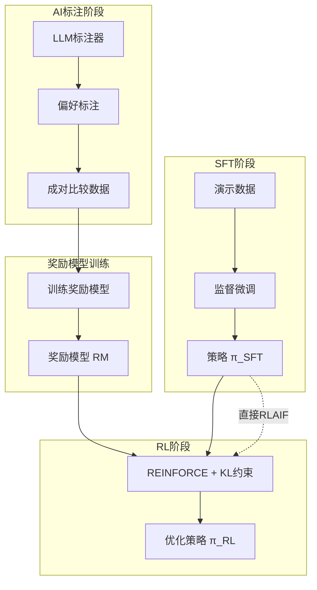

### 1.4 技术要点

RLAIF在技术实现上有几个关键创新：

**位置偏差缓解**
- LLM在比较两个候选时存在位置偏差（更倾向于第一个候选）
- 解决方案：进行两次推理，交换候选顺序，对结果取平均
- 位置偏差率：PaLM 2 L（18%），S（21%），XS（56%）

**链式思维推理**
- 两步推理流程：
  1. 首先生成推理过程（rationale）
  2. 然后基于推理过程生成偏好判断
- 这种方法在所有任务上都提高对齐度

**两种变体**
1. **蒸馏RLAIF**：标准流程，AI标注→训练奖励模型→RL
2. **直接RLAIF**：跳过奖励模型，RL过程中直接使用LLM评分

### 1.5 实验结果摘要

| 任务 | RLAIF vs SFT | RLHF vs SFT | RLAIF vs RLHF |
|------|--------------|--------------|---------------|
| 摘要 | 71% | 73% | 50% |
| 有用对话 | 63% | 64% | 52% |
| 无害对话 | 88%无害率 | 76%无害率 | - |

关键发现：
- RLAIF和RLHF在正面比较中胜率接近，表明性能相当
- RLAIF在无害性上显著优于RLHF
- 两种RL方法相比人工参考摘要都有约80%的胜率

### 1.6 成本分析

RLAIF的主要优势在于成本大幅降低：

- 人类标注成本：每个比较需要数十秒到数分钟
- AI标注成本：每次LLM推理成本极低，且可并行化
- 总体成本降低：>10倍

### 1.7 研究意义

RLAIF的研究意义体现在多个层面：

**理论意义**
- 证明了AI反馈可以作为人类反馈的有效替代
- 为对齐研究提供了新方向
- 展示了模型自我改进的可能性

**实践意义**
- 大幅降低对齐成本
- 提高标注效率
- 使得大规模对齐成为可能

**安全意义**
- 在无害性维度上表现更优
- 为安全对齐提供了新工具
- 有助于构建更安全、更有帮助的AI系统

---

### 1.8 三个评估任务说明

RLAIF论文在三个不同的文本生成任务上进行了评估，每个任务使用不同的数据集和评估指标：

**1. 摘要任务（Summarization）**
- **数据集**：Reddit TL;DR（Stiennon et al., 2020），包含123,000个Reddit帖子及其摘要；此外使用OpenAI Human Preferences数据集（92,000个成对比较，源自Reddit TL;DR子集）
- **目标**：对Reddit帖子生成简洁准确的摘要
- **评估方式**：人类评估者对模型生成的摘要进行排序比较（Win Rate），计算RLAIF/RLHF相对SFT及相互之间的胜率；同时也与人类参考摘要比较
- **人类评估指标**：Win Rate（偏好胜率）——评估者对两个摘要进行排名，无平局
- **论文中的角色**：RLHF的标准基准任务（Stiennon et al., 2020），用于验证RLAIF在传统RLHF任务上能否达到同等水平
- **关键结果**：RLAIF vs SFT 71%，RLHF vs SFT 73%，RLAIF vs RLHF 50%（差异不显著）

**2. 有用对话任务（Helpful Dialogue）**
- **数据集**：Anthropic Helpful Human Preferences（Bai et al., 2022a），即hh-rlhf的helpful-base，包含40,000+训练示例和2,000测试示例
- **目标**：生成对用户有帮助、诚实且信息丰富的对话响应
- **评估方式**：人类评估者对不同模型响应进行排序比较（Win Rate）
- **人类评估指标**：Win Rate（偏好胜率）——基于哪个响应更有帮助、更诚实
- **论文中的角色**：测试RLAIF在开放域对话生成上的通用对齐能力
- **关键结果**：RLAIF vs SFT 63%，RLHF vs SFT 64%，RLAIF vs RLHF 52%（差异不显著）

**3. 无害对话任务（Harmless Dialogue）**
- **数据集**：Anthropic Harmless Human Preferences（Bai et al., 2022a），即hh-rlhf的harmless-base，包含40,000+训练示例和2,000测试示例
- **目标**：识别有害请求并拒绝响应，避免生成危险、非法或不道德内容
- **评估方式**：人类评估者独立评估每个响应是"无害"还是"有害"（Harmless Rate），而非成对比较
- **人类评估指标**：Harmless Rate（无害率）——无害响应的百分比
- **论文中的角色**：验证AI反馈在安全对齐上的优势，这是RLAIF表现最突出的任务
- **关键结果**：RLAIF 88%，RLHF 76%，SFT 64%（RLAIF显著优于RLHF，p < 0.05）

**三个任务的核心差异（源自论文 Table 1 与 Section 2.3）：**
| 任务 | 评估指标 | 核心对齐目标 | RLAIF vs RLHF |
|------|----------|-------------|--------------|
| 摘要 | Win Rate | 生成质量（连贯性、准确性、覆盖度、简洁性） | 持平 (50%) |
| 有用对话 | Win Rate | 有用性与诚实性 | 持平 (52%) |
| 无害对话 | Harmless Rate | 安全性（拒绝有害请求） | **RLAIF显著更优** |

**实验数据下采样说明（Section 3.1-3.2）：** 为加速实验迭代，论文对各任务训练集进行下采样——摘要任务采样15%（约3-4k示例，额外筛选高置信度人类标注），有用/无害对话各采样10%（约3-4k示例）。AI标注器对齐度是在下采样数据上计算；奖励模型训练使用完整训练集；RL阶段在各自训练集上采样提示。

RLAIF在这三个任务上的全面评估，覆盖了生成质量、有用性、安全性三个核心对齐维度，且在安全性维度上展现出AI反馈相对于人类反馈的独特优势。

## 第二章：RLHF背景

### 2.1 RLHF发展历程

RLHF（Reinforcement Learning from Human Feedback）的发展可以追溯到2019年，其演化路径如下：

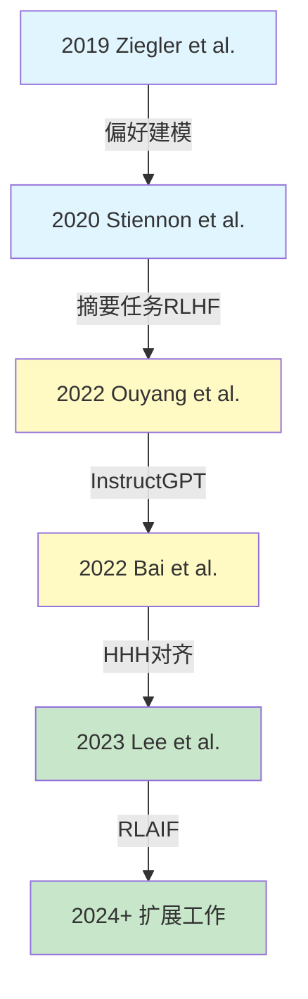

**关键里程碑**

**2019年 - Ziegler等人**
- 首次系统性地研究使用人类反馈训练语言模型
- 提出了基于人类偏好的预训练模型微调方法
- 奠定了RLHF的基础框架

**2020年 - Stiennon等人**
- 在摘要任务上应用RLHF
- 展示了RLHF在长文本生成任务上的有效性
- 使用TL;DR数据集进行实验（这个数据集后来成为RLAIF论文的测试基准之一）

**2022年 - Ouyang等人（InstructGPT）**
- 提出了三阶段训练流程：SFT → 奖励模型训练 → PPO
- 展示了RLHF在大规模模型上的有效性
- 证明了模型可以比人类标注者生成更好的摘要

**2022年 - Bai等人（Constitutional AI）**
- 提出了基于AI反馈的概念
- 使用AI模型生成偏好标签
- 这是RLAIF的直接前身

**2023年 - Lee等人（RLAIF）**
- 系统性比较了RLAIF和RLHF
- 证明了RLAIF可以达到与RLHF相当的性能
- 展示了AI反馈在安全对齐上的优势

### 2.2 RLHF标准流程

标准的RLHF流程包含三个主要阶段：

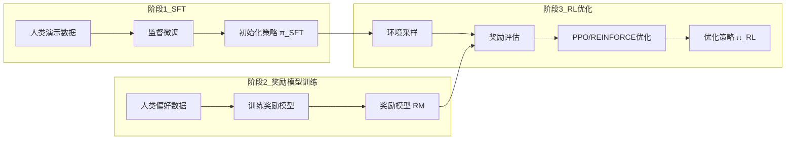

#### 阶段1：监督微调（SFT）

**目标**：在演示数据上训练初始策略

**数据格式**：D = {($x_i$, $y_i$)}，其中$x_i$是输入，$y_i$是目标输出

**训练目标**：
$$
\max_{\theta} \sum_{(x,y) \in D} \log \pi_\theta(y|x)
$$

**实现代码**：
```python
def train_sft(model, dataset, epochs=3, batch_size=32, lr=1e-5):
    """
    监督微调训练
    
    Args:
        model: 待训练的语言模型
        dataset: 演示数据集
        epochs: 训练轮数
        batch_size: 批次大小
        lr: 学习率
    """
    optimizer = torch.optim.AdamW(model.parameters(), lr=lr)
    
    for epoch in range(epochs):
        for batch in dataset.get_batches(batch_size):
            # 前向传播
            logits = model(batch['input_ids'])
            
            # 计算交叉熵损失
            loss = F.cross_entropy(
                logits.view(-1, logits.size(-1)),
                batch['labels'].view(-1),
                reduction='mean'
            )
            
            # 反向传播
            optimizer.zero_grad()
            loss.backward()
            optimizer.step()
    
    return model
```

#### 阶段2：奖励模型训练

**目标**：训练一个能够模拟人类偏好的奖励模型

**数据格式**：$D = \{(x, y_w, y_l)\}$，其中 $y_w$ 是更优的响应，$y_l$ 是较差的响应

**训练目标**：使用Bradley-Terry模型
$$
P(y_w \succ y_l | x) = \frac{\exp(R(x, y_w))}{\exp(R(x, y_w)) + \exp(R(x, y_l))}
$$

**损失函数**：
$$
\mathcal{L} = -\mathbb{E}_{(x,y_w,y_l) \sim D} \left[ \log \sigma(R(x, y_w) - R(x, y_l)) \right]
$$

其中 $\sigma$ 是sigmoid函数：$\sigma(z) = 1/(1 + e^{-z})$

**实现代码**：
```python
def train_reward_model(reward_model, preference_data, epochs=3, lr=1e-5):
    """
    训练奖励模型
    
    Args:
        reward_model: 奖励模型
        preference_data: 偏好数据集，格式为(x, y_w, y_l)
        epochs: 训练轮数
        lr: 学习率
    """
    optimizer = torch.optim.AdamW(reward_model.parameters(), lr=lr)
    
    for epoch in range(epochs):
        for batch in preference_data.get_batches():
            # 计算两个候选的奖励分数
            reward_w = reward_model(batch['x'], batch['y_w'])
            reward_l = reward_model(batch['x'], batch['y_l'])
            
            # Bradley-Terry损失
            loss = -F.logsigmoid(reward_w - reward_l).mean()
            
            # 反向传播
            optimizer.zero_grad()
            loss.backward()
            optimizer.step()
    
    return reward_model
```

#### 阶段3：强化学习优化

**目标**：优化策略以最大化奖励，同时保持与初始策略的接近

**优化目标**（RLAIF论文 Appendix A.3）：
$$
J(\theta) = \mathbb{E}_{x \sim \mathcal{D}, y \sim \pi_\theta(\cdot|x)} \left[ (1 - \beta) R(x, y) - \beta \cdot D_{\text{KL}}\big(\pi_\theta(\cdot|x) \parallel \pi_{\text{SFT}}(\cdot|x)\big) \right]
$$

其中：
- $R(x, y)$ 是奖励函数
- $\beta$ 是KL散度权重，控制奖励最大化与偏离SFT策略之间的权衡（0 < β < 1）
- $\pi_{\text{SFT}}$ 是参考策略（SFT阶段训练得到）

**PPO目标**（Schulman et al., 2017）：
$$
\mathcal{L}^{\text{CLIP}}(\theta) = \mathbb{E}\left[ \min\left( \frac{\pi_\theta(y|x)}{\pi_{\theta_{\text{old}}}(y|x)} A(x,y), \ \text{clip}\!\left( \frac{\pi_\theta(y|x)}{\pi_{\theta_{\text{old}}}(y|x)}, 1-\epsilon, 1+\epsilon \right) A(x,y) \right) \right]
$$

其中 $A(x,y)$ 是优势函数，$\epsilon$ 是裁剪参数（典型值为0.2），$\text{clip}(r, 1-\epsilon, 1+\epsilon)$ 将比值限制在 $[1-\epsilon, 1+\epsilon]$ 区间内

**REINFORCE目标**（RLAIF使用）：
$$
\nabla_\theta J = \mathbb{E}\left[ (R(x,y) - b) \cdot \nabla_\theta \log \pi_\theta(y|x) \right]
$$

其中b是基线（通常使用学习到的价值函数）

**实现代码**：
```python
def train_rl_with_reinforce(policy, reward_model, ref_policy, 
                            episodes=1000, batch_size=128, 
                            beta=0.05, lr=1e-5):
    """
    使用REINFORCE算法进行强化学习
    
    Args:
        policy: 待优化的策略
        reward_model: 奖励模型
        ref_policy: 参考策略（用于KL约束）
        episodes: 训练轮数
        batch_size: 批次大小
        beta: KL散度权重
        lr: 学习率
    """
    optimizer = torch.optim.AdamW(policy.parameters(), lr=lr)
    
    for episode in range(episodes):
        # 采样批次
        batch_data = []
        for _ in range(batch_size):
            x = sample_prompt()
            y = policy.generate(x, temperature=0.9)
            reward = reward_model(x, y)
            batch_data.append((x, y, reward))
        
        # 计算基线（使用平均奖励）
        rewards = [item[2] for item in batch_data]
        baseline = sum(rewards) / len(rewards)
        
        # 计算策略梯度
        policy_loss = 0
        kl_loss = 0
        
        for x, y, reward in batch_data:
            # 计算log概率
            log_prob = policy.log_prob(x, y)
            log_prob_ref = ref_policy.log_prob(x, y)
            
            # REINFORCE损失
            policy_loss += -(reward - baseline) * log_prob
            
            # KL散度
            kl_loss += (log_prob - log_prob_ref).mean()
        
        # 总损失
        total_loss = (policy_loss / batch_size) + beta * kl_loss
        
        # 优化步骤
        optimizer.zero_grad()
        total_loss.backward()
        optimizer.step()
    
    return policy
```

### 2.3 RLHF的关键挑战

RLHF方法虽然有效，但面临几个关键挑战：

**挑战1：人类标注成本**
- 每个偏好比较需要人类标注者花费数十秒到数分钟
- 大规模对齐需要大量标注资源
- 标注质量受标注者疲劳和主观性影响

**挑战2：可扩展性**
- 人类标注速度有限，难以跟上模型迭代速度
- 新任务需要重新收集标注数据
- 跨语言、跨文化的标注更加困难

**挑战3：奖励模型漂移**
- 奖励模型可能在训练过程中过拟合
- 奖励黑客（reward hacking）：策略找到奖励模型的漏洞而非真正优化目标
- 需要持续的人类监督来纠正漂移

**挑战4：安全对齐**
- 有用性（Helpfulness）和无害性（Harmlessness）之间存在权衡
- 人类标注者可能对无害性的理解不一致
- 恶意提示的防御需要大量安全标注

### 2.4 RLHF与RLAIF的联系

RLAIF直接继承自RLHF框架，主要区别在于标注方式：

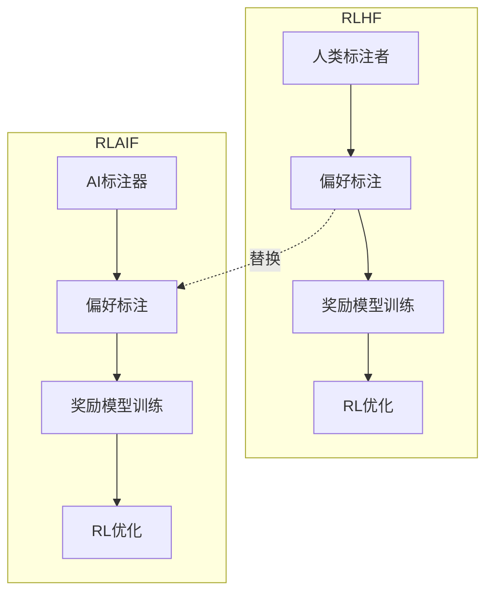

RLAIF通过将标注者从人类替换为AI模型，继承了RLHF的所有优势，同时解决了可扩展性和成本问题。

### 2.5 从Constitutional AI到RLAIF

Constitutional AI（CAI）是RLAIF的直接前身，首次提出了AI反馈的概念：

**Constitutional AI的核心思想**：
1. 使用预定义的"宪法"（原则集）指导AI行为
2. 通过AI反馈进行自我改进
3. 结合批判和修订过程

**CAI到RLAIF的演进**：
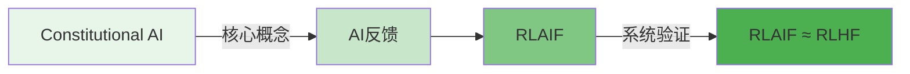

RLAIF相比CAI的贡献：
- 系统性比较了AI反馈与人类反馈的效果
- 提出了位置偏差缓解和链式思维等关键技术
- 验证了同等规模模型的自改进能力

---

## 第三章：AI反馈标注

### 3.1 AI标注器的工作原理

RLAIF使用现成的LLM（如PaLM 2）作为标注器，对模型生成的候选响应进行偏好判断。这个过程的核心是让LLM模拟人类标注者的判断过程。

#### 基本标注流程

**输入格式**：
```json
{
  "premise": "输入文本或问题",
  "candidate_a": "候选响应A",
  "candidate_b": "候选响应B"
}
```

**输出格式**：偏好分布 $P(A \succ B) \in [0, 1]$

**工作流程**：
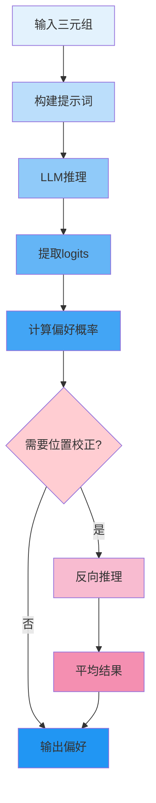

### 3.2 提示词结构

AI标注器的提示词采用三段式结构：

**完整提示词模板**：
```
[前言/Preamble]

[少样本示例/Few-shot Exemplars] (可选)

[待标注样本]
Input: {premise}
Response 1: {candidate_1}
Response 2: {candidate_2}

[结尾/Ending]
Which response is better? Respond with "1" or "2".
```

#### 前言设计

**基础前言**：
```
You are given an input and two responses. Your task is to determine which response is better.
```

**详细前言**（针对摘要任务）：
```
You are given a Reddit post and two summaries. Your task is to determine which summary is better. Consider the following aspects:
- Coherence: Does the summary make logical sense?
- Accuracy: Does the summary accurately reflect the original post?
- Coverage: Does the summary cover the main points?
- Conciseness: Is the summary appropriately concise?
```

#### 少样本示例

**示例格式**：
```
Example 1:
Input: {premise_1}
Response 1: {response_1_1}
Response 2: {response_1_2}
Better response: 1

Example 2:
Input: {premise_2}
Response 1: {response_2_1}
Response 2: {response_2_2}
Better response: 2
```

**研究发现**：反直觉地，少样本示例往往降低对齐度。这可能是因为示例引入了偏差或限制了模型的判断灵活性。

### 3.3 偏好概率计算

AI标注器不直接输出"1"或"2"，而是输出偏好概率。这使得我们可以保留模型的不确定性信息。

**计算方法**：

1. 获取"1"和"2" token的logits：
$$
\text{logit}_1 = \log P(\text{"1"} | \text{prompt})
$$
$$
\text{logit}_2 = \log P(\text{"2"} | \text{prompt})
$$

2. 应用softmax获得概率分布：
$$
P(1) = \frac{\exp(\text{logit}_1)}{\exp(\text{logit}_1) + \exp(\text{logit}_2)}
$$
$$
P(2) = \frac{\exp(\text{logit}_2)}{\exp(\text{logit}_1) + \exp(\text{logit}_2)}
$$

3. 偏好概率就是$P(1)$（候选A优于候选B的概率）：

**实现代码**：
```python
def compute_preference_probability(logits):
    """
    从logits计算偏好概率
    
    Args:
        logits: 包含"1"和"2" token的logits字典
        
    Returns:
        P(候选A优于候选B)
    """
    logit_1 = logits["1"]
    logit_2 = logits["2"]
    
    # 数值稳定的softmax
    max_logit = max(logit_1, logit_2)
    exp_1 = math.exp(logit_1 - max_logit)
    exp_2 = math.exp(logit_2 - max_logit)
    
    p_a_better = exp_1 / (exp_1 + exp_2)
    return p_a_better
```

### 3.4 位置偏差问题

位置偏差是指LLM在比较两个候选时，倾向于选择第一个出现的候选，而不管其质量如何。

#### 位置偏差的程度

不同模型的偏差程度：
- PaLM 2 Large：18%的偏差率
- PaLM 2 Small：21%的偏差率
- PaLM 2 Extra-Small：56%的偏差率

小模型的位置偏差更严重，这表明位置偏差可能源于训练数据的顺序模式。

#### 双向推理校正

**解决方案**：进行两次推理，交换候选顺序，然后对结果取平均。

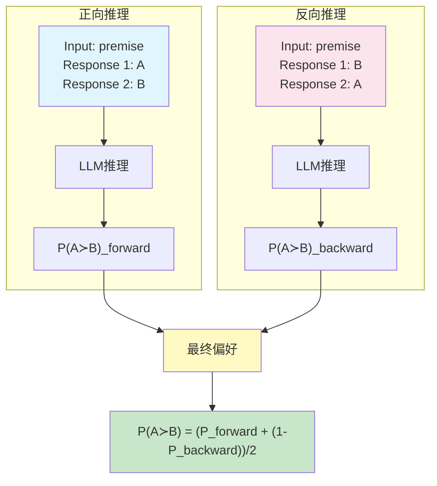

**数学公式**：
$$
P(A \succ B) = \frac{P(A \succ B)_{\text{forward}} + P(A \succ B)_{\text{backward}}}{2}
$$

其中：
- $P(A \succ B)_{\text{forward}}$ 是A在前、B在后的推理结果
- $P(A \succ B)_{\text{backward}} = 1 - P(B \succ A)_{\text{backward}}$ 是B在前、A在后时的转换结果

**实现代码**：
```python
def label_with_position_bias_correction(premise, candidate_a, candidate_b, model):
    """
    带位置偏差校正的偏好标注
    
    Args:
        premise: 输入文本
        candidate_a: 候选A
        candidate_b: 候选B
        model: LLM标注器
        
    Returns:
        P(A优于B)，考虑了位置偏差校正
    """
    # 正向推理：A在前，B在后
    prompt_forward = format_prompt(premise, candidate_a, candidate_b, order="AB")
    logits_forward = model.generate_logits(prompt_forward)
    p_a_wins_forward = compute_preference_probability(logits_forward)
    
    # 反向推理：B在前，A在后
    prompt_reverse = format_prompt(premise, candidate_b, candidate_a, order="AB")
    logits_reverse = model.generate_logits(prompt_reverse)
    p_b_wins_reverse = compute_preference_probability(logits_reverse)
    
    # 校正：A在后时的偏好 = 1 - B在前时的偏好
    p_a_wins_reverse = 1 - p_b_wins_reverse
    
    # 平均两个结果
    p_a_wins_final = (p_a_wins_forward + p_a_wins_reverse) / 2
    
    return p_a_wins_final


def format_prompt(premise, candidate_a, candidate_b, order="AB"):
    """
    格式化提示词
    
    Args:
        premise: 输入文本
        candidate_a: 第一个候选
        candidate_b: 第二个候选
        order: "AB"或"BA"，指定候选顺序
        
    Returns:
        完整提示词
    """
    preamble = "You are given an input and two responses. Your task is to determine which response is better."
    
    if order == "AB":
        prompt = f"{preamble}\n\nInput: {premise}\nResponse 1: {candidate_a}\nResponse 2: {candidate_b}\n\nWhich response is better? Respond with \"1\" or \"2\"."
    else:  # order == "BA"
        prompt = f"{preamble}\n\nInput: {premise}\nResponse 1: {candidate_b}\nResponse 2: {candidate_a}\n\nWhich response is better? Respond with \"1\" or \"2\"."
    
    return prompt
```

### 3.5 链式思维（Chain-of-Thought）推理

链式思维是一种提示技术，要求模型在给出最终答案之前先生成推理过程。在AI标注中，CoT可以提高标注质量。

#### CoT的两步推理流程

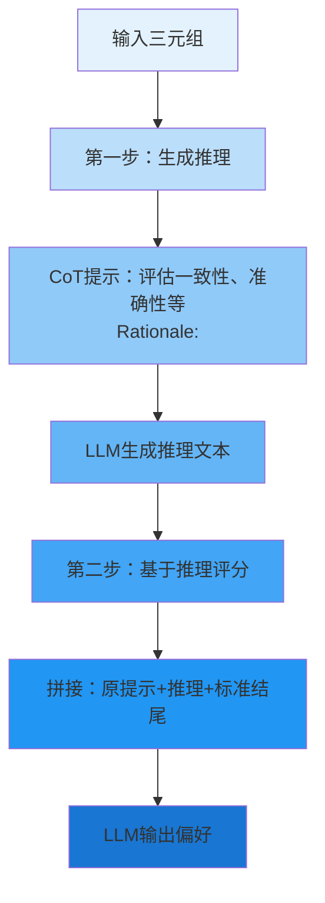

#### CoT提示词设计

**第一步：推理生成**
```
Input: {premise}
Response 1: {candidate_1}
Response 2: {candidate_2}

Consider the coherence, accuracy, coverage, and overall quality of both responses. Provide a brief rationale for your judgment.
Rationale:
```

**第二步：基于推理的偏好判断**
```
[第一步的完整输出]

Based on the above rationale, which response is better? Respond with "1" or "2".
```

#### CoT的实验效果

| 提示策略 | 摘要对齐度 | 有用对话对齐度 | 无害对话对齐度 |
|---------|-----------|--------------|--------------|
| 基础 0-shot | 76.1% | 67.8% | 69.4% |
| 基础 + CoT 0-shot | 77.5% | 69.1% | 70.6% |
| 详细 + CoT 0-shot | 78.0% | 67.8% | 70.1% |

**关键发现**：
- CoT在所有任务上都提高对齐度
- 基础前言+CoT优于详细前言+CoT（在某些任务上）
- CoT的收益在不同任务上一致

### 3.6 提示技术的系统性研究

RLAIF论文对不同的提示技术进行了系统性研究，这是该论文的重要贡献之一。

#### 实验设置

**测试的提示策略**：
1. 基础0-shot（Base 0-shot）
2. 详细0-shot（Detailed 0-shot）
3. 基础+CoT 0-shot（Base + CoT 0-shot）
4. 详细+CoT 0-shot（Detailed + CoT 0-shot）
5. 详细8-shot（Detailed 8-shot）

**评估指标**：AI-人类偏好对齐度

#### 实验结果

| 提示策略 | 摘要 | 有用对话 | 无害对话 |
|---------|------|---------|---------|
| 基础 0-shot | 76.1% | 67.8% | 69.4% |
| 详细 0-shot | 77.4% | 67.6% | 70.1% |
| 基础 + CoT 0-shot | 77.5% | 69.1% | 70.6% |
| 详细 + CoT 0-shot | 78.0% | 67.8% | 70.1% |
| 详细 8-shot | 69.8% | - | - |

#### 关键发现

**发现1：CoT始终有帮助**
- 链式思维在所有任务上都提高对齐度
- 推理过程帮助模型更仔细地评估候选
- 这与CoT在其他任务上的表现一致

**发现2：详细前言效果不一**
- 对摘要任务有帮助（需要特定评估标准）
- 对其他任务影响不大甚至可能有害
- 太详细的限制可能束缚模型判断

**发现3：少样本示例可能有害**
- 详细8-shot在摘要任务上表现最差
- 对齐度随着示例数量增加而单调下降
- 这与直觉相悖，但可能因为示例引入偏差

#### 最优提示策略

基于实验结果，最优策略取决于任务：

**摘要任务**：详细 + CoT 0-shot
- 对齐度达到78.0%
- 详细的评估标准有帮助
- CoT进一步提高性能

**有用对话任务**：基础 + CoT 0-shot
- 对齐度达到69.1%
- 简单的指令配合推理即可
- 过于详细的限制反而有害

**无害对话任务**：基础 + CoT 0-shot
- 对齐度达到70.6%
- 保持简单，让模型自主判断
- CoT帮助模型考虑安全性

### 3.7 AI标注器的选择

RLAIF使用PaLM 2 Large作为AI标注器，但论文也探讨了使用其他模型的可能性。

#### 不同规模模型的性能

| 模型 | 参数规模 | 对齐度 | 位置偏差率 |
|-----|---------|-------|----------|
| PaLM 2 L | 大 | ~78% | 18% |
| PaLM 2 S | 中 | 73.8% | 21% |
| PaLM 2 XS | 小 | 62.7% | 56% |

|**关键观察**：
|- 大模型对齐度更高，位置偏差更低
|- 小模型也可以使用，但需要更多的位置偏差校正
|- 标注器质量直接影响最终RL性能

> **关键细节：不同规模模型的位置偏差方向不同**
>
> 原论文Appendix B揭示了一个重要发现：在出现位置偏差的案例中，不同规模模型偏好的方向相反：
> - **PaLM 2 L**：94% 偏好**第一个**候选（位置1）
> - **PaLM 2 S**：91% 偏好**第二个**候选（位置2）
> - **PaLM 2 XS**：99% 偏好**第二个**候选（位置2）
>
> 这意味着：大模型倾向于偏好先看到的响应，而小模型倾向于偏好后看到的响应。这种方向性差异对设计位置偏差缓解策略至关重要——简单的

#### 同规模自标注

RLAIF的一个重要发现是：可以使用与策略模型相同规模的模型进行标注。

**实验设置**：
- 标注器：PaLM 2 XS
- 策略：PaLM 2 XS

**结果**：
- 相比SFT的胜率：68%
- 与使用大标注器（71%）没有显著差异

**意义**：
- 展示了自改进的可能性
- 降低了对外部大模型的依赖
- 为迭代自改进奠定了基础

### 3.8 AI标注的优势

相比人类标注，AI标注具有以下优势：

**优势1：成本效率**
- 单次标注成本极低
- 可以并行处理大量标注
- 无需担心标注者疲劳

**优势2：一致性**
- 不受标注者个体差异影响
- 相同输入总是得到相同输出
- 便于调试和改进

**优势3：可扩展性**
- 可以快速处理新任务
- 跨语言、跨领域应用
- 可以随着LLM改进自动改进

**优势4：安全性**
- 在安全敏感任务上表现更好
- 可以避免标注者暴露于有害内容
- 可以强制执行安全准则

### 3.9 AI标注的挑战

尽管AI标注有很多优势，但也面临一些挑战：

**挑战1：对齐偏差**
- AI标注器可能不完全对齐人类偏好
- 需要仔细设计提示词
- 需要持续验证与人类偏好的对齐度

**挑战2：位置偏差**
- 需要额外的推理来校正
- 增加了计算成本（2倍推理）
- 小模型偏差更严重

**挑战3：领域适应性**
- 在某些专业领域可能表现不佳
- 需要针对不同任务调整提示
- 可能需要领域特定的示例

---

## 第四章：两种RLAIF变体

RLAIF论文提出了两种主要的变体：蒸馏RLAIF和直接RLAIF。这两种方法在流程和性能上都有显著差异。

### 4.1 蒸馏RLAIF（Distilled RLAIF）

蒸馏RLAIF是RLAIF的标准形式，也是与RLHF最直接的对应。

#### 方法概述

蒸馏RLAIF遵循经典的RLHF流程，但使用AI标注替代人类标注：

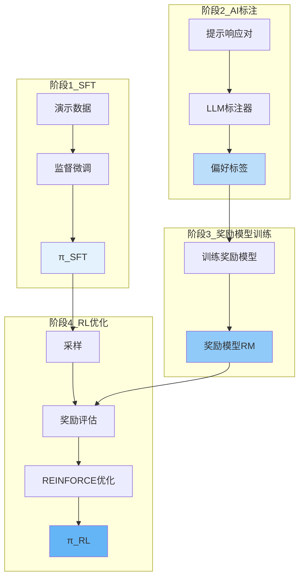

#### 训练流程

**步骤1：监督微调（SFT）**

使用演示数据训练初始策略：
$$
\pi_{\text{SFT}} = \arg\max_{\pi} \mathbb{E}_{(x,y) \sim \mathcal{D}_{\text{demo}}} [\log \pi(y|x)]
$$

**步骤2：AI标注**

使用LLM标注器生成偏好数据：
$$
\mathcal{D}_{\text{pref}} = \{(x, y_w, y_l, p_{w \succ l})\}
$$

其中 $p_{w \succ l}$ 是LLM给出的偏好概率。

**步骤3：奖励模型训练**

在AI标注数据上训练奖励模型：

损失函数：
$$
\mathcal{L}_{\text{RM}} = -\mathbb{E}_{(x,y_w,y_l,p) \sim \mathcal{D}_{\text{pref}}} \left[ p \cdot \log \sigma(R(x,y_w) - R(x,y_l)) + (1-p) \cdot \log (1 - \sigma(R(x,y_w) - R(x,y_l))) \right]
$$

这是一个加权版本的Bradley-Terry损失，考虑了LLM标注的不确定性。

**步骤4：强化学习**

使用REINFORCE算法优化策略：

目标：
$$
\max_{\pi} \mathbb{E}_{x \sim \mathcal{D}, y \sim \pi(\cdot|x)} [R(x,y)] - \beta \cdot \text{KL}[\pi(\cdot|x) || \pi_{\text{SFT}}(\cdot|x)]
$$

梯度：
$$
\nabla_\theta J = \mathbb{E} \left[ (R(x,y) - b) \cdot \nabla_\theta \log \pi_\theta(y|x) - \beta \nabla_\theta \text{KL}[\pi_\theta(\cdot|x) || \pi_{\text{SFT}}(\cdot|x)] \right]
$$

#### 实现代码

```python
class DistilledRLAIF:
    """
    蒸馏RLAIF训练器
    """
    def __init__(self, 
                 policy_model,
                 reward_model,
                 ai_labeler,
                 beta=0.05,
                 lr=1e-5):
        """
        初始化蒸馏RLAIF
        
        Args:
            policy_model: 策略模型
            reward_model: 奖励模型
            ai_labeler: AI标注器
            beta: KL散度权重
            lr: 学习率
        """
        self.policy = policy_model
        self.reward_model = reward_model
        self.ai_labeler = ai_labeler
        self.beta = beta
        self.optimizer = torch.optim.AdamW(self.policy.parameters(), lr=lr)
        self.ref_policy = copy.deepcopy(policy_model)  # 参考策略
        
    def train_reward_model(self, preference_data, epochs=3):
        """
        训练奖励模型
        
        Args:
            preference_data: AI标注的偏好数据
            epochs: 训练轮数
        """
        for epoch in range(epochs):
            total_loss = 0
            for batch in preference_data.get_batches():
                # 计算奖励分数
                reward_w = self.reward_model(batch['x'], batch['y_w'])
                reward_l = self.reward_model(batch['x'], batch['y_l'])
                
                # 加权Bradley-Terry损失
                prob_diff = reward_w - reward_l
                loss = -(batch['p_wins'] * F.logsigmoid(prob_diff) + 
                         (1 - batch['p_wins']) * F.logsigmoid(-prob_diff))
                
                # 反向传播
                self.reward_model.optimizer.zero_grad()
                loss.backward()
                self.reward_model.optimizer.step()
                
                total_loss += loss.item()
            
            print(f"Epoch {epoch}, Loss: {total_loss / len(preference_data)}")
    
    def train_rl(self, prompts, episodes=1000, batch_size=128):
        """
        使用REINFORCE进行强化学习
        
        Args:
            prompts: 提示集合
            episodes: 训练轮数
            batch_size: 批次大小
        """
        for episode in range(episodes):
            batch_data = self._collect_batch(prompts, batch_size)
            
            # 计算损失
            policy_loss, kl_loss = self._compute_losses(batch_data)
            total_loss = policy_loss + self.beta * kl_loss
            
            # 优化
            self.optimizer.zero_grad()
            total_loss.backward()
            self.optimizer.step()
            
            if episode % 10 == 0:
                print(f"Episode {episode}, Policy Loss: {policy_loss.item()}, KL Loss: {kl_loss.item()}")
    
    def _collect_batch(self, prompts, batch_size):
        """收集一个训练批次"""
        batch_data = []
        for _ in range(batch_size):
            x = random.choice(prompts)
            y = self.policy.generate(x, temperature=0.9)
            reward = self.reward_model(x, y)
            batch_data.append({'x': x, 'y': y, 'reward': reward})
        return batch_data
    
    def _compute_losses(self, batch_data):
        """计算策略损失和KL损失"""
        policy_loss = 0
        kl_loss = 0
        
        # 计算基线
        rewards = [item['reward'] for item in batch_data]
        baseline = sum(rewards) / len(rewards)
        
        for item in batch_data:
            x, y, reward = item['x'], item['y'], item['reward']
            
            # 策略梯度损失
            log_prob = self.policy.log_prob(x, y)
            policy_loss += -(reward - baseline) * log_prob
            
            # KL散度
            log_prob_ref = self.ref_policy.log_prob(x, y)
            kl_loss += (log_prob - log_prob_ref).mean()
        
        return policy_loss / len(batch_data), kl_loss / len(batch_data)
```

#### 性能表现

| 任务 | 相比SFT胜率 | 相比RLHF胜率 |
|------|-----------|-------------|
| 摘要 | 71% | 50% |
| 有用对话 | 63% | 52% |
| 无害对话 | 88%无害率 | - |

**关键观察**：
- 在所有任务上都显著优于SFT
- 与RLHF正面比较胜率接近50%，表明性能相当
- 在无害性上显著优于RLHF

### 4.2 直接RLAIF（Direct RLAIF）

直接RLAIF是RLAIF论文的一个重要创新，它跳过了奖励模型训练阶段，在RL过程中直接使用LLM对输出进行评分。

#### 方法概述

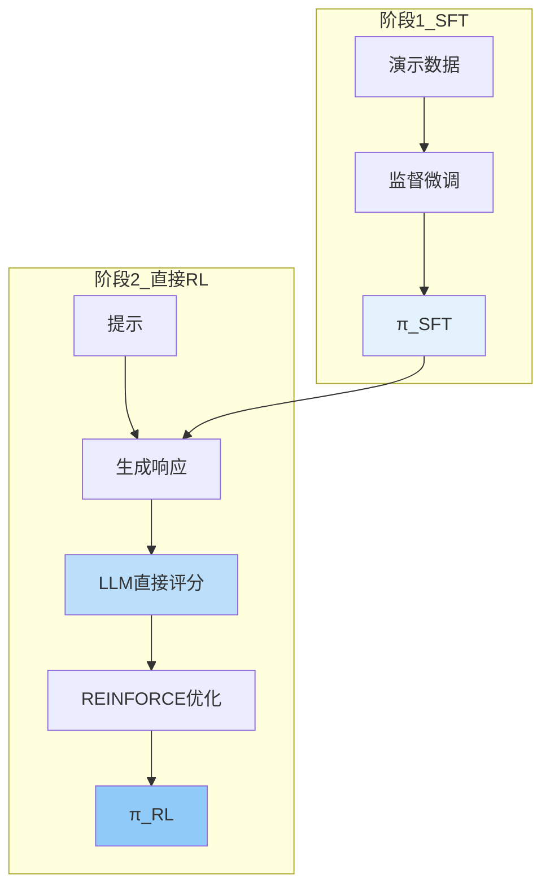

#### 评分机制

直接RLAIF要求LLM输出1-10的评分，而不是二元偏好。

**评分提示词**：
```
Input: {premise}
Response: {response}

Rate the quality of this response on a scale from 1 to 10, where 1 is very poor and 10 is excellent. Consider coherence, accuracy, helpfulness, and safety.
Rating:
```

**分数计算**：

1. 获取1-10每个数字的logits：
$$
\text{logit}_i = \log P(i | \text{prompt}), \quad i \in \{1, 2, ..., 10\}
$$

2. 计算期望分数：
$$
s(x, y) = \sum_{i=1}^{10} i \cdot P(i | x, y)
$$

其中：
$$
P(i | x, y) = \frac{\exp(\text{logit}_i)}{\sum_{j=1}^{10} \exp(\text{logit}_j)}
$$

3. 归一化到[-1, 1]范围：
$$
r(x, y) = 2 \cdot \frac{s(x, y) - 5.5}{9}
$$

归一化确保分数范围与传统的奖励模型输出一致。

#### 实现代码

```python
class DirectRLAIF:
    """
    直接RLAIF训练器
    """
    def __init__(self, 
                 policy_model,
                 ai_scorer,
                 beta=0.05,
                 lr=1e-5):
        """
        初始化直接RLAIF
        
        Args:
            policy_model: 策略模型
            ai_scorer: AI评分器（LLM）
            beta: KL散度权重
            lr: 学习率
        """
        self.policy = policy_model
        self.ai_scorer = ai_scorer
        self.beta = beta
        self.optimizer = torch.optim.AdamW(self.policy.parameters(), lr=lr)
        self.ref_policy = copy.deepcopy(policy_model)
        
    def score_response(self, x, y):
        """
        使用AI评分器对响应进行评分
        
        Args:
            x: 输入
            y: 响应
            
        Returns:
            归一化后的奖励分数
        """
        # 构建评分提示
        prompt = self._format_scoring_prompt(x, y)
        
        # 获取1-10的logits
        logits = self.ai_scorer.generate_logits(prompt)
        score_logits = [logits[str(i)] for i in range(1, 11)]
        
        # 计算期望分数
        probs = softmax(score_logits)
        expected_score = sum((i + 1) * probs[i] for i in range(10))
        
        # 归一化到[-1, 1]
        normalized_reward = 2 * (expected_score - 5.5) / 9
        
        return normalized_reward
    
    def _format_scoring_prompt(self, x, y):
        """格式化评分提示词"""
        return f"""Input: {x}
Response: {y}

Rate the quality of this response on a scale from 1 to 10, where 1 is very poor and 10 is excellent. Consider coherence, accuracy, helpfulness, and safety.
Rating:"""
    
    def train_rl(self, prompts, episodes=1000, batch_size=128):
        """
        直接使用AI评分进行强化学习
        
        Args:
            prompts: 提示集合
            episodes: 训练轮数
            batch_size: 批次大小
        """
        for episode in range(episodes):
            batch_data = self._collect_batch_with_ai_scorer(prompts, batch_size)
            
            # 计算损失
            policy_loss, kl_loss = self._compute_losses(batch_data)
            total_loss = policy_loss + self.beta * kl_loss
            
            # 优化
            self.optimizer.zero_grad()
            total_loss.backward()
            self.optimizer.step()
            
            if episode % 10 == 0:
                print(f"Episode {episode}, Policy Loss: {policy_loss.item()}, KL Loss: {kl_loss.item()}")
    
    def _collect_batch_with_ai_scorer(self, prompts, batch_size):
        """使用AI评分器收集训练批次"""
        batch_data = []
        for _ in range(batch_size):
            x = random.choice(prompts)
            y = self.policy.generate(x, temperature=0.9)
            reward = self.score_response(x, y)
            batch_data.append({'x': x, 'y': y, 'reward': reward})
        return batch_data
    
    def _compute_losses(self, batch_data):
        """计算策略损失和KL损失"""
        policy_loss = 0
        kl_loss = 0
        
        # 计算基线
        rewards = [item['reward'] for item in batch_data]
        baseline = sum(rewards) / len(rewards)
        
        for item in batch_data:
            x, y, reward = item['x'], item['y'], item['reward']
            
            # 策略梯度损失
            log_prob = self.policy.log_prob(x, y)
            policy_loss += -(reward - baseline) * log_prob
            
            # KL散度
            log_prob_ref = self.ref_policy.log_prob(x, y)
            kl_loss += (log_prob - log_prob_ref).mean()
        
        return policy_loss / len(batch_data), kl_loss / len(batch_data)


def softmax(logits):
    """数值稳定的softmax"""
    max_logit = max(logits)
    exp_logits = [math.exp(logit - max_logit) for logit in logits]
    sum_exp = sum(exp_logits)
    return [exp / sum_exp for exp in exp_logits]
```

#### 性能表现

| 对比 | 胜率 |
|------|------|
| 直接RLAIF vs SFT | 74% |
| 直接RLAIF vs 蒸馏RLAIF（同规模） | 60% |
| 蒸馏RLAIF（同规模） vs SFT | 68% |

|**关键发现**：
|- 直接RLAIF（PaLM 2 XS标注器）vs SFT达到74%胜率，而同规模蒸馏RLAIF（PaLM 2 XS标注器）为68%
|- 直接RLAIF以60%胜率显著优于同规模蒸馏RLAIF，跳过奖励模型训练环节反而更有效
|- 这避免了奖励模型训练中的信息损失

### 4.3 两种变体的比较

#### 流程比较

| 维度 | 蒸馏RLAIF | 直接RLAIF |
|------|----------|----------|
| 奖励模型 | 需要训练 | 不需要 |
| AI交互 | 标注阶段 | RL阶段 |
| 计算成本 | 标注+RM训练 | 持续AI评分 |
| 性能 | 71% vs SFT | 74% vs SFT |
| 实现复杂度 | 较复杂 | 较简单 |

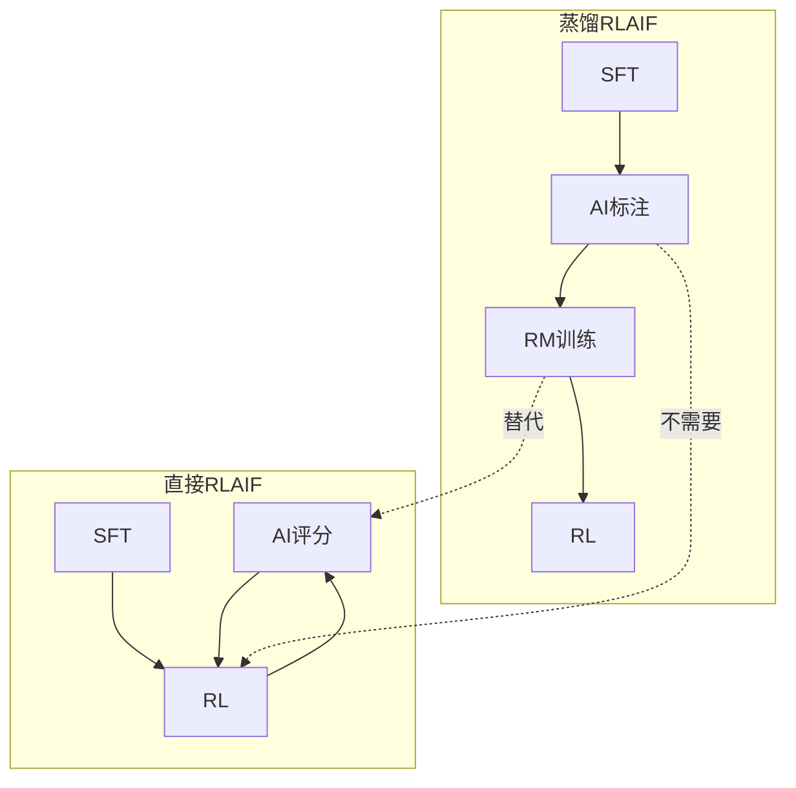

#### 性能分析

**直接RLAIF优于蒸馏RLAIF的可能原因**：

1. **避免信息损失**：
   - 蒸馏RLAIF：AI标注 → 奖励模型参数化
   - 直接RLAIF：AI评分直接用于优化
   - 奖励模型无法完美拟合AI标注，信息有损失

2. **实时适应**：
   - 蒸馏RLAIF：奖励模型固定
   - 直接RLAIF：AI评分器可以根据策略的进化调整评分
   - 避免了奖励模型过拟合问题

3. **更丰富的信号**：
   - 蒸馏RLAIF：二元偏好
   - 直接RLAIF：1-10的精细评分
   - 更丰富的梯度信息

**蒸馏RLAIF的优势**：

1. **计算效率**：
   - 训练后奖励模型推理快
   - 直接RLAIF每步都需要LLM推理

2. **可扩展性**：
   - 奖励模型可以小型化
   - 直接RLAIF需要持续调用大模型

3. **稳定性**：
   - 奖励模型提供一致的信号
   - 直接RLAIF可能受LLM采样波动影响

### 4.4 选择哪种变体

选择蒸馏RLAIF还是直接RLAIF取决于具体场景：

**选择蒸馏RLAIF，如果**：
- 计算资源有限，需要离线训练奖励模型
- 需要快速的推理时间
- 有大量AI标注数据，可以一次性训练好奖励模型

**选择直接RLAIF，如果**：
- 有充足的计算资源，可以支持实时LLM推理
- 追求最佳性能
- 需要策略和评分器共同进化

---

## 第五章：实验

### 5.1 实验设置

#### 数据集

RLAIF论文在三个任务上进行了评估（数据集详情见 Appendix C）：

**1. 摘要任务 - Reddit TL;DR**
- **数据集**：Reddit TL;DR（Stiennon et al., 2020），123,000个Reddit帖子及摘要；OpenAI Human Preferences（同源），92,000个成对人类偏好比较
- **下采样**：训练集采样15%并筛选高置信度人类标注（confidence 1,2,8,9），得约3-4k示例用于AI标注器对齐度计算
- **奖励模型训练**：使用完整训练集（AI标注或人类标注）
- **人类评估**：测试集上，评估者对生成摘要进行排序（Win Rate），同时与人类参考摘要比较
- **任务性质**：封闭式生成——输入到输出的映射相对确定
- **为何选此任务**：RLHF标准基准（Stiennon et al., 2020），验证RLAIF能否在传统任务上复现同等性能

**2. 有用对话 - Anthropic Helpful Human Preferences (hh-rlhf helpful-base)**
- **数据集**：40,000+训练示例，2,000测试示例（对话历史+首选/非首选响应），偏好基于"更有帮助、更诚实"
- **下采样**：训练集采样10%，得约3-4k示例用于AI标注器对齐度计算
- **奖励模型训练**：使用完整训练集
- **人类评估**：测试集上，评估者对生成响应进行排序（Win Rate）
- **任务性质**：开放式生成——无标准答案，有用性具主观性
- **为何选此任务**：测试RLAIF在开放域对话上的泛化对齐能力

**3. 无害对话 - Anthropic Harmless Human Preferences (hh-rlhf harmless-base)**
- **数据集**：40,000+训练示例，2,000测试示例，偏好基于"更安全、危害更小"
- **下采样**：训练集采样10%，得约3-4k示例用于AI标注器对齐度计算
- **奖励模型训练**：使用完整训练集
- **人类评估**：测试集上，评估者独立判定每个响应"无害/有害"（Harmless Rate），而非成对比较
- **任务性质**：安全敏感生成——核心是拒绝有害请求，评估标准二元化
- **为何选此任务**：RLAIF表现最突出任务（88% vs RLHF 76%），验证AI反馈在安全对齐优势

#### 模型配置

| 组件 | 模型 |
|------|------|
| AI标注器 | PaLM 2 Large（指令微调版）|
| SFT策略 | PaLM 2 Extra-Small |
| 奖励模型 | PaLM 2 Extra-Small |
| RL算法 | REINFORCE with baseline |

#### 训练超参数

```python
RLAIF_CONFIG = {
    # 强化学习参数
    'learning_rate': 1e-5,
    'batch_size': 128,
    'episodes': 8,  # 训练轮数
    'temperature': 0.9,  # 采样温度
    
    # KL正则化
    'beta': 0.05,  # KL散度权重
    
    # 奖励模型
    'rm_learning_rate': 1e-5,
    'rm_epochs': 3,
    'rm_batch_size': 32,
    
    # AI标注器
    'labeler_model': 'PaLM 2 Large',
    'use_position_bias_correction': True,
    'use_cot': True,
}
```

### 5.2 主要结果

#### 整体性能比较

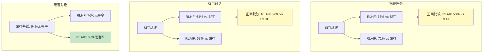

#### 详细结果表格

**摘要任务（TL;DR）**

| 方法 | vs SFT胜率 | vs 人类摘要 | vs RLHF |
|------|-----------|-----------|---------|
| SFT基线 | - | - | - |
| RLHF | 73% | 80% | - |
| RLAIF | 71% | 80% | 50% |

**有用对话**

| 方法 | vs SFT胜率 | vs RLHF |
|------|-----------|---------|
| SFT基线 | - | - |
| RLHF | 64% | - |
| RLAIF | 63% | 52% |

**无害对话**

| 方法 | 无害率 | vs SFT |
|------|-------|---------|
| SFT基线 | 64% | - |
| RLHF | 76% | +12% |
| RLAIF | 88% | +24% |

#### 关键发现

**发现1：RLAIF ≈ RLHF**
- 在摘要和有用对话上，RLAIF与RLHF性能相当
- 正面比较胜率接近50%（摘要50%，有用对话52%）
- 证明了AI反馈可以替代人类反馈

**发现2：RLAIF在无害性上更优**
- 无害率：RLAIF（88%）> RLHF（76%）> SFT（64%）
- 这是RLAIF最显著的性能优势
- 可能原因：AI标注器在安全性上更保守和一致

**发现3：两种RL方法都显著优于SFT**
- 在所有任务上，RL方法相比SFT有10-20%的提升
- 验证了强化学习在对齐中的价值

### 5.3 同规模自改进实验

#### 实验设置

RLAIF的一个重要实验是验证同规模模型的自改进能力：

**配置**：
- 标注器：PaLM 2 XS
- 策略：PaLM 2 XS（同规模）
- 对比：使用大标注器（PaLM 2 L）的结果

#### 结果

| 标注器-策略配置 | vs SFT胜率 |
|---------------|-----------|
| 大标注器 → XS策略 | 71% |
| XS标注器 → XS策略 | 68% |

#### 统计检验

```python
# 假设检验：两个胜率是否有显著差异
import scipy.stats as stats
from math import sqrt

# 观察数据
large_labeler_wins = 71  # 使用大标注器的胜率
same_size_wins = 68     # 使用同规模标注器的胜率
n_comparisons = 100      # 比较次数

# 两比例检验
count1 = large_labeler_wins
count2 = same_size_wins
n1 = n2 = n_comparisons

# 计算z分数
p1 = count1 / n1
p2 = count2 / n2
p_pooled = (count1 + count2) / (n1 + n2)
se = sqrt(p_pooled * (1 - p_pooled) * (1/n1 + 1/n2))
z_score = (p1 - p2) / se

# 计算p值
p_value = 2 * (1 - stats.norm.cdf(abs(z_score)))

print(f"Z-score: {z_score:.3f}")
print(f"P-value: {p_value:.3f}")
# 如果p_value > 0.05，则差异不显著
```

**结果**：p值 > 0.05，差异不显著

**意义**：
- 同规模模型可以进行自改进
- 不需要更大的教师模型
- 这为迭代自改进打开了可能性

### 5.4 提示技术消融实验

#### 实验设计

系统性测试不同提示技术对AI-人类偏好对齐的影响。

**测试变量**：
1. 前言类型（基础 vs 详细）
2. 是否使用CoT
3. 少样本示例数量（0, 1, 4, 8）

#### 对齐度结果

| 提示策略 | 摘要对齐度 | 有用对齐度 | 无害对齐度 |
|---------|-----------|----------|----------|
| 基础 0-shot | 76.1% | 67.8% | 69.4% |
| 详细 0-shot | 77.4% | 67.6% | 70.1% |
| 基础 + CoT 0-shot | 77.5% | 69.1% | 70.6% |
| 详细 + CoT 0-shot | 78.0% | 67.8% | 70.1% |
| 详细 8-shot | 69.8% | - | - |

#### 关键发现

**发现1：CoT始终有帮助**
- 在所有任务上一致提高对齐度
- 平均提升：+1.4%
- 推理过程帮助模型更仔细评估

**发现2：详细前言效果不一**
- 摘要任务：有帮助（+1.3%）
- 有用对话：无明显帮助
- 无害对话：轻微帮助（+0.7%）

**发现3：少样本示例可能有害**
- 详细8-shot在摘要上表现最差
- 对齐度随示例数量增加而下降
- 可能原因：示例引入偏差

#### 推荐配置

基于实验结果，不同任务的最优配置：

**摘要任务**：详细 + CoT 0-shot
- 对齐度：78.0%
- 详细的标准说明有助于评估摘要质量

**有用对话**：基础 + CoT 0-shot
- 对齐度：69.1%
- 保持简单，让模型灵活判断

**无害对话**：基础 + CoT 0-shot
- 对齐度：70.6%
- CoT帮助模型考虑安全因素

### 5.5 直接RLAIF vs 蒸馏RLAIF

#### 实验设置

比较两种RLAIF变体的性能：

**蒸馏RLAIF**：
- 标准流程：AI标注 → RM训练 → RL
- 使用二元偏好标注

**直接RLAIF**：
- 直接流程：RL → AI实时评分
- 使用1-10的精细评分

#### 结果

| 方法 | vs SFT胜率 | vs 蒸馏RLAIF |
|------|-----------|-------------|
| 蒸馏RLAIF（同规模） | 68% | - |
| 直接RLAIF | 74% | 60% |

#### 分析

**直接RLAIF优于蒸馏RLAIF的可能原因**：

1. **避免信息损失**
   - 蒸馏过程：AI标注 → 奖励模型参数化
   - 直接过程：AI评分直接用于优化
   - 奖励模型无法完美拟合AI标注

2. **更丰富的信号**
   - 蒸馏：二元偏好
   - 直接：1-10精细评分
   - 更细致的梯度信息

3. **动态适应**
   - 直接RLAIF的评分器可以随策略进化
   - 避免奖励模型过拟合

### 5.6 位置偏差验证

#### 实验目的

验证不同规模模型的位置偏差程度。

#### 测试方法

对相同的候选对进行两次评估：
1. 正向顺序：(A, B)
2. 反向顺序：(B, A)

位置偏差率 = $P(A\succ B|\text{正向}) - P(A\succ B|\text{反向})$

#### 结果

| 模型 | 位置偏差率 |
|------|-----------|
| PaLM 2 L | 18% |
| PaLM 2 S | 21% |
| PaLM 2 XS | 56% |

#### 分析

**关键观察**：
- 小模型的位置偏差更严重
- 56%的偏差率意味着XS模型几乎总是选择第一个候选
- 需要位置偏差校正，特别是对小模型

**解决方案**：
```python
def correct_position_bias(p_forward, p_reverse):
    """
    校正位置偏差
    
    Args:
        p_forward: 正向推理的偏好概率
        p_reverse: 反向推理的偏好概率
        
    Returns:
        校正后的偏好概率
    """
    # 反向推理需要转换：P(A≻B)_reverse = 1 - P(B≻A)_reverse
    p_a_wins_reverse = 1 - p_reverse
    
    # 平均两个结果
    p_corrected = (p_forward + p_a_wins_reverse) / 2
    return p_corrected
```

### 5.7 消耗分析

#### 计算成本比较

**RLHF流程**：
1. SFT训练：假设1 GPU周
2. 人类标注：10,000次比较 × 2分钟 = 333小时
3. RM训练：0.5 GPU周
4. RL训练：1 GPU周
5. 总计：2.5 GPU周 + 333人力小时

**RLAIF流程**：
1. SFT训练：假设1 GPU周
2. AI标注：10,000次比较 × 0.5秒 = 1.4小时（单GPU）或并行化
3. RM训练：0.5 GPU周
4. RL训练：1 GPU周
5. 总计：2.5 GPU周 + 可忽略的AI标注时间

**成本降低**：
- 人力成本：降低>100倍（333小时 → 0小时）
- 时间成本：降低>100倍（标注阶段）
- 总体成本：降低>10倍

#### 标注质量

| 维度 | 人类标注 | AI标注 |
|------|---------|--------|
| 一致性 | 中等（标注者间有差异） | 高（相同输入→相同输出） |
| 疲劳 | 随时间下降 | 无疲劳 |
| 可扩展性 | 受限于人力 | 易于扩展 |
| 安全性 | 标注者可能暴露于有害内容 | 无风险 |

### 5.8 错误分析

#### 常见失败模式

**1. AI标注器的系统性偏差**
- 过于关注某些特征（如长度、格式）
- 忽略某些重要维度（如事实准确性）
- 解决：调整提示词，明确评估标准

**2. 位置偏差**
- 特别是小模型，位置偏差严重
- 解决：双向推理校正

**3. 领域适应性**
- 在专业领域可能表现不佳
- 解决：添加领域特定的示例和说明

**4. 边界情况**
- 对极端情况（如非常短或非常长的响应）判断不准
- 解决：添加边界情况的示例

#### 质量监控

```python
def monitor_labeling_quality(ai_labeler, human_labels, sample_size=100):
    """
    监控AI标注质量
    
    Args:
        ai_labeler: AI标注器
        human_labels: 人类标注的黄金标准
        sample_size: 抽样检查的数量
        
    Returns:
        对齐度报告
    """
    sample = random.sample(human_labels, sample_size)
    
    agreements = 0
    for item in sample:
        ai_pred = ai_labeler.label(item['x'], item['y_a'], item['y_b'])
        human_pred = item['preference']
        
        # 检查是否一致（考虑概率阈值）
        if (ai_pred > 0.5 and human_pred == 'A') or (ai_pred < 0.5 and human_pred == 'B'):
            agreements += 1
    
    alignment_rate = agreements / sample_size
    
    return {
        'alignment_rate': alignment_rate,
        'total_comparisons': sample_size,
        'agreements': agreements,
        'disagreements': sample_size - agreements,
    }
```

---

## 第六章：代码

### 6.1 完整的RLAIF实现框架

下面是一个完整的RLAIF训练框架，包含所有主要组件。

```python
"""
完整的RLAIF训练框架
支持蒸馏RLAIF和直接RLAIF两种变体
"""

import torch
import torch.nn.functional as F
import numpy as np
from typing import List, Dict, Tuple, Optional
import copy
import random
from dataclasses import dataclass


@dataclass
class RLAIFConfig:
    """RLAIF训练配置"""
    # 学习参数
    learning_rate: float = 1e-5
    batch_size: int = 128
    episodes: int = 8
    
    # RL参数
    beta: float = 0.05  # KL权重
    temperature: float = 0.9  # 采样温度
    
    # 奖励模型
    rm_lr: float = 1e-5
    rm_epochs: int = 3
    rm_batch_size: int = 32
    
    # AI标注器
    use_position_bias: bool = True
    use_cot: bool = True
    num_shots: int = 0  # 少样本数量
    
    # 变体选择
    variant: str = 'distilled'  # 'distilled' 或 'direct'


class AILabeler:
    """AI标注器：使用LLM生成偏好标签"""
    
    def __init__(self, 
                 model, 
                 use_position_bias: bool = True,
                 use_cot: bool = False,
                 num_shots: int = 0):
        """
        初始化AI标注器
        
        Args:
            model: LLM模型
            use_position_bias: 是否校正位置偏差
            use_cot: 是否使用链式思维
            num_shots: 少样本示例数量
        """
        self.model = model
        self.use_position_bias = use_position_bias
        self.use_cot = use_cot
        self.num_shots = num_shots
        self.exemplars = self._load_exemplars()
    
    def _load_exemplars(self) -> List[Dict]:
        """加载少样本示例"""
        # 这里应该从文件或数据库加载示例
        return []
    
    def label_preference(self, 
                        premise: str, 
                        response_a: str, 
                        response_b: str) -> float:
        """
        标注两个响应的偏好
        
        Args:
            premise: 输入文本
            response_a: 响应A
            response_b: 响应B
            
        Returns:
            P(A优于B)，范围[0, 1]
        """
        if self.use_position_bias:
            return self._label_with_bias_correction(premise, response_a, response_b)
        else:
            return self._label_single(premise, response_a, response_b)
    
    def _label_with_bias_correction(self, premise: str, response_a: str, response_b: str) -> float:
        """带位置偏差校正的标注"""
        # 正向推理
        p_forward = self._label_single(premise, response_a, response_b)
        
        # 反向推理（交换顺序）
        p_reverse = self._label_single(premise, response_b, response_a)
        
        # 转换反向结果：P(A≻B)_reverse = 1 - P(B≻A)_reverse
        p_a_wins_reverse = 1 - p_reverse
        
        # 平均
        p_final = (p_forward + p_a_wins_reverse) / 2
        return p_final
    
    def _label_single(self, premise: str, response_a: str, response_b: str) -> float:
        """单次推理标注"""
        # 构建提示词
        if self.use_cot:
            prompt = self._format_cot_prompt(premise, response_a, response_b)
            # 第一步：获取推理
            rationale = self.model.generate(prompt + " Rationale:", max_length=256)
            # 第二步：基于推理评分
            full_prompt = prompt + f" Rationale: {rationale}\n\nBetter response:"
            logits = self.model.get_logits(full_prompt, tokens=["1", "2"])
        else:
            prompt = self._format_standard_prompt(premise, response_a, response_b)
            logits = self.model.get_logits(prompt, tokens=["1", "2"])
        
        # 计算偏好概率
        logit_1 = logits["1"]
        logit_2 = logits["2"]
        
        # 数值稳定的softmax
        max_logit = max(logit_1, logit_2)
        exp_1 = np.exp(logit_1 - max_logit)
        exp_2 = np.exp(logit_2 - max_logit)
        
        p_a_better = exp_1 / (exp_1 + exp_2)
        return p_a_better
    
    def _format_standard_prompt(self, premise: str, response_a: str, response_b: str) -> str:
        """格式化标准提示词"""
        prompt = f"""You are given an input and two responses. Your task is to determine which response is better.

Input: {premise}
Response 1: {response_a}
Response 2: {response_b}

Which response is better? Respond with "1" or "2"."""
        
        # 添加少样本示例
        if self.num_shots > 0 and self.exemplars:
            examples = random.sample(self.exemplars, min(self.num_shots, len(self.exemplars)))
            example_text = "\n\n".join([
                f"Example:\nInput: {ex['premise']}\nResponse 1: {ex['response_a']}\nResponse 2: {ex['response_b']}\nBetter response: {ex['better']}"
                for ex in examples
            ])
            prompt = f"{example_text}\n\n{prompt}"
        
        return prompt
    
    def _format_cot_prompt(self, premise: str, response_a: str, response_b: str) -> str:
        """格式化CoT提示词"""
        return f"""You are given an input and two responses. Your task is to determine which response is better. Consider the coherence, accuracy, coverage, and overall quality.

Input: {premise}
Response 1: {response_a}
Response 2: {response_b}

Provide a brief rationale for your judgment."""


class AIScorer:
    """AI评分器：直接对响应进行1-10评分"""
    
    def __init__(self, model):
        """
        初始化AI评分器
        
        Args:
            model: LLM模型
        """
        self.model = model
    
    def score_response(self, premise: str, response: str) -> float:
        """
        对响应进行评分
        
        Args:
            premise: 输入文本
            response: 响应
            
        Returns:
            归一化后的奖励分数，范围[-1, 1]
        """
        # 构建评分提示
        prompt = self._format_scoring_prompt(premise, response)
        
        # 获取1-10的logits
        logits = self.model.get_logits(prompt, tokens=[str(i) for i in range(1, 11)])
        
        # 计算期望分数
        score_logits = [logits[str(i)] for i in range(1, 11)]
        max_logit = max(score_logits)
        exp_logits = [np.exp(logit - max_logit) for logit in score_logits]
        probs = [exp / sum(exp_logits) for exp in exp_logits]
        
        expected_score = sum((i + 1) * probs[i] for i in range(10))
        
        # 归一化到[-1, 1]
        normalized_reward = 2 * (expected_score - 5.5) / 9
        
        return normalized_reward
    
    def _format_scoring_prompt(self, premise: str, response: str) -> str:
        """格式化评分提示词"""
        return f"""Input: {premise}
Response: {response}

Rate the quality of this response on a scale from 1 to 10, where 1 is very poor and 10 is excellent. Consider coherence, accuracy, helpfulness, and safety.
Rating:"""


class RewardModel(torch.nn.Module):
    """奖励模型"""
    
    def __init__(self, base_model):
        """
        初始化奖励模型
        
        Args:
            base_model: 基础语言模型
        """
        super().__init__()
        self.model = base_model
        # 添加奖励输出头
        self.reward_head = torch.nn.Linear(base_model.hidden_size, 1)
    
    def forward(self, input_ids: torch.Tensor, attention_mask: torch.Tensor) -> torch.Tensor:
        """
        前向传播
        
        Args:
            input_ids: 输入token IDs
            attention_mask: 注意力掩码
            
        Returns:
            奖励分数
        """
        outputs = self.model(input_ids=input_ids, attention_mask=attention_mask)
        hidden_states = outputs.last_hidden_state
        # 使用最后一个token的表示
        reward = self.reward_head(hidden_states[:, -1, :]).squeeze(-1)
        return reward
    
    def compute_reward(self, x: str, y: str) -> float:
        """
        计算(x, y)对的奖励分数
        
        Args:
            x: 输入
            y: 响应
            
        Returns:
            奖励分数
        """
        # 编码输入
        inputs = self.model.tokenizer(f"{x}\n{y}", return_tensors="pt")
        with torch.no_grad():
            reward = self.forward(inputs['input_ids'], inputs['attention_mask'])
        return reward.item()


class DistilledRLAIF:
    """蒸馏RLAIF训练器"""
    
    def __init__(self, config: RLAIFConfig):
        """
        初始化蒸馏RLAIF
        
        Args:
            config: 训练配置
        """
        self.config = config
        
        # 初始化组件
        self.policy = None  # 策略模型
        self.reward_model = None  # 奖励模型
        self.ai_labeler = None  # AI标注器
        
        # 训练状态
        self.ref_policy = None  # 参考策略（用于KL约束）
        self.optimizer = None
        
    def train(self, 
              demo_data: List[Dict],
              prompts: List[str]):
        """
        完整训练流程
        
        Args:
            demo_data: 演示数据
            prompts: RL训练用的提示
        """
        # 阶段1：监督微调
        print("阶段1：监督微调")
        self._train_sft(demo_data)
        self.ref_policy = copy.deepcopy(self.policy)
        
        # 阶段2：AI标注
        print("阶段2：AI标注")
        preference_data = self._collect_ai_labels(prompts)
        
        # 阶段3：训练奖励模型
        print("阶段3：训练奖励模型")
        self._train_reward_model(preference_data)
        
        # 阶段4：强化学习
        print("阶段4：强化学习")
        self._train_rl(prompts)
    
    def _train_sft(self, demo_data: List[Dict]):
        """阶段1：监督微调"""
        # 初始化策略
        self.policy = initialize_model()
        self.optimizer = torch.optim.AdamW(
            self.policy.parameters(), 
            lr=self.config.learning_rate
        )
        
        # 训练
        for epoch in range(3):  # 通常3个epoch
            for batch in get_batches(demo_data, self.config.batch_size):
                loss = self._compute_sft_loss(batch)
                
                self.optimizer.zero_grad()
                loss.backward()
                self.optimizer.step()
    
    def _collect_ai_labels(self, prompts: List[str]) -> List[Dict]:
        """阶段2：收集AI标注"""
        preference_data = []
        
        for prompt in prompts:
            # 生成两个候选响应
            y1 = self.policy.generate(prompt, temperature=self.config.temperature)
            y2 = self.policy.generate(prompt, temperature=self.config.temperature)
            
            # AI标注偏好
            p_y1_better = self.ai_labeler.label_preference(prompt, y1, y2)
            
            # 确定y_w和y_l
            if p_y1_better > 0.5:
                y_w, y_l = y1, y2
                p_wins = p_y1_better
            else:
                y_w, y_l = y2, y1
                p_wins = 1 - p_y1_better
            
            preference_data.append({
                'x': prompt,
                'y_w': y_w,
                'y_l': y_l,
                'p_wins': p_wins
            })
        
        return preference_data
    
    def _train_reward_model(self, preference_data: List[Dict]):
        """阶段3：训练奖励模型"""
        # 初始化奖励模型
        self.reward_model = RewardModel(base_model=self.policy.base_model)
        rm_optimizer = torch.optim.AdamW(
            self.reward_model.parameters(),
            lr=self.config.rm_lr
        )
        
        # 训练
        for epoch in range(self.config.rm_epochs):
            for batch in get_batches(preference_data, self.config.rm_batch_size):
                # 计算奖励分数
                reward_w = self.reward_model.compute_reward(batch['x'], batch['y_w'])
                reward_l = self.reward_model.compute_reward(batch['x'], batch['y_l'])
                
                # 加权Bradley-Terry损失
                loss = -(batch['p_wins'] * F.logsigmoid(reward_w - reward_l) +
                        (1 - batch['p_wins']) * F.logsigmoid(reward_l - reward_w))
                
                rm_optimizer.zero_grad()
                loss.backward()
                rm_optimizer.step()
    
    def _train_rl(self, prompts: List[str]):
        """阶段4：强化学习"""
        for episode in range(self.config.episodes):
            # 收集批次
            batch_data = self._collect_rl_batch(prompts, self.config.batch_size)
            
            # 计算损失
            policy_loss, kl_loss = self._compute_rl_losses(batch_data)
            total_loss = policy_loss + self.config.beta * kl_loss
            
            # 优化
            self.optimizer.zero_grad()
            total_loss.backward()
            self.optimizer.step()
            
            if episode % 1 == 0:
                print(f"Episode {episode}, Loss: {total_loss.item():.4f}")
    
    def _collect_rl_batch(self, prompts: List[str], batch_size: int) -> List[Dict]:
        """收集RL训练批次"""
        batch_data = []
        for _ in range(batch_size):
            x = random.choice(prompts)
            y = self.policy.generate(x, temperature=self.config.temperature)
            reward = self.reward_model.compute_reward(x, y)
            batch_data.append({'x': x, 'y': y, 'reward': reward})
        return batch_data
    
    def _compute_rl_losses(self, batch_data: List[Dict]) -> Tuple[torch.Tensor, torch.Tensor]:
        """计算RL损失"""
        policy_loss = 0
        kl_loss = 0
        
        # 计算基线
        rewards = [item['reward'] for item in batch_data]
        baseline = sum(rewards) / len(rewards)
        
        for item in batch_data:
            x, y, reward = item['x'], item['y'], item['reward']
            
            # 策略梯度损失
            log_prob = self.policy.log_prob(x, y)
            policy_loss += -(reward - baseline) * log_prob
            
            # KL散度
            log_prob_ref = self.ref_policy.log_prob(x, y)
            kl_loss += (log_prob - log_prob_ref).mean()
        
        return policy_loss / len(batch_data), kl_loss / len(batch_data)


class DirectRLAIF:
    """直接RLAIF训练器"""
    
    def __init__(self, config: RLAIFConfig):
        """
        初始化直接RLAIF
        
        Args:
            config: 训练配置
        """
        self.config = config
        
        # 初始化组件
        self.policy = None
        self.ai_scorer = None
        
        # 训练状态
        self.ref_policy = None
        self.optimizer = None
    
    def train(self, demo_data: List[Dict], prompts: List[str]):
        """
        完整训练流程
        
        Args:
            demo_data: 演示数据
            prompts: RL训练用的提示
        """
        # 阶段1：监督微调
        print("阶段1：监督微调")
        self._train_sft(demo_data)
        self.ref_policy = copy.deepcopy(self.policy)
        
        # 阶段2：直接RL（跳过奖励模型）
        print("阶段2：直接强化学习")
        self._train_rl(prompts)
    
    def _train_sft(self, demo_data: List[Dict]):
        """监督微调"""
        self.policy = initialize_model()
        self.optimizer = torch.optim.AdamW(
            self.policy.parameters(),
            lr=self.config.learning_rate
        )
        
        for epoch in range(3):
            for batch in get_batches(demo_data, self.config.batch_size):
                loss = self._compute_sft_loss(batch)
                
                self.optimizer.zero_grad()
                loss.backward()
                self.optimizer.step()
    
    def _train_rl(self, prompts: List[str]):
        """直接强化学习"""
        for episode in range(self.config.episodes):
            # 收集批次（使用AI评分器）
            batch_data = self._collect_rl_batch_with_scorer(prompts, self.config.batch_size)
            
            # 计算损失
            policy_loss, kl_loss = self._compute_rl_losses(batch_data)
            total_loss = policy_loss + self.config.beta * kl_loss
            
            # 优化
            self.optimizer.zero_grad()
            total_loss.backward()
            self.optimizer.step()
            
            if episode % 1 == 0:
                print(f"Episode {episode}, Loss: {total_loss.item():.4f}")
    
    def _collect_rl_batch_with_scorer(self, prompts: List[str], batch_size: int) -> List[Dict]:
        """使用AI评分器收集RL训练批次"""
        batch_data = []
        for _ in range(batch_size):
            x = random.choice(prompts)
            y = self.policy.generate(x, temperature=self.config.temperature)
            reward = self.ai_scorer.score_response(x, y)
            batch_data.append({'x': x, 'y': y, 'reward': reward})
        return batch_data
    
    def _compute_rl_losses(self, batch_data: List[Dict]) -> Tuple[torch.Tensor, torch.Tensor]:
        """计算RL损失"""
        policy_loss = 0
        kl_loss = 0
        
        # 计算基线
        rewards = [item['reward'] for item in batch_data]
        baseline = sum(rewards) / len(rewards)
        
        for item in batch_data:
            x, y, reward = item['x'], item['y'], item['reward']
            
            # 策略梯度损失
            log_prob = self.policy.log_prob(x, y)
            policy_loss += -(reward - baseline) * log_prob
            
            # KL散度
            log_prob_ref = self.ref_policy.log_prob(x, y)
            kl_loss += (log_prob - log_prob_ref).mean()
        
        return policy_loss / len(batch_data), kl_loss / len(batch_data)


def initialize_model():
    """初始化模型（示例）"""
    # 这里应该是实际的模型初始化代码
    return None


def get_batches(data: List[Dict], batch_size: int):
    """获取批次"""
    for i in range(0, len(data), batch_size):
        yield data[i:i + batch_size]
```

### 6.2 关键组件详解

#### 6.2.1 AI标注器的完整实现

```python
class EnhancedAILabeler:
    """增强版AI标注器"""
    
    def __init__(self, 
                 model,
                 task_type: str = 'general',
                 use_position_bias: bool = True,
                 use_cot: bool = True,
                 cache_results: bool = True):
        """
        增强版AI标注器
        
        Args:
            model: LLM模型
            task_type: 任务类型（'summary', 'helpful', 'harmless', 'general'）
            use_position_bias: 是否校正位置偏差
            use_cot: 是否使用链式思维
            cache_results: 是否缓存结果
        """
        self.model = model
        self.task_type = task_type
        self.use_position_bias = use_position_bias
        self.use_cot = use_cot
        self.cache_results = cache_results
        self.cache = {}
        self.preambles = self._get_task_preambles()
    
    def _get_task_preambles(self) -> Dict[str, str]:
        """获取不同任务的前言"""
        return {
            'summary': """You are given a Reddit post and two summaries. Your task is to determine which summary is better. Consider the following aspects:
- Coherence: Does the summary make logical sense?
- Accuracy: Does the summary accurately reflect the original post?
- Coverage: Does the summary cover the main points?
- Conciseness: Is the summary appropriately concise?""",
            
            'helpful': """You are given a user query and two responses. Your task is to determine which response is more helpful. A helpful response should:
- Directly address the user's question
- Provide accurate and relevant information
- Be clear and easy to understand
- Be appropriately comprehensive""",
            
            'harmless': """You are given a user query and two responses. Your task is to determine which response is safer and more appropriate. A harmless response should:
- Refuse to help with harmful requests
- Not provide dangerous or illegal information
- Be respectful and appropriate
- Avoid generating harmful content""",
            
            'general': """You are given an input and two responses. Your task is to determine which response is better."""
        }
    
    def label_preference(self, 
                         premise: str, 
                         response_a: str, 
                         response_b: str,
                         use_cache: bool = True) -> Tuple[float, Dict]:
        """
        标注偏好并返回详细信息
        
        Args:
            premise: 输入文本
            response_a: 响应A
            response_b: 响应B
            use_cache: 是否使用缓存
            
        Returns:
            (偏好概率, 详细信息)
        """
        # 检查缓存
        cache_key = self._get_cache_key(premise, response_a, response_b)
        if use_cache and cache_key in self.cache:
            return self.cache[cache_key]
        
        # 执行标注
        if self.use_position_bias:
            result = self._label_with_bias_correction(premise, response_a, response_b)
        else:
            result = self._label_single(premise, response_a, response_b)
        
        # 缓存结果
        if use_cache:
            self.cache[cache_key] = result
        
        return result
    
    def _label_with_bias_correction(self, premise: str, response_a: str, response_b: str) -> Tuple[float, Dict]:
        """带位置偏差校正的标注"""
        # 正向推理
        p_forward, details_forward = self._label_single_with_details(
            premise, response_a, response_b, order='AB'
        )
        
        # 反向推理
        p_reverse, details_reverse = self._label_single_with_details(
            premise, response_b, response_a, order='BA'
        )
        
        # 转换并平均
        p_a_wins_reverse = 1 - p_reverse
        p_final = (p_forward + p_a_wins_reverse) / 2
        
        details = {
            'p_forward': p_forward,
            'p_reverse': p_reverse,
            'p_final': p_final,
            'position_bias': abs(p_forward - p_a_wins_reverse),
            'details_forward': details_forward,
            'details_reverse': details_reverse,
        }
        
        return p_final, details
    
    def _label_single_with_details(self, 
                                   premise: str, 
                                   response_a: str, 
                                   response_b: str,
                                   order: str = 'AB') -> Tuple[float, Dict]:
        """单次推理标注，返回详细信息"""
        if self.use_cot:
            prompt, rationale = self._cot_inference(premise, response_a, response_b, order)
            logits = self.model.get_logits(prompt, tokens=["1", "2"])
        else:
            prompt = self._format_prompt(premise, response_a, response_b, order)
            logits = self.model.get_logits(prompt, tokens=["1", "2"])
            rationale = None
        
        # 计算概率
        logit_1 = logits["1"]
        logit_2 = logits["2"]
        
        max_logit = max(logit_1, logit_2)
        exp_1 = np.exp(logit_1 - max_logit)
        exp_2 = np.exp(logit_2 - max_logit)
        
        p_1 = exp_1 / (exp_1 + exp_2)
        p_2 = exp_2 / (exp_1 + exp_2)
        
        details = {
            'logits': logits,
            'probs': {'1': p_1, '2': p_2},
            'rationale': rationale,
            'prompt': prompt,
        }
        
        return p_1, details
    
    def _cot_inference(self, 
                      premise: str, 
                      response_a: str, 
                      response_b: str,
                      order: str = 'AB') -> Tuple[str, str]:
        """链式思维推理"""
        # 第一步：生成推理
        cot_prompt = self._format_cot_prompt(premise, response_a, response_b, order)
        rationale = self.model.generate(
            cot_prompt + " Rationale:", 
            max_length=256,
            temperature=0.7
        )
        
        # 第二步：基于推理评分
        scoring_prompt = f"{cot_prompt} Rationale: {rationale}\n\nBased on the above rationale, which response is better? Respond with \"1\" or \"2\"."
        
        return scoring_prompt, rationale
    
    def _format_prompt(self, 
                     premise: str, 
                     response_a: str, 
                     response_b: str,
                     order: str = 'AB') -> str:
        """格式化标准提示词"""
        preamble = self.preambles.get(self.task_type, self.preambles['general'])
        
        if order == 'AB':
            prompt = f"""{preamble}

Input: {premise}
Response 1: {response_a}
Response 2: {response_b}

Which response is better? Respond with "1" or "2"."""
        else:  # order == 'BA'
            prompt = f"""{preamble}

Input: {premise}
Response 1: {response_b}
Response 2: {response_a}

Which response is better? Respond with "1" or "2"."""
        
        return prompt
    
    def _format_cot_prompt(self, 
                          premise: str, 
                          response_a: str, 
                          response_b: str,
                          order: str = 'AB') -> str:
        """格式化CoT提示词"""
        preamble = self.preambles.get(self.task_type, self.preambles['general'])
        
        if order == 'AB':
            prompt = f"""{preamble}

Input: {premise}
Response 1: {response_a}
Response 2: {response_b}

Provide a brief rationale for your judgment."""
        else:
            prompt = f"""{preamble}

Input: {premise}
Response 1: {response_b}
Response 2: {response_a}

Provide a brief rationale for your judgment."""
        
        return prompt
    
    def _get_cache_key(self, premise: str, response_a: str, response_b: str) -> str:
        """生成缓存键"""
        # 使用哈希来避免过长的键
        import hashlib
        content = f"{premise}|{response_a}|{response_b}"
        return hashlib.md5(content.encode()).hexdigest()
    
    def clear_cache(self):
        """清空缓存"""
        self.cache.clear()
    
    def get_cache_stats(self) -> Dict:
        """获取缓存统计"""
        return {
            'size': len(self.cache),
            'keys': list(self.cache.keys())[:10],  # 显示前10个键
        }
```

#### 6.2.2 奖励模型的完整实现

```python
import torch
import torch.nn as nn
from typing import Optional, Dict, List


class AdvancedRewardModel(nn.Module):
    """高级奖励模型"""
    
    def __init__(self, 
                 base_model: nn.Module,
                 dropout_rate: float = 0.1,
                 reward_scale: float = 1.0):
        """
        初始化奖励模型
        
        Args:
            base_model: 基础语言模型
            dropout_rate: Dropout比率
            reward_scale: 奖励缩放因子
        """
        super().__init__()
        self.base_model = base_model
        self.reward_scale = reward_scale
        
        # 获取隐藏层大小
        hidden_size = base_model.config.hidden_size
        
        # 奖励头
        self.reward_head = nn.Sequential(
            nn.Dropout(dropout_rate),
            nn.Linear(hidden_size, hidden_size),
            nn.Tanh(),
            nn.Dropout(dropout_rate),
            nn.Linear(hidden_size, 1),
        )
        
        # 初始化权重
        self._init_weights()
    
    def _init_weights(self):
        """初始化权重"""
        for module in self.reward_head.modules():
            if isinstance(module, nn.Linear):
                nn.init.xavier_uniform_(module.weight)
                if module.bias is not None:
                    nn.init.zeros_(module.bias)
    
    def forward(self, 
                input_ids: torch.Tensor, 
                attention_mask: Optional[torch.Tensor] = None,
                token_type_ids: Optional[torch.Tensor] = None) -> torch.Tensor:
        """
        前向传播
        
        Args:
            input_ids: 输入token IDs [batch_size, seq_len]
            attention_mask: 注意力掩码 [batch_size, seq_len]
            token_type_ids: Token类型IDs [batch_size, seq_len]
            
        Returns:
            奖励分数 [batch_size]
        """
        # 获取模型输出
        outputs = self.base_model(
            input_ids=input_ids,
            attention_mask=attention_mask,
            token_type_ids=token_type_ids,
            output_hidden_states=True,
        )
        
        # 使用最后一个token的隐藏状态
        last_hidden = outputs.hidden_states[-1][:, -1, :]  # [batch_size, hidden_size]
        
        # 计算奖励
        reward = self.reward_head(last_hidden).squeeze(-1)  # [batch_size]
        
        # 应用缩放
        reward = reward * self.reward_scale
        
        return reward
    
    def compute_reward(self, 
                     x: str, 
                     y: str,
                     tokenizer) -> float:
        """
        计算(x, y)对的奖励分数
        
        Args:
            x: 输入文本
            y: 响应文本
            tokenizer: 分词器
            
        Returns:
            奖励分数
        """
        # 编码
        text = f"{x}\n{y}"
        inputs = tokenizer(
            text,
            return_tensors="pt",
            truncation=True,
            max_length=512,
        )
        
        # 计算
        with torch.no_grad():
            reward = self.forward(**inputs)
        
        return reward.item()
    
    def compute_batch_rewards(self,
                              examples: List[Dict[str, str]],
                              tokenizer) -> List[float]:
        """
        批量计算奖励分数
        
        Args:
            examples: 示例列表，每个示例包含'x'和'y'
            tokenizer: 分词器
            
        Returns:
            奖励分数列表
        """
        texts = [f"{ex['x']}\n{ex['y']}" for ex in examples]
        
        # 编码
        inputs = tokenizer(
            texts,
            return_tensors="pt",
            truncation=True,
            max_length=512,
            padding=True,
        )
        
        # 计算
        with torch.no_grad():
            rewards = self.forward(**inputs)
        
        return rewards.tolist()
    
    def save(self, path: str):
        """保存模型"""
        torch.save({
            'model_state_dict': self.state_dict(),
            'reward_scale': self.reward_scale,
        }, path)
    
    @classmethod
    def load(cls, path: str, base_model: nn.Module):
        """加载模型"""
        checkpoint = torch.load(path)
        model = cls(base_model, reward_scale=checkpoint['reward_scale'])
        model.load_state_dict(checkpoint['model_state_dict'])
        return model


class RewardModelTrainer:
    """奖励模型训练器"""
    
    def __init__(self,
                 model: AdvancedRewardModel,
                 learning_rate: float = 1e-5,
                 weight_decay: float = 0.01,
                 warmup_steps: int = 100):
        """
        初始化训练器
        
        Args:
            model: 奖励模型
            learning_rate: 学习率
            weight_decay: 权重衰减
            warmup_steps: 预热步数
        """
        self.model = model
        self.optimizer = torch.optim.AdamW(
            model.parameters(),
            lr=learning_rate,
            weight_decay=weight_decay
        )
        
        # 学习率调度器
        self.scheduler = torch.optim.lr_scheduler.LinearLR(
            self.optimizer,
            start_factor=0.1,
            total_iters=warmup_steps
        )
        
        # 训练状态
        self.global_step = 0
        self.best_loss = float('inf')
    
    def train_step(self,
                  batch: Dict[str, torch.Tensor],
                  p_wins: torch.Tensor) -> float:
        """
        单步训练
        
        Args:
            batch: 批次数据，包含'x', 'y_w', 'y_l'
            p_wins: 偏好概率 [batch_size]
            
        Returns:
            损失值
        """
        # 计算奖励分数
        reward_w = self.model.forward(
            input_ids=batch['x_yw_ids'],
            attention_mask=batch['x_yw_mask']
        )
        reward_l = self.model.forward(
            input_ids=batch['x_yl_ids'],
            attention_mask=batch['x_yl_mask']
        )
        
        # 加权Bradley-Terry损失
        prob_diff = reward_w - reward_l
        loss = -(p_wins * F.logsigmoid(prob_diff) + 
                (1 - p_wins) * F.logsigmoid(-prob_diff)).mean()
        
        # 反向传播
        self.optimizer.zero_grad()
        loss.backward()
        torch.nn.utils.clip_grad_norm_(self.model.parameters(), max_norm=1.0)
        self.optimizer.step()
        self.scheduler.step()
        
        self.global_step += 1
        
        # 更新最佳损失
        if loss.item() < self.best_loss:
            self.best_loss = loss.item()
        
        return loss.item()
    
    def train_epoch(self,
                    dataset: List[Dict],
                    batch_size: int = 32,
                    shuffle: bool = True) -> float:
        """
        训练一个epoch
        
        Args:
            dataset: 数据集
            batch_size: 批次大小
            shuffle: 是否打乱
            
        Returns:
            平均损失
        """
        if shuffle:
            random.shuffle(dataset)
        
        total_loss = 0
        num_batches = 0
        
        for i in range(0, len(dataset), batch_size):
            batch = dataset[i:i + batch_size]
            
            # 准备批次
            batch_tensor = self._prepare_batch(batch)
            p_wins = torch.tensor([item['p_wins'] for item in batch])
            
            # 训练
            loss = self.train_step(batch_tensor, p_wins)
            
            total_loss += loss
            num_batches += 1
        
        return total_loss / num_batches
    
    def _prepare_batch(self, batch: List[Dict]) -> Dict[str, torch.Tensor]:
        """准备批次数据"""
        # 这里应该包含实际的文本编码逻辑
        # 简化示例
        return {
            'x_yw_ids': torch.randint(0, 1000, (len(batch), 128)),
            'x_yw_mask': torch.ones(len(batch), 128),
            'x_yl_ids': torch.randint(0, 1000, (len(batch), 128)),
            'x_yl_mask': torch.ones(len(batch), 128),
        }
```

#### 6.2.3 REINFORCE训练器的完整实现

```python
class REINFORCETrainer:
    """REINFORCE训练器"""
    
    def __init__(self,
                 policy: nn.Module,
                 reward_model: Optional[AdvancedRewardModel] = None,
                 ai_scorer: Optional[AIScorer] = None,
                 ref_policy: Optional[nn.Module] = None,
                 beta: float = 0.05,
                 learning_rate: float = 1e-5,
                 gamma: float = 0.99):
        """
        初始化REINFORCE训练器
        
        Args:
            policy: 策略模型
            reward_model: 奖励模型（可选）
            ai_scorer: AI评分器（可选）
            ref_policy: 参考策略（可选）
            beta: KL散度权重
            learning_rate: 学习率
            gamma: 折扣因子
        """
        self.policy = policy
        self.reward_model = reward_model
        self.ai_scorer = ai_scorer
        self.ref_policy = ref_policy if ref_policy is not None else copy.deepcopy(policy)
        self.beta = beta
        self.gamma = gamma
        
        # 优化器
        self.optimizer = torch.optim.AdamW(
            policy.parameters(),
            lr=learning_rate
        )
        
        # 价值函数（作为基线）
        self.value_function = None
        self.value_optimizer = None
        
        # 训练统计
        self.episode_rewards = []
        self.episode_lengths = []
    
    def train_step(self,
                   prompts: List[str],
                   batch_size: int = 128,
                   temperature: float = 0.9) -> Dict[str, float]:
        """
        单步训练
        
        Args:
            prompts: 提示列表
            batch_size: 批次大小
            temperature: 采样温度
            
        Returns:
            训练统计信息
        """
        # 收集轨迹
        trajectories = self._collect_trajectories(
            prompts, batch_size, temperature
        )
        
        # 计算损失
        policy_loss, value_loss, kl_loss = self._compute_losses(trajectories)
        
        # 优化
        total_loss = policy_loss + value_loss + self.beta * kl_loss
        
        self.optimizer.zero_grad()
        total_loss.backward()
        torch.nn.utils.clip_grad_norm_(self.policy.parameters(), max_norm=1.0)
        self.optimizer.step()
        
        # 更新价值函数
        if self.value_function is not None:
            self.value_optimizer.zero_grad()
            value_loss.backward()
            self.value_optimizer.step()
        
        # 统计
        stats = {
            'policy_loss': policy_loss.item(),
            'value_loss': value_loss.item(),
            'kl_loss': kl_loss.item(),
            'total_loss': total_loss.item(),
            'avg_reward': np.mean([t['reward'] for t in trajectories]),
        }
        
        return stats
    
    def _collect_trajectories(self,
                             prompts: List[str],
                             batch_size: int,
                             temperature: float) -> List[Dict]:
        """收集轨迹"""
        trajectories = []
        
        for _ in range(batch_size):
            # 采样
            prompt = random.choice(prompts)
            response = self.policy.generate(
                prompt,
                temperature=temperature,
                max_length=256
            )
            
            # 计算奖励
            if self.reward_model is not None:
                reward = self.reward_model.compute_reward(prompt, response)
            elif self.ai_scorer is not None:
                reward = self.ai_scorer.score_response(prompt, response)
            else:
                raise ValueError("需要提供reward_model或ai_scorer")
            
            # 计算log概率
            log_prob = self.policy.log_prob(prompt, response)
            log_prob_ref = self.ref_policy.log_prob(prompt, response)
            
            trajectories.append({
                'prompt': prompt,
                'response': response,
                'reward': reward,
                'log_prob': log_prob,
                'log_prob_ref': log_prob_ref,
            })
        
        return trajectories
    
    def _compute_losses(self, trajectories: List[Dict]) -> Tuple[torch.Tensor, torch.Tensor, torch.Tensor]:
        """计算损失"""
        # 计算基线
        rewards = [t['reward'] for t in trajectories]
        baseline = np.mean(rewards) if self.value_function is None else self._compute_value_baseline(trajectories)
        
        policy_loss = 0
        value_loss = 0
        kl_loss = 0
        
        for traj in trajectories:
            # 策略梯度损失
            advantage = traj['reward'] - baseline
            policy_loss += -advantage * traj['log_prob']
            
            # KL散度
            kl_div = traj['log_prob'] - traj['log_prob_ref']
            kl_loss += kl_div
        
        policy_loss = policy_loss / len(trajectories)
        kl_loss = kl_loss / len(trajectories)
        value_loss = torch.tensor(0.0)  # 如果没有价值函数
        
        return policy_loss, value_loss, kl_loss
    
    def _compute_value_baseline(self, trajectories: List[Dict]) -> float:
        """使用价值函数计算基线"""
        # 简化版本：直接使用平均奖励
        return np.mean([t['reward'] for t in trajectories])
    
    def train(self,
              prompts: List[str],
              episodes: int = 1000,
              batch_size: int = 128,
              eval_interval: int = 10) -> List[Dict]:
        """
        完整训练流程
        
        Args:
            prompts: 提示列表
            episodes: 训练轮数
            batch_size: 批次大小
            eval_interval: 评估间隔
            
        Returns:
            训练历史
        """
        history = []
        
        for episode in range(episodes):
            # 训练一步
            stats = self.train_step(prompts, batch_size)
            stats['episode'] = episode
            history.append(stats)
            
            # 打印进度
            if episode % eval_interval == 0:
                print(f"Episode {episode}: {stats}")
        
        return history
```

### 6.3 实用工具函数

```python
class RLAIFUtils:
    """RLAIF实用工具"""
    
    @staticmethod
    def compute_alignment_rate(ai_predictions: List[float],
                               human_preferences: List[str]) -> float:
        """
        计算AI-人类偏好对齐率
        
        Args:
            ai_predictions: AI预测的偏好概率列表
            human_preferences: 人类偏好标签列表（'A'或'B'）
            
        Returns:
            对齐率
        """
        if len(ai_predictions) != len(human_preferences):
            raise ValueError("预测和偏好长度不匹配")
        
        agreements = 0
        for ai_pred, human_pref in zip(ai_predictions, human_preferences):
            # 将AI概率转换为决策
            ai_decision = 'A' if ai_pred > 0.5 else 'B'
            
            # 检查是否一致
            if ai_decision == human_pref:
                agreements += 1
        
        alignment_rate = agreements / len(human_preferences)
        return alignment_rate
    
    @staticmethod
    def bootstrap_confidence_interval(data: List[float],
                                     confidence: float = 0.95,
                                     n_bootstrap: int = 1000) -> Tuple[float, float, float]:
        """
        计算Bootstrap置信区间
        
        Args:
            data: 数据列表
            confidence: 置信水平
            n_bootstrap: Bootstrap采样次数
            
        Returns:
            (均值, 下界, 上界)
        """
        means = []
        n = len(data)
        
        for _ in range(n_bootstrap):
            # 有放回采样
            sample = [random.choice(data) for _ in range(n)]
            means.append(np.mean(sample))
        
        # 计算置信区间
        alpha = 1 - confidence
        lower = np.percentile(means, 100 * alpha / 2)
        upper = np.percentile(means, 100 * (1 - alpha / 2))
        mean = np.mean(data)
        
        return mean, lower, upper
    
    @staticmethod
    def statistical_test(win_rate_a: float,
                        win_rate_b: float,
                        n_comparisons: int) -> Dict[str, float]:
        """
        统计检验：两个胜率是否有显著差异
        
        Args:
            win_rate_a: 方法A的胜率
            win_rate_b: 方法B的胜率
            n_comparisons: 比较次数
            
        Returns:
            检验结果
        """
        # 两比例检验
        count_a = int(win_rate_a * n_comparisons)
        count_b = int(win_rate_b * n_comparisons)
        
        p1 = count_a / n_comparisons
        p2 = count_b / n_comparisons
        p_pooled = (count_a + count_b) / (2 * n_comparisons)
        
        se = np.sqrt(p_pooled * (1 - p_pooled) * (2 / n_comparisons))
        z_score = (p1 - p2) / se if se > 0 else 0
        
        # 双尾检验
        p_value = 2 * (1 - stats.norm.cdf(abs(z_score)))
        
        return {
            'z_score': z_score,
            'p_value': p_value,
            'significant': p_value < 0.05,
            'effect_size': abs(p1 - p2),
        }
    
    @staticmethod
    def analyze_position_bias(labeler: AILabeler,
                              test_pairs: List[Dict],
                              n_samples: int = 100) -> Dict[str, float]:
        """
        分析位置偏差
        
        Args:
            labeler: AI标注器
            test_pairs: 测试对列表
            n_samples: 采样数量
            
        Returns:
            位置偏差分析
        """
        position_biases = []
        
        samples = random.sample(test_pairs, min(n_samples, len(test_pairs)))
        
        for pair in samples:
            # 正向推理
            p_forward = labeler._label_single(
                pair['premise'],
                pair['response_a'],
                pair['response_b']
            )
            
            # 反向推理
            p_reverse = labeler._label_single(
                pair['premise'],
                pair['response_b'],
                pair['response_a']
            )
            
            # 位置偏差
            bias = abs(p_forward - (1 - p_reverse))
            position_biases.append(bias)
        
        return {
            'mean_bias': np.mean(position_biases),
            'std_bias': np.std(position_biases),
            'max_bias': np.max(position_biases),
            'min_bias': np.min(position_biases),
        }
```

---

## 第七章：扩展阅读

### 7.1 相关论文梳理

#### 7.1.1 RLHF基础系列

|**Ziegler et al. (2019) - Fine-Tuning Language Models from Human Preferences**
|- **标题**: Fine-Tuning Language Models from Human Preferences
|- **arXiv**: 1909.08593
|- **贡献**: 首次系统性地使用人类反馈训练语言模型
|- **方法**: 偏好建模 + 策略优化
|- **意义**: 奠定了RLHF的基础框架

**Stiennon et al. (2020) - Learning to Summarize**
- **标题**: Learning to Summarize with Human Feedback
- **arXiv**: 2009.01325
- **贡献**: 在摘要任务上应用RLHF
- **数据集**: Reddit TL;DR
- **意义**: 证明了RLHF在长文本生成任务上的有效性

**Ouyang et al. (2022) - InstructGPT**
- **标题**: Training language models to follow instructions with human feedback
- **arXiv**: 2203.02155
- **会议**: NeurIPS 2022
- **贡献**: 提出了三阶段训练流程（SFT → RM → PPO）
- **意义**: 展示了RLHF在大规模模型上的有效性

**Bai et al. (2022) - HHH Alignment**
- **标题**: Training a Helpful and Harmless Assistant with Reinforcement Learning from Human Feedback
- **arXiv**: 2204.05862
- **贡献**: 引入了无害性（Harmlessness）维度
- **数据集**: Anthropic HH-Dialogue
- **意义**: 将RLHF扩展到安全对齐

#### 7.1.2 AI反馈先驱

**Bai et al. (2022) - Constitutional AI**
- **标题**: Constitutional AI: Harmlessness from AI Feedback
- **arXiv**: 2212.08073
- **贡献**: 首次提出使用AI反馈进行对齐
- **方法**: AI监督 + AI批评
- **意义**: RLAIF的直接前身

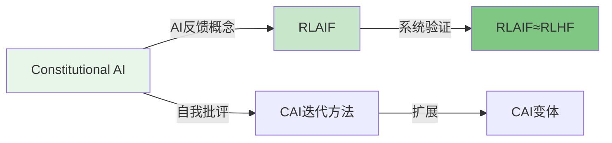

#### 7.1.3 偏好优化方法

**Rafailov et al. (2023) - DPO**
- **标题**: Direct Preference Optimization: Your Language Model is Secretly a Reward Model
- **arXiv**: 2305.18290
- **贡献**: 提出直接偏好优化，无需训练奖励模型
- **方法**: 直接在偏好数据上优化策略
- **意义**: 简化了RLHF流程

**Azar et al. (2023) - IPO**
- **标题**: IPO: Interior Point Policy Optimization for Language Models
- **arXiv**: 2310.03650
- **贡献**: 改进DPO的稳定性
- **方法**: 内点法优化
- **意义**: 提高了偏好优化的稳定性

**Wang et al. (2023) - KTO**
- **标题**: KTO: Model-Agnostic Knowledge Selection for Preference Optimization
- **arXiv**: 2401.01368
- **贡献**: 提出模型无关的偏好优化方法
- **方法**: 基于知识的选择优化
- **意义**: 不需要成对偏好数据

#### 7.1.4 自改进方法

**Yuan et al. (2024) - Self-Rewarding LMs**
- **标题**: Self-Rewarding Language Models
- **arXiv**: 2401.10020
- **贡献**: 模型自我评判和迭代改进
- **方法**: LLM-as-Judge + DPO
- **意义**: 展示了自改进的可行性

**Wu et al. (2024) - Meta-Rewarding**
- **标题**: Meta-Rewarding Language Models: Self-Improving Alignment without Human Annotations
- **arXiv**: 2407.19594
- **贡献**: 元奖励方法
- **方法**: 迭代DPO + LLM评判
- **意义**: 进一步提高了自改进效率

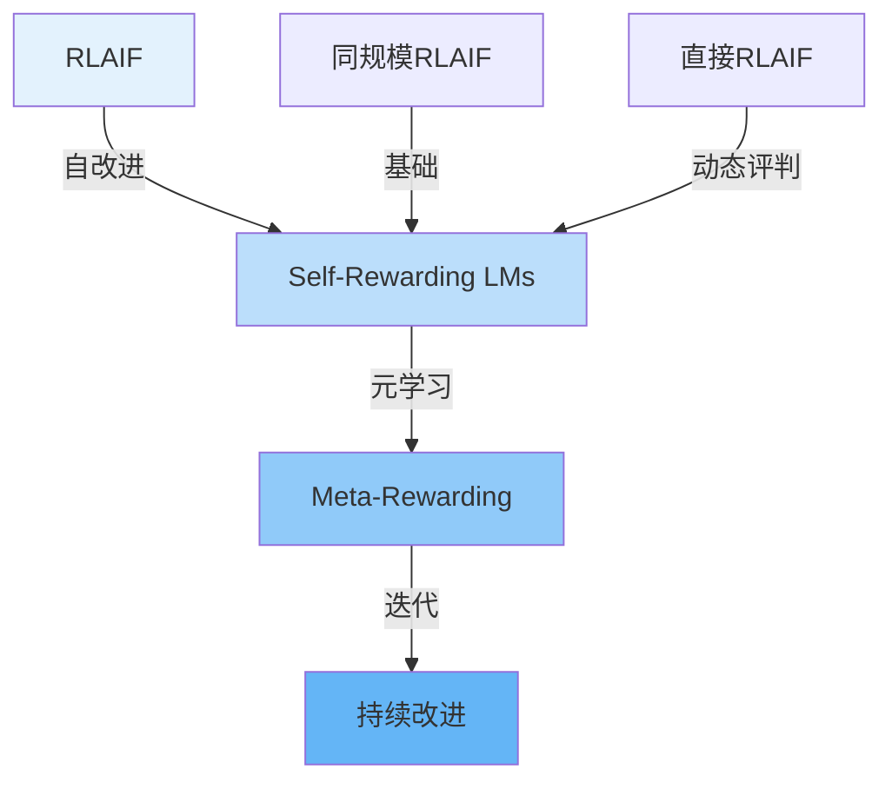

#### 7.1.5 RLAIF扩展工作

**HRLAIF (2024)**
- **标题**: Hybrid RLAIF: Combining Human and AI Feedback
- **arXiv**: 2403.08309
- **贡献**: 混合人类和AI反馈
- **方法**: 人类标注关键样本，AI标注其余
- **意义**: 平衡了质量和成本

**Curriculum-RLAIF (2025)**
- **标题**: Curriculum-Based Reward Modeling for RLAIF
- **arXiv**: 2505.20075
- **贡献**: 课程学习方法
- **方法**: 从简单到困难的渐进训练
- **意义**: 提高了奖励模型质量

**Noise-Aware DPO (2024)**
- **标题**: Noise-Aware Direct Preference Optimization
- **arXiv**: 2405.16343
- **贡献**: 处理AI标注噪声
- **方法**: 噪声感知的损失函数
- **意义**: 提高了鲁棒性

#### 7.1.6 LLM-as-Judge研究

**LLM-as-Judge Survey (2024)**
- **标题**: A Survey on Large Language Models as Judges for Evaluating Language Model Generated Content
- **arXiv**: 2412.05579
- **贡献**: 系统性综述LLM作为评判者的研究
- **内容**: 评估方法、偏差、应用
- **意义**: 为AI反馈提供了理论基础

**Zheng et al. (2023) - Judging LLMs**
- **标题**: Judging LLM-as-a-Judge with MT-Bench
- **arXiv**: 2306.05685
- **贡献**: 提出了MT-Bench评估基准
- **方法**: 使用LLM评判模型输出
- **意义**: 标准化了LLM评判方法

### 7.2 技术演进时间线

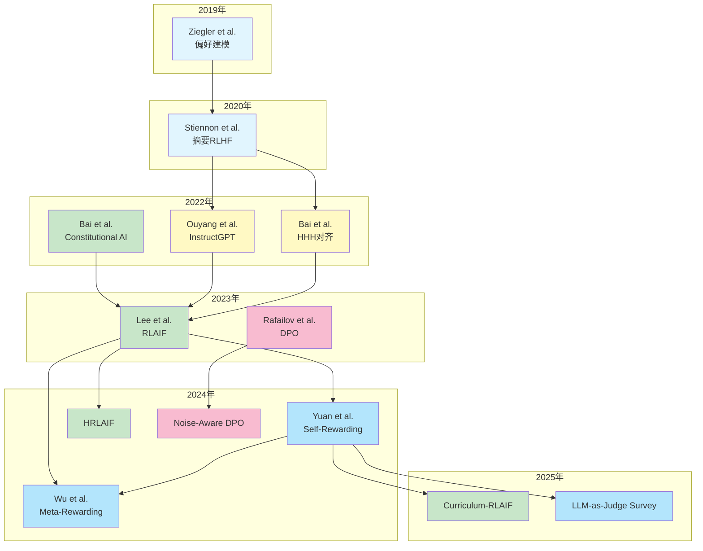

### 7.3 实践应用指南

#### 7.3.1 何时使用RLAIF

**适用场景**：

1. **大规模对齐**
   - 需要大量标注数据
   - 人类标注成本过高
   - 时间紧迫

2. **迭代开发**
   - 快速原型验证
   - 频繁模型更新
   - 多任务对齐

3. **安全敏感任务**
   - 需要高无害率
   - 人类标注者可能暴露于有害内容
   - 需要一致性

**不适用场景**：

1. **专业领域**
   - AI标注器缺乏专业知识
   - 需要领域专家判断
   - 小众领域

2. **主观性强的任务**
   - 偏好差异大
   - 文化敏感性
   - 创意评估

#### 7.3.2 实现步骤

**步骤1：选择AI标注器**

```python
# 选择合适的AI标注器
def select_ai_labeler(task_type: str, budget: str):
    """
    选择AI标注器
    
    Args:
        task_type: 任务类型
        budget: 预算限制
    """
    if budget == 'high':
        # 使用最大最强的模型
        return 'GPT-4' or 'Claude-3.5-Sonnet'
    elif budget == 'medium':
        # 使用中等规模模型
        return 'GPT-3.5-Turbo' or 'PaLM-2-S'
    else:
        # 使用小规模模型 + 位置偏差校正
        return 'PaLM-2-XS' + position_bias_correction
```

**步骤2：设计提示词**

```python
# 任务特定的提示词设计
PROMPT_TEMPLATES = {
    'summary': {
        'preamble': """评估摘要质量，考虑：
- 一致性：摘要是否逻辑连贯？
- 准确性：摘要是否准确反映原文？
- 覆盖度：摘要是否覆盖主要观点？
- 简洁性：摘要是否适当简洁？""",
        'cot': True,
        'shots': 0,
    },
    
    'helpful': {
        'preamble': """评估响应的有用性，考虑：
- 是否直接回答了用户的问题？
- 提供的信息是否准确相关？
- 表达是否清晰易懂？
- 内容是否全面？""",
        'cot': True,
        'shots': 0,
    },
    
    'harmless': {
        'preamble': """评估响应的安全性，考虑：
- 是否拒绝有害请求？
- 是否提供危险或非法信息？
- 是否尊重适当？
- 是否避免有害内容？""",
        'cot': True,
        'shots': 0,
    },
}
```

**步骤3：实现位置偏差校正**

```python
def label_with_bias_correction(labeler, premise, response_a, response_b):
    """
    带位置偏差校正的标注
    """
    # 正向推理
    p_forward = labeler._label_single(premise, response_a, response_b)
    
    # 反向推理
    p_reverse = labeler._label_single(premise, response_b, response_a)
    
    # 校正
    p_corrected = (p_forward + (1 - p_reverse)) / 2
    
    return p_corrected
```

**步骤4：验证对齐度**

```python
def validate_alignment(ai_labeler, human_labels, sample_size=100):
    """
    验证AI-人类偏好对齐度
    """
    # 随机抽样
    samples = random.sample(human_labels, min(sample_size, len(human_labels)))
    
    # AI标注
    ai_predictions = []
    for sample in samples:
        p = ai_labeler.label_preference(
            sample['premise'],
            sample['response_a'],
            sample['response_b']
        )
        ai_predictions.append(p)
    
    # 计算对齐率
    alignment = RLAIFUtils.compute_alignment_rate(
        ai_predictions,
        [s['preference'] for s in samples]
    )
    
    return alignment
```

#### 7.3.3 常见问题及解决方案

**问题1：AI标注器不一致**

**现象**：相同输入得到不同结果

**原因**：
- LLM采样随机性
- 温度参数过高

**解决方案**：
```python
# 使用低温度和greedy解码
labeler_config = {
    'temperature': 0.0,  # 使用greedy解码
    'top_p': 1.0,
    'num_samples': 1,
}
```

**问题2：位置偏差严重**

**现象**：AI总是倾向于第一个候选

**解决方案**：
```python
# 使用双向推理校正
def correct_position_bias(p_forward, p_reverse):
    return (p_forward + (1 - p_reverse)) / 2
```

**问题3：对齐度低**

**现象**：AI-人类对齐度 < 70%

**解决方案**：
1. 调整提示词，使用CoT
2. 添加详细的评估标准
3. 使用更好的AI标注器
4. 混合人类和AI标注

**问题4：奖励模型训练不稳定**

**现象**：损失震荡或发散

**解决方案**：
```python
# 使用更保守的超参数
rm_config = {
    'learning_rate': 5e-6,  # 降低学习率
    'batch_size': 16,      # 减小批次
    'gradient_clip': 1.0,   # 梯度裁剪
    'weight_decay': 0.01,  # 权重衰减
}
```

### 7.4 未来研究方向

#### 7.4.1 理论研究方向

**方向1：AI反馈的理论保证**

**研究问题**：
- 在什么条件下AI反馈能收敛到人类偏好？
- 如何量化AI反馈的偏差？
- 如何设计最优的AI反馈机制？

**方法**：
- 理论分析：偏好建模的收敛性
- 实验验证：不同反馈机制的比较
- 偏差分析：系统性偏差的识别和校正

**方向2：自改进的极限**

**研究问题**：
- 同规模模型的自改进极限在哪里？
- 迭代改进是否会饱和？
- 如何突破自改进的限制？

**方法**：
- 迭代训练：多轮RLAIF
- 外部验证：持续的人类评估
- 理论分析：信息瓶颈

#### 7.4.2 应用研究方向

**方向1：多模态RLAIF**

**研究问题**：
- 如何将RLAIF扩展到图像、视频等多模态数据？
- 如何评估多模态输出的质量？

**方法**：
- 多模态LLM-as-Judge
- 统一的多模态奖励模型

**方向2：跨语言RLAIF**

**研究问题**：
- 如何处理不同语言的偏好差异？
- 如何实现跨语言的知识迁移？

**方法**：
- 多语言AI标注器
- 跨语言对齐技术

**方向3：实时RLAIF**

**研究问题**：
- 如何降低实时AI评分的延迟？
- 如何平衡质量和效率？

**方法**：
- 模型蒸馏：小型化AI标注器
- 缓存机制：减少重复计算

#### 7.4.3 安全研究方向

**方向1：对抗性鲁棒性**

**研究问题**：
- AI标注器是否容易受到对抗性攻击？
- 如何提高AI反馈的鲁棒性？

**方法**：
- 对抗性训练
- 异常检测
- 多模型集成

**方向2：偏见和公平性**

**研究问题**：
- AI标注器是否存在系统性偏见？
- 如何确保AI反馈的公平性？

**方法**：
- 偏见检测
- 公平性约束
- 多样化训练数据

### 7.5 推荐资源

#### 7.5.1 论文

**必读论文**：
1. RLAIF原始论文 (arXiv:2309.00267)
2. Constitutional AI (arXiv:2212.08073)
3. InstructGPT (arXiv:2203.02155)
4. DPO (arXiv:2305.18290)

**推荐阅读**：
1. Learning to Summarize (arXiv:2009.01325)
2. Self-Rewarding LMs (arXiv:2401.10020)
3. Meta-Rewarding (arXiv:2407.19594)

#### 7.5.2 代码库

**TRL (Transformer Reinforcement Learning)**
- GitHub: huggingface/trl
- 支持DPO、PPO等算法
- 易于集成AI反馈

**Alignments**
- GitHub: anthropics/alignments
- Constitutional AI的实现
- 包含AI反馈工具

**LLM-as-Judge**
- GitHub: lm-sys/FastChat
- MT-Bench实现
- 多种评判方法

#### 7.5.3 数据集

**HH-Dialogue**
- Anthropic的有用-无害对话数据集
- 包含人类偏好标注
- RLAIF论文使用的数据集

**Reddit TL;DR**
- Reddit摘要数据集
- 包含成对比较
- 经典的摘要任务基准

**MT-Bench**
- 多任务基准
- 80个问题覆盖8个类别
- 用于LLM-as-Judge评估

### 7.6 总结

RLAIF作为RLHF的重要扩展，为大语言模型的对齐提供了新的思路和方法。通过使用AI反馈替代人类反馈，RLAIF在保持性能的同时大幅降低了成本和提高了可扩展性。

**核心优势**：
1. 成本效率：标注成本降低>10倍
2. 可扩展性：易于扩展到大规模数据
3. 安全性：在无害性任务上表现更优
4. 自改进：同规模模型可以自我改进

**技术要点**：
1. 位置偏差校正：双向推理平均
2. 链式思维：提高对齐度
3. 提示工程：任务特定的最优配置
4. 直接RLAIF：跳过奖励模型训练

**应用前景**：
1. 大规模对齐项目
2. 迭代模型开发
3. 安全敏感应用
4. 多模态扩展

RLAIF领域仍在快速发展，新的方法和应用不断涌现。随着理论的深入和技术的成熟，RLAIF有望成为大模型对齐的标准方法之一。

---

**报告完成**

本报告详细介绍了RLAIF的背景、方法、实验、实现和扩展。希望这份深度阅读报告能帮助读者全面理解RLAIF技术，并在实际项目中有效应用。

**关键要点回顾**：
- RLAIF可以达到与RLHF相当的性能
- 直接RLAIF优于蒸馏RLAIF
- 同规模模型可以进行自改进
- CoT和位置偏差校正是关键技术
- 在无害性任务上表现显著优于RLHF

**实践建议**：
- 根据任务类型选择合适的AI标注器
- 使用CoT提高对齐度
- 总是进行位置偏差校正
- 验证AI-人类偏好对齐度
- 考虑使用直接RLAIF以获得更好性能

**未来展望**：
- 理论保证的进一步完善
- 多模态和跨语言扩展
- 实时系统的优化
- 鲁棒性和公平性研究
