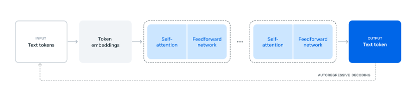
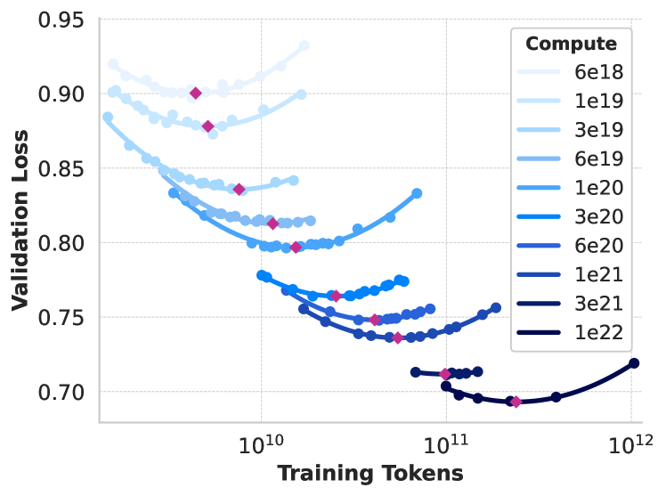
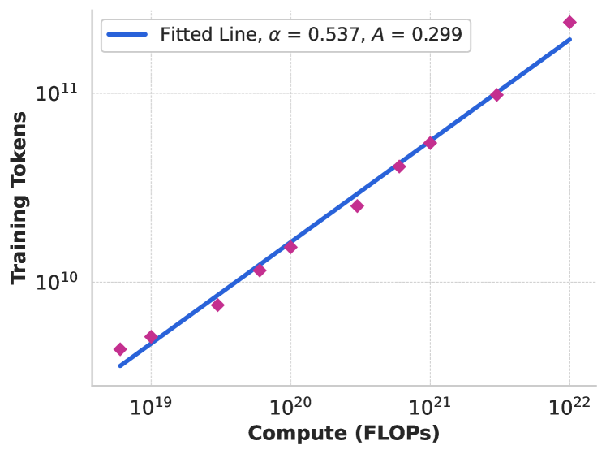
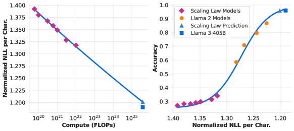
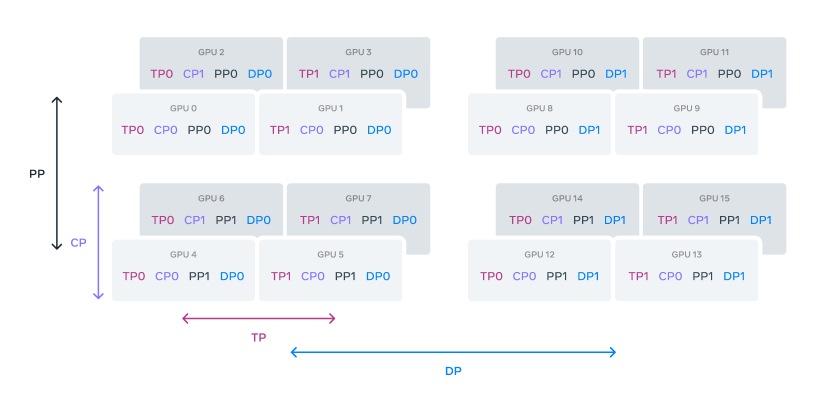

# Llama 3 深度精读报告（完整精读报告：预训练、后训练、实验评估与多模态扩展）

> **论文**：《The Llama 3 Herd of Models》
> **作者**：Meta AI, Llama Team（400+ 作者）
> **发表**：arXiv:2407.21783，2024 年 7 月（v3 于 2024 年 11 月更新）
> **代码 / 权重**：https://github.com/meta-llama/llama-models（open-weight）

---

## 第 1 章 概述

### 1.1 一句话定位

Llama 3 是 Meta AI 发布的一组 **dense Transformer** 大语言模型家族（**非 MoE**），覆盖 **8B / 70B / 405B** 三个参数规模，同时发布了安全护栏模型 **Llama Guard 3**。其核心主张是：在开源权重的前提下，通过 **数据、规模、工程简洁性** 三条路径，把能力推到可与闭源顶尖模型（GPT-4o、Claude 3.5 Sonnet）正面竞争的水平。

### 论文图表概览

| 编号 | 内容 |
|------|------|
| **Figure 1** | Llama 3 整体架构与训练流程（预训练 → 后训练 → 多模态扩展） |
| **Figure 2** | Scaling Law IsoFLOPs 曲线（6×10¹⁸ 至 10²² FLOPs） |
| **Figure 3** | 计算最优模型 token 数与 FLOPs 的关系拟合曲线 |
| **Figure 4** | Scaling Law 对 ARC Challenge 的预测（两阶段方法验证） |
| **Table 1** | Llama 3 模型家族概览（10 个模型变体） |
| **Table 2** | 关键 Benchmark 对比（8B/70B/405B vs GPT-4/Claude） |
| **Table 3** | 模型超参数配置（8B/70B/405B） |
| **Table 4** | 405B 预训练 Scaling 配置与 MFU |

Llama 3 采用标准的 Dense Transformer 架构，整体训练流程分为预训练、后训练和多模态扩展三阶段（图1）。

*图1：Llama 3 的三阶段训练流水线。预训练阶段在 15.6T tokens 上训练 405B 参数模型，后训练阶段通过 SFT+RS+DPO 多轮迭代对齐人类偏好，多模态阶段通过 freeze-LLM + train-adapter 范式扩展图像/视频/语音理解能力。*

### 1.2 模型家族（Table 1）

| Model | Finetuned | Multilingual | Long context | Tool use | Release |
|-------|:---------:|:-----------:|:-----------:|:-------:|:-------:|
| Llama 3 8B | ✗ | ✗ | ✗ | ✗ | Apr 2024 |
| Llama 3 8B Instruct | ✓ | ✗ | ✗ | ✗ | Apr 2024 |
| Llama 3 70B | ✗ | ✗¹ | ✗ | ✗ | Apr 2024 |
| Llama 3 70B Instruct | ✓ | ✗ | ✗ | ✗ | Apr 2024 |
| Llama 3.1 8B | ✗ | ✓ | ✓ | ✗ | Jul 2024 |
| Llama 3.1 8B Instruct | ✓ | ✓ | ✓ | ✓ | Jul 2024 |
| Llama 3.1 70B | ✗ | ✓ | ✓ | ✗ | Jul 2024 |
| Llama 3.1 70B Instruct | ✓ | ✓ | ✓ | ✓ | Jul 2024 |
| Llama 3.1 405B | ✗ | ✓ | ✓ | ✗ | Jul 2024 |
| Llama 3.1 405B Instruct | ✓ | ✓ | ✓ | ✓ | Jul 2024 |

从 Table 1 可以读出几个关键信息：

1. **两阶段发布策略**：2024 年 4 月先放出 8B / 70B（基础版 + Instruct 版），2024 年 7 月放出旗舰 405B，并将全系列升级为 3.1 版本。3.1 相比 3.0，在 **multilingual（多语言）、long context（长上下文）、tool use（工具调用）** 三项能力上做了扩展。

2. **能力与版本的关系**：
   - **基础模型（base）** 从不支持 tool use —— tool use 是 instruction tuning 之后才解锁的能力，**仅 Instruct 版本具备**。
   - **multilingual 与 long context**：在 3.0 阶段仅 70B 有部分多语言能力（表中 ✗¹ 标注），到 3.1 阶段全系列标配。这说明 8B / 70B 的 3.1 升级并非简单微调，而是通过 **continued pre-training** 注入了新能力。

3. **参数规模的部署定位**：8B 面向端侧 / 单卡部署，70B 面向中等规模服务，405B 作为旗舰冲击 SOTA。

### 1.3 关键结果（Table 2）

| Benchmark | Llama 3 8B | Llama 3 70B | Llama 3 405B | GPT-4 (0125) | GPT-4o | Claude 3.5 Sonnet |
|-----------|:---------:|:----------:|:-----------:|:-----------:|:-----:|:----------------:|
| MMLU (5-shot) | 69.4 | 83.6 | 87.3 | 85.1 | 89.1 | 89.9 |
| MMLU-Pro (5-shot, CoT) | 48.3 | 66.4 | 73.3 | 64.8 | 74.0 | 77.0 |
| HumanEval (0-shot) | 72.6 | 80.5 | 89.0 | 86.6 | 90.2 | 92.0 |
| GSM8K (8-shot, CoT) | 84.5 | 95.1 | 96.8 | 94.2 | 96.1 | 96.4 |
| MATH (0-shot, CoT) | 51.9 | 68.0 | 73.8 | 64.5 | 76.6 | 71.1 |
| GPQA (0-shot, CoT) | 32.8 | 46.7 | 51.1 | 41.4 | 53.6 | 59.4 |
| ARC Challenge (0-shot) | 83.4 | 94.8 | 96.9 | 96.4 | 96.7 | 96.7 |

横向对比的解读：

- **405B 的定位**：在多数 benchmark 上接近或超越 GPT-4（0125），部分指标追平甚至超过 GPT-4o。例如 **MATH（0-shot CoT）** 上 405B 得 **73.8**，反超 Claude 3.5 Sonnet 的 71.1；**GSM8K** 达 **96.8**，超过 GPT-4o 的 96.1。

- **仍有差距的地方**：**GPQA**（研究生级科学问答）上 405B 仅 **51.1**，落后于 Claude 3.5 Sonnet（59.4）和 GPT-4o（53.6）。这提示**前沿推理 / 专业知识**仍是开源模型的相对短板。

- **小模型的竞争力**：8B 在 **HumanEval（0-shot）达 72.6**、**GSM8K 达 84.5**，对 8B 参数量而言已相当可观，体现了**数据质量对小模型的杠杆效应**。

- **整体趋势**：从 8B → 70B → 405B，几乎所有 benchmark 单调上升，说明**规模红利尚未见顶**；但增幅在缩小（如 GSM8K 从 70B 到 405B 仅 +1.7 个百分点），提示**简单 benchmark 正在饱和**，需要 GPQA、MMLU-Pro 这类更难的测试来区分头部模型。

### 1.4 三大核心杠杆

论文将 Llama 3 的进步归结为三个杠杆：

**1. Data（数据）**
- 预训练语料约 **15T tokens**（多语言），知识截止到 2023 年底。
- 对比：Llama 2 仅 **1.8T tokens**，即数据量扩大约 **8 倍**。
- 这是最直接、ROI 最高的杠杆 —— 论文在 Ch2 花大量篇幅论证数据质量管线。

**2. Scale（规模）**
- 旗舰模型 **405B** 参数。
- 训练算力约 **3.8×10²⁵ FLOPs**，约为 Llama 2 的 **50 倍**。
- 规模的扩张依赖于 scaling laws 的外推预测（见 3.3）。

**3. Managing Complexity（控制复杂度）**
- 架构上选择 **dense Transformer 而非 MoE**，用工程确定性换取架构简单性。
- 后训练对齐选择 **SFT + Rejection Sampling (RS) + DPO** 的简洁流程，而非 PPO 这类更复杂、更难稳定的 RL 方法。
- 这是一条重要的工程哲学：在能达成目标的前提下，**优先选择更简单、更可控的方案**，降低大规模训练的故障风险。

> **核心洞察**：三条杠杆并非独立 —— 数据质量的提升降低了对复杂架构和复杂对齐方法的依赖，使得"**简单架构 + 简洁对齐 + 大数据 + 大算力**"的组合成为可行路径。

---

## 第 2 章 预训练数据

### 2.1 数据治理（Data Curation）

预训练语料约 **15T tokens**，覆盖多语言，知识截止 2023 年底。Llama 3 的数据管线是一个多层过滤体系。

**清洗与过滤层：**

- **PII / 安全过滤**：移除个人隐私信息和不安全内容。
- **自定义 HTML parser**：专门解析网页结构，**移除 markdown**（清洗阶段去除网页中 markdown 噪音，而非最终数据不含结构）。
- **去重（De-duplication）三级策略**：
  - **URL 级**：同一 URL 的页面去重。
  - **文档级**：使用 **MinHash** 算法进行近似去重。
  - **行级**：采用 **ccNet 风格**的行级去重，在 **30M 文档**中重复超过 **6 次**的行被移除。

**启发式过滤（Heuristic Filtering）：**

- **n-gram 覆盖率**：检测重复 n-gram 过多的低质内容。
- **dirty word 计数**：过滤色情 / 垃圾内容。
- **token 分布的 KL 散度**：衡量文档 token 分布与整体语料的偏离程度，剔除异常文档。

**基于模型的质量分类：**

- **fasttext Wikipedia 分类器**：快速初筛高质量知识性内容。
- **DistilRoberta**：在 **Llama 2 的预测结果**上训练 —— 即把 Llama 2 当作"质量标注器"的弱监督来源，蒸馏出一个高效的质量分类器。这是一个巧妙的**自举（bootstrapping）思路**：用上一代模型的能力为下一代模型筛选数据。

**代码与推理数据：**

- 采用**领域专用（domain-specific）管线**。
- 同样使用 DistilRoberta 分类器，在 **Llama 2 的标注**上训练，针对代码和推理内容做质量筛选。

### 2.2 数据配比（Data Mix）

预训练数据的领域配比为：

| 领域 | 占比 |
|------|:----:|
| 通用知识（general knowledge） | 50% |
| 数学 / 推理（math & reasoning） | 25% |
| 代码（code） | 17% |
| 多语言（multilingual） | 8% |

几个值得注意的点：

- **数学 / 推理 + 代码合计占 42%**，远高于一般 web 语料的自然分布。这直接解释了 Llama 3 在 MATH、GSM8K、HumanEval 上的强势表现 —— **能力是"喂"出来的**。
- **多语言仅 8%**，却要覆盖 176 种语言（见 2.3），意味着每种非英语语言的人均数据量极低，这也解释了为何多语言能力相对薄弱。

**退火（Annealing）策略：**

- 在预训练**末期**，加入少量**高质量 code 和 math 数据**。
- 效果（8B 模型）：
  - **GSM8K 提升 +24.0 个百分点**
  - **MATH 提升 +6.4 个百分点**
- 但对 **405B 几乎可忽略（negligible）**。

> **核心洞察**：退火对小模型效果显著、对大模型微弱，揭示了一个规律 —— **小模型更依赖"临考突击"式的数据注入**：容量有限，需要高密度高质量样本在最后阶段"固化"能力；大模型参数冗余度高，末期少量数据难以产生边际增益。这一发现对**资源受限场景下训练小模型**具有直接指导价值。

### 2.3 多语言（Multilingual）

- 使用 **fasttext 语言识别**，覆盖 **176 种语言**。
- 采用**语言专属启发式规则** + **多语言 Llama 2 质量分类器**进行质量筛选。
- 即多语言质量分类同样复用了 Llama 2 的能力（延续 2.1 的自举思路）。

> 注意：尽管识别覆盖 176 种语言，但语料中多语言仅占 8%，且这些 token 需在 176 种语言间摊薄，**低资源语言的数据极度稀缺** —— 这是 Llama 3 多语言能力的结构性瓶颈。

---

## 第 3 章 模型架构

### 3.1 架构超参数（Table 3）

| Hyperparameter | 8B | 70B | 405B |
|:--------------|:---:|:---:|:----:|
| Layers | 32 | 80 | 126 |
| Model Dimension | 4,096 | 8,192 | 16,384 |
| FFN Dimension | 14,336 | 28,672 | 53,248 |
| Attention Heads | 32 | 64 | 128 |
| Key/Value Heads | 8 | 8 | 8 |
| Peak LR | 3×10⁻⁴ | 1.5×10⁻⁴ | 8×10⁻⁵ |
| Activation | SwiGLU | SwiGLU | SwiGLU |
| Vocab Size | 128,000 | 128,000 | 128,000 |
| Positional Embeddings | RoPE (θ=500,000) | RoPE (θ=500,000) | RoPE (θ=500,000) |

从 Table 3 可读出规模演化的规律：

- **深度 vs 宽度**：从 8B → 405B，层数从 32 → 126（约 4×），模型维度从 4,096 → 16,384（4×），FFN 维度从 14,336 → 53,248（约 3.7×）。深度和宽度同步扩张。
- **KV heads 固定为 8**：三个规模全部使用 8 个 KV heads（见 3.2 的 GQA 设计），这是为推理效率做的**一致约束**。
- **Peak LR 随规模递减**：8B 为 3×10⁻⁴，70B 为 1.5×10⁻⁴，405B 为 8×10⁻⁵。**大模型用更小的学习率** —— 这是大规模训练的通用经验：大 batch + 大参数量需要更保守的更新步长以保证稳定性。
- **架构组件统一**：全部使用 **SwiGLU** 激活、**128,000** 词表、**RoPE（θ=500,000）** 位置编码。"一套配方放缩到三个尺寸"本身就是**控制复杂度**哲学的体现。

### 3.2 关键设计选择

**1. GQA（Grouped Query Attention）**

- 所有模型统一使用 **8 个 KV heads**（Query heads 分别为 32 / 64 / 128）。
- 收益：**更快的推理速度** + **更小的 KV cache**。
- 本质是 Query 多、KV 少的分组共享，在质量几乎无损的前提下大幅压缩 KV cache 的显存占用。

**2. Document Mask（文档级掩码）**

- 在同一序列内打包多个文档时，**阻止不同文档之间的 self-attention**。
- 意义：防止跨文档信息泄漏 / 污染，保证每个文档的注意力计算是"干净"的。这对训练效率（序列打包提升利用率）与训练质量（无跨文档干扰）是双赢设计。

**3. 128K Token 词表**

- 组成：**100K 来自 tiktoken** + **28K 专用于非英语 token**。
- 效果：更好的压缩率，**chars/token 从 3.17 提升到 3.94**（每个 token 承载更多字符，同样文本所需 token 更少）。
- 意义：对多语言和代码场景，更大的词表直接降低序列长度 → 降低训练和推理成本。

**4. RoPE 基频 θ = 500,000**

- 相比更小的基频，500,000 支持更长的上下文，**有效范围可达 32,768**。
- 为 Llama 3.1 的 **128K 上下文**奠定了位置编码基础。

**5. 128K 上下文（Llama 3.1）**

- 通过 **continued pre-training（继续预训练）** 实现，而非从头重训。
- 即在已有短上下文模型基础上，用长上下文数据继续训练，逐步外推上下文窗口。

### 3.3 Scaling Laws（缩放定律）

Llama 3 采用**两阶段方法论**将"损失"与"下游能力"挂钩：

**阶段一：NLL → FLOPs 的相关性**

建立 validation loss（NLL, negative log-likelihood）与训练算力（FLOPs）的关系。

**阶段二：NLL → Accuracy 的 sigmoid 映射**

再把 loss 映射到下游任务准确率，用 **sigmoid 函数**拟合"loss 下降 → 准确率上升"的饱和曲线。

**IsoFLOPs 实验（等算力扫描）：**

- 算力范围：**6×10¹⁸ 到 10²² FLOPs**
- 模型规模：**40M 到 16B 参数**
- 在固定算力下，扫描不同模型规模，找到每个算力点上的最优模型大小。

**计算最优公式：**

*图2：6×10¹⁸ 至 10²² FLOPs 下的 IsoFLOPs 曲线。每条抛物线代表一个固定算力预算，其最低点即该算力下的计算最优模型。随算力增加,曲线在最小值附近变平坦,说明旗舰模型对规模-token 权衡的敏感性降低。*

$$N^{\star}(C) = 0.29 \times C^{0.53}$$

其中 $N^{\star}$ 为最优参数量，$C$ 为算力预算（FLOPs）。指数 **0.53 略大于 0.5**，意味着最优参数量随算力**略超线性**于 $\sqrt{C}$ 增长。

*图3：拟合曲线 $N^{\star}(C) = 0.29 \times C^{0.53}$ 与实际 IsoFLOPs 最优点的对比。外推至 $3.8 \times 10^{25}$ FLOPs 时，预测最优模型为 402B 参数 / 16.55T tokens，与最终 405B 的选择高度吻合。*

*图4：两阶段预测法的实测验证。左图展示了 NLL 与训练 FLOPs 的线性相关性，右图通过 sigmoid 映射将 NLL 转换为准确率预测。红色虚线为外推至 405B 规模的预测值，实际性能略高于预测，验证了方法论的保守性。*

**外推到旗舰规模：**

- 将公式外推到 **3.8×10²⁵ FLOPs** → 预测最优为 **402B 参数 / 16.55T tokens**。
- 最终选择 **405B**（与预测的 402B 高度吻合）。

> **核心洞察**：这套方法论的精妙之处在于**两阶段解耦** —— 先用可控成本的小模型实验建立 loss↔FLOPs 律，再用 sigmoid 把 loss↔accuracy 打通，从而能在**训练旗舰之前**就预测其下游表现。这是大规模训练中"**用小模型的实验为超大模型下注**"的典范，极大地降低了 405B 这种量级训练的决策风险。

### 3.4 训练基础设施

405B 的训练是一个超大规模系统工程。

**硬件：**

- 最多 **16K 张 H100 GPU**（700W TDP，80GB HBM3）。
- 平台：**Grand Teton**，配套 **NVLink** 高速互联。

**网络：**

- 405B 使用 **RoCE**（Arista 7800 交换机 + Minipack2）；较小模型使用 **Infiniband**。
- 互联带宽 **400 Gbps**，**3 层 Clos 网络**，最大集群规模 **24K GPU**。

**存储：**

- **Tectonic 分布式文件系统**：**240 PB** 容量，跨 **7,500 台服务器**，持续吞吐 **2 TB/s**。

**并行策略 —— 4D 并行：**

*图5：4D 并行分组排序 TP→CP→PP→DP 示意。GPU 按 [TP, CP, PP, DP] 顺序分组成四维网格：TP 在 NVLink 域内、CP 处理序列切片、PP 跨层流水、DP 全集群数据并行。最内层 TP 要求最高带宽，最外层 DP 容忍高延迟。*

$$\text{TP} \rightarrow \text{CP} \rightarrow \text{PP} \rightarrow \text{DP (FSDP)}$$

- **TP（Tensor Parallelism，张量并行）**：层内切分矩阵运算。
- **CP（Context Parallelism，上下文并行）**：沿序列维度切分（服务于长上下文）。
- **PP（Pipeline Parallelism，流水线并行）**：按层切分到不同设备。
- **DP（Data Parallelism, FSDP）**：数据并行 + 分片参数（Fully Sharded Data Parallel）。

层级顺序 TP→CP→PP→DP 的设计意图是：**把通信最密集的并行放在网络拓扑最近的层级**（TP 在机内 NVLink 域），把通信较稀疏的 DP 放在最外层（跨机网络域），以最小化通信开销。

**效率与稳定性：**

- **BF16 MFU（Model FLOPs Utilization）：38%–43%** —— 在万卡规模下能维持近半的算力利用率，是工程上的高水准。
- **数值稳定性保障**：
  - **FP32 梯度累加**（gradient accumulation）。
  - **FP32 reduce-scatter**（FSDP 的参数聚合用高精度）。
  - 即在 BF16 计算的同时，关键累加与通信环节回退到 FP32，防止大规模训练中的精度漂移和发散。

> **工程启示**：Llama 3 的基础设施章节实质上是一份"**如何在万卡规模上稳定跑通 BF16 训练**"的工程指南 —— 核心矛盾是**算力利用率（MFU）**与**数值稳定性**之间的权衡，而 **4D 并行的拓扑感知编排 + 关键路径 FP32** 是其解法。

---

## 第 4 章 Pre-training

### 4.1 Pre-training Recipe

Llama 3 系列中规模最大的 **405B** 模型在 **15.6T tokens** 数据上完成预训练，使用 **16,384 块 H100-80GB GPU**，总计算开销约为 **30.84M GPU-hours**。训练上下文初始为 **8K**，随后通过 continued pre-training 扩展至 **128K**。

核心 optimizer 与 schedule 配置如下：

| 配置项 | 设置 |
|---|---|
| Optimizer | AdamW |
| β₁ / β₂ / ε | 0.9 / 0.95 / 10⁻⁵ |
| LR schedule | Cosine decay，2,000 steps warmup |
| 初始 batch size | 4M tokens |
| 扩展后 batch size | 8M tokens（训练 252M tokens 后） |
| Weight decay | 0.1 × LR（每步） |
| Gradient clipping | 1.0 |

Cosine LR schedule 的形式为：

$$\eta_t = \eta_{\min} + \frac{1}{2}\left(\eta_{\max} - \eta_{\min}\right)\left(1 + \cos\left(\frac{\pi t}{T}\right)\right)$$

其中 warmup 阶段（前 2,000 步）将 LR 从 0 线性增长至 $\eta_{\max}$，随后按 cosine 曲线衰减至 $\eta_{\min}$。

**Batch size 动态调整策略**：训练初期使用 4M tokens 的 batch size 以保证收敛稳定性，在累积训练 **252M tokens** 后将 batch size 提升至 8M tokens。这种 warmup-style batch size scaling 能在早期保持梯度高保真度，在后期充分利用硬件算力，提升整体吞吐量与收敛效率。

### 4.2 Annealing

Annealing 阶段在训练末期执行，专注于 **high-quality code 与 math data**。关键设计：

- 在最后约 **40B tokens** 上 linearly 将 LR 衰减至 0
- 数据配比：**30% 来自新的高质量数据集 + 70% 来自默认 mix**

效果因模型规模而异：

| 模型规模 | GSM8k 提升 | MATH 提升 | 总体效果 |
|---|---|---|---|
| 8B | +24% | +6.4% | 显著 |
| 405B | — | — | 几乎可忽略（negligible） |

这一现象体现了 **scaling law 下的 diminishing returns**：较小模型能从 domain-specific annealing 中获益显著，而 405B 这类大模型已在前序训练中充分习得 code/math 知识，退火带来的增量收益有限。

### 4.3 Infrastructure

| 基础设施组件 | 规格 |
|---|---|
| GPU | 16,384 × H100-80GB |
| 总 GPU-hours | 30.84M（405B pre-training） |
| Scheduler | MAST |
| 存储 | Tectonic（240PB，2TB/s 持续吞吐） |
| 并行策略 | 4D Parallelism：TP(8) × CP(1→16) × PP(16) × DP(64→128) |
| BF16 MFU | 38%–43% |
| 通信库 | NCCLX（fork 自 Nvidia NCCL） |
| 初始序列长度 | 8K |
| 扩展后序列长度 | 128K（借助 Context Parallelism） |

每个 GPU 的 checkpoint 大小范围为 **1MB–4GB**，需要高效的 checkpoint/resume 机制来支撑超大规模训练的容错与断点恢复。NCCLX 是 Meta 对 Nvidia NCCL 的 fork 版本，针对其集群网络拓扑做了针对性优化，是 BF16 MFU 达到 38%–43% 的关键之一。

### 4.4 4D Parallelism Details

Llama 3 将四种并行策略组合使用，整体并行度为各维度乘积：

$$\text{Total Parallelism} = N_{\text{TP}} \times N_{\text{CP}} \times N_{\text{PP}} \times N_{\text{DP}}$$

对于 405B 训练：$8 \times (1\text{-}16) \times 16 \times (64\text{-}128)$，正好匹配 16,384 块 GPU 的集群规模。

各策略职责与核心机制：

| 并行策略 | 分割对象 | 核心机制 |
|---|---|---|
| Tensor Parallelism (TP) | 权重张量 | 将权重矩阵沿某一维度切分，每层计算后 all-reduce 同步 |
| Pipeline Parallelism (PP) | 模型层（stages） | 将层划分为 stage，支持灵活数量 $N$ 的 micro-batch 流水 |
| Context Parallelism (CP) | 序列维度 | Ring-attention 风格，all-gather K/V 张量，partition sequence dim |
| FSDP / Data Parallelism (DP) | Optimizer states 与梯度 | 分片 optimizer states 和 gradients，all-gather 权重 |

**进程组排序与通信优化**：组顺序设为 `[TP, CP, PP, DP]`，以最小化 network communication 开销：

- **TP 与 CP 位于节点内（intra-node）**：充分利用高带宽 NVLink，降低 all-reduce / all-gather 延迟
- **PP 与 DP 跨节点（inter-node）**：二者通信量相对较小或可被流水掩盖，容忍较高网络延迟

这一布局将高带宽需求限制在节点内，将高延迟容忍的通信放到节点间，是 BF16 MFU 达到 38%–43% 的关键因素之一。

---

## 第 5 章 Post-training

### 5.1 Overall Pipeline

Llama 3 的 post-training 采用 **多轮迭代式** 方案，融合多种技术协同提升模型质量：

$$\text{Round: } \text{SFT} \rightarrow \text{Reward Modeling} \rightarrow \text{Rejection Sampling (RS)} \rightarrow \text{DPO} \rightarrow (\text{回到 SFT})$$

核心组件：
- **SFT (Supervised Fine-Tuning)**：基于高质量 demonstrations 进行监督微调
- **Reward Modeling**：学习人类偏好信号，构建 reward model
- **Rejection Sampling (RS)**：从当前模型采样多组输出，用 reward model 筛选最优样本，作为新一轮 SFT 数据
- **DPO (Direct Preference Optimization)**：直接基于 preference pairs 优化 policy

整个流程累计使用了 **超过 10M 条 human-annotated examples**，通过"训练 → 生成 → 收集偏好 → 再训练"的循环不断迭代改进。

### 5.2 SFT Data

SFT 数据覆盖多种能力维度，来源广泛：

| 数据类型 | 说明 |
|---|---|
| Multilingual | 多语言数据，支撑非英文能力 |
| Code | 代码生成与理解 |
| Math | 数学推理 |
| Reasoning | 逻辑推理（含 chain-of-thought） |
| Tool Use | 工具调用与 function calling |

数据来源同时包含 **human annotations** 与 **synthetic data**（由 earlier model versions 生成）。Quality filtering 在多个阶段执行，确保送入 SFT 的样本质量。这种 human + synthetic 混合策略既能保证数据多样性，又能利用模型自身能力实现大规模数据扩充。

### 5.3 DPO (Direct Preference Optimization)

DPO 的核心思想是绕过显式 reward model 的在线采样，直接从 preference pairs 中优化 policy，其损失函数为：

$$\mathcal{L}_{\text{DPO}} = -\mathbb{E}_{(x,\, y_w,\, y_l)}\left[\log \sigma\left(\beta \log \frac{\pi_\theta(y_w \mid x)}{\pi_{\text{ref}}(y_w \mid x)} - \beta \log \frac{\pi_\theta(y_l \mid x)}{\pi_{\text{ref}}(y_l \mid x)}\right)\right]$$

其中 $y_w$ 为 preferred（chosen）输出，$y_l$ 为 dispreferred（rejected）输出，$\pi_{\text{ref}}$ 为 frozen reference model，$\beta$ 为控制偏离 reference 程度的温度参数。

DPO 训练流程具有鲜明的迭代特征，与 rejection sampling 协同：

1. 用当前模型对 prompt 生成多个 response
2. 收集 human raters 的 preference 标注，构造 preference pairs
3. 用 DPO loss 训练模型
4. 结合 rejection sampling 补充高质量正样本
5. 回到步骤 1，进入下一轮迭代

### 5.4 Tool Use

Tool use 能力在 post-training 阶段集成，405B 模型在相关 benchmark 上的表现：

| Benchmark | 405B 得分 |
|---|---|
| BFCL (Berkeley Function Calling Leaderboard) | 88.5 |
| Nexus | 58.7 |

模型具备 **zero-shot tool use** 能力——无需 few-shot 示例即可正确理解工具 schema 并完成 function calling，这得益于 SFT 阶段系统性的工具调用数据注入。

### 5.5 Long Context

通过 continued pre-training 将上下文扩展至 **128K**，并在多个 long-context benchmark 上验证：

| Benchmark | 405B 得分 |
|---|---|
| ZeroSCROLLS / QuALITY | 95.2 |
| InfiniteBench / En.MC | 83.4 |
| NIH / Multi-needle | 98.1 |

长上下文能力的获得紧密依赖第 4 章所述的 **Context Parallelism**：它使得训练时序列长度从 8K 扩展到 128K 在工程上成为可能，而无需将单个样本的 K/V 全部驻留在单卡显存中。

### 5.6 Safety

Safety 机制贯穿 post-training 全流程，形成多层防护：

| 机制 | 说明 |
|---|---|
| Llama Guard 3 | 专用 input/output 安全分类模型 |
| Safety-specific SFT | 针对安全场景的专用 SFT 数据 |
| Red-teaming | 红队对抗测试，主动发现模型漏洞 |
| Helpfulness-Harmlessness 平衡 | 在 helpfulness 与 harmlessness 之间校准 |

核心挑战在于 **平衡 trade-off**：过度强化 safety 会损害 helpfulness（模型过度拒绝合理请求），反之则带来安全风险。Llama 3 通过精心构建的 safety SFT 数据与 DPO preference pairs 校准这一平衡，配合 Llama Guard 3 对输入输出的实时过滤，形成训练时与推理时的双重安全屏障。

---

## 第 6 章 实验评估

本章对 Llama 3 系列模型（8B、70B、405B）进行系统性的实验评估。评估覆盖 50+ 个 benchmark，涵盖语言理解、数学推理、代码生成、长上下文理解、多语言能力以及人工评估等多个维度。以下结果以 405B 旗舰模型为主，并与 GPT-4、GPT-4o、Claude 3.5 Sonnet 等当前最先进的闭源模型进行对比。

### 6.1 Language Benchmarks

下表汇总了 405B 模型在主流语言与推理 benchmark 上的表现，并与 GPT-4、GPT-4o、Claude 3.5 Sonnet 进行对比。

| Benchmark | Setting | Llama 3 405B | GPT-4 | GPT-4o | Claude 3.5 Sonnet |
|---|---|---|---|---|---|
| MMLU | 5-shot | **87.3** | 85.1 | 89.1 | 89.9 |
| MMLU-Pro | 5-shot CoT | **73.3** | — | 74.0 | 77.0 |
| HumanEval | 0-shot | **89.0** | 86.6 | 90.2 | 92.0 |
| GSM8K | 8-shot CoT | **96.8** | 94.2 | 96.1 | 96.4 |
| MATH | 0-shot CoT | **73.8** | 64.5 | 76.6 | 71.1 |
| GPQA | 0-shot CoT | **51.1** | 41.4 | 53.6 | 59.4 |
| ARC Challenge | 0-shot | **96.9** | 96.4 | 96.7 | — |

**关键观察：**

- **MMLU**：405B 取得 87.3，显著超过 GPT-4（85.1），但略低于 GPT-4o（89.1）和 Claude 3.5 Sonnet（89.9）。作为 open-weight 模型，这一表现已处于第一梯队。
- **数学推理**：在 GSM8K 上 405B 以 96.8 领先所有对比模型；在更具挑战性的 MATH benchmark 上达到 73.8，大幅领先 GPT-4（64.5），体现出训练数据中 25% 数学配比的显著收益。
- **代码生成（HumanEval）**：405B 的 89.0 与 GPT-4o（90.2）、Claude 3.5 Sonnet（92.0）差距很小，验证了 17% 代码数据配比的有效性。
- **科学推理（GPQA）**：405B 达到 51.1，远超 GPT-4（41.4），但仍落后于 Claude 3.5 Sonnet（59.4），这是研究生级别问答能力的主要差距点。
- **综合知识（ARC Challenge）**：405B 以 96.9 领先，所有模型在该 benchmark 上均已接近饱和。

总体而言，405B 在大多数 benchmark 上与 GPT-4o 和 Claude 3.5 Sonnet 处于同一水平区间，并在数学与综合推理任务上展现出明显优势。

### 6.2 Code

代码生成与工具使用能力的评估结果如下。

| Benchmark | Llama 3 405B |
|---|---|
| HumanEval | 89.0 |
| MBPP (EvalPlus) | 88.6 |
| BFCL (Tool Use) | 88.5 |
| Nexus (Tool Use) | 58.7 |

- **代码生成**：HumanEval（89.0）与 MBPP EvalPlus（88.6）表现接近，均处于领先水平，说明模型在基础编程任务上具备稳健的函数级代码合成能力。
- **工具调用（Tool Use / Function Calling）**：BFCL 达到 88.5，表明模型在结构化 function calling 场景下表现优秀；而 Nexus 的 58.7 相对较低，反映出在更复杂的多步、多工具编排（multi-step tool orchestration）任务上仍有提升空间。

### 6.3 Long Context

405B 支持长达 128K token 的上下文窗口（通过 continued pre-training 实现）。长上下文理解能力的评估结果如下。

| Benchmark | Llama 3 405B | 对比 |
|---|---|---|
| ZeroSCROLLS / QuALITY | 95.2 | 与 GPT-4 持平 |
| InfiniteBench / En.MC | 83.4 | — |
| NIH / Multi-needle | 98.1 | — |

- 在 ZeroSCROLLS / QuALITY 上达到 95.2，与 GPT-4 持平，表明模型在长文档阅读理解上具备顶级能力。
- NIH Multi-needle 测试达到 98.1，说明在超长上下文中进行精确信息检索（needle-in-a-haystack）的能力极为出色。
- InfiniteBench / En.MC 的 83.4 显示在极端长度（effectively infinite context）场景下仍有性能衰减，但整体表现稳健。

### 6.4 Multilingual

多语言数学推理能力通过 MGSM benchmark（涵盖多种语言的 grade-school math 问题）进行评估。

| Benchmark | Setting | Llama 3 405B | GPT-4 | GPT-4o | Claude 3.5 Sonnet |
|---|---|---|---|---|---|
| MGSM | 0-shot CoT | **91.6** | 85.9 | 90.5 | 91.6 |

405B 在 MGSM 上达到 91.6，与 Claude 3.5 Sonnet 并列第一，大幅领先 GPT-4（85.9）和 GPT-4o（90.5）。训练数据中 8% 的多语言配比为模型赋予了跨语言的稳健推理迁移能力。

### 6.5 Human Evaluation

除自动化 benchmark 外，研究团队还进行了大规模人工评估（human evaluation），将 405B 与 GPT-4、Claude、Gemini 等模型在多样化真实任务上进行对比。

主要结论：

- **405B 与 GPT-4 整体持平**：在涵盖各类任务（coding、写作、推理、开放问答等）的综合人工评估中，405B 与 GPT-4 表现相当。
- **真实任务泛化性强**：人工评估往往比标准化 benchmark 更能反映模型的实际可用性，405B 在此维度上的竞争力进一步验证了其通用旗舰定位。
- **小模型 best-in-class**：8B 与 70B 模型在各自参数量级上显著优于同等规模的替代方案，体现了 scaling laws 与数据质量优化带来的收益在中小规模同样有效。

---

## 第 7 章 多模态扩展

本章介绍 Llama 3 在多模态方向上的扩展工作，涵盖图像、视频与语音三种模态。整体设计思路是：保持预训练好的 LLM backbone 不变（frozen），通过引入模态专用的 encoder 与 adapter，将非文本信息对齐（align）到 LLM 的 token 表示空间，从而赋予模型跨模态理解能力。

### 7.1 Image

图像理解能力通过以下组件实现：

- **Image Encoder**：独立的图像编码器，在大量 image-text pair 数据上训练，学习将视觉内容编码为高层语义表示。
- **Cross-Attention Adapter**：作为 encoder 与 LLM 之间的桥梁，通过 cross-attention 机制将图像编码特征注入到 LLM 的表示流中。
- **训练策略**：在 adapter 训练阶段，LLM 保持 frozen，仅更新 adapter 参数。这一设计既保留了预训练 LLM 强大的语言能力，又实现了高效的模态对齐，避免灾难性遗忘（catastrophic forgetting）。

在图像识别（image recognition）相关任务上，该架构取得了与当前 SOTA（state-of-the-art）方法具有竞争力的结果。

### 7.2 Video

视频理解在图像 adapter 的基础上进一步扩展：

- **Video Adapter**：构建于 image adapter 之上，复用已学到的图像级表示。
- **跨帧聚合**：通过聚合多帧信息（aggregating information across frames），捕获视频的时序动态（temporal dynamics）。
- **训练数据**：在配对的 video-text 数据上训练，学习将时序视觉信号映射到文本语义。

该视频能力目前仍在开发中（still under development），尚未对外发布。

### 7.3 Speech

语音理解与生成通过 encoder + adapter 架构实现，并额外集成了 text-to-speech 系统：

- **Speech Encoder（自监督训练）**：采用自监督学习方式，结合 mask reconstruction 与 discrete token 两种预训练目标，学习鲁棒的语音表示。
- **Speech Adapter**：将语音 encoder 的输出编码转换为 LLM 可消费的 token 表示。
- **联合训练策略**：与图像 adapter 不同，语音场景下**联合更新 adapter 与 encoder**，而 LLM 仍保持 frozen。这一设计使得 encoder 可以在 adapter 的引导下针对下游任务进一步适配。
- **TTS 集成**：除了语音理解（speech-to-text / speech understanding），还集成了 text-to-speech（TTS）系统，支持语音生成方向。

该语音能力目前同样处于开发阶段（still under development），尚未发布。

**多模态扩展小结**：Llama 3 的多模态设计遵循"freeze LLM + train encoder/adapter"的模块化范式，以最小的核心模型扰动实现模态扩展。图像能力已取得竞争力结果，而视频与语音能力仍在持续迭代中。

---

## 第 8 章 讨论

### 8.1 Significance

Llama 3 的发布在开源大模型领域具有里程碑意义：

- **首个与 GPT-4 竞争的 open-weight 400B+ 模型**：405B 是迄今首个在综合能力上与 GPT-4 处于同一水平的开放权重模型，打破了旗舰模型被闭源垄断的局面。
- **Dense 架构选择**：在行业普遍转向 Mixture-of-Experts（MoE）的趋势下，Llama 3 选择了 dense 架构。这一选择以训练稳定性与推理简易性为优先，证明了 dense 模型在充分扩展后同样可达旗舰级表现。
- **旗舰模型 open release**：开放 405B 旗舰模型的权重，为学术界与产业界提供了可复现、可微调、可深入研究的基础。
- **全面评估**：在 50+ 个 benchmark 上进行了系统性评估，涵盖语言、数学、代码、长上下文、多语言与人工评估，为模型能力提供了透明、可信的能力画像。

### 8.2 Key Design Decisions

模型开发过程中的若干关键设计决策直接决定了最终性能：

- **Dense vs MoE**：优先选择 dense 架构，换取更稳定的训练动态与更简单的部署，避免 MoE 在 routing、负载均衡（load balancing）等方面的工程复杂性。
- **SFT + RS + DPO vs PPO**：在后训练阶段采用 SFT（Supervised Fine-Tuning）、Rejection Sampling（RS）与 DPO（Direct Preference Optimization）的组合，而非传统的 PPO。这一选择更简单、更稳定，且避免了 PPO 中 reward model 在线训练的高昂成本与不稳定性。
- **Scaling Laws 指导模型规模选择**：基于 scaling laws 的系统性实验，确定了 8B / 70B / 405B 的规模配置，确保计算资源的最优分配。
- **数据质量优先于规模（Data quality > scale）**：数据配比为 50% 通用数据、25% 数学数据、17% 代码数据、8% 多语言数据。这种精心设计的配比强调领域多样性，验证了"高质量、配比合理的数据"比单纯堆叠数据规模更有效。

| 数据类别 | 配比 |
|---|---|
| General（通用） | 50% |
| Math（数学） | 25% |
| Code（代码） | 17% |
| Multilingual（多语言） | 8% |

### 8.3 Limitations

尽管 Llama 3 取得了显著成果，仍存在若干明确的局限：

- **多模态模型仍在开发中**：如第 7 章所述，视频与语音模态尚未成熟，图像能力虽已取得竞争力结果，但整体多模态能力尚未达到 SOTA 闭源系统的完备程度。
- **128K 上下文非原生支持**：长上下文能力是通过 continued pre-training 后期扩展获得的，而非模型架构原生支持。这意味着在极端长度场景下，性能可能不如原生训练的长上下文模型稳定。
- **Open-weight 安全风险**：开放 405B 参数量的模型权重带来了显著的安全关切（safety concerns），包括潜在的恶意滥用风险。用户可在任意本地环境对模型进行无约束的微调与使用，这要求社区与部署方配套相应的安全护栏（safety guardrails）。
- **训练成本高昂**：模型训练消耗了 30.84M GPU-hours 的巨大算力资源。这一量级的计算成本对绝大多数研究机构与中小团队而言是难以承受的，客观上限制了 open-weight 旗舰模型的复现与再训练。
