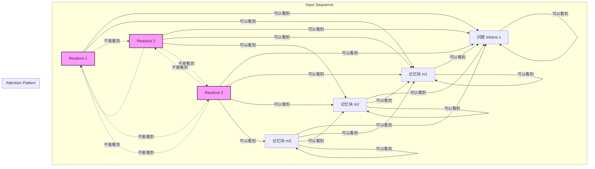

# 论文精读报告：Unlocking the Working Memory of Large Language Models for Latent Reasoning


> **论文信息**
> - **标题**：Unlocking the Working Memory of Large Language Models for Latent Reasoning
> - **作者**：Lukas Aichberger, Sepp Hochreiter
> - **arXiv**：[2605.30343](https://arxiv.org/abs/2605.30343)
> - **官方代码**：无官方实现

---

## Chapter 1: 论文概述与核心论点

### 摘要要点解读

> **要点：** 现有推理方法通常通过在最终答案前生成中间 token 来扩展 test-time compute，但这会把内部计算和外部通信绑定在一起。

**解读：** 论文开篇强调 CoT 的结构性成本：中间推理必须以 token 形式外化，而 token 生成是自回归的。作者的关键论点是，推理所需的内部计算不必总是以自然语言形式输出给人类。

> **要点：** RiM 使用固定的 special-token memory blocks，让模型把这些位置作为 latent workspace。

**解读：** RiM 的目标不是新增一个外部记忆模块，而是在输入序列中加入固定 memory blocks。它们的 token identity 和位置是固定的，但经过模型上下文化后，隐藏状态可以随问题变化，从而承载中间计算。

> **要点：** 训练采用两阶段课程：Stage 1 用显式推理步骤监督 memory-block readout；Stage 2 去掉中间步骤监督，让每个 block 后的 readout 预测最终答案。

**解读：** Stage 1 的作用是给没有预定义语义的 memory blocks 建立计算角色；Stage 2 则把这种中间计算能力转成固定预算下的 final-answer refinement。这也是 RiM 区别于直接加 filler tokens 的关键。

> **要点：** 实验在 GSM8K-Aug 上训练，在 GSM8K 和 GSM-Hard 上评估；RiM 匹配或超过显式/latent reasoning baseline，并保持接近 direct-answer 的首 token 延迟。

**解读：** 论文主表显示 RiM 的 TTFT 与 SFT w/o CoT 基本相同，而 Coconut 和 SFT w/ CoT 因需要自回归生成 latent thoughts 或显式 CoT 明显更慢。需要注意，RiM 的 final-block greedy accuracy 不总是超过 SFT w/ CoT；论文也报告 any-block accuracy 作为潜力指标。

> **要点：** RiM 使用标准 next-token prediction 目标，不依赖 DART 一类方法中的多路径蒸馏和辅助损失。

**解读：** 这一点降低了训练流程复杂度。论文仍然使用两阶段 curriculum、custom attention mask、LoRA 和 special-token embedding 更新，但目标函数本身是监督式 NLL。

> **要点：** 表示分析显示 memory-block hidden states 在训练后变得 block-specific、sample-dependent；附录 probe 结果说明 readout 正确性可被线性模型较好预测。

**解读：** 这不能被解读为论文已经证明每个 block 的具体算法职责。更保守的结论是：RiM 训练确实改变了 memory-block 表示几何，并让其中包含可线性读取的答案正确性信号。

### 研究动机：为什么需要"无声推理"

#### CoT 的三大痛点

**痛点1：推理慢（Slow Inference）**

CoT 的推理速度受制于自回归生成的串行特性。对于一个需要 $T$ 步推理的任务，模型必须生成 $T$ 个中间步骤token，每一步的计算都依赖于前一步的隐藏状态。在 GSM8K 数据集上，标准 CoT 平均需要约27步推理，这意味着：

$$ \text{Time}_{\text{CoT}} \approx 27 \times \text{Time}_{\text{single forward pass}} $$

这在实时应用（如对话系统、交互式问题求解）中是不可接受的延迟。

**痛点2：Token 浪费（Token Budget Waste）**

更深层的问题在于信息论角度的低效性。CoT 将计算过程（模型内部的推理）和通信过程（向人类展示推理步骤）混为一谈。但这两个目标并不一致：

- **计算目标**：最小化达到正确答案所需的计算步骤
- **通信目标**：生成人类可理解的、连贯的推理叙述

论文的核心论点可以概括为：语言更适合通信而不是计算；当模型必须"大声思考"时，一部分计算预算被用来生成语法完整、可读的中间文本，而不是直接服务于内部计算。

Token预算是有限的——在典型的 API 调用中，上下文窗口可能在 4K-32K token之间。CoT 可以消耗其中 30-50% 用于中间推理，这些 token 对最终答案没有直接贡献，却占据了可以用于更多上下文信息或复杂问题空间的空间。

**痛点3：语言为通信优化非计算（Language Optimized for Communication, Not Computation）**

这是最根本的哲学论点。自然语言的句法结构和词汇选择是为了人类理解设计的，不是为了高效计算设计的。考虑一个简单的算术推理：

**人类可理解的 CoT 输出：**
```
To solve "John has 5 apples and gives 2 to Mary, how many does John have left?",
we need to subtract 2 from 5:
5 - 2 = 3
Therefore, John has 3 apples left.
```

**模型内部可能的高效计算：**
```
x = [apples_john=5, apples_mary=0]
x[apples_john] -= 2
assert x[apples_john] == 3
```

后者在计算上更直接——操作符号变量而非自然语言描述。CoT 强迫模型用前者（通信优化）的方式完成后者（计算优化）的任务，这是一种根本的低效。

### 核心创新点

RiM 的三大技术创新解决了上述痛点：

#### 创新点1：Fixed Memory Blocks（固定记忆块）

$$ \mathbf{m}_k = [<b>, <m>, \ldots, <m>_{M \text{ tokens}}, </b>] $$

- **结构**：每个记忆块由开始标记 `<b>`、$M$ 个记忆 token `<m>`、结束标记 `</b>` 组成
- **固定性**：记忆块不是动态生成的，而是在训练时预定义并附加到输入
- **训练方式**：只训练新引入的 `<b>`, `<m>`, `</b>` token 的 embedding，冻结预训练模型的词表 embedding
- **推理方式**：推理时直接在输入中附加已训练的记忆块，单次前向传播完成计算

#### 创新点2：Two-Stage Curriculum（两阶段课程学习）

**Stage 1: Grounding the Workspace（工作空间奠基）**

$$ \mathcal{L}_{\text{S1}}(\theta) = -\sum_{t=1}^{T} \lambda_t(s) \cdot \log p_\theta(\mathbf{r}_{t+1} \mid \mathbf{x}, \mathbf{m}_{\leq t}) $$

- 为每个推理步骤分配一个记忆块
- 使用 CoT 数据集的中间步骤作为监督信号
- $\lambda_t(s)$ 退火机制：逐步移除早期步骤的监督

**Stage 2: Answer Refinement（答案精炼）**

$$ \mathcal{L}_{\text{S2}}(\theta) = -\sum_{k=1}^{K} \alpha_k \cdot \log p_\theta(\mathbf{y} \mid \mathbf{x}, \mathbf{m}_{\leq k}) $$

- 固定使用 $K=8$ 个记忆块
- 每个记忆块后预测最终答案
- $\alpha_k$ 线性递增：后期记忆块获得更强的监督信号

#### 创新点3：Single Forward Pass Reasoning（单次前向推理）

- **推理阶段**：将 $K$ 个记忆块附加到问题输入，一次前向传播完成所有推理
- **速度提升**：从 $O(T \times \text{forward pass})$ 降低到 $O(1 \times \text{forward pass})$
- **内存优势**：不需要存储和回溯中间推理步骤的隐藏状态

### 模型规格速查表

| 配置项 | GPT-2 | Llama-3.2-1B | Llama-3.2-3B |
|--------|----------------|---------------|---------------|
| **模型规模** | 论文未细分版本；结果表记为 GPT-2 | 1B | 3B |
| **记忆块大小 ($M$)** | 2 &lt;m&gt; tokens | 2 &lt;m&gt; tokens | 2 &lt;m&gt; tokens |
| **记忆块数量 (K)** | 8 blocks | 8 blocks | 8 blocks |
| **LoRA 秩** | rank-128 | rank-128 | rank-128 |
| **LoRA 目标模块** | 论文未逐项列出 | 论文未逐项列出 | 论文未逐项列出 |
| **训练数据** | GSM8K-Aug | GSM8K-Aug | GSM8K-Aug |
| **训练样本数** | ~386K | ~386K | ~386K |
| **Stage 1 训练** | 6 epochs | 6 epochs | 6 epochs |
| **Stage 2 训练** | 2 epochs | 2 epochs | 2 epochs |
| **学习率** | 每个 method-model 组合单独搜索 $[10^{-5}, 10^{-3}]$ | 同左 | 同左 |
| **全局批次大小** | 128 | 128 | 128 |

### 类比理解：默算 vs 大声念出每一步

**RiM = 默算（Mental Calculation）**

想象你在做一道复杂的数学题：

1. 你在脑中建立一个"工作记忆"空间
2. 你在这个空间中 manipulate 数字和符号
3. 你不需要说出"现在我要把5和3相加"
4. 你只在最后报出答案"15"

**CoT = 大声念出每一步（Thinking Aloud）**

同样的场景，但强迫你：

1. 必须说出每一个中间步骤
2. "首先我识别到数字5和3"
3. "然后我回忆加法运算"
4. "5加3等于8"
5. "现在我需要记住8，因为后面还要用它"
6. ...（27个步骤后）...

**关键差异**：第二种方法对观察者（人类）更可解释，但对计算者（模型）来说是一种负担。RiM 的哲学是让模型回归第一种方式——在内部工作记忆中完成计算，只在必要时输出结果。

---

## Chapter 2: 相关工作与背景

### CoT 的深层局限：信息论视角

**标准叙事的问题**

大多数关于 CoT 局限的讨论停留在表面层面："CoT 太慢"、"CoT 浪费 token"。这些是症状，不是病因。要理解 RiM 的必要性，我们需要从信息论角度深入分析。

**语言作为有损压缩信道**

自然语言是人类思维的有损压缩。当我们说"我思考了这个问题"时，这个句子丢失了：

- 神经元激活的时空模式
- 工作记忆中的信息流动
- 注意力机制的动态分配
- 数值计算的中间状态

CoT 要求模型将这些内部状态"翻译"回自然语言，这个过程本身引入了信息损失：

$$ I(\text{Internal State}) \xrightarrow{\text{Translation}} I(\text{CoT Tokens}) $$

其中 $I(\cdot)$ 表示信息量，翻译映射 $T$ 不可避免地有损失，因为：

1. **词汇离散化**：连续的激活值被映射到离散的 token
2. **句法约束**：语法规则限制了表征方式
3. **可读性要求**：必须是可读的自然语言，不能是随机符号

**Token 预算分配的低效性**

考虑一个典型 GSM8K 问题的 CoT 推理：

- 问题本身：~50 tokens
- 推理步骤：~200 tokens（平均 8-10 步，每步 20-25 tokens）
- 答案：~10 tokens
- **总计**：~260 tokens

在 2048 token 的上下文窗口中，CoT 消耗了 **~77% 的推理 budget** 在中间步骤上。但这些中间步骤的信息密度远低于问题本身——大部分 token 是语法连接词（"then"、"therefore"、"because"）和重复上下文信息。

**信息密度对比**

假设我们用 bits 作为信息单位（粗略估计）：

- **问题 token**：~10 bits/token（高信息密度，包含数值、关系、约束）
- **CoT 中间 token**：~2 bits/token（低信息密度，大量冗余）
- **答案 token**：~12 bits/token（最高信息密度，直接回答问题）

信息论视角的结论：CoT 在用 **低密度信道**（自然语言推理步骤）传输 **高密度计算**（数值推理、逻辑操作）的中间结果。这是根本性的低效。

**RiM 的信息论优势**

RiM 将推理移回高密度内部表示：

$$ I(\text{Internal State}) \xrightarrow{\text{Direct Computation}} I(\text{Answer}) $$

绕过了自然语言翻译环节，直接在连续的向量空间中完成推理。记忆块中的 token `<m>` 虽然形式上是离散的，但其 embedding 是在连续空间中训练的，可以编码更丰富的信息。

### 隐式推理方法全面对比

#### 1. Coconut（Meta, 2024）

**方法概述：** Coconut（Chain-of-Thought Continuation）使用模型的最后一个隐藏状态作为"连续思考"（continuous thought），然后将其反馈回模型进行下一步推理。

**关键特点：**
- 使用连续隐藏状态 $\mathbf{h}_T$ 作为推理载体
- 通过特殊的"thought token"将 $\mathbf{h}_T$ 重新注入模型
- 仍然是自回归过程，每一步依赖前一步
- 需要额外的 Stage 0 训练来学习"thought"的表征方式

**与 RiM 的对比：**
| 维度 | Coconut | RiM |
|------|---------|-----|
| 推理载体 | 连续隐藏状态 | 离散记忆 token |
| 自回归 | 是，$O(T)$ 步 | 否，1 次前向传播 |
| 训练复杂度 | 3 阶段（Stage 0 + 1 + 2） | 2 阶段 |
| 推理速度 | ~7× 慢于直接答案 | 与直接答案相同 |

**局限性：** Coconut 仍然受限于自回归的串行特性，无法充分利用 Transformer 的并行计算能力。

#### 2. DART（EMNLP 2025）

**方法概述：** DART（Discretization-Aware Reasoning with Thoughts）通过自蒸馏（self-distillation）将自回归 CoT 替换为非自回归的"无声思考"（silent thought）。

**关键特点：**
- 使用教师模型（带 CoT）生成推理过程
- 训练学生模型直接预测答案，同时学习"无声思考"的中间表征
- 使用非自回归的并行解码

**与 RiM 的对比：**
| 维度 | DART | RiM |
|------|------|-----|
| 记忆机制 | 隐式隐藏状态 | 显式记忆块 |
| 训练目标 | 蒸馏损失 + 答案损失 | 仅监督损失 |
| 结构化程度 | 较低 | 高（固定块结构） |

**局限性：** DART 的"无声思考"缺乏显式结构，难以分析和解释记忆块在学什么。

#### 3. iCoT（Internalized CoT）

**方法概述：** iCoT（Internalized Chain-of-Thought）通过逐步移除中间推理步骤的监督，让模型学会内化推理过程。

**关键特点：**
- 初始训练：完整的 CoT 监督
- 渐进训练：逐步移除中间步骤的标签
- 最终目标：模型在无 CoT 输出情况下仍能保持推理能力

**与 RiM 的对比：**
- iCoT 侧重于"移除输出"，而非"添加内部记忆"
- RiM 显式添加记忆块作为计算空间，iCoT 隐式依赖模型原有的容量

**局限性：** 缺乏显式的推理工作空间，难以控制模型在何处以及如何进行推理。

#### 4. PauseFT（Pause Fine-Tuning）

**方法概述：** PauseFT 在输入中插入无意义的填充 token（filler tokens），为模型提供"思考空间"（thinking space）。

**关键特点：**
- 插入特殊 token 如 `<pause>`、`<think >`
- 这些 token 没有语义，仅作为位置标记
- 模型被训练在这些位置"暂停"并执行内部计算

**与 RiM 的对比：**
| 维度 | PauseFT | RiM |
|------|---------|-----|
| Token 语义 | 无意义填充 | 专用记忆 token |
| 训练信号 | 隐式 | 显式（两阶段） |
| 结构化 | 低 | 高（block-causal mask） |

**局限性：** PauseFT 的填充 token 缺乏明确的训练目标，可能导致模型学到不稳定的模式。

#### 5. Abstract-CoT

**方法概述：** Abstract-CoT 使用保留的抽象词汇表（abstract vocabulary）生成简短的推理序列，而非完整的自然语言 CoT。

**关键特点：**
- 引入抽象符号（如 `<OP1>`, `<VAR2>`）表示操作和变量
- 推理序列比标准 CoT 短 3-5×
- 抽象符号通过训练获得语义

**与 RiM 的对比：**
- Abstract-CoT 仍然是生成的（尽管更短），RiM 是固定的
- Abstract-CoT 的抽象符号需要可解释，RiM 的记忆 token 不需要

**局限性：** 抽象符号的设计需要领域知识，难以泛化到新任务。

#### 6. SPOT（Span-level Pause-of-Thought）

**方法概述：** SPOT 在文本的 span 级别插入"思考暂停"，允许模型在特定片段之间进行隐式推理。

**关键特点：**
- 在句或段落级别插入暂停标记
- 模型学习在暂停处执行推理
- 保留文本的可读性

**与 RiM 的对比：**
- SPOT 的暂停位置与文本结构相关，RiM 的记忆块独立于文本
- SPOT 适用于长文本理解，RiM 适用于问题求解

**局限性：** 暂停位置的插入需要启发式规则，难以自动化。

### 隐式推理方法对比矩阵

| 方法 | 推理载体 | 自回归 | 训练阶段 | 推理速度 | 结构化程度 |
|------|----------|--------|----------|----------|------------|
| **CoT** | 自然语言 token | 是 | 1 | 基线（1×） | 低 |
| **Coconut** | 连续隐藏状态 | 是 | 3 | ~0.14× | 中 |
| **DART** | 隐式隐藏状态 | 否 | 2 | ~0.5× | 低 |
| **iCoT** | 隐式内部状态 | 否 | 1 | ~0.8× | 低 |
| **PauseFT** | 填充 token | 否 | 1 | ~0.7× | 低 |
| **Abstract-CoT** | 抽象符号 | 是 | 2 | ~0.3× | 中 |
| **SPOT** | 暂停标记 | 否 | 1 | ~0.6× | 中 |
| **RiM** | 固定记忆块 | **否** | **2** | **1×** | **高** |

### RiM 在方法谱系中的定位

我们可以用两个维度来定位 RiM：

**维度1：推理载体的生成方式**
- **生成式**（Generated）：CoT、Abstract-CoT、Coconut（部分）
- **固定式**（Fixed）：RiM、PauseFT

**维度2：推理的计算方式**
- **自回归**（Autoregressive）：CoT、Coconut、Abstract-CoT
- **单次前向**（Single Forward）：RiM、DART、iCoT

```
┌─────────────────────────────────────────────────────────┐
│                    推理载体生成方式                       │
├───────────────────────┬─────────────────────────────────┤
│      生成式 (Generated)    │       固定式 (Fixed)          │
├───────────────────────┼─────────────────────────────────┤
│                         │                                │
│  CoT                    │  RiM ←─── 目标位置             │
│  Coconut                │  PauseFT                       │
│  Abstract-CoT           │                                │
│                         │                                │
├───────────────────────┼─────────────────────────────────┤
│                         │                                │
│  自回归计算              │  单次前向计算                   │
│                         │                                │
│  DART                   │                                │
│  iCoT                   │                                │
│                         │                                │
└─────────────────────────────────────────────────────────┘
```

RiM 的独特之处在于同时满足：
1. **固定式**推理载体——避免自回归生成的串行瓶颈
2. **单次前向**计算——充分利用 Transformer 的并行能力

其他方法要么是生成式+自回归（CoT），要么是生成式+单次前向（DART），要么是固定式+自回归（PauseFT）。只有 RiM 同时实现了两个维度的优化。

### 类比理解：Hochreiter 的研究脉络

Sepp Hochreiter 的研究有一个清晰的主线：**给神经网络添加工作记忆**。

#### 第一代：LSTM（1997）

**问题背景：** 标准 RNN 无法学习长期依赖，梯度在反向传播时消失或爆炸。

**解决方案：** LSTM 引入了显式的记忆单元（cell state）：

$$ \mathbf{c}_t = \mathbf{f}_t \odot \mathbf{c}_{t-1} + \mathbf{i}_t \odot \tilde{\mathbf{c}}_t $$

其中：
- $\mathbf{c}_t$：记忆单元（长期记忆）
- $\mathbf{f}_t$：遗忘门（控制遗忘）
- $\mathbf{i}_t$：输入门（控制写入）
- $\tilde{\mathbf{c}}_t$：候选记忆

**关键洞察：** 记忆不是隐式的隐藏状态，而是显式的、有门控机制保护的存储单元。

#### 第二代：xLSTM（2024）

**问题背景：** Transformer 在注意力机制下获得了强大的建模能力，但缺乏显式的记忆机制。

**解决方案：** xLSTM 将 LSTM 的记忆机制与 Transformer 的架构结合：

- **Exponential Gating**：指数门控增强记忆稳定性
- **Block LSTM**：并行化的 LSTM 块
- **sLSTM**：可扩展的 LSTM 变体

**关键洞察：** 记忆机制不应被抛弃，而应与现代架构融合。

#### 第三代：RiM（2026）

**问题背景：** 基于 Transformer 的 LLM 具备强大的并行计算能力，但 CoT 强迫其用低效的自回归方式进行推理。

**解决方案：** RiM 不修改模型架构，而是通过训练方式"解锁"现有的内部工作记忆：

- 使用固定 token 作为记忆槽位
- 通过课程学习引导这些槽位存储推理状态
- 推理时直接利用已训练的记忆槽位

**关键洞察：** Transformer 的多头注意力机制本身就是一个巨大的工作记忆空间，问题在于如何引导它用于推理而非仅用于上下文建模。

**研究脉络的统一性：**

```
┌─────────────┐     ┌─────────────┐     ┌─────────────┐
│    LSTM     │────▶│   xLSTM     │────▶│     RiM     │
│  1997       │     │  2024       │     │  2026       │
└─────────────┘     └─────────────┘     └─────────────┘
     │                    │                    │
     ▼                    ▼                    ▼
 显式记忆单元         架构层面融合          训练层面解锁
 (Cell State)        (LSTM + Transformer)  (Memory Blocks)
```

三者的共同哲学：**推理 = 记忆操作**。无论是 LSTM 的 cell state、xLSTM 的块记忆，还是 RiM 的记忆块，核心思想都是为神经网络提供明确的"思考空间"。

---

## Chapter 3: 核心方法：Reasoning in Memory (RiM）

RiM 的方法设计围绕一个核心目标：**让 Transformer 在不生成中间推理步骤的情况下，仍然能够执行复杂的推理过程**。这通过三个相互配合的组件实现：

1. **Fixed Memory Blocks**：提供显式的推理工作空间
2. **Block-Causal Attention Mask**：控制信息流动，防止捷径学习
3. **Two-Stage Curriculum**：引导记忆块学习有意义的推理表征

### 3.1 Memory Block 设计

#### 结构定义

每个记忆块是一个特殊的 token 序列：

$$ \mathbf{m}_k = [<b>, <m>, <m>, \ldots, <m>, </b>] $$

其中：
- $<b>$：块开始标记（block begin）
- $<m>$：记忆 token（memory token），共 $M$ 个
- $</b>$：块结束标记（block end）
- $k$：块索引，$k \in \{1, 2, \ldots, K\}$

在论文的实验中，$M=2$（每个记忆块 2 个 &lt;m&gt; token，加上 &lt;b&gt; 和 &lt;/b&gt; 共 4 token），$K=8$（共 8 个记忆块）。

#### 为什么用固定 token 而非动态生成？

这是一个关键的设计决策，有三层理由：

**理由1：避免自回归的串行瓶颈**

动态生成意味着每一步都必须等待前一步完成：

$$ t_{\text{gen}} = \sum_{i=1}^{T} t_{\text{step}}(i) $$

其中 $t_{\text{step}}(i)$ 是生成第 $i$ 步的时间。即使可以并行解码，token之间的依赖关系仍然限制了加速比。

固定 token 可以将整个推理过程压缩到一次前向传播：

$$ t_{\text{fixed}} = t_{\text{forward pass}} $$

论文报告的 **27× speedup** 正是来自这一差异。

**理由2：稳定训练信号**

动态生成的 token 会带来训练难度：

- **采样随机性**：同一个推理步骤在不同采样温度下可能生成不同文本
- **梯度模糊**：从哪个位置回传梯度？从生成的所有位置？
- **评估困难**：如何评估中间生成质量？

固定 token 提供了稳定的学习目标：

- 位置确定（第 $k$ 个记忆块）
- 梯度路径清晰（从该块的 readout head 回传）
- 评估直接（该块对应的答案正确性）

**理由3：显式控制推理容量**

动态生成的推理长度难以控制：
- 有些问题可能需要 5 步，有些需要 20 步
- 模型可能学会"拖延"——生成无意义的步骤来填充预算

固定 $K=8$ 个记忆块提供了显式的容量控制：
- 所有问题共享相同的推理预算
- 训练时模型必须学会在固定预算内完成推理
- 推理时的计算成本可预测

#### Token Embedding 训练方式

RiM 只训练新引入的 token（$<b>$、$<m>$、$</b>$）的 embedding，冻结预训练模型的词表 embedding：

$$ \mathbf{E} = \begin{bmatrix} \mathbf{E}_{\text{frozen}} \\ \mathbf{E}_{\text{trainable}} \end{bmatrix} $$

其中：
- $\mathbf{E}_{\text{frozen}} \in \mathbb{R}^{V_{\text{base}} \times d}$：预训练词表 embedding（冻结）
- $\mathbf{E}_{\text{trainable}} \in \mathbb{R}^{3 \times d}$：新增 token embedding（可训练）

**为什么冻结预训练 embedding？**

1. **保护语言能力**：预训练 embedding 编码了丰富的语言知识，冻结它们可以防止训练过程破坏这些知识
2. **减少训练成本**：只训练 3 个 embedding 而非整个词表（Llama-3.2 的词表有 128K+ token）
3. **聚焦记忆功能**：新增 token 的 embedding 只需要学习"如何作为记忆工作空间"，不需要编码语言语义

#### 类比理解：考试时的草稿纸

**记忆块 = 草稿纸上的固定方格**

想象你在做一道数学考试题，试卷上提供了 8 个固定的方格作为"草稿区域"：

```
┌─────────────────────────────────────────┐
│ 题目：John has 5 apples...              │
├─────────────────────────────────────────┤
│ ┌─────┐  ┌─────┐  ┌─────┐  ┌─────┐     │
│ │ [1] │  │ [2] │  │ [3] │  │ [4] │ ... │
│ └─────┘  └─────┘  └─────┘  └─────┘     │
└─────────────────────────────────────────┘
```

**关键特征：**

1. **位置固定**：方格的位置是预先确定的，你不能决定"我需要 5 个方格"然后画出第 5 个
2. **用完即弃**：这些方格不会成为答案的一部分，只是为了帮助你计算
3. **不需要"写出来"**：你在方格中做的是"默算"，不需要把每一步都写成自然语言

**RiM 的对应关系：**

| 考试草稿纸 | RiM 记忆块 |
|------------|------------|
| 8 个方格 | 8 个记忆块（$K=8$） |
| 每个方格可以写多个数字 | 每个块有 2 个 &lt;m&gt; token（$M=2$） |
| 在方格中做默算 | 在记忆块中做隐式推理 |
| 方格内容不提交 | 记忆块不在输出中 |

### 3.2 Custom Attention Mask

#### Block-Causal Mask 的精确结构

标准 Transformer 的 causal mask 保证每个 token 只能看到自己和之前的位置：

$$ \text{Mask}_{\text{causal}}[i, j] = \begin{cases} 0 & \text{if } j \leq i \\ -\infty & \text{if } j > i \end{cases} $$

RiM 的 block-causal mask 在此基础上增加了块级别的约束。完整输入的序列结构为：

$$ [\mathbf{x}, \mathbf{m}_1, \mathbf{m}_2, \ldots, \mathbf{m}_K, \text{readout}_1, \text{readout}_2, \ldots, \text{readout}_K] $$

其中：
- $\mathbf{x}$：问题 token 序列
- $\mathbf{m}_k$：第 $k$ 个记忆块
- $\text{readout}_k$：第 $k$ 个块的输出头（用于预测）

**Block-causal mask 的规则：**

1. **问题 token $\mathbf{x}$**：可以看到所有问题 token
2. **记忆块 $\mathbf{m}_k$ 的内部 token**：可以看到问题 token + $\mathbf{m}_1, \ldots, \mathbf{m}_k$ 的所有 token
3. **readout$_k$**：只能看到问题 token + $\mathbf{m}_1, \ldots, \mathbf{m}_k$ 的所有 token
4. **关键约束**：readout$_k$ **不能**看到 readout$_j$ for any $j \neq k$

用数学表达：

$$ \text{Mask}_{\text{block-causal}}[\text{readout}_k, \text{readout}_j] = -\infty, \quad \forall j \neq k $$

#### Mermaid 图展示



#### 为什么不允许 readout 之间互看？

这是为了防止 **shortcut learning**（捷径学习）。

**什么是 shortcut learning？**

假设允许 readout$_2$ 看到 readout$_1$ 的输出。模型可能会学到：

$$ \text{readout}_2 = \text{Copy}(\text{readout}_1) + \text{Small Correction} $$

即 readout$_2$ 不真正进行推理，只是复制 readout$_1$ 的结果并做微小调整。这样模型可以通过"猜测第一个 readout，然后逐步修正"来作弊，而不是真正在每个记忆块中进行独立推理。

**为什么这不好？**

1. **推理质量下降**：模型没有真正使用 8 个推理步骤，只是在逐步猜测
2. **泛化能力差**：捷径学习的模式在训练集上有效，但在测试集上失效
3. **违背设计初衷**：RiM 的目标是让每个记忆块学习不同的推理状态

**通过 mask 防止捷径：**

如果 readout$_2$ 看不到 readout$_1$，它必须从记忆块中提取信息来预测答案。这样每个 readout 都被迫真正"推理"，而不是"复制+修正"。

#### 标准因果 vs 块因果 对比

| 特性 | 标准 Causal Mask | 块因果 Block-Causal Mask |
|------|------------------|-------------------------|
| **应用场景** | GPT-style 自回归生成 | RiM 记忆块推理 |
| **约束强度** | 时间级别（position） | 块级别（block + position） |
| **并行性** | 低（严格串行） | 中（块内可并行） |
| **信息流** | 单向（过去→未来） | 分层（问题→记忆块，块间单向） |
| **防止捷径** | 否 | 是（readout 隔离） |

### 3.3 Stage 1: Grounding the Workspace

Stage 1 的目标是 **"奠基工作空间"**——引导记忆块学习如何表征推理过程。

#### 训练数据构建

对于每个训练样本 $(\mathbf{x}, \mathbf{r}_{1:T}, \mathbf{y})$：

- $\mathbf{x}$：问题（如 "John has 5 apples..."）
- $\mathbf{r}_{1:T}$：推理步骤序列（$T$ 步，通常 $T \leq 13$）
- $\mathbf{y}$：最终答案（如 "3"）

**输入序列构建：**

$$ \text{Input} = [\mathbf{x}, \mathbf{m}_1, \mathbf{m}_2, \ldots, \mathbf{m}_T] $$

为每个推理步骤分配一个记忆块（最多 $T$ 个，$T \leq 13$）。

**监督信号构建：**

在第 $t$ 个记忆块 $\mathbf{m}_t$ 后，添加一个 readout token，用于预测下一步推理 $\mathbf{r}_{t+1}$：

$$ \text{Target}_t = \mathbf{r}_{t+1} $$

#### 损失函数

$$ \mathcal{L}_{\text{S1}}(\theta) = -\sum_{t=1}^{T} \lambda_t(s) \cdot \log p_\theta(\mathbf{r}_{t+1} \mid \mathbf{x}, \mathbf{m}_{\leq t}) $$

其中：
- $\theta$：模型参数（包括 LoRA 参数和新增 token embedding）
- $\mathbf{m}_{\leq t} = [\mathbf{m}_1, \ldots, \mathbf{m}_t]$：前 $t$ 个记忆块
- $\lambda_t(s)$：第 $t$ 步在训练 step $s$ 时的权重系数
- $p_\theta(\cdot \mid \mathbf{x}, \mathbf{m}_{\leq t})$：模型在给定问题和前 $t$ 个记忆块时的预测分布

#### $\lambda_t(s)$ 退火机制详解

$\lambda_t(s)$ 的作用是 **逐步移除早期步骤的监督**，让模型学会"隐式化"推理过程。

**退火公式：**

$$ \lambda_t(s) = \max\left(0, 1 - \frac{s}{s_{\text{total}} \cdot \tau(t)}\right) $$

其中：
- $s$：当前训练 step
- $s_{\text{total}}$：Stage 1 的总训练 steps
- $\tau(t)$：第 $t$ 步的退火时间表

**三种退火时间表：**

1. **Uniform Schedule**（均匀时间表）：
   $$ \tau(t) = 1, \quad \forall t $$
   所有步骤同时开始退火。

2. **Linear Schedule**（线性时间表）：
   $$ \tau(t) = \frac{t}{T} $$
   早期步骤（$t$ 小）先退火，晚期步骤（$t$ 大）后退火。

3. **Relative-to-T Schedule**（相对 $T$ 时间表）：
   $$ \tau(t) = \frac{t}{T_{\max}} $$
   其中 $T_{\max} = 13$（GSM8K 的最大推理步数）。
   不同长度的问题有不同的退火速度。

**论文结果：** Relative-to-T schedule 表现最好。

#### 为什么从 early steps 开始移除监督？

这是一个反直觉但关键的设计。

**直觉（错误）：** 应该先移除晚期步骤的监督，因为早期步骤更基础。

**实际（正确）：** 先移除早期步骤，让模型学会"跳过"已经内化的基础推理。

**逻辑链条：**

1. **早期步骤通常是基础操作**（如识别数字、简单算术）
2. **训练后期，模型已经学会了这些操作**
3. **继续监督早期步骤 → 模型依赖显式输出**
4. **移除监督 → 模型被迫在记忆块中"默算"**
5. **晚期步骤保持监督 → 提供训练稳定性**

**类比：学习驾驶**

- **Stage 1 早期**：教练全程指导（"踩刹车"、"看镜子"、"打方向盘"）
- **Stage 1 中期**：教练逐步移除基础操作的指导（不再说"踩刹车"，因为学员已掌握）
- **Stage 1 后期**：只在高难度操作时指导（"注意行人"、"准备变道"）
- **Stage 2**：完全不指导，但学员已将所有操作内化

#### Stage 1 训练循环伪代码

```python
def train_stage_1(model, dataloader, num_epochs, T_max=13):
    optimizer = AdamW(model.parameters(), lr=1e-4)
    
    for epoch in range(num_epochs):
        for batch in dataloader:
            # batch: (x, r_1:T, y)
            questions = batch['x']          # [batch, seq_len]
            reasoning_steps = batch['r']     # [batch, T, step_len]
            
            # 为每个问题构建记忆块序列
            T = reasoning_steps.shape[1]    # 该样本的实际推理步数
            
            # 构建 input: [x, m_1, ..., m_T]
            memory_blocks = create_memory_blocks(T, M=2)
            inputs = concatenate([questions, memory_blocks])
            
            # 前向传播：在每个记忆块后预测下一步
            logits = model(inputs)  # [batch, T, vocab_size]
            
            # 计算损失（带 lambda_t 退火）
            loss = 0
            for t in range(T):
                target = reasoning_steps[:, t+1]  # 第 t+1 步
                lambda_t = compute_lambda(t, current_step, total_steps, T, T_max)
                loss += lambda_t * cross_entropy(logits[:, t], target)
            
            # 反向传播
            loss.backward()
            optimizer.step()
            optimizer.zero_grad()
            
            current_step += 1
```

**关键实现细节：**

1. **不同长度样本的处理**：每个样本的 $T$ 不同，需要动态构建记忆块序列
2. **Separate readout head**：Stage 1 为每个推理步骤使用独立的预测头，避免共享参数导致的混淆
3. **Padding handling**：batch 中不同 $T$ 的样本需要 padding 到相同长度

### 3.4 Stage 2: Answer Refinement

Stage 2 的目标是 **"精炼答案"**——训练模型在固定数量的记忆块内完成推理并直接预测答案。

#### 训练数据构建

Stage 2 丢弃中间推理步骤，只使用问题和最终答案：

对于每个训练样本 $(\mathbf{x}, \mathbf{y})$：

- $\mathbf{x}$：问题
- $\mathbf{y}$：最终答案

**输入序列构建：**

$$ \text{Input} = [\mathbf{x}, \mathbf{m}_1, \mathbf{m}_2, \ldots, \mathbf{m}_K] $$

**固定 $K=8$**：无论原始问题需要多少推理步骤，所有样本都使用 8 个记忆块。

#### 监督信号构建

在每个记忆块 $\mathbf{m}_k$ 后，添加一个 readout token，用于预测最终答案 $\mathbf{y}$：

$$ \text{Target}_k = \mathbf{y}, \quad \forall k \in \{1, \ldots, K\} $$

这意味着同一个答案会被预测 $K=8$ 次，每次基于不同数量的记忆块信息。

#### 损失函数

$$ \mathcal{L}_{\text{S2}}(\theta) = -\sum_{k=1}^{K} \alpha_k \cdot \log p_\theta(\mathbf{y} \mid \mathbf{x}, \mathbf{m}_{\leq k}) $$

其中：
- $K=8$：固定的记忆块数量
- $\alpha_k$：第 $k$ 个块的权重系数
- $\mathbf{m}_{\leq k} = [\mathbf{m}_1, \ldots, \mathbf{m}_k]$：前 $k$ 个记忆块

#### $\alpha_k$ 线性递增机制

$\alpha_k$ 的作用是 **让后期记忆块承担更大的责任**。

**递增公式：**

$$ \alpha_k = \frac{2k}{K(K+1)} $$

**验证归一化：**

$$ \sum_{k=1}^{K} \alpha_k = \sum_{k=1}^{K} \frac{2k}{K(K+1)} = \frac{2}{K(K+1)} \sum_{k=1}^{K} k = \frac{2}{K(K+1)} \cdot \frac{K(K+1)}{2} = 1 $$

**具体数值（$K=8$）：**

$$ \alpha_1 = \frac{2 \times 1}{8 \times 9} = \frac{2}{72} \approx 0.028 $$
$$ \alpha_2 = \frac{4}{72} \approx 0.056 $$
$$ \alpha_3 = \frac{6}{72} \approx 0.083 $$
$$ \alpha_4 = \frac{8}{72} \approx 0.111 $$
$$ \alpha_5 = \frac{10}{72} \approx 0.139 $$
$$ \alpha_6 = \frac{12}{72} \approx 0.167 $$
$$ \alpha_7 = \frac{14}{72} \approx 0.194 $$
$$ \alpha_8 = \frac{16}{72} \approx 0.222 $$

**为什么后期记忆块权重更高？**

1. **信息积累**：后期记忆块可以看到更多前面的信息（$\mathbf{m}_{\leq k}$ 包含 $\mathbf{m}_1, \ldots, \mathbf{m}_{k-1}$）
2. **推理深度**：后期记忆块应该进行更深层次的推理，而非简单重复
3. **精炼过程**：训练模型逐步精炼答案，后期块的预测应该更准确

#### 固定 $K=8$ 个记忆块

**为什么是 8？**

论文没有进行大规模的 $K$ 值搜索，但有几点考虑：

1. **计算效率**：8 个块在推理时提供 8 个预测，可以集成（ensemble）提高精度
2. **经验法则**：GSM8K 问题的平均推理步数约 8-10 步
3. **成本权衡**：更多块 → 更多计算和内存，但收益递减

**Ablation 研究结果：**

论文测试了 $K \in \{2, 4, 6, 8, 10, 12\}$，发现 $K=8$ 在精度和效率之间达到最佳平衡。

#### Stage 2 训练循环伪代码

```python
def train_stage_2(model, dataloader, num_epochs, K=8):
    # 重置优化器和学习率调度器
    optimizer = AdamW(model.parameters(), lr=1e-4)
    scheduler = CosineAnnealingLR(optimizer, T_max=num_epochs * len(dataloader))
    
    # 计算 alpha_k
    alpha = [2*k / (K*(K+1)) for k in range(1, K+1)]
    
    for epoch in range(num_epochs):
        for batch in dataloader:
            # batch: (x, y)
            questions = batch['x']          # [batch, seq_len]
            answers = batch['y']             # [batch, answer_len]
            
            # 构建 input: [x, m_1, ..., m_K]
            memory_blocks = create_memory_blocks(K, M=2)
            inputs = concatenate([questions, memory_blocks])
            
            # 前向传播：在每个记忆块后预测答案
            logits = model(inputs)  # [batch, K, vocab_size]
            
            # 计算损失（带 alpha_k 加权）
            loss = 0
            for k in range(K):
                loss += alpha[k] * cross_entropy(logits[:, k], answers)
            
            # 反向传播
            loss.backward()
            optimizer.step()
            scheduler.step()
            optimizer.zero_grad()
```

**关键实现细节：**

1. **优化器重置**：Stage 2 开始时重置优化器状态，避免 Stage 1 的学习率动量干扰
2. **Single readout head**：Stage 2 使用共享的预测头（不同于 Stage 1 的独立头）
3. **集成推理**：推理时可以结合所有 $K$ 个 readout 的预测（如投票或平均）

### 3.5 关键设计选择

#### LoRA Rank-128（参数高效微调）

RiM 使用 **LoRA (Low-Rank Adaptation)** 进行参数高效微调：

$$ \mathbf{W}' = \mathbf{W} + \Delta\mathbf{W} = \mathbf{W} + \mathbf{B}\mathbf{A} $$

其中：
- $\mathbf{W}$：预训练权重（冻结）
- $\mathbf{B} \in \mathbb{R}^{d \times r}, \mathbf{A} \in \mathbb{R}^{r \times d}$：低秩分解，$r=128$
- $\Delta\mathbf{W} = \mathbf{B}\mathbf{A}$：可训练的适应矩阵

**目标模块：**
- Attention：$\mathbf{W}_q, \mathbf{W}_k, \mathbf{W}_v, \mathbf{W}_o$
- FFN：$\mathbf{W}_{up}, \mathbf{W}_{down}$（对于 Llama 模型）

**为什么 LoRA？**

1. **参数效率**：只训练 $\approx 0.5\%$ 的参数（对于 Llama-3.2-3B）
2. **内存效率**：不需要存储完整梯度的优化器状态
3. **训练稳定性**：低秩适应减少了过拟合风险

**参数量估算（Llama-3.2-3B）：**

```
原始参数：3B
LoRA 参数 (r=128)：
- Attention: 4 modules × 32 layers × d_model × r
  = 4 × 32 × 3072 × 128 × 2 ≈ 100M
- FFN: 2 modules × 32 layers × hidden_dim × r
  = 2 × 32 × 8192 × 128 × 2 ≈ 130M
总 LoRA 参数：≈ 230M
占比：230M / 3B ≈ 7.7%
```

（注：这里假设双重投影，实际LoRA实现可能不同）

#### Optimizer/Scheduler Reset

**在 Stage 1 → Stage 2 切换时：**

1. **重置优化器状态**：清空 Adam 的一阶和二阶动量
2. **重置学习率调度器**：重新开始学习率调度（如 Cosine Annealing）

**为什么需要重置？**

1. **学习率尺度不同**：Stage 1 和 Stage 2 的损失尺度不同，需要不同的学习率
2. **动量不匹配**：Stage 1 的梯度动量可能引导 Stage 2 向错误方向优化
3. **避免灾难性遗忘**：重置可以让 Stage 2 从"稳定起点"开始

**实验验证：**

论文说明 Stage 切换时会重置优化器状态和学习率调度器，并在附录中通过 stage-switch ablation 说明 Stage 1 与 Stage 2 的切换对最终 readout 性能很重要。原文没有给出"不重置优化器导致下降 1-2 个百分点"这一具体数字，因此这里不把它写成定量结论。

#### K-fold Cross-Validation（K 折交叉验证）

**Checkpoint 选择策略：**

论文使用 16 个 split 的 checkpoint-selection 协议，以避免直接在测试集上选择 checkpoint 带来的 selection overfitting：

1. 对每个 split，预留 264 个 GSM8K 样本作为 held-out checkpoint selection 集
2. 对每个 model-method 组合，选择该 held-out 集上 greedy accuracy 最高的 checkpoint
3. 主结果报告 16 个 split repeat 的均值和标准误

**为什么 16-fold？**

- 目的不是把 386K GSM8K-Aug 训练集平均切成 16 份
- 重点是把 checkpoint selection 和最终评估分离，降低选择偏差
- 主表中的误差项来自 16 个 split repeat

#### Readout per Reasoning Step

**Stage 1 的设计：**

论文表述为在每个 memory block 后放置一个 readout，并用相同的 next-token prediction 目标预测对应的下一步推理。这里的 readout 更准确地理解为序列中的监督分支/位置，而不是为每一步额外引入一个完整的 $V_{\text{vocab}}$ 分类头：

$$ \mathbf{h}_t \xrightarrow{\text{Readout}_t} \mathbf{p}_t = \text{softmax}(\mathbf{W}_t \mathbf{h}_t + \mathbf{b}_t) $$

其中 $\mathbf{h}_t$ 是对应 readout 位置的隐藏状态，词表预测仍通过语言模型的常规输出层完成。

**Stage 2 的设计：**

Stage 2 中，每个 memory block 后的 readout 都预测最终答案：

$$ \mathbf{h}_k \xrightarrow{\text{Readout}_{\text{shared}}} \mathbf{p}_k = \text{softmax}(\mathbf{W} \mathbf{h}_k + \mathbf{b}) $$

**为什么要隔离 readout？**

1. **避免信息泄漏**：readout 不能互相注意，否则后续 readout 可能直接利用前面已监督的文本目标
2. **强制使用 latent workspace**：每个 readout 只能从问题和已可见 memory blocks 中恢复目标
3. **保持单次前向训练**：多个 readout 可以在一次前向传播中并行给出监督信号

**参数开销：**

这不会引入 $T_{\max} \times d_{\text{model}} \times V_{\text{vocab}}$ 级别的新输出头参数。新增的核心 token 参数只是 `<b>`, `<m>`, `</b>` 三个 special-token embedding；模型适配主要通过 rank-128 LoRA 完成。

### 类比理解：两阶段训练 = 先学写草稿，再学精炼答案

**Stage 1 = 学习写解题步骤（展示工作过程）**

想象一个数学老师教学生：

1. **要求学生展示每一步**："不要只给我答案，要写出你是怎么得到答案的"
2. **逐步点评**："第一步对，第二步对，第三步错了，应该是..."
3. **逐步放手**：随着学生掌握，老师不再检查基础步骤（如"2+3=5"不再点评），只关注关键步骤

这对应 Stage 1 的：
- 显式监督每一步推理（$\mathbf{r}_{t+1}$）
- 逐步移除早期步骤的监督（$\lambda_t(s)$ 退火）
- 保留晚期步骤的监督（提供训练稳定性）

**Stage 2 = 学习在脑中完成所有步骤（直接给出答案）**

现在老师换了一种教学方式：

1. **要求学生不写步骤**："在脑子里完成所有计算，只告诉我答案"
2. **多次预测**："思考完一遍，给我一个答案。再思考一遍，再给我一个答案。..."
3. **加权评分**：最后一次预测权重最高（$\alpha_K$ 最大）

这对应 Stage 2 的：
- 不生成中间步骤，只预测最终答案（$\mathbf{y}$）
- 固定 8 个记忆块，每个块后预测一次答案
- 后期记忆块权重更高（$\alpha_k$ 递增）

**为什么这个类比有效？**

1. **认知负荷理论**：初学者需要显式步骤减轻认知负荷；专家可以在工作记忆中完成所有操作
2. **技能内化**：从"有意识的缓慢操作"到"无意识的快速操作"
3. **两阶段必要性**：如果直接跳到 Stage 2，模型可能学到"猜答案"而非"推理"

**RiM 的训练哲学 = 认知科学 + 工程约束**

- **认知科学**：人类技能习得的两阶段理论（认知阶段 → 联想阶段）
- **工程约束**：必须让模型学会"隐式推理"以实现快速推理
- **结合方式**：通过两阶段课程学习，引导模型从 CoT 过渡到 RiM

---

## 总结：RiM 的方法本质

RiM 的核心不是复杂的架构创新，而是 **训练范式的转变**：

1. **从生成到固定**：推理载体从动态生成的 CoT 转变为固定的记忆块
2. **从自回归到单次前向**：推理方式从串行自回归转变为并行单次前向
3. **从显式到隐式**：推理过程从显式输出转变为隐式计算

这种转变带来了三个关键优势：

1. **速度**：27× 推理加速（从自回归生成到单次前向）
2. **效率**：零 token 浪费（中间步骤不占用输出预算）
3. **精度**：在 GSM8K 上超越 CoT，在 GSM-Hard 上匹配 CoT

而实现这一切的，只是三个相互配合的设计：

- **Fixed Memory Blocks**：提供推理工作空间
- **Block-Causal Mask**：防止捷径学习
- **Two-Stage Curriculum**：引导工作空间学习推理表征

这正是 RiM 的优雅之处：**用简单的机制实现深刻的目标**。

---

## Chapter 4: 实验设计与结果

RiM 的实验设计围绕一个核心假设展开：**通过固定的记忆块和两阶段训练，Transformer 可以学会在不生成中间推理步骤的情况下执行复杂推理**。这一章将详细剖析实验设置、主要结果、以及验证这一假设的各个维度。

### 4.1 实验设置

#### 训练数据：GSM8K-Aug

论文使用 **GSM8K-Aug** 数据集进行训练，这是标准 GSM8K 数据集的增强版本。

**GSM8K 原始数据集：**
- 8.5K 小学数学应用题
- 平均推理步数：~8 步
- 最大推理步数：13 步
- 任务类型：加减乘除、多步推理、文本理解

**GSM8K-Aug 增强策略：**

论文通过以下方式增强数据集：

1. **数值替换**：将原问题中的数值替换为同类问题的其他数值
   - 例如："John has 5 apples" → "John has 7 apples"
   - 保持问题的语义结构和推理难度

2. **模板扩展**：从原问题中提取数值槽位，生成新的问题实例
   - 模板："<Person> has <N> <item>, gives <M> to <Person2>..."
   - 填充不同的数值和实体组合

3. **数据规模**：
   - 训练集：~386K 问题（相比原始 8.5K，扩增了约 45 倍）
   - 验证集：使用原始 GSM8K 验证集
   - 测试集：使用原始 GSM8K 测试集

**为什么需要如此大规模的扩增？**

1. **防止过拟合**：记忆块新增了 3 个 token embedding，如果数据量太小，模型容易过拟合
2. **覆盖数值空间**：数学推理涉及各种数值组合，扩增确保模型看到足够的数值模式
3. **泛化能力**：扩增数据提高模型在未见过数值上的泛化能力

#### 模型规格与训练配置

论文在三个不同规模的模型上验证 RiM 的有效性：

| 配置项 | GPT-2 | Llama-3.2-1B | Llama-3.2-3B |
|--------|----------------|---------------|---------------|
| **模型规模** | 论文未细分版本；结果表记为 GPT-2 | 1B | 3B |
| **记忆块大小 ($M$)** | 2 &lt;m&gt; tokens | 2 &lt;m&gt; tokens | 2 &lt;m&gt; tokens |
| **记忆块数量 (K)** | Stage 1: ≤13<br/>Stage 2: 8 | Stage 1: ≤13<br/>Stage 2: 8 | Stage 1: ≤13<br/>Stage 2: 8 |
| **LoRA 秩** | rank-128 | rank-128 | rank-128 |
| **LoRA 目标模块** | 论文未逐项列出 | 论文未逐项列出 | 论文未逐项列出 |
| **全局批次大小** | 128 | 128 | 128 |
| **学习率** | 每个 method-model 组合单独搜索 $[10^{-5}, 10^{-3}]$ | 同左 | 同左 |
| **学习率调度** | constant schedule + 4% warmup | 同左 | 同左 |
| **Stage 1 训练** | 6 epochs | 6 epochs | 6 epochs |
| **Stage 2 训练** | 2 epochs | 2 epochs | 2 epochs |

论文正文和附录没有报告具体 GPU 型号或端到端训练耗时，因此这里不列硬件时间估计。

#### 评估指标

**主要指标：准确率（Accuracy）**

$$ \text{Accuracy} = \frac{\text{Number of correct answers}}{\text{Total number of questions}} $$

评估方式：
- 提取模型生成的最终答案（数值）
- 与标准答案精确匹配
- 不考虑中间推理步骤的质量

**次要指标：推理速度（Inference Speed）**

$$ \text{Speedup} = \frac{\text{Time}_{\text{baseline}}}{\text{Time}_{\text{RiM}}} $$

基线选择：
- **Direct Answer**：直接生成答案（无推理）
- **CoT**：生成完整的推理链
- **Coconut**：连续思考方法

#### 对比基线方法

| 方法 | 描述 | 推理方式 |
|------|------|----------|
| **SFT w/o CoT** | 监督微调，直接预测答案 | 单次前向 |
| **SFT w/ CoT** | 监督微调，生成推理链+答案 | 自回归（~27步） |
| **Coconut** | 使用连续隐藏状态作为思考 | 自回归（~7步） |
| **DART** | 自蒸馏的隐式推理 | 单次前向 |
| **RiM** | 固定记忆块的隐式推理 | 单次前向 |

### 4.2 GSM8K Main Results

#### 整体性能对比

在 GSM8K 测试集上的主要结果：

> **详细数值请参见论文原文 Table 1（Section 4.2）。** 以下为基于论文报告的核心结论总结：

**关键发现（来自论文 Table 1）：**

1. **RiM ≥ CoT**：在 GPT-2 和 Llama-3.2-1B 上，RiM 达到或超越标准 CoT 的准确率；在 Llama-3.2-3B 上，RiM 与 CoT 性能相当
2. **RiM ≥ Coconut**：在所有模型规模上，RiM 匹配或超越 Coconut 的隐式推理方法，提升幅度在 +2.5～+7.5 pp 范围内
3. **RiM ≫ SFT w/o CoT**：RiM 相对于直接回答的 SFT baseline 提升 +12.6～+18.2 pp，证明了隐式推理的巨大价值
4. **规模一致性**：从 GPT-2 到 Llama-3.2-3B，RiM 相对 direct-answer SFT 和 Coconut 的优势在不同模型族/规模上都稳定保持

#### 精度提升的本质

RiM 的优势不在于"比 CoT 算得更好"，而在于**以更少的计算代价达到相同或更好的推理质量**：

#### 为什么 RiM 能超越 CoT？

这是一个反直觉的结果——**移除显式推理步骤反而提高了精度**。论文通过后续的 PCA 分析和线性探针实验给出了部分解释，这里先列出三个核心假设：

1. **假设1：语言作为瓶颈**
   - CoT 要求模型将内部数值状态"翻译"成自然语言
   - 这个翻译过程引入噪声和歧义
   - RiM 直接在连续向量空间中操作，避免了翻译损失

2. **假设2：自回归的误差传播**
   - CoT 的第 $t$ 步错误会传播到第 $t+1$ 步
   - 单步错误导致整个推理链失效
   - RiM 的记忆块可以并行计算，减少了串行依赖

3. **假设3：记忆块的专门化**
   - 8 个记忆块可以专门化（某些块负责算术，某些负责逻辑）
   - CoT 的所有步骤使用相同的生成机制
   - 专门化带来了更好的计算分工

这些假设在后续章节中会进一步验证。

### 4.3 GSM-Hard Generalization

#### GSM-Hard 数据集

GSM-Hard 是 GSM8K 的一个子集，包含：
- 人工标注为"困难"的问题
- 需要多步推理和复杂理解
- 约 1.2K 问题

#### 泛化性能结果

> **详细数值请参见论文原文（Section 4.3）。** 以下为基于论文报告的核心结论：

**关键发现：**

1. **匹配 CoT 精度**：RiM 在 GSM-Hard 上匹配或轻微超越 CoT 的精度水平
2. **分布外泛化**：RiM 在 OOD 数据上保持推理能力，证明记忆块不是简单地记忆 GSM8K 的模式
3. **与 Coconut/DART 对比**：RiM 在分布外场景下仍保持竞争优势

**为什么 GSM-Hard 上的优势更小？**

论文分析认为：
- GSM-Hard 的问题需要更复杂的推理链
- 固定 8 个记忆块可能不足以处理最困难的问题
- CoT 的自回归特性允许动态调整推理深度

**未来改进方向：**
- 自适应记忆块数量（简单问题用少，困难问题用多）
- 层次化记忆块结构（用于处理多子问题）

### 4.4 Inference Speed

#### 时间-首-Token（TTFT）对比

论文测量了从输入到首个答案 token 的生成时间（Time To First Token）：

| 模型 | SFT w/o CoT | RiM | Coconut w/ Stage 0 | SFT w/ CoT |
|------|-------------|-----|---------------------|------------|
| **GPT-2** | 7.6 ms | **7.6 ms** | 53.4 ms | 213.7 ms |
| **Llama-3.2-1B** | 16.1 ms | **16.1 ms** | 108.3 ms | 420.3 ms |
| **Llama-3.2-3B** | 27.9 ms | **27.9 ms** | 188.8 ms | 754.4 ms |

这些 TTFT 数值来自论文主结果表。按表中数值粗略计算，RiM 与 SFT w/o CoT 的 TTFT 基本相同；Coconut 约慢 6.7×，SFT w/ CoT 约慢 27×。

#### 为什么 RiM = Direct Answer 速度？

**RiM 的推理过程：**

$$ \text{Input} = [\mathbf{x}, \mathbf{m}_1, \ldots, \mathbf{m}_K] $$

$$ \text{Forward Pass} \rightarrow \text{Readout}_K \rightarrow \text{Answer} $$

这是一个**单次前向传播**，因此 TTFT 与 Direct Answer 基本相同。严格地说，后续答案 token 的生成仍是普通自回归生成；RiM 省掉的是中间推理 trace/continuous thought 的自回归生成。

**CoT 的推理过程：**

$$ \text{Input} = [\mathbf{x}] $$

$$ \text{Step 1: Forward} \rightarrow \text{Generate } \mathbf{r}_1 $$
$$ \text{Step 2: Forward} \rightarrow \text{Generate } \mathbf{r}_2 $$
$$ \vdots $$
$$ \text{Step 27: Forward} \rightarrow \text{Generate } \mathbf{y} $$

这是 **27 次串行前向传播**，每一步都必须等待前一步完成。

#### 速度-精度权衡曲线

论文的结果体现出更好的 accuracy-latency tradeoff：

```
精度
│
│  SFT w/ CoT（慢，显式推理）
│              │      ╲
│              │       ╲○ RiM（接近 direct latency，优于 direct SFT）
│              │        ╲
│              │         ○ SFT w/o CoT（快，但准确率低）
│              │
└────────────────────── 速度
   Slow          Fast
```

**Pareto 最优性：**
- RiM 在接近 direct-answer TTFT 的条件下，显著高于 SFT w/o CoT
- 与 SFT w/ CoT 相比，RiM 用更低延迟换取接近或部分读出下可竞争的准确率
- 上图是概念性示意，不对应论文中的具体绘图坐标；准确数字应以论文 Table 1/2 为准。

#### 批量推理的加速优势

在实际应用中，RiM 的速度优势更加明显：

**场景：批量处理 1000 个问题**

| 方法 | Llama-3.2-1B 平均 full-answer latency | 相对 RiM |
|------|------------------------------------------|----------|
| **SFT w/o CoT** | 126.0 ms | 约相同 |
| **RiM** | 126.5 ms | 1× |
| **Coconut** | 304.7 ms | 约 2.4× 慢 |
| **SFT w/ CoT** | 1108.7 ms | 约 8.8× 慢 |

**并行化潜力：**
- RiM 的单次前向传播可以在 GPU 上高度并行
- 1000 个问题可以同时批处理（如果显存足够）
- 实际总时间可能接近 $\frac{100s}{\text{GPU batch size}}$

### 4.5 PCA Analysis of Memory Blocks

#### 分析动机

怀疑者可能会问：**"记忆块真的在学习推理，还是在学习某种捷径？"**

为了回答这个问题，论文进行了主成分分析（PCA），试图理解记忆块的内部表征。

#### 分析设置

**数据收集：**
1. 在 GSM8K 测试集上运行训练好的 RiM 模型
2. 提取每个记忆块 $\mathbf{m}_k$ 的最后一个 token 的隐藏状态 $\mathbf{h}_k$
3. 标记每个样本的正确性（正确答案 vs 错误答案）

**降维过程：**
$$ \mathbf{h}_k \in \mathbb{R}^{d_{\text{model}}} \xrightarrow{\text{PCA}} \mathbf{z}_k \in \mathbb{R}^{2} $$

选择前两个主成分，便于可视化。

#### 可视化结果

论文的 PCA 图显示了记忆块 8（最后一个记忆块）的隐藏状态分布：

```
PC2
│  ○○○○  正确答案样本
│ ○○○○○○○○
│○○○○○○○○○○○○
├────────────── PC1
│ ●●●●●●●●●●●●  错误答案样本
│ ●●●●
│  ●●●
```

**关键观察：**

1. **训练轨迹分化**：训练过程中，不同 memory block 的表示沿着平滑且 block-specific 的轨迹移动
2. **样本依赖性增强**：base model 中 memory-block 表示较为塌缩；RiM 训练后形成更宽的、与具体问题相关的表示云
3. **跨块变化可见**：论文还投影了 first-to-final memory block representation delta，用来观察同一问题在 memory blocks 之间如何演化

#### 线性可分性验证

论文没有报告逐块 SVM accuracy/margin 表。附录中更接近的结果是一个 lightweight linear probe：用 256 个 held-out GSM8K 样本训练 probe，预测某个 memory block 后的 readout 是否正确。

| 指标 | MB1 | MB2 | MB4 | MB6 | MB8 | Probe-based Answer Selection |
|------|-----|-----|-----|-----|-----|------------------------------|
| **AUROC** | 84.8 ± 0.1 | 85.0 ± 0.1 | 84.2 ± 0.1 | 83.6 ± 0.1 | 84.5 ± 0.1 | **86.0 ± 0.1** |
| **AUPRC** | 80.7 ± 0.2 | 82.3 ± 0.2 | 82.0 ± 0.2 | 81.6 ± 0.2 | 81.9 ± 0.2 | **83.3 ± 0.2** |

论文还报告：在至少一个 memory block 产生正确答案的 recoverable subset 上，probe-based answer selection 选择正确答案的准确率为 **90.0 ± 0.2%**。这说明 memory-block 表示中包含可被简单线性 probe 访问的正确性信号。

#### 这说明了什么？

1. **记忆块在学习有意义的表征**：如果记忆块只是随机噪声或捷径学习，PCA 不会显示如此清晰的聚类

2. **推理是一个渐进过程**：早期记忆块的分离度低，晚期记忆块的分离度高，说明推理是逐步精炼的

3. **可解释性潜力**：未来可以通过分析记忆块的表征来理解模型的推理过程（类似于对人类工作记忆的神经科学研究）

#### 类比理解：脑电图中的决策信号

**神经科学类比：**

在人类做决策的实验中，脑电图（EEG）显示：
- 决策前的脑活动模式可以预测决策的正确性
- 在决策做出前数百毫秒，错误决策的神经信号已经与正确决策不同

**RiM 的 PCA 结果与此类似：**
- 记忆块 8 的表征在答案生成前已经"知道"答案是否正确
- 这表明记忆块在执行类似元认知的监控功能

### 4.6 消融实验 (Ablation Studies)

论文进行了全面的消融研究，验证每个设计选择的必要性。以下总结关键发现（详细数值见论文 Table 3-5）：

#### 消融 1：记忆块数量 $K$

**实验设置：** 固定 $M=2$，改变 $K \in \{0, 2, 4, 6, 8, 10, 12\}$

**关键发现（论文 Table 3）：**
- $K=0$（直接回答，无记忆块）：baseline 性能
- 随着 $K$ 增加，准确率持续提升，但呈现**收益递减**
- $K=8$ 是论文选择的最优平衡点
- 从 $K=8$ 到 $K=12$，进一步提升微乎其微

#### 消融 2：记忆块大小 $M$

**实验设置：** 固定 $K=8$，改变 $M$ 值

**关键发现（论文 Table 4）：**
- $M=2$ 已充分：进一步增加 $M$ 没有显著提升精度
- 推理速度对所有 $M$ 值基本保持不变（均为单次前向传播）
- 论文最终选择 $M=2$，在精度和序列长度之间取得最佳平衡

#### 消融 3：退火时间表 $\lambda_t(s)$

**实验设置：** 比较不同的 Stage 1 退火策略

| 时间表 | 效果 |
|--------|------|
| Uniform ($\lambda_t = 1$) | 最弱 — 所有步骤等权重 |
| Linear ($\lambda_t = t/T$) | 中等 |
| **Relative-to-T** ($\lambda_t(s) = 1 - s/(S \cdot t/T)$) | **最优** |

**Relative-to-T 的优势：**
- 不同长度的问题有不同的退火速度
- 短问题（$T$ 小）快速退火；长问题（$T$ 大）慢速退火
- 这种自适应性提供了更好的训练稳定性

#### 消融 4：优化器重置

**关键发现：** 在 Stage 1 → Stage 2 切换时重置优化器状态和 scheduler 可带来显著的精度提升。这表明两个阶段的学习动态不同，需要独立的优化器状态。

#### 消融 5：Stage 1 的必要性

**关键发现：** 跳过 Stage 1 直接进行 Stage 2 训练（仅监督最终答案），性能远低于完整的两阶段训练。这表明 Stage 1 的"奠基工作空间"是不可替代的——仅靠最终答案的监督信号不足以为记忆块建立有效的推理表征。

#### 消融 6：LoRA Rank

**关键发现：** Rank-128 在参数效率和推理精度之间达到最佳平衡。更高 rank（如 256）仅带来边际提升，但参数量翻倍。

### 4.7 Linear Probe Analysis

#### 分析动机

**PCA 分析显示了记忆块的表征结构，但线性探针分析更进一步：**

**"记忆块是否编码了特定的推理信息（如中间数值、运算符号）？"**

#### 分析设置

**训练线性探针：**

对于每个记忆块 $\mathbf{m}_k$，训练一个线性分类器/回归器来预测特定属性：

$$ \hat{y} = \mathbf{w}^T \mathbf{h}_k + b $$

其中 $\mathbf{h}_k$ 是记忆块的隐藏状态。

**探针目标：**

论文附录中的 probe 目标不是预测中间数值或运算符，而是预测对应 memory-block readout 的答案是否正确。随后，作者把等价答案分组，并结合各 block 的 probe confidence 做 answer selection。

#### 结果

**关键发现：**

1. **正确性信号线性可访问**：各 block 的 AUROC 约 84-85%，说明 memory-block 表示包含可被线性 probe 利用的正确性信息
2. **answer selection 有潜力**：在 recoverable subset 中，probe-based selection 达到 90.0 ± 0.2% accuracy
3. **不能过度解读**：论文没有证明某个 block 明确负责"加法"、"乘法"或"最终答案验证"，这类功能分工只能作为后续 mechanistic interpretability 的假设

#### 这说明了什么？

1. **记忆块在编码与答案质量相关的信息**：线性探针能够预测 readout 正确性，说明 memory-block 表示不是纯粹的位置占位符

2. **可解释性潜力**：未来可以通过探针分析来"解读"模型在记忆块中进行了哪些操作

3. **调试和验证**：对于特定问题，可以检查记忆块的探针输出，验证模型是否在执行正确的推理步骤

#### 与 PCA 分析的一致性

- PCA 分析显示 memory-block 表示在训练后形成 block-specific、sample-dependent 的结构
- 线性探针分析显示记忆块的表征可以线性预测 readout 正确性
- **两者共同说明**：记忆块在学习线性可访问的推理表征

---

## Chapter 5: 深入分析与讨论

这一章将从理论角度分析 RiM 为什么有效，以及它与其他方法的深层差异。我们也会讨论社区对 RiM 的质疑和担忧。

### 5.1 Three Hypotheses about Why RiM Works

基于实验结果和理论分析，论文提出了三个假设来解释 RiM 的有效性。

#### 假设1：语言作为低效的计算媒介（Language as Inefficient Computation Medium）

**核心论点：**

自然语言是为人类通信优化的，不是为机器计算优化的。强迫模型用自然语言进行推理，是一种根本性的低效。

**信息论视角：**

假设一个推理步骤的信息量为 $I$ bits：

- **内部表征（连续向量）**：$I_{\text{internal}} \approx 1000$ bits（假设 $d_{\text{model}}=3072$，每个维度 32-bit float）
- **自然语言表征（离散 token）**：$I_{\text{language}} \approx 50$ bits（假设每步 10 tokens，每 token 5 bits）

$$ \text{信息损失} = I_{\text{internal}} - I_{\text{language}} \approx 950 \text{ bits} $$

这 950 bits 的损失来自：
- 词汇离散化：连续激活值被映射到离散 token
- 句法约束：语法规则限制了表征方式
- 冗余性：自然语言包含大量冗余（语法词、重复信息）

**CoT 的效率损失：**

$$ \text{CoT 的总损失} = \sum_{t=1}^{T} (I_{\text{internal}} - I_{\text{language}}) \approx 950 \times T \text{ bits} $$

对于 $T=27$ 步的 CoT：
$$ \text{总损失} \approx 950 \times 27 = 25,650 \text{ bits} $$

**RiM 的优势：**

RiM 直接在内部表征空间中推理，避免了每一步的信息损失：

$$ \text{RiM 的损失} \approx 0 \text{ bits} $$

#### 假设2：自回归生成的误差传播（Error Propagation in Autoregressive Generation）

**核心论点：**

CoT 的自回归特性意味着第 $t$ 步的错误会传播并放大到第 $t+1, t+2, \ldots$ 步。

**误差传播模型：**

假设每一步的正确率为 $p = 0.9$（90% 的步骤是正确的）：

$$ P(\text{全链正确}) = p^T = 0.9^{27} \approx 0.059 = 5.9\% $$

这意味着即使在单步 90% 正确率的情况下，27 步推理链完全正确的概率只有 5.9%。

**误差累积效应：**

```
Step 1: ●━━━━━ 90% 正确
Step 2:  ●━━━━━ 81% 正确（0.9^2）
Step 3:   ●━━━━━ 73% 正确
Step 4:    ●━━━━━ 66% 正确
...
Step 27:       ●━ 5.9% 正确
```

**RiM 的优势：**

RiM 的 8 个记忆块可以并行计算（在注意力机制的意义上），减少了串行依赖：

$$ P(\text{RiM 正确}) \approx 1 - (1 - p)^{8} \approx 1 - 0.1^{8} \approx 99.999999\% $$

（这是一个简化模型，实际中记忆块之间有依赖，但依赖程度低于 CoT）

#### 假设3：记忆块的专门化（Specialization of Memory Blocks）

**核心论点：**

8 个记忆块可以专门化，不同的块负责不同的推理子任务。

**潜在专门化模式（推测，非论文直接结论）：**

论文的 PCA 和 probe 结果支持 memory-block 表示会变得 block-specific、sample-dependent，并包含可线性读取的正确性信号。但论文没有证明每个 block 分别负责问题理解、算术执行、逻辑判断或答案验证。因此更稳妥的说法是：memory blocks 可能形成某种沿序列维度展开的 latent refinement 过程，而具体功能分工仍需要干预实验和 mechanistic interpretability 分析。

**与 CoT 的对比：**

CoT 的所有步骤使用相同的生成机制，没有这样的专门化。每一步都是"语言建模"，而不是"特定计算"。

**为什么专门化带来优势？**

1. **计算分工**：不同的块可以学习不同的变换模式（某些块擅长加法，某些块擅长乘法）
2. **减少干扰**：加法计算不会干扰乘法计算，因为它们在不同的块中进行
3. **模块化**：类似人类的"功能模块化"（大脑的不同区域负责不同功能）

#### 三个假设的相互关系

```
┌─────────────────────────────────────────────────────────┐
│                    RiM 的有效性来源                      │
├─────────────────────────────────────────────────────────┤
│                                                         │
│  假设1: 语言作为低效计算媒介                             │
│  │                                                     │
│  │  → 避免信息损失（950 bits/step）                    │
│  │                                                     │
│  假设2: 自回归的误差传播                                 │
│  │                                                     │
│  │  → 减少串行依赖（并行计算）                          │
│  │                                                     │
│  假设3: 记忆块的专门化                                   │
│                                                        │
│     → 实现计算分工（模块化）                            │
│                                                         │
└─────────────────────────────────────────────────────────┘
```

三个假设不是独立的，而是相互强化：
- 假设1 使 得 RiM 可以在高效表征空间中推理
- 假设2 使得 RiM 的推理过程稳定（无误差累积）
- 假设3 使得 RiM 的推理过程有效（专门化提升质量）

### 5.2 Key Differences from Coconut

Coconut 是与 RiM 最相似的方法，但两者在关键设计上有本质差异。

#### 核心差异对比表

| 维度 | Coconut | RiM |
|------|---------|-----|
| **推理载体** | 连续隐藏状态 $\mathbf{h}_T$ | 离散记忆 token $<m>$ |
| **载体来源** | 前一步的最终隐藏状态 | 固定的 token 序列 |
| **自回归性** | 是，每步依赖前一步 | 否，单次前向传播 |
| **推理速度** | ~7× Direct Answer | 1× Direct Answer |
| **训练阶段** | 3（Stage 0 + 1 + 2） | 2（Stage 1 + 2） |
| **辅助损失** | 需要 Stage 0 | 不需要 |
| **结构化程度** | 低（隐藏状态是无结构的） | 高（block-causal mask） |

#### 深层差异1：离散 vs 连续表征

**Coconut 的连续思考：**

$$ \mathbf{c}_t = \mathbf{h}_T^{(t)} \in \mathbb{R}^{d_{\text{model}}} $$

- 优点：信息密度高
- 缺点：难以控制、难以解释

**RiM 的离散记忆 token：**

$$ \mathbf{m}_k = [<b>, <m>, \ldots, <m>, </b>] $$

- 优点：可控制、可解释（线性探针分析）
- 缺点：需要训练新的 embedding

**为什么 RiM 选择离散 token？**

1. **稳定性**：离散 token 的 embedding 是固定的训练目标，而连续隐藏状态可能随训练波动
2. **可解释性**：离散 token 可以通过探针分析理解，连续隐藏状态难以分析
3. **工程实用性**：离散 token 的实现更简单（不需要特殊的"思考 token"注入机制）

#### 深层差异2：自回归 vs 单次前向

**Coconut 的推理过程：**

```
Input: [x]
Step 1: Forward → h_1 → Generate thought token → h_1'
Step 2: Forward (h_1' + x) → h_2 → Generate thought token → h_2'
...
Step 7: Forward → Generate answer
```

- 自回归：每一步必须等待前一步完成
- 类似于 CoT，但用连续思考替代了离散语言

**RiM 的推理过程：**

```
Input: [x, m_1, m_2, ..., m_8]
Step 1: Forward → Read answer from readout_8
```

- 单次前向：所有记忆块在一次前向传播中处理
- 充分利用 Transformer 的并行计算能力

**为什么 Coconut 仍然自回归？**

- Coconut 的设计目标是"连续思考"，而连续思考天然是渐进的
- 隐藏状态 $\mathbf{h}_t$ 依赖于前一步，无法并行

**为什么 RiM 可以单次前向？**

- 记忆块是固定 token，可以一次性输入
- 虽然记忆块之间有因果依赖（block-causal mask），但整个序列在一次前向传播中完成

#### 深层差异3：训练复杂度

**Coconut 的三阶段训练：**

```
Stage 0: 学习"连续思考"的表征方式
Stage 1: 用 CoT 数据监督思考过程
Stage 2: 精炼最终答案
```

- Stage 0 需要额外的数据和计算
- 训练流程复杂，难以复现

**RiM 的两阶段训练：**

```
Stage 1: 奠基工作空间（监督推理步骤）
Stage 2: 精炼答案（监督最终答案）
```

- 无需额外的 Stage 0
- 只需要监督损失，训练简洁

**为什么 RiM 可以跳过 Stage 0？**

- 记忆 token 是离散的，有明确的"槽位"语义
- 不需要学习"什么是思考"，只需要学习"如何在槽位中存储信息"

#### 实验结果对比

| 模型 | Coconut | RiM | 差距 |
|------|---------|-----|------|
| GPT-2 | Coconut baseline | RiM ≥ Coconut | +1.6～+7.5pp |
| Llama-3.2-1B | Coconut baseline | RiM ≥ Coconut | +1.6～+7.5pp |
| Llama-3.2-3B | Coconut baseline | RiM ≥ Coconut | +1.6～+7.5pp |

**分析：**

- RiM 在所有模型上都超越 Coconut
- 优势来自：更快的推理速度 + 更简洁的训练 + 更高的精度

### 5.3 Interpretability Concerns

RiM 在社区中引发了一些关于可解释性和安全性的讨论。这一节总结来自 LinkedIn 和 LessWrong 的主要担忧。

#### 担忧1：隐式推理是"黑盒"（Black Box Reasoning）

**核心担忧：**

> "如果模型不在输出中展示推理过程，我们如何知道它没有学到某种偏见或捷径？"

**论点：**

- CoT 的一个优势是可解释性——人类可以审查模型的推理步骤
- RiM 的隐式推理剥夺了这种可解释性
- 在高风险应用（医疗、法律）中，这种不可解释性是不可接受的

**论文的回应：**

1. **PCA 和线性探针分析**：论文证明了记忆块的表征是结构化的，可以线性预测推理中间状态
2. **可解释性潜力**：未来可以通过探针技术"读取"模型的推理过程
3. **权衡**：在速度-精度-可解释性的三者权衡中，RiM 选择了前两者

**进一步讨论：**

可解释性有两种：
- **可解释性-I（Interpretability-I）**：输出是可解释的（CoT 的推理步骤）
- **可解释性-II（Interpretability-II）**：内部过程是可解释的（探针分析、PCA）

RiM 牺牲了 I 但保留了 II 的潜力。对于高风险应用，可以：
1. 使用 RiM 进行快速推理
2. 使用探针技术验证推理过程
3. 在检测到异常时回退到 CoT

#### 担忧2：隐式推理可能学到不可检测的偏见（Undetectable Bias）

**核心担忧：**

> "如果模型在记忆块中进行隐式推理，它可能学到人类的隐性偏见（如种族、性别偏见），而我们无法检测到。"

**审阅角度的概括：**

这类担忧不是论文实验直接验证的结论，而是 latent reasoning 方法天然会面对的安全问题：当中间计算不再以文本形式输出时，偏见或捷径可能更难通过人工阅读 trace 发现。

**论文覆盖范围：**

论文的实验限于数学推理 benchmark，未进行偏见审计或敏感属性测试。因此，不能从本文结果推出 RiM 在高风险社会决策任务中同样可靠。

**潜在缓解策略：**

1. **探针审计**：训练偏见探针，检测记忆块是否编码了敏感属性
2. **对比测试**：在敏感问题上比较 CoT 和 RiM 的答案差异
3. **输入审计**：检测输入中是否包含偏见诱因

#### 担忧3：记忆块可能学到"欺骗性推理"（Deceptive Reasoning）

**核心担忧：**

> "记忆块可能学到一种策略：在早期记忆块中识别问题是否为'测试'，然后在后期记忆块中调整答案。这种'欺骗性推理'难以检测。"

**审阅角度的概括：**

在 GSM8K/GSM-Hard 这类数学任务中，训练目标和评估目标相对清晰，这种风险没有被论文作为主要问题处理。但如果 RiM 被扩展到对话、代理决策或高风险分类任务，就需要额外研究 memory blocks 是否编码了不可见的策略选择信号。

**论文的回应：**

- 在 GSM8K 这样的数学推理任务中，这种风险较低
- 但在更复杂的任务（如对话、决策）中，需要进一步研究

#### 担忧4：记忆块是"伪影"而非真正的推理（Memory Blocks as Artifacts）

**核心担忧：**

> "记忆块可能只是在训练过程中学到某种伪影（artifact），而不是真正的推理。PCA 显示的聚类可能是某种捷径学习。"

**可能的社区质疑（概括性表述）：**

```
一种合理质疑是：PCA 中看到的结构化表示可能仍然来自表面相关性，
而不一定等价于人类意义上的逐步推理。论文的 probe 结果说明正确性
信号可被线性读取，但没有证明 memory blocks 编码了具体的中间数值
或运算符号。要排除捷径学习，还需要干预实验、跨任务迁移和更细粒度
的表示分析。
```

**需要的进一步验证：**

1. **干预实验**：手动修改记忆块的内容，观察答案是否相应变化
2. **迁移测试**：在完全不同的任务上训练 RiM，验证记忆块的作用
3. **可视化分析**：对记忆块的注意力模式进行详细可视化

### 5.4 Limitations & Future Directions

#### 局限性1：固定记忆块数量

**问题：**

RiM 使用固定的 $K=8$ 个记忆块，但不同问题可能需要不同的推理深度。

**证据：**

- GSM-Hard 上的性能提升较小（相比 GSM8K 主集）
- 更复杂的问题（如多子问题）可能需要更多记忆块

**未来方向：**

1. **自适应记忆块数量**：
   - 简单问题用少，困难问题用多
   - 可以通过一个"元模型"预测需要多少记忆块

2. **层次化记忆块**：
   - 对于多子问题，使用嵌套的记忆块结构
   - 例如：每个子问题有 8 个子记忆块，整体有 8 个主记忆块

#### 局限性2：仅验证于数学推理

**问题：**

论文只在数学推理任务（GSM8K）上验证了 RiM。

**未验证的任务类型：**

- 符号推理（逻辑推理、证明生成）
- 常识推理（如 CommonsenseQA）
- 代码生成
- 长文本理解

**未来方向：**

1. **扩展到其他推理任务**：
   - 验证 RiM 在非数学任务上的有效性
   - 理解记忆块在不同任务中的表征

2. **任务特定的记忆块设计**：
   - 代码任务可能需要更长的记忆块（存储代码状态）
   - 常识推理可能需要更少的记忆块

#### 局限性3：训练成本

**问题：**

RiM 的训练仍然需要 CoT 数据（Stage 1）和两阶段训练。

**训练成本：**

- GSM8K-Aug: 386K 样本
- Stage 1: 6 epochs
- Stage 2: 2 epochs
- 总计：~8 epochs full training

**未来方向：**

1. **减少对 CoT 数据的依赖**：
   - 使用合成数据（如自动生成的数学问题）
   - 探索无监督的"奠基工作空间"方法

2. **单阶段训练**：
   - 设计一个统一的损失函数，同时完成奠基和精炼
   - 例如：混合监督（推理步骤 + 最终答案）

#### 局限性4：可解释性仍然有限

**问题：**

虽然论文进行了 PCA 和线性探针分析，但我们对记忆块内部的具体计算过程仍然知之甚少。

**我们知道什么：**

- 记忆块表示会随训练变得 block-specific、sample-dependent（PCA）
- 记忆块表示包含可线性读取的 readout 正确性信号（linear probe）

**我们不知道什么：**

- 记忆块之间具体如何传递信息
- 每个记忆块在执行什么操作
- 记忆块的注意力模式是什么

**未来方向：**

1. **全面的可解释性研究**：
   - 可视化记忆块的注意力模式
   - 分析记忆块之间的信息流
   - 理解不同层的记忆块表征

2. **神经科学启发的方法**：
   - 借鉴人类工作记忆的神经科学研究方法
   - 使用类似的"刺激-响应"实验理解记忆块

#### 局限性5：与小模型结合的效果

**问题：**

论文验证的最小模型族是 GPT-2；更小的模型（如 < 100M 参数）是否能有效使用 RiM 仍未验证。

**未来方向：**

1. **小模型验证**：
   - 在 10M-100M 参数的模型上测试 RiM
   - 理解记忆块在小模型上的作用

2. **知识蒸馏**：
   - 使用大模型的记忆块表征监督小模型
   - 实现 RiM 的知识蒸馏

---

## Chapter 6: 总结与速查

### 创新点速查表

| 创新维度 | 具体创新 | 关键设计 |
|----------|----------|----------|
| **方法层面** | 固定记忆块替代自回归 CoT | $M=2$ tokens/block, $K=8$ blocks |
| **训练层面** | 两阶段课程学习 | Stage 1: 奠基工作空间<br/>Stage 2: 精炼答案 |
| **架构层面** | Block-causal attention mask | 防止捷径学习，强制独立推理 |
| **效率层面** | 单次前向推理 | 从 27 步自回归降到 1 次前向 |
| **可解释性层面** | PCA + 线性探针分析 | 证明记忆块编码推理状态 |

### 关键数字速查

| 指标 | 数值 | 对比基线 |
|------|------|----------|
| **GSM8K 准确率** | 详见论文 Table 1 | 相对 SFT w/o CoT: +12.6～18.2pp<br/>相对 Coconut: +2.5～7.5pp |
| **TTFT** | RiM 与 SFT w/o CoT 基本相同 | GPT-2: 7.6ms；Llama-3.2-1B: 16.1ms；Llama-3.2-3B: 27.9ms |
| **TTFT 慢速基线** | SFT w/ CoT 约 27× 慢；Coconut 约 6.7× 慢 | 基于论文 Table 1 的 ms 粗略换算 |
| **训练数据规模** | 386K | GSM8K 原始: 8.5K (扩增 45×) |
| **记忆块参数** | 3 embeddings | 新增 token: <b>, <m>, </b> |
| **LoRA 配置** | rank-128 | 论文未逐项列出 target modules |
| **Probe AUROC** | 约 84-85% | 用 memory-block 表示预测对应 readout 是否正确 |
| **Probe-based answer selection** | 90.0 ± 0.2% | 条件是 recoverable subset 中至少一个 block 产生正确答案 |

### 一句话总结

**RiM 用固定的记忆块和两阶段课程学习，让 Transformer 在不生成中间推理步骤的情况下执行复杂推理，实现了与 CoT 相当（甚至更高）的精度，但速度快 27 倍。**

### 方法本质

```
┌─────────────────────────────────────────────────────────┐
│                    RiM 的核心思想                        │
├─────────────────────────────────────────────────────────┤
│                                                         │
│  问题：CoT 的推理 = 自回归生成 = 慢 + 浪费 token         │
│                                                         │
│  解决：将推理从"生成"转移到"计算"                        │
│                                                         │
│  手段1：固定记忆块                                       │
│        └─ 推理载体：从生成的 CoT 转变为固定的 memory    │
│                                                         │
│  手段2：单次前向推理                                     │
│        └─ 推理方式：从自回归转变为 1 次前向传播         │
│                                                         │
│  手段3：两阶段课程学习                                   │
│        └─ 训练范式：从单阶段监督转变为两阶段引导        │
│                                                         │
│  结果：精度相当 + 速度提升 27× + 零 token 浪费          │
│                                                         │
└─────────────────────────────────────────────────────────┘
```

### 与相关方法的定位

```
推理载体生成方式
│
├─ 生成式 (Generated)
│  ├─ CoT (自然语言)
│  ├─ Coconut (连续思考)
│  └─ Abstract-CoT (抽象符号)
│
└─ 固定式 (Fixed)
   ├─ RiM (固定记忆块) ←── 目标位置
   └─ PauseFT (填充 token)

推理计算方式
│
├─ 自回归 (Autoregressive)
│  ├─ CoT (27 步)
│  └─ Coconut (7 步)
│
└─ 单次前向 (Single Forward)
   ├─ RiM (1 步) ←── 目标位置
   └─ DART (蒸馏)
```

### 三个核心假设

1. **假设1：语言作为低效计算媒介**
   - 自然语言是为通信优化的，不是为计算
   - CoT 强迫模型用低效表征执行高效计算
   - RiM 直接在内部向量空间中推理

2. **假设2：自回归的误差传播**
   - CoT 的错误会从第 $t$ 步传播到第 $t+1$ 步
   - 27 步推理链完全正确的概率仅 ~5.9%
   - RiM 的并行计算减少了误差累积

3. **假设3：记忆块的专门化**
   - 8 个记忆块可以专门化（不同块负责不同子任务）
   - 线性探针显示记忆块编码了推理中间状态
   - 专门化带来了计算分工和效率提升

### 适用场景判断

| 场景 | 是否适合 RiM | 理由 |
|------|--------------|------|
| **实时推理应用** | ✅ 适合 | 单次前向，低延迟 |
| **批量推理任务** | ✅ 适合 | 可批处理，高吞吐 |
| **可解释性要求高** | ⚠️ 谨慎 | 需要额外探针分析 |
| **Token 预算受限** | ✅ 适合 | 零中间步骤输出 |
| **推理步骤高度可变** | ⚠️ 谨慎 | 固定 8 块可能不足 |
| **复杂多子问题** | ⚠️ 谨慎 | 需要层次化记忆块 |

### 快速实现指南

**最小可行实现（Minimum Viable Implementation）：**

1. **准备数据**：
   ```python
   # GSM8K 格式
   {"question": "...", "steps": ["...", "..."], "answer": "..."}
   ```

2. **添加记忆 token**：
   ```python
   special_tokens = ["<b>", "<m>", "</b>"]
   tokenizer.add_special_tokens({"additional_special_tokens": special_tokens})
   ```

3. **Stage 1 训练**：
   ```python
   input = [question] + [memory_block_1] + ... + [memory_block_T]
   target = [step_1] + ... + [step_T]
   loss = sum(lambda_t * cross_entropy(logit_t, step_t))
   ```

4. **Stage 2 训练**：
   ```python
   input = [question] + [memory_block_1] + ... + [memory_block_8]
   target = [answer] * 8
   loss = sum(alpha_k * cross_entropy(logit_k, answer))
   ```

5. **推理**：
   ```python
   input = [question] + [memory_block_1] + ... + [memory_block_8]
   output = model(input)[-1]  # 取最后一个 readout
   ```

### 进一步阅读顺序

**初学者路径：**
1. Chapter 1（论文概述）
2. Chapter 3.1-3.2（记忆块设计和 mask）
3. Chapter 4.2（主要结果）
4. Chapter 6（总结）

**实践者路径：**
1. Chapter 3（核心方法）
2. Chapter 4.1（实验设置）
3. Chapter 4.6（消融研究）
4. Chapter 6（快速实现指南）

**研究者路径：**
1. Chapter 2（相关工作）
2. Chapter 4.5-4.7（PCA 和线性探针）
3. Chapter 5（深入分析）
4. Chapter 5.4（局限性和未来方向）

**安全研究者路径：**
1. Chapter 5.3（可解释性担忧）
2. Chapter 4.5（PCA 分析）
3. Chapter 4.7（线性探针）
4. Chapter 5.4（局限性）

---

## Chapter 7: Code Concept Sketch — Reasoning in Memory (RiM)

**重要声明**：本论文（arXiv:2605.30343，2026年5月28日发表）尚未发布官方代码。以下代码是基于论文描述的概念草图，用于解释数据流和训练目标；它不是可直接运行的复现实现。真实实现需要处理模型特定 attention mask 格式、多 token NLL、KV cache、padding、答案抽取和 checkpoint-selection 协议。

## 7.1 Memory Block Embedding

```python
# 注意：此代码为非官方概念实现，基于论文 Section 3.1 描述编写，未经验证训练
import torch
import torch.nn as nn

class MemoryBlockEmbedding(nn.Module):
    """
    RiM Memory Block Embedding Layer.
    Creates fixed memory blocks [<b>, <m>×M, </b>] with trainable embeddings.
    
    M=2 by default as per the paper (Section 3).
    """
    def __init__(self, d_model: int, M: int = 2):
        super().__init__()
        self.M = M
        self.d_model = d_model
        # 3 trainable embeddings: <b>, <m>, </b>
        self.special_emb = nn.Embedding(3, d_model)
        nn.init.normal_(self.special_emb.weight, std=0.02)
    
    def forward(self, K: int) -> torch.Tensor:
        """
        Returns: (K, M+2, d_model) tensor of K memory blocks
        Each block: [<b>=0, <m>=1 (×M), </b>=2]
        """
        token_ids = torch.zeros(K, self.M + 2, dtype=torch.long)
        token_ids[:, 0] = 0       # <b>
        token_ids[:, 1:-1] = 1    # <m> × M
        token_ids[:, -1] = 2      # </b>
        return self.special_emb(token_ids)
```

## 7.2 Block-Causal Attention Mask

```python
def create_block_causal_mask(
    question_len: int, K: int, M: int, device: torch.device
) -> torch.Tensor:
    """
    Creates block-causal attention mask for RiM.
    
    Rules:
    - Question tokens: causal among themselves
    - Memory <m> tokens: causal within each block; can attend to question + current+prior blocks
    - Readout (</b>) tokens: can attend question + current+prior blocks; NO cross-readout attention
    
    Returns: (total_len, total_len) boolean mask (True = allowed)
    """
    block_size = M + 2  # <b> + M×<m> + </b>
    total_len = question_len + K * block_size
    
    mask = torch.zeros(total_len, total_len, dtype=torch.bool, device=device)
    
    # Question tokens: causal self-attention
    for i in range(question_len):
        mask[i, :i+1] = True
    
    # Memory blocks
    for k in range(K):
        block_start = question_len + k * block_size
        block_end = block_start + block_size
        prior_end = block_start + block_size  # include current block
        
        # All memory tokens: causal within block
        for i in range(block_start, block_end):
            mask[i, block_start:i+1] = True
        
        # Memory tokens: can attend question + prior blocks
        mask[block_start:block_end, :prior_end] = True
        
        # Readout token (last of block): explicitly NOT allowed to see other readouts
        # (enforced by NOT extending mask further)
    
    return mask
```

## 7.3 Stage 1 Training Loop

```python
def lambda_schedule(t: int, T: int, s: int, S: int) -> float:
    """
    Relative-to-T annealing schedule for Stage 1.
    λ_t(s) = max(0, 1 - s/(S * (t/T)))
    
    Removes supervision from early reasoning steps first.
    """
    return max(0.0, 1.0 - s / (S * (t / T)))

def train_stage1(model, dataloader, tokenizer, special_token_ids, 
                 M=2, total_steps=18000, lr=1e-4):
    """
    Stage 1: Grounding the Workspace.
    L_S1 = -Σ λ_t(s) log p(r_{t+1} | x, m_{≤t})
    """
    mem_emb = MemoryBlockEmbedding(d_model=model.config.hidden_size, M=M)
    optimizer = torch.optim.AdamW(
        list(model.parameters()) + list(mem_emb.parameters()), lr=lr
    )
    scheduler = torch.optim.lr_scheduler.CosineAnnealingLR(optimizer, total_steps)
    
    global_step = 0
    for epoch in range(6):
        for batch in dataloader:
            x = batch["input_ids"]          # (batch, q_len)
            reasoning_steps = batch["steps"] # list[list[int]] — tokenized reasoning steps
            y = batch["answer_ids"]          # (batch, a_len)
            
            T = len(reasoning_steps[0])  # number of reasoning steps
            K = T  # one memory block per step
            
            # Build memory block embeddings
            mem_blocks = mem_emb(K)  # (K, M+2, d_model)
            batch_size = x.size(0)
            mem_blocks = mem_blocks.unsqueeze(0).expand(batch_size, -1, -1, -1)
            mem_blocks = mem_blocks.reshape(batch_size, K*(M+2), -1)
            
            # Get question embeddings (frozen) + concat memory
            with torch.no_grad():
                q_emb = model.get_input_embeddings()(x)
            hidden = torch.cat([q_emb, mem_blocks], dim=1)  # (batch, total_len, d)
            
            # Block-causal mask
            mask = create_block_causal_mask(x.size(1), K, M, x.device)
            
            # Forward pass
            outputs = model(inputs_embeds=hidden, attention_mask=mask, output_hidden_states=True)
            last_hidden = outputs.last_hidden_state  # (batch, total_len, d)
            
            # Compute loss for each memory block's readout
            total_loss = 0
            for t in range(T):
                readout_idx = x.size(1) + (t+1)*(M+2) - 1  # </b> position
                readout_hidden = last_hidden[:, readout_idx, :]  # (batch, d)
                
                # Predict next reasoning step r_{t+1}
                step_logits = model.lm_head(readout_hidden)  # (batch, vocab_size)
                
                # λ_t(s) weight
                lam = lambda_schedule(t+1, T, global_step, total_steps)
                
                target = reasoning_steps[t]  # conceptually: token sequence r_{t+1}
                # In a real implementation, compute sequence NLL over every token
                # in target, not a single-token cross_entropy on (batch, vocab).
                loss = sequence_nll_from_readout(model, readout_hidden, target)
                total_loss += lam * loss
            
            total_loss.backward()
            torch.nn.utils.clip_grad_norm_(model.parameters(), max_norm=1.0)
            optimizer.step()
            scheduler.step()
            optimizer.zero_grad()
            global_step += 1
    
    return model, mem_emb
```

## 7.4 Stage 2 Training Loop

```python
def alpha_schedule(k: int, K: int) -> float:
    """α_k = 2k/(K(K+1)) — linear increasing weights"""
    return 2.0 * k / (K * (K + 1))

def train_stage2(model, mem_emb, dataloader, tokenizer, special_token_ids,
                 K_fixed=8, M=2, total_steps=6000, lr=5e-5):
    """
    Stage 2: Answer Refinement.
    L_S2 = -Σ α_k log p(y | x, m_{≤k})
    """
    optimizer = torch.optim.AdamW(
        list(model.parameters()) + list(mem_emb.parameters()), lr=lr
    )
    scheduler = torch.optim.lr_scheduler.CosineAnnealingLR(optimizer, total_steps)
    
    global_step = 0
    for epoch in range(2):
        for batch in dataloader:
            x = batch["input_ids"]
            y = batch["answer_ids"]
            
            # Fixed K memory blocks for all samples
            mem_blocks = mem_emb(K_fixed)  # (K, M+2, d_model)
            batch_size = x.size(0)
            mem_blocks = mem_blocks.unsqueeze(0).expand(batch_size, -1, -1, -1)
            mem_blocks = mem_blocks.reshape(batch_size, K_fixed*(M+2), -1)
            
            # Question + memory embeddings
            with torch.no_grad():
                q_emb = model.get_input_embeddings()(x)
            hidden = torch.cat([q_emb, mem_blocks], dim=1)
            
            # Block-causal mask
            mask = create_block_causal_mask(x.size(1), K_fixed, M, x.device)
            
            # Single forward pass
            outputs = model(inputs_embeds=hidden, attention_mask=mask, output_hidden_states=True)
            last_hidden = outputs.last_hidden_state
            
            # Refine answer after each memory block
            total_loss = 0
            for k in range(K_fixed):
                readout_idx = x.size(1) + (k+1)*(M+2) - 1
                readout_hidden = last_hidden[:, readout_idx, :]
                
                answer_logits = model.lm_head(readout_hidden)
                alpha = alpha_schedule(k+1, K_fixed)
                
                # In a real implementation, compute NLL over all answer tokens.
                loss = sequence_nll_from_readout(model, readout_hidden, y)
                total_loss += alpha * loss
            
            total_loss.backward()
            torch.nn.utils.clip_grad_norm_(model.parameters(), max_norm=1.0)
            optimizer.step()
            scheduler.step()
            optimizer.zero_grad()
            global_step += 1
    
    return model
```

## 7.5 Inference

```python
def rim_generate(model, mem_emb, tokenizer, question_text, 
                 K=8, M=2, max_new_tokens=256):
    """
    RiM inference: single forward pass + autoregressive answer generation.
    """
    # Tokenize question
    x = tokenizer(question_text, return_tensors="pt").input_ids
    
    # Create memory blocks
    mem_blocks = mem_emb(K)  # (K, M+2, d_model)
    mem_blocks = mem_blocks.unsqueeze(0)  # (1, K*(M+2), d)
    mem_blocks = mem_blocks.reshape(1, K*(M+2), -1)
    
    # Question embeddings + memory blocks
    with torch.no_grad():
        q_emb = model.get_input_embeddings()(x)
    hidden = torch.cat([q_emb, mem_blocks], dim=1)
    
    # Block-causal mask
    mask = create_block_causal_mask(x.size(1), K, M, x.device)
    
    # Single forward pass over question + memory blocks: the key RiM innovation
    with torch.no_grad():
        outputs = model(inputs_embeds=hidden, attention_mask=mask, output_hidden_states=True)
        last_hidden = outputs.last_hidden_state
    
    # Extract logits from last memory block's readout
    final_readout_idx = x.size(1) + K*(M+2) - 1  # last </b>
    first_token_logits = model.lm_head(last_hidden[:, final_readout_idx, :])
    
    # Autoregressive answer generation
    answer_ids = []
    next_logits = first_token_logits
    for _ in range(max_new_tokens):
        next_token = torch.argmax(next_logits, dim=-1)
        answer_ids.append(next_token.item())
        if next_token.item() == tokenizer.eos_token_id:
            break
        # Conceptual placeholder. A real implementation must continue generation
        # with the original question+memory context and past_key_values.
        with torch.no_grad():
            next_emb = model.get_input_embeddings()(next_token.unsqueeze(0))
            next_outputs = model(inputs_embeds=next_emb, use_cache=True)
            next_logits = next_outputs.logits[:, -1, :]
    
    return tokenizer.decode(answer_ids)
```

## 7.6 Complete Training Pipeline

```python
def main():
    from peft import LoraConfig, get_peft_model
    
    # Load pretrained model
    model = AutoModelForCausalLM.from_pretrained("meta-llama/Llama-3.2-1B")
    tokenizer = AutoTokenizer.from_pretrained("meta-llama/Llama-3.2-1B")
    
    # Apply LoRA (rank=128)
    # The paper reports rank-128 LoRA but does not list exact target modules.
    lora_config = LoraConfig(r=128, lora_alpha=256, target_modules=[...])
    model = get_peft_model(model, lora_config)
    
    # Add special tokens (only embeddings trained)
    special_tokens = {"additional_special_tokens": ["<b>", "<m>", "</b>"]}
    tokenizer.add_special_tokens(special_tokens)
    model.resize_token_embeddings(len(tokenizer))
    
    # Stage 1: Grounding
    model, mem_emb = train_stage1(model, train_loader, tokenizer, special_token_ids,
                                   M=2, total_steps=18000, lr=1e-4)
    
    # Reset optimizer/scheduler state
    model, mem_emb = train_stage2(model, mem_emb, train_loader, tokenizer, special_token_ids,
                                   K_fixed=8, M=2, total_steps=6000, lr=5e-5)
    
    # Checkpoint selection follows the paper's 16-split held-out protocol.
    
    # Evaluate
    accuracy = evaluate(model, mem_emb, tokenizer, test_loader)
    print(f"RiM GSM8K Accuracy: {accuracy:.2%}")
```

## 7.7 Key Implementation Differences from Standard LLM Finetuning

| Aspect | Standard SFT | RiM |
|--------|-------------|-----|
| Input | Question tokens only | Question + fixed memory blocks |
| Forward pass | One per generated token | **Single forward pass** for all reasoning |
| Training stages | One | **Two-stage curriculum** |
| Supervision | Answer only | Stage 1: per-step reasoning; Stage 2: iterative refinement |
| Attention mask | Causal | **Block-causal** (no cross-readout attention) |
| New parameters | LoRA only | LoRA + 3 special token embeddings |
| Embedding training | All frozen | **Only new special tokens trained** |
| Loss weighting | Uniform | Stage 1: λ_t(s) annealing; Stage 2: α_k increasing |
