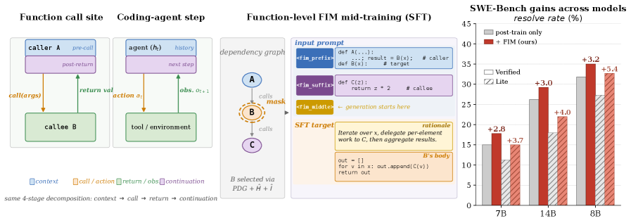
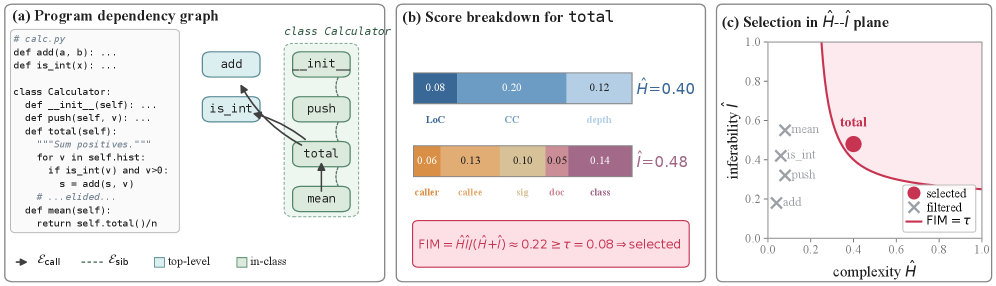

> **论文**：Function-Aware Fill-in-the-Middle as Mid-Training for Coding Agent Foundation Models · **作者**：TIGER Lab, University of Waterloo · **arXiv**：2607.12463 · **日期**：2026-07-13
>
> **代码仓库**：https://github.com/TIGER-AI-Lab/FIM-Midtraining（Apache 2.0）
>
> **模型/数据集**：https://huggingface.co/collections/TIGER-Lab/fim-midtraining

# 函数感知 Fill-in-the-Middle Mid-Training：面向编码 Agent 基座模型的训练时隙填补

## 第 1 章 概述

### 1.1 核心问题

编码 Agent（coding agent）通过后训练（post-training）管线（如 R2E-Gym、SWE-Smith、SWE-Lego）在 SWE-bench 等基准上取得了显著进展。然而，这些后训练管线从一个纯粹的自回归语言模型出发，该模型仅在前向方向上暴露了代码生成能力，而 Agent 实际需要的是一种 **结构化的条件生成能力**——在收到外部工具返回值后继续推理。

### 1.2 核心直觉

本文的核心洞察是：**Agent loop（history → action → observation → continuation）与函数调用站点（pre-call context → call → return → downstream usage）在结构上完全同构**。函数调用在互联网规模的普通代码中无处不在，但左到右的自回归训练几乎不暴露这种双向依赖关系。

基于这一洞察，作者提出 **函数感知的 Fill-in-the-Middle（FA-FIM）mid-training**：在标准预训练和 Agent 后训练之间插入一个自监督训练阶段，通过程序依赖图（PDG）分析和复杂度–可推断性双准则选择函数作为遮蔽目标，迫使模型学习跨函数边界的双向推理。

### 1.3 关键结果

| 指标 | Qwen2.5-Coder-7B + R2E-Gym | Qwen2.5-Coder-14B + R2E-Gym | Qwen3-8B + SWE-Lego |
|------|:---:|:---:|:---:|
| SWE-Bench-Verified（提升） | **+2.80 pp** | **+3.00 pp** | **+3.20 pp** |
| SWE-Bench-Lite（提升） | **+3.67 pp** | **+4.00 pp** | **+5.40 pp** |
| LiveCodeBench（恢复） | — | **+11.10 pp** | — |
| τ-bench（提升） | — | **+3.90 pp** | — |
| BFCL（提升） | — | **+2.40 pp** | — |

### 1.4 论文图表总览

| 编号 | 内容 | 原文章节 |
|------|------|------|
| **Figure 1** | Left: coding agent step and function call site are structurally similar. Middle: FA-FIM mid-training pipeline. Right: consistent gains on SWE-Bench. | Introduction |
| **Figure 2** | Function-aware FIM target selection on a small calculator example. (a) PDG. (b) Stacked bars for H=0.40 and I=0.48. | §2.3 |
| **Table 1** | Main results on coding agent benchmarks. | §3.2 |
| **Table 2** | Capability preservation and cross-domain transfer at 14B with R2E-Gym. | §3.3 |
| **Table 3** | Ablations on the 7B model: (A) CoT source, (B) selection algorithm, (C) mask granularity. | §3.4 |
| **Table 4** | Headline trajectory metrics on SWE-Bench-Verified (recovery rate, edits, steps, pass rate). | §4.1 |

### 1.5 贡献总结

1. 提出函数调用站点是 Agent action–observation–continuation loop 的互联网规模类比
2. 完整的 FA-FIM mid-training 管线：PDG 分析 + 复杂度–可推断性双准则 + CoT 嵌入 FIM middle span
3. 三轴鲁棒性验证（7B/14B 模型规模、R2E-Gym/SWE-Smith 后训练管线、Qwen3-8B 替代基座）
4. Python-only 语料在非代码工具基准（τ-bench、BFCL）上产生一致增益，直接验证函数调用/工具调用同构性
5. 开源 968 仓库去污染语料（400K FIM 样本，2.6B tokens）、选择管线及 mid-training 检查点

## 第 2 章 背景与动机

### 2.1 Coding Agent 的现状

编码 Agent 已从研究原型进入部署阶段。SWE-bench（Jimenez et al., 2023）及其衍生基准推动了后训练数据的规模化合成。当前主流的后训练管线包括：

| 管线 | 策略 |
|------|------|
| R2E-Gym | 基于 OpenHands fork 的合成 trajectory 训练 |
| SWE-Smith | 基于 SWE-agent 的 trajectory 数据合成 |
| SWE-Lego | 监督微调（仅用于 Qwen3-8B） |

这些管线的共同点是：从标准代码 LLM 出发，通过模仿人类或 LLM 在 issue 解决任务上的行为轨迹来微调模型。

### 2.2 存在的训练时隙

在两个阶段之间存在一个训练时隙：

```
Pretraining → [ 缺失的 Mid-Training ] → Post-training
```

基座模型极少针对 Agent 后训练将要求的条件结构进行优化。标准左到右预训练只暴露代码生成的前向方向，而 Agent 需要的是：**在收到工具返回值后，能基于观察到的返回值继续推理**。

### 2.3 现有 FIM 的不足

Fill-in-the-Middle（FIM）并非新概念。Bavarian et al.（2022）提出后，Qwen2.5-Coder、DeepSeek-Coder、StarCoder 等均在预训练中混入了 random-span FIM。但 random-span FIM 与 Agent 条件结构存在三个本质不匹配：

1. **Span 边界语法任意**：大多数遮蔽跨度切在表达式或语句中间，携带的关于函数级依赖的信号很弱
2. **无推理监督**：模型直接填充 span，无需产生中间推理
3. **目标被预训练稀释**：到后训练开始时，FIM 赋予的结构性先验已被数万亿无关 token 稀释

### 2.4 核心洞察

Agent 在每一步的运作可分解为四部分：

```
context → action → externally-computed return → continuation
```

而函数调用站点的结构完全相同：

```
pre-call code (绑定参数) → call → return value → downstream usage (消费返回值)
```

训练模型从调用者上下文和下游使用情况**双向推理**被调用函数的行为，正是 Agent 需要的能力——在给定历史记录和工具返回值后预测后续行为。



> **Figure 1 — 左：** 函数调用站点与编码 Agent 的单步操作在结构上相似，分解为相同的四个阶段：上下文（context）、调用/动作（call/action）、返回/观察（return/observation）、延续（continuation）。**中：** 我们通过函数感知 FIM mid-training 利用这一类比——从程序依赖图中使用复杂度（H）和可推断性（I）评分选出函数 B，随后以 FIM 格式将周围文件组织为 prompt，对模型进行 mid-training 使其填补 B 的函数体及 CoT 推理过程。**右：** Mid-training 在 Qwen2.5-Coder-Instruct（7B、14B）和 Qwen3（8B）上均带来一致提升，SWE-Bench-Verified 以实心柱表示，SWE-Bench-Lite 以斜线柱表示。

## 第 3 章 方法

### 3.1 数据收集与去污染

从 GitHub 精选 968 个 Python 仓库：

- 筛选策略：${\sim}2{,}000$ 个候选仓库（综合考虑 star 数阈值和 10 个主题查询）
- 手动质量过滤 + 排除所有与 SWE-bench 源仓库重叠的仓库（按仓库名称和已知 fork 验证）
- 时间戳去污染：限制为 SWE-Bench-Verified 和 SWE-Bench-Lite 最旧 base-commit **之前**的提交
- 最终语料：${\sim}400$K FIM 样本（${\sim}2.6$B token）

| 类型 | 数量 |
|------|:----:|
| 单函数 (single) | 320K |
| 双函数 (pair, $k=2$) | 60K |
| 三函数 (triple, $k=3$) | 20K |

### 3.2 函数感知 FIM 目标选择

#### 3.2.1 程序依赖图（PDG）

对每个源文件解析 AST，提取函数节点集 $\mathcal{V}$（顶层函数和类方法）。构建两类边：

- **调用边** $\mathcal{E}_{\text{call}}$：调用者与被调用者之间
- **兄弟边** $\mathcal{E}_{\text{sib}}$：同一类的不同方法之间（捕获通过共享实例状态而非直接调用的类内耦合）

调用解析覆盖常见 Python 惯用法：直接调用、类实例化、self/cls 方法调用，并配置短名称回退到限定名称索引。

#### 3.2.2 复杂度评分 $\hat{H}$

对每个 $v \in \mathcal{V}$：

$$
\hat{H}(v) = w_\ell\phi(\text{LoC}(v), c_\ell) + w_c\phi(\text{CC}(v), c_c) + w_d\phi(\text{D}(v), c_d)
$$

其中 $\phi(x, c) = \min(x/c, 2)$ 将每个因子归一化到 $[0, 2]$。三个因子分别为：

- $\text{LoC}(v)$：代码行数
- $\text{CC}(v)$：McCabe 圈复杂度
- $\text{D}(v)$：控制流最大嵌套深度

#### 3.2.3 可推断性评分 $\hat{I}$

$$
\hat{I}(v) = \alpha C_{\text{caller}}(v) + \beta C_{\text{callee}}(v) + \gamma C_{\text{sig}}(v) + \delta C_{\text{doc}}(v) + \varepsilon C_{\text{class}}(v)
$$

五个信号分别度量：

| 信号 | 含义 |
|------|------|
| $C_{\text{caller}}$ | 调用点参数特异性 |
| $C_{\text{callee}}$ | $v$ 内部调用的文件内函数数 |
| $C_{\text{sig}}$ | 类型注解和名称描述性 |
| $C_{\text{doc}}$ | 是否有 docstring |
| $C_{\text{class}}$ | 类内兄弟方法数 |

每个分量均为人工设计的代理——避免了将选择耦合到特定参考模型。

#### 3.2.4 组合评分

调和平均形式，乘以单边难度惩罚 $\rho(\Delta(v))$：

$$
\text{FIM}(v) = \frac{\hat{H}(v)\hat{I}(v)}{\hat{H}(v) + \hat{I}(v) + \epsilon} \cdot \rho(\Delta(v))
$$

调和平均强制 $\hat{H}$ 和 $\hat{I}$ 同时较大，惩罚不平衡。$\rho$ 降低在完整上下文中仍然困难的函数权重（避免不可学习的噪声）。全论文使用阈值 $\tau = 0.08$。

#### 3.2.5 多函数组选择

现实中的代码补丁经常跨越多个相关函数。扩展为遮蔽 $k=2$ 或 $k=3$ 个结构相连的函数的 **groups**。组评分 $\text{FIM}(G)$ 综合耦合项、组级调和平均乘积和难度惩罚，$\hat{I}(G)$ 在联合遮蔽下重新计算（防止组内引用虚增分数）。

涵盖 8 种拓扑模式：caller-callee、co-callee、sibling-coupled、mutual-call、call-chain、hub、fan-in、class-triad。



> **Figure 2 — 函数感知 FIM 目标选择在小型计算器示例上的演示。（a）** 从 AST 解析出的程序依赖图：实线箭头为调用边（call edges），虚线为同一类方法间的兄弟边（sibling edges）。**（b）** 堆叠柱状图分解 `Calculator.total` 的复杂度评分 H=0.40（公式 1；含代码行数 LoC、圈复杂度 CC、嵌套深度 depth）和可推断性评分 I=0.48（公式 2；含五项上下文信号），最终 FIM ≈ 0.22 ≥ τ = 0.08。

### 3.3 思维链（CoT）增强

对每个选定目标运行三阶段管线：

1. **生成**：Gemini-3-Flash 仅看到遮蔽文件，生成逐步推理和候选函数体（无 ground-truth 访问）
2. **过滤**：独立 Gemini-3-Flash 评判器按可行性和 5 个质量维度评分 (rationale, candidate body) 对；保留最高分 ${\sim}400$K 样本
3. **格式化**：将 rationale 放在 FIM middle span 内、body 之前：

```
<fim_prefix><prefix><fim_suffix><suffix><fim_middle><rationale><body>
```

这样模型被训练为生成推理后跟一致代码，镜像 Agent 步骤的 think-then-act 结构。

### 3.4 Mid-Training 设置

| 参数 | 配置 |
|------|------|
| 基座模型 | Qwen2.5-Coder-Instruct 7B/14B, Qwen3-8B |
| 损失函数 | 标准 FIM loss（仅 middle span） |
| 上下文长度 | 模型原生长度 |
| Sentinel tokens | 各模型原生 FIM sentinel |
| 后训练管线 | R2E-Gym / SWE-Smith（7B/14B）, SWE-Lego（Qwen3-8B，2 epoch） |
| 评估协议 | 3 独立 seed 取均值，报告 ± std |

所有评估在完整管线（mid-training + post-training）的最终检查点上进行。作者不评估 mid-training-only 检查点，因为 FIM-only 模型指令跟随能力退化。

## 第 4 章 实验结果

### 4.1 SWE-Bench 主结果

**Table 1：SWE-Bench-Verified 和 SWE-Bench-Lite 结果**

| 配置 | SWE-Bench-Verified (%) | SWE-Bench-Lite (%) | 平均 |
|------|:---:|:---:|:---:|
| **Qwen2.5-Coder-7B-Instruct** | | | |
| —（无 Agent 训练） | $1.80\ (\pm1.30)$ | $1.00\ (\pm1.00)$ | $1.40$ |
| + R2E-Gym（复现） | $15.00\ (\pm1.50)$ | $11.33\ (\pm1.20)$ | $13.17$ |
| + FA-FIM + R2E-Gym | $17.80\ (\pm1.40)$ | $15.00\ (\pm1.10)$ | $16.40$ |
| $\Delta$ vs 复现 | **+2.80** | **+3.67** | **+3.24** |
| + SWE-Smith（复现） | $12.30\ (\pm1.20)$ | $14.20\ (\pm1.40)$ | $13.25$ |
| + FA-FIM + SWE-Smith | $17.60\ (\pm1.30)$ | $14.70\ (\pm1.00)$ | $16.15$ |
| $\Delta$ vs 复现 | **+5.30** | **+0.50** | **+2.90** |
| **Qwen2.5-Coder-14B-Instruct** | | | |
| —（无 Agent 训练） | $4.00\ (\pm1.60)$ | $2.70\ (\pm1.00)$ | $3.35$ |
| + R2E-Gym（复现） | $26.20\ (\pm1.40)$ | $18.00\ (\pm1.10)$ | $22.10$ |
| + FA-FIM + R2E-Gym | $29.20\ (\pm1.50)$ | $22.00\ (\pm1.20)$ | $25.60$ |
| $\Delta$ vs 复现 | **+3.00** | **+4.00** | **+3.50** |
| **Qwen3-8B** | | | |
| —（无 Agent 训练） | $7.60\ (\pm1.20)$ | $5.80\ (\pm0.90)$ | $6.70$ |
| + SWE-Lego（复现） | $31.80\ (\pm1.00)$ | $27.30\ (\pm1.10)$ | $29.55$ |
| + FA-FIM + SWE-Lego | $35.00\ (\pm1.50)$ | $32.70\ (\pm1.30)$ | $33.85$ |
| $\Delta$ vs 复现 | **+3.20** | **+5.40** | **+4.30** |

主要发现：

1. **Qwen2.5-Coder 系列一致性提升**：固定后训练管线为 R2E-Gym，FA-FIM 在 7B 和 14B 上均提升 SWE-Bench-Verified 约 +3 pp，说明结构性先验在该家族内未被更大检查点吸收
2. **跨管线迁移**：R2E-Gym +2.80 vs SWE-Smith +5.30（Verified），表明 mid-training 不限于单一后训练分布
3. **非 Qwen2.5 基座迁移**：Qwen3-8B + SWE-Lego 提升 +3.20/+5.40，验证方法与具体基座无关

### 4.2 能力保持与跨域迁移

Agent 后训练的一个常被忽视的代价是非目标能力的退化。Table 2 展示了 14B 模型在 6 个非 SWE 基准上的表现：

**Table 2：能力保持（14B + R2E-Gym）**

| 基准 | Instruct | + R2E-Gym | + FA-FIM + R2E-Gym | $\Delta$ |
|------|:---:|:---:|:---:|:---:|
| **非 Agent 编码** | | | | |
| LiveCodeBench | $37.20$ | $24.10$ | $35.20$ | **+11.10** |
| OJBench | $5.20$ | $2.80$ | $4.74$ | **+1.94** |
| FullStackBench-EN | $53.80$ | $47.72$ | $48.25$ | **+0.53** |
| **Agent OOD** | | | | |
| Terminal-Bench 2.0 | $0.00$ | $2.41$ | $3.66$ | **+1.25** |
| **工具使用** | | | | |
| $\tau$-bench | $5.70$ | $3.40$ | $7.30$ | **+3.90** |
| BFCL | $23.20$ | $15.80$ | $18.20$ | **+2.40** |
| **6 基准平均** | $20.85$ | $16.04$ | $19.56$ | **+3.52** |

关键发现：

- Agent 后训练的隐性代价巨大：14B 上 R2E-Gym 使每个非 Agent 基准均退化，平均降幅 4.81 pp
- FA-FIM mid-training 大幅修复退化：LiveCodeBench 恢复 +11.10（接近 Instruct 天花板 37.20）
- **跨域迁移的直接证据**：$\tau$-bench（+3.90）和 BFCL（+2.40）不含任何 Python 代码编辑数据，mid-training 语料也不含工具使用数据——唯一的机制是函数调用/工具调用同构性

## 第 5 章 分析与消融

### 5.1 行为分析

**Table 4：行为分析（14B + R2E-Gym）**

| 指标 | + R2E-Gym | + FA-FIM + R2E-Gym |
|------|:---:|:---:|
| 恢复率（错误轨迹中 patch 通过率） | $24.8\%$ | $28.8\%$（**+4.0 pp**） |
| 编辑次数 / 解决任务 | $3.3$ | $7.4$ |
| 步数 / 解决任务 | $15.1$ | $23.6$ |
| Pass Rate | $26.2\%$ | $29.2\%$ |

恢复率从 24.8% 提升至 28.8%（+4.0 pp，+16% 相对提升），正是本文框架预测 mid-training 应当支持的核心能力：在外部返回值与模型先验不一致时**继续有效推理**。同时编辑次数和步数增加表明 Agent 转向迭代验证策略。

### 5.2 多函数推理增益

对 500 个 Verified 任务按 gold-patch 形状分层：

| Patch 形状 | 任务数 | 基线 | FA-FIM | $\Delta$ |
|-----------|:---:|:---:|:---:|:---:|
| 单函数（$\leq 1$ function） | 341 | — | — | **+2.1 pp** |
| 多函数（$\geq 2$ functions，同文件） | 88 | $13.6\%$ | $22.7\%$ | **+9.1 pp** |
| 多文件 | 71 | — | — | 无显著增益 |

在同文件多函数任务上，FA-FIM 的绝对增益达到 +9.1 pp，是单函数任务增益（+2.1 pp）的 **4 倍以上**。这正是函数感知 FIM 遮蔽直接训练的跨函数依赖推理能力。多文件任务未受益，符合预期——FIM 在文件内操作。

### 5.3 消融实验

所有消融在 Qwen2.5-Coder-7B-Instruct + R2E-Gym 上进行。

#### (A) CoT 来源

| 变体 | SWE-Bench-Verified | SWE-Bench-Lite | 平均 |
|------|:---:|:---:|:---:|
| 基线（无 mid-train） | $15.00$ | $11.33$ | $13.17$ |
| + FIM, 无 CoT | $16.10$ | $12.60$ | $14.35$ |
| + FIM, Self-CoT（Qwen2.5-Coder-7B） | $16.40$ | $13.30$ | $14.85$ |
| + FIM, Gemini-3-Flash CoT | $17.00$ | $14.20$ | $15.60$ |

- **FIM 结构独立贡献**：无 CoT 时已获 +1.18/2.43（约一半增益），FA-FIM 信号本身有实质作用
- Self-CoT 恢复 1.68/2.43，Gemini-3 frontier teacher 贡献约 0.75 pp——方法不是伪装蒸馏

#### (B) 函数选择算法

| 变体 | SWE-Bench-Verified | SWE-Bench-Lite | 平均 |
|------|:---:|:---:|:---:|
| 基线 | $15.00$ | $11.33$ | $13.17$ |
| Random | $15.30$ | $12.60$ | $13.95$ |
| Gemini-selected | $16.40$ | $13.70$ | $15.05$ |
| PDG only | $16.10$ | $13.60$ | $14.85$ |
| PDG + $\hat{H}$ | $16.50$ | $13.60$ | $15.05$ |
| PDG + $\hat{I}$ | $16.70$ | $14.00$ | $15.35$ |
| Full（PDG + $\hat{H} + \hat{I}$） | $17.00$ | $14.20$ | $15.60$ |

- Random 设下限（13.95）；Gemini 选择有帮助但不足（15.05）
- PDG 结构过滤是基础（14.85）；$\hat{H}$ 和 $\hat{I}$ 各自贡献额外增量且**不冗余**（Full 15.60）

#### (C) 遮蔽粒度

| 变体 | SWE-Bench-Verified | SWE-Bench-Lite | 平均 |
|------|:---:|:---:|:---:|
| 基线 | $15.00$ | $11.33$ | $13.17$ |
| 单函数 only | $17.00$ | $14.20$ | $15.60$ |
| 85% 单 + 15% pair ($k=2$) | $17.20$ | $14.60$ | $15.90$ |
| 95% 单 + 5% triple ($k=3$) | $17.00$ | $14.40$ | $15.70$ |
| 80% 单 + 15% pair + 5% triple | $17.40$ | $14.80$ | $16.10$ |

pair 组提升明显（+0.30），triple 饱和。最佳组合 80%/15%/5% 达到 16.10。

## 第 6 章 代码与数据

### 6.1 仓库结构

项目开源在 GitHub（TIGER-AI-Lab/FIM-Midtraining），Apache 2.0 许可：

| 目录 | 内容 |
|------|------|
| `data_construction/` | PDG 分析、复杂度/可推断性评分、多函数组选择 |
| `midtraining/` | FIM 训练脚本 |
| `posttraining/` | R2E-Gym / SWE-Smith 集成 |
| `evaluation/` | SWE-Bench、LiveCodeBench 等评估代码 |
| `assets/` | 论文图片 |

### 6.2 HuggingFace 资源

| 资源 | 链接 |
|------|------|
| 模型系列 | https://huggingface.co/collections/TIGER-Lab/fim-midtraining |
| 数据集 | TIGER-Lab/FIM-Midtraining-400K（400K 样本 / 2.6B tokens） |
| 7B 检查点 | TIGER-Lab/FIM-Mid-7B |
| 14B 检查点 | TIGER-Lab/FIM-Mid-14B |
| 8B (Qwen3) 检查点 | TIGER-Lab/FIM-8B |

## 第 7 章 局限性与讨论

### 7.1 局限性

1. **仅 Python**：方法在 Python 上验证，在 Java、TypeScript 等其他主流语言上是否成立尚待验证
2. **单文件 FIM**：遮蔽操作在文件内部，无法捕获跨文件依赖关系
3. **Gemini 蒸馏依赖较小但非零**：虽然 Self-CoT 已恢复大部分增益，0.75 pp 的 frontier teacher 贡献说明方法并非纯粹的自监督
4. **计算限制**：消融实验仅在 7B 上进行，粒度、CoT 来源等的交互效应在 14B 上可能不同

### 7.2 未来方向

- 扩展到更多编程语言
- 跨文件 FIM：捕获文件的跨模块依赖
- 在线 mid-training：在 Agent 使用过程中持续更新 mid-training 数据
- 与非编码 Agent（如浏览器 Agent、通用工具使用 Agent）的结合

### 7.3 总结

FA-FIM mid-training 通过在预训练和后训练之间插入一个轻量自监督阶段（400K 样本，2.6B tokens），在 SWE-Bench 上取得了一致且显著的提升，同时修复了后训练造成的非目标能力退化。其核心价值不在于大幅提升 SOTA，而在于揭示了一个被忽视的训练时隙并通过结构先验来填补它——这是一种易于集成、成本可控的管线改进，具有较好的实用价值。