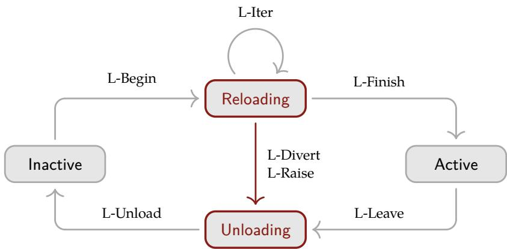

> **论文**：A Programming Paradigm for Spatiotemporal Composability
> **作者**：Yifan Shi, Wei Zhang, Tianyi Cui（北京大学；DeepSeek-AI）
> **arXiv ID**：无（GitHub 预印本，2026-08-13）
> **发表时间**：2026-08-13
> **代码仓库**：https://github.com/cordiverse/cordis

## 第 1 章 概述

### 1.1 论文定位

本论文是一篇纯形式化编程语言（PL）理论论文：将经典的效应与共效应概念从编译期类型系统提升为运行时机制，为插件系统与自进化 agent harness 中的动态组合提供「时空可组合性」的形式基础，并给出元理论证明与参考实现 Cordis。该论文是 DeepSeek Harness（deepseek-ai/deepseek-harness，142k★，MIT）「Everything is a Plugin」架构的理论基础——DeepSeek Harness 官方 README 声明 "powered by Cordis, whose design is described in A Programming Paradigm for Spatiotemporal Composability"，Cordis 文档（cordis-primer）亦托管于 deepseek-harness.github.io。

论文针对的问题域是动态组合：组件在运行时加载、卸载、重配置。传统组合是静态的——函数调用、模块导入、类继承在编译期解析并在整个执行期固定；静态组合拥有丰富的形式框架，而动态组合的理论基础长期欠发达，现行实践依赖以重启为手段、丢弃运行时状态的粗粒度机制。

论文将动态可组合性分解为两个正交维度：

- **时间可组合性**：组件移除时，其对共享环境的修改（资源分配、事件注册、状态变更）被完全且安全地逆转；
- **空间可组合性**：组件以结构化、可验证的方式声明、发现、解析相互依赖，并在依赖变化时协调生命周期。

论文的解法路径为四步：将效应提升为可逆效应、将共效应提升为反应式共效应（局部形式）；将两种上下文统一为单一上下文类型，构成编程范式；将机制组合为组件概念并给出动态组合演算及其元理论（全局形式）；以 Cordis 元框架实现并在 Koishi（4000+ 社区插件）上验证。

论文共 8 章，正文约 80 页（References 起始于第 80 页），含 74 个编号定义、编号至 73 的定理/引理序列、10 条演算规则、10 个算法。

**论文图表总览**

| 编号 | 内容 | 论文位置 | 用途 |
| :--- | :--- | :--- | :--- |
| Figure 1 | 基础组件生命周期：Inactive ⇄ Active 两状态模型 | §4.1 | 演算的最小生命周期，§4.2 为其给出规则 |
| Figure 2 | 含转换中状态的完整生命周期：四状态模型，两个转换态加框标注 | §4.3 | 真实运行时实现的生命周期形态 |
| Table 1 | 10 条演算规则视为对 fiber n 的写操作（θ 状态迁移、状态映射 Ψ、控制字段编辑） | §4.4 | 元理论证明的统一查询表 |
| Table 2 | 理论 ↔ 实现对应（Γ∞↔ctx、effect↔ctx.effect、Σ↔ctx[@@store]、recover↔fiber.dispose 等 30 余项） | §5.1 | Cordis 实现对形式模型的忠实映射 |

### 1.2 核心贡献

论文 §1.3 列出 5 条贡献，分别对应 §3.1、§3.2、§3.3、§4、§5。

**贡献 1：可逆效应（Revertible Effects，§3.1）——局部时间可组合性。** 每个上下文变换携带一个显式逆，运行时对其进行跟踪；跟踪与恢复都保持复合结构，因此组件移除时上下文被恢复。核心类型：

$$
\mathfrak{E}_{\Gamma} := \Gamma \to \Gamma \times (\Gamma \to \Gamma)
$$

其带见证精化 𝔈*Γ 要求在每个应用点 g(δ) = γ（Definition 8）。跟踪在效应上下文

$$
\partial\Gamma := \Gamma \times (\Gamma \to \Gamma)
$$

上累积逆（Definition 2–3）；逆按扭曲复合以相反顺序累积（Definition 1）：

$$
(f_1, g_1) \circ (f_2, g_2) := (f_1 \circ f_2,\ g_2 \circ g_1)
$$

恢复由 recover 应用累加器完成（Definition 6）：

$$
\mathrm{recover}_{\Gamma} = (\gamma, \varphi) \mapsto (\varphi(\gamma),\ \mathrm{id}_{\Gamma})
$$

**贡献 2：反应式共效应（Reactive Coeffects，§3.2）——局部空间可组合性。** 组件将所需依赖声明为规约 d ∈ 𝔇Σ := Set(K)（Definition 25），每次上下文变化按满足谓词（§3.2.2）

$$
\sigma \vDash d := \forall k \in d.\ k \in \mathrm{dom}(\sigma)
$$

被分类为 activating / deactivating / neutral 并通知组件（Definition 26）。共效应上下文为依赖键带类型的部分函数类型 Σ := (k : K) ⇀ 𝒱k（Definition 22）。两机制协同的关键事实：set(k, v) 本身具有类型 𝔈*Σ——共效应操作即效应，效应可逆，因此依赖注册自动获得跟踪与恢复。

**贡献 3：统一上下文类型（§3.3）——构成编程范式。** 效应上下文与共效应上下文统一为单一递归类型（Definition 32）：

$$
\Gamma_{\infty} := \mu\Gamma.\ \Gamma \times (\Gamma \to \Gamma) \times \Sigma
$$

三个投影分别为：当前上下文状态（递归）、恢复本层效应的累加器、携带依赖信息的共效应上下文。共效应上组装出的观测等价（Definition 33）

$$
\sigma \simeq \sigma' := \mathrm{dom}(\sigma) = \mathrm{dom}(\sigma') \wedge \forall k \in \mathrm{dom}(\sigma).\ \sigma(k) \simeq_k \sigma'(k)
$$

为效应提供独立性：可交换键上的共效应介导效应函数两两独立（Theorem 42），补上 §3.1.3 留下的独立性假设。该统一类型即「上下文范式」：兼得函数式方法的可追溯性与命令式方法的工效学。

**贡献 4：动态组合演算（§4）。** 组件为三元组（Definition 43）：

$$
\mathfrak{C}_{\Gamma} := \mathfrak{D}_{\Gamma} \times \mathfrak{P}_{\Gamma} \times \mathfrak{E}_{\Gamma}^{*}
$$

(d, p, e) 分别为：声明的依赖规约、声明可提供的共效应键集、带见证效应函数（p 之外的键不被 e 写入，不同 fiber 的提供集不相交）。组件的运行时实例为 fiber（Definition 44）：

$$
\langle d, p, e, \pi, \sigma, \tau, \theta \rangle
$$

携带父指针 π、自有共效应表 σ、退休标志 τ、生命周期状态 θ。状态 γ 携带 registry Fγ : 𝔑 ⇀ 𝔽Γ，共效应上下文为全体 Active fiber 表之并（Definition 45）。演算共 10 条规则：3 条编排规则（O-Insert、O-Retire、O-Remove，外部输入）与 7 条生命周期规则（L-Begin、L-Iter、L-Finish、L-Divert、L-Raise、L-Leave、L-Unload）。元理论五定理将时空可组合性从单组件提升到交错组件构成的整体系统。

**贡献 5：Cordis 实现（§5）。** Cordis 是时空可组合性元框架（meta-framework）：不规定具体应用场景，仅提供通用动态组合语义。三层结构：核心库（§5.1，效应跟踪 ctx.effect + 共效应解析 ctx.get/ctx.set/notify，Algorithm 1–6）；声明式组件加载器（§5.2，entry 六字段配置树与增量调和 + @cordisjs/hmr 三阶段热替换，Algorithm 7–10）；应用框架层（§5.3，Koishi 案例：4 年开发、4000+ 社区插件、跨 IM 平台）。

### 1.3 关键结果速览

五条元定理（§4.4）构成演算的全部全局保证：

| 定理 | 名称 | 结论要点 | 位置 |
| :--- | :--- | :--- | :--- |
| Theorem 59 | Preservation | 良构 registry 不变量逐步保持 | §4.4.1 |
| Theorem 61 + Corollary 62 | Recovery exactness / Terminal recovery | 全局时间可组合性 | §4.4.2 |
| Theorem 63 + Theorem 64 | Ordering / Resolution coherence | 全局空间可组合性 | §4.4.3 |
| Theorem 66 | Progress | 无死锁 + 终止 | §4.4.4 |
| Theorem 73 | Confluence | 静止状态与静态装配等价 | §4.4.5 |

**Theorem 59（Preservation）。** 良构 registry 的四条款不变量——父指针落在 registry 内或为 root、不同 fiber 提供集两两不相交、已安装 fiber 的承诺视图 ω 在其规约上全函数且取值于 registry、被解析到的提供者自身已安装——在任意规则步下保持。L-Unload 上的 relied 守卫是条款 (3)(4) 的承载者。

**Theorem 61（Recovery exactness）与 Corollary 62（Terminal recovery）。** 在步序列成对独立（Definition 60）的前提下，设 fiber n 的 episode 于 b 开启，t₁ < ⋯ < t_l 为 [b, u) 中作用于其它 fiber 的步：

$$
g_n^u(\gamma^u) \approx (\Psi^{t_l} \circ \dots \circ \Psi^{t_1})(\gamma^b)
$$

即运行 n 的累加器只撤回 n 自己的贡献，得到「从未开始」的状态（≈ 忽略控制字段）；episode 关闭时（Corollary 62）γ^{u+1} 同样 ≈-等于该状态——撤回一个组件对其它 fiber 的效果为零。成对独立性由 §3.3.2 卸载：全部效应走共效应操作且键可交换时自动成立（Theorem 42 的迭代器推广）。

**Theorem 63（Ordering）与 Theorem 64（Resolution coherence）。** L-Begin 仅在依赖满足处发生：step^t = L-Begin(m) ⇒ γ^t ⊨ d_m。若消费者 m 的承诺视图将键 k 解析到提供者 n（ω_m(k) = n），则 n 的 episode 严格包含 m 的 episode：b < b′ 且（若闭合）u′ < u，且在整个区间内 σ_n^t(k) = σ_n^{b′}(k) 保持稳定——消费者在自己的卸载全程仍可读取正在撤回的依赖。Theorem 64 保证转换期间每次迭代针对同一解析 ω：目标视图一旦变化，L-Divert/L-Raise 立即将 fiber 带出转换。

**Theorem 66（Progress）。** 在前置关系

$$
n \prec m := p_n \cap d_m \neq \varnothing
$$

无环、每个效应迭代器长度 len(e_n) ≤ K、名字集有限的假设下：(1) 无死锁——非静止状态必有某条生命周期规则可用，L-Unload 的 relied 守卫由 ≺ 无环性保证最终释放；(2) 终止——作用于 n 的步数有界：

$$
S(n) \leq (K + 4)(V(n) + 1)
$$

其中 V(n) 为 n 的目标视图翻转次数；每个极大生命周期步序列终止于静止状态。

**Theorem 73（Confluence）——论文核心成就。** 在成对独立与组件在其提供集上完全（Definition 69）的条件下，到达静止状态的任意步序列满足：(1) canonical form——该状态可由「按 ⊲ 拓扑序对支持集 A 中每个 fiber 各取一个 episode、编排步骤保持原序」的序列到达；(2) confluence——取相同编排步骤的任意两个序列到达 ≃ 与 ≈ 相关的状态。即**动态历史不留痕迹**：运行期经历过的全部加载、卸载、替换、回退，对静止状态的影响与一开始就静态装配最终组合完全相同。论文将其类比为增量计算中 change propagation 相对于从头求值的一致性。该定理是加载器增量调和（§5.2.1）与「把 Cordis 应用当作静态装配来推理」的许可证。

演算的生命周期状态随控制流复杂化而扩展。基础两状态模型（Figure 1）：

$$
\Theta_{\Gamma} := \mathrm{Inactive} \mid \mathrm{Active}(g, \omega)
$$


*两状态模型：激活一步执行效应函数 e 并安装逆，停用一步应用累加器 g 恢复上下文。*

§4.3 引入转换中状态后的四状态模型（Definition 49，Figure 2）：

$$
\Theta_{\Gamma} := \mathrm{Inactive}(\zeta) \mid \mathrm{Reloading}(i, g, \omega) \mid \mathrm{Active}(g, \omega) \mid \mathrm{Unloading}(g, \omega, \zeta)
$$



*四状态模型：Reloading 与 Unloading 为转换中状态；L-Unload 是唯一应用累加器的规则，L-Leave 记录卸载决定并停止提供。*

Table 1 将全部 10 条规则统一读作对 fiber 的写操作（θ 迁移、状态映射 Ψ ∈ {id, pr₁∘i, g}、被编辑的控制字段），是上述五个定理证明共用的查询表；Table 2 给出理论构件到 Cordis 运行时的逐项对应（Γ∞ → ctx、effect → ctx.effect、Σ → ctx[@@store]、get/set → ctx.get/ctx.set、fiber 元组 → fiber 对象、recover/累加器 → fiber.dispose、ω → fiber.committed、target → fiber.target），实现与演算的对应关系由此可查。

## 第 2 章 研究背景与动机

### 2.1 时间可组合性

时间可组合性处理时间维度：组件移除时，它对共享环境做过的修改必须被完全且安全地逆转。这要求跟踪组件执行的每一次资源分配、事件注册与状态变更，并保证移除时的有序回收。

在静态设定下，时间可组合性退化为词法作用域机制——RAII（C++）与 bracket 模式（Haskell 的 bracket/finally）将资源释放绑定到词法区域。在动态设定下，组件在运行时到来与离去，两个难度同时出现：效应是长寿命、有状态的，其作用范围不受任何词法边界约束；效应的撤回必须发生在组件生命周期结束处，而非某个括号处。

以 VSCode 为代表的时间维失败模式：所有扩展运行在共享进程 extension host 中，该宿主没有在运行时卸载单个扩展代码的机制；扩展的 activate 函数执行后，禁用或卸载该扩展需要重启整个宿主，波及全部已加载扩展。按安装量排名的前 100 个扩展中，87 个包含可执行代码，因此移除时都需要这样的重启；纯声明式扩展（主题、键绑定、代码片段）不含代码，可自由移除。VSCode 提供的 deactivate hook 仅充当宿主进程终止时的优雅停机回调，不能实现活移除；且该 hook 将效应清理与效应创建（activate）分离，违反局部性原则，使完整清理难以验证。

### 2.2 空间可组合性

空间可组合性处理空间维度：组件必须能以结构化、可验证的方式声明、发现、解析对其它组件的依赖。这要求管理依赖拓扑，并在依赖变化时协调组件生命周期。

在静态设定下，空间可组合性退化为模块导入解析。在动态设定下，依赖在执行期间出现、消失或更换身份，解析必须随之重做。

VSCode 的空间维失败模式：extensionDependencies 机制存在但几乎无人使用——前 100 个扩展中仅 7 个声明了对非内置扩展的依赖。这一稀缺性源于扩展 API 的形态：宿主暴露固定的表层扩展点（commands、views、language features），扩展经由这些点向宿主贡献而非相互依赖，扩展间依赖因此很少出现。扩展间的交互机制 vscode.extensions.getExtension(...).exports 无结构契约：返回值默认为 any 类型，依赖者无法依赖一个经检查的接口。VSCode 将扩展导向宿主提供的固定扩展点集合，不提供扩展间相互依赖的安全结构化途径。

### 2.3 动机示例

#### 2.3.1 插件系统

插件系统是动态组合的典型实例。论文以 VSCode（使用最广泛的可扩展 IDE 之一）为代表：时间维上，87/100 的头部扩展包含可执行代码而无法活移除；空间维上，仅 7/100 声明扩展间依赖且交互接口无类型契约。论文强调这两个限制并非 VSCode 独有，而是在插件系统中普遍重现，仅程度不同。

#### 2.3.2 自进化 agent harness

现代 AI agent 依赖运行时 agent harness：组合多样化工具套件与执行环境、治理权限与沙箱、维护会话状态与持久化、提供上下文管理与记忆系统、编排子 agent 与多 agent 工作流、向用户与自动化暴露接口。未来的 harness 可能在持续服务请求的同时，生成并部署对自身组件的修改；模型合成的可复用工具是组件级自修改的更窄前驱。每一次这样的修改本身就是一个动态组合实例。

由于这些修改持续发生且缺少人工监督，动态可组合性不可或缺：

- 无时间可组合性：每次自修改强制完全重启，丢弃全部进程内累积状态；在该频率下累积不可用性显著，进行中任务被反复中断；更糟的是，一次故障自修改可能禁用恢复所需的进程本身；
- 无空间可组合性：每个模块必须自行检测并临时适应其依赖模块的出现、消失与换名；naive 的代码替换策略可能静默破坏依赖者，或引入仅在 reload 时才暴露的循环依赖。

#### 2.3.3 粗粒度 workaround

动态可组合性长期缺乏形式关注的现实原因：操作系统与容器编排器已提供粗粒度替代物。操作系统以进程为粒度提供时间可组合性；容器编排器以服务为粒度提供空间可组合性。实践中多数软件以重启进程处理行为异常模块、以编排器管理服务依赖，从而容忍细粒度可组合性的缺失。

该 workaround 的代价：

- 时间维：每次重启丢弃全部进程内累积状态（缓存、连接、部分计算），重建耗时数秒到数分钟；在重建期间维持可用性需要冗余副本，为「无法恢复单个组件」付出资源开销；
- 空间维：容器级编排无法表达共享地址空间的组件间依赖；本可以是本地函数调用的交互被引入网络开销。

两种机制都工作在进程与容器的边界上，而现代系统日益在更细粒度上组合。这一粒度错配要求一种组合式抽象，在与组件自身相同的粒度上管理效应与依赖。

### 2.4 Preliminaries：效应与共效应

#### 2.4.1 效应系统

在简单类型 λ 演算（STLC）中，类型判断 Γ ⊢ t : T 表示项 t 在上下文 Γ 下具有类型 T。效应系统细化该类型以描述计算可产生哪些副作用：

$$
\Gamma \vdash t : T_{\mathrm{effect}}
$$

结果类型被标注一个效应代数的元素，使有状态计算获得组合式推理。该路径起源于 Lucassen 与 Gifford 的多态效应系统：区分类型、效应与区域的 kinded 类型系统，用于发现并行程序中的调度约束。

**Monadic 效应。** Moggi 首次以 monad 在范畴上建模计算效应，Wadler 将其推广至 Haskell。monad (T, η, μ) 将效应计算封装为 T(A) 型的值：η : A → T(A) 提升纯值，μ : T(T(A)) → T(A) 序列化嵌套计算。经典实例：Maybe（部分性）、State（可变状态）、IO（外部交互）。

**代数效应。** Plotkin 与 Power 证明代数运算确定 monad，建立效应接口与实现解耦的框架：效应签名 Σ 声明一组运算（如状态操作 get : () → S 与 put : S → ()），程序自由调用运算而不承诺特定解释。Plotkin 与 Pretnar 引入效应 handler，以续延语义解释运算：

$$
\mathrm{handle}\ e\ \mathrm{with}\ \{\mathrm{op}(v, \kappa) \mapsto \dots\}
$$

handler 接收运算参数 v 与定界续延 κ，可将 κ 调用零次、一次或多次，从而在统一框架内实现异常、协程与非确定性。Koka、Eff、OCaml 5 以不同设计权衡采用了代数效应。

#### 2.4.2 共效应系统

与效应对偶，共效应系统丰富上下文而非类型：

$$
\Gamma_{\mathrm{coeffect}} \vdash t : T
$$

上下文被标注一个共效应代数的元素，描述计算对环境的要求：要访问的资源、要持有的权限、要依赖的服务。效应建模程序对世界的影响，共效应建模世界对程序的约束。

**Comonadic 共效应。** Uustalu 与 Vene 以对称（半）幺半 comonad 结构化上下文依赖计算，作为 Moggi monadic 框架的对偶，捕获数据流与属性求值等概念；Petricek 等在此基础上提出共效应作为上下文依赖的统一静态分析。comonad (D, ε, δ) 捕获上下文依赖计算：ε : D(A) → A 从上下文提取当前值，δ : D(A) → D(D(A)) 复制上下文供嵌套访问。代表实例：Environment comonad D(X) = E × X 建模对固定环境 E 的依赖；Stream comonad D(X) = ℕ → X 建模对时间数据的依赖。

**Graded 共效应。** 为获得更细粒度的跟踪，graded 共效应系统使用预序半环作为共效应代数，该纪律后由 Gaboardi 等与 graded 效应统一。半环元素标注每个变量绑定以量化其使用：0 表示未使用，1 表示线性使用，∞ 表示无限制使用；半环乘法 × 序列组合共效应、加法 + 并行组合共效应，从而在统一代数框架内支持精确资源跟踪、敏感度分析与信息流控制。

#### 2.4.3 与动态可组合性的关系

效应与共效应沿两个互补方向组织对计算的推理：效应描述计算如何修改其环境，共效应描述计算如何依赖其环境。这两个方向恰好对应第 2.1、2.2 节的两个维度：

- 时间可组合性要求组件对共享环境的修改在卸载时可逆。相关效应是有状态效应——它们持久地变换该环境；撤销这样的变换要求它容许一个逆；
- 空间可组合性要求组件间依赖被声明并被反应式管理。这样的依赖正是共效应所刻画的对象；管理它们就是将每个依赖对照环境所提供的加以解析。

经典效应与共效应系统是静态工具：效应在词法固定的作用域内跟踪、由编译期 handler 解除；共效应注解针对执行前确定的上下文验证。动态组合则要求这些保证对运行时到来与离去的组件、对持续演化的上下文成立。没有固定的词法作用域能界定部署后加载的插件；没有编译期上下文能预见由运行时配置产生的依赖。

由此引出论文的视角转换：不是向静态类型系统添加更多注解，而是将效应与共效应的概念结构 reify（具体化）为运行时可直接操作的实体，从而动态地确立这些系统静态提供的保证。这是 §3 全部构造的出发点。

### 2.5 现有方法的不足

#### 2.5.1 手写清理不可组合

第一类现有方法将恢复职责交给开发者手写的清理或补偿逻辑：插件生命周期约定（OSGi、Eclipse 扩展点、IntelliJ 与 VSCode 的 unload 回调）将清理委托给开发者编写的回调；Command 模式为撤销/重做栈封装操作与 undo 方法；saga 模型将长事务结构化为逐步配对补偿动作的序列；代数效应 handler 可附加在 teardown 时运行的 finalizer；event sourcing 通过追加补偿事件而非执行逆来撤回状态。这一家族的共同缺陷：**逆是一项未被强制履行的义务，且与操作本身解耦**——遗忘即静默泄漏资源（§1.2.1 的 VSCode deactivate hook 即为实证）。

React 的 useEffect 在结构配对上最接近本论文：effect 返回 cleanup，运行时在每次重新执行与组件卸载前调用它。其不足恰在可组合性：hook 只能在组件或另一 hook 的顶层调用，不能出现在条件、循环或嵌套函数内；effect 主体既不接受 async 函数也不接受迭代器。效应因此无法由其它效应组装、无法与控制流交错，无从派生复合逆。Cordis 效应无此限制：它们是可自由复合、可异步的普通操作，仅原子效应需要手写逆，任意复合的逆由复合自动派生——组装既有效应不需要编写任何逆。

时间维上另有三个家族，各有一处达不到的边界：

- **状态前向迁移**（DSU、quiescence/tranquility、Kitsune、Erlang/OTP、webpack/Vite HMR）：以手写迁移函数把状态带到新版本，适合原位更新，但既需要手写迁移函数，也不支持整体卸载组件并回收资源；
- **静态作用域逆转**（STM、可逆计算/RCCS、线性类型、RAII、Rust 所有权）：按构造自动逆转，但逆转的作用域与范围在事先固定——STM 限于事务，词法机制限于区域；Cordis 不预先固定范围，在组件整个生命周期上逆转任意上下文操作；
- **接口插桩回收**（Nooks、shadow drivers、Akeso）：系统级最接近可逆效应的先例，由运行时在受控接口上记录获取记录再回收；但平台固定了可记录的内容（每种内核对象类型的释放代码、每个驱动类的 shadow），组件只能持有平台已知如何释放的资源，且回收受限于请求提交或同体重启。

#### 2.5.2 静态接线无动态性

空间维的第一类方法在初始化时接线：依赖注入框架（Spring、Guice、Angular、Inversify）在初始化时注入依赖；UI 框架上下文（Vue 的 provide/inject、React Context）沿组件树传递依赖。其中部分支持动态作用域（Spring 的 prototype/request 作用域、Angular 的分层注入器），但**没有一个是反应式重解析的**：运行时替换或移除 provider 时，既有依赖者既不被停用也不被重新初始化，也没有任何机制提供组件生命周期状态机。

空间维最接近的先例是可用性反应式组件模型：OSGi Declarative Services 与 iPOJO 允许组件声明 provided/required 服务，运行时随服务出现与消失自动激活/停用组件；iPOJO 的 Gravity 项目明确以服务可用性变化下的自主运行时适应为目标，其 provide/require 模型直接预示了 Cordis 的模式；R-OSGi 经 RPC 将同一抽象透明扩展到分布式环境。该家族经停用回调恢复，受两点限制：(1) 回调手写，资源安全依赖开发者纪律，遗忘即静默泄漏；(2) 回调同步——若 teardown 需要与正在离去的依赖进行异步交互，框架没有协议可等待，只能阻塞在可能已经失效的引用上。Cordis 的反应式共效应同时闭合两个缺口：停用逆转依赖者累积的效应；惯性 Unloading 状态将异步 teardown 运行至完成后才响应后续变化。

效应系统侧的工业实践亦有差距：monadic 效应库（Scala 的 ZIO[R, E, A]、TypeScript 的 Effect-TS 与 fp-ts）将效应编码进既有语言的类型系统，但其跟踪以 monadic 嵌入为代价——程序必须写进效应类型内部才能获得跟踪，而 Cordis 将效应跟踪作为普通宿主代码之上的 overlay；其 requirement 由安装的 service 解释解除，service 撤回后其操作已执行的效果留在原地，Cordis 则为每个效应配逆并在 provider 来去时重解析。值级反应式（FRP 与 signals）在值粒度同步传播变更并保证 glitch freedom，但不建模组件级异步生命周期；论文定位其为互补而非竞争——Cordis 的共效应本身可携带响应式值。
## 第 3 章 核心技术：可逆效应与反应式共效应

本章把第 2 章引入的效应与共效应概念提升（lift）为运行时机制。核心操作是把携带效应与共效应的类型上下文具体化为上下文类型，即可运行时操作的、把上下文具体化为一等实体的类型：效应侧建模为「上下文变换 + 显式逆」，实现局部时间可组合性（§3.1）；共效应侧建模为携带依赖信息的类型 $\Sigma$，实现局部空间可组合性（§3.2）；共效应上的观测等价（Definition 33–37）为效应提供独立性；统一二者的上下文类型 $\Gamma_\infty$（Definition 32）本身构成一个编程范式（§3.3）。

### 3.1 可逆效应

时间可组合性指在运行时装载与卸载组件，且卸载时共享环境恢复到组合前的状态。这要求组件对环境的每次修改既可跟踪又可恢复。论文把效应建模为类型 $\Gamma \to \Gamma \times (\Gamma \to \Gamma)$ 的函数：作用于当前上下文，返回修改后的上下文与一个显式逆。提供逆使效应可撤销，把逆交还给运行时使效应可跟踪。称这类效应为可逆效应（revertible effects）：通过在执行期间跟踪并复合这些逆，完整的环境恢复成为结构性保证。

#### 3.1.1 效应上下文

任意非纯函数 $f_{\mathrm{impure}} : X \to Y$ 可转化为纯形式 $f : \Gamma \times X \to \Gamma \times Y$，其中 $\Gamma$ 是上下文，所有可能的副作用表示为对 $\Gamma$ 的变换。对固定输入 $x : X$，诱导映射 $\gamma \mapsto \mathrm{pr}_1(f(\gamma, x))$ 独立于返回值地捕获副作用。$\Gamma$ 上的效应因此生活在复合 $\circ$ 下的变换幺半群 $\Gamma \to \Gamma$ 中，每条幺半群公理有直接的效应解读：

| 幺半群公理 | 效应解读 |
| :--- | :--- |
| Closure（封闭） | 两个效应的顺序复合仍是效应 |
| Associativity（结合） | 复合效应与加括号方式无关 |
| Identity（单位） | $\mathrm{id}_\Gamma$ 作为复合的单位元 |

为建模可撤销的效应，把每个变换 $f$ 与撤销它的变换 $g$ 配对，称 $g$ 为 $f$ 的左逆（left inverse，全文简称 inverse）。撤销是单向的：对逆的要求始终是 $g \circ f$，从不需要 $f \circ g$。变换对自带一个乘法：

**Definition 1（扭曲复合，twisted composition，式 (4)）** 上下文变换对的扭曲复合定义为

$$
\left(f_{1}, g_{1}\right) \circ \left(f_{2}, g_{2}\right) := \left(f_{1} \circ f_{2},\ g_{2} \circ g_{1}\right) \tag{4}
$$

直观：与 $\circ$ 本身一样，左操作数后作用；逆按相反顺序累积。该乘法使 $(\Gamma \to \Gamma) \times (\Gamma \to \Gamma)$ 成为以 $(\mathrm{id}_\Gamma, \mathrm{id}_\Gamma)$ 为单位的幺半群，即变换幺半群与其反幺半群的积，称为 $\Gamma$ 上的扭曲复合幺半群 $\mathfrak{T}_\Gamma$。

**Definition 2（效应上下文，effect context，式 (5)）** 给定上下文 $\Gamma$，其效应上下文定义为

$$
\partial \Gamma := \Gamma \times (\Gamma \to \Gamma) \tag{5}
$$

直观：$\partial\Gamma$ 的元素是二元组 $(\gamma, \varphi)$，其中 $\gamma : \Gamma$ 是当前上下文状态；$\varphi : \Gamma \to \Gamma$ 是累加器，即已施用效应的逆的复合，也是把上下文恢复到初始状态的函数。初始效应上下文为 $(\gamma_0, \mathrm{id}_\Gamma)$。动机：把效应的跟踪放进上下文本身，而非依赖外部簿记。

继续写 $\partial^2 \Gamma = \partial \Gamma \times (\partial \Gamma \to \partial \Gamma)$，依此向上构成高塔（tower）。跟踪与恢复的具体构造如下。

**Definition 3（track，式 (6)）** 上下文函数对上的变换 track 定义为

$$
\begin{array}{rcl}
\mathrm{track}_\Gamma & : & (\Gamma \to \Gamma) \times (\Gamma \to \Gamma) \to \partial \Gamma \to \partial \Gamma \\
\mathrm{track}_\Gamma & = & (f, g) \mapsto (\gamma, \varphi) \mapsto \left(f(\gamma),\ \varphi \circ g\right)
\end{array} \tag{6}
$$

直观：把前向函数 $f$ 与候选逆 $g$ 转换为 $\partial\Gamma$ 上的变换——用 $f$ 变换状态 $\gamma$，把逆 $g$ 复合到累加器 $\varphi$ 上，从而在上下文中跟踪 $f$ 的效应。

**Theorem 4（track 与投影交换，式 (7)）** 对每个 $(f, g) \in (\Gamma \to \Gamma) \times (\Gamma \to \Gamma)$，

$$
\mathrm{pr}_1 \circ \mathrm{track}_\Gamma(f, g) = f \circ \mathrm{pr}_1 \tag{7}
$$

证明：对一切 $(\gamma, \varphi) \in \partial\Gamma$，$(\mathrm{pr}_1 \circ \mathrm{track}_\Gamma(f,g))(\gamma,\varphi) = \mathrm{pr}_1(f(\gamma), \varphi \circ g) = f(\gamma) = (f \circ \mathrm{pr}_1)(\gamma, \varphi)$。直观：对 $\partial\Gamma$ 施加 track 在状态分量上恰好就是施加 $f$。

**Theorem 5（track 是幺半群同态，式 (8)）** track 是从 $\mathfrak{T}_\Gamma$ 到 $\partial\Gamma \to \partial\Gamma$ 的幺半群同态：

1. $\mathrm{track}_\Gamma(\mathrm{id}_\Gamma, \mathrm{id}_\Gamma) = \mathrm{id}_{\partial\Gamma}$；
2. 对一切 $(f_1, g_1), (f_2, g_2) \in \mathfrak{T}_\Gamma$，

$$
\mathrm{track}_\Gamma\left(\left(f_{1}, g_{1}\right) \circ \left(f_{2}, g_{2}\right)\right) = \mathrm{track}_\Gamma\left(f_{1}, g_{1}\right) \circ \mathrm{track}_\Gamma\left(f_{2}, g_{2}\right) \tag{8}
$$

证明要点：单位被送到单位，因 $\mathrm{track}_\Gamma(\mathrm{id}_\Gamma, \mathrm{id}_\Gamma)(\gamma, \varphi) = (\gamma, \varphi)$；乘法部分逐点展开两侧均为 $(f_1(f_2(\gamma)),\ \varphi \circ g_2 \circ g_1)$。直观：复合效应的跟踪等于跟踪的复合，多次 track 无需特殊处理。

**Definition 6（recover，式 (9)）** $\partial\Gamma$ 上的变换 recover 定义为

$$
\begin{array}{rcl}
\mathrm{recover}_\Gamma & : & \partial \Gamma \to \partial \Gamma \\
\mathrm{recover}_\Gamma & = & (\gamma, \varphi) \mapsto \left(\varphi(\gamma),\ \mathrm{id}_\Gamma\right)
\end{array} \tag{9}
$$

直观：把恢复函数 $\varphi$ 应用到当前状态 $\gamma$，并把 $\varphi$ 重置为单位。动机：为「一次性回退全部已跟踪效应」提供构造。

**Theorem 7（回收精确性，式 (10)、(11)）** 对每个 $(\gamma, \varphi) \in \partial\Gamma$ 与每个满足 $g(f(\gamma)) = \gamma$ 的对 $(f, g)$，

$$
\mathrm{recover}_\Gamma\left(\mathrm{track}_\Gamma(f, g)(\gamma, \varphi)\right) = \mathrm{recover}_\Gamma(\gamma, \varphi) \tag{10}
$$

证明：$\mathrm{recover}_\Gamma(f(\gamma), \varphi \circ g) = (\varphi(g(f(\gamma))), \mathrm{id}_\Gamma) = (\varphi(\gamma), \mathrm{id}_\Gamma) = \mathrm{recover}_\Gamma(\gamma, \varphi)$。

序列情形无需单独论证。设 $(f_1, g_1), \dots, (f_n, g_n)$ 从 $(\gamma, \varphi)$ 起依次施用，记 $\delta_0 = \gamma$、$\delta_i := f_i(\delta_{i-1})$。由 Theorem 5，复合 $\mathrm{track}_\Gamma(f_n, g_n) \circ \dots \circ \mathrm{track}_\Gamma(f_1, g_1)$ 等于扭曲复合 $(f_n \circ \dots \circ f_1,\ g_1 \circ \dots \circ g_n)$ 的 track；若每个 $g_i(\delta_i) = \delta_{i-1}$，则 $(g_1 \circ \dots \circ g_n)(\delta_n) = \delta_0 = \gamma$，于是

$$
\mathrm{recover}_\Gamma\left(\left(\mathrm{track}_\Gamma(f_{n}, g_{n}) \circ \dots \circ \mathrm{track}_\Gamma(f_{1}, g_{1})\right)(\gamma, \varphi)\right) = \mathrm{recover}_\Gamma(\gamma, \varphi) \tag{11}
$$

取 $(\gamma, \varphi) = (\gamma_0, \mathrm{id}_\Gamma)$，恢复把以这种方式到达的每个状态送回 $(\gamma_0, \mathrm{id}_\Gamma)$。满足 $g \circ f = \mathrm{id}_\Gamma$ 的对在每个状态都满足假设。恢复通过量 $\varphi(\gamma)$ 读出状态，称 $\varphi(\gamma) = \gamma_0$ 为 $\partial\Gamma$ 中状态的可靠性不变量。

#### 3.1.2 可逆效应函数

§3.1.1 的 track/recover 模型把逆当作先验给定：$\mathrm{track}_\Gamma(f, g)$ 在见到任何上下文状态之前就固定了 $g$，一个 $g$ 必须服务效应可能施用的一切状态。实践中逆并非先验已知，必须在效应施用点由调用者提供；且 recover 是全有或全无的，无法选择性地撤销一个效应而保留其它。模型在输入与输出两侧同时增强：

1. 输入侧：不仅变换 $\Gamma$，还同时返回逆函数，使逆在效应施用处提供：$\Gamma \to \Gamma \times (\Gamma \to \Gamma)$，即 $\Gamma \to \partial\Gamma$；
2. 输出侧：不仅变换 $\partial\Gamma$，还同时返回逆函数，使一个效应可被撤销而其它被保留：$\partial\Gamma \to \partial\Gamma \times (\partial\Gamma \to \partial\Gamma)$，即 $\partial\Gamma \to \partial^2\Gamma$。

两侧增强保持输入输出的结构一致性，track 的数学性质得以延续。

**Definition 8（效应函数与带见证效应函数，式 (12)）** 定义效应函数 $\mathfrak{E}_\Gamma$ 与带见证效应函数 $\mathfrak{E}^*_\Gamma$ 为

$$
\begin{array}{rcl}
\mathfrak{E}_\Gamma & := & \Gamma \to \Gamma \times (\Gamma \to \Gamma) \\
\mathfrak{E}^*_\Gamma & := & (e : \Gamma \to \Gamma \times (\Gamma \to \Gamma)) \\
& & \times\ \left((\gamma : \Gamma) \to \left((\delta : \Gamma) \times (g : \Gamma \to \Gamma) \times \left((\delta, g) = e(\gamma) \to g(\delta) = \gamma\right)\right)\right)
\end{array} \tag{12}
$$

其中 $e(\gamma)$ 产出二元组 $(\delta, g)$：$\delta : \Gamma$ 是新上下文，$g : \Gamma \to \Gamma$ 是当前效应的逆函数。直观：$\mathfrak{E}^*_\Gamma$ 的元素按状态选择自己的逆；约束 $g(\delta) = \gamma$ 把该选择限定在「逆在施用处撤销该效应」，对其它状态一概不加约束。动机：逆可以在每个施用点重新计算（如记录被覆盖前的旧值），无需全局一致的逆。单个满足 $g \circ f = \mathrm{id}_\Gamma$ 的 $g$ 在每个状态一次性满足约束，并经由 $(f, g) \mapsto \gamma \mapsto (f(\gamma), g)$ 诱导 $\mathfrak{E}^*_\Gamma$ 的元素（Theorem 11 证明其为同态）。

$\mathfrak{E}_\Gamma$ 不再是上下文上的自同态，不能直接复合，因此定义新的复合运算：

**Definition 9（效应复合 $\diamond$，式 (13)）** 给定 $f, g \in \mathfrak{E}_\Gamma$，其效应复合 $f \diamond g$ 定义为

$$
\begin{array}{rcl}
f \diamond g & : & \Gamma \to \partial \Gamma \\
f \diamond g & = & \gamma \mapsto \mathbf{let}\ (\delta, s) = g(\gamma)\ \mathbf{in}\ \mathbf{let}\ (\varepsilon, t) = f(\delta)\ \mathbf{in}\ (\varepsilon,\ s \circ t)
\end{array} \tag{13}
$$

直观：先施用 $g$ 得到新状态 $\delta$ 与逆 $s$，再在 $\delta$ 上施用 $f$ 得到 $\varepsilon$ 与逆 $t$；返回最终状态与复合逆 $s \circ t$——逆按与施用相反的顺序复合，与 Definition 1 的扭曲方向一致。

**Theorem 10（$\diamond$ 的幺半群结构）** 效应复合把 $\mathfrak{T}_\Gamma$ 的幺半群结构搬到 $\mathfrak{E}_\Gamma$：

1. $(\mathfrak{E}_\Gamma, \diamond)$ 是以 $\eta_\Gamma := \gamma \mapsto (\gamma, \mathrm{id}_\Gamma)$ 为单位的幺半群；
2. 指派 $(f, g) \mapsto \gamma \mapsto (f(\gamma), g)$ 是从 $\mathfrak{T}_\Gamma$ 到 $\mathfrak{E}_\Gamma$ 的幺半群同态。

证明要点：结合律与单位律逐分量继承自 $\circ$；对第 2 条，$(e_1 \diamond e_2)(\gamma) = (f_1(f_2(\gamma)),\ g_2 \circ g_1)$，恰是 $(f_1, g_1) \circ (f_2, g_2)$ 的像。

**Theorem 11（见证在复合下保持）** 见证在效应复合下存活，且一致的逆在每个状态作见证：

1. $\mathfrak{E}^*_\Gamma$ 是 $\mathfrak{E}_\Gamma$ 的子幺半群；
2. Theorem 10 的同态把每个满足 $g \circ f = \mathrm{id}_\Gamma$ 的对送入 $\mathfrak{E}^*_\Gamma$。

证明要点：对封闭性，$(f \diamond g)(\gamma) = (\varepsilon, s \circ t)$，由 $s(\delta) = \gamma$ 与 $t(\varepsilon) = \delta$ 得 $(s \circ t)(\varepsilon) = \gamma$。直观：两个各自带见证的效应复合后仍带见证——「组件的效应序列整体可逆」的类型层根据。

**Definition 12（effect 提升，式 (14)）** 效应函数的变换 effect 定义为

$$
\begin{array}{rcl}
\mathrm{effect}_\Gamma & : & \mathfrak{E}_\Gamma \to \partial \Gamma \to \partial^2 \Gamma \\
\mathrm{effect}_\Gamma & = & e \mapsto (\gamma, \varphi) \mapsto \mathbf{let}\ (\delta, g) = e(\gamma)\ \mathbf{in}\ \left((\delta, \varphi \circ g),\ \mathrm{track}_\Gamma(g, \mathrm{pr}_1 \circ e)\right)
\end{array} \tag{14}
$$

直观：$\mathrm{effect}_\Gamma(e)$ 本身是 $\mathfrak{E}_{\partial\Gamma}$ 的元素，其返回值是按 Definition 8 在上一层读出的逆；该逆又是一个 track，作用于把效应的两个方向交换所得的对 $(g, \mathrm{pr}_1 \circ e)$。普通跟踪规则再次适用：撤销一个效应本身也是一个效应——它用 $g$ 变换状态，而撤销这一撤销的方式是再次执行原效应，即 $\mathrm{pr}_1 \circ e$；于是该逆按 track 的规定复合到它收到的累加器上。动机：使「撤销单个效应而保留其它」成为 $\partial^2\Gamma$ 层的结构化操作。

**Theorem 13（effect 保持 $\diamond$，式 (15)）** 对一切 $f, g \in \mathfrak{E}_\Gamma$，

$$
\mathrm{effect}_\Gamma(f) \diamond \mathrm{effect}_\Gamma(g) = \mathrm{effect}_\Gamma(f \diamond g) \tag{15}
$$

证明要点：在 $(\gamma, \varphi)$ 处展开 Definition 12，用 Theorem 5 合并中间项，再折回 Definition 12。直观：提升与复合可交换，复合效应的提升即提升的复合。

**Theorem 14（两级关系）** 设 $e \in \mathfrak{E}_\Gamma$，记 $f := \mathrm{pr}_1 \circ e$，并令 $e' := \mathrm{effect}_\Gamma(e)$、其前向映射 $f' := \mathrm{pr}_1 \circ e'$。则

1. $\mathrm{pr}_1 \circ f' = f \circ \mathrm{pr}_1$；
2. 对每个 $(\gamma, \varphi) \in \partial\Gamma$，提升层的逆 $g' := \mathrm{pr}_2(e'(\gamma, \varphi))$ 与 $e$ 在该处见证的逆 $g := \mathrm{pr}_2(e(\gamma))$ 满足 $\mathrm{pr}_1 \circ g' = g \circ \mathrm{pr}_1$。

直观：投影 $\mathrm{pr}_1$ 把每个被提升的映射与它所提升的映射关联起来，正如 Theorem 4 之于 track；两层的前向与逆向行为在状态分量上一致。

**Theorem 15（提升逆的返回值，式 (16)）** 设 $e \in \mathfrak{E}^*_\Gamma$，$f := \mathrm{pr}_1 \circ e$。固定 $(\gamma, \varphi) \in \partial\Gamma$，令 $(\delta, g) = e(\gamma)$，记 $(\Delta, g')$ 为 $\mathrm{effect}_\Gamma(e)$ 在 $(\gamma, \varphi)$ 处的值。则

$$
g'(\Delta) = (\gamma,\ \varphi \circ g \circ f) \tag{16}
$$

证明：由 Definition 12，$\Delta = (\delta, \varphi \circ g)$、$g' = \mathrm{track}_\Gamma(g, f)$，故 $g'(\Delta) = (g(\delta), \varphi \circ g \circ f) = (\gamma, \varphi \circ g \circ f)$，用到见证 $g(\delta) = \gamma$。

状态分量被精确恢复；累加器分量也被恢复（等价地 $\mathrm{effect}_\Gamma(e) \in \mathfrak{E}^*_{\partial\Gamma}$）当且仅当 $g \circ f = \mathrm{id}_\Gamma$；任何情形下 $(\varphi \circ g \circ f)(\gamma) = \varphi(\gamma)$，可靠性不变量保持。「下层三角」仅当 $\gamma$ 处见证的逆在每个状态都回退 $f$ 时闭合——effect 不把 $\mathfrak{E}^*_\Gamma$ 送入 $\mathfrak{E}^*_{\partial\Gamma}$；任何情形下成立的是 $\gamma$ 处的一致 $\mathrm{recover}_\Gamma(g'(\Delta)) = \mathrm{recover}_\Gamma(\gamma, \varphi)$，即 Theorem 7 对累加器的全部假设，撤销单个效应不改变恢复目标。

**Theorem 16（LIFO 回退）** 设 $e_1, \dots, e_n \in \mathfrak{E}^*_\Gamma$ 从 $(\gamma_0, \mathrm{id}_\Gamma)$ 起依次施用、按逆序回退。则

1. 每次回退恢复该效应施用时所面对的上下文状态；
2. 每个中间状态满足可靠性不变量。

证明要点：施用把 $(\gamma, \varphi)$ 带到 $(\delta, \varphi \circ g)$ 且 $g(\delta) = \gamma$，由 Theorem 7 保持 $\varphi(\gamma)$，其假设恰是 $\mathfrak{E}^*_\Gamma$ 的见证；逆序回退把每个逆交到它自己施用产出的状态上，由 Theorem 15 该回退精确恢复前一状态并同时保持 $\varphi(\gamma)$。直观：只要回退顺序与施用顺序相反，无需任何额外假设即可精确恢复。

#### 3.1.3 效应独立性

Theorem 16 覆盖在效应自己施用产出的状态处回退；本小节覆盖在其它任何状态处回退。两种情形需要后者：逆在后续效应仍生效时运行——从运行中的系统撤回一个组件即属此类；序列交错多个组件的效应，各组件各自持有自己的逆，一个组件的逆被另一个组件的施用分隔。两种情形中逆都会遇到被外来效应移动过的状态，它是否仍能撤销其构建时所撤销的内容是一个交换性问题：需要交换的是一个效应能执行的每个变换与另一个效应能执行的每个变换，前向映射与产出的逆皆然。单个累加器不能解决任一情形——$\varphi$ 按一个顺序一次性运行其持有的全部逆。

**Definition 17（变换幺半群，式 (17)）** 对效应函数 $e \in \mathfrak{E}_\Gamma$，其变换幺半群 $\mathfrak{M}(e)$ 是 $\Gamma \to \Gamma$ 的子幺半群，由 $e$ 的前向映射与它产出的每个逆生成：

$$
\mathfrak{M}(e) := \left\langle \left\{\mathrm{pr}_1 \circ e\right\} \cup \left\{\mathrm{pr}_2(e(\gamma)) \mid \gamma \in \Gamma\right\} \right\rangle \tag{17}
$$

直观：$\mathfrak{M}(e)$ 收集 $e$ 在任何状态下可能对 $\Gamma$ 施加的一切变换。由对 $(f, g) \in \mathfrak{T}_\Gamma$ 诱导的效应以 $f$ 与 $g$ 为生成元，因为它在每个状态产出同一个逆 $g$。

**Lemma 18（交换在生成元上判定）** 交换性在生成元上判定，且 $\diamond$ 不扩大变换幺半群：

1. 若 $\mathfrak{M}(e_1)$ 的每个生成元与 $\mathfrak{M}(e_2)$ 的每个生成元交换，则 $\mathfrak{M}(e_1)$ 的每个元素与 $\mathfrak{M}(e_2)$ 的每个元素交换；
2. $\mathfrak{M}(e_1 \diamond e_2) \subseteq \langle \mathfrak{M}(e_1) \cup \mathfrak{M}(e_2) \rangle$。

证明要点：与某幺半群全部生成元交换的映射构成子幺半群，包含生成元即包含整个幺半群；第 2 条由 Definition 9：$e_1 \diamond e_2$ 的前向映射是 $(\mathrm{pr}_1 \circ e_1) \circ (\mathrm{pr}_1 \circ e_2)$，任何状态产出的逆是 $s \circ t$（$s$ 来自 $e_2$、$t$ 来自 $e_1$）。

**Definition 19（独立性，式 (18)、(19)）** 效应函数 $e_1, e_2 \in \mathfrak{E}_\Gamma$ 独立当

1. 一个的每个变换与另一个的每个变换交换：

$$
\forall f \in \mathfrak{M}(e_1),\ g \in \mathfrak{M}(e_2).\quad f \circ g = g \circ f \tag{18}
$$

2. 任一方的变换不干扰另一方产出的逆：

$$
\forall g \in \mathfrak{M}(e_2),\ \gamma \in \Gamma.\quad \mathrm{pr}_2(e_1(g(\gamma))) = \mathrm{pr}_2(e_1(\gamma)) \tag{19}
$$

以及把 $e_1$ 与 $e_2$ 互换后的同样两条。族 $(e_l)_{l \in L}$ 两两独立指每对 $l \neq l'$ 独立；族可重复同一效应函数，「与自己独立」即要求 $\mathfrak{M}(e)$ 交换。

直观：条款 (1) 保证外来变换不改变本效应变换的行为；条款 (2) 保证本效应在外来变换后的状态上仍产出同一个逆。对由对 $(f_1, g_1)$、$(f_2, g_2)$ 诱导的效应，条款 (1) 由 Lemma 18(1) 归结为 $f_1, f_2$；$g_1, g_2$；$f_1, g_2$；$g_1, f_2$ 四对的交换，条款 (2) 自动成立（诱导效应在每个状态产出同一逆）。注意 $e_1 \diamond e_2 = e_2 \diamond e_1$ 是不同的性质：它等价的是两种顺序的复合前向映射彼此、复合逆彼此，每个逆在进入复合时遇到自己施用产出的状态；独立性则把一个效应的每个变换与另一个效应的每个变换逐一关联，包括前向映射与外来逆的配对。

**Theorem 20（独立性下逆的落点）** 设 $e_1, \dots, e_n \in \mathfrak{E}^*_\Gamma$ 两两独立、从 $\gamma_0$ 依次施用。记 $f_i := \mathrm{pr}_1 \circ e_i$、$\delta_i := f_i(\delta_{i-1})$（$\delta_0 := \gamma_0$）、$g_i := \mathrm{pr}_2(e_i(\delta_{i-1}))$ 为 $e_i$ 在施用处产出的逆。固定 $j$，记 $\delta'_i := (f_i \circ \dots \circ f_{j+1})(\delta_{j-1})$ 为删去 $e_j$ 的序列到达的状态（$\delta'_j = \delta_{j-1}$）。则对每个 $u$（$j \le u \le n$）：

1. $\delta_u = f_j(\delta'_u)$ 且 $g_j(\delta_u) = \delta'_u$；
2. 每个 $i > j$ 的 $e_i$ 在 $\delta'_{i-1}$ 处产出与在 $\delta_{i-1}$ 处相同的逆 $g_i$。

证明要点：第 1 条对 $u$ 归纳，归纳步用 Definition 19 条款 (1)（$e_{u+1}$ 与 $e_j$ 是族中不同效应）；第二等式把 $g_j$ 穿过其后施用的前向映射，落在见证 $g_j(f_j(\delta_{j-1})) = \delta_{j-1}$ 上。第 2 条：由 (1) 有 $\delta_{i-1} = f_j(\delta'_{i-1})$ 且 $f_j \in \mathfrak{M}(e_j)$，对 $e_i, e_j$ 用条款 (2)。直观：条款 (1) 定位逆到达的状态——无论其后施用了什么效应，恰是「该效应从未施用」时序列会到达的状态；条款 (2) 定位其它效应在该处持有的逆。二者使定理可对更短序列再次施用。

**Corollary 21（任意顺序回退）** 设 $e_1, \dots, e_n \in \mathfrak{E}^*_\Gamma$ 两两独立、从 $\gamma_0$ 依次施用，$g_1, \dots, g_n$ 如上。在 $\delta_n$ 处按 $\{1, \dots, n\}$ 的任意置换顺序施用这 $n$ 个逆，到达 $\gamma_0$。

证明：对 $n$ 向下归纳。设置换以 $j$ 开头；由 Theorem 20(1)，在 $\delta_n$ 处施用 $g_j$ 到达 $\delta'_n$；由 Theorem 20(2)，其余效应在该处产出的逆正是手中的 $g_i$；该序列作为子族仍两两独立，归纳假设适用于它及置换的其余部分；空序列到达 $\gamma_0$。

LIFO 是其中一个置换，Theorem 16 以零假设完成它。独立性换来的是所有其它顺序，以及多组件交错的序列——§4.4.2 把这一点读出为整个系统的 trace。

判据（局部时间可组合性）：对组件施用的任意效应函数序列，累加器恢复其起始的上下文（Theorem 7）；回退该序列时每个逆拿到自己施用时所面对的状态（Theorem 16）。装载组件即施用这样一个序列并把逆累积进 $\varphi$；卸载组件即施用 $\varphi$。判据留下两项未覆盖，二者都在多组件登场后出现：按累加器之外顺序的回退，与和其它组件效应交错的序列。独立性交付二者（Corollary 21），而独立性是对效应施加的条件而非构造自身的性质——§3.3.2 给出满足该条件的纪律，§4.4.2 把保证读出为整个系统。独立性失败时顺序须由别处承载：组件内由累加器承载（无论效应如何都以 LIFO 回退，§4.3.2），组件间由声明的共效应承载（把一个激活相对另一个排序，§4.3.1）。

### 3.2 反应式共效应

空间可组合性指组件相互声明依赖，系统在运行时解析、提供并撤回这些依赖。这要求依赖满足性在共享上下文每次变化时被重新评估：依赖可用时组件激活，依赖被撤回时组件去激活。论文把组件的依赖建模为一个规约，并依据该规约把上下文的每次变化分类为 activating、deactivating 或 neutral。依据规约分类即检测满足性的变化；响应分类即驱动激活与去激活。称这类共效应为反应式共效应：通过分类上下文变化并从中驱动激活与去激活，正确的共效应排序成为结构性保证。

#### 3.2.1 共效应上下文

传统控制反转容器把依赖建模为简单的键值映射。本节把 IoC 形式化为共效应上下文，使之与可逆效应协同，为动态组合提供数学基础。

**Definition 22（共效应上下文，式 (20)）** 给定类型族 $\nu : K \to \mathrm{Type}$，共效应上下文定义为依赖部分函数类型：

$$
\Sigma := (k : K) \rightharpoonup \mathcal{V}_k \tag{20}
$$

其中 $\sigma : \Sigma$ 是有限部分函数，为每个 $k \in \mathrm{dom}(\sigma) \subseteq K$ 指派类型 $\nu_k$ 的值。记法：$\sigma(k)$ 为应用（$k \in \mathrm{dom}(\sigma)$ 时有定义）；$\sigma[k \mapsto v]$ 为在 $k$ 处绑定 $v$、其余处与 $\sigma$ 一致的表；$\sigma \setminus k$ 为限制（$k \in \mathrm{dom}(\sigma)$ 时有定义）；$k \in \mathrm{dom}(\sigma)$ 为成员关系。

直观：$\Sigma$ 是一张带类型的依赖表。动机：类型族 $\nu$ 保证每个依赖键 $k$ 关联特定的值类型 $\nu_k$，为依赖访问提供静态类型安全。扩张与限制携带前置条件——依赖不可被提供两次（扩张要求 $k \notin \mathrm{dom}(\sigma)$）、不可在缺席时吊销（限制要求 $k \in \mathrm{dom}(\sigma)$）。被违反的前置条件作为错误发出且不产生迁移，因此描述实际发生迁移的效应代数对这些操作原样适用；偏好内化失败的读者可把下文每个 $\Sigma \to \Sigma$ 读作 $\Sigma \to \mathsf{Maybe}(\Sigma)$ 并在 Maybe monad 中复合（§2.1），代价是把每个等式换成操作定义域上的偏等式。

**Definition 23（get 与 set，式 (21)）** $\Sigma$ 上的 get 与 set 操作定义为

$$
\begin{array}{rcl}
\mathrm{get} & : & (k : K) \to \Sigma \rightharpoonup \mathcal{V}_k \\
\mathrm{get} & = & k \mapsto \sigma \mapsto \sigma(k) \\
\mathrm{set} & : & (k : K) \times \mathcal{V}_k \to \Sigma \rightharpoonup \Sigma \times (\Sigma \rightharpoonup \Sigma) \\
\mathrm{set} & = & (k, v) \mapsto \sigma \mapsto \left(\sigma[k \mapsto v],\ \lambda\sigma'.\ \sigma' \setminus k\right)
\end{array} \tag{21}
$$

前置条件：$\mathrm{get}(k)$ 要求 $k \in \mathrm{dom}(\sigma)$，$\mathrm{set}(k, v)$ 要求 $k \notin \mathrm{dom}(\sigma)$。

关键观察：$\mathrm{set}(k, v)$ 的类型恰为 $\mathfrak{E}^*_\Sigma$——共效应上下文上的效应函数。§3.1 的效应机制因此直接适用：effect 提供依赖注册的自动跟踪与恢复。这是反应式共效应与可逆效应的协同：共效应操作是效应，而效应是可逆的。

get 交给组件的是一个值，组件能用该值做什么由该键上的共效应决定，因此键携带的不止值类型：

**Definition 24（键上的共效应，式 (22)、(23)）** 键 $k$ 上的共效应是三元组 $\left(\mathcal{V}_k, \simeq_k, \mathcal{A}_k\right)$：$\nu_k$ 是 Definition 22 的值类型；$\simeq_k$ 是 $\nu_k$ 上的等价关系，键上的值按它比较（§3.3.2）；$\mathcal{A}_k$ 是共效应操作集，即绑定值向持有它的组件提供的操作。操作 $a \in \mathcal{A}_k$ 携带参数类型 $X_a$ 与结果类型 $B_a$，只作用于值本身：

$$
a : X_a \to \mathcal{V}_k \rightharpoonup \mathcal{V}_k \times (\mathcal{V}_k \rightharpoonup \mathcal{V}_k) \times B_a \tag{22}
$$

其前两个成分构成 $\nu_k$ 上按 Definition 8 见证的效应函数，第三个是结果。每个操作须尊重 $\simeq$：在 $\simeq$ 相关的值上同有定义或同无定义；有定义时产出 $\simeq_k$ 相关的前后继、携带把 $\simeq_k$ 相关的值送到 $\simeq_k$ 相关值的逆、并给出相等的结果。操作经其提升作用于共效应上下文：

$$
a^\Sigma(x)(\sigma) := \mathbf{let}\ (v, g, b) = a(x)(\sigma(k))\ \mathbf{in}\ \left(\sigma[k \mapsto v],\ \lambda\sigma'.\ \sigma'[k \mapsto g(\sigma'(k))],\ b\right) \tag{23}
$$

在 $k \in \mathrm{dom}(\sigma)$ 时有定义，其前两个成分是 $\Sigma$ 上的效应函数。

直观：把操作标注在 $\nu_k$ 上即把它限制在该键的绑定内——提升只读写该绑定、不动其它任何键，无需附加条件说明这一点。隔离生效时它触及的绑定是 realm 解析所得的那个（Definition 28），共享一个 realm 的两个键共享一个绑定。行为依赖另一键的操作应把该键的值读进参数 $X_a$，下一小节的反应式纪律保证该值在读取它的组件运行期间保持固定（Theorem 63）。

#### 3.2.2 规约与通知

前述定义描述单个依赖如何注册与访问。访问缺席依赖是运行时失败，组件应只在全部声明依赖在场时激活，而非乐观访问后在缺失时失败。这引出两个问题：组件声明的依赖是否联合满足；该状态变化时系统如何响应。共效应上下文 $\Sigma$ 携带自然的观测结构。对共效应规约 $d \subseteq K$，定义满足谓词：

$$
\sigma \vDash d := \forall k \in d.\ k \in \mathrm{dom}(\sigma) \tag{24}
$$

该谓词可判定（$\mathrm{dom}(\sigma)$ 有限）。由于对 $\sigma$ 的全部变更都经过效应函数（其逆恢复先前的域），满足性的变化在每个效应边界可检测。这是反应性的代数基础：效应系统保证每个共效应变化都被观测到。

**Definition 25（共效应规约，式 (25)）** 共效应规约定义为

$$
\mathfrak{D}_\Sigma := \mathrm{Set}(K) \tag{25}
$$

表示组件向环境声明的依赖集合。

使规约成为反应式的是它对状态迁移的分类。任何把 $\sigma$ 变换为 $\sigma'$ 的效应都可依规约 $d \in \mathfrak{D}_\Sigma$ 分类：

**Definition 26（notify 分类，式 (26)）** 给定共效应规约 $d \subseteq K$ 与状态 $\sigma, \sigma' \in \Sigma$，定义

$$
\mathrm{notify}_d(\sigma, \sigma') := \begin{cases} \text{activating} & \text{if } \sigma \not\models d \land \sigma' \vDash d \\ \text{deactivating} & \text{if } \sigma \vDash d \land \sigma' \not\models d \\ \text{neutral} & \text{otherwise} \end{cases} \tag{26}
$$

| 迁移前 $\sigma \vDash d$ | 迁移后 $\sigma' \vDash d$ | $\mathrm{notify}_d(\sigma, \sigma')$ |
| :---: | :---: | :--- |
| 否 | 是 | activating（触发组件执行效应，全量跟踪） |
| 是 | 否 | deactivating（触发施用累加器的恢复） |
| 其余三种组合 | — | neutral（不触发） |

良定义性来自 $\sigma \vDash d$ 可判定且全部状态迁移由效应函数中介。反应式不变量：activating 迁移触发组件效应的执行（带完整效应跟踪）；deactivating 迁移触发通过施用累加器的恢复。这些迁移与控制流的精确交互即第 4 章的操作语义。

set 与 notify 合起来交付局部空间可组合性，局部同前：保证由单个组件自己的共效应读出。判据：组件只在满足其规约的状态激活，故从不读取缺席的绑定；上下文的每次变化都依该规约分类，故满足性的丢失在其发生处被检测并驱动去激活。两半都直接来自上述定义——满足性是组件激活处的先决检查，$\mathrm{notify}_d$ 在每个迁移处有定义。

该判据只覆盖共效应排序的一个方向。若组件 $A$ 提供键 $k$ 而组件 $B$ 声明 $k \in d_B$，则 $B$ 只能在 $A$ 激活并提供 $k$ 之后激活，因为 $\sigma \vDash d_B$ 要求 $k \in \mathrm{dom}(\sigma)$。反方向不成立：卸载 $A$ 把 $k$ 移出 $\mathrm{dom}(\sigma)$ 从而破坏 $B$ 的满足性，但通知本身既不能在 $B$ 自身的拆卸完成前保持 $k$ 可读，也不能把 $A$ 的恢复推迟到 $B$ 结束之后。把撤回排在它引发的去激活之后是对其它组件而非行动组件的条件，属于保证的全局形式，§4.3.1 提供所需机制。

#### 3.2.3 隔离与拦截

基本共效应上下文 $\Sigma$ 建模平坦的依赖表。实践中系统可能需要为不同组件把不同的值绑定到同一逻辑依赖。本节用两个机制扩展共效应上下文：共效应隔离（同一键在不同上下文中解析不同）与共效应拦截（依赖访问上的横切行为）。

**实现方式（realization）** 两个机制与 get、set 的差别在于作用对象。提供写的是每个组件都读的共享表，因而是该表上的效应并携带撤回它的逆。隔离与拦截调整的是键在一个上下文之下的组件处的解析方式，共享表本身原样不动。把操作类型化为效应固定其指称（后继状态配一个逆），但不固定其实现——实现决定逆如何被执行。

**Definition 27（两种实现）** 上下文上的效应函数有两种实现：

- 原地实现：直接改动上下文并返回非平凡逆；后继与输入别名，恢复运行该逆撤销改动。
- 派生实现：保持输入原样、返回一个从它派生的新上下文，以单位函数为逆；恢复丢弃派生上下文。从一个上下文派生的上下文正是 Definition 32 递归结构所承载的。

纯函数式环境下二者一致；命令式宿主可按操作任选其一，§5.1.2 两者都实现了。隔离与拦截被直接赋予派生实现：各自产出一个自有表与继承表不同的新上下文，因此下面都把二者类型化为「上下文到上下文的映射」而非效应函数。共享表无任何变化，故没有逆需要跟踪、没有可供 Definition 12 提升的东西，恢复连同其所携带的调整一起丢弃派生上下文。派生表上的赋值覆盖继承表在该键处的原值，两个操作因此都不携带前置条件。

| 机制 | 作用对象 | 类型形态 | 可逆性来源 |
| :--- | :--- | :--- | :--- |
| set（提供） | 共享依赖表本身 | 效应函数 $\mathfrak{E}^*_\Sigma$，携带撤回逆 | 原地/派生实现皆可 |
| isolate（隔离） | 键的解析方式（realm 表 $\rho$） | $\Sigma^{\mathrm{iso}} \to \Sigma^{\mathrm{iso}}$，派生实现 | 恢复即丢弃派生上下文 |
| intercept（拦截） | 键的元数据（表 $\iota$） | $\Sigma^{\mathrm{inter}} \to \Sigma^{\mathrm{inter}}$，派生实现 | 恢复即丢弃派生上下文 |

**共效应隔离。** 通过引入隔离 realm，共效应隔离允许同一依赖在不同上下文绑定不同值，应用于多租户系统、测试环境与组件沙箱。

**Definition 28（带隔离的共效应上下文，式 (27)）** 定义

$$
\Sigma^{\mathrm{iso}} := (K \rightharpoonup R) \times \left((r : R) \rightharpoonup \mathcal{V}_r\right) \tag{27}
$$

表示为二元组 $(\rho, \sigma)$：$\rho : K \rightharpoonup R$ 是隔离 realm 表，为每个被隔离的键指派 realm 标识符；$\mathrm{dom}(\rho)$ 之外的键解析到自己的 realm，该处记 $\rho(k) = k$（$R \supseteq K$）；$\sigma : (r : R) \rightharpoonup \mathcal{V}_r$ 是依赖表，从 realm 标识符到类型化值的偏依赖函数。

直观：两层映射把逻辑层与存储层解耦，使依赖访问感知上下文——访问键 $k$ 时系统先解析 $\rho(k)$ 得到 realm 标识符 $r$，再访问 $\sigma(r)$ 取实际值。

**Definition 29（$\Sigma^{\mathrm{iso}}$ 上的操作，式 (28)）** get、set、isolate 定义为

$$
\begin{array}{rcl}
\mathrm{get} & : & (k : K) \to \Sigma^{\mathrm{iso}} \rightharpoonup \mathcal{V}_{\rho(k)} \\
\mathrm{get} & = & k \mapsto (\rho, \sigma) \mapsto \sigma(\rho(k)) \\
\mathrm{set} & : & (k : K) \times \mathcal{V}_{\rho(k)} \to \Sigma^{\mathrm{iso}} \rightharpoonup \Sigma^{\mathrm{iso}} \times (\Sigma^{\mathrm{iso}} \rightharpoonup \Sigma^{\mathrm{iso}}) \\
\mathrm{set} & = & (k, v) \mapsto (\rho, \sigma) \mapsto \left((\rho, \sigma[\rho(k) \mapsto v]),\ \lambda(\rho', \sigma').\ (\rho', \sigma' \setminus \rho'(k))\right) \\
\mathrm{isolate} & : & K \times R \to \Sigma^{\mathrm{iso}} \to \Sigma^{\mathrm{iso}} \\
\mathrm{isolate} & = & (k, r) \mapsto (\rho, \sigma) \mapsto (\rho[k \mapsto r],\ \sigma)
\end{array} \tag{28}
$$

get 与 set 携带 Definition 23 的前置条件沿 $\rho$ 迁移，即 $\rho(k) \in \mathrm{dom}(\sigma)$ 与 $\rho(k) \notin \mathrm{dom}(\sigma)$。$\mathrm{isolate}(k, r)$ 派生的上下文把 realm $r$ 指派给 $k$ 并原样继承依赖表，已被隔离的键被重新指派而非拒绝。

共效应隔离实质上实现了一个运行时 ad-hoc 多态系统：经由隔离 realm 标识符，同一依赖键可在不同上下文解析到完全不同的值，且该多态可在运行时动态调整。相对传统依赖注入，共效应隔离提供更细粒度的控制，可为特定组件定制隔离；set 仍是效应函数 $\left(\mathfrak{E}^*_{\Sigma^{\mathrm{iso}}}\right)$ 而继承可逆性，isolate 则无需逆——它派生上下文而非写共享表。

**共效应拦截。** 第二个机制在依赖访问上附加横切元数据，在不修改依赖值的前提下添加行为。元数据可由上下文携带或由组件声明，因此同时扩展共效应上下文与共效应规约：

**Definition 30（带拦截的上下文与规约，式 (29)）** 定义

$$
\begin{array}{rcl}
\Sigma^{\mathrm{inter}} & := & \left((k : K) \to \mathcal{M}_k\right) \times \left((k : K) \rightharpoonup (\mathcal{M}_k \to \mathcal{V}_k)\right) \\
\mathfrak{D}^{\mathrm{inter}} & := & (k : K) \rightharpoonup \mathcal{M}_k
\end{array} \tag{29}
$$

上下文 $\Sigma^{\mathrm{inter}}$ 是二元组 $(\iota, \sigma)$：$\iota$ 是安装在上下文自身的上下文携带元数据，默认为空（$\epsilon_k$）；$\sigma$ 把每个键 $k$ 映到从元数据 $\mathcal{M}_k$ 到值 $\nu_k$ 的提供者函数。规约 $d \in \mathfrak{D}^{\mathrm{inter}}$ 携带组件声明的元数据，为每个键指派其元数据 $d(k)$，$\mathrm{dom}(d)$ 即依赖集。每个键为其元数据装备 monoid $\left(\mathcal{M}_k, \oplus_k, \epsilon_k\right)$：合并 $\oplus_k$ 结合、以 $\epsilon_k$（空元数据）为单位。

**Definition 31（$\Sigma^{\mathrm{inter}}$ 上的操作，式 (30)）** get、set、intercept 定义为

$$
\begin{array}{rcl}
\mathrm{get} & : & (k : K) \times \mathcal{M}_k \to \Sigma^{\mathrm{inter}} \rightharpoonup \mathcal{V}_k \\
\mathrm{get} & = & (k, \mu) \mapsto (\iota, \sigma) \mapsto \sigma(k)(\mu \oplus_k \iota(k)) \\
\mathrm{set} & : & (k : K) \times (\mathcal{M}_k \to \mathcal{V}_k) \to \Sigma^{\mathrm{inter}} \rightharpoonup \Sigma^{\mathrm{inter}} \times (\Sigma^{\mathrm{inter}} \rightharpoonup \Sigma^{\mathrm{inter}}) \\
\mathrm{set} & = & (k, \psi) \mapsto (\iota, \sigma) \mapsto \left((\iota, \sigma[k \mapsto \psi]),\ \lambda(\iota', \sigma').\ (\iota', \sigma' \setminus k)\right) \\
\mathrm{intercept} & : & (k : K) \times \mathcal{M}_k \to \Sigma^{\mathrm{inter}} \to \Sigma^{\mathrm{inter}} \\
\mathrm{intercept} & = & (k, \nu) \mapsto (\iota, \sigma) \mapsto (\iota[k \mapsto \iota(k) \oplus_k \nu],\ \sigma)
\end{array} \tag{30}
$$

get 与 set 携带 Definition 23 关于提供者表的前置条件，即 $k \in \mathrm{dom}(\sigma)$ 与 $k \notin \mathrm{dom}(\sigma)$。$\mathrm{intercept}(k, \nu)$ 派生的上下文把 $\nu$ 合并到 $k$ 处继承的元数据上，并原样继承提供者表。

带规约 $d$ 的组件访问键 $k$ 时，系统求值 $\sigma(k)(d(k) \oplus_k \iota(k))$：组件声明的元数据与上下文携带的元数据 $\iota$ 合并，提供者函数作用于合并结果。合并遵循各键自身的语义（标量字段覆盖、集合值字段取并），且右偏：$\iota(k)$ 优先、可覆盖组件的声明，使外层上下文无需修改组件即可约束组件使用共效应的方式（§6.3 的访问控制即建立于此）。

### 3.3 统一上下文范式

§3.1 与 §3.2 各自作用于一个上下文——前者作为效应的载体、后者作为共效应的载体——而单一上下文同时承载二者时的形态尚待确定。本节给出该统一的具体构造（§3.3.1），从共效应组装出一个为 §3.1.3 留下开口的效应独立性提供支持的观测等价（§3.3.2），并论证所得上下文类型本身构成一个编程范式（§3.3.3）。

#### 3.3.1 统一上下文

对上下文 $\Gamma$，效应上下文 $\partial\Gamma$（§3.1）提供更高层抽象，携带上一层的上下文与该层的累加器（Definition 2）。把该结构递归化并与共效应上下文 $\Sigma$ 结合：

**Definition 32（统一上下文，式 (31)）** 上下文类型 $\Gamma_\infty$ 定义为

$$
\Gamma_\infty := \mu\Gamma.\ \Gamma \times (\Gamma \to \Gamma) \times \Sigma \tag{31}
$$

三个投影为：$\Gamma$——当前上下文状态（递归）；$\Gamma \to \Gamma$——累加器，恢复本层效应；$\Sigma$——携带依赖信息的共效应上下文。

直观：effect 把 $\mathfrak{E}_{\Gamma_\infty}$ 映到自身，把 $\partial$ 高塔统一为单个自相似类型。共效应上下文被结构性整合：依赖操作（set、get）作用于 $\Sigma$，累加器跟踪其逆。动机：由于 $\Sigma$ 底层的类型族 $\nu$ 不受约束，系统需要跨组件共享的任何状态都可以用合适的值类型编码为一个依赖——$\Sigma$ 收纳全部共享可变状态，而不仅是组件间依赖。组件与环境的每次交互都经过这单一实体。

递归结构支持层级控制：父上下文聚合多个子层效应，形成树状控制结构，在保持模块性的同时支持统一的跨层管理。effect 变换实现字面意义的「插拔」隐喻：装载组件对应执行其效应（plug in）；卸载组件对应恢复其效应（unplug，不影响其它运行中组件）；层级中不同层的组件独立可装载卸载，父上下文聚合并管理其全部子组件的效应，支持任意嵌套组合。

#### 3.3.2 观测等价

§3.1 的恢复保证断言状态的相等（Theorem 7），这只是一种理想化：物理状态无法按原样恢复。例如，free 把内存块归还分配器但不恢复 malloc 之前堆的布局；生成式名字不会因丢弃它的逆而恢复，因为下一次创建会抽取一个新的名字。因此 §3 的全部等式都按等价关系 $\simeq$ 来读，并取 $\simeq$ 为观测等价：两个状态相关当且仅当没有观测者能区分它们。比较行为而非表示是程序等价性的既有路径，而这样的比较所得的关系取决于观测者被赋予什么。上下文的观测者被赋予的是它携带的共效应，其中每个都自带等价关系（Definition 24），上下文上的关系由它们组装而成；按它做商（quotient）换来的正是 §3.1.3 所要求的独立性。

**Definition 33（共效应上下文与状态的观测等价，式 (32)）** 两个共效应上下文相关当它们把相同的键绑定到相关的值；两个状态相关当其共效应投影相关：

$$
\begin{array}{rcl}
\sigma \simeq \sigma' & := & \mathrm{dom}(\sigma) = \mathrm{dom}(\sigma') \wedge \forall k \in \mathrm{dom}(\sigma).\ \sigma(k) \simeq_k \sigma'(k) \\
\gamma \simeq \gamma' & := & \sigma_\gamma \simeq \sigma_{\gamma'}
\end{array} \tag{32}
$$

其中 $\sigma_\gamma$ 记 $\gamma$ 的共效应投影（Definition 32）。

直观：任何键都不绑定的状态部分被遗忘，正是这种遗忘使 Theorem 7 可以按 $\simeq$ 来读——堆布局与生成式名字除非被某键绑定，否则都在关系之外。§3.2.2 需要的性质随之成立而非被假设：相关状态有相同的域，故在满足谓词 $\sigma \vDash d$ 与 Definition 26 的分类 notify 上一致，反应性是 $\Sigma/\simeq$ 的性质。

称该关系为观测的，是对每个 $\simeq_k$ 的断言：它区分的不超过 $\mathcal{A}_k$ 的操作所能区分的。值的观测者运行这些操作并读取其结果。

**Definition 34（测试与不可区分性）** 设 $\nu$ 按 Definition 24 携带操作集 $\mathcal{A}$，对每个参数 $x : X_a$ 记效应函数 $a(x)$ 的变换幺半群（Definition 17）为 $\mathfrak{M}(a)$。$\nu$ 上的测试是幺半群 $\mathfrak{M}(a)$（$a \in \mathcal{A}$）的生成元上的有限字，每个字母作用于此前字母留下的值；其结果是其中作为操作前向映射的字母沿途给出的结果，前置条件失败处无定义。值 $v, v' : V$ 不可区分（记 $v \approx v'$）当每个测试在两者上同有定义或同无定义且有定义时给出相同结果。

**Lemma 35（不可区分性是操作所尊重的最粗关系）**

1. $\mathcal{A}$ 的每个操作按 Definition 24 的意义尊重 $\approx$；
2. $\mathcal{A}$ 每个操作都尊重的每个等价关系都含于 $\approx$。

因此每个可采纳的 $\simeq_k$ 选择都含于 $\approx_k$，而 $\approx_k$ 本身可采纳。

证明要点：给测试加一个前缀字母仍是测试，故前向映射到达的值与任一产出逆从不可区分参数到达的值都不可区分。反向：测试的每个字母是某操作的前向映射或产出逆，尊重性把等价关系沿任一方携带，保持到达的值相关、每步结果相等，故每个测试在两值上一致。

把 $\simeq$ 全盘替换 $=$ 还不够：效应函数返回逆与状态两样东西，被 $\simeq$ 视同的两个状态还须产出被 $\simeq$ 视同的逆。

**Definition 36（映射对 $\simeq$ 的尊重与相关性，式 (33)、(34)）** 映射 $f : \Gamma \to \Gamma$ 尊重 $\simeq$ 当

$$
\forall \gamma, \gamma' \in \Gamma.\quad \gamma \simeq \gamma' \Rightarrow f(\gamma) \simeq f(\gamma') \tag{33}
$$

两个映射相关当它们在每个状态一致；$\partial\Gamma$ 中两个对相关当两个分量都相关：

$$
\begin{array}{rcl}
f \simeq g & := & \forall \gamma \in \Gamma.\ f(\gamma) \simeq g(\gamma) \\
(\delta, g) \simeq (\delta', g') & := & \delta \simeq \delta' \wedge g \simeq g'
\end{array} \tag{34}
$$

直观：尊重 $\simeq$ 的映射是能降到商 $\Gamma/\simeq$ 上的映射；被 $\simeq$ 关联的两个映射是降到商上后为同一映射的两个映射。效应函数两者都需要：前者使它计算的状态在商上有定义，后者使它返回的逆在商上有定义。

**Definition 37（按 $\simeq$ 读的带见证效应函数）** 把 Definition 8 按 $\simeq$ 来读：$e \in \mathfrak{E}_\Gamma$ 属于 $\mathfrak{E}^*_\Gamma$ 当 $e$ 作为映射 $\Gamma \to \partial\Gamma$ 尊重 $\simeq$，且对每个 $\gamma \in \Gamma$，写 $(\delta, g) = e(\gamma)$：

1. $g(\delta) \simeq \gamma$；
2. $g$ 尊重 $\simeq$。

取 $\simeq$ 为 $\Gamma$ 上的相等即恢复 Definition 8。

**Lemma 38（§3.1 的等式按 $\simeq$ 成立）** 把 $\mathfrak{E}^*_\Gamma$ 按 Definition 37 读，§3.1 断言的每个状态等式在把 $=$ 换成 $\simeq$ 后成立，且从 $(\gamma_0, \mathrm{id}_\Gamma)$ 可达的每个状态的累加器尊重 $\simeq$。

证明要点：累加器是逆的复合，每个逆由 Definition 37(2) 尊重 $\simeq$，尊重 $\simeq$ 的映射的复合尊重 $\simeq$（基例为 $\mathrm{id}_\Gamma$）；§3.1 的证明原样通过，可靠性不变量按此读作 $\varphi(\gamma) \simeq \gamma_0$。

Definition 19 要求的交换同样由该引理按 $\simeq$ 读，且只有这样读它才可达成：两个操作可以留下被 $\simeq_k$ 视同的值而仍算交换。对操作比对其提升诱导的效应函数多要求一件事——操作还产出结果。

**Definition 39（操作的独立性，式 (35)）** 操作 $a$ 与 $a'$ 独立当它们的提升在每个参数对上都作为效应函数独立（Definition 19），且任一方的变换不干扰另一方产出的结果：

$$
\forall x : X_a,\ g \in \mathfrak{M}(a'^\Sigma),\ \sigma \in \Sigma.\quad \mathrm{pr}_3(a^\Sigma(x)(g(\sigma))) = \mathrm{pr}_3(a^\Sigma(x)(\sigma)) \tag{35}
$$

以及把 $a$ 与 $a'$ 互换后的同样一条；$\mathfrak{M}(a^\Sigma)$ 记各参数下提升 $a^\Sigma(x)$ 的变换幺半群。键 $k$ 是交换的当 $\mathcal{A}_k$ 中任意两个操作独立（操作与自己也被要求独立）。

**Theorem 40（不同键上的操作独立）** 位于不同键上的操作独立。

证明要点：$\mathfrak{M}(a^\Sigma)$ 的每个生成元形如 $\sigma \mapsto \sigma[k \mapsto u(\sigma(k))]$（$u$ 是 $\nu_k$ 上的映射），只读写键 $k$；两个不同键上的这样的映射交换，Lemma 18(1) 把交换性从生成元扩展到两个幺半群。第二条件：$a^\Sigma$ 在 $\sigma$ 处产出的逆与结果都由 $\sigma(k)$ 决定，而 $\mathfrak{M}(a'^\Sigma)$ 的每个生成元保持 $\sigma(k)$ 不动。

**Definition 41（共效应介导的效应函数，式 (36)）** 共效应介导的效应函数构成含单位 $\eta_\Sigma$ 且对下述规则封闭的最小集 $\mathfrak{E}^{\mathcal{A}}_\Sigma \subseteq \mathfrak{E}_\Sigma$：对键 $k$、操作 $a \in \mathcal{A}_k$、参数 $x : X_a$ 与成员族 $\left(e_b\right)_{b \in B_a}$，

$$
\sigma \mapsto \mathbf{let}\ (\delta, s, b) = a^\Sigma(x)(\sigma)\ \mathbf{in}\ \mathbf{let}\ (\varepsilon, t) = e_b(\delta)\ \mathbf{in}\ (\varepsilon,\ s \circ t) \tag{36}
$$

仍是成员。每个阶段执行一个操作并按其结果选择后续，故参数可依赖已得的结果；成员所出现的操作是其各阶段执行的操作（对结果的每种选择）。直观：这正是组件执行的计算形态——一系列操作，每个可依赖此前操作的结果。

**Theorem 42（交换键上的介导效应函数独立）** 设 $e_1, e_2 \in \mathfrak{E}^{\mathcal{A}}_\Sigma$，且二者都出现操作的每个键都是交换的（Definition 39）。则 $e_1$ 与 $e_2$ 独立（Definition 19）。

证明要点：对 Definition 41 的构造归纳，$\mathfrak{M}(e_i)$ 含于 $e_i$ 所出现操作生成元生成的子幺半群；对条款 (1)，由 Lemma 18(1) 只需一个操作的一个生成元与另一个的一个生成元交换——两操作在不同键时是 Theorem 40，在同一键时该键按假设交换。对条款 (2)，对 $e_1$ 的构造归纳：操作的独立性使同样的 $(\delta, s, b)$ 在 $g(\sigma)$ 处再现，同样的后续被选中，条款 (1) 把它运行的状态放到 $g(\delta)$，归纳假设在那里给出同样的逆。

组件与环境的每次交互都经过上下文，而类型族 $\nu$ 不受约束，故系统可把跨组件共享的每个位置绑定到自己的键上（§3.3.1）。组件的效应函数于是是共效应介导函数沿共效应投影的提升，独立性转移到该提升——其变换只移动投影。§3.1.3 留下开口的假设以该方式满足，随之满足的是整个组件系统的时间可组合性。

该分解划分的是计算的可交换部分与顺序敏感部分。可交换部分由效应承载：组件按其任务所需的任意顺序执行效应，Corollary 21 按系统方便的任意顺序回退它们，组件之间互不约束。顺序敏感部分由共效应承载：操作不交换的键，其顺序必须从效应之外强加，而强加的位置有两处——组件内由累加器强加（无论效应如何都以 LIFO 回退，Theorem 16）；组件间由声明的共效应强加（一个组件提供另一个声明的依赖，提供先于声明的满足，§3.2.2）。可组合性因此在组件粒度而非单个效应的粒度上获得，这正是第 4 章的工作尺度。

定理的两条边界：把每个共享位置绑定到键是范式的纪律而非构造的性质，无法具体化为共效应的位置位于 §6.1 的系统边界之外，因而也在定理之外；键的交换性是该键发布的接口的性质，满足它是提供该键的组件的义务而非消费它的组件的义务。具体判例：条目被独立增删的表是交换键，路由或事件监听器的注册是代表性情形——任意顺序的两个注册留下对每个测试回答相同的表，且任一注册可在另一存在时撤回；有序链不是交换键——插在另一个之前的中介看到不同的请求，任一顺序都无法在不干扰另一个的情况下撤回。分配器按其接口发布的内容划分：句柄不被任何操作比较时，$\simeq_k$ 可把两个堆关联到相差一个句柄改名的程度（CompCert 关联程序与其翻译的内存状态即用此方式），分配是交换的；地址作为被相等比较的结果时，没有任何可采纳的 $\simeq_k$ 使两种分配顺序一致，该键不交换。

#### 3.3.3 范式定位

编程范式在如何处理副作用上根本不同，两个既定极点定义了谱系。显式状态穿线（函数式）：为保持引用透明，纯函数式语言把副作用建模为状态上的显式变换，State monad $S \to (S, A)$ 把环境穿线过每个计算，给出强组合保证——效应在类型中可见、可作等价推理；代价在人体工学：调用链中的每个函数都必须接受并返回状态参数，即使只是原样传递，随效应维度增长（日志、配置、I/O），monad 栈或效应处理器的样板膨胀。隐式可变（命令式/OOP）：主流命令式语言允许组件修改共享状态、访问依赖而无需在调用点显式声明；效应侧的典型是 React 的 useEffect hook——它在组件内部 fiber 上注册持久副作用，但效应目标与注册机制都不是显式参数，识别依赖隐藏运行时状态中的调用顺序位置；共效应侧的典型是 Java 的服务定位器模式（如 Spring 的 ApplicationContext.getBean(...)）——运行时从进程级注册表检索依赖，每个调用点需要 null 检查与类型转换，依赖关系隐式且散布在代码库中。更一般地，理解 f() 如何修改或依赖系统需要传递地阅读其实现；重构脆弱，因为移动或删除一个调用可能静默破坏远处的不变式。

| | 显式状态穿线（函数式） | 隐式可变（命令式/OOP） | 上下文范式 |
| :--- | :--- | :--- | :--- |
| 效应形态 | State monad $S \to (S, A)$ 穿线环境 | 隐藏运行时状态，按调用序识别 | 经显式上下文参数 $\Gamma_\infty$，每个操作携带逆 |
| 依赖形态 | 无专门机制 | 进程级注册表，调用点 null 检查/类型转换 | 声明即规约 $d \in \mathfrak{D}_\Sigma$，运行时解析并重接线 |
| 组合性来源 | 效应类型可见，等价推理 | 开发者纪律 | 逆的复合自动导出撤销；依赖由运行时自动解析 |
| 代价 | 调用链全量传参，monad 栈/处理器样板膨胀 | 依赖隐式分散，重构脆弱，需传递读实现 | 开发者只需为原子操作提供逆、只声明所需依赖 |

上下文范式结合函数式途径的可追踪性与命令式途径的人体工学：效应与共效应都经显式上下文参数中介，因此每个操作可归因于它被调用的那个上下文、进而归因于该上下文所属的组件。在结合两极之外，上下文范式让开发者逐个处理每个效应与依赖，并把它们自动组合成系统行为：可逆效应侧，开发者只提供每个原子操作的逆，任意复合的逆由复合得出（§3.1），组件的拆卸从其装载导出而非另行编写；反应式共效应侧，组件只声明所需依赖，运行时自动解析并重接线（§3.2），在提供者被添加、移除或替换时保持接线一致。两个方向上，原本依赖开发者纪律的正确性都成为范式的结构性性质。
## 第 4 章 动态组合演算与元理论

第 3 章只在局部形式下建立了空间与时间可组合性。将其推广到整个系统，需要把系统分解为组件：每个组件把一个共效应规约与一个带见证效应函数配对，使与共享环境的每次交互都可归因于某一个组件。本章为该分解给出操作语义，并在全局形式下建立空间与时间可组合性。

结构上分四步。§4.1 与 §4.2 给出能为生命周期定规则的最小演算，其中每次转换被假设为原子（atomic）、即时（immediate）且不会失败（infallible）；§4.3 逐次放弃三个假设——原子性沿转换可运行的两个方向各放弃一次——引入真实运行时在转换开始与结束之间插入的各种控制流，得到真实运行时实现的演算；§4.4 建立该演算的元理论：Preservation、全局时间与空间可组合性、Progress、Confluence 共五组结果。

### 4.1 组件与 fiber

本节固定规则作用的三类对象：组件（component）；fiber，携带自身生命周期状态的组件实例；registry，状态持有的 fiber 集合，共效应上下文从中读出。

#### 4.1.1 组件

组件是一个三元组，其共效应侧拆分为从环境读取的部分与向环境提供的部分。

**Definition 43（组件，component，式 (37)）** 承载效应与共效应（Definition 32）的上下文 $\Gamma$ 上的组件定义为

$$
\mathfrak{C}_{\Gamma} := \mathfrak{D}_{\Gamma} \times \mathfrak{P}_{\Gamma} \times \mathfrak{E}_{\Gamma}^{*} \tag{37}
$$

表示三元组 $(d, p, e)$，其中：

- $d : \mathfrak{D}_{\Gamma}$ 是 Definition 25 的共效应规约，声明从环境要求的依赖；
- $p : \mathfrak{P}_{\Gamma} := \mathsf{Set}(K)$ 是提供（provision），声明组件可提供的共效应键，效应函数不写 $p$ 之外的任何键；
- $e : \mathfrak{E}_{\Gamma}^{*}$ 是 Definition 8 的带见证效应函数，定义组件激活时贡献的效应与撤回这些效应的逆。

两个声明是同一接口的两个方向：$d$ 是组件从环境读取的部分，$p$ 是组件向环境写入的部分；§4.2 不允许同一 registry 中两个 fiber 的提供相交。下标一律取在 $\Gamma$ 上，共效应上下文是其一个投影（Definition 32），故 Definition 25 的 $\mathfrak{D}_{\Sigma}$ 在此写作 $\mathfrak{D}_{\Gamma}$。

提供不相交是本章与 §3.2.3 分道之处。Definition 28 的隔离允许同一键经 realm 表解析，两个 fiber 可在不同 realm 提供同一键；携带 realm 的演算可把不相交放松为「realm 内不相交」，并把声明键解析到声明它的 fiber 所在的 realm。本章不引入 realm，所有键在同一共享 realm 读取，这使上述不相交成为正确条件、每个键的提供者唯一（Definition 45）。其代价是对实例化次数的限制：提供非空的组件同一时刻只有一个 fiber，下文的多次实例化只发生在不提供任何键的组件上——只消费或只注册其它组件的组件，这是常见情形。

组件在运行系统中随时间激活与停用，因此携带生命周期状态；转换（transition）把生命周期状态从一个移到另一个：激活执行 $e$、在上下文上累积副作用，停用应用累加器恢复上下文。最简形式是两状态模型（图 1），§4.2 为其定规则，§4.3 随控制流特征逐个引入而细化。


*图1：基础组件生命周期（Inactive⇄Active 两状态）*

#### 4.1.2 fiber

一个组件可多次实例化，每次实例化携带自己的生命周期状态。称这样的实例化为 fiber。fiber 记录产生它的组件、实例化它时的 fiber、它提供的共效应及其生命周期位置。

**Definition 44（fiber）** 取定 fiber 名字集 $\mathfrak{N}$。实例化组件 $(d, p, e) \in \mathfrak{C}_{\Gamma}$ 的 fiber 是元组 $\langle d, p, e, \pi, \sigma, \tau, \theta \rangle$，其中：

- $d : \mathfrak{D}_{\Gamma}$、$p : \mathfrak{P}_{\Gamma}$、$e : \mathfrak{E}_{\Gamma}^{*}$ 是 Definition 43 的规约、提供与效应函数；
- $\pi : \mathfrak{N} \cup \{\mathsf{root}\}$ 是亲代（parent），即实例化它的 fiber，或根标记 $\mathsf{root}$；
- $\sigma : \Sigma$ 是 fiber 自己的共效应表（Definition 22），激活前为空，由其效应在运行中写入；
- $\tau : \{\bot, \top\}$ 是退役标志，新 fiber 为 $\bot$，编排者退役该 fiber 后为 $\top$；
- $\theta : \Theta_{\Gamma}$ 是生命周期状态，在 §4.2 的两状态模型下为

$$
\Theta_{\Gamma} := \mathsf{Inactive} \mid \mathsf{Active}(g, \omega) \tag{38}
$$

其中 $g : \Gamma \to \Gamma$ 是累加器，$\omega : d \to \mathfrak{N}$ 是提交视图（committed view）。

提交视图把 fiber 声明的每个键送到转换提交时提供该键的 fiber 名。§4.3 按转换中状态的需要替换 $\Theta_{\Gamma}$；Definition 44 的其余部分一次给定、两层共用，只是 $e$ 在 §4.3 每引入一层时按更丰富的效应类型读取。

#### 4.1.3 registry 与导出的共效应上下文

状态把 fiber 按名字持有，fiber 的同一性与 §3.2 的共效应上下文都从该安排中读出。

**Definition 45（registry，式 (39)）** 记 $\Gamma$ 上 fiber 的集合为 $\mathfrak{F}_{\Gamma}$。状态 $\gamma \in \Gamma$ 携带 registry

$$
F_{\gamma} : \mathfrak{N} \rightharpoonup \mathfrak{F}_{\Gamma} \tag{39}
$$

一个有限偏函数，其亲代指针构成以 $\mathsf{root}$ 为根的树，连同 $\Gamma$ 中任何 fiber 的 $\sigma$ 都不命名的其余部分。记 $\gamma(n) := F_{\gamma}(n)$，在状态明确时用下标 $n$ 缩写其字段：$d_n, p_n, e_n, \pi_n, \sigma_n, \tau_n, \theta_n$ 为 Definition 44 的字段，$g_n, \omega_n$ 为 $\theta_n$ 携带的累加器与提交视图；$\gamma[\theta_n \mapsto \theta']$、$\gamma[n \mapsto \langle \cdots \rangle]$、$\gamma \setminus n$ 分别为在一个字段、一个 fiber、一个 fiber 的存在上不同于 $\gamma$ 的状态。

名字给 fiber 一个在自身变异中存续的同一性：每条规则改写一个 fiber 的生命周期状态而保留其余，规则必须说明改哪一个；有两个字段引用而非描述 fiber——亲代 $\pi$ 与提交视图 $\omega$。名字是原子：没有规则计算名字、检查其结构、或用相等之外的关系联系两个名字；引入 fiber 只是抽取一个未在使用的名字。这是动态创建局部名字的纪律 [39]，此处用于 fiber 同一性。

每个 fiber 拥有自己的表，意味着共效应上下文是导出而非存储的：它是活动 fiber 共同提供的内容。

$$
\sigma_{\gamma} := \bigcup \left\{ \sigma_{m} \mid m \in \operatorname{dom}(F_{\gamma}),\ \theta_{m} = \mathsf{Active}(-, -) \right\} \tag{40}
$$

并集良定义，因为 fiber 只写自己声明的键，$\operatorname{dom}(\sigma_n) \subseteq p_n$，且不同 fiber 的提供不相交（Definition 43）；故每个 $k \in \operatorname{dom}(\sigma_{\gamma})$ 恰落在一个活动 fiber 的表中，其名记 $\operatorname{provider}_k(\gamma) \in \mathfrak{N}$，称 $k$ 的提供者。每个键只有一个可能的提供者，由提供而非状态固定。没有规则直接写 $\sigma_n$：fiber 的提供是其效应函数执行的集合运算，落入 $\sigma_n$、从而已是 $e_n$ 返回的状态的一部分，并随累加器再次离开。只有效应的共效应部分被如此记录，因为只有共效应部分是其它 fiber 据以声明的内容；改变 $\Gamma$ 中其它状态的效应照常被 $g$ 跟踪，但没有 fiber 能在规约中命名它们，故不贡献次序约束。

§3.2.2 的满足关系原样适用，$\gamma \models d$ 缩写 $\sigma_{\gamma} \models d$。$k \in \operatorname{dom}(\sigma_{\gamma})$ 当且仅当某活动 fiber 已安装它——提供是「可安装的键」而非「已安装的键」——故 $\gamma \models d$ 已要求每个声明的键有活动提供者。只对活动 fiber 取并集，使 fiber 可以在撤回任何内容之前停止提供；§4.3.1 把这一点变为次序纪律。

### 4.2 基础演算

本节只给出图 1 两状态生命周期的演算：每条 fiber 据以比较的目标，以及移动它的五条规则。

#### 4.2.1 目标视图与静止

规则把每条 fiber 与一个目标比较：它是否应当运行、以及按哪个依赖解析运行。目标不是 fiber 单独的性质，因为 fiber 声明的键是针对整个状态解析的，故它是状态上的谓词。

**Definition 46（目标视图，target view，式 (41)）** $\gamma$ 处 $n$ 的目标视图把每个声明键送到其提供者，故是全映射 $d_n \to \mathfrak{N}$；当 $n$ 不应运行时为 $\bot$：

$$
\operatorname{target}_{n}(\gamma) := \left\{ \begin{array}{ll} \bot & \text{if } \tau_n \lor \neg(\gamma \models d_n) \\ (k \in d_n) \mapsto \operatorname{provider}_k(\gamma) & \text{otherwise} \end{array} \right. \tag{41}
$$

状态静止（quiescent）当每条 fiber 都已达到其目标视图：

$$
\operatorname{quiet}(\gamma) := \forall n \in \operatorname{dom}(F_{\gamma}). \left\{ \begin{array}{ll} \operatorname{target}_{n}(\gamma) = \bot & \text{if } \theta_n = \mathsf{Inactive} \\ \operatorname{target}_{n}(\gamma) = \omega_n & \text{if } \theta_n = \mathsf{Active}(-, \omega_n) \end{array} \right. \tag{42}
$$

目标只回应两件事：退役（经 $\tau_n$）与共效应解析（经 $\gamma \models d_n$ 与 $\operatorname{provider}_k$），每个声明键在 Definition 43 的唯一共享 realm 处从 $\sigma_{\gamma}$ 读出。提交视图与目标视图同型，生命周期由比较二者驱动：$\omega_n$ 是 $n$ 激活时针对的解析，$\operatorname{target}_n(\gamma)$ 是它应当针对的解析，下面每条规则都在二者相等或相异时触发。记录提供者而非值使比较可用：提供相等值的另一 fiber 否则会比较相等。组件读到的值经视图到达，提供者的表中持有该值；实现把映射存于 `fiber.committed`、其哈希存于 `fiber.target`（§5.1.3）。

#### 4.2.2 五条规则

基础演算把每次转换当作原子、即时且不会失败：激活一步应用效应函数，停用一步应用累加器，且都成功。§4.3 放弃全部三条假设。

五条规则生成两个关系。编排规则（orchestration rule）前缀 O-、写作 $\gamma \Rightarrow \delta$，是编排者（orchestrator）可执行的动作；其前提说明动作何时合法，而非何时发生。生命周期规则（lifecycle rule）前缀 L-、写作 $\gamma \longrightarrow \delta$，是只要前提成立系统不经提示就采取的步。一个步序列交错二者，$\stackrel{*}{\longrightarrow}$ 指仅生命周期步。

$$
\frac{n \notin \operatorname{dom}(F_{\gamma}) \quad \pi \in \operatorname{dom}(F_{\gamma}) \cup \{\mathsf{root}\} \quad (d, p, e) \in \mathfrak{C}_{\Gamma} \quad \forall m \in \operatorname{dom}(F_{\gamma}).\ p \cap p_m = \varnothing}{\gamma \Rightarrow \gamma[n \mapsto \langle d, p, e, \pi, \varnothing, \bot, \mathsf{Inactive} \rangle]} \text{ O-Insert}
$$

$$
\frac{n \in \operatorname{dom}(F_{\gamma})}{\gamma \Rightarrow \gamma[\tau_n \mapsto \top]} \text{ O-Retire}
\qquad
\frac{\tau_n = \top \quad \theta_n = \mathsf{Inactive} \quad \forall m.\ \pi_m \neq n}{\gamma \Rightarrow \gamma \setminus n} \text{ O-Remove}
$$

$$
\frac{\theta_n = \mathsf{Inactive} \quad \omega = \operatorname{target}_n(\gamma) \neq \bot \quad e_n(\gamma) = (\delta, g)}{\gamma \longrightarrow \delta[\theta_n \mapsto \mathsf{Active}(g, \omega)]} \text{ L-Reload}
$$

$$
\frac{\theta_n = \mathsf{Active}(g, \omega) \quad \operatorname{target}_n(\gamma) \neq \omega \quad g(\gamma) = \delta}{\gamma \longrightarrow \delta[\theta_n \mapsto \mathsf{Inactive}]} \text{ L-Unload}
$$

| 规则 | 语义 | 设计要点 |
| :--- | :--- | :--- |
| O-Insert | 请求一个 fiber 存在 | 末前提 $\forall m.\ p \cap p_m = \varnothing$ 强加单源纪律：一个键只有一个可能提供者 |
| O-Retire | 请求一个 fiber 停止存在 | 不设状态前提：退役是请求，执行交给生命周期规则 |
| O-Remove | 删除条目 | 前置 $\mathsf{Inactive}$ 与 $\forall m.\ \pi_m \neq n$：先停用再删除（过早删除丢弃累加器造成泄漏），先删子再删父以保树良构 |
| L-Reload | 激活 | 一步应用 $e_n$，同时安装逆与提交视图 |
| L-Unload | 停用 | 一步应用累加器并丢弃提交视图 |

插入与退役是仅有的外部输入：编排者要求一个 fiber 存在或停止存在，从不直接设定其生命周期状态。L-Reload 在 fiber 无提交视图且目标视图非 $\bot$ 时触发，L-Unload 在其持有的提交视图不是目标视图时触发；两者由同一比较驱动——目标视图一变（无论哪个因素移动了它）即启动转换。这是 §3.2 的反应式纪律读在一个同时回应退役与共效应的目标上。

#### 4.2.3 实例化原语

组件可在安装效应期间实例化另一组件——插件宿主加载自带插件的插件即此。此前的规则把 registry 留给编排规则，这样的实例化无处发生。一条原语给出位置。

**Definition 47（注册）** $e_n$ 的一次应用（或 §4.3.2 意义下的一次迭代）可注册组件 $(d, p, e) \in \mathfrak{C}_{\Gamma}$。它以该组件取 $\pi = n$ 的 O-Insert 代替状态映射，并以如此注册的 fiber 的 O-Retire 作为其逆。规则在 O-Insert 的清新前提下抽取名字并交给效应函数。

其逆退役而非删除，原因是逆必须在任何到达之处可应用。O-Remove 带前提，由它构成的逆可能失败：子仍活动的父无法运行其累加器，且没有规则会移动子，因为 Definition 46 不读 fiber 树。O-Retire 仅以 $n \in \operatorname{dom}(F_{\gamma})$ 为前提。它在注册取出处留下的条目已退役、$\mathsf{Inactive}(\bot)$、持空表，即 Lemma 57 的残迹条目（vestigial entry）：与 fiber 不存在仅在控制字段上有别，没有规则区分二者。退役子即置 $\tau$、其目标视图随之变 $\bot$，普通规则随后把它带回 $\mathsf{Inactive}$。父不必等待——O-Retire 无条件——故无论子是否离开，L-Unload 都可作用于父。孙辈逐级到达：子自己的累加器退役子所注册的内容。Theorem 66 一并覆盖此级联与 §4.3.1 沿共效应强加的级联。

#### 4.2.4 限定

有了上述唯一例外，可以给出效应函数遵守的纪律：约束一次应用写什么（使应用它的规则对其它一切改变负责），以及读什么（使 fiber 只见其声明的共效应与 registry 的限定部分）。写约束使 §4.4 能把 Table 1 读作完整的写盘点。

**Definition 48（限定，confinement）** 映射 $f : \Gamma \to \Gamma$ 限定于 $n$，当对每个 $n \in \operatorname{dom}(F_{\gamma})$ 的 $\gamma$，记 $\delta = f(\gamma)$：

1. （写。）$\operatorname{dom}(F_{\delta}) = \operatorname{dom}(F_{\gamma})$；对每个 $m \neq n$ 有 $\delta(m) = \gamma(m)$；$\delta(n)$ 与 $\gamma(n)$ 仅在 $\sigma$ 上相异；
2. （读。）在 $\sigma_n$、诸限制 $\sigma_m|_{d_n}$、以及无 fiber 之表命名的状态部分上相等的两个状态，被 $f$ 送到同样在这三处相等的状态。

效应函数 $e$ 限定于 $n$，当其每次应用（及 §4.3.2 意义下的每次迭代）要么注册组件（Definition 47），要么其状态映射 $\mathrm{pr}_1 \circ e$ 与产出的逆都限定于 $n$。每条 fiber 的效应函数都要求限定于该 fiber。

注册写 O-Insert 在其抽取的唯一名字上写的条目，别无所写；其逆 O-Retire 只写该名字的 $\tau$。故两类应用都不写已存在 fiber 的控制字段（除那一个 $\tau$），且完全不读控制字段。条款 (2) 解释组件为何能读自己声明的值：值在提供者的表中，只读 $\sigma_n$ 的效应函数将无法使用自己的共效应。不可读的是 $d_n$ 之外的表与任何控制字段，这阻止组件在未声明的 fiber 的生命周期状态上分支。

规则是非确定性的：多条 fiber 可同时持有与目标视图相异的提交视图，关系不承诺次序。规则也只被动反应：没有规则提及调度器，步是规则应用的任意序列，故对所有这样的序列证明的定理对运行时可能采用的任何调度策略成立。

### 4.3 转换细化

本节在四个场景下扩展基础演算。第一个（§4.3.1）补上 §3.2 要求而 §4.2 无法表达的东西：一段铺开在区间上、供依赖者占据的停用；其余三个逐一放弃转换是原子、即时、不会失败的理想化——真实运行时的转换三者皆非。被放弃的是「整个转换是一步」，而非「一步是一次规则应用」；四者共享一个结构性后果，此处一次给出：不是一步的转换需要一个进行中的状态来占据，每个运行方向各一个。

**Definition 49（四状态生命周期，式 (43)）** 本节的生命周期状态把 $\Theta_{\Gamma}$ 替换为

$$
\Theta_{\Gamma} := \mathsf{Inactive}(\zeta) \mid \mathsf{Reloading}(i, g, \omega) \mid \mathsf{Active}(g, \omega) \mid \mathsf{Unloading}(g, \omega, \zeta) \tag{43}
$$

其中 $i : \mathfrak{E}_{\Gamma}^{\mathrm{iter}*}$ 是剩余效应迭代器（Definition 51），$g : \Gamma \to \Gamma$ 是已构建的累加器，$\omega : d \to \mathfrak{N}$ 是提交视图，$\zeta : \{\bot\} \cup \Xi$ 是结局（outcome）：$\mathsf{Unloading}$ 携带其停用正驶向的结局，$\mathsf{Inactive}$ 携带其到达的结局，或为 $\bot$、或为 §4.3.4 给出的错误集 $\Xi$ 中的错误。

fiber 已安装（installed）当处于三个携带累加器与提交视图的状态之一，已失败（failed）当携带错误结局：

$$
\operatorname{installed}_n(\gamma) := \theta_n \neq \mathsf{Inactive}(-), \quad \operatorname{failed}_n(\gamma) := \exists \xi \in \Xi.\ \theta_n = \mathsf{Inactive}(\xi) \tag{44}
$$

已安装 fiber $n$ 在 $\omega_n(k) = m$ 时把 $k$ 解析到 $m$。Definition 46 的静止在更宽的状态空间上读作

$$
\operatorname{quiet}(\gamma) := \forall n \in \operatorname{dom}(F_{\gamma}). \left\{ \begin{array}{ll} \zeta \neq \bot \lor \operatorname{target}_n(\gamma) = \bot & \text{if } \theta_n = \mathsf{Inactive}(\zeta) \\ \operatorname{target}_n(\gamma) = \omega_n & \text{if } \theta_n = \mathsf{Active}(-, \omega_n) \\ \bot & \text{otherwise} \end{array} \right. \tag{45}
$$

§4.1 的定义搬到该状态空间，需固定两处读法。其一，§4.2 的 $\mathsf{Inactive}$ 在 O-Insert 的结论中读作 $\mathsf{Inactive}(\bot)$、在 O-Remove 的前提中读作 $\mathsf{Inactive}(-)$。其二，$\sigma_{\gamma}$ 仍只并集活动 fiber 的表，故转换进行中（任一方向）的 fiber 经其持有的 $\omega$ 读取共效应、且不提供自己的表；其转换已写下的键尚不是依赖者可据以激活的键。两状态演算中该区别为空：彼处已安装即活动。

图 2 画出这些状态构成的生命周期，以下四小节给出其边上的规则。


*图2：含转换中状态的完整生命周期（四状态），转换状态以轮廓标出*

#### 4.3.1 撤回

§3.2 要求依赖者在依赖之后激活、依赖者停用之后依赖才撤回其提供。前半在基础演算已成立：激活要求 $\gamma \models d_n$，声明 $k$ 的 fiber 不能在某 fiber 活动提供 $k$ 之前激活。后半是实质性的，且须交付的比状态改变的次序更多：因提供者将离去而被拆除的组件在运行自己的拆除代码，可能正需要被撤回的共效应——关闭连接池通常意味着把连接还给出具它们者。后半须交付的是：消费者在自己的整个停用期间仍能读 $k$，且提供者对 $k$ 的撤回只在之后生效。基础演算完全无法交付：其 L-Unload 把移除提供与运行逆合为一步，没有留给消费者拆除占据的区间。

本层把该步拆为两半，并以如下条件守卫后半。

**Definition 50（被依赖，relied upon，式 (46)）** fiber $n$ 在 $\gamma$ 处被依赖，当某其它已安装 fiber 把一键解析到它：

$$
\operatorname{relied}_n(\gamma) := \exists m \in \operatorname{dom}(F_{\gamma}),\ k \in d_m.\ m \neq n \wedge \operatorname{installed}_m(\gamma) \wedge \omega_m(k) = n \tag{46}
$$

$$
\frac{\theta_n = \mathsf{Active}(g, \omega) \quad \operatorname{target}_n(\gamma) \neq \omega}{\gamma \longrightarrow \gamma[\theta_n \mapsto \mathsf{Unloading}(g, \omega, \bot)]} \text{ L-Leave}
\qquad
\frac{\theta_n = \mathsf{Unloading}(g, \omega, \zeta) \quad \neg \operatorname{relied}_n(\gamma) \quad g(\gamma) = \delta}{\gamma \longrightarrow \delta[\theta_n \mapsto \mathsf{Inactive}(\zeta)]} \text{ L-Unload}
$$

L-Leave 记录停用决定而不执行：fiber 停止提供共效应，但保留自己的提交视图与其它所有视图。L-Unload 应用累加器、丢弃提交视图、把 fiber 留在 $\mathsf{Inactive}$ 并携带其结局；结局为 $\bot$，直到 §4.3.4 给出另一情形。它是演算中唯一应用累加器的规则。

次序的两半由形状的不同部分承担：可见性半由提交视图承担——L-Unload 以丢弃它为最后一幕；次序半由前提 $\neg \operatorname{relied}_n(\gamma)$ 承担，称之为守卫（guard），把 $k$ 的撤回拖到每个把它解析到 $n$ 的消费者离去之后。Theorem 63 建立二者。

守卫按绑定而非按 fiber 施加：$\operatorname{relied}_n(\gamma)$ 检验是否有提交视图点名 $n$，故不声明 $n$ 之键的 fiber 不构成障碍，在另一 realm 解析了 $n$ 之键的 fiber 也不构成（§3.2.3）。在 §4.2 的单源纪律下，按绑定的读法与较粗的检验 $\exists m \neq n,\ k \in d_m.\ \operatorname{installed}_m(\gamma) \wedge k \in p_n$ 一致，因为彼处一键至多一个可能提供者。

这类守卫通常死锁。使其不然的是 $\mathsf{Unloading}$ 加上 $\sigma_{\gamma}$ 只并集活动 fiber：一旦 L-Leave 标记了 $n$，其表即离开 $\sigma_{\gamma}$，任何目标视图不再能点名 $n$，每个提交到 $n$ 的消费者自己也在离去。Theorem 66 把它变成「守卫总是释放」的断言。

守卫沿共效应排停用、不沿 fiber 树排：父可在子仍 $\mathsf{Reloading}$ 时运行其逆，因为 $\operatorname{relied}$ 只谈提交视图。父与子因而比 Theorem 63 排提供者与其消费者更弱地排序；效应在环境状态中相遇的父子由 Definition 60 的独立性假设管辖。

#### 4.3.2 迭代

激活可顺序执行多个效应，停用须尽数恢复。以效应迭代器（effect iterator）建模此类激活：每次迭代产出修改后的上下文、一个逆与一个续体。

**Definition 51（效应迭代器，式 (47)）** 定义效应迭代器 $\mathfrak{E}_{\Gamma}^{\mathrm{iter}}$ 与带见证效应迭代器 $\mathfrak{E}_{\Gamma}^{\mathrm{iter}*}$ 为如下递归类型：

$$
\begin{array}{c}
\mathfrak{E}_{\Gamma}^{\mathrm{iter}} := \mu \mathfrak{I}.\ \Gamma \to \Gamma \times (\Gamma \to \Gamma) \times \mathsf{Maybe}(\mathfrak{I}) \\[4pt]
\mathfrak{E}_{\Gamma}^{\mathrm{iter}*} := \mu \mathfrak{I}.\ \left(e : \Gamma \to \Gamma \times (\Gamma \to \Gamma) \times \mathsf{Maybe}(\mathfrak{I})\right) \times \left((\gamma : \Gamma) \to (\mathbf{let}\ (\delta, g, o) = e(\gamma)\ \mathbf{in}\ g(\delta) \simeq \gamma)\right)
\end{array} \tag{47}
$$

其中 $e(\gamma)$ 产出三元组 $(\delta, g, o)$：$\delta$ 是新上下文；$g$ 是当前效应的逆函数；$o$ 指示续体——$\mathsf{Nothing}$ 标志迭代终止，$\mathsf{Just}(i')$ 给出下一迭代。见证在 Definition 33 的 $\simeq$ 上读取，如同 Definition 37 读取 $\mathfrak{E}_{\Gamma}^{*}$ 的那样：$i \in \mathfrak{E}_{\Gamma}^{\mathrm{iter}}$ 属于 $\mathfrak{E}_{\Gamma}^{\mathrm{iter}*}$ 当 $i$ 尊重 $\simeq$ 且其产出的每个 $g$ 尊重 $\simeq$ 并满足上述条款；三元组逐分量比较，迭代器上的 $\simeq$ 是满足这些条款的最大关系。取 $\Gamma$ 上的 $\simeq$ 为相等即按字面恢复原读法。

**Definition 52（迭代器提升，式 (48)）** 效应迭代器变换 $\mathrm{effect}_{\Gamma}^{\mathrm{iter}} : \mathfrak{E}_{\Gamma}^{\mathrm{iter}} \to \partial\Gamma \to \partial^{2}\Gamma$ 通过递归调用把 $\mathrm{effect}_{\Gamma}$ 扩展到迭代器结构：

$$
\begin{aligned}
\mathrm{effect}_{\Gamma}^{\mathrm{iter}} = i \mapsto (\gamma, \varphi) \mapsto{} & \mathbf{let}\ (\delta, g, o) = i(\gamma)\ \mathbf{in}\ \mathbf{let}\ t = \mathrm{track}_{\Gamma}(g, \mathrm{pr}_1 \circ i)\ \mathbf{in}\ \mathbf{match}\ o\\
& |\ \mathsf{Nothing} \Rightarrow ((\delta, \varphi \circ g),\ t)\\
& |\ \mathsf{Just}(i') \Rightarrow \mathbf{let}\ (s, r) = \mathrm{effect}_{\Gamma}^{\mathrm{iter}}(i')(\delta, \varphi \circ g)\ \mathbf{in}\ (s,\ t \circ r)
\end{aligned} \tag{48}
$$

每次迭代把逆 $g$ 按应用顺序复合到 $\varphi$ 上，故累加器 $\varphi \circ g_1 \circ \cdots \circ g_k$ 应用时天然按 LIFO 次序恢复效应。由于 $\mathrm{effect}_{\Gamma}^{\mathrm{iter}}$ 与 $\mathrm{effect}_{\Gamma}$ 落在同样的 $\partial\Gamma \to \partial^{2}\Gamma$，迭代器本身即是效应，凡效应可用之处皆可用。组件的整个激活就是这样一次使用，本节余下部分即其形式化；实现在每个修改位点都接纳迭代器（§5.1.1）。$\mathsf{Maybe}(\mathfrak{E}^{\mathrm{iter}})$ 续体使任意两次相邻迭代之间有一个边界可用：在该边界，上下文是此前迭代所造就的，累加器恢复这些、且仅恢复这些。在此意义上，效应迭代器是具体化的定界续体，即主流语言经 `yield` 算子暴露的结构 [43]，故该模型直接映射到它们已有的生成器。

在演算中，Definition 44 的 $e_n$ 自此读作 $\mathfrak{E}_{\Gamma}^{\mathrm{iter}*}$；以迭代器替换原子效应函数，把基础 L-Reload 拆出一个经过态，并给该状态第二个出口：

$$
\frac{\theta_n = \mathsf{Inactive}(\bot) \quad \omega = \operatorname{target}_n(\gamma) \neq \bot}{\gamma \longrightarrow \gamma[\theta_n \mapsto \mathsf{Reloading}(e_n, \mathrm{id}_{\Gamma}, \omega)]} \text{ L-Begin}
$$

$$
\frac{\theta_n = \mathsf{Reloading}(i, g, \omega) \quad \operatorname{target}_n(\gamma) \neq \omega \quad (\delta, h) = (\gamma, \mathrm{id}_{\Gamma}) \lor i(\gamma) = (\delta, h, -)}{\gamma \longrightarrow \delta[\theta_n \mapsto \mathsf{Unloading}(g \circ h, \omega, \bot)]} \text{ L-Divert}
$$

$$
\frac{\theta_n = \mathsf{Reloading}(i, g, \omega) \quad \operatorname{target}_n(\gamma) = \omega \quad i(\gamma) = (\delta, h, \mathsf{Just}(i'))}{\gamma \longrightarrow \delta[\theta_n \mapsto \mathsf{Reloading}(i', g \circ h, \omega)]} \text{ L-Iter}
$$

$$
\frac{\theta_n = \mathsf{Reloading}(i, g, \omega) \quad \operatorname{target}_n(\gamma) = \omega \quad i(\gamma) = (\delta, h, \mathsf{Nothing})}{\gamma \longrightarrow \delta[\theta_n \mapsto \mathsf{Active}(g \circ h, \omega)]} \text{ L-Finish}
$$

每次迭代按 Definition 52 把新产出的逆复合为 $g \circ h$，使累加器按 LIFO 应用逆。任意两次相邻迭代之间，系统可在目标视图已变时改道（divert）转换：应用迄今累积的逆恢复上下文。L-Divert 与其它停用一样经 $\mathsf{Unloading}$ 路由，而非就地应用累加器；它在彼处遇到的守卫为空——从未活动过的 fiber 不提供任何键、不出现在任何提交视图中。其两个选择分支中，第一个中止 fiber 正持有的迭代，只有迭代边界使之可能，故改道可落入的粒度就是迭代器的粒度；第二个让该迭代着陆，§4.3.3 需要它。

普通效应函数（$\mathfrak{E}_{\Gamma}$）是首次迭代即产出 $\mathsf{Nothing}$ 的退化情形：转换仍经过 $\mathsf{Reloading}$、L-Divert 仍适用，但累加器是 $\mathrm{id}_{\Gamma}$ 且无迭代运行，故无物恢复——转换要么安装其全部效应、要么一无所装。

#### 4.3.3 异步

至此各层允许环境在两次迭代之间移动，但假设每次迭代自身即时完成——发射与着陆是一步。以抽象方式建模非即时性：迭代产出类型 $\mathsf{Future}(\mathfrak{F})$ 的值，$\mathsf{Future}$ 是不透明的类型构造子，其定义性质是：在提交与完成之间，外部状态可变。

该模型下迭代在一个状态发射、在另一状态着陆，fiber 在飞行中为 $\mathsf{Reloading}$。本层添加的是惯性（inertia）：迭代一经发射必着陆，其着陆不可拒绝。飞行中翻转的目标视图因此不能以中止迭代来回应，L-Divert 只剩让迭代着陆的选择分支可用：迭代着陆，fiber 随后停用。本层不添加任何规则、也不添加任何规则匹配的类型；在 $\Gamma$ 的粒度上惯性就是其全部内容，其形式是对宿主可取 L-Divert 哪个分支的限制。

该分支正是基础演算无法表达的。彼处，目标视图已翻转的转换在发现它的同一步中被撤销；此处飞行中的迭代必须先着陆，fiber 的逆运行期间需要容身之处，唯一健全之处是持有该迭代产逆的 $\mathsf{Unloading}$。改经 $\mathsf{Active}$ 路由会让 fiber 在一步长度内提供其共效应，迫使依赖者对一个已在离去的组件激活。这就是实现中 reload 与 unload 的互相链接。

停用也可直接链回激活，经由复合而非规则：L-Unload 不带目标视图前提，故 fiber 停用期间目标视图变成什么，累加器照运行、fiber 变为 $\mathsf{Inactive}$，L-Begin 可立即从那里开始新转换。

#### 4.3.4 失败

至此每条规则假设其运行的效应成功，而运行时不能假设。组件安装的效应触及跟踪它的上下文之外，被触及者可能拒绝：端口已被占用、文件不在、对端无应答。失败的转换仍须留下已恢复而非搁浅的效应。

取错误集 $\Xi$，把 Definition 51 的效应迭代器细化为可在产出三元组之处抛出：

$$
\begin{array}{rl}
\mathfrak{E}_{\Gamma}^{\mathrm{fail}} &:= \mu \mathfrak{I}.\ \Gamma \to \mathsf{Either}(\Xi,\ \Gamma \times (\Gamma \to \Gamma) \times \mathsf{Maybe}(\mathfrak{I}))\\
\mathfrak{E}_{\Gamma}^{\mathrm{fail}*} &:= \mu \mathfrak{I}.\ (e : \Gamma \to \mathsf{Either}(\Xi,\ \Gamma \times (\Gamma \to \Gamma) \times \mathsf{Maybe}(\mathfrak{I})))\\
&\quad \times \left((\gamma : \Gamma) \to (\mathbf{let}\ \mathsf{Right}(\delta, g, o) = e(\gamma)\ \mathbf{in}\ g(\delta) \simeq \gamma)\right)
\end{array} \tag{49}
$$

见证只约束 $\mathsf{Right}$ 情形，在模式不匹配处为空——抛出无可撤销；$\mathsf{Reloading}$ 携带的 $i$ 自此读作 $\mathfrak{E}_{\Gamma}^{\mathrm{fail}*}$。Definition 52 的提升照搬，抛出代替三元组传播，故抛出的迭代器凡效应可用之处皆可用。本层添加一条规则并启用 Definition 49 的第二结局；O-Remove 无需加宽即接纳之。L-Iter、L-Finish、L-Divert 的前提在所匹配三元组外按 $\mathsf{Left}$ 读取。抛出是迭代所为，故该规则是 $\mathsf{Reloading}$ 的出口：

$$
\frac{\theta_n = \operatorname{Reloading}(i, g, \omega) \quad i(\gamma) = \operatorname{Left}(\xi)}{\gamma \longrightarrow \gamma[\theta_n \mapsto \operatorname{Unloading}(g, \omega, \xi)]} \text{ L-Raise}
$$

L-Raise 先恢复后记录：fiber 携错误为结局路由进 $\mathsf{Unloading}$，截至失败迭代的累加器在彼处应用，fiber 到达 $\mathsf{Inactive}(\xi)$ 时一无所装，与中止式 L-Divert 所产生的状态仅在携带的结局上有别。把失败与其它停用一样路由，使每个结局都只能经 L-Unload 到达——这是 Theorem 59 依赖的唯一事实。L-Begin 以 $\mathsf{Inactive}(\bot)$ 为前提，故生命周期不会从错误结局重入；这是结局的实质：扣留一条在所处状态已证明不可靠的效应函数，而非让它在未变的环境上重试。失败的 fiber 也不阻碍任何东西：它未安装，故不携带提交视图、不能使 $\operatorname{relied}$ 成立。失败记录在 fiber 上而非传播给亲代：转换失败的组件让其同胞继续运行——这是插件宿主想要的行为，也是结局按 fiber 而非整个状态的原因。

### 4.4 元理论

§4.3 共给出十条规则：§4.2 的三条编排规则；激活的 L-Begin、L-Iter、L-Finish；激活提前结束的两种方式的 L-Divert 与 L-Raise；停用的 L-Leave 与 L-Unload。本节在全局形式下读出这些规则的两个可组合性维度——一条 fiber 的保证在其它 fiber 中间插步时仍然成立——并添加只有整个系统才能被要求的东西：总是到达其目标所要求的格局，且该格局是静态装配会产出的格局。以下每条性质都是步序列的性质，故为步编号并在该编号的状态上读字段。

#### 4.4.0 记号、写盘点与四条结构性引理

把 §3.3.2 的两条约定带入本节：状态间的每个等式都在 Definition 33 的观测等价 $\simeq$ 上读取（如 Lemma 38 读取 §3.1 的等式）；效应函数遵守的见证条件是 Definition 37 给出的，按 Definition 51 读在迭代器上、按注册迭代在下面的 $\approx$ 上读。

**Definition 53（步索引，式 (50)）** 为步编号 $t$：$\gamma^t$ 是前 $t$ 步到达的状态，记

$$
\operatorname{step}^t := r(n) \tag{50}
$$

为 $\gamma^t$ 处所取的步：应用的规则 $r$（十条之一）与其作用的 $n \in \mathfrak{N}$。序列始于 $\operatorname{dom}(F^0) = \varnothing$ 的 $\gamma^0$，故每条 fiber 都经 O-Insert 诞生——编排者的或某次迭代所取的（Definition 47）。$\gamma^t$ 的字段带指标上标：$\theta_n^t, \omega_n^t, \sigma_n^t, g_n^t, i_n^t$ 是 $n$ 在 $\gamma^t$ 处的生命周期状态、提交视图、表、累加器与剩余迭代器；$F^t, \sigma^t$ 是 $\gamma^t$ 自身的 registry 与共效应上下文。谓词同样如此：$\operatorname{installed}_n^t, \operatorname{target}_n^t, \operatorname{relied}_n^t, \operatorname{quiet}^t$。$n$ 的一个 episode（活动期）是 $\operatorname{installed}_n^t$ 成立的指标极大区间 $[b, u]$：在 $b > 0$ 且 $\neg \operatorname{installed}_n^{b-1}$ 处开启（$F^0$ 为空使开局无已安装 fiber）；在 $\operatorname{installed}_n^u$ 且 $\neg \operatorname{installed}_n^{u+1}$ 处关闭，最后一个 episode 不必关闭。

§4.3 每条规则的结论形如 $\gamma \longrightarrow \delta[\cdots]$：前提从 $\gamma$ 计算 $\delta$（不计算处即 $\gamma$），方括号改写 registry 的指名字段。两半分开命名，且都是全 $\Gamma$ 上的映射。步 $t$ 在 $n$ 处由规则作用的状态映射为

$$
\Psi^t := \left\{ \begin{array}{ll} \mathrm{pr}_1 \circ i & \text{at L-Iter, L-Finish, and a landing L-Divert} \\ g & \text{at L-Unload} \\ \mathrm{id}_{\Gamma} & \text{at every other rule} \end{array} \right. \tag{51}
$$

其中 $i, g$ 是 $\theta_n^t$ 携带的迭代器与累加器；改写 $\operatorname{edit}^t : \Gamma \to \Gamma$ 是把方括号读作函数、给其指名字段赋前提在 $\gamma^t$ 算得的值。二者都由 $\operatorname{step}^t$ 连同 $\gamma^t$ 固定、在每个状态有定义——这是 Theorem 61 与 Lemma 71 能在远离 $\gamma^t$ 之处求值它们的原因。每步分解为

$$
\gamma^{t+1} = \operatorname{edit}^t\left(\Psi^t(\gamma^t)\right) \tag{52}
$$

字段沿同一接缝划分：诸表 $\sigma_m$——自建立 $m$ 的 O-Insert 置空后无任何 $\operatorname{edit}^t$ 写它们；控制字段 $\theta_m, \tau_m, \pi_m, d_m, p_m, e_m$ 与 $\operatorname{dom}(F_{\gamma})$——除经 Definition 47 的原语外无任何 $\Psi^t$ 写它们。记 $\gamma \approx \delta$ 为两状态在控制字段之外的一切上相同。

$\approx$ 不是 Definition 33 的 $\simeq$，互不精化，因为各自遗忘对方必须保留的内容。恢复精确性是关于效应的断言，故 $\approx$ 精确比较诸表与环境状态、只遗忘 registry 中「哪个 fiber 安装了它们」的记录；规则读控制字段来决定是否适用，故 $\simeq$ 必须保留它们——本节把 $\simeq$ 读作 Definition 33 与「registry 定义域相同、每条 fiber 的每个控制字段相同」的合取：

$$
\gamma \simeq \delta := \sigma_{\gamma} \simeq \sigma_{\delta} \wedge \operatorname{dom}(F_{\gamma}) = \operatorname{dom}(F_{\delta}) \wedge \forall n, c \in \{\theta, \tau, \pi, d, p, e\}.\ c(\gamma(n)) \simeq c(\delta(n)) \tag{53}
$$

函数型字段（如 $e_n$ 与 $\theta_n$ 内的 $g$）按 Definition 36 比较映射，迭代器按 Definition 51 比较，其余类型按相等比较。以下结果对两个关系同时成立、各管状态的一半；Lemma 55 一次建立十条规则的 $\simeq$ 一半。

论文 Table 1 把十条规则读作对所作用 fiber $n$ 的写入；累加器、提交视图与剩余迭代器是 $\theta_n$ 的组分，第三列一并记录对它们的写入，$h$ 指第四列迭代产出的逆（L-Divert 中止该迭代处为 $\mathrm{id}_{\Gamma}$）。凡由迭代器构成的 $\Psi^t$ 注册 fiber（Definition 47）处，该注册按其抽取的名字携带 O-Insert 行的写入；L-Unload 的累加器退役一条 fiber 处携带 O-Retire 行的写入。以下每个案例分析都是对该表的查询。

| rule | $\theta_n^t$ | $\theta_n^{t+1}$ | $\Psi^t$ | control fields edited |
| :--- | :--- | :--- | :--- | :--- |
| O-Insert | undefined | Inactive(⊥) | id$_\Gamma$ | dom(F$_\gamma$) |
| O-Retire | unconstrained | unchanged | id$_\Gamma$ | $\tau_n$ |
| O-Remove | Inactive(−) | undefined | id$_\Gamma$ | dom(F$_\gamma$) |
| L-Begin | Inactive(⊥) | Reloading(e$_n$, id$_\Gamma$, ω) | id$_\Gamma$ | $\theta_n$ |
| L-Iter | Reloading(i, g, ω) | Reloading(i′, g∘h, ω) | pr$_1$∘i | $\theta_n$ |
| L-Finish | Reloading(i, g, ω) | Active(g∘h, ω) | pr$_1$∘i | $\theta_n$ |
| L-Divert | Reloading(i, g, ω) | Unloading(g∘h, ω, ⊥) | id$_\Gamma$ or pr$_1$∘i | $\theta_n$ |
| L-Raise | Reloading(i, g, ω) | Unloading(g, ω, ξ) | id$_\Gamma$ | $\theta_n$ |
| L-Leave | Active(g, ω) | Unloading(g, ω, ⊥) | id$_\Gamma$ | $\theta_n$ |
| L-Unload | Unloading(g, ω, ζ) | Inactive(ζ) | g | $\theta_n$ |

**Lemma 54（写盘点）** 联读 Table 1 与 Definition 48，对每步 $t$ 与 $\gamma^t$ 在场的所有 fiber $m, n$：

1. $\sigma_m^{t+1} \neq \sigma_m^t$ 只在步 $t$ 作用于 $m$ 处，且写入位于 $\Psi^t$ 内；
2. $\omega_n$ 只在 $\operatorname{step}^t = \text{L-Begin}(n)$ 处产生、只在 $\operatorname{step}^t = \text{L-Unload}(n)$ 处消亡，故 $\omega_n^t$ 在 $n$ 的一个 episode 内不变；
3. $\Psi^t = g_n^t$ 只在 $\operatorname{step}^t = \text{L-Unload}(n)$ 处，无其它步把 $g_n$ 应用于状态；
4. $\neg \operatorname{installed}_n^t \wedge \operatorname{installed}_n^{t+1} \Rightarrow \operatorname{step}^t = \text{L-Begin}(n)$，且 $\operatorname{installed}_n^t \wedge \neg \operatorname{installed}_n^{t+1} \Rightarrow \operatorname{step}^t = \text{L-Unload}(n)$；
5. $\pi_n, d_n, p_n, e_n$ 随 $n$ 的条目产生且此后永不改写；$\tau_n$ 单调，只在 $\top$ 处被 O-Retire 写。

证明要点：步分解为 $\operatorname{edit}^t \circ \Psi^t$（式 (52)），$\operatorname{edit}^t$ 只写 Table 1 第五列指名的字段，$\Psi^t$ 是 $\mathrm{id}_{\Gamma}$、$n$ 的某次迭代或其累加器，三者皆由 Definition 48 限定于 $n$——两半划分了全部写入，每条条款是该划分在一个字段上的读取。

**Lemma 55（$\simeq$ 不变性）** 若 $\gamma \simeq \gamma'$（式 (53) 读法），则 §4.3 的规则在 $\gamma$ 处作用于 $n$ 当且仅当在 $\gamma'$ 处作用于 $n$，且两次应用到达的状态仍由 $\simeq$ 关联。证明要点：十条规则的前提只有四类——对 $\theta_n, \tau_n$ 的模式匹配与 O-Remove 的 $\forall m.\ \pi_m \neq n$ 读控制字段；O-Insert 的 $(d, p, e) \in \mathfrak{C}_{\Gamma}$ 与 $\forall m.\ p \cap p_m = \varnothing$ 读 $d, p, e$；涉及 $\operatorname{target}_n, \operatorname{relied}_n$ 的前提读 $\tau_n$、诸 $\theta_m$ 内的提交视图与 $\operatorname{dom}(\sigma_\gamma)$；其余读 $\operatorname{dom}(F_{\gamma})$——无一把 $\sigma_\gamma(k)$ 读到 $\simeq_k$ 之外，故无前提分离两个 $\simeq$ 相关的状态。

**Lemma 56（等变性）** 对双射 $\chi : \mathfrak{N} \to \mathfrak{N}$，令 $\chi \cdot \gamma$ 为携带 registry $F_{\gamma} \circ \chi^{-1}$、并把出现在某 $\pi_m$ 或 $\omega_m$ 中的名字换成其像的状态，则 $\chi \cdot \gamma$ 是状态、在 $\gamma$ 良构处良构，且 $\operatorname{step}^t = r(n)$ 把 $\gamma^t$ 带到 $\gamma^{t+1}$ 当且仅当 $r(\chi(n))$ 把 $\chi \cdot \gamma^t$ 带到 $\chi \cdot \gamma^{t+1}$。序列与其换名以相同次序取相同规则、到达只在 $\chi$ 上有别的状态；以下结果在识别二者的换名下读取。

**Lemma 57（残迹条目）** 称 $n$ 在 $\gamma$ 处残迹（vestigial），当 $\tau_n = \top,\ \theta_n = \mathsf{Inactive}(\bot),\ \sigma_n = \varnothing$ 且无 $m$ 有 $\pi_m = n$；残迹条目满足 $\gamma \approx \gamma \setminus n$。若 $n$ 在 $\gamma$ 处残迹，则对每条规则与每个 $m \neq n$：规则在 $\gamma$ 处作用于 $m$ 当且仅当在 $\gamma \setminus n$ 处作用于 $m$，两次到达的状态只在 $n$ 的条目上有别（该条目保持残迹）——除非是抽取名字 $n$ 或占用 $p_n$ 之键的 O-Insert。这正是 Definition 47 能在恢复态无该 fiber 之处退役它、Lemma 72 能删除已逝 episode 所注册内容的原因。

简化生命周期状态连同匹配它的规则可得子演算，但非每个结果都在简化后幸存。去掉 §4.3.1 是要紧的情形：其守卫建立 Definition 58 的条款 (3)(4)，Theorem 63 依赖守卫造出的区间，无它则三者皆失；其余三个小节添加的内容可以无损简化掉——它们只是在 Definition 49 固定的同一状态空间上加规则。

#### 4.4.1 Preservation（Theorem 59）

Definition 45 固定了 registry 的形状，规则须先对照检验，以下结果才能在其上添加。良构性四条款：条款 (1) 是形状，其余是后续结果的假设。

**Definition 58（良构 registry）** $F_{\gamma}$ 良构，当对一切 $m, n \in \operatorname{dom}(F_{\gamma})$ 与 $k \in K$：

1. $\pi_n \in \operatorname{dom}(F_{\gamma}) \cup \{\mathsf{root}\}$；
2. $m \neq n \Rightarrow p_m \cap p_n = \varnothing$；
3. $\operatorname{installed}_n(\gamma) \Rightarrow \omega_n$ 在 $d_n$ 上全、取值于 $\operatorname{dom}(F_{\gamma})$；
4. $\operatorname{installed}_m(\gamma) \wedge k \in d_m \wedge \omega_m(k) = n \Rightarrow \operatorname{installed}_n(\gamma)$（已安装消费者的提交视图只指名已安装 fiber）。

条款 (1) 是 Definition 45 的树逐边读取；该定义另要求的无环性无需条款——指针指名的 fiber 先于指名它的 fiber 注册。

**Theorem 59（Preservation）** 若 $F^t$ 良构，则无论步 $t$ 应用哪条规则，$F^{t+1}$ 亦良构；每一条款在 $\gamma^{t+1}$ 处由 $\gamma^t$ 处的全部四条款建立。

**证明思路。** 令步 $t$ 作用于 $n$，按 Table 1 分款：

- (1) 只有 O-Insert 与 O-Remove 写 $\pi$ 或 $\operatorname{dom}(F_{\gamma})$。O-Insert 的前提 $\pi_n \in \operatorname{dom}(F^t) \cup \{\mathsf{root}\}$ 正是新 fiber 的条款，且不动其余 $\pi$ 而扩大定义域；O-Remove 的前提 $\forall m.\ \pi_m \neq n$ 保证幸存的指针不指名被删者。
- (2) O-Insert 的末前提 $\forall m.\ p_n \cap p_m = \varnothing$ 是新 fiber 的条款；无其它规则写 $p$ 或扩大定义域。两个推论此后使用：$\operatorname{dom}(\sigma_m) \subseteq p_m$（Definition 43）使诸表两两不交、$\sigma_{\gamma}$ 是函数；$k \in p_m \cap p_{m'}$ 迫使 $m = m'$，故 $k$ 至多一个可能提供者。
- (3) 由 Lemma 54(2)，唯一写 $\omega_n$ 的规则是 L-Begin，其前提 $\omega = \operatorname{target}_n^t \neq \bot$ 使 $\omega_n$ 在 $d_n$ 上全、取值于 $\operatorname{dom}(F^t)$（target 指名提供者）；唯一缩小定义域的 O-Remove 以 $\neg \operatorname{installed}$ 为前提，由 $\gamma^t$ 处条款 (4) 无已安装 $m$ 的 $\omega_m^t(k) = n$。
- (4) 可失败处只有「某 installed 陨落」「某 $\omega$ 被写」「被 $\omega$ 指名的 fiber 离开定义域」。最后者是 O-Remove，被删者未安装、不被任何已安装 $\omega_m^t$ 指名。第一者是 L-Unload，其前提 $\neg \operatorname{relied}_n^t$ 读作

$$
\forall m \neq n,\ k \in d_m.\ \operatorname{installed}_m^t \Rightarrow \omega_m^t(k) \neq n
$$

且不写 $m \neq n$ 的 $\omega_m$、留下 $\neg \operatorname{installed}_n^{t+1}$。第二者是 L-Begin，写下的 $\operatorname{target}_n^t$ 的值是 $d_n$ 诸键的提供者、在 $\gamma^t$ 处已安装；该步不改其它 fiber 的 $\theta$。$\square$

**意义。** L-Unload 的守卫承载条款 (3)(4)；O-Remove 的 $\forall m.\ \pi_m \neq n$ 只谈亲代指针——使提交视图不指名被删 fiber 的是守卫，它在早好几步之前、为另一个理由被强加。失败因同样经 $\mathsf{Unloading}$ 路由，论证无需对错误结局重复。由此得到基础演算没有的两件事：O-Remove 释放的名字可由 O-Insert 重发（无陈旧提交视图能指名它）；fiber 一到 $\mathsf{Inactive}$ 即可删除，无须另行检查无人依赖它。

#### 4.4.2 时间可组合性（Theorem 61 + Corollary 62）

局部时间可组合性用一个累加器恢复一列效应（§3.1.3）。registry 每条 fiber 持一个累加器且各 fiber 交错：从 $n$ 把一个逆复合上 $g_n$ 到 $g_n$ 运行之间，其它 fiber 已移动了状态。$g_n$ 在彼处是否仍撤销它为之构建的东西，就是该保证的全局形式所断言的；其成立条件是中间步与 $g_n$ 交换。

**Definition 60（迭代器独立性，式 (54)、(55)）** 对 $i \in \mathfrak{E}_{\Gamma}^{\mathrm{iter}*}$，令 $\operatorname{reach}(i)$ 为含 $i$ 且对续体封闭的最小迭代器集，并把 Definition 17 的变换幺半群读在迭代器上：生成元取 $\operatorname{reach}(i)$ 中每个迭代器的前向映射与产出的逆，

$$
\begin{array}{c}
\operatorname{reach}(i) := \bigcap \left\{ S \mid i \in S \land \forall i' \in S, \gamma \in \Gamma.\ i'(\gamma) = (-, -, \mathsf{Just}(i'')) \Rightarrow i'' \in S \right\} \\[4pt]
\mathfrak{M}(i) := \left\langle \left\{ \mathrm{pr}_1 \circ i' \mid i' \in \operatorname{reach}(i) \right\} \cup \left\{ \mathrm{pr}_2(i'(\gamma)) \mid i' \in \operatorname{reach}(i),\ \gamma \in \Gamma \right\} \right\rangle
\end{array} \tag{54}
$$

（§4.3.4 适用处在三元组外按 $\mathsf{Left}$ 读取）；记 $\operatorname{len}(i)$ 为续体序下链 $C \subseteq \operatorname{reach}(i)$ 的 $|C|$ 上确界。迭代器 $i, j$ 独立，当其在 Definition 19 的意义上独立——按这些变换幺半群、以一次迭代的产出为其逆连同其续体——读作：

$$
\begin{array}{rl}
\forall f \in \mathfrak{M}(i),\ g \in \mathfrak{M}(j). & f \circ g \simeq g \circ f \\[2pt]
\forall i' \in \operatorname{reach}(i),\ g \in \mathfrak{M}(j),\ \gamma \in \Gamma. & \mathrm{pr}_{2,3}(i'(g(\gamma))) \simeq \mathrm{pr}_{2,3}(i'(\gamma))
\end{array} \tag{55}
$$

对称于 $j$；$\simeq$ 在映射上按 Definition 36、在续体上按 Definition 51、在注册迭代（Definition 47）上按其所指组件的一致读取。族 $(i_l)_{l \in L}$ 成对独立当每对 $l \neq l'$ 独立；步序列成对独立当 $(e_n)_{n \in N}$ 如此，$N$ 为序列持有过的名字集（编排者插入的与迭代注册的各一）。

此处的独立性正是迹论（trace theory）取为初始的概念：交换的动作在序列上生成一个等价关系，重排相邻独立动作保持端点 [44]，Lemma 71 就是这些规则的该重排。取族而非集使一个组件的两个名字保持在辖域内：条件随即要求该组件的效应函数与自身独立，即要求 $\mathfrak{M}(i)$ 交换。第一条是 Theorem 61 所用，第二条是 Theorem 73 额外所需：重排两条 fiber 的步，要在被另一 fiber 移动过的状态上求值迭代器，映射交换本身不说迭代器在彼产出相同的逆与续体。检验第一条只需迭代器自身，Lemma 18(1) 把交换性从生成元带到它们生成的幺半群。

**Theorem 61（恢复精确性，Recovery exactness，式 (56)）** 设步序列成对独立，$n$ 的 episode 在 $b$ 开启，$u \geq b$ 落在其中，$t_1 < \cdots < t_l$ 为 $[b, u)$ 中作用 fiber 非 $n$ 的指标，则

$$
g_n^u(\gamma^u) \approx \left(\Psi^{t_l} \circ \cdots \circ \Psi^{t_1}\right)(\gamma^b) \tag{56}
$$

即在 $\gamma^u$ 处应用 $n$ 的累加器，在控制字段之外得到这些步从 $\gamma^b$ 会产生的状态。把右侧读作「$n$ 从未开始」所到达的状态，须附加假设 $n$ 注册的 fiber 不在 $[b, u)$ 中取步——$n$ 注册的 fiber 本不会在场取步。

**证明思路。** 对 $u$ 归纳，遍历使 $u+1$ 仍在 episode 内的指标。基部：$b - 1$ 处的步是 L-Begin（Definition 53），Table 1 给 $g_n^b = \mathrm{id}_{\Gamma}$，指标集空。每步用到两个事实：$\operatorname{edit}^t$ 只写控制字段，故 $\gamma^{t+1} \approx \Psi^t(\gamma^t)$；$\mathfrak{M}(e_n)$ 中每个映射除注册添加的条目外不写控制字段（Definition 48 与 47），故把 $\approx$ 相等的状态送到 $\approx$ 相等的状态。归纳按步的作用对象分两案：作用于 $n$ 时——L-Iter/L-Finish/着陆式 L-Divert 有 $\Psi^u = \mathrm{pr}_1 \circ i_n^u$ 与 $g_n^{u+1} = g_n^u \circ h$，Definition 51 的见证条款读 $h(\Psi^u(\gamma^u)) = \gamma^u$（注册处按 Lemma 57 放宽到 $\approx$），得 $g_n^{u+1}(\gamma^{u+1}) \approx g_n^u(\gamma^u)$；L-Leave/L-Raise/中止式 L-Divert/O-Retire 有 $\Psi^u = \mathrm{id}_{\Gamma}$、$g_n^{u+1} = g_n^u$，同式成立。作用于 $m \neq n$ 时——$g_n^{u+1} = g_n^u$，$\Psi^u \in \mathfrak{M}(e_m)$（编排规则处为 $\mathrm{id}_{\Gamma}$），独立性给出 $g_n^u(\gamma^{u+1}) \approx \Psi^u(g_n^u(\gamma^u))$，即追加 $\Psi^u$ 的归纳假设。这正是 Theorem 7 的计算逐步重演。$\square$

**Corollary 62（终态恢复，Terminal recovery，式 (57)）** 设步序列成对独立，$n$ 的 episode 在 $b$ 开启并在 $u$ 关闭，无论 $n$ 到达何种结局，则 $t_1 < \cdots < t_l$ 同 Theorem 61 时

$$
\gamma^{u+1} \approx \left(\Psi^{t_l} \circ \cdots \circ \Psi^{t_1}\right)(\gamma^b) \tag{57}
$$

证明：Lemma 54(4) 使步 $u$ 为 L-Unload，其 $\Psi^u$ 为 $g_n^u$（Lemma 54(3)），故 $\gamma^{u+1} \approx g_n^u(\gamma^u)$，Theorem 61 适用；陈述与 $\approx$ 都不提及 $\zeta$——L-Divert 与 L-Raise 所达状态仅在 $\zeta$ 上有别（Table 1）。O-Remove 删除的 fiber 同样不留痕迹，其前提只容 $\theta_n = \mathsf{Inactive}(-)$。

**意义。** 成对独立是上述结果对组件的假设，§3.3.2 负责解除它：组件执行的每个效应都是某键的运算且每个键交换时，由这些运算构建的任意两个效应函数独立（Theorem 42）。把该结果从效应函数带到迭代器无需新东西——共效应介导的效应函数（Definition 41）已按每阶段的产出选择后续，这正是迭代器在其续体中携带的。§3.2 的共效应运算是完全无需假设的情形：组件贡献的映射是集合运算及相应限制的复合，触及不交键的两个此类映射交换，而 Definition 58 条款 (2) 使不同 fiber 的提供不交。

#### 4.4.3 空间可组合性（Theorem 63 + Theorem 64）

局部空间可组合性把组件约束在其规约上：只在依赖已提供处激活，且针对规约分类每次上下文变化（§3.2.2）。全局形式添加对其它 fiber 的量化：提供者只有在每个解析到它的依赖者都已停用后才撤回绑定，且转换据以安装效应的解析不在转换之下移动。共效应侧的两条性质分别交付二者，并一起证明——它们是同一个不变量的两半，即 Lemma 54(2) 建立的 $\omega_n$ 在一个 episode 内的不动性。

**Theorem 63（次序，Ordering，式 (58)）** fiber 只在其依赖已提供处开始转换：

$$
\operatorname{step}^t = \text{L-Begin}(m) \Rightarrow \gamma^t \models d_m \tag{58}
$$

进一步，设 $[b', u']$ 为 $m$ 的 episode 且 $\omega_m^{b'}(k) = n$（某 $m \neq n$、$k \in d_m$），设 $[b, u]$ 为包含 $b'$ 的 $n$ 的 episode，$t$ 遍历 $[b', u']$，则：

1. $\omega_m^t(k) = n$；
2. $b < b'$，且 $[b, u]$ 关闭时 $u' < u$——提供者的 episode 严格包含解析到它的消费者的 episode；
3. $k \in \operatorname{dom}(\sigma_n^t)$ 且 $\sigma_n^t(k) = \sigma_n^{b'}(k)$——消费者整个活动期内该键的值不变。

**证明思路。** 首款是 L-Begin 的前提 $\operatorname{target}_m^t \neq \bot$，由 Definition 46 给出 $\gamma^t \models d_m$。(1) 是 Lemma 54(2)。(2) 中 $b'$ 处的 L-Begin 写入 $\omega_m^{b'} = \operatorname{target}_m^{b'-1}$、其值为提供者，故 $\theta_n^{b'} = \mathsf{Active}(-, -)$；而 $b$ 处的 L-Begin 留 $\theta_n^b = \mathsf{Reloading}(-, -, -)$，故 $b \neq b'$ 且 $b < b'$。设 $[b, u]$ 关闭且 $u \leq u'$：则 $\operatorname{installed}_m^u$ 且 $\omega_m^u(k) = n$，即 $\operatorname{relied}_n^u$，被 $u$ 处的 L-Unload 否定，故 $u' < u$。(3) 中 $n$ 在 $[b', u']$ 内不被 L-Unload 作用（由 (2) 与 Lemma 54(4)），$\theta_n^{b'} = \mathsf{Active}$ 使 L-Leave 是唯一可作用于 $n$ 的规则且其 $\Psi^t = \mathrm{id}_{\Gamma}$，Lemma 54(1) 给出 $\sigma_n$ 在该区间不变。$\square$

**Theorem 64（解析一致性，Resolution coherence，式 (59)）** 设 $n$ 的 episode $[b, u]$ 在 $b$ 开启且 $\omega_n^b = \omega$，则 $\theta_n$ 在该 episode 的初始区间 $[b, r]$ 上为 $\mathsf{Reloading}(-, -, -)$，且转换的每次迭代都针对同一解析 $\omega$：

$$
\forall t \in [b, r].\ \operatorname{step}^t \in \{\text{L-Iter}(n), \text{L-Finish}(n)\} \Rightarrow \operatorname{target}_n^t = \omega \tag{59}
$$

fiber 离开该区间（$r < u$）时恰居其一：

1. $\operatorname{step}^r = \text{L-Finish}(n)$ 且 $\theta_n^{r+1} = \mathsf{Active}(-, \omega)$；
2. $\operatorname{step}^r \in \{\text{L-Divert}(n), \text{L-Raise}(n)\}$，episode 在某 $u > r$ 关闭且 $\gamma^{u+1} \approx (\Psi^{t_l} \circ \cdots \circ \Psi^{t_1})(\gamma^b)$ 如 Corollary 62。

**证明思路。** $b - 1$ 处的 L-Begin 写入 $\mathsf{Reloading}$，Table 1 中它是进入该状态的唯一规则，其前提与 Lemma 54(4) 把第二次应用排出 episode，故 $\mathsf{Reloading}$ 占据初始区间且不重入。首款即 L-Iter/L-Finish 的前提 $\operatorname{target}_n(\gamma) = \omega'$ 连同 Lemma 54(2) 的 $\omega' = \omega$。二歧处，离开 $\mathsf{Reloading}$ 的规则只有 L-Finish（落入 $\mathsf{Active}(-, \omega)$）与 L-Divert/L-Raise（落入 $\mathsf{Unloading}(-, \omega, -)$），后者由 Lemma 54(4) 只能经 L-Unload 出、Corollary 62 供出方程；着陆式 L-Divert 贡献的迭代是 $n$ 自己的、在被撤回的映射之列。$\square$

**意义。** 铺开在多步上的转换本可能针对已在其下变化的解析安装效应，两个前提阻止这一点：L-Iter 与 L-Finish 带 $\operatorname{target}_n(\gamma) = \omega$——转换只在提交视图仍是目标视图时前进；L-Divert 带其否定——目标视图一变即把 fiber 带出转换。L-Raise 完全不以目标视图为条件：抛出是迭代所为而非环境所求，无论何时都退出转换。两个变化方向不作区分：依赖消失与依赖被替换走同一条路，因为变成 $\bot$ 的目标视图与变成别家 fiber 的目标视图同样不等于 $\omega$。惯性使这不成为对每一步的保证：目标视图翻转时已在飞行中的迭代照样着陆（L-Divert），着陆安装的是针对已失效解析计算的效应；规则交付的因此是一个析取，第二支使第一支安全——着陆后 fiber 经 Corollary 62 的方程撤回其全部贡献，包括那次着陆。

#### 4.4.4 Progress（Theorem 66）

把提供者的撤回推迟到依赖者离去的守卫，只有在最终释放时才交付 Theorem 63。registry 中 fiber 上的一个关系承载论证。

**Definition 65（先行关系，式 (60)）** registry 名字上的先行关系为

$$
n \prec m := p_n \cap d_m \neq \varnothing \tag{60}
$$

即 $n$ 可提供 $m$ 声明的键。它只读 $p, d$，由 Lemma 54(5) 二者随 fiber 条目产生且永不改写。

Theorem 66 与 Theorem 73 都在 $\prec$ 无环的假设上建立；这是假设而非定义所交付——自声自供的组件有 $n \prec n$。$\prec$ 排序的是两条 fiber 的激活而非生命周期：$n \prec m$ 说 $m$ 要在 $n$ 之后才能变 $\mathsf{Active}$；提供者比消费者长寿是 Theorem 63(2)、是带守卫演算的定理。fiber 的目标视图还回应创建者：创建者写的是 $\tau_n$（经 Definition 47 的原语），$\tau$ 单调（Lemma 54(5)），故创建者在其子整个存在期间至多翻转其目标视图一次。Progress 断言某规则适用，故在宿主必须提供的规则上表述：L-Begin、L-Leave、L-Unload、着陆规则 L-Iter/L-Finish/L-Raise 与 L-Divert；它处处不求助于 L-Divert 的中止分支，故受 §4.3.3 惯性约束的宿主也被覆盖。

**Theorem 66（Progress，式 (61)）** 假设 $\prec$ 无环、每条 $n$ 有 $\operatorname{len}(e_n) \leq K$、Definition 60 的名字集 $N$ 有限，且每步应用生命周期规则。记 $S(n)$ 为作用于 $n$ 的步数，

$$
V(n) := \left| \left\{ t : \operatorname{target}_n^t \neq \operatorname{target}_n^{t+1} \right\} \right| \tag{61}
$$

为其目标视图翻转次数，则：

1. （无死锁。）$\neg \operatorname{quiet}^t$ 蕴含某生命周期规则在 $\gamma^t$ 处适用；
2. （终止。）$S(n) \leq (K + 4)(V(n) + 1)$，且 $V(n)$ 与 $\sum_n S(n)$ 皆有限；故每个极大的生命周期步序列终于静止状态。

**证明思路。** 无死锁：$\neg \operatorname{quiet}^t$ 给出不满足静止任一条款的 fiber $n$，按 Table 1 分四类——$\mathsf{Inactive}(\bot)$ 且目标非 $\bot$：L-Begin 适用；$\mathsf{Reloading}(-, -, \omega_n)$ 且目标 $= \omega_n$：L-Iter/L-Finish/L-Raise 中由 $i_n^t(\gamma^t)$ 之值选定者适用；$\mathsf{Reloading}$ 且目标 $\neq \omega_n$：抛出则 L-Raise、否则 L-Divert（着陆而非中止）；$\mathsf{Active}(-, \omega_n)$ 且目标 $\neq \omega_n$：L-Leave 适用。若无一 fiber 属四类，则有 $\mathsf{Unloading}$ 的 $m_0$；构造链 $m_0, m_1, \ldots$：给定 $\mathsf{Unloading}$ 中的 $m_j$，或 $\neg \operatorname{relied}_{m_j}^t$ 而 L-Unload 适用、构造停止，或有 $m_{j+1} \neq m_j$ 与 $k_j$ 使 $\operatorname{installed}_{m_{j+1}}^t$ 且 $\omega_{m_{j+1}}^t(k_j) = m_j$，此时

$$
k_j \in d_{m_{j+1}} \cap \operatorname{dom}(\sigma_{m_j}^t) \subseteq d_{m_{j+1}} \cap p_{m_j}
$$

第二包含是 Theorem 63(3)（$m_{j+1}$ 的 episode 内），故 $m_j \prec m_{j+1}$；且 $\operatorname{target}_{m_{j+1}}^t \neq \omega_{m_{j+1}}^t$——$\mathsf{Unloading}$ fiber 在 $\sigma_{\gamma}$ 的并集之外，$k_j$ 在 $\gamma^t$ 处无提供或由别家提供——故 $m_{j+1}$ 不在已排除的四类而必在 $\mathsf{Unloading}$，构造继续。诸 $m_j$ 按 $\prec$ 递增，无环性使它们两两不同，$\operatorname{dom}(F^t)$ 有限，构造必停。终止由两个断言：(A) 在 $\operatorname{target}_n$ 恒为 $\omega^*$ 的极大区间上，至多 $K + 4$ 步作用于 $n$——从 $\mathsf{Active}(-, \omega)$（$\omega \neq \omega^*$）出发是一个 L-Leave 与一个 L-Unload，$\omega^* \neq \bot$ 时再加一个 L-Begin、至多 $\operatorname{len}(e_n) \leq K$ 次着陆、最后一次着陆为 L-Raise 时的第二个 L-Unload；从 $\mathsf{Reloading}$ 对 $\omega \neq \omega^*$ 出发以一个 L-Divert 替代 L-Leave；区间内无更多 L-Divert/L-Leave（L-Begin 写下的 $\omega$ 即 $\operatorname{target}_n^t = \omega^*$ 本身），而 $\mathsf{Active}(-, \omega^*)$、$\mathsf{Inactive}(\bot)$ 且 $\omega^* = \bot$、$\mathsf{Inactive}(\xi)$ 处无任何规则适用。(B) 若 $\operatorname{target}_n^t \neq \operatorname{target}_n^{t+1}$ 且步 $t$ 作用于 $m$，则 $m \prec n$ 或步 $t$ 写 $\tau_n$——目标视图是 $\tau_n$ 与 $d_n$ 诸键提供者之表的函数，提供者满足 $k \in \operatorname{dom}(\sigma_m) \cap d_n$ 故 $m \prec n$，而表只在作用于其自身 fiber 的步处改变（Lemma 54(1)）；无环性排除 $m = n$，$\tau$ 单调性使后者每 fiber 至多一次。由 (A)，区间计数给出 $S(n) \leq (K+4)(V(n)+1)$；由 (B)，每次翻转或消耗一个严格 $\prec$ 在下的 fiber 的步、或是 $\tau_n$ 唯一的一次，故 $V(n) \leq 1 + \sum_{m \prec n} S(m)$。$\prec$ 无环且 $N$ 有限使递归

$$
B(n) := (K + 4)\left(2 + \sum_{m \prec n} B(m)\right)
$$

良基地定义 $B$，且 $S(n) \leq B(n)$；故 $V(n)$ 有限、$\sum_n S(n) \leq \sum_n B(n)$。由 (1)，不可延展的序列静止。$\square$

**意义。** $N$ 有限是假设而非推导，组件上的一个条件交付它：宿主持有的组件是运行前给定的有限程序，若没有组件能（无论间接地）注册「会注册自身实例」的组件的 fiber，注册构成有界深度的树，$\operatorname{len}(e_n) \leq K$ 界定其分支；假设排除的是无界自注册。目标视图记录提供 fiber 而非布尔值，在 §4.2 的单源纪律下二者驱动同样的转换；视图买到的是上述结果的词汇——Theorem 63 与 64 都谈 fiber 激活时所针对的解析——并使这些结果在 §3.2.3 的作用域解析下幸存（彼处一键在不同 realm 解析到不同提供者，提供不再强制视图）；实现携带该作用域、把视图存于 `fiber.committed`（§5.1.3）。

#### 4.4.5 Confluence（Theorem 73）

至此的结果关于单条 fiber。刻画整个系统的性质是其动态历史不留痕迹：无论运行系统经历过怎样的激活与停用序列，其静止所至的状态，与同样的插入和退役「按依赖序一次性装载每个最终活动的组件、从不卸载」所产生的状态相同。生命周期关系是汇合的，其收敛的范式是静态装配的状态。这是动态组合之于增量计算的「变更传播与从头求值一致」[45] 的类比。

断言只关于 $\longrightarrow$。编排步是输入，取不同输入的两个序列因无趣的原因落在不同地方；问题在于生命周期规则——在哪条 fiber 下一步、$\mathsf{Reloading}$ fiber 取哪个出口上都非确定——能否被弄得不一致。需要三条引理与两个定义。

**Definition 67（支撑集，式 (62)、(63)）** fiber 在 $\gamma$ 处被支撑（supported），当它未退役、注册它的 fiber 被支撑、且其声明的每个键都由被支撑的 fiber 提供。$\operatorname{dom}(F_{\gamma})$ 上的支撑关系是这两条所读关系之并，

$$
m \triangleleft n := m \prec n \lor \pi_n = m \tag{62}
$$

在其良基处（Lemma 68）记 $A$ 为支撑集：

$$
n \in A := \neg \tau_n \land (\pi_n = \mathsf{root} \lor \pi_n \in A) \land \forall k \in d_n.\ \exists m \in A.\ k \in p_m \tag{63}
$$

$\pi_n = \mathsf{root}$ 标记编排者插入的 fiber，否则 $\pi_n$ 是其激活注册了 $n$ 的 fiber。条款只读 $\tau, \pi, d, p$；两半都把 fiber 关联到紧邻其下者——亲代而非祖先、直接提供者而非传递提供者——需要次序的结果取传递闭包。

**Lemma 68（支撑良基）** $\prec$ 无环且 $\gamma$ 由步序列到达，则 $\triangleleft$ 良基，$A$ 是 Definition 67 的唯一解、仅 $\tau, \pi, d, p$ 的函数。证明要点：按注册步的指标排序名字；$\triangleleft$ 的亲代半沿指标下降（O-Insert 前提 $\pi \in \operatorname{dom}(F_{\gamma})$），环须用 $\prec$ 且须混合两半，需要某 $m$ 声明其子树中 fiber 可提供的键——该 fiber 由 $m$ 或其后代的激活注册、故在 $m$ 的 L-Begin 之后，而 L-Begin 以 $\gamma \models d_m$ 为前提、彼时已有活动提供者，Definition 58(2) 不给该键第二个可能提供者，故闭合环的 fiber 永不注册、该边不在 $\operatorname{dom}(F_{\gamma})$ 中；良基递归有唯一解。

**Definition 69（在提供上完全）** 组件 $(d, p, e)$ 在其提供上完全（total on its provision），当其完成的激活安装了 $p$ 的每个键——每条实例化它的活动 fiber 处 $\operatorname{dom}(\sigma_n) = p_n$。

末条读 $p$（可提供的键），而目标视图读 $\operatorname{dom}(\sigma_{\gamma})$（已安装的键），Definition 43 只以 $\operatorname{dom}(\sigma_n) \subseteq p_n$ 联系二者；支撑集一般过近似活动 fiber，完全性是闭合缺口的状态：它与独立性（Definition 60）一样只是组件上的条件，不涉及任何生命周期状态或步；独立性已界定其失败程度——组件若只在其它组件效应可及的上下文状态安装某键，其前向映射不与该组件交换，故 fiber 安装的键由其组件而非调度固定，完全性进一步要求该固定集是全部 $p$。

**Lemma 70（静止处的支撑）** $\prec$ 无环、$\operatorname{quiet}(\gamma)$、无 fiber 失败、每组件在其提供上完全，则支撑集即活动 fiber 集：

$$
A = \{ n : \theta_n = \mathsf{Active}(-, -) \} \tag{64}
$$

证明要点：无失败时静止只容 $\mathsf{Inactive}(\bot)$ 与 $\mathsf{Active}$，$n$ 活动 $\iff \operatorname{target}_n(\gamma) \neq \bot \iff \neg \tau_n$ 且 $d_n$ 诸键在 $\operatorname{dom}(\sigma_{\gamma}) = \bigcup_{m \in A'} p_m$ 中；中款由注册补足——$\pi_n \neq \mathsf{root}$ 的 fiber 只由 $\pi_n$ 的激活注册，$\pi_n$ 不活动则其累加器已运行并退役 $n$（Definition 47），得 $\tau_n$；故 $A'$ 满足 Definition 67 各款，Lemma 68 给唯一解。

**Lemma 71（换位，Transposition）** 步成对独立、$F^t$ 良构，步 $t$ 与 $t+1$ 作用于不同 fiber $m, n$：(1) 二者都应用激活规则（L-Begin/L-Iter/L-Finish）且步 $t+1$ 在 $\gamma^t$ 适用，则步 $t$ 在步 $t+1$ 从 $\gamma^t$ 产生的状态适用，两个次序到达同一 $\gamma^{t+2}$；(2) 步 $t$ 作用于 $m$ 的激活规则、步 $t+1$ 作用于 $n$ 的编排规则、步 $t$ 不注册 $n$ 时同样成立。证明要点：$m$ 的步只写 $\theta_m$ 及 $\Psi^t \in \mathfrak{M}(e_m)$ 内的 $\sigma_m$ 与效应部分，由 Definition 60 第二条不动 $i_n$ 产出的逆与续体；只剩涉 $\operatorname{target}_n$ 的前提——退役半不能落（激活规则不写 $\tau$），解析半不能动（步 $t+1$ 在 $\gamma^t$ 适用使 $d_n$ 诸键在 $\operatorname{dom}(\sigma^t)$ 中，Definition 58(2) 使提供者唯一、$n \notin p_m$）；两 $\Psi$ 由第一条交换，两 $\operatorname{edit}$ 写不同 fiber 的控制字段，故复合与次序无关。

**Lemma 72（删除，Deletion）** 步序列成对独立、每组件在其提供上完全、到达无失败 fiber 的静止 $\gamma^T$；$[b, u]$ 为 $n$ 的关闭 episode，无 $n \prec m$ 的 $m$ 的 episode 关闭，$n$ 在 $[b, u]$ 注册的 fiber（名集 $R$）无 episode。则删除 $[b, u]$ 中作用于 $n$ 的步连同作用于 $R$ 中名字的每步，得到到达 $\approx$ 等于 $\gamma^T$、在 $R$ 之外 $\simeq$ 等于 $\gamma^T$ 的序列的步序列。证明要点：被删的步把状态留在原处——Corollary 62 的方程给出 $\gamma^{u+1} \approx (\Psi^{t_l} \circ \cdots \circ \Psi^{t_1})(\gamma^b)$，右端正是幸存步独立产生的结果；一个不变量携带后缀（$R$ 中名字在原序列残迹、在删除序列缺席，两状态在 $R$ 之外逐字段相同），归纳步是逐名应用 Lemma 57；幸存步不失前提——读取 $n$ 的步要么经 $\operatorname{target}_m$（此时 $n \prec m$，$m$ 的 episode 不关闭，静止与 Lemma 70 使 $m$ 从未解析到 $n$）、要么经 $\operatorname{relied}_m$（删除 episode 只能使 $\operatorname{relied}$ 更假，从而放宽 L-Unload 的守卫）；成对独立是效应函数的性质，删步保持之。

**Theorem 73（Confluence）** 设步序列到达无失败 fiber 的静止 $\gamma^T$，步成对独立、每组件在其提供上完全，$A$ 如 Definition 67，则：

1. （规范形。）$\gamma^T$（在被归约撤回条目的名字之外）可从 $\gamma^0$ 经如下序列到达：取与原序列相同的编排步且保持原次序——编排者插入的先于每个生命周期步，其余各步跟随注册其所作用 fiber 的步；并对 $\triangleleft$ 的线性化 $n_1, \ldots, n_k$ 枚举 $A$，按该次序每个 $n_i$ 各取一个 episode；
2. （Confluence。）从 $\gamma^0$ 出发、取相同编排步的任意两个此类序列，到达的态经 Lemma 56 式换名后由 $\simeq$ 与 $\approx$ 关联。

**证明思路。** (1) 分三趟。关闭的 episode 先删：每次取一个关闭 episode 的 fiber $n$，使其在「episode 仍关闭的 fiber」中 $\triangleleft$ 极大（Lemma 68 与 $A$ 有限保证存在），Lemma 72 的三个假设随之满足——无 $n \prec m$ 的 $m$ 关闭（极大性）、$n$ 注册的 fiber 被 $u$ 处运行的累加器退役（Definition 47）且 Lemma 54(5) 使其保持退役、目标视图为 $\bot$ 而 Lemma 70 排其于 $A$ 外故无开启的 episode、经亲代指针 $\triangleleft$ 连于 $n$ 故亦无关闭者；删后测度降一。$A$ 外的 fiber 不取生命周期步（全程 $\mathsf{Inactive}(\bot)$，唯一适用的是会开启 episode 的 L-Begin）。编排步其次：编排者插入的步经 Lemma 71(2) 逐个前移（注册抽取新名而此处名字由原序列的 O-Insert 引入）；注册引入的编排步留在原处（其前提要求该 fiber 在场），经同一引理与其注册之间的步交换。episode 最后排序并连续化：对 $|A|$ 归纳，取 $\triangleleft$ 极小的 $n_1$——$d_{n_1} = \varnothing$ 且 $\pi_{n_1} = \mathsf{root}$，其目标视图不读任何其它 fiber 的字段且无剩余步可写 $\tau_{n_1}$、无 $\triangleleft$ 在下的 fiber 可退役它，故恒定；作用于 $n_1$ 的步皆是激活步，其余前提只读己方字段，Lemma 71 逐个前移成初始连续块；在余后缀上重复，所得枚举按构造线性化 $\triangleleft$。(2) 两序列经 (1) 归约到规范形，两次归约在同一（至多换名的）$A$ 上进行：$d, p, \pi$ 随条目一次写定（Lemma 54(5)），编排步共享，注册步共享——$A$-fiber 的激活在每次迭代注册迭代器所指名的组件，Definition 60 第二条在交错下保持其固定，注册树是该 fiber 组件的函数，抽取的名字不共享，于此应用 Lemma 56 以双射匹配两棵树；退役或为共享的编排步、或为同一激活注册的名字之 O-Retire。$\triangleleft$ 的两个线性化相差不可比 episode 的换位，Lemma 71 再次保证端点不变；配合 Theorem 66 的终止性，生命周期关系有唯一范式。$\square$

**意义。** 失败被排除在陈述外，因为它是货真价实的分叉源：一步是否抛出取决于其运行所针对的状态，一个调度可能失败某 fiber 而另一个完成之，两个静止状态在该 fiber 的生命周期状态上不同——但除此之外无任何不同（Corollary 62 把失败 fiber 对状态的贡献置于零）。基础演算中同一定理成立，证明只需删去一款：彼处 L-Unload 无守卫，Lemma 72 的末段为空。该定理许可把 Cordis 应用当作静态装配来推理：编排者添加组件、删除、替换提供者、再撤销替换，保证到达一开始就写下最终组合会得到的状态；组件作者推理哪些共效应在辖域内时，可只对静止状态推理。它同时划定保证的边界：谈的是状态而非沿途的发射（emission），即 §6.1 在边界内的获取（acquisition，被跟踪）与跨界的发射之分。

### 4.5 元理论如何保证组合性

五组结果从单组件保证推广到交错组件系统的方式各不相同，合起来构成「时空可组合性」的全局形式。

| 结果 | 形式内容 | 从局部到全局的角色 |
| :--- | :--- | :--- |
| Theorem 59 Preservation | Definition 58 四条款在十条规则下不变 | 公共前提：registry 成树、提供两两不交、$\omega$ 全且取值于在场者、消费者已安装——后续每个定理在其上建立 |
| Theorem 61 + Corollary 62 时间 | 成对独立下 $g_n^u(\gamma^u) \approx (\Psi^{t_l} \circ \cdots \circ \Psi^{t_1})(\gamma^b)$（式 (56)、(57)） | Theorem 7 的单累加器回收从单组件推广到交错系统：累加器只撤回本组件贡献 |
| Theorem 63 + 64 空间 | L-Begin 前置 $\gamma \models d$；提供者 episode 严格包含消费者 episode；转换全程对同一 $\omega$ 迭代（式 (58)、(59)） | §3.2.2 的局部满足与通知推广到任意交错：消费者拆除期间可读被撤回键、安装不针对漂移的解析 |
| Theorem 66 Progress | 无死锁；$S(n) \leq (K+4)(V(n)+1)$（式 (61)） | 使守卫必然释放、级联必然终止、系统必达静止——63 与 73 的前提「到达静止」由其交付 |
| Theorem 73 Confluence | 静止状态与静态装配等价（规范形 + 唯一范式） | 动态历史不留痕迹：任意装载/卸载/替换历史收敛到按 $\triangleleft$ 依赖序一次性装配的状态 |

时间维的推广机制是交换性。Theorem 7 在无交错时逐次复合逆与效应（§3.1），Theorem 61 把同一计算读在序列上：作用于 $n$ 的步按见证条款自我抵消，作用于其它 fiber 的步经 Definition 60 的独立性穿越 $g_n$，两类步各归其位，终态（Corollary 62）不论结局如何都不留 $n$ 的贡献。独立性假设由 §3.3.2 解除：共效应介导、全由交换键运算构成的效应函数自动成对独立（Theorem 42），而 Definition 58(2) 的提供不交使 §3.2 的键级运算天然满足之——可组合性因此不是对调度的要求，而是对组件写法的结构奖励。

空间维的推广机制是不动性。Lemma 54(2) 的「$\omega_n$ 在 episode 内不变」这一个不变量同时交付次序（Theorem 63：可见性半由 L-Unload 丢弃 $\omega$ 承担，次序半由 $\neg \operatorname{relied}_n$ 守卫承担）与一致性（Theorem 64：L-Iter/L-Finish 以 $\operatorname{target}_n = \omega$ 为前提、L-Divert 以其否定为前提，把「解析漂移」变成「转换离开」）；惯性造成的唯一例外（飞行中迭代着陆于过期解析）由 Corollary 62 兜底——着陆的贡献随即被撤回。§3.2.2 的 notify 分类（Definition 26）在演算中具体化为 target 视图的翻转：每次翻转至多触发一次 $K+4$ 步的收敛（Theorem 66 的断言（A）（B）量化了这一点），翻转只来自 $\prec$ 在下者的步或 $\tau$ 的一次写入，故有限系统必静止。

两个维度在 Theorem 73 汇合：删除引理（Lemma 72）用 Corollary 62 证明被删 episode 不留痕——时间性保证「卸载干净」；换位引理（Lemma 71）用独立性证明重排无痕——空间性保证「次序无关」；支撑集（Definition 67 + Lemma 70）把「哪些组件最终活动」从调度中解放出来、变成 $\tau, \pi, d, p$ 的函数。静态装配等价因此是五组结果的合取，也是论文的核心成就：动态组合在满足独立性与完全性的组件上，与静态组合在观测上不可区分。
## 第 5 章 Cordis 实现与案例研究

Cordis 把第 3 章的形式模型实现为实用编程抽象。它是时空可组合性的元框架(meta-framework):不面向特定领域(web 路由、ORM、UI 渲染等应用框架的目标),不预设任何具体场景,唯一职责是供给普适的动态组合语义。实现分三层:(1) 核心库(§5.1)直接实现效应与共效应系统;(2) 组件加载器(§5.2)以配置调和与热模块替换扩展核心;(3) 应用框架 Koishi(§5.3)在前两层之上构建领域功能。

### 5.1 核心库

Table 2 概括理论构造与运行时对应物。本节通篇使用运行时名称,理论符号只留给形式对应。记 @@name 为框架内部符号键:ctx[@@store] 的方括号表示对上下文上一个不透明槽的符号键访问,而非字符串键映射的索引。

| 理论(§3、§4) | 实现 |
|:---|:---|
| $\Gamma_{\infty}$ | ctx,一等上下文 |
| $\gamma \in \Gamma$ | 上下文树连同运行系统已触及的一切 |
| $\mathfrak{E}_{\Gamma}$、$\mathfrak{E}_{\Gamma}^{\mathrm{iter}}$ | 返回/产出逆的效应回调 |
| $effect_{\Gamma}(e)$ | ctx.effect(callback) |
| $\Sigma$、$\Sigma^{\mathrm{iso}}$、$\Sigma^{\mathrm{inter}}$ | ctx[@@store]、ctx[@@isolate]、ctx[@@intercept] |
| $get(k)$、$set(k, v)$ | ctx.get(key)、ctx.set(key, value) |
| $isolate(k, r)$ | ctx.isolate(key, realm) |
| $intercept(k, \nu)$ | ctx.intercept(key, metadata) |
| $\langle d, p, e, \pi, \sigma, \tau, \theta\rangle$ | fiber,组件在 $\mathfrak{C}_{\Gamma}$ 中的一次实例化 |
| $\operatorname{dom}(F_{\gamma})$ | 经 ctx.registry 枚举 |
| $n : \mathfrak{N}$ | fiber.uid |
| $d : \mathfrak{D}_{\Gamma}$ | fiber.inject |
| $p : \mathfrak{P}_{\Gamma}$ | 组件的 provide |
| $e : \mathfrak{E}_{\Gamma}^{*}$ | fiber.apply |
| $\pi : \mathfrak{N}$ | fiber.parent.fiber.uid,拥有其实例化所用上下文的 fiber |
| 派生实现(Definition 27) | fiber.ctx,fiber 运行其中的子上下文 |
| $\theta$(Definition 44) | fiber.state,LOADING 对应 Reloading,FAILED 对应 Inactive($\xi$) |
| recover、累加器 $g$ | fiber.dispose,累加器 |
| $\omega$(Definition 44) | fiber.committed,提交视图 |
| $provider_{k}(\gamma)$ | provider fiber 为 ACTIVE 的 Impl |
| $target(\gamma, n)$ | fiber.target,由 refresh(Algorithm 5)重算,$\perp$ 即 INACTIVE |
| Future、惯性(§4.3.3) | fiber.inertia,在飞转换的句柄 |
| O-Insert、O-Retire(Definition 47) | ctx.use 及其回调的逆(Algorithm 4) |
| O-Remove | fiber 从其 runtime 掉落,uid 清除 |
| L-Begin、L-Iter、L-Finish | execute 的迭代循环(Algorithm 1) |
| L-Divert | 迭代边界上守卫失败(Algorithm 1),或 reload 链入 unload |
| L-Leave | refresh 把 fiber 标记 UNLOADING(Line 10) |
| L-Unload | unload 及其惯性链(Algorithm 5) |
| L-Unload 的守卫 | unload 等待被通知的依赖者(Line 25) |
| L-Raise | 记录在 fiber 上的错误,target 置 $\perp$ |

*Table 2:理论到实现的对应*

本节自底向上构建核心库:§5.1.1 实现可逆效应,它是上下文被变异的唯一原语;§5.1.2 在其上实现反应式共效应;§5.1.3 把两者组合为组件生命周期;§5.1.4 暴露建在其上的上下文级操作。

#### 5.1.1 效应跟踪

Cordis 中每一处上下文变异都流经唯一原语 ctx.effect:共效应提供、组件实例化以及其它一切上下文变异操作都归约为一次 ctx.effect 调用,因此凡经上下文执行的操作都自动被跟踪、并在组件卸载时恢复。操作上,ctx.effect 是 $effect^{\mathrm{iter}}$(Definition 52)的实现:接受 $\mathfrak{E}_{\Gamma}^{\mathrm{iter}}$ 类型的回调,提升为 $\mathfrak{E}_{\partial\Gamma}^{\mathrm{iter}}$,产出一个 dispose 闭包,调用它即恢复效应。Cordis 经这同一个操作同时接受 $\mathfrak{E}_{\Gamma}$ 与 $\mathfrak{E}_{\Gamma}^{\mathrm{iter}}$(ad-hoc 多态);以迭代器形式为代表,普通效应函数是产出单个逆的退化迭代器。运行时不检查的,是 $\mathfrak{E}_{\Gamma}^{*}$ 携带的见证:回调供给逆,而逆恢复其伴随效应,是组件作者的义务而非运行时验证的属性。演算在 Theorem 61 处依赖它,§6.1 界定该义务。

Algorithm 1 给出构造。记 $f \circ g$ 为先运行 $g$ 再运行 $f$ 的处置器,id 为空操作;每个新逆前插,得 LIFO 恢复。

```txt
Algorithm 1 效应跟踪
 1  async function execute(callback, guard)
 2    iter ← callback()
 3    inverse ← id
 4    while guard()
 5      (value, done) ← await iter.next()
 6      if value then inverse ← value ∘ inverse
 7      if done then break
 8    return inverse
 9  function effect(ctx, callback)
10    armed ← true
11    task ← execute(callback, () → armed)
12    async function dispose()
13      if not armed then return
14      armed ← false
15      recover ← await task
16      recover()
17    ctx.dispose ← dispose ∘ ctx.dispose
18    return dispose
```

引擎 execute 把回调作为效应迭代器($\mathfrak{E}_{\Gamma}^{\mathrm{iter}}$,Definition 51)驱动,把每步产出的逆折叠成单个复合逆。每步之前咨询调用者提供的 guard;guard 一旦触发,迭代停止,只剩已累积的逆。这是 §4.3.2 的步边界中断:$\mathfrak{E}^{\mathrm{iter}}$ 的续体由迭代器的 done 标志连同 guard 实现。

ctx.effect 是 execute 之上的薄封装,增加两件事。其一,自处置(self-disposal):guard 报告 armed 标志,返回的 dispose 把 armed 置 false,同时停止任何在飞迭代、使恢复至多触发一次。触发两次会在效应任何应用都未产生的状态上应用逆,没有任何东西保证它恢复什么。其二,父复合(parent composition):dispose 前插到外层上下文已累积的逆 ctx.dispose 上,子效应的逆本身是父上的效应,即 $\partial^{2}\Gamma$ 的递归结构。组件层(§5.1.3)复用同一个 execute,守卫改为测试 fiber.target 的稳定性而非 armed。

#### 5.1.2 共效应操作

本节实现反应式共效应(§3.2)。所有共效应操作作用于每个上下文携带的三个符号键槽:

- @@store:值存储 $\sigma : (r : R) \rightharpoonup \mathcal{V}_{r}$,从 realm 符号到带类型的值;
- @@isolate:realm 表 $\rho : \operatorname{Map}(K, R)$,从共效应键到 realm 符号;
- @@intercept:拦截表 $\iota : (k : K) \to \mathcal{M}_{k}$,为每个键指派元数据。

前两个复合为两层解析 $k \to \rho(k) \to \sigma(\rho(k))$:ctx.get(key)(Algorithm 2)先从 @@isolate 读 realm 符号 $\rho(k)$,再从 @@store 读绑定值 $\sigma(\rho(k))$。$\rho$ 的间接层让隔离把一个键重定向到独立绑定;@@intercept 只在绑定被访问时参考,调整的是它如何被使用,而非它解析到什么。

**提供与通知。** $\mathit{set}(k, v)$ 的类型是 $\mathfrak{E}_{\Sigma}$(§3.1),故共效应提供是一次 ctx.effect 调用,继承其自动跟踪与恢复。Algorithm 2 实现 ctx.set(key, value),即具体的 $\mathit{set}(k, v)$:callback 在 realm 符号 $\rho(k)$ 下把值绑定进 store,返回的 dispose 函数将其删除。安装与删除都调用 notify,把变化传播给依赖组件。

```txt
Algorithm 2 共效应操作
 1  function get(ctx, key)
 2    realm ← ctx[@@isolate][key]          ▷ ρ(k)
 3    return ctx[@@store][realm]           ▷ σ(ρ(k))
 4  function set(ctx, key, value)
 5    function callback()
 6      realm ← ctx[@@isolate][key]        ▷ ρ(k)
 7      ctx[@@store][realm] ← value        ▷ σ[ρ(k) ↦ v]
 8      notify(ctx, [key])
 9      return function()
10        delete ctx[@@store][realm]       ▷ σ \ ρ(k)
11        notify(ctx, [key])
12    return ctx.effect(callback)
```

Algorithm 3 传播每个绑定变化:对每个活 fiber,测试变化的键是否出现在其 fiber.inject 中、且解析到同一 realm;若是,调用 refresh(§5.1.3)对该 fiber 针对新状态重新求值,并返回被重新求值的 fiber,供调用者等待。这是 Definition 26 的反应式分类:翻转满足性的变化激活或停用 fiber,refresh 的幂等性使中性变化无害。这一重求值与多样控制流的交互在 §5.1.3 展开。

```txt
Algorithm 3 反应式通知
 1  function notify(ctx, keys)
 2    affected ← ∅
 3    for fiber in all_fibers do
 4      for key in keys do
 5        if key ∈ fiber.inject and fiber.ctx[@@isolate][key] = ctx[@@isolate][key] then
 6          refresh(fiber)
 7          affected ← affected ∪ {fiber}
 8          break
 9    return affected
```

一个绑定仅当安装它的 fiber 是 ACTIVE 时才对依赖者算作可用,故 refresh 针对活动提供者解析每个声明键,而非仅针对 store。这是 Definition 46 的 provided by 关系,也是撤回在发生前一步对依赖者可见的原因:进入 UNLOADING 的提供者已停止提供,其依赖者在它的绑定全部仍在位时,重算出不满足的目标视图并开始自己的拆卸。

**隔离与拦截。** 两个操作做结构上相同的事:各自派生一个为 key 调整一张继承表的子上下文,父上下文不动,故恢复是隐式的:丢弃子上下文即可,无需运行任何显式逆。ctx.isolate(key, realm) 把键的 realm 映射覆盖为 realm,缺省为现生成的符号(实现 isolate,Definition 29),故给同一键指派不同符号的两个上下文解析到独立绑定。ctx.intercept(key, metadata) 把元数据合并进拦截表 $\iota$(实现 intercept,Definition 31):按该定义,新元数据与上下文已为 key 携带的合并,并优先于它(右偏合并)。

#### 5.1.3 组件生命周期

组件经 ctx.use 实例化为 fiber。本节给 fiber(§5.1 引入)以 §4.3.3 惯性状态机的操作意义。两个域驱动下述算法:fiber.parent,fiber.ctx 的亲代上下文,构成组件层级($\Gamma_{\infty}$ 的递归结构,§3.3.1);fiber.inertia,在飞异步转换的句柄(空闲时为 null)。

Algorithm 4 显示组件实例化。组件把共效应规约 component.inject($d$)与效应函数 component.apply 配对;实例化把组件的 config 绑进 fiber.apply——构造 `() → component.apply(fiber.ctx, config)` 处——生命周期随后运行的就是这个 config 应用后的效应函数($e$)。callback 是在亲代 fiber 中被跟踪的效应:执行时调用 refresh(Algorithm 5)发起子组件的生命周期;恢复时强制子的 target 为 $\perp$ 并触发 unload。这是 Definition 47 的注册原语:callback 是其 O-Insert,callback 返回的闭包是其 O-Retire——实例化是父上普通的被跟踪效应,故卸载父级联到子。

```txt
Algorithm 4 组件实例化(ctx.use)
 1  function callback()
 2    refresh(fiber)
 3    return function()
 4      fiber.target ← ⊥
 5      unload(fiber)
 6  fiber ← Fiber(parent: ctx, inject: component.inject)
 7  fiber.ctx ← ctx[fiber → fiber]
 8  fiber.apply ← () → component.apply(fiber.ctx, config)
 9  ctx.effect(callback)
10  return fiber
```

Algorithm 5 实现 §4.3.3 的惯性状态机:reload 与 unload 是惯性的——一旦进入,转换运行到完成,系统才响应目标状态的变化。它使用共效应存储上的两个辅助查找:resolve(inject) 返回声明键当前解析到的绑定,provided(fiber) 返回本 fiber 安装了其绑定的键。refresh 从共效应存储重算 fiber.target,若 fiber 尚不在转换中,发起 reload 或 unload 任务。reload 记录当前 target 并执行组件的效应函数 apply;完成时检查 target 是否仍匹配:匹配则 fiber 进入 ACTIVE;不匹配(无论新目标是 $\perp$ 还是另一组提供者)则链入 unload。对称地,unload 按 LIFO 次序恢复所有被跟踪效应,然后进入 INACTIVE 或链入 reload。这一互递归实现惯性:转换一旦开始,在任何新转换开始之前完成。

```txt
Algorithm 5 组件生命周期
 1  function refresh(fiber)
 2    target ← target(γ, n)
 3    if target = fiber.target then return
 4    fiber.target ← target
 5    if fiber.inertia then return
 6    if target ≠ ⊥ then
 7      fiber.state ← LOADING
 8      fiber.inertia ← create_task(reload(fiber))
 9    else
10      fiber.state ← UNLOADING          ▷ 在任何逆被调度之前停服
11      fiber.inertia ← create_task(unload(fiber))
12  async function reload(fiber)
13    target₀ ← fiber.target
14    fiber.committed ← resolve(fiber.inject)   ▷ 提交视图
15    recover ← await execute(fiber.apply, () ↦ fiber.target = target₀)
16    fiber.dispose ← recover ∘ fiber.dispose
17    if fiber.target = target₀ then
18      fiber.state ← ACTIVE
19      notify(fiber.ctx, provided(fiber))
20      fiber.inertia ← null
21    else
22      fiber.state ← UNLOADING
23      fiber.inertia ← create_task(unload(fiber))
24  async function unload(fiber)
25    await all notify(fiber.ctx, provided(fiber)).map(f → f.await())   ▷ 排空依赖者
26    await fiber.dispose()
27    fiber.dispose ← id
28    fiber.committed ← ⊥
29    if fiber.target = ⊥ then
30      fiber.state ← INACTIVE
31      fiber.inertia ← null
32    else
33      fiber.state ← LOADING
34      fiber.inertia ← create_task(reload(fiber))
```

fiber.target 由针对当前共效应存储解析每个声明键、并元组化提供该键的 fiber 的 uid 得到,故是 $target(\gamma, n)$(Definition 46)的摘要。以提供者而非值标识绑定,使对已记录 target 的单次比较就足够:uid 现取且永不复用,被替换的提供者不会被误认成它的继任者,即使两者提供相等的值。由于 notify(§5.1.2)在每次共效应变化时重算 target,fiber 恰在其某个声明键开始由不同 fiber 提供时重载。原地覆写自己绑定的提供者因此不被观察;想让替换传播的组件,先撤回绑定再重新安装。

算法在两个互补的层级运作。转换级:reload 与 unload 在完成时检查 target,实现跨转换的惯性链。转换内的迭代级:效应执行(Algorithm 1)在每个迭代边界检查 target,实现单次转换内的部分回滚。两个机制分别对应 §4.3.3 的转换间链,与 Theorem 64 所依赖的转换内陈旧检查。

三行代码承担 Theorem 63 的共效应次序,而它们各自的位置使次序成立。reload 在 Line 14 提交解析视图,unload 只在每个逆都已运行后才丢弃它,故 fiber 在加载期间——含自身拆卸在内——读同一组绑定。refresh 在 Line 10 于转换任务创建之前把 fiber 标记 UNLOADING,这是 L-Leave 步:fiber 停止提供,依赖者在其任何逆被调度之前针对它重算。unload 随后在 Line 25 等待每个被通知的依赖者到达 INACTIVE,这是 L-Unload 的守卫;notify 只在依赖者的声明键解析到与提供者相同的 realm 符号时接纳它,这是该守卫「依赖者从本 fiber 看到该键,而非仅仅声明它」的运行时形式。等待位于整体恢复之前、而非被等待的某个逆之内,因为 fiber.dispose 并发发起一个 fiber 的效应,放在其中某个逆内的等待会使其余逆无序。终止性随 Theorem 66:fiber 只等待已停止可满足的依赖者,本身是提供者的依赖者同样地等待自己的依赖者,故 provider 图按需遍历,而非预先分析。

#### 5.1.4 上下文访问

§5.1.2 的共效应操作构成一个反射式 API:共效应以 ctx.set(key, value) 写、以 ctx.get(key) 读,均按键名。Cordis 在其上叠加第二种、更原生的扩展与消费上下文的方式:属性访问。组件可以像访问上下文原生结构那样以 ctx[key] 访问一个共效应,而非经方法调用。TypeScript 中,Cordis 以 get 陷阱中介每次属性访问的 Proxy 实现这一点。Algorithm 6 显示上下文如何在 §5.1.2 的原语 get 之上,把这样的访问解析到共效应。

```txt
Algorithm 6 Proxy 中介的上下文访问
 1  function resolve(ctx, key)
 2    fiber ← ctx.fiber
 3    repeat
 4      if key ∈ fiber.committed then return fiber.committed[key]
 5      if key ∈ fiber.inject then throw INACTIVE_ACCESS
 6      if fiber = root then throw UNDECLARED_ACCESS
 7      fiber ← fiber.parent.fiber
```

Algorithm 6 从访问上下文沿 fiber 链上行:走到第一个提交视图绑定 key 的 fiber,访问被授权并返回该绑定;走到声明 key 而未提交它的 fiber,fiber 未加载,访问失败;走到根仍无任何声明,访问被拒绝为未声明。这是 proxy 与裸 ctx.get 的差别所在:ctx.get(key) 是对 store 的查找,返回绑定值或什么也不返回,从不失败;proxy 针对访问 fiber 自己的视图解析,在使用点强制执行共效应规约 $d$。读视图而非读 store,也是 Theorem 63 的立足点:它使一个依赖对其组件保持可读,即使该组件的拆卸正是由这个依赖消失触发的。

这一拒绝是在访问点执行的运行时检查。组件的共效应规约 $d$ 是静态声明的,故同一违例原则上可在编译期检测:执行之前针对声明的 $d$ 解析每个 ctx[key]。§6.4 讨论宿主语言的类型级依赖声明与编译期元编程如何精确执行这一中介。

### 5.2 组件加载器

核心库为组件开发者提供动态组合的命令式原语,如 ctx.effect、ctx.use 与 ctx.set。应用编排者面对另一类关注:把既有组件装配成运行中的系统,并在系统生命周期中调整装配。组件加载器以声明式配置层处理该关注:编排者把期望的装配描述为一个持久数据结构,加载器把这一规约的变化翻译为相应的命令式 fiber 操作。

#### 5.2.1 声明式配置

§4 把运行中的系统分解为 fiber,每个是一次组件实例化。实例化所需的一切都可以声明,故编排者可把整个系统描述为声明式配置:一个持久记录,加载器将其实现为 fiber 并保持与之一致。

**条目(entry)。** 配置由条目组成。每个条目声明并管理一个 fiber,绑定双向运行:加载器响应条目字段的变化调整 fiber;修订自身配置或禁用自己的组件,把变化写回其条目。

**Definition 74(entry)** 条目声明单个 fiber,记录:

- id——稳定标识符,在其组的子列表变化时充当调和键;
- url——要实例化的组件模块的 URL;
- isolate——应用于条目上下文的隔离注解;
- intercept——应用于条目上下文的拦截注解;
- config——绑进组件、构成其效应函数 apply 的配置;
- disabled——条目是否被管理性地关闭。

条目之所以能充当忠实规约,是因为支持一个 fiber 的恰好是条目所记录的。Definition 67 的支持集读 $\tau$、$\pi$、$d$ 与 $e$,别无其它;条目给出全部四个:disabled 给 $\tau$,条目在树中的亲代给 $\pi$,url 选中声明 $d$ 与 $e$ 的组件。支持集不读的字段是 fiber 的运行时状态,实例化同样不需要;Lemma 70 在每个组件安装其声明的每个键(Definition 69)的范围内,把支持集等同于静止状态(Definition 49)的支持 fiber。

条目构成配置树,是系统加载内容的权威记录。条目可以是映射到单个 fiber 的叶子;其组件也可以继续加载更多组件,使条目成为分支节点。Cordis 为成组与嵌套加载提供组件:@cordisjs/group 以子条目列表为配置,把它们作为子组加载;@cordisjs/include 加载外部配置文件(YAML 或 JSON)并把其条目嫁接为嵌套子树。两者都是建立在 Definition 47 注册原语(Algorithm 4)之上的普通组件,故嵌套树留在演算内,下述结果对它成立。

**调和(reconciliation)。** 条目记录变化时,加载器增量调和,而非把 fiber 整个拆掉重建。如此调和是健全的,理由由元理论供给:

- Theorem 73 使静止状态成为最终配置单独的函数:加载器沿途执行哪些实例化与退役、以何种次序,系统都静止在从零加载最终配置会到达的地方。哪些组件最终被加载,只从声明读出——以每个组件安装其声明的每个键(Definition 69)为限;只在某些配置下安装其声明键的组件,加载器仍可调和,但已加载组件的集合也回应那些配置。
- Theorem 66 证明系统确实静止,故调和一旦发出其实例化与退役,即是完整的。
- Corollary 62 把离开的 fiber 对状态的贡献定为零,故重建一个条目撤回其 fiber 安装的,而周围的 fiber 保持原样。
- Theorem 63 允许条目一起实例化,编排者无需安排加载顺序:声明键尚未被提供的 fiber 在其 L-Begin 等待,提供者离开的 fiber 在其之前被停用。依赖因此约束 fiber 激活的时机,而非其模块被取回求值的时机,故加载器并发加载模块——启动大型配置的时间正花在这里。

在条目声明的 fiber 之上,加载器按条目的哪个字段变化分派,对每个字段应用破坏性最小的操作:

- id、url——重建条目,其同一性或其组件已变;
- isolate——重指派条目的 realm(Algorithm 7);
- intercept——原地更新,拦截元数据读时参考,无需重载;
- config——交给组件,由组件决定如何应用新载荷,典型做法是与前一个 diff、仅在实质变化时重载。特别地,@cordisjs/group 条目的 config 就是其子条目列表,故它把更新应用为按子 id 的 keyed diff,创建、删除或更新每个子条目;更新存活子条目重新进入同一个按字段分派,组调和与条目更新沿树一起递归;
- disabled——置位时卸载 fiber,清除时重载。

**受管 realm。** 核心中的隔离派生为 key 覆盖 realm 表 $\rho$ 一项的子上下文(§5.1.2),在上下文树静止时足够。条目可在运行时在组间移动,故加载器自管 realm,isolate 字段按键在两种作用域规则间选择。值 true 请求局部 realm:条目私有、以其 id 标记,随条目移动到任何地方。字符串请求全局 realm:命名该字符串的每个条目共享,故移动这样的条目改变它与哪些条目共享绑定,而非它属于哪个 realm。无人命名的 realm 被丢弃。

重指派条目的 realm,关键在三个问题:哪些键换了 realm、条目自己是否是变化键上的提供者、要通知哪些依赖者。中间的问题最难:一个 realm 符号可被多个 fiber 共享,其中只有一个是提供者。加载器以分隔符(delimiter)回答:每键一个符号 $\delta_{k}$,每个上下文在其下存自己的 tag。分隔符写在上下文上、被其后代继承,故条目的 tag 与提供者的 tag 恰在两者于同一个 isolate 作用域内派生时一致——那正是键 $k$ 上的绑定属于条目自己、必须随之移动的情形。

```txt
Algorithm 7 隔离 realm 重指派
 1  function patch_isolation(entry, ρ')
 2    ρ ← entry.ctx[@@isolate]
 3    store ← entry.ctx[@@store]
 4    Δ ← {k ∣ ρ(k) ≠ ρ'(k)}                    ▷ realm 变化的键
 5    for k in Δ do
 6      entry.ctx[δ_k] ← fresh tag
 7      diff[k] ← (ρ(k), ρ'(k), entry.ctx[δ_k], store[ρ(k)].fiber.ctx[δ_k])
 8    entry.ctx[@@isolate] ← ρ'
 9    reload(entry.fiber)
10    for k in Δ do
11      (s₁, s₂, d₁, d₂) ← diff[k]
12      if d₁ = d₂ and store[s₁] and not store[s₂] then   ▷ 绑定属于条目自己
13        store[s₂] ← store[s₁]
14        delete store[s₁]
15  function affected(fiber, k)
16    (s₁, s₂, d₁, d₂) ← diff[k]
17    return fiber.ctx[@@isolate][k] ∈ {s₁, s₂} and (fiber.ctx[δ_k] = d₁) ≠ (d₂ = d₁)
18  notify(entry.ctx, Δ, affected)               ▷ 取代 Algorithm 3 的 realm 测试
```

判定依赖分隔符的一个性质。$\delta_{k}$ 下的 tag 写在条目的上下文上、被从它派生的每个上下文继承,且每次重指派现取新值,故对上下文 $\gamma^{\prime}$:

$$
\gamma^{\prime}[\delta_{k}] = d_{1} \quad\Longleftrightarrow\quad \gamma^{\prime}\ \text{从条目的上下文派生} \tag{65}
$$

记该条件为 $\mathit{own}(\gamma^{\prime})$,提供者处的实例就是 $d_{2} = d_{1}$。重指派把满足 own 的上下文从 $s_{1}$ 移到 $s_{2}$、其余留在原处;按上面的循环,绑定恰在提供者满足 own 时移到 $s_{2}$。依赖者在 $k$ 上自己的 realm 是绑定所在的 realm 时看到绑定。own 在依赖者与提供者上一致处,两者同移或同留,依赖者之前看到绑定当且仅当之后看到;own 分离处,一方移动另一方留下,依赖者获得或失去绑定。Algorithm 7 的不等式正是该分离;成员测试丢弃在两个 realm 中都不解析 $k$ 的依赖者,移动的任何部分都触及不到它们。

#### 5.2.2 热模块替换

热模块替换(HMR)把可逆效应模式应用到模块级:源文件变化时(典型在开发期),系统不重启进程、就地替换受影响的模块。fiber 已经界定了其组件的全部效应与共效应,故本身是组件的模块可仅经 fiber 操作替换:处置旧 fiber 恢复该组件安装的一切,从重载模块实例化的新 fiber 重新安装。HMR 因此不需要开发者标注的接受边界,区别于 Webpack [46] 或 Vite [47] 的 HMR。

@cordisjs/hmr 组件提供 HMR 引擎,分三阶段运行。

**阶段一:模块分类。** 引擎取两个输入:stashed 集(自上次重载以来内容变化的文件 URL)与 externals 集(不能热替换、触发完全重启的模块)。记 get_imports(url) 为 url 直接导入的模块,引擎对变化的依赖子图分类,把每个模块标为接受(accepted)或拒绝(declined):

```txt
Algorithm 8 模块分类
 1  function classify(stashed, externals)
 2    accepted ← stashed
 3    declined ← externals
 4    pending ← ∅
 5    for url in stashed do
 6      pending ← pending ∪ (get_imports(url) \ (accepted ∪ declined))
 7    repeat
 8      progress ← false
 9      for url in pending do
10        if get_imports(url) ∩ accepted ≠ ∅ then
11          accepted ← accepted ∪ {url}
12          pending ← pending \ {url}
13          progress ← true
14        else if get_imports(url) ⊆ declined then
15          declined ← declined ∪ {url}
16          pending ← pending \ {url}
17          progress ← true
18        else
19          pending ← pending ∪ (get_imports(url) \ (accepted ∪ declined))
20    until not progress
21    declined ← declined ∪ pending
22    return (accepted, declined)
```

以 stashed 文件的导入播种,不动点在一个模块的某个导入被接受时接受它、在其全部导入被拒绝时拒绝它;仍未决的模块——陷入导入环的——缺省拒绝。

**阶段二:陈旧条目检测。** 引擎用 accepted 与 declined 把组件条目过滤到陈旧的:依赖树触及变化模块的条目。它以 get_dependencies 走每个条目的树,后者在尊重 declined 为边界的同时收集一个模块的传递导入:

```txt
Algorithm 9 陈旧条目检测
 1  function get_dependencies(root, declined)
 2    deps ← ∅
 3    function traverse(url)
 4      if url ∈ deps or url ∈ declined then return
 5      deps ← deps ∪ {url}
 6      for child in get_imports(url) do traverse(child)
 7    traverse(root)
 8    return deps
 9  function detect(entries, accepted, declined)
10    stale_entries ← ∅
11    for entry in entries do
12      tree ← get_dependencies(entry.url, declined)
13      if tree ∩ accepted ≠ ∅ then
14        accepted ← accepted ∪ tree
15        stale_entries ← stale_entries ∪ {entry}
16    return stale_entries
```

条目陈旧当且仅当其树与 accepted 相交;该树随后并入 accepted,使沿它的每个陈旧模块在下一阶段失效。

**阶段三:事务性重载。** 引擎重载陈旧条目:使 accepted 模块的缓存失效,备份每个被移除的模块以支持回滚,再按 url 重新导入每个陈旧条目的组件模块并换入新 fiber:

```txt
Algorithm 10 事务性模块重载
 1  function reload(ctx, accepted, stale_entries)
 2    backup ← invalidate_caches(accepted)
 3    try
 4      for entry in stale_entries do
 5        entry.fiber.dispose()
 6        entry.fiber ← ctx.use(import(entry.url), entry.config)
 7    catch error
 8      restore_caches(backup)
 9      for entry in stale_entries do
10        entry.fiber.dispose()
11        entry.fiber ← ctx.use(backup[entry.url], entry.config)
12      throw error
```

事务性保证系统绝不进入半重载状态:任何模块导入失败(如语法错误)时,缓存被恢复,每个陈旧条目从 backup[entry.url] 重建——即缓存刚被恢复的先前组件——撤销已经做出的换入。

### 5.3 案例研究:Koishi

Koishi 是基于 Cordis 的开源聊天机器人应用框架。四年开发累积 4000+ 社区贡献插件,从 IM 适配器、数据库驱动到管理控制台与终端用户功能。其规模与多样性使其成为 Cordis 动态可组合性在生产环境中的代表性验证。

**元框架的表达力与通用性。** Koishi 作为服务端 bot 运行,每个功能都实现为 §5.1 上下文原语之上的插件;Koishi 自身只贡献聊天机器人领域的词汇。同一模型重现于完全不同的运行时:Koishi 的 web 控制台是第二个独立的 Cordis 应用,其插件组合的是浏览器与用户界面的原语,而非服务器的。上述迥异的场景确立 §3 模型的两条性质。(1) 表达力:其原语足以承载一个完整的生产系统,宿主框架只供给领域词汇。(2) 通用性:它固定效应与共效应如何组合,而把含义留给每个应用,故既不预设特定领域、也不预设特定运行时。

**无认知负担的时间可组合性。** §1.2.1 调查的插件系统无法在不重启扩展宿主的情况下卸载单个扩展的效应。Koishi 常规执行这一操作:编排者从控制台禁用插件,其效应就地撤回;开发期,HMR 引擎在保存时重应用被编辑的插件,同时保留系统中其它位置的缓存状态与活动连接。Cordis 使这种移除对插件作者不仅是可能的,而且是不费力的:经上下文执行的效应被跟踪、逆被自动复合(§3.1),经验不足的作者也为其插件经上下文中介的效应获得有序清理,无需编写卸载路径。这达成了 §1.2.1 指出其缺失的局部关注:本应依赖每位作者勤勉的正确性,改由抽象一次性承担。

**开放生态上的空间可组合性。** 与 §1.2.1 插件系统内部插件间依赖大体缺席相反,Koishi 生态呈现真实的依赖拓扑:IM 适配器提供对各消息平台的访问,数据库驱动提供持久存储,功能插件把它们声明为共效应并访问。运行时重配提供者——切换存储后端、重连适配器——只重激活解析依赖发生变化的依赖者(§3.2);依赖不可用的插件保持不激活直到其出现,不报错。案例研究证实的是,该组合在独立编写的代码之间成立:插件与其依赖典型地由不同作者编写,除连接它们的共效应外零协调,反应式共效应使装配在独立贡献者的开放生态之间保持一致。

**威胁有效性。** 证据来自单一生态系统、单一宿主语言,故不能把范式本身的优点,与 TypeScript 实现或 Koishi 特定领域的优点分开;且证据是观测性的,而非与替代架构的对照比较。案例研究确立的因此是存在与采纳结果,而非定量结果;针对基线测量抽象的运行时开销及其对开发者生产力的影响,仍是未来工作。

## 第 6 章 讨论与设计权衡

前述形式模型与实现引入了动态可组合性的编程范式。本章考察该范式向更广工程关注点的延伸,并讨论设计张力与开放问题。

### 6.1 系统边界

§3.1 的每个效应携带逆,而逆是什么,由系统边界裁定。边界把系统运行所面对的环境分成两部分。(1) 一个位置在边界**内**,当系统能够独占地修改它、并恢复修改前的状态:对它的操作被跟踪进 $\Gamma$,可随后恢复。(2) 一个位置在边界**外**,当两个能力之一不成立:对它的操作表现为 $\mathrm{id}_{\Gamma}$,既不被跟踪也不被恢复。

**来自共效应的边界。** 共效应通过具体化一个外部位置来移动边界:把对该位置的每次访问限制在它提供的一组操作内、其中每个都能供给逆,于是原本表现为 $\mathrm{id}_{\Gamma}$ 的操作开始被跟踪进 $\Gamma$ 并被恢复。边界因此按位置而非按介质划分:两个能力都是位置的属性,具体化改变位置的访问方式而不改变其介质。例:一块内存区域仅系统写入时在内,其它进程也写入时在外;一个文件仅系统可达时(私有路径下的暂存文件)在内,是其它程序读写的路径时在外。移动边界本身是权衡:一边是环境是否为位置提供可逆语义,一边是在每次访问上供给这些语义的代价。§6.7 讨论由此暗示的协同设计。

**获取与发射。** 到达边界外的操作一般分两阶段。(1) 获取(acquisition)阶段,操作获得访问、在边界内安装一条记录:open 安装 close 移除的描述符,malloc 保留 free 释放的块,fork 启动 kill 终止的子进程。记录本身是具体化该位置的共效应的一部分——如它维护的映射中的一个表项——安装该表项是一次可逆效应。该记录同时是数据可以离开的通道。(2) 发射(emission)阶段,操作经该通道推送数据:write 交给文件的字节、send 放上网络的报文;推送表现为 $\mathrm{id}_{\Gamma}$,数据留在其它方可能读写之处。两阶段因此落在边界两侧:获取留在边界内,发射穿到边界外。

**暂扣与补偿。** 仍必须从发射中恢复的系统有两种途径。其一是把发射暂扣(withholding)到产生它的状态确定持久之后,这是回滚恢复的输出提交问题 [48]。其二是补偿(compensation)[49]:一个恢复到应用供给的某个等价程度的动作,粗于 Definition 33 的 $\simeq$,如删除已创建的文件、退还已发生的扣款。这类动作与逆一样按 LIFO 次序复合,故 §3.1 的复合对它们成立;元理论不成立:Definition 60 的交换针对 $\simeq$ 证明,须针对更粗的等价重新建立。

### 6.2 服务复用

OSGi [50] 等动态组件平台围绕服务组织组合:提供者在接口下发布的功能单元、消费者绑定的对象。Cordis 的共效应模型呼应该概念,服务对应键背后的接口。提供服务的组件是其提供者,注入服务的组件是其消费者。单一服务可由多个提供者实现,这种多重性有两种实现形式。(1) 独占绑定(exclusive binding):多个实现共享一个接口,但同时至多一个被绑定;编排者选择绑定哪个实现,切换要求卸载一个提供者并加载另一个,瞬时扰动每个消费者的依赖。(2) 服务代理(service broker):作为接口入口的中心服务,后端提供者与消费者都注入它;多个提供者共存,代理在其中分派每个请求。与独占绑定相比,代理吸收该扰动:更新后端提供者时代理留在原地,消费者看不到依赖的变化,不触发任何重载。

服务代理支撑三种能力。

**负载均衡。** 多提供者共存时,代理按可配置策略(轮转、最闲、延迟加权)或消费者命名的显式目标分派请求。提供者是普通组件,可增删以扩缩容;每个提供者经一次可逆效应向代理注册,卸载它即撤销注册、自动从代理的路由集中移除。

**滚动更新。** 运行时升级服务实现归约为一次受控的提供者转换 [51, 52]:新提供者作为额外 fiber 加载并向代理注册;一旦变为 ACTIVE,流量逐渐从旧提供者移到新的(如调整选择权重),不再承载在飞请求的旧提供者被卸载。该提供者转换把传统上属于基础设施层的操作(容器编排、蓝绿部署)变成应用层的组合模式。

**跨进程调用。** 服务代理也可跨进程边界应用 [53]:每个进程托管自己的 Cordis 上下文与局部提供者,一个协调组件链接它们、把每个当作远程提供者。跨进程服务访问由保持接口的 RPC 机制中介,使分布对消费者透明。注意:跨进程调用有延迟且可能在飞失败,同步暴露会阻塞调用者,故面向跨进程暴露的接口必须按异步契约设计。

### 6.3 访问控制与沙箱

由独立组件装配的应用,其安全需要两个互补机制:(1) 约束组件可访问哪些依赖;(2) 把不可信代码与宿主环境隔离。Cordis 以依赖声明与拦截支持第一个;第二个需要外部沙箱。

**能力式访问控制。** 依赖访问机制(§5.1.4)已构成 proxy 中介属性之上的一种访问控制:组件只能访问其声明的依赖,未声明的访问抛错。这在结构上相似于能力式安全 [54–56]:权威来自持有的引用,而非环境权威。inject 声明充当能力请求,上下文 proxy 充当能力中介。请求是静态声明的,故组件所需的 proxy 中介能力全集在运行之前已知,编排者可在加载时审查批准,而非随访问发生才发现。

该中介经拦截机制推广为细粒度策略。访问控制元数据可由上下文携带或由组件声明(Definition 30),提供者在依赖被调用时参考它,决定请求是否被允许。例:文件系统依赖可携带声明组件可读写哪些路径的元数据,提供者对每次调用按元数据检查。因为拦截活在上下文上、而非任何一方代码内,编排者可调整它以约束任何组件对依赖的访问而不修改提供者,如给社区组件只读数据库访问、而核心组件保留完全访问。且拦截只影响依赖如何被调用、不影响它是否被满足,故可在运行时安装、重配、移除,不触发任何重载、不扰动依赖图。

**不可信组件的沙箱。** 组件代码不可信时,语言级访问控制不够:能触到宿主运行时的恶意组件可直接到达底层对象,使此类检查落空。沙箱需要语言手段之外的执行边界:软件故障隔离 [57]、独立语言运行时、沙箱进程或虚拟化容器 [58]。无论何种机制,不可信组件在自己的沙箱上下文中运行、经一座桥到达宿主提供的依赖,推广 §6.2 的跨进程调用:同一透明性论证使桥接访问与局部注入不可区分。宿主一侧,桥是普通 fiber,其能力可被上述访问控制削减。

### 6.4 语言无关性

Cordis 以 TypeScript 实现,上下文范式却是语言无关的:时空可组合性只由其两个维度定义,故可在沿两个维度满足特定要求的任何语言中实现。沿每个维度逐一分析这些要求。

**时间可组合性。** 最基本处要求闭包:可逆效应把动作与逆配对,逆必须连同它恢复的状态一起被捕获为值,才能在拆卸时重放。除此之外,组件的代码与加载它的副作用,必须可在运行时引入与撤回。

语言如何满足第二个要求,取决于其执行模型。托管运行时中,这采取程序化模块注册表的形式:已加载模块可被逐出注册表、不再被引用后回收;Node.js 即暴露这样的注册表。原生代码没有模块注册表,引入与撤回采取显式动态链接的形式(Unix 的 dlopen/dlclose、Windows 的 LoadLibrary/FreeLibrary)[59]:把目标代码载入运行中的进程、随后卸离。WebAssembly 依其嵌入者取其一:托管嵌入者(如 JavaScript 宿主)下模块实例由宿主的回收器回收,原生嵌入者(如 Wasmtime)下在其被丢弃时释放。在这些机制之间,可逆效应模型把加载当作对上下文的一次效应,其逆撤销该模块引入的符号、类型或处理器的注册。

**空间可组合性。** 要求组件声明依赖、运行时提供并注入依赖的机制。这归约为依赖注入问题 [38],在两个层面显现、跨语言不同:依赖如何类型化、访问如何被中介。

类型层,语言应提供表达良类型依赖访问的方式。消费者从上下文读出键获得共效应,故上下文类型(§3.2.1)必须记录每个键的共效应。Haskell 的 typeclass [60] 与 Rust 的 trait [61] 让提供者经 instance 或 impl 从自己的模块扩展上下文类型 [62];TypeScript 的 module augmentation [63] 同样让提供者模块把声明合并进上下文类型。

运行时层,依赖访问必须被动态中介:键背后的共效应随提供者加载卸载而变、随上下文不同而解析不同。语言因此需要一种透明地插入访问、保持消费者代码不变的方式,如 JavaScript 的 Proxy 对象 [64] 或 Python 的 descriptor 协议 [65]。没有这种原语时,运行时反射 [66, 67] 可动态中介访问,代价是类型安全与开发体验。

跨两个层面,元编程设施把类型化与中介一起供给:注解 [68] 与装饰器把元数据附到声明上,处理器将其展开为中介访问的访问器;编译期元编程(Rust 过程宏、Scala 宏 [69]、Zig comptime)为每个依赖产出带类型的声明连同这样的访问器,免去通用拦截原语。

### 6.5 互依赖与组件粒度

反应式共效应模型中,依赖环只是让涉及的组件永久不激活:给定两个组件 A 与 B,A 要求 B 提供的键、B 要求 A 提供的键,两者的满足谓词永不为真。与并发系统的死锁不同——死锁依赖调度、必须在发生时检测——该条件只从依赖声明即可预测,故运行时可在组件加载时报告。

实践中,多数表面上的互依赖可分解为消除环的细粒度组件。考虑两个组件:提供网络接口的服务器、执行授权策略的访问控制器。两者双向交互:访问控制器中介到达服务器的请求,服务器暴露修改访问控制策略的端点。单体设计使每个依赖另一个。但两个交互方向是逻辑独立的关注点,分解得四个组件:server-core、accesscontrol-core、request-mediation(依赖两核、对到达的请求应用访问控制)、policy-management(依赖两核、经服务器暴露策略修改)。环被消除,因为没有任何核依赖另一个;只有集成组件依赖两者。

该分解原则上总是可行——每个双向交互可分解为独立的单向绑定——但增加组件数:一般地,给定 $n$ 个互交互组件,集成组件数可随 $n$ 二次增长,因为每对交互组件可能每个方向各需一个独立组件。这不影响正确性或运行时性能(组件轻量),更细的粒度还可以是有益的:用户获得只加载所需集成绑定的能力,有效提高系统的可组合性。但它可能影响开发体验:更多组件意味着更多配置、更多命名、更多理解依赖图的认知负担。

缓解该粒度成本是工程问题而非理论问题。实用策略包括:打包(把相关细粒度组件组成单个可安装单元);基于约定的接线(自动连接名字或类型匹配模式的组件);脚手架工具(从声明式规约生成样板集成组件)。这些策略在保持无环模型形式保证的同时,把编写负担降到接近单体的程度。

### 6.6 依赖类型化与版本

形式模型中,依赖链纯由键同一性建立:提供键 $k$ 的组件,满足依赖集中声明 $k$ 的任何组件。类型族 $\nu_{k}$ 保证单一编译单元内的类型层一致,但组件独立开发构建时——组件生态的常见场景——该保证瓦解,引出两个不同的问题。

**接口漂移(interface drift)。** 提供者可在版本间修改键 $k$ 关联的接口(加字段、改方法签名、改行为契约),而针对较早接口编译的消费者继续声明同一键 $k$。依赖在共效应层被满足($k \in \operatorname{dom}(\sigma)$),运行时值却不再符合消费者的预期,导致类型错误、方法未找到失败或静默的行为分歧 [70]。

**键冲突(key collision)。** 两个独立开发的提供者可能用同一键名 $k$ 表示完全无关的接口。键同一性单独建立链,期待一个提供者接口的消费者会接受另一个的值,而没有任何兼容性检查。与接口漂移不同——那里提供者与消费者至少共享共同谱系——键冲突中期待与实际类型之间没有任何关系,失败不可预测、难诊断。

两个问题指向同一缺口:共效应模型只提供名义链接(按键名),没有版本化或结构链接(按接口兼容性)[71]。三种途径,从最耦合基础设施到最语言无关。

**键命名空间化(key namespacing)。** 把键空间从 $K$ 扩展到 $K \times P$,$P$ 标识定义接口的包,按构造消除键冲突:局部名相同的独立接口占据不同键。最直接,也最耦合:把包命名空间嵌进形式模型本身,使系统依赖外部包注册表做键同一性。

**peer 依赖(peer dependencies)。** 更轻的耦合是经宿主语言的包管理器声明版本约束 [72],Cordis 现采用此途径。组件依赖在语义上是 peer 依赖:组件不在内部捆绑其依赖,而是期待运行时上下文供给它们。支持 peer 依赖的包管理器(如 npm)可强制版本兼容:提供键的包的版本落在消费者声明的 peer 范围之外时,不兼容在安装时被捕获,而非以运行时失败浮现。两个限制:(1) 依赖提供者忠实遵守语义版本控制,而这是不可执行的约定;(2) 包管理器典型地把每个依赖解析到单一版本,阻止在一个应用内加载同一包的多个版本。

**结构兼容(structural compatibility)。** 完全语言无关的途径,是把成员检查 $k \in \operatorname{dom}(\sigma)$ 换成一个验证提供者实际接口结构上包含消费者期待的兼容谓词。类比结构子类型 [73]:提供者满足消费者,当提供的接口是要求接口的子类型。难在语言无关地定义该谓词:记录类型的结构兼容直接(宽度子类型),行为契约(前/后条件 [74]、效应规约 [22])变复杂,参数多态引入有界量词后不可判定 [75]。

三种途径处理问题的不同侧面。设计一个统一这些途径、同时保持共效应模型动态组合保证的依赖模型,仍是开放问题。

### 6.7 与语言和操作系统的协同设计

§6.4 确定宿主语言必须为上下文范式供给的最小值。本节取反向问题:与范式协同设计的语言或操作系统,能在这个最小值之上提供什么。

**与语言的协同设计。** 围绕上下文范式的语言可在两方面胜过一个库:给上下文的语义、给效应与共效应的原语。

这样的语言可在保持 §3.3 上下文语义的同时,使上下文重新隐式。命令式语言本来就让每条语句针对一个隐式上下文运行,而那个单一上下文既不跟踪效应也不解析共效应。上下文范式区分多个上下文:操作要么修改它所针对的上下文、要么从它派生另一个(Definition 27)。原位实现修改环境上下文,正如命令式语言所做的;派生实现引入一个单独的上下文,语言必须为其提供构造。使上下文隐式带来工效与安全两重收益。(1) 库实现中,涉及效应或共效应的每个函数把上下文当普通参数或接收者(如 §5.1);语言隐式供给上下文处,函数不再需要接收它。(2) 每个上下文携带自己的生命周期状态与提交视图(§4.1)。库实现把上下文当普通变量传递,组件可能经闭包或全局变量误触另一个组件的上下文:在那里安装的效应逃出自己的生命周期,在那里读取的共效应逃出自己的依赖规约。使上下文隐式同时关闭这两条泄漏。

这样的语言还可让编译器知晓效应与共效应。(1) 效应:效应迭代器(Definition 51)在每步分配一个闭包,持有逆连同它恢复的状态。有执行效应的语法,编译器可为整个迭代产出单个状态机、在自己的帧中持有这些逆。(2) 共效应:共效应规约可进入类型系统,两个收益:依赖环在编译期报告而非留给运行时(§6.5);依赖可按类型的结构而非仅键同一性比较,如 row types [28] 所为——这是 §6.6 结构兼容的类型层支持。

**与操作系统的协同设计。** §1.2.3 观察到动态可组合性的一个粗粒度替代:操作系统在进程粒度供给时间可组合性,其上的容器编排器在服务粒度供给空间可组合性。与范式协同设计的操作系统将支持细粒度组合:把组件声明的共效应规约当作其可触及的全部,并把自身的资源作为共效应提供。

这样的操作系统可供给 §6.3 推给语言之外机制的沙箱:把组件限制在其声明的依赖内,组件加载时供给它们、组件内部再无其它可达——如 WebAssembly 模块在实例化时从嵌入者接收其导入 [76]。它还可把 §3.2.3 的共效应隔离与拦截作为自身的能力:为每个组件不同地绑定键、中介它供给的访问。

这样的操作系统还可把自身的资源作为共效应提供。边界外的资源,在运行时把每次获取记录到获取它的组件(§6.1)处变得可逆,而每个运行时都维护自己的记录。把资源作为共效应提供的操作系统只维护一次该记录,因为它是交出资源的一方、可把它归因到请求它的组件。内存与文件描述符是直接的候选,为恢复而追踪它们已在内核接口做过 [77, 78]。再进一步,操作系统可使 §6.1 只能暂扣或补偿的一些操作可逆:以事务方式执行持久存储写入的系统可回滚 [79];建于写时复制或不可变存储之上的系统,经移动一个指针到达较早状态 [80, 81]。

## 第 7 章 相关工作与局限

动态可组合性与若干既有的研究领域相交。本章调查最相关的工作路线,并逐一区分本文的贡献。

### 7.1 效应与共效应系统

§2 已把效应与共效应审视为本工作的理论支柱。此处先定位工业实践中常见的 monadic 效应系统,再调查在相关方向上扩展效应与共效应的三条研究线:把代数效应重铸为能力、给效应可逆语义、在单一 graded 纪律下统一效应与共效应。

**monadic 效应系统。** 一族库在通用语言的类型系统中编码效应,把它们表示为运行时执行的 monadic 值。Scala 的 ZIO [82] 把计算建模为 ZIO[R,E,A],TypeScript 的 Effect-TS [83] 建模为 Effect&lt;A,E,R&gt;——其参数描述结果、类型化错误、上下文必须供给的服务;fp-ts [84] 经基于 Reader 的 monad transformer 编码同样的错误与需求通道。两条特征把这系统与 Cordis 分开。其一,跟踪以 monadic 嵌入买来:程序只有被写在效应类型内部才获得跟踪,而 Cordis 把效应跟踪作为普通宿主代码之上的覆盖层。其二,需求经解释解除:安装的服务供给其操作,服务撤回时其操作已做的留在原地;Cordis 与之相对,把每个效应与逆配对、随提供者的来去重新解析需求(§3.1、§3.2)。

**作为能力的代数效应。** 代数效应(§2.1)使效应对类型系统可见。与本工作最近的延伸是 Brachthäuser 等的 Efekt 语言,它把效应类型重释为能力(capability)[85, 86]:效应类型表达计算从其上下文要求什么,而非它可能产生什么副作用。该视角与本文一样把上下文当作能力的中介。Cordis 与 Efekt 在两方面不同。(1) 目的:代数效应使效应可见以支持模块化解释、给一个操作多种 handler 语义;Cordis 使其可见以支持跟踪与逆转,把每次上下文变换与逆配对。(2) 场景:Efekt 在类型层静态地约束效应,默认 scope 式推理——能力二等、限于其词法作用域——并经 boxing 恢复一等使用(boxing 在类型中跟踪被捕获的能力);Cordis 在运行时约束效应,以组件移除时的完全资源恢复为目标。§6.7 讨论在该意义上把上下文当作二等的语言会提供什么。

**可逆效应语义。** 一条平行线给效应可逆而非解释性的语义。Heunen 等 [87] 在可逆设定中建模副作用:把 Hughes 的 arrows 适配为 dagger arrows 与 inverse arrows,捕获序列化、可变存储等操作可带逆的效应。这是与本文可逆效应最近的形式刻画:两者都把每个效应与撤销它的手段配对,而非经 handler 解除。差别在可逆性居于何处、要求多少。Heunen 等在指称的范畴设定中工作,可逆性是全局属性、由构造保证——每个计算都可逆、逆是双侧的、从范畴结构中恢复;Cordis 在运行时跟踪逆、要求更少:不要求整个计算可逆,而要求每个原子效应容许一个单侧逆,由调用者在应用点供给而非推导得出,任何复合的逆由此经复合得出(§3.1)。

**作为统一效应与共效应的 graded types。** Orchard 等 [88] 提出 graded modal types 作为涵盖效应推理(经 graded monad)与共效应推理(经 graded comonad)的伞形概念,在 Granule 语言中实现,证明单一类型系统可同时跟踪一个计算做什么与需要什么;后续工作把共效应扩展到类 Java 的命令式语言 [89, 90] 与 call-by-push-value [91]。这些都在类型层:效应与共效应是编译期在词法固定的作用域上检查的静态注解。本文贡献与该分析正交:把同样的两个概念提升为运行时机制,使 Cordis 处理动态组合——时间撤回与空间依赖随已加载组件集的演化被重新解析,而非在固定程序文本上一次定死。

### 7.2 编程范式

§3.3.3 把上下文范式确立为经显式上下文中介效应与共效应的纪律。两个既有范式值得显式比较:一个与本文共享术语,一个共享横切关注的处理。

**面向上下文编程(COP)。** COP [92, 93] 给语言装备层(layer)——部分方法与类定义,按执行上下文在运行时激活停用,行为无需基代码命名其上下文依赖即可适配 [94]。COP 与 Cordis 一致处:把上下文当一等、运行时可变的实体,动态地激活停用行为。相似是名义上的。COP 中「上下文」指环境执行情形(位置、用户、模式),激活在动态作用域的范围内改变方法分派;层既不跟踪也不逆转它诱发的副作用,激活也不由依赖满足性支配。Cordis 中,上下文是中介效应与共效应的 $\Gamma_{\infty}$ 实体:激活运行组件的可逆效应、由反应式共效应满足驱动(§3.2),停用将其完全逆转。COP 改变运行的是什么行为;Cordis 组合与逆转的是组件安装了什么效应与依赖。差别是权衡的差别:COP 把激活折进宿主语言的方法分派,以语言特定为代价获得动态作用域的层范围;Cordis 作为语言无关的覆盖层,在共享上下文上反应式地解析激活。Cordis 因此只能把 COP 的全局、值驱动的片段表达为共效应:实现间依赖上下文的选择,而非动态作用域的激活。

**面向方面编程(AOP)。** AOP [95, 96] 把横切关注点模块化为方面(aspect):一个在基程序中量化选择连接点的 pointcut、一段在每处织入的 advice。Cordis 处理同样的问题——否则会散布在组件间的上下文相关行为——但其方面的类比物是共效应:许多组件声明依赖的共享中介点,横切行为可在此重塑而不编辑其中任何组件。两范式在两轴上不同。(1) 声明对无感知:AOP 的 pointcut 无感知且量化,匹配任意连接点,其代码不知道自己被通知;Cordis 把横切限制在每个组件声明的共效应,其触达恰是声明的表面。这带来确定性与可追溯性:应用编排者可在配置层检查与治理什么横切一个组件,无需阅读或分析其源码;AOP 的关注点只能经量化它的方面解读。(2) 生命周期集成:Cordis 的横切变化由组件的效应携带,组件卸载时逆转、反应式传播给其依赖者,是动态组合模型中的一步;动态 AOP 系统 [97, 98] 也能在运行时织入卸织,但作为独立操作,既不绑定组件的生命周期、也不在被通知的代码间触发重新解析。

### 7.3 时间可组合性

时间可组合性关注在运行中的程序里替换或移除组件、并恢复其安装的效应。既有途径按对离开组件的状态与效应的处理划分:把状态前向迁移到后继版本;经开发者手写的清理恢复效应;在预先固定的作用域内自动逆转效应;或经运行时在接口上插桩累积的记录回收资源。

| 家族 | 代表系统 | 恢复机制 | 与 Cordis 的关键差异 |
|:---|:---|:---|:---|
| 状态前向迁移 | quiescence [51]、tranquility [52]、DSU [99–101]、Kitsune、Erlang/OTP [15]、webpack/Vite HMR [46, 47] | 手写变换函数迁移状态 | Cordis 逆转旧效应、从干净状态重应用;无需迁移函数,支持完全卸载 |
| 开发者手写恢复 | OSGi [50]、Command [103]、saga [49]、effect handler finalizer [104]、事件溯源 [105]、React useEffect [106] | 手写清理或补偿 | Cordis 只要求原子效应的逆,复合逆经复合导出,完全恢复是系统不变量 |
| 静态作用域逆转 | STM [107–109]、可逆计算 [110–112]、RCCS [113]、Phillips-Ulidowski [114]、线性类型 [115]、RAII [4]、Rust 所有权 [61] | 按构造自动逆转,作用域预先固定 | Cordis 不预设作用域,在组件整个生命周期上逆转任意上下文操作 |
| 插桩回收 | Nooks [77]、shadow drivers [78]、Akeso [116] | 运行时在受控接口上记录获取 | 平台固定可记录的词汇;Cordis 组件自带逆,且把移除传播给依赖者 |

**状态前向迁移。** 一大族系统不宕机地替换运行中的组件,把状态跨版本前向迁移。它们遵守同一时序纪律:组件只有在到达安全、无交互的点后才可被换。Kramer 与 Magee 把该判据确立为 quiescence [51],Vandewoude 等将其放松为破坏更小的 tranquility [52];本文的滚动更新模式(§6.2)以在卸载提供者前排空在飞请求实施它。DSU 经手写变换函数前向迁移状态:Hicks 等的 C 通用 DSU [99]、Stoyle 等经 con-freeness 分析的类型安全更新点 [100]、Hayden 等的 Kitsune [101] 都把旧版本数据映射到新版本表示、就地继承堆对象、打开的文件与连接、重新初始化未迁移的部分。同一纪律延伸到持久状态:Overeem 等 [102] 经手写升级操作,在保持系统可用的同时转换运行中事件存储的数据。Erlang/OTP [15] 在进程层取同一立场:经 code_change/3 迁移状态、以重启受监督的进程从故障恢复,而非逆转其效应;JavaScript 的 HMR(webpack [46]、Vite [47])在模块层同样:经 module.hot 或 import.meta.hot API 跨重载递交状态。与 Cordis 的模块替换(§5.2)相比,这些途径更优雅地迁移内存中的状态:Cordis 逆转旧组件的被跟踪效应、从干净状态重新应用新组件,组件自身的内存状态除非放进更长寿命的依赖、否则不跨重载存活;把 DSU 式前向迁移叠加在可逆效应之上是未来工作。Cordis 的途径在两方面仍更一般:既不需要 DSU 与 HMR 要求的那种手写迁移函数,也支持完全卸载组件并回收其资源,而不只是就地更新。

**开发者手写恢复。** 第二族经开发者手写的清理或补偿逻辑恢复组件的效应。插件生命周期约定(OSGi [50]、Eclipse 扩展点、IntelliJ 与 VSCode)把清理委托给开发者写的卸载回调;Command 模式 [103] 把一个操作与其 undo 方法封装进撤销/重做栈;saga 模型 [49] 把长事务结构化为每步配补偿动作的步骤序列;代数效应 handler 可附加拆卸时运行的 finalizer [104];事件溯源 [105] 经追加补偿事件撤回状态,根本不执行逆。在所有这些中,逆是一个不被强制的义务、与操作解耦,忘记写则静默泄漏资源(§1.2.1 有经验性记录)。React 的 useEffect hook [106] 在结构上最接近把效应与逆配对:返回一个运行时在每次重新执行之前与卸载之时调用的 cleanup。其短板是可组合性:hook 只能在组件或另一 hook 的顶层调用,不能在条件、循环或嵌套函数内;效应体既不接受 async 函数也不接受迭代器。效应因此不能从其它效应装配、不能与控制流交错,没有可从中导出复合逆的东西。Cordis 效应无此限制:它们是自由复合、可异步运行的普通操作,只要求每个原子效应对写一个逆,任何复合的逆由此经复合导出,故装配既有的效应完全不需要写逆。每个效应与逆的结构性配对,使完全恢复成为系统的不变量,而非开发者纪律的问题。

**静态作用域逆转。** 第三族按构造自动逆转效应,但把逆转限制在预先固定的作用域内。软件事务内存 [107, 108](源自硬件事务内存 [109])记录读写日志,使一组内存操作提交或中止、把内存回滚到事务前的状态。可逆计算,从 Landauer 与 Bennett 的热力学分析 [110, 111] 到 Janus [112] 等可逆语言,更进一步使整个计算的每一步全局可逆。可逆进程演算把回溯建进语义本身:RCCS [113] 在每个进程旁携带一个内存、当其通往的过去因果等价时允许收回一步;Phillips 与 Ulidowski [114] 为 CCS、ACP、CSP 一致地导出保持前向操作语义的可逆算子。它们的因果一致性判据,是 Cordis 恢复所循次序的并发对应物:累加器按 LIFO 施加组件自己的逆,§4.3.1 的守卫把提供者的撤回推迟到其消费者停用之后(Theorem 63)。但作用范围由语义固定,每个执行的动作保持可撤销;Cordis 组件则为每个原子效应供给一个逆,其累加器把上下文带回其组合开始之处。线性类型 [115]、RAII [4] 与 Rust 的所有权系统 [61] 把资源的释放系于词法区域,各自静态固定逆转的作用域与范围;Cordis 与之相对,不预先固定这样的作用域:在组件的整个生命周期上逆转任意的上下文操作,并把词法资源管理视为互补、适合单个组件内部的局部资源。

**插桩回收。** 第四族不经组件自己供给的逆回收组件获取的东西,而是在运行时控制的接口上记录其获取。Nooks [77] 包装 Linux 内核与其可加载扩展之间跨界的每次调用,扩展触及的内核对象经一个对象跟踪器,其记录告诉恢复管理器在扩展失败时释放什么;shadow drivers [78] 从另一侧截取同样的调用,记录决定驱动状态与配置的请求,使重启的实例恢复到该状态;Akeso [116] 改经编译器插桩获取记录,把内核执行划分为可嵌套的恢复域、记录其状态变化与跨线程依赖、把故障的请求连同依赖它的每个域一起回滚。回收因此跟随运行时维护的记录,而非开发者记得写的清理,这使该族成为可逆效应最近的系统级先例。与 Cordis 的差别在词汇与范围。平台固定什么可被记录——每种内核对象类型一份释放代码、每种驱动类一个 shadow、每个被插桩的分配器一个逆——故组件只能持有平台已知如何释放的资源;Cordis 组件与之相对,引入自己的效应、为每个原子效应供给逆(§3.1)。回收同样以一次提交的请求或同一扩展的重启为界,而 Cordis 在组件的整个生命周期上逆转,并把移除传播给其依赖者、使后者依次释放自己的效应(§3.2)。

### 7.4 空间可组合性

空间可组合性关注组件对其它组件的依赖如何声明与绑定。既有机制按绑定如何响应变化划分:在初始化时接线一次;对整个组件的可用性反应;或以单个值的粒度传播变化。

| 机制 | 代表 | 绑定变化时的行为 | 与 Cordis 的关系 |
|:---|:---|:---|:---|
| 初始化时接线 | DI 框架 [38, 117]、Vue provide-inject、React Context | 不反应式重解析,依赖者不停用不重初始化 | Cordis 通知机制随满足谓词触发生命周期转换 |
| 可用性反应式 | OSGi DS、iPOJO [118, 119]、Gravity、R-OSGi [53] | 随服务出现消失激活停用 | 最近先例;停用回调手写且同步,Cordis 逆转累积效应且惯性等待异步拆卸 |
| 值级反应式 | FRP [120]、signals [121, 122]、SolidJS、Vue、Angular | 单值粒度同步或在调度器下传播 | 粒度互补;glitch freedom [124] 对 Theorem 64,可分层组合 |

**初始化时依赖接线。** 两个既有机制在初始化时把组件接线。依赖注入框架 [38](Spring [117]、Guice、Angular、Inversify)在初始化时把依赖注入组件;UI 框架上下文(Vue.js 的 provide/inject、React 的 Context API)沿组件树传递依赖。部分支持动态作用域(Spring 的 prototype/request 作用域、Angular 的层级注入器),但都不反应式重解析:提供者在运行时被替换或移除时,既有的依赖者既不停用也不重新初始化,也没有一个提供本文组件状态机那样的生命周期管理。Cordis 的反应式共效应(§3.2)供给它:通知机制在满足谓词变化时触发生命周期转换。

**可用性反应式组件模型。** 与本文反应式共效应最近的先例对服务可用性反应。OSGi 的 Declarative Services 与 iPOJO [118, 119] 让组件声明提供与要求的服务,运行时随服务的出现消失自动激活停用组件;iPOJO 的 Gravity 项目 [119] 明确面向对变化服务可用性的自治运行时适应,其 provide/require 模型直接预示了 Cordis 的 ctx.provide/ctx.get 模式。R-OSGi [53] 经 RPC 把同一抽象透明地延伸到分布式设定,把网络故障映射为服务撤回事件——§6.2 把该模式讨论为 Cordis 模型的扩展。这些系统都经停用回调恢复,两处受限。其一,回调手写,资源安全依赖开发者纪律,忘记写则静默泄漏。其二,回调同步:拆卸若需要与离开的依赖做一次异步交互,框架没有等待它的协议,只能对一个可能已经陈旧的引用阻塞等待。Cordis 的反应式共效应关闭两个缺口:停用逆转依赖者累积的效应;其惯性状态(§4.3.3)在响应进一步变化之前,把异步拆卸运行到完成。

**值级反应式。** FRP [120] 及其现代形态——SolidJS、Vue 响应式系统、Angular Signals 中的 signals [121, 122]——以值级的粒度传播变化:信号变化时,派生计算同步地或在调度器下重求值 [123]。Cordis 的反应式共效应在组件级粒度上作用,附加上值级传播不建模的异步生命周期语义。同一粒度差别在一致性上反向运行:在一轮(turn)内、按依赖图固定的次序传播,使 FRP 可要求没有派生计算读到新陈输入的混合——glitch freedom [124];Cordis 没有轮的对应物,编排动作一次一个到达,只保证没有单次转换跨其共效应的两次解析(Theorem 64)。两者互补而非竞争:Cordis 的共效应自己可携带反应式值,组件只在它实际消费的部分上更新,把组件级反应性细化为跨两层的更细粒度反应式共效应。

### 7.5 局限与展望

本文的验证与理论各有边界,分三处陈述。

**单语言验证。** Cordis 以 TypeScript 实现,案例证据取自 Koishi 单一生态、单一宿主语言(§5.3),故不能把范式本身的优点,与 TypeScript 实现或 Koishi 特定领域的优点分开。§6.4 论证范式语言无关,并给出各语言的最小要求(typeclass/trait/module augmentation 之于类型层,Proxy/descriptor 之于运行时层),但尚无第二语言的实现检验该论证。

**观测性案例。** Koishi 案例是观测性而非对照研究:确立的是存在与采纳结果——4000+ 独立作者插件在生产环境运行——而非定量结果。针对基线测量抽象的运行时开销及其对开发者生产力的影响,仍是未来工作(§5.3)。

**形式化与实现的差距。** 实现与演算在若干处不完全重合,各自留下缺口:

- 见证不经验证。ctx.effect 不检查 $\mathfrak{E}_{\Gamma}^{*}$ 携带的见证:回调供给逆,而逆确实恢复其伴随效应,是组件作者的义务(§5.1.1)。Theorem 61 依赖该假设;§6.1 以系统边界界定义务的范围,但运行时不强制。
- realm 不在演算中。§4 的演算在单一共享 realm 上读所有键、要求提供不相交;实现则提供隔离(Algorithm 7 的受管 realm)与拦截。携带 realm 的演算可把不相交放松为「realm 内不相交」,论文未展开该扩展。
- 依赖只有名义链接。键同一性建立依赖链,版本兼容交给 peer 依赖与外部包管理器(§6.6);结构兼容谓词未形式化,统一的依赖模型是开放问题。
- 重载不迁移状态。HMR 逆转旧效应、从干净状态重新应用,组件自身的内存状态不跨重载存活(§7.3);DSU 式前向迁移的叠加是未来工作。
- 循环依赖只报告不消除。依赖环使涉及的组件永久不激活,运行时在加载时可报告(§6.5);编译期检测要等共效应规约进入类型系统(§6.7)。

**展望。** 论文结论(§8)指出最具吸引力的未来验证方向:自演化 agent harness(§1.2.2),其中 AI agent 持续生成并替换自己的 harness 组件、几乎无人监督。在该场景应用 Cordis,将验证快速组件替换之下完全恢复的时间保证,与频繁拓扑变化之下依赖协调的空间保证,并论证该范式作为 agent harness 及其它自治系统中可恢复、可协调、持续自演化之基础的可适用性。
