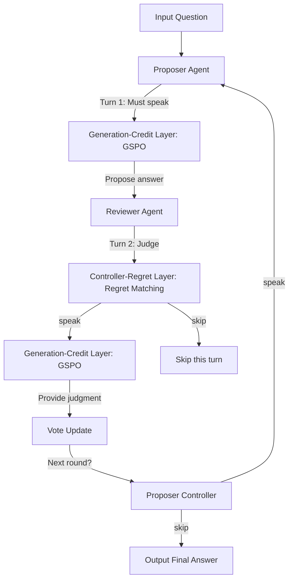
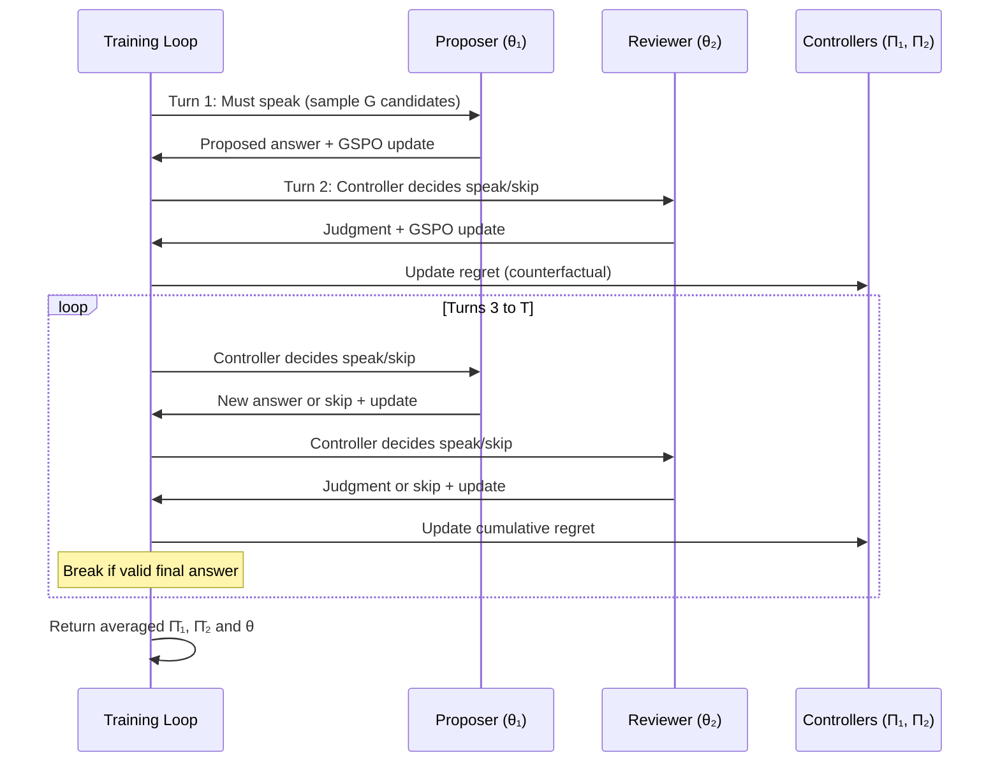

# TRACER: Turn-level Regret Matching with Inner Reinforcement Credit for Cooperative Multi-LLM Reasoning


> **论文信息**
> - **标题**：TRACER: Turn-level Regret Matching with Inner Reinforcement Credit for Cooperative Multi-LLM Reasoning
> - **作者**：Chusen Li, Zhou Liu, Shuigeng Zhou, Wentao Zhang
> - **arXiv**：[2605.28699](https://arxiv.org/abs/2605.28699)
> - **官方代码**：无官方实现

---

## 一、研究背景与动机

### 问题陈述

大语言模型（LLM）在推理任务上取得了显著进展，但单个模型在复杂多步推理中仍面临瓶颈。多智能体协作（Multi-Agent Collaboration）——让多个 LLM 以辩论、讨论或审查的方式协同工作——被认为是突破单模型推理极限的有前途方向。然而，将强化学习（RL）直接应用于多智能体 LLM 系统时，会遭遇三大核心困境：

| 困境 | 具体表现 | 后果 |
|------|----------|------|
| 稀疏奖励与搭便车 | 审查者即使做出错误判断也可能获得正奖励（奖励混叠） | 训练信号噪声大，收敛困难 |
| 仅模仿协作 | 智能体仅在推理时通过 prompt 区分角色，未真正学习协作能力 | 协作流于表面，无法自适应 |
| 训练不稳定 | 固定辩论协议（如 MAD）容易陷入局部最优 | 性能波动，跨域泛化差 |

### 现有方法的局限

当前主流多智能体推理方法可分为两类：

1. **固定协议方法**（如 MAD、Multi-Agent Debate）：预定义发言轮次和辩论规则，无法根据具体问题自适应调整。MAD 需要 6 个 agent 参与，每次推理消耗约 5909 tokens，但准确率仅 0.8862（GSM8K）。
2. **朴素 RL 方法**（如 MAGRPO）：将单智能体 RL 直接迁移到多智能体场景，忽视了多智能体特有的信用分配（credit assignment）问题，导致 GSM8K 准确率暴跌至 0.696。

> **类比理解**：想象一个公司里的"提案人"和"审查人"。如果审查人无论给出什么意见都能拿到奖金（搭便车），他们就不会认真审查；如果公司规定每个人必须按固定轮次发言（固定协议），那遇到简单问题时大家也在浪费时间空谈。TRACER 的核心创新在于：让每位参与者学会**什么时候该说**（通过后悔值匹配）以及**该说什么**（通过角色特定奖励优化），从而实现真正高效的协作。

### 为什么需要 TRACER

TRACER 的提出正是为了弥合博弈论、强化学习和多智能体 LLM 推理之间的鸿沟——它将多智能体协作建模为有限行动空间博弈，提供了数学上可证明的收敛保证，同时在推理效率上远超现有辩论方法。

## 二、核心贡献

**1. 双层强化框架架构**
提出 Controller-Regret Layer 和 Generation-Credit Layer 的双层设计，将"何时发言"与"如何发言"解耦，分别优化。

**2. 二元行动空间的后悔值匹配**
将每个智能体的行动空间简化为 `{speak, skip}`，使得有限行动博弈论的理论可以直接应用，并证明了 $O(1/\sqrt{M})$ 的收敛速率到相关均衡（Correlated Equilibrium）。

**3. 角色特定奖励的 GSPO 算法**
为提议者（Proposer）和审查者（Reviewer）设计独立的奖励函数，结合 Group Sequence Policy Optimization（GSPO），解决了奖励混叠和搭便车问题。

**4. 极致的推理效率**
仅需约 3 次模型调用和约 1014 tokens 即可完成一次推理——比 Self-Consistency 少 13 倍 tokens，比 MAD 少 6 倍 tokens，同时保持竞争力准确率。

**5. 理论收敛保证**
将框架映射到完美信息扩展型博弈（Extensive-form Perfect-information Game），证明平均后悔值在 $M \to \infty$ 时趋于零。

## 三、方法详解

### 3.1 整体架构

TRACER 的核心思想是将多智能体协作决策分解为两个独立但交互的层次：



**关键设计理念**：通过将行动空间限定为二元选择（speak/skip），TRACER 将复杂的多智能体协作简化为一个可理论分析的博弈问题，同时保留了足够的灵活性来自适应决定每轮是否参与。

### 3.2 投票与状态机制

TRACER 引入了一个精巧的投票系统来追踪讨论进展：

| 事件 | 投票变化 | 含义 |
|------|----------|------|
| 提议者提出新答案 | vote = 0 | 新提案，待审查 |
| 审查者正面评价 | vote += 1 | 答案得到肯定 |
| 审查者负面评价 | vote -= 1 | 答案被质疑 |
| 跳过或无效发言 | vote 不变 | 无实质贡献 |

系统状态 $s^t$ 由两个离散桶构成：**投票计数桶**（vote-bucket）和**迭代次数桶**（iteration-bucket）。这种离散化使得后悔值匹配可以在有限状态空间上运行。

### 3.3 Generation-Credit Layer：GSPO 优化

GSPO（Group Sequence Policy Optimization）是 TRACER 用于优化发言内容的核心算法，它对 GRPO 进行了关键改进：

**角色特定奖励设计**：

$$r_{\text{proposer}} = \begin{cases} +1 & \text{if answer is correct} \\ -1 & \text{otherwise} \end{cases}$$

$$r_{\text{reviewer}} = \begin{cases} +1 & \text{if judgment is correct} \\ -1 & \text{if judgment is wrong} \\ 0 & \text{if invalid/skip} \end{cases}$$

这种设计确保每个角色只因其**自身职责的完成质量**获得奖励，彻底杜绝了搭便车现象。

**优势函数计算**：

$$A_i^{(j)} = \frac{r_i^{(j)} - \mu_i}{\sigma_i + \epsilon}$$

其中 $\mu_i$ 和 $\sigma_i$ 是同组候选的优势均值和标准差。

**GSPO 损失函数**：

$$\mathcal{L}_{\text{GSPO}}(\theta_i) = -\mathbb{E}\left[\min\left(\rho_{i,j} A_i^{(j)},\ \text{clip}(\rho_{i,j}, 1-\epsilon', 1+\epsilon') A_i^{(j)}\right)\right]$$

其中序列级重要性比率为：

$$\rho_{i,j} = \left(\frac{\pi_{\theta_i}(y_t^{(j)} | C_t)}{\pi_{\theta_{\text{old},i}}(y_t^{(j)} | C_t)}\right)^{1/|y_t^{(j)}|}$$

> **关键创新**：对重要性比率取 $1/|y_t^{(j)}|$ 次方根，而非直接使用乘积。这使得长序列的比率不会指数级爆炸，稳定了训练过程。

### 3.4 Controller-Regret Layer：后悔值匹配

后悔值匹配（Regret Matching）是 TRACER 控制层的核心机制，它决定每个智能体在每一轮是否应该发言。

**瞬时反事实后悔值**：

$$\text{re}_i^m(a, s^m) = v_{i,a} - \sum_{a' \in \{\text{skip}, \text{speak}\}} \Pi_i^m(a' | s^m) \cdot v_{i,a'}$$

这衡量的是"如果在状态 $s^m$ 下选择行动 $a$ 而非按当前策略行动，能获得多少额外价值"。

**累积后悔值更新**：

$$\text{Re}_i^m(a, s) = \text{Re}_i^{m-1}(a, s) + \text{re}_i^m(a, s)$$

**策略更新规则**：

$$\Pi_i^m(a | s^m) = \begin{cases} \frac{\max(\text{Re}_i^m(a, s^m), 0)}{\sum_{a'} \max(\text{Re}_i^m(a', s^m), 0)} & \text{if denominator} > 0 \\ \frac{1}{2} & \text{otherwise} \end{cases}$$

```python
# Simplified Regret Matching Controller
import numpy as np

class RegretMatchingController:
    def __init__(self, actions=("speak", "skip")):
        self.actions = actions
        self.cumulative_regret = {a: 0.0 for a in actions}
    
    def get_policy(self):
        """Compute policy from cumulative regrets."""
        positive_regrets = {a: max(r, 0) for a, r in self.cumulative_regret.items()}
        total = sum(positive_regrets.values())
        if total <= 0:
            return {a: 1.0 / len(self.actions) for a in self.actions}  # uniform
        return {a: r / total for a, r in positive_regrets.items()}
    
    def update(self, action_values, current_policy):
        """Update cumulative regret with counterfactual values."""
        expected_value = sum(current_policy[a] * action_values[a] for a in self.actions)
        for a in self.actions:
            counterfactual_regret = action_values[a] - expected_value
            self.cumulative_regret[a] += counterfactual_regret
```

### 3.5 训练流水线



### 3.6 收敛性理论

TRACER 将整个训练过程映射为**完美信息扩展型博弈**，并证明：

**定理 1**：在 TRACER 框架中，每个智能体 $i$ 的平均后悔值满足：

$$\frac{R_i^M}{M} \to 0 \quad \text{as} \quad M \to \infty$$

收敛速率为 $O(1/\sqrt{M})$，这意味着策略序列收敛到**相关均衡**（Correlated Equilibrium）。

> 这一理论保证是 TRACER 区别于其他多智能体方法的关键——大多数现有方法（如 MAGRPO、MAD）没有收敛性证明，训练过程可能陷入不稳定状态。

## 四、实验结果

### 4.1 实验设置

| 项目 | 设置 |
|------|------|
| 训练数据 | GSM8K 训练集（约 7473 题目） |
| 骨干模型 | Phi-3 Mini 4K Instruct (3.8B), Qwen2.5-7B-Instruct |
| 训练硬件 | 8×H20 GPU + LoRA |
| 评估集 | GSM8K test, MATH500, GPQA-Diamond |
| 候选采样数 G | 每轮采样多个候选序列 |
| 最大轮次 T | 有限 horizon |

### 4.2 主要结果（Qwen2.5-7B）

| 方法 | GSM8K | MATH500 | GPQA-D | 平均 | 类型 |
|------|-------|---------|--------|------|------|
| CoT | 0.9160 | 0.7550 | 0.3640 | 0.6783 | 非 RL |
| Self-Consistency (10x) | 0.9240 | 0.6760 | 0.2727 | 0.6242 | 非 RL |
| Single-Agent GRPO | 0.8825 | 0.4780 | 0.0341 | 0.4649 | 单智能体 RL |
| Single-Agent GSPO | 0.8741 | 0.4580 | 0.0366 | 0.4563 | 单智能体 RL |
| MAGRPO | 0.6960 | 0.3270 | 0.0189 | 0.3473 | 多智能体 RL |
| **TRACER** | **0.8901** | **0.6120** | **0.3535** | **0.6185** | **多智能体 RL** |

**关键发现**：
- TRACER 在所有 RL 方法中取得**最佳平均准确率**（0.6185），大幅超越 MAGRPO（0.3473，提升 78.2%）
- 在 GPQA-Diamond（跨域）上，TRACER 达到 0.3535，而 MAGRPO 仅 0.0189——**提升了 18.7 倍**
- 与非 RL 方法 CoT 相比，TRACER 平均准确率仅低 8.8%（0.6185 vs 0.6783），但推理效率更高

### 4.3 推理效率分析（GSM8K, Qwen2.5）

| 方法 | 准确率 | Tokens | 模型调用 | Agent 数 |
|------|--------|--------|----------|----------|
| TRACER | 0.8901 | **1,014** | **3.02** | **2** |
| CoT | 0.9160 | 1,355 | 1.00 | 1 |
| Self-Consistency | 0.9240 | 13,551 | 10.00 | 1 |
| MAD | 0.8862 | 5,909 | 6.00 | 3 |
| MAGRPO | 0.6960 | 1,297 | 4.00 | 2 |

TRACER 的效率分析：
- 相比 MAD：token 消耗降低 82.8%（5,909 → 1,014），模型调用减少 49.7%（6.00 → 3.02）
- 相比 Self-Consistency：token 消耗降低 92.5%（13,551 → 1,014），准确率仅低 3.7%
- 相比 CoT：token 消耗降低 25.2%，准确率仅低 2.8%

### 4.4 消融实验（Qwen2.5, GSM8K）

| 移除组件 | 准确率变化 | Token 变化 | 调用次数变化 |
|----------|-----------|-----------|-------------|
| 审查者 | -6.60% | +1,201 | +1.98 |
| 提议者控制器 | -7.51% | +498 | +0.91 |
| 审查者 GSPO | -7.06% | +381 | +0.62 |
| 提议者 GSPO | -6.98% | +376 | +0.56 |
| 投票状态 | -2.73% | +288 | +0.30 |
| 迭代状态 | -4.93% | +371 | +0.53 |

**洞察**：每个组件都对性能有正向贡献。提议者控制器的影响最大（-7.51%），说明**学会何时发言**比**学会说什么**更关键。审查者的移除导致 token 消耗剧增（+1,201），因为没有审查者的质量把关，提议者需要更多轮次才能收敛到正确答案。

## 五、关键发现与洞察

### 5.1 二元行动空间的设计哲学

TRACER 最巧妙的设计是将行动空间限制为 `{speak, skip}` 两个选项。这看似简单的决策实际上有深远影响：

1. **理论可行性**：有限行动空间使得后悔值匹配的理论保证可以直接应用，$O(1/\sqrt{M})$ 的收敛速率确保训练稳定
2. **推理效率**：每轮只需做一次二元决策，计算开销极小
3. **自适应协作**：模型学会了在**有把握时发言、无把握时沉默**，避免了无效循环

> **类比**：就像人类团队讨论中的优秀参与者——不是每个人每轮都必须发言，而是在自己有独到见解时才开口。TRACER 通过后悔值匹配让 LLM 学会了这种"知进退"的协作智慧。

### 5.2 信用分配的多层解耦

传统多智能体 RL 的核心难题是**信用分配**（Credit Assignment）——如何将团队奖励合理分配给各智能体的各轮贡献。TRACER 通过双层解耦优雅地解决了这个问题：

- **宏观层面**（Controller-Regret Layer）：通过后悔值匹配评估每个行动模式（speak/skip）在特定状态下的长期价值
- **微观层面**（Generation-Credit Layer）：通过 GSPO 和角色特定奖励评估具体发言内容的质量

这种"分层信用分配"的设计值得在其他多智能体场景中推广。

### 5.3 跨域泛化的启示

TRACER 仅在 GSM8K（初等数学）上训练，但在 MATH500（竞赛数学）和 GPQA-Diamond（研究生级别推理）上也展现出竞争力。这表明：

- 学会**何时协作**比学会**解决特定问题**更具泛化性
- 控制策略（后悔值匹配）捕获的是**元认知能力**（metacognition），而非领域知识
- GPQA-Diamond 上 0.3535 的准确率（远超 MAGRPO 的 0.0189）说明自适应协作在跨域任务中尤为重要

### 5.4 实践建议

对于希望应用 TRACER 的从业者：

1. **推荐使用 Qwen2.5-7B 级别的模型作为骨干**：实验表明该级别模型已经可以从 TRACER 框架中获益
2. **使用 LoRA 进行训练**：8×H20 GPU 即可完成训练，无需全参数微调
3. **注意训练数据的覆盖度**：TRACER 目前仅在 GSM8K 上训练，更广泛的训练数据可能进一步提升性能
4. **考虑扩展角色数量**：当前的 Proposer-Reviewer 二元结构可以扩展为更多角色（如验证者、优化者）

## 六、个人评述

### 优势

1. **理论扎实**：$O(1/\sqrt{M})$ 的收敛保证和博弈论基础，这在多智能体 LLM 文献中较为罕见
2. **效率极高**：~3 次调用、~1000 tokens 的推理成本远低于所有竞争方法
3. **设计优雅**：双层架构将"何时"和"如何"干净地分离，各层有独立的优化目标
4. **工程可行**：使用 LoRA + 中等规模模型即可训练，实验设置对业界友好
5. **消融完整**：6 项消融实验清晰展示了每个组件的贡献

### 局限性

1. **训练数据单一**：仅在 GSM8K 训练集上训练，泛化能力的天花板可能受限于训练数据覆盖的推理模式
2. **二元角色限制**：当前仅支持 Proposer-Reviewer 两个角色，未探索更复杂的多角色协作（如三人辩论、层级审查等）
3. **Horizon 敏感性**：最大轮次 $T$ 作为超参数需要手动设定，未讨论自适应 horizon 策略
4. **与非 RL 方法的差距**：在 GSM8K 上仍低于 CoT 2.6 个百分点（0.8901 vs 0.9160），说明 RL 训练在域内性能上还有提升空间
5. **评估规模有限**：仅使用 3 个评估基准，未覆盖代码推理、逻辑推理等更多样化的任务
6. **缺乏与最新多智能体方法的对比**：如 COMMAND（ICLR 2026）、ECON（ICML 2025）等博弈论方法未被纳入对比

### 总体评价

TRACER 是多智能体 LLM 推理领域一项**高质量且实用**的工作。它成功将博弈论中的后悔值匹配引入 LLM 训练框架，解决了长期困扰该领域的信用分配和训练稳定性问题。双层架构设计既有理论深度，又有工程可行性。$O(1/\sqrt{M})$ 的收敛保证和极致的推理效率是两个最突出的亮点。

**评分：★★★★☆（4/5）**——在理论贡献和工程实践之间取得了优秀平衡，但训练数据多样性和评估覆盖度仍有提升空间。这项工作为未来"可学习的多智能体协作"研究奠定了重要基础。

## 七、参考文献

1. Li, C. et al. "TRACER: Turn-level Regret Matching with Inner Reinforcement Credit for Cooperative Multi-LLM Reasoning." arXiv:2605.28699, 2026.
2. Zhu, T. et al. "COMMAND: Competitive Multi-Agent Delegation for LLM Reasoning." ICLR 2026.
3. "From Debate to Equilibrium: Belief-Driven Multi-Agent LLM Reasoning via Bayesian Nash Equilibrium." ICML 2025.
4. "Multi-Agent Debate for LLM Judges with Adaptive Stability Detection." NeurIPS 2025.
5. "RAGEN: Training Agents by Reinforcing Reasoning." 2025.
6. Hart, S. & Mas-Colell, A. "A Simple Adaptive Procedure Leading to Correlated Equilibrium." Econometrica, 2000.
7. Schulman, J. et al. "Proximal Policy Optimization Algorithms." arXiv:1707.06347, 2017.
8. Shao, Z. et al. "DeepSeekMath: Pushing the Limits of Mathematical Reasoning in Open Language Models." arXiv:2402.03300, 2024.

