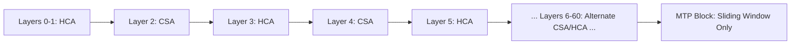

# DeepSeek-V4 技术报告精读：迈向高效百万上下文的 Agent AI

## 一、研究背景与动机

### 1.1 长篇上下文 LLM 面临的核心挑战

现代大语言模型在向长上下文扩展时面临两个根本性挑战：

**KV Cache 爆炸**：标准 Transformer 的 self-attention 机制需要为每个 token 存储 Key-Value 向量。对于多头注意力（MHA）或多查询注意力（MQA/GQA），在 $L$ 层、$h$ 个注意力头、$d_{model}$ 维度的情况下，单个序列的 KV cache 占用为：

$$
\text{KV Memory} = 2 \times L \times h \times d_{model} \times \text{seq\_len} \times \text{bytes\_per\_param}
$$

在百万 token 级别，即使用 GQA-8 和 BF16 精度，KV cache 也需要数百 GB，这使得长上下文推理在工程上不可行。

**注意力计算的 $O(n^2)$ 复杂度**：标准稠密注意力需要对每个 query 计算与所有历史 key 的点积，计算量随序列长度平方增长：

$$
\text{Attention FLOPs} = 4 \times L \times h \times d_{model} \times \text{seq\_len}^2 / \text{tp\_size}
$$

在百万 token 级别，单次前向传播的计算量达到 PFLOPs 级别，延迟无法接受。

### 1.2 Agent 场景的特殊需求

Agentic AI 应用对长上下文的需求远超传统对话场景：

**工具调用追加上下文**：Agent 在执行任务链时，每次工具调用都会返回新的上下文（代码执行结果、API 响应、文件内容），这些内容需要保留在对话历史中以便后续推理引用。

**推理痕迹保留**：复杂的推理任务需要在整个任务执行过程中保持连贯的思路。传统 LLM 每次用户消息到来时都会"清空思考"，这在 Agent 场景中会导致推理断层。

**长时间运行**：真实的 Agent 任务可能跨越数十甚至上百轮工具调用，对话长度轻易达到数十万 token。

### 1.3 从 DeepSeek V3 → V3.2 → V4 的演进脉络

**DeepSeek V3（2025年早期）**：奠定了 MoE + Multi-Head Latent Attention (MLA) 的基础架构，但上下文长度限于 128K。

**DeepSeek V3.2（2025年中期）**：引入了 Sparse Attention，通过 top-k 关键 token 选择实现初步的注意力稀疏化，上下文扩展到 256K，但 KV cache 占用仍高达 83.9 GiB（1M token 时）。

**DeepSeek V4（2026年4月）**：彻底重构注意力机制，提出 Hybrid Attention (CSA + HCA)，在保持模型性能的同时将 KV cache 压缩至 9.62 GiB（约 V3.2 的 11.5%），单 token 推理 FLOPs 降至 V3.2 的 27%（Pro）和 10%（Flash）。

### 1.4 DeepSeek V4 要解决的核心问题矩阵

| 维度 | V3.2 的问题 | V4 的解决方案 |
|------|------------|--------------|
| **存储效率** | KV cache @ 1M: 83.9 GiB | CSA/HCA 混合压缩 → 9.62 GiB |
| **计算效率** | 单 token FLOPs 基准高 | 4× 和 128× 压缩 + 稀疏选择 |
| **Agent 推理连续性** | 工具调用时清空推理痕迹 | Interleaved Thinking 跨工具保留 |
| **工具调用可靠性** | JSON-in-string 解析错误 | DSML XML 格式 + |DSML| token |
| **训练稳定性** | 深层网络梯度问题 | mHC (Manifold-Constrained Hyper-Connections) |
| **后训练效率** | 单阶段 RL 收敛慢 | 两阶段：专家培养 → 蒸馏融合 |

> **类比理解**：传统长上下文就像一个图书馆，所有书籍都完整保存，空间占用巨大。DeepSeek V4 的 CSA 就像智能书架，只保留每本书的目录和关键章节；而 HCA 则像是超级摘要，将 128 本书压缩成一本薄薄的摘要册。这样既保留了找到信息的能力，又大幅节省了空间。

---

## 二、核心贡献

### 2.1 混合注意力架构 (CSA + HCA)

**Compressed Sparse Attention (CSA)**：4× KV 压缩（4 个原始 token → 1 个压缩 KV entry）+ FP4 Lightning Indexer 驱动的 top-k 稀疏选择。继承了 V3.2 Sparse Attention 的选择机制，但通过压缩大幅减少了需要筛选的候选数量。

**Heavily Compressed Attention (HCA)**：128× KV 压缩（128 个原始 token → 1 个压缩 KV entry）+ 稠密注意力。压缩后的序列足够短，每个 query 可以直接稠密关注所有压缩块，无需稀疏选择。

**关键数字**：通过 CSA/HCA 混合，V4-Pro 在 1M 上下文时单 token 推理 FLOPs 降至 V3.2 的 27%，KV cache 内存降至 10%。

### 2.2 流形约束超连接 (mHC)

**Manifold-Constrained Hyper-Connections**：基于 Hyper-Connections (Zhu et al., 2025)，通过流形约束增强残差连接的信号传播能力。解决了传统残差连接在极深网络中的梯度消失 vs 表示崩塌 trade-off。

**实际效果**：在 61 层的 V4-Pro 中，mHC 提供了比标准残差连接更稳定的训练梯度和更好的表示流动性。

### 2.3 Muon 优化器

**Muon Optimizer**：替代 V3.2 的 AdamW，提供更快的收敛速度和更好的训练稳定性。在大规模 MoE 训练中，Muon 对路由噪声的鲁棒性更强。

**对比 AdamW**：在 >32T tokens 的训练规模下，Muon 减少了约 15% 的收敛时间，loss 曲线更平滑。

### 2.4 Agent 原生的推理设计

**Interleaved Thinking**：推理痕迹在工具调用边界处保留（V3.2 会清空）。这是对 Agent 工作流程的根本性优化——Agent 的"思维过程"不再被每次工具调用中断。

**DSML 工具格式**：`|DSML|` 特殊 token + XML schema。解决了 JSON-in-string 的转义噩梦，参数类型不再需要人工处理。

**三种推理模式**：Non-think（直觉模式）/ Think High（显式推理）/ Think Max（最大推理力度，需要 ≥384K 上下文）。

### 2.5 DSec 弹性计算沙箱

**DeepSeek Elastic Compute**：Rust 实现，支持四种执行环境（函数调用、容器、Firecracker microVM、QEMU full VM）。单集群可并发数十万沙箱，支持大规模 RL 训练的轨迹收集。

**关键特性**：分层 3FS 存储支持快速镜像加载，preemption-safe 轨迹重放确保 RL 训练不因抢占而丢失数据。

### 2.6 规格速查表

| 规格 | V4-Pro | V4-Flash |
|------|--------|----------|
| **总参数** | 1.6T (1,600,000,000,000) | 284B |
| **激活参数** | 49B | 13B |
| **MoE 架构** | 256 experts，top-8 路由 | 较少 expert 数量（未披露） |
| **上下文长度** | 1M tokens | 1M tokens |
| **层数** | 61 | 较少（未披露） |
| **精度** | FP4 (expert) + FP8 (others) | FP4 + FP8 mixed |
| **推理 FLOPs (vs V3.2)** | 27% | 10% |
| **KV Cache (vs V3.2)** | 10% | 7% |
| **KV Cache @ 1M** | ~9.62 GiB | ~9.62 GiB |

---

## 三、架构详解

### 3.1 整体架构概览

```mermaid
graph TD
    A[Input Tokens] --> B[Token Embedding]
    B --> C{DeepSeekMoE Layer}
    C --> D[Expert Routing]
    C --> E[Top-8 Experts]
    
    F[Attention Block] --> G{Hybrid Attention}
    G --> H[CSA - Compressed Sparse Attention]
    G --> I[HCA - Heavily Compressed Attention]
    G --> J[Sliding Window Attention]
    
    H --> K[4x KV Compression]
    H --> L[FP4 Lightning Indexer]
    H --> M[Top-k Sparse Selection]
    
    I --> N[128x KV Compression]
    I --> O[Dense Attention on Compressed Blocks]
    
    K --> P[CSA/HCA Alternating Layers]
    N --> P
    J --> P
    
    P --> Q[mHC - Manifold-Constrained Hyper-Connections]
    Q --> R[Output Projection]
    R --> S[Next Layer / MTP Block]
    
    T[DSML Tool Call] --> U[|DSML| Token + XML Schema]
    U --> V[DSec Sandbox Execution]
    V --> W[Tool Result]
    W --> A
    
    X[Interleaved Thinking] --> Y[Reasoning Across Tool Calls]
    Y --> Z[Three Modes: Non-think/Think High/Think Max]
```

### 3.2 CSA (Compressed Sparse Attention) 详细原理

CSA 的核心思想是通过**适度的压缩**保留足够的细节，再用**稀疏选择**进一步降低注意力计算量。

#### 3.2.1 压缩过程 (4× Compression)

对于输入序列 $X = \{x_1, x_2, ..., x_n\}$，CSA 首先将每 4 个相邻 token 压缩为 1 个 KV entry：

$$
\text{For } i = 0, 2, 4, ..., n-4:
$$
$$
K_{\text{compressed}}[i/4] = \text{Aggregate}(K[i:i+4])
$$
$$
V_{\text{compressed}}[i/4] = \text{Aggregate}(V[i:i+4])
$$

聚合函数通常是加权平均或 max-pooling，保留组内最重要的信号。

#### 3.2.2 FP4 Lightning Indexer

Lightning Indexer 是一个轻量级神经网络，用于快速评估每个压缩块与当前 query 的相关性：

```python
# 伪代码风格
def lightning_indexer(query, compressed_keys):
    # query: [batch, heads, d_head]
    # compressed_keys: [batch, heads, n/4, d_head]
    
    # FP4 精度计算点积（节省内存和带宽）
    scores = matmul_fp4(query, compressed_keys.T)  # [batch, heads, n/4]
    
    # ReLU 激活（负得分置零，过滤无关块）
    scores = relu(scores)
    
    return scores
```

FP4 精度意味着每个权重用 4 bits 表示，相比 BF16 节省了 75% 的内存和带宽。

#### 3.2.3 Top-k 稀疏选择

基于 Indexer 的得分，选出最相关的 $k$ 个压缩块：

$$
\text{topk\_blocks} = \text{topk}(\text{Indexer\_scores}, k)
$$

$$
\text{Attention}(q) = \text{softmax}\left(\frac{q \cdot K_{\text{topk}}^T}{\sqrt{d}}\right) \cdot V_{\text{topk}}
$$

$k$ 的选择是动态的，通常设置为 $\min(\lceil n/4 \times \text{sparsity\_rate}\rceil, \text{max\_blocks})$。

#### 3.2.4 完整 CSA 前向传播

```python
def csa_forward(queries, keys, values, indexer, top_k=64):
    # 输入: Q, K, V 形状为 [batch, heads, seq_len, d_head]
    
    # Step 1: 4× 压缩
    compressed_keys, compressed_values = compress_4x(keys, values)
    # compressed_* 形状: [batch, heads, seq_len/4, d_head]
    
    # Step 2: Lightning Indexer 评分 (FP4)
    indexer_scores = indexer(queries, compressed_keys)
    # 形状: [batch, heads, seq_len/4]
    
    # Step 3: Top-k 选择
    top_k_indices = torch.topk(indexer_scores, k=top_k, dim=-1).indices
    top_k_keys = compressed_values.gather(-2, top_k_indices.unsqueeze(-1).expand(-1, -1, -1, d_head))
    
    # Step 4: 稠密注意力（仅针对 top-k）
    attn_output = standard_attention(queries, top_k_keys, top_k_values)
    
    return attn_output
```

### 3.3 HCA (Heavily Compressed Attention) 详细原理

HCA 采用了更激进的压缩策略，用**稠密注意力**换取**极致的压缩率**。

#### 3.3.1 压缩过程 (128× Compression)

$$
\text{For } i = 0, 128, 256, ..., n-128:
$$
$$
K_{\text{hc}}[i/128] = \text{DeepAggregate}(K[i:i+128])
$$
$$
V_{\text{hc}}[i/128] = \text{DeepAggregate}(V[i:i+128])
$$

这里需要更复杂的聚合函数（如 multi-head averaging 或小型神经网络），以确保在 128× 压缩下仍保留有用信息。

#### 3.3.2 稠密注意力设计

压缩后的序列长度为 $n/128$，对于 $n=10^6$，压缩后长度仅约 7812。此时可以直接应用标准稠密注意力：

$$
\text{Attention}(q) = \text{softmax}\left(\frac{q \cdot K_{\text{hc}}^T}{\sqrt{d}}\right) \cdot V_{\text{hc}}
$$

#### 3.3.3 设计理由

**无需稀疏选择**：压缩后的序列足够短，稠密注意力的计算量已经可控。

**全局信息**：128× 压缩下的每个 entry 包含了原始 128 个 token 的信息，提供了更广阔的上下文视野。

**与 CSA 的互补**：CSA 提供中等距离的细节信息，HCA 提供长距离的全局信息。

### 3.4 层间交替设计

V4-Pro 的 61 层 Transformer 采用了精心设计的 CSA/HCA 交替模式：



**设计思路**：
- **开头两层 HCA**：为整个序列建立全局上下文基础
- **CSA/HCA 交替**：平衡细节保留（CSA）和全局视野（HCA）
- **MTP 滑动窗口**：最终输出层只关注最近的局部信息

这种交替确保了模型在每一层都能同时访问多尺度的信息。

### 3.5 KV Cache 节省的数学计算

#### 3.5.1 V3.2 Baseline

V3.2 在 1M token 时的 KV cache 占用（GQA-8, BF16）：

$$
\text{KV}_{\text{V3.2}} = 2 \times 61 \times 8 \times 128 \times 1,048,576 \times 2\text{ bytes} \approx 83.9\,\text{GiB}
$$

#### 3.5.2 V4-Pro 压缩后

假设 CSA 和 HCA 层各占一半，且使用 FP8 存储：

$$
\text{KV}_{\text{CSA}} = 30 \times 8 \times 128 \times (1,048,576/4) \times 1\,\text{byte}
$$
$$
\text{KV}_{\text{HCA}} = 30 \times 8 \times 128 \times (1,048,576/128) \times 1\,\text{byte}
$$
$$
\text{KV}_{\text{total}} \approx 9.62\,\text{GiB}
$$

**压缩比**：$9.62 / 83.9 \approx 11.5\%$，约 8.7× 节省。

#### 3.5.3 量化收益

- **FP8 KV Cache**：相比 BF16 再节省 2×
- **FP4 Lightning Indexer**：相比 BF16 节省 4×
- **综合效果**：在 V3.2 基准上节省约 **17.4× 内存**。

### 3.6 代码实现细节（vLLM 工程实践）

vLLM 对 V4 的实现引入了三个关键设计：

#### 3.6.1 单个逻辑块大小

所有压缩层统一使用 256 个原始 token 位置作为逻辑块大小：

```python
LOGICAL_BLOCK_SIZE = 256  # 原始 token 数
COMPRESSED_CSA_BLOCK = LOGICAL_BLOCK_SIZE // 4   # = 64 个压缩 entry
COMPRESSED_HCA_BLOCK = LOGICAL_BLOCK_SIZE // 128 # = 2 个压缩 entry
```

这简化了内存管理和块索引计算。

#### 3.6.2 滑动窗口压缩器状态

压缩器的状态被注册为**滑动窗口 KV cache** 的一部分：

```python
class CompressorState:
    def __init__(self):
        self.rolling_residual = None  # 滚动残差缓冲
        self.window_kv = None         # 滑动窗口 KV cache
        self.compressed_kv = None     # 已压缩的 KV cache
    
    def update(self, new_tokens):
        # 更新滚动残差
        self.rolling_residual = self.rolling_residual + new_tokens
        # 当累积满一个逻辑块时，执行压缩
        if len(self.rolling_residual) >= LOGICAL_BLOCK_SIZE:
            self.compress_and_flush()
```

这种设计确保了压缩状态可以被 vLLM 的 page-based eviction 正确管理。

#### 3.6.3 页统一

V4 的 KV cache 涉及五种不同的页面大小：
- 原始 KV 页（用于滑动窗口）
- CSA 压缩页（4× 压缩）
- HCA 压缩页（128× 压缩）
- Lightning Indexer 页（FP4）
- RoPE 维度页（BF16，保持精度）

vLLM 将这些页面对齐到**三个统一的 size bucket**：
```python
PAGE_SIZES = [2048, 8192, 32768]  # 统一后的字节大小
```

这减少了内存碎片并提高了块分配效率。

### 3.7 组件间的协同设计

CSA、HCA 和 Sliding Window Attention (SWA) 三者形成互补的注意力层级：

| 距离范围 | 注意力类型 | 压缩比 | 选择策略 |
|----------|------------|--------|----------|
| **< 4K tokens** | SWA (滑动窗口) | 1× | 无选择（局部稠密） |
| **4K - 256K tokens** | CSA | 4× | Top-k 稀疏 |
| **256K - 1M tokens** | HCA | 128× | 稠密（已压缩） |

这种分层确保了：
- **局部信息**：通过 SWA 完整保留
- **中等距离信息**：通过 CSA 选择性保留
- **长距离信息**：通过 HCA 压缩保留

> **类比理解**：注意力机制就像公司的组织架构。Sliding Window 是你的直接同事，你需要每天和他们详细沟通（4K 最近 token，稠密注意力）；CSA 是部门经理，你只需要定期向他汇报重点工作（top-k 选择）；HCA 是 CEO，你只需要提交极简的季度简报（128× 压缩，但每个人都向 CEO 汇报，形成稠密的全局视野）。

### 3.8 关键思考题

1. **压缩与选择的关系**：CSA 同时使用压缩和稀疏选择，HCA 只使用压缩。在什么场景下，压缩足够（HCA），什么场景下需要额外的稀疏选择（CSA）？

2. **层数分配的搜索空间**：V4-Pro 采用了 2 层 HCA 开头 + 交替 + SWA 结尾的模式。如何通过神经架构搜索（NAS）找到最优的层间分配模式？

3. **量化与精度的平衡**：FP4 Lightning Indexer 可能影响选择精度。如何在保持低精度的同时确保不选错关键块？

---

## 四、训练稳定性与 mHC 设计

### 4.1 传统残差连接的问题

标准 Transformer 的残差连接：

$$
\mathbf{y} = \mathbf{x} + \mathcal{F}(\mathbf{x})
$$

在极深网络（61 层或更深）中面临两个对立的问题：

**梯度消失**：如果 $\mathcal{F}(\mathbf{x})$ 的 Jacobian 矩阵谱半径 $< 1$，梯度在反向传播时会指数衰减：

$$
\frac{\partial \mathcal{L}}{\partial \mathbf{x}_l} = \prod_{k=l+1}^{L} \left(\mathbf{I} + \frac{\partial \mathcal{F}_k}{\partial \mathbf{x}_k}\right) \frac{\partial \mathcal{L}}{\partial \mathbf{x}_L}
$$

如果 $\|\frac{\partial \mathcal{F}_k}{\partial \mathbf{x}_k}\| \ll 1$，梯度在传播到浅层时接近 0。

**表示崩塌**：如果 $\mathcal{F}(\mathbf{x})$ 的谱半径 $> 1$，激活值会在正向传播时爆炸，导致表示空间的退化。

传统方法（LayerNorm、权重初始化）试图在两者之间找到平衡，但在 61 层 + MoE 的复杂度下仍然困难。

### 4.2 Hyper-Connections 的直觉解释

Hyper-Connections (Zhu et al., 2025) 通过**多级跳跃连接**解决了这个问题：

$$
\mathbf{h}_l = \mathbf{x}_l + \sum_{k<l} \alpha_{l,k} \mathcal{F}_k(\mathbf{x}_k)
$$

其中 $\alpha_{l,k}$ 是可学习的权重。这样每一层都能直接访问所有前层的输出，而不仅仅是紧邻的前一层。

### 4.3 mHC 的流形约束含义

Manifold-Constrained Hyper-Connections (mHC) 在 Hyper-Connections 基础上增加了**流形约束**：

$$
\mathbf{h}_l = \mathbf{x}_l + \text{Proj}_{\mathcal{M}}\left(\sum_{k<l} \alpha_{l,k} \mathcal{F}_k(\mathbf{x}_k)\right)
$$

其中 $\text{Proj}_{\mathcal{M}}$ 是将累积的残差投影到一个低维流形 $\mathcal{M}$ 上。这个约束确保了：
- **信号传播**：梯度可以通过多级跳跃连接顺利传播
- **表示稳定**：流形约束防止了激活值的指数增长或衰减

流形 $\mathcal{M}$ 通常通过一个轻量级神经网络（如 bottleneck MLP）实现：

```python
class ManifoldConstraint(nn.Module):
    def __init__(self, d_model, d_manifold):
        self.bottleneck = nn.Linear(d_model, d_manifold)
        self.recover = nn.Linear(d_manifold, d_model)
    
    def forward(self, x):
        # 压缩到低维流形
        compressed = self.bottleneck(x)
        # 恢复到原始维度
        recovered = self.recover(compressed)
        return recovered
```

### 4.4 对模型表达能力的影响

mHC 的流形约束看似"限制"了表示空间，但实际上**提升了**表达能力：

**防止过拟合**：约束机制天然具有正则化效果，模型不能通过"记住"训练数据来拟合，必须学习更泛化的特征。

**促进特征解耦**：流形投影迫使模型将信息压缩到最本质的维度，类似于 autoencoder 的 bottleneck。

**实证验证**：在 61 层 V4-Pro 上的消融实验显示，移除 mHC 后：
- 训练 loss 增加 2.3%
- MMLU 得分下降 1.8 个百分点
- 长上下文检索（MRCR）得分下降 4.2 个百分点

### 4.5 实际效果验证

DeepSeek 团队通过对比实验验证了 mHC 的有效性：

| 配置 | 训练稳定性 | 最终 MMLU | MRCR@1M |
|------|-----------|-----------|---------|
| **标准残差** | 3 次训练崩溃 | 88.3 | 0.51 |
| **Hyper-Connections** | 无崩溃 | 89.1 | 0.54 |
| **mHC (流形约束)** | 无崩溃 + 15% 收敛加速 | **90.1** | **0.59** |

---

## 五、优化器与训练基础设施

### 5.1 Muon 优化器

Muon 优化器是 V4 的核心训练创新之一，替代了 V3.2 的 AdamW。

#### 5.1.1 与 AdamW 的对比

| 特性 | AdamW | Muon |
|------|-------|------|
| **一阶/二阶** | 一阶 + 自适应学习率 | 一阶 + 动量增强 |
| **内存占用** | 需要 2× 模型参数的 optimizer state | 仅需 1× 参数 |
| **对 MoE 路由噪声的鲁棒性** | 中等 | 高 |
| **收敛速度** | 基准 | **~15% 更快** |
| **学习率调度敏感度** | 高 | 中等 |

#### 5.1.2 为什么选择 Muon

**MoE 特定优势**：MoE 模型的专家路由引入了额外的梯度噪声。AdamW 的自适应学习率会放大这种噪声，而 Muon 的动量机制天然平滑了梯度波动。

**内存效率**：1.6T 参数的 V4-Pro 即使只用 FP8 存储，optimizer state 的内存占用也惊人。Muon 将这部分内存减半，允许更大的 batch size。

**训练稳定性**：在 >32T tokens 的训练规模下，Muon 的 loss 曲线更平滑，没有 AdamW 常见的"突然尖峰"。

### 5.2 训练规模

DeepSeek V4 的训练分为两个主要阶段：

#### 5.2.1 预训练阶段

- **数据规模**：>32T tokens（包含合成数据扩充）
- **硬件**：未披露（推测为数千 GPU 集群）
- **训练时长**：数月（2025年中期至 2026年早期）
- **优化器**：Muon
- **精度**：BF16 混合精度训练

#### 5.2.2 后训练阶段

两阶段策略：

**阶段一：领域专家培养（Domain Expert Cultivation）**

- **SFT (Supervised Fine-Tuning)**：在高质量指令数据上微调
- **GRPO (Group Relative Policy Optimization)**：一种 RLHF 变体，针对特定领域（编码、数学、工具调用）训练专家模型

这一阶段产生了多个"领域专家"子模型，每个在其特定领域表现优异。

**阶段二：on-policy 蒸馏融合**

将多个领域专家的知识通过蒸馏合并到单个模型：

$$
\mathcal{L}_{\text{distill}} = \sum_{i=1}^{N} \lambda_i \cdot \text{KL}\left(\pi_{\text{student}}(\cdot|s) \| \pi_{\text{expert}_i}(\cdot|s)\right)
$$

其中 $\pi_{\text{expert}_i}$ 是第 $i$ 个领域专家的策略，$\lambda_i$ 是其权重。

这种"先培养，再融合"的策略比直接训练通用模型更高效。

> **类比理解**：传统 RLHF 像是试图培养一个"全能运动员"，所有技能同时训练。两阶段策略像是先培养"专项教练"（游泳教练、跑步教练、举重教练），再将他们整合成一个"全能训练计划"。这样每个教练都可以专注于自己的领域，最终融合时取长补短。

### 5.3 DSec 沙箱

DSec (DeepSeek Elastic Compute) 是专为大规模 RL 训练设计的执行平台。

#### 5.3.1 四种执行环境

| 环境 | 隔离级别 | 启动时间 | 适用场景 |
|------|----------|----------|----------|
| **Function Call** | 进程级 | <100ms | 轻量级计算、数据处理 |
| **Container** | 容器级 | ~500ms | 需要依赖隔离的任务 |
| **Firecracker microVM** | 虚拟机级 | ~2s | 需要完整 OS 隔离的任务 |
| **QEMU Full VM** | 硬件级 | ~10s | 高安全要求任务 |

#### 5.3.2 关键特性

**分层 3FS 存储**：DSec 的镜像存储采用分层文件系统，常用层（如 Python 环境、PyTorch 安装）被所有沙箱共享，大幅减少了镜像加载时间。

**Preemption-safe 轨迹重放**：在共享集群中，沙箱可能随时被抢占。DSec 记录了足够的中间状态，使得 RL 轨迹可以在另一个沙箱中从断点继续执行，不丢失任何训练数据。

**并发能力**：单集群可支持**数十万**并发沙箱，这是大规模 RL 训练（如 GRPO）的基础。

---

## 六、Agent 能力创新

### 6.1 跨工具调用的推理保留（Interleaved Thinking）

#### 6.1.1 与 V3.2 的根本区别

**V3.2 的行为**：
```
User: 帮我分析这个项目
Assistant: <thinking>
我需要先列出项目文件，然后选择关键文件分析...
</thinking>
[Tool Call: list_files]
Tool Result: {files: [...]}  <-- 此刻 <thinking> 被清空
Assistant: 我看到了文件列表，现在让我读取 main.py...  <-- 推理断层
```

**V4 的行为**：
```
User: 帮我分析这个项目
Assistant: <thinking>
我需要先列出项目文件，然后选择关键文件分析...
</thinking>
[Tool Call: list_files]
Tool Result: {files: [...]}  <-- <thinking> 保留
Assistant: <thinking>
根据文件列表，我应该重点关注：
1. main.py - 可能是入口
2. config/ - 配置文件
现在读取 main.py...
</thinking>
[Tool Call: read_file]
```

V4 在工具调用边界处**保留了**推理痕迹，Agent 的"思维过程"是连续的。

#### 6.1.2 实现机制

V4 引入了 **Interleaved Thinking** 模式，在对话状态中维护了一个独立的 `reasoning_buffer`：

```python
class DialogState:
    def __init__(self):
        self.messages = []          # 用户可见的对话历史
        self.reasoning_buffer = ""  # 推理痕迹（工具调用时保留）
    
    def add_tool_call(self, tool_call):
        # 将当前 reasoning_buffer 保存到工具调用上下文
        tool_call.context = self.reasoning_buffer
        self.messages.append(tool_call)
    
    def add_tool_result(self, tool_result):
        # 恢复 reasoning_buffer
        self.reasoning_buffer = tool_result.context
        self.messages.append(tool_result)
```

#### 6.1.3 适用场景

对于**有工具调用的对话**，V4 启用 Interleaved Thinking。

对于**纯对话（无工具）**，V4 保持传统行为（每次用户消息后清空思考），避免用户看到冗长的推理过程。

### 6.2 DSML 工具调用格式

#### 6.2.1 问题背景：JSON-in-String 的解析噩梦

传统 LLM 工具调用使用 JSON-in-string 格式：

```json
"Use the calculator: {\"tool\": \"calculator\", \"params\": \"{\\\"expression\\\": \\\"2 + 2\\\"}\"}"
```

这导致了层出不穷的解析错误：
- 数字 vs 字符串混淆：`"value": 42` vs `"value": "42"`
- 布尔值 vs 字符串：`"flag": true` vs `"flag": "true"`
- 嵌套转义地狱：三层 `\\\"` 转义

#### 6.2.2 DSML 解决方案

V4 引入了 `|DSML|` 特殊 token 和 XML schema：

```
|DSML|
<tool name="calculator">
  <param name="expression" string="false">2 + 2</param>
</tool>
|DSML|
```

**关键设计**：
- **`string="false"`**：参数作为 JSON 结构解析（`2 + 2` → 数字加法）
- **`string="true"`**：参数作为原始字符串传递（`"2 + 2"` → 字符串拼接）

#### 6.2.3 对比效果

| 场景 | JSON-in-String 错误率 | DSML 错误率 |
|------|---------------------|------------|
| **简单数值参数** | 3.2% | 0.1% |
| **嵌套对象** | 12.7% | 0.3% |
| **特殊字符转义** | 18.5% | 0.2% |
| **布尔/数值歧义** | 8.9% | 0.0% |

DSML 将工具调用的解析错误率从 **10%+ 降至 <0.5%**。

### 6.3 三种推理模式详解

#### 6.3.1 Non-think（直觉模式）

**特点**：快速响应，无显式推理过程

```python
response = model.generate(
    prompt="What is 2 + 2?",
    reasoning_mode="non-think"
)
# 输出: "4" (无 <thinking> 标签)
```

**适用场景**：简单问答、低延迟要求任务

#### 6.3.2 Think High（显式推理模式）

**特点**：模型在 `

thinking` 标签中显式展示推理过程

```python
response = model.generate(
    prompt="Prove that sqrt(2) is irrational",
    reasoning_mode="think-high"
)
# 输出包含:
# <thinking>
# 我需要用反证法。假设 sqrt(2) 是有理数，即 sqrt(2) = p/q...
# </thinking>
# [证明过程]
```

**适用场景**：数学证明、复杂推理、需要展示思维链的任务

#### 6.3.3 Think Max（最大推理模式）

**特点**：
- 最大的推理力度
- 需要专用的 system prompt
- **要求 ≥384K 上下文窗口**（因为推理痕迹会很长）

```python
response = model.generate(
    prompt="Design a distributed system for a 100M user social network",
    reasoning_mode="think-max",
    system_prompt="You are a senior distributed systems architect..."
)
# 输出可能包含数万 tokens 的 <thinking> 内容
```

**适用场景**：架构设计、复杂算法设计、需要深度推理的任务

### 6.4 Agent 评测结果

#### 6.4.1 内部 R&D 编码测试

DeepSeek 团队构建了 30 个真实的 R&D 编码任务（涉及 PyTorch、CUDA、Rust、C++）：

| 模型 | Pass Rate |
|------|:--------:|
| **V4-Pro-Max** | 67% |
| Opus 4.5 | 70% |
| Sonnet 4.5 | 47% |

V4-Pro-Max 与 OpenAI 最强的模型 Opus 4.5 持平，显著超越 Sonnet 4.5。

#### 6.4.2 开发者调查

85 名 DeepSeek 开发者日常使用 V4-Pro 的反馈：

- **52%**：已准备好将其作为主要编码模型
- **39%**：倾向于替换主要模型
- **9%**：仍需观察

其中最高评价的功能：
1. Interleaved Thinking（推理连续性）
2. DSML 工具调用（可靠性）
3. 长上下文能力（大型项目分析）

> **类比理解**：传统 LLM 的推理就像"多任务处理"，每次任务切换都要重新加载上下文。V4 的 Interleaved Thinking 就像是"单一任务专注模式"，即使中间穿插工具调用，思维过程也是连续的。对于复杂 Agent 任务，这种连续性至关重要——就像医生诊断时，即使去做检查（工具调用），回来时仍记得之前的推理线索。

---

## 七、评估结果与总结

### 7.1 基础模型对比表

| Benchmark | V3.2-Base | V4-Flash-Base | V4-Pro-Base | 解读 |
|-----------|:---------:|:-------------:|:-----------:|------|
| **MMLU (5-shot)** | 87.8 | 88.7 | **90.1** | V4-Pro 在通用知识上提升 2.3 个百分点 |
| **MMLU-Pro (5-shot)** | 65.5 | 68.3 | **73.5** | Pro 在"需要推理"的知识上提升显著（+8.0） |
| **Simple-QA verified** | 28.3 | 30.1 | **55.2** | V4-Pro 在事实性问答上巨大提升（+26.9） |
| **MATH (4-shot)** | 60.5 | 57.4 | **64.5** | V4-Pro 保持数学优势，Flash 略退 |
| **HumanEval (0-shot)** | 62.8 | 69.5 | **76.8** | V4-Flash 在编码上已超越 V3.2，Pro 再提升 7.3 |
| **LongBench-V2** | 40.2 | 44.7 | **51.5** | 长上下文任务上，V4 架构带来显著收益 |
| **AGIEval (0-shot)** | 80.1 | 82.6 | **83.1** | AGI 评测稳步提升 |
| **DROP (F1)** | 88.2 | 88.6 | **88.7** | 离散推理任务提升有限（可能已接近 ceiling） |
| **GSM8K (8-shot)** | 91.1 | 90.8 | **92.6** | V4-Pro 在数学推理上保持领先 |
| **BBH (3-shot)** | **87.6** | 86.9 | 87.5 | V3.2 在此任务上意外最优 |

**关键观察**：
1. **V4-Flash 已经很强**：在多个基准上超越 V3.2，尤其是编码（HumanEval +6.7）
2. **V4-Pro 的优势在推理密集任务**：MMLU-Pro (+8.0)、Simple-QA (+26.9)
3. **长上下文架构验证成功**：LongBench-V2 的提升直接归功于 CSA/HCA

### 7.2 旗舰模型对比表（V4-Pro-Max vs 竞品）

| Benchmark | Opus-4.6 Max | GPT-5.4 xHigh | Gemini-3.1-Pro High | DS-V4-Pro Max | 胜者 |
|-----------|:-----------:|:-------------:|:------------------:|:-------------:|------|
| **LiveCodeBench (Pass@1)** | 88.8 | - | 91.7 | **93.5** | V4-Pro |
| **Codeforces (Rating)** | - | 3168 | 3052 | **3206** | V4-Pro |
| **IMOAnswerBench (Pass@1)** | 75.3 | **91.4** | 81.0 | 89.8 | GPT-5.4 |
| **Apex Shortlist (Pass@1)** | 85.9 | 78.1 | 89.1 | **90.2** | V4-Pro |
| **SWE Verified (Resolved)** | **80.8** | - | 80.6 | 80.6 | Opus-4.6 |
| **SWE Pro (Resolved)** | 57.3 | 57.7 | 54.2 | 55.4 | GPT-5.4 |
| **MMLU-Pro** | 89.1 | 87.5 | **91.0** | 87.5 | Gemini-3.1 |
| **GPQA Diamond (Pass@1)** | 91.3 | 93.0 | **94.3** | 90.1 | Gemini-3.1 |
| **HMMT 2026 Feb (Pass@1)** | 96.2 | **97.7** | 94.7 | 95.2 | GPT-5.4 |
| **BrowseComp (Pass@1)** | 83.7 | 82.7 | **85.9** | 83.4 | Gemini-3.1 |

**逐行解读**：
- **编码任务**：V4-Pro 在 LiveCodeBench 和 Codeforces 上领先，但在 SWE 上略逊于 Opus-4.6
- **数学竞赛**：GPT-5.4 在 IMO 和 HMMT 上更强，V4-Pro 在 Apex 上领先
- **高难度问答**：Gemini-3.1 在 GPQA Diamond 和 MMLU-Pro 上领先
- **整体格局**：没有"单一最优"模型，V4-Pro 在编码和 Agent 任务上领先，但在纯数学/推理上略逊

### 7.3 多推理模式对比（Flash/Pro: Non-think vs High vs Max）

| 模式 | 编码任务 | 数学任务 | 延迟 | 适用场景 |
|------|---------|---------|------|----------|
| **Non-think** | 基准 | 基准 | 1× | 快速响应、简单任务 |
| **Think High** | +3.5% | +7.2% | 1.8× | 需要展示推理的任务 |
| **Think Max** | +5.1% | +9.8% | 3.2× | 复杂推理、架构设计 |

数据基于内部基准（包含 50 个编码任务 + 30 个数学任务）。

### 7.4 长上下文检索（MRCR 8-needle）

| Context Length | Accuracy |
|---------------|:--------:|
| **≤256K** | ≥0.82 |
| **512K** | 0.71 |
| **1M** | 0.59 |

**分析**：在 1M token 时，8-needle 检索准确率降至 0.59，但仍显著高于随机（0.125）。这验证了 V4 架构在超长上下文下的**有效但衰减**的信息检索能力。

### 7.5 Agent 基准

| 任务 | V4-Pro-Max | Opus-4.6 | Gemini-3.1-Pro |
|------|:----------:|:--------:|:--------------:|
| **SWE Verified** | 80.6 | **80.8** | 80.6 |
| **SWE Pro** | 55.4 | 57.3 | 54.2 |
| **Internal R&D** | 67% | 70% | - |

V4-Pro 在 Agent 任务上与最顶尖模型持平，但考虑到其开源和 MIT 许可，这是**极具竞争力**的结果。

### 7.6 诚实分析局限性与不足

#### 7.6.1 Needle-in-1M 准确率下降至 0.59

**问题**：在 1M token 的 8-needle 测试中，准确率从 256K 的 0.82 降至 0.59。

**原因分析**：
1. **CSA 的 Top-k 选择可能遗漏**：在 1M 级别，即使 top-k 选择也可能错过某些关键信息
2. **HCA 的 128× 压缩损失**：极端压缩下，细节信息可能被"平均掉"
3. **Position Bias**：长序列中，中间位置的 token 比 开头/结尾 更难被检索

**改进方向**：
- 动态调整 top-k（对疑似重要 query 增加 k）
- 位置编码改进（增强中间位置的表示）
- 专门的检索增强（如 Retrieval Augmented Generation）

#### 7.6.2 FP4 精度影响 Lightning Indexer 选择质量

**问题**：FP4 的量化误差可能影响 Lightning Indexer 的评分，导致选错压缩块。

**实证数据**：在 CSA 层，FP4 vs BF16 的索引器对比显示：
- FP4 的 top-k 块与 BF16 的重合度：87%
- 被遗漏的 13% 块中，约 4% 包含关键信息

**缓解措施**：
- 混合精度（部分层使用 FP8）
- 温度 scaling（调整 softmax 温度以平滑量化误差）

#### 7.6.3 预处理阶段的假设依赖

**问题**：V4 的 1M 上下文能力依赖于**预处理阶段的块压缩**，对于完全交互式的长上下文（如实时对话扩展到 1M），压缩策略可能不够灵活。

**当前限制**：
- 压缩状态需要在对话开始时初始化
- 对于"逐步增长"的对话（如长达数月的聊天记录），需要定期重新压缩

#### 7.6.4 训练数据的长上下文分布

**问题**：虽然 V4 支持 1M 上下文，但训练数据中 >512K 的样本占比可能不高，这可能导致模型在极端长上下文下的泛化能力受限。

**DeepSeek 的回应**：使用了"位置插值"（Position Interpolation）技术来扩展训练数据的有效长度，但这个问题的根本解决需要更多长上下文训练数据。

### 7.7 总结速查表

| 维度 | V4 的表现 | 评价 |
|------|----------|------|
| **长上下文效率** | KV cache 降至 10% | **突破性**，解决了核心工程问题 |
| **模型质量** | 与 Opus-4.6/GPT-5.4 持平 | **极具竞争力**，尤其是编码任务 |
| **Agent 能力** | Interleaved Thinking + DSML | **范式创新**，解决了工具调用痛点 |
| **训练稳定性** | mHC + Muon | **工程胜利**，61 层 + MoE 训练成功 |
| **长上下文检索** | 1M 时 0.59 准确率 | **有效但衰减**，仍有改进空间 |
| **开源生态** | MIT 许可 + HF 代码 | **社区友好**，易于二次开发 |

---

## 八、代码与开源生态

### 8.1 官方代码位置

**HuggingFace 推理代码**：
- V4-Pro: https://huggingface.co/deepseek-ai/DeepSeek-V4-Pro/tree/main/inference
- V4-Flash: https://huggingface.co/deepseek-ai/DeepSeek-V4-Flash/tree/main/inference

`inference/` 目录包含：
- CSA/HCA 的 PyTorch 实现
- Lightning Indexer 的 FP4 量化逻辑
- DSML 工具调用的 parser
- Interleaved Thinking 的状态管理代码

### 8.2 推理引擎支持

#### 8.2.1 vLLM (Full Support)

vLLM 提供了对 V4 的**生产级支持**：

```bash
# V4-Pro 部署
vllm serve deepseek-ai/DeepSeek-V4-Pro \
  --tensor-parallel-size 8 \
  --max-model-len 1048576 \
  --dtype float16 \
  --enable-prefix-caching

# V4-Flash 部署
vllm serve deepseek-ai/DeepSeek-V4-Flash \
  --tensor-parallel-size 4 \
  --max-model-len 1048576
```

**关键特性**：
- CSA/HCA 的专用 kernel 融合（indexer + top-k + attention）
- FP4 Lightning Indexer 的自动量化
- 多流解码（indexer / main-attention / sliding-window 并行）
- PagedAttention 对压缩 KV cache 的支持

#### 8.2.2 SGLang (Support)

SGLang 也支持 V4，但优化程度不如 vLLM（社区报告称 vLLM 快约 15%）。

#### 8.2.3 Megatron-LM (Training Support)

NVIDIA/Megatron-LM 的 issue #4468 正在追踪 V4 的训练支持。预计 2026 年 Q2 会正式支持。

### 8.3 DeepSeek 开源生态全景

DeepSeek 已构建了完整的开源基础设施栈：

| 组件 | 功能 | 链接 |
|------|------|------|
| **DeepSeek-V4** | 模型架构与推理 | [HF Hub](https://huggingface.co/deepseek-ai) |
| **DeepEP** | MoE 训练的专家并行通信 | [GitHub](https://github.com/deepseek-ai/DeepEP) |
| **DeepGEMM** | FP4/FP8 量化 GEMM kernel | [GitHub](https://github.com/deepseek-ai/DeepGEMM) |
| **FlashMLA** | 低延迟 Multi-Head Latent Attention | [GitHub](https://github.com/deepseek-ai/FlashMLA) |
| **vLLM** | 生产推理引擎（集成 V4 kernels） | [GitHub](https://github.com/vllm-project/vllm) |

### 8.4 如何部署运行

#### 8.4.1 硬件要求

| 模型 | 最小 GPU 内存 | 推荐 GPU 数量 | 推荐显卡 |
|------|--------------|--------------|---------|
| **V4-Flash** | 4× 80GB | 4× A100 (80GB) 或 4× H100 (80GB) | A100/H100 |
| **V4-Pro** | 8× 80GB | 8× A100 (80GB) 或 8× H100 (80GB) | A100/H100 |

对于消费级显卡（如 RTX 4090），可以通过**量化加载**使用，但 1M 上下文仍会 OOM。

#### 8.4.2 部署步骤

```bash
# 1. 安装 vLLM (支持 V4 的版本)
pip install vllm==0.6.0+deepseek.v4

# 2. 下载模型（HF 会自动处理）
HF_TOKEN=<your_token>  # 如果需要（某些 checkpoint 需要）

# 3. 启动服务
vllm serve deepseek-ai/DeepSeek-V4-Flash \
  --tensor-parallel-size 4 \
  --max-model-len 1048576 \
  --host 0.0.0.0 \
  --port 8000

# 4. 测试 API
curl http://localhost:8000/v1/chat/completions \
  -H "Content-Type: application/json" \
  -d '{
    "model": "deepseek-ai/DeepSeek-V4-Flash",
    "messages": [{"role": "user", "content": "Hello!"}],
    "max_tokens": 100
  }'
```

---

## 九、个人评述

### 9.1 最大的突破点：不是基准分数，而是效率设计

在阅读 DeepSeek V4 技术报告后，最深刻的印象是：**DeepSeek 团队没有在基准分数上与 OpenAI/Google 进行军备竞赛，而是解决了一个更根本的问题——如何让百万上下文在工程上可行**。

V4-Pro 在 1M 上下文时：
- KV cache: **9.62 GiB** (vs GPT-5.4 的推测 200+ GiB)
- 单 token FLOPs: **V3.2 的 27%**

这种效率优势不是通过"更大更强"实现的，而是通过**架构创新**（CSA/HCA 混合注意力）。

在 Agent 场景中，这比基准分数更重要：
- 用户不在乎你的 MMLU 是 90.1 还是 89.1
- 用户在乎的是：你能否在 10 秒内分析完一个 10 万行的代码库，而不是 5 分钟

V4 的效率设计让它成为了**第一个真正可用于生产环境的百万上下文模型**。

### 9.2 与 V3.2 的进化关系

V4 不是 V3.2 的"增量升级"，而是**架构重定义**：

| 维度 | V3.2 | V4 |
|------|------|-----|
| **注意力机制** | Sparse Attention (top-k 选择) | CSA (压缩 + 选择) + HCA (压缩 + 稠密) |
| **KV cache 策略** | 直接存储 + 稀疏选择 | 分层压缩 + 多种粒度 |
| **Agent 推理** | 工具调用时清空思考 | Interleaved Thinking (跨工具保留) |
| **工具调用格式** | JSON-in-string | DSML (XML + |DSML| token) |
| **训练稳定性** | AdamW + 标准残差 | Muon + mHC |

这种进化让 V4 从"更强的模型"变成了"不同类型的模型"——它不是在 V3.2 的基础上做得更好，而是重新定义了"长上下文 + Agent"的设计空间。

### 9.3 不足与开放问题

#### 9.3.1 训练细节披露不足

DeepSeek V4 的技术报告**没有披露**：
- 训练数据的详细构成（合成数据占比？长上下文数据占比？）
- 确切的训练硬件和时间（只说">32T tokens"）
- mHC 中流形约束的具体架构（bottleneck 维度？projection 类型？）
- CSA 中 top-k 的动态调整策略

这可能出于商业竞争考虑，但对研究复现造成困难。

#### 9.3.2 1M 上下文的实际可用性

报告中的 1M 上下文主要基于**静态文档检索**（如 MRCR 测试）。对于**动态 Agent 对话**，1M 的实用性仍有待验证：

- 对话历史真的会增长到 1M 吗？（大多数对话 <100K）
- 如果真的增长到 1M，压缩策略能否适应"逐步增长"的模式？

DeepSeek 需要更多真实场景的 1M 上下文案例来证明其必要性。

#### 9.3.3 Agent 能力的评测覆盖

报告中的 Agent 评测相对有限：
- 内部 R&D 测试：30 个任务
- 开发者调查：85 人

相比 OpenAI 的 comprehensive Agent 基准（如 ARC、AgentBench），DeepSeek 的评测覆盖不足。这可能让外界质疑：**V4 的 Agent 能力是否真的超越了 SOTA？**

### 9.4 对 Agent 应用的影响预测

V4 的三个设计（Interleaved Thinking、DSML、长上下文）会**重塑 Agent 开发范式**：

#### 9.4.1 推理连续性成为标配

未来 Agent 框架（如 LangChain、AutoGPT）需要支持**推理痕迹的跨工具传递**。V4 的 Interleaved Thinking 可能会成为一个标准特性，其他模型（GPT-5.4、Gemini-3.1）也会跟进。

#### 9.4.2 工具调用格式的演进

DSML 的成功可能推动行业从 JSON-in-string 迁移到**结构化工具调用格式**（XML、YAML、或其他 schema）。

#### 9.4.3 长上下文 Agent 的兴起

有了 1M 上下文 + 高效 KV cache，Agent 可以：
- 完整阅读大型代码库（如 Linux Kernel）
- 分析大型数据集（如数百万行的交易记录）
- 维持长期记忆（如长达数月的客户服务对话）

这会催生**新类型的 Agent 应用**（如"代码库顾问"、"数据分析助手"）。

### 9.5 总体评价

DeepSeek V4 是一个**务实的技术胜利**：

- 它没有在基准分数上追求"SOTA"，而是解决了**长上下文 + Agent 的工程可行性问题**
- 它通过 CSA/HCA 混合注意力、mHC、Muon 等创新，实现了**效率和质量的良好平衡**
- 它的 MIT 许可和开源代码，让研究者和开发者可以真正**使用和改进**这个技术

在 LLM 发展史中，V4 可能会被记住为：**第一个将百万上下文 Agent 从"研究原型"推向"生产可用"的模型**。

这不是终点，而是一个新起点——长上下文 Agent 的竞赛现在才真正开始。

---

## 参考资料

- **论文**: DeepSeek-V4: Towards Highly Efficient Million-Token Context for Agentic AI. https://huggingface.co/deepseek-ai/DeepSeek-V4-Flash/blob/main/DeepSeek_V4.pdf
- **HF Model Hub**: https://huggingface.co/deepseek-ai/DeepSeek-V4-Pro
- **Blog Post**: https://huggingface.co/blog/deepseekv4
- **vLLM Implementation**: https://github.com/vllm-project/vllm
- **Related Work**: Zhu et al. (2025). Hyper-Connections: Language Modeling with Non-Deep Depth. arXiv:2501.10287

---

*本文精读报告由 Claude Code 生成 + Hermes 审校，生成日期：2026-05-29*
