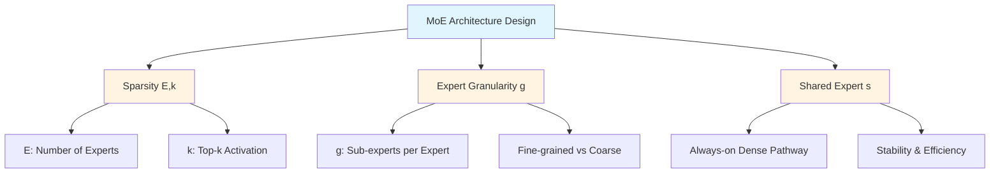
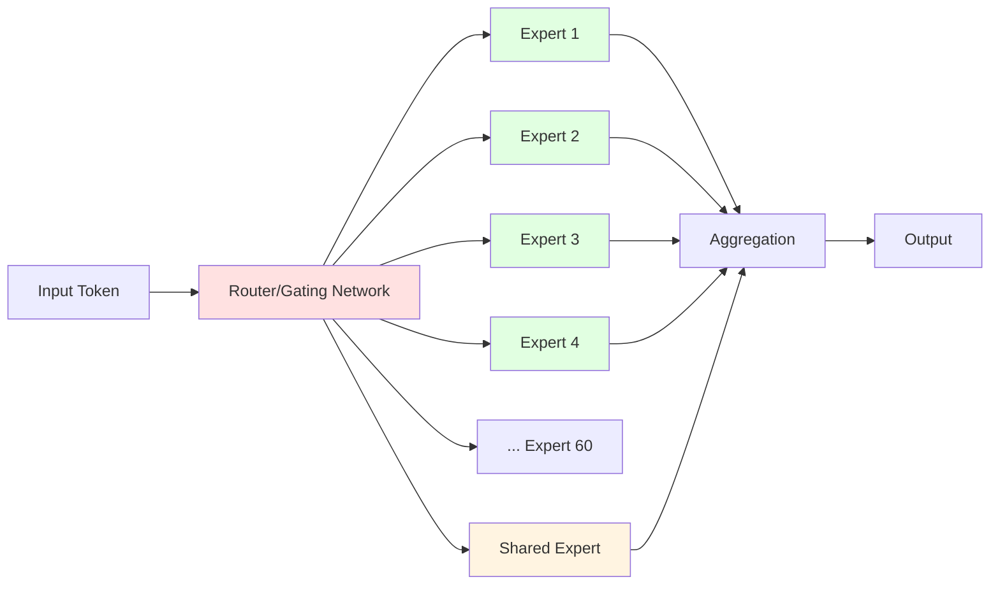
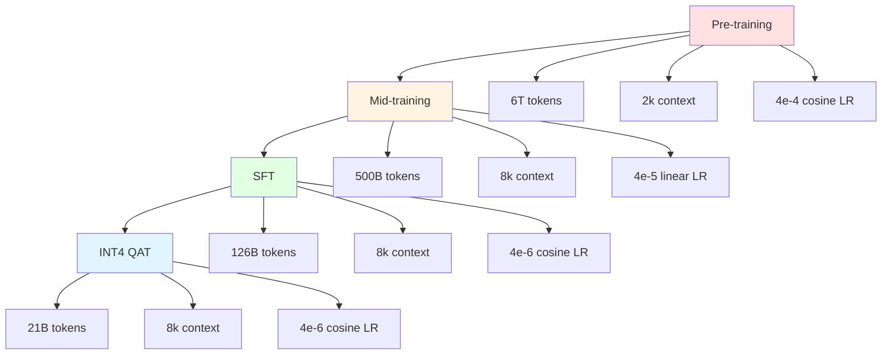
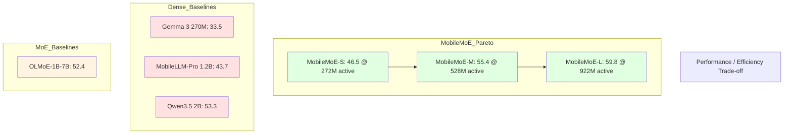
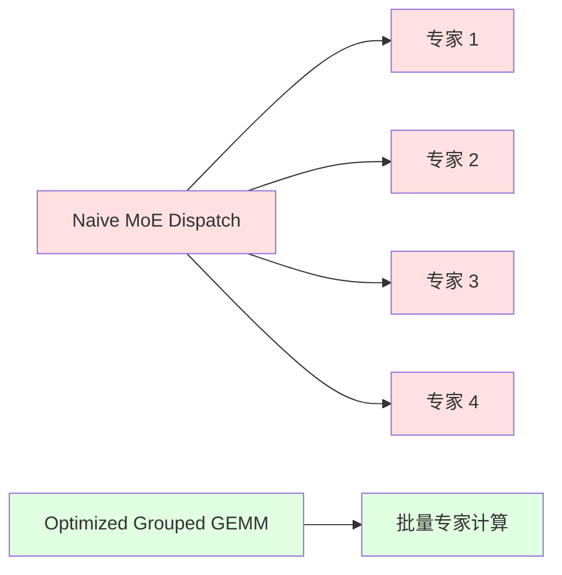

# MobileMoE 深度研读报告


> **论文信息**
> - **标题**：MobileMoE: Scaling On-Device Mixture of Experts
> - **作者**：Yanbei Chen, Hanxian Huang, Ernie Chang, Jacob Szwejbka, Digant Desai, Zechun Liu et al.
> - **arXiv**：[2605.27358](https://arxiv.org/abs/2605.27358)
> - **官方代码**：无官方实现

---

## Ch 1: 论文概述与核心论点

### 基本信息

**MobileMoE: Scaling On-Device Mixture of Experts** 是 Meta AI 团队于 2026年5月26日提交的重要工作。论文由 Yanbei Chen, Hanxian Huang, Ernie Chang, Jacob Szwejbka, Digant Desai, Zechun Liu, Vikas Chandra, Raghuraman Krishnamoorthi 共8位作者完成。

### 研究动机

Mixture-of-Experts (MoE) 架构在百亿（hundred-billion）参数规模的大语言模型中已成为事实上的标准架构（de facto architecture），代表作品包括 Mixtral 8x7B、DeepSeek-MoE、Grok-1 等。然而，在子十亿（sub-billion）参数规模的端侧部署领域，MoE 的优势几乎未被探索。

这一研究空白源于两个关键挑战：
1. **移动端约束严苛**：显存（通常 ≤5GB）、算力（能效限制）、散热（无主动散热）
2. **MoE 小规模特性未知**：大模型的稀疏性优势是否能在小模型中保持？

### 核心创新点（三大贡献）

#### 1. On-Device MoE Scaling Law

论文首次提出了针对端侧场景的 MoE 扩展定律，这是一个**联合优化框架**，同时考虑：
- 移动端显存约束（通常 ≤5GB）
- 移动端算力约束（有限的 FLOPs）
- MoE 稀疏度设计

与传统 scaling law 不同，这个公式不是单一变量扩展，而是多变量联合优化。

#### 2. 四阶段训练流程

论文设计了完整的端到端训练流程：
```
Pre-training → Mid-training → SFT → INT4 QAT
```

所有阶段均使用**开源数据集**（约6T tokens），确保可复现性和透明性。

#### 3. 首个商用智能手机 MoE 推理

论文实现了首个在商用智能手机上的高效 MoE 推理，使用 ExecuTorch 框架和自定义融合 MoE kernel，在 Samsung Galaxy S25 和 iPhone 16 Pro 上完成部署。

### 模型规格速查表

| 模型 | 激活参数 | 总参数 | INT4 权重显存 | 推理 FLOPs（相对 dense） |
|------|---------|--------|--------------|------------------------|
| MobileMoE-S | 272M | 1.3B | 0.68 GB | ~2-4× fewer |
| MobileMoE-M | 528M | 2.8B | 1.40 GB | ~2-4× fewer |
| MobileMoE-L | 922M | 5.3B | 2.65 GB | ~2-4× fewer |

---

## Ch 2: 核心架构设计

### 背景：Dense vs Sparse 在移动端的挑战

传统 dense LLM 的问题在于推理时**所有参数都激活**：
- 对于一个 1B 参数的 dense 模型，每次 forward pass 都需要加载全部 1B 参数
- 移动端显存有限，频繁的参数加载成为瓶颈
- 计算量无法有效利用并行性

MoE 的核心思想是**条件计算**（Conditional Computation）：每个 token 只激活部分专家。

### 三个设计维度



#### 维度 1：稀疏度 (Sparsity, E, k)

- **E**：每层的专家数量（routed experts）
- **k**：每个 token 激活的 top-k 专家数

论文 sweep 范围：E ∈ {1,2,4,8,16,32}，k ∈ {1,2,4}

#### 维度 2：专家粒度 (Expert Granularity, g)

每个 MLP 专家可以进一步拆分为 g 个子专家：
- g=1：传统粗粒度专家
- g=8：细粒度专家（论文最优选择）

论文 sweep 范围：g ∈ {1,2,4,8,16}

#### 维度 3：共享专家 (Shared Expert, s)

一个始终激活的 dense 专家，类似于 ResNet 中的残差连接。

### On-Device MoE Scaling Law

论文的核心理论贡献是提出了端侧 MoE 的 scaling law：

$$L(N_{act}, D, \hat{E}, x) = A_x \hat{E}^{δ_x} N_{act}^{α_x + γ_x \ln \hat{E}} + B_x \hat{E}^{ω_x} D^{β_x + ζ_x \ln \hat{E}} + c_x$$

其中：
- $N_{act}$：激活参数数量（active parameters）
- $D$：训练数据量（tokens）
- $\hat{E}$：归一化的专家数量
- $x$：架构配置 $(E, k, g, s)$

**中国解释**：这是一个两部分的损失函数：
1. **第一项** $A_x \hat{E}^{δ_x} N_{act}^{α_x + γ_x \ln \hat{E}}$：关于激活参数的损失
2. **第二项** $B_x \hat{E}^{ω_x} D^{β_x + ζ_x \ln \hat{E}}$：关于数据量的损失

关键特性：
- 当 $\hat{E}$ 固定时，退化为 Chinchilla scaling law
- 当架构 $x$ 固定时，退化为 joint MoE scaling law

### 最优配置：端侧 Sweet Spot

通过 scaling law 引导的实验，论文确定的最优配置：

| 配置项 | 最优值 | 原因 |
|-------|-------|------|
| 专家数量 E | 8 | 性能接近最优，且显存 ≤5GB |
| Top-k 激活 | 4 | 平衡性能与计算开销 |
| 专家粒度 g | 8 | 计算最优损失，g=16 增加开销 |
| 共享专家 s | 包含 | 提升训练效率，降低损失 |

**最终 MobileMoE 每层配置**：
- 60 个细粒度路由专家（60 routed fine-grained experts）
- 1 个共享专家（1 shared expert）
- Top-4 routing（每 token 激活 4 个专家）



---

## Ch 3: MoE 训练稳定性技术

MoE 训练的核心挑战是**负载不均衡**（load imbalance）：部分专家被过度使用，而其他专家几乎不被激活。这会导致：
1. 训练效率低下
2. 专家能力退化
3. 最终模型性能崩塌

传统解决方案是添加 **Load Balancing Loss**，但这会引入额外超参数且可能影响收敛。

### Auxiliary-Loss-Free Balancing

MobileMoE 采用了一种无需辅助损失（auxiliary-loss-free）的负载均衡方法：

核心思想：直接通过 **bias update rate** 调整专家选择概率

$$λ_{lb} = 10^{-3}$$

**实现方式**：调整 router 的 bias 项，使得被较少选择的专家在后续迭代中更容易被选中。

### Router Z-Loss Regularization

论文引入了 **z-loss** 正则化来稳定 router 的训练：

$$λ_z = 10^{-4}$$

Z-loss 的作用是防止 router logits 过大，从而避免数值不稳定。

**数学形式**（标准 z-loss）：
$$L_z = λ_z \sum (\log \sum \exp(z_i))^2$$

### Sigmoid Gating with Per-Token Top-K Normalization

传统的 MoE 使用 softmax gating，但 MobileMoE 采用：

1. **Sigmoid gating**：每个专家独立计算激活概率
2. **Per-token top-k normalization**：对每个 token 的 top-k 专家概率进行归一化

**优势**：
- 减少了 softmax 的计算开销
- 更细粒度的专家控制

### Grouped MLP

为了高效计算，MobileMoE 使用了 **Grouped MLP** 结构：

```python
# 伪代码示意
def grouped_mlp(x, experts, topk_indices):
    # 将稀疏的 expert dispatch 转为 dense grouped GEMM
    # 这里的关键是按组（group）重新排列计算
    grouped_input = regroup_by_expert(x, topk_indices)
    grouped_output = parallel_expert_compute(grouped_input, experts)
    output = regroup_by_token(grouped_output, topk_indices)
    return output
```

### Expert Parallelism (EP=4)

训练时使用 **Expert Parallelism（EP）**：
- EP=4 表示将专家分布到 4 个设备上
- 每个 device 负责一部分专家的计算
- 通过 All2All 通信交换数据

### 与传统 Load Balancing Loss 对比

| 方法 | 优势 | 劣势 |
|-----|------|------|
| Load Balancing Loss | 效果直接 | 引入额外超参数，可能影响收敛 |
| Auxiliary-Loss-Free | 无额外损失，自适应 | 需要精心设计 bias 更新策略 |

---

## Ch 4: 训练流程与数据工程

### 四阶段训练流程



### 阶段 1：Pre-training

**规模**：~6T tokens, 2048 context length

**学习率**：4e-4, cosine decay

**数据配比**（web-heavy）：
| 数据类型 | 占比 |
|---------|------|
| Web 数据 | 62% |
| 其他领域 | 38% |

**特点**：
- 使用 MoE 稳定性技术（auxiliary-loss-free balancing, z-loss）
- 建立 MoE 的基础能力

### 阶段 2：Mid-training

**规模**：~500B tokens, 8192 context length

**学习率**：4e-5, linear decay

**数据分布变化**：
- 提升了 knowledge（知识）权重
- 提升了 code（代码）权重
- 提升了 math（数学）权重

**目的**：
- 扩展上下文长度（2k → 8k）
- 聚焦核心专业领域（知识、代码、数学）

### 阶段 3：SFT (Supervised Fine-Tuning)

**规模**：~126B tokens, 8192 context length

**学习率**：4e-6, cosine decay

**数据**：28 个开源数据集

**特点**：
- Dropless dispatch：无丢弃的专家调度
- 训练高质量指令遵循能力

### 阶段 4：INT4 QAT (Quantization-Aware Training)

**规模**：~21B tokens, 8192 context length

**学习率**：4e-6, cosine decay

**量化配置**：
- 对称分组量化（Symmetric group-wise INT4）
- Group size = 32
- **FP32 router**（保持推理稳定性）

### 训练配置细节

**优化器**：AdamW
- 标准 LLM 训练优化器
- 适合 MoE 的稀疏梯度特性

**训练效率**：
- Expert parallelism (EP=4)
- Grouped MLP 计算
- 延长上下文训练（2k → 8k）

### 数据工程总结

所有数据均来自**开源数据集**：
- 保证了可复现性
- 便于社区验证和扩展
- 符合开源透明原则

---

## Ch 5: 实验结果与性能分析

### Base Models: 14 基准综合结果

| 模型 | 激活/总参数 | 平均分 | 相对 MobileMoE-L |
|------|-----------|-------|----------------|
| **MobileMoE-L** | 922M / 5.3B | **59.8** | - |
| **MobileMoE-M** | 528M / 2.8B | **55.4** | -4.4 |
| **MobileMoE-S** | 272M / 1.3B | **46.5** | -13.3 |
| OLMoE-1B-7B | 1.3B / 6.9B | 52.4 | -7.4 |
| Qwen3.5 2B | 1.9B (dense) | 53.3 | -6.5 |
| SmolLM2 1.7B | 1.7B (dense) | 50.7 | -9.1 |
| Gemma 3 270M | 270M (dense) | 33.5 | -26.3 |
| MobileLLM-Pro | 1.2B (dense) | 43.7 | -16.1 |

**逐行解读**：
- **MobileMoE-S (46.5)**: 超过 Gemma 3 270M (33.5) **13.0分**，在相似参数量下建立了新的性能 frontier
- **MobileMoE-M (55.4)**: 超过 Qwen3.5 2B (53.3) **2.1分**，但只有 1/3.6 的激活参数（528M vs 1.9B）
- **MobileMoE-L (59.8)**: 超过 OLMoE-1B-7B (52.4) **7.4分**，同时减少 30% 激活参数和 23% 总参数
- **MobileLLM-Pro (43.7)**: 作为 Meta 前作，已被 MobileMoE-S (46.5) 超越，展示了 MoE 架构的进步

### SFT Models: 分领域能力

| 模型 | Math Avg | Code Avg | IF Avg | Knowl+Reason Avg | Overall |
|------|---------|---------|--------|----------------|---------|
| **MobileMoE-L** | **41.2** | **58.8** | 43.7 | **33.9** | **44.4** |
| **MobileMoE-M** | 34.7 | 51.7 | 40.8 | 26.5 | 38.4 |
| **MobileMoE-S** | 24.9 | 36.2 | 33.9 | 23.0 | 29.5 |
| Qwen3.5 2B | 36.7 | 45.6 | **51.8** | 36.6 | 42.7 |
| OLMoE-1B-7B | 18.2 | 33.1 | 32.4 | 21.9 | 26.4 |

**逐行解读**：
- **数学 (Math)**: MobileMoE-L (41.2) 显著领先，Qwen3.5 2B (36.7) 次之，OLMoE-1B-7B (18.2) 表现最差
- **代码 (Code)**: MobileMoE-L (58.8) 优势最大，超过 OLMoE-1B-7B (33.1) 达 25.7 分
- **指令遵循 (IF)**: Qwen3.5 2B (51.8) 在此领域领先，可能源于其 SFT 数据优势
- **知识+推理 (Knowl+Reason)**: MobileMoE-L (33.9) 略逊于 Qwen3.5 2B (36.6)，但显著优于 OLMoE

### 关键代码与数学基准

| 基准 | MobileMoE-L | OLMoE-1B-7B | Qwen3.5 2B | 提升 |
|------|------------|------------|-----------|------|
| **HumanEval** | 65.2% | 36.0% | - | +29.2% |
| **MATH500** | 32.2% | 8.4% | - | +23.8% |
| **MBPP** | 61.0% | 40.4% | - | +20.6% |

**逐行解读**：
- **HumanEval (65.2%)**: MobileMoE-L 几乎是 OLMoE-1B-7B (36.0%) 的**两倍性能**，展示了 MoE 在代码生成上的巨大优势
- **MATH500 (32.2%)**: 相比 OLMoE-1B-7B (8.4%) 有 **3.8倍** 提升，表明细粒度专家对数学推理特别有效
- **MBPP (61.0%)**: 代码生成的另一基准，MobileMoE-L 同样显著领先

### 知识与推理基准

| 基准 | MobileMoE-L | OLMoE-1B-7B | Qwen3.5 2B |
|------|------------|------------|-----------|
| **MMLU** | 48.8% | 44.5% | 53.1% |
| **NQ** | 42.8% | 30.9% | 32.9% |
| **TQA** | 54.8% | 44.5% | 48.5% |
| **BoolQ** | 71.6% | 65.4% | 75.8% |
| **DROP** | 56.2% | 48.6% | 53.7% |

**逐行解读**：
- **MMLU**: Qwen3.5 2B (53.1%) 仍领先，但 MobileMoE-L (48.8%) 显著优于 OLMoE-1B-7B (44.5%)
- **NQ (Natural Questions)**: MobileMoE-L (42.8%) 领先优势明显，超过 OLMoE 11.9 分
- **TQA (TriviaQA)**: MobileMoE-L (54.8%) 同样显著领先
- **BoolQ**: Qwen3.5 2B (75.8%) 仍领先，MoE 模型在此基准上优势有限
- **DROP**: MobileMoE-L (56.2%) 领先，展示了 MoE 在数值推理上的优势

### 性能-效率 Pareto Frontier



### 综合结论

1. **MobileMoE-S**: 在相似激活参数下超越所有 dense 基线
2. **MobileMoE-M**: 以 1/3.6 激活参数超越 Qwen3.5 2B
3. **MobileMoE-L**: 以更少参数超越 OLMoE-1B-7B，并在代码/数学上显著领先
4. **MoE 优势领域**: 代码生成、数学推理、知识密集型任务
5. **Dense 优势领域**: 部分推理任务（如 BoolQ）

---

## Ch 6: 端侧部署

### 部署挑战

在移动端部署 MoE 面临三大挑战：

1. **显存带宽瓶颈**：MoE 需要频繁加载不同专家的权重
2. **计算碎片化**：稀疏激活导致 GPU 利用率低
3. **调度复杂性**：top-k routing 增加了实现复杂度

### Custom Fused MoE Kernel in ExecuTorch

论文的核心工程贡献是实现了 **自定义融合 MoE kernel**：

**关键优化**：
- 将稀疏的 expert dispatch 转为 dense grouped GEMM
- 减少 kernel launch 开销
- 优化显存访问模式



**传统 Naive Dispatch**：
- 每个 token 独立调度专家
- 大量小矩阵计算，GPU 利用率低

**优化后的 Grouped GEMM**：
- 将同一专家的所有 tokens 分组
- 一次性批量计算，大幅提升效率

### FP32 Router for Stability

一个关键设计决策是：**保持 router 为 FP32 精度**

**原因**：
- Router 的输出（专家选择）对量化敏感
- FP32 保证了 routing 的稳定性
- FP32 router 的额外开销很小（相对于整体计算）

### 部署设备

- **Samsung Galaxy S25** (Android)
- **iPhone 16 Pro** (iOS)

### 端侧性能结果

| 操作 | MobileMoE-S | MobileLLM-Pro | 加速比 |
|------|-----------|--------------|-------|
| **Prefill** | 1.8-3.8× faster | - | 1.8-3.8× |
| **Decode** | 2.2-3.4× faster | - | 2.2-3.4× |
| **Peak RSS (4k ctx)** | -22% | - | 9-22% lower |

**逐行解读**：
- **Prefill (1.8-3.8×)**: 在处理 prompt 时，MobileMoE-S 的加速效果显著，得益于并行化的专家计算
- **Decode (2.2-3.4×)**: 在生成阶段，MoE 的优势更加明显，每个 token 只需激活部分专家
- **Peak RSS (9-22% lower)**: 在长上下文场景下（4k-8k tokens），MobileMoE 的显存峰值更低

### 显存占用

所有 MobileMoE 变体都满足现代移动 DRAM 预算（≤5 GB）：

| 模型 | INT4 权重显存 | 总显存预算 |
|------|-------------|-----------|
| MobileMoE-S | 0.68 GB | ≤5 GB |
| MobileMoE-M | 1.40 GB | ≤5 GB |
| MobileMoE-L | 2.65 GB | ≤5 GB |

### 与 Dense 模型的对比

在相同的 INT4 权重显存下：
- **MobileMoE-S (0.68 GB)** vs **MobileLLM-Pro (0.68 GB)**
  - MobileMoE-S 在性能上显著领先（46.5 vs 43.7）
  - MobileMoE-S 在推理速度上领先 2-4×

---

## Ch 7: 总结与展望

### 核心创新速查表

| 创新点 | 描述 | 意义 |
|-------|------|------|
| **On-Device MoE Scaling Law** | 联合优化显存、计算、稀疏度的扩展定律 | 为端侧 MoE 提供理论指导 |
| **Sweet-Spot Design** | E=8, g=8, 包含 shared expert | 确定了子十亿参数的最优配置 |
| **四阶段训练** | Pre-train → Mid-train → SFT → QAT | 完整的开源训练流程 |
| **高效端侧推理** | 自定义 fused MoE kernel in ExecuTorch | 首个商用手机 MoE 推理 |
| **Auxiliary-Loss-Free Balancing** | 无需负载均衡损失的稳定训练 | 简化训练流程 |
| **SOTA 结果** | 超越 dense 和 MoE 基线 | 建立 on-device Pareto frontier |

### 局限性与不足

尽管 MobileMoE 取得了显著成果，但仍存在以下局限性：

1. **上下文长度限制**
   - 训练和推理的最大上下文为 8k tokens
   - 对于需要更长上下文的任务（如长文档分析）仍不足
   - 未来可探索：更长的上下文扩展（如 32k, 128k）

2. **多模态扩展**
   - 当前仅支持纯文本任务
   - 端侧多模态（视觉+语言）是重要方向
   - 未来可探索：Vision MoE、跨模态专家路由

3. **持续预训练**
   - 训练数据截止于固定时间点
   - 缺乏持续学习和知识更新机制
   - 未来可探索：增量预训练、专家知识更新

4. **多语言性能**
   - 论文主要关注英语基准
   - 多语言场景下的性能未充分评估
   - 未来可探索：多语言专家、语言感知路由

5. **蒸馏与压缩**
   - 当前仅使用量化（INT4）进行压缩
   - 未探索知识蒸馏等技术
   - 未来可探索：从大模型蒸馏到端侧 MoE

### 与前身工作的演进关系

```
MobileLLM (2024) → MobileLLM-Pro (2024) → MobileMoE (2026)
    ↓                   ↓                      ↓
 Dense 1B          Dense 1.2B              Sparse 0.3-0.9B active
                    优化训练                 MoE 架构
                    开源数据                 四阶段训练
```

**演进关键**：
- 从 dense 到 sparse：计算效率的革命性提升
- 从研究到实用：真正部署到商用手机
- 从闭源到开源：训练流程和数据的完全透明

### 推荐阅读顺序

如果你对 MoE 和端侧 LLM 感兴趣，推荐按以下顺序阅读：

1. **入门**：先了解 Dense 端侧 LLM
   - MobileLLM/Pro 论文
   - SmolLM 系列论文

2. **进阶**：理解 MoE 基础
   - Switch Transformers (Google, 2022)
   - Mixtral 8x7B (Mistral AI, 2024)

3. **深入**：研究 MoE 扩展定律
   - Joint MoE Scaling Laws (Krajewski et al., 2024)
   - DeepSeek-MoE (DeepSeek, 2025)

4. **前沿**：阅读本论文
   - MobileMoE: Scaling On-Device Mixture of Experts

### 论文链接与补充材料

- **arXiv**: https://arxiv.org/abs/2605.27358
- **License**: CC BY 4.0（完全开源）
- **代码**: 待发布（论文表明将开源）
- **模型**: 待发布（论文表明将开源）

### 总结

MobileMoE 代表了端侧 LLM 发展的重要里程碑：
- **理论上**：建立了端侧 MoE 的 scaling law
- **工程上**：实现了首个商用手机 MoE 推理
- **实践上**：用更少参数达到更好性能
- **开源上**：完全透明的训练流程和数据

这项工作证明了 MoE 架构不仅在百亿参数规模有效，在子十亿的端侧场景下同样能带来显著收益。随着端侧 AI 的快速发展，MobileMoE 的方法和发现将为未来的研究和实践提供重要参考。

