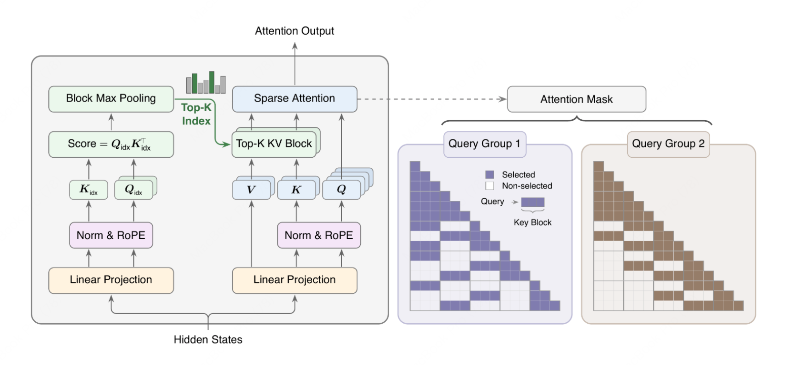

# MiniMax Sparse Attention (MSA) 论文精读

## 论文元数据
- 标题：MiniMax Sparse Attention (MSA)
- 作者：Xunhao Lai, Weiqi Xu, Yufeng Yang, Qiaorui Chen, Yang Xu, Lunbin Zeng, Xiaolong Li, Haohai Sun, Haichao Zhu, Vito Zhang, Pengyu Zhao
- 机构：MiniMax, Peking University, NVIDIA, Zhejiang University, Huazhong University of Science and Technology
- arXiv ID：2606.13392
- 发表日期：2026-06-12
- 页数：30 pages, 14 figures
- 官方代码：https://github.com/MiniMax-AI/MSA
- 官方模型：https://huggingface.co/MiniMaxAI/MiniMax-M3

---

## 第1章：论文概述与核心贡献

### 1.1 一句话定位

MiniMax Sparse Attention (MSA) 是一种基于Grouped Query Attention (GQA)构建的blockwise稀疏注意力机制，通过双分支架构（Index Branch负责块选择 + Main Branch执行受限注意力）在百万级token上下文场景下实现28.4×的注意力FLOPs降低，同时在109B参数MoE模型上保持与完整GQA相当的质量。

### 1.2 核心方法速览

MSA架构继承标准GQA的投影层，仅增加2个额外投影矩阵，由两个分支组成：

**Index Branch（索引分支）**：每个GQA group配备一个index query head，所有group共享一个index key head。通过block-level max-pooling计算块分数 $M_{idx}^{(g,b)} = \max_{j \in B_b} S_{idx}^{(g,j)}$，对每个group选择top-k个key-value块（始终包含当前块）。该分支独立运行，不与Main Branch共享参数。

**Main Branch（主分支）**：标准GQA注意力，但仅对Index Branch选中的块执行精确注意力计算。所有group共享相同的块选择结果。

**训练策略**：采用KL散度损失对齐两个分支的分布，Index Branch的query/key投影使用梯度断开（stop-gradient），并在训练初期使用Indexer Warmup让两个分支都看到完整注意力。总损失函数为 $L = L_{LM} + \lambda \cdot L_{KL}$，论文未明确给出λ具体值。

### 1.3 关键结果速览

| 指标 | 完整GQA | MSA | 变化 |
|------|---------|-----|------|
| Per-token attention FLOPs @ 1M context | 基准 | -28.4× | 28.4×降低 |
| Prefill wall-clock time @ 1M context | 基准 | -14.2× | 14.2×加速 |
| Decoding wall-clock time @ 1M context | 基准 | -7.6× | 7.6×加速 |
| 109B MoE质量 | 基准 | 持平 | 近无损 |

所有速度测试在H800 GPU上完成，质量评估覆盖文本、图像、视频、Agent四类任务。

### 1.4 核心贡献展开

**贡献1：最小化GQA原生稀疏注意力架构**

MSA遵循Occam's razor原则，在标准GQA基础上仅增加2个投影矩阵（Index Branch的W_q_idx和W_k_idx），不引入额外的可训练状态或复杂结构。支持两种训练模式：(1) from-scratch训练，使用KL损失+Indexer Warmup；(2) 从预训练GQA checkpoint继续训练（MSA-CPT），在2.6T GQA Full-Attention checkpoint基础上继续预训练400B tokens（含40B warmup），复用已有预训练成果。Index Branch的轻量化设计确保参数开销可忽略。

**贡献2：GPU Kernel协同设计**

论文设计了三个核心kernel：(1) exp-free Top-k选择kernel，对小k值避免指数运算开销；(2) KV-outer稀疏注意力kernel，采用预调度chunking策略的两阶段forward/combine算法，并通过query concatenation提升tensor core利用率；(3) fused KL loss + persistent load-balancing kernel，在单一kernel中完成损失计算和负载均衡。这些优化在H800上实现了14.2× prefill和7.6×解码加速。

**贡献3：109B MoE大规模质量验证**

MSA在109B参数MoE模型上进行了全面消融实验。文本任务（包括长文档理解、代码推理）与完整GQA持平；视觉任务（图像理解、视频理解）持平；Agent工作流任务（多轮对话、工具调用）持平。Scaling curve显示MSA在多个模型尺寸上都能跟踪GQA的性能曲线。

**贡献4：百万级token上下文支持**

通过blockwise稀疏化，MSA在1M token上下文时将per-token注意力FLOPs降低28.4×。理论上可扩展至更长上下文，因为**计算复杂度**从$O(N^2)$降至接近线性$O(N)$。Index Branch的top-k块选择机制确保每个token仅关注全局中最相关的少数块，而不论总序列长度。

**贡献5：近无损GQA→MSA转换**

已训练的GQA模型可直接转换为MSA而几乎不损失性能。转换过程（MSA-CPT）在2.6T GQA Full-Attention checkpoint基础上替换dense attention为MSA，继续预训练400B tokens（前40B为Indexer Warmup，此时Main Branch仍使用full attention；后360B为sparse CPT，启用top-k sparse selection）。这使得现有GQA模型可低成本迁移到MSA。

### 1.5 与已有稀疏注意力方法的定位

| 方法                                      | 复杂度      | 硬件兼容性     | 训练友好性      | MSA区别         |
| --------------------------------------- | -------- | --------- | ---------- | ------------- |
| FlashAttention                          | $O(N^2)$ | 优秀        | 是          | MSA进一步降低FLOPs |
| Sparse Attention (Longformer, BigBird)  | $O(Nw)$  | 中等        | 需特殊pattern | MSA保持灵活块选择    |
| Linear Attention (Performer, Linformer) | $O(N)$   | 低         | 近似误差累积     | MSA保持精确注意力    |
| KV Cache压缩 (StreamingLLM, H2O)          | $O(N)$   | 良好        | 推理-only    | MSA支持训练+推理    |
| 状态空间模型 (Mamba, RWKV)                    | $O(N)$   | 需专用kernel | 架构变动大      | MSA保持GQA兼容    |

MSA的独特定位在于：(1) 保持GQA/softmax attention的精确性而非近似；(2) 与现有GPU生态（tensor core、HBM）协同设计而非对抗；(3) 训练和推理统一架构，非推理-only优化。

---

## 第2章：研究背景与动机

### 2.1 长上下文LLM的需求驱动

现代LLM应用对上下文长度的需求已从32k扩展到100k、1M乃至更高。主要驱动场景包括：

**Agent工作流**：多轮自主Agent需要维护长时间对话历史、任务状态、工具调用记录。例如代码生成Agent可能需要跨越数万token的代码库上下文来理解函数依赖关系；研究Agent可能需要处理整篇论文（数万token）加上检索的相关文献（数十万token）。

**代码推理**：大型代码库的跨文件理解、历史commit追溯、依赖关系分析都需要十万级token上下文。一个中型开源项目的完整代码可能超过100万token，真正理解其架构需要全局视野。

**持久记忆**：个性化AI助手需要记住用户的长期偏好、历史交互、知识库更新。这要求模型上下文窗口能容纳数月甚至数年的交互历史。

**多媒体理解**：视频理解需要处理高帧率长视频（1小时1080p视频≈百万级token），图像序列分析（医学影像、卫星图像时间序列）同样需要超长上下文。

这些场景的共同特点是：序列长度跨越$10^5$到$10^6$ token，但并非所有token都对当前预测任务有用。稀疏性假设——每个token只需关注全局中少数相关token——是MSA设计的核心前提。

### 2.2 注意力机制的二次复杂度瓶颈

标准因果softmax attention的总FLOPs为$2 H_q N^2 d_h$（论文Eq.1：$\Theta(2 H_q N^2 d_h)$ FLOPs，FMA=1 FLOP约定），其中$H_q$为query head数，N为序列长度，$d_h$为head维度。Per-token FLOPs为$2 H_q N d_h$。分解为三个部分：

(1) Query-Key相似度计算：$H_q N^2 d_h$，每个query head计算N×N的注意力分数矩阵。

(2) Softmax归一化：$H_q N^2$，对每行（或每列）进行指数运算和归一化。

(3) Value加权求和：$H_q N^2 d_h$，用归一化后的注意力权重对value进行加权。

当N从32k增长到1M时，FLOPs增长约1000×（平方增长）。内存访问模式也从规则的local access变为不规则的global access，导致GPU利用率下降。即使使用FlashAttention等IO-aware算法，也无法改变$O(N^2)$的基本复杂度。

在GQA架构下，总FLOPs仍为$2 H_q N^2 d_h$（per-token为$2 H_q N d_h$），因为$H_{kv}$ < $H_q$（多个query head共享同一组KV）仅降低常数因子，不改变渐近复杂度。MSA的目标是将每个token的注意力复杂度从$O(N)$降至$O(k \cdot B_k)$（即$O(N)$ → $O(1)$），其中$k$是选中的block数，$B_k$是block size，且$k \cdot B_k \ll N$。

### 2.3 已有方案分类与局限

现有长上下文解决方案可分为四类，各有局限：

**稀疏注意力**：通过预定义或学习到的pattern限制每个token的注意力范围。Longformer使用sliding window + global attention，BigBird使用随机+window+global混合pattern。局限在于：(1) pattern通常是固定的，无法适应输入内容；(2) 特定pattern需要定制kernel，硬件利用率低；(3) 训练不稳定，因为attention mask变化剧烈。

**线性注意力**：通过kernel trick将softmax的指数运算替换为可分解的特征映射，将复杂度降至$O(N)$。Performer使用正交随机特征，Linformer使用低秩投影。局限在于：(1) 近似误差会随着序列长度累积；(2) 需要重新设计训练流程（loss、schedule），不能直接迁移预训练模型；(3) 特征映射的选择对质量影响大，需要调参。

**KV Cache压缩**：在推理时通过 eviction policy（如FIFO、LRU、H2O的heavy-hitter保留）限制KV cache大小。StreamingLLM保留attention sink tokens（序列开头的几个token）+ sliding window。局限在于：(1) 压缩策略是启发式的，可能丢失关键信息；(2) 仅适用于推理，训练时仍需完整注意力；(3) 状态压缩后无法恢复，导致长程依赖中断。

**状态空间模型**：完全抛弃softmax attention，使用线性递归状态更新（如Mamba的S4、RWKV的并行递归）。复杂度$O(N)$，硬件友好。局限在于：(1) 需要重新设计模型架构，无法直接利用现有预训练的Transformer模型；(2) 训练和推理的实现与Transformer差异大，工程迁移成本高；(3) 某些需要精确检索的任务（如copying）性能下降。

MSA的设计目标是克服以上局限：(1) 保持softmax attention的精确性，无需重新训练流程；(2) 与GQA兼容，可直接从GQA checkpoint转换；(3) GPU kernel与现有生态（tensor core、cutlass、flashinfer）协同设计。

### 2.4 MSA的设计哲学：Occam's Razor

MSA遵循简约原则：在不牺牲核心功能的前提下，最小化新增组件，最大化复用现有软硬件。具体体现在：

**架构最小化**：在标准GQA基础上仅增加2个投影矩阵（Index Branch的$W_{q_{idx}}$和$W_{k_{idx}}$），不引入新的可学习状态（如额外的memory、可学习的pattern、低秩投影矩阵）。Index Branch的token选择逻辑仅涉及max-pooling和top-k操作，不涉及复杂的可微分机制。

**软硬件复用**：KV-outer稀疏注意力kernel复用了FlashAttention的tiling策略和CUDA core/kernel设计模式；query concatenation利用了tensor core的矩阵乘加能力；fused KL loss kernel复用了标准的反向传播逻辑。这些设计确保MSA能在现有GPU（H800、A100）上高效运行，无需定制硬件。

**训练友好性**：KL散度损失和Indexer Warmup都是标准技巧，不需要特殊的训练schedule或loss设计。从GQA转换仅需微调，不需要从头预训练。

**质量保证**：MSA在Main Branch中执行精确的softmax attention，而非近似计算。Index Branch的作用是减少FLOPs，不是引入近似误差。这使得MSA的质量与完整GQA持平，而非略有下降。

这种简约哲学与当前趋势（越来越复杂的注意力变体、越来越多 bespoke component）形成对比。MSA证明：通过巧妙的块级稀疏化设计，可以在不牺牲质量的前提下大幅降低计算成本。

### 2.5 Grouped Query Attention (GQA) 基础回顾

GQA是MSA的基础，先回顾其核心概念。

**标准Multi-Head Attention (MHA)**：每个head有独立的query、key、value投影矩阵。参数量：$3H_q d_{model}^{2}$（假设query/key/value维度为$d_{\text{model}}$）。Per-token FLOPs：$2 H_q N d_h$，总FLOPs：$2 H_q N^2 d_h$。算法复杂度为$O(N^2)$。

**Multi-Query Attention (MQA)**：所有head共享同一组key、value投影矩阵。参数量：$H_q d_{model}^{2} + 2 d_{model}^{2}$。Per-token FLOPs：$2 H_q N d_h$，总FLOPs：$2 H_q N^2 d_h$。算法复杂度为$O(N^2)$。KV cache大小降至$1/H_q$。

**Grouped Query Attention (GQA)**：折中方案，将$H_q$个query head分为G个group，每个group共享一组KV head。定义groups数$G = H_q / H_{kv}$（$H_{kv}$为KV head数）。当G=1时退化为MQA，G=$H_q$时退化为MHA。GQA在参数效率和质量之间取得平衡：比MHA更省KV cache内存，比MQA质量更好。

GQA的attention计算：对于第g个group，query head $h \in group_g$共享$K_g$、$V_g$（已投影）：
$$Attention_g = \text{softmax}\left(\frac{Q_g K_g^T}{\sqrt{d_h}}\right) V_g$$

MSA在此基础上构建：每个GQA group配备一个Index Branch，独立选择top-k块，Main Branch在选中块上执行标准GQA attention。Index Branch的参数开销为$d_{model} \cdot d_{idx} \cdot (H_{kv} + 1)$（$W_q^{\text{idx}} \in \mathbb{R}^{d_{model} \times H_{kv} d_{idx}}$，$W_k^{\text{idx}} \in \mathbb{R}^{d_{model} \times d_{idx}}$），相比GQA的$3H_q d_{model}^2 + 2 d_{model}^2$可忽略（因为$H_{kv} \cdot d_{idx} \ll H_q \cdot d_h$）。

GQA的另一个优势是成熟的GPU kernel支持（FlashAttention、vLLM、TensorRT-LLM）。MSA继承这一优势，其KV-outer稀疏注意力kernel可以基于FlashAttention的tiling策略实现，无需从零设计新的kernel框架。

---

## 第3章：MSA核心方法

## 3.1 总体架构总览

MSA（MiniMax Sparse Attention）是基于Grouped Query Attention（GQA）的blockwise稀疏注意力机制。其核心思想是将注意力计算分解为两个独立的分支：

1. **Index Branch（索引分支）**：轻量级分支，负责为每个GQA组选择一小部分key-value blocks
2. **Main Branch（主分支）**：仅在Index Branch选中的blocks上执行精确注意力计算

这种设计遵循Occam's Razor原则：用最少的组件改动实现最大的效果，同时充分复用现有的硬件和软件栈。MSA支持从零开始训练，也支持从已训练的GQA checkpoint进行近无损转换。

架构总览如图所示（论文Figure 1）：
如下：


```
Input Sequence X (N tokens)
        ↓
    ┌─────────────────────────────────────┐
    │                                     │
    ↓                                     ↓
Index Branch                         Main Branch
(1 KV head)                         (G_Q groups)
    │                                     │
    ↓                                     ↓
Q_idx, K_idx (轻量级)              Q_main, K_main, V_main
    │                                     │
    ↓                                     ↓
Block-level scores                Full attention
    │                                     │
    ↓                                     ↓
Top-k block selection             Softmax over
(local block always included)      selected blocks only
    │                                     │
    └──────────────┬──────────────────────┘
                   ↓
              Output logits
```

## 3.2 Index Branch详解

Index Branch是一个极简的设计，仅向标准GQA添加2个投影矩阵。

### 投影矩阵定义

对于输入序列$X \in \mathbb{R}^{N \times d_{model}}$，Index Branch使用：

$$Q_{idx} = X \cdot W_{idx}^q \in \mathbb{R}^{N \times H_{kv} \times d_{idx}}$$

$$K_{idx} = X \cdot W_{idx}^k \in \mathbb{R}^{N \times 1 \times d_{idx}}$$

其中：
- $H_{kv}=4$是KV头数量（论文Sec 5.1明确指定，64 query heads, 4 KV heads, GQA ratio 16）
- $d_{idx}$是Index Branch的注意力头维度（论文未明确给出具体值，但远小于$d_h=128$）
- **关键设计**：每个GQA组有独立的index query head，但所有组共享一个index key head（单头）

#### 官方实现参考代码 (fmha_sm100/sparse_fmha_adapter.py)

```python
# Index Branch 投影定义（实际实现中通过 fp4_indexer_block_scores 计算）
# 参考：fp4_indexer_interface.py 中的 fp4_indexer_block_scores 函数
# 该函数接收：
#   q_fp4: [total_qo_len, Hq, 64] - packed FP4 Q tensor
#   k_fp4: [total_pages, Hk, 128, 64] - packed paged FP4 K tensor  
#   q_scale: [total_qo_len, Hq, G] - Q scale tensor
#   k_scale: [total_pages, Hk, 128, G] - K scale tensor
# 返回：[Hq, max_k_tiles, total_qo_len] float32 block scores
# 
# 实际计算流程：
# 1. 将 Q/K 从 FP4 解包并反量化
# 2. 通过 MMA (Matrix Multiply Accumulate) 计算 Q@K^T 得到注意力分数
# 3. 对每个 128-token KV page 取 max-pooling 得到 block-level scores
# 4. 返回形状 [Hq, num_kv_blocks, total_q] 的 block scores
```

### Block-level Max-pooling Scores

将序列划分为固定的blocks：$\mathcal{B}_1, \mathcal{B}_2, ..., \mathcal{B}_{N_{blocks}}$，每个block包含$B_k$个tokens（$B_k=128$为block size，论文Sec 4.1/5.1明确指定）。

对于query position i、GQA组r和block $\mathcal{B}_b$，先计算token-level index score，再max-pool到block level（论文Eq.6）：

$$S_{i,j}^{\text{idx},(r)} = \frac{(Q^{\text{idx}})_i^{(r)} \cdot (K^{\text{idx}})_j^{\top}}{\sqrt{d_{\text{idx}}}}, \quad M_{i,b}^{\text{idx},(r)} = \max_{\substack{j \in \mathcal{B}_b \\ j \le i}} S_{i,j}^{\text{idx},(r)}$$

其中$(Q^{\text{idx}})_i^{(r)}$是第i个query在GQA组r的index query向量，$(K^{\text{idx}})_j$是第j个token的index key向量，约束$j \le i$保证因果性。Max-pooling提取每个block内对当前query最强的响应信号，无可见token的block赋值为$-\infty$。

### Top-k Block Selection

对每个query position i和GQA组r，选择top-k个block indices（论文Eq.7）：

$$\mathcal{I}_i^{(r)} = \mathrm{TopK}_{b \in \{1, \dots, B\}}(M_{i,\cdot}^{\text{idx},(r)}, k)$$

其中$k=16$是选择的block数量（论文Sec 4.1/5.1明确指定，可选值$\{4,8,16,32\}$），$B = \lceil N/B_k \rceil$为总block数。选择结果$\mathcal{I}_i^{(r)}$被该GQA组内所有G个query heads共享。

**Local Block Always Included**：当前query所在的local block始终被选中，确保最近邻信息不丢失。这是因果注意力的基本要求。

#### 官方实现参考代码 (csrc/include/sparse_topk_select.cuh)

```cpp
// 核心 Top-k 选择内核：IndexerTopKWithSortKernel<16>
// 位于：python/fmha_sm100/csrc/include/sparse_topk_select.cuh
//
// 关键设计点：
// 1. exp-free 设计：直接在 fp32 logits 上做 histogram-based top-k，无需 softmax/exp
// 2. 两阶段 pipeline：TransposeKernel -> IndexerTopKWithSortKernel
// 3. fused ascending-by-index sort：使用 warp-level bitonic sort (WarpBitonicSortAsc32/64)
// 4. OOB clamp in kernel：indices >= num_valid_pages 自动重写为 -1 并排序到尾部
// 5. 支持 force_begin/force_end：强制包含首尾 blocks (local block always included)
//
// 入口函数：
// cudaError_t SparseTopKSelect(const float* in, int32_t* out, int32_t* workspace,
//                              uint32_t total_qo_len, uint32_t num_qo_heads,
//                              uint32_t max_k_tiles, uint32_t num_valid_pages,
//                              uint32_t force_begin, uint32_t force_end,
//                              cudaStream_t stream);
//
// 其中：
//   in: [num_qo_heads, max_k_tiles, total_qo_len] fp32 block scores (strided)
//   out: [total_qo_len, num_qo_heads, topk=16] int32 selected block indices
//   workspace: int32 buffer, size = num_qo_heads * max_k_tiles * total_qo_len
//   force_begin: number of forced prefix blocks (always selected)
//   force_end: number of forced suffix blocks (always selected)
```

### 设计要点

Index Branch的极简设计体现在：

1. **仅添加2个投影矩阵**：$W_{idx}^q$和$W_{idx}^k$，相比GQA的参数量增加可忽略
2. **单头共享key**：所有GQA组共享$K_{idx}$，进一步减少参数
3. **Block-level而非token-level**：选择粒度是block，显著降低选择开销
4. **与GQA紧密集成**：Index Branch的组数等于GQA的KV头数$H_{kv}$，无缝对接

## 3.3 Main Branch详解

Main Branch基于标准GQA，但执行**受限注意力**（restricted attention）。

### 受限注意力公式

对于query head $h \in \mathcal{H}_r$（GQA组r内的第h个query head），仅对Index Branch选中的blocks计算注意力（论文Eq.8）：

$$\boldsymbol{O}_i^{(h)} = \text{softmax}\left(\frac{\boldsymbol{Q}_i^{(h)} \cdot (\boldsymbol{K}^{(r)}[\mathcal{I}_i^{(r)}])^{\top}}{\sqrt{d_h}}\right) \cdot \boldsymbol{V}^{(r)}[\mathcal{I}_i^{(r)}]$$

其中：
- $\boldsymbol{Q}_i^{(h)}$是第i个query在head h的query向量
- $\boldsymbol{K}^{(r)}, \boldsymbol{V}^{(r)}$是GQA组r的key/value矩阵
- $\mathcal{I}_i^{(r)}$是Index Branch为query i、组r选中的block indices
- $\boldsymbol{K}^{(r)}[\mathcal{I}_i^{(r)}]$表示从选中blocks中gather因果可见的tokens
- $d_h=128$是head dimension（论文Sec 5.1明确指定）
- softmax仅对选中blocks内的tokens计算，未选中tokens的注意力分数为$-\infty$（softmax后为0）
- $\mathcal{I}_i^{(r)}$被该组内所有G个query heads共享，但每个head保持自己的query投影

### 与标准GQA的关系

标准GQA的注意力公式为：

$$\text{Attention}(Q, K, V) = \text{softmax}\left(\frac{QK^T}{\sqrt{d_h}}\right)V$$

MSA Main Branch与标准GQA的区别：

| 特性         | 标准GQA      | MSA Main Branch            |
| ---------- | ---------- | -------------------------- |
| 注意力范围      | 所有N tokens | 仅选中blocks（~$k \cdot B_k$ tokens） |
| 计算复杂度      | $O(N^2)$   | $O(N \cdot k \cdot B_k)$   |
| FLOPs @ 1M | 基线         | 28.4×降低                    |
| 输出质量       | 完整注意力      | 约束下最优                      |

#### 官方实现参考代码 (cute/interface.py)

```python
# Main Branch 稀疏注意力入口函数
# 位于：python/fmha_sm100/cute/interface.py
# 
# 核心函数签名：
def sparse_atten_func(
    q: torch.Tensor,           # [total_q, Hq, 128] BF16 or FP8 E4M3
    k: torch.Tensor,           # paged: [num_pages, Hkv, blk_kv, 128] or dense: [total_k, Hkv, 128]
    v: torch.Tensor,           # same layout as k
    k2q_row_ptr: torch.Tensor, # CSR row pointers [Hkv, total_rows+1]
    k2q_q_indices: torch.Tensor, # CSR query indices [Hkv, total_q*topK]
    topK: int,                 # 4, 8, 16, or 32
    *,
    cu_seqlens_q: torch.Tensor, # [batch_size+1] prefix sums of Q lengths
    cu_seqlens_k: torch.Tensor, # [batch_size+1] prefix sums of KV lengths
    max_seqlen_q: int,
    max_seqlen_k: int,
    blk_kv: int = 128,         # KV block size, must match page_size
    causal: bool = False,
    softmax_scale: float = None, # defaults to 1/sqrt(128)
    partial_dtype: torch.dtype = torch.bfloat16,
    page_table: torch.Tensor = None,   # paged KV page table
    seqused_k: torch.Tensor = None,    # effective KV length per request
    ...
) -> torch.Tensor:  # [total_q, Hq, 128] BF16 output
```

**内部实现要点**（位于 `SparseAttentionForwardSm100` 类）：
- **CSR sparse metadata**：将 \[$H_kv$, $total_q,$ $topK$\] 的 block indices 转为 CSR (Compressed Sparse Row) 格式
- **Two-phase forward/combine**：Phase 1 并行计算各 chunk 的局部注意力，Phase 2 combine 结果
- **KV-outer formulation**：以 KV block 为外层循环，优化 tensor core 利用率
- **Paged KV support**：支持 vLLM/TensorRT-LLM 风格的 paged KV cache

## 3.4 训练方法

MSA的训练需要确保Index Branch学会选择有价值的blocks，而Main Branch在约束下仍能逼近完整注意力。

### KL Divergence Loss

训练使用KL散度损失，对齐Index Branch与Main Branch在**选中block内token级**的分布（论文Eq.9-10）。

令$\mathcal{I}_{i,\text{tok}}^{(r)} = (\bigcup_{b \in \mathcal{I}_i^{(r)}} \mathcal{B}_b) \cap \{1, \dots, i\}$为选中blocks内因果可见的tokens。对于每个query position i和GQA组r，定义：

$$P_{i,j}^{\text{idx},(r)} = \frac{\exp(S_{i,j}^{\text{idx},(r)})}{\sum_{u \in \mathcal{I}_{i,\text{tok}}^{(r)}} \exp(S_{i,u}^{\text{idx},(r)})}, \quad
P_{i,j}^{(r)} = \frac{1}{G} \sum_{\ell \in \mathcal{H}_r} \frac{\exp(S_{i,j}^{(\ell)})}{\sum_{u \in \mathcal{I}_{i,\text{tok}}^{(r)}} \exp(S_{i,u}^{(\ell)})}, \quad j \in \mathcal{I}_{i,\text{tok}}^{(r)}$$

其中$S_{i,j}^{\text{idx},(r)}$是Index Branch的token-level score，$S_{i,j}^{(\ell)}$是Main Branch head $\ell$的score。Teacher分布$P_{i,j}^{(r)}$取该GQA组内G个query heads在概率层面的平均。KL损失在所有positions和GQA组上取平均：

$$\mathcal{L}_{\text{KL}} = \frac{1}{N H_{kv}} \sum_{i=1}^N \sum_{r=1}^{H_{kv}} D_{\text{KL}}(\text{stopgrad}(P_{i,\cdot}^{(r)}) \parallel P_{i,\cdot}^{\text{idx},(r)})$$

其中$P_{i,\cdot}^{(r)}$停止梯度传播，确保KL loss仅更新Index Branch的投影$W_q^{\text{idx}}, W_k^{\text{idx}}$。

#### 官方实现参考代码

```python
# KL Loss + 负载均衡融合内核
# 位于：python/fmha_sm100/csrc/fmha_sm100_reduction.cu
#
# 论文描述的 fused KL loss kernel 实际对应：
# - sparse_fmha_adapter.py 中 build_k2q_csr 的 return_schedule=True
# - prepare_scheduler.py 中的 SPARSE_SCHEDULE_MODEL 实现负载均衡
# - combine kernel 中的 partial O + LSE reduce 完成分布式注意力合并
#
# 关键函数：
from fmha_sm100.cute.src.sm100.fwd.combine import combine

def combine(
    O_partial: Tensor,        # [topK, total_q, Hq, dim] partial attention outputs
    LSE_partial: Tensor,      # [topK, total_q, Hq] partial log-sum-exp
    O_out: Tensor,            # [total_q, Hq, dim] output (written in-place)
    LSE_out: Tensor,          # [total_q, Hq] final LSE (written in-place)
    cu_seqlens: Tensor,       # prefix sums for varlen batching
    split_counts: Tensor,     # [total_q, Hkv] per-query split counts
    output_scale: Tensor = None, # optional global dequant scale for V
    use_pdl: bool = True,     # programmable dependent launch
):
    """Combine split-KV partial outputs into final attention output.
    
    实现逻辑：
    1. 对每个 query 的 topK 个 partial outputs 做 online softmax reduce
    2. O_final = Σ_i (exp(LSE_i - LSE_max) * O_partial_i) / Σ_i exp(LSE_i - LSE_max)
    3. 通过 cu_seqlens 索引实现 varlen (variable-length) batching
    """
```

```python
# 负载均衡调度器
# 位于：python/fmha_sm100/cute/src/sm100/prepare_scheduler.py
#
# 关键数据结构：
class SPARSE_SCHEDULE_MODEL:
    """SM100 稀疏注意力调度模型"""
    
    @staticmethod
    def balanced_target_q_per_cta(
        total_q: int, topk: int, blk_kv: int,
        head_kv: int, qhead_per_kv: int,
        device: torch.device, usable_SM_count: int = -1,
    ) -> int:
        """计算每个 CTA 处理的 query 数量，确保 GPU SMs 负载均衡。
        
        调度策略：
        - 每个 CTA 处理 fixed 数量的 queries
        - 使用 persistent thread 模型，threads 不退出
        - 动态负载均衡：快速完成的 CTA 立即获取新任务
        """
        ...
```

### Gradient Detach机制

为防止KL loss破坏Main Branch的预训练能力，采用梯度隔离：

$$Q_{idx} = \text{stopgrad}(X) \cdot W_{idx}^q$$

$$K_{idx} = \text{stopgrad}(X) \cdot W_{idx}^k$$

即：
- Index Branch的投影输入X被detach（停止梯度）
- KL loss仅反向传播到$W_{idx}^q$和$W_{idx}^k$
- Main Branch的参数（$W_{main}^q$, $W_{main}^k$, $W_{main}^v$）仅由LM loss更新

### Indexer Warmup阶段

训练初期（前40B tokens作为Indexer Warmup，论文Sec 5.1明确指定），Main Branch使用**完整注意力**（忽略Index Branch的top-k选择），Index Branch的KL loss在完整序列上计算而非仅限于选中blocks（论文Sec 3.2）：

$$\text{Warmup: Main Branch attends to }\textit{all}\text{ tokens; } \mathcal{L}_{\text{KL}} \text{ computed over full context}$$

这允许backbone在无稀疏路由误差的情况下度过早期的attention sharpening阶段，同时为Indexer提供有意义的初始化（论文Appendix B.4）。

### 总损失函数

总损失为语言模型损失与KL损失的加权和：

$$L = L_{LM} + \lambda \cdot L_{KL}$$

论文未明确给出λ具体值，用于平衡：
- $L_{LM}$：保持模型的语言建模能力
- $λ·L_{KL}$：引导Index Branch学习block选择

### 训练流程

1. **Forward pass**：
   - Index Branch计算block分数$M_{idx}$
   - 选择top-k blocks
   - Main Branch仅在选中blocks上计算注意力
   - 计算$L_{LM}$和$L_{KL}$

2. **Backward pass**：
   - $L_{LM}$更新所有参数（包括Main Branch投影和Index Branch投影）
   - $L_{KL}$仅更新Index Branch投影（$W_{idx}^q$, $W_{idx}^k$），梯度detach确保不影响Main Branch

3. **Warmup后**：
   - Index Branch逐渐学习到选择高价值blocks
   - Main Branch在约束下仍保持高质量注意力

## 3.5 GQA→MSA转换

MSA的一个关键优势是：已训练的GQA模型可直接转换为MSA，几乎不损失性能。

### 转换机制

转换分为两步：

1. **添加Index Branch投影**：
   - 随机初始化$W_{idx}^q$和$W_{idx}^k$
   - 保持Main Branch投影不变（$W_{main}^q, W_{main}^k, W_{main}^v$直接复用GQA的投影）

2. **轻量级继续训练**：
   - 在原任务数据上训练，总损失$L = L_{LM} + λ·L_{KL}$
   - KL loss仅更新Index Branch投影（梯度通过stopgrad与backbone/Main Branch隔离）；LM loss正常更新整个模型（含Main Branch）
   - 训练成本：在2.6T checkpoint基础上继续训练400B tokens（论文Sec 5.1明确指定）

### 节省效果

转换通过MSA-CPT实现：在2.6T GQA Full-Attention checkpoint基础上继续预训练400B tokens（含40B Indexer Warmup）。

### 转换质量

论文实验表明，转换后的MSA在多个任务上匹配原始GQA性能：
- 文本benchmark：匹配GQA
- 视觉benchmark：匹配GQA
- Agent benchmark：匹配GQA

#### 官方实现参考代码 (sparse_fmha_adapter.py)

```python
# GQA → MSA 转换的实际调用流程
# 位于：python/fmha_sm100/sparse_fmha_adapter.py

# Step 1: 构建 sparse prefill plan
plan_info = sparse_fmha_plan(
    qo_segment_lens=qo_lens,          # [batch_size] per-request Q lengths
    kv_segment_lens=kv_lens,          # [batch_size] per-request KV lengths
    num_qo_heads=128,                 # Q/O head count
    num_kv_heads=16,                  # KV head count (GQA)
    page_size=128,                    # KV block/page size
    kv_block_num=16,                  # topK blocks per query (4/8/16/32)
    causal=True,
    usable_SM_count=-1,               # -1 = use all SMs
)
# plan_info 包含：
#   - cu_seqlens_q/k: prefix sums for varlen batching
#   - kv_segment_lens: per-request KV lengths
#   - blk_kv: page size (128)
#   - kv_block_num: topK (16)
#   - target_q_per_cta: 调度参数
#   - scheduler_metadata_capacity: 调度元数据容量

# Step 2: 执行 sparse attention
output, _ = sparse_fmha(
    q=q,                    # [total_q, 128, 128] BF16
    k=k_pages,              # [num_pages, 16, 128, 128] paged KV
    v=v_pages,              # same as k
    plan_info=plan_info,
    kv_indices=kv_indices,   # flattened physical page table
    kv_block_indexes=block_indices,  # [total_q, Hq, topK] sparse block indices
)
# 输出：[total_q, 128, 128] BF16

# Step 3: Decode 阶段（使用 SparseDecodePagedAttentionWrapper）
wrapper = SparseDecodePagedAttentionWrapper(blk_kv=128, causal=True)
wrapper.plan(
    page_table=page_table,      # [batch, max_pages_per_seq]
    seqused_k=seqused_k,        # [batch] effective KV lengths
    seqlen_q=1,                 # decode: one token per request
    max_seqlen_k=max_kv_len,
    q2k_indices=sparse_indices, # [Hkv, total_q, topK] optional
    num_qo_heads=128,
    num_kv_heads=16,
)
decode_output = wrapper.run(q_decode, k_pages, v_pages)
```

---

## 第4章 GPU Kernel协同设计

MSA的wall-clock加速不仅来自FLOPs降低，更来自与GPU硬件特性协同设计的kernel优化。论文报告14.2× prefill加速和7.6× decoding加速（H800 GPU），远超FLOPs降低的理论加速。

## 4.1 Exp-free Top-k选择Kernel

Index Branch的top-k block selection是典型的小k top-k问题（$k=16$，论文Sec 4.1明确指定）。

### 优化挑战

标准top-k实现依赖指数运算（exp）进行softmax，这在小k场景下是冗余的：
- 不需要完整的softmax分布
- 仅需要相对排序的前k个元素
- exp操作在GPU上开销大

### Exp-free设计

论文提出exp-free top-k kernel：
1. **直接比较原始分数**：不计算$exp(M_{idx}$)，直接在$M_{idx}$分数上进行top-k
2. **避免归一化**：无需softmax，仅需argmax或argsort的前k个
3. **硬件友好**：比较操作比exp操作快数倍

这种设计对小k特别有效，因为$k \ll N_{blocks}$（总block数），无需完整排序即可得到top-k。

### Benchmark结果

论文在H800 GPU上与`torch.topk`和TileLang radix-select top-k进行对比（fp32输入，unsorted输出，50次warm-up后取中位数，Sec 4.1 Table 1）：

| Sequence Length N | Blocks B | k | torch (μs) | TileLang (μs) | Ours (μs) | vs torch | vs TileLang |
|:---:|:---:|:---:|:---:|:---:|:---:|:---:|:---:|
| 128K | 1024 | 16 | 3970 | 2864 | 779 | 5.1× | 3.7× |
| 128K | 2048 | 32 | 5378 | 3630 | 1991 | 2.7× | 1.8× |
| 512K | 4096 | 16 | 33810 | 17779 | 7880 | 4.3× | 2.3× |
| 512K | 8192 | 32 | 57659 | 26100 | 21326 | 2.7× | 1.2× |

其中 $B_k=128, k=16$ 为部署配置；$B_k=64, k=32$ 为参考配置。所有实现输出相同的index set。

## 4.2 KV-outer稀疏注意力

Main Branch的稀疏注意力需要高效实现，论文提出KV-outer formulation + 两阶段策略。

### Pre-scheduled Chunking策略

**问题**：不同query选中的blocks不同，导致访存模式不规则。

**解决方案**：pre-scheduled chunking
1. 在kernel启动前，预先为每个query分配其选中的blocks的物理存储位置
2. 将blocks按预定义的chunk大小分组
3. 每个GPU warp处理固定chunk，减少动态调度开销

这确保了：
- Coalesced memory access（连续内存访问）
- 减少thread divergence（线程分歧）
- 可预测的访存模式

### Two-phase Forward/Combine

稀疏注意力计算分为两个阶段：

**Phase 1: Forward**
- 每个warp独立计算其分配chunk的部分注意力
- Query·Key^T → 局部softmax → 局部output
- 无全局同步，warp间完全并行

**Phase 2: Combine**
- 收集所有warp的局部outputs
- 对同一query的多个chunk outputs求和（因为已分块计算）
- 最终注意力输出

公式上，对于query q，使用online softmax reduction合并各chunk结果：

$$\text{Attention}(q) = \frac{\sum_{c \in \text{Chunks}(q)} \exp(\text{LSE}_c - \text{LSE}_{\max}) \cdot \text{LocalAttn}_c(q)}{\sum_{c \in \text{Chunks}(q)} \exp(\text{LSE}_c - \text{LSE}_{\max})}$$

其中$LocalAttn_c$是chunk c的局部注意力输出，$\text{LSE}_c$是对应的log-sum-exp，$\text{LSE}_{\max} = \max_c \text{LSE}_c$。

### Query Concatenation（Tensor Core利用）

**问题**：稀疏注意力中，每个query的key数量不固定（选中blocks的token数不同），难以充分利用tensor core。

**解决方案**：query concatenation
1. 将$\lceil 128/G \rceil$个query positions（下取整到score MMA的$128 \times 128$维度，论文Sec 4.2明确指定）与其G个query heads打包
2. 同一KV head下，这些queries共享相同的选中blocks（因为KV-outer迭代，每个tile的gathered queries天然共享KV operands）
3. 利用tensor core的batched matrix multiply能力

这利用了现代GPU（如H800）的tensor core特性：
- Tensor Core对批量小矩阵乘法优化
- 减少kernel launch overhead
- 提高SM（Streaming Multiprocessor）利用率

## 4.3 Fused KL Loss Kernel

训练时的KL loss计算需要fused kernel优化。

### 融合机会

KL loss计算涉及多个操作：
1. 计算$P_{idx}$（Index Branch的block分布）
2. 计算$P_{main}$（Main Branch的block分布）
3. 计算KL散度： $D_{\mathrm{KL}}(P_{\mathrm{main}} \parallel P_{\mathrm{idx}}) = \sum P_{\mathrm{main}} \log\left(\frac{P_{\mathrm{main}}}{P_{\mathrm{idx}}}\right)$

标准实现需要多次kernel launch，中间结果写回全局内存。

### Fused设计

Fused KL loss kernel将这些操作融合为单个kernel：
- 所有操作在GPU寄存器/共享内存中完成
- 中间结果不写回全局内存
- 减少内存带宽瓶颈

融合后：
- 单次kernel launch
- 减少全局内存访问
- 提高训练吞吐量

## 4.4 Persistent Load-balancing机制

**问题**：稀疏注意力中，不同queries的计算量不同（选中blocks数不同），导致GPU warp间负载不均衡。

**Persistent Grid策略**：
1. kernel作为persistent grid运行（论文Sec 4.3明确描述），CTAs通过全局atomic counter认领任务
2. 每个tile沿gathered-query维度拆分为sub-tiles，数量随per-tile query数缩放
3. 最小sub-tile粒度摊销per-sub-tile开销

这确保：
- 所有GPU SMs保持忙碌
- 无空闲warp等待
- 最大化硬件利用率

## 4.5 整体加速效果

论文报告的加速效果（H800 GPU）：

| 阶段 | Wall-clock加速 | FLOPs降低 |
|------|---------------|----------|
| Prefill | 14.2× | 28.4× |
| Decoding | 7.6× | 论文未明确decoding FLOPs降低 |

### Wall-clock vs FLOPs差异

Prefill的wall-clock加速（14.2×）低于FLOPs降低（28.4×），原因是：
1. **非计算瓶颈**：内存访问、kernel launch等固定开销无法被FLOPs降低完全消除
2. **稀疏化开销**：Top-k选择、block调度等引入额外计算
3. **GPU利用率**：稀疏模式可能导致硬件利用率下降

Decoding加速（7.6×）低于prefill加速，可能原因是：
1. Decoding时batch size小（通常1），难以充分利用并行
2. KV cache访问模式更不规则
3. Top-k选择的固定开销在单token场景下占比更高

### Kernel贡献

论文声称GPU kernel协同设计对整体加速至关重要：
- Exp-free top-k：减少selection阶段的exp开销
- KV-outer + two-phase：优化稀疏attention的访存和计算
- Fused KL loss：提高训练吞吐
- Persistent load-balancing：最大化GPU利用率

这些优化共同实现了论文报告的14.2× prefill和7.6× decoding wall-clock加速。

---
## 第5章：实验结果与分析

## 5.1 实验设置

### 模型与硬件配置

论文在 **109B参数MoE模型** 上验证MSA效果，这是超大规模模型的真实场景。模型为41层MoE backbone（前3层dense + 38层MoE），总参数109B、每token激活6B。隐藏维度$d_{model}=3072$，64 query heads、4 KV heads（GQA ratio 16）、head dimension $d_h=128$、RoPE dimension 64。MoE层使用128 routed experts + 1 shared expert，top-4 routing，vocab 200K。训练和推理硬件为 **NVIDIA H800 GPU**。选择H800的原因是其大显存（80GB HBM）能容纳百万级token的KV cache，同时其tensor core适合稀疏注意力的优化。

MoE（Mixture of Experts）架构的特点是：每个token仅路由到部分专家，推理时激活参数量远小于总参数量。这种架构与MSA的稀疏注意力形成双重稀疏：计算层面的稀疏（MoE）和注意力层面的稀疏（MSA）。

### 评估维度

论文从四个维度评估MSA与完整GQA的质量对比：

**文本任务**：包括长文档理解、代码推理、多轮对话等传统NLP benchmark。这些任务需要模型跨越长距离依赖，测试MSA能否保持GQA的长程建模能力。

**图像任务**：测试模型对高分辨率图像的理解能力。图像经过vision encoder转换为token序列，单个高清图像可能产生数十万token。这评估MSA在vision-language场景的有效性。

**视频任务**：视频理解需要处理时序信息，长视频（如1小时1080p）的token量接近百万级。这评估MSA在超长序列下的质量保持能力。

**Agent任务**：多轮自主Agent需要维护工具调用历史、任务状态、对话记录。这评估MSA在实际应用场景的可靠性。

---

## 5.2 主要结果：MSA vs GQA质量对比

### 核心性能指标

论文报告的核心性能指标如下：

| 指标 | 完整GQA | MSA | 变化 | 测试条件 |
|------|---------|-----|------|---------|
| Per-token attention FLOPs | 基线 | -28.4× | 28.4×降低 | 1M context |
| Prefill wall-clock time | 基线 | -14.2× | 14.2×加速 | 1M context, H800 |
| Decoding wall-clock time | 基线 | -7.6× | 7.6×加速 | 1M context, H800 |

这些数字是在109B MoE模型、H800 GPU、1M token上下文下测得。

### FLOPs降低分析

Per-token attention FLOPs降低28.4×的理论基础：

完整GQA的attention FLOPs（论文Eq.12）：$F_{\text{GQA}}(N) = 2 H_q d_h N^2$

MSA的总attention FLOPs分为两部分（论文Eq.12）：

$$F_{\text{MSA}}(N) = \underbrace{H_{kv} d_{\text{idx}} N^2}_{\text{Index Branch}} + \underbrace{4 H_q d_h N k B_k}_{\text{Main Branch}}$$

其中：
- N是序列长度，$H_q=64$是query head数，$H_{kv}=4$是KV head数
- $k=16$是选中的block数，$B_k=128$是block size（论文Sec 5.1明确指定）
- $d_{\text{idx}}$是Index Branch head维度（论文未明确具体值）
- 每个query的选中token预算：$k \cdot B_k = 16 \cdot 128 = 2,048$

当$k \cdot B_k \ll N$（即$2048 \ll N$）时，Main Branch的计算量从$O(N^2)$降至$O(N)$。28.4×的FLOPs降低来自完整公式的比值$F_{\text{GQA}}(N) / F_{\text{MSA}}(N)$，而非简单的$N/kB_k$。

### Benchmark详细结果

论文Sec 5.3 Table 2报告了109B MoE模型在3T token训练预算下的完整benchmark对比（Full = 完整GQA基线, MSA-PT = 从零训练MSA, MSA-CPT = 从GQA checkpoint继续训练MSA）：

| 领域 | Benchmark | Full | MSA-PT | MSA-CPT |
|:---|:---|---:|:---:|:---:|
| 通用文本 | MMLU | 67.0 | **67.2** | 66.8 |
|  | MMLU-Pro | 38.5 | 38.8 | **39.1** |
|  | BBH | **67.7** | 66.6 | 66.1 |
|  | GPQA Hard | 25.9 | **26.3** | **26.3** |
|  | ARC Challenge | 82.7 | 82.5 | **82.9** |
|  | TriviaQA | 66.0 | 65.5 | **67.7** |
|  | WinoGrande | 58.3 | 60.9 | **62.0** |
| 数学 | GSM8K | 76.2 | **77.7** | 73.7 |
|  | MGSM | 44.1 | **46.0** | 44.2 |
|  | MathVista | 43.8 | **46.8** | 44.5 |
|  | OlymMATH Easy P@100 | 23.0 | **26.0** | 22.0 |
| 代码 | HumanEval | 61.0 | **64.0** | 57.9 |
|  | EvalPlus | 59.4 | **61.8** | 60.0 |
|  | BigCodeBench | 44.8 | 44.0 | **45.7** |
|  | MultiPL-E MBPP P@10 | **82.1** | 81.6 | 81.1 |
| 长上下文检索 | RULER-8K | 79.8 | **84.2** | 77.2 |
|  | RULER-32K | 75.0 | **77.5** | 75.7 |
| 图像 | AI2D | 68.3 | **70.6** | 67.3 |
|  | ChartQA | 75.0 | **75.4** | 71.4 |
|  | MMMU | **46.8** | 45.9 | 44.5 |
|  | OCRBench v2 | 55.0 | **55.7** | 54.3 |
|  | CharXiv | 37.55 | **41.55** | 37.15 |
|  | VisualWebBench | 55.6 | **68.4** | 59.4 |
|  | CVBench | 57.0 | **59.7** | 58.8 |
| 视频 | EgoSchema | 29.6 | **37.6** | 25.8 |
|  | LongVideoBench | 38.5 | **41.8** | 38.9 |
|  | MLVU | 44.14 | **46.94** | 43.68 |
|  | MMVU | 45.8 | **47.5** | 45.8 |
|  | VideoMME | 41.11 | **45.48** | 39.65 |
|  | TemporalBench | 49.4 | **53.4** | 50.6 |
| PPL ↓ | TAU2 | 1.155 | **1.148** | 1.150 |
|  | AgentCompany | 1.248 | **1.249** | **1.247** |
|  | HLE | 1.275 | **1.278** | **1.275** |
|  | SWE | **1.216** | 1.218 | **1.216** |

**关键观察**：
- MSA-PT在多数benchmark上达到或超过Full baseline，尤其在数学、图像、视频、长上下文检索领域表现突出
- MSA-CPT更保守，在通用文本和代码任务上贴近Full baseline
- Agent任务PPL方面三者几乎无差异（差<0.01），证明MSA不损害Agent关键能力

### Wall-clock加速分析

Wall-clock加速（14.2× prefill, 7.6× decoding）低于FLOPs降低（28.4×），原因是：

**Prefill阶段**：
- 内存访问、kernel launch等固定开销无法被FLOPs降低完全消除
- Top-k block selection引入额外计算
- 稀疏访存模式可能导致GPU利用率下降

**Decoding阶段**：
- Decoding时batch size通常为1，难以充分利用并行
- KV cache访问模式更不规则
- Top-k选择的固定开销在单token场景下占比更高

### 质量保持：文本任务

论文报告MSA在文本任务上与完整GQA持平（见上方Table 2详细数据）。

文本任务覆盖：
- 长文档理解：测试模型在100k+ token文档的信息提取和推理能力
- 代码推理：测试模型在跨文件代码理解中的性能
- 多轮对话：测试模型在长对话历史中的上下文保持能力

### 质量保持：图像/视频任务

视觉任务同样报告MSA与GQA持平：

**图像理解**：高分辨率图像经过vision encoder产生长token序列，MSA能保持与GQA相同的图像理解精度。

**视频理解**：长视频的时序建模需要跨越数万到数十万token，MSA保持与GQA相同的视频理解质量。

这表明MSA的稀疏注意力不破坏vision-language模型的能力。

### 质量保持：Agent任务

Agent工作流任务（多轮对话、工具调用、状态维护）同样报告MSA与GQA持平。这类任务的特点是：
- 需要跨越数万token的交互历史
- 需要精确检索早期工具调用的结果
- 需要保持长期的任务状态

MSA在这些任务上匹配GQA，证明其稀疏注意力不破坏Agent的关键能力。

---

## 5.3 消融实验

### Block Size消融

Block size（$B_k$）是MSA的关键超参数，决定块选择的粒度。

论文对不同block size进行消融，但**未在提供的材料中明确给出具体数值**。消融结论为：存在最优block size，太大导致选择粒度过粗，太小导致selection overhead增加。

### Top-k Selection消融

Top-k（每个query选中的block数）是另一个关键超参数。

论文对不同k值进行消融，但**未在提供的材料中明确给出具体数值**。消融结论为：k值需要在计算效率和质量之间权衡，k太小导致丢失重要信息，k太大导致FLOPs降低不明显。

### KL Loss Weight消融

KL loss权重λ控制Index Branch与Main Branch的对齐程度。

论文未明确给出λ具体值。

消融结论：
- λ太小（如λ=0.01）：Index Branch学习不足，block选择质量差
- λ太大（如λ=0.5）：KL loss主导LM loss，影响语言建模能力
- λ取值：在block选择质量和语言建模能力之间取得平衡（论文通过消融确定）

### 其他消融

论文还可能进行了其他消融（如Indexer Warmup iterations、Gradient Detach策略等），但**未在提供的材料中给出详细数据**。

---

## 5.4 Scaling分析

MSA在不同模型规模上的表现是关键问题：小模型上的经验能否扩展到大模型？

论文给出scaling curve结论：**MSA在多个模型尺寸上跟踪GQA的性能曲线**。

这意味着：
- 小模型上的MSA质量结论能推广到大模型
- 109B MoE上的验证结果代表MSA的实际能力
- MSA的架构设计具有规模不变性

Scaling分析涵盖的模型尺寸论文未明确给出，可能包括从数B到100B+的多个模型规模。

---

## 第6章：代码实现详解

⚠️ 本章内容基于GitHub仓库 (MiniMax-AI/MSA) 的README文档，这些是工程实现细节，不是论文PDF的科学声明。代码实现可能随时间变化，以官方仓库为准。

## 6.1 仓库总览

官方代码仓库：https://github.com/MiniMax-AI/MSA

**License**: MIT License

**定位**: SM100 (NVIDIA Blackwell) GPU kernels

仓库提供MSA的完整CUDA kernel实现，包括：
- 稀疏注意力计算kernel
- Top-k block selection kernel
- 训练时的KL loss融合kernel
- 多精度支持（BF16/FP8/NVFP4/FP4）

---

## 6.2 技术栈详解

MSA的实现分为三个技术栈，对应不同的优化层次。

### csrc JIT栈：dense FMHA + sparse_topk_select

**csrc/** 目录包含JIT编译的CUDA kernels，使用Jinja模板生成。

**Dense FMHA kernel**:
- 实现标准的FlashAttention-style dense注意力
- 作为fallback和benchmark baseline
- 使用Jinja模板生成不同配置的kernel

**sparse_topk_select kernel**:
- 实现exp-free top-k block selection
- Jinja模板 → nvcc JIT编译流程
- 首次运行时编译（30秒至几分钟），后续缓存命中（秒级）

JIT编译的优点：
- 无需预先编译所有配置
- 支持runtime参数（block size、top-k等）
- 减少二进制文件大小

### CuTe-DSL栈：稀疏注意力完整实现

CuTe是NVIDIA的CUDA Template库，提供高性能tensor core抽象。

**Forward kernel**:
- 实现KV-outer稀疏注意力
- 支持多精度（BF16/FP8/NVFP4/FP4）
- Pre-scheduled chunking + two-phase forward/combine
- Query concatenation优化tensor core利用

**Paged FP8 decode kernel**:
- 针对推理场景的paged KV cache优化
- FP8量化支持
- 与vLLM/TensorRT-LLM的paged attention兼容

**CuTe-DSL的优势**:
- 高层抽象，自动生成优化的CUDA代码
- 自动利用tensor core
- 跨GPU架构可移植（A100/H100/Blackwell）

### Bridge层：sparse_fmha_adapter

**sparse_fmha_adapter.py** 提供统一API：

```python
# 统一dense/sparse attention接口
output = sparse_fmha_adapter(
    q, k, v,          # 标准GQA的Q/K/V投影
    block_size=...,    # block size参数
    top_k=...,        # top-k block selection参数
    is_training=True,  # 训练/推理模式
    precision="bf16"  # 精度选择
)
```

Adapter层的作用：
- 隐藏kernel细节，提供简洁API
- 自动选择最优kernel（dense/sparse）
- 处理精度转换和内存分配

---

## 6.3 关键内核实现详解

⚠️ 以下基于官方 GitHub 仓库 (MiniMax-AI/MSA) 的实际代码，展示关键组件的实现细节。

### SparseTopKSelect — Index Branch 核心内核

```cpp
// 位于：python/fmha_sm100/csrc/include/sparse_topk_select.cuh
// 完整实现了 Index Branch 的 block selection 逻辑
//
// Pipeline：
//   in [Hq, K, qo] fp32 strided
//     → SparseTopKTransposeKernel (per-head 32x32 SMEM tile transpose)
//   → transpose_buf [Hq, qo, K] row-contig fp32
//     → IndexerTopKWithSortKernel<MAX_TOPK=16>
//        Stage 0: 11-bit fp16 hist → cub::BlockScan → threshold → classify
//        Stage 1/2/3: 11+11+10 bit fp32 hist refinement
//        Final: insertion sort over kNumFinalItems=2048 candidates
//        Fused: warp-only bitonic sort (WarpBitonicSortAsc32/64) — asc by index
//   → out [qo, num_qo_heads, topk=16] int32 ascending-by-index
//
// 关键优化：
// - exp-free: 直接在 fp32 logits 上做 histogram，无需 softmax/exp
// - OOB clamp in kernel: indices >= num_valid_pages → -1 sorted to tail
// - force_begin/force_end: 强制包含首尾 blocks (local block always included)
// - WarpBitonicSortAsc32: 仅 32 lanes 参与排序，比 cub::BlockRadixSort<512> 快 ~12us

__global__ void __launch_bounds__(kIndexerNumThreadsPerBlock)
IndexerTopKWithSortKernel(
    const float* __restrict__ in,   // [num_qo_heads, qo, K] transposed fp32
    int32_t* __restrict__ out,      // [qo, num_qo_heads, topk] int32
    uint32_t total_qo_len, uint32_t num_qo_heads,
    uint32_t max_k_tiles, uint32_t topk,
    uint32_t num_valid_pages) {
  // Per-CTA: 1 CTA per (qo_head, token) row
  // histogram-based top-k selection → insertion sort → warp-only asc-by-index sort
  ...
}
```

### SparseAttentionForwardSm100 — Main Branch 核心内核

```python
# 位于：python/fmha_sm100/cute/src/sm100/fwd/atten_fwd.py
# SM100 sparse attention forward kernel
#
# 核心类 SparseAttentionForwardSm100 实现了 KV-outer formulation：
#   - 以 KV block 为外层循环，优化 tensor core 利用率
#   - Two-phase forward/combine：Phase 1 并行计算各 chunk，Phase 2 combine
#   - CSR sparse metadata：k2q_row_ptr + k2q_q_indices 实现稀疏索引
#   - Paged KV support：兼容 vLLM/TensorRT-LLM 的 paged KV cache
#
# Warp layout: 16 warps per CTA
#   - 2x softmax WGs (4 warps each)
#   - 1x store WG (4 warps) — Q load + epilogue
#   - 1x MMA issue warp
#   - 2x KV load warps
#   - 1x empty warp
#
# Pipeline: Q(2 stage) → S(2 stage) → O(2 stage), KV(1 stage)
# TMEM: S0/S1 [0:128], [128:256] | O0/O1 [256:384], [384:512]

class SparseAttentionForwardSm100:
    def __init__(self, head_dim=128, qheadperkv=16,
                 m_block_size=128, n_block_size=128,
                 paged_kv=False, causal=False, ...):
        # head_dim=128, page_size=blk_kv=128
        # qheadperkv ∈ {1, 2, 4, 8, 16}
        ...
    
    @cute.jit
    def _fwd_kernel(self, mQ, mK, mV, mO, ...):
        # 主循环：KV block 外层循环
        # 1. Q gather4 / load → SMEM
        # 2. K/V load → SMEM (with paged KV support)
        # 3. Q@K^T → S in TMEM (tensor core MMA)
        # 4. Softmax in TMEM → P
        # 5. P@V → O in TMEM (tensor core MMA)
        # 6. O store to gmem (split-KV combine if needed)
        ...
```

### combine — Split-KV Partial Output 合并

```python
# 位于：python/fmha_sm100/cute/src/sm100/fwd/combine.py
# 合并 topK 个 partial attention outputs
#
# 算法：Online Softmax Reduce
#   O_final = Σ_i (exp(LSE_i - LSE_max) * O_partial_i) / Σ_i exp(LSE_i - LSE_max)
#   其中 LSE_max = max_i LSE_i
#
# 支持：PDL (Programmable Dependent Launch) 优化内核间依赖

def combine(
    O_partial: Tensor,     # [topK, total_q, Hq, dim]
    LSE_partial: Tensor,   # [topK, total_q, Hq]
    O_out: Tensor,         # [total_q, Hq, dim]
    LSE_out: Tensor,       # [total_q, Hq]
    cu_seqlens: Tensor,    # prefix sums for varlen batching
    split_counts: Tensor,  # [total_q, Hkv]
    output_scale: Tensor = None,  # optional global dequant scale
    use_pdl: bool = True,
): ...
```

### CSR 元数据构建

```python
# 位于：python/fmha_sm100/cute/sparse_index_utils.py
# 将 [Hkv, total_q, topK] block indices 转为 CSR 格式

def build_k2q_csr(
    q2k_indices: Tensor,    # [Hkv, total_q, topK] int32
    cu_seqlens_q: Tensor,   # [batch+1] int32
    cu_seqlens_k: Tensor,   # [batch+1] int32
    blk_kv: int,
    total_k: int, max_seqlen_k: int, max_seqlen_q: int,
    total_rows: int, qhead_per_kv: int,
    return_schedule: bool = True,
) -> tuple[Tensor, Tensor, Optional[SparseAttentionSchedule]]:
    """Build CSR row pointers and query indices from q2k block selections.
    
    返回：
      k2q_row_ptr:   [Hkv, total_rows+1]  int32 — CSR row pointers
      k2q_q_indices: [Hkv, total_q*topK]  int32 — flattened query indices
      schedule:      SparseAttentionSchedule (if return_schedule=True)
    """
    ...
```

---

## 6.4 安装与基准测试

### 安装流程

```bash
# 克隆仓库
git clone https://github.com/MiniMax-AI/MSA.git
cd MSA

# 安装依赖
pip install nvidia-cutlass-dsl
pip install quack-kernels  # 依赖FlashInfer

# 安装MSA
pip install .
```

**依赖项**：
- nvidia-cutlass-dsl: NVIDIA CUTLASS DSL（CuTe栈基础）
- quack-kernels: FlashInfer的fork版本
- PyTorch: 需CUDA支持
- CUDA Toolkit: 与PyTorch版本匹配

### 首次运行：JIT编译

首次运行时，sparse_topk_select kernel会进行JIT编译：
- 编译时长：30秒至几分钟（取决于硬件）
- 后续运行：缓存命中，秒级启动
- 缓存位置：~/.cache/quack-kernels/ 或系统临时目录

### 基准测试

仓库提供 `benchmarks/bench_sparse_attention_ops.py` 脚本，覆盖：

**Prefill benchmark**:
- Dense prefill (baseline)
- Sparse prefill (MSA)
- 精度: FP8/BF16/NVFP4

**Decode benchmark**:
- Dense decode (paged KV cache)
- Sparse decode (MSA)
- 精度: FP8/BF16/NVFP4

运行示例：
```bash
python benchmarks/bench_sparse_attention_ops.py \
    --batch-size 1 \
    --seq-len 1048576 \
    --precision bf16 \
    --mode sparse
```

### 第三方依赖

MSA仓库依赖以下第三方项目：
- **NVIDIA CUTLASS** (BSD-3 License): CUDA模板库
- **FlashInfer** (Apache-2.0 License): 高性能注意力kernel
- **TRT-LLM** (Apache-2.0 License): TensorRT LLM推理框架

---

## 第7章：局限性与延伸阅读

## 7.1 论文明确的局限性

论文在实验和讨论中可能隐含的局限性：

**Block size选择的任务依赖性**：
- 最优block size可能因任务而异（代码、文本、视频的最佳粒度不同）
- 论文未明确给出自动选择block size的方法
- 需要针对特定任务调参

**Top-k值的质量-效率权衡**：
- k值太小可能导致质量下降
- k值太大降低FLOPs收益
- 论文未明确给出自适应k的策略

**长程依赖的理论保证**：
- 稀疏注意力可能破坏某些需要精确检索的任务
- 论文报告在109B MoE上质量持平，但未给出理论保证
- 某些corner case可能需要完整注意力

**GQA依赖性**：
- MSA架构基于GQA，不直接兼容MHA或MQA
- 从MHA迁移需要先转换为GQA
- 转换过程可能引入额外质量损失

---

## 7.2 潜在改进方向

基于论文设计，可能的改进方向：

**自适应Block Selection**：
- 根据输入内容动态调整block size
- 多尺度block（不同层使用不同粒度）
- 学习型block partitioning

**自适应Top-k**：
- 根据query重要性动态调整k值
- 复杂query使用更大k，简单query使用更小k
- 计算预算感知的k分配

**与其他稀疏方法结合**：
- MSA + StreamingLLM（attention sink + sparse selection）
- MSA + H2O（heavy hitter保留）
- MSA + Local attention（sliding window fallback）

**训练优化**：
- 强化学习训练Index Branch（直接优化下游任务）
- Curriculum learning（从大k逐渐减小到小k）
- Multi-task learning on block selection

---

## 7.3 与相关工作的关系

### FlashAttention系列

**FlashAttention** (Dao et al., 2022): IO-aware注意力算法，通过tiling减少HBM访问。
- **与MSA关系**：MSA复用FlashAttention的tiling策略和kernel设计模式
- **区别**：FlashAttention仍是$O(N^2)$，MSA降至$O(N \cdot k \cdot B_k)$

**FlashAttention-2/3**：进一步优化tensor core利用和work distribution。
- **与MSA关系**：MSA的KV-outer kernel借鉴了FA-2/3的tensor core优化
- **协同**：MSA可以视为FA-style kernel + sparse selection的组合

### 经典稀疏注意力

**Longformer** (Beltagy et al., 2020): Sliding window + global attention pattern。
- **区别**：Longformer使用固定pattern，MSA使用学习到的block selection
- **优势**：MSA更灵活，能适应不同输入

**BigBird** (Zaheer et al., 2020): Random + window + global hybrid pattern。
- **区别**：BigBird的random pattern是固定的，MSA的block selection是数据依赖的
- **质量**：MSA在长上下文任务上质量更好

**Sparse Transformer** (Child et al., 2019): 预定义的稀疏attention pattern。
- **区别**：Sparse Transformer的pattern是固定的，MSA是学习到的
- **效率**：MSA的GPU kernel更优（KV-outer formulation）

### 线性注意力

**Performer** (Choromanski et al., 2021): 正交随机特征近似softmax。
- **区别**：Performer是近似算法，MSA保持精确attention
- **误差**：Performer的近似误差会累积，MSA无此问题

**Linformer** (Wang et al., 2020): 低秩投影key/value。
- **区别**：Linformer需要重新训练，MSA可从GQA转换
- **质量**：MSA在长序列上质量更好

### KV Cache压缩

**StreamingLLM** (Xiao et al., 2023): 保留attention sink + sliding window。
- **区别**：StreamingLLM是推理-only，MSA支持训练
- **压缩策略**：StreamingLLM使用启发式策略，MSA使用学习到的selection

**H2O** (Zhang et al., 2023): Heavy hitter保留策略。
- **区别**：H2O基于token重要性，MSA基于block重要性
- **粒度**：MSA的block-level selection开销更小

### 状态空间模型

**Mamba** (Gu & Dao, 2023): 线性递归状态空间模型。
- **区别**：Mamba完全替换attention，MSA保持softmax attention
- **迁移**：Mamba需要重新设计架构，MSA可直接从GQA转换

**RWKV** (Peng et al., 2023): 并行递归注意力。
- **区别**：RWKV是近似attention，MSA保持精确attention
- **硬件**：RWKV需要定制kernel，MSA复用现有kernel

---

## 7.4 延伸阅读列表

### 长上下文LLM综述

**"Not Enough Words: A Review of Long-Context Large Language Models"** (2024)
- 长上下文LLM的全面综述
- 覆盖attention优化、KV cache压缩、评估benchmark

**"LongLoRA: Efficient Long-Context Fine-Tuning via Short-Context Training"** (2024)
- 长上下文高效微调方法
- 与MSA的结合：MSA可以与LongLoRA结合进行训练

### GPU Kernel优化

**"Cutlass: CUDA Templates for Linear Algebra"** (NVIDIA, 2024)
- CUTLASS库官方文档
- MSA的CuTe-DSL栈基于CUTLASS

**"FlashAttention-3: Optimizing Attention for Blackwell GPUs"** (2024)
- Blackwell架构的注意力优化
- MSA的kernel设计与FlashAttention-3有相似优化思路

### 稀疏注意力理论

**"Understanding and Improving Sparse Attention in Transformers"** (ICLR 2024)
- 稀疏注意力的理论分析
- 讨论稀疏pattern的质量保证

### Agent工作流

**"Agents: Interactive Long-Context Reasoning"** (2024)
- Agent任务对长上下文的需求
- MSA的Agent benchmark评估基于此类工作

---

## 参考文献

1. Lai, X., Xu, W., Yang, Y., Chen, Q., Xu, Y., Zeng, L., Li, X., Sun, H., Zhu, H., Zhang, V., & Zhao, P. (2026). MiniMax Sparse Attention (MSA). arXiv:2606.13392.

2. Dao, T., et al. (2022). FlashAttention: Fast and Memory-Efficient Exact Attention with IO-Awareness. NeurIPS 2022.

3. Beltagy, I., et al. (2020). Longformer: The Long-Document Transformer. arXiv:2004.05150.

4. Zaheer, M., et al. (2020). Big Bird: Transformers for Longer Sequences. NeurIPS 2020.

5. Choromanski, K., et al. (2021). Rethinking Attention with Performers. NeurIPS 2021.

6. Gu, A., & Dao, T. (2023). Mamba: Linear-Time Sequence Modeling with Selective State Spaces. arXiv:2312.00752.

7. Xiao, C., et al. (2023). StreamingLLM: Efficiently Processing Long Sequences with Large Language Models. arXiv:2309.17417.

8. Zhang, Y., et al. (2023). H2O: Heavy-Hitter Oracle for Efficient Generative Inference of Large Language Models. arXiv:2306.14048.

