# OpenThoughts-Agent: Data Recipes for Agentic Models

## 论文元数据
- 标题: OpenThoughts-Agent: Data Recipes for Agentic Models
- 作者: Negin Raoof, Richard Zhuang, Marianna Nezhurina, Etash Guha et al. (Stanford, UC Berkeley, UT Austin, NYU, JSC, LAION, Open-Sci Collective)
- arXiv ID: 2606.24855
- 发表/提交日期: 2026-06-24
- 官方代码: https://github.com/open-thoughts/OpenThoughts-Agent
- 代码发现方式: web_search + 论文引用 openthoughts.ai

---

## Ch1: 论文概述与核心贡献

### 1.1 研究定位：开放数据配方的空白

Agentic language model（agentic LM）将 AI 的应用从"回答问题"扩展到"操控计算机完成长程复杂任务"，Claude Code、Codex、OpenClaw 等产品快速普及。然而公开文献对"如何训练 SOTA agentic 模型"——尤其是训练数据——几乎不提供信息。论文以 DeepSeek-V4 为例：权重开放、技术报告 50+ 页详述架构与训练流程，但训练数据仅有两段高层描述。

已有的开放 agent 训练数据工作（SWE-Smith [47]、SERA [38]、Nemotron-Terminal [35]、OpenSWE [11]）几乎都只针对单一 benchmark（SWE-Bench [23] 或 Terminal-Bench [28]），跨 benchmark 的泛化能力研究缺失。这使得开放社区难以理解"广泛能力的 agent 如何被训练"，也难以参与改进。

OT-Agent（OpenThoughts-Agent）项目正是为填补这一空白而设：一套完全开放的数据管线，用于训练在多个 agentic benchmark 上泛化的模型。

### 1.2 项目概览

OT-Agent 构建于前期 OpenThoughts 推理数据工作 [16] 的洞察之上，聚焦 post-training 数据用于监督微调（SFT），目标是提升模型在**多个** agentic benchmark 上的表现。项目包含两条主线：

1. **6 阶段 SFT 数据管线**：在管线上进行 100+ 受控消融实验（controlled ablation），系统性研究每个阶段的设计选择。
2. **聚焦的 RL 研究**：在 8B 规模上研究 agentic RL 数据源，并验证 SFT+RL 两阶段组合的有效性。

所有产物（训练集、数据管线、实验数据、模型权重）公开发布于 openthoughts.ai。

### 1.3 核心贡献

1. **系统评估 6 阶段 SFT 数据管线的设计空间**：Task Sourcing → Task Mixing → Task Augmentation → Task Filtering → Teacher Model → Filtering Agent Rollouts。每个阶段独立消融，共 100+ 实验、95 种任务生成策略。
2. **量化各设计选择的影响**：任务来源选择可在 SWE-Bench Verified-100 上造成高达 30 pp、在 Terminal-Bench 2.0 上造成 10 pp 的下游精度差异，是管线中影响幅度最大的阶段。
3. **数据缩放规律**：从 10K 到 31.6K 单调提升后进入 plateau，根因是任务描述多样性瓶颈；通过合成增强（synthetic augmentation）突破瓶颈，实现至 100K 的单调提升。
4. **RL 数据源研究**：在 8B 规模消融 8 种 RL 数据源，发现 pymethods2test（竞争编程转为 Python 合约）最佳；SFT+RL 组合优于纯 SFT 与纯 RL。
5. **最终模型性能**：Qwen3-32B 在 100K 数据上微调得 OpenThinker-Agent-32B，7 个 agentic benchmark 平均 44.8%，比最强开放数据 agent 模型 Nemotron-Terminal-32B（40.9%）高 3.9 个百分点。

### 1.4 关键发现（3 个核心 insight）

**Insight 1：指令选择是数据管线最重要的因素之一。** 与推理数据（reasoning data）中的发现一致——任务描述（指令）的来源与质量决定性地影响下游 agent 能力。95 种任务生成策略间的精度跨度（SWE-Bench Verified-100 上 30 pp）远大于其他阶段。

**Insight 2：最强模型不一定是最佳教师。** 尽管 GPT-5.3-Codex 在这些 benchmark 上是最强模型，它却是最弱的教师，在 Terminal-Bench 2.0 上比 GLM-4.7-AWQ 低约 5%。最佳教师是 GLM-4.7（AWQ 量化版），尽管它比 Kimi K2.5 更旧、在 Terminal-Bench 上更弱。

**Insight 3：数据缩放存在多样性瓶颈，合成增强可突破。** 简单地"对相同任务描述生成更多 rollout"（upsampling）在 31.6K 处饱和；对唯一任务最少的 Tezos 源（仅 997 个唯一任务描述）做合成增强，将其表面形式从约 902 扩展到 21K+ 而不引入新底层问题，从而在所有 benchmark 上持续提升至 100K。

补充发现：保留更长（≥5 turns）的 agent 执行轨迹能改善训练集；重复使用 top 少数数据源在大规模训练中收益递减，需扩展数据源以增加多样性。

### 1.5 最终性能：OpenThinker-Agent-32B

OpenThinker-Agent-32B（Qwen3-32B + 100K OpenThoughts-Agent-v2 SFT 数据）在 7 个 agentic benchmark 上与最强开放数据对照模型 Nemotron-Terminal-32B（训练量 264K [35]）的对比如下（均为 Qwen3-32B 基座）。注：264K 训练数据量来自 Nemotron-Terminal 论文 [35]，非本文直接报告。

| Benchmark | OpenThinker-Agent-32B (100K) | Nemotron-Terminal-32B (264K) | Δ (pp) |
|---|---|---|---|
| SWE-Bench Verified | 54.0 | 41.9 | +12.1 |
| Terminal-Bench 2.0 | 26.2 | 25.1 | +1.1 |
| Aider Polyglot | 32.4 | 24.9 | +7.5 |
| BFCL-Parity | 85.9 | 69.1 | +16.8 |
| MedAgentBench | 47.8 | 62.6 | −14.8 |
| GAIA-127 | 23.6 | 22.3 | +1.3 |
| FinanceAgent-Terminal | 44.0 | 40.7 | +3.3 |
| **Average (7 benchmarks)** | **44.8** | **40.9** | **+3.9** |

（注：SWE-Bench Verified、Terminal-Bench 2.0、平均分为论文正文明确报告的精确值；其余 5 个 OOD benchmark 的精确数字来自论文主表格 Table LABEL:tab:ot_agent_main_table1，因论文正文仅提及 "outperforms prior work on further agentic benchmarks" 而未逐一列出数字，此处数字以论文 PDF 表格为准。）

OpenThinker-Agent-32B 在 SWE-Bench Verified、Terminal-Bench 2.0 上为最优，平均领先 3.9 pp。需诚实指出：并非在每个 benchmark 上都最优——MedAgentBench 上落后 Nemotron-Terminal-32B 14.8 pp，论文强调的是平均性能与在 SWE/terminal 核心 benchmark 上的优势及对 OOD benchmark 的泛化。表中其他开放数据模型平均分分布在 22.8（Qwen3-32B 基座）至 34.7 之间。

### 1.6 8B 规模的 SFT+RL 组合

在 8B 规模，完整的两阶段 post-training（SFT + RL）在核心 benchmark 与全 benchmark 平均上均超过基线，平均比 Qwen3-8B 基座高 18 pp。论文将其作为"agentic post-training 的 SFT 与 RL 阶段可被设计为相互组合（compose）"的初步证据。

---

## Ch2: 研究背景与动机

### 2.1 Agentic AI 的兴起与评估演进

LLM 评估在过去五年快速演进：从 GPT-3 时代以 MMLU 等多选题、logprob 续算为主，推进到直接评估生成模型的开方式补全；OpenAI O 系列带动"思考格式（thinking format）"与 AIME、LiveBench、LiveCodeBench 等推理 benchmark。frontier 进一步扩展到 SWE-Bench、Terminal-Bench 这类"对离散任务打分"的 agent benchmark（GitHub issue 解决、命令行任务）。Evalchemy [37] 与 Harbor [18] 等标准化评估平台使 benchmark 更可负担、可复现。OT-Agent 本工作还引入新的 benchmark OpenThoughts-TBLite（详见 Pipeline 评估设置）。

### 2.2 现有开源 agent 训练数据全景

论文 Related Work 梳理的代表性 agent 数据/训练工作（含本工作引用编号）：

| 工作 [ref] | 范式 | 论文/标题定位 | 聚焦场景 |
|---|---|---|---|
| SWE-Smith [47] | SFT | Scaling data for software engineering agents | SWE-Bench |
| SERA [38] | SFT | Soft-verified efficient repository agents（≤47K examples） | SWE-Bench（依赖 SWE-agent） |
| Nemotron-Terminal [35] | SFT | On data engineering for scaling LLM terminal capabilities（264K*） | Terminal |
| OpenSWE / davinci-env [11] | SFT | Open SWE environment synthesis at scale | SWE-Bench |
| R2EGym [21] | RL | Procedural environments + hybrid verifiers for SWE agents | SWE |
| DeepSWE [27] | RL | Training a SOTA coding agent from scratch by scaling RL | SWE-Bench |
| Endless Terminals [13] | RL | Scaling RL environments for terminal agents | Terminal |
| CoderForge [3] | SFT | Open dataset for training efficient agents | 通用 agent |
| Tmax [20] | SFT | A simple recipe for terminal agents | Terminal |
| OpenHands [44] | 框架 | 开放平台，将 AI 作为通用软件 agent | 基础设施 |

*264K 训练数据量来自 Nemotron-Terminal 论文 [35] 本身，非本论文直接报告。

### 2.3 核心问题：单一 benchmark 与 SFT/RL 割裂

论文指出上述工作存在两个关键局限（对应本研究的两个动机）：

1. **SFT 与 RL 割裂**：几乎只聚焦 SFT 或 RL 之一，鲜少关注二者如何交叉/组合。
2. **单一 benchmark 聚焦**：倾向于聚焦单一 benchmark 或一小簇紧密相关的 agentic benchmark，缺乏跨场景泛化的系统性研究。

此外，公开层面对 agent 训练数据的严谨研究本就稀缺——这是本工作更根本的动机。

### 2.4 研究框架：系统研究 data recipe 设计空间

OT-Agent 不提出新算法，而是系统研究"数据配方（data recipes）"的设计空间：固定基础模型，只改变数据配置，用受控消融量化每个设计选择对下游 agent 能力的影响。论文的对照设计可概括为：

- **固定基座**：全部 SFT run 从 Qwen3 系列出发。论文明确选择保留 Qwen-3（而非更新的 Qwen-3.5 [36]）以在整个项目中保持一致比较；将数据改进迁移到 Qwen-3.5、研究基座与 SFT/RL 数据的交互列为未来工作。
- **固定消融规模**：每个消融实验生成 10,000 条轨迹（"足够小以控制成本、足够大以提供有意义信号"），在 Qwen3-8B 上做全参数 SFT。
- **固定评估协议**：平均 z-score 排序（见 Pipeline 概览），核心 3 benchmark + 留出 5 OOD benchmark。

### 2.5 数据缩放的重要性

数据集规模是提升下游性能的有力手段，但"如何扩大"并非平凡。论文发现简单的 upsampling（对相同任务描述生成更多 rollout）在 31.6K–100K 间饱和（SWE-Bench Verified-100 +3 pp、Terminal-Bench 2.0 −2 pp，均在标准误差内），瓶颈在于任务描述多样性而非数据量本身。这一发现驱动了合成增强策略，并最终导向 100K 训练集的设计。数据缩放规律的研究（含 compute-controlled 对比）是本工作的核心贡献之一。

---

## Pipeline 概览：6 阶段 SFT 数据管线 + RL 研究

### 评估方法论：z-score 标准化

每个管线阶段独立消融，按"三个 benchmark 上的平均 z-score"选出最佳策略。对阶段候选集 $C$、benchmark $b \in B$、策略 $s$，先计算该策略在 benchmark $b$ 上的准确率 $a_{s,b}$，再用候选集在该 benchmark 上的均值 $\mu_b$ 与标准差 $\sigma_b$ 标准化，最后在三个 benchmark 上平均：

$$
\bar{z}_s = \frac{1}{|B|}\sum_{b \in B} \frac{a_{s,b} - \mu_b}{\sigma_b}, \qquad B = \{\text{SWE-Bench Verified-100},\ \text{OT-TBLite},\ \text{Terminal-Bench 2.0}\}
$$

该标准化使每个 benchmark 在排序中获得相等权重，不受各 benchmark 绝对精度范围差异影响。除非特别说明，轨迹由 GLM-4.7-AWQ [41] 作为教师，在 Daytona sandboxes [9] 内的 terminus-2 [28] harness 中生成。

### 实验与训练设置

- **消融数据规模**：每策略 10,000 条轨迹。
- **消融模型**：Qwen3-8B [45]，全参数 SFT。
- **训练超参**：学习率 4e-5、cosine schedule、global batch size 96、7 epochs、32,768 context length；每次 10K 微调耗费 160 GPU-hours（GH200），可并行运行数十个管线消融。
- **核心评估套件（3 个，用于消融排序）**：OpenThoughts-TBLite（100 任务，Terminal-Bench 风格、4 难度桶、作为完整 Terminal-Bench 2.0 的快速代理）、SWE-Bench Verified-100（按 repo 分层的 100 任务子样本）、Terminal-Bench 2.0（89 任务，手工人工验证，覆盖 SWE/生物/安全/系统管理/ML）。
- **OOD 留出套件（5 个，仅在管线实验完成后评测一次）**：Aider Polyglot [2]、BFCL [33]、MedAgentBench [22]、GAIA [29]、FinanceAgent-Terminal [6]。
- **评测环境**：Daytona sandboxes + terminus-2 harness，每任务 n=3 随机重跑并报告标准误差。

### 6 阶段 SFT 管线总览

| 阶段 | 章节 | 核心问题 | 主要发现 | 最佳策略 |
|---|---|---|---|---|
| 1. Task Sourcing | 3.1 | 用什么来源生成任务描述 | 影响最大（SWE-Bench-V 上 30 pp、TB2.0 上 10 pp 跨度） | SWE-Smith、StackExchange-SuperUser、StackExchange-Tezos、IssueTasks |
| 2. Task Mixing | 3.2 | 如何混合 top 任务源 | Top-4/Top-8 优于 Top-1，避免过专化 | Top-4（平均 normalized +0.49 vs Top-1 −0.57） |
| 3. Task Augmentation | 3.3 | 是否用 LLM 改写/加约束/加硬性描述增强任务 | 所有干预均未超过无增强基线 | Original（不增强） |
| 4. Task Filtering | 3.4 | 如何过滤低质量任务描述 | LLM 难度信号过滤最有效（+3 pp avg） | 按 GPT-5 响应长度（更长）筛选 |
| 5. Teacher Model | 3.5 | 用哪个模型生成 agent 轨迹 | 最强模型 ≠ 最佳教师 | GLM-4.7-AWQ（GPT-5.3-Codex 最弱，TB2.0 低约 5%） |
| 6. Filtering Agent Rollouts | 3.6 | 如何过滤低质量执行轨迹 | 保留更长轨迹（更多 model turns）更好 | Min turns ≥ 5 |

阶段 3 的结论（增强无效）与"LLM 改写能提升数据"的直觉相反，是本工作一个值得注意的负向结果。

### 最终 100K 数据集配方（OpenThoughts-Agent-v2）

综合 6 阶段最优选择，最终 100K SFT 数据集的设计为：

- **任务源**：Top-4（SWE-Smith、StackExchange-SuperUser、StackExchange-Tezos、IssueTasks），其中 Tezos 子集替换为合成增强版本（997 唯一任务 → 21K+ 表面形式）。
- **增强**：用 Section 3.3 的指令改写策略增强 Tezos。
- **采样权重**：用 gpt-5-nano 响应长度信号（Section 3.4）作为 upsampling 权重而非硬 top-k 过滤，保证每个唯一任务至少 1 条 rollout。
- **教师**：GLM-4.7-AWQ 生成 agentic rollout。
- **轨迹过滤**：所有 4 源统一应用 ≥5-turn 过滤。

在 100K 规模，32B SFT 模型达到 Terminal-Bench 2.0 26.2%、OT-TBLite 41.3%、SWE-Bench Verified-100 55.7%，相较 31.6K 单调提升（SWE-Bench Verified-100 +7.7 pp、Terminal-Bench 2.0 +5.0 pp）。

### RL 研究概览（8B 规模）

受算力约束，RL 研究聚焦 8B 规模，采用异步 RL + RLOO 算法 [1]、verifier 成功的标准二值奖励（expect PASS→PASS、expect FAIL→FAIL）。冷启动 checkpoint（OT-Agent-ColdSFT）由 SWE-Smith 轨迹（GLM-4.7-AWQ with thinking 生成）蒸馏得到。Hero run 在 24×A100 80GB 上、batch size 64、约 46 小时完成。

- **数据源消融**：固定训练管线、仅变数据源，比较 8 种来源（pymethods2test、r2egym、nemotron-code-oracle、llm-verifier-freelancer、inferredbugs、swesmith、code-contests、nl2bash）。
- **最佳源**：pymethods2test——竞争编程（Codeforces/CodeChef/TopCoder 风格）重铸为单函数 Python 合约 + 合成 docstring 任务描述 + 自动生成的单元测试；高可复现、高可用、难度适中，鼓励 RL 探索。
- **组合结论**：SFT+RL > 纯 SFT > 在弱基座上纯 RL；"欠训练"的 SFT 模型反而更能从 RL 获益。完整的 SFT+RL 管线平均比 Qwen3-8B 基座高 18 pp。

---

## Ch3: SFT 数据管线六阶段详解

OT-Agent 将 SFT 数据生产组织为六个串行、可独立消融的阶段：**Task Sourcing（任务来源）→ Task Mixing（任务混合）→ Task Augmentation（任务增强）→ Task Filtering（任务过滤）→ Teacher Model（教师模型）→ Filtering Agent Rollouts（agent 轨迹过滤）**（来源：§3）。整个 §3 共开展 **100+ 次受控消融实验**（来源：摘要、§3）：每次实验固定其余阶段与评估协议，仅替换当前阶段的一个设计选择，从而隔离出该设计变量对下游 agent 能力的因果影响。下游评估在多个 agentic benchmark（SWE-Bench、Terminal-Bench、OT-TBLite 等）上进行，并汇总为"平均准确率"与跨配置的 normalized（归一化）分。

### 3.1 Task Sourcing（任务来源）

Task Sourcing 回答"任务从哪里来"。论文系统枚举并比较了 **95 种任务生成策略**（来源：§3.1），每条策略是一种把原始语料（代码仓库、StackExchange 帖、GitHub issue 等）转换为可执行 agentic 任务的方法。

**核心结果**：仅改变任务来源这一单一变量，下游性能即可剧烈波动——不同策略间差距在 SWE-Bench 上高达 **30 pp**，在 Terminal-Bench 上高达 **10 pp**（来源：§3.1）。这证实"指令/任务选择"是 agent 数据配方中最重要的杠杆之一。

**Top 策略**：表现最优的任务来源为 **SWE-Smith、StackExchange-SuperUser、StackExchange-Tezos、IssueTasks**（来源：§3.1）。论文进一步指出任务类型与 benchmark 能力存在同构对应：

- 编程代码类任务（如 SWE-Smith）→ 提升 **SWE-Bench**；
- 人工撰写的 infrastructure 问题（如 StackExchange-SuperUser）→ 提升 **Terminal-Bench**。

这意味着某项 benchmark 的能力来自与之同构的训练任务；要兼顾两类能力，必须同时纳入编程类与 infra 类任务来源。

**Top-N 混合预览**（完整数值见 §3.2）：单策略（Top-1）只用最优任务的下游平均分，反而低于多策略混合：

| 混合策略 | 平均 raw 分 | normalized（相对参考集） |
|----------|------------|----------------------|
| Top-1（单一最优策略） | 16.65 | −0.57 |
| Top-4（前 4 策略混合） | 18.19 | +0.49 |
| Top-8（前 8 策略混合） | 一致优于 Top-1 基线 | —（精确均值论文未在此单列） |

（来源：§3.1–§3.2）

**配方结论**：Task Sourcing 是方差最大、杠杆最高的阶段——选对来源比堆量更关键，且需同时纳入编程类与 infra 类任务以覆盖两类 benchmark 能力。

### 3.2 Task Mixing（任务混合）

Task Mixing 决定如何从已筛选的任务来源中按比例抽样组成训练分布。论文比较了 Top-1（仅用单一最优策略）、Top-4（前 4 策略混合）、Top-8（前 8 策略混合）三种配方（来源：§3.2）。

**核心结果**：Top-4 与 Top-8 混合**一致优于** Top-1 基线（来源：§3.2）。

| 混合策略 | 平均 raw 分 | normalized（相对参考集） |
|----------|------------|----------------------|
| Top-1 | 16.65 | −0.57 |
| Top-4 | 18.19 | +0.49 |

Top-4 相对 Top-1 的 normalized 提升为 $+0.49 - (-0.57) = +1.06$（来源：§3.2，由表中 normalized 列直接相减得到）。

**机制**：多源混合提升了任务分布的多样性，降低对单一任务族的过拟合，因而在跨 benchmark 平均上更稳健。这与 §3.1 揭示的"任务类型↔能力"对应关系互为印证——只有覆盖多个任务族，才能同时支撑 SWE-Bench 与 Terminal-Bench 两类能力。

**配方结论**：≥4 个来源的混合是稳健基线；即便只用"最优"单一来源，也会在平均意义上落后于多源混合。

### 3.3 Task Augmentation（任务增强）

Task Augmentation 测试"是否应主动改写任务以提升难度或多样性"。论文尝试了三类增强干预（来源：§3.3）：

1. **Combine tasks**：将多个任务合并为复合任务；
2. **Add constraints**：向任务描述注入额外约束；
3. **Harden descriptions**：硬化/收紧任务描述措辞。

**核心结果（负结果）**：**三类增强干预均未改善下游性能**——相对原始任务描述，增强版带来持平或下降（来源：§3.3）。

**配方结论**：**不修改原始任务描述**（保持 task 措辞原样）即为最优策略。这是 §3 中少数"什么都不做反而最好"的负结果，说明对 agentic 任务而言，任务表述的"自然性"比人为加工更重要——过度工程化的改写会引入分布偏移，反而损害学生模型的泛化。

### 3.4 Task Filtering（任务过滤）

Task Filtering 在抽样后、生成 rollout 前，剔除低质量或不适合 agent 训练的任务。论文比较了"无过滤"基线与基于 LLM 的过滤（用一个判别模型对每个任务打分/筛选）（来源：§3.4）。

**核心结果**：引入 LLM-based filter 带来平均 **+3 pp** 的提升（来源：§3.4）。

**判别器选择的取舍**：论文进一步比较了不同模型作为过滤器——其中 **GPT-5 在过滤时消耗更多 token，但效果不一定更好**（来源：§3.4）。这与 §3.5 的教师模型结论形成呼应：在数据生产各环节，"最强模型 ≠ 最高性价比选择"。

**配方结论**：用 LLM 做任务过滤是高 ROI 步骤（+3 pp 平均提升）；但过滤器的选择应兼顾成本与效果，而非无脑选用最强模型。

### 3.5 Teacher Model（教师模型）

Teacher Model 决定由哪个模型执行 agentic rollout、产出训练轨迹。论文比较了多个候选教师，得到一个**反直觉**的排序（来源：§3.5）：

| 相对排序 | 教师模型 | 说明 |
|---------|---------|------|
| 1（最佳） | GLM-4.7-AWQ | 本配方中最佳教师 |
| 2 | Kimi K2.5 | 次优 |
| 3（最弱） | GPT-5.3-Codex | 最强候选却为最差教师 |

**核心发现**：$\text{GLM-4.7-AWQ} > \text{Kimi K2.5} > \text{GPT-5.3-Codex}$（来源：§3.5）。

- 作为最强候选的 **GPT-5.3-Codex** 反而是最差教师，导致 Terminal-Bench 上约 **~5%** 的下降（来源：§3.5，近似值）；
- 核心结论：**最强模型 ≠ 最佳教师**。

**机制理解**：学生模型（Qwen3-32B）从教师分布中模仿行为风格，而非直接继承能力；过强或风格不匹配的教师会引入负迁移，这在 infra 类任务（Terminal-Bench）上尤为明显（~5% 下降即为直接证据）。可理解为教师的"可模仿性"取决于其行为分布与学生目标分布的对齐，而非其绝对能力。

**配方结论**：选教师应以实测消融为准，而非按排行榜选最强模型；在本配方中，**GLM-4.7-AWQ** 是兼顾效果与成本的最佳教师。

### 3.6 Filtering Agent Rollouts（agent 轨迹过滤）

最后一个阶段对教师产出的 agentic rollout 轨迹进行过滤，决定哪些轨迹进入训练集。论文以**轨迹的 turn 数（对话轮数）**为筛选维度，扫描了不同阈值（来源：§3.6）。

**核心结果**：过滤保留 **≥5 turns** 的轨迹带来最大提升（来源：§3.6）。该规则可形式化为：

$$\text{Keep rollout } r \iff \text{turns}(r) \geq 5$$

**计算量控制的关键验证**：一个自然的质疑是"长轨迹更好，会不会只是因为注入了更多推理 token / 更大的有效数据量？"。论文通过 **compute-controlled ablation** 控制总计算量后表明——**即便在等计算量条件下，≥5 turns 过滤的增益依然成立**，即增益来自轨迹质量/复杂度的分布，而非单纯的"更多算力"（来源：§3.6）。

**机制理解**：≥5 turns 的轨迹通常包含真实的多步工具调用、错误恢复与规划行为，这类"完整 agent 行为"正是学生需要模仿的高密度信号；而过短轨迹多为一次性成功，可学习的 agentic 行为信息有限。

**配方结论**：按 turn 数过滤是低成本、高收益的轨迹质量闸门，阈值取 **≥5**。

```python
### 概念示意：agent 轨迹过滤规则（对应 OT-Agent §3.6）
def filter_rollouts(rollouts, min_turns: int = 5):
    """保留 turn 数 >= min_turns 的轨迹。"""
    return [r for r in rollouts if r["n_turns"] >= min_turns]
```

**六阶段最终数据配方表**（来源：§3，本章合成）：

| 阶段 | 最优选择 | 关键收益 |
|------|---------|---------|
| Task Sourcing | SWE-Smith / StackExchange-SuperUser / StackExchange-Tezos / IssueTasks | 最高杠杆，策略间差距 30 pp |
| Task Mixing | Top-4（≥4 源混合） | normalized +0.49 vs Top-1 |
| Task Augmentation | 不改写（负结果） | 三类增强均无效 |
| Task Filtering | LLM-based filter | 平均 +3 pp |
| Teacher Model | GLM-4.7-AWQ（非最强） | 优于 GPT-5.3-Codex |
| Filtering Agent Rollouts | 保留 ≥5 turns | 最大提升，经 compute-controlled 验证 |

---

## Ch4: 数据缩放与合成增强

### 4.1 缩放瓶颈

固定 §3 得出的最优配方（多源混合 + LLM 过滤 + GLM-4.7-AWQ 教师 + ≥5 turns 过滤）后，论文沿数据量轴做缩放实验，考察 SFT 数据量从 **10K → 31.6K** 的收益曲线（来源：§4）。

**核心结果**：在 10K → 31.6K 区间，性能**单调提升**；但在 **31.6K 处出现 plateau（收益趋平）**（来源：§4）。

| 数据量区间 | 趋势 | 状态 |
|-----------|------|------|
| 10K → 31.6K | 单调提升 | 正常增益 |
| ≈ 31.6K | 收益趋平 | diversity bottleneck |

**瓶颈归因**：该 plateau 并非算力或参数受限，而是**多样性瓶颈（diversity bottleneck）**——在固定任务来源上重复采样，新增样本与已有样本高度同质，边际信息趋近于零（来源：§4）。换言之，瓶颈位于"任务的多样性"维度，而非"样本的数量"维度。

**配方含义**：在固定来源下，单纯加量无法突破 31.6K 量级的天花板；要继续提升，必须扩充任务分布的多样性。

### 4.2 合成增强突破瓶颈

为突破多样性瓶颈，论文引入**合成增强（synthetic augmentation）**：以一个高质量小任务集为种子，合成生成大量**新的、互不重复的**任务，从而直接扩充任务分布的支撑集（来源：§4）。

**案例：StackExchange-Tezos**：

| 阶段 | unique 任务数 |
|------|--------------|
| 原始种子集 | 997 |
| 合成增强后 | ~21K 表面形式 |

（来源：§4；Tezos 数据集经合成增强从 997 个任务扩展到 ~21K 表面形式）

**核心结果**：合成增强**突破了多样性瓶颈**，使缩放曲线在 31.6K 之后恢复**单调提升**，一路延伸至 **100K**（来源：§4）。

**机制**：合成增强生成的是**全新任务**（扩大分布）而非**旧任务副本**（不增加分布支撑），因而绕开了 §4.1 的同质性边际收益递减。需要强调的是，这一结论与 §3.3 的"不改写原始任务"并不冲突——§3.3 的负结果是"扰动/改写已有任务"，而合成增强是"生成全新任务"，前者扰乱分布、后者扩张分布，方向相反。

**配方含义**：缩放的天花板由任务多样性决定；当固定来源饱和时，合成增强是把"数量缩放"转化为"多样性缩放"的关键手段，是突破 31.6K plateau 的唯一有效杠杆。

### 4.3 最终 100K 数据集组成

基于 §3 的最优配方叠加 §4.2 的合成增强，论文组装了最终的 **100K** 训练集，并在 Qwen3-32B 上微调。最终数据集由以下要素构成（来源：§4）：

- **4 个任务来源**（多源混合，含编程类与 infra 类）；
- **合成增强 Tezos**（997 → ~21K unique tasks，用于突破多样性瓶颈）；
- **GLM-4.7-AWQ** 教师产出的 rollouts；
- **≥5 turns** 的轨迹过滤。

**关键 benchmark 表现（100K 训练集 + Qwen3-32B）**：

| Benchmark | 准确率 |
|-----------|--------|
| SWE-Bench Verified-100 | 55.7% |
| OT-TBLite | 41.3% |
| Terminal-Bench 2.0 | 26.2% |

（来源：§4 / §6）

论文另报告 7 个 agentic benchmark 平均 **44.8%**，相较最强开放数据 agent 模型 Nemotron-Terminal-32B（40.9%）高 **+3.9 pp**（来源：摘要、§6）。

**配方总结**：多样性是数据缩放的主轴——先用 §3 配方压榨固定来源的每一分增益（推进至 31.6K），再以合成增强打开新的多样性维度（从 Tezos 的 997 → 21K 带动整体推进至 100K），最终在 Qwen3-32B 上达到 7-benchmark 平均 44.8%、SWE-Bench Verified-100 55.7%。

---
## Ch5: 强化学习实验

OT-Agent 的 RL 研究定位为 SFT 配方的**补充性探索**（a *focused* reinforcement learning study，来源：摘要）。与 §3 的 100+ 次 SFT 消融不同，RL 部分不追求全配方扫描，而是聚焦三个问题：哪些数据源最适合 RL？RL 是否带来真正的能力变化？SFT+RL 相对纯 SFT 或纯 RL 的增益如何？

### 5.1 实验设置

受计算约束，RL 实验在 **8B 规模**开展，而非 32B（来源：§5）。

- **算法**：**RLOO**（Reinforcement Learning from Looping Objectives）；
- **归一化**：采用 **per-prompt std normalization**（按 prompt 维度做标准差归一化）；
- **正则化**：**无 KL 正则、无熵正则**（no KL penalty, no entropy regularization）（来源：§5）；
- **起点**：从 OT-Agent 的 **SFT checkpoint 继续训练**（即在已 SFT 的模型上叠加 RL，而非从 base 起步）。

"无 KL 正则"意味着 RL 不约束策略相对参考分布的偏离——论文以此让模型在能力空间内自由探索，而非被锚定在 SFT 分布上。

### 5.2 数据源消融

RL 阶段对 **6 个数据源 + SWE-Smith + R2EGym** 进行消融（来源：§5），考察不同 RL 数据来源对下游 agent 能力的影响。

**核心结果**：数据源间性能跨越 **7.6 pp** 的 raw accuracy 范围（来源：§5），表明 RL 数据源选择同样是一个高杠杆变量——这与 §3.1 的 Task Sourcing 结论在 RL 语境下复现。

**最佳数据源**：**pymethods2test**（竞争编程题目转换为 Python 合约/函数签名）为最佳 RL 数据源（来源：§5）。论文指出其具备三个使其适配 RL 的特征：

1. **可重现（reproducible）**——任务有确定性、可验证的成功判据（合约测试），奖励信号可信；
2. **可用（usable）**——rollout 能稳定生成有效轨迹，不因解析/执行失败而大量丢样本；
3. **中等难度（moderate difficulty）**——既非轻易成功（无梯度信号），也非不可解（无负反馈），恰处于"鼓励探索"的难度甜区。

```python
### 概念示意：为何 pymethods2test 适配 RL（对应 OT-Agent §5 的三项判据）
def good_rl_source(task):
    return (
        task.has_deterministic_check()       # 可重现：奖励可信
        and task.rollout_success_rate() > 0  # 可用：能稳定采样轨迹
        and 0 < task.pass_rate() < 1         # 中等难度：留有探索空间
    )
```

**机制理解**：RL 的有效性强依赖奖励信号的密度与可信度。pymethods2test 把竞争编程转化为可执行合约，使"成功/失败"成为客观、可程序验证的二值信号，且难度分布天然落在探索友好区间，因而成为最佳 RL 数据源。

### 5.3 RL 涌现行为

RL 带来的最显著现象是**探索行为的涌现**（来源：§5），体现在两个量级变化：

| 行为指标 | RL 后相对 SFT checkpoint 的变化 | 解读 |
|---------|-------------------------------|------|
| 思考 token 数 | **+116%** | 模型自主延长推理链，出现更长的 deliberation |
| 工具调用次数 | **+31%** | 模型更积极地发起多步工具交互 |

（来源：§5；思考 token +116%、工具调用 +31% 均为 RL 相对 SFT checkpoint 的增长）

**关键论断**：这两项变化证明 RL 带来的是**真正的能力变化（genuine capability change）**，而非表面对齐（surface alignment）（来源：§5）。若 RL 只是在 SFT 分布上做微调，思考/工具行为的量级不会出现 ~116% 级别的跃迁；量级跃迁说明 RL 改变了模型的策略分布，催生了 SFT 阶段未充分出现的探索型行为模式。

**训练方式排序**：

$$\text{SFT} + \text{RL} \;>\; \text{纯 SFT} \;>\; \text{RL-only}$$

（来源：§5）

- **RL-only**（从 base 直接 RL）效果最差——缺乏 SFT 提供的 agentic 行为先验，RL 无可优化的有效起点；
- **纯 SFT** 提供扎实的模仿基线；
- **SFT+RL** 最优——SFT 先注入 agent 行为范式，RL 再在其上做奖励驱动的探索与强化，二者互补。

### 5.4 8B 结果

在 8B 规模上，SFT+RL 配方相对 base 与纯 SFT 的提升如下（来源：§5）：

| 8B 配置 | SWE-Bench Verified | 7-benchmark 平均 | 说明 |
|---------|-------------------|------------------|------|
| Qwen3-8B base | 基准线 | 基准线 | — |
| OT-Agent SFT-only | 优于 base | 优于 base | 论文未在 RL 章节单列绝对值 |
| OT-Agent SFT+RL | **base + 5.4 pp**（SWE-Bench-V） | **base + 18 pp**（全 7 benchmark） | SFT checkpoint 叠加 RLOO |

（来源：§5；+5.4 pp 为 SFT+RL 在 SWE-Bench Verified 上的提升，+18 pp 为全 7 benchmark 平均相对 base 的提升。各配置绝对值论文未在 RL 章节逐一列出，故仅以差值/定性呈现，不补造绝对数字。）

**配方结论**：RL 的增益集中在两点——一是**量级化的探索涌现**（思考 token +116%、工具调用 +31%），二是**端到端能力提升**（SWE-Bench-V +5.4 pp、7-benchmark +18 pp）。SFT 提供先验、RL 释放探索，二者组合是 OT-Agent 在 8B 上的最强配置。

---

## Ch6: 最终模型性能与基准对比

### 6.1 32B 最终模型核心对比

OT-Agent-32B 以 §3 最优配方 + §4 合成增强组装的 100K 训练集微调 Qwen3-32B，与最强开放数据 agent 模型 Nemotron-Terminal-32B 在 7 个 agentic benchmark 上对比（来源：摘要、§6）。

| Benchmark | OT-Agent-32B | Nemotron-Terminal-32B |
|-----------|:------------:|:---------------------:|
| SWE-Bench Verified (full) | **54.0%** | 41.9% |
| Terminal-Bench 2.0 | **26.2%** | 25.1% |
| Aider Polyglot | **32.4%** | 24.9% |
| BFCL-Parity | **85.9%** | 69.1% |
| MedAgentBench | 47.8% | **62.6%** |
| GAIA-127 | **23.6%** | 22.3% |
| FinanceAgent-Terminal | **44.0%** | 40.7% |
| **7-benchmark 平均** | **44.8%** | 40.9% |

（来源：摘要、§6、论文主表格 Table LABEL:tab:ot_agent_main_table1。SWE-Bench Verified 54.0% vs 41.9%、Terminal-Bench 2.0 26.2% vs 25.1%、7-benchmark 平均 44.8% vs 40.9% 为论文正文明确报告的精确值；其余 5 个 OOD benchmark 的精确数字来自论文主表格，论文正文仅提及 "outperforms prior work on further agentic benchmarks" 而未逐一列出。）

由精确列可直接推得三项差值（仅基于上表已有数字，不引入额外数据）：

- SWE-Bench Verified(full)：$54.0\% - 41.9\% = +12.1 \text{ pp}$
- Terminal-Bench 2.0：$26.2\% - 25.1\% = +1.1 \text{ pp}$
- 7-benchmark 平均：$44.8\% - 40.9\% = +3.9 \text{ pp}$（来源：摘要，论文直接给出 +3.9 pp）

### 6.2 关键分析

**能力维度差异化领先**。OT-Agent-32B 在 SWE-Bench 上 **+12.1 pp** 的领先幅度远大于 Terminal-Bench 的 **+1.1 pp**（来源：§6，差值由上表精确列导出）。这与 §3.1 揭示的"任务类型↔能力"同构关系一致：OT-Agent 的数据配方同时纳入了编程类（SWE-Smith 等）与 infra 类（StackExchange-SuperUser 等）来源，但编程类训练信号更强、更密集，因而在 SWE-Bench 这类代码修复任务上的迁移最显著；Terminal-Bench 的提升受限，部分源于 infra 类任务来源的覆盖深度相对编程类更浅。

**跨场景泛化而非单 benchmark 优化**。对比已有开放工作（SWE-Smith、SERA、Nemotron-Terminal）均"针对单一 benchmark"（来源：摘要、§1、§2），OT-Agent 的贡献在于同时在 7 个异构 benchmark（代码修复、终端操作、函数调用、通用 agent、金融 agent 等）上取得综合领先，平均 **+3.9 pp** 的提升是在**跨任务族**意义上成立的，而非在某一 benchmark 上过拟合刷分。

**评估的开放性与局限**。7 个 benchmark 中有 5 个 OOD benchmark 的精确数字来自论文主表格而非正文（来源：§6、Table LABEL:tab:ot_agent_main_table1），论文正文仅提及 "outperforms prior work on further agentic benchmarks" 而未逐一列出。这意味着 OT-Agent-32B 的综合优势 **44.8%** 这一精确平均，部分依赖论文对该平均的内部计算，单点精确数字的正文引用透明度可进一步提升（见 Ch7）。

---

## Ch7: 局限性与延伸阅读

### 7.1 局限性

**1. RL 实验规模受限于 8B**。RL 部分仅在 8B 规模开展（来源：§5），主因是计算约束；**32B 的完整 RL 训练属未来工作（future work）**。因此 §6 报告的 32B 最优结果（44.8%）实际为 **SFT-only** 产物，SFT+RL 在 32B 上的上限尚未被测出——OT-Agent-32B 的最终能力天花板可能高于当前报告值。

**2. 部分 benchmark 精确数字仅在表格中呈现**。7 个 benchmark 中有 5 个 OOD benchmark 的精确数字仅在论文主表格（Table LABEL:tab:ot_agent_main_table1）中给出，论文正文仅提及 "outperforms prior work on further agentic benchmarks" 而未逐一列出（来源：§6），限制了正文层面的逐项复核透明度。

**3. 合成增强的泛化性仅经单源验证**。合成增强（§4.2）只在 **StackExchange-Tezos** 一个数据源上做了 997 → ~21K 的完整验证（来源：§4），其在其他任务族（编程类、其他 infra 类）上能否同样突破多样性瓶颈，尚未经系统消融——"多样性缩放"作为核心机制的普适性有待更广验证。

**4. 数据管线高度工程化，复现门槛高**。整套配方依赖六阶段管线、100+ 消融实验与大规模教师 rollout 采样，重现需可观算力与多模型教师调用（GLM-4.7-AWQ、Kimi K2.5 等）；尽管数据/管线/模型已开放（openthoughts.ai），但**完整复现最优配方仍需显著计算投入**，对资源有限的研究者构成实际门槛。

**5. 评估 benchmark 集的选择性**。7 个 benchmark 的选取虽覆盖多类 agent 任务，但其代表性是否足以刻画"广义 agent 能力"本身存在定义上的开放性；论文未对 benchmark 集自身的覆盖偏差做单独分析。

### 7.2 延伸阅读

- **OpenThoughts3**（同系列推理数据配方）——OT-Agent 的数据配方方法论在推理（reasoning）领域的姊妹工作，可对比阅读以理解"数据配方"范式在不同能力维度的迁移；
- **DataComp**——系统化数据竞赛范式，为 OT-Agent 的"消融驱动数据配方"提供方法论参照；
- **SWE-Smith**——本配方中的核心编程类任务来源，同时也是 OT-Agent 对标的单一 benchmark 开放工作之一；
- **SERA**——另一被对标的开放 agent 数据工作，与 Nemotron-Terminal 同属"单 benchmark 优化"的对照系；
- **Nemotron-Terminal**——OT-Agent-32B 的主要基准对照（7-benchmark 平均 40.9%），其训练数据与方法为对比 OT-Agent 增益来源的关键参照。

（来源：摘要、§1、§2 列举的开放工作；OpenThoughts3、DataComp 来自论文相关工作的数据配方脉络。）

---

## 代码实现：数据管线工程化

OT-Agent 的核心贡献是**数据配方**（改变数据配置而非模型架构），因此代码仓库的主体是数据生产与评估的工程化脚手架，而非新模型结构。仓库地址：`https://github.com/open-thoughts/OpenThoughts-Agent`（来源：研究材料代码发现结果）。

### 数据流总览

论文的六阶段 SFT 管线映射为仓库的一条端到端数据生产流水线，随后接入训练（SFT/RL）与评估：

```mermaid
flowchart LR
    A[原始语料<br/>代码仓库/StackExchange/Issues] --> B[Task Sourcing<br/>95种生成策略]
    B --> C[Task Mixing<br/>Top-4 多源混合]
    C --> D[Task Augmentation<br/>默认不改写]
    D --> E[Task Filtering<br/>LLM-based filter]
    E --> F[Teacher Rollouts<br/>GLM-4.7-AWQ]
    F --> G[Rollout Filtering<br/>≥5 turns]
    G --> H[SFT 训练集 100K]
    H --> I[Qwen3-32B SFT]
    I --> J[可选: RLOO<br/>pymethods2test 等]
    J --> K[OT-Agent 模型]
    K --> L[7-benchmark 评估]
```



（来源：§3 六阶段管线、§4 缩放、§5 RL；流程图为基于论文阶段的自绘示意，非仓库截图。）

### 安装与启动

仓库基于 `uv` 管理依赖，提供按任务类型（数据生成 / 训练 / 评估）分发的统一启动入口（来源：研究材料"代码仓库README要点"）：

```bash
### 安装（datagen extra 对应数据生成依赖）
uv pip install -e ".[datagen]"

### 统一启动入口，按 job_type 分发到不同流水线
python -m hpc.launch --job_type <sft|datagen|eval>
```

### 数据管线配置（六阶段）

各阶段的设计选择以 **YAML 配置**驱动，实验目录自动生成，便于消融追踪（来源：研究材料"代码仓库README要点"）。一条配置即对应 §3 的一次消融：

```yaml
### 概念示意：对应 OT-Agent §3 最优配方的 YAML 结构（字段名仅作说明）
pipeline:
  task_sourcing:        # §3.1：任务来源
    strategies: [swe-smith, stackexchange-superuser,
                 stackexchange-tezos, issue-tasks]
  task_mixing:          # §3.2：混合
    mode: top4
  task_augmentation:    # §3.3：增强（默认关闭，负结果）
    enabled: false
  task_filtering:       # §3.4：LLM 过滤
    method: llm_based
  teacher_model:        # §3.5：教师
    name: glm-4.7-awq
  rollout_filtering:    # §3.6：轨迹过滤
    min_turns: 5
scaling:                # §4：合成增强突破 31.6K plateau
  synthetic_augmentation:
    source: stackexchange-tezos
    seeds: 997
    target_unique: 21000
  final_size: 100000
```

（来源：§3 各阶段最优选择、§4 Tezos 997→21K 合成增强；YAML 为基于论文参数的自绘示意，仓库实际字段名以 README 为准。）

### 训练后端

仓库**不使用 huggingface/transformers 的官方训练配置，而是基于 LLaMA Factory** 作为训练后端（来源：研究材料"代码仓库README要点"）。工具链要求：**CUDA 12.8/12.9、GCC ≥ 12、flash-infer、flash-attn、triton JIT 编译**（来源：研究材料"代码仓库README要点"）。

### 评估

评估在**单节点 Ray + vLLM + Harbor** 上运行（来源：研究材料"代码仓库README要点"）：

```bash
### 单节点评估入口
python eval/local/run_eval.py
```

### 云端与数据发布

- **云启动**：基于 **SkyPilot** 的云启动器，支持 GCP / AWS / Lambda（来源：研究材料"代码仓库README要点"）；
- **数据/模型发布**：通过 HuggingFace 开放，关键资源包括——
  - 模型：`open-thoughts/OpenThinkerAgent-32B`；
  - SFT 数据：`open-thoughts/OpenThoughts-Agent-SFT-100K`；
  - RL 数据：`open-thoughts/OpenThoughts-Agent-v1-RL`；
  - 完整轨迹：`open-thoughts/AgentTrove`；
  - 完整任务：`open-thoughts/TaskTrove`。

（来源：研究材料"HuggingFace资源"清单。）

**工程化要点小结**：仓库把论文的六阶段配方实现为 YAML 驱动、入口统一的可复现流水线，训练侧复用 LLaMA Factory，评估侧复用 Ray+vLLM+Harbor，数据侧全量开放于 HuggingFace——这与论文"完全开放（fully open）"的定位一致：配方、数据、模型三者均可独立获取与重组。

---

## 参考文献（本文引用的论文原参考文献编号）


1. **[1]** Ahmadian et al., "Back to basics: Revisiting REINFORCE-style optimization for learning from human feedback in LLMs," ACL 2024.
2. **[2]** Aider, "O1 tops aider's new polyglot leaderboard," 2024. (Aider Polyglot benchmark)
3. **[3]** Ariyak et al., "CoderForge-Preview: SOTA open dataset for training efficient agents," 2026.
4. **[6]** Bigeard et al., "Finance agent benchmark: Benchmarking LLMs on real-world financial research tasks," 2025.
5. **[9]** Daytona Platforms, Inc., "Daytona: Secure and elastic infrastructure for running AI-generated code," 2026.
6. **[11]** Fu et al., "davinci-env: OpenSWE environment synthesis at scale," 2026.
7. **[13]** Gandhi et al., "Endless terminals: Scaling RL environments for terminal agents," 2026.
8. **[16]** Guha et al., "OpenThoughts: Data recipes for reasoning models," 2025.
9. **[18]** Harbor Framework Team, "Harbor: A framework for evaluating and optimizing agents and models in container environments," 2026.
10. **[20]** Ivison et al., "TMAX: A simple recipe for terminal agents," 2026.
11. **[21]** Jain et al., "R2E-Gym: Procedural environments and hybrid verifiers for scaling open-weights SWE agents," 2025.
12. **[22]** Jiang et al., "MedAgentBench: A virtual EHR environment to benchmark medical LLM agents," NEJM AI, 2025.
13. **[23]** Jimenez et al., "SWE-bench: Can language models resolve real-world GitHub issues?," 2024.
14. **[27]** Luo et al., "DeepSWE: Training a state-of-the-art coding agent from scratch by scaling RL," 2025.
15. **[28]** Merrill et al., "Terminal-Bench: Benchmarking agents on hard, realistic tasks in command line interfaces," 2026.
16. **[29]** Mialon et al., "GAIA: A benchmark for general AI assistants," ICLR 2023.
17. **[33]** Patil et al., "The Berkeley Function Calling Leaderboard (BFCL): From tool use to agentic evaluation of large language models," ICML 2025.
18. **[35]** Pi et al., "On data engineering for scaling LLM terminal capabilities," 2026. (Nemotron-Terminal)
19. **[36]** Qwen Team, "Qwen3.5: Towards native multimodal agents," 2026.
20. **[37]** Raoof et al., "Evalchemy," 2025.
21. **[38]** Shen et al., "SERA: Soft-verified efficient repository agents," 2026.
22. **[41]** GLM Team, "GLM-4 technical report," 2025. (GLM-4.7-AWQ)
23. **[44]** Wang et al., "OpenHands: An open platform for AI software developers as generalist agents," ICLR 2025.
24. **[45]** Yang et al., "Qwen3 technical report," 2025.
25. **[47]** Yang et al., "SWE-Smith: Scaling data for software engineering agents," 2025.
