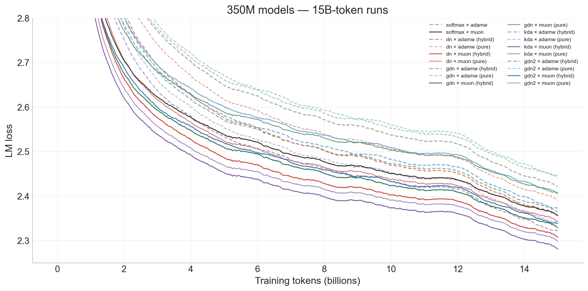
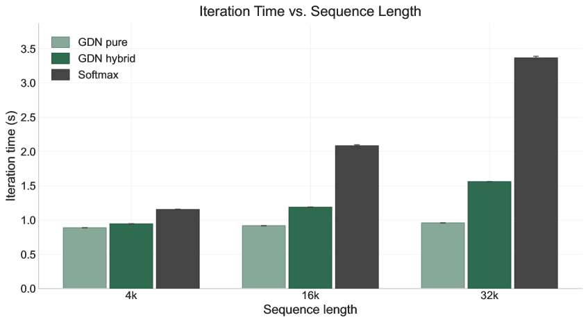

# 第 1 章 论文概述

## 1.1 论文基本信息

- **论文标题**：Linear Attention Architectures: Mechanisms, Trade-offs, and Cross-Layer Routing（线性注意力架构：机制、权衡与跨层路由）
- **作者**：Tommaso Cerruti 等（ETH Zurich）
- **发表形式**：技术报告，2026 年 7 月
- **arXiv ID**：2607.07953
- **代码仓库**：[github.com/tommasocerruti/linear-attention-architectures](https://github.com/tommasocerruti/linear-attention-architectures)（Megatron-LM fork，8813 commits）
- **许可协议**：CC-BY-4.0

## 1.2 核心问题与动机

Transformer 语言模型依赖的 Softmax 自注意力机制虽然表达能力极强——每个 token 可以从完整上下文中检索信息——但其代价是计算量随序列长度呈平方级增长（$$O(N^2)$$）。随着模型部署的上下文窗口不断扩大，这一成本成为训练和推理的主要瓶颈。**线性注意力**（Linear Attention）通过将 Softmax 核函数替换为特征映射分解，将注意力重写为对固定大小记忆矩阵的循环更新，从而实现线性时间训练和常数时间推理。

近年来的 DeltaNet、Gated DeltaNet、Kimi Delta Attention、Gated DeltaNet-2 等架构逐步缩小了线性注意力与 Softmax 注意力之间的性能差距，但缺乏一个统一的对比框架来理解它们的设计权衡。

## 1.3 四大贡献

1. **统一循环记忆符号框架**：将 Softmax 注意力与四种线性注意力变体（DeltaNet、Gated DeltaNet、Kimi Delta Attention、Gated DeltaNet-2）表达为通用的循环记忆更新形式，清晰揭示了它们在表达力、记忆衰减、擦除/写入控制等方面的差异。
2. **系统性的实证对比**：在 350M 参数 / 15B token 的设置下进行受控对比，覆盖 5 种架构 × 2 种堆叠模式（混合/纯线性）× 2 种优化器（AdamW/Muon），包含验证损失、吞吐量、序列长度缩放、大规模扩展（1.3B/40B、3B/60B）和下游评估。
3. **跨层路由机制（CLER / CLVR）**：提出轻量级线性时间跨层路径——CLER 将下层 delta-rule 写入误差注入上层；CLVR 将下层写入值注入共享残差流——验证了写入值而非写入误差是有效的跨层信号。
4. **开源 Megatron 实现**：提供基于 Megatron-LM 的训练实现，包含所有线性注意力内核和训练启动器。

## 1.4 关键结果速览

在 350M 参数 / 15B token 的受控对比中：

- **最佳验证损失**：Kimi Delta Attention + Muon 优化器 + 混合堆叠达到 **2.273**
- **最高训练吞吐量**：纯 Gated DeltaNet + AdamW 达到 **100%** 相对速度
- **跨层路由效果**：CLVR 在 Gated DeltaNet 上 Δ = -0.0103（350M/1B），-0.0059（350M/15B），-0.0019（1.3B/40B）
- **序列长度缩放**：32K 序列时，纯 Gated DeltaNet 迭代时间仅 0.96s/iter，对比 Softmax 的 3.37s/iter

## 1.5 图表总览

| 编号 | 内容 | 章节 |
|------|------|------|
| Figure 1 | CLER 跨层误差残差架构图 | 第 4 章 |
| Figure 2 | CLVR 跨层值路由架构图 | 第 4 章 |
| Figure 3 | 350M/15B 验证损失与吞吐量 Pareto 前沿 | 第 5 章 |
| Figure 4 | 学习率消融网格（各架构×优化器） | 第 5 章 |
| Figure 5 | 学习率消融等值线图 | 第 5 章 |
| Figure 6 | 序列长度迭代时间缩放曲线 | 第 5 章 |
| Table 1 | 实验设置参数 | 第 5 章 |
| Table 2 | 350M/15B 架构对比（18 行） | 第 5 章 |
| Table 3 | 大规模 DeltaNet 运行结果 | 第 5 章 |
| Table 4 | 350M 下游评估（HellaSwag/PIQA/WinoGrande） | 第 5 章 |
| Table 5 | CLER-H/CLVR 下游评估 | 第 5 章 |
|| Table 6 | CLER 验证损失对比 | 第 5 章 |
|| Table 7 | CLER-H / CLVR 验证损失结果 | 第 5 章 |
|| Table 8 | 1B token 基线对照 | 附录 |

---

# 第 2 章 研究背景：从 Softmax Attention 到 Linear Attention

## 2.1 Softmax Attention

给定查询 $$q^{(i)} \in \mathbb{R}^{d_k}$$、键 $$k^{(i)} \in \mathbb{R}^{d_k}$$ 和值 $$v^{(i)} \in \mathbb{R}^{d_v}$$（$i = 1,\dots,T$），因果 Softmax 注意力计算位置 $$i$$ 的输出为：

$$
y^{(i)} = \sum_{j \leq i} \frac{\exp\left(q^{(i)\top} k^{(j)} / \sqrt{d_k}\right)}{\sum_{\ell \leq i} \exp\left(q^{(i)\top} k^{(\ell)} / \sqrt{d_k}\right)} v^{(j)} \tag{1}
$$

当前查询与每个先前键显式比较，值通过归一化加权平均组合。这一机制表达能力极强——每个 token 原则上可以从任意先前位置检索信息。然而，显式比较也是其平方级成本的根源：训练长度为 $$T$$ 的序列需要计算 $$O(T^2)$$ 的查询-键交互矩阵，存储完整的注意力矩阵也需要 $$O(T^2)$$ 内存。

## 2.2 线性注意力的 Kernel 视角

如果非归一化注意力权重可以写成查询和键的特征映射的内积形式：

$$
\exp\left(q^{(i)\top} k^{(j)} / \sqrt{d_k}\right) \approx \phi(q^{(i)})^\top \phi(k^{(j)}) \tag{2}
$$

则对先前位置的和可以重新排列为：

$$
\sum_{j \leq i} \phi(q^{(i)})^\top \phi(k^{(j)}) v^{(j)} = \phi(q^{(i)})^\top \underbrace{\sum_{j \leq i} v^{(j)} \otimes \phi(k^{(j)})}_{\text{累积记忆}} \tag{3}
$$

括号中的求和不再依赖查询，可以随 $$i$$ 递增增量维护。查询仅与单个矩阵交互，而非所有先前 token。

## 2.3 循环记忆公式

将运行和定义为记忆矩阵 $$W^{(i)} \in \mathbb{R}^{d_v \times d_\phi}$$：

$$
W^{(i)} = \sum_{j \leq i} v^{(j)} \otimes \phi(k^{(j)}) \tag{4}
$$

线性注意力的（非归一化）输出可以写成循环形式：

$$
W^{(i)} = W^{(i-1)} + v^{(i)} \otimes \phi(k^{(i)}), \quad y^{(i)} = W^{(i)} \phi(q^{(i)}) \tag{5}
$$

每个 token 对记忆进行一次加法写入，每次输出是一个矩阵-向量乘积。每 token 代价为常数，总训练成本为 $$O(T)$$。记忆矩阵可被解释为压缩的键-值对表示，或快速权重集合。

## 2.4 线性注意力付出的代价

效率提升以性能为代价。Softmax 注意力执行逐查询归一化且具有指数核函数，因此注意力分布尖锐。而朴素加法形式的线性注意力既无学习到的衰减机制也无擦除机制——旧关联除非被间接覆盖，否则始终活跃。随着更多键-值对被写入固定大小的记忆，**关联之间的干扰**（interference）不断累积：查询本应检索一个值，却可能意外拾取相关键的虚假贡献。这是后续线性注意力变体设计要解决的核心问题。

## 2.5 Delta 规则：从加法写入到误差纠正写入

DeltaNet 及其后继者可以理解为对干扰问题的原则性回答。这些架构不是简单地将原始值 $$v^{(i)}$$ 相加到记忆，而是先问当前记忆对当前键已经预测了什么：

$$
\bar{v}^{(i)} = W^{(i-1)} \phi(k^{(i)}) \tag{6}
$$

然后只写入残差 $$r^{(i)} = v^{(i)} - \bar{v}^{(i)}$$。这将记忆更新从纯累加器转变为误差纠正写入器，赋予架构「记忆尚未知道什么」的概念。后续变体增加了从标量衰减门到通道级衰减再到分离的擦除/写入门的遗忘机制，使模型能够显式控制旧信息的衰减速率和新信息的提交。

---

# 第 3 章 五种注意力机制的统一视角

本章用统一的循环记忆符号描述五种注意力机制。为简洁起见，省略输出投影、归一化层和前馈块。在 token 位置 $$i$$，输入 $$x^{(i)}$$ 被映射为查询、键和值向量：

$$
q^{(i)}, k^{(i)} \in \mathbb{R}^{d_k}, \quad v^{(i)} \in \mathbb{R}^{d_v}
$$

对于线性注意力变体，键和查询通过特征映射 $$\phi(\cdot)$$，循环状态由矩阵 $$W^{(i)} \in \mathbb{R}^{d_v \times d_\phi}$$ 表示。我们记特征映射后的键为 $$\kappa^{(i)} = \phi(k^{(i)})$$。

$$

\kappa^{(i)} = \phi(k^{(i)}) \tag{7}
$$

输出通过查询记忆获得：

$$

y^{(i)} = W^{(i)} \phi(q^{(i)}) \tag{8}
$$

所有 DeltaNet 风格变体共享以下定义：

$$
v̄^{(i)} = W^{(i-1)} \kappa^{(i)} \quad \text{(记忆预测)} \tag{9}
$$

$$
r^{(i)} = v^{(i)} - v̄^{(i)} \quad \text{(delta-rule 残差)} \tag{10}
$$

标量门控：

$$
\alpha^{(i)} = f_\alpha(x^{(i)}) \in (0,1), \quad \beta^{(i)} = \sigma(w_\beta^\top x^{(i)}) \in (0,1) \tag{11}
$$

此处 $$\alpha^{(i)}$$ 是 token 依赖的衰减因子，$$\beta^{(i)}$$ 控制写入强度。

对于 Kimi Delta Attention 和 Gated DeltaNet-2，还有向量级遗忘门：

$$
\boldsymbol{\alpha}^{(i)} = f_{\boldsymbol{\alpha}}(x^{(i)}) \in (0,1)^{d_\phi}, \quad D_\alpha^{(i)} = \operatorname{Diag}(\boldsymbol{\alpha}^{(i)}) \tag{12}
$$

对于 Gated DeltaNet-2，还有通道级擦除门和写入门：

$$
\boldsymbol{b}^{(i)} = \sigma(W_b x^{(i)}) \in (0,1)^{d_\phi}, \quad \boldsymbol{w}^{(i)} = \sigma(W_w x^{(i)}) \in (0,1)^{d_v} \tag{13}
$$

## 3.1 Softmax Attention

标准因果注意力直接比较当前查询与所有先前键，形成归一化加权平均（公式 1）。**最优表达力**，但 $$O(N^2)$$ 成本。线性注意力变体用可增量更新的循环记忆状态替换显式注意力矩阵。

## 3.2 DeltaNet

DeltaNet 用误差纠正的 delta 规则替换朴素加法线性注意力（Yang et al., 2024）：

$$
W^{(i)} = W^{(i-1)} + \beta^{(i)} r^{(i)} \otimes \kappa^{(i)} \tag{14}
$$

输出通过共享读取规则 $$y^{(i)} = W^{(i)} \phi(q^{(i)})$$ 计算。

**核心思想**：模型不是简单地将新值加入记忆，而是先问记忆对当前键已经预测了什么，然后只写入将存储关联移动到 $$v^{(i)}$$ 所需的校正。这使更新具有选择性和键特异性。

**优点**：通过误差纠正更新改善了朴素加法存储。**局限**：没有明确的全局清除陈旧信息机制。随着干扰积累，模型可以纠正个别关联，但不能以粗略方式直接衰减先前的记忆状态。

## 3.3 Gated DeltaNet

Gated DeltaNet 在 DeltaNet 的基础上增加了学习到的标量遗忘机制（Yang et al., 2024）。在计算 delta-rule 残差之前，先前的记忆被 token 依赖的标量门 $$\alpha^{(i)}$$ 衰减：

$$
v̄_\alpha^{(i)} = \alpha^{(i)} W^{(i-1)} \kappa^{(i)} = \alpha^{(i)} v̄^{(i)} \tag{15}
$$

$$
r_\alpha^{(i)} = v^{(i)} - v̄_\alpha^{(i)} \tag{16}
$$

记忆更新：

$$
W^{(i)} = \alpha^{(i)} W^{(i-1)} + \beta^{(i)} r_\alpha^{(i)} \otimes \kappa^{(i)} \tag{17}
$$

Gated DeltaNet 保留了 delta-rule 校正，但相对于衰减版本先前记忆应用它。这给架构提供了显式的遗忘方式，有助于减少长上下文或杂乱上下文中的干扰。

**权衡**：遗忘操作是全局性的。DeltaNet 纯粹选择性（通过键特异性残差更新记忆），而 Gated DeltaNet 保持校正写入的同时引入了粗略衰减项 $$\alpha^{(i)} W^{(i-1)}$$，部分牺牲了原始 DeltaNet 的严格选择性。

## 3.4 Kimi Delta Attention

Kimi Delta Attention（KDA）保留门控 delta-rule 结构，但将标量遗忘替换为通道级遗忘（Kimi Team, 2025）。模型使用向量门 $$\boldsymbol{\alpha}^{(i)}$$ 沿着不同变换键维度以不同速率衰减。

通道级衰减调整预测：

$$
v̄_{\boldsymbol{\alpha}}^{(i)} = W^{(i-1)} D_\alpha^{(i)} \kappa^{(i)} \tag{18}
$$

残差：

$$
r_{\boldsymbol{\alpha}}^{(i)} = v^{(i)} - v̄_{\boldsymbol{\alpha}}^{(i)} \tag{19}
$$

更新：

$$
W^{(i)} = W^{(i-1)} D_\alpha^{(i)} + \beta^{(i)} r_{\boldsymbol{\alpha}}^{(i)} \otimes \kappa^{(i)} \tag{20}
$$

由于 $$W$$ 将变换键特征映射到值，对角衰减矩阵在 $$W$$ 的右侧相乘，沿键特征维度作用。这一机制可视为 Gated DeltaNet 的更精细版本：有些特征维度可以保留，其他维度则更激进地被遗忘。当 $$\boldsymbol{\alpha}^{(i)} = \alpha^{(i)} \mathbf{1}_{d_\phi}$$ 时退化为 Gated DeltaNet。

**优势**：增加了记忆控制的粒度。**局限**：活跃的 delta-rule 编辑仍然由单一标量 $$\beta^{(i)}$$ 控制——同一个门控制旧内容的移除和新内容的写入。

## 3.5 Gated DeltaNet-2

Gated DeltaNet-2（GDN-2）扩展了 Kimi Delta Attention，将标量 delta 门解耦为通道级擦除门 $$\boldsymbol{b}^{(i)}$$ 和通道级写入门 $$\boldsymbol{w}^{(i)}$$（Hatamizadeh et al., 2026）。

衰减调整后的记忆：

$$
\widetilde{W}^{(i-1)} = W^{(i-1)} D_\alpha^{(i)} \tag{21}
$$

门控擦除方向和写目标：

$$
e^{(i)} = \boldsymbol{b}^{(i)} \odot \kappa^{(i)}, \quad z^{(i)} = \boldsymbol{w}^{(i)} \odot v^{(i)} \tag{22}
$$

写入记忆的残差：

$$
r_{\text{GDN2}}^{(i)} = z^{(i)} - \widetilde{W}^{(i-1)} e^{(i)} \tag{23}
$$

记忆更新：

$$
W^{(i)} = \widetilde{W}^{(i-1)} + r_{\text{GDN2}}^{(i)} \otimes \kappa^{(i)} \tag{24}
$$

因此，GDN-2 保留了 KDA 的通道级衰减，但使活跃 delta 更新更加灵活。擦除门决定应从先前记忆中移除哪些键特征通道，写入门决定应存储哪些值通道。当 $$\boldsymbol{b}^{(i)} = \beta^{(i)} \mathbf{1}_{d_\phi}$$ 且 $$\boldsymbol{w}^{(i)} = \beta^{(i)} \mathbf{1}_{d_v}$$ 时退化为 KDA，进一步退化至 GDN。

## 3.6 架构设计空间总结

| 架构 | 遗忘机制 | 写入控制 | 擦除/写入分离 | 参数量 | 实现复杂度 |
|------|---------|---------|-------------|-------|-----------|
| DeltaNet | 无 | 标量 $$\beta$$ | 无 | 最低 | 最低 |
| Gated DeltaNet | 标量 $$\alpha$$ | 标量 $$\beta$$ | 无 | 低 | 低 |
| Kimi Delta Attn | 通道级 $$\boldsymbol{\alpha}$$ | 标量 $$\beta$$ | 无 | 中 | 中 |
| Gated DeltaNet-2 | 通道级 $$\boldsymbol{\alpha}$$ | 通道级 $$\boldsymbol{w}$$ | ✅ | 高 | 最高 |
| Softmax | — | — | — | — | — |

---

# 第 4 章 跨层路由机制

## 4.1 问题：深度堆栈中的信息稀释

深度 Transformer 堆栈中，低层提取的有用信号随着表示逐层传播而逐渐稀释。先前的方案（如 Attention Residuals、Mixture-of-Depths Attention）通过显式的跨层路径或深度注意力解决了这一问题，但直接应用于线性循环架构会部分抵消其效率优势。

本文的目标是设计一种**轻量级、线性时间的跨层信息分享路径**，在不引入新的深度注意力算子的前提下，复用 delta-rule 更新内部已产生的信号。

## 4.2 Delta-Rule 写入量

对于 DeltaNet 或 Gated DeltaNet 层 $$l$$ 和时间步 $$t$$：

$$
\kappa_{l,t} = \phi(k_{l,t}), \quad v̄_{l,t} = W_{l,t-1} \kappa_{l,t} \tag{25}
$$

$$
r_{l,t} = v_{l,t} - v̄_{l,t} \tag{26}
$$

$$r_{l,t}$$ 是需写入记忆的校正（记忆尚未吸收的值部分），$$v_{l,t}$$ 是写入值本身。两者是跨层路由的两个候选信号。

## 4.3 Cross-Layer Error Residuals（CLER）

CLER 将最邻近下层路由能力层的写入残差注入当前层的值目标：

$$
\tilde{v}_{l,t} = v_{l,t} + \Gamma_l \rho(r_{p(l),t}) \tag{27}
$$

其中 $$p(l)$$ 是最近的 delta-rule 层，$$\Gamma_l$$ 是学习到的标量，$$\rho$$ 是残差归一化（取恒等映射）。当前层随后计算：

$$
r_{l,t} = \tilde{v}_{l,t} - W_{l,t-1} \kappa_{l,t} \tag{28}
$$

CLER 是一条侧通道而非新的混合器：循环更新、门控和输出读取保持不变，混合堆叠中残差通过中间 Softmax 层传递。

*图1：CLER 将下层 delta-rule 写入误差沿侧通道注入上层值目标。实验结果证明此方案因空间不匹配而无效。*

## 4.4 Cross-Layer Value Routing（CLVR）

诊断发现 CLER 失败后，作者做了两项改动：①将路由目标从逐层值空间改为**共享残差流**（residual stream）；②将路由信号从写入误差改为**写入值**。

具体而言，对于路由能力层 $$l$$，将内部信号 $$s_{l,t}$$ 投影到模型维度并加入残差流：

$$
\varepsilon_{l,t} = P_l s_{l,t}, \quad h_{l,t} \leftarrow h_{l,t} + \varepsilon_{l,t} \tag{29}
$$

其中 $$s_{l,t} \in \mathbb{R}^{d_v}$$，$$h_{l,t} \in \mathbb{R}^{d_{\text{model}}}$$，$$P_l \in \mathbb{R}^{d_{\text{model}} \times d_v}$$ 是**零初始化**的逐层投影。零初始化使路由贡献在训练开始时为零，模型从宿主基线开始，学习是否以及如何路由。

考虑两种信号选择：
- **CLER-H**：$$s_{l,t} = r_{l,t}$$（写入误差），保留 CLER 原始动机
- **CLVR**：$$s_{l,t} = v_{l,t}$$（写入值），被证明是更有效的信号

*图2：CLVR 将下层写入值（而非写入误差）注入共享残差流，经零初始化投影后加入残差流。此方案一致优于 CLER。*

## 4.5 路由结果

Table 7 总结了 CLER-H 和 CLVR 在所有可用宿主/规模设置下的匹配比较：

| 宿主 | 参数量/token | 基线 | CLER-H Δ | CLVR Δ |
|------|-------------|------|---------|--------|
| Gated DeltaNet | 350M / 1B | 2.8331 | -0.0073 | **-0.0103** |
| Gated DeltaNet | 350M / 15B | 2.3417 | -0.0042 | **-0.0059** |
| Gated DeltaNet | 1.3B / 40B | 2.0635 | -0.0010 | **-0.0019** |
| DeltaNet | 350M / 1B | 2.8469 | -0.0047 | **-0.0119** |
| DeltaNet | 350M / 15B | 2.3347 | -0.0002 | **-0.0016** |

**两个一致发现**：(1) 将路由目标从逐层值空间转移到对齐的残差流将比较从中性/负面转为小幅正面；(2) CLVR 一致优于 CLER-H，证明写入值而非写入误差是有效的跨层信号。因为 $$v_{l,t} = r_{l,t} + v̄_{l,t}$$，写入误差 = 写入值减去记忆自身的读取值，所以路由误差仍然携带下层记忆尚未吸收的值部分，但路由完整值效果更好。

增益较小且随训练增加而递减（350M/1B 时 Δ ~ -0.010，350M/15B 时 Δ ~ -0.002 到 -0.006），说明跨层路由在较小或训练较少的循环记忆中提供的信息量更大，随着宿主增强收益递减。

控制实验确认增益来自路由的内容而非额外参数：(1) 路由层自身的隐藏状态通过相同零初始化投影 Δ ≈ -0.0014；(2) 按相同参数数扩大 GDN 基线 Δ = +0.0021——两者均远不及路由增益。

---

# 第 5 章 实验评估与分析

## 5.1 实验设置（Table 1）

| 项目 | 配置 |
|------|------|
| 数据与分词器 | FineWeb-Edu，LLaMA2 tokenizer |
| 模型规模 | 350M 参数类，深度 20-24 层 |
| 隐藏维度 | 1024，FFN 维度 2816，16 注意力头，4 查询组 |
| 序列长度与批大小 | 4096，全局批大小 128 |
| 精度与硬件 | bf16，单 GH200 节点（4 GPU，CSCS Alps） |
| Token 预算 | 主对比：350M / 15B；大规模：1.3B / 40B，3B / 60B |
| 优化器 | AdamW 和 Muon/NorMuon |
| 正则化 | 权重衰减 0.1，梯度裁剪 1.0，Adam betas 0.9/0.95 |
| 学习率调度 | WSD（Warmup-Stable-Decay） |
| 验证损失 | 保留集 FineWeb-Edu 交叉熵，越低越好 |

**堆叠模式**：
- **混合堆栈**：每三层一个 Softmax 注意力层（线性:Softmax = 2:1）
- **纯线性堆栈**：所有混合器层使用对应线性注意力规则

## 5.2 350M/15B 验证损失与吞吐量前沿（Table 2）

*图3：350M/15B 运行的验证损失与归一化吞吐量 Pareto 前沿。KDA+Muon+hybrid 达到最低损失（2.273），纯 GDN+AdamW 达到最高吞吐量（100%）。*

| 架构 | 优化器 | 堆叠 | 相对速度 | 饱和损失 | 最终损失 |
|------|--------|------|---------|---------|---------|
| Softmax | AdamW | dense | 81.7% | 2.587 | 2.413 |
| Softmax | Muon | dense | 79.7% | 2.489 | 2.349 |
| DeltaNet | AdamW | hybrid | 87.0% | 2.517 | 2.348 |
| DeltaNet | AdamW | pure | 91.9% | 2.555 | 2.382 |
| DeltaNet | Muon | hybrid | 83.8% | 2.440 | 2.299 |
| DeltaNet | Muon | pure | 89.2% | 2.476 | 2.334 |
| Gated DeltaNet | AdamW | hybrid | 90.5% | 2.517 | 2.356 |
| Gated DeltaNet | AdamW | pure | 100.0% | 2.601 | 2.433 |
| Gated DeltaNet | Muon | hybrid | 89.5% | 2.464 | 2.321 |
| Gated DeltaNet | Muon | pure | 95.0% | 2.543 | 2.397 |
| Kimi Delta Attention | AdamW | hybrid | 74.4% | 2.471 | 2.328 |
| Kimi Delta Attention | AdamW | pure | 73.6% | 2.490 | 2.347 |
| Kimi Delta Attention | Muon | hybrid | 70.9% | 2.409 | **2.273** |
| Kimi Delta Attention | Muon | pure | 68.5% | 2.427 | 2.290 |
| Gated DeltaNet-2 | AdamW | hybrid | 83.3% | 2.520 | 2.379 |
| Gated DeltaNet-2 | AdamW | pure | 81.9% | 2.601 | 2.452 |
| Gated DeltaNet-2 | Muon | hybrid | 81.3% | 2.466 | 2.345 |
| Gated DeltaNet-2 | Muon | pure | 80.7% | 2.542 | 2.415 |

**两个一致模式**：
1. **Muon 优化器在所有架构族中一致降低最终损失**。对于每一对相同的架构/堆叠组合，Muon 版本的最终损失均低于 AdamW 版本。
2. **混合堆栈的效果因架构而异**：对 DeltaNet 和 GDN，混合堆栈改善损失但降低速度；对 KDA 和 GDN-2，混合堆栈同时改善损失且速度略高于纯净堆栈。最终的选择取决于目标场景——追求最低损失选 KDA+Muon 混合堆，追求最大吞吐量选纯 GDN+AdamW。

## 5.3 学习率与优化器效应

学习率扫描（2000 步 ≈ 1.05B token）揭示优化器比较不可与学习率选择分离：

- **Muon 偏好较低学习率**（约 $$3\times 10^{-4}$$，$$10^{-4}$$ 接近且追赶中）
- **AdamW + 线性注意力偏好较高学习率**（约 $$10^{-3}$$）
- Softmax 注意力对学习率最敏感，而线性注意力架构在高学习率下更宽容

这说明单一默认学习率会扭曲架构比较：某个变体可能因为优化器/学习率配对不佳而表现较差，而非循环规则本身劣质。

## 5.4 序列长度迭代时间缩放

*图6：从 4K 到 32K token 的迭代时间测量。纯 GDN 在 32K 时仅 0.96s（对比 Softmax 的 3.37s），增幅仅 1.1×（对比 Softmax 的 2.9×）。*

| 序列长度 | Softmax | GDN Hybrid | GDN Pure |
|---------|---------|-----------|---------|
| 4K | ~1.16s | ~0.92s | ~0.87s |
| 32K | 3.37s | 1.56s | 0.96s |
| 4K→32K 增长因子 | **2.9×** | **1.7×** | **1.1×** |

纯线性循环混合器的缩放优势显著。混合堆栈部分恢复验证损失，但保留的 Softmax 层重新引入了部分序列长度成本。

## 5.5 更大规模运行（Table 3）

| 运行 | 学习率 | 规模 | 最终损失 |
|------|--------|------|---------|
| DeltaNet hybrid | 3.6e-4 | 1.3B/40B | 2.066 |
| DeltaNet pure | 3.6e-4 | 1.3B/40B | 2.085 |
| DeltaNet hybrid | 1.5e-4 | 1.3B/40B | 2.109 |
| DeltaNet pure | 1.5e-4 | 1.3B/40B | 2.063 |
| DeltaNet hybrid | 5e-4 | 3B/60B | 2.332 |
| DeltaNet hybrid | 3e-4 | 3B/60B | 1.955 |
| DeltaNet hybrid | 1.5e-4 | 3B/60B | 1.955 |

大规模运行进一步印证了学习率敏感性。3B 模型在 3×10⁻⁴ 和 1.5×10⁻⁴ 下均达到 1.955，而 5×10⁻⁴ 下损失升至 2.332。

## 5.6 下游评估（Table 4）

350M 参数/15B token 的下游评估结果（HellaSwag、PIQA、WinoGrande）：

| 规模 | 架构 | 变体 | 优化器 | HellaSwag acc | HellaSwag acc_norm | PIQA acc | PIQA acc_norm | WinoGrande acc |
|------|------|------|--------|--------------|-------------------|---------|--------------|---------------|
| 350M | GDN | hybrid | Muon | 0.3480 | 0.4158 | 0.6676 | 0.6741 | 0.5414 |
| 350M | GDN | pure | Muon | 0.3337 | 0.3978 | 0.6763 | 0.6741 | 0.4870 |
| 350M | DeltaNet | hybrid | Muon | 0.3541 | 0.4305 | 0.6681 | 0.6779 | 0.5051 |
| 350M | DeltaNet | pure | Muon | 0.3426 | 0.4133 | 0.6741 | 0.6801 | 0.5170 |
| 1.3B | DeltaNet | hybrid | Muon | 0.4277 | 0.5484 | 0.7209 | 0.7301 | 0.5572 |
| 3B | DeltaNet | hybrid | Muon | 0.4617 | 0.6063 | 0.7334 | 0.7410 | 0.5848 |

路由变体的下游评估（Table 5）：CLER-H 和 CLVR 在 HellaSwag 和 PIQA 上与基线大致可比，WinoGrande 上略有提升但单检查点差异不足以作为路由效应的独立证据。

## 5.7 CLER 验证损失（Table 6）

| 优化器 | 变体 | 最终验证损失 | Δ vs 基线 |
|--------|------|------------|----------|
| Muon | Gated DeltaNet | 2.8319 | – |
| Muon | CLER-Gated, scalar | 2.8333 | +0.0013 |
| Muon | DeltaNet | 2.8511 | – |
| Muon | CLER-DeltaNet, scalar | 2.8507 | -0.0004 |
| AdamW | Gated DeltaNet | 3.2554 | – |
| AdamW | CLER-Gated, scalar | 3.2562 | +0.0008 |
| AdamW | DeltaNet | 3.4068 | – |
| AdamW | CLER-DeltaNet, scalar | 3.4258 | +0.0190 |

Muon 下 CLER-Gated 损失略高于基线，CLER-DeltaNet 获得极小改善（<10⁻³）。AdamW 下 CLER 无改善。路径并非不活跃（各路由层的路由残差非零），但匹配轨迹几乎重叠，与空间不匹配的假设一致。

## 5.8 CLVR 结果（Table 7）

详情见第 4.5 节。核心结果：**CLVR 在所有受控配置中一致优于 CLER-H**，增益随训练增加和模型增大递减。控制实验确认增益来自被路由信号的**内容**而非额外参数。

---

# 第 6 章 代码实现与复现

## 6.1 仓库结构

代码仓库（[github.com/tommasocerruti/linear-attention-architectures](https://github.com/tommasocerruti/linear-attention-architectures)）是 Megatron-LM 的一个聚焦分支，包含：

- **megatron/**：线性注意力实现（DeltaNet、Gated DeltaNet、KDA、GDN-2 内核）
- **_research/launch/**：训练启动脚本——smoke 脚本用于环境验证，350M/1.3B/3B 完整训练脚本
- **tools/**：评估工具——`run_loglikelihood_scoring_server.py` Megatron 评分服务器
- **docker/**：环境依赖容器化配置
- **scripts/**：辅助脚本（数据准备等）

## 6.2 核心依赖

- **fla（flash-linear-attention）**：底层线性注意力内核库
- **Megatron-LM**：分布式训练框架
- **lm-eval-harness**：下游评估框架
- **pyproject.toml**：项目依赖管理

## 6.3 复现要点

启动器（launcher）是可执行源代码真理，固定了架构、优化器、token 预算、检查点格式和评估节奏。站点特定路径（tokenizer、Megatron 数据前缀、W&B 凭据、输出目录）通过环境变量提供。

使用 smoke 启动器（`fla-import-smoke.sbatch`、`transformer-pp-350m-gdn-pytorch-smoke.sbatch` 等）在完整运行前验证环境。

评估使用 Megatron 原生检查点的评分服务器，避免 HuggingFace 转换引入的差异。评估时需确认服务器日志中线性注意力和路由参数被正确恢复。

## 6.4 仓库数据

- **Stars/Forks**：信息未完整记录（GitHub 页面加载时出错，无法获取精确计数）
- **许可证**：CC-BY-4.0

---

# 第 7 章 局限性与未来方向

## 7.1 局限性

1. **统计局限性**：所有架构比较和路由比较均为**单次运行**（single-run），无种子平均，无标准差报告。小幅验证损失差异（<10⁻³ 到 10⁻²）不可作为强结论。
2. **CLVR 效果有限**：跨层值路由的增益较小（350M/15B 时 Δ ~ -0.002 到 -0.006），且随训练增加和模型增大递减。未在大规模 DeltaNet 上验证（1.3B/40B DeltaNet 残差流路由比较未报告）。
3. **架构覆盖不全**：路由仅在 DeltaNet 和 Gated DeltaNet 宿主上评估，未在 Kimi Delta Attention 或 Gated DeltaNet-2 上测试。对于 GDN-2，写入值与擦除/写入残差分离，路由哪个信号尚不明确。
4. **下游评估范围窄**：仅限 HellaSwag、PIQA、WinoGrande，可能遗漏长上下文或记忆密集型用例的关键行为。
5. **无推理吞吐量基准**：报告的序列长度缩放为训练迭代时间，未提供推理吞吐量、解码内存占用或长上下文质量测量。
6. **Attention Residuals 跨宿主效果不一致**：Attention Residuals 在 DeltaNet 上改善损失（-0.0101），在 GDN 上略增损失（+0.0030），跨宿主迁移效果不成立。

## 7.2 未来方向

1. **在 KDA/GDN-2 上评估路由**：特别是 GDN-2 解耦了擦除和写入，测试"路由写入值"这一经验法则是否推广到更丰富的宿主。
2. **关联检索任务评估**：合成键-值检索、passkey 任务、长上下文 QA、多干扰物上下文学习等场景中跨层恢复的作用更明确。
3. **推理吞吐量测量**：将训练迭代时间研究扩展为推理吞吐量、解码内存占用和长上下文质量的系统测量。
4. **多次种子运行**：获取种子平均的排名和标准差，支持统计显著性判断。
5. **注意力 Residuals 在更广宿主上的评估**：探索不同线性注意力宿主上跨层路由策略的迁移一致性。

---

# 附录：1B Token 基线对照（Table 8）

350M 参数 / 约 1B token 的早期基线：

| 基线 | 优化器 | 训练损失 | 验证损失 | 验证 PPL | ktok/s/GPU | TFLOP/s/GPU |
|------|--------|---------|---------|---------|-----------|------------|
| Softmax | AdamW | 2.9111 | 2.9019 | 18.2095 | 144.8 | 334.6 |
| Softmax | Muon | 2.7134 | 2.7240 | 15.2410 | 136.7 | 316.0 |
| Gated DeltaNet | AdamW | 2.8587 | 2.8562 | 17.3950 | 159.5 | 298.6 |
| Gated DeltaNet | Muon | 2.6965 | 2.7097 | 15.0254 | 154.8 | 289.6 |
| DeltaNet | AdamW | 2.9484 | 2.9391 | 18.8987 | 153.4 | 296.8 |
| DeltaNet | Muon | 2.6990 | 2.7137 | 15.0847 | 146.7 | 283.7 |
