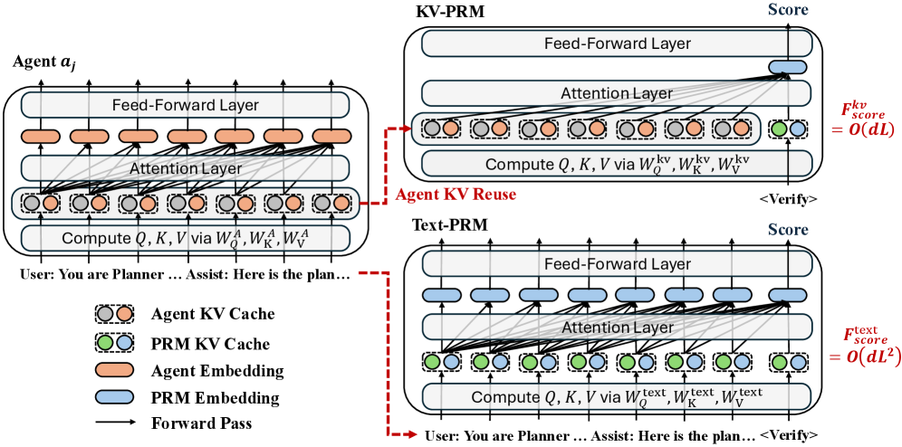
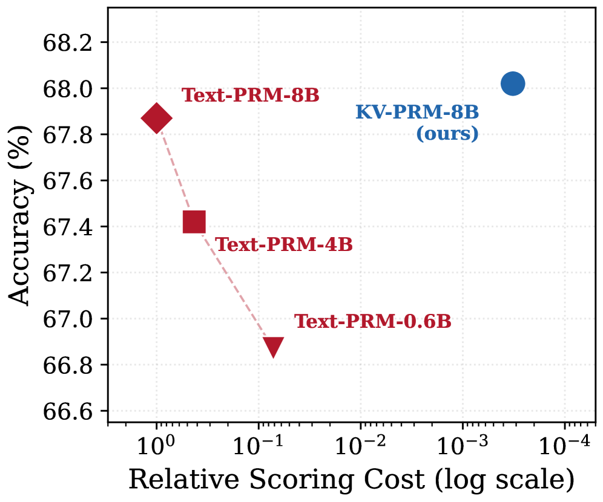
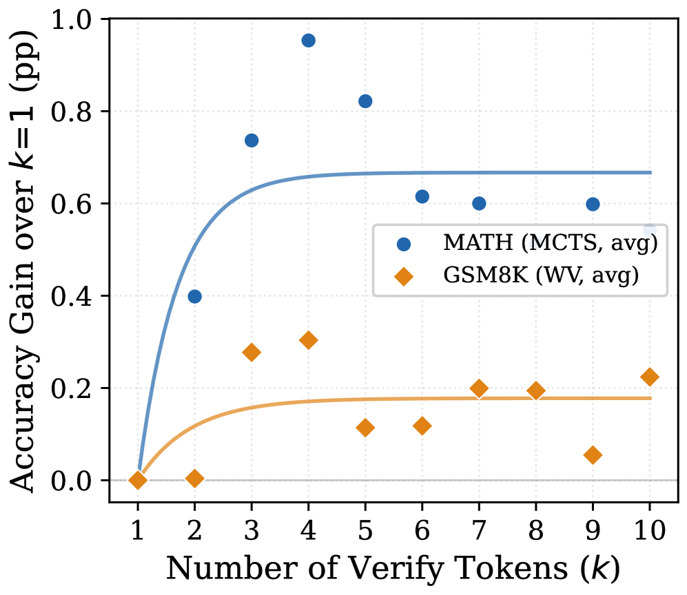
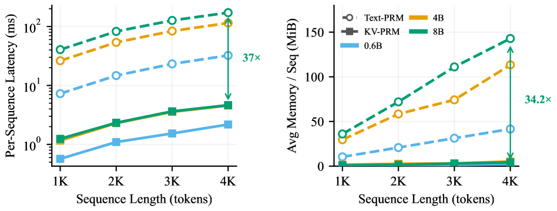

# KV-PRM: Efficient Process Reward Modeling via KV-Cache Transfer for Multi-Agent Test-Time Scaling

- **论文标题**：KV-PRM: Efficient Process Reward Modeling via KV-Cache Transfer for Multi-Agent Test-Time Scaling（KV-PRM：基于 KV-Cache 迁移的高效过程奖励建模用于多 Agent 测试时扩展）
- **作者**：Peng Kuang, Haibo Jin, Xiaoyu Han, Xiaopeng Yuan, Ye Yu, Haohan Wang（University of Illinois Urbana-Champaign）；Yanli Wang（Imperial College London）；Kaidi Xu（City University of Hong Kong）
- **arXiv ID**：2607.09153
- **发表时间**：2026-07-10
- **许可协议**：CC BY 4.0
- **代码开源**：❌ 未提供（论文及 arXiv 页面均未附代码，参考文献 [28] 仅引用了通用 Generative PRM 实现 `RLHFlow/RLHF-Reward-Modeling`，非 KV-PRM 官方代码）
- **实验模型**：Qwen3-0.6B / 4B / 8B（thinking mode 关闭），LoRA（$r=256$, $\alpha=32$）
- **Benchmark**：MATH, GSM8K, AIME 2024, AIME 2025
- **搜索算法**：Beam Search, MCTS, Weighted Voting
- **核心效率指标**：FLOPs $\sim 5{,}000\times$ 减少，延迟 $15\times \sim 37\times$ 降低，内存 $34.2\times$ 减少

---

## 第一章 论文概述与核心贡献

### 1.1 问题

Process Reward Model (PRM) 在引导 test-time scaling (TTS) 搜索时，传统 **text-PRM** 需要从零开始重新编码整个推理轨迹以输出 step-level 评分。给定长度为 $L$ 的轨迹，text-PRM 的计算量为 $O(d \cdot L^2)$（self-attention 主导），构成巨额计算瓶颈。在 Multi-Agent System (MAS) 场景中，需并行验证多个候选轨迹，text-PRM 的冗余文本重新编码使得验证成本常与生成本身的 FLOPs 相当，严重限制长上下文推理中 PRM 的应用。

### 1.2 方法

**KV-PRM** 提出 **KV-cache transfer**：直接复用生成阶段已产生的 KV cache（作为生成副产物自然存在），仅需在轨迹末尾追加单个 verify token（`"?"`），通过 LoRA 适配器处理即可完成评分，计算量降为 $O(d \cdot L)$，相对 text-PRM 实现 $O(L)$ 级别的加速比。基础模型参数 $\theta$ 冻结，仅训练 LoRA 参数 $\Delta\theta$。

### 1.3 三大贡献

1. **理论框架**：形式化证明了 KV cache 相对文本表示的信息容量优势（$\Omega(d/\log|\mathcal{V}|)$ 倍），以及验证误差可分解为 Bayes 最优误差 + 表示能力间隙，且边际信息增益随 readout 深度 $k$ 呈指数衰减，$k=1$（单 verify token）在信息-成本权衡下接近最优。
2. **KV-PRM 算法**：提出首个基于 KV-cache transfer 的 PRM 架构，将评分复杂度从 $O(dL^2)$ 降至 $O(dL)$。
3. **广泛实验验证**：在 MATH、GSM8K、AIME 2024、AIME 2025 上，跨三种模型规模（Qwen3-0.6B/4B/8B）和多种搜索算法（Beam Search、MCTS、Weighted Voting），KV-PRM 性能持平或超越 text-PRM。

### 1.4 效率与性能摘要

| 指标 | 相对 Text-PRM |
|------|--------------|
| FLOPs 减少 | $\sim 5{,}000\times$ |
| 延迟降低 | $15\times$ ~ $37\times$ |
| 内存减少 | $34.2\times$ |

在 MAS 轨迹 $L \approx 5000$ 时，单次 KV-PRM 评分仅需 4.6ms（8B 模型），而 Text-PRM 需 172.0ms。

---

## 第二章 预备知识与符号

### 2.1 多 Agent 推理系统

一个 MAS 将问题分解给 $D$ 个专业化 LLM agent $a_1, \ldots, a_D$。每个 agent $a_j$ 生成输出 $\mathbf{o}_j$，基于前序 agent 的输出和原始问题，使用 decoder-only transformer $f_{\theta}$（$N_L$ 层，每层 $n_h$ 注意力头，隐藏维度 $d$）。$L_j$ 表示 agent $a_j$ 完成后的总序列长度，最终轨迹长度 $L = L_D$。

### 2.2 Process Reward Models 与 Test-Time Search

PRM 为截至 agent 步骤 $j$ 的轨迹预测评分 $s_j \in [0, 1]$，指示最终得到正确答案的可能性。PRM 评分指导 test-time search（beam search、MCTS、weighted majority voting）选择高质量轨迹。以 beam width $W$ 和 $D$ 个 agent 步骤计算，PRM 至少被调用 $W \cdot D$ 次。

现有 PRM 均为 **text-based**：对长度为 $L_j$ 的轨迹文本 $\mathbf{x}_j$ 执行完整前向传播，每次调用成本为 $F_{\text{forward}}(L_j)$。

### 2.3 KV Cache 与计算瓶颈

自回归生成过程中，transformer 通过缓存所有先前 token 在各层的 key/value 投影避免冗余计算。生成 $L$ 个 token 后，**KV cache** $(\mathbf{K}, \mathbf{V}) \in \mathbb{R}^{N_L \times L \times d}$ 构成模型在所有层和位置上中间表示的完整记录。KV cache 是生成的**副产物**——无论是否被下游使用，它都已存在。

前向传播中长度为 $L$ 序列的主导成本为：

$$F_{\text{forward}}(L) = N_L \cdot \big(\underbrace{c_{\text{attn}} \cdot d \cdot L^2}_{\text{self-attention}} + \underbrace{c_{\text{ffn}} \cdot d^2 \cdot L}_{\text{feed-forward}}\big) \tag{1}$$

对于 MAS 中的长轨迹（$L \gg d$），self-attention 主导，每次 text-PRM 评分的成本为 $O(d \cdot L^2)$。当 PRM 与 LLM 同规模时，PRM 评分大致使系统总计算量**翻倍**。

这引出核心问题：能否将单次评分成本从 $O(dL^2)$ 降至 $O(dL)$（降低 $L\times$），而不损失评分质量？

---

## 第三章 理论基础

**Figure 1**：Text-PRM 每次评分调用需重新编码完整轨迹（$O(dL^2)$ FLOPs）。KV-PRM 复用生成阶段的 KV cache，仅通过单个 verify token 评分（$O(dL)$ FLOPs），减少 $L\times$，对典型 MAS 轨迹为三个数量级。

### 3.1 KV Cache 的表示优势

**Assumption 1 (Linear Representation Hypothesis, LRH)**：transformer 产生的隐藏嵌入 $h \in \mathbb{R}^d$ 是线性独立语义基 $\{s_1, \ldots, s_d\} \subset \mathbb{R}^d$ 的线性组合 $h = \sum_{i=1}^{d} c_i s_i$，系数 $c_i \in \{0, \pm 1\}$。

**Proposition 1 (KV Cache 的表示优势)**：设 $f_{\theta}$ 为自回归 transformer，生成过程中产生 KV cache $\mathbf{H} = (\mathbf{K}, \mathbf{V})$ 和文本 token $\mathbf{x} = \text{decode}(\mathbf{H})$。对任意目标变量 $Y$（如轨迹正确性），在 Assumption 1 下，若需通过文本无损表达长度为 $L$ 的轨迹的 KV cache 信息，至少需要：

$$m' = \Omega\left(\frac{d \cdot L}{\log|\mathcal{V}|}\right)$$

即 KV cache 每位置的信息密度为文本 token 的 $\Omega\left(\frac{d}{\log|\mathcal{V}|}\right)$ 倍。

**直觉**：隐藏状态有 $3^d$ 种可能配置（Assumption 1 下），而每个文本 token 仅能从 $|\mathcal{V}|$ 种中选择。$\text{decode}(\cdot)$ 是从 $\mathbb{R}^{N_L \times L \times d}$ 到 $\{1, \ldots, |\mathcal{V}|\}^L$ 的多对一投影，在每个位置将携带 $Y$ 不同信息的隐藏状态折叠到同一 token，因此文本必然丢失信息。由 Data Processing Inequality，$I(\mathbf{H}; Y) \geq I(\mathbf{x}; Y)$。

### 3.2 基于 KV-Cache Readout 的高效验证

**Definition 1 (Depth-$k$ Readout)**：Depth-$k$ readout $\mathcal{R}_k: (\mathbf{K}, \mathbf{V}) \mapsto s \in [0, 1]$ 通过参数化注意力函数 $f_{\psi}$，对预先存在的长度为 $L$ 的 KV cache 处理 $k$ 个 query 向量。$\mathcal{F}_k$ 表示所有具有有界参数容量的 depth-$k$ readout 的函数类。Text re-encoding 对应 $k=L$；KV-cache readout 使用 $k \ll L$。

**Definition 2 (Approximation Gap)**：对函数类 $\mathcal{F}_k$ 操作于 KV cache $\mathbf{H}$：

$$\text{Gap}(\mathcal{F}_k, \mathbf{H}) = \inf_{f \in \mathcal{F}_k} \mathbb{E}[\ell(f(\mathbf{H}), Y)] - \inf_{f} \mathbb{E}[\ell(f(\mathbf{H}), Y)]$$

$\text{Gap}(\mathcal{F}_k, \mathbf{H})$ 关于 $k$ 单调非增。

**Theorem 1 (验证误差分解)**：对任意 depth-$k$ readout $\mathcal{R}_k \in \mathcal{F}_k$：

$$\epsilon(\mathcal{R}_k) = \epsilon_{\text{Bayes}}(\mathbf{H}) + \text{Gap}(\mathcal{F}_k, \mathbf{H})$$

其中 $\epsilon_{\text{Bayes}}(\mathbf{H}) \leq \epsilon_{\text{Bayes}}(\mathbf{x})$（由 Proposition 1）。即 KV cache 的 Bayes 最优预测器可达到不高于文本的误差，误差下界由 KV cache 的信息丰富度决定；KV-PRM 的差距来自 $\mathcal{F}_k$ 对真实假设 $H$ 的逼近能力。

**Assumption 2 (Low-Rank Reward Structure)**：奖励 $Y$ 通过线性投影 $\Phi(\mathbf{H}) = W_{\phi} \cdot \text{pool}(\mathbf{H}) \in \mathbb{R}^r$ 依赖于 KV cache $\mathbf{H}$，其中 $r$ 为有效奖励维度。$\Phi(\mathbf{H})$ 协方差的奇异值满足指数衰减：$\sigma_j = O(e^{-\alpha j})$，$\alpha > 0$ 为谱衰减率。

**Theorem 2 (Readout 深度的边际收益递减)**：在 Assumptions 1 和 2 下，令 $\mathcal{R}_k \in \mathcal{F}_k$ 为 depth-$k$ readout，定义边际信息增益 $\Delta I_k = I(\mathcal{R}_k(\mathbf{H}); Y \mid \mathcal{R}_{k-1}(\mathbf{H}))$：

**(a) 指数衰减**：

$$\Delta I_k \leq C_0 \cdot e^{-\alpha \cdot n_h N_L \cdot (k-1)}$$

其中 $C_0 = \sum_{j=1}^{r} \frac{1}{2}\log(1 + \text{SNR} \cdot \sigma_j^2)$ 为可提取信息总量，$\text{SNR} = \text{Var}(Y) / \sigma_{\epsilon}^2$。

**(b) $k=1$ 接近最优**：

$$\frac{I(\mathcal{R}_1(\mathbf{H}); Y)}{I(\mathbf{H}; Y)} \geq 1 - \frac{e^{-\alpha \cdot n_h N_L}}{1 - e^{-\alpha \cdot n_h N_L}}$$

**(c) 成本-信息权衡**：

$$\frac{\Delta I_k}{F_{\text{readout}}(k, L) - F_{\text{readout}}(k-1, L)} = O\left(\frac{e^{-\alpha \cdot n_h N_L \cdot (k-1)}}{d \cdot L}\right)$$

**Remark**：Theorem 2 表明基于 KV cache 的奖励建模是成本高效的——使用单个 verify token ($k=1$) 是成本效率最优的操作点，可捕获大部分信息。由于 $k=1 \to k=2$ 的增益已随指数项急剧下降（对 Qwen3-0.6B：$n_h \cdot N_L = 448$），额外 verify token 的收益无法补偿其 $O(dL)$ 的计算开销。

---

## 第四章 KV-PRM 算法设计

### 4.1 架构：基于 KV-Cache Transfer 的评分

**架构**：KV-PRM 由基础 LLM $f_{\theta}$ 与 LoRA 适配器 $f_{\theta+\Delta\theta}$ 组成。基础模型参数 $\theta$ 冻结，仅训练 LoRA 参数 $\Delta\theta$。设 verify token $v$（`"?"`），以及两个判断 token：`"+"`（正向）和 `"-"`（负向）。

**评分过程**：agent $a_j$ 生成完成后，累积的 KV cache $(\mathbf{K}, \mathbf{V})$ 已作为生成副产物存在。KV-PRM 通过单个 verify token 前向传播（LoRA 激活）评分：

$$\mathbf{z} = f_{\theta+\Delta\theta}(v \mid \mathbf{K}, \mathbf{V}), \qquad s_j = P(+) = \text{softmax}\big([\mathbf{z}_{[-]}, \mathbf{z}_{[+]}]\big)_{1} \tag{8}$$

LoRA 适配器学习解读基础模型的 KV cache（编码完整轨迹的位置信息、注意力模式和隐藏状态交互），通过 verify token 的 logit 输出质量判断。关键是：生成时 KV cache 由基础模型在适配器**关闭**状态下产生，KV-PRM 对生成过程零开销。

**成本分析**：verify-token 前向传播处理 1 个 query token 对 $L$ 个缓存位置，跨 $N_L$ 层：

$$F_{\text{score}}^{\text{kv}} = N_L \cdot (c_{\text{attn}} \cdot d \cdot L + c_{\text{ffn}} \cdot d^2) = O(d \cdot L) \tag{9}$$

相对 text-PRM 的加速比：

$$\frac{F_{\text{score}}^{\text{text}}}{F_{\text{score}}^{\text{kv}}} = \frac{O(d \cdot L^2)}{O(d \cdot L)} = O(L) \tag{10}$$

对 $L \approx 5{,}000$ 的 MAS 轨迹，每次评分 FLOPs 减少 $\sim 5{,}000\times$。同样 $O(L)$ 倍的峰值内存减少（Text-PRM 每层需要 $O(L^2)$ attention maps，KV-PRM 仅需 $O(L)$）。在 TTS 中 PRM 被调用 $O(W \cdot D)$ 次，该单次调用减少使总验证成本相对生成可忽略不计。此时 $k=1$ 对应 readout 框架中的最大理论加速。

**推理**：KV-PRM 可直接替换 beam search、MCTS 和 weighted majority voting 中的 text-based PRM。评分机制改变（读 KV cache 替代重新编码文本），搜索算法本身不变。

### 4.2 训练流程

**训练数据生成**：使用 MCTS 在多 agent 推理过程中生成 label。对每个训练问题，运行 $R=64$ 次 MCTS rollout，每个 agent 步骤 $C=4$ 个候选。最终轨迹与真值做 exact-match 比较，产生二元奖励。反向传播通过搜索树为每个中间 agent 步骤分配 Q-value $y \in [-1, 1]$。训练数据按 (topology, execution mode) 组合分别生成。

**KV-PRM 训练**：对每个样本 $(\mathbf{x}, y)$，基础模型（适配器关闭）处理 $\mathbf{x}$ 产生 KV cache $(\mathbf{K}, \mathbf{V})$（无梯度）。然后模型（适配器开启）基于 $(\mathbf{K}, \mathbf{V})$ 处理 verify token，产生评分 $P(+)$。

损失函数为 MSE：

$$\mathcal{L}_{\text{KV}} = \text{MSE}\left(P(+), \frac{y+1}{2}\right) \tag{11}$$

仅更新 LoRA 参数 $\Delta\theta$。梯度仅流经单个 verify-token 前向传播。Text-PRM 训练需梯度检查点（gradient checkpointing）处理全序列梯度计算，而 KV-PRM 的训练更加高效。

**Algorithm 1 (KV-PRM Training)**：

- 输入：训练集 $\mathcal{D} = \{(\mathbf{x}_i, y_i)\}$，基础模型 $f_{\theta}$，LoRA 参数 $\Delta\theta$，学习率 $\eta$
- 对每个 mini-batch $\mathcal{B} \subset \mathcal{D}$：
  1. 对每个 $(\mathbf{x}, y) \in \mathcal{B}$：
     - $(\mathbf{K}, \mathbf{V}) \leftarrow f_{\theta}(\mathbf{x})$（适配器关闭，无梯度）
     - $\mathbf{z} \leftarrow f_{\theta+\Delta\theta}(v \mid \mathbf{K}, \mathbf{V})$（适配器开启，前向 verify token）
     - $P(+) \leftarrow \text{softmax}\big([\mathbf{z}_{[-]}, \mathbf{z}_{[+]}]\big)_1$
     - $\mathcal{L} \leftarrow \text{MSE}\big(P(+), (y+1)/2\big)$
  2. $\Delta\theta \leftarrow \Delta\theta - \eta \cdot \nabla_{\Delta\theta} \cdot \frac{1}{|\mathcal{B}|}\sum\mathcal{L}$（仅更新 LoRA 参数）

---

## 第五章 实验评估

### 5.1 实验设置

- **模型**：Qwen3-0.6B / 4B / 8B（thinking mode 关闭）
- **Benchmark**：MATH、GSM8K、AIME 2024、AIME 2025（exact-match accuracy + numeric equivalence checking）
- **搜索算法**：Step-level Beam Search (SBS)、MCTS、Weighted Majority Voting
- **基线**：
  1. **No PRM**（Random Sampling / Majority Voting）
  2. **Policy Log-prob**（生成器自身的 token 级对数概率排序，近乎零额外成本）
  3. **Text-PRM**（与 KV-PRM 相同的 LoRA 适配器架构、数据和训练目标，但通过重新编码完整轨迹 $[\mathbf{x}; v]$ 评分，每次调用 $O(dL^2)$ 成本。Text-PRM 训练需梯度检查点）
- **训练配置**：KV-PRM 和 Text-PRM 均使用 LoRA（$r=256$，$\alpha=32$）在 MCTS 生成标签（$R=64$ rollouts，$C=4$ candidates/step）上训练，来自 MATH 训练集
- **MAS 拓扑**：
  - **Sequential**：Reader $\to$ Planner $\to$ Solver $\to$ Verifier
  - **Hierarchical**：Math/Science/Code Agents $\to$ Task Summarizer
- **评分成本**：归一化为 Text-PRM = $1\times$

### 5.2 主结果（Sequential MAS）

**Table 1（MATH + AIME 2024，Sequential MAS）**：

| Search | Config | Scorer | MATH-0.6B | MATH-4B | MATH-8B | AIME24-4B | AIME24-8B |
|--------|--------|--------|-----------|---------|---------|-----------|-----------|
| Random | n=1 | — | 28.00 | 54.15 | 56.70 | 20.00 | 20.00 |
| Majority | n=40 | — | 34.65 | 59.20 | 60.55 | 36.67 | 33.33 |
| Beam | W=1 | Policy Log-prob | 32.50 | 58.70 | 63.70 | 23.33 | 23.33 |
| Beam | W=1 | Text-PRM | 32.75 | 62.00 | 66.62 | 26.67 | 20.00 |
| Beam | W=1 | **KV-PRM** | 31.90 | **65.55** | **67.02** | 20.00 | **30.00** |
| MCTS | n=50 | Policy Log-prob | 29.40 | 63.90 | 61.90 | 20.00 | 23.33 |
| MCTS | n=50 | Text-PRM | 35.55 | 65.95 | 68.92 | 30.00 | 36.67 |
| MCTS | n=50 | **KV-PRM** | 35.10 | **67.15** | **69.57** | **33.33** | **40.00** |
| Weighted | n=10 | Policy Log-prob | 33.75 | 58.45 | 59.95 | 30.00 | 33.33 |
| Weighted | n=10 | Text-PRM | 34.20 | 58.75 | 60.51 | 36.67 | 23.33 |
| Weighted | n=10 | **KV-PRM** | **34.40** | **59.35** | 60.46 | 33.33 | **33.33** |
| Weighted | n=200 | Policy Log-prob | 35.35 | 59.40 | 60.85 | 36.67 | 33.33 |
| Weighted | n=200 | Text-PRM | 36.05 | 59.95 | 61.26 | 36.67 | 33.33 |
| Weighted | n=200 | **KV-PRM** | **36.15** | **60.15** | 61.06 | **36.67** | **36.67** |

**Table 2（GSM8K + AIME 2025，Sequential MAS）**：

| Search | Config | Scorer | GSM8K-0.6B | GSM8K-4B | GSM8K-8B | AIME25-4B | AIME25-8B |
|--------|--------|--------|-----------|---------|---------|-----------|-----------|
| Random | n=1 | — | 50.80 | 91.28 | 91.43 | 16.67 | 20.00 |
| Majority | n=40 | — | 62.77 | 93.10 | 93.03 | 20.00 | 16.67 |
| Beam | W=10 | Policy Log-prob | 52.99 | 90.98 | 93.40 | 13.33 | 16.67 |
| Beam | W=10 | Text-PRM | 58.68 | 93.78 | 95.00 | 26.67 | 26.67 |
| Beam | W=10 | **KV-PRM** | 58.00 | 92.80 | **95.07** | **26.67** | **30.00** |
| MCTS | n=30 | Policy Log-prob | 52.92 | 89.99 | 91.13 | 13.33 | 16.67 |
| MCTS | n=30 | Text-PRM | 57.77 | 93.33 | 95.15 | 23.33 | 23.33 |
| MCTS | n=30 | **KV-PRM** | 54.74 | 92.87 | 94.62 | **23.33** | **26.67** |
| Weighted | n=20 | Policy Log-prob | 61.64 | 92.72 | 92.87 | 16.67 | 16.67 |
| Weighted | n=20 | Text-PRM | 62.40 | 93.18 | 93.18 | 13.33 | 16.67 |
| Weighted | n=20 | **KV-PRM** | **63.61** | 92.87 | 93.03 | **20.00** | **20.00** |
| Weighted | n=100 | Policy Log-prob | 63.00 | 92.80 | 92.95 | 16.67 | 16.67 |
| Weighted | n=100 | Text-PRM | 63.38 | 93.18 | 93.25 | 20.00 | 16.67 |
| Weighted | n=100 | **KV-PRM** | **63.76** | **93.18** | **93.25** | **23.33** | **16.67** |

**KV-PRM 成本**：KV-PRM 相对 Text-PRM 的成本比（评分 FLOPs）为 $1/L$，其中 $L$ 为最大平均每步轨迹长度。具体成本比因配置而异，在 MATH + Beam Search（8B）为 $1/2782$，在 MATH + MCTS（8B）为 $1/4367$，在 AIME 2024 + MCTS（8B）为 $1/3944$。

**关键结论**：
- KV-PRM 在广泛的搜索配置下匹配或超越 Text-PRM，同时评分 FLOPs 降低 $900\times$ ~ $4{,}900\times$
- 8B 模型上 KV-PRM 的最佳结果：MATH 69.57（MCTS）、GSM8K 95.07（Beam）、AIME 2024 40.00（MCTS）、AIME 2025 30.00（Beam）
- 在 AIME 等高难度 benchmark 上 KV-PRM 的增益更为显著（AIME 2024 8B MCTS: +3.33pp vs Text-PRM）

### 5.3 分析

**Figure 2 (Left)**：更小的 Text-PRM 能否缩小效率差距？以 Qwen3-8B 为生成器，比较 0.6B/4B/8B Text-PRM 与 8B KV-PRM（MATH，SBS W=2）。Text-PRM 从 0.6B 扩至 8B 收益递减且成本增加。KV-PRM 以最高准确率（68.0%）超越所有规模的 Text-PRM，成本低 $\sim 3{,}000\times$。

**Figure 2 (Right)**：更多 verify token ($k>1$) 的效果？在 Qwen3-0.6B ($n_h \cdot N_L = 448$) 上测试。准确率增益曲线被 $a(1 - e^{-c(k-1)})$ 良好拟合，与 Theorem 2(a) 预测的指数衰减形式 $e^{-\alpha \cdot n_h N_L \cdot (k-1)}$ 一致。$k=4$ 时增益已饱和，验证了 $k=1$ 近最优性（Theorem 2(b)）。且 $k=4$ 的总评分成本 $4 \cdot O(dL)$ 仍比 text re-encoding 的 $O(dL^2)$ 低 $\sim 10^3\times$。

**Figure 3 (Left)**：NVIDIA GH200 120GB GPU 上的推理延迟（对数坐标）。KV-PRM（实线）比 Text-PRM（虚线）快 1-2 个数量级，8B 模型 $L=4096$ 时达 $37\times$（KV-PRM 4.6ms vs Text-PRM 172.0ms）。

**Figure 3 (Right)**：单序列平均内存增长。KV-PRM 降低 $34.2\times$，使相同硬件可容纳更大的验证 batch。

**层次化 MAS**：KV-PRM 在 non-sequential MAS 拓扑下同样有效。

**Table 3（Hierarchical MAS）**：

| Dataset | Model | Text-PRM | KV-PRM | Δ |
|---------|-------|----------|--------|---|
| MATH | Qwen3-4B | 58.7 | **59.2** | +0.5 |
| MATH | Qwen3-8B | 60.2 | **61.0** | +0.8 |
| GSM8K | Qwen3-4B | 93.7 | **93.9** | +0.2 |
| GSM8K | Qwen3-8B | 94.2 | **94.5** | +0.3 |
| AIME 2024 | Qwen3-4B | 23.3 | **26.7** | +3.3 |
| AIME 2024 | Qwen3-8B | 23.3 | **30.0** | +6.7 |
| AIME 2025 | Qwen3-4B | 23.3 | **26.7** | +3.3 |
| AIME 2025 | Qwen3-8B | 16.7 | **20.0** | +3.3 |

MATH 上增益温和（+0.5 ~ +0.8pp），AIME 上增益显著（最高 +6.7pp），反映更难问题上 scorer 质量的更大提升空间。

---

## 第六章 KV Steering 与更广泛应用

### 6.1 方法

KV-PRM 的评分函数 $f_{\theta+\Delta\theta}$ 对 KV cache 可微——这一能力是 text-based PRM **结构上无法实现**的。KV Steering 利用这一特性：在每个 agent 交接点，对累积的 KV cache 执行梯度上升以最大化 KV-PRM 评分，然后下个 agent 再开始生成。这相当于在潜空间中对 agent 间消息进行梯度优化，无需显式搜索。

**Algorithm 2 (KV Steering)**：
- 输入：agent $a_j$ 后的 KV cache $\text{kv}_j$，步长 $\eta$，步数 $T$
- $\text{kv}^{(0)} \leftarrow \text{kv}_j$
- for $t = 0$ to $T-1$:
  - $\widetilde{\text{kv}}^{(t)} \leftarrow \text{clone}(\text{kv}^{(t)})$，设置 requires_grad = True
  - $\ell \leftarrow -\log P(+)(\widetilde{\text{kv}}^{(t)})$
  - $\text{kv}^{(t+1)} \leftarrow \widetilde{\text{kv}}^{(t)} - \eta \cdot \nabla_{\widetilde{\text{kv}}}\ell$
- return $\text{kv}^{(T)}$

### 6.2 实验结果

**Table 4（KV Steering，无搜索）**：

| Dataset | Model | No steering | KV Steering | Δ |
|---------|-------|------------|-------------|---|
| MATH | Qwen3-4B | 60.23 | **61.84** | +1.61 |
| MATH | Qwen3-8B | 60.79 | **62.00** | +1.21 |
| GSM8K | Qwen3-4B | 91.81 | **92.42** | +0.61 |
| GSM8K | Qwen3-8B | 93.86 | **94.09** | +0.23 |
| AIME 2024 | Qwen3-4B | 10.00 | **13.33** | +3.33 |
| AIME 2024 | Qwen3-8B | 13.33 | **16.67** | +3.33 |
| AIME 2025 | Qwen3-4B | 10.00 | 10.00 | +0.00 |
| AIME 2025 | Qwen3-8B | 13.33 | **16.67** | +3.33 |

**关键发现**：
- 在**无搜索**的条件下，KV Steering 持续提升准确率
- MATH：+1.6pp（4B）/ +1.2pp（8B）
- AIME 2024/2025（8B）：均 +3.3pp
- 虽然仍属初步探索，但证明 KV-native 架构为推理时优化开辟了超越搜索的全新方向

---

## 第七章 相关工作

### 7.1 Process Reward Models

PRM 为数学推理提供步骤级监督，由 Lightman et al. (2023) 开创性地证明步骤级人类反馈优于基于结果的奖励模型。Math-Shepherd (Wang et al., 2024) 使用 MCTS 自动化 PRM 标签生成。OmegaPRM (Luo et al., 2024) 进一步扩展自动化 PRM 训练。GenRM (Zhang et al., 2024) 将验证框架化为生成。**所有现有 PRM 均操作于文本表示；KV-PRM 是首个通过 KV-cache transfer 评分的 PRM，将计算成本降低了数个数量级。**

### 7.2 LLM-based Multi-Agent Systems

多 agent 系统已被探索用于辩论框架 (Du et al., 2023)、协作问题求解 (Li et al., 2023) 和结构化流水线 (Hong et al., 2024)。MASPRM (Yazdani et al., 2025) 首次为多 agent 系统引入使用 text-based 评分的 PRM。**KV-PRM 直接解决了 MASPRM 的 text-based 方法在 test-time search 中产生的计算瓶颈。**

### 7.3 KV-Cache Methods

先前工作探索了 KV cache 压缩 (Li et al., 2024)、驱逐 (Xiao et al., 2023) 和基于分页的内存管理 / PagedAttention (Kwon et al., 2023) 以实现高效推理。这些方法目标在于减少 KV cache 的**大小**或改进其**分配**；**KV-PRM 则将 KV cache 用作奖励建模的输入表示——一个根本不同的应用。**

### 7.4 Test-Time Compute Scaling

通过搜索 (Snell et al., 2024)、self-consistency (Wang et al., 2023)、tree-of-thoughts (Yao et al., 2023)、MCTS (Feng et al., 2024) 和强化学习 (DeepSeek-R1, 2025) 扩展 test-time compute 已展现持续收益。但候选评分成本——特别是长轨迹候选——得到的关注有限。**KV-PRM 直接针对这一瓶颈，在保持评分质量的同时实现 $O(L)$ 加速。**

---

## 第八章 局限性与结论

### 8.1 总结

KV-PRM 通过单个 verify-token 前向传播在生成器的已有 KV cache 上进行评分，将验证器单次调用成本从 $O(dL^2)$ 降至 $O(dL)$。理论框架证明：(1) KV cache 是比文本解码严格更丰富的表示（Proposition 1/Theorem 1）；(2) 额外 readout token 的边际信息增益指数衰减，使得 $k=1$ 接近最优（Theorem 2）。实验上，KV-PRM 在 beam search、MCTS 和 weighted voting 下跨四个 benchmark 和两种 MAS 拓扑匹敌或超越 text-based PRM，同时实现高达 $\sim 5{,}000\times$ 评分 FLOPs 减少、$37\times$ 更低延迟和 $34\times$ 更少单序列内存。KV-cache 评分的可微性还催生了 KV Steering——一种梯度驱动 agent 间消息优化的概念验证方法，对 text-based PRM 在结构上是不可能的。

### 8.2 局限性

- **架构约束**：生成器和验证器需共享相同架构，KV cache 方可直接复用
- **理论假设**：核心理论（Proposition 1、Theorem 2）依赖 Linear Representation Hypothesis（Assumption 1）和 Low-Rank Reward Structure（Assumption 2）；若实际模型偏离这些假设，结论的适用性需进一步验证
- **KV Steering 的初步性**：KV Steering 目前仅为 proof-of-concept，需更多研究以在实际场景中验证其有效性
- **训练数据分布**：训练数据通过 MCTS 在 MATH 训练集上生成，可能限制对其他领域的泛化

### 8.3 展望

作者希望本工作推动验证器设计从冗余的文本重新编码转向表示复用，并鼓励在 KV-cache 空间中进行推理时优化的进一步探索。

---

## 附录 A：训练超参数

**Table 5：KV-PRM 和 Text-PRM 的训练超参数**

| Hyperparameter | KV-PRM | Text-PRM |
|---------------|--------|----------|
| LoRA rank $r$ | 256 | 256 |
| LoRA $\alpha$ | 32 | 32 |
| LoRA dropout | 0.05 | 0.05 |
| Max sequence length | 8192 | 8192 |
| Effective global batch | 2048 | 2048 |
| Precision | bf16 | bf16 |

## 附录 B：Verify Token 细节

Verify token 为 `"?"`（token ID 由分词器确定）。判断 token 为 `"+"` 和 `"-"`。评分时提取这两个位置的 logit 并应用 softmax 得到 $P(+)$。标签从 $y \in [-1, 1]$ 映射为 $\hat{y} = (y+1)/2 \in [0, 1]$ 以匹配概率输出范围。

---

> **总结**：KV-PRM 是一种通过 KV-cache transfer 实现高效过程奖励建模的方法，在保持或超越 text-PRM 评分质量的同时，将计算成本降低了三个数量级（FLOPs $\sim 5{,}000\times$、延迟 $37\times$、内存 $34.2\times$），为 multi-agent test-time scaling 提供了可扩展的验证方案。论文的理论框架（KV cache 表示优势 + 边际信息增益指数衰减 + $k=1$ 近最优性）为 KV-cache 空间中的验证器设计提供了坚实的形式化基础。
