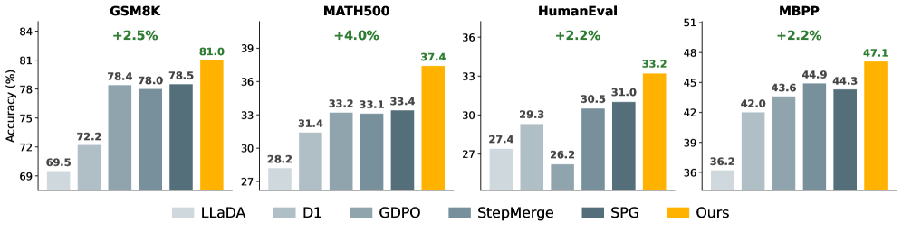

> **论文**：Mask-Aware Policy Gradients for Diffusion Language Models
> **作者**：Haran Raajesh, Kulin Shah, Adam Klivans, Philipp Krähenbühl (The University of Texas at Austin)
> **arXiv ID**：2607.15200
> **发表时间**：2026-07-18
> **会议**：COLM 2026
> **许可协议**：CC BY 4.0
> **代码仓库**：https://github.com/Haran71/mask-aware-policy-gradients（代码即将发布）

## 第 1 章 概述

### 1.1 一句话定位

本文提出一种面向掩码扩散语言模型（MDLM）的策略梯度方法，通过将MDLM的生成过程形式化为包含token预测和masking位置选择两个阶段动作的MDP，证明策略梯度自然分解为token项和masking项，联合优化两项在数学推理和代码生成基准上达到最优效果。

### 论文图表总览

| 编号 | 内容 | 章节 |
|------|------|------|
| **Figure 1** | 主结果柱状图（GSM8K、MATH500、HumanEval、MBPP） | 第 1 章 |
| **Figure 2** | MDLM生成流程概览（预测 + remasking 双阶段） | 第 3 章 |
| **Figure 3** | 双阶段动作MDP示意图 | 第 3 章 |
| **Table 1** | 主实验结果（4个基准 × 3种生成长度） | 第 4 章 |
| **Table 2** | 训练效率对比（Ours vs SPG） | 第 5 章 |
| **Table 3** | 规划任务（Sudoku、Countdown）结果 | 第 4 章 |
| **Table 4** | Dream-7B 基座泛化结果 | 第 4 章 |
| **Table 5** | DCoLT (LLaDOU) 对比 | 第 5 章 |

### 1.2 核心贡献

1. **形式化双阶段动作MDP**：将MDLM的生成过程建模为每步先预测token、再选择remasking位置的双阶段MDP，证明策略梯度自然分解为token项和masking项。
2. **概率化remasking机制**：提出基于Plackett-Luce采样的概率化remasking替代贪心top-K选择，使得remasking决策可微分，从而纳入策略梯度优化。
3. **零额外开销的位置梯度**：位置log-probability仅从模型自身的输出logits计算，无需额外参数或前向传播，兼容任何标准策略梯度算法（论文使用GSPO）。
4. **全面SOTA**：在GSM8K（87.1%）、MATH500（44.2%）、HumanEval（44.0%）、MBPP（53.4%）上超越所有现有方法，训练效率比最强基线SPG快1.9倍。

### 1.3 关键结果速览

- GSM8K：**87.1%**（生成长度512），相比StepMerge提升 +2.1pp
- MATH500：**44.2%**（生成长度512），相比StepMerge提升 +2.4pp
- HumanEval：**44.0%**（生成长度512），相比StepMerge提升 +2.9pp
- MBPP：**53.4%**（生成长度512），相比StepMerge提升 +2.5pp
- 相比SPG达到74%准确率加速 **1.9倍**（4.5h vs 8.6h）
- 在Sudoku上达到 **96.2%**（生成长度512），超越SPG的93.1%

## 第 2 章 研究背景

### 2.1 Masked Diffusion Language Models（MDLM）

MDLM（Sahoo et al., 2024; Shi et al., 2024; Ou et al., 2024）将文本生成建模为迭代去噪过程。前向过程以概率 $\alpha_t$ 将干净序列 $\boldsymbol{x}_{1:n}$ 中的每个token替换为特殊 `[MASK]` 标记：

$$
z_k^t = \begin{cases}
x_k & \text{with probability } 1 - \alpha_t \\
\texttt{[MASK]} & \text{with probability } \alpha_t
\end{cases}
$$

模型通过最大化证据下界（ELBO）学习逆过程，在给定部分掩码序列 $\boldsymbol{z}^t$ 的条件下预测原始token：

$$
\mathcal{L}_{\mathrm{ELBO}}(\boldsymbol{x};\boldsymbol{\theta}) = \mathbb{E}_{t \sim \mathcal{U}\{1,\ldots,T\}, \boldsymbol{z}^t \sim q_t(\cdot|\boldsymbol{x})} \left[ \sum_{k=1}^n \frac{1}{\alpha_t} \mathbb{1}(z_k^t = \texttt{[MASK]}) \log \pi_{\boldsymbol{\theta}}(x_k | \boldsymbol{z}^t) \right]
$$

生成时，MDLM从全掩码序列 $\boldsymbol{z}^0 = [\texttt{[MASK]}]^n$ 出发，经过 $T$ 步迭代去噪。每步包含两个子步骤：首先在所有掩码位置预测token（$\hat{\boldsymbol{z}}^t \sim \pi_{\boldsymbol{\theta}}(\cdot | \boldsymbol{z}^{t-1})$），然后从新预测的位置中选择子集 $\mathcal{U}_t$ 保持揭露，其余重新掩码（remasking）。实际中，通常使用基于置信度的贪心top-K策略选择揭露位置。

### 2.2 语言模型的强化学习

RL优化语言模型的期望回报 $J(\boldsymbol{\theta}) = \mathbb{E}_{\boldsymbol{x} \sim \pi_{\boldsymbol{\theta}}(\cdot|\boldsymbol{c})}[R(\boldsymbol{c}, \boldsymbol{x})]$，策略梯度估计为：

$$
\nabla_{\boldsymbol{\theta}} J = \mathbb{E}_{\boldsymbol{x} \sim \pi_{\boldsymbol{\theta}}} [R(\boldsymbol{c}, \boldsymbol{x}) \nabla_{\boldsymbol{\theta}} \log \pi_{\boldsymbol{\theta}}(\boldsymbol{x}|\boldsymbol{c})]
$$

对于自回归模型，$\log \pi_{\boldsymbol{\theta}}(\boldsymbol{x}|\boldsymbol{c})$ 可直接从单次前向传播获得。但对于MDLM，$\log \pi_{\boldsymbol{\theta}}(\boldsymbol{x}|\boldsymbol{c})$ 需要边际化所有能生成 $\boldsymbol{x}$ 的轨迹，因而是难解的。

### 2.3 现有MDLM强化学习方法及其局限

现有方法分为两类：

**ELBO方法**（d1、GDPO、SPG等）估计对数似然为ELBO变体，仅建模token预测分量。SPG（Sandwiched Policy Gradient）结合ELBO和EUBO边界，是目前最强的ELBO基线。

**轨迹方法**（d2/StepMerge等）在轨迹级别上重写期望回报，估计轨迹对数似然 $\log \pi_{\boldsymbol{\theta}}(\boldsymbol{z}|\boldsymbol{c})$。但现有轨迹方法将MDLM轨迹简化为仅包含token预测步骤的序列，完全忽略了remasking位置选择对轨迹概率的贡献。

本文的核心观察在于：MDLM的生成轨迹包含比自回归模型更丰富的结构——轨迹对数似然应当分解为token预测概率和remasking位置选择概率的乘积。忽略位置项意味着梯度估计可能遗漏能提升期望回报的更新方向。

## 第 3 章 核心方法

### 3.1 双阶段动作MDP形式化

本文将MDLM每步去噪过程建模为双阶段MDP：

1. **Token预测阶段**：从当前部分掩码序列 $\boldsymbol{z}^{t-1}$ 预测各掩码位置的token，得到 $\hat{\boldsymbol{z}}^t \sim \pi_{\boldsymbol{\theta}}(\cdot|\boldsymbol{z}^{t-1})$
2. **Remasking阶段**：选择哪些新预测的位置保持揭露，形成集合 $\mathcal{U}_t$，其余重新掩码

整个生成轨迹的似然为：

$$
\pi_{\boldsymbol{\theta}}(\hat{\boldsymbol{z}}|\boldsymbol{c}) = \prod_{t=1}^T
\underbrace{\pi(\hat{\boldsymbol{z}}^t|\boldsymbol{z}^{t-1},\boldsymbol{c})}_{\text{token项}}
\underbrace{p_{\text{unmask}}(\mathcal{U}_t|\hat{\boldsymbol{z}}^t,\boldsymbol{z}^{t-1},\boldsymbol{c})}_{\text{masking项}}
\underbrace{p_{\text{remask}}(\boldsymbol{z}^t|\mathcal{U}_t,\hat{\boldsymbol{z}}^t,\boldsymbol{z}^{t-1},\boldsymbol{c})}_{\text{确定变换}}
$$

其中 $p_{\text{remask}}$ 是确定性的remasking函数，不含可学习参数。

### 3.2 概率化Remasking

标准贪心top-K remasking不可微分。本文提出**概率化remasking**：从softmax分布中**不放回**地采样 $K$ 个位置作为 $\mathcal{U}_t$，采样概率正比于 $\exp(v_k^t / \tau)$，其中 $v_k^t = \log \pi(\hat{z}_k^t | \boldsymbol{z}^{t-1})$ 是模型对位置 $k$ 预测token的对数似然，$\tau$ 是温度参数。

这构成了Plackett-Luce模型：

$$
p_{\text{unmask}}(u_i = x | u_{<i}, \boldsymbol{z}^{t-1}, \hat{\boldsymbol{z}}^t) =
\frac{\mathbb{1}[z_x^{t-1} = \texttt{[MASK]} \land x \notin u_{<i}] \exp(v_x^t / \tau)}
{\sum_{j=1}^n \mathbb{1}[z_j^{t-1} = \texttt{[MASK]} \land j \notin u_{<i}] \exp(v_j^t / \tau)}
$$

当 $\tau \to 0$ 时退化为贪心top-K；$\tau > 0$ 时定义了位置子集上的恰当分布，其对数概率可纳入策略梯度优化。

### 3.3 策略梯度分解

基于概率化remasking，策略梯度估计自然分解为两项：

$$
\nabla_{\boldsymbol{\theta}} J(\boldsymbol{\theta}) = \mathbb{E}_{\hat{\boldsymbol{z}} \sim \pi_{\boldsymbol{\theta}}(\cdot|\boldsymbol{c})} \left[ R(\boldsymbol{c}, \boldsymbol{z}^T) \sum_{t=1}^T \left(
\underbrace{\nabla_{\boldsymbol{\theta}} \log p_{\text{unmask}}(\mathcal{U}_t | \hat{\boldsymbol{z}}^t, \boldsymbol{z}^{t-1}, \boldsymbol{c})}_{\text{masking梯度}}
+ \underbrace{\nabla_{\boldsymbol{\theta}} \log \pi_{\boldsymbol{\theta}}(\hat{\boldsymbol{z}}^t | \boldsymbol{c}, \boldsymbol{z}^{t-1})}_{\text{token梯度}}
\right) \right]
$$

两项均来自相同策略 $\pi_{\boldsymbol{\theta}}$，可使用任意标准策略梯度算法（本文使用GSPO）联合优化。论文在附录G中构造了一个线性策略下的有限时域MDLM问题，严格证明仅优化token梯度会在某个方向 $\boldsymbol{v}$ 上为零，而完整梯度不为零——说明忽略masking项会错过能提升目标函数的更新方向。

位置log-probability计算不需要额外前向传播：使用StepMerge近似将 $T$ 步去噪分组为 $N$ 段后，token log-probability和位置log-probability来自同一组前向传播的输出logits，masking项引入的额外计算成本为零。

### 3.4 与现有方法的区别

| 方面 | 本文方法 | ELBO方法（GDPO/SPG） | 轨迹方法（StepMerge） | DCoLT（LLaDOU） |
|------|---------|---------------------|---------------------|----------------|
| 位置选择 | 纳入策略梯度 | 忽略 | 忽略 | 纳入（但需单独训练位置头） |
| 位置概率来源 | 模型自身logits | — | — | 独立参数化位置头 |
| 额外参数 | 无 | 无 | 无 | 需训练一个独立模块 |
| 训练成本 | ~160 GPU小时 | ~360 GPU小时 | ~300 GPU小时 | ~800 GPU小时 |

与DCoLT的关键区别：DCoLT需要训练一个独立的位置选择头，而本文方法从模型自身的token log-likelihood导出位置分数，无需额外参数且训练效率更高（290步/小时 vs DCoLT的48步/小时）。

## 第 4 章 实验设置与主结果

### 4.1 实验设置

**基座模型**：LLaDA-8B-Instruct（Nie et al., 2025），未经过SFT直接进行RL训练。

**参数高效微调**：LoRA（rank $r=128$，$\alpha=64$，dropout=0.05），应用于所有注意力投影层和MLP投影层。基座模型4-bit NF4量化，所有LoRA参数和计算为bfloat16。使用Flash Attention 2。

**优化器**：AdamW（$\beta_1=0.9$，$\beta_2=0.99$，weight decay=0.1），学习率 $3 \times 10^{-6}$，常熟调度预热比0.0001，梯度裁剪0.2。

**RL算法**：GSPO（Zheng et al., 2025），组大小 $G=6$，token和position重要性权重分别裁剪。无KL正则项。每批生成后做 $\mu=12$ 次内部梯度更新，每64步同步参考模型。

**生成参数**：最大生成长度256 tokens，block size 32，128 diffusion steps。token采样温度0.9，remasking温度0.5。

**硬件**：8× NVIDIA H100-80GB GPU，DeepSpeed ZeRO-2。

**数据集**：数学推理使用GSM8K和MATH训练集（评估MATH500），代码生成使用KodCode-Light-RL-10K（评估HumanEval和MBPP）。训练步数：GSM8K约8000步，MATH约8000步，代码约6000步。

### 4.2 主结果（Table 1）

*图1：本文方法在GSM8K、MATH500、HumanEval、MBPP四个基准上与基线方法的对比。所有方法均以LLaDA-8B-Instruct为基座，生成长度128，使用LoRA微调。*

| 模型 | GSM8K(128) | GSM8K(256) | GSM8K(512) | MATH500(128) | MATH500(256) | MATH500(512) | HumanEval(128) | HumanEval(256) | HumanEval(512) | MBPP(128) | MBPP(256) | MBPP(512) |
|------|:---------:|:---------:|:---------:|:----------:|:----------:|:----------:|:------------:|:------------:|:------------:|:-------:|:-------:|:-------:|
| LLaDA-8B-Instruct | 69.5 | 77.2 | 79.8 | 28.2 | 32.4 | 34.6 | 27.4 | 35.5 | 37.8 | 36.2 | 41.2 | 40.4 |
| LLaDA-1.5 | 70.4 | 80.5 | 81.9 | 26.8 | 32.2 | 35.8 | — | — | — | — | — | — |
| d1 | 72.2 | 80.6 | 81.3 | 31.4 | 36.0 | 39.4 | 29.3 | 39.0 | 34.8 | 42.0 | 45.5 | 41.6 |
| wd1 | 74.6 | 81.5 | 83.0 | 31.0 | 37.4 | 39.0 | — | — | — | — | — | — |
| UniGRPO | 74.9 | 82.5 | 82.7 | 32.4 | 37.4 | 39.4 | — | — | — | — | — | — |
| GDPO | 78.4 | 82.8 | 85.0 | 33.2 | 39.6 | 41.4 | 26.2 | 39.6 | 39.0 | 43.6 | 50.6 | 47.1 |
| SPG w/ Mix | 78.5 | 83.9 | 84.5 | 33.4 | 40.0 | 41.8 | 31.0 | 40.6 | 41.1 | 44.3 | 50.6 | 50.8 |
| StepMerge | 78.0 | 83.3 | 84.8 | 33.1 | 39.1 | 41.2 | 30.5 | 39.9 | 40.7 | 44.9 | 50.1 | 50.9 |
| **Ours** | **81.0** | **85.9** | **87.1** | **37.4** | **42.2** | **44.2** | **33.2** | **43.1** | **44.0** | **47.1** | **52.8** | **53.4** |

本文方法在所有4个基准的12种配置下均取得最优结果。与StepMerge的对比尤为关键：两者共享相同的轨迹似然框架和K子采样，唯一的区别在于masking对数概率项的存在。2-4个百分点的持续提升证明masking梯度提供了token级优化无法捕获的有效训练信号。

### 4.3 规划任务结果（Table 3）

本文进一步在Sudoku和Countdown两个规划基准上评估，使用与SPG一致的评测协议（Sudoku使用3个few-shot示例）：

| 模型 | Sudoku(128) | Sudoku(256) | Sudoku(512) | Countdown(128) | Countdown(256) | Countdown(512) |
|------|:---------:|:---------:|:---------:|:------------:|:------------:|:------------:|
| LLaDA-8B-Instruct | 5.7 | 27.7 | 26.2 | 18.8 | 16.8 | 16.8 |
| LLaDA-1.5 | 7.4 | 26.9 | 29.0 | 21.9 | 21.1 | 21.5 |
| d1 | 7.2 | 32.5 | 29.3 | 30.9 | 30.9 | 34.4 |
| wd1 | 33.1 | 32.1 | 22.5 | 48.8 | 52.3 | 50.8 |
| UniGRPO | 59.0 | 67.0 | 62.9 | 44.5 | 43.0 | 57.0 |
| SPG w/ Mix | 82.9 | 94.0 | 93.1 | 68.8 | 70.7 | 70.3 |
| **Ours** | **84.5** | **94.9** | **96.2** | **69.3** | **71.4** | **71.0** |

在Sudoku上效果尤为显著（生成长度512时96.2%对比SPG的93.1%），与本文的核心发现一致——masking-aware优化的收益随掩码位置数增加而增大。

### 4.4 Dream-7B泛化（Table 4）

为验证方法的基座无关性，本文在Dream-7B（Gong et al., 2024）上额外评估：

| 模型 | GSM8K(128) | GSM8K(256) | GSM8K(512) | MATH500(128) | MATH500(256) | MATH500(512) | Sudoku(128) | Sudoku(256) | Sudoku(512) |
|------|:---------:|:---------:|:---------:|:----------:|:----------:|:----------:|:---------:|:---------:|:---------:|
| Dream-7B | 75.8 | 81.3 | 80.7 | 38.2 | 45.7 | 48.0 | 9.3 | 2.1 | 14.0 |
| d1 | 77.0 | 81.9 | 81.7 | 39.4 | 46.9 | 48.9 | 64.4 | 69.7 | 51.1 |
| wd1 | 76.3 | 82.4 | 82.9 | 39.5 | 47.4 | 50.5 | 29.5 | 39.2 | 30.3 |
| ESPO | 79.6 | 82.3 | 82.0 | 40.3 | 47.4 | 50.3 | 71.7 | 72.3 | 71.3 |
| SPG w/ Mix | 80.1 | 82.6 | 83.5 | 41.1 | 48.5 | 50.7 | 72.1 | 72.4 | 71.9 |
| **Ours** | **82.5** | **84.1** | **86.4** | **43.8** | **50.3** | **52.9** | **73.4** | **74.1** | **74.3** |

在所有3个基准和所有生成长度上均超越基线，最大提升达2.9个百分点，验证了方法的跨基座泛化能力。

## 第 5 章 实验结果深入分析

### 5.1 训练效率（Table 2）

本文比较了与SPG（最强ELBO基线）的训练效率，全部使用相同硬件（8× H100）和配置：

**(a) 效率总结**

| 指标 | SPG | Ours |
|------|:---:|:----:|
| 吞吐量（步/小时） | 360 | 290 |
| 收敛步数 | 6500 | 6000 |
| 最终准确率（%） | 78.5 | 81.0 |
| 达到SPG最终准确率（小时） | 18 | 15 |

**(b) 达成各目标所需时间**

| 目标准确率 | SPG（小时） | Ours（小时） | 加速比 |
|:---------:|:----------:|:----------:|:----:|
| 74% | 8.6 | 4.5 | **1.9×** |
| 75% | 9.9 | 5.8 | **1.7×** |
| 76% | 13.4 | 10.0 | 1.3× |
| 77% | 15.9 | 11.8 | 1.3× |
| 78% | 17.2 | 14.0 | 1.2× |
| 79% | — | 16.5 | — |
| 80% | — | 18.3 | — |

虽然本文方法的每步吞吐量较低（290 vs 360步/小时，因为轨迹估计器每次优化需要更多前向传播），但位置感知梯度在更少的步数内收敛到更高的准确率。两个方法在3个随机种子上的最终准确率差异不超过0.2个百分点，因此这些差异不来自随机波动。

### 5.2 推理Block Size消融

本文比较了不同推理block size（32、64、full sequence）下生成长度为256时的准确率。所有方法均以block size 32训练：

| 模型 | Block 32 GSM8K | Block 32 MATH500 | Block 64 GSM8K | Block 64 MATH500 | Full GSM8K | Full MATH500 |
|------|:-------------:|:---------------:|:-------------:|:---------------:|:---------:|:-----------:|
| LLaDA-8B-Instruct | 77.2 | 32.4 | 78.6 | 33.2 | 23.9 | 17.8 |
| LLaDA-1.5 | 80.5 | 32.2 | 81.0 | 35.4 | 41.4 | 20.4 |
| d1 | 80.6 | 36.0 | 80.9 | 37.6 | 57.5 | 22.6 |
| wd1 | 81.5 | 37.4 | 82.5 | 37.4 | 56.7 | 25.0 |
| GDPO | 82.8 | 39.6 | 82.5 | 39.4 | 58.0 | 30.8 |
| SPG w/ Mix | 83.9 | 40.0 | 84.2 | 40.9 | 68.4 | 34.2 |
| StepMerge | 83.3 | 39.1 | 83.5 | 40.2 | 66.1 | 33.0 |
| **Ours** | **85.9** | **42.2** | **86.3** | **43.1** | **72.2** | **37.4** |

本文方法在所有block size上均超越基线，且差距随block size增大而扩大。对SPG的领先从+2.0（block 32 GSM8K）增长到+4.3（full sequence GSM8K），对StepMerge从+2.6增长到+4.4。这验证了随着扩散窗口扩大，位置选择的重要性增加：更大的block在每步呈现更多掩码位置，增加了remasking顺序的多样性，放大了masking-aware优化带来的收益。

### 5.3 与DCoLT的对比（Table 5）

LLaDOU（DCoLT，Huang et al., 2025）与本文共享「remasking顺序应纳入策略」的高层洞见，但在实现上有本质区别：DCoLT需要训练一个独立的位置选择头，而本文方法直接从模型token log-likelihood导出位置分数。

| 方法 | GSM8K(128) | GSM8K(256) | GSM8K(512) | 吞吐量（步/小时） | GPU小时 |
|------|:---------:|:---------:|:---------:|:--------------:|:-------:|
| DCoLT (full replay) | 80.4 | 84.3 | 86.2 | 48 | ~800 |
| DCoLT (w/ StepMerge) | 77.1 | 80.1 | 82.3 | 280 | ~800 |
| **Ours** | **81.0** | **85.9** | **87.1** | **290** | **~160** |

在StepMerge匹配条件下，本文超越DCoLT约5个百分点。即使DCoLT使用完整轨迹反向传播（full replay），本文方法在更低计算成本下取得可比或更优的准确率。效率优势来自两方面：无需训练额外参数（位置分数从现有logits直接获取），且初始位置信号即有用（无需从零学习）。

## 第 6 章 局限性与展望

### 6.1 局限性

1. **仅评估了LLaDA-8B-Instruct和Dream-7B两个基座**：方法在更大规模MDLM（如LLaDA-13B及以上）上的表现尚未验证。
2. **位置梯度的理论最优性未证明**：虽然论文证明了token-only梯度可能遗漏改进方向，但未证明本文的分解方式是最优的。
3. **仅使用GSPO作为RL算法**：位置梯度与其他RL算法（如GRPO、PPO）的兼容性有待检验。
4. **代码仓库暂为空仓**：论文声称代码即将发布，但目前不可用，限制了可复现性。

### 6.2 延伸阅读

- **LLaDA**（Nie et al., 2025）：首个大规模纯扩散语言模型，本文的基座模型，证明了扩散LLM可接近自回归性能。
- **SPG**（Wang et al., 2026）：当前最强的ELBO基线，结合ELBO和EUBO边界进行策略梯度估计。
- **StepMerge/d2**（Wang et al., 2025a）：轨迹方法的代表，将去噪步分组简化轨迹对数似然估计。
- **DCoLT/LLaDOU**（Huang et al., 2025）：首个将位置选择纳入策略的工作，但需独立位置头。
- **GSPO**（Zheng et al., 2025）：本文使用的RL优化算法，通过序列级裁剪改进GRPO。
