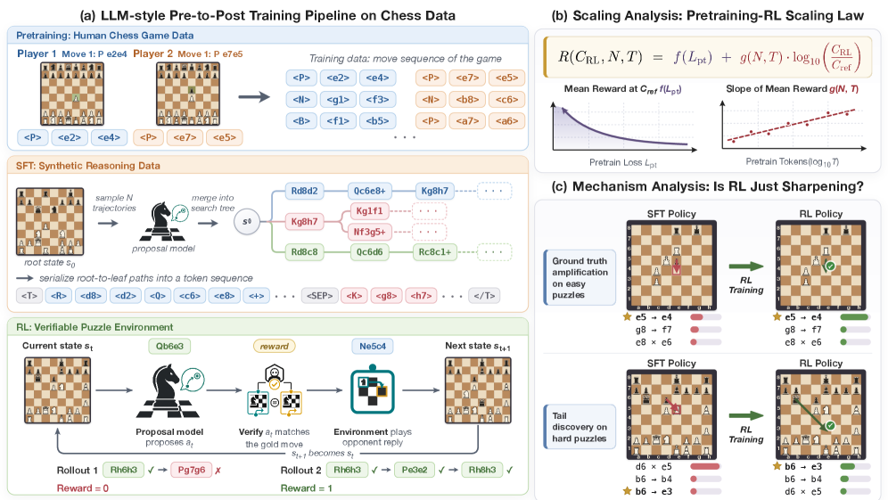
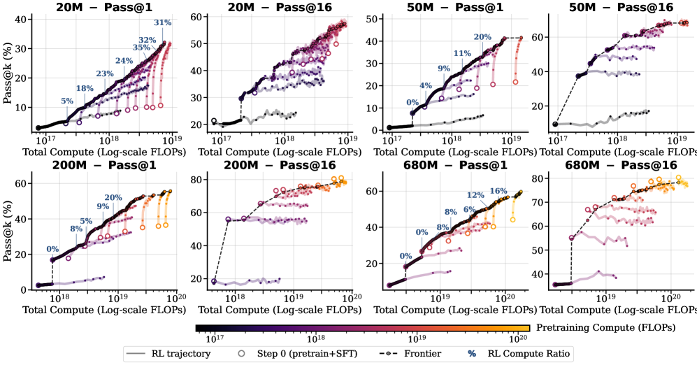
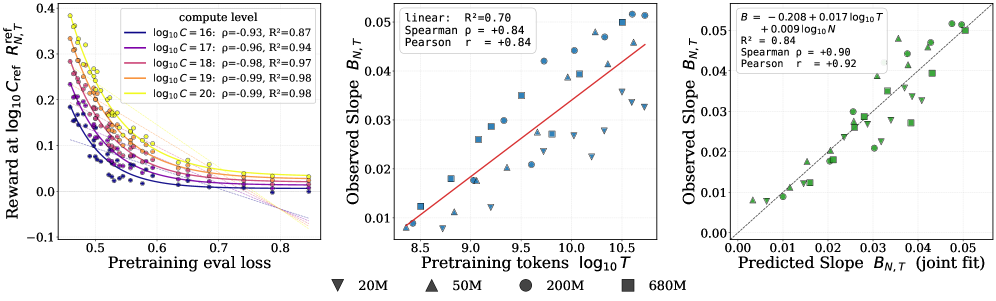
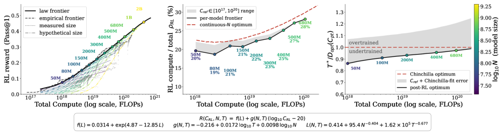
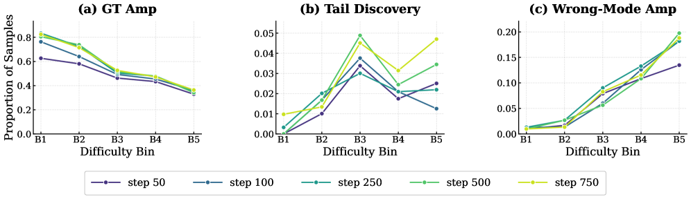
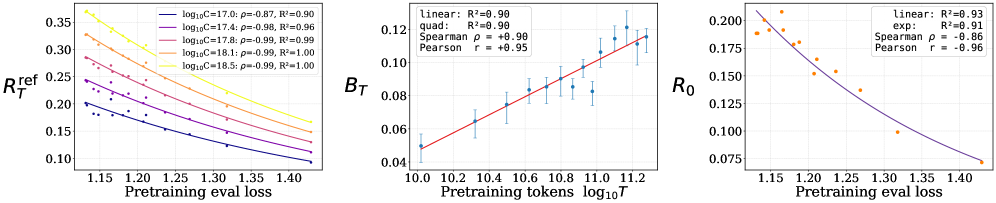

---
> **论文**：Understanding Reasoning from Pretraining to Post-Training
> **作者**：Jingyan Shen, Ang Li, Salman Rahman, Yifan Sun, Micah Goldblum et al. (New York University / Modal Labs / UCLA / UIUC / Columbia University)
> **arXiv ID**：2607.16097
> **发表时间**：2026-07-17
> **许可协议**：CC BY 4.0
> **代码仓库**：https://github.com/pavelslab-nyu/pre2post-chess
> **模型与数据**：https://huggingface.co/collections/pavelslab-nyu/pre2post-chess

## 第 1 章 概述

### 1.1 一句话定位

本文通过国际象棋这一受控测试平台，系统研究了 LLM 预训练如何影响后续 RL 后训练的缩放行为与策略变化，建立了预训练-RL 联合缩放定律，揭示了 RL 在不同难度任务上截然不同的作用机制——简单任务上放大已有能力，困难任务上挖掘潜在能力但也会强化错误。

### 论文图表总览

| 编号 | 内容 | 章节 |
|------|------|------|
| **Figure 1** | 整体框架图：预训练→SFT→RL 三阶段流程与推理链构造 | 第 3 章 |
| **Figure 2** | 预训练-RL 计算最优前沿 | 第 4 章 |
| **Figure 3** | RL 缩放曲线：预训练损失与后 RL 性能 | 第 4 章 |
| **Figure 4** | 外推计算最优前沿 | 第 4 章 |
| **Figure 5** | RL 策略变化分类 | 第 5 章 |
| **Figure 6** | 数学领域迁移结果 | 第 6 章 |

### 1.2 核心贡献

1. **受控推理测试平台**：在国际象棋领域完整复现了 LLM 的预训练→SFT→RL 标准流水线，训练 5M 到 1B 参数的模型，提供精确的步级可验证奖励和全面可控的训练数据。这是首个在该规模下系统研究预训练-RL 交互的受控设置。

2. **预训练-RL 联合缩放定律**：首次定量刻画了预训练与 RL 之间的相互作用——后 RL 性能可通过预训练损失预测（Spearman ρ=0.93-0.99），RL 奖励曲线的斜率与预训练 token 数近似线性正相关（Pearson r=+0.84）。将该定律与 Chinchilla 缩放律结合，可评估任意超参数配方 (N,T,C_RL) 的性能。

3. **RL 策略变化机制**：RL 并非简单地锐化 SFT 策略。在简单谜题上主要放大已有正确走法；在困难谜题上既能从低概率区域挖掘出正确走法，也会强化错误走法。这解释了 RL 改善 pass@1 但不一致改善 pass@k（k>1）的现象。

4. **跨领域迁移验证**：在 1B OLMo-2 模型的数学域实验中观察到相同的预训练-RL 缩放结构，表明发现的规律具有跨领域泛化性。

### 1.3 关键结果速览

| 指标 | 结果 |
|------|------|
| 模型规模范围 | 5M – 1B 参数（10 种规模） |
| 预训练语料 | 54B token（Lichess 2022 Blitz/Rapid 人类对弈数据） |
| 训练配置扫描 | 36 种预训练-RL 组合组合，涵盖 11 个计算预算等级 |
| 预训练计算量范围 | 6.5×10¹⁶ – 6.5×10¹⁹ FLOPs |
| 最优 RL 占比（20M 模型） | 5%（低预算）→ 32%（高预算），前沿上单调增长 |
| 预训练损失 → 后 RL 性能 | Spearman ρ=0.93→0.99（随 RL 计算量增加而增加） |
| RL 斜率 vs 预训练 token 数 | Pearson r=+0.84（log T 与斜率线性正相关） |
| 最优策略变化（简单谜题） | 正确放大（Ground-truth amplification）主导 |
| 最优策略变化（困难谜题） | 尾部分布挖掘 + 错误强化并存 |
| 数学域迁移验证 | 1B OLMo-2, 14 检查点（10B-200B token） |
## 第 2 章 研究背景与动机

### 2.1 预训练与 RL 的计算分配之辩

LLM 训练的标准流水线由大规模预训练（pretraining）和后续微调（SFT）与强化学习（RL）组成。随着模型规模持续增长，两个关于计算投资方向的观点开始分化：

- **预训练先验观**：扩大模型规模、训练数据和计算量，以产生更强的基座模型（Kaplan et al., 2020; Hoffmann et al., 2022）。核心依据是预训练缩放定律显示损失随计算量单调下降。
- **经验/RL 观**：通过 RL 从环境交互和结果反馈中学习，激发或发展超越直接模仿的能力。这一观点的极端例证是 AlphaZero——它完全移除了模仿冷启动，通过自我对弈学到了远超人类水平的策略（Silver et al., 2017）。

然而，对 LLM 推理而言，纯经验路线尚不现实——模型动作空间巨大，随机初始化策略的奖励极其稀疏。因此 RL 总是从预训练先验出发。核心问题是：**固定计算预算应如何在预训练和 RL 之间分配？**

### 2.2 RL 作用机制的争议

围绕 RL 对预训练策略的具体影响，现有工作存在明显分歧：

- **锐化假说**（Yue et al., 2025）：RL 主要锐化（sharpen）基座模型已偏好的推理模式。当 pass@k 的 k 足够大时，基座模型可与 RL 调优模型匹敌甚至超越，说明 RL 并未引入新知识。
- **组合假说**（Yuan et al., 2025）：RL 将预训练技能组合成全新的技能，即真正**发现**了新的推理能力，并非简单的锐化。
- **混合行为**（Sun et al., 2025）：两种行为都存在，在某些问题上出现顿悟（grokking）转变，另一些问题上则彻底失败。
- 这些争议直接影响到计算分配决策：若 RL 仅锐化，应多投资预训练；若 RL 能发现新能力，应多投资 RL。

### 2.3 现有研究的瓶颈

在自然语言 LLM 上研究这些问题面临三重困难：

1. **计算成本**：系统扫描预训练和 RL 计算量并做消融实验，在前沿模型上极度昂贵
2. **归因困难**：大规模异质语料库使得难以将行为变化归因于预训练还是 RL
3. **可观测性不足**：最终答案正确性无法揭示推理步骤的具体行为

### 2.4 国际象棋作为受控测试平台

本文选择国际象棋作为研究这些问题的受控环境：

- **紧凑动作空间**：81 token 词表，每一步可枚举所有合法走法
- **可验证奖励**：走法质量可通过棋局引擎（如 Stockfish）精确验证，每个推理步都有 ground truth
- **数据可控**：人类对弈数据充裕且可按玩家 Elo、棋局时长等维度精确控制
- **计算可行**：5M-1B 规模的模型对计算量变化足够敏感，可测量出性能差异

本文选择国际象棋作为研究这些问题的受控环境：

- **紧凑动作空间**：81 token 词表，每一步可枚举所有合法走法
- **可验证奖励**：走法质量可通过棋局引擎（如 Stockfish）精确验证，每个推理步都有 ground truth
- **数据可控**：人类对弈数据充裕且可按玩家 Elo、棋局时长等维度精确控制
- **计算可行**：5M-1B 规模的模型对计算量变化足够敏感，可测量出性能差异
---
## 第 3 章 框架：以国际象棋为推理测试平台

*图1：整体框架。预训练阶段从 Lichess 人类对弈数据中学习走法分布；SFT 阶段通过合成推理链进行微调，推理链由一系列候选游戏续接路径的树结构序列化构成；RL 阶段在可验证谜题上进行 GRPO 优化。*

### 3.1 棋步编码

按照 Zhang et al. (2024) 的方法，每步棋编码为 4 个 token：

$$\\langle\\texttt{piece}\\rangle;\\ \\langle\\texttt{source}\\rangle;\\ \\langle\\texttt{destination}\\rangle;\\ \\langle\\texttt{flag}\\rangle$$

其中 ⟨flag⟩ 标记升变（promotion）、王车易位（castling）、吃过路兵（en passant）、将军（check）或将杀（checkmate）等特殊情况。词表大小为 |𝒱| = 81。任何有效前缀唯一确定一个棋盘局面。

### 3.2 预训练：人类对弈数据学习

收集 **Lichess 2022 年 Blitz 和 Rapid** 人类对弈数据，构建 54B token 的预训练语料库，涵盖从新手到大师的广泛玩家强度和棋局结局。使用标准的下一 token 预测目标训练自回归策略。语料可按玩家 Elo 和棋局长度等维度灵活子采样。

### 3.3 SFT：合成推理链构造

与传统棋类模型中附加外部搜索算法（MCTS、beam search）不同，本文让模型在上下文中生成推理链，模拟 LLM 的 Chain-of-Thought。

**推理链构造步骤**：

1. 给定初始局面 s₀，从提议策略 p_{θ_prop}（来自预训练模型）采样 K 条续接路径 τ₁,…,τ_K
2. 通过公共前缀合并为树结构，得到 m ≤ K 条根到叶路径 τ̃₁,…,τ̃_m
3. 深度优先序列化为推理链：

$$r = \\texttt{<T>}\\ \\tilde{\\tau}_1\\ \\texttt{<sep>}\\ \\tilde{\\tau}_2\\ \\texttt{<sep>}\\ \\cdots\\ \\tilde{\\tau}_m\\ \\texttt{</T>}$$

4. 训练目标为拼接序列 w = (r, τ^⋆)，其中 τ^⋆ 是最优解路径，对手走法 token 被掩码

这一设计的关键优势：推理链来自模型自身分布（而非外部搜索），弥补了无外部搜索时 pretraining-only 模型缺乏规划能力的空白。

### 3.4 RL：可验证奖励下的策略优化

从 SFT 策略出发，在谜题环境上使用二元结果奖励：

$$R(\\zeta, s_0) = \\mathbf{1}[a_1=a_1^\\star, \\dots, a_H=a_H^\\star]$$

只有每一步都正确才获得奖励 1。优化算法为 GRPO（Shao et al., 2024）。

### 3.5 实验设置总览

| 参数 | 值 |
|------|-----|
| 预训练语料 | 54B token, Lichess 2022 Blitz/Rapid |
| 模型架构 | Qwen3 密集（dense）架构 |
| 模型规模 | 10 种：5M/10M/20M/32M/50M/100M/200M/410M/680M/1B |
| 谜题数据 | 156K 质量过滤谜题，5 档难度 B1（最易）到 B5（最难） |
| 评估集 | 1,480 战术谜题（B1-B4 聚合，B5 保留作难度分层分析） |
| 数据隔离 | 预训练语料、谜题训练、评估集在局面级别互不重叠 |
| RL 步数 | 1,000 – 5,000 步（参考：50M 模型 2,000 步约 160 H200 GPU-hours） |

### 3.6 策略空间到走法空间的映射

论文的一个重要技术细节是「诱导走法策略」（induced move policy）的定义。预训练模型走法得分为 token 序列概率的乘积:

$$\tilde{\pi}_{\theta_{\mathrm{pre}}}(a|s) = \prod_{j=1}^{|\tau(a)|} p_{\theta_{\mathrm{pre}}}(x^{(a)}_j|s,x^{(a)}_{<j})$$

对于 SFT 和 RL 模型，则需要在推理链上边际化:

$$\tilde{\pi}_\theta(a|s) = \sum_r \pi_\theta(r) \cdot \tilde{\pi}_\theta(a|s,r)$$

实践中通过 128 次蒙特卡洛采样估计边际分布，为后续机制分析提供基础。

### 3.7 与标准 LLM 流水线的类比

本文的 chess 框架与标准 LLM 流水线形成精确对应：

| Chess 框架组件 | LLM 流水线对应 |
|---------------|---------------|
| 4-token 棋步编码 | BPE/Unigram tokenization |
| Lichess 人类对弈序列 | 自然语言预训练语料 |
| 合成推理链（树结构 CoT） | Chain-of-Thought prompting |
| 谜题环境 + 二元奖励 | RLVR / 可验证奖励 |
| GRPO 优化 | 同 LLM 后训练标准算法 |

这一类比使本文的发现对 LLM 社区具有直接参考价值——chess 平台上的定量规律很可能在自然语言场景中以类似形式出现。

论文的一个重要技术细节是「诱导走法策略」（induced move policy）的定义。预训练模型走法得分为 token 序列概率的乘积，SFT 和 RL 模型则需要在推理链上边际化：

$$\\tilde{\\pi}_\\theta(a|s) = \\sum_r \\pi_\\theta(r) \\cdot \\tilde{\\pi}_\\theta(a|s,r)$$

实践中通过 128 次蒙特卡洛采样估计边际分布，为后续机制分析提供基础。
---
## 第 4 章 缩放定律与计算最优前沿

### 4.1 预训练缩放行为

在 11 个计算预算（6.5×10¹⁶ 到 6.5×10¹⁹ FLOPs）和 10 种模型规模上扫描 IsoFLOP 曲线。每个 IsoFLOP 曲线固定总计算量，遍历不同参数-数据比例。主要发现：

- 固定 FLOPs 下存在**最优参数-token 分配**，该最优与验证损失、下游 pass@1 和 pass@16 紧密吻合
- 验证损失的函数形式拟合符合 Chinchilla 缩放定律
- SFT 对比发现：有推理链的 SFT 改善所有 pass@k（k=1,8,16），无推理链的仅改善 pass@1
- 更强预训练检查点始终对应更高 SFT 后性能，且排序在全计算范围内一致

### 4.2 RQ1：预训练-RL 计算最优分配

*图2：固定总计算预算下的预训练-RL 分配前沿，展示 RL 计算比例沿前沿的演变。*

在 4 种模型规模（20M/50M/200M/680M）上，从 IsoFLOP 扫描中选择 8-11 个预训练检查点，固定 SFT 配方后进行 1,000-5,000 步 RL。计算量用 FLOPs 统一度量（详细估算见附录 D）。

主要发现：

- **RL 强烈依赖初始化质量**：前沿初期倾向高预训练比例（低 RL 比例），说明早停开始 RL 无法补偿弱初始化
- **预训练边际回报递减**：随总预算增长，前沿上预训练比例下降，RL 占比上升
- **量化示例**：20M 模型 RL 计算占比从前沿低端的 5% 增长到高端的 32%
- **pass@16 行为分化**：小模型（20M）pass@16 随 RL 训练明显改进，但大模型 pass@16 近乎持平甚至下降

### 4.3 RQ2：RL 缩放预测

*图3：预训练损失与后 RL 性能的关系，显示从预训练损失可准确预测 RL 产出。*

采用一阶泰勒展开近似 sigmoid RL 缩放律在非饱和区间：

$$R_{N,T}(C) = R^{\\mathrm{ref}}_{N,T} + B_{N,T}(\\log_{10}C - \\log_{10}C_{\\mathrm{ref}})$$

其中 B_{N,T} 为局部斜率（每 10× RL 计算量带来的固定性能增量）。

**关键发现**：

1. **预训练损失 → 后 RL 性能**：给定 RL 计算量 C 下的 pass@1 与预训练验证损失强相关。Spearman 相关性从 ρ=0.93（低 RL 计算量，C=10¹⁶）增至 ρ=0.99（高 RL 计算量，C=10²⁰）。该关系用非线性拟合优于线性拟合。

2. **RL 斜率 → 预训练 token 数**：B_{N,T} 与 log₁₀T 的 Pearson r=+0.84，与 log₁₀(T/N) 也正相关。联合模型（用 log₁₀T 和 log₁₀N 两者预测斜率）取得最低 RMSE 和最高 R²。其中 log₁₀T 的系数大于 log₁₀N，说明预训练数据量是主要因素。

3. **联合缩放定律**：结合 Chinchilla 损失预测 L(N,T)，可评估假想配方 (N,T,C_RL)。

### 4.4 计算最优前沿外推

### 4.5 缩放定律的局限性

作者审慎地指出几个拟合局限：

1. **局部线性近似**：对数线性拟合仅在非饱和 RL 区间有效，不应外推为 RL 改进无界
2. **双源误差**：严格外推场景下需用 Chinchilla 从 (N,T) 预测损失 L 再预测 RL 性能，复合误差较大
3. **g(N,T) 噪声大**：RL 斜率的不确定性远大于参考奖励，可能反映优化器细节、SFT/RL 数据差异等未建模因素
4. **数据密度**：前沿分析在观测点附近最可靠，不应认为相同指数在分布外任意远仍然成立

*图4：外推计算最优前沿。结合 Chinchilla 最优与联合缩放定律得出的 RL 占比增长趋势。*

在 13 种模型规模（20M-2B）和 260 个总计算预算（10¹⁷-10²¹ FLOPs）上，对每种规模扫描 400 种候选分配。结果确认：

- 计算最优 RL 占比随总计算量增加而单调增长
- 预训练 token 分配与 Chinchilla 最优无显著偏离（T^⋆ / D_opt(C_pt) ≈ 1）
- 留一法交叉验证显示拟合很好地预测了未参与训练的 RL 轨迹

---
## 第 5 章 RL 策略变化机制分析

### 5.1 RL 如何改变走法策略

*图5：RL 策略变化分类。左：简单谜题（B1-B2）以正确放大为主；右：困难谜题（B4-B5）出现尾部分布挖掘和错误强化。*

在走法空间分析策略变化（top-k=3, ϵ_tail=0.05）。定义为诱导走法策略（induced move policy），通过对 128 条推理链蒙特卡洛采样估计边际分布。

**五类策略变化**：

| 类别 | 描述 | 条件 |
|------|------|------|
| 正确放大 | 正确走法已在 top-3 中，概率进一步增加 | 最有利于性能提升 |
| 尾部分布挖掘 | 正确走法概率 < 0.05，被提升到 top-3 | 困难谜题上的「发现」模式 |
| top-k 修正 | 中等概率正确走法被提升到 top-3 | 中间过渡情况 |
| 正确走法降级 | 原 top-3 的正确走法被降级 | 性能退步 |
| 错误强化 | 正确走法不在 top-3，初始 top-1 错误走法被强化 | 最有害的模式 |

**不同难度上的差异模式**：

- **B1-B2（简单）**：以正确放大为主——RL 锐化了 SFT 已知道正确走法
- **B4-B5（困难）**：尾部分布挖掘和错误强化共存——RL 既发现新正确走法也强化已有错误
- 这一差异解释了 pass@1 提升但 pass@16 未见一致性改善——困难谜题上 RL 引入了噪声

**RL 策略 ≠ 功率变换**：RL 并非 SFT 策略的简单温度缩放：

- 全局功率缩放系数 α^* 从 RL_50 的 1.05 增加到 RL_750 的 1.35，显示平均锐化
- 但 ExplainedSharp 仅 0.17-0.49（中位数），R² 约 0.56-0.68——说明很大一部分变化不能用统一锐化解释
- 各状态的斜率（β）变异大（IQR 0.99-1.38），说明 RL 以状态依赖的方式重塑策略

### 5.2 RL 如何改变 CoT 推理动态

对推理链的结构分析表明 RL 训练带来以下变化：

- **搜索广度扩展而非深度**：宽度/深度比和分支因子增加，但最大搜索深度保持平缓
- **走法质量提升**：模型自己的走法和预测的对手走法质量均提高，提高幅度走法侧更大
- **正确走法信息流增强**：模型更可能在 CoT 中提及正确走法，更愿意承诺最佳候选
- **搜索系统化程度提高**：生成搜索迹与严格 DFS 序列化顺序的一致性降低，出现更多回溯

**持续弱点**：5 步以上的深搜索难恢复——说明当前 RL 更擅长改善候选生成和选择，而不是提升长程搜索能力。

### 5.3 对训练策略的启示

这些机制发现对实际训练有直接影响：

- 在简单任务上，RL 的锐化效应意味着较少的 RL 训练即可收敛——这部分不需要大量计算
- 在困难任务上，RL 同时挖掘和强化，意味着简单增加 RL 步数不能解决困难问题——需要考虑更精确的奖励设计或困难样本重加权
- pass@16 的分化表明大规模采样的边际收益随 RL 训练递减——当 pass@1 趋近饱和时，应优先改善 pass@16 而非继续增加 RL 计算
——说明当前 RL 更擅长改善候选生成和选择，而不是提升长程搜索能力。

---
## 第 6 章 数学领域迁移验证

### 6.1 实验设计

*图6：1B OLMo-2 数学领域实验结果，印证了相同的预训练损失→后 RL 性能预测关系。*

为验证发现不限于国际象棋，在 1B 参数 OLMo-2 语言模型上进行数学推理迁移实验：

**预训练**：在 200B token 混合语料（70% Nemotron-CC-Math-v1 + 30% Dolma3）上训练单一主运行，线性学习率调度 + 恒定预热。使用 5B Dolma3 token 在不同位置做学习率退火，产生 14 个检查点（10B–200B token）。

**SFT**：NuminaMath-CoT 数据集上 1 epoch（859,490 样本，约 0.46B token）

**RL**：GRPO 在 24.9K 问题混合训练集（GSM8K + MATH + DeepScaler）上优化

**评估**：500 题分布内验证集 + GSM8K/MATH 测试集。pass@1 由 16 次采样/问题在温度 0.7 下估计。

| 超参数 | 预训练 | SFT | RL (GRPO) |
|--------|--------|-----|-----------|
| 峰值学习率 | 4×10⁻⁴ | 1×10⁻⁵ | 1×10⁻⁶ |
| 学习率调度 | WSD（预热+常数） | cosine | constant |
| 全局批次 | 512 seq (≈2.1M tok) | 512 样本 | 128 提示×8 |
| 序列长度 | 4096 | 4096 (截断) | 512 提示 / 3584 回答 |
| 权重衰减 | 0.033（embedding 除外） | — | — |
| 训练步数 | 95,368 步 | 1,679 步 | 3,000 步 |

### 6.2 迁移结果

数学域结果与 chess 发现定性一致：

- 后 RL 性能与预训练损失强相关：相同 RL 计算下，更长预训练的检查点（即更低预训练损失）获得更高的 pass@1
- RL 奖励曲线斜率随预训练 token 数近似线性提高
- 在 GSM8K 和 MATH 测试集上均观察到相同规律

### 6.3 跨领域模式比较

Chess 和数学两个完全不同领域中的一致性结果表明：预训练通过塑造损失景观（loss landscape）来影响 RL 后训练的效率和质量。当预训练数据更多时，模型获得更好的初始表征，使 RL 梯度更新更高效。这与「覆盖度」理论（Chen et al., 2025）的预测一致。

| 维度 | Chess 框架 | 数学域 (OLMo-2 1B) |
|------|-----------|-------------------|
| 模型规模 | 5M-1B | 1B |
| 预训练数据 | 54B 棋步 token | 200B 数学文本 token |
| SFT 数据 | 合成推理链 | NuminaMath-CoT |
| RL 算法 | GRPO | GRPO |
| 核心规律 | 预训练损失预测后 RL 性能 | 与 chess 定性一致 |
| 验证方式 | 引擎验证 + 精确走法匹配 | pass@1（16 采样） |

这表明论文建立的预训练-RL 缩放结构具有跨领域普适性，从棋类任务到数学推理任务，相同的定量关系在受控实验中出现。

---
## 第 7 章 局限性与未来方向

### 7.1 局限性

1. **领域差异**：国际象棋与自然语言之间存在本质差异——小词表（81 token）、明确验证、不涉及世界知识和语言流畅性。缩放指数分类比例应理解为受控环境中的规律，而非对语言模型的定量预测。

2. **奖励设计限制**：谜题环境使用唯一指定解和二元奖励，相比语言任务中的部分学分或开放式奖励是一种受限验证形式。

3. **规模上限**：模型最大 1B 参数，在更大规模（如 7B+）上的缩放趋势（如最优预训练比例下降）可能需要验证。

4. **推理链格式**：特定树结构序列化可能影响 CoT 演化动态，不同格式可能产生不同结果。

5. **缩放定律限定**：局部对数线性近似不应外推为 RL 无界改进的证据。g(N,T) 的噪声远大于 f(L)，存在额外未建模的变化来源。留一法验证需要观测到的损失值，实际外推还需通过 Chinchilla 从 (N,T) 预测损失，复合误差更大。

### 7.2 未来方向

1. **动态训练策略**：预训练-RL 联合缩放定律可帮助决定何时从预训练切换至 RL。由于弱预训练检查点上的 RL 增益有限，而纯 RL 也有错误强化的副作用，固定两阶段配方可能并非最优，可探索交错训练策略。

2. **减少错误强化**：改进 pass@16 需要方法减少困难谜题上的错误强化、扩展正确解的支持范围，而非仅锐化当前策略。

3. **跨域扩展**：将框架扩展到定理证明、程序设计等更多领域，验证缩放结构的普适性。

4. **合成数据与自我对弈**：该受控环境也可用于研究合成数据设计、自我对弈、transcendence 和弱到强泛化等更广泛的课题。

### 7.3 相关文献定位

本文在三条研究线间建立连接：

- **RL for Reasoning**（DeepSeek-R1, Tulu 3, DAPO, SimpleRL）：现有研究主要通过 benchmark 对比验证 RL 有效性，而本文深究了 RL 如何依赖预训练基础并改变策略行为。

- **Scaling Laws**（Kaplan, Chinchilla, Roberts 2026, Khatri 2025）：现有预训练缩放律将下游使用视为给定，后训练缩放律将预训练初始化为给定。本文首次填充了之间的空白——预训练如何改变 RL 缩放曲线。

- **计算分配**（Qi 2025, Bansal 2026）：现有研究主要定性描述阶段间 tradeoff，本文首次定量建模了预训练-vs-RL 计算分配问题。

