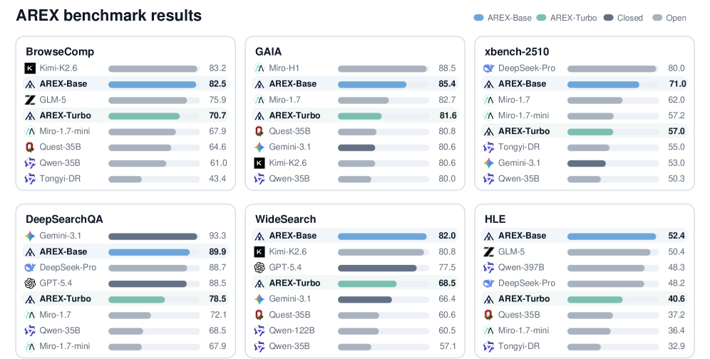
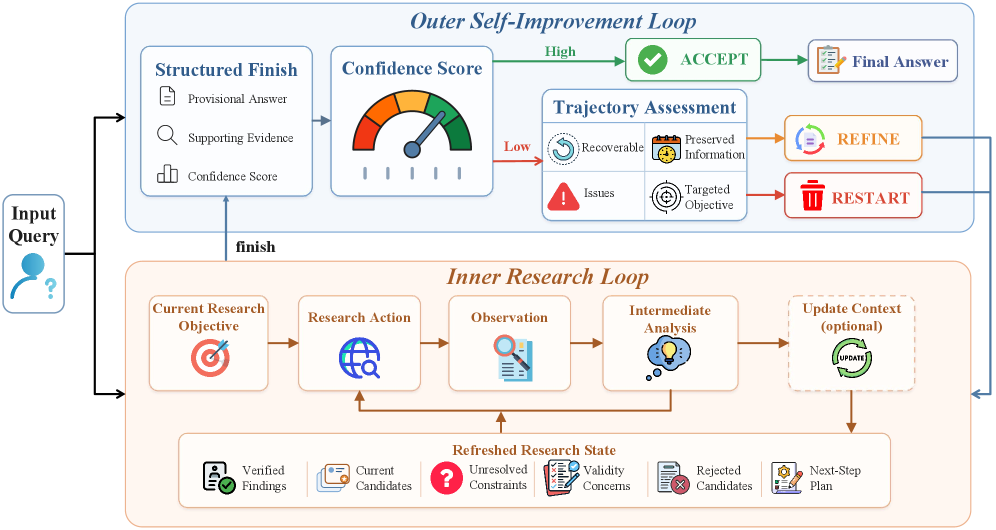
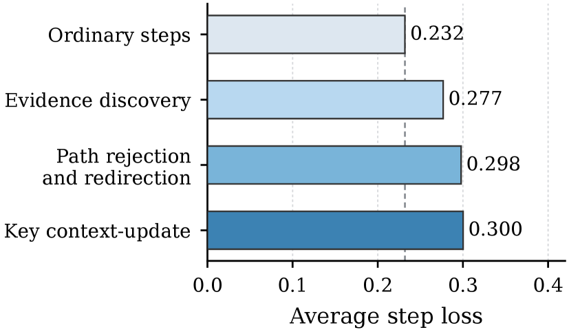
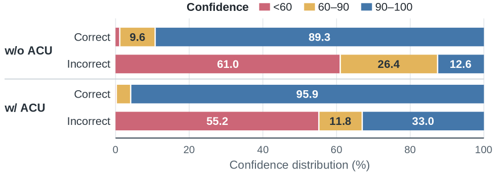

> **论文**：AREX: Towards a Recursively Self-Improving Agent for Deep Research
> **作者**：Shuqi Lu, Chaofan Li, Kun Luo, Zhang Zhang, Hui Wang, Hongwang Xiao, Zheng Liu (BAAI 北京智源人工智能研究院) 等
> **arXiv ID**：2607.21461
> **发表时间**：2026-07-24
> **Model Weights**：https://huggingface.co/collections/BAAI/arex
> **Homepage**：https://vectorspacelab.github.io/arex-model/

## 第 1 章 概述

### 1.1 一句话定位

AREX 提出了一种**递归自我改进**（Recursively Self-Improving, RSI）的深度研究代理框架，通过内层研究循环和外层自我改进循环的交替运行，将部分验证的中间答案转化为更精确的下一轮研究目标，在 BrowseComp、DeepSearchQA、WideSearch 等 6 个深度研究基准上以 122B-A10B MoE 规模（仅 10B 激活参数）达到与前沿闭源模型竞争的性能。

### 论文图表总览

| 编号 | 内容 | 章节 |
|------|------|------|
| **Figure 1** | AREX 双层递归 RSI 架构总览 | 第 3 章 |
| **Figure 2** | AREX 框架详细示意图（内层循环 + 外层循环） | 第 3 章 |
| **Figure 3** | 置信度分数分布（ACU + 外层循环的协同效果） | 第 5 章 |
| **Figure 4** | 关键步骤与普通步骤的损失对比 | 第 5 章 |
| **Table 1** | 6 个基准的主实验结果 | 第 5 章 |
| **Table 2** | 自主上下文更新（ACU）行为分析 | 第 5 章 |
| **Table 3** | 递归自我改进消融（ACU × 外层循环） | 第 5 章 |
| **Table 4** | 训练组件消融实验 | 第 5 章 |
| **Table 5** | 自我蒸馏探索（附录） | 第 5 章 |

### 1.2 核心贡献

1. **RSI 形式化框架**：将多约束深度研究建模为"发现-验证不对称"驱动的递归过程。发现满足多约束的答案代价高昂，但验证候选答案可分解为逐约束检查。AREX 利用这一不对称性，将部分验证结果转化为下一轮的研究目标。

2. **双层循环架构**：内层研究循环（搜索/浏览/证据采集/暂定答案构建）+ 外层自我改进循环（逐约束审计，根据置信度执行 Accept/Refine/Restart 三选一决策）。验证不再是最终过滤器，而是研究状态之间的转换算子。

3. **自主上下文更新（ACU）工具**：模型自学习的上下文压缩机制，将交互历史压缩为紧凑的"改进状态"，保留已验证证据（72.1%）、未解决约束（95.5%）、被拒绝候选（81.5%）和下一步计划（96.4%），无需外部模型介入。

4. **多阶段训练管道**：渐进式多轮能力训练（浏览密集型→推理密集型→混合整合）→ 关键步骤聚焦监督 → Step-aware 强化学习。关键步骤（证据发现/路径重定向/上下文更新）的损失比普通步骤高 19-29%，表明全轨迹监督不足以学好这些决策点。

5. **两个模型变体**：AREX-Turbo（4B 密集）和 AREX-Base（122B-A10B MoE），均为 Qwen3.5 骨干。

### 1.3 关键结果速览

- AREX-Base 在 **BrowseComp** 上达 82.5%，超越 Qwen3.5-397B（78.6%），与 DeepSeek-V4-Pro（83.4%）和 Gemini-3.1-Pro（85.9%）差距在 3 pp 以内
- **GAIA** 达 85.4%，超越 Kimi-K2.6（80.6%）和 Qwen3.5-397B（83.5%），与 Gemini-3.1-Pro（80.6%）拉开差距
- **WideSearch-en** 达 82.0%，为所有评估模型中的最佳结果
- **DeepSearchQA** 达 89.9%，超越 GPT-5.4（88.5%）和 DeepSeek-V4-Pro（88.7%）
- **HLE (tool)** 达 52.4%，与 Opus-4.6（53.0%*）接近，超越 DeepSeek-V4-Pro（48.2%）
- ACU 贡献 11.8 pp 增益，外层循环贡献 11.1 pp 增益，二者协同贡献 22.9 pp
- 关键步骤监督贡献 8.4 pp（对比随机步骤回放），Step-aware RL 贡献 3.1 pp（对比标准 GRPO）

*图1：AREX 的双层 RSI 架构。内层研究循环执行搜索/浏览/证据整合，输出结构化结果（答案+证据+置信度）；外层自我改进循环基于置信度阈值决策 Accept/Refine/Restart，将未解决约束转化为下一轮研究目标。*

## 第 2 章 研究背景与动机

### 2.1 深度研究的核心挑战

当前的 AI 深度研究系统普遍面临三个关键挑战：

**多约束耦合难**：一个有效的研究答案通常需要同时满足多个约束条件。例如回答"某模型在数学推理和代码生成上均优于 DeepSeek-V4-Pro，且被至少两篇 ICML 2026 论文引用"需要同时验证模型性能、对比关系、时间范围、来源权威性等多重条件。单次搜索难以满足全部约束。

**发现-验证不对称**：从庞大的搜索空间中找到一个满足所有约束的候选答案代价高昂，但逐个验证候选答案的每个约束往往要简单得多。现有系统主要在一个搜索轨迹内延长推理步数（deepresearch、searchr1、webdancer），但这仅是量的扩展而非质的改进——早期错误可能持续存在、已排除方向可能被重新探索、部分正确的答案可能被过早接受。

**长程研究的稀疏信用分配**：在超过 100 步的研究轨迹中，大部分步骤是常规操作（搜索、翻页、记录），仅少量步骤真正决定了研究的成败（发现关键证据、纠正错误方向、解决矛盾结论）。全轨迹等权重训练会稀释这些决策点的学习信号。

### 2.2 现有系统的局限性

当前主流深度研究系统（Search-R1、WebDancer、MiroThinker、Tongyi-DeepResearch）主要从三个方向改进：

| 方向 | 代表性系统 | 局限 |
|------|-----------|------|
| 工具使用监督 + 合成轨迹 | Search-R1, WebSailor | 强化单轨迹内的探索，但无法系统性识别未解决约束 |
| 推理时扩展 | DeepResearch, Beyond Ten Turns | 延长搜索但不保证正确方向，早期错误可能持续 |
| 验证式排序 | MiroThinker, Zeng et al. 2025 | 将验证作为最终过滤器或局部动作批评，未作为研究轮次间的转换算符 |

AREX 的关键洞察是：**验证不应只是筛选最终答案的过滤器，而应定义研究轮次之间的转换**。通过将部分验证的中间答案转化为"已验证证据+未解决约束"的形式，下一轮研究可以精准定位剩余不确定性。

## 第 3 章 AREX 架构设计

### 3.1 整体框架

AREX 采用 Qwen3.5-4B 作为 Turbo 变体、Qwen3.5-122B-A10B 作为 Base 变体的骨干模型。系统由两个层次化的循环构成：

*图2：AREX 框架。内层研究循环在 128K token 上下文窗口内执行搜索/浏览/验证/更新；外层循环基于置信度分数决策是否接受、精炼或重启。*

**内层研究循环**（Inner Research Loop）：给定初始研究目标 q(1)，模型执行搜索/浏览动作、整合返回证据、更新轨迹状态，直到目标被充分满足。随后调用 `finish` 工具输出结构化结果 r(k) = (y(k), ℰ(k), s(k))，其中 y 为暂定答案，ℰ 为支持证据和文档标识符，s∈[0,100] 为置信度分数。

**外层自我改进循环**（Outer Self-Improvement Loop）：接收结构化结果后，基于置信度阈值 τ 执行三选一决策：
- **Accept**（s ≥ τ）：接受当前答案
- **Refine**（s < τ 且轨迹可恢复）：保留有效发现 𝒫，识别剩余问题 ℐ，生成新目标 q(k+1)
- **Restart**（s < τ 且轨迹不可恢复）：丢弃完整轨迹，从原始问题重新开始

### 3.2 自主上下文更新（ACU）

长程研究中的关键挑战是交互历史持续膨胀——累计了已验证证据、失败查询、猜测性假设、重复观察和过时计划。保留全部历史会稀释注意力，直接截断可能丢失重要证据。

AREX 提供了 `update_context` 工具来解决此问题。给定当前轨迹 h_t(k)，该工具生成压缩的"改进状态" z_t(k) = fθ(h_t(k))，包含已验证结论及其来源标识符、当前候选、未解决约束、有效性质疑、被拒绝候选和下一步计划。更新后，模型不再需要完整历史 h_t(k)，而仅需该状态加上后续步骤。

更新后的有效上下文为：
- h̄_t(k) = z_τ(k) ⊕ [(m_i(k), a_i(k), o_i(k))]_{i=τ+1}^t（有更新时）
- h̄_t(k) = h_t(k)（无更新时）

模型自主决定何时调用 update_context——解决有意义的子问题后、排除主要候选后、协调矛盾证据后、或改变研究计划时。该工具可在内层循环中多次调用或不调用。

### 3.3 结构化答案外化

当当前目标被充分探索后，模型调用 `finish` 工具输出结构化结果 r(k) = Fθ(h̄_Tk(k)) = (y(k), ℰ(k), s(k))。置信度分数 s(k) 反映了答案的完备性、一致性、来源可靠性和时间有效性。与完整轨迹不同（可能含废弃方向、过时计划和原始工具响应），r(k) 仅保留外层循环评估所需的答案级信息。

### 3.4 外层循环决策规则

外层循环的完整决策规则为：

$$d^{(k)} = \begin{cases}\text{Accept}, & s^{(k)}\geq\tau \\ \text{Refine}, & s^{(k)}<\tau\land v^{(k)}=1 \\ \text{Restart}, & s^{(k)}<\tau\land v^{(k)}=0\end{cases}$$

其中 v(k) ∈ {0,1} 指示当前轨迹是否可恢复。Refine 时，下一轮研究从刷新状态 h_0(k+1) = Refresh(h̄_Tk(k), 𝒫(k), ℐ(k)) 初始化；Restart 时，从原始问题重新开始。整个过程由最大递归轮次数（默认为 5）限制，超时返回最高置信度答案。

## 第 4 章 训练数据构建与训练管道

### 4.1 递归研究任务综合

为了训练 AREX 执行递归研究，论文构建了一个专门的训练数据集，包含三大类任务：

1. **浏览密集型问题**：需要跨多源信息综合（如"比较三篇论文中某模型在不同基准上的性能"）
2. **推理密集型问题**：涉及多步规划或演绎推理
3. **科学文献问题**：需要整合学术论文信息

构建流程：先提取目标答案 y 并识别关联约束集合 𝒞(y) = {c1, c2, ..., cn}，然后将约束转化为间接描述（需要多跳搜索的抽象表述），生成最终查询 x = f(y, 𝒞')。每个任务必须满足三个条件：答案不可从查询直接推导、每个约束可验证、联合约束唯一标识答案。

### 4.2 教师轨迹采集与质量控制

使用强教师模型在相同的工具和研究环境中采样轨迹 τ_i ∼ π_teacher(τ|x)。质量控制包括三层过滤：
1. 仅保留有意义的迭代研究轨迹（排除直接猜测、忽略观察的轨迹）
2. 验证工具交互的有效性
3. 证据可追溯性验证——最终答案必须可从收集的证据重建

仍不满足置信度阈值 s_conf < τ_conf 的轨迹也被移除。

### 4.3 多阶段 Agentic Mid-training

训练分为两个主要阶段：

**第一阶段：渐进式多轮能力训练**
1. 先训练浏览密集型多轮轨迹——迭代搜索、网页阅读、证据获取、查询重构
2. 再训练推理密集型数据——长程思考、多步演绎、假设验证
3. 发现过度推理专业化会削弱浏览能力 → 引入混合整合阶段

**关键步骤聚焦监督**：
通过高精度基于规则的检测器识别三类关键步骤：
- 证据发现：首次工具调用返回答案相关证据
- 路径重定向：模型排除错误假设并转向新方向
- 关键上下文更新：调用 update_context 保存已验证证据

步骤级损失分析发现，关键步骤的平均损失（0.277-0.300）显著高于普通步骤（0.232），相对高出 19-29%。论文据此构建关键步骤训练集 𝒦，仅在关键步骤上应用监督信号 ℒ_key。

### 4.4 Step-aware 强化学习

标准 GRPO 对整个轨迹分配序列级优势，然而长程研究轨迹中的不同步骤扮演着截然不同的角色。论文采用层次化步归一化和关键步骤奖励塑形：

**层次化策略优化**：对每条轨迹内的 assistant 步骤进行几何平均归一化（$$\rho_{i,j}(\theta)=\exp\left(\frac{1}{L_{i,j}}\sum_{k=1}^{L_{i,j}}\log r_{i,j,k}(\theta)\right)$$），然后先对轨迹内的步骤取平均、再对 rollout 组内的轨迹取平均，防止长轨迹主导目标。

**步骤奖励塑形**：复用 mid-training 的关键步骤标注作为辅助 shaping 信号。最终步级优势定义如下：

$$A_{i,j} = A^{out}_i + \lambda_{key}\tilde{B}_{i,j}$$

其中 $$\tilde{B}_{i,j} = \mathbb{I}[R_i > 0] \cdot B_{i,j}$$（仅在轨迹成功时应用关键步骤奖励）。最终优化目标结合层次化步级策略损失和 KL 散度惩罚。

## 第 5 章 实验评估

### 5.1 实验设置

**基准**：6 个基准覆盖四个互补的搜索增强推理评估维度：
- **BrowseComp** 和 **DeepSearchQA**：深度研究（多步检索、查询重构、证据聚合、答案综合）
- **GAIA** 和 **xbench-2510**：代理任务完成（信息搜索与规划/工具使用/多步推理的协调）
- **WideSearch-en**：广泛覆盖检索与综合（大搜索空间）
- **HLE (tool)**：高水准推理（带网络搜索和计算工具）

**评估协议**：统一长程搜索代理接口（search, visit, update_context, finish 工具）。每 ep 最多 300 内层研究步和 5 个外层循环。报告指标：WideSearch-en 为 Item-F1，DeepSearchQA 为 F1 分数，其余基准为准确率。

### 5.2 主实验结果

**Table 1：6 个基准的主结果**

| 模型 | BrowseComp | GAIA | xbench-2510 | DeepSearchQA | WideSearch-en | HLE (tool) |
|:-----|:---------:|:----:|:----------:|:----------:|:----------:|:--------:|
| **前沿模型** | | | | | | |
| GPT-5.4 | 82.7 | – | – | 88.5 | 77.5 | 52.1* |
| Opus-4.6 | 83.7 | – | – | 91.3 | 77.5 | 53.0* |
| Gemini-3.1-Pro | 85.9 | 80.6 | 53.0 | 93.3 | 66.4 | 51.4* |
| **开源模型** | | | | | | |
| GLM-5 | 75.9 | 70.0 | – | – | 69.8 | 50.4 |
| Kimi-K2.6 | 83.2 | 80.6 | 90.0 | 92.5 | 80.8 | 54.0* |
| DeepSeek-V4-Flash | 73.2 | – | 69.0 | 90.6 | 76.4 | 45.1 |
| DeepSeek-V4-Pro | 83.4 | – | 80.0 | 88.7 | 78.0 | 48.2 |
| Qwen3.5-35B | 61.0 | 80.0 | 50.3 | 68.5 | 57.1 | 47.4 |
| Qwen3.5-122B | 63.8 | 81.6 | – | – | 60.5 | 47.5 |
| Qwen3.5-397B | 78.6 | 83.5 | 61.0 | 82.1 | 74.0 | 48.3 |
| MiroThinker-H1 | 88.2 | 88.5 | 72.0 | 80.6 | – | 47.7 |
| **AREX (Ours)** | | | | | | |
| AREX-Turbo (4B) | 70.7 | 81.6 | 57.0 | 78.5 | 68.5 | 40.6 |
| AREX-Base (122B-A10B) | **82.5** | **85.4** | **71.0** | **89.9** | **82.0** | **52.4** |

AREX-Base 以仅 10B 激活参数展现出优异的性能-参数权衡。它在 WideSearch-en 上达到所有评估模型中的最佳结果（82.0），在 DeepSearchQA（89.9）上超越 GPT-5.4（88.5），在 GAIA（85.4）上超越 Qwen3.5-397B（83.5）和 Kimi-K2.6（80.6）。AREX-Turbo 以 4B 规模在 6 个基准中的 5 个上超越 Qwen3.5-35B。

### 5.3 推理框架分析

#### ACU 行为分析

**Table 2：自主上下文更新行为分析**

| 使用统计 | 数值 | 调用触发 | 占比 | 更新内容 | 占比 |
|:---------|:----:|:---------|:----:|:---------|:----:|
| 使用 ACU 的比例 | 80.3% | 修订搜索策略 | 66.9% | 未解决约束 | 95.5% |
| 最大上下文 | 128K tokens | 拒绝候选 | 13.6% | 下一步计划 | 96.4% |
| 平均上下文 | 25,721 tokens | 验证证据/答案 | 5.3% | 被拒绝候选 | 81.5% |
| 中位数上下文 | 25,386 tokens | 识别新线索 | 7.2% | 已验证结论 | 72.1% |
| 最小上下文 | 3,788 tokens | 汇总进展 | 6.4% | 有效性质疑 | 14.1% |

ACU 的使用统计揭示了几个关键发现。首先，ACU 在 80.3% 的案例中被调用，且平均上下文大小（25,721 tokens）远低于 128K 上限——表明 ACU 主要作为主动研究操作而非被动溢出处理机制。其次，调用触发最多的是搜索策略修订（66.9%），表明模型在研究方向需要调整时最常刷新上下文。更新内容中最重要的是未解决约束（95.5%）和下一步计划（96.4%），说明 ACU 优先保留"还剩下什么要检查"的信息。

#### 递归自我改进消融

**Table 3：ACU 与外层循环的消融分析**

| 方法 | 设置 | BrowseComp |
|:-----|:-----|:---------:|
| AREX w/o ACU | w/o outer loop | 59.6 |
|  | w/ outer loop | 69.8 (+10.2) |
| AREX w/ ACU | w/o outer loop | 71.4 |
|  | w/ outer loop | 82.5 (+11.1) |

在单轮设置下（无外层循环），ACU 带来了 11.8 pp 的增益（59.6→71.4），验证了压缩研究状态的有效性。在外层循环方面，无 ACU 时外层循环贡献 10.2 pp，有 ACU 时贡献 11.1 pp。全系统（ACU + 外层循环）比二者都无的基线高 22.9 pp（59.6→82.5）。

#### 置信度分数有效性

AREX-Base 完成内层循环后输出的置信度分数 s(k) 能够很好地区分正确和错误答案。在有 ACU 的设置下，95.9% 的正确输出集中在 90-100 置信度区间，而 55.2% 的错误输出落在 60 以下。这种清晰的分层支持了基于置信度的外层循环决策——许多失败可从答案级置信度分数直接识别，无需重新解释完整轨迹。

### 5.4 消融实验

**Table 4：训练组件消融实验**

| 训练设置 | BrowseComp |
|:---------|:---------:|
| 混合训练替代渐进式多轮能力训练 | 77.5 (-5.0) |
| 随机步骤回放替代关键步骤监督 | 74.1 (-8.4) |
| 标准 GRPO 替代 Step-aware RL | 79.4 (-3.1) |
| **完整 AREX** | **82.5** |

三项消融实验揭示了各组件的重要性：

- **渐进式训练（-5.0 pp）**：先建立浏览/工具使用能力再引入推理数据，比直接混合训练效果好 5.0 pp。验证了渐进式获取互补能力的价值。
- **关键步骤监督（-8.4 pp）**：这是最大的降幅。用等预算的随机步骤回放替代关键步骤监督导致性能下降 8.4 pp。结合步骤级损失分析（关键步骤损失高 19-29%），说明将额外监督集中于高价值决策点远比均匀分配到所有步骤有效。
- **Step-aware RL（-3.1 pp）**：层次化步归一化和关键步骤奖励塑形在 mid-training 已建立主要能力后，进一步贡献 3.1 pp 的增益。

*图4：关键步骤的平均损失（0.277-0.300）显著高于普通步骤（0.232），相对高出 19-29%。这表明全轨迹监督更容易学习常规操作，而中间决策点（证据发现、路径重定向、上下文更新）仍然欠学习。*

*图3：正确输出集中在 90-100 置信度区间（ACU 下 95.9%），错误输出集中在 60 以下（55.2%），支持基于置信度的外层循环决策。*

### 5.5 自我蒸馏探索（附录 B）

在简化设置下（无 ACU、无外层循环、无关键步骤监督），论文探索了轨迹自我蒸馏的效果：中间浏览训练代理为同一骨干重新生成轨迹 → 在新模型上训练接受的重生成轨迹。自我蒸馏将 BrowseComp 从 52.3 提升至 57.1（+4.8 pp）。可能原因包括：重生成轨迹与目标策略的动作分布更一致、搜索决策更一致、中间推理结构更清晰。这是未来工作方向，未纳入最终系统。

## 第 6 章 实现细节与模型分析

### 6.1 模型架构

AREX 基于 Qwen3.5 骨干：
- **AREX-Turbo**：4B 密集参数
- **AREX-Base**：122B 总参数 / 10B 激活参数，Mixture-of-Experts 架构

模型权重已在 HuggingFace 开源：https://huggingface.co/collections/BAAI/arex
在线 Demo 可访问：https://arex-research.com

### 6.2 训练超参数与资源

论文提供了完整的训练流程描述，但部分具体超参数（学习率、batch size、训练步数、GPU 类型与数量等）未公开。关键训练设计包括：

- **多阶段 SFT**：先浏览密集型→再推理密集型→混合整合+关键步骤监督
- **Step-aware RL**：基于 mid-training 后各步的损失分析，对关键步骤施加额外奖励
- **推理时配置**：最多 300 内层循环步 + 5 外层循环；128K token 上下文窗口

### 6.3 评估环境

评估在长程搜索代理统一接口下进行，包含 search, visit, update_context, finish 和 python（仅 HLE）工具。每 episode 限制 300 内层研究步和 5 个外层循环，与 MiroThinker 一致。

## 第 7 章 局限性与未来工作

### 7.1 局限性

1. **置信度阈值的敏感性**：外层循环依赖置信度阈值 τ 进行 Accept/Refine/Restart 决策。该阈值的设定对最终性能有显著影响，论文未研究自适应阈值机制。

2. **关键步骤检测的精确度**：当前关键步骤检测依赖于基于规则的检测器，仅覆盖三类事件（证据发现、路径重定向、上下文更新）。可能遗漏其他类型的决策关键步骤，且规则设计需要领域知识。

3. **自我蒸馏的未充分验证**：轨迹自我蒸馏在简化设置下展示了 4.8 pp 的增益，但论文明确声明其与 ACU、关键步骤监督和完整训练配方的组合效果尚未验证。自生成轨迹可能继承或放大教师模型的偏差和失败模式。

4. **128K token 上下文窗口限制**：ACU 虽然缓解了上下文膨胀问题，但系统仍受限于 128K token 的主动上下文窗口。对于需要超长距离研究链条的任务（如系统性地审查数百篇论文），可能仍需进一步扩展。

### 7.2 未来工作

论文指出几个有前景的方向：
- 更通用和自主的步级效用估计机制，替代当前基于规则的关键步骤检测
- 轨迹自我蒸馏与完整 AREX 配方的整合
- 验证引导的状态精炼和步感知优化作为构建可靠长程研究代理的一般性框架的探索

### 7.3 延伸阅读

- **MiroThinker**（Team 2026）：也提出了外层循环改进机制，AREX 在置信度分数设计和 ACU 方面做出差异化贡献
- **Search-R1**：将推理时扩展与工具使用结合的开创性工作
- **DeepSeek-V4-Pro**：当前最强的开源深度研究系统之一，AREX 在多个基准上与之竞争
- **Qwen3.5**：AREX 的骨干模型系列
