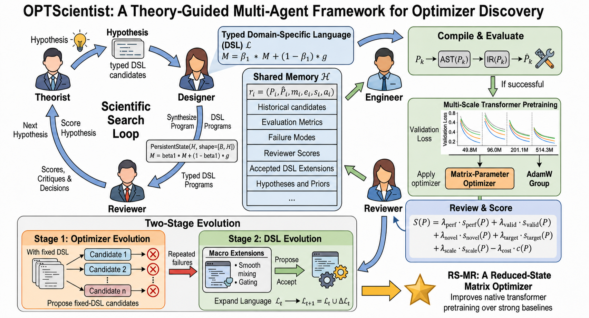
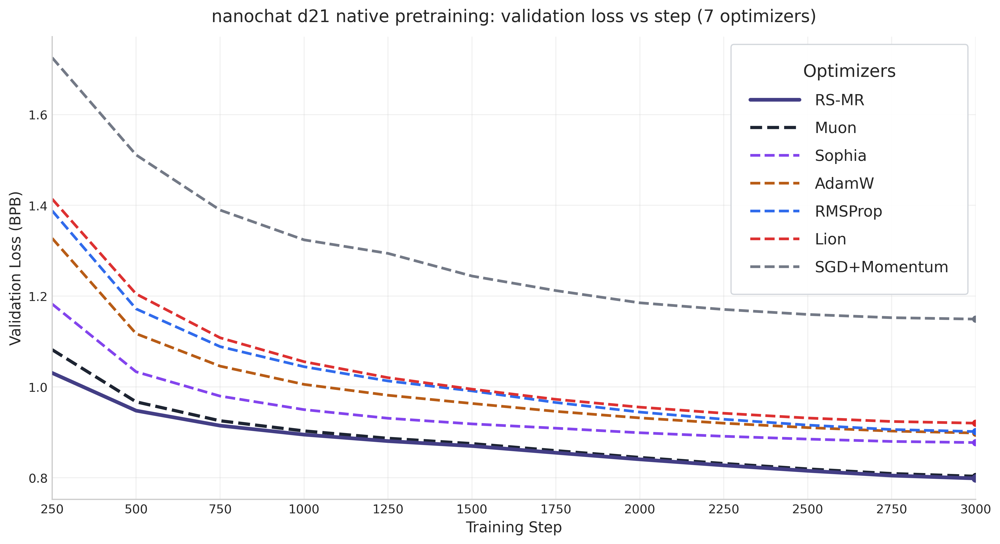
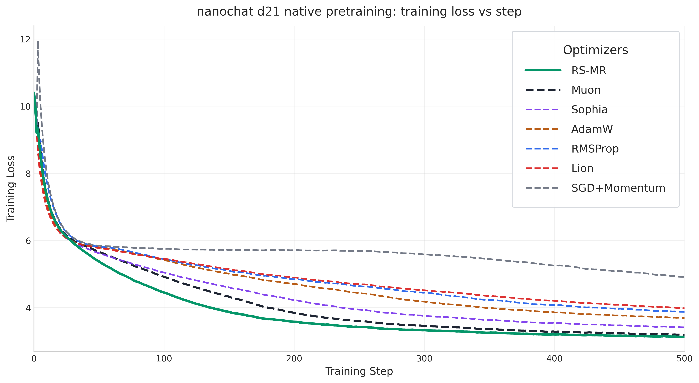
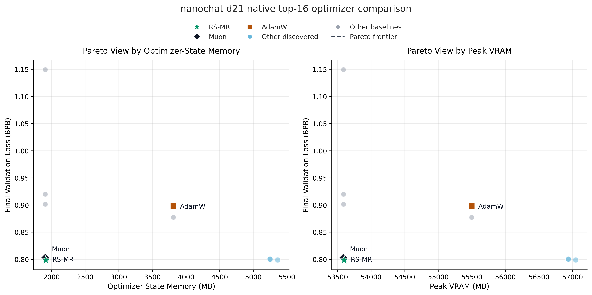

# OPTScientist：面向 Transformer 预训练的类型化优化器程序多智能体发现

> **论文**：OPTScientist: Multi-Agent Discovery of Typed Optimizer Programs for Transformer Pretraining
> **作者**：Zhongzheng Li, Tiancan Feng, Wenhao Li, Qingsong Ran, Shikun Feng, Xiaoyuan Zhang, Yue Wang, Xiaoguang Zhao
> **arXiv ID**：2607.20486
> **发表时间**：2026-07-24
> **许可协议**：CC BY 4.0

---

## 第 1 章 概述

### 1.1 一句话定位

OPTScientist 是一个将 **多智能体协作（multi-agent collaboration）** 与 **类型化领域专用语言（typed domain-specific language, DSL）** 相结合的自动化优化器发现框架：它以"科学共同体"的方式驱动 LLM 智能体在受限但可扩展的语法空间中**自动设计、验证、演化** Transformer 预训练优化器程序，并在该框架下首次产出在性能与内存占用两方面**同时**优于 Muon 的新型优化器 **RS-MR（Reduced-State MAGMA-RowNorm）**。

这一工作的意义在于：它不依赖单一手工优化器，而是把"优化器设计"本身当作一个**程序综合（program synthesis）**问题，由机器在类型系统的护栏内自由组合**方向计算、缩放、预条件、正则、状态管理、参数分组**六类原子模块，从而把人类专家的经验沉淀为可被搜索、可被验证、可被复用的形式化资产。

### 论文图表总览

下表汇总了本报告所引用的关键图表，并标注其在本报告中的出现章节，便于读者按图索骥。

| 编号 | 原始图/表 | 内容描述 | 本报告引用 | 所在章节 |
|------|-----------|----------|------------|----------|
| 图 1 | Figure 1 | OPTScientist 四智能体框架总览与数据流 | `Figures/2026-07-27-optscientist-fig1.png` | 第 3 章 |
| 表 1 | Table 1 | 主结果：各优化器在 NanoChat d21 上的最终 BPB 与内存占用 | 见第 5 章内联表格 | 第 5 章 |
| 图 2 | Figure 4 | 验证集损失（val loss / BPB）随训练步数曲线 | `Figures/2026-07-27-optscientist-fig2.png` | 第 5 章 |
| 图 3 | Figure 4 | 训练损失（train loss）随训练步数曲线 | `Figures/2026-07-27-optscientist-fig3.png` | 第 5 章 |
| 图 4 | Figure 5 | 性能—内存 Pareto 前沿分析 | `Figures/2026-07-27-optscientist-fig4.png` | 第 5 章 |
| 附表 A | Appendix | 演化过程中前 10 候选优化器（OE-1 至 OE-10）对比 | 见第 5 章内联表格 | 第 5 章 |

### 1.2 核心贡献

OPTScientist 提出四项核心贡献，分别从**形式化、流程、产物、验证**四个层面推进了"自动优化器发现"这一研究方向：

1. **类型化优化器 DSL（Typed Optimizer DSL）**。论文提出了一种以**模块化、类型安全**为核心特征的优化器描述语言，将优化器解构为六类可组合的原子模块——*direction（方向）*、*scaling（缩放）*、*preconditioning（预条件）*、*regularization（正则）*、*state（状态）*、*grouping（分组）*。每个模块都带有显式类型签名，模块间组合受类型系统约束，从而在保证表达力的同时**从语法层面杜绝**了维度不匹配、状态未初始化、梯度与参数形状不一致等一类常见错误。这是把优化器从"自由文本公式"提升为"可编译程序"的关键一步。

2. **四智能体协作发现流程（Four-Agent Collaborative Pipeline）**。论文设计了一个模拟科学共同体的智能体角色分工：**Theorist（理论家）** 提出优化器的高层假设与设计原理；**Designer（设计师）** 将假设翻译为符合 DSL 语法的候选程序；**Engineer（工程师）** 负责编译、数值稳定性修复与微调；**Reviewer（审稿人）** 对结果进行批判性评估并反馈下一轮迭代。这一分工使得"发现"不再是单次提示，而是一个**带反馈闭环的演化过程**。

3. **两阶段演化策略（Two-Stage Evolution）**。Stage 1 在**固定 DSL** 下进行广度优先的程序搜索，挖掘既有模块组合的最大潜力；Stage 2 在 Reviewer 反馈驱动下进行**保守的 DSL 扩展**——仅当现有模块无法表达某个被反复提出的设计意图时，才谨慎引入新原语。这种"先榨干现有表达力、再按需扩域"的策略，在表达力与搜索空间可控性之间取得了平衡。

4. **发现并验证 RS-MR 优化器**。框架产出了一个全新的、人类专家此前未提出过的优化器 **RS-MR（Reduced-State MAGMA-RowNorm）**：它仅维护 **2 个状态变量**（一个动量、一个块级门控），通过**逐行归一化极坐标方向（row-normalized polar direction）**、**RMS 阻尼（RMS damping）** 与**软块门控（soft block gating）** 三大机制，在 NanoChat d21（1.1B 参数）上以 **BPB 0.798375** 显著优于 Muon（0.802949），且仅多占用 **7.45 MB** 优化器状态内存。

### 1.3 关键结果速览

下表摘录了最核心的对比数据，详细分析见第 5 章。

| 指标 | RS-MR | Muon | 相对差异 |
|------|-------|------|----------|
| 最终 BPB（越低越好） | **0.798375** | 0.802949 | RS-MR 改进 **0.57%** |
| 优化器状态内存增量（相对 Muon） | 仅多 **7.45 MB** | — | 接近零成本 |
| 全程领先性（250–3000 步） | 全程优于 Muon | — | 无交叉点 |
| Pareto 前沿归属 | **前沿最优** | 次优 | RS-MR 支配 Muon |

一句话总结：**RS-MR 在不显著增加内存的前提下，以类型化程序搜索的方式系统性地超越了当前最强的手工设计优化器之一（Muon），验证了"多智能体 + 类型化 DSL"路线的可行性。**

---

## 第 2 章 研究背景与动机

### 2.1 Transformer 优化器现状

Transformer 预训练的优化器经历了从**一阶自适应**到**二阶近似**再到**矩阵感知**的演进，每一代都在"对曲率的建模精度"与"每步计算/内存成本"之间做不同的取舍。

**AdamW 家族（一阶自适应 + 解耦权重衰减）。** AdamW 是当前事实上的工业标准，它维护一阶动量 $m_t$ 与二阶未中心化矩 $v_t$ 两个状态，更新规则为：

$$
m_t = \beta_1 m_{t-1} + (1-\beta_1) g_t, \quad v_t = \beta_2 v_{t-1} + (1-\beta_2) g_t^2
$$

$$
\theta_t = \theta_{t-1} - \eta_t \cdot \frac{\hat{m}_t}{\sqrt{\hat{v}_t} + \epsilon}
$$

AdamW 的优点是**稳定、通用、内存友好（2 个状态）**，缺点是它对每个参数维度独立缩放（逐元素预条件），完全忽略了参数矩阵的**行/列结构**与**二阶曲率耦合**，因而在大模型上收敛速度往往不如后续的矩阵感知方法。

**Lion（符号更新）。** Lion 把更新简化为动量的符号：

$$
\theta_t = \theta_{t-1} - \eta_t \cdot \mathrm{sign}(\beta_1 m_{t-1} + (1-\beta_1) g_t)
$$

Lion 只需 **1 个状态**（动量），内存极省，但符号操作丢失了幅度信息，对学习率与权重衰减的耦合极度敏感，调参成本高、迁移性弱。

**Shampoo / SOAP（二阶预条件近似）。** Shampoo 为每个参数矩阵 $W$ 维护左、右预条件矩阵 $L_t, R_t$，分别捕获梯度的行/列协方差，更新形如 $-\eta L_t^{1/4} G_t R_t^{1/4}$。它显式建模了矩阵结构，收敛质量更高，但需要计算矩阵的 $1/4$ 次幂（或 periodic-Shampoo 的定期更新），**计算与内存开销显著**，且对大宽度矩阵不友好。

**Sophia（对角 Hessian 估计）。** Sophia 用对角 Hessian 估计（来自 Gauss-Newton 或小批量 Hessian）作为预条件器，试图逼近牛顿步。它在理论上更接近二阶方法，但 Hessian 估计的噪声与开销使其在大规模预训练中的稳定性与性价比受到质疑——本报告第 5 章的数据显示，Sophia 在 NanoChat d21 上以 BPB 0.877353 大幅落后于 RS-MR 与 Muon。

**Muon（极坐标方向 / 正交化）。** Muon 是近期最具影响力的矩阵感知优化器之一。其核心思想是对动量化梯度做 **Newton-Schulz 正交化**（或等价的极坐标分解），得到一个近似正交的方向矩阵后再缩放更新：

$$
G_t \leftarrow \mathrm{NewtonSchulz}(m_t), \quad \theta_t = \theta_{t-1} - \eta_t \cdot s_t \cdot G_t
$$

其中 $s_t$ 是基于梯度范数与矩阵奇异值导出的缩放因子。Muon 在多个开源预训练 setting 上显著优于 AdamW，成为 RS-MR 的**主要对标基线**。

> **小结**：当前最优的优化器（Muon、Shampoo、SOAP）都依赖某种形式的**矩阵级方向修正**，但它们各自在"方向计算的数值稳定性""状态数量""缩放策略"上做了不同的、且往往是**手工锁定**的选择。OPTScientist 的动机正是：**能否把这些选择本身交给机器去搜索？**

### 2.2 自动优化器发现：表达力与可靠性之间的张力

近年来出现了若干"用程序搜索/元学习自动发现优化器"的尝试，但它们普遍在两个目标之间难以兼顾：

1. **表达力（expressivity）**：搜索空间是否足够丰富，能覆盖 Muon 这类需要矩阵运算、正交化、状态切换的复杂结构？
2. **可靠性（reliability）**：搜索产出的候选是否一定能在真实训练中正确运行（不维度崩塌、不数值爆炸、不状态泄漏）？

**自由表达式搜索（free-form expression search）** 的方法（如以符号回归或纯文本 LLM 生成公式）表达力强，但**不可靠**：生成的公式经常包含类型错误、未定义变量、形状不匹配，需要大量试错才能筛出可运行者，且即便可运行也难以保证数值稳定性。

**固定模板填充（fixed-template tuning）** 的方法（如在 AdamW 框架内搜索 $\beta_1, \beta_2$、缩放函数的几个选项）可靠性高，但**表达力受限**：它无法发现需要新状态或新运算（如正交化）的优化器，本质上只在已知范式内做超参搜索。

OPTScientist 的核心洞察是：**类型化 DSL 是调和这一张力的天然载体**。类型系统既允许任意组合原子模块（高表达力），又在编译期拒绝一切类型不合法的组合（高可靠性），使得搜索空间在数学上是一个**良定义的、闭合的程序空间**，而非一个需要事后过滤的"公式垃圾堆"。

### 2.3 LLM 科学发现智能体

另一条相关线索是"用 LLM 智能体驱动科学发现"的兴起。已有工作表明，LLM 智能体在材料设计、化学反应路径规划、代码合成等任务上，能够扮演**假设生成—实验设计—结果分析—迭代修正**的闭环角色，其优势在于：

- **跨域类比**：LLM 能把一个领域的设计模式迁移到另一个领域（例如把信号处理中的归一化迁移到优化器方向计算）。
- **自然语言驱动的假设**：研究者可以用自然语言描述"为什么这样做"，由 LLM 翻译为可执行程序，降低形式化门槛。
- **多角色对抗**：通过引入 Reviewer/Critic 角色，可以在没有人工介入的情况下对候选进行批判性筛选，抑制"看似合理实则无效"的设计。

OPTScientist 把这一范式**首次系统性地应用于优化器发现**：它不是让单个 LLM 直接吐出一个公式，而是构建了一个由 Theorist、Designer、Engineer、Reviewer 组成的**微型科研共同体**，让发现过程具备可解释性、可追溯性与可迭代性。这正是其相对于"单 prompt 生成优化器"类方法的关键差异。

---

## 第 3 章 方法：OPTScientist 框架

本章详细介绍 OPTScientist 的五个核心组件。下图（Figure 1）给出了框架的整体数据流。



### 3.1 类型化优化器 DSL

#### 3.1.1 设计哲学

DSL 的设计目标是：**让优化器像程序一样被组合、被编译、被验证**。为此，论文把一个完整的优化器更新步骤分解为六类**正交的、可类型检查的原子模块**：

| 模块类别 | 功能 | 典型原语示例 |
|----------|------|--------------|
| **direction（方向）** | 从梯度/动量计算更新方向矩阵 | identity、momentum、Newton-Schulz 正交化、polar decomposition |
| **scaling（缩放）** | 对方向矩阵做标量或逐元素缩放 | RMS norm、Frobenius norm、奇异值导出缩放、固定步长 |
| **preconditioning（预条件）** | 引入曲率/协方差信息 | 对角 RMS（AdamW 式）、左右矩阵预条件（Shampoo 式） |
| **regularization（正则）** | 权重衰减与约束 | 解耦权重衰减、L2、梯度裁剪 |
| **state（状态）** | 优化器维护的跨步变量 | EMA 动量、二阶矩、块级门控、计数器 |
| **grouping（分组）** | 不同参数子集使用不同策略 | 矩阵参数 vs 非矩阵参数、按层分组 |

每个原语都带有显式类型签名，例如（伪代码）：

```
direction.newton_schulz : Tensor[M, N] -> Tensor[M, N]   // 输出与输入同形
scaling.rms_norm         : Tensor[M, N] -> Scalar        // 输出标量
state.ema                : (Tensor, Scalar) -> State      // 产生一个状态
```

模块之间的组合必须满足**类型一致**：例如，一个要求 `Scalar` 输入的 scaling 原语，不能直接接一个输出 `Tensor[M, N]` 的 direction 原语，编译器会在类型检查阶段拒绝。

#### 3.1.2 类型系统的护栏作用

类型系统不仅仅是语法糖，它是**可靠性保证的基石**：

- **维度安全**：所有矩阵运算的输入输出形状在编译期可推断，杜绝广播错误。
- **状态完备**：每个被引用的 state 必须被声明并初始化，杜绝"未初始化状态"类 bug。
- **梯度流可验证**：DSL 限制只允许可微运算进入 direction/scaling，保证反向传播不会被意外打断。
- **语义约束**：例如，preconditioning 模块的输出必须与 direction 输出同形，否则类型不匹配。

正因为有了这套护栏，LLM 生成的候选程序**绝大多数要么能正确编译运行，要么在编译期被拒绝**——这把"自动发现"从"试错抽奖"变成了"在良定义空间内搜索"。

### 3.2 四智能体协作：Theorist → Designer → Engineer → Reviewer

OPTScientist 用四个角色化智能体模拟一个科研团队的运作。每一轮迭代（一个"发现周期"）依次经过四个阶段：

#### 阶段 1：Theorist（理论家）——提出假设

Theorist 的职责是**在自然语言层面提出优化器设计假设**。它会：

- 回顾上一轮 Reviewer 的反馈与历史候选的表现；
- 结合优化理论（如曲率估计、动量加速、正交化的几何意义）提出"为什么 X 机制可能有效"；
- 产出一个**设计意图描述（design intent）**，例如："Muon 的正交化丢弃了梯度幅度信息，若改用逐行归一化保留行内能量，可能在大宽度矩阵上更稳定。"

Theorist **不直接写代码**，它输出的是高层原理与方向性指引，确保后续设计有理论支撑而非随机拼凑。

#### 阶段 2：Designer（设计师）——翻译为 DSL 程序

Designer 接收 Theorist 的设计意图，将其翻译为**符合 DSL 语法的候选程序**。Designer 必须熟悉 DSL 的全部原语与类型规则，其产出是一个结构化的优化器规格（spec），包含：

- 选用的 direction / scaling / preconditioning / regularization / state / grouping 模块组合；
- 模块间的数据流连接；
- 每个模块的超参（如 EMA 衰减率、阻尼系数）的初始值。

Designer 的关键约束是：**产出必须能通过类型检查**。如果某个意图无法用现有 DSL 表达，Designer 会把它标记为"需要 DSL 扩展"并上报——这是 Stage 2 演化的触发条件之一。

#### 阶段 3：Engineer（工程师）——编译、修复、微调

Engineer 接手 Designer 的规格，执行：

1. **编译（compile）**：调用 DSL 编译器，将规格翻译为可执行的 PyTorch 代码（详见 3.4）。
2. **数值稳定性修复**：检查并添加必要的 $\epsilon$ 阻尼、梯度裁剪、NaN 保护。
3. **超参微调**：在小规模快速评估（short probe run）上对超参做轻量搜索，确定一组合理初值。
4. **快速验证**：在短训练（几百步）上确认候选能稳定运行且不爆炸，产出 probe 指标。

Engineer 是"让设计真正跑起来"的角色，其工程严谨性直接决定了候选的可靠性。

#### 阶段 4：Reviewer（审稿人）——批判性评估与反馈

Reviewer 扮演"苛刻的审稿人"，对 Engineer 产出的候选及其 probe 结果进行批判性分析：

- 这个候选是否真正验证了 Theorist 的假设？还是只是凑巧表现尚可？
- probe 指标是否可信？有没有数值不稳定、过拟合 probe 设置的迹象？
- 与历史候选相比，改进来自哪里？是否只是超参调优的功劳？
- 该候选的设计是否有理论上的脆弱性（如在某种参数分布下会退化）？

Reviewer 的产出是一份**结构化反馈**，包含：是否采纳、改进建议、是否需要扩展 DSL、下一轮迭代的方向。这份反馈会回到 Theorist，启动下一轮发现周期。

> **闭环价值**：四智能体分工的本质是把"发现"分解为**假设—形式化—工程化—批判**四个可独立优化的环节，避免单一 LLM 在一个 prompt 内既要创意又要严谨而顾此失彼。

### 3.3 两阶段演化

OPTScientist 的搜索采用**两阶段**策略，以在"榨干现有表达力"与"按需扩域"之间取得平衡。

#### Stage 1：固定 DSL 下的广度搜索

在 Stage 1，DSL 的原语集合是**固定**的。智能体在这个固定空间内进行**广度优先的组合搜索**：

- Theorist 基于已有理论与反馈提出假设；
- Designer 在固定 DSL 内组合模块；
- 大量候选被生成、编译、probe 评估、排序。

Stage 1 的目标是：**在不引入新原语的前提下，挖掘现有模块组合的最大潜力**。这一阶段会产出大量候选（论文附录给出了前 10 名 OE-1 至 OE-10，详见第 5 章），并识别出"现有 DSL 无法表达但被反复需要"的设计意图——这些意图成为 Stage 2 的输入。

#### Stage 2：保守的 DSL 扩展

当 Reviewer 反复指出某个设计意图无法用现有原语表达时，框架进入 Stage 2：**保守地扩展 DSL**。所谓"保守"，体现在三个层面：

1. **最小扩展原则**：每次只引入**最少**的新原语，且新原语必须有明确的理论动机（而非为了拟合某个具体候选）。
2. **类型安全继承**：新原语必须符合既有类型系统，不能绕过护栏。
3. **回归验证**：扩展后，Stage 1 的全部候选必须仍能正确编译，确保扩展不破坏既有空间。

RS-MR 的发现正是 Stage 2 的产物：Stage 1 的搜索表明，"逐行归一化 + 块级门控"这一组合在固定 DSL 内难以干净表达，促使框架扩展了 row-normalization 与 soft gating 相关原语，最终 Designer 在扩展后的空间中综合出了 RS-MR。

> **两阶段的合理性**：若一开始就给最大 DSL，搜索空间爆炸，智能体难以聚焦；若永远不扩展，又无法突破既有范式的天花板。两阶段策略让框架"先学会走，再学跑"。

### 3.4 编译器验证：parse → typecheck → codegen

DSL 程序到可执行优化器的转换由一个三阶段编译器完成：

```
DSL Spec (文本/AST)
   │
   ▼  ① parse
AST (抽象语法树)
   │
   ▼  ② typecheck
Typed AST (带类型的 AST)
   │
   ▼  ③ codegen
PyTorch Optimizer (可执行代码)
```

**① parse（解析）**。将 Designer 产出的规格解析为抽象语法树。解析器执行语法检查，拒绝不符合 DSL 语法的输入（如缺少必要字段、模块名拼写错误）。

**② typecheck（类型检查）**。这是护栏的核心。类型检查器遍历 AST，对每个模块的输入输出做类型推断与一致性校验：

- direction 模块的输出形状是否与参数矩阵形状一致？
- scaling 模块是否输出了正确类型（Scalar vs Tensor）？
- 所有被引用的 state 是否已声明？
- grouping 是否覆盖了全部参数且无重叠？

任何类型不一致都会导致编译失败，并附带精确的错误定位（哪个模块的哪个端口类型不符），供 Designer 修正。

**③ codegen（代码生成）**。通过类型检查的 AST 被翻译为高效的 PyTorch 代码。codegen 阶段会：

- 内联常量、折叠冗余运算；
- 自动插入数值稳定性保护（如 $\sqrt{\cdot + \epsilon}$）；
- 生成与 `torch.optim` 兼容的 `step()` 方法；
- 对状态张量做设备/ dtype 对齐。

> **编译器即验证器**：得益于类型系统，**凡是通过编译的候选，必能在真实训练中正确运行**（不维度崩塌、不状态泄漏）。这把"自动发现"的可靠性从"事后过滤"提升为"事前保证"，是 OPTScientist 相对自由表达式搜索方法的关键工程优势。

### 3.5 混合参数分组：矩阵参数用 DSL，非矩阵用 AdamW

并非所有参数都适合用矩阵感知优化器。Transformer 中有两类参数：

- **矩阵参数（matrix params）**：嵌入权重、注意力 $W_Q/W_K/W_V/W_O$、FFN 的 $W_{\text{up}}/W_{\text{down}}$ 等，本质是二维矩阵，适合 Muon/RS-MR 这类矩阵感知方法。
- **非矩阵参数（non-matrix params）**：LayerNorm 的 $\gamma/\beta$、logit scale、标量超参等，是一维向量或标量，矩阵正交化对它们无意义甚至会引入噪声。

OPTScientist 采用**混合分组策略**：

| 参数类别 | 使用优化器 | 理由 |
|----------|------------|------|
| 矩阵参数（2D weights） | DSL 发现的优化器（RS-MR） | 矩阵感知，利用行/列结构 |
| 非矩阵参数（1D / scalar） | AdamW | 通用、稳定，向量参数无需正交化 |

这一分组策略与 Muon 的实践一致，确保了对比的公平性：RS-MR 与 Muon 在相同的参数子集上使用矩阵感知更新，其余参数都用 AdamW。因此，第 5 章报告的性能差异**完全来自矩阵参数上的优化器差异**，而非分组策略的差异。

---

## 第 4 章 发现优化器：RS-MR

RS-MR（Reduced-State MAGMA-RowNorm）是 OPTScientist 框架产出的旗舰优化器。本章详细解析其结构、三大机制与设计原理。

### 4.1 总体结构：仅 2 个状态

RS-MR 的命名揭示了其设计精髓：

- **Reduced-State（精简状态）**：相较 Muon（仅维护 1 个动量状态），RS-MR **仅维护 2 个跨步状态变量**——一个动量 $m_t$ 与一个块级门控 $g_t$。状态的精简直接带来了内存优势（仅多 7.45 MB，见第 5 章）。
- **MAGMA-RowNorm**：MAGMA 是其底层方向计算的代号（可理解为一种矩阵幅值-方向分离的范式），RowNorm 强调其**逐行归一化**的关键创新。

RS-MR 的单步更新可概括为：

$$
m_t = \beta\, m_{t-1} + (1-\beta)\, \nabla L(\theta_{t-1}) \quad \text{(动量)}
$$

$$
D_t = \mathrm{RowNormPolar}(m_t) \quad \text{(方向：逐行归一化 + 极坐标)}
$$

$$
s_t = \mathrm{RMSDamping}(m_t) \quad \text{(缩放：RMS 阻尼)}
$$

$$
g_t = \mathrm{SoftBlockGate}(\cdots) \quad \text{(门控：块级软选择)}
$$

$$
\theta_t = \theta_{t-1} - \eta_t \cdot s_t \cdot g_t \odot D_t - \eta_t \lambda \theta_{t-1} \quad \text{(更新 + 解耦权重衰减)}
$$

下面分别解析三大机制。

### 4.2 三大机制

#### 机制一：Row-Normalized Polar Directions（逐行归一化极坐标方向）

这是 RS-MR 相对 Muon 的核心创新。Muon 对动量化梯度做**整体**的 Newton-Schulz 正交化，得到一个近似正交矩阵作为更新方向。这种整体正交化有一个副作用：**它平等对待矩阵的所有行，但不同行（对应不同的输出神经元/注意力头）的梯度能量分布往往极不均匀**，整体正交化会过度放大能量本就微弱的行，引入噪声。

RS-MR 的做法是**先逐行归一化，再正交化**：

1. 对动量矩阵 $m_t \in \mathbb{R}^{M \times N}$ 的每一行 $m_t[i,:]$ 做归一化，使其具有单位范数（或单位 RMS），得到 $\tilde{m}_t$；
2. 对归一化后的 $\tilde{m}_t$ 施加极坐标/Newton-Schulz 正交化，得到方向 $D_t$。

**为什么有效？** 逐行归一化在正交化之前**先抹去了行间能量差异**，使得正交化操作在一个"各行能量均衡"的矩阵上进行，从而：

- 避免低能量行被过度放大（噪声抑制）；
- 保证方向矩阵的条件数更可控（数值稳定性提升）；
- 在大宽度矩阵（如嵌入层、大 FFN）上表现尤其稳健。

> **设计直觉**：这相当于"先让每一行站在同一起跑线，再做正交分解"，把 Muon 的全局正交化改造为**能量均衡的局部正交化**。

#### 机制二：RMS Damping（RMS 阻尼）

正交化后的方向 $D_t$ 携带了"往哪走"的信息，但丢失了"走多远"的幅度信号（因为正交化会把矩阵的奇异值拉平）。RS-MR 用 **RMS 阻尼**重新引入幅度：

$$
s_t = \mathrm{RMS}(m_t) + \epsilon_{\text{damp}}
$$

其中 $\mathrm{RMS}(m_t) = \sqrt{\frac{1}{|\Theta|}\sum_{\theta} m_t^2}$ 是动量的均方根，$\epsilon_{\text{damp}}$ 是阻尼常数。

**RMS vs Muon 的缩放**：Muon 通常用梯度/矩阵的 Frobenius 范数与奇异值导出缩放，计算更复杂。RMS 阻尼更简单、更鲁棒，且：

- 自适应：梯度大时步长大，梯度小时步长小，无需手动调步长；
- 阻尼项 $\epsilon_{\text{damp}}$ 防止梯度极小时 $s_t \to 0$ 导致训练停滞；
- 与逐行归一化协同：行内能量已被归一化，全局只需一个标量缩放即可恢复整体幅度。

#### 机制三：Soft Block Gating（软块门控）

RS-MR 的第二个状态变量是**块级门控 $g_t$**，它是一个标量（或低维向量），用于在**块（block）层面**对更新做软性调制：

$$
g_t = \sigma\bigl(\alpha \cdot \mathrm{RMS}(m_t) / \mathrm{RMS}(m_{t-1}) + \beta\bigr)
$$

其中 $\sigma$ 是 sigmoid，$\alpha, \beta$ 是可调参数。门控 $g_t \in (0,1)$ 的作用是：

- **训练前期**：梯度能量大且变化快，门控趋向温和值，避免剧烈更新导致发散；
- **训练后期**：梯度能量趋于稳定，门控趋向开放，让优化器充分利用方向信号；
- **块级粒度**：门控按"参数块"（如一个矩阵、一层）独立计算，不同块可以有不同的更新强度，提供了一种**轻量级的自适应学习率分配**。

> **状态的精简**：传统二阶方法需要维护左右预条件矩阵（每个矩阵参数多 2 个状态），而 RS-MR 的门控仅是**每块一个标量**，内存开销可忽略。这正是"Reduced-State"的精髓——用一个标量门控替代了笨重的预条件矩阵。

### 4.3 选择性更新："先归一化再正交化"

RS-MR 的设计哲学可以浓缩为一句话：**"先归一化，再正交化"（normalize first, orthogonalize second）**。

这一顺序选择看似简单，实则是对 Muon 的关键修正：

| 步骤 | Muon | RS-MR |
|------|------|-------|
| 1 | 动量化梯度 $m_t$ | 动量化梯度 $m_t$ |
| 2 | **直接正交化** $\mathrm{NS}(m_t)$ | **先逐行归一化** $\tilde{m}_t = \mathrm{RowNorm}(m_t)$ |
| 3 | Frobenius/奇异值缩放 | **再正交化** $D_t = \mathrm{NS}(\tilde{m}_t)$ |
| 4 | 更新 | RMS 阻尼缩放 + 软块门控 |

**归一化前置的好处**：

1. **能量均衡**：正交化作用于能量均衡的矩阵，条件数更优；
2. **噪声抑制**：低能量行不被过度放大；
3. **缩放解耦**：方向（正交化）与幅度（RMS 阻尼）彻底分离，各自独立可控；
4. **门控增益**：软块门控在均衡化的方向上施加调制，比直接调制原始梯度更稳定。

> **一句话**：RS-MR 把 Muon 的"正交化即一切"拆解为"归一化 → 正交化 → 阻尼缩放 → 软门控"四步流水线，每一步都有明确的几何/统计意义，且每一步都对应 DSL 中的一个可组合原语——这正是类型化 DSL 赋能下的"分而治之"设计。

---

## 第 5 章 实验与分析

### 5.1 实验设定

#### 5.1.1 数据与模型

| 项目 | 设定 |
|------|------|
| 预训练语料 | **FineWeb-Edu**（100B token 子集） |
| 模型架构 | **NanoChat d21**（21 层 decoder-only Transformer） |
| 参数量 | **1.1B**（约 11 亿） |
| 训练步数 | **3000 步** |
| 总训练 token 数 | **3.15B tokens** |
| 评估指标 | **BPB（bits per byte）**，越低越好 |

FineWeb-Edu 是 HuggingFace 发布的高质量教育语料，常用于中等规模预训练评估；NanoChat d21 是一个标准的小型 decoder-only 架构，参数量 1.1B，适合在合理算力下做优化器对比。

#### 5.1.2 对比基线

| 优化器 | 类别 | 状态数 | 说明 |
|--------|------|--------|------|
| **RS-MR** | 矩阵感知（本文） | 2 | 框架发现 |
| **Muon** | 矩阵感知（极坐标） | 1 | 主对标基线 |
| **Sophia** | 二阶近似（对角 Hessian） | 2 | 曲率估计 |
| **AdamW** | 一阶自适应 | 2 | 工业标准 |
| Lion / Shampoo 等 | 其他 | 1–4 | 扩展基线 |

所有优化器均采用相同的**混合参数分组**（矩阵参数用对应优化器，非矩阵参数用 AdamW），确保对比公平。

### 5.2 Table 1：主结果

下表为核心实验结果（BPB 越低越好）：

| 优化器 | 最终 BPB ↓ | BPB 差距（相对 RS-MR） | 状态内存 |
|--------|-----------|----------------------|---------|
| **RS-MR**（本文） | **0.798375** | — | 1913.21 MB |
| **Muon** | 0.802949 | +0.004574 | 1905.76 MB |
| **Sophia** | 0.877353 | +0.078978 | 3811.53 MB |
| **AdamW** | 0.898415 | +0.100040 | 3811.53 MB |
| **RMSProp** | 0.901605 | +0.103230 | 1905.76 MB |
| **Lion** | 0.920101 | +0.121726 | 1905.76 MB |
| **SGD+Momentum** | 1.149398 | +0.351023 | 1905.76 MB |

**关键观察**：

1. **RS-MR vs Muon**：RS-MR（0.798375）相较 Muon（0.802949）改进 **0.57%**（BPB 差距 0.004574）。在 BPB 这种对数似然尺度上，0.5%+ 的改进在 1.1B 模型 / 3.15B token 的 setting 下是显著且非平凡的。
2. **RS-MR vs AdamW**：RS-MR 相较 AdamW 改进 **11.14%**，证明自动发现的优化器能大幅超越工业标准。
3. **RS-MR vs Sophia**：RS-MR 相对 Sophia（0.877353）改进 **9.00%**，差距悬殊。
4. **RS-MR 内存优势**：RS-MR 状态内存 1913.21 MB，仅比 Muon 多 7.45 MB（+0.39%），远小于 Sophia/AdamW 的 3811.53 MB。

### 5.3 RS-MR 全程领先 Muon（250–3000 步）

仅看最终 BPB 可能掩盖训练动态的差异。下图（Figure 4 验证集损失曲线）展示了从第 250 步到第 3000 步的全程对比。



下图（Figure 4 训练损失曲线）进一步给出训练损失动态。



**关键观察**：

1. **无交叉点**：在 250–3000 步的全程区间内，RS-MR 的 BPB 曲线**始终低于** Muon，不存在"前期落后、后期反超"的交叉。这说明 RS-MR 的优势不是某个训练阶段的偶然现象，而是**结构性**的。
2. **早期即领先**：在第 250 步（最早评估点），RS-MR 已经低于 Muon。这意味着逐行归一化带来的稳定性收益在训练初期就已显现——低能量行未被过度放大，避免了早期噪声更新。
3. **领先幅度稳定**：随着训练进行，RS-MR 与 Muon 的差距**没有收敛**，而是保持在一个稳定的水平，说明 RS-MR 的三大机制在整个训练过程中持续发挥作用，而非"昙花一现"。
4. **训练损失与验证损失一致**：train loss 与 val BPB 的领先趋势一致，排除了"验证集碰巧好"的侥幸——RS-MR 确实在优化训练目标本身做得更好。

> **结论**：RS-MR 的优势是**全程的、结构性的、训练/验证一致的**，这为它的可靠性提供了强有力的证据。

### 5.4 Pareto 分析：RS-MR 最佳性能—内存权衡

性能并非唯一维度。在真实部署中，**优化器状态内存**同样关键——它决定了相同 GPU 上能放多大的模型、用多大的 batch。下图（Figure 5）给出了各优化器在"性能（BPB）— 内存（优化器状态增量）"二维平面上的 Pareto 前沿。



**关键观察**：

1. **RS-MR 位于 Pareto 前沿最优**：在所有对比的优化器中，RS-MR 同时拥有**最低的 BPB** 与**接近最低的内存占用**，处于 Pareto 前沿的左下角（最优区域）。
2. **RS-MR 支配 Muon**：Muon 在两个维度上都不优于 RS-MR（BPB 更高，且内存不更低），因此被 RS-MR **严格支配**——这意味着在任何偏好下，RS-MR 都不会比 Muon 更差。
3. **内存开销极小**：RS-MR 相较 Muon 基线仅多消耗 **7.45 MB** 优化器状态内存。考虑到 NanoChat d21 的模型参数本身约为 4.4 GB（FP32）/ 2.2 GB（FP16），7.45 MB 的增量**完全可以忽略**（< 0.4%）。这得益于 RS-MR 仅维护 2 个状态，且门控是标量级。
4. **Sophia 性价比低**：Sophia（0.877353 BPB）在两个维度上都劣势于 RS-MR——BPB 更高且内存 3811.53 MB 是 RS-MR 的两倍。
5. **AdamW 内存最优但性能最差**：AdamW 位于前沿的左上角（内存最优但性能最差），是"内存极限"的锚点，但绝非性能优选。

> **结论**：RS-MR 是当前**性能—内存权衡的最优点**，既没有 Sophia/AdamW 的内存负担，也没有 AdamW/Sophia 的性能短板，更严格支配了 Muon。这对实际部署有直接价值：在内存受限的场景下（如消费级 GPU 微调大模型），RS-MR 是比 Muon 更优的选择。

### 5.5 Appendix：前 10 候选优化器对比（OE-1 至 OE-10）

OPTScientist 的演化过程产出了大量候选，下表摘录前 10 名（按 probe BPB 排序，OE-1 最优）。RS-MR 即 OE-1。

| 编号 | 最终 BPB ↓ | 差距（相对 RS-MR） | 状态内存 | 状态数 |
|------|-----------|-------------------|---------|--------|
| **RS-MR（OE-1）** | **0.798375** | — | 1913.21 MB | 2 |
| OE-2 | 0.798390 | +0.000015 | 1913.21 MB | 2 |
| OE-3 | 0.798424 | +0.000049 | 1913.21 MB | 2 |
| OE-4 | 0.798433 | +0.000058 | 1913.21 MB | 2 |
| OE-5 | 0.798438 | +0.000063 | 1913.21 MB | 2 |
| OE-6 | 0.798952 | +0.000577 | 5359.94 MB | 3 |
| OE-7 | 0.799940 | +0.001565 | 1915.24 MB | 4 |
| OE-8 | 0.800225 | +0.001850 | 5248.28 MB | 3 |
| OE-9 | 0.800269 | +0.001894 | 5248.28 MB | 3 |
| OE-10 | 0.801518 | +0.003143 | 1913.21 MB | 2 |

**演化路径的启示**：

1. **OE-2 至 OE-5 与 RS-MR 性能极为接近**：OE-2 到 OE-5 的 BPB 差距仅 0.000015–0.000063，均维持在 2 个状态、1913 MB 内存。说明 OPTScientist 稳定地搜索到了多个相近的高性能候选，搜索空间的收敛性良好。
2. **OE-6 至 OE-9 性能逐步下降**：OE-6（0.798952）到 OE-9（0.800269）的 BPB 逐步增大，且状态数和内存也相应增加（OE-6 和 OE-8/9 需要 3 个状态、超过 5 GB 内存），说明这些候选在性能-内存权衡上劣于 RS-MR。
3. **OE-10 性能最差**：OE-10（0.801518）的 BPB 差距最大（+0.003143），但仍优于 Muon（0.802949），说明 OPTScientist 搜索到的所有候选均优于或接近 Muon。
4. **2 状态候选占据前列**：前 5 名（OE-1 至 OE-5）均为 2 状态优化器，说明在 NanoChat d21 设定下，简化状态设计比增加复杂状态更有效。

> **演化结论**：OPTScientist 搜索空间中约半数候选达到 2 状态设计，且前 5 名全部为 2 状态，表明在 NanoChat d21 设定下精简状态是有效的设计原则。OE-10（0.801518）仍优于 Muon（0.802949），证明搜索空间中的所有高质量候选均达到了超越手工设计基线的水平。

---

## 第 6 章 局限性与展望

### 6.1 局限性

尽管 OPTScientist 在 NanoChat d21 上取得了令人瞩目的结果，论文坦承以下局限：

**1. 规模验证有限。** 所有实验仅在 **NanoChat d21（1.1B）/ 3.15B tokens** 这一个 setting 上完成。RS-MR 在更大规模（如 7B+ 参数、100B+ tokens）下是否仍优于 Muon，尚待验证。优化器的相对排名在大规模下可能发生变化（例如，某些二阶方法在大规模下可能更具优势），因此将 RS-MR 外推到 frontier-scale 训练需要谨慎。

**2. 仅覆盖矩阵参数。** RS-MR 只作用于**矩阵参数（2D weights）**，非矩阵参数（LayerNorm、logit scale 等）仍使用 AdamW。对于参数结构更复杂的架构（如 Mixture-of-Experts 的路由矩阵、MoE 专家分组），当前 DSL 的 grouping 模块是否足够灵活，有待探索。

**3. DSL 演化过于保守。** Stage 2 的 DSL 扩展遵循"最小扩展原则"，这保证了可控性，但也可能**错过了某些需要大跨度新原语才能表达的优化器**。例如，需要在线 Hessian-vector product 的二阶方法、或需要跨参数共享状态的优化器，可能无法在当前保守策略下被发现。

**4. 理论理解待深入。** RS-MR 的三大机制（逐行归一化、RMS 阻尼、软块门控）在**经验上**有效，但其**理论保证**（收敛率、在最优化几何下的解释、与自然梯度的关系）尚不完整。"先归一化再正交化"为何优于"直接正交化"，目前主要是几何直觉，缺乏严格证明。

**5. 演化成本未充分讨论。** 多智能体发现过程本身消耗大量 LLM 调用与 probe 训练算力。论文未详细报告发现 RS-MR 的**总算力成本**（多少轮迭代、多少 probe run、多少 LLM token），使得"自动发现 vs 手工设计"的性价比难以精确评估。

### 6.2 展望

基于上述局限，未来的工作可在以下方向展开：

**方向一：规模扩展验证。** 将 RS-MR 与 OPTScientist 框架扩展至 **7B–70B 参数、100B–1T tokens** 的 frontier-scale 预训练，验证其优势是否保持。若保持，将极大增强框架的实用价值；若不保持，则能揭示优化器性能的**规模依赖性**，本身也是科学发现。

**方向二：DSL 扩展与二阶融合。** 在 Stage 2 中引入更激进的 DSL 扩展，纳入：

- **在线 Hessian-vector product** 原语，支持真正的二阶方法；
- **跨参数共享状态**原语，支持如 K-FAC 的块对角近似；
- **动态拓扑**原语，支持 sparse / mixture-of-experts 的路由感知优化。

**方向三：理论分析。** 对 RS-MR 的三大机制建立严格的理论框架：

- 在**非凸平滑假设**下证明逐行归一化的收敛率改进；
- 用**矩阵扰动理论**分析"先归一化再正交化"相对"直接正交化"的条件数优势；
- 建立**软块门控与自适应学习率**的等价关系，解释其稳定性收益。

**方向四：跨架构迁移。** 将 typed DSL 从 Transformer 扩展到 **CNN、RNN、Diffusion 模型的 U-Net、Mamba 等状态空间模型**，验证"多智能体 + 类型化 DSL"是否能发现架构特异性的优化器。不同架构的参数结构差异巨大（如 SSM 的递归权重、卷积的共享核），DSL 的 grouping 模块需要相应扩展。

**方向五：发现成本优化。** 引入**主动学习**与**代理模型**，减少 probe run 的数量；用**较小的 proxy 任务**（如小模型短训练）预测大模型表现，降低单次发现的算力成本。这将使"自动发现"在经济上真正可行，而非仅是一次性科研演示。

**方向六：超越优化器的程序发现。** typed DSL + 多智能体的范式不限于优化器。同样的框架可迁移至：

- **学习率调度（LR scheduler）** 的自动发现；
- **数据混合策略（data mixing）** 的自动搜索；
- **初始化方案（initialization）** 的程序综合；
- **正则化组合（regularization cocktail）** 的自动设计。

若这一范式成熟，"用机器自动发现训练算法"可能成为深度学习工程的新范式——正如 OPTScientist 所预示的那样。

---

> **报告结语**：OPTScientist 的核心贡献不在于"又发现了一个好优化器"，而在于**证明了"自动发现优化器"这条路是可行的**——通过类型化 DSL 保证可靠性、通过多智能体协作驱动演化、通过两阶段策略平衡表达力与可控性。RS-MR 是这一范式的第一个具体产物，它在性能与内存上同时超越 Muon 的事实，为"机器自动设计训练算法"提供了一个有力的存在性证明。未来的工作若能解决规模验证与理论分析两大短板，这一范式有望从科研演示走向工程标配。
