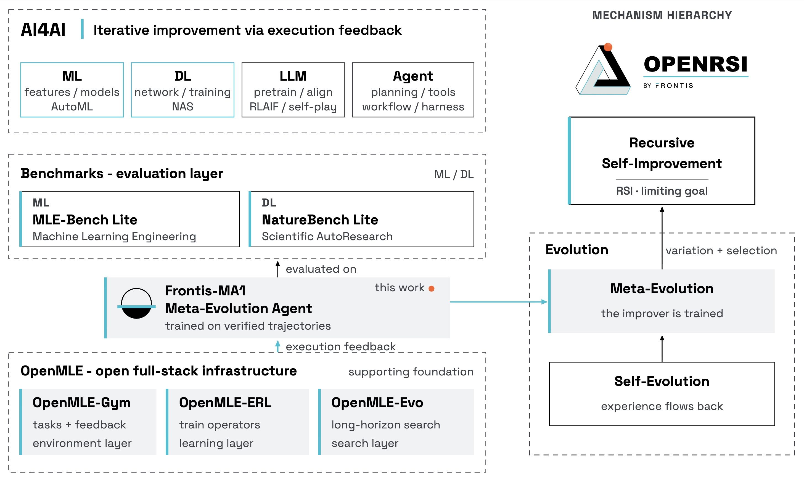

> **论文**：Frontis-MA1: Training an AI4AI Model towards Recursive Self-Improvement in Machine Learning Engineering
> **作者**：Junlin Yang, Che Jiang, Yu Fu, Tianwei Luo, Can Ren, Weizhi Wang, Kaikai Zhao, Hongyi Liu 等（Project Leaders: Junlin Yang, Che Jiang；通讯作者: Kaiyan Zhang, zhangkaiyan@frontis.cn）
> **arXiv ID**：2607.28568v1 [cs.CL]
> **发表时间**：2026-07-30
> **许可协议**：CC BY-NC 4.0（代码非商用许可）
> **代码仓库**：https://github.com/FrontisAI/OpenRSI（HuggingFace: FrontisAI/Frontis-MA1-35B、Frontis-MA1-30B）

## 第 1 章 概述

### 1.1 一句话定位

Frontis-MA1 是一个面向机器学习工程（MLE）的 meta-evolution agent——它将后训练与推理统一在四个原子程序演化算子（Draft / Improve / Debug / Crossover）之上，在开源全栈系统 OpenMLE 上训练得到，在 MLE-Bench Lite 上以单卡 RTX 4090（12 GB VRAM）预算逼近甚至超过远超自身规模的闭源前沿模型，并通过 NatureBench Lite 转移实验验证了"模型能力"与"搜索框架"两个正交维度均可独立迁移。

### 1.2 论文图表总览

| 编号 | 类型 | 内容概述 |
|------|------|----------|
| Figure 1 | 结果条形图 + Pareto | MLE-Bench Lite 全部模型 × harness 的 Medal Average 与 Human Rank 对比，展示 Frontis-MA1-35B 在算力-性能 Pareto 前沿的位置 |
| Figure 2 | 架构定位图 | OpenMLE 在研究版图中的定位，以及从 evolution → meta-evolution → RSI 的机制阶梯 |
| Figure 5 | 工作流总览图 | OpenMLE 训练与推理全流程：四个算子接口、SFT/RL 训练管线、OpenMLE-Evo 测试时搜索的端到端闭环 |
| Table 1 | 主结果表 | MLE-Bench Lite 22 任务的主结果：Valid Rate、Medal Average、Human Rank，覆盖 Frontis-MA1-35B/30B、base 模型及 GPT-5.6/Kimi K3/Claude Opus 4.8 等对比模型 |
| Table 2 | 转移实验表 | NatureBench Lite 10 任务上的 Match-SOTA（All S / All M）双因素分解：固定框架换模型、固定模型换框架 |

### 1.3 核心贡献

论文围绕"用 AI 改进构建 AI 的过程（AI4AI）"这一递归自我改进（RSI）目标，提出五项核心贡献：

1. **OpenMLE 全栈系统**。OpenMLE 将可验证任务环境（OpenMLE-Gym）、算子学习（OpenMLE-ERL）与长时程测试时搜索（OpenMLE-Evo）串联为完整的 RSI 研究栈。关键设计在于训练与推理共享同一套四个原子算子（Draft / Improve / Debug / Crossover），形成 meta-evolutionary loop——执行改进的算子本身被当作学习目标来训练，从而实现"改进者被改进"。

2. **OpenMLE-Gym 可执行环境**。提供 5,758 个质量门控可执行任务，包含 156 个 Curated Anchors、3,362 个 Kaggle Datasets 和 2,240 个 Kaggle Competitions。环境采用统一任务包格式（raw / public / private / metric.py），在隔离沙箱中执行并产出六种结构化反馈模式。Kaggle 数据流经四级漏斗筛选：Meta 目录约 11,000 条 → 3,972 eligible（36%）→ 2,839 executable（26%）→ 2,240 quality-gated（20%）。其规模显著超过 MLE-Bench（75）、MLE-Dojo（200+）、DSBench（74）、MLE-Smith（606）、MLGym-Bench 与 MLAgentBench（各 13）等已有基准。

3. **OpenMLE-ERL 算子训练**。分两阶段：执行锚定的 SFT 采用 budget-adaptive 策略收集，共 26,259 条示例（17,245 条 full responses 占 65.7% + 9,014 条 trajectory steps 占 34.3%）；在线 RL 引入自适应奖励边界、entropic advantage、异步 rollout 与 reward hacking 检测（o3-mini LLM judge 预检，命中则跳过沙箱并施加 reward −0.5）。两阶段共同训练四个原子算子。

4. **OpenMLE-Evo 经验驱动搜索**。测试时长程搜索框架，核心机制包括：结构化 experience card（14 类字段）与 experience board（7 类聚合）；质量-进步-新颖性三因子父选择（默认权重 $\lambda_s=1.0,\ \lambda_\Delta=0.6,\ \lambda_n=0.3$）；操作触发式按需记忆合成（Improve 取父节点 + 3 祖先 + 3 兄弟；Crossover 取双亲 + 各自 2 祖先 2 兄弟；Debug 取同错误签名的 3 个节点）；操作条件上下文构造。

5. **完整开源交付**。Frontis-MA1-35B 与 Frontis-MA1-30B 权重（BF16 + GGUF）、OpenMLE-Tasks 与 OpenMLE-SFT-Traces 数据集、训练与搜索代码、沙箱基础设施全部开源，支持完整复现 meta-evolution 循环。

### 1.4 关键结果速览

**主结果（MLE-Bench Lite，22 任务，12 h/任务，RTX 4090 12 GB VRAM）**：以 Qwen3.6-35B-A3B 为 base，Frontis-MA1-35B 将 Medal Average 从 39.39% 提升至 60.61%（配 OpenMLE-Evo），在 OpenMLE-Evo-Max profile 下进一步达到 71.21%，Human Rank 从 0.5828 提升至 0.8126。这一成绩超过 GPT-5.5 + Codex（68.18%）与 Claude Opus 4.8（63.64%），逼近 GPT-5.6 Sol 与 2.8T 参数的 Kimi K3（均为 72.73%）。

**搜索效率（66 task-runs 匹配对比）**：OpenMLE-Evo 相较 base 框架（AIRA-Evo），总 token 从 129.3M 降至 75.3M（−41.7%），prompt token −50.3%，评估节点数从 3,430 降至 3,004（−12.4%），而 new-best validation updates 从 229 升至 246（+7.4%）。每百万模型 token 的 new-best 产出率从 1.77 升至 3.27（+84.3%），Improve 操作命中 new-best 的比例从 4.73% 升至 9.36%（+98.1%）。

**能力迁移（NatureBench Lite，10 任务 held-out）**：双因素分解显示两个正交维度均可独立迁移。固定框架（OpenMLE-Evo NB adapter）换模型时（Qwen3.6-35B-A3B → Frontis-MA1-35B），All S 从 20% 升至 30%（+10pp），All M 从 50% 升至 70%（+20pp）；固定模型（Qwen3.6-35B-A3B）换框架时（AIRA-Evo → OpenMLE-Evo），All S 从 10% 升至 20%（+10pp），All M 从 20% 升至 50%（+30pp）。蛋白质变体效应预测轨迹上，Frontis-MA1 的相对差距 $g=0.1161$，远优于 base 的 $g=0.0243$。

**模态泛化**：在 MLE-Bench Lite 的模态分组中，Frontis-MA1 共带来 +14 medals，其中 image +2、text +4、tabular +1、audio +4、multimodal +3。

## 第 2 章 研究背景与动机

### 2.1 从 AI4AI 到递归自我改进

递归自我改进（RSI）的核心前提是：AI 系统必须能够改进"构建 AI 的过程"本身，即 AI4AI。论文将这一抽象目标落地为一条清晰的机制阶梯——从普通 evolution（程序在搜索中演化）到 meta-evolution（驱动演化的算子本身被训练），最终通向 RSI（改进者被递归地改进）。



*图2：左侧展示 OpenMLE 在 AI4AI 版图中的位置（MLE 任务域 + 三层基础设施），右侧为 evolution → meta-evolution → RSI 的机制阶梯——橙色回路标明本工作所处的「改进者本身被训练」层级，这也是 Frontis-MA1（Meta-evolution Agent）命名的由来。*

论文形式化定义了 meta-evolution 的核心对象：任务 $\tau$、算子 $a_t$、程序生成策略 $g_\theta$、隔离沙箱执行环境 $E$、评分函数 $R_\tau$。四个原子算子构成程序空间上的演化操作集：

$$\mathcal{A} = \{\text{Draft},\ \text{Improve},\ \text{Debug},\ \text{Crossover}\}$$

SFT 与 RL 两个训练阶段统一为同一个演化学习目标：

$$\mathcal{L}_{\text{evo}}(\theta) = -\mathbb{E}_{(\tau_i,\, a_i,\, c_i,\, p_i)}\bigl[\, w(s_i)\, \log g_\theta(p_i \mid \tau_i,\, a_i,\, c_i)\,\bigr],\quad s_i = R_{\tau_i}\bigl(E(p_i,\, \tau_i)\bigr)$$

其中 $c_i$ 为操作条件上下文，$p_i$ 为生成的程序，$w(s_i)$ 为质量权重。这一形式化的关键洞察是：训练与推理操作的是同一个算子空间——训练阶段学到的算子能力在推理时直接驱动搜索，搜索产出的经验又能回灌训练，形成闭环。

### 2.2 MLE 作为 RSI 研究的 testbed

论文选择机器学习工程（MLE）作为研究 RSI 的具体 testbed，动机在于其提供了一条"可执行、可验证"的能力度量路径。与开放式 coding 或通用软件开发不同，MLE 任务天然带有客观评分：每个任务配备 raw / public / private 三套数据与 metric.py，程序在隔离沙箱中执行后产出可直接比较的数值分数。这使得"改进"这一概念从主观判断转化为可量化、可排序的信号，为定义算子级奖励（如基础奖励函数）提供了基础：

$$r_{\text{base}}(\tilde{s};\, b_{\text{best}},\, b_{\text{worst}}) = \text{clip}\!\left(\frac{\tilde{s} - b_{\text{worst}}}{b_{\text{best}} - b_{\text{worst}}},\ 0,\ 1\right)^{\alpha},\quad \alpha > 0$$

OpenMLE-Gym 以此为契约，覆盖 Tabular（44%）、Image（18%）、Time Series（13%）、Multimodal（11%）、Text（9%）、Audio（2%）、Video（1%）等多种模态，任务类型以 Classification（56%）和 Regression（31%）为主。环境的五维语义质量门控（task validity、data sufficiency、raw-data usage、task complexity、data quality）确保了任务的可执行性与评测可靠性，满足 RSI 研究对"可重复、可度量"的严格要求。

### 2.3 Prior work 的三条研究线

论文将已有工作归纳为三条互补但各自不完整的研究线：

**第一条：推理时 harness / agent 框架。** 以 Claude Code、Codex、Gemini CLI 等为代表的推理时编码 agent harness，提供多轮工具调用、文件操作与执行反馈循环。这类系统在通用软件工程任务上表现优异，但其 agent 行为逻辑与底层模型耦合——搜索策略、记忆管理和工具编排硬编码在 harness 中，无法被训练或迁移，因此不具备 meta-evolution 能力。论文在匹配 harness 对比中提供了直接证据：同一模型接入不同 harness 时性能波动显著（如 GLM-5.2 在 Claude Code 下 59.09%，在 OpenMLE-Evo 下 62.12%，Evo-Max 下 66.67%；MiniMax M3 在 Codex 下 54.55% → Evo 59.09% → Evo-Max 65.15%），说明 harness 设计对 MLE 性能有实质影响，但这些 harness 本身是静态工程产物而非可学习对象。

**第二条：可执行任务环境。** MLE-Bench（75 任务）、MLE-Dojo（200+）、DSBench（74）、MLE-Smith（606）、MLGym-Bench（13）、MLAgentBench（13）等基准提供了带执行反馈的任务集合。然而这些环境普遍规模有限、模态覆盖窄、且缺少从任务构建到质量门控的完整流水线。OpenMLE-Gym 的 5,758 个任务和四级 Kaggle 漏斗筛选流程（11,000 → 3,972 → 2,839 → 2,240）在规模与质量管控上均超越此前工作。更重要的是，先前环境通常只服务于评测，而 OpenMLE-Gym 同时服务于训练（SFT/RL 的 rollout 环境）与推理（搜索的执行后端），实现了环境契约的统一。

**第三条：执行反馈驱动的 post-training。** 以 TTT-Discover 为代表的工作探索了用执行反馈（测试通过率、运行时指标）作为奖励信号来 post-train 编码模型。这类方法验证了"执行即奖励"的可行性，但通常聚焦于单一目标（如正确性）或单一操作（如 Debug），未将训练目标与推理时搜索的算子空间对齐。OpenMLE-ERL 将奖励信号统一到四个原子算子的演化目标 $\mathcal{L}_{\text{evo}}$ 上，使训练后的算子能力直接服务于推理搜索，而非仅服务于某个静态 agent prompt。

三条线的共同缺口是：没有任何一条单独构成 meta-evolution loop——harness 不可训练，环境不闭环，post-training 目标与推理脱节。OpenMLE 的设计正是将三者统一在同一算子接口下。

### 2.4 与现有系统的差异：审计视角

论文通过一组匹配对比（模型固定、仅切换 harness）系统审计了 OpenMLE 相对于现有 agent 框架的差异。从该审计视角看，OpenMLE-Evo 相较 AIRA-Evo 及各类 baseline harness 的核心差异体现在三个层面：

**算子可学习性。** 现有 harness 的搜索逻辑（如何选择代码片段改进、如何组织上下文、何时触发调试）是固定的工程规则。Frontis-MA1-35B 配 OpenMLE-Evo 相较配 AIRA-Evo 提升 +7.58pp（53.03% → 60.61%），而这正是同一模型在不同搜索框架下的差异——差距来自框架本身是否针对该模型的算子分布做过对齐。OpenMLE-Evo 的三因子父选择与操作触发记忆合成为了"可训练的搜索策略"提供了结构化接口。

**上下文效率。** 审计数据显示，OpenMLE-Evo 的 Improve prompt 平均长度从 102.8K 字符降至 35.7K（−65.3%），99th 百分位从 389.0K 降至 54.3K（−86.1%）；Crossover prompt 平均从 140.4K 降至 55.3K（−60.6%），99th 百分位从 419.2K 降至 78.4K（−81.3%）。上下文压缩并非简单截断，而是基于操作条件的按需记忆合成——不同算子检索不同结构的经验（祖先、兄弟、同错误签名节点），使有效信息密度大幅提升。

**单位算力产出。** 在 66 组匹配 task-runs 中，OpenMLE-Evo 以更少的 token（−41.7%）和更少的评估节点（−12.4%）产出了更多的 new-best updates（+7.4%），每百万模型 token 的 new-best 产出率提升 +84.3%。这表明效率提升来自搜索质量而非暴力枚举。

更广泛的 B 组对比（在更丰富的 Evo 上下文下评测多个前沿模型）进一步刻画了 OpenMLE-Evo 的可迁移性：Grok-4.5 达 65.15%、LongCat-2.0 与 Doubao Seed 2.1 Pro 各 56.06%、Qwen3.7 Plus 与 DS-V4 Pro 各 54.55%——不同模型在 OpenMLE-Evo 上均能获得稳定增益，验证了框架与模型的正交解耦。
## 第 3 章 OpenMLE 全栈与 OpenMLE-Gym 可验证环境

### 3.1 全栈设计：训练与推理共享算子接口

OpenMLE 的核心设计原则是**用同一组可训练原子算子把后训练与测试时搜索耦合成一个 meta-evolutionary 循环**。系统由三个组件构成：

| 组件 | 职责 | 核心产出 |
|------|------|---------|
| **OpenMLE-Gym** | 构建、描述、执行、质量门控可验证 MLE 任务包 | 5,758 个可执行任务 + 隔离沙箱执行 |
| **OpenMLE-ERL** | 用执行反馈训练程序演化算子 | Draft/Improve/Debug/Crossover 四个算子 |
| **OpenMLE-Evo** | 组合算子的经验驱动长时程搜索 | 结构化经验 + 三因子父选择 + 按需记忆 |

四个**原子程序演化算子**（Atomic Operators）是全栈共享接口：

| 算子 | 功能 | 角色 |
|------|------|------|
| **Draft** | 从零生成程序 | 新分支起点 |
| **Improve** | 基于执行反馈精炼父程序 | 局部优化 |
| **Debug** | 修复失败程序 | 错误恢复 |
| **Crossover** | 重组两个父程序 | 结构融合 |

训练阶段，SFT 与 RL 直接优化这些算子在给定 `(任务, 算子, 上下文)` 条件下的程序生成分布；推理阶段，OpenMLE-Evo 的搜索控制器反复调用同一组算子扩展解空间。**被训练的模型既是训练栈的产品，又是演化搜索的变异引擎**——这正是论文所称的 meta-evolution（改进者本身被训练）。


*图5：OpenMLE 的训练与推理闭环——同一组 Draft/Improve/Debug/Crossover 算子贯穿演化推理（上）、执行锚定 SFT（中）与执行反馈 RL（下），构成 meta-evolutionary loop。*

### 3.2 问题形式化

每个 MLE 任务 $\tau$ 包含：自然语言规范、可见数据资产、提交契约、任务专用评估器、沙箱执行环境。在时间步 $t$，搜索算法选择算子 $a_t$，构建算子上下文 $c_t$（零个或多个父程序及其执行反馈），模型提出程序：

$$p_t \sim g_\theta(\cdot \mid \tau, a_t, c_t), \quad s_t = R_\tau(E(p_t, \tau))$$

其中 $g_\theta$ 是参数化为语言模型的算子条件程序生成策略，$E$ 是沙箱执行，$R_\tau$ 是任务专用评估器。每个程序及其执行反馈存入任务本地程序库，在有限执行预算内，演化推理寻找最高带符号分数：

$$p^\star = p_{\arg\max_{t \in \mathcal{I}} \tilde{s}_t}$$

Meta-evolution 通过优化 $\theta$ 使 $g_\theta$ 对执行结果更强的程序赋予更高概率。SFT 与 RL 统一为：

$$\mathcal{L}_{\text{evo}}(\theta) = -\mathbb{E}_{(\tau_i, a_i, c_i, p_i)}\left[ w(s_i) \log g_\theta(p_i \mid \tau_i, a_i, c_i) \right]$$

其中 $s_i = R_{\tau_i}(E(p_i, \tau_i))$ 是执行分数，$w(s_i)$ 将结果转为学习权重。

### 3.3 OpenMLE-Gym 环境契约

每个 Gym 任务是一个环境实例，由五要素定义：

| 要素 | 内容 |
|------|------|
| **任务/状态** | 任务规范、公开数据、隐藏评估器、资源预算、当前工作区状态 |
| **动作** | 智能体提交的 MLE 程序及其执行需求 |
| **转移** | 沙箱执行：物化工作区 → 运行程序 → 提交有效时调用评估器 |
| **观察** | 结构化记录：执行状态、任务分数、日志、错误类型、产物、运行时元数据 |
| **奖励** | 评估器返回的可验证任务专用分数 |

### 3.4 三来源任务构建

OpenMLE-Gym 从三条互补路径构建任务，占据质量-规模权衡的不同位置：

| 来源 | 数量 | 质量特征 |
|------|------|---------|
| **Curated Anchors** | 156 | 从已有论文/基准手工选择，置信度最高，规模受限 |
| **Kaggle Datasets** | 3,362 | 扩展 MLE-Smith 数据到任务管线，包级质量门控，规模大 |
| **Kaggle Competitions** | 2,240 | 人类撰写的规范+评估指标+提交协议，外部排行榜佐证 |

统一可执行任务包格式：

```
task_package/
├── raw/                  # 原始竞赛资产
├── data/
│   ├── public/           # 智能体可见：description.txt, train.csv, test.csv, sample_submission.csv
│   └── private/          # 隐藏答案：test_answer.csv
└── utils/
    ├── prepare.py        # 确定性分割训练/测试、隔离公私数据
    └── metric.py         # 验证提交并返回标量反馈
```

Kaggle 竞赛分支的漏斗：Meta Kaggle 目录约 11,000 个竞赛 → 资格筛选后 3,972 个（36% 保留）→ 可执行包 2,839 个（26%）→ 质量门控任务 2,240 个（20%）。构建过程中 prepare.py 执行失败返回反馈用于有界重试，无法产出有效标量指标的任务在语义过滤前移除。

### 3.5 任务质量过滤

LLM 质量过滤器对每个任务包联合检查任务描述、原始文件、处理脚本、处理后输出与代表性数据样本，返回五个维度的结构化判断：

| 维度 | 检查内容 |
|------|---------|
| **任务有效性** | 是否存在平凡规则可解的退化目标 |
| **数据充分性** | 训练/评估信号是否不足 |
| **原始数据使用** | 是否表面化使用源资产 |
| **任务复杂度** | 难度是否与数据匹配 |
| **数据质量** | 泄漏、标注错误、处理畸形 |

仅保留通过指标验证且收到严格 `recommended` 决定的任务，将语义质量评估与可执行性检查分离。

### 3.6 沙箱执行架构

共享沙箱执行后端：集中式调度器接收 API 请求、记录任务、跟踪 worker 可用性、按资源需求分发到 CPU/GPU Docker worker。每个 worker 物化隔离任务工作区、挂载任务数据与评估器、执行候选程序、将日志/提交/输出/产物写回共享存储。

返回六种反馈模式，区分无效执行与弱任务性能：

| 反馈模式 | 触发条件 | 可用信号 |
|---------|---------|---------|
| **Success** | 训练完成并写出 submission.csv | 有效打分轨迹（如 score 0.9991） |
| **Runtime error** | 代码调用不支持的 API | traceback、退出码 |
| **Missing code** | main.py 为空 | 执行前诊断 |
| **Missing submission** | 进程成功退出但无提交 | 区分进程成功与有效提交 |
| **Scoring failed** | 提交违反评估器 schema | 评估器侧验证错误 |
| **Timeout** | 超出执行预算 | 部分 stdout、超时元数据 |

### 3.7 规模与分布

OpenMLE-Gym 共 5,758 个任务，与现有可执行任务资源相比规模领先：MLE-Smith 606、MLE-Dojo 200+、DSBench 74、MLE-Bench 75、MLGym-Bench 13、MLAgentBench 13。模态分布：Tabular 44%、Image 18%、Time Series 13%、Multimodal 11%、Text 9%、Audio 2%、Video 1%、Other 2%；任务类型：Classification 56%、Regression 31%。由于源数据许可与版权约束，全量任务包数据发布 1,415 个；其余 4,343 个发布 prepare.py 与 metric.py 脚本而不重新分发源数据。

## 第 4 章 OpenMLE-ERL：用执行反馈训练演化算子

### 4.1 训练目标：有限预算内的最优解

演化式 AutoResearch 以**有限搜索预算内找到的最佳可执行程序**为评判标准。控制器可能调用 Draft/Debug/Improve/Crossover 数百至数千次，因此模型必须学会的不只是单次解生成，而是随搜索展开持续修复、精炼、重组程序。SFT 与 RL 互补：执行锚定 SFT 从强教师蒸馏完整解与成功的局部修订，扩大模型的可执行行为集；RL 在该扩大的分布内把概率移向更优候选。

这一分工有实证依据：RLVR 的 RL 能通过强化已奖励的解提升 Pass@1，但在大 $K$ 下收益有限；教师蒸馏则能引入基础模型采样支撑之外的行为。

### 4.2 执行锚定监督微调（SFT Warm Start）

**预算自适应收集**：对每个任务执行采样程序，按有效性与任务专用分数保留样本。收集在达到接受示例配额或任务耗尽执行预算时停止——简单任务提前终止，把验证算力分配给稀疏成功任务。这一困难感知拒绝策略（difficulty-aware rejection）把验证计算导向仍能恢复有用监督的任务。

两条采样路径：

| 路径 | 方式 | 贡献 |
|------|------|------|
| **并行路径** | 独立采样执行完整 Draft 解 | 17,245 个完整响应 |
| **演化路径** | 对已执行程序应用 Improve/Debug/Crossover，保留高质量局部轨迹段的有用步骤 | 9,014 个轨迹步 |

两条路径合计形成 **26,259 示例的 SFT 语料**。演化路径的片段构建规则：Draft 片段必须以正分数结束；Improve 片段必须优于其父程序；Crossover 片段必须优于两个父程序中较好者；保留终点须达到铜/银/金级别。DeepSeek-V4-Pro 以温度 0、固定 JSON schema 对每个完整片段判定每步是否被后续继承并贡献终点。

语料分布（图 22）：

| 维度 | 分布 |
|------|------|
| 监督类型 | 完整响应 17,245（65.7%）/ 轨迹步 9,014（34.3%） |
| 算子分布 | Draft 19,436（74.0%）/ Improve 1,741（6.6%）/ Crossover 742（2.8%）/ Debug 4,340（16.5%） |
| 中位消息长度 | 完整响应 8,407 tokens / 轨迹步 14,051 tokens |

SFT 超参数（Table 4）：

| 项 | Frontis-MA1-30B | Frontis-MA1-35B |
|----|-----------------|-----------------|
| 基础模型 | Qwen3-30B-A3B-Thinking-2507 | Qwen3.6-35B-A3B |
| 训练方式 | 全参数 SFT（SLIME + Ray + Megatron-LM） | 同左 |
| 上下文截断 | 32,768 tokens | 同左 |
| 精度 | bfloat16 | 同左 |
| 全局批大小 | 128（per-device 1 + 动态批处理） | 同左 |
| 梯度累积 | 64 microbatches | 32 microbatches |
| 学习率 | 3.0 × 10⁻⁵，cosine 衰减至 0，0.1 warmup | 同左 |
| Epochs | 3 | 同左 |

### 4.3 执行反馈强化学习

**奖励归一化与自适应边界**。不同任务优化不同指标（accuracy vs log loss），即使方向对齐后原始分数范围仍不可比。先定义有界基础奖励：

$$r_{\text{base}}(\tilde{s}; b_{\text{best}}, b_{\text{worst}}) = \operatorname{clip}\left( \frac{\tilde{s} - b_{\text{worst}}}{b_{\text{best}} - b_{\text{worst}}}, 0, 1 \right)^{\alpha}, \quad \alpha > 0$$

固定边界（排行榜或理论极值）通常远宽于当前策略实际到达的分数区间，导致有意义的程序差异坍缩为近似相同奖励。OpenMLE 从每个任务的历史 on-policy 分数前沿推导**更紧的自适应边界**并重新映射：排序可得分数 $x_{(1)} \ge x_{(2)} \ge \cdots \ge x_{(K)}$，最优观察分数定上端，第 16 优分数定下端参考点（不足 16 个分数时用最低分）：

$$B_{\text{dyn}} = x_{(1)}, \quad W_{\text{dyn}} = x_{(\min(16, K))}$$

下端再向下扩展上端与下端差距的四分之一，防止紧密聚集时中等程序被截断为零。边界随策略进化，保留当前候选所在区域的判别力。

**上尾集中的 entropic advantage**。MLE 评估奖励最优解质量，勉强可行的提交不应与顶级候选获得相同正奖励。OpenMLE 使用熵优势放大每个 rollout 组顶部的奖励差距：

$$A_{\text{ent},i} \approx \frac{\exp(\beta c_i)}{\frac{1}{K-1} \sum_{j \ne i} \exp(\beta c_j)} - 1$$

其中 $c_i = r_{\text{proc},i} - \max_j r_{\text{proc},j}$ 为组内中心化后的处理奖励，$\beta$ 控制集中度，在固定熵/KL 预算下选择（KL$(q_\beta \| \text{Unif}(K)) \approx \log 2$，最大搜索值 $10^6$，60 次二分迭代）。这些优势取代裁剪策略目标中常规的 GRPO 式组归一化信号。图 8 显示：熵加权使最佳候选的处理优势从 1.58 提升到 6.39（4.0× 更强的上尾信号）；与自适应边界结合后，平滑的 Group Best Reward 峰值达 0.666（+0.089 vs 先前构造），测试奖牌率从 24.2% ± 5.7% 提升到 34.8% ± 4.3%。

**异步 rollout 消除掉队者**。MLE RL 的主导延迟来自执行候选程序，运行时间跨任务差异巨大。同步批次中，完成组必须等待最慢沙箱作业。OpenMLE 独立启动生成-执行组，训练器从队列消费每个完成组，解耦策略更新与最慢作业。实测 40 个匹配步中，平均步时从同步 97.0 分钟降至异步 50.8 分钟（1.91×）；两个代表性异步运行中每任务步数保持在运行中位数 ±2 步内，变异系数 1.56% 与 2.06%。

**信息态选择（Parent Fitness）**。演化 RL 不仅选任务和算子，还要选算子作用的程序状态。均匀父采样把更新浪费在耗尽或无信息区域；贪心采样反复训练当前最优解并压制多样性。OpenMLE 用 fitness 比例效用组合三项：

$$F(p) = N_{0.5}(U_p) + N^{\text{opt}}_{0.5}(L_p) + N_{0.5}(C_p)$$

其中 $U_p$ 偏好强父程序（reward），$L_p$ = 子程序奖励方差（识别算子结果仍有信息的区域），$C_p$ = 随重复访问递减的冷却系数（防止单一最优解垄断 rollout 预算）。Improve/Crossover 的候选集限于正奖励程序，Debug 限于非正奖励程序。

**Reward hacking 检测与预防**。训练中观察到（尤其是早期实验的小模型）RL 在困难任务上奖励迅速停滞在极低水平。案例研究显示模型出现显著 reward hacking——典型行为是取样本提交随机打乱后提交。缓解流程：(1) 用 o3-mini 作为 LLM judge；(2) 代码进入沙箱前执行 reward hack 检查；(3) 检测到则跳过沙箱执行并分配奖励 −0.5。

RL 超参数（Table 5）：

| 项 | Frontis-MA1-30B / 35B |
|----|----------------------|
| RL 初始化 | SFT warm-start 检查点 |
| 训练框架 | SLIME + Ray + SGLang |
| 算子采样概率 | Draft 0.50 / Improve 0.17 / Debug 0.17 / Crossover 0.16 |
| Rollout 组 | 16 prompts × 16 samples，全局批 128，每 rollout 2 优化步 |
| 生成 | temperature 1.0，最大响应 24,576 tokens |
| 优势/目标 | GSPO + TTT-Discover 式奖励后处理，clip ε = 3.5 × 10⁻⁴，TIS 启用 |
| 优化器 | Adam，LR 1.0 × 10⁻⁶，常数调度，weight decay 0.1，β₁=0.9，β₂=0.98 |
## 第 5 章 OpenMLE-Evo：经验驱动的长时程搜索

### 5.1 从测试时缩放到测试时学习

对 AI-for-AI 与递归自我改进而言，生成更多候选还不够：**搜索必须把执行结果转化为可复用的证据，改变它接下来探索什么**。演化式测试时搜索提供这一闭环——提出、执行、从经验学习、在长时程上适应后续扩展。

OpenMLE-Evo 沿用 AIRA-Evo 风格种群循环组合训练好的算子，但重新设计了循环使用执行证据的方式：

| 维度 | 原版 AIRA-Evo | OpenMLE-Evo |
|------|--------------|-------------|
| 记忆存储 | 大体自由形式 | 结构化 experience card + board |
| 记忆合成 | 急切（所有节点） | 按需（仅被选中的节点） |
| 父选择 | 主要按标量 fitness | 质量 + 进步 + 新颖性三因子 |
| 上下文供给 | 不同算子共享相似历史 | 算子条件的有界上下文 |

### 5.2 结构化经验积累（Experience Card & Board）

搜索经验在两个互补层级积累：

**节点级 experience card**（每次沙箱评估后创建）：包含身份与谱系（schema_version, node_id, step_id, operator, parents）、观察结果（score, fitness, reward, status, is_buggy, error_signature）、资源核算（sandbox_time, model_time, cost, token 计数）、方法特征（imports, method_family_auto, family_count_before）、派生搜索信号（delta_vs_parent, novelty_score, is_new_direction, rank, current_best, selection_utility）、语义证据（plan, analysis, 可选的 rich_summary）。

**任务级 experience board**（由所有卡聚合）：全局最优（num_nodes, best_node, best_score, current_best_family）、方法族覆盖（family_best_nodes, underexplored_families, failure rate）、进展与失败（score_history, recent_delta_trend, repeated_errors, operator_counts）、拓扑与节点状态（parent_graph, novelty_by_node, rank_by_node）、资源与审计（runtime_stats, parent_selection_weights）。

实测记录示例（leaf-classification 的一个成功 Improve 节点）：step_id=10，验证 log loss fitness=0.012080，delta_vs_parent=0.753352，method_family_auto=ensemble+xgboost+neural_net+cv，novelty_score=0.57735，rank=1，current_best=true，178.58 秒沙箱时间，24,564 总模型 tokens。卡说明节点取得了什么，板说明该结果在种群中的位置。

### 5.3 三因子父选择（Experience-Guided Parent Selection）

原版 AIRA-Evo 的父采样概率主要来自归一化 fitness，几乎完全由当前验证分数驱动，倾向集中扩展已强节点；进步量、新颖性等信号未被显式考虑。OpenMLE-Evo 将经验卡中的确定性元数据转为三个互补因子：

$$U_i = \lambda_s \tilde{s}_i + \lambda_\Delta \tilde{\Delta}_i + \lambda_n \nu_i, \quad P(i \mid \mathcal{I}) = \frac{\exp(U_i / \tau)}{\sum_{j \in \mathcal{I}} \exp(U_j / \tau)}$$

其中 $\tilde{s}_i$ 是方向感知 min-max 归一化验证分数，$\tilde{\Delta}_i$ 是相对最强父的归一化正进步（无有效父则为 0），$\nu_i = 1/\sqrt{1 + N_{f_i}}$ 是方法族新颖性（$N_{f_i}$ 为同一自动检测方法族中此前记录的卡数）。默认权重 $\lambda_s / \lambda_\Delta / \lambda_n = 1.0 / 0.6 / 0.3$。

实测案例（right-whale 检测，图 18）：10 父候选池中，父 A 以验证 AUC 0.99187 居分数榜首（深 ResNet-SE + 64-Mel + AMP + TTA），父 B 分数 0.98773 仅排第六但进步量第一（相对父 +0.00568，保留 Log-Mel + Delta/Delta-Delta 时间通道）。Score/Gain/Novelty 权重 1.0/0.6/0.3 下，父 B 升至效用榜首，选择概率从 score-only softmax 的 10.47% 升至 17.09%（+63.2% 相对），被选后执行 Improve，子节点验证 AUC 0.99203、held-out AUC 0.99386。**三因子不强制低分分支获胜，而是让高增益、结构不同的分支在足够长时间内保持可行动。**

### 5.4 操作触发式记忆合成（Operation-Triggered Memory Synthesis）

原版 AIRA-Evo 默认急切调用 LLM 总结每个已评估节点，把推理预算花在从未被后续算子选中的节点上。OpenMLE-Evo 将确定性存储与语言模型合成分离：沙箱评估后保留 experience card/board，但推迟丰富的自然语言记忆，直到 Improve/Crossover/Debug 调用选出相关节点。此时仅对被选父节点及其检索到的祖先、兄弟或错误相关尝试调用记忆模型，并缓存生成的 method/parent-comparison 摘要。

各算子的默认检索证据集：

| 算子 | 默认检索证据 | 记忆目的 |
|------|-------------|---------|
| Draft | 无继承节点记忆 | 从任务规范独立开始新分支 |
| Improve | 选中父 + 3 个最近祖先 + 3 个直接兄弟 + 相关 board 字段 | 保留父中有效部分，识别谱系中帮助/伤害的变化，对比邻近备选 |
| Crossover | 双父 + 各自 2 祖先 2 兄弟 + 族统计 + 重复错误 + 方法族互补提示 | 识别分支间兼容优势与冲突，避免机械拼接 |
| Debug | 当前 buggy 节点 + 同错误签名节点 + 近期尝试（默认共 3 个） | 复用同失败模式的修复，未见过错误保留近期上下文回退 |

记忆合成 prompt 要求返回恰好两个 JSON 字段：`method_overview`（模型、特征、验证、集成、运行时、提交逻辑的 2-5 句）与 `parent_comparison_experience`（相对父改变了什么、分数/状态/运行时是否改善、应复用或避免什么）。仅用提供的代码、执行输出、分数、delta、运行时与状态，禁止编造结果。

### 5.5 算子条件上下文构造

选中父后，OpenMLE-Evo 构造小而算子条件的上下文而非追加完整自由形式历史。Improve：连接选中节点的确定性经验记录（验证分数、相对父改进、方法族、运行时、排名、incumbent 状态、方向新颖性）+ 垂直祖先迹 + 水平直接兄弟集（共享至少一个父，按 score-improvement-novelty 效用排序，仅保留最有信息量的）。全局 experience board 补充当前最优方法族、族级成败统计、未探索方向、近期改进趋势、重复错误签名。Crossover 对双父分别构造并添加方法族互补提示；Debug 检索同错误签名的先前尝试。检索信号保持确定性，摘要懒惰生成并缓存，避免无界历史冗余，且 prompt 指定剩余搜索预算、剩余步数与每次运行执行上限。

**实测效果（nomad2018，图 17）**：原版 AIRA-Evo 单谱系反复修复——Draft 失败后连续 7 次 Debug 继承不断膨胀的完整历史，最终修复验证 RMSE 0.06633、held-out 0.06096。OpenMLE-Evo 在 step 81 用互补证据构造定向 Crossover：父 1 贡献原子属性、动态共价边、晶胞体积（验证 RMSE 0.06309），父 2 贡献健壮的 .xyz 几何解析器（验证 RMSE 0.06573），水平记忆把 RDF-cache TypeError 与 3328×94 特征不匹配标记为负面证据。结果程序结合物理信息 GNN 与健壮解析器、密度描述符、cosine 调度，验证 RMSE 0.06087、held-out 0.05410，分别比原轨迹低 8.2% 与 11.3%。

## 第 6 章 代码实现详解

### 6.1 开源仓库概览

论文完整交付 OpenRSI 仓库（FrontisAI/OpenRSI，17 commits，CC BY-NC 4.0 非商用许可），代码结构按三组件划分，每个组件独立管理环境与依赖：

```
OpenRSI/
├── OpenMLE-Gym/          # 可执行任务构建与评测
├── OpenMLE-ERL/
│   ├── SFT/              # rollout 收集、选择与监督微调
│   └── RL/               # 执行锚定强化学习
├── OpenMLE-Evo/          # 长时程搜索运行时 + benchmark 适配器
├── assets/               # 图表与品牌资源
├── docs/                 # 项目页、结果、训练与发布范围文档
├── LICENSE               # CC BY-NC 4.0
└── NOTICE
```

OpenMLE-Evo-Max 是 OpenMLE-Evo 内部的异步多 GPU 搜索 profile，并非独立代码树。模型权重、任务产物、训练语料、外部 benchmark 环境、服务凭据与私有基础设施配置与源码仓库分开分发。

### 6.2 HuggingFace 发布面

| 产物 | 位置 | 内容 |
|------|------|------|
| Frontis-MA1-35B | `huggingface.co/FrontisAI/Frontis-MA1-35B`（+ GGUF） | 主模型 BF16 权重 |
| Frontis-MA1-30B | `huggingface.co/FrontisAI/Frontis-MA1-30B`（+ GGUF） | 伴生模型 BF16 权重 |
| OpenMLE-SFT-Traces | `datasets/FrontisAI/OpenMLE-SFT-Traces` | 监督轨迹（26,259 示例） |
| OpenMLE-Tasks | `datasets/FrontisAI/OpenMLE-Tasks` | 审计任务清单与可发布任务产物 |
| Collection | `collections/FrontisAI/frontis-ma1` | 全部模型与数据集汇总 |

技术栈依赖：Qwen（骨干）、SLIME（训练框架）、Ray（分布式）、SGLang（推理服务）、Megatron-LM（模型并行）、Transformers、MLE-Bench 与 NatureBench（评测）。

### 6.3 SFT 数据生成管线（OpenMLE-ERL/SFT）

**并行路径采样**：教师模型为每个标准化任务生成多个独立 Draft 解并全部执行。第一批用 GLM-4.7：同任务有效执行分数去重后按分数排序保留 Top-4，贡献 11,519 示例。第二批用 GLM-4.7 + Qwen3-30B-A3B-Thinking-2507：联合排序，GLM 候选进联合 Top-4 保留，Qwen 候选仅当排名第一时保留（每任务最多 4 条），贡献 5,726 示例（5,075 GLM + 651 Qwen）。两批合计 17,245 完整响应。

**演化路径采样**：GLM-4.7 驱动 AIRA-Evo 搜索（Draft/Improve/Crossover/Debug），生成带父关系的搜索树。局部片段从 Draft/Improve/Crossover 节点开始，沿真父子边跟随连续 Debug 后代，到下一个 Draft/Improve/Crossover 节点结束。Draft 片段须以正分数结束、Improve 须优于父、Crossover 须优于双亲中较好者；终点须达奖牌级。DeepSeek-V4-Pro（温度 0，max 4,096 tokens，固定 JSON schema）按**因果继承准则**判定每步是否保留：核心策略/必要中间态/关键错误修复被后续继承且对终点有具体贡献才保留；纯装饰编辑、盲目重试、仅缩小规模避免资源限制、失败的环境修改与外部网络访问一律丢弃。

**全局硬过滤规则**（无条件丢弃）：环境修改（pip/conda install、subprocess 安装、改 sys.path、os.system 系统命令）、外部资源下载失败（wget/curl/requests/torch.hub.load/from_pretrained 首次下载）、网络访问失败（连接/超时/DNS/SSL/认证）。C-extension 二进制接口不匹配错误（如 numpy dtype size changed、pandas 与 numpy 版本不兼容）的下一步 Debug 也强制丢弃。

**语料组装**：统一 system-user-assistant 结构 → 精确去重 → 应用目标模型 chat template → 排除超过 32,768 tokens 的示例。最终 26,259 条：17,245 完整响应（65.7%）+ 9,014 轨迹步（34.3%）；算子分布 Draft 19,436（74.0%）/ Improve 1,741（6.6%）/ Crossover 742（2.8%）/ Debug 4,340（16.5%）；中位消息长度 8,407 tokens（完整响应）与 14,051 tokens（轨迹步）。

### 6.4 算子 Prompt 模板（OpenMLE-Evo）

四个算子的系统提示角色设定：Draft = 「Kaggle Grandmaster 提出高级方案」；Improve = 「改进既有方案」；Crossover = 「综合双方案优势、发现隐藏协同、工程化第三代方案」；Debug = 「定位根因修复」。所有模板共享公共约束：

- 执行预算提示：代码须在 `{{execution_timeout}}` 内完成，单个沙箱运行不超过预算
- 提交检查：`./submission.csv` 存在、行数与列与 sample_submission 一致、保留 sample id/顺序、无 NaN/inf
- 特征工程约束：显式对齐 train/test 列，拟合前处理缺失值
- 评分遮蔽：`{{previous_terminal_output_with_official_sandbox_score_redacted}}`——反馈中遮蔽官方沙箱分数，迫使模型从日志/错误信息推理而非死记分数
- Debug 额外约束：超时优先降计算量（更少 epochs/folds、更小输入、缓存特征或简化集成）

### 6.5 记忆合成与奖励实现要点

**记忆合成 prompt** 要求记忆模型（LLM）仅依据提供的代码、执行输出、分数、delta、运行时与状态，返回恰好两个 JSON 字段（`method_overview`、`parent_comparison_experience`），禁止编造。每个调用总结一个节点相对一个直接父节点；多节点检索时各自独立缓存摘要，仅在后续算子条件上下文中组合。

**奖励后处理实现**（RL 钩子）：原始分数转为带符号分数（larger-is-better 取正、否则取负）→ 静态有界基础奖励（理论/排行榜极值）→ 动态自适应边界（最优观察分定上端、第 16 优定下端、下端向下扩展差距 1/4）→ 组内熵优势。当组内奖励数 K<2 或全部相等时返回零优势；否则中心化 $c_i = r_{\text{proc},i} - \max_j r_{\text{proc},j}$，$\beta$ 由 KL$(q_\beta \| \text{Unif}(K)) \approx \log 2$ 二分确定（最大搜索值 $10^6$，60 次迭代），优势用留一分母：$A_i = \frac{e_i}{Z_{-i} + 10^{-12}} - 1$，$Z_{-i} = \frac{1}{K-1}\sum_{j \ne i} e_j$。

**推理期父选择实现**（C.4）：score 用方向感知 min-max 归一化（all-equal 时取 0.5）；improvement 仅保留相对最强父的正进步（无有效父为 0）；novelty $\nu_i = 1/\sqrt{1 + N_{f_i}}$。softmax 温度 $\tau$ 控制探索。最终提交选择不采样：确定性选取验证结果有效的最佳可执行候选。
## 第 7 章 实验结果与分析

### 7.1 实验设置

评测使用 MLE-Bench 官方 22 任务 MLE-Bench Lite 划分。除特别说明外，每个 OpenMLE-Evo 配置在固定每任务预算 12 小时、单张 RTX 4090（12 GB VRAM）下进行三次独立运行——**该每任务沙箱计算预算小于绝大多数已报告 MLE-Bench 评测**。三个聚合指标：

- **Valid Rate**：22 个任务中产生有效提交的平均任务数（x/22）
- **Medal Average**：获得任一 Kaggle 奖牌的任务平均占比
- **Human Rank**：被提交解超越的人类排行榜参与者占比，跨任务与运行平均（越高越好）

主模型 Frontis-MA1-35B 用于标题模型、系统、轨迹与转移分析；Frontis-MA1-30B 作为伴生模型验证后训练增益在第二个骨干与规模上可复现。

**OpenMLE-Evo-Max** 在两方面扩展 OpenMLE-Evo：(1) 用通用管线从公开竞赛产物蒸馏可复用跨任务先验（蒸馏前排除所有 MLE-Bench 相关来源）；(2) 启用异步多 GPU 并行搜索，同时保持总沙箱计算预算不变。

### 7.2 主结果：训练与搜索增益合成


*图1：MLE-Bench Lite 结果全景——横轴为 Medal avg@3，Frontis-MA1-35B 以 OpenMLE-Evo-Max 达 71.2%，逼近 GPT-5.6 Sol 与 Kimi K3（各 72.7%），超过 GPT-5.5（68.2%）；右侧 Pareto 面板按模型规模展示每模型最佳 harness。*

**Table 1 | MLE-Bench Lite 主结果**

| 模型 / 系统 | Framework | Valid Rate ↑ | Medal Average ↑ | Human Rank ↑ |
|------------|-----------|:---:|:---:|:---:|
| **A. 受控对比** | | | | |
| Qwen3.6-35B-A3B（base） | OpenMLE-Evo | 19.67/22 | 39.39% | 0.5828 |
| **Frontis-MA1-35B** | **OpenMLE-Evo** | **21.67/22** | **60.61%** | **0.7647** |
| **Frontis-MA1-35B** | **OpenMLE-Evo-Max** | **22.00/22** | **71.21%** | **0.8126** |
| Qwen3-30B-A3B-Thinking-2507 | OpenMLE-Evo | 17.33/22 | 34.85% | 0.5573 |
| Frontis-MA1-30B | OpenMLE-Evo | 21.67/22 | 53.03% | 0.7055 |
| Frontis-MA1-30B | OpenMLE-Evo-Max | 22.00/22 | 66.67% | 0.8053 |
| **匹配 harness 对比 · GLM-5.2** | | | | |
| GLM-5.2 | Claude Code | 21.00/22 | 59.09% | 0.7948 |
| GLM-5.2 | OpenMLE-Evo | 19.67/22 | 62.12% | 0.7069 |
| GLM-5.2 | OpenMLE-Evo-Max | 22.00/22 | 66.67% | 0.8164 |
| **匹配 harness 对比 · MiniMax M3** | | | | |
| MiniMax M3 | Codex | 22.00/22 | 54.55% | 0.7099 |
| MiniMax M3 | OpenMLE-Evo | 22.00/22 | 59.09% | 0.7994 |
| MiniMax M3 | OpenMLE-Evo-Max | 22.00/22 | 65.15% | 0.8007 |
| **匹配 harness 对比 · Kimi K2.6** | | | | |
| Kimi K2.6 | Claude Code | 18.00/22 | 59.09% | 0.7062 |
| Kimi K2.6 | OpenMLE-Evo | 21.67/22 | 66.67% | 0.7859 |
| **匹配 harness 对比 · MiniMax M2.7** | | | | |
| MiniMax M2.7 | Claude Code | 18.00/22 | 45.50% | 0.5547 |
| MiniMax M2.7 | OpenMLE-Evo | 22.00/22 | 50.00% | 0.7039 |
| **B. 更广 OpenMLE-Evo 系统上下文** | | | | |
| Grok-4.5 | OpenMLE-Evo | 22.00/22 | 65.15% | 0.8052 |
| LongCat-2.0 | OpenMLE-Evo | 21.00/22 | 56.06% | 0.7343 |
| Doubao Seed 2.1 Pro | OpenMLE-Evo | 20.33/22 | 56.06% | 0.7170 |
| Qwen3.7 Plus | OpenMLE-Evo | 21.67/22 | 54.55% | 0.7234 |
| DeepSeek-V4-Pro | OpenMLE-Evo | 21.67/22 | 54.55% | 0.6849 |
| DeepSeek-V4-Flash | OpenMLE-Evo | 21.33/22 | 51.52% | 0.6957 |
| GLM-4.7 | OpenMLE-Evo | 21.33/22 | 51.52% | 0.6521 |
| MiMo-V2.5-Pro | OpenMLE-Evo | 17.00/22 | 40.91% | 0.5213 |
| Step-3.7 Flash | OpenMLE-Evo | 19.00/22 | 27.27% | 0.4953 |
| **C. 通用编码代理参考** | | | | |
| GPT-5.6 Sol | Codex | 22.00/22 | 72.73% | 0.8891 |
| Kimi K3 | Claude Code | 22.00/22 | 72.73% | 0.8574 |
| GPT-5.5 | Codex | 21.00/22 | 68.18% | 0.7833 |
| Claude Opus 4.8 | Claude Code | 22.00/22 | 63.64% | 0.8219 |
| Gemini 3.5 Flash | Gemini CLI | 20.00/22 | 63.64% | 0.7499 |
| Claude Sonnet 5 | Claude Code | 22.00/22 | 59.09% | 0.7730 |
| Claude Sonnet 4.6 | Claude Code | 22.00/22 | 54.55% | 0.7670 |

**模型级增益**：相同 OpenMLE-Evo harness 下，执行锚定后训练将 Frontis-MA1-35B 相对 Qwen3.6-35B-A3B 基座的 Medal Average 提升 21.22 个百分点（39.39% → 60.61%），Human Rank 从 0.5828 提升到 0.7647。伴生 Frontis-MA1-30B 在 Qwen3 骨干上复现该增益：34.85% → 53.03%（+18.18pp）。

**系统级增益**：注入 MLE-Bench 不相交的跨任务先验并加宽并行树搜索（OpenMLE-Evo-Max）后，Frontis-MA1-35B 达 71.21%，超过 GPT-5.5 + Codex 3.03 个百分点，逼近 GPT-5.6 Sol 与 Kimi K3（各 72.73%）。训练与搜索增益在系统级合成。

**harness 增益**：固定模型时，OpenMLE-Evo 一致地把同一模型转化为比 Claude Code/Codex 等通用编码代理 harness 更强的 MLE 系统（GLM-5.2: 59.09% → 62.12%；MiniMax M3: 54.55% → 59.09%；Kimi K2.6: 59.09% → 66.67%）。相对原版 AIRA-Evo，Frontis-MA1-35B 匹配对比从 53.03% 升至 60.61%（+7.58pp）。跨模型家族一致性表明增益来自面向迭代 MLE 的专业化搜索而非单一模型-harness 配对。

**30B 交叉复制**：Frontis-MA1-30B 以 OpenMLE-Evo-Max 达 66.67% Medal Average、0.8053 Human Rank，证明后训练与搜索增益不局限于 35B 主检查点。

### 7.3 长时程自我改进

**聚合长时程改进**（图 12）：Frontis-MA1-35B + OpenMLE-Evo-Max 在整个长时程搜索中持续改进。验证集 Medal Rate 68.18%，最终测试 71.21%——最终解对测试集泛化强于验证。与 GPT-5.6 Sol（xhigh 推理）和 Kimi K3 各自 harness 的 72.73% 最终测试 Medal Rate 相当。

**结构化重组把额外搜索转化为更好模型**（leaf-classification，图 13）：对比模型在验证 Human Rank 上要么停滞要么改进但达不到奖牌级 held-out 解。Frontis-MA1-35B 先用 Debug 建立可行的图像与表格分支，再用 Crossover 保留互补证据，最后在融合模型稳定后以 Improve 升级。后段操作贡献 85.0% 的总验证增益——长时程花在积累与重组有用分支证据而非反复修复单一程序。轨迹达到验证 Human Rank 0.7713、held-out 0.9455（Bronze）；最强对比仅 0.6303 且无奖牌。三 epoch 平均下优势保持，排除单次幸运轨迹。

**记忆引导重组突破搜索平台**（mlsp-2013-birds，图 14）：对比轨迹停留在首个可行解附近，而 Frontis-MA1-35B 把提交修复视为起点，随后构建专门音频分支。记忆通过选择而非体量起作用：保留贡献健壮解析、不均衡处理、增强与表征质量的分支，把劣质 ResNet50 方向标记为要避免的证据。Improve 与 Crossover 结合贡献 91.9% 的总验证改进，验证 Human Rank 0.7284、held-out 0.8889（Silver）；最强对比验证仅 0.2963 且无奖牌。共享修正 prompt 排除了提交契约歧义解释。

### 7.4 解质量天花板（Solution Ceiling）

图 15 显示一致的质变：后训练与 OpenMLE-Evo-Max 不只是把更多解推过 Bronze 门槛，而是把成功解推向 Gold。30B 伴生对比复现同方向变化；固定模型 GLM-5.2 与 MiniMax M3 对比表明该模式也扩展到搜索改进。相对外部系统，Frontis-MA1-35B + OpenMLE-Evo-Max 超越 Claude Opus 4.8 + Claude Code 与 Gemini 3.5 Flash + Gemini CLI，并匹配 Kimi K3 的 Gold 率。

### 7.5 搜索效率与机制

**OpenMLE-Evo vs 原版 AIRA-Evo**（同一 Frontis-MA1-35B 检查点、同种子、12 小时预算，66 task-run/harness，图 16）：

| 指标 | 原版 AIRA-Evo | OpenMLE-Evo | 变化 |
|------|:---:|:---:|:---:|
| 总模型 tokens | 129.3M | 75.3M | −41.7% |
| Prompt tokens | 83.5M | 41.5M | −50.3% |
| 评估节点数 | 3,430 | 3,004 | −12.4% |
| New-best 验证更新 | 229 | 246 | +7.4% |
| 每 1M 模型 tokens 的 new-best 更新 | 1.77 | 3.27 | +84.3% |
| 设置新最佳的 Improve 比例 | 44/931 (4.73%) | 72/769 (9.36%) | +98.1% |
| Improve prompt 平均长度 | 102.8K chars | 35.7K chars | −65.3% |
| Improve prompt 99th 分位 | 389.0K chars | 54.3K chars | −86.1% |
| Crossover prompt 平均长度 | 140.4K chars | 55.3K chars | −60.6% |
| Crossover prompt 99th 分位 | 419.2K chars | 78.4K chars | −81.3% |

token 削减（−41.7%）远大于节点削减（−12.4%），说明节省主要来自每次扩展更便宜（结构化操作条件记忆阻止长历史反复序列化进每个请求），而非更早终止或更少评估。评估更少节点却记录更多 new-best 更新（246 vs 229），每次精炼的生产率更高。

### 7.6 Meta-能力与转移

**跨模态 meta-能力**（图 19）：将 22 任务分为 image/text/tabular/audio/multimodal 五组，Frontis-MA1-35B 相对 Qwen3.6-35B-A3B 在相同 OpenMLE-Evo harness 下五组平均 Human Rank 全部提升，且从不降低组级 Medal Rate。14 个新增奖牌分布到各组（image/text/tabular/audio/multimodal: +2/+4/+1/+4/+3），聚合增益不由单一模态解释。

**NatureBench 泛化**：NatureBench 评估编码代理能否恢复或改进已发表科学结果。全基准含 90 个容器化任务、六大科学领域。相对差距指标：

$$g = \frac{\text{dir} \cdot (m - m_{\text{SOTA}})}{|m_{\text{SOTA}}|}$$

其中 $\text{dir} \in \{-1, +1\}$ 处理指标最小化/最大化，Match-SOTA (All M) = $g \ge 0$ 的任务占比，Surpass-SOTA (All S) = 更严格 $g > 0.1$ 的占比。

**Table 2 | NatureBench (NB) Lite 结果**

| 排名 | 模型 | Agent harness | All S ↑ | All M ↑ |
|:---:|------|--------------|:---:|:---:|
| 1 | Claude Opus 4.7 | Claude Code | 70.0% (7/10) | 100.0% (10/10) |
| 2 | GLM-5.2 | Claude Code | 70.0% (7/10) | 100.0% (10/10) |
| 3 | Gemini 3.5 Flash | Gemini CLI | 60.0% (6/10) | 80.0% (8/10) |
| 4 | GPT-5.5 | Codex | 40.0% (4/10) | 100.0% (10/10) |
| 5 | Qwen 3.7 Max | Claude Code | 40.0% (4/10) | 60.0% (6/10) |
| 6 | Kimi K2.6 | Claude Code | 30.0% (3/10) | 90.0% (9/10) |
| 7 | GPT-5.4 | Codex | 30.0% (3/10) | 70.0% (7/10) |
| 8 | GLM-5.1 | Claude Code | 30.0% (3/10) | 70.0% (7/10) |
| 9 | MiniMax-M3 | Claude Code | 30.0% (3/10) | 70.0% (7/10) |
| 10 | DeepSeek-V4-Pro | Claude Code | 20.0% (2/10) | 60.0% (6/10) |
| 11 | Claude Opus 4.6 | Claude Code | 20.0% (2/10) | 50.0% (5/10) |
| 12 | MiniMax-M2.7 | Claude Code | 0.0% (0/10) | 30.0% (3/10) |
| **OpenMLE 受控对比** | | | | |
| — | **Frontis-MA1-35B** | **OpenMLE-Evo NB adapter** | **30.0% (3/10)** | **70.0% (7/10)** |
| — | Qwen3.6-35B-A3B | OpenMLE-Evo NB adapter | 20.0% (2/10) | 50.0% (5/10) |
| — | Qwen3.6-35B-A3B | Original AIRA-Evo | 10.0% (1/10) | 20.0% (2/10) |

**转移结果**：固定 NatureBench adapter，Frontis-MA1-35B 相对 Qwen3.6-35B-A3B 基座提升 All S 10 个百分点（3/10 vs 2/10）、All M 20 个百分点（7/10 vs 5/10）——**模型贡献**。固定基座模型，OpenMLE-Evo adapter 相对原版 AIRA-Evo 提升 All S 10 个百分点（2/10 vs 1/10）、All M 30 个百分点（5/10 vs 2/10）——**框架贡献**。组合后 Frontis-MA1-35B 系统匹配 GPT-5.4、GLM-5.1、MiniMax-M3 在该子集上的 3/10 All S 与 7/10 All M，并超越 DeepSeek-V4-Pro、Claude Opus 4.6、MiniMax-M2.7 配置。

**NatureBench 轨迹（蛋白质变体效应预测）**：Frontis-MA1-35B 跨 11 个蛋白质检测实例达到任务级聚合改进 $g = 0.1161$，基座仅 0.0243。搜索从有效 Draft（0.0679）经 Debug/Improve 节点推进到 Crossover incumbent（0.1016）；三因子选择器未贪心精炼该 incumbent，而是重访分数、近期增益与新颖性均佳的 0.0955 分支；垂直与水平记忆保留成功理化特征，暴露附近 timeout/KeyError/嵌套映射失败，结果 Improve 节点保留健壮扁平映射并加入训练标签衍生位置先验与五折 LightGBM 集成，达 0.1161——全程无隐藏测试标签或论文解。

### 7.7 三 epoch 重复评估稳健性

Table 9 报告 3 个评估 epoch 的均值±标准差。Frontis-MA1-35B：Evo 60.61% ± 7.73%（Human Rank 0.7647 ± 0.0376），Evo-Max 71.21% ± 8.57%（0.8126 ± 0.0388）。Frontis-MA1-30B：Evo 53.03% ± 4.29%，Evo-Max 66.67% ± 5.67%。基座 Qwen3.6-35B-A3B：39.39% ± 5.67%。Codex/Claude Code/Gemini CLI 参考因推理与沙箱成本仅评估一次，保留为点估计。所有 ± 为标准差而非置信区间。
## 第 8 章 局限性与延伸阅读

### 8.1 论文自身承认的五个能力边界

论文在 Limitations 章节明确列出五大边界，均指向「OpenMLE 提供了通往 RSI 的开放路径，但尚未实现完整的通用自主递归自我改进」：

1. **改进者的目标过于结果导向**。OpenMLE 主要从已执行解的测量结果学习，该信号能揭示程序是否工作、得分多高，但不能完整捕捉研究方向是否有前景、是否泛化、是否健壮、是否值得额外计算。系统更擅长优化解，而非判断哪些想法值得追求。更强大的改进者需要同时表示最终性能与假设质量、推理过程、批判与可迁移研究策略的目标。

2. **演化搜索与通用编码代理的分离**。当前系统通过外部演化 harness 组合训练算子，这一分离使训练与搜索可处理，但也限制了模型能自主发起的动作与交互范围。突破此边界需将种群式探索与灵活代理问题求解统一。

3. **AI 开发参与度有限**。当前环境只要求代理改进外部 ML 工件，代理仅参与更广泛 AI 开发过程的一小部分。接近 RSI 需要代理参与更大份额，尤其是语言模型本身的改进。

4. **演化系统本身未被演化**。OpenMLE 中演化主要作用于候选解，演化系统本身基本固定。进一步迈向 RSI 需要把演化系统本身作为演化对象。

5. **经验利用仍不充分**。经验引导的节点扩展仍是初步原型：经验卡保留大量确定性元数据，但父选择策略只用三个因子（质量、父相对改进、方法族新颖性）。未来可纳入更多信号、学习任务相关而非固定因子权重，甚至让搜索策略自己发现哪些经验信号可预测——从手工设计经验引导走向改进自身搜索行为的演化系统。

### 8.2 评测边界与可比性注意

- MLE-Bench Lite 为 22 任务子集，NatureBench Lite 仅 10 任务——后者每个任务改变 All S/All M 各 10 个百分点，转移结论的广度受限。
- 主结果中每任务沙箱预算 12 小时 / RTX 4090 12GB VRAM，比大多数已报告 MLE-Bench 评测小，但比较未将不同加速器归一化到 FLOPs，也不包含模型推理成本。
- Codex、Claude Code、Gemini CLI 参考仅评估一次（推理与沙箱成本高），保留为点估计。
- 公开发布面审计（Table 11）显示：此前高分系统（如 ML-Master 2.0 75.76%、MLEvolve 80.30%、Famou-Agent 2.0 80.30%）大多只发布 sandbox + eval，**数据、训练代码、RL 方法与权重四件套全公开的此前不存在**；OpenMLE 是首个同时勾选 Data/Sandbox/Train code/RL method/Eval/Weights 六项的系统，但分数跨系统不可严格比较（骨干、预算、硬件、外部资源、运行次数与聚合方式均不同）。

### 8.3 与相关工作的关系

论文将相关工作分为五线（详见第 2 章）：

| 线 | 代表工作 | OpenMLE 的差异 |
|----|---------|---------------|
| AutoResearch 系统与评测 | AI Scientist, RE-Bench, PaperBench, NatureBench, MLS-Bench | 评测聚焦可执行 MLE 而非单点论文复现 |
| 可执行 MLE 环境 | MLE-Dojo, MLE-Smith, MLAgentBench, MLGym, DSBench | 统一 5,758 任务 + 质量门控 + 隔离执行，规模领先 |
| 推理时搜索 | AIDE, AIRA/AIRA2, MLZero, MLE-STAR | 算子由训练获得而非冻结骨干的 prompt 行为 |
| 执行反馈学习 | AceGRPO, MLE-RL, ML-Agent, RL-MLE | 以与搜索共享接口的四个算子为训练目标 |
| AI4AI 与可训练改进者 | ThetaEvolve, TTT-Discover, Meta-Harness | 验证过的演化经验回传训练同一组算子，形成 meta-evolution 耦合 |

### 8.4 延伸阅读建议

- **RSI 概念脉络**：Good (1965) 超智能机器 → Schmidhuber Gödel 机器 → Anthropic Institute「When AI builds itself」(2026) → Jiang et al. 自演化至元演化综述
- **可执行 MLE 基准**：MLE-Bench (2024)、MLE-Dojo、MLE-Smith、MLS-Bench (2605.08678)
- **演化式测试时搜索**：AIDE (2502.13138)、AIRA (2507.02554)、AIRA2 (2603.26499)、AlphaEvolve (2506.13131)
- **RLVR 与执行反馈学习**：DeepSeekMath (2402.03300)、RLVE (2511.07317)、AceGRPO (2602.07906)
- **记忆与经验引导**：TTT-Discover (2601.16175)、ThetaEvolve (2511.23473)
