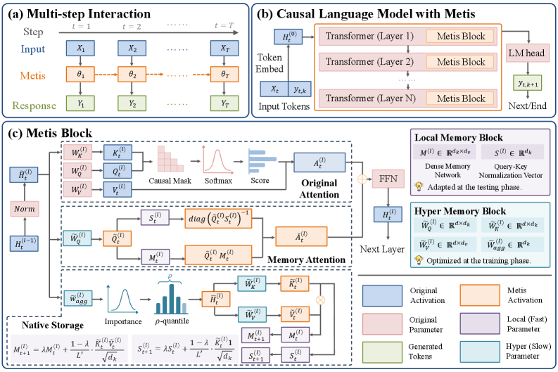
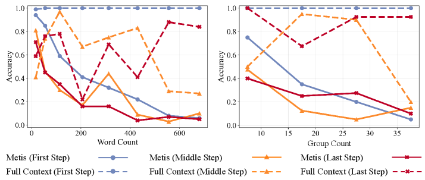
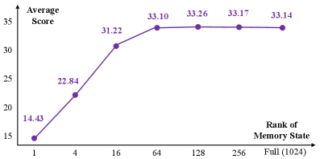
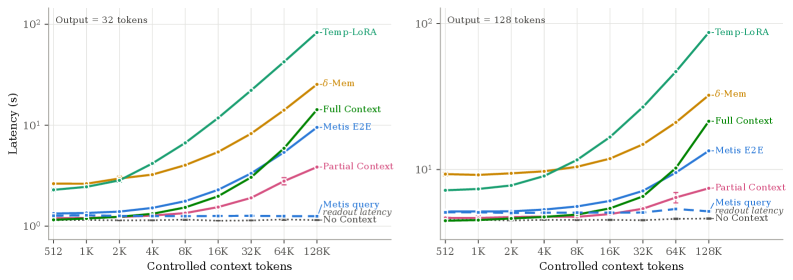
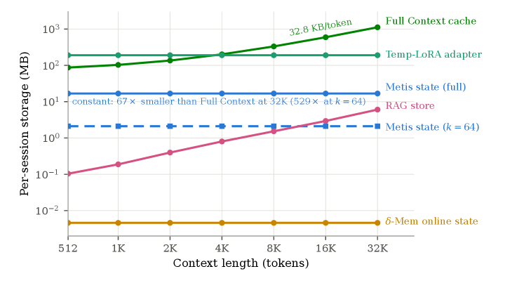

> **论文**：Metis: Memory Foundation Model
> **作者**：Zeyu Zhang, Ziliang Guo, Yihang Sun et al. (MemTensor / RUC / NUS / SJTU / Tongji)
> **arXiv ID**：2607.26760
> **发表时间**：2026-07-29
> **代码仓库**：https://github.com/MemTensor/Metis

## 第 1 章 概述

### 1.1 一句话定位

Metis 是首个 memory foundation model 原型，将记忆状态与记忆程序内化进 foundation model 的前向计算中，使历史信息被压缩为 backbone 内部的动态参数，并通过 memory attention 直接参与推理——在线记忆维护无需梯度，推理时所有学习到的权重保持冻结。

### 论文图表总览

| 编号 | 内容 | 章节 |
|------|------|------|
| Figure 1 | 外部记忆三大局限 vs 原生记忆优势对比 | 第 2 章 |
| Figure 2 | Metis 框架总览：(a) 整体架构 (b) Transformer 层内 Metis block (c) local memory block + hyper memory block | 第 3 章 |
| Figure 3 | 记忆容量：step-level（单次更新容量）与 trajectory-level（多步累积容量） | 第 6 章 |
| Figure 4 | 低秩分解趋势：性能随保留秩 k 的变化曲线 | 第 6 章 |
| Figure 5 | 案例研究：remembering / multi-fact / distractor / forgetting 四场景 | 第 6 章 |
| Figure 6 | 五级能力路线图：stateful → self-managing → experience-learning → persistent cognitive → self-evolving | 第 9 章 |
| Figure 7 | 延迟随 context 长度增长曲线（512–128K） | 第 6 章 |
| Figure 8 | Metis commit 延迟分解：commit 占比仅 2.1–4.3% | 第 6 章 |
| Figure 9 | per-session 存储开销：Full Context 线性增长 vs Metis 恒定 | 第 6 章 |
| Table 1 | Primary data：27 个 benchmark × 4 种记忆操作及来源 | 第 4 章 |
| Table 2 | Primary data 统计：357,137 samples / 406.1M tokens | 第 4 章 |
| Table 3 | Auxiliary data 四种子类型及交互流 | 第 4 章 |
| Table 4 | Auxiliary data 统计：609,443 samples | 第 4 章 |
| Table 5 | MemOps (Gold) / Metis Test Set 记忆操作性能 | 第 6 章 |
| Table 6 | LoCoMo (Gold) / NextMem 记忆问答性能 | 第 6 章 |
| Table 7 | Ablation studies（Metis-4B：数据 + 结构） | 第 6 章 |
| Table 8 | OOD：ATM-Bench (Gold) / MemDaily (Gold) | 第 6 章 |
| Table 9 | 通用能力：Metis-4B vs Qwen3.5-4B（Initial / Active 两阶段） | 第 6 章 |
| Table 10 | 低秩分解：k ∈ {1,4,16,64,128,256} 各 benchmark 恢复率 | 第 6 章 |
| Table 11 | MemOps (Full) 无上下文设置（对应论文 Table 11） | 第 6 章 |
| Table 12 | GDU vs LU 跨尺度对比（对应论文 Table 12） | 第 6 章 |
| Table 13 | Llama-3.1-8B 迁移实验（对应论文 Table 13） | 第 6 章 |

### 1.2 核心贡献

1. **Memory foundation model 概念与形式化定义**：提出 native memory 的双视角形式化——native memory state（backbone 内持久且动态演化的记忆状态）与 native memory procedure（通过模型计算自主存储和利用信息的记忆程序），并给出 Definition 1 的严格定义。

2. **首个原型 Metis**：基于 Fast Weight Programming 灵感，设计 Metis block（local memory block + hyper memory block），通过 memory attention 将历史信息集成进 backbone 前向计算，在线记忆维护 gradient-free，推理时所有权重冻结。

3. **Metis block 架构**：local memory block 维护稠密记忆网络 $\mathbf{M}^{(l)}_t \in \mathbb{R}^{d_k \times d_v}$ 与归一化向量 $\mathbf{S}^{(l)}_t$；hyper memory block 构建参数化函数空间，包含自适应聚合、memory key/value/query 投影，驱动记忆存储程序。

4. **大规模 memory-specific 训练数据**：从 27 个公开 benchmark 合成 357,137 primary samples（406.1M tokens）和 609,443 auxiliary samples，覆盖 remember / forget / update / reflect 四类操作及 explicit / implicit / distract 三种风格。

5. **多目标 mid-training 优化**：设计 memory reconstruction（无损压缩上界）、memory operation（语义驱动的 remember/forget/update/reflect）和 regularization（多实体绑定、选择性遗忘、记忆污染抑制）三类目标，配合线性退火课程采样器。

6. **开源项目与模型权重**：发布 4B / 9B / 27B 三个规模（Qwen3.5 backbone）的模型权重、推理 harness 和评估代码，训练数据待公开。

### 1.3 关键结果速览

**记忆操作（无上下文设置，Metis-27B）**

| 指标 | Metis-27B | 最强基线（无上下文） | 来源 |
|------|-----------|---------------------|------|
| MemOps (Gold) Avg | 24.76% | Temp-LoRA-9B 13.51% | Table 5 |
| Metis Test Set Avg | 73.77% | Temp-LoRA-27B 23.86% | Table 5 |

**记忆问答（无上下文设置，Metis-27B）**

| 指标 | Metis-27B | 最强基线（无上下文） | 来源 |
|------|-----------|---------------------|------|
| LoCoMo (Gold) Avg | 26.74% | Temp-LoRA-9B 11.72% | Table 6 |
| NextMem Avg | 50.82% | Temp-LoRA-27B 30.97% | Table 6 |

**效率与压缩**

| 指标 | 数值 | 来源 |
|------|------|------|
| E2E 延迟（LoCoMo Gold） | 0.562s（avg），0.926s（P95） | 附录 G.1 |
| P95 延迟 vs Full Context | 降低 69.3%（3.012s → 0.926s） | 附录 G.1 |
| Query 延迟 vs δ-Mem | 降低 45.2%（0.656s → 0.360s） | 附录 G.1 |
| 有效吞吐 | 23.15 tok/s（Full Context 9.37 tok/s） | 附录 G.1 |
| k=64 低秩恢复率 | 99.9%（Overall 33.10 vs Full 33.14） | Table 10 |
| Per-session 存储（Metis Full） | 恒定 16.79 MB | 附录 G.3 |
| Per-session 存储（Metis k=64） | 恒定 2.11 MB | 附录 G.3 |
| 80GB GPU 并发会话数 | ~4,000 sessions（Full Context ~64 sessions，32K） | 附录 G.3 |

Metis-27B 在所有无上下文基线中取得最优平均性能。在 128K context 下，Metis 的 E2E 延迟比 Full Context 加速 1.497×（32 token 输出）至 1.595×（128 token 输出），比 δ-Mem 快 2.40–2.67×，比 Temp-LoRA 快 6.46–8.71×（附录 G.2）。

## 第 2 章 研究背景与动机

### 2.1 外部记忆的三大局限

当前 agent 的记忆系统主要依赖 backbone 外部模块（如 RAG），存在三个结构性局限（见 Figure 1）：


*图1：外部记忆与 backbone 解耦、端到端优化困难、推理延迟增加；原生记忆将记忆内化进前向计算*

**局限一：与 backbone 解耦。** 外部记忆与 backbone 拥有分离的优化目标和处理阶段。外部记忆旨在构造信息性上下文作为输入，backbone 仅对该上下文执行条件语言建模。因此，外部记忆可能无法向 backbone 提供最有用的信息，backbone 也可能无法最优地利用记忆——两者的目标不对齐。

**局限二：端到端优化困难。** 梯度无法有效穿过离散记忆操作（如检索、拼接），导致领域特定的 post-training 极具挑战性。尽管部分 RL 策略可通过奖励信号部分缓解此问题，但存在效率瓶颈。

**局限三：推理延迟增加。** 外部记忆需要在 backbone 之外执行额外的显式操作（检索、重排序、拼接、prefilling），不可避免地增加在线推理延迟。

### 2.2 Memory Foundation Model 形式化定义

论文在多步交互场景下定义 memory foundation model。设连续交互过程为离散时间步序列 $t \in \{1, 2, \dots, T\}$，每步 $t$ 接收输入指令 $X_t$ 并生成响应 $Y_t$。

对于无记忆的传统 foundation model，第 $k$ 个 token 的自回归解码为 $y_{t,k} \sim P(y \mid X_t, Y_{t,<k}; \theta)$，其中 $\theta$ 为固定参数。对于外部记忆模型，解码额外条件于上下文 $C_t$：$y_{t,k} \sim P(y \mid C_t, X_t, Y_{t,<k}; \theta)$，其中 $C_t$ 从先验信息 $\{(X_i, Y_i)\}_{i=1}^{t-1}$ 中获取，涉及外部存储 $\mathbf{C}_t = \mathbf{C}_{t-1} \oplus \{(X_t, Y_t)\}$（写入）与检索 $C_t = \mathbf{C}_{t-1} \otimes X_t$（读取），均在模型推理之外执行。

**Definition 1（Memory Foundation Model）.** 在多步交互中，第 $k$ 个 token 的生成条件于输入指令 $X_t$ 和已生成 token $Y_{t,<k}$：

$$y_{t,k} \sim P(y \mid X_t, Y_{t,<k}; \theta_t)$$

其中模型参数 $\theta_t$ 将先前步骤的信息集成进其原生参数空间（即 native memory state），同时 $\theta_{t+1}$ 在模型的前向计算中基于输入 $X_t$ 与输出 $Y_t$ 自主变换（即 native memory procedure）。

关键区别：memory foundation model 不依赖外部显式存储 $\mathbf{C}_t$ 和上下文 $C_t$，而是维护一个跨步持久的 native memory state 作为动态参数；记忆程序（remembering、forgetting、updating）伴随前向计算自主执行，而非在 backbone 外显式调用。

### 2.3 Native Memory State

论文对记忆来源采取严格定义：仅将在线交互中获取的信息视为记忆，交互开始前可用的信息（离线预训练知识）被排除在外——后者更宜视为 knowledge 而非 memory，因其不含个性化轨迹信息且不需要实时适应。

**动态参数 $\mathbf{M}_t$。** 由于存储信息随步变化，参数 $\theta_t$ 不能完全静态。至少部分参数须随输入动态变化，记此动态部分为记忆状态 $\mathbf{M}_t$。静态参数记为 $\Phi = \theta_t \setminus \mathbf{M}_t$。

**参数化记忆 vs 文本记忆。** 文本记忆在可解释性和跨模型兼容性上有优势，但其离散表示导致信息密度低且需重复 prefilling。参数化记忆以稠密形式表示先验信息，提高存储与利用效率。在 memory foundation model 中，记忆表示须与 backbone 耦合以参与前向计算，因此 native memory state 应以参数化形式表示。

**静态/动态语义空间对齐。** 动态参数 $\mathbf{M}_t$ 与静态参数 $\Phi$ 的语义空间必须在预训练或 mid-training 阶段对齐，使不同步骤的动态参数能与静态参数协同计算。在线交互期间，native memory state 通过 native memory procedure 更新和利用，赋予模型跨步状态性。

### 2.4 Native Memory Procedure

记忆的存储与利用是处理在线信息时间流特性的两个核心程序，旨在弥合信息供给与使用之间的时间错配。

**存储程序**涉及 remembering、forgetting、updating 等操作。从 foundation model 视角，输入指令同时包含处理意图与信息内容——"Alice is 24 years old" 意味着记住年龄，"Bob moved from London to Boston" 指示更新位置。原生存储程序应直接将输入指令映射为记忆状态的更新值；而外部记忆依赖基于规则和预定义的操作分别处理意图与内容。语义意图与内容难以解耦为离散规则，且存储程序本质上是在预测当前信息未来将如何被使用——规则驱动的离散函数空间难以实现最优预测。

**利用程序**的主要目标是利用存储信息辅助推理。原生利用程序应直接将输入指令与记忆状态映射到生成输出。外部记忆设计规则来触发检索、重排序和拼接，但信息需求无法由离散有限的规则定义和捕获（例如指令可能基于语义相似性、情感或隐式指标的复杂组合来要求信息）。

因此，记忆程序应在连续函数空间中建模，通过数值计算实现，与 backbone 前向计算紧密耦合。该程序应在预训练或 mid-training 阶段建立。

### 2.5 与已有方法的对比

**Test-Time Training（TTT）。** 三点关键区别：

1. TTT 在单序列内适配模型，动态参数为适应当前输入而更新；memory foundation model 在多步交互下定义，动态参数作为持久 native memory state 存储先前步骤信息并支持未来推理。
2. TTT 不显式提供原生记忆程序，其更新通常由自监督语言建模驱动；memory foundation model 通过 memory reconstruction 和 operation 目标训练，使模型能在潜在参数空间中自主执行语义记忆操作。
3. 许多 TTT 方法旨在高效长上下文建模，常引入循环层替代 full attention；memory foundation model 不替换当前步骤的标准 full-attention 计算，而是通过 native memory state 以残差形式引入先前步骤信息。

**Memory-Augmented Neural Networks（MANN）。** MANN 引入额外记忆模块（如可微记忆槽和学习的读写操作）。区别在于记忆与 backbone 的集成方式：MANN 的记忆模块通常是由神经控制器控制的独立存储组件，虽操作可微但仍是外部于主模型参数的；memory foundation model 将记忆内化进 backbone 计算，记忆状态以参数化形式直接参与前向计算。

**其他方法。**

- **In-place TTT / MemGen / δ-Mem**：仍依赖上下文中的文本记忆，仅使用额外潜在摘要改善推理。Memory foundation model 完全移除上下文中的文本记忆。
- **MEMO / MemFT**：主要处理离线文档。Memory foundation model 聚焦于测试时信息。
- **Memory3**：通过将知识编码为可检索的显式记忆超越了文本 RAG。Memory foundation model 进一步将在线交互获取的信息内化为 backbone 内的持久动态状态，并通过 native memory procedure 跨步自主维护和变换。

## 第 3 章 Metis 架构设计



*图2：(a) Metis 整体框架 (b) Transformer 层内 Metis block 集成 (c) local memory block 与 hyper memory block 结构*

### 3.1 预备知识

Metis 采用因果语言模型作为 memory foundation model 的基础实现。标准架构由 $N$ 个堆叠的 Transformer block 加语言建模头组成。

记第 $l$ 个 Transformer block 的输入为 $\mathbf{H}^{(l-1)} \in \mathbb{R}^{L \times d}$（$L$ 为序列长度，$d$ 为隐藏维度）。经 pre-normalization 得 $\tilde{\mathbf{H}}^{(l)} = \text{PreNorm}(\mathbf{H}^{(l-1)})$，投影得到 query/key/value 状态：

$$\mathbf{Q}^{(l)} = \tilde{\mathbf{H}}^{(l)} \mathbf{W}^{(l)}_Q, \quad \mathbf{K}^{(l)} = \tilde{\mathbf{H}}^{(l)} \mathbf{W}^{(l)}_K, \quad \mathbf{V}^{(l)} = \tilde{\mathbf{H}}^{(l)} \mathbf{W}^{(l)}_V$$

因果自注意力计算为：

$$\mathbf{A}^{(l)} = \text{Softmax}\left(\frac{\mathbf{Q}^{(l)} (\mathbf{K}^{(l)})^{\top}}{\sqrt{d_k}} + \text{Mask}(L)\right) \mathbf{V}^{(l)} \tag{1}$$

其中 $d_k$ 为注意力头维度，$\text{Mask}(L)_{i,j} = -\infty$ 若 $j > i$，否则为 $0$。注意力输出经输出投影加回残差：$\mathbf{H}^{\prime(l)} = \mathbf{H}^{(l-1)} + \mathbf{A}^{(l)} \mathbf{W}^{(l)}_O$，再经 FFN 与残差连接得到第 $l$ 层输出 $\mathbf{H}^{(l)} = \mathbf{H}^{\prime(l)} + \text{FFN}(\text{Norm}(\mathbf{H}^{\prime(l)}))$。

### 3.2 原生记忆状态实现：Metis Block

为实现 native memory state，论文提出在 Transformer block 内部嵌入 Metis block（Figure 2(b)），每个 Metis block 由一个 **local memory block** 和一个 **hyper memory block** 组成（Figure 2(c)）。

**Local Memory Block** 维护当前步骤的记忆状态，在第 $l$ 个 local memory block 内定义稠密记忆网络 $\mathbf{M}^{(l)} \in \mathbb{R}^{d_k \times d_v}$，步骤 $t$ 时记为 $\mathbf{M}^{(l)}_t$。同时维护 query-key 归一化向量 $\mathbf{S}^{(l)}_t \in \mathbb{R}^{d_k}$。两者均为跨步更新的动态参数，默认初始化 $\mathbf{M}^{(l)}_1 = \mathbf{0}$、$\mathbf{S}^{(l)}_1 = \mathbf{0}$。

**Hyper Memory Block** 负责基于当前输入 $X_t$ 和输出 $Y_t$ 的中间激活更新 local memory block 中的动态参数，由 mid-training 获得的静态参数构成（交互期间不变）。其参数包括：

- 可学习重要性向量 $\tilde{\mathbf{w}}^{(l)}_{\text{agg}} \in \mathbb{R}^d$：为自适应聚合对中间激活评分
- Memory key/value 投影矩阵 $\tilde{\mathbf{W}}^{(l)}_K \in \mathbb{R}^{d \times d_k}$、$\tilde{\mathbf{W}}^{(l)}_V \in \mathbb{R}^{d \times d_v}$：将选定隐藏状态映射为记忆 key/value
- Memory query 投影矩阵 $\tilde{\mathbf{W}}^{(l)}_Q \in \mathbb{R}^{d \times d_k}$：降低利用程序中的误差

### 3.3 原生记忆程序

#### 存储程序

完成步骤 $t$ 后，第 $l$ 层输入隐藏状态为 $\mathbf{H}^{(l-1)}_t$。Hyper memory block 通过学习到的自适应聚合将其压缩为紧凑表示。

首先对每个 token 评分，得到重要性分布：

$$\mathbf{p}^{(l)}_t = \text{Softmax}\left(\frac{\tilde{\mathbf{H}}^{(l)}_t \tilde{\mathbf{w}}^{(l)}_{\text{agg}}}{\tau}\right) \in \mathbb{R}^L$$

其中 $\tau$ 为温度系数。然后基于 top-$\rho$ 选择位置子集——将概率降序排列 $p_{(1)} \geq p_{(2)} \geq \cdots \geq p_{(L)}$，保留累积值达到阈值 $\rho$ 的最小前缀，选定位置数为：

$$L'_t = \text{clip}\left(\min\left\{k : \sum_{r=1}^{k} p_{(r)} \geq \rho\right\},\ K_{\min},\ L\right)$$

其中 $K_{\min}$ 为最小选定位置数，满足 $L'_t \ll L$。由于 top-$\rho$ 选择不可微，采用 **straight-through estimator** 使梯度通过稠密分布 $\mathbf{p}^{(l)}_t$ 回传，使评分器 $\tilde{\mathbf{w}}^{(l)}_{\text{agg}}$ 端到端可训练。

选定位置经投影得到 memory key/value 状态后，稠密记忆网络通过 **Gated Delta Network 更新（GDU）** 更新（实践中 GDU 优于线性更新 LU，见 Table 7 ablation）：

$$\mathbf{M}^{(l)}_{t+1} = \lambda \mathbf{M}^{(l)}_t + \frac{(1-\lambda)}{L'_t} \cdot \frac{\tilde{\mathbf{K}}^{(l)\top}_t}{\sqrt{d_k}} \tilde{\mathbf{V}}^{(l)}_t \tag{2}$$

其中 $\lambda$ 为折扣因子。归一化向量同步更新：

$$\mathbf{S}^{(l)}_{t+1} = \lambda \mathbf{S}^{(l)}_t + \frac{(1-\lambda)}{L'_t} \cdot \frac{\tilde{\mathbf{K}}^{(l)\top}_t \mathbf{1}}{\sqrt{d_k}} \tag{3}$$

#### 利用程序

定义 memory attention：

$$\tilde{\mathbf{A}}^{(l)}_t = \text{diag}\left(\tilde{\mathbf{Q}}^{(l)}_t \mathbf{S}^{(l)}_t\right)^{-1} \tilde{\mathbf{Q}}^{(l)}_t \mathbf{M}^{(l)}_t \tag{4}$$

其中 $\tilde{\mathbf{Q}}^{(l)}_t = \tilde{\mathbf{H}}^{(l)}_t \tilde{\mathbf{W}}^{(l)}_Q$ 为 memory query 状态（实践中在归一化分母添加恒等向量以防止数值溢出）。Memory attention 融合进主注意力分支，替换 Eq 1：

$$\mathbf{A}^{(l)}_t = \gamma \cdot \text{Softmax}\left(\frac{\mathbf{Q}^{(l)}_t (\mathbf{K}^{(l)}_t)^{\top}}{\sqrt{d_k}} + \text{Mask}(L)\right) \mathbf{V}^{(l)}_t + (1-\gamma) \cdot \text{Norm}\left(\tilde{\mathbf{A}}^{(l)}_t\right) \tag{5}$$

其中 $\gamma \in [0,1]$ 平衡原始注意力与记忆注意力两个分支，$\text{Norm}(\cdot)$ 对记忆读出做尺度对齐。

### 3.4 理论洞察：Virtual Memory Prefix 等价推导

本节证明 Metis 的 memory attention 等价于在注意力输入前添加一个"虚拟记忆前缀"（virtual memory prefix）的效果。

在步骤 $t$，向第 $l$ 层注意力输入 $\tilde{\mathbf{H}}^{(l)}_t$ 前添加虚拟记忆前缀 $\mathbf{P}^{(l)}_t \in \mathbb{R}^{L_p \times d}$，构成增广输入 $\hat{\mathbf{H}}^{(l)}_t$。对应增广的 query/key/value 状态为前缀部分与原始部分的拼接。使用修改后的因果 mask——前缀 token 对输入 token 可见（$\mathbf{0}_{L \times L_p}$），但输入 token 对前缀不可见（$-\infty_{L_p \times L}$）。

注意力输出按非虚拟 token 保留后可分解为两部分（Eq 6）：

$$\mathbf{A}^{(l)}_t = \underbrace{\text{Softmax}^*\left(\frac{\mathbf{Q}^{(l)}_t \mathbf{K}^{(l)\top}_t}{\sqrt{d_k}} + \text{Mask}(L)\right) \mathbf{V}^{(l)}_t}_{\text{Original Attention}} + \underbrace{\text{Softmax}^*\left(\frac{\mathbf{Q}^{(l)}_t (\mathbf{P}^{(l)}_t \mathbf{W}^{(l)}_K)^{\top}}{\sqrt{d_k}}\right) (\mathbf{P}^{(l)}_t \mathbf{W}^{(l)}_V)}_{\text{Memory Attention}} \tag{6}$$

其中 $\text{Softmax}^*(\cdot)$ 为整行全局 softmax。引入全局权重参数 $\gamma$ 近似原始权重矩阵 $\boldsymbol{\Lambda}_{\text{orig}}$、$\boldsymbol{\Lambda}_{\text{mem}}$（Eq 7 推导），注意力输出近似为两个独立 softmax 分支的加权和。

对 memory attention 部分，将 softmax 中的指数相似度近似为线性相似度（Eq 8），并将前缀 token $\mathbf{P}^{(l)}_t$ 视为第 $c$ 步（$c < t$）的聚合结果 $\bar{\mathbf{H}}^{(l)}_c$，得（Eq 9）：

$$\check{\mathbf{A}}^{(l)}_t = \text{diag}\left(\mathbf{Q}^{(l)}_t \frac{(\bar{\mathbf{H}}^{(l)}_c \tilde{\mathbf{W}}^{(l)}_K)^{\top}}{\sqrt{d_k}} \cdot \mathbf{1}\right)^{-1} \mathbf{Q}^{(l)}_t \left[\frac{(\bar{\mathbf{H}}^{(l)}_c \tilde{\mathbf{W}}^{(l)}_K)^{\top}}{\sqrt{d_k}} (\bar{\mathbf{H}}^{(l)}_c \tilde{\mathbf{W}}^{(l)}_V)\right]$$

**可训练 memory query 的降噪作用。** 实际中参考步骤 $c$ 不可预知，且步骤 $t$ 所需的证据可能跨多个步骤。不同步骤的 memory key/value 状态耦合在固定大小的 $\mathbf{M}^{(l)}_t$ 和 $\mathbf{S}^{(l)}_t$ 中，非参考步骤（$j \neq c$）不可避免地泄漏为噪声。为缓解此噪声，不直接复用原始注意力 query $\mathbf{Q}^{(l)}_t$，而使用可训练 memory query $\tilde{\mathbf{Q}}^{(l)}_t = \tilde{\mathbf{H}}^{(l)}_t \tilde{\mathbf{W}}^{(l)}_Q$（Eq 10）：

$$\check{\mathbf{A}}^{(l)}_t = \text{diag}\left(\tilde{\mathbf{Q}}^{(l)}_t \frac{(\bar{\mathbf{H}}^{(l)}_c \tilde{\mathbf{W}}^{(l)}_K)^{\top}}{\sqrt{d_k}} \cdot \mathbf{1}\right)^{-1} \tilde{\mathbf{Q}}^{(l)}_t \left[\frac{(\bar{\mathbf{H}}^{(l)}_c \tilde{\mathbf{W}}^{(l)}_K)^{\top}}{\sqrt{d_k}} (\bar{\mathbf{H}}^{(l)}_c \tilde{\mathbf{W}}^{(l)}_V)\right] \tag{10}$$

这将 memory query 与原始注意力解耦，赋予重塑跨步相似度 $\tilde{\mathbf{Q}}^{(l)}_t \tilde{\mathbf{K}}^{(l)\top}_j$ 的自由度——可强调相关步骤、抑制无关步骤，从而降低噪声影响。Ablation 实验（Table 7）证实：移除可优化 memory query（w/o OQ）导致 Overall 下降 12.23%。

### 3.5 理论误差分析

不同于标准 Transformer 将所有历史 KV 对存储于不断增长的缓存中，hyper memory block 将信息压缩进固定大小矩阵。设目标信息存储在第 $c$ 步，稠密记忆网络展开为：

$$\mathbf{M}^{(l)}_t = \sum_{j=1}^{t-1} \lambda^{t-(j+1)} \cdot \frac{(1-\lambda)}{L'_j} \cdot \frac{\tilde{\mathbf{K}}^{(l)\top}_j}{\sqrt{d_k}} \tilde{\mathbf{V}}^{(l)}_j$$

利用 memory query 提取信息时，定义 $\mathbf{U}_j$（归一化项）和 $\mathbf{R}_{j'}$（响应项），经一阶 Taylor 展开近似后，$\tilde{\mathbf{A}}^{(l)}_t$ 分解为理想读出加三个误差项：

$$\tilde{\mathbf{A}}^{(l)}_t \approx \text{diag}(\mathbf{U}_c)^{-1} \mathbf{R}_c + \boldsymbol{\epsilon}_1 - \boldsymbol{\epsilon}_2 - \boldsymbol{\epsilon}_3$$

其中：

- **$\boldsymbol{\epsilon}_1$（注意力误差）**：由无关信息引入，$\text{diag}(\mathbf{U}_c)^{-1} \sum_{j' \neq c} \mathbf{R}_{j'}$。当跨步相似度 $\tilde{\mathbf{Q}}^{(l)}_t \tilde{\mathbf{K}}^{(l)\top}_j$（$j \neq c$）较低时，此项较小。
- **$\boldsymbol{\epsilon}_2$（全局归一化结构误差）**：由全局归一化引起，$\text{diag}(\mathbf{U}_c)^{-1} \cdot \text{diag}(\sum_{j \neq c} \mathbf{U}_j) \cdot \text{diag}(\mathbf{U}_c)^{-1} \mathbf{R}_c$。
- **$\boldsymbol{\epsilon}_3$（全局归一化结构误差）**：$\text{diag}(\mathbf{U}_c)^{-1} \cdot \text{diag}(\sum_{j \neq c} \mathbf{U}_j) \cdot \text{diag}(\mathbf{U}_c)^{-1} \sum_{j' \neq c} \mathbf{R}_{j'}$。

三个误差项中始终存在至少一个 $\tilde{\mathbf{Q}}^{(l)}_t \tilde{\mathbf{K}}^{(l)\top}_j$（$j \neq c$）因子，因此当无关步骤与当前查询的相似度较低时，误差预期较小。这从理论上解释了可训练 memory query 的重要性——它可以通过优化来主动压低无关步骤的相似度。

### 3.6 效率分析

Metis 的原生记忆引入有限的额外推理开销，关键原因是原始注意力、memory attention 和存储程序可大幅并行执行。

对于第 $l$ 层步骤 $t$：原始注意力分支对当前输入计算 token-token 注意力；记忆利用分支对 native memory state $\mathbf{M}^{(l)}_t$ 和 $\mathbf{S}^{(l)}_t$ 执行 memory attention。两者依赖相同的输入隐藏状态但彼此无顺序依赖，因此 memory attention 无需等待原始注意力输出，结果仅在两个分支完成后融合。

存储程序同样可与当前推理路径解耦——它为未来步骤更新记忆状态，而当前步骤仅读取已有记忆状态。因此，在所需隐藏状态可用后，存储分支可与原始注意力和记忆利用并行执行。层级延迟表达为：

$$T^{(l)}_{\text{parallel}} = \max\left(T^{(l)}_{\text{orig}},\ T^{(l)}_{\text{util}},\ T^{(l)}_{\text{store}}\right) + T^{(l)}_{\text{fuse}} \tag{11}$$

此外，Metis 将历史信息存储在固定大小的 native memory state 中，而非将检索到的文本记忆拼接到输入上下文。因此其记忆利用成本主要取决于记忆状态大小，而非随历史交互次数线性增长，避免了外部记忆系统常见的检索、拼接和 prefilling 开销。

实验验证（附录 G）：在 LoCoMo (Gold) 上，Metis E2E 延迟 0.562s（Full Context 0.607s），P95 延迟 0.926s 较 Full Context 的 3.012s 降低 69.3%；在 128K context 下 E2E 加速 1.497–1.595×（附录 G.2）；per-session 存储 Metis Full 恒定 16.79 MB、k=64 恒定 2.11 MB，而 Full Context 在 32K 时达 1,118.86 MB（附录 G.3）。

## 第 4 章 数据构建

原生记忆程序无法通过手工规则获得，必须通过优化习得，因此训练数据的质量直接决定记忆操作能否正确泛化。Metis 的 mid-training 数据由主数据（primary data）与辅助数据（auxiliary data）两部分组成：主数据提供记忆操作的核心监督信号，辅助数据针对多实体干扰与记忆污染两类复杂场景增强鲁棒性。

### 4.1 主数据：四大记忆操作

主数据的设计遵循两条原则。第一，数据必须组织为**时间有序的多步交互序列**，以匹配在线信息的时间流式（time-streaming）特性；第二，数据必须**状态一致**（state-consistent），即后续查询的回答必须与先前操作塑造的记忆状态相符。这两条性质共同教会模型在合适的时机存储信息并在后续步骤中使用它。

论文没有从零生成数据，而是从 27 个公开 benchmark 中合成主数据，覆盖 Remember、Forget、Update、Reflect 四种记忆操作，见表 1。选择成熟 benchmark 的优势在于：其事实与推理链已经过验证，扩展为长交互序列时不易产生幻觉；虚构、科学、新闻、逻辑推理的广泛覆盖增强了泛化性；每个合成样本都锚定一个源事实，语料可追溯、易验证。

| 记忆操作 | 交互流式模式 | 来源 Benchmark |
|---------|-------------|---------------|
| Remember | Info(A₁) → Query(A) | LoCoMo, LongMemEval, NeedleInAHaystack, RULER, LongBench, ∞Bench, L-Eval, BABILong, Bamboo, NaturalQuestions, LongChat-Eval |
| Update | Info(A₁) → Info(A₂) → Query(A) | ZsRE, RippleEdits, KnowEdit, TemporalWiki |
| Forget | Info(A₁) → Info(Ā₁) → Query(A) | TOFU, WMDP, MUSE, RWKU, WhoIsHarryPotter, BLUR, LKF, CLEAR, CounterFact |
| Reflect | Info(A₁) → Info(B₁) → Query(A∩B) | MuSiQue, StrategyQA, Bamboogle |

合成管线包含三步：

1. **种子提取（Seed Extraction）**：从每个源数据集提取源引用、查询与答案构成基础对话，将底层事实总结为结构化种子（记录主语、关系、目标，以及更新目标或多跳链等操作专属字段），同时收集与查询逻辑正交的干扰对话池用于扩展序列长度。
2. **静态合成（Static Synthesis）**：由强指令跟随模型将基础对话改写为两种显著性风格——显式风格（explicit）将引用表述为清晰的记忆指令，隐式风格（implicit）以自然叙述陈述同一事实但不含显式指令；为覆盖长程记忆，在引用与查询之间插入可变数量的干扰轮次，得到两者的干扰变体（distract）。
3. **质量验证（Quality Verification）**：LLM 充当自动裁判，按多条标准过滤：一致性检查确认最终答案忠实反映预期记忆状态；正交性检查确保干扰项不泄漏核心事实；捷径检查剔除无需引用即可作答的查询；同时监控查询语义多样性防止模板坍缩。未通过任何检查的样本被丢弃。

过滤后主数据共 **357,137 个样本、约 4.06 亿 tokens**，分布见表 2。Remember 操作虽然样本数最少（56,855），却贡献了 362.0M tokens 的绝对主体——因为长程记忆需要插入大量干扰上下文；Forget 样本最多（136,271），其中显式样本占主导（59,900）。Token 分布由干扰样本主导，体现了对长程记忆与噪声鲁棒性的侧重。

| 操作 | 来源数 | Explicit | Implicit | Distract | 总样本数 | Tokens (M) |
|------|:-----:|---------:|---------:|---------:|---------:|-----------:|
| Remember | 11 | 14,682 | 13,671 | 28,502 | 56,855 | 362.0 |
| Forget | 9 | 59,900 | 8,251 | 68,120 | 136,271 | 21.7 |
| Update | 4 | 33,452 | 7,300 | 40,749 | 81,501 | 11.0 |
| Reflect | 3 | 20,646 | 20,615 | 41,249 | 82,510 | 11.4 |
| **Total** | **27** | **128,680** | **49,837** | **178,620** | **357,137** | **406.1** |

### 4.2 辅助数据：抗干扰与防污染

真实交互远比单事实操作复杂：多个相似事实可能共存，某些事实被撤销而其他保留，记忆轮次与普通对话交错。主数据在这些场景下暴露两类失败模式——**干扰**（interference，模型混淆相似事实，或遗忘操作损坏保留事实）与**记忆污染**（memory pollution，模型把存储值应用到不需要它的提问）。辅助数据保留与主数据相同的事实级结构，但将事实与对话组合成更富挑战性的交互模式，见表 3。

| 辅助子类型 | 交互流式模式 | 构造来源 |
|-----------|-------------|---------|
| 多实体绑定（Multi-Entity Binding） | Info(A₁) → Info(B₁) → Query(A) → Query(B) | 由主数据源事实合成的配对事实 |
| 选择性遗忘（Selective Forgetting） | Info(A₁) → Info(B₁) → Info(B̄₁) → Query(B) → Query(A) | 由主数据源事实合成的配对事实 |
| 记忆后对话（Post-Memory Dialogue） | Info(A₁) → Query(A) → Chat | 主记忆样本 + 精选普通对话 |
| 记忆无关对话（Memory-Irrelevant Dialogue） | Info(A₁) → Chat / Chat → Chat | 主记忆样本 + 精选普通对话 |

配对事实合成时，对每个源事实生成一个易混淆的对应事实：保持主语改关系、保持关系改主语、模仿值格式、或保持语义相邻。LLM 生成后由验证器剔除与源事实矛盾、重复或依赖的样本。普通对话池来自日常请求的通用助手对话、公开语料的开域对话、以及与存储事实主题相关但无需记忆即可回答的实体对话，并过滤掉含记忆线索、实时事实或不安全内容的轮次。

辅助数据共 **609,443 个样本**（表 4）：多实体绑定与选择性遗忘各 76,153 个（来自 76,153 组验证过的配对事实），记忆后对话 357,137 个（复用全部主记忆样本），记忆无关对话 100,000 个。与主数据合计约 96.7 万样本，覆盖从单事实操作到复杂混合交互的完整谱系。

| 目标 | 辅助子类型 | 样本数 |
|------|-----------|-------:|
| 多事实场景 | 多实体绑定 | 76,153 |
|  | 选择性遗忘 | 76,153 |
| 记忆污染 | 记忆后对话 | 357,137 |
|  | 记忆无关对话 | 100,000 |
| **全部** | **总计** | **609,443** |

## 第 5 章 模型优化

Metis 通过 mid-training 习得原生记忆程序。每个训练样本被组织为多步交互 $s=\{(X_t,Y_t)\}_{t=1}^{T_s}$，各步顺序前向传播，原生记忆程序在下一步开始前将本步信息存入记忆状态。因此第 $t$ 步的参数 $\theta_t$ 已集成此前全部步骤 $\{(X_i,Y_i)\}_{i<t}$ 的记忆。训练只监督查询步骤子集 $\mathcal{Q}_s$，引用步与操作步的响应仅用于更新记忆状态。

所有目标共享统一的按步损失——token 平均负对数似然：

$$
\ell(s,t)=-\frac{1}{|Y_t|}\sum_{k=1}^{|Y_t|}\log P(y_{t,k}\mid X_t,Y_{t,<k};\theta_t)
\tag{12}
$$

训练期间**冻结 backbone 参数，只优化原生记忆参数**。五个数据子集通过任务加权采样器（而非显式损失系数）控制贡献，采样概率按 epoch 线性退火：

$$
\pi_\tau(e)=\frac{w_\tau(e)}{\sum_{\tau'\in\mathcal{T}}w_{\tau'}(e)},\qquad
w_\tau(e)=w_\tau^s+(w_\tau^e-w_\tau^s)\cdot\min\!\left(\frac{e}{E-1},1\right)
\tag{13}
$$

这形成从存储导向数据向更难的长程与正则化数据渐进的课程。

### 5.1 记忆重建目标

记忆重建目标（memory reconstruction）让 Metis 学会存储并重建信息。重建子集 $\mathcal{D}_{\text{rec}}$ 中，引用段落先在早期步骤存入记忆状态，后续查询步要求模型**逐字重建其内容**，因此记忆状态必须以最小损失保留源信息：

$$
\mathcal{L}_{\text{rec}}=\pi_{\text{rec}}(e)\,\mathbb{E}_{s\sim\mathcal{D}_{\text{rec}}}\!\left[\sum_{t\in\mathcal{Q}_s}\ell(s,t)\right]
\tag{15}
$$

该目标在 warm-up 阶段提供关键训练信号（初始化模型通常不具备记忆能力），并指向信息存储的**无损压缩上限**。但重建与指令跟随存在天然张力：前者要求特异性，后者要求泛化性；原生记忆程序需要受指令引导的有损压缩，而重建反对有损压缩。因此重建目标与记忆操作目标互补而非替代。

### 5.2 记忆操作目标

记忆操作目标（memory operation）教会 Metis 执行 remember、forget、update、reflect 四类操作，使记忆状态按每步指令演化。它使用主数据的两个互补子集：显式/隐式样本 $\mathcal{D}_{\text{op}}^{\text{e/i}}$ 迫使模型从意图而非表面关键词推断操作；干扰样本 $\mathcal{D}_{\text{op}}^{\text{d}}$ 促进长程保持与抗噪：

$$
\mathcal{L}_{\text{op}}=\pi_{\text{e/i}}(e)\,\mathbb{E}_{s\sim\mathcal{D}_{\text{op}}^{\text{e/i}}}\!\left[\sum_{t\in\mathcal{Q}_s}\ell(s,t)\right]+\pi_d(e)\,\mathbb{E}_{s\sim\mathcal{D}_{\text{op}}^{\text{d}}}\!\left[\sum_{t\in\mathcal{Q}_s}\ell(s,t)\right]
\tag{16}
$$

所有操作样本中，监督响应都与早期步骤的信息保持一致：update 样本的答案反映新值而非旧值，forget 样本不再暴露被遗忘的值，reflect 样本将多个存储事实组合为多跳推理。因此**单一似然目标即可监督全部操作**——模型必须自行学习如何根据指令变换和读取记忆状态。

### 5.3 正则化目标

正则化目标（regularization）针对复杂交互中的两个失败模式。多事实子集 $\mathcal{D}_{\text{mf}}$ 针对干扰：多实体绑定样本联合呈现两个易混淆事实并逐一查询，约束利用程序将每个值绑定到自己的键；选择性遗忘样本包含撤销一个事实而保留另一个的指令，约束遗忘操作局部生效。记忆污染子集 $\mathcal{D}_{\text{mp}}$ 针对泄漏：记忆后对话样本在记忆查询后紧接普通对话，记忆无关样本在存在记忆状态时回答无需记忆的问题，两者共同抑制记忆注入无关响应：

$$
\mathcal{L}_{\text{reg}}=\pi_{\text{mf}}(e)\,\mathbb{E}_{s\sim\mathcal{D}_{\text{mf}}}\!\left[\sum_{t\in\mathcal{Q}_s}\ell(s,t)\right]+\pi_{\text{mp}}(e)\,\mathbb{E}_{s\sim\mathcal{D}_{\text{mp}}}\!\left[\sum_{t\in\mathcal{Q}_s}\ell(s,t)\right]
\tag{17}
$$

正则化目标压制了"总是读或总是覆写记忆状态"的退化解，是主数据之外提升泛化与鲁棒性的关键一环（其贡献在 6.3 节的消融中量化）。

## 第 6 章 实验结果与分析

### 6.1 实验设置

Metis 基于 Qwen3.5 backbone（4B/9B/27B），在 8×H100 上 mid-training，冻结 backbone，仅训练记忆参数（初始化为对应 backbone 层的 K/V 投影）。AdamW，学习率 2×10⁻⁴，200 warmup 步后常数 schedule，weight decay 0.01，β=(0.9,0.999)，ε=10⁻⁸，梯度裁剪 1.0，BF16，seed 42。Metis-4B 训练 14,000 步（1 epoch），Metis-27B 同步数（约 0.4 epoch），Metis-9B 8,000 步（约 0.5728 epoch，验证集早停）。

评估采用静态范式：每个测试轨迹分为信息阶段（提供上下文）与查询阶段（基于先前信息作答）。LLM-as-a-judge 使用 gpt-4.1-mini（temperature 0，重复 3 次取中位数）。基线分四类：全上下文 Qwen3.5（上限参考）、部分上下文 RAG（top-55 chunks，BGE-M3 编码 + 余弦相似度）、TTT 型 Temp-LoRA（临时 LoRA 适配）、参数化记忆 δ-Mem。

### 6.2 记忆操作任务总览

MemOps (Gold) 与 Metis 测试集的结果见表 5（MemOps Full 设置见附录）。全上下文模型整体最强，移除上下文后标准 backbone 性能大幅下跌；部分上下文在 Metis 测试集保留部分信息，但在 MemOps (Gold) 表现差——不完整历史无法可靠支撑记忆操作。Temp-LoRA 与 δ-Mem 恢复部分损失但提升有限。**无上下文设置下 Metis 在所有规模上取得最佳平均结果**，说明原生记忆状态能在不重放原始上下文的情况下保留信息并支持后续步骤。

| 类型 | 方法 | MemOps (Gold) Avg | Metis Test Avg |
|------|------|------------------:|---------------:|
| Full Context | Qwen3.5-4B | 84.56 | 75.18 |
|  | Qwen3.5-9B | 86.86 | 73.89 |
|  | Qwen3.5-27B | 87.90 | 78.87 |
| Partial Context | Qwen3.5-4B | 30.18 | 64.82 |
|  | Qwen3.5-9B | 22.41 | 60.68 |
|  | Qwen3.5-27B | 28.01 | 65.40 |
| No Context | Qwen3.5-4B | 1.65 | 16.96 |
|  | Qwen3.5-9B | 1.88 | 18.64 |
|  | Qwen3.5-27B | 1.69 | 16.87 |
|  | Temp-LoRA-4B | 8.85 | 19.34 |
|  | Temp-LoRA-9B | 13.51 | 19.51 |
|  | Temp-LoRA-27B | 9.70 | 23.86 |
|  | δ-Mem | 4.38 | 15.03 |
|  | **Metis-4B** | **17.84** | **56.72** |
|  | **Metis-9B** | **19.63** | **57.92** |
|  | **Metis-27B** | **24.76** | **73.77** |

Metis-27B 在两个 benchmark 的无上下文设置下均取得最佳平均。随规模增大，Remember、Update、Reflect 与整体性能增益明显，Metis 测试集上 Forget 的提升尤其大（27B 达 77.50，4B 仅 31.25），说明更大的 backbone 能更好地构建与利用原生记忆状态。但外部 MemOps (Gold) 基准上 Forget 仍是最难的操作（27B 仅 10.91），表明在共享潜状态中移除或抑制信息比存储、更新更难泛化。

### 6.3 记忆问答任务总览

记忆型 QA 的结果（表 6）呈现一致格局：全上下文模型构成强上界，部分上下文性能骤降，无上下文时原始 Qwen3.5 在 LoCoMo (Gold) 上几乎为零（0.07-0.18），证实答案无法仅靠 backbone 知识恢复。**Metis 在无上下文设置下取得两个基准的最佳平均，Metis-27B 在每个任务类别上均获最高分**。

| 类型 | 方法 | LoCoMo (Gold) Avg | NextMem Avg |
|------|------|------------------:|------------:|
| Full Context | Qwen3.5-4B | 63.52 | 77.15 |
|  | Qwen3.5-9B | 63.00 | 77.05 |
|  | Qwen3.5-27B | 65.03 | 78.80 |
| Partial Context | Qwen3.5-4B | 23.54 | - |
|  | Qwen3.5-9B | 21.97 | - |
|  | Qwen3.5-27B | 23.17 | - |
| No Context | Qwen3.5-4B | 0.18 | 11.86 |
|  | Qwen3.5-9B | 0.07 | 15.93 |
|  | Qwen3.5-27B | 0.07 | 17.75 |
|  | Temp-LoRA-4B | 9.99 | 24.20 |
|  | Temp-LoRA-9B | 11.72 | 28.12 |
|  | Temp-LoRA-27B | 4.24 | 30.97 |
|  | δ-Mem | 10.79 | 20.42 |
|  | **Metis-4B** | **16.31** | **41.69** |
|  | **Metis-9B** | **16.81** | **43.39** |
|  | **Metis-27B** | **26.74** | **50.82** |

Metis 的优势在复杂或长程记忆需求的任务上尤其明显：NextMem 的 HotpotQA、LongMemEval、LoCoMo 子集上增益巨大（如 27B 的 HotpotQA 66.54 vs δ-Mem 33.02），LoCoMo (Gold) 的多跳与时间问答也大幅改善，说明原生记忆在相对简单的事实性问题上保持有效，在更困难的任务上提供更大增益。但开域问题（Open）增益有限（27B 仅 28.93），表明部分任务类型即使扩大模型容量仍具挑战。另外 4B→9B 提升温和，而 27B 大幅提升平均分，暗示 backbone 规模达到阈值后原生记忆能力显著增强。

### 6.4 消融研究

在 Metis-4B 上从数据与结构两个维度消融，结果见表 7。

| 类型 | 模型 | 记忆操作 Avg | Δ | QA Avg | Δ | Overall | Δ |
|------|------|------------:|---|-------:|---|--------:|---|
| Full Model | Metis | 37.28 | - | 29.00 | - | 33.14 | - |
| Data Ablation | w/o MS | 33.08 | -11.26% | 26.29 | -9.36% | 29.68 | -10.43% |
|  | w/o MS+MP | 28.31 | -24.07% | 25.17 | -13.20% | 26.74 | -19.31% |
| Structure Ablation | w/o GDU | 38.52 | +3.32% | 27.37 | -5.60% | 32.95 | -0.58% |
|  | w/o SA | 11.70 | -68.63% | 14.16 | -51.16% | 12.93 | -60.98% |
|  | w/o OQ | 33.91 | -9.04% | 24.26 | -16.33% | 29.09 | -12.23% |
|  | w/o QKN | 29.03 | -22.13% | 18.40 | -36.55% | 23.72 | -28.44% |

数据消融显示：移除多事实场景数据（w/o MS）在两个任务类型上持续降低性能，MemOps (Gold) 与 Metis 测试集上尤为明显——多事实监督帮助模型整合相关信息并维持连贯记忆状态；移除整个辅助数据集（w/o MS+MP）造成大得多的整体退化（Overall -19.31%），证明辅助数据对原生记忆程序的鲁棒性与泛化至关重要。

结构消融中，**移除自适应聚合（w/o SA）造成最大性能下降（Overall -60.98%）**——直接用最后 token 无法捕获分布在整个输入序列中的信息，模型无法构建信息量足够的记忆状态；移除 query-key 归一化（w/o QKN）也显著退化（-28.44%），未归一化时无关信息产生更强干扰；复用原始注意力 query（w/o OQ）在所有基准上均降低性能，QA 任务上下降更大——独立记忆 query 对区分相关历史信息与噪声至关重要，与 3.5 节理论分析一致。将 GDU 替换为线性更新（w/o GDU）对整体平均影响很小（-0.58%），线性更新在 MemOps (Gold) 与 Metis 测试集上略好但 LoCoMo (Gold) 明显更弱——线性更新能处理简单短期记忆操作，GDU 在长程场景提供更好平衡。

### 6.5 分布外记忆任务

为检验性能是否超出数据构造分布，论文在未用于训练的两个 OOD benchmark（ATM-Bench 与 MemDaily）上评估，全部采用无上下文设置，结果见表 8。

| 方法 | ATM-Bench (Gold) Avg | MemDaily (Gold) Avg |
|------|---------------------:|--------------------:|
| δ-Mem | 2.27 | 39.84 |
| Temp-LoRA-4B | 2.57 | 44.92 |
| Temp-LoRA-9B | 2.86 | 51.42 |
| Temp-LoRA-27B | 2.57 | 59.45 |
| **Metis-4B** | **10.22** | **52.54** |
| **Metis-9B** | **16.49** | **47.29** |
| **Metis-27B** | **18.56** | **59.04** |

Metis 在 ATM-Bench 上跨模型规模与大部分题型一致超越记忆基线（Metis-27B 平均 18.56，超越全局最强基线 Temp-LoRA-9B 的 2.86；Metis-4B 的 10.22 也已超越全部基线），包括确定性打分的 number 题（27B 31.39 vs 基线 0-1.94），证明提升不是 LLM judge 的伪影。ATM-Bench 要求从个人档案中保留并整合异构证据，说明 Metis 习得的原生记忆程序能迁移到训练中未见的模式。MemDaily 结果较混合：Metis 保持竞争力但未持续领先记忆基线（27B 59.04 与 Temp-LoRA-27B 59.45 持平）。两个基准共同表明 Metis 的记忆能力泛化到训练数据构造之外。

### 6.6 记忆容量研究

论文将长期记忆能力建模为两步容量：**步级容量**（单次更新可容纳的最大 token 数）与**轨迹级容量**（一条交互轨迹内的最大更新步数）。测试集包含 20 个虚构用户，共享 40 个原子 persona 域的模式，结果见图 3。

步级设置下（左图），单次更新信息量小时 Metis 表现良好，但输入变长后准确率快速下降，首个事实的下行趋势最明显，输入超过数百词时三个位置性能均变低。轨迹级设置下（右图），性能随更新步数增加而下降，首个事实的准确率几乎连续下降——早期信息被后续更新逐渐削弱，中段与最近事实也不稳定，说明新更新在整个记忆状态上引入干扰而非仅覆写最旧信息。这证实**重复状态转移与累积压缩误差是原生记忆的另一主要局限**。



*图3：步级容量随单次更新输入变长而快速下降；轨迹级容量下早期事实被后续更新持续削弱，表明固定大小参数化记忆存在累积压缩误差。*

### 6.7 通用能力保持

将原生记忆集成进前向计算可能改变 backbone 原有行为。论文比较 Metis-4B 与 Qwen3.5-4B 在 MMLU-Pro、IFEval（严格设置）、GSM8K、MMMLU 上的表现，分初始阶段（t=1，空记忆）与活跃阶段（t>1，已存入无关信息）两个设置，结果见表 9。

| Benchmark | Initial: Qwen3.5-4B | Initial: Metis-4B | Gap | Active: Qwen3.5-4B | Active: Metis-4B | Gap |
|-----------|-------------------:|------------------:|----:|-------------------:|------------------:|----:|
| MMLU-Pro | 46.00 | 45.20 | −0.80 | 46.00 | 40.90 | −5.10 |
| IFEval | 79.30 | 79.85 | +0.55 | 76.71 | 54.53 | −22.18 |
| GSM8K | 83.09 | 82.03 | −1.06 | 84.53 | 78.92 | −5.61 |
| MMMLU | 61.30 | 60.50 | −0.80 | 59.90 | 56.60 | −3.30 |

初始阶段 Metis 基本保留 backbone 通用能力（各基准仅微小下降，IFEval 甚至 +0.55），说明新增记忆架构与记忆训练在空记忆状态下不显著改变模型行为。活跃阶段则出现一致下降：MMLU-Pro/GSM8K/MMMLU 中等程度（−3.30 至 −5.61），IFEval 大幅下降（−22.18）——无关原生记忆向前向计算注入噪声，干扰当前通用任务处理，尤其损害严格指令跟随。

### 6.8 低秩分解与存储压缩

存储开销是记忆的关键效率指标。论文将记忆状态 $\mathbf{M}_t^{(l)}$ 转 FP32 后沿最后两维做 SVD，保留前 k 个奇异方向，评估 k∈{1,4,16,64,128,256}（全秩维度 1024），结果见图 4 与表 10。



*图4：记忆状态的有用信息集中在低维子空间——k=16 时恢复 94.2%，k=64 时整体恢复 99.9%，继续增大秩几乎无额外收益。*

| Dataset | k=1 | k=4 | k=16 | k=64 | k=128 | k=256 | Full |
|---------|----:|----:|-----:|-----:|------:|------:|-----:|
| LoCoMo (Gold) | 11.31 (69.4%) | 10.81 (66.3%) | 14.21 (87.1%) | 16.00 (98.1%) | 16.36 (100.3%) | 16.14 (99.0%) | 16.31 (100.0%) |
| NextMem | 22.80 (54.7%) | 27.83 (66.7%) | 38.69 (92.8%) | 41.43 (99.4%) | 41.78 (100.2%) | 41.71 (100.0%) | 41.69 (100.0%) |
| Metis Test | 17.99 (31.7%) | 41.26 (72.7%) | 53.64 (94.6%) | 56.63 (99.8%) | 56.75 (100.1%) | 56.04 (98.8%) | 56.72 (100.0%) |
| MemOps (Gold) | 5.60 (31.4%) | 11.49 (64.4%) | 18.36 (102.9%) | 18.36 (102.9%) | 18.17 (101.8%) | 18.79 (105.3%) | 17.84 (100.0%) |
| **Overall** | **14.43 (43.5%)** | **22.84 (68.9%)** | **31.22 (94.2%)** | **33.10 (99.9%)** | **33.26 (100.4%)** | **33.17 (100.1%)** | **33.14 (100.0%)** |

极低秩（1、4）造成大幅退化，说明少数奇异方向不足以保留语义信息；秩到 16 时快速提升，k=64 接近全秩模型。不同基准对激进压缩的敏感度不同：记忆操作任务（Metis 测试集、MemOps）需要充足表示容量，LoCoMo (Gold) 在 k=1 时相对不敏感（部分会话信息集中于少数主导方向，但不足以支撑稳定利用）。整体在 k=64 达到 99.9% 恢复，确认记忆状态存在大量冗余，大部分有用信息位于相对低维的子空间。

### 6.9 案例研究

定性案例（图 5）展示 Metis-4B 在不同场景下的行为：记住案例中正确存储 Alice 的食物偏好并在后续查询取出；多事实案例中保留 Alice 的多个属性并正确选出年龄（能绑定不同值到对应属性、减少相关事实间干扰）；干扰案例表明无关对话轮次不覆写已存偏好。遗忘案例证明原生记忆状态并非 append-only——收到遗忘指令后不再暴露被移除的偏好，但操作步的即时响应仍重复旧事实而非确认移除，最终记忆状态正确而操作步响应未完全对齐，暴露一致性改进空间。


*图5：Metis 能正确执行记住、多事实绑定、抗干扰与遗忘，但遗忘指令的即时响应仍重复旧事实，操作步响应与最终记忆状态不完全对齐。*

### 6.10 更新机制跨规模对比与 backbone 迁移

附录 C 比较 GDU 与线性更新（LU）在三个规模的表现（表 12）：4B 两者几乎持平（33.14 vs 32.95），9B 与 27B 时 LU 在 Metis 测试集更高（68.66 vs 57.92；75.32 vs 73.77）但 LoCoMo (Gold) 明显更低（15.37 vs 16.81；14.16 vs 26.74）——LU 更易拟合训练强调的记忆操作，但对长对话轨迹更脆弱，任务依赖的权衡在跨尺度上重现。

| Scale | Update | LoCoMo (Gold) | NextMem | Metis Test | MemOps (Gold) | Overall |
|:-----:|:------:|--------------:|--------:|-----------:|--------------:|--------:|
| 4B | GDU | 16.31 | 41.69 | 56.72 | 17.84 | 33.14 |
|  | LU | 11.97 | 42.78 | 58.54 | 18.50 | 32.95 |
| 9B | GDU | 16.81 | 43.39 | 57.92 | 19.63 | 34.44 |
|  | LU | 15.37 | 40.16 | 68.66 | 18.17 | 35.59 |
| 27B | GDU | 26.74 | 50.82 | 73.77 | 24.76 | 44.02 |
|  | LU | 14.16 | 52.09 | 75.32 | 24.44 | 41.50 |

附录 D 将 Metis 应用到 Llama-3.1-8B backbone（表 13）：Metis (Llama-3.1-8B) 整体 36.03，高于 Qwen 版 Metis-4B（33.14）与 Metis-9B（34.44），四个基准全部超越 Llama 无上下文对照（10.69）。但优势并非跨任务一致：Llama 版在 LoCoMo (Gold) 与 Metis 测试集领先 Qwen 版，却在 NextMem 与 MemOps (Gold) 落后——backbone 选择塑造任务级性能轮廓，框架可迁移但不具备 backbone 无关的普适优越性。

| 方法 | LoCoMo (Gold) | NextMem | Metis Test | MemOps (Gold) | Overall |
|------|--------------:|--------:|-----------:|--------------:|--------:|
| Llama-3.1-8B (No Context) | 0.25 | 19.27 | 19.98 | 3.25 | 10.69 |
| Llama-3.1-8B (Full Context) | 62.80 | 75.75 | 73.42 | 70.48 | 70.61 |
| **Metis (Llama-3.1-8B)** | **20.56** | **39.98** | **72.33** | **11.25** | **36.03** |
| Metis-4B | 16.31 | 41.69 | 56.72 | 17.84 | 33.14 |
| Metis-9B | 16.81 | 43.39 | 57.92 | 19.63 | 34.44 |

### 6.11 推理效率

Metis 引入原生记忆的在线推理开销有限，核心原因是原始注意力、记忆利用与记忆存储可大幅并行：原注意力分支计算当前输入内的 token-token 注意力，记忆利用分支对记忆状态执行记忆注意力，两者依赖相同输入隐藏状态但互不串行依赖；存储分支只需当前步隐藏状态可用即可与两个分支并行执行。因此层级延迟为

$$
T_{\text{parallel}}^{(l)}=\max\left(T_{\text{orig}}^{(l)},T_{\text{util}}^{(l)},T_{\text{store}}^{(l)}\right)+T_{\text{fuse}}^{(l)}
\tag{11}
$$

附录 G 在 LoCoMo (Gold) 的 1,527 个样本上测量端到端延迟（表 14）。Metis 平均 0.562s、P95 0.926s，接近 Full Context 的平均水平（0.607s）但 P95 从 3.012s 降至 0.926s（降 69.3%）；比 δ-Mem 平均降低 36.4%、P95 降低 42.2%，比 Temp-LoRA 分别降低 64.1% 与 71.9%。有效吞吐 23.15 tokens/s，约为 Full Context（9.37）的 2.5 倍。Metis 将历史信息处理移入独立的记忆写入阶段，查询只需 56.2 个平均 prompt token（Full Context 为 1,410.6），避免查询时重放原始证据。

| 方法 | E2E Avg (s) | E2E P95 (s) | Query Avg (s) | Query P95 (s) | Prompt Tokens (Avg/P95) | 有效吞吐 (tokens/s) |
|------|------------:|------------:|--------------:|--------------:|------------------------:|--------------------:|
| No Context | 0.149 | 0.145 | 0.149 | 0.145 | 50.2 / 58.0 | 20.16 |
| Full Context | 0.607 | 3.012 | 0.607 | 3.012 | 1410.6 / 3345.8 | 9.37 |
| Partial Context | 0.268 | 0.456 | 0.223 | 0.412 | 290.5 / 322.0 | 17.73 |
| Temp-LoRA | 1.567 | 3.292 | 0.305 | 0.746 | 56.2 / 64.0 | 17.11 |
| δ-Mem | 0.884 | 1.600 | 0.656 | 1.365 | 49.2 / 57.0 | 13.44 |
| **Metis** | **0.562** | **0.926** | **0.360** | **0.609** | 56.2 / 64.0 | **23.15** |

上下文长度扫描（512 到 128K tokens，图 7）：32K 内 Metis 端到端延迟略高于 Full Context，64K 首次反转（32 token 输出：5.390 vs 5.909s，1.096× 加速；128 token：9.522 vs 10.228s，1.074×）；128K 时加速扩大到 1.497×（32 token，14.254 vs 9.521s）与 1.595×（128 token，21.404 vs 13.423s）。交叉点延迟出现是因为 Qwen3.5-4B 的 32 层中 24 层已用线性注意力，显著减少 Full Context 的 KV 流量；剩余 8 层全注意力的 KV cache 随上下文翻倍增长（64K→128K 时 prefill 增约 2.67×，decode 增约 1.65×），Metis 优势随之放大。纯记忆写入只占 Metis E2E 延迟的 2.1-4.3%（64K 约 0.203s，128K 约 0.406s），大部分摄取时间来自历史编码的 backbone 前向（约 3.86s 增至 7.65s）；128K 时 Metis 比 δ-Mem 快 2.40-2.67×、比 Temp-LoRA 快 6.46-8.71×。



*图7：64K 起 Metis 端到端延迟反超 Full Context，128K 时加速 1.497×-1.595×；记忆写入仅占 E2E 延迟的 2.1%-4.3%。*

会话存储测量（512 到 32K tokens，图 9）显示 Metis 消除上下文相关的存储增长：Full Context KV cache 从 87.06 MB（512 tokens）增长到 1,118.86 MB（32K），而 Metis Full 恒定 16.79 MB、Metis k=64 恒定 2.11 MB——32K 时 Full Context 占用 Metis Full 的 67×、k=64 的 529×（外推 128K 约 256× 与 2,000×）。低秩持久化是高效工作点：k=64 只用 Metis Full 状态的八分之一，平均保留全秩性能的 99.9%。以 80GB GPU 存储上界估算，32K Full Context cache 约容纳 64 个常驻会话，而 Metis Full 约 4,000 个。



*图9：Metis 记忆状态为固定大小（Full 16.79 MB / k=64 2.11 MB），不随历史增长；32K 时 Full Context KV cache 是 Metis Full 的 67 倍。*

## 第 7 章 代码实现与模型发布

### 7.1 仓库结构

官方仓库 https://github.com/MemTensor/Metis 提供 Metis 架构、数据格式文档、推理示例、多步 mid-training 与评估 harness，以及官方模型权重。仓库核心目录：`metis/`（架构实现）、`configs/`（配置）、`eval/`（评估）、`train/` 与 `scripts/`（训练与数据 tokenization）、`example/`（示例）、`assets/`。训练数据尚未公开（README 标注 URL to be released）。

### 7.2 默认记忆配方

默认记忆配方为：

```
NormedReweightLearnedQueryMetisBlock
+ StraightThroughAlphaTopPGatedDeltaRuleMetisHyperMemory
+ NormalizedDeltaNetMetisLocalMemory
```

`--metis-block-type`、`--metis-hyper-memory-type`、`--metis-local-memory-type` 三个参数可自由组合，分别研究 block 融合、token 聚合/更新、局部状态变体。切换 hyper memory 变体的示例：`--metis-hyper-memory-type LastTokenGatedDeltaRuleMetisHyperMemory`（最后 token 的 gated-delta 更新）或 `StraightThroughAlphaTopPKeyNormMetisHyperMemory`（AlphaTopP token 选择、无 gated-delta）。

### 7.3 推理接口

`run_inference.py` 支持从 Metis delta 或 full checkpoint 推理。多轮推理时重复 `--prompt` 即可保持持久记忆：`--commit_mode none` 保持记忆不变，`--commit_mode user` 只提交用户消息，`--commit_mode exchange` 同时提交用户消息与模型响应。运行时记忆生命周期：`model.reset()` 清空记忆开始新会话 → 写入一个交互步 → `commit_memory=True` 更新原生记忆状态 → 查询时无需重放原记忆文本。

### 7.4 训练数据格式

JSONL 数据集中每行一个对象：`messages` 是交互块列表（每块为聊天消息列表），`query_turn_id` 选择损失监督的目标块。示例：

```json
{"sample_id": "sample-001", "messages": [
  [{"role": "user", "content": "Remember that my code name is Polaris."},
   {"role": "assistant", "content": "I will remember it."}],
  [{"role": "user", "content": "What is my code name?"},
   {"role": "assistant", "content": "Your code name is Polaris."}]],
 "query_turn_id": 1, "metadata": {"type": "remember", "style": "explicit"}}
```

训练流程：`scripts/tokenize_dataset.py` 用目标 backbone tokenizer 预 tokenize 训练/验证集（`--max_total_tokens 1024`）→ `scripts/train.sh` 启动训练（冻结 backbone、禁用 LoRA、只训练原生记忆参数）。环境变量控制优化与验证，例如 `LR=2e-4 NUM_EPOCHS=3` 的 4-GPU Qwen3.5-4B 复现命令（per-device batch 4、grad accum 5、有效 batch 32）。

### 7.5 模型权重与许可

HuggingFace collection（IAAR-Shanghai/Metis）发布 Qwen3.5 基座的 4B/9B/27B 三个全量模型。许可分离：论文与原始材料为 CC-BY-NC-SA 4.0，仓库代码为 PolyForm Noncommercial 1.0.0（**禁止商用**）；模型权重、数据集与第三方材料不在上述许可范围内，适用条款随对应发布提供。论文通讯作者：lizy@memtensor.cn 与 xu.chen@ruc.edu.cn。

## 第 8 章 相关工作

### 8.1 LLM 与 Agent 的记忆

按表示形式，大模型与 agent 的记忆机制通常分为三类。**文本记忆**以文本表示信息，依赖 RAG 存储检索（如 MemoryBank 的分层存储与双塔稠密检索、MemTree 的树结构记忆）；**潜在记忆**通过模型中间激活捕获信息（如 NextMem 用自回归自编码器将事实记忆压缩为潜在表示、MemGen 生成交织进推理过程的潜在记忆 token）；**参数记忆**将知识注入内部参数（如 Locas 将 FFN 视为软查找表、知识编辑如 ROME 将投影矩阵视为联想记忆做秩一更新）。文本记忆仍是工业界最有效方案，潜在记忆与参数记忆是新兴研究前沿。

### 8.2 Fast Weight Programming

FWP 范式既使用训练习得的参数（慢权重），也在推理期间维护动态参数（快权重）捕获序列相关信息。线性注意力以特征图替换 softmax 核实现线性复杂度与循环状态（且线性 Transformer 已被证明是隐式 fast weight programmer）；RetNet、RWKV 等丰富更新规则；状态空间模型（S4、Mamba，Mamba-2 揭示其与注意力的对偶性）将序列压缩为固定大小循环状态；TTT（TTT layer、Titans）将循环状态视为推理期梯度下降优化的快权重。Metis 与 FWP 家族的关键区别在于**跨步骤持久性与指令驱动的记忆程序**——快权重在单序列内适应，Metis 记忆状态跨多次交互持久演化，且存储/利用由记忆操作目标显式塑造。

### 8.3 Memory-Augmented Neural Networks

MANN（Memory Networks、Neural Turing Machines）以外部记忆槽增强神经控制器并学习可微读写。Metis 与 MANN 的核心区别在记忆集成方式：MANN 的记忆模块通常是独立存储组件，由神经控制器控制，虽可微但仍在主模型参数之外；Metis 将记忆内化进 backbone 计算，记忆状态以参数形式直接参与前向计算，记忆程序与 backbone 处于同一连续函数空间。

## 第 9 章 局限性、路线图与结论

### 9.1 局限性

Metis 仍是迈向记忆基础模型的早期步骤，论文明确承认三点局限。第一，**长程性能退化**：原生记忆状态将信息压缩为固定大小潜在参数，压缩到固定大小参数量存在信息损失，长期任务上性能下降（6.6 节容量研究证实）。第二，**潜在空间信息混淆**：语义相似的事实有时在潜在空间中被混淆，同一记忆状态中不同实体/属性的绑定仍有干扰风险。第三，**操作步响应不一致**：遗忘指令的即时响应仍重复旧事实（6.9 节案例），当前步对先前记忆状态的过度强调导致操作步输出未完全对齐。此外，活跃阶段（已存无关信息）通用能力下降，IFEval 降幅达 22.18 个百分点；原生记忆目前不能视为外部记忆的完整替代，而是互补方向。

### 9.2 五级能力路线图

附录 A 提出记忆基础模型发展的五级能力路线图（图 6）：**Level I 有状态能力**（从静态函数到持久状态，$(Y_t,\mathbf{M}_{t+1})=f_\Phi(X_t,\mathbf{M}_t)$）；**Level II 自管理能力**（从持久状态到习得的记忆生命周期——按语义决定记住、更新、巩固与遗忘）；**Level III 经验学习能力**（从记忆利用到经验驱动学习，交互历史成为模型可用的奖励信号）；**Level IV 持久认知能力**（从累积经验到持久内部模型——维护世界、用户、任务、时间与自我的演化表征）；**Level V 自演化能力**（从局部适应到开放能力演化——反思、抽象、重组过往经验形成新知识结构与学习策略）。Metis 处于 Level I-II 之间，为后续层级提供架构与优化基础。

### 9.3 结论

论文引入记忆基础模型（memory foundation models）概念，从记忆状态与记忆程序两个视角形式化定义原生记忆，并提出首个原型 Metis。Metis 以 Metis blocks（局部记忆块 + 超记忆块）实现固定大小、可演化、gradient-free 维护的原生记忆状态，通过记忆重建、记忆操作与正则化三类目标在 96.7 万合成样本上 mid-training 习得记忆程序。实验表明 Metis 在无上下文设置下大幅超越外部记忆与参数记忆基线（MemOps Gold 24.76 vs 最强基线 Temp-LoRA-9B 13.51；LoCoMo Gold 26.74 vs 最强基线 Temp-LoRA-9B 11.72），具备分布外泛化能力，且以 2.5 倍于 Full Context 的有效吞吐提供固定大小、不随历史增长的会话存储。尽管长程容量与潜在空间混淆仍是未解挑战，Metis 为更高效、可优化、深度集成的记忆基础模型开辟了互补方向。
