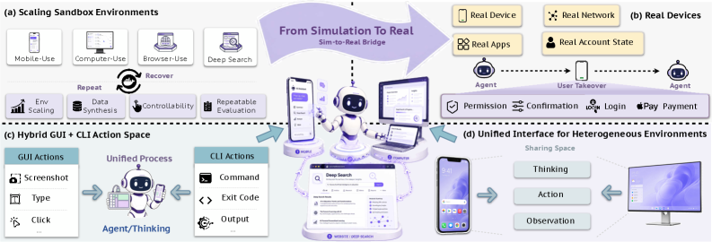
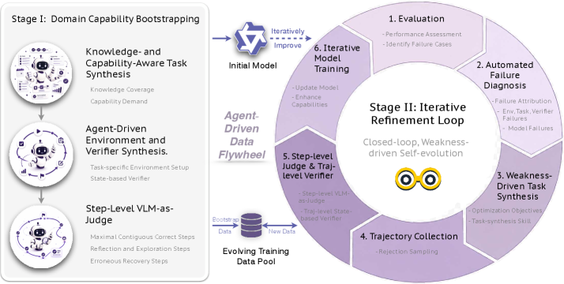
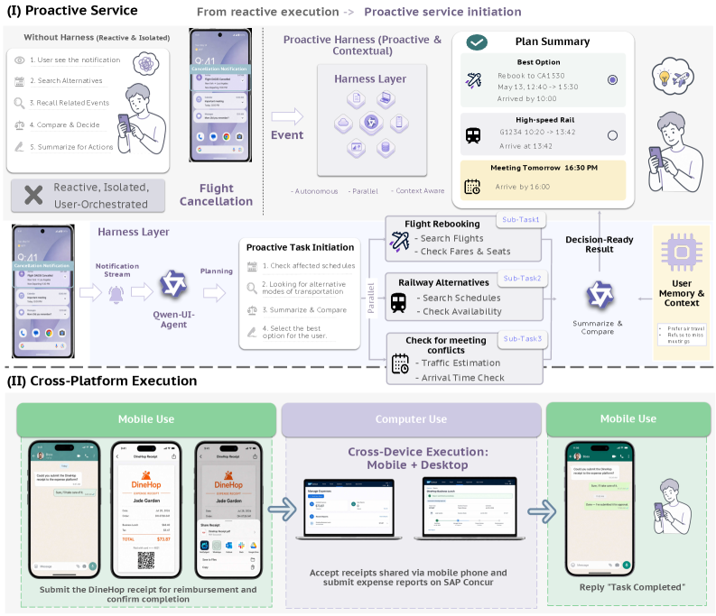

> **论文**：Qwen-UI-Agent Technical Report: Toward Next-Generation Real-World Centric Foundation GUI Agents
> **作者**：Hanzhang Zhou, Panrong Tong, Xu Zhang et al. (Qwen Team, Alibaba)
> **arXiv ID**：2607.28227
> **发表时间**：2026-07-30
> **代码仓库**：无（技术报告）

## 第 1 章 概述

### 1.1 一句话定位

Qwen-UI-Agent 是阿里巴巴 Qwen Team 推出的以真实世界为中心（real-world centric）的 foundation GUI agent，覆盖 mobile、computer-use、web、DeepSearch 四类环境。论文的系统性贡献在于：以 100+ 物理设备的真机移动运行时为基础设施，构建了统一混合动作空间（GUI 操作与 CLI/API 执行交错、单次 turn 批量输出），并通过 AutoResearch 式 agent 驱动数据飞轮与可扩展在线 RL（>100 交互步轨迹、最多 10,000 并发环境）完成能力获取，最终在多个真实设备与标准基准上达到与 Opus 4.8、Gemini 3.1 Pro、GPT-5.6 Sol 等 frontier 模型可比乃至超越的性能。

### 论文图表总览表

| 编号 | 内容 | 章节 |
|------|------|------|
| **Figure 1** | 主结果柱状对比图（各基准 vs frontier 模型） | 第 1 章 |
| **Figure 3** | 环境基础设施总览（沙箱、真机、混合 GUI+CLI、统一接口） | 第 3 章 |
| **Figure 5** | AutoResearch 式数据飞轮（bootstrapping + 迭代循环） | 第 3 章 |
| **Figure 6** | Harness 层（主动服务启动 + 跨平台执行） | 第 3 章 |
| **Table 1** | 统一动作空间（GUI / CLI / API / 交互控制） | 第 3 章 |
| **Table 2** | MobileWorld 移动基准结果 | 第 4 章 |
| **Table 3** | MobileWorld-Real / AndroidDaily 真机移动结果 | 第 4 章 |
| **Table 4** | OSWorld-Verified 计算机使用结果 | 第 4 章 |
| **Table 5** | OSWorld-v2 计算机使用结果 | 第 4 章 |
| **Table 6** | WebArena 浏览器结果 | 第 4 章 |
| **Table 7** | BrowseComp / BrowseComp-ZH DeepSearch 结果 | 第 4 章 |
| **Table 8** | GUI grounding 基准结果 | 第 4 章 |
| **Table 9** | 通用能力与 agentic 基准结果 | 第 4 章 |
| **Table 10** | 真机失败模式分析 | 第 5 章 |
| **Table 11** | GUI-CLI 协调与批量动作行为分析 | 第 5 章 |
| **Table 12** | Action RL 各错误模式成功率提升 | 第 5 章 |

### 1.2 核心贡献

论文列出五项核心贡献，涵盖了从基础设施到训练范式再到应用层的完整体系：

**贡献一：真实设备移动基础。** 构建了由 100+ 物理设备、150+ 应用组成的 real-device mobile runtime，贯穿任务设计、轨迹采集、在线 RL 与评估全流程。该运行时引入虚拟屏机制（virtual screen mechanism），使单台物理设备可并行承载多个会话，吞吐量提升约 20×。健康感知调度器（health-aware scheduler）对设备、应用、账号、网络与显示状态进行持续跟踪与黑名单管理，保证大规模并发的稳定性。

**贡献二：多域跨平台能力。** 统一动作空间与轻量 harness 层的组合，使 agent 能够组合 mobile、web、computer、DeepSearch 四类环境完成跨设备工作流。任务上下文与状态可在平台间保留与传递，例如从手机发现餐厅后在桌面端填写审批表格再回传地图收藏。

**贡献三：混合 GUI+CLI 与批量动作空间。** 动作空间在传统 GUI 操作之外引入 `cli_command` 与 `api_call`，并支持单次模型 turn 输出批量动作。在计算机使用场景中，CLI 动作占比达 40.7%（OSWorld-Verified）至 55.1%（OSWorld-v2），超过 40% 的模型输出为批量动作。这一设计将 GUI 的视觉通用性与 CLI 的高效精确性结合，显著缩短长时程任务的交互步数。

**贡献四：可扩展在线 RL（长时程）。** 提出 verifier-guided online RL 框架，支持超过 100 交互步的轨迹级训练，在最多 10,000 个并发模拟环境中运行。模型自适应课程（model-adaptive curriculum）通过 active pool（中间成功率任务）与 monitoring pool（不可解或已掌握任务）动态调节训练难度分布。

**贡献五：AutoResearch 式能力获取 + 主动服务。** Agent 驱动的迭代数据飞轮实现了"任务合成 → 环境/验证器合成 → 失败分析 → 下一轮规划"的闭环。在应用层，proactive service harness 将移动通知映射为 affair → task 的状态流，使 agent 能够主动发起服务（如航班取消后自动生成改签方案），而非仅被动响应指令。

### 1.3 关键结果速览

*图1：Qwen-UI-Agent 在移动、计算机使用、浏览器、DeepSearch 与 GUI grounding 各基准上与 frontier 模型的对比*

Qwen-UI-Agent 27B 在以下基准上取得领先或可比结果：

| 基准 | Qwen-UI-Agent 27B | 对比前沿模型 | 论文表格 |
|------|-------------------|-------------|----------|
| MobileWorld（50 步） | 82.1% | 领先 Opus 4.8 14.6 pp、GPT-5.6 Sol 12.0 pp、Seed 2.1 Pro 8.9 pp | Table 2 |
| MobileWorld-Real | 92.2% | 领先 Gemini 3.1 Pro 6.0 pp、Opus 4.8 7.5 pp、GPT-5.6 Sol 6.8 pp、Seed 2.1 Pro 3.5 pp | Table 3 |
| AndroidDaily | 97.5% | — | Table 3 |
| OSWorld-Verified | 79.5% | 第二名，仅次于 Opus 4.8（83.4%） | Table 4 |
| OSWorld-v2（partial / binary） | 40.0% / 13.9% | Claude 54.8% / 20.6%；GPT-5.5 49.5% / 13.0% | Table 5 |
| WebArena | 73.6% | Claude 71.9%、GPT-5.5 69.5%、Gemini 3.1 Pro 65.3%、Human 78.2% | Table 6 |
| BrowseComp / BrowseComp-ZH | 64.1% / 75.0% | BrowseComp 在 27B 规模领先（落后 frontier 闭源）；BrowseComp-ZH 第二 | Table 7 |
| ScreenSpot-Pro（zoom-in） | 81.5% | 所有模型中第一 | Table 8 |

在 GUI grounding 细项上，27B 变体在 ScreenSpot-V2 达 97.5%、MMBench-GUI L2 达 92.6%、OSWorld-G-Refined 达 78.5%、UI-Vision 达 70.0%。在通用能力方面（Table 9），27B 在 MMMU-Pro 达 72.4（与 Qwen3.5-27B 的 73.5 基本持平）、Terminal-Bench 2.0 达 50.1（基线 41.1，大幅提升）、Claw-Eval 达 73.5（基线 66.9），表明 agent 训练未以牺牲通用能力为代价。论文同时发布 35B-A3B（MoE，激活 3B/token）与 4B 两个轻量变体，但 35B-A3B 的 CUA/DeepSearch 训练仍在进行中，尚未包含完整结果。

## 第 2 章 研究背景与动机

### 2.1 六项关键转变

论文在 Introduction 中系统阐述了 GUI agent 从"基准驱动研究"走向"真实世界部署"过程中必须完成的六项关键转变。这六项转变既是 Qwen-UI-Agent 的设计动机，也定义了"next-generation foundation GUI agent"的标准。

**转变一：模拟环境 → 真实设备。** 现有移动 agent 主要在 AndroidWorld、MobileWorld 等模拟器上训练和评估，但模拟器无法复现真实设备的物理控件（如生物识别、NFC）、厂商定制 UI 弹窗、网络波动与账号状态。Qwen-UI-Agent 以 100+ 物理设备、150+ 应用构建真机运行时，从数据采集到在线 RL 再到评估均在与用户相同的环境中进行，消除 sim-to-real gap。

**转变二：隔离域 → 跨域跨平台。** 传统 agent 在单一域（仅 mobile、仅 browser 或仅 desktop）内运作，但真实用户需求天然跨平台——从手机发现餐厅、在桌面填写审批表、再回传到手机地图。Qwen-UI-Agent 通过统一动作空间与 harness 层的任务状态流，实现上下文与任务状态在设备间的保留与传递。

**转变三：GUI-only → 混合 GUI+CLI 批量动作。** 纯 GUI agent 依赖逐步视觉点击，在文件管理、系统配置等场景中效率低下。Qwen-UI-Agent 的动作空间将 `cli_command` 和 `api_call` 与 GUI 操作交错，并支持单次 turn 批量输出多个动作。这使得复杂操作（如批量重命名文件）可通过一条命令完成，而非数十次点击。

**转变四：短时程 → 可靠长时程。** 大多数基准将任务截断在 30-50 步，但真实任务（如多平台比价、长表单填写、DeepSearch 后整理结果）需要上百步交互。Qwen-UI-Agent 的 verifier-guided online RL 支持 >100 交互步的轨迹级训练，配合错误恢复机制（如 step-level VLM judge 的恢复段检测）保证长时程可靠性。

**转变五：人工密集训练 → AutoResearch 式自动化。** 传统 pipeline 高度依赖人工标注轨迹与设计任务。Qwen-UI-Agent 采用 agent 驱动的数据飞轮：强模型先分析领域知识生成任务池，通过 rejection sampling 得到 SFT 语料；随后进入迭代循环——失败分析驱动新任务、环境与验证器的自动合成，大幅降低人工参与。

**转变六：反应式 → 主动服务。** 传统 agent 被动等待用户指令。Qwen-UI-Agent 的 harness 层引入 affair 抽象，将移动通知等被动事件映射为持续的现实事务（如航班取消、日程变更），由 agent 主动评估优先级、准备方案并在受控条件下执行，实现从"工具"到"助手"的角色跃迁。

### 2.2 与现有 GUI agent 的差距

论文在 Related Work 中将已有 GUI agent 分为三类——Mobile（Mobile-Agent-v3.5、UI-Venus-1.5、Step-GUI、MAI-UI、Xiaomi-GUI-0）、Browser（WebVoyager、SeeAct、Operator、Mariner、UI-TARS）、Computer（UI-TARS、DART-GUI、OpenCUA、UltraCUA、EvoCUA）——并指出它们与真实世界部署之间的系统性差距。

**差距一：benchmark 优化 vs 真实世界效用。** 现有 agent 多以单一基准（如 AndroidWorld、OSWorld、WebArena）的分数为优化目标，在沙箱环境中过拟合特定任务分布。一旦迁移到真实设备，UI 弹窗干扰（18.2%）、物理控件不可操作（9.1%）、UI 误读（24.7%）等场景外挑战即成为主要失败来源（合计 52.0% 的真机失败归因于真实场景挑战，见 Table 10）。Qwen-UI-Agent 的真机运行时从源头上将这些挑战纳入训练与评估。

**差距二：单一域 vs 统一跨域。** Mobile、Browser、Computer 三类 agent 各自独立发展，缺乏统一的动作空间与状态表示。用户真实需求往往是跨域的，但现有 agent 无法在同一会话中组合不同平台的能力。Qwen-UI-Agent 的统一动作空间（Table 1）和 harness 跨平台规划器正是对这一差距的直接回应。

**差距三：纯 GUI vs 混合执行。** 纯 GUI agent 在计算机使用中效率受限。论文数据显示，引入 CLI 后 OSWorld-Verified 的 CLI 动作占比达 40.7%、CLI 任务覆盖率达 92.0%（Table 11），说明 CLI 在桌面场景中几乎是刚需。现有 agent 普遍缺乏 CLI 与 GUI 的原生交错能力。

**差距四：短时程训练 vs 长时程需求。** 现有 agent 的 RL 训练多限于短轨迹（<50 步），无法应对 >100 步的真实任务。Qwen-UI-Agent 的在线 RL 框架以 >100 步轨迹和 10,000 并发环境为设计前提，并通过模型自适应课程动态调节难度。

综上，Qwen-UI-Agent 的定位不是在某个基准上刷分，而是系统性地弥合"基准驱动研究"与"真实世界部署"之间的六重差距，构建可落地的 foundation GUI agent。

## 第 3 章 系统设计

### 3.1 任务公式化

Qwen-UI-Agent 将一个 GUI agent 任务定义为一个二元组：

$$\tau = (I,\, E_\tau)$$

其中 $I$ 为自然语言指令，$E_\tau$ 为任务所绑定的执行环境。

在每个时间步 $t$，agent 接收的观测是三通道的复合结构：

$$o_t = (o_t^{\mathrm{GUI}},\, o_t^{\mathrm{CLI}},\, o_t^{\mathrm{API}})$$

$o_t^{\mathrm{GUI}}$ 为屏幕截图等视觉观测，$o_t^{\mathrm{CLI}}$ 为命令行的结构化输出（stdout/stderr/exit status），$o_t^{\mathrm{API}}$ 为 API 调用的返回值。三通道使 agent 能够同时"看到"屏幕、"读出"命令结果、"获取"API 数据，从而实现 GUI-CLI 协调。

策略网络以指令、当前观测和历史上下文为输入，输出推理过程与动作：

$$(r_t,\, a_t) = \pi_\theta(I,\, o_t,\, h_t)$$

其中 $r_t$ 为模型生成的推理（reasoning），$a_t$ 为实际执行的动作，$h_t$ 为历史上下文。

关键设计是批量动作。单个 turn 的动作 $a_t$ 可以是一个动作序列：

$$a_t = (a_t^{(1)},\, a_t^{(2)},\, \ldots,\, a_t^{(K_t)})$$

当 $K_t = 1$ 时为单步动作，当 $K_t > 1$ 时为批量动作。批量输出显著减少了模型交互轮次——数据显示平均每个 batch 包含 3.1 个原始动作（Table 11），在 OSWorld-Verified 中 62.1% 的任务、OSWorld-v2 中 88.9% 的任务涉及批量执行。

### 3.2 动作空间

Qwen-UI-Agent 的统一动作空间（Table 1）分为四大类，覆盖 GUI 交互、命令行执行、API 调用与会话控制：

| 类别 | 动作 | 说明 |
|------|------|------|
| **GUI** | `click` / `double_click` / `long_press` | 点击/双击/长按，坐标归一化 |
| | `type` | 文本输入 |
| | `open` | 打开应用或 URL |
| | `drag` | 拖拽（起止坐标） |
| | `system_button` | 系统按键（Home/Back/Recent 等） |
| | `wait` | 等待（页面加载/动画完成） |
| **CLI** | `cli_command` | 非交互 shell 命令，stdout/stderr/exit status 结构化返回 |
| **API** | `api_call` | 第三方或系统 API 调用 |
| **交互控制** | `ask_user` | 向 User Agent 请求缺失信息或确认敏感操作 |
| | `terminate` | 终止任务 |

CLI 动作的设计要点：`cli_command` 在非交互 shell 中执行，返回结构化的 stdout/stderr/exit status；设有超时预算以防阻塞；执行错误作为观测返回（enable 诊断恢复）；命令写入 shell history 供后续引用。GUI 动作在真实设备上转换为原生输入事件（而非 Accessibility API 注入），保证与用户操作的完全一致性。

这一动作空间的核心创新在于 GUI、CLI、API 的原生交错——agent 可以在同一个批量动作序列中先执行一条 shell 命令安装依赖，再用 `click` 打开应用，最后用 `api_call` 查询数据，无需切换模式。

### 3.3 环境基础设施

*图3：环境基础设施四组件——沙箱、真实设备、混合 GUI+CLI、统一跨平台接口*

Qwen-UI-Agent 的环境基础设施由四个组件构成，形成从高并发模拟到高保真真机的完整谱系。

#### 3.3.1 沙箱扩展（Sandbox）

沙箱环境支持最多 10,000 个并行实例，为大规模在线 RL 提供算力基础。四类沙箱覆盖不同平台：

- **移动沙箱**：MobileWorld 重建于 redroid（容器化 Android），无需 QEMU/KVM 虚拟化层，大幅降低资源开销。
- **计算机沙箱**：OSWorld 的 Ubuntu VM 扩展，提供直接 bash 访问能力，使 `cli_command` 可在系统 shell 中执行。
- **浏览器沙箱**：基于 Playwright + Chromium 的自动化浏览器环境，支持网页操作与状态管理。
- **DeepSearch 沙箱**：Serper（搜索 API）+ Jina Reader（网页正文提取）组合，用于信息检索与网页内容结构化。

#### 3.3.2 真实设备移动运行时（Real-Device Mobile Runtime）

真机运行时是 Qwen-UI-Agent 区别于现有 agent 的核心基础设施，包含 100+ 物理设备与 150+ 应用。其关键组件包括：

- **健康感知调度器（Health-Aware Scheduler）**：持续跟踪设备、应用、账号、网络与显示状态，对异常设备/应用加入黑名单，保证大规模并发的稳定性。
- **虚拟屏机制（Virtual Screen Mechanism）**：基于 Genymobile 技术，使单台物理设备可并行承载多个会话，吞吐量提升约 20×。这是在物理设备数量有限的约束下实现大规模并发的关键。
- **User Agent**：当 agent 遇到缺失信息、敏感操作确认需求或 CAPTCHA 时，自动将控制权转交给 User Agent（人工或自动化接口），完成任务后取回。这使 agent 能够处理无法纯自主完成的场景。
- **VLM Judge（三分类）**：在真机评估中，VLM judge 将每条轨迹的结果区分为任务成功（pass）、模型失败（failed）与环境失败（env_error）三类。env_error 样本从分母中排除，避免设备/网络等环境噪声拉低评估准确性。

#### 3.3.3 混合 GUI+CLI 执行层

GUI 动作被转换为设备的原生输入事件（touch event），`cli_command` 在非交互 shell 中执行并以结构化格式（stdout/stderr/exit status）返回。命令执行设有超时预算，执行错误作为观测反馈给 agent，使其能够诊断并恢复——例如命令失败后 agent 可读取 stderr 修正参数重试。所有执行的命令写入 shell history，供后续步骤引用。

#### 3.3.4 统一跨平台接口

所有环境（沙箱与真机）共享统一的生命周期接口：`acquire → reset → step → evaluate → tear_down → release`。租约（lease）机制将每个会话绑定到特定的 backend + display 组合，环境适配器（environment adapter）与任务适配器（task adapter）解耦了环境逻辑与任务逻辑。坐标归一化（coordinate normalization）保证了不同分辨率设备上的动作一致性。

### 3.4 Agent 驱动数据飞轮

*图5：AutoResearch 式数据飞轮——bootstrapping 与迭代细化循环*

数据飞轮是 Qwen-UI-Agent 能力获取的核心引擎，采用 AutoResearch 式的 agent 驱动闭环。

#### 3.4.1 Bootstrapping 阶段

飞轮启动时，强模型（frontier model）首先分析目标领域的知识结构，生成任务候选池；随后 agent 尝试执行这些任务，通过 rejection sampling 筛选出成功轨迹作为 SFT 语料。这一阶段的目标是用最少的标注成本构建初始训练集。

#### 3.4.2 迭代循环

Bootstrapping 之后进入持续迭代循环，每一轮包含：**失败分析** → **目标设定** → **新任务/环境/验证器合成** → **训练语料生成**。循环的驱动力是系统化的失败归因。

#### 3.4.3 关键机制

- **知识/能力感知任务合成**：利用 function tree（功能树）描述应用的可用操作空间，结合 capability profile（能力画像）识别模型当前薄弱环节，定向合成训练任务。
- **环境状态合成**：通过数据注入技能（data injection skills）构造特定环境状态（如预填充的购物车、已有联系人的通讯录），使任务从合理的中间状态开始而非空白状态。
- **Step-level VLM Judge**：不仅判断任务最终成败，还对轨迹进行步级评估，关注三个信号——最大连续正确步数、反思探索的第一步位置、以及恢复段（从错误中恢复的步骤序列）。这为细粒度的训练信号提供了基础。
- **可执行验证器（Executable Verifiers）**：为每个任务合成程序化验证器，用于在线 RL 中的自动奖励计算，替代昂贵的人工评估。
- **失败分析驱动迭代**：将模型失败映射为结构化原因（如"元素混淆""过早终止"），聚合后按频率排序，作为下一轮优化的优先目标。

### 3.5 训练

Qwen-UI-Agent 的训练分为三个阶段：SFT → Action RL → Online RL，逐步从模仿学习过渡到自主探索。

#### 3.5.1 监督微调（SFT）

SFT 阶段采用三项关键策略：

- **域条件专家训练 + 模型合并**：先为每个域（mobile/computer/web/DeepSearch）训练域专家模型，再将各域专家合并为统一模型，兼顾域深度与跨域泛化。
- **In-distribution 数据保持通用能力**：在 agent 训练数据中混入起始模型已经能解决的通用任务示例（in-distribution data），防止 agent 训练侵蚀通用语言与推理能力。论文发现这类示例在保持通用能力方面最为有效。
- **滑窗训练（Sliding-Window Training）**：对于长轨迹，采用 $n = 5$ 步的滑动窗口，步进 4 步（1 步重叠）。首个窗口监督全部 5 个动作，每个完整后续窗口因边界步 loss 被掩码而监督 4 个新动作，使模型学会在给定前序上下文的条件下连续输出多个动作，为批量动作空间奠定基础。

#### 3.5.2 Action RL

Action RL 阶段针对六种复发错误模式进行定向优化：

1. **混淆元素定位（Confusable element localization）**：视觉上相似的元素被错误点击
2. **排序排名（Sorting & ranking）**：列表中需要选择第 N 个元素时定位错误
3. **数量与多目标完整性（Multi-target completeness）**：需要操作多个目标时遗漏部分
4. **过早完成（Premature termination）**：任务未完成时提前调用 `terminate`
5. **重复动作循环（Repetitive action loops）**：陷入重复点击同一元素的死循环
6. **长尾动作选择失败（Long-tail action failure）**：低频动作因训练数据不足而执行失败

训练数据通过两种方式收集：历史轨迹挖掘（从已有失败案例中提取）与主动环境交互（让 agent 在环境中尝试以生成新的失败样本）。

核心创新是动作感知奖励（action-aware reward）：

$$r_t = F_t\!\left(w_{\mathrm{type}} \cdot C_t + w_{\mathrm{arg}} \cdot C_t \cdot Q_t - \lambda_{\mathrm{sens}} \cdot S_t - \lambda_{\mathrm{rep}} \cdot L_t\right)$$

其中 $F_t$ 为门控函数，$C_t$ 为动作类型正确性指示，$w_{\mathrm{type}}$ 与 $w_{\mathrm{arg}}$ 分别为类型与参数权重，$Q_t$ 为参数质量评分，$S_t$ 为敏感动作惩罚项（对支付、删除等高风险操作的约束），$L_t$ 为重复/循环惩罚项，$\lambda_{\mathrm{sens}}$ 与 $\lambda_{\mathrm{rep}}$ 为对应惩罚系数。

此外，Action RL 引入熵正则化（entropy regularization）以鼓励动作分布的多样性，并设置推理长度的上下界以平衡推理质量与效率。训练后，长尾动作的训练数据占比提升至约 40%，长尾动作的 reward 提升 6.4%（71.5% → 77.9%）。

#### 3.5.3 Online RL

Online RL 阶段使用 GRPO（Group Relative Policy Optimization）变体，在最多 10,000 个并发环境中进行大规模训练。

奖励信号为二进制结果奖励：

$$r_i = v_x(s_{\mathrm{final}}) \in \{0,\, 1\}$$

其中 $v_x$ 为任务 $\tau$ 对应的可执行验证器，$s_{\mathrm{final}}$ 为轨迹最终状态。组内相对优势按标准 GRPO 公式计算：

$$\hat{A}_i = \frac{r_i - \bar{r}_x}{\operatorname{Std}(r_1, \dots, r_K) + \epsilon}$$

其中 $\bar{r}_x$ 为同组轨迹奖励均值，$\mathrm{Std}$ 为标准差，$\epsilon$ 为数值稳定项。这一设计无需训练单独的价值模型，降低了训练复杂度。

模型自适应课程（model-adaptive curriculum）通过两个池动态管理训练任务分布：

- **Active Pool**：包含当前模型成功率处于中间区间（既非完全掌握也非完全不可解）的任务，保证训练信号的有效梯度。
- **Monitoring Pool**：包含已被判定为不可解（环境/验证器问题）或已完全掌握的任务，定期复查以检测能力变化。

整个 Online RL 覆盖约 10,000 个验证任务-验证器对，支持 >100 交互步的轨迹级训练。训练后涌现出"Bash as Hands, GUI as Eyes"的协作模式——agent 自主学会用 CLI 执行操作（"手"）、用 GUI 视觉信息进行验证（"眼"），执行-验证转换轨迹比例从 40.2% 提升至 52.4%。

### 3.6 Harness 层

*图6：Harness 层支持主动服务启动与跨平台任务执行*

Harness 层是 Qwen-UI-Agent 从"被动工具"升级为"主动助手"的关键抽象，解决两个核心问题：如何主动发起服务，以及如何在多设备间协调执行。

#### 3.6.1 Affair 抽象与主动服务

Harness 层引入 affair（持续现实事务）作为核心抽象。一个 affair 的生命周期为：**事件感知 → affair 状态与记忆 → affair 级推理与任务形成 → 主动准备与受控执行**。

- **事件感知**：解析移动设备通知（如航班取消、日程提醒、消息到达），将其映射为候选 affair。
- **Affair 状态与记忆**：每个 affair 维护 profile memory（事务相关上下文）与 feedback memory（历史交互反馈），形成持续的事务记忆。
- **Affair 级推理与任务形成**：对候选 affair 进行价值评估，分为三类——立即处理（高优先级且信息充足）、被动待办（等待用户确认或更多上下文）、抑制（低价值或不适当时机）。
- **主动准备与受控执行**：对低风险操作（如信息查询、方案生成）可预执行；对高风险操作（支付、预订、发送消息）必须等待用户确认。

典型场景包括：08:00 晨间简报（天气 + 通勤 + 日程提醒自动聚合）、航班取消恢复（自动生成改签与高铁备选方案并评估）。

#### 3.6.2 跨平台执行

当 affair 涉及多设备时，Harness 层提供四项跨平台能力：

- **全局感知与设备接地**：维护多设备的标注视图（annotated view），agent 可全局感知所有可用设备及其当前状态。
- **依赖感知规划**：采用 OpenClaw-like planner 进行任务分解与依赖排序，确定子任务的执行顺序与目标设备。
- **并行多代理执行**：利用虚拟屏机制，多个子任务可在不同虚拟屏上并行执行（如在 Dianping、Meituan、Amap 上同时搜索餐厅），显著缩短端到端延迟。
- **混合执行**：在单个工作流中自由组合 GUI 操作、CLI 命令与 API 调用，跨越 mobile、desktop、browser 与 DeepSearch 环境。

典型跨平台场景：团队建设餐厅选择（手机发现候选 → 桌面端整理对比表格 → 发送审批 → 收藏回手机地图）；发票整理（相册选择发票图片 → 桌面端批量重命名 → 生成费用报表）。
## 第 4 章 实验评估

### 4.1 实验设置

Qwen-UI-Agent 共有三个模型变体：**27B**（端到端 agent 评估的主变体）、**35B-A3B**（每 token 仅激活 3B 参数的 MoE 变体）与 **4B**。三个变体均从对应的基础检查点初始化，采用第 3 章描述的 SFT + Action RL + Online RL 流水线训练。

评估覆盖五组基准：

| 基准组 | 具体基准 | 考察能力 |
|--------|---------|---------|
| 真实设备移动 | MobileWorld-Real、AndroidDaily、MobileWorld | 真实设备长时程跨应用执行 |
| 计算机使用 | OSWorld-Verified、OSWorld-v2 | 桌面应用混合 GUI+CLI 工作流 |
| 浏览器与 DeepSearch | WebArena、BrowseComp、BrowseComp-ZH | 端到端网页交互、跨源信息检索与证据合成 |
| GUI Grounding | ScreenSpot-Pro、ScreenSpot-V2、MMBench-GUI L2、OSWorld-G-Refined、UI-Vision | 元素定位（高分辨率专业软件、跨平台界面） |
| 通用与 Agentic | MMMU-Pro、MMLU-Pro、Tau2-Bench、Terminal-Bench 2.0、Claw-Eval 等 13 项 | 通用推理与智能体能力保持 |

评估协议：交互式 GUI 基准遵循官方任务集与步数限制；MobileWorld-Real 由 AutoJudge 三分类（pass/failed/env_error），环境错误单独报告并从成功率分母中排除；WebArena 先人工核验官方脚本中的错误参考答案再评估。

### 4.2 MobileWorld-Real：真实设备移动基准

论文提出 **MobileWorld-Real** 作为真实设备移动 GUI 评估基准：

- **409 个端到端任务、104 个应用**，任务均来自人类贡献者记录的日常需求
- 覆盖 **7 个日常移动使用域**：内容消费、生活服务、生产力、电子商务、系统设置、金融服务、社交沟通
- 近半数任务标记为 hard：长时程执行、比较与排序、动态信息推理、深层嵌套导航、弹窗恢复、跨应用协调
- 运行在真实 Android 设备上（真实账号状态 + 动态在线内容），暴露弹窗、过期登录、权限请求、验证码等沙箱中罕见条件
- 任务与轨迹全部从训练集中留出

**AutoJudge** 轨迹级评估器：5 个独立 VLM judge 分别给出 pass/failed/env_error 判定与理由，多数投票决定最终结果；环境错误从成功率分母中排除。在 666 条轨迹上对照独立专家标注，**精确匹配准确率达 92.8%**。

### 4.3 移动使用评估

**MobileWorld**（模拟环境，标准 50 步预算，Table 2）：

| 模型 | Access / Size | 成功率 (%) |
|------|--------------|-----------|
| Seed 2.1 Pro (ByteDance Seed) | Closed-source | 73.2 |
| GPT-5.6 Sol (OpenAI) | Closed-source | 70.1 |
| Claude Opus 4.8 (Anthropic) | Closed-source | 67.5 |
| Seed 2.0 Pro (ByteDance Seed) | Closed-source | 63.2 |
| Qwen 3.7 Plus (Qwen Team) | 397B-A17B | 62.3 |
| Gemini 3.1 Pro (Google) | Closed-source | 58.1 |
| Kimi K2.6 (Moonshot AI) | 1T-A32B | 55.6 |
| GUI-Owl-1.5-32B-Instruct | 32B | 43.9 |
| MAI-UI-235B-A22B | 235B-A22B | 39.7 |
| UI-Venus-1.5-30B-A3B | 30B-A3B | 17.1 |
| **Qwen-UI-Agent** | **27B** | **82.1** |
| Qwen-UI-Agent | 35B-A3B | 65.0 |

Qwen-UI-Agent-27B 以 **82.1%** 刷新 SOTA，超越 GPT-5.6 Sol、Opus 4.8、Seed 2.1 Pro 分别 **12.0、14.6、8.9 pp**；超越最强专用 GUI 基线 GUI-Owl-1.5-32B-Instruct（43.9%）**38.2 pp**。步数预算提升至 100 时，27B 与 35B-A3B 分别升至 **85.5%** 与 **68.4%**。

**真实设备基准**（Table 3）：

| 模型 | Access / Size | MobileWorld-Real (%) | AndroidDaily (%) |
|------|--------------|---------------------|-----------------|
| Seed 2.1 Pro | Closed-source | 88.7 | 95.2 |
| Gemini 3.1 Pro | Closed-source | 86.2 | 93.8 |
| GPT-5.6 Sol | Closed-source | 85.4 | 92.6 |
| Claude Opus 4.8 | Closed-source | 84.7 | 93.0 |
| Qwen 3.7 Plus | 397B-A17B | 72.7 | 79.8 |
| Kimi K2.6 | 1T-A32B | 62.6 | 67.6 |
| PhoneBuddy-4B | 4B | 53.5 | 69.0 |
| UI-Venus-1.5-30B-A3B | 30B-A3B | 33.0 | 61.7 |
| GUI-Owl-1.5-32B-Instruct | 32B | 32.4 | 60.9 |
| GELab-Zero-4B-preview | 4B | 31.3 | 73.4 |
| **Qwen-UI-Agent** | **27B** | **92.2** | **97.5** |
| Qwen-UI-Agent | 35B-A3B | 87.4 | 93.9 |

Qwen-UI-Agent-27B 在 MobileWorld-Real 上以 **92.2%** 超越所有基线（Seed 2.1 Pro 88.7%、Gemini 3.1 Pro 86.2%、GPT-5.6 Sol 85.4%），在 AndroidDaily 上以 **97.5%** 排名第一。35B-A3B 变体（激活仅 3B/token）也达到 87.4%/93.9%，兼顾部署效率。

### 4.4 计算机使用评估

**OSWorld-Verified**（361 个桌面任务的部分进度得分，Table 4）：

| 模型 | Access / Size | 成功率 (%) |
|------|--------------|-----------|
| Claude Opus 4.8 | Closed-source | 83.4 |
| Seed 2.1 Pro | Closed-source | 78.8 |
| GPT-5.5 | Closed-source | 78.7 |
| Gemini 3.5 Flash | Closed-source | 78.4 |
| Gemini 3.1 Pro | Closed-source | 76.2 |
| MiniMax M3 | 428B-A23B | 75.2 |
| Qwen 3.7 Plus | 397B-A17B | 73.3 |
| Kimi K2.6 | 1T-A32B | 73.1 |
| GUI-Owl-1.5-32B-Instruct | 32B | 56.5 |
| **Qwen-UI-Agent** | **27B** | **79.5** |

Qwen-UI-Agent-27B 以 **79.5%** 排名第二，仅次于 Claude Opus 4.8（83.4%），超越 Seed 2.1 Pro、GPT-5.5、Gemini 3.5 Flash、Gemini 3.1 Pro 及所有开源权重模型。

**OSWorld-v2**（长时程任务，Table 5）：

| 模型 | Partial (%) | Binary (%) | Steps/task | Action Mode |
|------|------------|-----------|-----------|-------------|
| Claude Opus 4.8 | 54.8 | 20.6 | 103.0 | Batched |
| GPT-5.5 | 49.5 | 13.0 | 95.2 | Batched |
| MiniMax M3 | 22.3 | 4.6 | 326.7 | Single |
| Kimi K2.6 | 22.1 | 4.6 | 179.3 | Single |
| Qwen 3.7 Plus | 21.5 | 2.8 | 173.5 | Single |
| **Qwen-UI-Agent** | **40.0** | **13.9** | **135.8** | Batched |

Qwen-UI-Agent 部分进度 **40.0%**、二进制完成率 **13.9%**，与前沿闭源模型竞争：二进制完成率超越 GPT-5.5（13.0%）0.9 pp，部分进度落后 9.5 pp。对比最强开源基线 MiniMax M3，部分进度提升 **17.7 pp**、二进制完成提升 **9.3 pp**（对 Kimi K2.6 为 17.9/9.3 pp，对 Qwen 3.7 Plus 为 18.5/11.1 pp）。平均仅 **135.8 步/任务**，远少于 MiniMax M3（326.7）与 Qwen 3.7 Plus（173.5）。

混合执行量化证据：OSWorld-Verified 上 CLI 动作占 **40.7%**、批量动作占 **39.6%**；OSWorld-v2 上分别为 **55.1%** 与 **41.6%**。

### 4.5 浏览器与 DeepSearch 评估

**WebArena**（Table 6）：

| 模型 | Access / Size | 成功率 (%) |
|------|--------------|-----------|
| Claude Opus 4.8* | Closed-source | 71.9 |
| GPT-5.5* | Closed-source | 69.5 |
| Gemini 3.1 Pro* | Closed-source | 65.3 |
| Qwen 3.7 Plus* | Closed-source | 59.0 |
| CUA-GYM-A17B | 397B-A17B | 56.0 |
| Kimi K2.6* | 1T-A32B | 55.8 |
| Qwen3.5-397B-A17B | 397B-A17B | 54.0 |
| GUI-Owl-1.5-32B-Thinking | 32B | 48.4 |
| Qwen3.5-27B | 27B | 41.5 |
| Qwen3.5-35B-A3B | 35B-A3B | 40.8 |
| **Qwen-UI-Agent** | **27B** | **73.6** |
| Qwen-UI-Agent | 35B-A3B | 69.2 |
| Human Performance | – | 78.2 |

（* 标注为在修正后的评估设置下报告的结果；论文手动核验了官方脚本中的错误参考答案。）

Qwen-UI-Agent-27B 以 **73.6%** 位居所有模型第一，超越最强基线 Claude Opus 4.8（71.9%）**1.7 pp**、GPT-5.5（69.5%）**4.1 pp**；距人类表现 78.2% 还有 4.6 pp 差距。

**DeepSearch**（BrowseComp / BrowseComp-ZH，Table 7）：

| 模型 | Access / Size | BrowseComp (%) | BrowseComp-ZH (%) |
|------|--------------|---------------|------------------|
| GPT-5.5 | Closed-source | 90.1 | – |
| Seed 2.1 Pro | Closed-source | 86.2 | – |
| Gemini 3.1 Pro | Closed-source | 85.9 | – |
| Claude Opus 4.8 | Closed-source | 84.3 | – |
| Qwen3.5-397B-A17B | 397B-A17B | 78.6 | 70.3 |
| Apodex-1.0-mini | 35B-A3B | 71.5 | 80.6 |
| Qwen3.5-27B | 27B | 61.0 | 62.1 |
| GLM-4.7 | 358B | 52.0 | 66.6 |
| DeepSeek-V3.2 | 685B | 51.4 | 65.0 |
| Tongyi-DR-30B | 30B-A3B | 43.4 | 46.7 |
| UI-TARS-2 | Closed-source | 29.6 | 50.5 |
| **Qwen-UI-Agent** | **27B** | **64.1** | **75.0** |

Qwen-UI-Agent 在 BrowseComp 上 **64.1%**（超越 Qwen3.5-27B、Tongyi-DR-30B、UI-TARS-2），在 BrowseComp-ZH 上 **75.0%** 位居所有系统第二。

### 4.6 GUI Grounding 评估

Table 8（SS-Pro 括号内为 zoom-in 设置）：

| 模型 | SS-Pro (%) | SS-V2 (%) | MM-GUI-L2 (%) | OSW-G-R (%) | UI-Vision (%) |
|------|-----------|----------|--------------|------------|--------------|
| Qwen 3.7 Plus* | 68.9 (79.0) | 96.6 | 90.5 | 78.2 | 68.0 |
| Seed 2.1 Pro* | 65.3 (80.7) | 96.6 | 90.9 | 78.0 | 62.0 |
| Qwen3.5-27B* | 68.4 (70.3) | 96.1 | 89.1 | 67.9 | 46.6 |
| GUI-Owl-1.5-32B-Instruct | 72.9 (80.3) | 95.3 | 86.8 | 69.7 | – |
| UI-Venus-1.5-30B-A3B | 69.6 (74.8) | 96.2 | 88.6 | 70.6 | 54.7 |
| MAI-UI-32B | 67.9 (73.5) | 96.5 | 91.3 | 75.0 | 47.1 |
| ZoomOnce-4B | 66.2 | 95.2 | 87.6 | 73.1 | 40.2 |
| **Qwen-UI-Agent-4B** | **67.8 (74.0)** | **94.9** | **87.9** | **70.5** | **51.6** |
| **Qwen-UI-Agent-35B-A3B** | **76.1 (80.2)** | **96.7** | **92.0** | **74.6** | **65.9** |
| **Qwen-UI-Agent-27B** | **76.6 (81.5)** | **97.5** | **92.6** | **78.5** | **70.0** |

（* 标注为论文独立复现的结果。）

Qwen-UI-Agent-27B 在 ScreenSpot-Pro 上**所有模型中排名第一**（无 zoom-in 76.6%，zoom-in 提升至 **81.5%**）；ScreenSpot-V2 **97.5%**、MMBench-GUI L2 **92.6%**、OSWorld-G-Refined **78.5%**、UI-Vision **70.0%**。35B-A3B 与 4B 变体在紧凑规模下同样保持强 grounding 能力。

### 4.7 通用与 Agentic 能力评估

Table 9（全部为论文独立复现结果，与官方报告可能有差异）：

| 基准 | Qwen-UI-Agent | Qwen3.5-27B | UI-Venus-1.5-30B-A3B | GUI-Owl-1.5-32B-Instruct | EvoCUA-32B | OpenCUA-72B |
|------|--------------|------------|---------------------|------------------------|-----------|-------------|
| MMMU-Pro (%) | 72.4 | 73.5 | 32.4 | 39.5 | 58.4 | 31.0 |
| RealWorldQA (%) | 83.1 | 83.1 | 75.3 | 76.7 | 75.4 | 66.4 |
| CharXiv-RQ (%) | 77.7 | 76.8 | 44.7 | 50.9 | 58.1 | 39.6 |
| MathVision (%) | 82.8 | 82.0 | 36.8 | 50.6 | 60.8 | 26.6 |
| AI2D_TEST (%) | 91.1 | 91.9 | 84.3 | 84.8 | 85.7 | 78.9 |
| MMLU-Pro (%) | 86.5 | 86.0 | 65.6 | 73.9 | 77.1 | 58.8 |
| IFEval (%) | 90.2 | 90.4 | 81.3 | 84.5 | 64.0 | 70.6 |
| Tau2-Bench (%) | 89.9 | 89.2 | 22.7 | 6.1 | 48.9 | 14.4 |
| Terminal-Bench 2.0 (Avg 5) (%) | 50.1 | 41.1 | 3.2 | 0.0 | 5.6 | 9.0 |
| Claw-Eval (Avg 3) (%) | 73.5 | 66.9 | 30.6 | 29.6 | 46.3 | 26.4 |
| Claw-Eval (Pass@3) (%) | 51.8 | 41.2 | 5.5 | 5.5 | 6.5 | 0.5 |
| BFCL-v4 (%) | 74.2 | 71.3 | 19.8 | 32.7 | 48.8 | 28.3 |
| SkillsBench (Avg 5) (%) | 28.0 | 24.9 | 0.5 | 0.3 | 3.3 | 0.0 |
| QwenClawBench (Avg 3) (%) | 44.2 | 48.5 | 6.4 | 5.1 | 18.6 | 11.4 |

通用能力：Qwen-UI-Agent 与基础模型 Qwen3.5-27B 基本持平（MMMU-Pro 72.4 vs 73.5、AI2D 91.1 vs 91.9、IFEval 90.2 vs 90.4），Agentic 能力全面超越：Terminal-Bench 2.0 **50.1% vs 41.1%**、Claw-Eval Avg3 **73.5% vs 66.9%**、Tau2-Bench 89.9% vs 89.2%、BFCL-v4 74.2% vs 71.3%（QwenClawBench 44.2% vs 48.5% 小幅下降）。对专用 GUI 模型（UI-Venus-1.5、GUI-Owl-1.5、OpenCUA）在两个类别上均显著领先。

### 4.8 Harness 工作流定性评估

- **主动服务**：08:00 晨间简报（结合用户日程、实时天气与通勤条件，给出雨伞建议、出发时间与关键提醒）；航班取消恢复计划（检测取消通知 → 检索备选航班/高铁 → 评估按时到达选项 → 给出决策就绪的旅行恢复方案，最终预订决策留给用户）
- **跨平台执行**：团队建设餐厅选择（移动端发现候选餐厅 → 桌面端整理评分/菜系/预订电话到表格 → 发送给组长审批 → 批准结果保存回手机地图）；发票整理（相册选择 → 桌面重命名 → 费用报表）；并行餐厅搜索（Dianping/Meituan/Amap 多虚拟屏并发运行）

## 第 5 章 行为分析

### 5.1 真机失败行为分析（Qwen 3.7 Plus）

论文对 Qwen 3.7 Plus 在 MobileWorld-Real 与 AndroidDaily 上的全部失败轨迹进行人工审查，归纳两大失败维度（Table 10）：

| 维度 | 失败模式 | 占比 (%) | 典型行为 |
|------|---------|---------|---------|
| 执行能力局限（40.3） | 探索失败 | 19.5 | 无法定位深层应用入口 |
|  | 错误动作循环 | 14.3 | 重复无效动作 |
|  | 丢失执行状态 | 6.5 | 忘记已完成子任务 |
| 真实场景挑战（52.0） | UI 误读 | 24.7 | 误读有状态页面语义（灰色占位符被当作已输入文本反复清除） |
|  | 弹窗干扰 | 18.2 | 广告、付费墙、验证码、空白页 |
|  | 物理控件操作 | 9.1 | 滚动轮/滑块/日期选择器过冲不收敛 |
| 其他 | – | 7.7 | 执行不足、过早停止 |

核心结论：模拟环境不提供探索、错误恢复、状态跟踪的激励（执行能力局限），且刻意排除了真实设备常见的界面现象（真实场景挑战）。这直接论证了真实设备训练与评估基础设施的必要性。

### 5.2 GUI–CLI 协调与批量执行

Table 11 量化 OSWorld 两个基准上的动作使用统计：

| 统计量 | 层级 | OSWorld-Verified | OSWorld-v2 | 差异 (pp) |
|--------|------|-----------------|------------|----------|
| CLI 动作占比 | Action | 40.7% | 55.1% | +14.4 |
| 含 CLI 的任务占比 | Task | 92.0% | 98.2% | +6.2 |
| 批量动作占比 | Action | 39.6% | 41.6% | +2.0 |
| 含批量动作的任务占比 | Task | 62.1% | 88.9% | +26.8 |
| GUI-only 批量占比 | – | 75.8% | 64.7% | −11.1 |
| CLI-only 批量占比 | – | 13.1% | 15.0% | +1.9 |
| 混合 GUI+CLI 批量占比 | – | 11.0% | 20.3% | +9.3 |
| 每批量平均原始动作数 | – | 3.1 | 3.1 | 0.0 |

- GUI 与 CLI 是计算机使用轨迹中的双主通道：GUI 用于界面即控制面兼反馈源的场景（表格填充、页内搜索、长页滚动、媒体时间线、空间对象、放大细看）；CLI 用于数据/代码可更紧凑精确表达的操作（语料检索、机器可读记录解析、图像拼版 contact sheet、程序化转换、重复评分计算、输出属性验证）
- 批量执行在中间状态足够可预测时使用，平均每批量 3.1 个原始动作，显著减少"观察–推理–执行"循环次数
- **恐龙游戏案例**：要求不使用浏览器开发者工具/CDP 达到 ≥100 分。Qwen-UI-Agent 用 CLI 构建并迭代精调本地控制器（基于渲染截图 + 标准键盘事件，不访问 DOM），GUI 观察提供跳跃动力学测量证据、CLI 将其转化为可复现的感知与控制程序；日夜模式切换导致对比度反转后，用背景相对分割替代固定颜色阈值。最终控制器存活 60 秒、执行 50 次跳跃、可见末局得分 **156**

### 5.3 Action RL 的步骤级行为修正

Action RL 的主要效果不是单纯提升聚合成功率，而是**细粒度地系统性修正错误动作决策**：

- 整体任务 SR 提升 **>7%**；推理 token 减少 **21.3%**；平均交互步数增加 **8.4%**（更少冗余推理、更多环境接地动作）

Table 12（五类错误模式专项测试集）：

| 错误模式 | 无 Action RL (%) | 有 Action RL (%) | 提升 (pp) |
|---------|-----------------|-----------------|----------|
| 混淆元素定位 | 72.8 | 79.1 | +6.3 |
| 排序与排名 | 76.6 | 80.4 | +3.8 |
| 多目标完整性 | 80.0 | 84.4 | +4.4 |
| 过早完成 | 81.0 | 86.2 | +5.2 |
| 重复动作循环 | 72.9 | 82.4 | +9.5 |

**长尾动作处理**：频繁动作（click、drag、type）占原始动作 80.1%，长尾动作（open、ask_user、long_press 等）仅 19.9% 且 reward 低 16.8%；Action RL 将长尾动作在训练数据中的占比提升至约 40%，其 reward 从 71.5% 提升到 77.9%（+6.4%）。案例：Mastodon 邀请链接任务中，RL 前反复点击分享图标直至步数上限，RL 后识别错误页面、改走 web 界面到达正确配置界面。

### 5.4 Online RL 的轨迹级行为转变

对比在线 RL 前后的轨迹，涌现三类期望行为模式：

1. **从假定成功到验证完成**：RL 后策略更频繁地在终止前检查结果状态，发现执行不完整时恢复。OSWorld 上含至少一次验证动作的轨迹比例增加 **14.7%**，假停止率（自宣称成功但最终验证失败）下降 **11.2%**
2. **Bash 为手、GUI 为眼：涌现跨模态协作**：RL 后 GUI 动作份额增加 **6%**，同时使用 GUI 与 Bash 的轨迹增加 **10.6%**；执行–验证转换（状态改变的 Bash 动作后跟只读 GUI 检查）从 40.2% 增至 **52.4%**。案例：RL 前仅用 Bash 无法区分收入与支出；RL 后用 Bash 高效执行、打开收据在 GUI 中目视核验，正确完成任务
3. **长时程约束保持**：全部指令约束满足的任务比例在 OSWorld 增加 **8.6%**、BrowseComp-ZH 增加 **7.5%**。案例：BrowseComp-ZH 四约束任务从只满足 1 个约束得出错误结论，变为联合应用全部 4 个约束得到正确答案

## 第 6 章 局限性与未来方向

### 6.1 局限性

1. **AutoJudge 非确定性验证**：真实设备任务无法使用确定性状态验证（第三方应用不暴露内部状态），AutoJudge 在 666 条专家标注轨迹上精确匹配 92.8%，残余误差可能给真实设备结果引入轻微不确定性；同一协议应用于所有系统以保证可比性
2. **35B-A3B 规模的能力缺口**：CUA 与 DeepSearch 训练在报告发布时仍在进行，对应结果未包含；计划在 arXiv 后续版本更新
3. **高保真合成环境未纳入训练**：已构建更接近真实应用的高保真合成环境，但训练尚未纳入，报告中未呈现；计划开源环境合成方法论
4. **agent-driven 而非全自动**：当前基础模型尚不能可靠地全程管理 GUI 能力开发流程，pipeline 仍需大量人工监督与干预

### 6.2 未来方向

- **高效 GUI 执行**：每步"观察–推理–动作"循环的延迟随长轨迹累积，需更快推理、自适应观测、异步执行、减少交互轮次
- **Harness 辅助长时程工作流**：利用 harness 做上下文压缩、任务分解、记忆管理、进度追踪、结构化工具使用
- **大规模跨域在线 RL**：跨 browser/mobile/computer 联合训练，提高数据效率与跨域泛化；应对 rollout 慢、奖励稀疏延迟的挑战
- **高保真环境规模化合成**：以可生成、可控制的形式逼近真实应用行为，缩小模拟到真实的差距
- **安全、用户控制与个性化**：系统化安全评估、面向安全的训练目标、可解释性方法；构建可靠用户记忆与画像并赋予用户控制权
