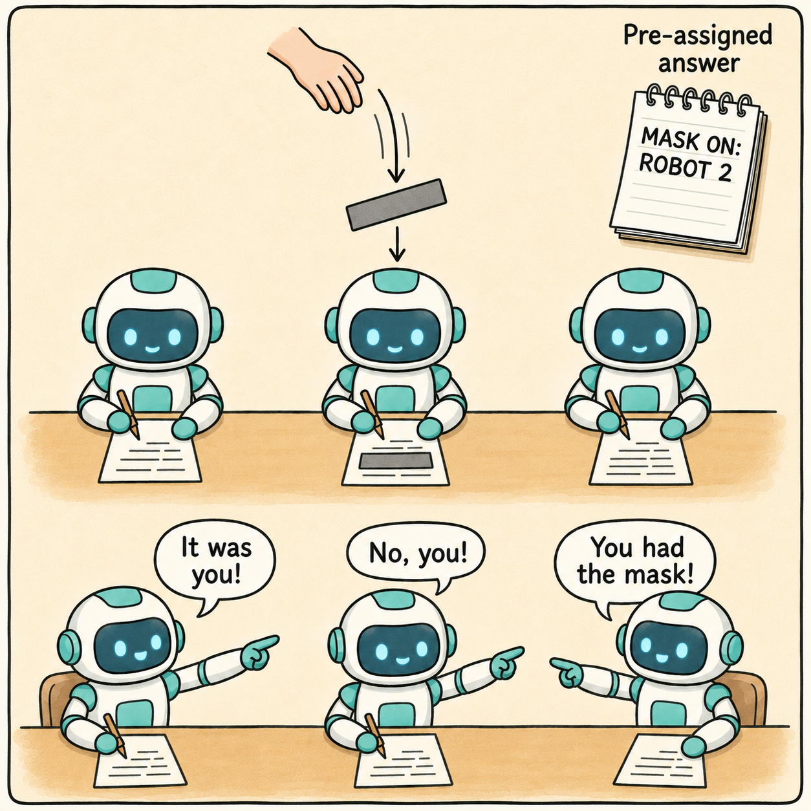
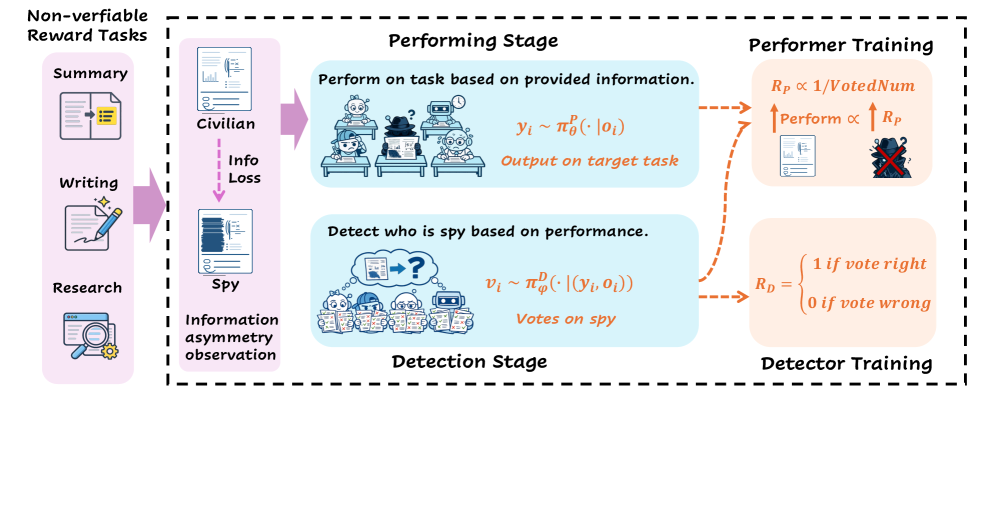
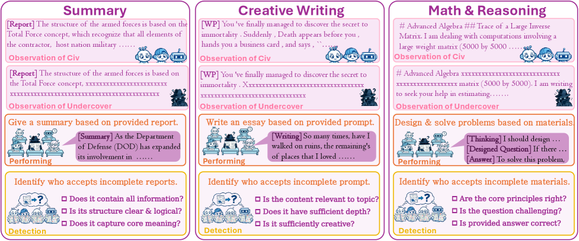
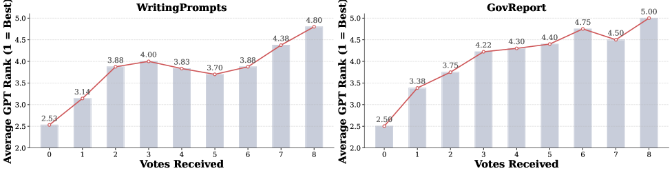

> **论文**：From RLVR to RLSVR: Task Transformation Induces Self-Verifiable Rewards for Open-Ended LLM Self-Improvement
> **作者**：Kun Wan, Huazheng Wang, Jing Shi, Qinsi Wang, Benjamin-eecs
> **arXiv ID**：2607.23802
> **发表时间**：2026-07-23
> **会议**：COLM 2026
> **代码仓库**：https://github.com/wangqinsi1/SpyRL

## 第 1 章 概述

### 1.1 一句话定位

RLSVR（Reinforcement Learning with Self-Verifiable Rewards）通过任务变换（task transformation $\Phi$）将 RLVR 从 math/code 等确定性可验证任务扩展到 summarization、creative writing 等开放任务，并以 SpyRL——一种受"谁是卧底"启发的信息不对称多智能体自博弈环境——作为其首个实例化。

### 论文图表总览

| 编号 | 内容 | 章节 |
|------|------|------|
| Figure 1(a) | RLVR 范式示意图（确定性 verifier） | 第 2 章 |
| Figure 1(b) | SSL 范式示意图（pretext task） | 第 2 章 |
| Figure 1(c) | RLSVR 任务变换范式（latent $z$ 构造可验证奖励） | 第 2 章 |
| Figure 2 | SpyRL 框架总览（performing + detection 两阶段闭环） | 第 3 章 |
| Figure 3 | 三任务实例化（summarization / creative writing / math） | 第 3 章 |
| Figure 4 | 100 局怀疑票数与 GPT-4o 质量排序相关性 | 第 4 章 |
| Figure 5 | 组大小效应（$n=3,5,6,8$） | 第 5 章 |
| Table 1 | Summarization：ROUGE-L / GPT-4o A/B win%（5 bench） | 第 4 章 |
| Table 2 | Creative writing：GPT-4o A/B win%（WP / WB × 5 维） | 第 4 章 |
| Table 3 | Reasoning：7 bench（GSM8K、Math500、AIME24、AIME25、Minerva、MMLU-Pro、GPQA-D） | 第 4 章 |
| Table 4 | 模块消融（Math500：Only Performing / Only Detection / Without spy / SpyRL） | 第 5 章 |
| Table 5 | 人工评估（10 博士生，WP / WB overall） | 第 5 章 |
| Table 6 | RaR 对比 + verifier 成本（$\sim$​\$200$ / $\sim$​\$900$） | 第 5 章 |
| Table 7 | 训练超参（GRPO、LR、batch、KL、组大小等） | 第 6 章 |
| Table 8 | 直接 A/B summarization（RLSVR vs baseline win%） | 第 5 章 |
| Table 9 | 直接 A/B creative writing overall win% | 第 5 章 |
| Table 10 | Joint vs Alternating（Qwen3-4B，5 math bench 平均） | 第 5 章 |
| Table 11 | 跨任务迁移（writing→summ / summ→writing / math→writing） | 第 5 章 |
| Table 12 | 替代 judge Gemini-3.5-Flash（creative writing） | 第 5 章 |
| Table 13 | 替代 judge Gemini-3.5-Flash（summarization） | 第 5 章 |
| Table 14 | GPT-4o-human 一致性（precision / recall） | 第 5 章 |

### 1.2 核心贡献

1. **RLSVR 范式**：将 SSL 的 pretext-task 思想引入 RLVR。通过任务变换 $\Phi$ 构造 proxy environment，latent variable $z$ 由环境自身采样（ground truth by construction），使开放任务获得 self-verifiable rewards，无需人类标注、学得奖励模型或外部 judge。
2. **SpyRL 实例化**：信息不对称自博弈（"谁是卧底"）。$n-1$ 个 civilian（全信息）$+$ 1 个 spy（降级信息 $g(x)$）执行同一目标任务，检测阶段投票找出 spy；spy 身份预定义 $\Rightarrow$ 投票结果完全可验证。Performing 奖励零和，Detection 奖励基于投票正确性。
3. **跨任务广泛验证**：summarization（5 bench）、creative writing（2 bench）、math reasoning（7 bench）三类任务一致提升；基线含 R-Zero / Absolute Zero；评估含 GPT-4o + Gemini-3.5-Flash 双 judge 与 10 博士生人工评估。
4. **开放自改进启示**：论证 verifiability 是可被工程化（task transformation）的属性，而非任务固有属性，为开放任务的自改进 RL 打开通路。

### 1.3 关键结果速览

- **Summarization**：Qwen3-8B GPT-4o A/B win 平均 **75.4%**（5 bench），Qwen3-4B 平均 **73.92%**；ROUGE-L 平均提升 $+4.04$（8B）/ $+4.56$（4B）。
- **Creative writing**：Qwen3-8B A/B win 平均 **77.3%**（WP 76.5% $+$ WB 78.1%）。
- **Math reasoning**：7-bench 平均提升 **$+6.16\%$**（8B）/ **$+8.97\%$**（4B）；其中 Qwen3-4B 在 AIME25 上从 **6.7% $\rightarrow$ 20.0%**（$+13.3\%$）。
- **模块消融**（Math500，Qwen3-4B）：Only Performing 停滞于 72.3，Only Detection 无增益（69.2），Without spy 停滞（71.6），完整 SpyRL 达 **79.5%**。
- **交替 vs 联合训练**（5 math bench 平均，Qwen3-4B）：joint 退化 $42.4 \rightarrow 35.3$，alternating $42.4 \rightarrow 50.8$（$+8.4$ vs base）。
- **人工评估**（WP overall）：vs Qwen3-4B **80.0%**、vs R-Zero **78.5%**、vs AbsoluteZero **74.0%**。

## 第 2 章 研究背景与动机

### 2.1 RLVR 的成功与局限

RLVR（Reinforcement Learning with Verifiable Rewards）通过确定性 verifier 提供二值奖励，驱动了 o1、DeepSeek-R1 等推理模型的能力跃升。其目标可形式化为：

$$\max_\theta \, \mathbb{E}_{x \sim \mathcal{D},\, y \sim \pi_\theta}\left[V(x,y)\right], \quad V \in \{0,1\}$$

其中 verifier $V$ 对输出 $y$ 给出确定性判定。RLVR 的成功高度依赖 $V$ 的存在：math 可对答案数值比对，code 可运行测试，但 summarization、creative writing 等开放任务缺乏确定性 $V$，构成 verifiability bottleneck。

### 2.2 开放任务现有方案的问题

开放任务当前依赖三类替代信号，各有缺陷：

- **RLHF / DPO**：基于人类偏好训练 reward model 或直接优化偏好对，引入偏好偏差与标注成本。
- **LLM-as-Judge**：用强模型充当裁判，存在 judge 能力瓶颈——judge 弱于被评模型时评价失效。
- **Rubric / PRM**：人工设计评分细则或过程奖励，泛化性受限且成本高。

共同问题：评估偏差、judge 能力上限、推理成本。

### 2.3 SSL 的 pretext task 类比

SSL（Self-Supervised Learning）通过构造 pretext task 从无标注数据中自生成监督信号：MLM（masked language modeling）遮盖 token 后预测、对比学习构造正负样本对。监督信号不来自外部标注，而来自数据变换本身。

RLSVR 借用这一思想：把 SSL 的 pretext-task 原理迁移到 RL——通过对开放任务施加变换，使环境交互过程自动产生可验证的奖励信号，即 SSL-for-RLVR。

### 2.4 任务变换 $\Phi$ 的数学定义

任务变换 $\Phi$ 将原始开放任务 $(x, \mathcal{Y})$ 映射为可验证的 proxy environment，分四步：

1. **Latent 注入**：环境采样 latent variable $z$（如 spy 身份 $u$），$z$ 的 ground truth 由构造确定。
2. **条件执行**：智能体在 $z$ 的条件下执行目标任务，产生观测 $o_i$ 与输出 $y_i$。
3. **可验证交互**：交互结构（如投票）产生可被 $z$ 判定的结果。
4. **规则奖励**：环境内部规则将交互结果映射为奖励 $r$，无需外部 judge。

*图1：RLSVR 通过环境自采样的 latent $z$ 构造可验证奖励，将 SSL 的 pretext-task 思想实例化为 SSL-for-RLVR。*

## 第 3 章 SpyRL：信息不对称自博弈

### 3.1 总体框架

SpyRL 是 RLSVR 的实例化，受"谁是卧底"游戏启发，形成一个 performing 与 detection 两阶段闭环：

- **Performing 阶段**：$n$ 个智能体接收非对称信息，执行同一目标任务（summarization / writing / math），各自生成输出。
- **Detection 阶段**：智能体读取所有输出后投票，识别被指定的 spy；spy 身份 $u$ 预先采样，投票结果完全可验证。

两阶段交替优化：performing 提升输出质量与信息隐藏能力，detection 提升质量辨识能力，形成对抗式自博弈。

*图2：SpyRL 两阶段闭环——performing 阶段非对称信息分配并执行任务，detection 阶段投票找出 spy，奖励驱动双方交替优化。*

### 3.2 表演阶段：非对称信息分配

环境从 $n$ 个智能体中均匀采样 spy 身份 $u \sim \text{Unif}(\{1,\dots,n\})$，对其余 $n-1$ 个 civilian 分配完整输入 $x$，对 spy 施加信息降级算子 $g$：

$$o_i = \begin{cases} x & i \neq u \\ g(x) & i = u \end{cases}$$

各智能体在自身观测下生成输出：

$$y_i \sim \pi^P_\theta(\cdot \mid o_i, \tau)$$

其中 $\tau$ 为任务指令。降级算子 $g$ 按任务定制：summarization 与 creative writing 使用 **20% 连续 span mask**（GovReport、WritingPrompts），math reasoning 使用 **40% span mask**（Nemotron-CC-Math-v1）——遮盖比例越高，spy 信息劣势越大。

*图3：SpyRL 在 summarization、creative writing、math reasoning 三类任务上的实例化，区别在于降级算子 $g$ 的 span mask 比例（20% / 40%）。*

### 3.3 检测阶段：可验证奖励

Detection 阶段中，每个智能体读取全部输出集合 $Y=\{y_1,\dots,y_n\}$ 与自身观测 $o_i$，投票指出 spy：

$$v_i \sim \pi^D_\phi(\cdot \mid s_i = (o_i, Y)), \quad v_i \in \{1,\dots,n\}$$

投票奖励由是否命中预定义 spy 身份 $u$ 决定：

$$r_i^D = \mathbf{1}[v_i = u]$$

采用 GRPO 式组相对优势（无 critic），在同一组的 $n$ 个投票上标准化：

$$\mu_D = \frac{1}{n}\sum_i r_i^D, \quad \sigma_D = \sqrt{\frac{1}{n}\sum_i (r_i^D - \mu_D)^2}, \quad A_i^D = \frac{r_i^D - \mu_D}{\sigma_D + \epsilon}$$

spy 输出质量越差（信息降级越严重），越易被识别，因此 detection 的投票正确率与 performing 的输出质量强相关——这使投票结果成为输出质量的隐式可验证代理信号。

### 3.4 两阶段耦合优化

#### 零和 Performing 奖励

Performing 奖励按角色分配，构成零和结构。设 spy 得票数 $m_u$、civilian 平均得票数 $\bar{m}_c$、平民数 $n_c=n-1$、竞争强度 $\beta$、平民组内一致性惩罚 $\lambda$：

$$r_u^P = -\beta(m_u - \bar{m}_c)$$

$$r_{c_j}^P = \frac{\beta}{n_c}(m_u - \bar{m}_c) - \lambda(m_{c_j} - \bar{m}_c), \quad j=1,\dots,n_c$$

该奖励具有两条性质：

- **零和约束**：$r_u^P + \sum_j r_{c_j}^P = 0$，Performing 阶段总奖励恒为零，避免 reward hacking 中的整体膨胀。
- **组内竞争**：spy 被识破越多（$m_u$ 越大）其奖励越负；平民之间通过 $\lambda$ 项惩罚得票偏离，迫使 civilian 输出高质量且彼此区分。

#### RAE 角色优势估计

由于 spy 与 civilian 的奖励分布差异大，直接使用整组基线会引入偏差。RAE（Role-Advantage Estimation）按角色维护 EMA baseline（衰减系数 $\alpha$，初值 0）：

$$b_u \leftarrow \alpha\, b_u + (1-\alpha)\, r_u^P$$

$$b_c \leftarrow \alpha\, b_c + (1-\alpha)\, \frac{1}{n_c}\sum_j r_{c_j}^P$$

角色条件优势：

$$A_u^P = r_u^P - b_u, \quad A_{c_j}^P = r_{c_j}^P - b_c$$

#### GRPO Clipped 目标

Performing 与 Detection 各自采用 PPO/GRPO 式 clipped 目标加 KL 正则：

$$\mathcal{L}_P(\theta) = -\mathbb{E}\left[\frac{1}{n}\sum_k \sum_t \min\left(\rho^P_{k,t}\, A^P_k,\, \text{clip}(\rho^P_{k,t},\, 1-\varepsilon,\, 1+\varepsilon)\, A^P_k\right)\right] + \beta_P\, \text{KL}(\pi_\theta^P \| \pi_{\text{ref}}^P)$$

$$\mathcal{L}_D(\phi) = -\mathbb{E}\left[\frac{1}{n}\sum_i \min\left(\rho^D_i\, A^D_i,\, \text{clip}(\rho^D_i,\, 1-\varepsilon,\, 1+\varepsilon)\, A^D_i\right)\right] + \beta_D\, \text{KL}(\pi_\phi^D \| \pi_{\text{ref}}^D)$$

#### 交替优化与 Hysteresis

两阶段采用交替更新（alternating optimization）而非联合训练（joint training），以 hysteresis 阈值控制切换。设 $\bar{\mathrm{acc}}_t$ 为检测平均准确率、$\bar{\mathrm{na}}_t$ 为不确定性（$\boxed{\text{N/A}}$）率（均经 EMA 平滑，系数 $\rho$）：

- **D $\rightarrow$ P**：当 detection 平均准确率 $\bar{\mathrm{acc}}_t \geq \tau_{\mathrm{acc}}^{\uparrow}$ 且不确定性率 $\bar{\mathrm{na}}_t \leq \tau_{\mathrm{na}}^{\downarrow}$ 时，说明 detection 已足够强，切回 performing 提升输出。
- **P $\rightarrow$ D**：当错误率 $1-\bar{\mathrm{acc}}_t \geq \tau_{\mathrm{err}}^{\uparrow}$ 或不确定性率 $\bar{\mathrm{na}}_t \geq \tau_{\mathrm{na}}^{\uparrow}$ 时，说明 performing 已进化，切回 detection 追赶。
- **最小驻留**：每阶段至少停留 $K_{\min}$ 步，避免频繁抖动。

实证表明交替优化显著优于联合训练：joint 训练下 5 math bench 平均退化 $42.4 \rightarrow 35.3$，而 alternating 达 $42.4 \rightarrow 50.8$——联合训练中两阶段 credit assignment 互相干扰，交替优化解耦后双方各自收敛。
## 第 4 章 实验设置与主结果

### 4.1 实验设置

**任务与环境**。SpyRL 在三个领域构建信息不对称游戏环境：文本摘要（GovReport，civilians 获得完整输入，spy 获得 20% 连续 span 掩码后的输入）、创意写作（WritingPrompts，20% 掩码）、数学推理（Nemotron-CC-Math-v1，40% 掩码）。所有玩家基于各自的观察执行同一目标任务并产出输出；随后进入检测阶段，玩家根据多维度异常评估准则投票找出间谍。

**训练配置**。使用 GRPO 算法（verl 框架实现），基础模型为 Qwen3-4B-Instruct-2507 / Qwen3-8B-Instruct-2507。批大小 1024（128 prompts × 8 rollouts），训练 100 epochs，最大输出长度 2048 tokens，默认组大小 n=5（见 5.2 节消融）。表演与检测阶段严格交替更新（见 3.4 节）。完整超参数见论文 Appendix C.3（学习率 $1\times10^{-6}$，KL 惩罚系数 0.001，低方差 KL，熵系数 0；vLLM 引擎 TP=8，最大 prompt 长度 12288，最大响应长度 4096，总模型长度 16384；单节点 8 卡，FSDP 参考模型 offload 到 CPU）。

**基线与评测**。对比 SOTA proposer-solver 自博弈框架：R-Zero 与 Absolute Zero。自动指标（ROUGE-L、格式合规）+ GPT-4o 成对 A/B 评测（trained vs base model），采用交换顺序聚合（swapped-order）以缓解位置偏差：模型 A 仅在两个顺序中都胜出（或一胜一平）时才计为 Win。另用 Gemini-3.5-Flash 作为替代 judge 验证稳健性（附录 D.4）。

### 4.2 文本摘要主结果

Table 1 报告五个摘要基准（GovReport、Multi_News、QmSum、VcSum、SamSum）上的 ROUGE-L 与 GPT-4o A/B 胜率。SpyRL 在 Qwen3-4B 与 Qwen3-8B 上均取得最优：

| 方法 | GovReport (ROUGE / A/B) | Multi_News | QmSum | VcSum | SamSum |
|------|:---:|:---:|:---:|:---:|:---:|
| Qwen3-4B | 30.2 / 51.2% | 23.1 / 52.1% | 21.3 / 52.4% | 15.1 / 51.8% | 43.2 / 50.9% |
| + R-Zero | 32.1 / 56.8% | 22.4 / 48.2% | 21.5 / 55.2% | 15.6 / 51.2% | 42.8 / 48.1% |
| + Absolute Zero | 33.2 / 58.8% | 25.2 / 61.2% | 22.7 / 56.4% | 18.3 / 62.8% | 46.1 / 68.5% |
| + SpyRL | **36.7 / 74.6%** | **26.4 / 80.2%** | **25.3 / 68.4%** | **19.1 / 70.2%** | **48.2 / 76.2%** |
| Qwen3-8B | 29.0 / 50.2% | 23.1 / 51.4% | 19.2 / 52.8% | 14.9 / 53.1% | 44.3 / 51.6% |
| + R-Zero | 29.4 / 51.3% | 22.2 / 50.2% | 18.8 / 47.9% | 14.9 / 55.3% | 44.8 / 52.9% |
| + Absolute Zero | 32.5 / 62.5% | 23.2 / 50.3% | 19.1 / 53.2% | 15.8 / 58.2% | 46.2 / 70.6% |
| + SpyRL | **34.1 / 78.2%** | **25.8 / 68.5%** | **23.2 / 78.2%** | **19.1 / 72.5%** | **48.5 / 79.5%** |

平均而言，SpyRL 将 Qwen3-4B 与 Qwen3-8B 的五个基准平均 ROUGE 分别提升 4.56 与 4.04 点，A/B 胜率分别达到 73.92% 与 75.38%。R-Zero 与 Absolute Zero 在部分基准（如 Multi_News 4B 的 48.2%）甚至低于基线，说明依赖任务可验证性的 proposer-solver 方法在开放生成任务上信号失效。

### 4.3 创意写作主结果

Table 2 报告 WritingPrompts 与 WritingBench 上五个维度（Novelty、Emotion、Coherence、Consistency、Overall）的 GPT-4o A/B 胜率。SpyRL 在所有维度显著领先：

| 方法 | WritingPrompts (Nov/Emo/ Coh/Con/ Ovr) | WritingBench (Nov/Emo/ Coh/Con/ Ovr) |
|------|:---:|:---:|
| Qwen3-4B | 51.2/50.0/52.3/51.0/51.2 | 50.8/51.5/50.9/52.1/51.0 |
| + R-Zero | 48.3/44.3/51.2/48.8/48.8 | 46.5/46.5/43.2/46.2/46.5 |
| + Absolute Zero | 54.5/52.2/50.2/52.8/54.0 | 55.2/54.8/55.7/55.4/55.2 |
| + SpyRL | **84.3/76.8/72.3/70.1/81.3** | **76.2/75.7/68.5/68.0/75.1** |
| Qwen3-8B | 52.2/51.8/50.6/51.0/51.5 | 50.4/51.1/51.3/52.4/51.8 |
| + R-Zero | 52.3/54.2/51.2/49.5/52.2 | 52.3/52.1/52.5/53.4/52.0 |
| + Absolute Zero | 55.3/52.8/57.4/56.8/56.4 | 56.5/55.8/58.2/57.9/58.1 |
| + SpyRL | **77.3/76.2/74.2/75.0/76.5** | **78.1/77.4/71.0/71.2/78.1** |

Qwen3-8B 的 Overall 平均胜率为 77.3%（WritingPrompts 76.5% + WritingBench 78.1% 平均）。R-Zero 在写作任务上甚至低于基线的 50% 水平（4B：48.8%/46.5%），再次印证可验证信号缺失时 proposer-solver 方法退化。

### 4.4 数学推理主结果

Table 3 报告七个推理基准（GSM8K、Math500、AIME24、AIME25、Minerva、MMLU-Pro、GPQA-D）的准确率。SpyRL 在全部 14 个「模型×基准」组合（Qwen3-4B/8B × 7 基准）中均取得最优：

| 方法 | GSM8K | Math500 | AIME24 | AIME25 | Minerva | MMLU-Pro | GPQA-D |
|------|:---:|:---:|:---:|:---:|:---:|:---:|:---:|
| Qwen3-4B | 84.5 | 68.2 | 10.3 | 6.7 | 42.3 | 51.6 | 26.3 |
| + R-Zero | 88.7 | 72.8 | 10.3 | 6.7 | 47.1 | 52.8 | 27.8 |
| + Absolute Zero | 89.3 | 76.2 | 12.2 | 13.4 | 41.9 | 52.6 | 35.3 |
| + SpyRL | **93.4** | **79.5** | **13.3** | **20.0** | **47.8** | **57.4** | **41.3** |
| Qwen3-8B | 91.8 | 74.2 | 15.3 | 12.1 | 49.3 | 58.1 | 33.3 |
| + R-Zero | 92.1 | 78.4 | 15.3 | 14.2 | 52.5 | 61.7 | 34.3 |
| + Absolute Zero | 92.0 | 76.6 | 18.4 | 18.2 | 52.9 | 62.5 | 36.8 |
| + SpyRL | **93.5** | **81.2** | **20.0** | **23.3** | **56.3** | **63.1** | **39.8** |

SpyRL 在 Qwen3-4B/8B 上七个基准平均提升 8.97% / 6.16%，AIME25 上 Qwen3-4B 从 6.7% 提升至 20.0%。即便在已有可验证奖励的数学任务上，SpyRL 仍优于 R-Zero 与 Absolute Zero——说明其优势不仅来自任务可验证性，更来自组内相对竞争提供的更细粒度、更稳定的学习信号。

### 4.5 怀疑票数与输出质量的相关性（Figure 4）

论文在 100 局游戏上验证奖励对齐性：统计每位玩家在表演阶段获得的怀疑票数，同时让 GPT-4o 对五名玩家的输出质量排序（1=最好，5=最差）。结果表明票数与排名正相关——低质量输出吸引更多怀疑票、获得更小奖励，高质量输出票数少、奖励大。这证明 SpyRL 的规则化奖励与实际任务质量对齐，无需外部 verifier。

*图4：左为 WritingPrompts、右为 GovReport 上怀疑票数与输出质量排名的关系——票数越多输出质量越低，验证了 SpyRL 奖励信号与任务质量的一致性。*

## 第 5 章 消融实验与分析

### 5.1 模块消融（Table 4）

在 Math500 上比较四种训练设置的准确率随 epoch 的变化（Epoch 0 → 100）：

| 设置 | Epoch 0 | Epoch 20 | Epoch 40 | Epoch 60 | Epoch 80 | Epoch 100 |
|------|:---:|:---:|:---:|:---:|:---:|:---:|
| Only Performing（冻结检测） | 68.2 | 70.1 | 71.8 | 72.2 | 71.9 | 72.3 |
| Only Detection（冻结表演） | 68.2 | 69.0 | 69.4 | 69.0 | 69.2 | 69.2 |
| Without spy（无信息不对称） | 68.2 | 69.6 | 71.1 | 69.8 | 70.5 | 71.6 |
| SpyRL（完整两阶段耦合） | 68.2 | 73.3 | 78.2 | 78.8 | 79.3 | **79.5** |

三个结论：(1) 只训练表演阶段初期有提升但快速停滞（72.3），因为冻结的检测器无法区分日益精细的输出，奖励失真；(2) 只训练检测阶段几乎无目标任务提升（69.2），因为它不直接优化生成能力；(3) 去掉 spy 信息不对称同样停滞（71.6）——没有 spy 提供的对抗信号，检测器无法持续共演化，无法向表演阶段供给准确奖励。完整 SpyRL 达到 79.5%，验证两阶段耦合与信息不对称缺一不可。

### 5.2 组大小消融（Figure 5）

玩家数 n 从 3 增至 8：3→5 带来最大边际增益（五个推理基准平均增益从 5.5 升至 9.3），继续增至 6、8 出现边际收益递减。n=5 已提供足够复杂的对抗环境，论文默认采用 n=5。

### 5.3 人工评估（Table 5）

10 名博士生对 400 个随机采样提示（WritingPrompts/WritingBench 各 200 个）进行盲评，对四个匿名输出（Qwen3-4B、R-Zero、Absolute Zero、SpyRL）五个维度排序：

| SpyRL vs | WritingPrompts Overall | WritingBench Overall |
|------|:---:|:---:|
| Qwen3-4B | 80.0% | 85.0% |
| R-Zero | 78.5% | 80.5% |
| Absolute Zero | 74.0% | 72.0% |

SpyRL 在所有维度领先，尤其 Novelty 与 Emotion，确认其提升被人类评估者认可。

### 5.4 与 rubric-as-reward（RaR）基线对比（Table 6）

以 novelty/emotion/coherence/consistency 作为二元 checklist 生成奖励，用相同 GRPO 框架训练 Qwen3.5-27B-RaR 与 GPT-4o-RaR（各 50 iterations）：

| SpyRL vs | WritingPrompts Overall | WritingBench Overall | 外部 verifier 成本 |
|------|:---:|:---:|:---:|
| Qwen3.5-27B-RaR | 59.3% | 56.2% | ~$200 |
| GPT-4o-RaR | 48.9% | 48.2% | ~$900 |

SpyRL 全面胜过 Qwen3.5-27B-RaR，与 GPT-4o-RaR 竞争（Novelty/Emotion 更优），且**零外部 verifier 成本**——Qwen3.5-27B-RaR 和 GPT-4o-RaR 分别产生约 $200 与 $900 的额外验证开销。

### 5.5 与基线的直接 A/B 对比（Table 8-9，附录 D.1）

为排除「以未训练 base 为共同锚点」的质疑，论文直接对比 SpyRL 与 R-Zero/Absolute Zero：

- 摘要（Table 8）：4B 对 R-Zero 平均 76.5%、对 Absolute Zero 70.4%；8B 对 R-Zero 76.4%、对 Absolute Zero 72.0%。20 组对比中 19 组超过 65%（最低 64.8%）。
- 写作（Table 9）：4B 对 R-Zero WP/WB Overall 78.9%/75.0%；8B 77.5%/77.0%。所有细粒度维度均被偏好（65.7%-86.2%）。

### 5.6 联合 vs 交替优化（Table 10，附录 D.2）

Joint training（每 epoch 同时更新两阶段）导致退化：GSM8K 从 84.5 降至 76.8、Math500 从 68.2 降至 53.1、Minerva 从 42.3 降至 33.1，五基准平均 42.4→35.3。交替训练则全面提升：GSM8K 84.5→93.4、Math500 68.2→79.5、AIME25 6.7→20.0，平均 50.8（比 base +8.4、比 joint +15.5）。原因：joint 训练时两阶段互相依赖造成 credit assignment 不准确与非平稳优化；交替更新分解耦合问题，先强化检测器再优化表演者，提供可靠中间信号。

### 5.7 跨任务迁移与 judge 稳健性（附录 D.3-D.5）

- **跨任务迁移**（Table 11）：创意写作训练的模型在摘要基准上全部正向迁移（GovReport 56.1%、Multi-News 55.4%、QMSum 52.7%、VCSum 51.8%、SAMSum 52.9%）；摘要训练适度提升写作（coherence 64.2% / consistency 63.1% 增益明显）。数学训练对写作任务负迁移（overall 40.9%）。迁移方向与任务能力重叠度一致。
- **替代 judge**（Table 12-13）：Gemini-3.5-Flash 复评下 4B 摘要平均胜率 79.8%、写作 WP/WB Overall 81.8%/81.4%；8B 摘要 76.1%、写作 77.8%/77.0%——与 GPT-4o 结论一致，排除 evaluator 特化偏好。
- **GPT-4o-人类一致性**（Table 14）：以人类标注为 ground truth，GPT-4o 判定 RLSVR 胜出的 precision 85.7%-91.0%（Overall 91.0%）、recall 79.4%-93.8%（Overall 93.8%），支持其作为自动评估器的可靠性。

## 第 6 章 代码实现与工程细节

### 6.1 官方代码仓库

官方实现：https://github.com/wangqinsi1/SpyRL（MIT 许可，基于 verl 构建）。仓库结构：`spyrl/`（核心游戏环境与两阶段优化实现）、`verl/`（上游 RL 框架集成）、`examples/`（启动示例）、`docker/`（容器化）、`docs/`、`tests/`、`scripts/`。

### 6.2 训练系统配置（Table 7）

| 配置项 | 值 |
|------|------|
| RL 算法 | GRPO |
| 学习率 | $1\times10^{-6}$ |
| Prompts per Batch | 128 |
| GRPO Rollouts per Prompt | 8 |
| 有效批大小 | 1024 |
| PPO Mini-batch 大小 | 128 |
| 每卡 Micro-batch | 2 |
| KL 惩罚系数 (β) | 0.001（低方差 KL） |
| 训练迭代数 | 100 |
| 最大 prompt 长度 | 12,288 tokens |
| 最大响应长度 | 4,096 tokens |
| 最大模型长度 | 16,384 tokens |
| 玩家数 | 5 |
| 回合数 | 1 |
| 硬件 | 1 节点 × 8 GPUs |
| 生成引擎 | vLLM (TP=8, GPU 显存利用率 0.45) |
| 梯度检查点 | 开启 |
| FSDP 参考模型 offload | 开启（param_offload=True，actor 与 optimizer 留在 GPU） |

### 6.3 关键实现要点

**RAE（Role-Advantage Estimation）**：spy 与 civilian 的奖励分布因信息不对称而系统性不同。维护两个 EMA baseline $b_u$、$b_c$（Eq 9），角色校准优势 $A_u^P = r_u^P - b_u$、$A_{c_j}^P = r_{c_j}^P - b_c$（Eq 10），防止优化偏向某一角色。

**交替优化门控**：监测检测准确率 $\bar{\mathrm{acc}}_t$ 与不确定性率 $\bar{\mathrm{na}}_t$（EMA 平滑，系数 $\rho$），hysteresis 阈值控制切换（Eq 11-12）：检测→表演当 $\bar{\mathrm{acc}}_t \geq \tau^\uparrow_{\mathrm{acc}} \land \bar{\mathrm{na}}_t \leq \tau^\downarrow_{\mathrm{na}}$；表演→检测当 $1-\bar{\mathrm{acc}}_t \geq \tau^\uparrow_{\mathrm{err}} \lor \bar{\mathrm{na}}_t \geq \tau^\uparrow_{\mathrm{na}}$。每阶段最小驻留 $K_{\min}$ 次更新防抖。

**Prompt 工程**（Appendix C.5）：表演阶段 prompt 注入角色变量（{role_info}/{role_instruction}）、要求战略 CoT、显式写作质量标准（subtext、turning point、fresh imagery）、强制 "Answer:" 前缀与格式约束；检测阶段 prompt 提供 5 维异常评估 rubric（Off-theme、Shallow、Consistency 等）、允许 $\boxed{\text{N/A}}$ 表达不确定、限制 ≤2000 tokens、最终决策用 $\boxed{}$ 包裹保证确定性解析。

## 第 7 章 局限性与延伸阅读

### 7.1 局限性

1. **奖励对齐依赖检测质量**：零和奖励与投票信号的质量受检测器能力上限约束。虽然组内相对聚合缓解单点误判，但若所有玩家输出质量普遍接近，检测信号区分度下降（对应 5.1 节 Only Performing 停滞现象）。
2. **信息降级算子设计**：$g(\cdot)$（span mask、关键信息压缩）需针对任务人工设计以保证「只隐藏关键信息、保留风格长度主题一致性」，防检测器利用表面捷径。当前实例化覆盖三类任务，更复杂开放任务（如长文档推理、多模态）的降级算子设计仍是开放问题。
3. **组大小与算力权衡**：n=5 是精度/成本折中；更大组（8 玩家）边际收益递减但每 epoch 采样成本线性上升（1024 有效批大小下 rollouts 成本随之增加）。
4. **评估依赖 LLM judge**：主结果使用 GPT-4o A/B（虽有 swapped-order 缓解与 Gemini-3.5-Flash 交叉验证、人工一致性 91.0% precision），开放任务最终质量评估仍依赖近似人类偏好的代理。
5. **任务变换的通用性边界**：RLSVR 要求能构造「输出质量与身份识别成功强相关」的 proxy 环境；对于输出质量无法通过信息不对称暴露的任务（如纯事实性问答），变换设计可能失效。

### 7.2 延伸阅读

- **Self-play for LLMs**：R-Zero（Huang et al., 2025）、Absolute Zero（Zhao et al., 2025）、SPIRAL（Liu et al., 2025a，零和博弈激励推理）、SPICE（Liu et al., 2025b）、SPAG（Cheng et al., 2024）、SPELL（Yang et al., 2025，长上下文自博弈）、Vision-Zero（Wang et al., 2025，「谁是卧底」游戏结构扩展到视觉语言模型）。
- **RL beyond verifiable domains**：RLHF/RLAIF/DPO 系列、LLM-as-a-Judge（Zheng et al., 2024）、Rubrics-as-Rewards（Gunjal et al., 2025）、PRM（Lightman et al., 2023）、Writing-Zero（Jia et al., 2025，生成式奖励模型桥接写作任务）、AlphaProof（Hubert et al., 2025）。
- **可扩展 RL 训练系统**：DAPO（Yu et al., 2025，开源 LLM RL 系统）、verl（ByteDance Seed）。
- **自博弈退化分析**：Chae et al. (2025)、Shafayat et al. (2025) 关于长时间自博弈退化与自我训练风险的研究。
