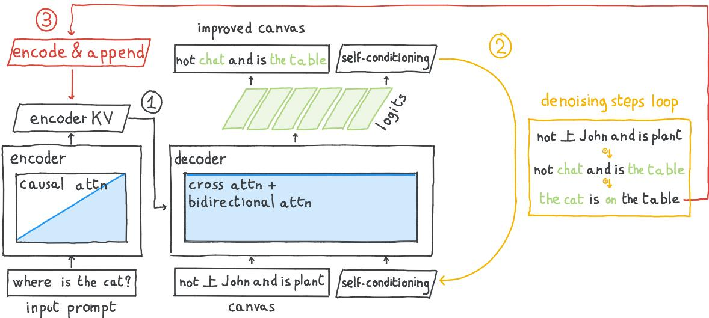
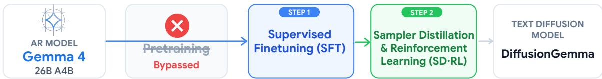
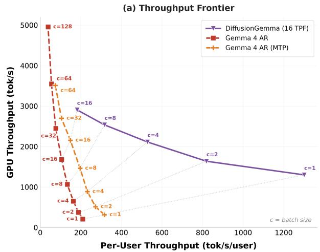
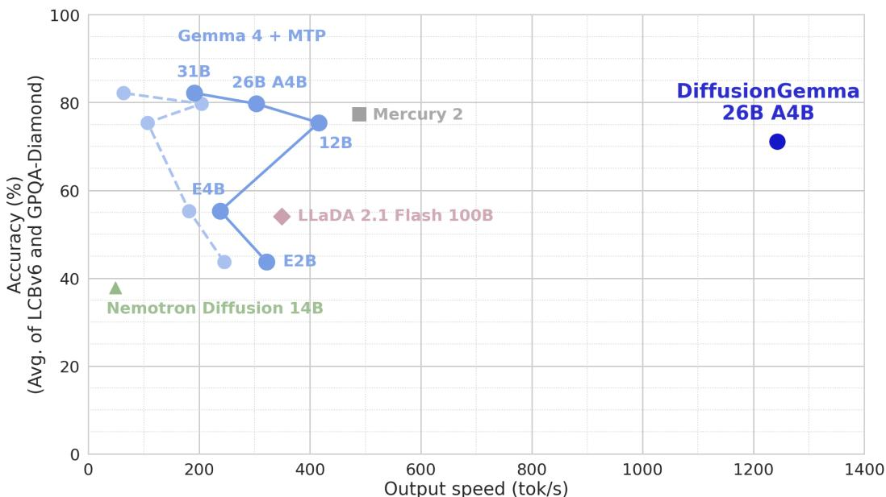

# DiffusionGemma 技术报告深度精读

> **论文**：DiffusionGemma Technical Report
> **作者**：DiffusionGemma Team, Google DeepMind
> **arXiv ID**：2608.00146
> **发表时间**：2026-07-31
> **许可协议**：Apache 2.0
> **代码仓库**：https://huggingface.co/google/diffusiongemma-26B-A4B-it

---

## 第 1 章 概述

### 1.1 一句话定位

DiffusionGemma 是首个同时具备**高智能、极速生成、开放权重**的文本扩散语言模型——通过对 Gemma 4 26B（A4B）MoE 模型进行离散扩散微调，在单卡 H100 上实现约 1,500 tokens/s 的输出速度（7.1 倍于 AR 基线），同时保留 AR 解码、思维链、多模态和长上下文能力。

### 论文图表总览

| 编号 | 内容 | 章节 |
|------|------|------|
| **Figure 1** | 质量-速度 Pareto 图（DG vs Gemma 4 AR vs 其他扩散模型） | 第 7 章 |
| **Figure 2** | 两阶段训练管线（AR 权重 → SFT → SD·RL） | 第 5 章 |
| **Figure 4** | 生成管线（上下文编码 → 去噪循环 → 编码追加） | 第 4 章 |
| **Figure 12** | 吞吐 vs 并发（~32 并发内 DG 占优） | 第 6 章 |
| **Table 1** | 模型参数（25.2B 总 / 3.85B 激活） | 第 4 章 |
| **Table 2** | 采样超参（canvas 256、最大 48 步、平均 ~12 步） | 第 4 章 |
| **Table 3** | 主结果（DG TD/AR/AR(MTP) vs LLaDA/Nemotron/Mercury 2） | 第 7 章 |
| **Table 4** | 效率指标（TPF/TPS/有效去噪步/总 Forwards/E2E 时间） | 第 7 章 |
| **Table 5–6** | 下游微调（Sudoku 0%→84.4%、PubMedQA BLEU 10.76→20.67） | 第 8 章 |

### 1.2 核心贡献

1. **首个"高智能 + 极速 + 开放"三位一体的文本扩散模型。** 从公开的 Gemma 4 26B A4B（MoE，3.85B 激活 / 25.2B 总参数）AR 权重微调为离散扩散模型，以 Apache 2.0 许可发布，填补了 Gemini Diffusion、Mercury 等闭源系统留下的开放空白。

2. **计算高效的两阶段训练管线（< 10% AR 训练 token 预算）。** Stage 1 用监督微调（SFT）教会双向去噪（256-token canvas）；Stage 2 将强化学习与采样器蒸馏（SD·RL）联合在线优化，同时提升生成质量与压缩去噪步数——GPQA-Diamond + LiveCodeBench-v6 均值提升 +10 分，TPF 从 5 提升到约 20（4 倍）。

3. **建立速度-智能 Pareto 新前沿。** 全评测套件平均约 20 tokens/forward（TPF 19.74），单卡 H100 FP8 batch 1 下约 1,479 TPS；相对 Gemma 4 AR（204 TPS）加速 **7.1 倍**，相对 AR + 多 token 预测（303 TPS）加速 **4.8 倍**。总 forward passes 不到 AR 基线的 5%。

4. **双模式能力与开放生态。** 扩散微调后仍可回载权重执行 AR 生成（性能仅轻微下降），保留 thinking mode、多模态输入和长上下文支持；同步开源 Hackable Diffusion 微调工具包（LoRA 配方，2× A100 80GB 即可运行），为社区提供从研究到部署的完整链路。

### 1.3 关键结果速览

| 指标 | 数值 | 来源 |
|------|------|------|
| 输出速度 | 1,479 TPS（单卡 H100 FP8, batch 1，7 基准平均） | Table 3 |
| Tokens Per Forward | 19.74 TPF | Table 3 |
| vs Gemma 4 AR | 7.1× 更快（正文口径 1,456 vs 204 TPS） | Sec 6 |
| vs AR + MTP | 4.8× 更快（正文口径 1,456 vs 303 TPS） | Sec 6 |
| 训练成本 | < 10% AR 模型总训练 token 预算 | 摘要 |
| 总 forward passes | < AR 基线 5% | Sec 5 |
| 平均有效去噪步 | ~12 步（最大 48 步） | Table 2 / Table 4 |
| SD·RL 质量提升 | +10 分（GPQA-D + LCB-v6 均值） | Sec 5 |

Table 3 代表性基准分数（DiffusionGemma TD 模式）：HumanEval **94.5%**、GSM8K **96.3%**、IFEval **97.4%**、AIME 2026 **69.1%**、GPQA Diamond **73.2%**、MMLU-Pro **77.6%**。TD 模式以部分性能换取约 5 倍吞吐——在质量上与闭源 Mercury 2 High 高度竞争（AIME 2026 等个别基准仍有差距）的前提下快约 2.5 倍（1,479 vs 600 TPS）。

---

## 第 2 章 研究背景与动机

### 2.1 自回归模型的 memory-bound 瓶颈

主流大语言模型采用自回归（AR）解码：每次前向传播只生成 1 个 token，下一次生成必须等待上一步完成。在低 batch（单用户交互）场景下，推理性能受**内存带宽**而非计算量限制——GPU 每次需要将全部模型权重从 HBM 读入计算单元，但只产出 1 个 token，导致算力利用率极低。增大 batch 可摊薄权重加载成本，但会牺牲每用户延迟，无法同时满足"高吞吐 + 低延迟"。

### 2.2 推测解码的局限

推测解码（speculative decoding）通过用小模型草拟、大模型验证来突破逐 token 瓶颈，但接受率受限于草稿质量，实际加速通常仅 **3–6 TPF**。Gemma 4 AR + MTP（多 token 预测）也只达到 1.40 TPF / 303 TPS，远未充分利用并行计算潜力。

### 2.3 文本扩散：一次预测整块 token

离散文本扩散模型从根本上改变了生成范式：不再逐 token 串行解码，而是**一次性初始化一整块（canvas）噪声 token（256 个），通过迭代去噪并行精炼全部位置**。每个去噪步处理 256 个 token 仅比处理单个 AR token 慢约 3.2 倍（Sec 6），却一次性产出整个 block，理论 TPF 上限达 256 / 步数。

### 2.4 现状三难与 DiffusionGemma 的定位

文本扩散领域此前面临"三难"困境：

- **闭源高速但不可复现**：Gemini Diffusion、Mercury 2 等闭源系统展示了高速度，但模型权重、训练方法、推理细节均未公开。
- **开源但能力不足**：开源扩散模型与前沿 AR 模型仍有明显差距——Nemotron Diffusion 的 AIME 2026 仅 40.0 分（DG TD 69.1、Gemma 4 AR 84.2），LLaDA 2.1 Flash 的 Codeforces ELO 仅 718（vs DG 1429）；不过 LLaDA 的 AIME 2026 达 80.0，反超 DG TD（69.1）。
- **延迟收益不足**：Nemotron Diff 等模型仅 49 TPS / 1.79 TPF，扩散带来的并行收益被低效率的去噪过程抵消。

DiffusionGemma 从前沿 AR 模型（Gemma 4 26B A4B）出发进行扩散微调，首次同时达成**高智能**（继承 Gemma 4 能力）、**极速**（~1,500 TPS）、**开放**（Apache 2.0 权重 + 参考实现 + 微调工具包），填补了这一空白。

---

## 第 3 章 离散扩散理论基础

### 3.1 连续时间马尔可夫链（CTMC）框架

DiffusionGemma 的理论基础是离散扩散的**连续时间马尔可夫链（CTMC）**公式化（Campbell 2022/2024; Gat 2024）。扩散过程由两条概率路径定义：**前向过程**（逐步加噪）和**反向过程**（逐步去噪），均在离散词表 $\mathcal{V}$（大小 $V = 262\text{k}$）和时间 $t \in [0, 1]$ 上运行。

#### 前向概率路径（Eq.1）

前向过程将干净序列 $\mathbf{x}_0$ 逐步腐蚀为噪声序列 $\mathbf{x}_t$。每个位置独立地以概率 $\kappa_t$ 保留原始 token，以概率 $1 - \kappa_t$ 被均匀随机噪声替换：

$$
q(\mathbf{x}_t \mid \mathbf{x}_0) = \prod_{i=1}^{L} \left[ \kappa_t \, \delta\!\left(x_t^{(i)},\, x_0^{(i)}\right) + \frac{1 - \kappa_t}{V} \right]
$$

其中 $\kappa_t$ 是**噪声调度**（noise schedule）：$t = 0$ 时 $\kappa_0 = 1$（无噪声，纯净数据），$t = 1$ 时 $\kappa_1 = 0$（完全均匀噪声）。$\delta(\cdot)$ 为 Kronecker delta，指示 token 是否与原始一致。关键特性：每个噪声位置都是词表中的真实 token（而非占位符），携带"错误的但合法的"语义信息。

#### 反向去噪步（Eq.2）

反向过程通过模型预测的 $p_\theta(\mathbf{X}_0 \mid \mathbf{x}_t)$（给定当前噪声状态推测干净数据分布），经 `Step` 函数生成下一步状态：

$$
\mathbf{x}_{t-1} = \mathrm{Step}\!\left(\mathbf{x}_t,\; p_\theta(\mathbf{X}_0 \mid \mathbf{x}_t)\right)
$$

`Step` 函数的具体实现在第 4 章的熵约束采样器（Algorithm 1）中详述。核心思想：模型不再只预测"下一个 token"，而是同时为 canvas 中**所有 256 个位置**预测完整分布，再由采样器决定每个位置的下一步状态。

### 3.2 多项式扩散 vs 掩码扩散

离散扩散有两种主要的噪声范式，它们在错误纠正能力上有本质区别：

| 特性 | 多项式扩散（Multinomial） | 掩码扩散（Masked） |
|------|--------------------------|-------------------|
| 噪声类型 | 均匀随机词表 token | [MASK] 占位符 |
| 噪声 token 信息量 | 携带合法但错误的语义 | 无内容信息 |
| 已接受 token 可否修改 | **可以**——每步可重新采样 | 通常不可（一旦去掩码即固定） |
| 错误纠正能力 | 强（迭代精炼全部位置） | 弱（一次性去掩码） |
| 代表工作 | Campbell 2022; DiffusionGemma | Mask-Predict; SEDD |

DiffusionGemma 选择**多项式扩散**：前向过程中 token 被替换为随机词表 token，反向过程中**任何位置（包括之前已"接受"的）都可在后续步骤中被重新评估和修正**。这一特性使模型能够在去噪过程中发现并修复早期的错误预测，实现真正的"迭代精炼"——类似于人类先写草稿再反复修改的写作过程。这也是 Section 9 中展示的双向自纠错能力（如数学题 -25 修正、青蛙谜题推理）的理论基础。

### 3.3 与 BERT / ELECTRA 的谱系关系

离散扩散的噪声-去噪范式与经典预训练方法有深厚的谱系关联：

- **BERT（2018）——掩码语言建模（MLM）**：随机掩盖 15% 的 token，用双向注意力预测。这与**掩码扩散**高度相似：都以 [MASK] 为噪声、以双向注意力为去噪器。区别在于 BERT 是判别式编码器（学习表示），而扩散模型是生成式（学习生成分布）。

- **ELECTRA（2020）——替换 token 检测（RTD）**：用生成器产生的"合理但错误"的 token 替换原始 token，判别器判断每个 token 是否被替换。这与**多项式扩散**一脉相承：都用真实词表 token（而非 [MASK]）作为噪声，使模型必须理解语义而非简单识别占位符。

DiffusionGemma 将这些经典思想统一到生成框架中：采用 ELECTRA 式的随机替换噪声（多项式扩散）+ BERT 式的双向注意力去噪，并通过 CTMC 的概率路径公式化，将"判别式表示学习"升级为"迭代式生成"。

### 3.4 自条件化的动机

标准扩散中，每个去噪步只看到当前的噪声状态 $\mathbf{x}_t$，对自身上一步的预测"一无所知"。这导致跨步骤的一致性难以维持——模型可能在第 5 步和第 7 步对同一位置给出冲突的预测。

**自条件化**（self-conditioning）通过将模型上一步的预测分布反馈为当前步的额外输入来解决这一问题：

$$
\mathbf{z}_t = \mathrm{FFW}(\hat{\mathbf{p}}_0 \, \mathbf{E})
$$

其中 $\hat{\mathbf{p}}_0$ 是模型对干净 token 的预测分布（softmax 输出），$\mathbf{E}$ 是嵌入矩阵，FFW 是一个轻量前馈层（仅 7.8M 参数，见 Table 1）。$\hat{\mathbf{p}}_0 \, \mathbf{E}$ 将概率分布投影回嵌入空间，生成"软嵌入"——它编码了模型对每个位置当前最佳猜测的连续表示。这使得后续去噪步可以参考前序判断，维持全局一致性，尤其对长 canvas（256 token）的连贯生成至关重要。

---

## 第 4 章 DiffusionGemma 架构与采样器

### 4.1 编码器-解码器共享权重：与 BART/T5 的架构反转

DiffusionGemma 的核心架构创新是**用同一组 Gemma 4 权重同时充当编码器和解码器**，通过注意力掩码切换两种角色。这与经典的 BART / T5 形成**精确反转**：

| 组件 | BART / T5 | DiffusionGemma |
|------|-----------|----------------|
| 编码器注意力 | **双向**（全局可见） | **因果**（causal，只看左侧） |
| 解码器注意力 | **因果**（自回归，逐 token 生成） | **双向**（canvas 内全局去噪） |
| 编码器作用 | 理解输入 | 编码上下文 → KV cache |
| 解码器作用 | 自回归生成 | 并行去噪 canvas |

这一反转的设计逻辑：上下文（prompt + 已生成 canvas）是**自回归增长**的，需要因果注意力保证时序一致性；canvas 是**整体精炼**的，需要双向注意力让所有位置互相参考。共享权重避免了维护两套参数的开销——同一模型通过切换注意力掩码即可在两种模式间无缝切换。

### 4.2 Block-AR 生成：256-token canvas

DiffusionGemma 采用**块自回归**（block-AR）生成范式：

- **canvas 内**：256 个 token 初始化为均匀噪声，通过 ~12 步（平均）去噪迭代并行精炼。
- **canvas 间**：每个新 canvas 以之前所有 canvas 为条件，自回归拼接（K 个 canvas 组成完整输出）。

对于长输出（如 AIME 2026 thinking 模式平均 6,445 tokens），模型生成约 25 个 canvas，每个独立去噪但条件于不断增长的上下文。

### 4.3 KV cache 编码与追加（Eq.3–4）

上下文处理通过 KV cache 实现高效复用：

**Eq.3 — 上下文编码：** prompt 和已有 canvas 经因果注意力编码为 KV cache：

$$
\mathrm{KV}_{\mathrm{ctx}} = f_\theta\!\left(\mathbf{x}_{\mathrm{ctx}};\;\mathrm{mask}_{\mathrm{causal}}\right)
$$

**Eq.4 — Canvas 追加：** 当前 canvas 去噪完成后，追加到 KV cache 供下一 canvas 使用：

$$
\mathrm{KV}_{\mathrm{ctx}} \leftarrow \mathrm{KV}_{\mathrm{ctx}} \;\oplus\; f_\theta\!\left(\hat{\mathbf{x}}_0^{(k)};\;\mathrm{mask}_{\mathrm{causal}}\right)
$$

关键效率优势：context 编码只需对每个新 canvas 做一次（追加），而非每个去噪步重复。去噪循环中，canvas token 通过跨注意力（cross-attention）读取缓存的 $\mathrm{KV}_{\mathrm{ctx}}$，无需重算上下文。

### 4.4 去噪迭代（Eq.5–6）

每个去噪步的计算流程：

**Eq.5 — 计算 logits：** 模型以当前噪声 canvas、自条件化特征和上下文 KV cache 为输入，在 canvas 内施加双向注意力：

$$
\boldsymbol{\ell}_t = f_\theta\!\left(\mathbf{x}_t,\; \mathbf{z}_t,\; \mathrm{KV}_{\mathrm{ctx}};\;\mathrm{mask}_{\mathrm{bi}}\right)
$$

**Eq.6 — 预测与自条件化更新：** logits 经温度缩放后 softmax 得到干净 token 分布，同时更新自条件化特征：

$$
\hat{\mathbf{p}}_0 = \mathrm{softmax}(\boldsymbol{\ell}_t / \tau), \qquad \mathbf{z}_t = \mathrm{FFW}(\hat{\mathbf{p}}_0 \, \mathbf{E})
$$

其中 $\tau$ 为采样温度。$\hat{\mathbf{p}}_0$ 随后被传入采样器（Algorithm 1）生成 $\mathbf{x}_{t-1}$。

*图 4：DiffusionGemma 生成管线。上下文编码（causal attention → KV cache）后进入去噪循环：噪声 canvas 经双向注意力 + 跨注意力迭代精炼，完成后编码追加到 KV cache，启动下一 canvas。三个阶段共享同一组 Gemma 4 权重，仅通过注意力掩码切换角色。*

### 4.5 熵约束采样器（Algorithm 1）

DiffusionGemma 的采样器是其效率的关键创新之一。核心思想：**不是所有位置都需要相同的去噪步数**——高置信度的 token 应尽早"锁定"，计算资源集中在不确定的位置。

**Algorithm 1：熵约束采样器**

输入：当前状态 $\mathbf{x}_t$，模型预测 $\hat{\mathbf{p}}_0$，熵预算 $b = 0.1$

1. 计算 canvas 中每个位置 $i$ 预测分布的熵 $H_i = -\sum_v \hat{p}_0^{(i)}(v) \log \hat{p}_0^{(i)}(v)$
2. 将所有位置按熵**非降序**排列：$H_{\pi_1} \leq H_{\pi_2} \leq \cdots \leq H_{\pi_C}$（平局按位置索引）
3. 取最大前缀 $k = \max\{m : \sum_{j=1}^{m-1} H_{\pi_j} \leq b\}$，集合 $U = \{\pi_1, \ldots, \pi_k\}$
4. **$U$ 中的位置（低熵 = 高置信）**：接受采样 $x_{t-\Delta t}^{i} \sim \hat{p}_0$
5. **$U$ 之外的位置（高熵 = 不确定）**：以均匀分布重新加噪 $x_{t-\Delta t}^{i} \sim \mathrm{Unif}(\mathcal{V})$，保持为均匀先验，迫使下一步局部探索

输出：$\mathbf{x}_{t-\Delta t}$

效果：简单 token（标点、常见词）在最初几步即被锁定，复杂 token（推理、代码逻辑）继续迭代。累计熵预算 $b = 0.1$ 保证被锁定 token 的互信息界严格低于误差容限（类似 MaskGIT 的解码方案）。这使得平均有效去噪步仅 ~12 步（最大 48 步），而非对所有位置统一跑满。

### 4.6 温度退火

采样温度随去噪步线性退火：

$$
\tau: \; 0.8 \;\longrightarrow\; 0.4 \quad (\text{线性}, \; t: 0 \to 1)
$$

早期步骤高温（0.8）鼓励探索——模型尝试多种可能的 token 组合；后期步骤低温（0.4）促进利用——模型收敛到确定性预测。这与熵约束采样器协同：早期多数位置高熵被重新采样，后期低熵位置逐渐锁定。

### 4.7 自适应停止

DiffusionGemma 不固定去噪步数，而是基于两个条件**自适应停止**：

1. canvas 平均熵 $\bar{H} \leq 0.005$（几乎所有位置已高置信）
2. 连续两步的 $\arg\max$ 预测完全相同（预测已收敛）

两个条件同时满足时停止去噪。全评测平均约 **12 步**即收敛（GSM8K thinking 仅 9.1 步，Codeforces 需 17.1 步），远低于最大 48 步上限。

### 4.8 效率指标定义（Eq.7–10）

DiffusionGemma 定义了一套度量来刻画扩散生成的效率特征：

**Eq.7 — 总 token 数：**

$$
N_{\mathrm{total}} = \sum_{k=1}^{K} \left|\mathbf{x}_{\mathrm{canvas}_k}\right|
$$

**Eq.8 — 总去噪步数：**

$$
S = \sum_{k=1}^{K} S_k
$$

**Eq.9 — 有效去噪步数（token 加权平均）：**

$$
\bar{S}_{\mathrm{eff}} = \frac{1}{N_{\mathrm{total}}} \sum_{k=1}^{K} S_k \cdot \left|\mathbf{x}_{\mathrm{canvas}_k}\right|
$$

按有效 token 数加权，防止最后（可能部分填充的）canvas 拉低均值。无自适应停止时，该指标恒等于去噪预算 $N$。

**Eq.10 — 每次前向传播产出的 token 数（TPF）：**

$$
\mathrm{TPF} = \frac{N_{\mathrm{total}}}{S + K - 1}
$$

其中 $K$ 为 canvas 数量，$K - 1$ 项计入 canvas 间的上下文追加前向传播（Eq.4）。TPF 是衡量扩散效率的核心指标：AR 模型恒为 1.0，AR + MTP 约 1.40，而 DiffusionGemma 达 **19.74**——即每次前向传播平均产出近 20 个 token。

验证：以 Table 3 全局均值为例，$N_{\mathrm{total}} \approx 4{,}001$，canvas 256 → $K \approx 15.6$，$\bar{S}_{\mathrm{eff}} \approx 12$ → $S \approx 188$，$\mathrm{TPF} = 4001 / (188 + 15.6 - 1) \approx 19.7$，与报告值 19.74 一致。

### 4.9 保留 AR 能力

扩散微调并未破坏模型的 AR 能力——将权重直接回载即可执行标准自回归解码。Table 3 显示 AR 模式性能介于 TD（扩散）模式和原始 Gemma 4 基线之间：

| Benchmark | DG TD | DG AR | DG AR(MTP) |
|-----------|-------|-------|------------|
| AIME 2026 | 69.1 | 84.2 | 88.3 |
| HumanEval | 94.5 | 98.2 | 98.8 |
| GSM8K | 96.3 | 96.6 | 96.7 |
| IFEval | 97.4 | 97.2 | 98.7 |

AR 模式几乎完全保留了原始 Gemma 4 的能力（HumanEval 98.2% vs 基线），而 TD 模式在多数基准上以 0–15 分的性能换取 **7.1 倍**的速度。这表明扩散微调教会了模型一种"额外能力"而非"替代能力"，为未来的**混合扩散-AR 解码**（易部分用扩散并行、难部分回退 AR）奠定了基础。

## 第 5 章 两阶段训练管线：SFT 与 SD·RL

DiffusionGemma 的完整训练管线包含两个阶段（图 2）：先从公开发布的 Gemma 4 26B A4B MoE 权重出发进行监督微调（SFT），将 AR 模型适配为双向去噪的文本扩散模型；随后进入联合优化阶段——采样器蒸馏与强化学习（SD·RL），同时提升生成质量与推理效率。整个管线使用的训练 token 数不足 AR 基线模型总训练 token 预算的 10%。

*图2：两阶段训练管线总览——SFT 将 AR 权重适配为双向去噪，SD·RL 联合优化质量与去噪步数压缩，是论文的核心方法创新。*

### 5.1 监督微调（SFT）

SFT 阶段将模型从「因果预测下一个 token」转为「从噪声输入去噪出 256-token 画布」。关键设计包括：

- **块对角注意力掩码**：允许画布内部的双向注意力，但不允许跨画布条件化——去噪中的每个画布只通过编码器 KV cache 条件于提示与历史干净 token。
- **多类别扩散（multinomial diffusion）**：训练时对每个画布采样噪声水平 $t \sim \mathrm{Unif}[0,1]$，每个 token 以概率 $t$ 被替换为词表中均匀采样的随机 token（沿用 Austin et al., 2021; Hoogeboom et al., 2021 的框架）。
- **训练目标**：给定干净上下文 $H$、自条件化信号 $z_t$ 与噪声画布 $x_t$，最小化对 ground-truth 画布 $x_0$ 的交叉熵：

$$
L(\theta) = - \sum_{i=1}^{C} \log p_{\theta}(x_0^{i} \mid x_t, z_t, H),\tag{11}
$$

其中 $i$ 沿画布维度索引。

训练动态呈现两个特征（论文 Figure 6、Figure 7）：非思考（non-thinking）模式在较短 SFT 后即可获得良好去噪能力；而思考（thinking）模式需要显著更长的 SFT 才能习得连贯推理轨迹——训练初期模型频繁陷入口吃或循环（stuttering/cycles），这是推理能力内化的常见挑战。思考性能随训练进度呈对数线性改善，且斜率比非思考模式更陡。

### 5.2 采样器蒸馏与强化学习（SD·RL）

SFT 后的模型在高去噪步数下质量良好，但在超低延迟所需的少步数（few-step）区间质量崩塌——模型频繁退化为重复 token 循环。此外其推理与代码能力仍逊于 AR 基线。传统做法将奖励对齐与采样器蒸馏拆成两个独立阶段；论文提出 **SD·RL** 统一在线阶段，让单个梯度更新同时驱动两个目标：

1. **奖励最大化**：提升绝对生成质量与对齐，类似 AR 与扩散模型的常规 RL；
2. **采样器蒸馏**：将高质量生成映射到少步数区间，解决迭代式扩散框架特有的压缩难题。

**训练设置**：沿用 Gemma 4 RL 数据配方（含思考与非思考模式），覆盖 helpfulness、数学推理、编码、指令遵循等能力。从 SFT 权重出发，模型作为在线教师，用高最大步数 + 温和温度退火的采样器生成去噪轨迹建立高质量参考；SD·RL 联合目标利用这些轨迹同时最大化奖励并压缩去噪步数。

**隐式课程效应**：训练中两个协同动态自然涌现（论文 Figure 8）：在线教师平均奖励稳步上升；同时自适应停止机制使得有效去噪步数随训练推进逐步下降——SD·RL 目标系统性降低模型预测熵，熵下降使自适应停止更早触发，训练分布自动向更短去噪轨迹迁移。因此与 AR 模型的 RL 不同，即使奖励指标趋于平稳，延长 SD·RL 阶段仍有益：持续的熵下降直接转化为推理加速。

**质量-速度前沿推进**（论文 Figure 9）：SD·RL 使 GPQA-Diamond 与 LiveCodeBench-v6 的均值提升 10 分，同时将 TPF 从约 5 提升至接近 20（约 4 倍），解锁超低延迟推理。

**少步数区间专门化**：SFT 检查点性能随最大去噪步数 $N$ 一致增长至 192 步；SD·RL 后性能在 $N=48$ 内快速提升并更早饱和——因为 SD·RL 目标通过激进地最小化预测熵显式专门化了少步数区间（论文 Figure 10）。

**涌现的简洁性**：SD·RL 鼓励模型输出简洁、token 高效的文本——与 AR 模型 RL 常诱导更长推理轨迹相反。最终检查点输出比 SFT 检查点短约 2 倍。虽然牺牲了部分与长推理相关的能力提升，但它是推理速度的倍增器：更少的 token × 更少的有效去噪步数，使得 DiffusionGemma 在评估套件上所需的总 forward passes 不足 Gemma 4 AR 基线的 5%。

## 第 6 章 推理优化与性能分析

文本扩散相对 AR 解码的吞吐优势由两个竞争量决定：每个去噪步解码 TPF 个 token（forward passes 减少 TPF 倍），但每步处理 256-token 画布使其单步慢 $C$ 倍，相对 AR 的整体吞吐比约为 TPF/$C$。本节通过 GPU 级优化压低单步开销。

### 6.1 低批量服务与计算/带宽权衡

文本扩散每个生成 token 的 FLOPs 高于 AR 模型，但依赖显著更少的 forward passes。现代加速器上的 LLM 服务通常受内存带宽约束（KV cache 容量与内存传输主导），forward passes 的减少带来的延迟优势超过更高计算成本——因此文本扩散在低批量场景（batch size 1）尤其高效。论文的分析聚焦单请求吞吐，直接对比 DiffusionGemma 与其 AR 对应物 Gemma 4 26B A4B。

### 6.2 单步 GPU 时间分解

论文 Figure 11 展示两模型的单步 GPU kernel 时间分解。关键发现：DiffusionGemma 每一步处理 256 倍数量的 token，单步延迟却仅为单 token AR 步的 3.2 倍。差距主要来自三个操作：

- **MoE**：单请求服务时 MoE 计算受内存带宽约束（专家权重传输主导）。AR 模型每 token 每 MoE 层激活 8 个唯一专家；DiffusionGemma 在 PG-19 上测得每 256-token 画布平均激活约 84 个唯一专家，MoE kernel 慢 4.3 倍。这是投机解码验证同样付出的代价，只是被放大到更大的 token 并行度。
- **采样**：除 AR 的单 token softmax 与采样外，文本扩散还需自条件化嵌入矩阵乘与 256-token 画布上的全 softmax（词表维度 262k），采样耗时 3.06 ms vs AR 的 0.56 ms。实现使用标准 PyTorch 原语 + torch.compile，而非手写 kernel。
- **注意力**：双向注意力无法使用 AR 的单 token 解码快速注意力，但可借助高度优化的 FlashAttention-4 kernel，注意力操作比 AR 慢 4 倍。

其余操作（共享专家、注意力输出投影等）至多慢 2 倍。每个模型端到端延迟比 GPU kernel 时间多约 1 ms（detokenization 等 CPU 开销），两模型差异相近。

### 6.3 消除 CPU-GPU 同步

去噪步依赖自适应停止，且存在两种需要不同注意力掩码的 forward pass（去噪步与 KV cache 更新），可能出现在同一 batch 中。论文通过将异步调度扩展到文本扩散模型、引入 per-sequence 因果注意力标志，完全由 GPU 操作处理这些复杂性，避免触发额外 CPU-GPU 同步。

### 6.4 吞吐指标

解码吞吐定义为：

$$
\mathrm{TPS} \triangleq \frac{\mathrm{TPF}}{t_{\mathrm{fwd}}},\tag{12}
$$

其中 TPF 为 Tokens Per Forward（式 10），$t_{\mathrm{fwd}}$ 为单去噪步耗时（随上下文长度变化）。在 H100（FP8）上、单请求 4096 输入 token + 1024 输出 token 时，单去噪步平均耗时 $t_{\mathrm{fwd}} = 13.56$ ms（端到端；GPU kernel 时间 12.63 ms）。假设 TPF 为 19.74（Table 3 报告 7 个基准的平均），平均解码吞吐约 1456 TPS——相对 Gemma 4 AR 的 204 TPS 提升 7.1 倍，相对 AR+MTP 的 303 TPS 提升 4.8 倍（同一设备配置）。

**多用户吞吐**：论文 Figure 12 展示总吞吐与每用户吞吐随并发用户数（batch size）的权衡。在低批量区间，DiffusionGemma 的每用户 TPS 与总吞吐均显著高于 Gemma 4 AR（MTP）模型；AR 模型仅在中等批量（约 32 并发请求）才开始获得吞吐优势。需要说明：这些结果未针对大于 1 的 batch 做专门优化（kernel 选择非最优、采样未按 batch 规模调优），例如对采样步骤施加 top-$\kappa$ 截断预计可在高批量下带来显著吞吐收益而对输出质量影响甚微。

*图12：低批量区间（约 32 并发以内）DiffusionGemma 的每用户与总吞吐均优于 AR(MTP) 基线，之后 AR 反超——这是文本扩散「以计算换带宽」特性的直接体现。*

## 第 7 章 实验评估

DiffusionGemma 在四种运行模式下评估：文本扩散（TD）与自回归（AR），各自开启/关闭思考模式；除非特别说明，默认 TD + 思考。对比对象包括：其 AR 初始化模型（Gemma 4 26B A4B）、当代开源文本扩散模型（LLaDA 2.1 Flash 100B、Nemotron Diffusion 14B）以及闭源 Mercury 2 API。

评估基准覆盖：数学推理（AIME 2026、GSM8K、MGSM、Putnam、HiddenMath）、代码生成（LiveCodeBench-v6、Codeforces、HumanEval、BigCodeBench、LBPP、Natural2Code）、通用与专家知识（GPQA-Diamond、BigBench EH、MMMLU、MMLU-Pro）、多模态（MMMU-Pro）、指令遵循（IFEval）与智能体任务（Tau-bench：Retail/Airline/Telecom）。

### 7.1 主结果（论文 Table 3）

| Benchmark | DG TD | DG AR | DG AR(MTP) | LLaDA 2.1 Flash | Nemotron Diff 14B | Mercury 2 High | Mercury 2 Med |
|:---|---:|---:|---:|---:|---:|---:|---:|
| AIME 2026 | 69.1% | 84.2% | 88.3% | 80.0% | 40.0% | 91.7% | 82.5% |
| GPQA Diamond | 73.2% | 79.8% | 82.3% | 68.7% | 47.0% | 75.2% | 66.7% |
| LiveCodeBench-V6 | 69.1% | 71.4% | 77.1% | 39.4% | 28.6% | 79.4% | 74.9% |
| Codeforces ELO | 1429 | 1569 | 1718 | 718 | — | 1986 | 1629 |
| BigBench EH | 47.6% | 59.1% | 64.8% | — | — | 48.9% | 43.8% |
| GSM8K | 96.3% | 96.6% | 96.7% | 45.0% | — | 96.5% | 95.8% |
| MGSM | 84.8% | 87.9% | 92.9% | 6.8% | 69.3% | 91.9% | 91.2% |
| MMMLU | 81.5% | 82.2% | 86.3% | — | — | 81.9% | 80.6% |
| MMMU Pro | 54.3% | 63.3% | 73.8% | — | — | — | — |
| Putnam | 67.4% | 74.7% | 81.0% | — | 45.8% | 73.6% | 73.6% |
| HumanEval | 94.5% | 98.2% | 98.8% | 90.2% | 86.0% | 98.2% | 98.2% |
| BigCodeBench | 46.0% | 47.7% | 50.2% | — | 33.5% | 47.6% | 45.3% |
| LBPP | 81.0% | 86.3% | 89.5% | 45.7% | 40.7% | 89.2% | 85.0% |
| IFEval | 97.4% | 97.2% | 98.7% | — | 72.1% | 97.0% | 94.5% |
| Tau2 Retail | 71.5% | 75.4% | 85.5% | — | — | — | — |
| Tau2 Airline | 69.0% | 72.0% | 76.0% | — | — | — | — |
| Tau2 Telecom | 28.1% | 33.8% | 43.0% | — | — | — | — |
| MMLU-Pro | 77.6% | 78.8% | 82.6% | — | — | 77.6% | 75.5% |
| Natural2Code | 94.0% | 96.2% | 96.3% | 86.9% | 73.3% | 79.1% | 71.3% |
| HiddenMath | 80.6% | 85.4% | 87.2% | — | 44.3% | 82.7% | 82.3% |
| **输出速度 (TPS)** | **1479** | **204** | **303** | **375** | **49** | **600** | **547** |
| **TPF** | **19.74** | **1.00** | **1.40** | **4.63** | **1.79** | — | — |
| 平均总 token 数 | 4,001 | 5,184 | 7,207 | 4,371 | 941 | 3,882 | 1,222 |

*速度测量条件：DiffusionGemma 与 Gemma 4 在 1× H100（FP8，batch 1）；Nemotron 14B 在 1× H100（bfloat16，batch 1）；LLaDA 2.1 Flash 100B 在 8× B200（bfloat16，batch 1）；Mercury 2 通过公开 API 估算（见附录 E）。TPS/TPF/总 token 数在 7 个全覆盖基准（AIME 2026、GPQA Diamond、LiveCodeBench-v6、MGSM、HumanEval、LBPP、Natural2Code）上平均；Gemma 4（MTP）用 SPEED-Bench 测量。Natural2Code 与 HiddenMath 为内部未公开评估。*

**结果解读**：

- **扩散模型新前沿**：DiffusionGemma 在绝大多数基准上大幅超越现有开源扩散基线（LLaDA 2.1 Flash、Nemotron Diffusion；唯 AIME 2026 落后：LLaDA 80.0 vs DG TD 69.1），同时 TPF 大幅提升（19.74 vs 4.63 vs 1.79，相对 LLaDA 约 4.3 倍、相对 Nemotron 约 11 倍）。
- **对标闭源 Mercury 2**：质量上与 Mercury 2 高度竞争（AIME 69.1 vs 91.7 有差距，但 GPQA 73.2 vs 75.2、BigBench EH 47.6 vs 48.9 接近），而输出速度约为 Mercury 2 的 2.5 倍（1479 vs 600 TPS）。
- **相对 AR 基线的代价**：TD 模式以绝对性能换取约 5 倍吞吐——相对 Gemma 4 AR(MTP) 的 303 TPS，TD 模式达到 1479 TPS。三大能力域（推理与知识、编码、指令遵循与智能体）均有一定程度下降。TD 模式在 Tau2 Telecom 上仅 28.1%（AR MTP 43.0%）。
- **AR 模式能力保留**：将最终权重回载为 AR 解码后，性能介于 TD 模式与原始 Gemma 4 基线之间（如 AIME 84.2%、GPQA 79.8%），证实双模式路由的可行性。

### 7.2 效率指标（论文 Table 4）

TD 模式（思考模式）下的逐基准效率指标（TPF、TPS、有效去噪步数、总 forward passes、端到端延迟；非思考模式与总 token 数数据见论文 Table 4）：

| Benchmark | TPF (Think) | TPS (Think) | 有效去噪步 (Think) | 总 Forwards (Think) | E2E 时间 (s) (Think) |
|:---|---:|---:|---:|---:|---:|
| AIME 2026 | 19.3 | 1365.4 | 12.6 | 390.6 | 4.72 |
| GPQA Diamond | 16.7 | 1207.8 | 15.1 | 443.4 | 4.68 |
| LiveCodeBench-V6 | 18.5 | 1278.3 | 13.8 | 581.8 | 5.89 |
| Codeforces ELO | 15.1 | 950.5 | 17.1 | 959.6 | 12.23 |
| BigBench EH | 20.8 | 1390.2 | 11.9 | 434.9 | 6.52 |
| GSM8K | 23.2 | 1866.2 | 9.1 | 43.4 | 0.47 |
| MGSM | 19.0 | 1526.7 | 11.5 | 63.6 | 0.71 |
| HumanEval | 23.0 | 1838.2 | 9.4 | 55.6 | 0.64 |
| BigCodeBench | 19.6 | 1560.1 | 11.3 | 77.3 | 0.90 |
| LBPP | 20.5 | 1509.8 | 11.6 | 264.3 | 3.13 |
| IFEval | 17.2 | 1368.3 | 13.0 | 100.8 | 1.07 |
| Natural2Code | 21.1 | 1682.7 | 10.5 | 70.5 | 0.83 |
| HiddenMath | 21.0 | 1591.2 | 11.3 | 206.4 | 2.20 |
| MMMU Pro | 17.7 | 1351.3 | 13.8 | 191.6 | 2.35 |
| Putnam | 18.1 | 1330.8 | 13.4 | 303.8 | 3.55 |

有效去噪步数横跨 9.1（GSM8K）到 17.1（Codeforces），远低于最大预算 48；结构化任务（代码）倾向于更少步数，复杂推理（Codeforces 1429 ELO 场景）需要更多步。端到端延迟方面，简单基准（GSM8K 0.47 s、HumanEval 0.64 s）接近实时，复杂基准（Codeforces 12.23 s）仍在数秒量级。

### 7.3 能力域汇总

论文 Figure 13 将基准分为三大能力域并报告未加权均值：推理与知识（AIME 2026、GPQA Diamond、BigBench EH、GSM8K、MGSM、MMMLU、Putnam、MMLU-Pro、HiddenMath）、编码（LiveCodeBench V6、HumanEval、BigCodeBench、LBPP、Natural2Code）、指令遵循与智能体行为（IFEval、Tau2 Retail/Airline/Telecom）。DiffusionGemma 在 TD 模式下的质量-速度联合表现构成新的 Pareto 前沿（论文 Figure 1）。

*图1：质量-速度 Pareto 前沿——DiffusionGemma 以单卡 H100 达到约 1500 TPS，同时保持与闭源扩散模型竞争的智能水平，这是论文的核心结论图。*

## 第 8 章 下游微调、实际优势与局限

### 8.1 开源下游微调

论文随模型发布基于 Hackable Diffusion 的开源微调工具包，提供 LoRA 配方（应用于所有线性层：注意力投影、MLP 门控、MoE 路由、自条件化 FFW 块），可在 2× A100 80GB 消费级配置上微调。训练目标联合编码器与解码器损失：

$$
L_{\mathrm{encoder}}(\theta) = -\frac{1}{P + KC}\sum_{j=1}^{P+KC} \log p_{\theta}(x^{j} \mid x^{1:j-1}), \qquad L_{\mathrm{decoder}}(\theta) = -\frac{1}{C}\sum_{i=1}^{C} \log p_{\theta}(x_0^{i} \mid x_t, z_t, H).\tag{13}
$$

**Sudoku 案例**：离散扩散的非自回归本质使其成为 Sudoku 求解的理想测试床。在开源 4096 谜题测试集上，全微调准确率超过 85%；LoRA rank 8（仅微调约 8M 参数）达到 84.4% 准确率，同时有效去噪步数从基线的 40.65 降至 10.72（论文 Table 5、Figure 14）。

**PubMedQA 案例**：LoRA rank 4 微调后，准确率从 75.6% 微升至 76.62%，BLEU 从 10.76 提升至 20.67（论文 Table 6）——展示了在最小数据与算力下对领域自然语言生成任务的适配能力。

### 8.2 文本扩散的实用优势

- **双向推理与自纠错**：画布内全双向注意力使未来 token 可影响早期 token；迭代精炼机制内建自纠错。论文 Figure 15 的数学示例中，AR 模型被迫先输出错误首 token（−1）再追加修正；DiffusionGemma 并行演进答案与推理，5 步内收敛到正确结果（−25）。青蛙谜题（Figure 23）中，DiffusionGemma 初始倾向错误答案 "Yes"，经双向约束传播后修正为 "No"。
- **动态自适应计算**：通过自适应停止，模型按任务难度自动调节去噪步数。结构上困难的任务（序列依赖的二进制规则生成）需 7 步，结构上简单的任务（卷积式静态规则应用）仅需 4 步（Figure 24/25）。
- **结构化与约束输出**：JSON 模式提取任务 2 步收敛（初始画布平均置信度已超 83%），代码调试任务 3 步收敛——高度结构化的输出让扩散过程快速锁定可预测语法。

### 8.3 局限性与已知问题

- **相对 AR 基线的性能差距**：TD 模式绝对性能低于其 AR 初始化（Gemma 4 26B A4B），源于绕过原生扩散预训练、较短的 SFT 阶段、SD·RL 显式瞄准超低延迟（内在权衡渐近性能）、以及继承 AR 基线的架构/优化/数据混合决策。
- **生成长度与简洁性**：最终检查点输出高度简洁，虽然放大推理速度，但无法利用更长推理轨迹带来的质量提升。
- **偶发 token 口吃**：少数情况下输出退化为重复循环（如 "the the the"）。SD·RL 已缓解大部分此类情况，但超低延迟区间（激进减少去噪步数）仍偶发。
- **多模态任务偶发缺失 closing thought tag**：即使推理正确也可能不生成闭合思考标签，拉低思考模式在特定基准的表现——MMMU Pro 上思考分数低于非思考（54.3% vs 66.0%）。
- **高批量吞吐限制**：约 32 并发以内 DiffusionGemma 每用户与总吞吐占优；超过该点 AR 模型以更高每 token 计算效率反超。结果未针对高批量优化，真实流量分析留作未来工作。

### 8.4 总结

DiffusionGemma 证明了一条实用、计算高效的超快文本生成路径：通过对 Gemma 4 26B A4B AR 模型的两阶段微调（SFT + SD·RL），在单卡 H100 上实现约 1,500 tokens/s 的生成速度，同时保持具有竞争力的推理与多模态能力，建立了速度-智能权衡的新 Pareto 前沿。Apache 2.0 开放权重与 HuggingFace Transformers / vLLM 参考实现使社区可直接微调、探索新采样算法或进一步优化推理效率。
