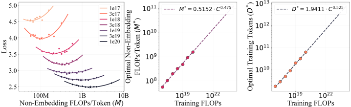
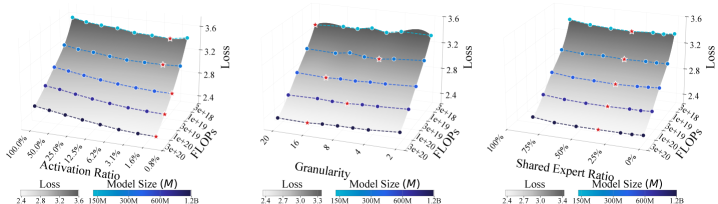
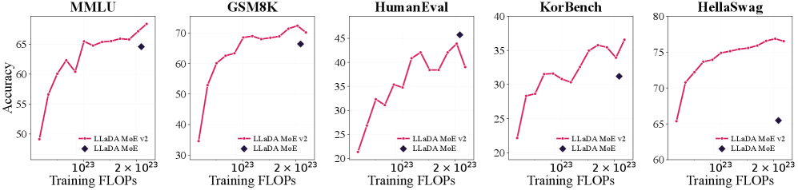

# LLaDA MoE v2: Scaling Mixture-of-Experts Diffusion Language Models

> **论文**：LLaDA MoE v2: Scaling Mixture-of-Experts Diffusion Language Models
> **作者**：Fengqi Zhu, Shaoxuan Xu, Jingyang Ou, Zebin You, Yipeng Xing, Huabin Liu, Xiaolu Zhang, Jun Zhou, Zhenzhong Lan, Yankai Lin, Wayne Xin Zhao, Jianguo Li, Chongxuan Li, Jirong Wen（中国人民大学 GSAI / Ant Group）
> **arXiv ID**：2608.03457
> **发表时间**：2026-08-05
> **许可协议**：未标注
> **代码仓库**：未公开

## 第 1 章 概述

### 1.1 一句话定位

本文系统性刻画 Mixture-of-Experts（MoE）扩散语言模型（dLLM）的 scaling 行为——优化超参数、计算分配、MoE 架构三个维度——发现其与自回归（AR）模型存在定量差异，并据此设计、从零训练了 LLaDA MoE v2（30B-A3B，23.5T tokens），以 Qwen3 约 65% 的预训练 token 逼近其在知识、推理、代码基准上的表现，SFT 后（无 RL）在 8 项推理/代码基准中 7 项超越 SDAR Chat。

### 论文图表总览

| 编号 | 内容 | 章节 |
|------|------|------|
| **Figure 1** | 最优 batch size 与学习率随计算量的 scaling 拟合曲线（两 panel） | 第 3 章 |
| **Figure 2** | 3×10²⁰→6×10²⁰ FLOPs 外推验证的 loss 网格 | 第 3 章 |
| **Figure 3** | IsoFLOP 曲线与模型/数据前沿（三 panel） | 第 3 章 |
| **Figure 4** | MoE 架构扫描：(a) 激活比 (b) 专家粒度 (c) 共享专家比 | 第 3 章 |
| **Figure 5** | 30B-A3B vs 7B-A1B 在不同训练 FLOPs 下的性能对比 | 第 5 章 |
| **Table 1** | 三大类 scaling 发现总结与对应证据 | 第 3 章 |
| **Table 2** | 计算分配 scaling law 对比（11 项） | 第 3 章 |
| **Table 3** | 15 项基准主结果（6 模型对比） | 第 5 章 |
| **Table 4** | SFT 后推理/代码基准结果（3 模型对比） | 第 5 章 |
| **Table 5-10** | 附录：搜索配置、模型架构、训练阶段等 | 第 4/6 章 |

### 1.2 核心贡献

1. **优化超参数 scaling law**：在 158M–3.6B 模型尺度、10¹⁸–3×10²⁰ FLOPs 预算下拟合出 MoE dLLM 专用的 batch size 与学习率规律（B\*=0.374·C^0.3481，η\*=64.8·C^−0.2447）。与 AR 模型相比，最优 batch size 随计算量增长更陡峭、最优学习率衰减更快——这与 dLLM 掩码去噪目标下「名义 token 的有效监督不足」一致（均匀时间步采样下期望只有一半 token 被预测）。
2. **计算分配 scaling law**：IsoFLOP 分析（C = M·D，M 为每 token 激活非嵌入 FLOPs）得到 M\*(C)=0.5152·C^0.475、D\*(C)=1.9411·C^0.525，呈轻微数据侧倾斜——最优 token 预算增长快于激活模型计算。对比 11 项已有 AR/dense-dLLM 规律，稀疏激活与扩散目标各自都偏向数据侧，二者叠加使 MoE dLLM 前沿的数据侧指数（0.525）在 dLLM 研究中最高。
3. **MoE 架构设计原则**：固定激活预算下，更大规模越来越偏好更稀疏的激活（更低激活比 A）；中等专家粒度 G=8–16 跨尺度稳健；共享专家比 S=33.3% 在所有尺度最优——这与 AR 实践（DeepSeekMoE 25%、Qwen3 无共享专家、Tian et al. 递减至 8.3%）形成对比，给出「每两单位路由激活配一单位共享激活」的 dLLM 专用规则。
4. **大规模验证**：据此训练 LLaDA MoE v2 30B-A3B（23.5T tokens，约 460,000 B200 GPU 小时）。15 项基准中 dLLM 平均分最高（58.60），以 Qwen3 的 65% token 逼近其多项能力；SFT 后 7/8 项推理/代码基准超越 SDAR Chat，MultiPL-E 甚至超过 Qwen3。

### 1.3 关键结果速览

| 指标 | LLaDA MoE v2 | Qwen3 30B-A3B | SDAR Chat/Sci | 对比说明 |
|------|:---:|:---:|:---:|------|
| 预训练 token | 23.5T | 36T | 36+1.05T (Sci) | 65% / 63% 的 token 量 |
| 总参/激活参 | 30B / 3B | 30B / 3B | 30B / 3B | 规模匹配 |
| MMLU (base) | 78.01% | 81.38% | 82.72% (Sci) | −3.37 pp |
| MATH (base) | 54.72% | 59.04% | 48.52% (Sci) | 优于 SDAR Sci |
| HumanEval (base) | 50.00% | 52.44% | 33.54% (Sci) | 优于 SDAR Sci +16.46 pp |
| MultiPL-E (base) | 53.78% | 66.53% | 33.66% (Sci) | 优于 SDAR Sci +20.12 pp |
| Math (SFT) | 80.02% | 89.80% | 77.80% (Chat) | 优于 SDAR Chat |
| MultiPL-E (SFT) | 67.52% | 66.60% | 45.00% (Chat) | 超过 Qwen3 |
| 共享专家比 S | 33.3% | 0%（无共享） | — | dLLM 最优值 |

**要点**：LLaDA MoE v2 是首个由 dLLM 专用 scaling law 引导设计的大规模 MoE 扩散语言模型。其核心价值不在绝对性能超越 Qwen3，而在于证明「AR 的 scaling 经验不能直接迁移到 MoE dLLM」这一论断，并以 65% 的 token 预算逼近了强 AR 基线的能力边界。
## 第 2 章 研究背景与动机

### 2.1 扩散语言模型（dLLM）

掩码扩散语言模型在 token 序列上定义离散扩散过程。设 $x_0 = (x_0^1, \ldots, x_0^L)$ 为长度为 $L$ 的干净序列，[MASK] 为掩码 token。前向过程独立损坏每个位置：在噪声水平 $t \in [0,1]$ 下，token $x_0^i$ 以概率 $t$ 被替换为 [MASK]，否则保持不变，产生损坏状态 $x_t$。

双向 Transformer $p_\theta$ 被训练来逆转该过程：以损坏状态为条件，预测每个掩码位置上的干净 token。噪声水平均匀采样时，训练最小化去噪目标：

$$\mathcal{L}(\theta) = -\mathbb{E}_{x_0, t, x_t}\left[\frac{1}{t}\sum_{i=1}^{L}\mathbf{1}\left[x_t^i = \text{[MASK]}\right]\log p_\theta\left(x_0^i \mid x_t\right)\right]$$

该目标上界数据的负对数似然。推理时从全掩码序列出发，通过迭代去噪逐步揭开 token——每步可并行解码多个 token，这是 dLLM 相对 AR 模型的核心优势，也为加速推理提供了空间（KV cache 复用、并行解码、投机解码等）。

近年 dLLM 已从「从零训练的掩码扩散模型」与「从预训练 AR checkpoint 适配」两条路线追平强 AR 模型的能力，成为未来语言建模的候选范式。但已有 dLLM scaling 研究几乎全部聚焦 dense 架构（SMDM、Quokka、DLMs、Ling 的 dense 部分等），MoE dLLM 的 scaling 行为仍是空白。

### 2.2 MoE Transformer 与三个架构参数

MoE Transformer 通过将前馈网络替换为 $n_e$ 个路由专家与一个轻量 router，解耦模型容量与每 token 计算量：总参数量随 $n_e$ 增长，而每个 token 只处理其中一小部分。具体地，router 为每个 token 激活 top-$n_a$ 个路由专家并组合其输出；此外每个 token 还被一个共享专家处理，其中间宽度 $d_{\mathrm{share}} = n_s d_{\mathrm{expert}}$，其中 $n_s$ 表示以单个路由专家为单位的共享容量。

论文用三个变量参数化该架构：

$$A = \frac{n_a + n_s}{n_e + n_s}, \qquad G = \frac{2d_{\mathrm{model}}}{d_{\mathrm{expert}}}, \qquad S = \frac{n_s}{n_a + n_s}$$

- **激活比 A**：每 token 激活的专家容量占比，控制路由稀疏度与路由专家池大小
- **专家粒度 G**：路由容量被切分为专家的方式，权衡路由多样性与单专家容量
- **共享专家比 S**：激活专家容量中分配给共享路径的比例

### 2.3 Scaling Laws 现状

Scaling laws 用小规模测量估计计算依赖的选择（优化超参数、模型-数据分配、架构）在大预算下应如何变化。实践中有两条主线：

1. **超参数 power-law**：最优 batch size 与学习率建模为计算预算 $C$ 的幂律函数
2. **IsoFLOP 分析**：固定 $C$，扫描模型侧计算与训练 token 的分配，找最低损失点

dense 模型通常近似 $C \approx 6ND$（$N$ 为非嵌入参数、$D$ 为训练 token 数），但该假设对 MoE 不成立——MoE 中只有激活参数参与每个 token 的处理。因此论文遵循既有 MoE scaling 研究，使用 $C = MD$，其中 $M$ 为每 token 激活非嵌入训练 FLOPs。

已有代表性计算分配规律（模型/数据指数）：Kaplan（0.73/0.27）、Chinchilla（0.49/0.51）、DeepSeek LLM（0.5243/0.4757）、Llama 3（0.463/0.537）、SMDM（dense AR 0.644/0.356、dense dLLM 0.634/0.366）、Ling（dense AR 0.5422/0.4578、MoE AR 0.5095/0.4905）、Quokka（0.514/0.486）、DLMs（0.566/0.434）。dLLM 相关研究仍以 dense 架构为主。

### 2.4 动机：AR 经验为何不能直接迁移

MoE dLLM 已开始出现（LLaDA-MoE、DMoE、Expert-choice routing），但其设计大多继承 AR 实践。AR 经验是有用的先验，却不能假设直接迁移，原因在于 dLLM 优化目标的三个结构性差异：

1. **监督位置不同**：dLLM 优化掩码去噪目标而非 next-token prediction，监督只落在掩码位置——均匀时间步采样下期望只有一半 token 被预测，名义 token batch 与有效预测目标数不对应
2. **条件状态不同**：每个预测以损坏序列（而非因果前缀）为条件，损坏状态随噪声水平与掩码模式变化
3. **路由状态不同**：router 作用于损坏状态，其输入分布比 AR 的因果前缀更多样

因此 MoE dLLM 的最优 batch size、学习率、模型-数据分配与专家架构的 scaling 行为都需独立刻画——这正是本文的核心工作。

## 第 3 章 MoE dLLM 的 Scaling Laws

论文分三阶段建立 MoE dLLM 的 scaling 框架：先校准计算依赖的 batch size 与学习率，再估计激活模型计算与训练数据的分配，最后把模型侧预算分解为激活比、专家粒度与共享专家比。

### 3.1 超参数 Scaling Law

**实验设置**：在 158M–3.6B 模型尺度、10¹⁸–3×10²⁰ FLOPs 预算下联合搜索名义 token batch size 与峰值学习率。全部运行使用相同预训练数据、序列长度 4096、AdamW (β₁=0.9, β₂=0.95)、weight decay 0.1；LR 前 2,000 steps 线性 warmup 至峰值，保持至最后 10% 计算量后 cosine 衰减至 0.1η。

**结果**（Figure 1、2）：

$$B^{*} = 0.374 \cdot C^{0.3481}, \qquad \eta^{*} = 64.8 \cdot C^{-0.2447}$$

外推验证：将联合 batch/LR 运行从 3×10²⁰ 延续到 6×10²⁰ FLOPs，拟合推荐接近二维超参平面中的最佳观测配置。

**与 AR 的定量差异**：优化方向一致（batch 随计算量亚线性增长、LR 随计算量下降），但标定系统性不同。与 DeepSeek LLM 的 AR law 相比，dLLM 拟合使用更陡的 batch scaling 与更快的 LR 衰减。在 10²⁰ FLOPs 处：AR law 预测 LR 9.86×10⁻⁴ vs dLLM 8.27×10⁻⁴；AR 预测 batch 1.02M tokens vs dLLM 3.43M tokens。batch 差距与「名义 token 有效监督不足」一致——每个名义 token 只在被掩码时贡献预测目标。结论：AR scaling 可作为先验，但趋势发散处必须用 dLLM 专属标定。

### 3.2 计算分配 Scaling Law

**实验设置**：模型侧用每 token 激活非嵌入 FLOPs $M$ 度量，数据侧为训练 token 数 $D$，满足 $C = MD$。在 10¹⁷–10²⁰ FLOPs 固定预算下扫描分配，识别每个预算的最低损失分配并拟合前沿 $M^*(C)$、$D^*(C)$。

**结果**（Figure 3、Table 2）：

*图3：左 panel 为各计算预算下的 U 形 IsoFLOP 曲线与最优分配点（星标）；中/右 panel 为拟合的模型侧 M\*(C) 与数据侧 D\*(C) 前沿，数据侧指数 0.525 略大于模型侧 0.475。*

$$M^{*}(C) = 0.5152 \cdot C^{0.475}, \qquad D^{*}(C) = 1.9411 \cdot C^{0.525}$$

两个指数都接近 0.5，数据侧指数（0.525）略大于模型侧（0.475）——**最优 token 预算增长快于激活模型计算**，即轻微的数据侧倾斜。

**倾斜的归因**：两个对照实验分离了架构与建模目标的影响：

- **稀疏激活**（Ling，同为 AR 建模）：dense→MoE 使指数从 0.5422/0.4578 变为 0.5095/0.4905，稀疏激活把 AR 前沿推向更多数据
- **扩散目标**（SMDM，同为 dense 架构）：AR→dLLM 使指数从 0.644/0.356 变为 0.634/0.366，同样是数据偏向方向

本文同时叠加稀疏激活与 dLLM 目标，得到 0.475/0.525 的数据侧倾斜前沿——比任何已有 dense dLLM 前沿都更偏向数据侧。实用规则：MoE dLLM 的边际算力应相对更多地花在增加训练 token 上，而非增加每 token 激活 FLOPs。

### 3.3 MoE 架构 Scaling Law

固定激活预算 $M^*(C)$ 后，将预算分解为三个架构维度。实验在 5 个参考预算 C ∈ {6×10¹⁷, 2×10¹⁸, 6×10¹⁸, 2×10¹⁹, 6×10¹⁹} FLOPs 下，每次只变一个维度、保持其他两个固定；为模拟过训练 regime，每个候选训练 $3D^*(C)$ tokens（约 3C FLOPs）。

**激活比 A**（Figure 4a）：固定激活预算下，降低 A 通常降低训练损失，且随计算量增长收益更显著。最小预算下第二低激活比略优于最稀疏设置——极端稀疏暴露更大的路由专家池，需要足够训练算力才能被有效优化。趋势：大规模 MoE dLLM 能日益充分地利用专家容量。

*图4：(a) 激活比 A 扫描——大规模更偏好稀疏；(b) 专家粒度 G 扫描——G=8–16 稳健；(c) 共享专家比 S 扫描——S=33.3% 全尺度最优（U 形）。*

**专家粒度 G**（Figure 4b）：G 无跨尺度单调趋势，不是主要 scaling 方向；它反映路由多样性与单专家容量的权衡。掩码去噪同时需要「对损坏上下文的多样专业化」与「足够专家表达力」，G=8–16 在扫描中稳健。

**共享专家比 S**（Figure 4c）：全尺度 U 形损失曲线，最小值都在 S=33.3%。与 AR 实践对比鲜明：DeepSeekMoE 取 25%、Qwen3 无共享专家、Tian et al. 报告从 16.7% 递减到 8.3%（支持固定「一个共享专家」规则）。dLLM 扫描反而偏好共享路径容量随激活预算成比例增长的配置——**每两单位路由激活容量配约一单位共享激活容量**，这是与 AR 启发式不同的 dLLM 专属规则。

### 3.4 设计原则小结

| 维度 | 发现 | 对 30B-A3B 的含义 |
|------|------|------------------|
| Batch size | B\*=0.374·C^0.3481（比 AR 更陡） | 大预算用更大的名义 batch |
| Learning rate | η\*=64.8·C^−0.2447（比 AR 更快衰减） | 大预算用更小的峰值 LR |
| 计算分配 | M\*/D\* 指数 0.475/0.525（数据侧倾斜） | 相对多投 token |
| 激活比 A | 大规模更偏好稀疏 | 选 9.09% |
| 专家粒度 G | 8–16 稳健 | 选 8 |
| 共享专家比 S | 33.3% 全尺度最优 | 选 33.3% |
## 第 4 章 LLaDA MoE v2 模型设计与训练

### 4.1 模型架构

LLaDA MoE v2 是一个 30B-A3B 的 MoE 扩散语言模型：总参数量 30.6B，每 token 激活约 3.4B 参数。核心架构配置直接由第 3 章的 scaling law 推导而来：激活比 A=9.09%、专家粒度 G=8、共享专家比 S=33.3%。

**Transformer 主干**：

| 配置项 | 数值 |
|--------|------|
| 层数 n_layer | 32 |
| 隐藏维度 d_model | 3072 |
| Query heads | 32 |
| KV heads (GQA) | 4 |
| 词表大小 | 157,184 |
| 激活函数 | SwiGLU |
| 精度 | BF16 |

**MoE 配置**：

| 配置项 | 数值 |
|--------|------|
| 路由专家数 n_e | 128 |
| 每 token 激活路由专家 n_a | 8（top-8） |
| 共享专家宽度单位 n_s | 4 |
| 共享专家中间宽度 d_share | 4·d_expert = d_model = 3072 |
| 路由专家中间宽度 d_expert | d_model/4 = 768 |
| 激活比 A | (8+4)/(128+4) = 9.09% |
| 专家粒度 G | 2·3072/768 = 8 |
| 共享专家比 S | 4/(8+4) = 33.3% |

每个 token 在每层由 router 独立选择 top-8 个路由专家，输出加权组合（权重为 softmax 分数在选中集合内重归一化），并与共享专家输出按 $\lambda$ 系数相加：$E_{\mathrm{share}}(h) + \lambda E_{\mathrm{route}}(h)$。$\lambda$ 通过在初始化时匹配共享路径与路由路径的期望输出范数来估计（基于 router logits 服从 $\mathcal{N}(0, I_{n_e})$ 的假设，蒙特卡洛近似）。

**训练目标**：

$$\mathcal{L} = \mathcal{L}_{\mathrm{diff}} + 0.01\,\mathcal{L}_{\mathrm{bal}} + 0.001\,\mathcal{L}_{z}$$

其中 $\mathcal{L}_{\mathrm{diff}}$ 为掩码去噪目标，$\mathcal{L}_{\mathrm{bal}}$ 为负载均衡辅助损失，$\mathcal{L}_{z}$ 为 router z-loss。两个辅助系数（0.01 / 0.001）在所有 scaling 实验与正式训练中保持一致。

### 4.2 预训练数据与五阶段调度

预训练语料由网页高质量文本构成，经过标准处理管线：收集原始文本 → 移除 boilerplate 与低质/格式错误文档 → 去重 → 有害内容过滤。

| 阶段 | 阶段名称 | Tokens | 上下文长度 | RoPE base |
|------|---------|:------:|:---------:|:---------:|
| 1 | Base pretraining 1 | 10T | 4K | 10,000 |
| 2 | Base pretraining 2 | 10T | 4K | 10,000 |
| 3 | Pretraining annealing | 2T | 4K | 10,000 |
| 4 | Context extension | 500B | 32K | 500,000 |
| 5 | Long-context annealing | 1T | 32K | 500,000 |

- Stage 1/2 从同一源语料抽取各 10T token 样本；Stage 2 的混合权重略偏向数学推理与代码数据
- Stage 3 使用 1T 精选语料训练 2 个 epoch（共 2T tokens）
- Stage 4 将 RoPE base 从 10,000 提升至 500,000，上下文从 4K 扩展到 32K
- Stage 5 为长上下文 anneal 阶段
- 全程共 23.5T nominal tokens

### 4.3 优化配置

**预训练**：

| 配置项 | 数值 |
|--------|------|
| Global nominal batch size | 33,554,432 tokens（2²⁵） |
| Optimizer | AdamW (β₁=0.9, β₂=0.95) |
| Weight decay | 0.1 |
| Warmup | 2,000 steps（每阶段） |
| Stage 1-5 peak LR | 1.5e-4 / 1.0e-4 / 5.0e-5 / 1.0e-5 / 7.0e-6 |
| Stage 5 最终 LR | 5.0e-6（cosine 衰减） |
| 硬件 | ~460,000 NVIDIA B200 GPU hours |

每阶段 LR 从头线性 warmup 至峰值；Stage 1-4 的最后 10% 计算量内 cosine 衰减至下一阶段峰值；Stage 5 衰减至 5.0e-6。

### 4.4 监督微调（SFT）

- 数据：7M 指令-响应对，以单轮数学推理与代码生成为主；经与预训练相同的过滤/去重后，按统一对话模板格式化，打包为 8K-token 非重叠序列
- 训练：3 epochs，batch size 512 序列，AdamW (β₁=0.9, β₂=0.999)，weight decay 0.1，梯度裁剪 max norm 1.0
- LR：线性 warmup 至 5.0e-6（前 8% 步数），随后 cosine 衰减至 1.0e-6
- 掩码策略：prompt 保持不损坏，仅对 response 应用前向掩码（Eq.1），去噪损失只计算被掩码的 response 位置
- MoE 辅助损失在 SFT 期间保持激活，系数不变（0.01 / 0.001）
- **无 RL 阶段**（作者明确留作未来工作）
## 第 5 章 实验结果与分析

### 5.1 主结果：15 项基准对比

LLaDA MoE v2 30B-A3B 与五个代表基线的对比。规模最匹配的基线是 SDAR Sci（由 Qwen3 继续预训练得到的扩散模型）与 Qwen3 30B-A3B（强 AR MoE 模型）。LLaDA MoE v2 从零训练 23.5T tokens，为 SDAR Sci（37.05T）的 63%、Qwen3（36T）的 65%。

| 基准 | LLaDA MoE v2 | SDAR Sci | LLaDA MoE | Dream 7B | LLaDA 8B | Qwen3 |
|------|:---:|:---:|:---:|:---:|:---:|:---:|
| 架构 | MoE | MoE | MoE | Dense | Dense | MoE |
| 建模方式 | Diffusion | Diffusion | Diffusion | Diffusion | Diffusion | AR |
| 方法 | Pretrain | CPT | Pretrain | CPT | Pretrain | Pretrain |
| 总参数量 | 30B | 30B | 7B | 7B | 8B | 30B |
| 激活参数量 | 3B | 3B | 1B | 7B | 8B | 3B |
| 训练 tokens | 23.5T | 36+1.05T | 21T | 18+0.58T | 2.3T | 36T |
| **通用任务** | | | | | | |
| MMLU | 78.01% | 82.72% | 64.59%† | 69.50%† | 65.90%† | 81.38%* |
| MMLU-Pro | 57.28% | 56.96% | 39.16%† | 48.15%† | 41.80%† | 61.49%* |
| CEval | 76.11% | 86.95% | 65.56%† | 59.18%† | 70.50%† | 87.50% |
| CMMLU | 77.99% | 85.82% | 65.65%† | 60.87%† | 69.90%† | 86.35% |
| HellaSwag | 77.19% | 56.38% | 65.46% | 74.37% | 70.82% | 77.92% |
| KorBench | 45.92% | 40.08% | 31.20%† | 37.44%† | 33.68%† | 44.96% |
| **数学推理** | | | | | | |
| GSM8K | 83.93% | 86.13% | 66.41%† | 77.79%† | 70.70%† | 91.81%* |
| MATH | 54.72% | 48.52% | 36.10%† | 39.60%† | 27.30%† | 59.04%* |
| OlympiadBench | 28.74% | 24.44% | 10.07%† | 10.22%† | 6.85%† | 30.96% |
| **代码生成** | | | | | | |
| CRUXEval | 50.62% | 53.00% | 38.94% | 40.31% | 36.38% | 56.88% |
| MBPP | 71.00% | 60.40% | 52.40%† | 56.20%† | 38.20%† | 74.40%* |
| MultiPL-E | 53.78% | 33.66% | 41.13%† | 27.60%† | 23.61%† | 66.53%* |
| HumanEval | 50.00% | 33.54% | 45.73%† | 57.90%† | 33.50%† | 52.44% |
| LiveCodeBench v6 | 31.86% | 39.87% | 16.18%† | 14.87%† | 2.53%† | 49.18% |
| BigCodeBench | 41.84% | 33.86% | 21.23%† | 18.33%† | 13.42%† | 45.70% |

> 注：\* 表示官方报告结果；† 表示在论文统一评估配置下复现的结果；无标注项表示各模型官方/统一评估一致。多选任务（MMLU、MMLU-Pro、CEval、CMMLU、HellaSwag）用条件似然评估，其余为条件生成。

**分析**：

- **dLLM 平均分最高**：LLaDA MoE v2 在全部 15 项基准上的 dLLM 平均分为 58.60%，超过 SDAR Sci 3.78 pp，超过更小的 dLLM 基线至少 12.44 pp
- **对 SDAR Sci 的代码优势显著**：HumanEval +16.46 pp、BigCodeBench +7.98 pp、MultiPL-E +20.12 pp——尽管 SDAR Sci 是从 AR checkpoint 继续预训练（CPT），而 LLaDA MoE v2 完全从零训练
- **与 Qwen3 的差距分布**：中文知识基准差距最大（CEval −11.39 pp、CMMLU −8.36 pp），部分代码任务差距较大（MultiPL-E −12.75 pp、LiveCodeBench −17.32 pp）；但在 OlympiadBench（−2.22 pp）、HumanEval（−2.44 pp）等推理/代码任务上很接近
- **成本效率**：以 Qwen3 的 65% 预训练 token 取得上述表现，验证了 scaling-law-guided 设计的有效性

### 5.2 计算受限对比：30B-A3B vs 7B-A1B

Figure 5 对比 LLaDA MoE v2 30B-A3B（scaling law 指导设计）与 LLaDA MoE 7B-A1B（无指导设计的早期 MoE dLLM）在不同训练 FLOPs 下的性能：

*图5：跨知识/数学/代码基准，30B-A3B 以约 50% 的 FLOPs 在 MMLU、GSM8K、KorBench 上超越 7B-A1B，HellaSwag 上以不到 10% 的 FLOPs 即超越。*

- 30B-A3B 在 MMLU、GSM8K、KorBench 上以约 50% 的训练 FLOPs 超越 7B-A1B
- 在 HellaSwag 上以不到 10% 的训练 FLOPs 即超越 7B-A1B
- 结论：scaling law 指导的架构设计能将预训练算力更高效地转化为下游性能

### 5.3 SFT 结果

从 30B-A3B base checkpoint 出发，经 3 epochs / 7M 样本 SFT 得到 instruct 模型（无 RL），与 Qwen3 30B-A3B（no think）和 SDAR Chat 30B-A3B 对比：

| 基准 | Qwen3 | SDAR Chat | LLaDA MoE v2 |
|------|:---:|:---:|:---:|
| Math | 89.80%* | 77.80%† | 80.02% |
| Olympiad | 57.26% | 34.93% | 46.44% |
| AIME 2024 | 32.80%* | 16.70%† | 30.00% |
| AIME 2025 | 21.60%* | 10.80%† | 20.00% |
| MBPP | 85.48% | 71.60%† | 81.03% |
| LiveCodeBench v6 | 31.50% | 21.70%† | 27.75% |
| BigCodeBench | 41.14% | 39.39% | 35.53% |
| MultiPL-E | 66.60% | 45.00% | 67.52% |

**分析**：

- **7/8 超越 SDAR Chat**：4 项推理基准全部超越（Math +2.22 pp、Olympiad +11.51 pp、AIME24 +13.30 pp、AIME25 +9.20 pp），4 项代码基准中 3 项超越（MBPP +9.43 pp、LCB v6 +6.05 pp、MultiPL-E +22.52 pp），仅 BigCodeBench 落后（−3.86 pp）
- **与 Qwen3 接近**：AIME 24/25（−2.80 / −1.60 pp）、MBPP（−4.45 pp）、LiveCodeBench（−3.75 pp）差距很小；MultiPL-E 反超 Qwen3（+0.92 pp）
- **无 RL 的边界**：Qwen3 有额外 RL 阶段，LLaDA MoE v2 仅靠 SFT 就在多项任务上接近甚至反超，表明从零训练的 MoE dLLM 已具备强推理/代码能力基础

### 5.4 评估协议细节

- 多选题任务（MMLU、MMLU-Pro、CEval、CMMLU、HellaSwag）使用条件似然：计算每个候选答案在 prompt 条件下的似然，取最高者
- 生成类任务使用各模型原生生成流程；代码任务提取代码并执行测试用例；数学任务用等价性检查器判定
- 全部 instruct 模型经条件生成评估：生成上限 1,024 tokens；MATH、OlympiadBench、AIME 2024/2025 提升至 4,096 tokens
- LLaDA MoE v2 使用 semi-autoregressive sampling（block size 64，denoising steps = 生成长度）；SDAR 使用 block diffusion（block size 4）

## 第 6 章 实现与计算细节

### 6.1 计算核算（FLOPs 与参数量）

论文对所有 scaling 实验使用统一的激活计算核算。设 $n_{\mathrm{layer}}$ 为层数、$d_{\mathrm{model}}$ 为隐藏维度、$s$ 为序列长度、$r_{\mathrm{kv}} = n_{\mathrm{kvheads}}/n_{\mathrm{heads}}$ 为 KV/query head 比。每 MoE 层含 $n_e$ 个路由专家（中间宽度 $d_{\mathrm{expert}}$，每 token 激活 $n_a$ 个）与一个共享专家（中间宽度 $d_{\mathrm{share}} = n_s d_{\mathrm{expert}}$）。SwiGLU 的三个投影矩阵为每个路由专家贡献 $3 d_{\mathrm{model}} d_{\mathrm{expert}}$ 参数。

**非嵌入参数量（总数与激活）**：

$$P_{\mathrm{nonemb}} = n_{\mathrm{layer}}\left[2d_{\mathrm{model}}^2(1+r_{\mathrm{kv}}) + d_{\mathrm{model}}n_e + 3d_{\mathrm{model}}(n_e d_{\mathrm{expert}} + d_{\mathrm{share}})\right]$$

$$P_{\mathrm{act,nonemb}} = n_{\mathrm{layer}}\left[2d_{\mathrm{model}}^2(1+r_{\mathrm{kv}}) + d_{\mathrm{model}}n_e + 3d_{\mathrm{model}}(n_a d_{\mathrm{expert}} + d_{\mathrm{share}})\right]$$

第一项为 QKV+输出投影，第二项为 router（对每个 token 打分全部 $n_e$ 个专家），最后一项为路由专家与共享专家。词表参数 $2V d_{\mathrm{model}}$（输入 embedding + 独立 LM head）计入总/激活参数但不计入非嵌入量。

**每 token 前向 FLOPs（一层）**（一次乘加计 2 FLOPs）：

$$F_{\mathrm{attn}} = 4d_{\mathrm{model}}^2(1+r_{\mathrm{kv}}) + 4sd_{\mathrm{model}}$$

$$F_{\mathrm{MoE}} = 2d_{\mathrm{model}}n_e + 6d_{\mathrm{model}}(n_a d_{\mathrm{expert}} + d_{\mathrm{share}})$$

近似 backward 为 forward 的两倍，得到激活非嵌入 FLOPs/token：

$$M = 3n_{\mathrm{layer}}\left[4d_{\mathrm{model}}^2(1+r_{\mathrm{kv}}) + 4sd_{\mathrm{model}} + 2d_{\mathrm{model}}n_e + 6d_{\mathrm{model}}(n_a d_{\mathrm{expert}} + d_{\mathrm{share}})\right]$$

总计算预算为 $C = M \cdot D$，其中 $D$ 为训练 nominal tokens（含掩码与可见位置——掩码和可见 token 计算量相同，损坏程度只改变监督目标数而不改变核算 FLOPs）。

### 6.2 MoE 路由实现

- 每个 token 每层独立路由：线性 router 产生 logits $r(h) \in \mathbb{R}^{n_e}$，路由分数 $p(h) = \mathrm{softmax}(r(h))$
- 取分数最大的 $n_a$ 个专家组成 $\mathcal{T}(h)$，选中分数重归一化：

$$w_i(h) = \frac{p_i(h)}{\sum_{j \in \mathcal{T}(h)} p_j(h)}, \quad i \in \mathcal{T}(h)$$

- 路由输出：

$$E_{\mathrm{route}}(h) = \sum_{i \in \mathcal{T}(h)} w_i(h) E_i(h)$$

- 与共享路径组合：$E_{\mathrm{share}}(h) + \lambda E_{\mathrm{route}}(h)$；共享专家比实验中的 routed-only 配置省略共享项且无缩放因子
- $\lambda$ 估计：把共享专家视为 $n_s$ 个专家宽度单位，假设初始化时各专家输出范数相等且两两正交，则共享路径范数 ∝ $\sqrt{n_s}$，未缩放路由路径范数 ∝ $(\sum_{i \in \mathcal{T}} w_i^2)^{1/2}$。假设 router logits 初始化分布 $r(h) \sim \mathcal{N}(0, I_{n_e})$：

$$\lambda = \mathbb{E}_{r(h) \sim \mathcal{N}(0, I_{n_e})}\left[\frac{\sqrt{n_s}}{\left(\sum_{i \in \mathcal{T}(h)} w_i(h)^2\right)^{1/2}}\right]$$

期望用蒙特卡洛采样对每个含共享专家的架构配置独立近似。

### 6.3 Scaling 实验设置

**超参数扫描（A.3）**：

| 模型尺度 | Compute C | Batch 搜索 | LR 搜索 |
|---------|-----------|-----------|---------|
| 158M | {1,2,3,6,8}×10¹⁸ | {2¹⁷..2²⁰} | {1,1.4,2,2.8}×10⁻³ |
| 1B | {1,2,3,6,8,10}×10¹⁹ | {2¹⁸..2²¹} | {0.7,1,1.4,2}×10⁻³ |
| 3.6B | {0.8,1,2,3}×10²⁰ | {2²¹..2²³} | {1,4,7}×10⁻⁴ |

- 全部使用相同预训练数据、序列长度 4096、AdamW (0.9, 0.95)、wd 0.1
- LR 前 2,000 steps 线性 warmup 至峰值，保持到训练计算量最后 10%，再 cosine 衰减至 0.1η
- 损失定义：分配 FLOPs 最后 0.5% 的平均训练损失；与最低损失差距 ≤0.25% 视为 near-optimal
- 全部 near-optimal 配置进入 log-log 线性回归，得 Eq.2 的 scaling law

**计算分配扫描（A.4）**：IsoFLOP 预算 10¹⁷–10²⁰ FLOPs，按拟合超参 law 设置 batch/LR；warmup 长度 $T_{\mathrm{warm}} = \max(0.01T, 100)$ 步；每个预算取最低损失分配点为经验最优，log-log 回归得前沿。

**架构扫描（A.5）**：参考预算 C ∈ {6×10¹⁷, 2×10¹⁸, 6×10¹⁸, 2×10¹⁹, 6×10¹⁹} FLOPs；固定 backbone，每次只变一个架构维度；为模拟大模型常用的过训练 regime，每个候选训练 $3D^*(C)$ nominal tokens（约 3C FLOPs），超参按实际预算 3C 评估。

三个扫描的控制方式：
- 激活比扫描：固定 backbone、$n_a$、$n_s$、$d_{\mathrm{expert}}$，只变 $n_e$（激活计算不变，总参数随 A 下降而增长）
- 专家粒度扫描：变 $d_{\mathrm{expert}}$，$n_e$/$n_a$/$n_s$ 反比缩放，保持 A、S 与路由/共享激活宽度不变
- 共享专家比扫描：固定 $n_e$、$d_{\mathrm{expert}}$，在共享与路由路径间重新分配固定激活宽度 $(n_a+n_s)d_{\mathrm{expert}}$（A 有轻微漂移，可忽略）

### 6.4 代码与开源状态

论文未提供官方代码仓库或模型权重链接；LLaDA MoE v2 权重未确认公开发布。实现细节以论文 Appendix A/B 的公式与配置表为准。
## 第 7 章 局限性与延伸阅读

### 7.1 局限性

1. **维度独立性假设**：论文的三个 scaling 维度（优化超参数、计算分配、架构）各自单独变化，未系统捕获维度间的交互效应。例如激活比与专家粒度可能耦合——更稀疏的路由可能需要更细或更粗的专家粒度来补偿，但这一交互未被实验覆盖。
2. **无 RL 阶段**：SFT 后未整合强化学习（RL），与 Qwen3 的对比中 Qwen3 拥有额外 RL 阶段。作者明确将 RL 整合留作未来工作；RL 可能进一步扩大或缩小与 AR 模型的差距，当前结论仅刻画 SFT 边界。
3. **共享专家比结论的规模化外推**：S=33.3% 在 6×10¹⁷–6×10¹⁹ FLOPs 范围内全尺度最优，但 30B-A3B 的实际训练预算远超该范围顶部，架构选择隐含了 law 的外推有效性假设——30B 模型的表现部分验证了这一点，但仍是外推。
4. **激活比的最优值未精确定位**：论文表明「更稀疏越好」的趋势，但 30B-A3B 的 A=9.09% 是离散候选网格中的选择而非连续最优；在最小计算预算下次低激活比反而优于最稀疏配置，说明极端稀疏在大预算下是否持续有利仍需更大规模的验证。
5. **中文知识基准差距**：CEval/CMMLU 与 Qwen3 差距较大（−11.39 / −8.36 pp），可能源于中文数据配比或模型容量分配，论文未对此做专门分析。
6. **开源状态不明**：未提供代码或权重，复现成本高；数据管线（语料配比、清洗细节）未公开。
7. **对比基线的评估口径差异**：部分基线值为官方报告（\*），部分为统一评估复现（†），跨模型比较存在评估配置差异的固有噪声。

### 7.2 与相关工作的关系

- **LLaDA 系列**：从 LLaDA（dense 8B，2.3T tokens）到 LLaDA MoE（7B-A1B，21T tokens）到本文 LLaDA MoE v2（30B-A3B，23.5T tokens），本文首次用 dLLM 专用 scaling law 指导大规模 MoE 扩散模型设计，而非继承 AR 实践
- **其他 MoE dLLM**：DMoE（可学习 block experts）、Expert-choice routing（自适应计算）等早期工作继承 AR 架构选择，本文系统刻画了 dLLM 专属的最优配置
- **Scaling law 对比基准**：Kaplan（0.73/0.27）、Chinchilla（0.49/0.51）、DeepSeek LLM（0.5243/0.4757）、Llama 3（0.463/0.537）、SMDM（dense dLLM，0.634/0.366）、Quokka（0.514/0.486）、DLMs（0.566/0.434）、Ling（dense AR 0.5422/0.4578、MoE AR 0.5095/0.4905）——本文的 0.475/0.525 是 dLLM 研究中数据侧倾斜最大的前沿（全表对比中 AR Llama 3 的 0.537 更大）

### 7.3 延伸方向

1. **RL 整合**：在 SFT 模型上加入 RL/GRPO 类训练，检验 MoE dLLM 的推理能力能否进一步追赶 AR 模型
2. **多维联合优化**：将激活比、粒度、共享比纳入联合搜索，建模维度间交互的 scaling law
3. **超大规模验证**：在 ≥100B 激活规模验证 A、G、S 的最优值是否继续外推
4. **长上下文与 MoE 扩散结合**：本文的 32K 上下文扩展在扩散目标下的行为值得进一步分析
5. **推理效率研究**：MoE dLLM 的并行解码（semi-AR block 64）与稀疏激活的组合推理吞吐特性尚未被充分研究

### 7.4 一句话总结

LLaDA MoE v2 证明了「AR scaling 经验不能直接迁移到 MoE 扩散语言模型」——通过 dLLM 专用的 batch/LR、计算分配与架构 scaling law 指导设计，一个 30B-A3B 模型以 Qwen3 的 65% 预训练 token 逼近其能力，SFT 后 7/8 项推理/代码基准超越同规模的 SDAR Chat，为扩散语言模型的大规模高效训练提供了可复用的设计原则。
