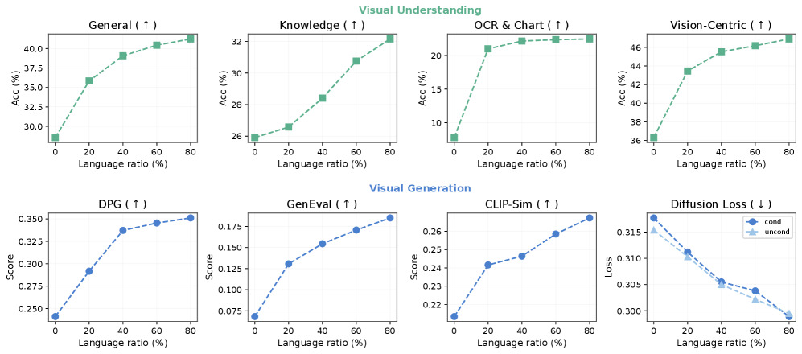
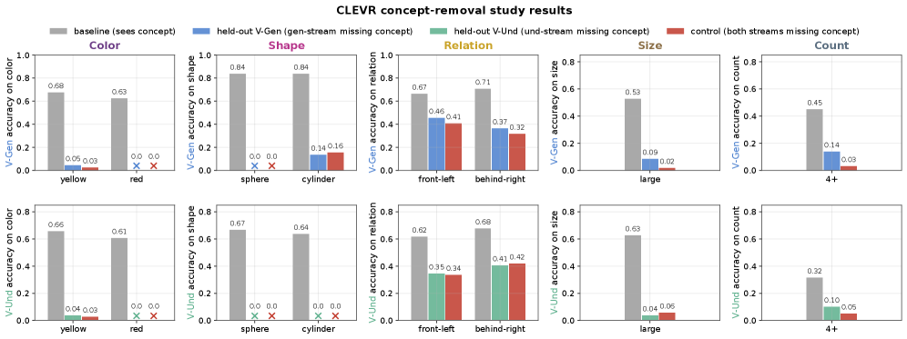
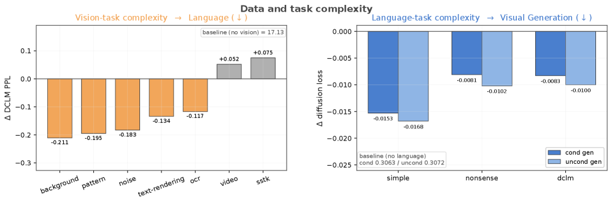
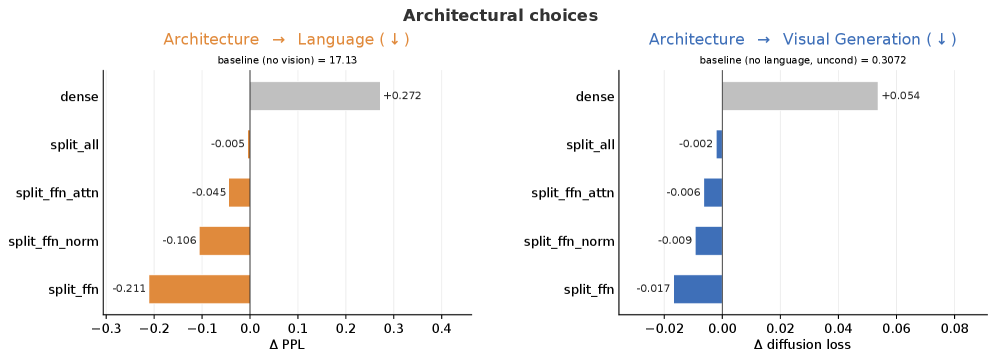
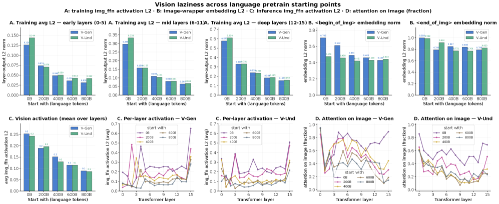
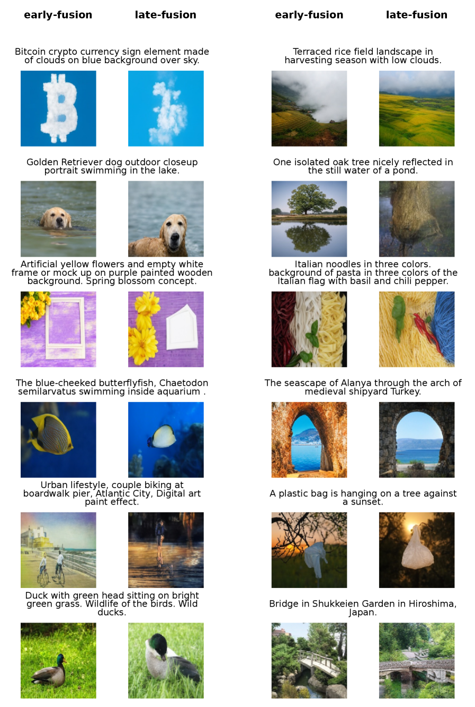

> **论文**：Towards Physics of Multimodal Pretraining: Knowledge Flow, Modality Synergy, Early Unification, and Recipes
> **作者**：Junlin Han, Shengbang Tong, David Fan, Minghao Chen, Philip Torr, Filippos Kokkinos, Mike Lewis
> **arXiv ID**：2608.05000
> **发表时间**：2026-08-06
> **许可协议**：CC BY 4.0
> **代码仓库**：无官方实现（project page 见论文）

## 第 1 章 概述

### 1.1 一句话定位

本论文通过合成数据与大规模真实数据上的系统性受控实验，为统一多模态预训练建立"物理"级经验基础——揭示语言、视觉理解与视觉生成之间非对称的知识流、决定模态协同或竞争的数据复杂度条件、早期统一的必要性及其内在的"视觉懒惰"机制，并据此推导出仅需 5% 生成算力即可获得强生成性能的高效预训练配方。全部发现最终在 13.5B MoE、2T tokens 规模上通过单变量对照验证。

### 论文图表总览

| 编号 | 内容 | 章节 |
|------|------|------|
| Figure 1 | 语言比例 0%→80% 对视觉理解四轴与生成的单调提升 | 第 4 章 模态知识流 |
| Figure 5 | CLEVR 五概念轴零样本迁移（颜色/形状双向失败，结构概念理解→生成单向迁移） | 第 4 章 模态知识流 |
| Figure 8 | 任务复杂度阶梯下 ΔPPL 与 ΔDiffLoss 的协同/竞争转换 | 第 5 章 协同与竞争 |
| Figure 9 | 参数共享五配置对比（dense / split\_ffn / split\_ffn\_attn / split\_ffn\_norm / split\_all） | 第 5 章 协同与竞争 |
| Figure 13 | 视觉懒惰四轴机制探测（训练激活 / 嵌入范数 / 推理激活 / 注意力分数） | 第 6 章 早期统一与视觉懒惰 |
| Figure 20 | 早期统一 vs 晚期融合的文生图定性对比 | 第 6 章 早期统一与视觉懒惰 |
| Table 1 | 混合比网格搜索（Fix MM / Fix Lan / Next 三轴，1T tokens） | 第 7 章 预训练配方与规模验证 |
| Table 2 | 13.5B MoE 2T tokens 规模验证四组单变量对比 | 第 7 章 预训练配方与规模验证 |

### 1.2 四大核心贡献

**贡献一：知识流非对称且概念依赖（§3）。** 在真实数据上，语言是通用助推器——语言比例从 0% 升至 80% 单调提升所有视觉理解轴与生成质量；视觉理解为生成提供强先验——提升理解比例显著降低条件/非条件 diffusion loss；生成对理解与语言呈中性，不产生显著反向迁移。在 CLEVR 合成受控环境下进一步证实知识流的概念依赖性：低级属性（颜色、形状）在零样本设置下双向均不迁移；高级结构概念（关系、大小、计数）则呈现理解→生成的单向迁移，反向几乎不迁移。更深层地，生成训练虽无法零样本迁移，却为低级概念理解留下强潜在先验（微调恢复曲线 Δ 平均准确度 +0.133～+0.273）。

**贡献二：协同与竞争由数据复杂度决定（§4）。** 数据"复杂度"是协同与竞争的开关：简单任务（纯色背景 ΔPPL −0.211、噪声 ΔPPL −0.183；简单文本 ΔDiffLoss −0.0153 条件 / −0.0168 非条件）在另一模态上产生净正迁移；复杂数据（视频 ΔPPL +0.052、SSTK 自然图像 ΔPPL +0.075）则引发容量竞争，反噬性能。在架构层面，共享注意力与归一化层是协同的"桥梁"，而模态专属 FFN 隔离竞争——dense 模型语言 PPL 恶化 +0.272、视觉 loss 恶化 +0.0537，分离 FFN 后语言 PPL 改善 −0.211、视觉 loss 改善 −0.0168。该协同行为在全部四种视觉 tokenizer 上均成立。

**贡献三：早期统一的必要性与视觉懒惰（§5）。** 在固定 1T tokens 预算下，纯语言预热阶段越长（0→800B），视觉能力下降越剧烈，语言收益在 600B 后趋于饱和。联合训练在几乎所有指标上优于全部六种顺序排列（含 12.5% replay）。延迟统一导致"视觉懒惰"（vision laziness）：图像侧 FFN 训练/推理激活变安静、wrapper token 嵌入范数收缩、对图像 token 的注意力减少——视觉通路在功能层面日益欠开发，与语言流形脱节。

**贡献四：高效预训练配方（§6）。** 基于知识流非对称性推导出 L70/U25/G5 非对称混合配方（70% 语言 / 25% 理解 / 5% 生成），配合 MoE 架构（共享注意力 + 模态专属 FFN）与早期统一策略。在 13.5B MoE、2T tokens 规模上，Full 配方以 5 倍少的生成 token 达到与均衡配方相当或更优的性能。

### 1.3 关键结果速览

规模验证（Table 2）以 Balanced Recipe（L50/U25/G25，MoE，早期统一）为主基线，通过三组单变量对照检验各项设计选择：

| 对比 | 准确度（Acc） | 视觉理解均值（Avg） | 生成 DiffLoss | GenEval | DPG |
|------|--------------|-------------------|--------------|---------|-----|
| Full（L70/U25/G5） | 54.31% | 43.08% | 0.272 | 0.482 | 0.689 |
| Balanced Recipe | 52.86% | 41.42% | 0.261 | 0.467 | 0.676 |
| Dense Model（3.5B） | 52.03% | 40.49% | 0.266 | 0.459 | 0.667 |
| Late-Fusion | 51.78% | 40.66% | 0.269 | 0.471 | 0.672 |

三组对照的核心结论：

- **配方（Full vs Balanced）：** 非对称混合 L70/U25/G5 在语言准确度上提升 +1.45pp（54.31% vs 52.86%），视觉理解均值提升 +1.66pp（43.08% vs 41.42%），GenEval 与 DPG 同步改善，而生成 token 预算仅为均衡配方的 1/5。生成侧 FID（50k 样本）5.234 vs 5.131，纯图像质量高度接近。
- **架构（Balanced vs Dense）：** MoE（1.5B active）优于 3.5B dense 模型，准确度 +0.83pp，视觉理解均值 +0.93pp，DiffLoss 更低（0.261 vs 0.266）。
- **时机（Balanced vs Late-Fusion）：** 早期统一优于晚期融合，准确度 +1.08pp，视觉理解均值 +0.76pp，DiffLoss 0.261 vs 0.269。

13.5B MoE 规模模型配置：256 个专家，每 token 路由 top-16，1.5B active 参数，其中 2 个为模态专属（1 语言 + 1 视觉），14 个动态路由。

## 第 2 章 背景与动机

### 2.1 多模态预训练范式演进

多模态基础模型的视觉集成经历了三个阶段。

**后期融合（late-fusion）。** 早期主流做法是将预训练好的视觉编码器与预训练语言模型通过适配器和对齐微调拼接。代表工作包括 Flamingo、LLaVA、BLIP-2 及 Qwen3-VL 等。该范式的结构性瓶颈在于：丰富的视觉信号被迫投射进一个已固化的语言空间，模型能力被语言表征的边界所约束。

**早期融合（early-fusion）。** 为突破上述瓶颈，研究重心转向从训练最初阶段即引入视觉数据，使视觉与语言表征共同演化，解锁更深层的原生视觉理解能力。K2.5、Llama 4、Gemini 及 TML 等模型代表了这一方向。

**统一多模态（unified）。** 范式进一步超越"视觉理解"，将视觉生成视为单一模型中的核心同步目标。Transfusion 框架将离散文本下一 token 预测与连续视觉 flow matching 统一到同一模型中，成为联合模态建模的有效标准。

### 2.2 为何需要"物理"级理解

进入统一预训练阶段后，设计空间的复杂度急剧膨胀，领域主要依赖启发式经验摸索，而支配统一预训练的底层机制——即 Allen-Zhu（2024）所提出的语言模型"物理"——仍未被充分探究。更关键的是，当前主流方案多在预训练 LLM/MLLM 之上"加装"视觉能力，将视觉视为事后对齐的模块，这使得视觉应如何主动参与并塑造基础预训练的动力学被进一步遮蔽。

本论文的目标是以证据替代直觉：通过在合成环境与大规模真实数据上的严格受控实验，隔离多模态学习的基本行为，为统一多模态模型的设计、统一与扩展建立有原则的基础。

### 2.3 姊妹篇：Beyond Language Modeling

本论文与 Tong 等人的 Beyond Language Modeling（TML, 2026a）构成姊妹篇关系。两篇工作共享 Transfusion 统一框架、模态专属 FFN / MoE 架构设计，以及基于 Cambrian-7M 的 VQA 评估协议。Beyond Language Modeling 侧重于统一多模态模型的架构与规模化路径；本论文则在此基础上系统性深入探究统一预训练的"物理"——知识流方向性、模态协同/竞争条件、训练时机动力学与高效配方，通过受控实验将工程直觉转化为可验证的经验规律。

## 第 3 章 实验设置

### 3.1 Transfusion 统一框架

所有受控实验均采用 Transfusion 框架，在单一 decoder-only Transformer 中联合训练两种目标：

- **文本：** 离散下一 token 预测（next-token prediction），交叉熵损失。
- **视觉：** 连续 flow matching（rectified flow），在视觉 token 的连续表示空间上去噪。

扩散配置采用 x₀-prediction 参数化（论文原文记为 xx-prediction）：网络直接输出干净样本 $x_0$，再在线转换为速度 $v$ 用于损失计算与每步 Euler ODE 求解：

$$v = \frac{x_0 - x_t}{1 - t}$$

训练时间步 $t \in [0,1]$ 从 logit-normal 分布中采样。推理时使用 25 步 Euler 采样器，classifier-free guidance（CFG）scale 为 5.0。

### 3.2 默认模型架构

所有受控实验的默认骨干为一个 1.5B Llama-3 类模型，文本与图像 token 使用模态专属 split FFN，总参数量 2.3B。具体配置：

- 16 层 Transformer，hidden dimension 2048
- Grouped-Query Attention（GQA）：32 个 query 头，8 个 key-value 头
- FFN 扩展倍率 1.5，SwiGLU 激活
- RoPE（θ = 500,000），pre-RMSNorm，QK-norm，FlashAttention
- BPE tokenizer，词表约 128,000，附加少量多模态控制 token

### 3.3 四种视觉 Tokenizer

为检验发现的跨视觉表示泛化性，论文实现并对比四种视觉 tokenization 配置：

1. **RAE（默认）：** 冻结的 SigLIP-2 ViT-400m/14 编码器将 224×224 图像编码为 16×16 = 256 个语义 token，理解与生成共用同一 token 序列。生成在 SigLIP 潜空间中进行 flow matching，由 Representation Autoencoder（RAE）解码回像素。
2. **Raw Pixels：** 移除编码器/解码器，224×224 图像经单层 14×14 卷积 patchify 为 16×16 = 256 个 patch token，由轻量 MLP 投影至 hidden dimension，理解与去噪共用。
3. **CLIP + VAE：** 理解侧使用 SigLIP-2（224×224，256 token）；生成侧在 Stable Diffusion 3 VAE 潜空间（256×256，8× 下采样，16 通道）操作 32×32 潜网格。
4. **AR（UniTok）：** 自回归配置，使用 UniTok 残差量化离散码，跨空间位置自回归预测，配备专用因果深度头按序预测码本因子，交叉熵目标。

### 3.4 训练超参与优化

| 项目 | 设置 |
|------|------|
| 优化器 | AdamW（β₁ = 0.9，β₂ = 0.95） |
| 权重衰减 | 0.1 |
| 梯度裁剪 | 1.0 |
| 学习率调度 | cosine decay，前 8000 步线性 warmup |
| Flow matching 损失加权 | 相对于文本 CE 损失 ×3.0 |
| 上下文长度 | 4096 tokens |
| 精度 | bf16，FSDP-2 |
| 受控实验规模 | 100B ～ 2T tokens |
| 随机种子 | 0（初始化与数据迭代器） |
| 评估温度 | 0 |

### 3.5 预训练数据

- **语言：** DCLM（DataComps-LM）网络文本混合。
- **视觉：** Shutterstock-Image（SSTK），约 350M 图文对，作为图文理解（image→text）与文图生成（text→image）的唯一数据源。

### 3.6 VQA 微调设置

预训练后在 Cambrian-7M 指令数据集上进行 1 epoch 监督微调以获取视觉理解分数。微调配置：AdamW，峰值学习率 1×10⁻⁵，cosine decay，权重衰减 0.1，全局有效 batch size 128。使用 Cambrian-7M 完整精选集，按原始比例混合纯语言与视觉-语言配对指令。该协议与 Cambrian-1、Web-SSL、LSBS 及 Beyond Language Modeling 一致。

### 3.7 评估协议

**语言评估。** 两个互补轴：few-shot 下游准确度与验证集困惑度。下游得分为 11 个标准基准的非加权平均：

- 9 个多选推理/常识任务：ARC-Easy、ARC-Challenge、BoolQ、CoQA、HellaSwag、OpenBookQA、PIQA、SIQA、WinoGrande
- 2 个开放式问答任务（精确匹配）：NaturalQuestions、TriviaQA
- 困惑度报告于 DCLM（分布内）与 C4（分布外）

**视觉理解评估。** 16 个基准按四个核心轴组织：

| 评估轴 | 基准 |
|--------|------|
| General（通用感知） | GQA、MME、MMBench、SEED |
| Knowledge（知识推理） | ScienceQA、MMMU、AI2D、MathVista |
| OCR & Chart（细粒度文本与图表） | TextVQA、ChartQA、DocVQA、OCRBench |
| Vision-Centric（原生视觉能力） | RealWorldQA、MMVP、CV-Bench（COCO / ADE / Omni3D） |

**视觉生成评估。** 四个维度：

- **GenEval：** 组合式文生图能力
- **DPG-Bench：** 密集提示生成
- **CLIP-Sim：** 文图对齐度，跨三个提示长度桶（短 <10 词、中 10–30 词、长 30–50 词），每桶数百条提示
- **DiffLoss：** 1000 样本验证集上的 held-out diffusion loss，作为整体生成质量的代理指标
## 第 4 章 模态知识流

统一多模态预训练的核心问题之一，在于不同模态之间的知识以何种方向、何种强度流动。论文以 Transfusion 框架（文本下一词预测 + 视觉 flow matching）为实验载体，在真实数据与合成数据上分别刻画了语言、视觉理解、视觉生成三者之间的迁移图谱，揭示出一种高度非对称、且与概念层级密切相关的知识流结构。

实验在默认 1.5B Llama-3 类模型（16 层，hidden 2048，GQA 32Q/8KV，FFN×1.5，split-FFN 配置下总计 2.3B 参数）上展开；视觉端默认采用冻结 SigLIP-2 ViT-400m/14 的 RAE tokenizer（224² 输入 → 16×16 = 256 tokens），flow matching loss 权重 3.0×。

### 4.1 真实数据上的三向迁移

作者通过系统性调节某一模态的数据配比、观察另外两模态性能变化的方式，在真实数据（语言 DCLM、视觉 SSTK ~350M 图文对）上测量三条知识流方向。

**语言 → 视觉（通用助推器）。** 将训练中语言数据占比从 0% 逐步提升至 80%，所有视觉理解轴（知识、OCR、视觉计数、图表等 4 轴共 16 个 benchmark）均呈单调上升。语言作为最丰富的语义先验来源，对视觉理解提供了贯穿性的增益，且不因视觉任务类型而出现衰减。

*图 1：语言数据占比从 0% 升至 80% 时，视觉理解的全部评估轴单调提升，表明语言对视觉的迁移是通用且稳健的。*

**理解 → 语言 / 理解 → 生成。** 提升视觉理解数据比例时，语言端仅出现轻微权衡（slight trade-off），但生成端的 diffusion loss 随理解比例增加而显著下降——视觉理解为生成提供了强催化效应。这一方向对应"理解先于生成"的直觉：丰富的判别式表征为生成式建模铺平了道路。

**生成 → 理解 / 生成 → 语言（中性）。** 提升生成数据比例对视觉理解和语言性能几乎没有可测量的影响，生成模态更像一个知识的"消费者"而非"供给者"。

三条知识流的方向性与强度可概括为：

$$\text{语言} \xrightarrow{\text{强}} \text{理解}, \quad \text{理解} \xrightarrow{\text{强催化}} \text{生成}, \quad \text{生成} \xrightarrow{\;\approx 0\;} \text{理解 / 语言}$$

### 4.2 CLEVR 合成概念消融

真实数据实验揭示了宏观方向，但无法回答"哪些概念会迁移、哪些不会"。为此，作者在 CLEVR 合成场景上设计了一组精细的概念级消融：~1M 训练场景，覆盖 5 条概念轴——颜色（color）、形状（shape）、关系（relation）、大小（size）、数量（count），每概念 100 个评估样本，由 Qwen3-VL-8B 担任自动评判。

**零样本概念迁移。** 在仅训练某一概念的单模态模型后，直接测试其对另一模态的零样本迁移能力，得到如下规律：

- 颜色、形状（低级感知属性）：双向迁移均失败——理解模型学到的颜色/形状知识无法迁移到生成，反之亦然；
- 关系、大小、数量（结构化概念）：理解 → 生成方向存在有效迁移；
- 生成 → 理解方向：几乎不迁移，唯一例外是数量（count），存在有限的反向迁移。

*图 5：5 条概念轴的零样本跨模态迁移热图。颜色与形状双向失败；关系、大小、数量在理解→生成方向迁移，反向几乎为零（count 例外）。*

**潜在先验迁移。** 零样本迁移失败的属性是否意味着生成毫无贡献？作者进一步通过微调轨迹（latent prior）实验发现：即使零样本方向不通，生成模型训练中习得的潜在表征仍能为理解任务提供强先验——生成 → 理解方向的平均准确率增益 $\Delta\text{acc}$ 达 +0.133 ~ +0.273；而反方向（理解 → 生成）的 $\Delta\text{acc} \approx 0$（颜色无增益，形状仅边际提升）。

**任务选择性解释。** 综合零样本与潜在先验两层结果，知识流的非对称性可由"任务选择性"解释：低级感知属性（颜色、形状）在理解与生成中分别形成各自模态的局部表征，缺乏可迁移的共享抽象；而结构化概念（关系、大小、数量）涉及跨越像素层面的组合推理，理解模型习得的这类结构性知识能直接惠及生成的组合规划，因而呈现理解→生成的单向优势。生成端贡献的则是更底层的潜在分布先验，它以隐式方式提升理解的表征质量，而非通过显式的概念映射。

## 第 5 章 协同与竞争

统一多模态预训练并非天然双赢：当多个模态共享同一参数空间与优化预算时，它们既可能相互促进（协同），也可能相互争抢有限容量（竞争）。论文从数据复杂度、参数共享架构、视觉 tokenizer 设计三个维度，系统厘清了协同与竞争的触发条件与缓解手段。

### 5.1 数据复杂度：协同与竞争的开关

作者的第一个发现是：决定模态间协同还是竞争的，主要不是模态身份，而是数据"复杂度"（complexity）。通过构建一条复杂度阶梯——视觉端从简单背景填充（background）、噪声图案（noise）到真实视频（video）、大规模图文对（SSTK）；语言端从简单语料到 DCLM——作者测量了引入视觉对语言 PPL 的影响、以及引入语言对生成 diffusion loss 的影响。

| 数据条件 | 受影响模态 / 指标 | Δ | 效应 |
|---------|-----------------|--------|------|
| background（简单视觉） | 语言 PPL | −0.211 | 协同 |
| noise（简单视觉） | 语言 PPL | −0.183 | 协同 |
| 简单语言 | 生成 diffusion loss（cond） | −0.0153 | 协同 |
| 简单语言 | 生成 diffusion loss（uncond） | −0.0168 | 协同 |
| video（复杂视觉） | 语言 PPL | +0.052 | 竞争 |
| SSTK（复杂视觉） | 语言 PPL | +0.075 | 竞争 |

注：语言 PPL 与 diffusion loss 均以越低越优，故负 Δ 表示性能提升（协同），正 Δ 表示退化（竞争）。

规律清晰：当数据简单时，视觉与语言相互"助推"——简单的视觉信号为语言模型提供了额外的正则化，简单的语言信号同样轻微降低生成 loss；但当数据复杂到接近真实分布（video、SSTK）时，两个模态开始争夺模型容量，语言 PPL 不降反升，竞争占据主导。

*图 8：简单数据（background、noise、简单语言）使 Δppl 与 Δ diffusion loss 为负（协同）；复杂数据（video、SSTK）使 Δppl 为正（竞争）。复杂度是协同/竞争的开关。*

### 5.2 参数共享架构解剖

既然复杂任务会引发竞争，那么应如何在架构层面分配共享与模态专属的参数？作者在单层 Transformer 的粒度上定义了 5 种参数共享配置，从全共享（dense）到全分离（split_all），测量各配置相对于单模态基线的语言 PPL 与视觉 loss 变化。

| 配置 | 共享部分 | 模态专属部分 | Δ 语言 PPL | Δ 视觉 loss | 效应 |
|------|---------|------------|-----------|------------|------|
| dense | 全部 | — | +0.272 | +0.0537 | 双向严重竞争 |
| split_ffn | 注意力 + 归一化 | FFN | −0.211 | −0.0168 | 双向促进（最优） |
| split_attn | FFN + 归一化 | 注意力 | −0.045 | −0.0064 | 弱协同 |
| split_norm | FFN + 注意力 | 归一化 | 明显减弱（无精确值） | 明显减弱（无精确值） | 弱协同 |
| split_all | — | 全部 | ≈ 0 | ≈ 0 | 接近基线 |

注：负 Δ 表示性能提升。split_norm（仅分离归一化层）论文未给出精确数值，仅描述"分离归一化层也会明显削弱性能提升"，其在复杂度阶梯中介于 split_attn 与 split_all 之间。

**机制解读。** 这一结果给出了清晰的架构原则：

- **共享注意力 = 协同桥梁。** 注意力层负责跨 token 的信息路由，模态共享注意力使语言与视觉能在同一表示空间内交互，是协同效应的主要来源。一旦分离注意力（split_attn），语言侧协同增益从 −0.211 衰减至 −0.045。
- **FFN = 模态专家。** FFN 层存储模态特定的知识与变换，是竞争的主要根源。dense 配置下两模态被迫共享同一 FFN，导致严重竞争（+0.272 / +0.0537）；将 FFN 分离为模态专属（split_ffn）即可在保留注意力协同的同时消除 FFN 竞争，获得最优配置。

$$\text{最优策略} = \underbrace{\text{共享注意力 + 归一化}}_{\text{协同桥梁}} + \underbrace{\text{模态专属 FFN}}_{\text{消除竞争}}$$

*图 9：从 dense（全共享，严重竞争）到 split_all（全分离，近基线）的参数共享扫描。split_ffn（共享注意力 + 归一化、分离 FFN）取得双向最优协同。*

### 5.3 跨视觉 Tokenizer 的协同泛化

上述协同/竞争规律是否依赖于特定的视觉表示方式？作者将实验扩展到 4 种视觉 tokenizer——Raw Pixels（14×14 卷积）、RAE（冻结 SigLIP-2 ViT）、CLIP+VAE（SD3 VAE latent，256² → 32×32）、AR（UniTok 残差量化），验证结论的普适性。

| 视觉 tokenizer | Δ 语言 PPL | 生成侧 Δ |
|---------------|-----------|---------|
| Raw Pixels | −0.266 | −2.19% / −2.82% |
| RAE | −0.211 | — |
| CLIP+VAE | −0.024 | −2.24% / −2.83% |
| AR | 一致协同（论文仅定性描述） | 与上述趋势一致 |

4 种 tokenizer 在语言侧均呈现协同（ΔPPL 为负），证实"共享注意力 + 分离 FFN"的协同规律不依赖于视觉表示设计。其中 Raw Pixels 的语言侧协同最强（ΔPPL −0.266），优于 RAE（−0.211）；CLIP+VAE 的语言侧增益最弱（ΔPPL −0.024），但生成侧 diffusion loss 获得显著相对降低（−2.24% 条件 / −2.83% 非条件），生成能力得到实质提升，表明分离的 VAE 潜空间仍能获得跨模态协同收益。AR tokenizer 与上述趋势一致，进一步支持结论的跨表示泛化性。
## 第 6 章 早期统一与视觉懒惰

前述实验已揭示语言对视觉的强先验作用。一个自然的直觉随之浮现：何不先训练纯语言模型、待其成熟后再后接视觉对齐（即业界主流的 late-fusion 路线），以更经济的方式获得多模态能力？本章系统性地挑战这一直觉。通过控制视觉数据的引入时机（§6.1）与模态训练的编排方式（§6.2），论文证明早期联合统一不可替代；进而从四个正交机制轴探测其深层原因——"视觉懒惰"现象（§6.3）。

### 6.1 引入时机：视觉越早入场越好

**实验设置。** 固定总计算预算为 1T tokens，通过改变统一训练开始前消耗的纯语言 token 数量来控制视觉引入时机，预热量遍历 $0,\,200,\,400,\,600,\,800$ B；剩余的 $1000,\,800,\,600,\,400,\,200$ B 用于统一阶段，采用 $50\%/50\%$ 的语言/视觉混合（视觉侧在图像描述与条件生成间均分）。其中 0B 点为从头统一训练的基线，预热量越大对应"先训语言、再接视觉"的延迟对齐程度越深。

**结果。** 视觉引入时机从根本上改变模型的最终能力分布。

在语言侧，延长初始纯语言阶段在早期确实带来下游精度与困惑度的提升，但收益随时间迅速递减，在 600B–800B 预热 token 之间基本进入平台期。

在视觉侧，绝大多数能力呈现相反的单调趋势：视觉数据引入越早，性能越好。General、OCR & Chart、Vision-Centric 三类 VQA 任务以及全部视觉生成指标，均随纯语言阶段延长而急剧且持续地下降。这表明存在一个多模态统一的"窗口期"——少量初始纯语言预热可提供基础文本先验而不会严重损害视觉；但将统一推迟到训练后期，对语言增益甚微，却系统性地削弱视觉理解与生成保真度。

### 6.2 顺序训练 vs 联合训练：模态必须共同演化

**实验设置。** late-fusion 路线隐含"语言优先"的训练顺序。更广泛的问题是：多模态学习能否被分解为离散的顺序阶段？固定 1T token 预算与 $50/25/25$（语言/理解/生成）的标准模态配比，将训练强制划分为三个独立阶段，测试语言（L）、理解（U）、生成（G）的全部六种排列。每种排列分别在有无 12.5% 数据回放（replay，用于缓解灾难性遗忘）的条件下运行，并与完全联合训练基线进行对比。

**结果。** 实验显示联合训练具有决定性优势：

- 无论排列顺序如何，孤立训练在视觉任务上均无法匹敌联合训练。
- 即便是符合人类发展规律（人类先获得视觉、后习得语言）的视觉优先顺序（如 $G \to U \to L$），也未在所有维度上超越统一基线。
- 12.5% 回放虽较严格顺序训练略有提升，但仍远不及联合基线。

这意味着模态之间并非简单共存，而是主动共同演化；将它们拆分为独立课程步骤会削弱模态协同的机制。

### 6.3 视觉懒惰：晚期对齐的机制探测

前两节证实延迟统一会系统性损害视觉性能。本节回答"为什么"：当语言主干在视觉引入前被允许充分硬化时，模型内部究竟发生了什么？

**实验设置。** 固定数据混合、训练配方与下游训练预算，仅改变语言预热量。每个模型从 $0,\,200,\,400,\,600,\,800$ B 语言 token 的纯语言检查点初始化，随后在 $50\%/50\%$ 语言/视觉混合上额外续训 200B tokens，模拟典型的晚期对齐场景。为检验视觉懒惰是否任务特异，并行运行两组实验：生成侧（纯条件图像生成）与理解侧（纯图像描述）。架构采用 split-FFN，其中图像侧前馈分支（img_ffn）在每次运行中均随机初始化，因此跨检查点的权重/激活差异可干净地度量模型在视觉上投入了多少计算，不受语言通路继承不同预训练量的混淆。

论文沿四个正交轴探测视觉懒惰：

- **轴 A — 训练时 img_ffn 激活的 L2 范数。** 记录每一步训练中 img_ffn 的 L2 范数，在全部约 100k 优化步上取平均。该指标反映模型在视觉条件目标下训练时隐状态的"响度"。
- **轴 B — 图像包装 token 嵌入的 L2 范数。** 特殊图像包装 token（`<begin_of_img>` 与 `<end_of_img>`）经语言 FFN 路由，其嵌入行在 `tok_embeddings.weight` 中的 L2 幅度反映语言通路为接纳图像段做了多少重塑。幅度越小，说明包装 token 被推离了典型的语言词表尺度。
- **轴 C — 推理时 img_ffn 的逐元素 RMS。** 在真实视觉前向传播（生成侧的扩散图像生成循环、理解侧的图像条件描述前向）中钩取图像侧 FFN 输出，计算其 L2 范数并按元素数开方归一化为逐元素 RMS，使其可跨轴比较。这是视觉分支在实际使用视觉时执行多少计算的函数级读数。
- **轴 D — 推理时图像 token 的注意力分数。** 逐层（头平均）测量真实视觉前向传播中模型分配给图像 token 的注意力比例——生成侧为图像 patch 查询指向其他图像 patch 的注意力分数，理解侧为文本查询指向图像 patch 的注意力分数。值越大表示模型真正关注图像，值越小表示模型偏向周围文本上下文。

**结果。** 延迟统一从根本上改变模型的内部力学，系统性诱发视觉懒惰。四个轴均呈现高度一致的退化模式：随着纯语言预热阶段延长，视觉通路的活动与整合度急剧下降。

- **轴 A 与轴 C**（训练时与推理时激活）：视觉前馈网络变得越来越"安静"。以大量预热的语言主干初始化的模型（如 600B 或 800B token）其逐层输出幅度显著低于从头统一的 0B 基线，表明视觉模块对表示的贡献更少。
- **轴 B**（包装 token 嵌入范数）：嵌入范数随语言预热延长而收缩，说明硬化的语言通路抗拒接纳新的视觉模态，将包装 token 推离典型的表达性特征尺度。
- **轴 D**（注意力读数）：晚期对齐的模型停止"看"图像——图像 patch 查询指向其他图像 patch 的注意力分数（生成侧）以及文本查询指向图像 patch 的注意力分数（理解侧），均随语言预热延长而急剧下降，在中层与深层尤为明显。模型将更少的注意力分配给图像 token，转而依赖周围文本上下文与语言先验。

*图13：视觉懒惰的四轴机制探测——（A）训练时 img_ffn 激活 L2 范数；（B）图像包装 token 嵌入 L2 范数；（C）推理时 img_ffn 逐元素 RMS；（D）推理时图像 token 注意力分数。语言预热越长，视觉通路越"安静"、越脱离语言流形。*

上述机制可解释 §6.1 中观察到的视觉性能下降：底层 LLM 越强，越擅长利用高级语言能力"抄捷径"解决视觉问题。这种对语言启发式的依赖虽不损害所有任务，却阻止模型将视觉视为同等重要的一等模态。当语言主干在视觉引入前已被高度优化时，联合优化景观被既有语言先验严重主导。这也部分解释了为何许多强大的多模态 LLM 仍偶尔"视而不见"或犯初级视觉错误——其视觉通路根本未被充分激活。

**定性证据。** 在生成任务中，晚期对齐模型倾向于生成简化几何形状，且在细粒度属性绑定上失败。论文附录 E 提供了早期统一模型与晚期对齐基线（均为 13.5B MoE，匹配计算预算）的文生图定性对比：

- 多属性绑定提示如"Italian noodles in three colors…"：早期统一模型生成界限清晰的红色、白色、绿色三段，晚期对齐模型将颜色混为一体。
- "Duck with green head sitting on bright green grass"：晚期对齐模型忽略"green head"这一描述性形容词，仅渲染标准主体，转而依赖粗略语言先验。
- "Bitcoin crypto currency sign element made of clouds"：早期统一模型勾勒出可辨识形状，晚期对齐模型输出无结构的普通云团。
- 需要反射、悬挂等特定上下文元素的提示：晚期对齐模型经常遗漏，或渲染为高度模糊的形状。

*图20：早期统一（Balanced Recipe）与晚期对齐（Late Fusion）模型的文生图定性对比——晚期对齐模型多属性绑定失败、生成简化形状，与图13中视觉通路激活变"安静"的现象高度一致。*

这些定性退化与图 13 中量化测量的视觉通路活动降低高度吻合。早期统一因此不仅是一种调度选择，而是迫使模态从头共同演化的机械必要性。

## 第 7 章 预训练配方与规模验证

前述三章——知识流非对称性、架构协同设计、早期统一必要性——构成三块基石。本章将它们合成为可即用的预训练配方：先通过大规模混合比网格搜索验证数据非对称假设（§7.1），再在 13.5B MoE 模型、2T tokens 规模上以单变量对照验证全部设计选择（§7.2）。

### 7.1 混合比网格：语言大头 + 理解 25% + 生成 5%

**实验设置。** 为验证"主导性的语言与理解先验能否有效驱动生成"，在 1T token 预训练上执行大规模混合比网格搜索，沿三个轴组织：

- **Fix MM**：语言占比从 10% 扫至 90%，其余视觉数据在理解与生成间均分。
- **Fix Lan**：语言锚定 50%，扫描理解与生成的内部配比。
- **Next**：在确认 70% 为语言保留最优点后，锚定语言 70%，精调视觉内部比例。

**关键结果。** 网格搜索揭示各任务对数据量的需求高度非对称。Fix MM 设置中最优点为 **L70（语言 70% / 理解 15% / 生成 15%）**；Next 设置中将生成压缩至仅 5% 并把理解提升至 25%（即 **L70 / U25 / G5**），反而同时获得最优理解与最优生成。两者的完整指标对比如下：

| 配置 | L / U / G | PPL ↓ | 语言 Acc ↑ | General VQA ↑ | Know ↑ | OCR ↑ | V-Ctr ↑ | 视觉 Avg ↑ | DPG ↑ | GenEval ↑ | CLIP-Sim ↑ | DiffLoss ↓ |
|------|-----------|-------|-----------|--------------|--------|-------|---------|-----------|-------|----------|-----------|-----------|
| Fix MM 最优 | 70 / 15 / 15 | 15.68 | 46.99% | 48.1% | 32.3% | 25.2% | 46.6% | 38.1% | 0.399 | 0.219 | 0.273 | 0.2996 |
| Next 最优 | 70 / 25 / 5 | 15.68 | 46.86% | 48.3% | 32.7% | 25.8% | 47.1% | 38.5% | 0.450 | 0.237 | 0.275 | 0.2868 |

三项结论由此浮现：

1. **语言需要绝大部分预算。** 语言占比需维持在 70% 附近方可保住核心推理能力，低于此值则 Acc 与 PPL 均明显退化。
2. **理解受益于约 25% 的中等配额。** 从 Fix MM 的 15% 提升至 25% 后，General VQA 由 48.1% 升至 48.3%，视觉 Avg 由 38.1% 升至 38.5%，各理解子轴均有改善。
3. **生成仅需 5% 即可逼近峰值。** 将生成配额从 15% 砍至 5%，DPG 反从 0.399 跃升至 0.450，GenEval 从 0.219 升至 0.237，DiffLoss 从 0.2996 降至 0.2868。

第 3 点看似反直觉，其实正呼应知识流的非对称性：生成对理解/语言几乎没有反向迁移，因此强行分配给生成的 token 属于低收益投入；将这部分预算转给理解，理解所习得的强先验反而更有效地 bootstrap 了生成能力。

### 7.2 规模验证：13.5B MoE 单变量对照

**实验设置。** 为在规模上验证三大发现，论文训练了多个 13.5B 参数的 MoE 模型，每个 token 激活 1.5B 参数，共消耗 2T tokens。架构包含 256 个专家，每 token 路由 top-16 专家；为强制模态解耦，将其中 2 个固定为模态专属（1 个语言、1 个视觉），其余 14 个动态路由。通过三组单变量对照分别检验数据配方、架构选择与统一时机：

1. **知识流**：Full（L70/U25/G5 非对称混合）vs Balanced Recipe（L50/U25/G25），MoE 架构与早期统一保持一致。
2. **架构**：Balanced Recipe（MoE）vs Dense Model（3.5B 稠密模型），数据混合（L50/U25/G25）与早期统一保持一致。
3. **早期统一**：Balanced Recipe（从头早期融合）vs Late-Fusion（前 60% 训练仅用语言数据，后 40% 引入视觉 token，视觉总量通过更密集打包保持一致），MoE 架构与平衡配方保持一致。

Table 2 完整复现了四组配置在全部语言、理解、生成指标上的表现：

| 模型 | PPL ↓ | 语言 Acc ↑ | General VQA ↑ | Know ↑ | OCR ↑ | V-Ctr ↑ | 视觉 Avg ↑ | DPG ↑ | GenEval ↑ | CLIP-Sim ↑ | DiffLoss ↓ |
|------|-------|-----------|--------------|--------|-------|---------|-----------|-------|----------|-----------|-----------|
| Balanced Recipe | 11.97 | 52.86% | 51.50% | 38.90% | 25.15% | 50.14% | 41.42% | 0.676 | 0.467 | 0.310 | 0.261 |
| Dense Model | 12.14 | 52.03% | 50.12% | 36.66% | 25.43% | 49.74% | 40.49% | 0.667 | 0.459 | 0.308 | 0.266 |
| Late-Fusion | 12.25 | 51.78% | 49.89% | 37.03% | 26.22% | 49.50% | 40.66% | 0.672 | 0.471 | 0.308 | 0.269 |
| Full | 11.67 | 54.31% | 53.63% | 40.11% | 27.23% | 51.33% | 43.08% | 0.689 | 0.482 | 0.312 | 0.272 |

**知识流（Full vs Balanced Recipe）。** 切换为非对称混合（L70/U25/G5）全面提升能力：语言 Acc 从 52.86% 升至 54.31%（+1.45 pp），视觉理解 Avg 从 41.42% 升至 43.08%（+1.66 pp），文生图对齐 GenEval 从 0.467 升至 0.482、DPG 从 0.676 升至 0.689——且这一切发生在生成 token 用量减少 5 倍的前提下。非对称混合虽导致 DiffLoss 略有上升（0.272 vs 0.261），但纯图像生成质量保持高度一致：在 5 万张生成图像上的 FID 评估中，非对称配方为 5.234，与平衡配方的 5.131 高度可比。这证实强语言与理解先验可有效 bootstrap 视觉生成。

**架构（MoE vs Dense）。** 在固定数据混合与早期统一的条件下，MoE（1.5B 激活参数）一致优于 3.5B 稠密模型：语言 Acc 52.86% vs 52.03%，视觉 Avg 41.42% vs 40.49%，生成 DiffLoss 0.261 vs 0.266。这为"共享注意力与归一化促进协同、分离 FFN 隔离竞争"的设计提供了大规模支持——MoE 以更少的激活参数超越稠密基线。

**早期统一（Early vs Late）。** 在固定 MoE 架构与平衡配方的条件下，早期融合优于晚期对齐：语言 Acc 52.86% vs 51.78%，视觉 Avg 41.42% vs 40.66%，生成 DiffLoss 0.261 vs 0.269。早期联合训练使模态更有效地共同演化，与 §6.3 的视觉懒惰机制一致。

三项大规模对照一致印证了受控小规模实验得出的原则：非对称知识流、架构解耦与早期统一可可靠地泛化至更大计算规模。

### 7.3 局限性

- **静态图像域。** 全部实证研究局限于文本与静态图像，视频、音频等动态连续模态仍是开放问题。视频引入额外的时间维度，改变了数据复杂度与计算需求；知识流与模态协同的原则能否、以及如何迁移至时序推理，尚待验证。
- **极端规模外推。** 配方在 13.5B 参数、2T tokens 的可观规模上得到验证，但前沿模型的极端规模（如超过 1T 参数）下模态交互的"物理"可能继续演化——协同与竞争的阈值或随之移动，甚至可能涌现全新的双向知识流。
- **无官方代码。** 截至论文发布，作者未提供官方 GitHub 仓库（仅有 project page），独立复现与扩展验证缺乏可直接运行的实现基础。

## 第 8 章 总结与展望

### 8.1 核心结论回顾

本论文以"物理"级经验规律的形式，为统一多模态预训练提供了四块基石：

1. **知识流高度非对称且概念依赖。** 语言是视觉理解与生成的通用助推器；视觉理解为生成提供强先验；生成对理解与语言几乎不产生反向迁移。在概念层面，低级感知属性（颜色、形状）双向均不迁移，而结构化概念（关系、大小、数量）呈现理解→生成的单向迁移——但生成训练仍会留下可被微调利用的潜在先验。
2. **数据复杂度是协同与竞争的开关。** 简单数据促成模态间净正迁移，复杂数据引发容量竞争；共享注意力与归一化层充当协同桥梁，模态专属 FFN 隔离竞争。
3. **早期统一是机械性必要。** 联合训练全面优于顺序训练；延迟统一会诱发"视觉懒惰"——视觉通路的激活、嵌入与注意力系统性萎缩，模型转而依赖语言先验"抄捷径"。
4. **高效配方可大幅压缩生成算力。** L70/U25/G5 非对称混合在 13.5B MoE、2T tokens 规模上，以 5 倍少的生成 token 达到或超过均衡配方性能，且纯图像质量（FID 5.234 vs 5.131）高度接近。

### 8.2 对领域实践的意义

上述规律为统一多模态模型的工程实践提供了直接可用的指导：数据配比应按"语言大头、理解中等、生成少量"的非对称原则分配；架构上应保持注意力与归一化共享、FFN 模态解耦；训练时机上应从第一性原理出发坚持早期联合训练，避免在纯语言主干上"加装"视觉能力。这些原则已在 2T tokens 规模上获得验证，可信度较高。

### 8.3 开放问题

- 动态连续模态（视频、音频）引入的时间维度是否会改变知识流方向与协同/竞争阈值，是知识流规律的直接外推测试。
- 超大规模（>1T 参数）下模态交互是否涌现新的双向知识流，尚待验证。
- 视觉懒惰的机理（语言主干硬化如何压制视觉通路）值得更深入的可解释性研究，可能为"见而不视"的多模态模型失败模式提供修复线索。
- 论文未开源官方实现，配方与规律的独立复现仍需社区努力。
