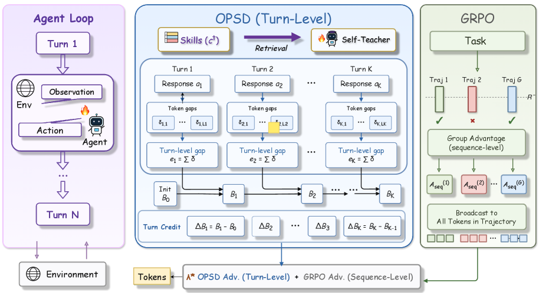
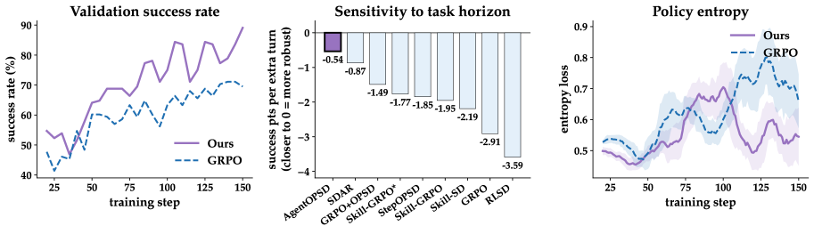
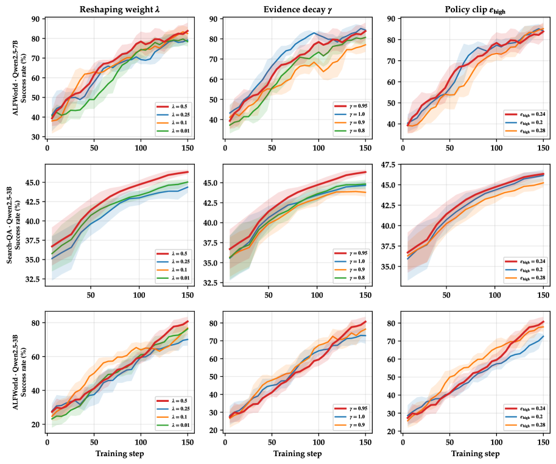

> **论文**：AgentOPSD: Recursive Self-Distillation for Agentic Reinforcement Learning
> **作者**：Zi-Han Wang, Zhengxi Lu, Zhiyuan Yao, Jinyang Wu, Jie Wu, Zhengzhou Cai, Yueqing Sun, Ziang Ye, Linji Hao, Qi Gu, Xunliang Cai, Yongliang Shen, Yujiu Yang（清华大学深圳国际研究生院 SIGS 等）
> **arXiv ID**：2608.05987
> **发表时间**：2026-08-06
> **许可协议**：Apache-2.0
> **代码仓库**：https://github.com/ZethWang/AgentOPSD

## 第 1 章 概述

### 1.1 一句话定位

AgentOPSD 是一种 critic-free 的递归 turn-level 信用分配方法——将 token 级 teacher-student log-prob gap 聚合为 turn 级贝叶斯证据，在 log-odds 空间递归更新成功信念，用边际信念修正量 $\Delta B_k$ 识别 long-horizon agentic RL 中的 pivotal decisions，并将重塑后的 advantage 注入标准 PPO/GRPO 损失，无需额外 rollout 或 learned value function。

### 论文图表总览

| 图/表 | 内容 | 报告落点 |
|-------|------|---------|
| Figure 1 | (a) 三环境主结果总览；(b) ALFWorld 7B 长时程回归（success points lost per additional turn） | 第 5 章 |
| Figure 2 | AgentOPSD 方法框架图（贝叶斯信念递归更新 + 有界优势重塑全流程） | 第 3 章 |
| Figure 3 | 超参敏感性（$\lambda$、$\gamma$、$\epsilon_{\text{high}}$ 三条曲线） | 第 5 章 |
| Table 1 | 主结果对比（Qwen2.5-3B/7B × ALFWorld / Search-QA / WebShop） | 第 5 章 |
| Table 2 | 机制消融（ALFWorld 7B，5 个变体） | 第 5 章 |

### 1.2 核心贡献

1. **形式化 turn-level credit**：将回合级信用定义为每个 turn 对 trajectory success belief 的边际修正量 $\Delta B_k$。通过 log-odds 空间的递归贝叶斯更新，证明 isolated self-distillation gap $e_k$ 本身不是 sequential credit——只有信念状态的边际变化才反映回合对最终结果的真实贡献。

2. **提出 AgentOPSD 方法**：聚合 token 级 teacher-student log-prob gap 为环境对齐的 turn 级证据 $e_k$，经折扣累加器 $c_k$ 在 log-odds 空间递归传播为 trajectory-success belief $B_k$，输出有界 advantage $\tilde{A}_k$ 注入标准策略损失。整个流程无需额外 rollout 或 learned critic，仅需一次 teacher forward pass。

3. **系统实验验证**：在 ALFWorld、Search-QA、WebShop 三个交互环境、Qwen2.5-3B/7B 两个模型规模上，一致优于 GRPO 及 OPSD / RLSD / SDAR / StepOPSD 等自蒸馏基线。消融实验确认 turn-boundary aggregation 与 recursive belief revision 的互补收益。

### 1.3 关键结果速览

**Qwen2.5-7B-Instruct**：ALFWorld success rate $89.1\%$，Search-QA average $49.2\%$，WebShop Score $90.2\%$ / Acc $79.7\%$。

**Qwen2.5-3B-Instruct**：ALFWorld $84.4\%$，Search-QA $46.7\%$，WebShop Score $90.4\%$ / Acc $69.5\%$。

长时程稳健性：ALFWorld 7B 上每增加一个 turn 的 success points 损失，AgentOPSD 仅 $-0.54$ points/turn，远低于 GRPO 的 $-2.91$ points/turn 和 RLSD 的 $-3.59$ points/turn。

## 第 2 章 研究背景与动机

### 2.1 GRPO 的均匀广播问题

在 long-horizon multi-turn agentic RL 中，GRPO 以 verifiable reward 构造 trajectory-level advantage：

$$A_{\text{seq}}(i) = \frac{R(i) - \bar{R}}{\hat{\sigma}_R + \epsilon_0}, \quad \bar{R} = \frac{1}{G}\sum_{j=1}^{G} R(j)$$

该 advantage 对轨迹内所有 token、所有 turn **均匀广播**（uniform broadcast）。无论某个 turn 是改变成败走向的 pivotal decision，还是可被其他 action 替代的 routine action，获得的 advantage 信号完全相同。Credit 被稀释到大量 routine token 上，pivotal decisions 的梯度信号被淹没。

### 2.2 自蒸馏基线的局部信号局限

现有 privileged self-distillation 方法试图提供更稠密的监督信号，但均存在局部性局限：

- **OPSD**：在 token 级计算 teacher-student log-prob gap，信号稠密但与 turn 边界不对齐——同一 turn 内不同 token 获得的 gap 无法表达该 turn 作为整体对最终结果的贡献。
- **RLSD**：基于 token 级 gap 的 RL + self-distillation 混合，仍局限于局部信号。
- **SDAR**：将 skill-conditioned 自蒸馏与 RL 结合，信号更强但仍为局部 token/turn 级 gap。
- **StepOPSD**：提升到 step（turn）级，但每个 step 的信号**孤立计算**（isolated），不考虑前序 turn 已积累的信念变化——一个本身证据微弱但翻转了成功概率的 turn 会被低估。

这些方法的共同问题是：局部 self-distillation gap $e_k$ 本身不是 sequential credit。一个 turn 的实际贡献取决于它在当前信念状态下对成功概率的**边际修正**，而非孤立证据的绝对大小。

### 2.3 核心洞见：信用 = 信念修正量

论文的核心洞见：

> Turn-level credit 应取决于该 turn 对 trajectory success belief 的边际修正量 $\Delta B_k$，而非局部 self-distillation gap $e_k$。

如果一个 turn 的证据 $e_k$ 在当前信念 $B_{k-1}$ 已经很高或很低时几乎不改变成功概率（$\Delta B_k \approx 0$），即使 $e_k$ 本身较大，也不应获得高信用。反之，在信念接近不确定（$B_{k-1} \approx 0.5$）时，同样的证据能显著翻转成功概率，应获得高信用。这一洞见将信用分配从"局部信号绝对值"转向"信念状态的边际变化"，为递归信念更新提供了理论动机。

## 第 3 章 AgentOPSD 方法



*图 2：AgentOPSD 全流程——token 级 teacher-student gap 聚合为 turn 级证据 $e_k$，经递归贝叶斯信念更新产生边际修正 $\Delta B_k$，与 trajectory advantage 符号对齐后做有界重塑，注入标准 PPO 损失。*

### 3.1 问题设定

考虑一个 $K$-turn agentic episode $\tau = (s_1, a_1, o_1, \ldots, s_K, a_K, o_K)$，其中 $s_k$ 为第 $k$ 回合的状态（含历史观测），$a_k$ 为模型生成的 action（token 序列），$o_k$ 为环境返回的观测。轨迹获得二元结果奖励 $R(\tau) \in \{0, 1\}$。

GRPO 以组大小 $G$ 采样 $G$ 条轨迹，按 Eq.2 计算 trajectory-level advantage $A_{\text{seq}}(i)$（见 2.1 节）。AgentOPSD 的目标是在不改变采样流程的前提下，将 $A_{\text{seq}}$ 重塑为 turn 级 advantage $\tilde{A}_k$，使 pivotal turns 获得更大权重。

### 3.2 贝叶斯证据构建

**理想 Bayes factor（Eq.3）**：设 $C$ 为轨迹最终成功的事件，理想的 turn 级证据应为 action 对成功概率的 log-odds 修正：

$$\text{logit}\, p(C \mid s_k, a_k) - \text{logit}\, p(C \mid s_k) = \log \frac{p(a_k \mid s_k, C)}{p(a_k \mid s_k, \neg C)}$$

这一 Bayes factor 在理论上是完美的 turn 证据，但计算需要知道成功/失败条件下的 action 分布，实际中不可得。

**Self-teacher contrast 近似（Eq.4–6）**：AgentOPSD 用 privileged self-distillation gap 作为可计算的近似。设 $c^+$ 为从训练期 SkillBank 按关键词匹配检索的 skill（仅训练时使用，推理时移除），构造 teacher 和 student 输入：

$$h_{k,t} = (s_k,\\, y_{k,<t}), \\quad h_{k,t}^+ = (s_k,\\, c^+,\\, y_{k,<t})$$

其中 $y_k$ 为 action $a_k$ 的 token 序列。Token 级 teacher-student log-prob gap 定义为：

$$\delta_{k,t} = \log \pi_\theta(y_{k,t} \mid h_{k,t}^+) - \log \pi_\theta(y_{k,t} \mid h_{k,t})$$

对同一 turn 内所有 token 求和，得到 turn 级证据：

$$e_k = \sum_t \delta_{k,t} = \log \frac{\pi_\theta(a_k \mid s_k, c^+)}{\pi_\theta(a_k \mid s_k)}$$

$e_k > 0$ 表示该 action 在 skill 引导下更可能被采取，即与成功路径更一致。$e_k$ 仅需一次额外的 teacher forward pass（skill-conditioned 前向），无需额外 rollout。

### 3.3 递归信念更新

Turn 级证据 $e_k$ 本身不区分 pivotal 与 routine decisions——论文通过递归贝叶斯信念更新将其转化为边际修正量。

**经验先验与递归更新（Eq.8）**：以组内成功率作为先验信念，在 log-odds 空间递归累积证据：

$$B_0 = \text{clip}(\bar{R},\, \epsilon_0,\, 1 - \epsilon_0), \quad c_0 = 0$$

$$c_k = \gamma \cdot c_{k-1} + e_k$$

$$\ell_k = \text{logit}(B_0) + c_k = \text{logit}(B_0) + \sum_{j=1}^{k} \gamma^{k-j} \cdot e_j$$

$$B_k = \sigma(\ell_k)$$

其中 $\bar{R} = S / G$（$S$ 为组内成功数），$\epsilon_0 = 10^{-4}$，$\gamma \in (0, 1]$ 为折扣因子（默认 $\gamma = 0.95$），$\sigma$ 为 sigmoid。$B_k$ 表示在观察到前 $k$ 个 turn 的证据后对轨迹最终成功的后验信念。命题 7 证明 $B_0 = \text{clip}(S/G)$ 是成功率 $\theta_x$ 的极大似然估计（MLE）。

**边际信念修正（Eq.9）**：第 $k$ 个 turn 对信念的边际修正为：

$$\Delta B_k = B_k - B_{k-1} \approx B_{k-1}(1 - B_{k-1})\left(e_k - (1-\gamma) \cdot c_{k-1}\right)$$

当 $\gamma = 1$ 时简化为：

$$\Delta B_k \approx B_{k-1}(1 - B_{k-1}) \cdot e_k$$

关键性质在于 gate 因子 $B_{k-1}(1 - B_{k-1})$：在 $B_{k-1} = 0.5$ 时取最大值，在 $B \to 0$ 或 $B \to 1$ 时趋于零（命题 4，First-Order）。这意味着信念高度确定时单个 turn 的证据几乎不产生信用修正；信念不确定时同样的证据产生最大信用。命题 5（Exact Budget）给出精确预算：$\sum_{k=1}^{K} \Delta B_k = B_K - B_0$，即所有 turn 的边际修正之和恰好等于信念的总变化量。

### 3.4 有界优势重塑

**Outcome-aligned credit（Eq.10）**：将边际修正与轨迹级 advantage 的符号对齐：

$$q_k = \text{sign}(A_{\text{seq}}) \cdot \Delta B_k$$

$A_{\text{seq}} > 0$（成功轨迹）时，$q_k$ 与 $\Delta B_k$ 同号，提高成功信念的 turn 获得正信用；$A_{\text{seq}} < 0$（失败轨迹）时符号翻转，降低成功信念的 turn（即"本可成功但走错"的 turn）获得正信用。

**有界乘子（Eq.11）**：将 $q_k$ 轨迹内标准化并 clip 为有界乘子：

$$z_k = \frac{q_k - \mu_q}{\sigma_q + \epsilon_0}, \quad w_k = \text{clip}(1 + b \cdot z_k,\, 1-b,\, 1+b)$$

$$\tilde{A}_k = A_{\text{seq}} \left[(1-\lambda) + \lambda \cdot w_k\right]$$

其中 $\mu_q$、$\sigma_q$ 为轨迹内 $q_k$ 的均值和标准差，$b \in (0, 1)$（默认 $b = 0.2$），$\lambda \in [0, 1]$（默认 $\lambda = 0.5$）。

命题 1（Boundedness）保证 $|\tilde{A}_k - A_{\text{seq}}| \leq \lambda b\, |A_{\text{seq}}|$，即重塑后的 advantage 始终在原始 advantage 的 $(1 \pm \lambda b)$ 倍范围内。命题 2（Sign Preservation）保证 $\text{sign}(\tilde{A}_k) = \text{sign}(A_{\text{seq}})$，不会翻转优化方向。

**PPO 风格损失（Eq.12）**：

$$\mathcal{L} = -\frac{1}{G} \sum_i \frac{1}{\sum_t M_{i,t}} \sum_t M_{i,t} \min\!\left(r_{i,t} \cdot \tilde{A}_{\kappa(t)},\; \text{clip}(r_{i,t},\, 1-\epsilon,\, 1+\epsilon) \cdot \tilde{A}_{\kappa(t)}\right) + \beta \cdot \mathcal{L}_{KL}$$

其中 $r_{i,t}$ 为重要性比，$M_{i,t}$ 为 token mask，$\kappa(t)$ 将 token 索引映射到所属 turn。$\tilde{A}_{\kappa(t)}$ 在同一 turn 内对所有 token 共享，无单独的蒸馏损失项。

### 3.5 与 GRPO 的兼容性

AgentOPSD 与标准 GRPO 完全兼容，体现在三个方面：

1. **$\lambda = 0$ 精确恢复 GRPO**：当 $\lambda = 0$ 时，$\tilde{A}_k = A_{\text{seq}} \cdot (1 - 0) = A_{\text{seq}}$，梯度完全退化为 GRPO 梯度（命题 3，Recovery of GRPO）。
2. **无 critic**：信念状态 $B_k$ 由闭式递归计算，不引入 learned value function，无需训练额外的价值网络。
3. **无额外 rollout**：teacher forward pass 仅在已采样的轨迹上进行一次 skill-conditioned 前向传播，不增加任何环境交互成本。

训练开销仅为单次额外 teacher forward pass，相比 VinePPO 的蒙特卡洛树搜索或 RUDDER 的 return decomposition 网络，成本显著更低。

## 第 4 章 相关工作

### 4.1 Verifiable-reward agentic post-training

以 GRPO 为代表的 group-relative RL 方法将二元 verifiable reward 转化为 trajectory-level advantage，在数学推理和代码生成中效果显著。在 agentic 设定下，多回合交互要求 advantage 在 turn 级而非 trajectory 级分配。GiGPO 等方法从环境奖励侧改进 reward shaping，AgentOPSD 则从内部信用结构入手——保持 reward 信号不变，仅重塑 advantage 的 turn 级分配权重。

### 4.2 OPSD 家族

OPSD 家族通过 privileged self-distillation 提供稠密 token/step 级监督，包括 OPSD（token 级 gap）、GRPO+OPSD（token 级 gap 注入 GRPO）、Skill-SD（skill-conditioned 蒸馏）、RLSD（token 级 gap + RL）、SDAR（skill-conditioned RL + 蒸馏）、StepOPSD（step 级孤立信号）。这些方法的共同局限在于局部信号与 sequential credit 的错位。AgentOPSD 的区别在于将局部证据 $e_k$ 通过递归信念传播转化为全局感知的边际修正 $\Delta B_k$。

### 4.3 长时程信用分配

长时程信用分配的经典方法各有成本权衡：

- **PPO / GAE**：依赖 learned value function 和 critic 网络，训练和推理开销大，且 critic 在 long-horizon 设定下方差高。
- **RUDDER**：通过 return decomposition 网络将最终奖励分配到各时间步，需要训练额外的 decomposition 模型。
- **VinePPO**：用蒙特卡洛树搜索估计每个决策点的 value，计算成本极高（每个决策点需要多次 rollout）。
- **AgentOPSD**：仅需一次额外 teacher forward pass（skill-conditioned 前向传播），计算成本与一次标准前向传播相当，无需额外环境交互或训练辅助网络。

## 第 5 章 实验结果与分析

### 5.1 实验设置

AgentOPSD 在三个交互式智能体环境中评估，覆盖具身家居推理、网页导航与检索增强问答三类任务：

- **ALFWorld**（Shridhar et al., 2020）：文本具身环境，包含 6 类家庭任务——Pick and Place（Pick）、Look at Object in Light（Look）、Pick Clean then Place（Clean）、Pick Heat then Place（Heat）、Pick Cool then Place（Cool）、Pick Two and Place（Pick2）。报告整体成功率（六个类别的样本加权平均）。
- **WebShop**（Yao et al., 2022）：在线购物交互环境，采用 Feng et al.（2025）的 128 个固定验证任务；报告归一化完成 Score（部分约束满足的平均值，缩放至 100）与精确完成率 Succ.（满足全部规格要求的 episode 占比）。
- **Search-QA**：遵循 Search-R1（Jin et al., 2025）设定，覆盖 7 个数据集——单跳 NQ、TriviaQA、PopQA，多跳 HotpotQA、2Wiki、MuSiQue、Bamboogle；其中 NQ 与 HotpotQA 为域内数据，其余 held out；检索使用 E5 嵌入。

模型规模为 Qwen2.5-3B-Instruct 与 Qwen2.5-7B-Instruct，训练于 8×H800 GPU。训练期间使用的特权 skill 从 SkillRL 的 SkillBank（Xia et al., 2026）按关键词匹配检索，仅训练阶段使用；推理时不使用任何外部 skill。信念先验 B0 设为每个 GRPO 组内成功轨迹的占比（即标准组均值 R̄）。其余优化设置与 SDAR 基线共享。

**基线分组**（全部共享相同 backbone、环境接口、数据与训练预算）：

| 分组 | 基线 | 说明 |
|------|------|------|
| 训练-free | Vanilla、Skill-Prompt\* | 无参数更新；Skill-Prompt\* 在推理时前置检索 skill |
| Group-relative RL | GRPO、Skill-GRPO、Skill-GRPO\* | GRPO 族；Skill-GRPO 训练注入 skill 推理去除，\* 表示推理保留 skill |
| Self-distillation RL | OPSD、GRPO+OPSD、Skill-SD、RLSD、SDAR、StepOPSD | 均使用 teacher–student gap，但以 gate/magnitude/auxiliary loss 方式注入 |

其中 SDAR（Lu et al., 2026b）在 GRPO 之上添加独立门控辅助自蒸馏损失，保持原 GRPO advantage 不变；StepOPSD（Zhang et al., 2026）在 turn（step）级应用 teacher–student 信号，但每个 step 的局部信号被孤立使用——这正是 AgentOPSD 与它的核心区别所在。

### 5.2 主结果

Table 1 为两个模型规模在三个环境上的完整对比（单位 %）。

**Qwen2.5-3B-Instruct 主结果（%）**

| 方法 | ALFWorld Avg | Search-QA Avg | WebShop Score | WebShop Succ. |
|------|:---:|:---:|:---:|:---:|
| Vanilla | 21.9 | 31.7 | 6.7 | 0.8 |
| Skill-Prompt\* | 28.9 | 23.9 | 0.2 | 0.8 |
| OPSD | 28.1 | 0.0 | 11.3 | 3.1 |
| GRPO | 75.0 | 36.4 | 79.8 | 63.3 |
| Skill-GRPO | 60.2 | 34.1 | 77.3 | 60.9 |
| Skill-GRPO\* | 80.5 | 36.1 | 76.3 | 66.4 |
| GRPO+OPSD | 81.2 | 44.6 | 77.8 | 66.4 |
| Skill-SD | 73.4 | 44.1 | 75.9 | 64.0 |
| RLSD | 79.7 | 43.8 | 84.4 | 66.4 |
| SDAR | 84.4 | 43.4 | 85.0 | 68.0 |
| StepOPSD | 73.4 | 43.7 | 82.4 | 66.4 |
| **AgentOPSD** | **84.4** | **46.7** | **90.4** | **69.5** |

**Qwen2.5-7B-Instruct 主结果（%）**

| 方法 | ALFWorld Avg | Search-QA Avg | WebShop Score | WebShop Succ. |
|------|:---:|:---:|:---:|:---:|
| Vanilla | 12.5 | 33.9 | 5.9 | 1.6 |
| Skill-Prompt\* | 23.4 | 36.4 | 1.7 | 0.8 |
| OPSD | 32.8 | 6.2 | 4.5 | 2.3 |
| GRPO | 81.2 | 42.0 | 80.9 | 72.6 |
| Skill-GRPO | 69.5 | 40.3 | 80.4 | 71.9 |
| Skill-GRPO\* | 88.3 | 47.5 | 87.0 | 81.2 |
| GRPO+OPSD | 80.4 | 47.0 | 86.8 | 76.5 |
| Skill-SD | 85.1 | 47.8 | 86.1 | 76.5 |
| RLSD | 82.0 | 49.0 | 87.4 | 77.3 |
| SDAR | 85.9 | 49.0 | 89.4 | 82.8 |
| StepOPSD | 88.4 | 48.2 | 87.2 | 78.1 |
| **AgentOPSD** | **89.1** | **49.2** | **90.2** | **79.7** |

**核心结论一：收益来自信用构造而非特权访问。** 在统一设定下，AgentOPSD 与特权基线使用相同的检索 skill，差异仅在 skill 引发的 teacher–student 差异如何进入学习。AgentOPSD 在两个模型规模的 8 项聚合对比（ALFWorld Avg / Search-QA Avg / WebShop Score / WebShop Succ. × 2 规模）上全部优于 GRPO+OPSD、Skill-SD 与 RLSD，并在 8 项中超过 SDAR 6 项（3B ALFWorld 与 SDAR 并列 84.4，7B WebShop Succ. 落后 SDAR 的 82.8）。这一受控信息对比隔离出 AgentOPSD 的收益来源：局部 teacher-student gap 本身不是可靠信用信号，将其累积为信念状态并按信念修正分配信用，能更有效地识别改变预测结果的回合。

**核心结论二：优势随交互视界增长。** Figure 1(b) 对 ALFWorld（Qwen2.5-7B）各子任务成功率随成功 episode 平均回合数的增加做回归，报告每增加一个回合损失的成功率点数：

| 方法 | 每回合损失的成功率（pp） |
|------|:---:|
| RLSD | −3.59 |
| GRPO | −2.91 |
| **AgentOPSD** | **−0.54** |

均匀信用方法退化最快（RLSD −3.59、GRPO −2.91 点/回合），AgentOPSD 最平缓（−0.54）。这与回合级信用的动机一致：轨迹越长，单一广播 advantage 需要覆盖的决策越多，历史依赖的信念修正帮助越大。



*图1：AgentOPSD 与基线在三个环境上的成功/准确率对比（a），以及 ALFWorld 上成功率随任务回合数增长的退化回归（b）——AgentOPSD 斜率最平缓，验证回合级信用在长视界任务中的价值。*

### 5.3 机制消融

Table 2 在 ALFWorld + Qwen2.5-7B 上逐一移除/替换 AgentOPSD 的单个组件（完整方法成功率 89.1%）：

| 组件 | 消融变体 | ALFWorld 成功率（%） |
|------|---------|:---:|
| AgentOPSD（完整） | turn 级、有界、λ=0.5 | **89.1** |
| Turn 级粒度 | 改为 per-token 累积 | 85.9 |
| 递归信念修正（Eq.8） | 用原始局部 gap ek 替代 ΔBk | 82.8 |
| 有符号方向（Eq.10） | 仅保留 magnitude \|ΔBk\|（丢弃结果符号） | 80.5 |
| 状态先验 B0 锚定 | 丢弃经验率初始化 | 78.9 |

**粒度与递归。** 将回合级信念追踪替换为 per-token 累积，成功率降至 85.9%：环境反馈与完整动作而非单个 token 关联，token 级累积会割裂单个决策，削弱 gap 与结果的对齐。将递归修正 ΔBk 替换为原始局部 gap ek 进一步降至 82.8%：ek 孤立地给每个回合打分，而 ΔBk 衡量该 gap 对累积历史信念状态的修正——同样的局部 gap 在结果未定时具有决定性，在累积状态已指向某结果后就变得冗余。这一受控对比直接验证了核心原则：局部 gap 不是序贯信用。

**有符号方向。** 仅保留 magnitude 并丢弃符号（对 |ΔBk| 而非有符号 qk 做标准化）使性能降至 80.5%。magnitude 能定位信念状态变化的位置，但无法判断变化是否与验证器结果一致：成功轨迹中向上修正与结果一致，失败轨迹中同样的向上修正则不一致。有符号方向显式区分了这两者，让结果一致的修正获得更多信用，矛盾的修正获得更少。

**状态先验锚定。** 移除经验先验 B0=clip(R̄, ε0, 1−ε0) 使成功率降至 78.9%。组成功率 R̄ 在轨迹特定 gap 累积之前提供验证器锚定的任务难度估计；同时 B0 决定初始 log-odds，从而决定 B(1−B) 门的操作区间。无此锚定时轨迹从任意不确定性水平出发，会错误缩放早期信念修正，扭曲哪些早期回合看似关键。消融分离了三个角色：信念修正定位信用、有符号方向将其与最终结果对齐、先验锚定稳定其参考点。

### 5.4 超参数敏感性

在完整设定（λ=0.5, γ=0.95, ϵhigh=0.24）下一次扫一个旋钮，覆盖三种配置：长视界 ALFWorld Qwen2.5-7B（89.1%）、ALFWorld Qwen2.5-3B（84.4%）、短视界 Search-QA Qwen2.5-3B（46.7%）。

**重塑权重 λ**（λ∈{0.5, 0.25, 0.1, 0.01}，插值于纯 GRPO λ=0 与完全信念重塑之间）：这是效应最清晰的旋钮。λ=0.5 最佳，更小值均降低性能——ALFWorld 7B 89.1 vs 84.4/85.9/83.6，Search 46.7 vs 45.1/40.2/45.4——与更小 λ 降低有界乘子权重、丢弃回合级信用一致。全部主结果使用 λ=0.5。

**证据衰减 γ**（γ∈{1.0, 0.95, 0.9, 0.8}）：结果在几个点内移动（ALFWorld 7B 87.5/82.0/85.2；Search 45.1/44.5/45.5），无单调趋势，说明递归对旧证据的折扣速度不敏感。主结果用温和的 γ=0.95。

**策略裁剪 ϵhigh**（固定 ϵlow=0.2，变化 ϵhigh∈{0.2, 0.24, 0.28}，clip-higher）：AgentOPSD 基本不受影响（ALFWorld 7B 在 0.2 与 0.28 均为 88.3；Search 46.9 与 45.7），说明重塑目标继承了 GRPO 的 trust-region 鲁棒性。

总体而言只有 λ 产生系统性效应；且所有旋钮的散布在四回合的 Search-QA 任务上急剧收窄——在长视界 ALFWorld 上重要的设置在历史积累很少时基本无效，这再次与「方法作用于需要长视界信用分配之处」一致。



*图3：λ、γ、ϵhigh 三个超参数的敏感性曲线——λ 是唯一产生系统性效应的旋钮，γ 与 ϵhigh 的散布在长视界任务上很小，在短视界 Search-QA 上进一步收窄。*
## 第 6 章 代码实现详解

### 6.1 官方代码状态

AgentOPSD 的官方仓库为 https://github.com/ZethWang/AgentOPSD（Apache-2.0 许可）。截至精读时（2026-08-08），仓库 README 明确标注：

> 🚧 **Code coming soon.** The full training code and scripts will be released here shortly. Star / watch this repo to get notified.

仓库仅包含 `.gitignore`、`LICENSE`、`README.md` 三个文件（12 stars, 1 fork），**尚未发布实际训练代码**。因此本章基于论文正文与附录的算法描述，给出 AgentOPSD 相对 GRPO 的核心实现逻辑。

### 6.2 核心算法：单次训练迭代

AgentOPSD 在 GRPO 之上仅增加两步：(1) 每个回合一次 teacher forward pass 计算 self-teacher 对比；(2) 逐回合的信念重塑块（元素级运算）。其余均为标准 group-relative 更新。

```
Algorithm 1: AgentOPSD 单次训练迭代（turn 级粒度）
输入: 任务 x, 初始观测 o0, 当前策略 πθ, 训练期 skill 检索器
1.  采样 G 条轨迹: 对每条轨迹 i，逐回合 k 执行:
2.    ak ~ πθ(·|sk)                        # 回合动作采样
3.    δk,t = log πθ(yk,t|sk, c+, yk,<t) − log πθ(yk,t|sk, yk,<t)   # Eq.5 teacher 分支 vs student 分支
4.    ek = Σ_t δk,t                        # Eq.6 回合级证据（token gap 聚合）
5.  计算组统计: R̄ = S/G, σ̂R                 # 组成功率与标准差
6.  A_seq(i) = (R(i) − R̄)/(σ̂R + ε0)        # Eq.2 GRPO 序列级 advantage
7.  for 每条轨迹 i:
8.    B0 = clip(R̄, ε0, 1−ε0), c0 = 0       # Eq.8 信念先验 = 组成功率
9.    for 回合 k = 1..Ki:
10.     ck = γ·ck−1 + ek                    # 衰减证据累积器
11.     ℓk = logit(B0) + ck                 # log-odds 空间信念
12.     Bk = σ(ℓk)                          # sigmoid 还原概率
13.     ΔBk = Bk − Bk−1                     # Eq.9 边际信念修正
14.     qk = sign(A_seq(i)) · ΔBk           # Eq.10 结果对齐信用
15.   μq, σq = 轨迹内 q 的均值/标准差
16.   for 回合 k:
17.     zk = (qk − μq)/(σq + ε0)            # Eq.11 轨迹内标准化
18.     wk = clip(1 + b·zk, 1−b, 1+b)       # 有界乘子
19.     Ãk = A_seq(i)[(1−λ) + λ·wk]         # 重塑 advantage（token 继承所属回合的 Ã）
20.  优化: L = −(1/G)Σ_i (1/Σ_t M_i,t) Σ_t M_i,t·min(r_i,t·Ãκ(t), clip(r_i,t,1−ε,1+ε)·Ãκ(t)) + β·L_KL   # Eq.12
```

**关键实现要点：**

1. **teacher 分支与 student 分支共享参数 θ**（self-distillation）：teacher 分支的上下文为 `(sk, c+, yk,<t)`，student 分支为 `(sk, yk,<t)`，c+ 为训练期检索的 skill。teacher 输出 detached（不参与梯度），仅作为证据信号。
2. **无额外 rollout、无 critic**：信念重塑块是元素级运算（clip/σ/logit），不增加任何可学习参数；相对 GRPO 的开销仅为每轨迹一次 teacher forward pass。
3. **与 GRPO 的兼容性**：λ=0 时 Ãk=A(i) 恒成立，AgentOPSD 梯度退化为 GRPO 梯度（Proposition 3）。由于重塑乘子 (1−λ)+λwk ≥ 1−λb > 0 恒正，符号永不反转（Proposition 2），且 |Ãk−A(i)| ≤ λb|A(i)|（Proposition 1），重塑是有界、保号、可逆的。
4. **Token 级变体**（消融用）：将回合级递归替换为对扁平 token 序列的同一递归——直接累积 δt、对轨迹 token 标准化 ΔBt、按 token 分配 Ãt。

### 6.3 超参数配置

论文在全部环境与模型规模上使用**单一共享配置**（不逐任务调参）：

| 超参数 | 值 | 说明 |
|--------|:---:|------|
| 学习率 η | 1e-6 | 共享 |
| Rollout group size G | 8 | 共享 |
| PPO clip ϵlow / ϵhigh | 0.2 / 0.24 | clip-higher（DAPO） |
| KL 系数 αKL | 0.01 | 共享 |
| 重塑权重 λ | 0.5 | 共享 |
| 乘子带宽 b | 0.2 | 共享 |
| 证据衰减 γ | 0.95 | 共享 |
| skill 检索策略（SRS） | KM（关键词匹配） | 训练期 SkillBank 检索 |
| dual-clip 常数 c | 3.0 | 共享 |
| 梯度裁剪 | 1.0 | 共享 |
| 熵系数 | 0.001 | 共享 |
| PPO epoch / update | 1 | 共享 |
| 并行 | FSDP 单节点 | 8×H800 |

环境特定配置：

| 配置 | ALFWorld | WebShop | Search-QA |
|------|:---:|:---:|:---:|
| 训练步数 | 150 | 150 | 150 |
| 训练 batch size | 16 | 16 | 128 |
| Max prompt length | 2048 | 4096 | 4096 |
| Max response length | 512 | 512 | 512 |
| Max interaction turns | 50 | 15 | 4 |
| Rollout temperature（训练/验证） | 1.0 / 0.4 | 1.0 / 0.4 | 1.0 / 0.4 |
| GPUs（tensor-parallel） | 8 (2) | 2 (2) | 4 (1) |

### 6.4 生态关联

AgentOPSD 所属的自蒸馏智能体 RL 生态已有多个开源实现可参照：

- **SDAR**（github.com/ZJU-REAL/SDAR）：AgentOPSD 的主要对比基线之一，是首个统一 Agentic RL 与 OP(S)D 的开源框架，提供 GRPO、Skill-GRPO、OPSD、GRPO+OPSD、Skill-SD、RLSD 的复现代码，并支撑了后续多个工作。
- **SkillRL**（Xia et al., 2026）：提供 AgentOPSD 训练期使用的 SkillBank（技能库与检索机制）。
- **OPID / HINT-SD / TCOD**：同属 OPSD 家族，分别探索层级 skill 路由、失败导向的 hindsight 蒸馏与时序课程。

AgentOPSD 的贡献点（信念修正替代局部 gap）可直接叠加在上述任一 OPSD 框架的 advantage 重塑模块上，实现成本低。
## 第 7 章 局限性与延伸阅读

### 7.1 局限性

1. **环境覆盖有限**：仅在 ALFWorld、WebShop、Search-QA 三个环境上评估，未覆盖工具使用、代码执行、多模态交互等更复杂的 agentic 场景。

2. **Skill 检索依赖**：方法依赖从 SkillRL SkillBank 按关键词匹配检索 skill $c^+$ 作为 teacher 信号。检索质量直接影响证据 $e_k$ 的可靠性，且仅适用于有可用 skill 库的领域。

3. **WebShop 7B Acc 未超 SDAR**：在 WebShop 精确完成率（Acc）上，7B 模型 AgentOPSD 为 $79.7\%$，低于 SDAR 的 $82.8\%$。论文未对此 gap 做深入分析。

4. **近似假设**：理论分析依赖两个近似——(A1) $e_k$ 近似为 Bayes factor，仅在 skill 与成功路径弱相关时严格成立；A.1 节证明在 $\rho_k \to 0$ 时 $e_k$ 收敛为 pointwise mutual information，$\text{sign}(e_k) = \text{sign}(B_k)$，但一般情形下存在偏差。(A2) 递归信念更新的线性叠加假设。命题 6（Non-Identifiability）指出相同 return 的两条轨迹可有不同的 per-turn 贡献分布，信念修正量是合理的代理但非唯一解。

### 7.2 延伸方向

- 扩展到更多 agentic 环境（工具调用、代码生成、多模态交互），验证递归信念更新框架的泛化性。
- 探索无 skill 依赖的证据构建方式（如使用更强的 teacher 模型或对比学习信号替代 skill-conditioned gap）。
- 结合 value-based 方法（如以 learned critic 估计的 $B_0$ 替代组内成功率先验），探索混合信用分配方案。
- 分析信念轨迹 $B_0 \to B_K$ 的动态与人类可解释的决策重要性排序之间的关系。
