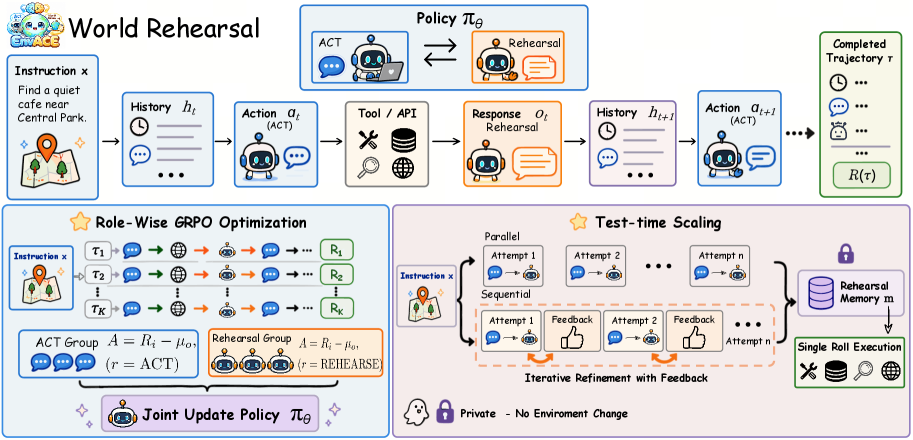
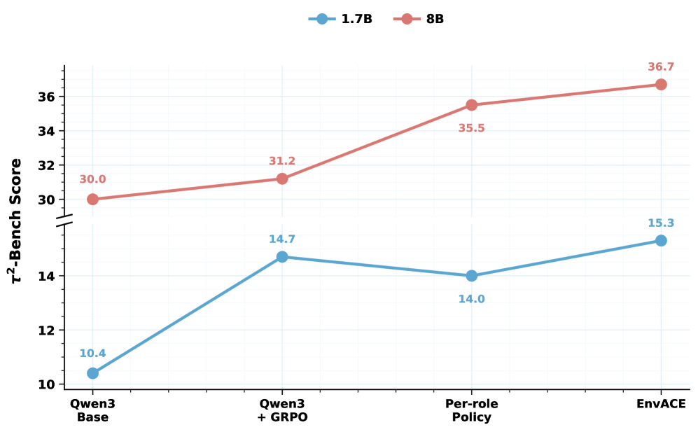
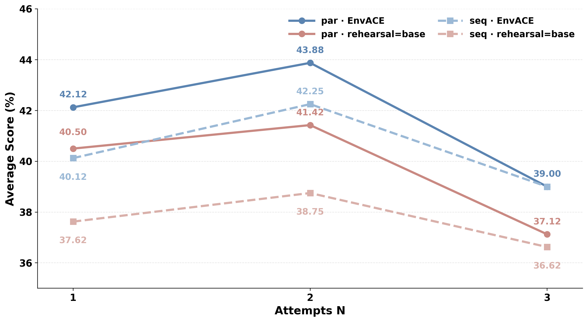
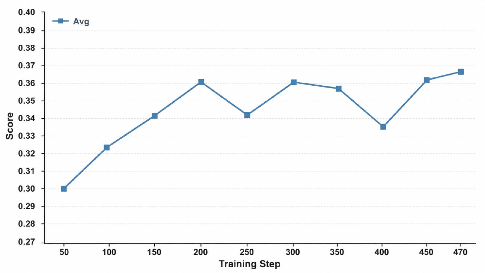

> **论文**：EnvACE: Internalizing Environment Dynamics via World Rehearsal for Agentic Reinforcement Learning
> **作者**：Zishan Xu (SJTU), Zhiyuan Yao (ZJU) 等 12 人（Tencent/SJTU/ZJU/NUS 等）
> **arXiv ID**：2608.06197
> **发表时间**：2026-08-06
> **许可协议**：Apache 2.0
> **代码仓库**：https://github.com/Within-yao/EnvACE

---

## 第 1 章 概述

### 1.1 一句话定位

EnvACE 是一种面向 agentic reinforcement learning 的训练范式：它让策略模型本身在训练时交替扮演「行动者（act）」和「环境（rehearse）」两个角色，通过 **world rehearsal（世界预演）** 把环境动态内化进模型参数，从而在训练阶段彻底摆脱对外部可执行环境的依赖，并在测试时支持基于内部化世界模型的 private rehearsal（私下预演）以获得额外的性能增益。

这一思路的本质，是将传统 agentic RL 中「策略 ↔ 外部环境」的交互闭环，改造为「策略 ↔ 自身参数化的世界模型」的自循环闭环。策略不再向环境发问，而是向自己发问——先做出一个 tool call，再扮演环境给出这个 tool call 应当诱导的 response，然后把这个自己生成的 response 作为后续决策的上下文。整个 act-rehearse 循环由任务成功奖励端到端联合优化。最终产物是一个既懂「该做什么」又懂「做完之后会发生什么」的 agent world model。

*图 1：三种 rollout 范式的对比——左为真实环境交互，中为外部模拟器（LLM 或程序化 simulator），右为 EnvACE 的 world rehearsal，环境角色由策略自身承担，无需任何外部环境调用。*

理解 EnvACE 的定位，需要先理解它所针对的核心矛盾：**agent 的能力越强、应用场景越广，对环境的依赖就越深，而环境的构建成本就越高。** 这一对矛盾在 agentic RL 的发展中始终存在，但随着 agent 从单一工具调用走向多工具、多轮次、跨域的长程任务，矛盾被急剧放大。EnvACE 的贡献不是在现有环境构建方法上做增量优化，而是提出了一条从根本上绕开环境依赖的全新路径——如果环境知识可以住在模型自己的参数里，那么所有的环境构建、验证、维护成本都一笔勾销。

### 论文图表总览

| 编号 | 内容 | 所在章节 |
|------|------|----------|
| Table 1 | BFCL-v4 / τ²-Bench / VitaBench 三基准主结果及 Overall | 第 5 章 |
| Table 2 | FinMCP-Bench 金融 MCP 基准（TR / TP / TF1） | 第 5 章 |
| Table 3 | Test-Time Scaling（N=2）在 τ²-Bench 与 BFCL Multi-Turn 上的表现 | 第 5 章 |
| Figure 1 | 三种 rollout 范式对比（真实环境 / 外部模拟器 / world rehearsal） | 第 1 章 |
| Figure 2 | EnvACE 总览：act-rehearse 内化循环 + Test-Time Scaling 流程 | 第 3 章 |
| Figure 3 | τ²-Bench 消融实验（1.7B / 8B，standard GRPO vs Per-role vs EnvACE） | 第 5 章 |
| Figure 4 | 跨模型规模效应（1.7B → 8B 在 BFCL-v4 与 τ²-Bench 上的提升） | 第 5 章 |
| Figure 5 | 训练动态曲线（step 50 的 30.0% → step 470 的 36.7%） | 第 5 章 |
| Figure 6 | Test-Time Scaling 在 BFCL Multi-Turn 上的 budget 效应 | 第 5 章 |

### 1.2 核心贡献

论文明确列出三条核心贡献，三者层层递进，从「机制」到「优化」再到「推理增强」：

**贡献一：World Rehearsal 机制。** 论文提出了 world rehearsal 这一全新范式。在训练时，policy 先生成一个 tool call（act），随后切换角色，扮演环境生成该 tool call 诱导的 response（rehearse），并将这个 rehearsed response 作为后续决策的条件。通过这种方式，环境动态——即「特定 action 会引发怎样的 environment response」——被直接内化进策略的参数之中。这一机制的核心优势在于：训练过程不再需要查询任何外部环境，无论是真实的可执行环境还是外部模拟器。环境建模从 policy 外部被搬进了 policy 内部。

World rehearsal 与传统的「想象」或「思维链推理」有本质区别。传统的 chain-of-thought 是 policy 内部的单角色推理——模型在同一角色下展开思考过程。而 world rehearsal 要求 policy 在两个截然不同的角色之间切换：act 角色需要输出符合工具调用格式的 action，rehearse 角色需要输出符合环境响应格式的 observation。这两个角色的输出空间、格式约束、甚至语义逻辑都不同，但它们共享同一套参数。这种「一体双角」的设计是 world rehearsal 区别于先前所有方法的核心特征。

**贡献二：EnvACE 框架与 Role-Wise GRPO。** 基于 world rehearsal，论文构建了 EnvACE——一个使用单一共享 policy 交替执行 act 和 rehearse 双角色的完整框架。为了有效优化这种双角色策略，论文设计了 Role-Wise GRPO：在每个 prompt 的 K 条 rollout 中，分别按角色（act / rehearse）收集输出，为每个角色计算独立的 baseline（advantage 均值归零），但共享同一套模型参数进行梯度更新。这一设计既保证了双角色协同优化的信号一致性，又通过参数共享让 act 能力和 rehearse 能力相互促进。

Role-Wise GRPO 解决了一个关键的优化难题：如果直接将 act 和 rehearse 的输出混在一起计算 advantage，由于两种任务的难度和奖励分布不同，baseline 估计会产生严重偏差——较「容易」的角色（假设是 rehearse）会系统性地获得更高的奖励，从而在 advantage 归一化后压制较「难」的角色（act）的梯度信号。Role-Wise GRPO 通过按角色独立计算 baseline 来消除这一偏差，确保每个角色内部「比同角色平均水平更好」的输出才获得正 advantage。

**贡献三：Test-Time Scaling。** 训练完成后，被内化的世界模型并非「训练完就丢弃」的副产品，而是可以在推理阶段直接复用。论文提出了两种 private rehearsal 模式：parallel（N 条独立想象轨迹）和 sequential（后一条可见前序轨迹并进行评估）。N 次想象轨迹被汇总为 rehearsal memory，随后策略仅执行一次 committed execution（真正的外部工具调用）。在适度的 rehearsal budget（N=2）下，这种测试时缩放带来了进一步的性能提升，且整个预演过程不产生任何额外的外部交互。

TTS 的意义不仅仅是「免费的性能提升」。它揭示了 world rehearsal 训练带来的一个深层能力：policy 不仅学会了「怎么做」，还学会了「在做之前先想想做了会怎样」。这种预演-评估-执行的三步认知模式，与人类专家在处理复杂任务时的行为高度相似——先在脑中推演几种可能的方案及其后果，选择最优方案后再付诸行动。

### 1.3 关键结果速览

以下数字均来自论文实验章节，简要呈现 EnvACE 的核心竞争力：

- **Overall 指标（Table 1，BFCL-v4 / τ²-Bench / VitaBench 三基准算术平均）**：EnvACE-8B 达到 32.91%，在所有列出的方法中排名第一，超过 EnvScaler-8B（31.92%）、AWM-14B（32.54%）等环境扩展基线。

- **跨基准领先**：EnvACE-8B 在 BFCL-v4 Avg 达到 46.04%，τ²-Bench Avg 达到 36.7%，VitaBench Avg 达到 16.0%。其中 τ²-Bench 的 36.7% 与 ScaleEnv-8B 的 38.5% 接近（ScaleEnv 在 BFCL 上缺失），但 EnvACE 在四个基准上均有完整且均衡的强表现。

- **规模效应（5.3）**：从 1.7B 到 8B，BFCL-v4 Avg 从 31.81% 提升至 46.04%（+14.23pp），τ²-Bench Avg 从 15.3% 提升至 36.7%（+21.4pp），表明 world rehearsal 的收益随模型规模增大而放大。

- **消融增益（5.2）**：在 8B 规模下，Role-Wise GRPO 相比 standard GRPO 在 τ²-Bench 上从 31.2% 提升至 36.7%（+5.5pp）；参数共享相比 Per-role 独立参数策略从 35.5% 提升至 36.7%（+1.2pp）。

- **Test-Time Scaling（Table 3，N=2）**：parallel + EnvACE rehearsal 组合在 τ²-Bench 上从 31.4% 提升至 38.0%，Overall 从 36.7% 提升至 40.9%，显示内部化世界模型在推理阶段仍有可挖掘的性能空间。

- **金融领域迁移（Table 2）**：在 FinMCP-Bench 上，EnvACE-8B 的 TP 达到 54.04%、TF1 达到 46.78%，均为最优，验证了 world rehearsal 学到的环境动态具有跨域可迁移性。

- **训练效率**：仅需 470 步训练（batch size 16，每 step 采样 64 实例），EnvACE 即在 τ²-Bench 上从 backbone 的 30.0% 提升至 36.7%，训练开销受控。

---

## 第 2 章 研究背景与动机

### 2.1 Agentic RL 的环境依赖痛点

大语言模型 agent 的强化学习训练，其核心在于让模型学会在多轮交互中做出正确的工具调用决策。这一过程天然需要一个环境（environment）来响应 agent 的每一步 action——agent 调用了一个搜索引擎，环境返回搜索结果；agent 调用了一个 API，环境返回 API 执行结果；agent 向数据库发起查询，环境返回查询数据。没有环境的响应，agent 就无法获得「这一步 action 是否正确」的反馈信号，强化学习也就无从谈起。

然而，构建和验证一个可用于 RL 训练的环境，恰恰是当前 agentic RL 面临的最大瓶颈。论文在引言中系统性地梳理了这一痛点，可归纳为三个层面：

**第一层：真实环境的构建成本极高。** 要让 agent 在训练中学习使用某个真实工具（如某个电商平台 API、某个航班查询系统），研究人员需要：搭建完整的工具后端、实现正确的响应逻辑、处理各种边界条件与异常情况、确保工具在大量并发训练调用下的稳定性。对于一个涉及多个复杂工具的长程任务，这一工程量往往以月计。

更具体地说，真实环境构建的困难体现在以下几个方面。首先是**接口实现**：每个工具都需要一套完整的输入解析、业务逻辑处理、输出格式化代码。其次是**状态管理**：多轮交互中的环境状态（如购物车内容、订单状态）需要被正确维护。第三是**异常处理**：工具调用可能因为各种原因失败（参数错误、权限不足、服务不可用），环境需要正确模拟这些失败场景。第四是**并发与性能**：RL 训练需要大量并行 rollout，环境必须能承受高并发的工具调用而不崩溃或降速。

**第二层：合成环境的保真度难以保证。** 当真实环境不可得时，一种替代方案是人工合成环境数据——预先准备好各种 action 对应的 response。但这要求合成者对「所有可能的 action 序列」有穷尽的理解，对于开放域工具调用（如 BFCL-v4 的 Live 子集涉及大量真实在线工具）几乎不可能实现。

合成环境面临的核心困境是**组合爆炸**：一个涉及 5 个工具、每个工具有 3 种参数组合的任务，在 10 轮交互中可能产生的 action 序列数量就已经是天文数字。预先为所有可能的 action 准备 response 既不现实也不可扩展。更糟糕的是，agent 在 RL 训练中会探索到许多人类设计者未曾预料的 action——这些 action 没有对应的合成 response，环境要么返回错误信息，要么崩溃，要么返回无意义的通用回复，严重污染训练信号。

**第三层：外部模拟器的 ground 难题。** 另一种替代方案是使用 LLM 作为外部模拟器（如论文 Related Work 中提到的 Simulator、WebWorld 等），让另一个 LLM 来扮演环境。但这种方式存在根本性的 alignment 问题：模拟器 LLM 的行为分布与真实环境不一致，且模拟器本身的错误会以不可控的方式累积传播到策略学习中。更关键的是，模拟器仍是 policy 之外的一个独立实体，policy 无法从模拟器的知识中获益——一旦训练结束、撤掉模拟器，policy 就失去了对环境动态的任何记忆。

外部模拟器范式的另一个隐患是**模拟器与 policy 的能力错配**。如果模拟器 LLM 比 policy 更强（如用 GPT-4 模拟环境来训练 7B policy），训练效果可能很好但成本极高；如果模拟器与 policy 同等规模或更弱，模拟器的错误会直接成为训练噪声。这种两难使得外部模拟器方案很难找到 sweet spot。

论文的核心洞察在于：**环境建模不一定非要在 policy 之外。** 如果能让 policy 自己学会预测「我的 action 会引发怎样的 environment response」，那么这个预测能力就内化在了 policy 参数中，训练时无需外部环境，推理时也可以随时调用这个内部能力来做预演。这就是 world rehearsal 的出发点。

### 2.2 三种 Rollout 范式

论文在引言中明确对比了三种 rollout 范式，这是理解 EnvACE 定位的关键框架。这三种范式对应了 Figure 1 中的三个子图，区别在于「谁来扮演环境」以及「环境知识存储在哪里」。

**范式一：真实环境交互（Real Environment Rollout）。** 这是最直接的范式：agent 每一步的 action 被发送到真实的可执行环境，环境返回真实的 response，agent 基于真实 response 继续下一步决策。优点是 response 完全保真；缺点是环境构建成本极高、训练速度受限于环境响应延迟、且对于很多工具来说根本无法在训练期间反复调用（如涉及真实金融交易的操作）。论文中 BFCL-v4 的 Live 子集就是这种范式的典型场景。

真实环境交互虽然信号最干净，但其训练效率瓶颈极为严重。每次 rollout 都需要等待真实工具的响应（网络延迟通常在数百毫秒到数秒），一条 30 轮交互的轨迹可能需要数分钟才能完成。如果每步训练需要 64 条 rollout、每条 rollout 平均 15 轮交互，那么单步训练的环境交互等待时间就可能超过 30 分钟、470 步训练可能超过 10 天——不过这是报告者基于上述假设的粗略推算，论文本身并未报告具体的训练耗时（且这还假设环境 100% 可用、无并发限制）。

**范式二：外部模拟器交互（External Simulator Rollout）。** 为了绕开真实环境的限制，研究人员引入外部模拟器——可以是程序化的合成环境（如 EnvScaler、AWM、ScaleEnv、Agent-World、EnvFactory 等合成环境方法），也可以是 LLM-based simulator（如 Simulator、WebWorld）。agent 向模拟器发送 action，模拟器返回 response。优点是构建成本低于真实环境、可以离线训练；但关键缺陷在于：模拟器是 policy 外部的独立模块，policy 在训练时学到的是「在模拟器环境下有效」的策略，一旦模拟器被移除或替换，policy 对环境动态的理解也随之消失。模拟器的知识从未进入 policy 参数。

外部模拟器范式的根本问题可以归结为**知识不迁移**。训练期间，模拟器为 policy 提供了高质量的环境反馈，policy 据此学到了有效的决策策略。但模拟器对环境的理解——哪些 action 有效、哪些参数合法、调用后会返回什么——始终停留在模拟器内部。推理时撤掉模拟器后，policy 面对真实环境时对环境动态的预测能力退回到 backbone 的预训练水平，训练中获得的「环境经验」全部丢失。

**范式三：World Rehearsal（EnvACE 范式）。** EnvACE 彻底重构了交互闭环：不再有任何外部实体扮演环境。policy 自己生成 action（act），然后自己切换角色，扮演环境生成该 action 的 response（rehearse），再把自己的 rehearsed response 加入历史进行下一步决策。环境知识不是存储在外部模块中，而是直接编码在 policy 参数里。这意味着：

- 训练时不需要任何外部环境调用，rollout 完全在 policy 自身的 forward pass 中完成
- 训练结束后，policy 自带一个「世界模型」，推理时可以随时调用
- 不存在模拟器与真实环境的分布偏差问题——policy 学到的是自己一致的内部表征

这一范式的理论前提是：现代 LLM 已经具备了足够强的世界知识（通过预训练），world rehearsal 做的是把这些隐式知识激活并与决策过程对齐，而非从零学习环境规则。这一点在实验中得到了验证——即使是 base model 也具备一定的环境模拟能力（Table 3 中 TTS Par. Base 相比 Non-TTS 有微弱提升），但只有经过 world rehearsal 的 RL 对齐后，这种能力才足够精确到能支撑有意义的决策辅助。

三种范式的对比如下：

| 维度 | 真实环境 | 外部模拟器 | World Rehearsal |
|------|:--------:|:----------:|:---------------:|
| 环境知识位置 | policy 外部 | policy 外部 | policy 内部 |
| 构建成本 | 极高 | 中等 | 低（仅需角色提示词） |
| 训练速度 | 慢（受环境延迟限制） | 较快 | 快（纯模型 forward） |
| 环境保真度 | 完全保真 | 取决于模拟器质量 | 取决于 policy 学习能力 |
| 推理时环境知识 | 无 | 无（除非部署模拟器） | 有（内置世界模型） |
| 跨域迁移 | 需重建环境 | 需重建模拟器 | 天然迁移（参数携带） |

### 2.3 从单工具到多工具：问题复杂度的演化

理解 agentic RL 环境依赖的严重性，需要回顾 agent 任务复杂度的演化轨迹。

**早期的工具使用**通常涉及单一工具的单次调用——模型判断是否需要调用某个工具，调用后将结果融入回复。这类任务的环境交互极浅（通常 1-2 轮），环境构建相对简单（一个 API endpoint 即可），传统方法完全胜任。

**中期的多步工具调用**将交互深度提升到 5-10 轮——agent 需要连续调用多个工具来完成一个复杂任务（如「查询航班 → 比较价格 → 预订 → 确认」）。这一阶段的环境构建开始变得复杂：需要维护跨轮次的状态（如已选航班信息），需要正确模拟工具间的依赖关系（如预订需要先查询的结果）。

**当前的长程 agentic 任务**（τ²-Bench、VitaBench 所代表的场景）将交互深度推到了 15-30 轮甚至更多，涉及多个领域的多种工具，且工具间的交互逻辑高度复杂。在这个复杂度级别上，环境构建的成本已经不再是「一个 API endpoint」的问题，而是「一个完整的业务系统」的问题——需要模拟电商平台的全部后端逻辑、电信运营商的计费和故障系统、航空公司的订票和改签流程。这正是论文所针对的核心场景。

复杂度演化的趋势意味着：环境依赖的痛点不是在缩小，而是在急剧放大。每一代 agent 任务都比上一代需要更深、更复杂的环境交互，而环境构建的边际成本也在加速增长。EnvACE 的 world rehearsal 提供了一条从根本上逆反这一趋势的路径——无论任务多复杂，环境模拟都在 policy 参数内部完成，构建成本不随交互深度增长。

### 2.4 相关工作谱系

论文 §2 将相关工作分为两大谱系，这有助于理解 EnvACE 的学术定位：

**Agentic RL 谱系**：WebRL、SWE-RL、ReTool、TORL、UI-R1 等工作代表了 agent 强化学习的不同方向——从 Web 交互到代码修复、从工具使用到 UI 操作。这些工作普遍依赖真实或合成环境进行 rollout 训练，正是 EnvACE 试图解决的环境依赖问题的「患者群体」。

这些工作的共同特征是：它们在算法层面不断创新（如不同的奖励设计、不同的探索策略、不同的课程学习方案），但在环境层面都沿用了传统的「policy + 外部环境」架构。EnvACE 的贡献不在于算法层面的微创新，而在于架构层面的范式重构——从根源上消除了环境依赖。

**环境建模谱系**：这是与 EnvACE 最直接相关的对比方向。进一步可细分为三类：
- **合成环境**（EnvScaler、AWM、ScaleEnv、Agent-World、EnvFactory）：构建外部环境数据供训练使用，环境知识在 policy 之外。这些方法的核心思路是「让环境更丰富、更逼真」，但仍然是外部环境。EnvScaler 通过扩展环境的覆盖面来提升 agent 的泛化能力，AWM 构建显式的 agent world model 作为训练环境，ScaleEnv 则侧重于环境规模的扩展。这些方法的共同局限是：无论环境多丰富，它始终是一个与 policy 分离的外部实体。
- **LLM 模拟器**（Simulator、WebWorld）：用另一个 LLM 扮演环境，同样在 policy 之外且存在分布偏差。这类方法的优势是灵活性强（可以用自然语言描述任何环境），劣势是模拟质量受限于 LLM 自身能力。Simulator-8B 在实验中的表现（BFCL-v4 仅 19.78%）直接暴露了这一范式的泛化缺陷——模拟器在特定域上调优后，在其他域上严重退化。
- **世界模型**（Qwen-AgentWorld、COMAP）：显式建模世界动态，但通常作为独立模块存在，未与策略决策端到端联合优化。这类方法在概念上最接近 EnvACE，但关键区别在于它们将世界模型作为独立模块，而非内化进 policy 参数。Qwen-AgentWorld 构建了一个独立的世界模型模块来辅助 agent 决策，COMAP 则通过世界模型与 agent 策略的共同演化（co-evolving world models and agent policies）来建模环境。这些方法中的世界模型与 policy 是分离的——policy 需要查询外部世界模型来获取环境预测，而非直接从自身参数中提取。

EnvACE 的独特之处在于：它是第一个将环境建模完全内化进 policy 参数、并通过 role-wise 优化让 act 与 rehearse 协同增强的工作。与上述方法相比，EnvACE 的世界模型不是附属品，而是策略本身的一部分。这意味着 act 和 rehearse 共享同一套表征——policy 理解「该调用什么工具」的知识和「工具会返回什么」的知识是在同一组参数中编码的，两者天然对齐、相互增强。

---

## 第 3 章 方法

*图 2：EnvACE 框架总览。左侧为训练阶段的 act-rehearse 内化循环，policy 交替生成 tool call 和 rehearsed response；右侧为推理阶段的 Test-Time Scaling，N 次 private rehearsal 汇总为 rehearsal memory 后执行单次 committed execution。*

### 3.1 前置：POMDP 形式化

在正式介绍方法之前，论文在 §3 给出了标准的部分可观测马尔可夫决策过程（POMDP）形式化。一个 agentic tool-use 任务被建模为：

$$M = (\mathcal{S}, \mathcal{A}, \mathcal{O}, \mathcal{P}, \mathcal{R})$$

其中 $\mathcal{S}$ 为状态空间，$\mathcal{A}$ 为动作空间（即 tool calls），$\mathcal{O}$ 为观测空间（即 environment responses），$\mathcal{P}$ 为环境转移函数，$\mathcal{R}$ 为奖励函数。

在每个时间步 $t$，policy 基于历史 $h_t$ 生成一个 action：

$$a_t \sim \pi_\theta(\cdot \mid h_t)$$

随后环境根据该 action 产生一个 observation：

$$o_t \sim \mathcal{P}(\cdot \mid h_t, a_t)$$

历史被更新为 $h_{t+1} = h_t \oplus (a_t, o_t)$。在标准 agentic RL 中，$o_t$ 来自外部环境；在 EnvACE 中，$o_t$ 将来自 policy 自身。

**POMDP 形式化的意义。** 这里使用 POMDP 而非标准 MDP 是经过深思熟虑的：在工具调用场景中，agent 无法直接观察到环境的完整内部状态（如数据库的全部内容、API 后端的真实状态），只能通过工具返回的 response 来间接推断。这正是「部分可观测」的含义——$o_t$ 是对真实状态 $s_t$ 的一个不完全投影。这一形式化选择也暗示了 world rehearsal 的一个重要特征：policy 预演的 $\hat{o}_t$ 是对 $o_t$ 的进一步近似，存在两层信息损耗（真实状态 → 环境响应 → 预演响应），但实验表明经过 RL 对齐后的预演质量足以支撑有效的决策。

### 3.2 World Rehearsal

World Rehearsal 是 EnvACE 的核心机制，通过三个公式定义了 act-rehearse 交替循环。

**公式 (3) —— Act 阶段。** Policy 在历史 $h_t$ 和 act 角色提示的条件下，生成一个 tool call：

$$a_t \sim \pi_\theta(\cdot \mid h_t, \text{ACT})$$

这里 $\text{ACT}$ 是一个角色标记（role token / system prompt），告知模型当前应扮演「行动者」角色，输出格式为工具调用。这一步与传统 agentic RL 的 action 生成完全一致——区别在于下一步。

Act 阶段的输出 $a_t$ 必须符合工具调用的格式规范——通常是一个结构化的 JSON 或特定的函数调用语法，包含工具名称和参数。policy 需要基于当前历史 $h_t$（包括任务描述、之前所有轮次的交互）来决定：调用哪个工具、传什么参数、或者不调用工具直接给出最终回复。

**公式 (4) —— Rehearse 阶段。** Policy 在历史 $h_t$、刚生成的 action $a_t$、以及 rehearse 角色提示的条件下，生成该 action 诱导的 environment response：

$$\hat{o}_t \sim \pi_\theta(\cdot \mid h_t, a_t, \text{REHEARSE})$$

这里 $\hat{o}_t$ 是 rehearsed observation（预演观测），即 policy 对「如果我执行了 $a_t$，环境会返回什么」的预测。$\text{REHEARSE}$ 同样是一个角色标记，告知模型现在应扮演「环境」角色，输出格式为环境响应。关键点在于：$\hat{o}_t$ 与 $a_t$ 由同一组参数 $\theta$ 生成，没有任何外部调用。

Rehearse 阶段要求 policy 完成一项截然不同的任务：不再是「决定做什么」，而是「预测做完后会发生什么」。这需要 policy 对工具的输入输出关系、业务逻辑、错误模式有深入的理解。例如，如果 $a_t$ 是一个带错误参数的 API 调用，一个高质量的 $\hat{o}_t$ 应当返回相应的错误信息而非编造成功结果。这种「环境角色」的理解能力，正是 world rehearsal 试图培养并内化的核心能力。

**公式 (5) —— 历史更新。** Rehearsed observation 被拼入历史，如同它是真实的 environment response：

$$h_{t+1} = h_t \oplus (a_t, \hat{o}_t)$$

此后，policy 在 $h_{t+1}$ 上继续下一轮 act-rehearse，直到任务结束。整个 rollout 过程中，policy 从未与任何外部环境交互——所有环境响应都是自己生成的。任务结束后，根据最终状态计算任务成功奖励 $R$。

历史更新的简洁性背后是一个深刻的信任决策：policy 完全信任自己的 rehearsed response，将其与真实的 action 等同对待。这意味着如果某一步的 $\hat{o}_t$ 出现严重偏差（如预演了一个不可能的成功响应），后续所有决策都会基于这个错误的前提展开。不过，Role-Wise GRPO 的奖励信号会在训练过程中惩罚这种导致错误最终结果的 rehearsed response，从而逐步提高预演的准确性。

这三个公式的简洁性掩盖了一个深刻的架构选择：通过角色提示（$\text{ACT}$ / $\text{REHEARSE}$）来控制同一组参数的行为模式，policy 既是 agent 也是 environment。这种设计的好处是：act 能力和 rehearse 能力共享底层表征——policy 理解「该调用什么工具」和「工具会返回什么」用的是同一套知识与推理电路，两者天然对齐。

### 3.3 GRPO 背景与标准形式

在介绍 Role-Wise GRPO 之前，有必要先回顾 GRPO（Group Relative Policy Optimization）的标准形式，因为 Role-Wise GRPO 正是在此基础上的改造。

GRPO 是 PPO 的一种简化变体，由 DeepSeek 提出并广泛应用于大模型 RL 训练。其核心思想是：**用同一 prompt 的多条 rollout 的平均奖励作为 baseline，替代 PPO 中独立的 value function（critic）。** 对于大语言模型，训练一个准确的 value function 本身就需要大量参数和计算开销，而 GRPO 通过组内相对比较巧妙地绕过了这一需求。

对于指令 $x$，采样 $K$ 条 rollout，每条 rollout 的奖励为 $R_i$。标准 GRPO 的 advantage 计算为：

$$A_i = R_i - \mu_x, \quad \mu_x = \frac{1}{K} \sum_{i=1}^{K} R_i$$

然后用 PPO-style 的 clipped 目标进行梯度更新。这一形式简洁高效，但当应用于 world rehearsal 的双角色场景时，会遇到严重的 baseline 偏差问题——这正是 Role-Wise GRPO 试图解决的。

### 3.4 Role-Wise GRPO

World Rehearsal 定义了前向 rollout 的方式，但如何对这种双角色策略做反向梯度更新？如果简单地把所有输出（无论 act 还是 rehearse）混在一起计算 advantage，会引入偏差——act 和 rehearse 是两种截然不同的任务，其输出的奖励分布差异很大。论文为此设计了 Role-Wise GRPO，通过三个公式实现「按角色分组、独立 baseline、共享参数」的优化。

**公式 (6) —— 按角色分组。** 对于每个指令 $x$，采样 $K$ 条 rollout 轨迹。将所有轨迹中角色为 $r$ 的输出收集到集合 $\mathcal{G}_{x,r}$ 中：

$$\mathcal{G}_{x,r} = \{(o_{i,m}) \mid r_{i,m} = r, \; i = 1, \ldots, K\}$$

其中 $o_{i,m}$ 是第 $i$ 条 rollout 中的第 $m$ 个输出，$r_{i,m} \in \{\text{ACT}, \text{REHEARSE}\}$ 是该输出的角色标签。这一步确保每个角色的输出被分别归组。

对于一条典型的 $T$ 轮 rollout 轨迹，其中大约包含 $T$ 个 act 输出和 $T$ 个 rehearse 输出（每轮各一个）。如果 $K=4$（每 prompt 4 条 rollout）且 $T=15$（平均轨迹长度），则每个角色的集合 $\mathcal{G}_{x,r}$ 包含约 60 个输出。这些输出共享同一个轨迹级奖励 $R_i$——因为任务成功与否取决于整条轨迹的整体表现，而非单个输出。

**公式 (7) —— 角色独立 baseline。** 为每个角色 $r$ 计算独立的 advantage baseline $\mu_{x,r}$（即该角色在该指令下所有输出的平均奖励），然后计算每个输出的 advantage：

$$A_{i,m} = R_i - \mu_{x, r_{i,m}}$$

其中 $R_i$ 是第 $i$ 条 rollout 的任务成功奖励（整条轨迹共享一个奖励），$\mu_{x, r_{i,m}}$ 是该输出所属角色在当前指令下的平均奖励。这一设计的核心动机是：act 输出和 rehearse 输出的「难度」不同，如果用全局 baseline，一个角色的高奖励输出可能实际上只是因为这个角色本身更容易得分，而非因为它真的更好。按角色独立归一化后，每个角色内部「比同角色平均水平更好」的输出才会获得正 advantage。

举一个具体的例子来说明为什么角色独立 baseline 如此重要。假设对于某个指令 $x$，4 条 rollout 的奖励分别为 $R_1=1, R_2=0, R_3=1, R_4=0$。如果用全局 baseline $\mu = 0.5$，那么 rollout 1 和 3 中的所有输出（无论 act 还是 rehearse）都获得 $A = 1 - 0.5 = +0.5$ 的正 advantage，rollout 2 和 4 中的所有输出都获得 $A = 0 - 0.5 = -0.5$ 的负 advantage。但问题在于：成功 rollout 中的 rehearse 输出不一定比失败 rollout 中的 rehearse 输出更好——成功可能完全归功于某几个关键的 act 决策。Role-Wise GRPO 通过分别计算 act 和 rehearse 的 baseline，使得只有在「同角色内比较」中胜出的输出才获得正 advantage，从而提供更精确的梯度信号。

**公式 (8) —— Clipped GRPO 目标。** 使用标准的 PPO-style clipping，双角色的 advantage 共同驱动参数更新：

$$\mathcal{J}(\theta) = \mathbb{E}_{x, i, m, \ell} \left[ \min\!\left(\rho_{i,m,\ell}(\theta)\, A_{i,m,\ell}, \; \text{clip}(\rho_{i,m}(\theta), \, 1{-}\epsilon, \, 1{+}\epsilon) \, A_{i,m,\ell}\right) \right]$$

其中 $\rho_{i,m,\ell}(\theta)$ 是第 $i$ 条 rollout 中第 $m$ 个输出 $o_{i,m}$ 的第 $\ell$ 个 token 的标准 GRPO 似然比（对应论文 Eq. 8 中的 $y_{i,m}$；clip 括号内沿用论文的 $\rho_{i,m}(\theta)$ 简写），$\epsilon$ 是 clip 范围。关键在于：尽管 advantage 按角色独立计算，但梯度通过同一组参数 $\theta$ 反向传播——act 和 rehearse 的梯度信号共同更新同一套权重。这就是「role-wise（按角色分组）」与「shared parameters（参数共享）」的结合：分组是为了正确的 advantage 归一化，共享是为了让两个角色相互促进。

PPO-style clipping 的作用是限制每步更新的幅度——当重要性采样比率 $\rho_{i,m}$ 偏离 1 太远时（即新策略与旧策略的差异过大），clip 机制截断梯度，防止训练不稳定。这对于 world rehearsal 尤为重要，因为 act 和 rehearse 两个任务的梯度可能方向不一致甚至冲突，clip 机制可以在一定程度上缓解这种冲突带来的训练震荡。

Role-Wise GRPO 的消融实验（详见第 5 章）验证了这一设计的价值：相比将所有输出混合计算 advantage 的 standard GRPO，Role-Wise GRPO 在 τ²-Bench 上带来了 +5.5pp 的提升；相比使用两套独立参数的双角色策略（Per-role Policy），参数共享额外贡献了 +1.2pp——说明 act 和 rehearse 共享表征确实产生了正向的知识迁移。

### 3.5 Test-Time Scaling

World Rehearsal 的一个自然副产品是：训练完成后，policy 内部就内置了一个世界模型。论文在 §4.3 提出，这个内部化世界模型可以在测试时直接复用，通过 **private rehearsal（私下预演）** 实现测试时缩放（Test-Time Scaling, TTS）。

**核心思想。** 在面对一个测试任务时，policy 不必立即执行真正的工具调用。它可以先在「脑内」预演若干条完整的想象轨迹——每条轨迹都是完整的 act-rehearse 循环，但不产生任何真实的外部交互。预演完成后，policy 从这些想象轨迹中提取有用信息，汇总为 **rehearsal memory** $m_x$，然后带着这个 memory 执行一次真正的 committed execution。

之所以称为「private（私下）」，是因为这些预演完全发生在 policy 内部，外部观察者（用户、环境）看不到这些想象轨迹——它们不会产生任何外部副作用。这意味着 TTS 的成本纯粹是计算开销（额外的模型 forward pass），不涉及任何额外的工具调用次数或 API 费用。

**公式 (9) —— Parallel 模式。** 在 parallel 模式下，policy 从相同的初始任务上下文独立采样 $N$ 条想象轨迹（论文 Eq. 9 的 parallel 定义）：

$$\tilde{\tau}^{(n)} \sim \Pi_\theta(\cdot \mid x)$$

其中 $\Pi_\theta$ 是 act-rehearse 循环诱导的 rollout 分布。每条轨迹互相不可见，完全独立；每条轨迹随后被 policy 评估得到反馈 $f^{(n)}$（包含评估与修改建议）。$N$ 条轨迹与自评估被汇总为紧凑的 rehearsal memory $m_x$，随后 policy 在 $(x, m_x)$ 上执行单次 committed execution。

Parallel 模式的优势在于**多样性**：$N$ 条独立轨迹可能探索到不同的工具调用路径，rehearsal memory 可以从中提取出最可靠的信息。由于每条轨迹独立采样，这一模式天然适合并行计算——$N$ 条轨迹可以在 $N$ 个 GPU 上同时生成，wall-clock 时间几乎不增加。

**Sequential 模式。** 论文还提出了 sequential 变体（论文 Eq. 9 的第二式）：

$$\tilde{\tau}^{(n)} \sim \Pi_\theta\!\left(\cdot \mid x, \,\{(\tilde{\tau}^{(j)}, f^{(j)})\}_{j<n}\right)$$

即第 $n$ 条想象轨迹可以看到前 $n-1$ 条轨迹及其评估与修改建议，并对前序轨迹进行评估（判断哪些 action 是有效的、哪些 rehearsed response 是合理的）。这种模式允许后续轨迹从前序轨迹的错误中学习，但也带来了更高的上下文消耗。

Sequential 模式模拟了人类「试错-反思-再试」的认知过程：先做一次完整的想象，评估哪些步骤可能有问题，然后带着这些反思再做一次。理论上这种模式可以产生更高质量的想象轨迹，但实验表明它的实际效果不如 parallel 模式——可能是因为将前序轨迹拼入上下文后，信息密度下降，有效信息被冗余文本稀释。

**Budget 选择。** 实验表明，N=2 是一个高效的预算选择：parallel + EnvACE rehearsal 在 Overall 上从非 TTS 的 36.7% 提升至 40.9%。但当 N 进一步增大到 3 时，性能反而回落——原因在于上下文窗口溢出：更多的想象轨迹意味着更长的 rehearsal memory，可能超出模型的有效上下文处理能力。此外，实验还对比了用 base model（未经 world rehearsal 训练的 Qwen3-8B）和 EnvACE 本身作为 rehearsal 模型的效果，结果显示 EnvACE 恒优——这验证了 world rehearsal 训练确实让 policy 获得了更好的内部世界模型，而非仅仅依赖 base model 的预训练知识。

TTS 的三种模式（Non-TTS、parallel、sequential）和两种 rehearsal 模型（base、EnvACE）构成了一个 $3 \times 2$ 的实验矩阵，Table 3 完整报告了其中的 5 个组合（Non-TTS 作为共同基线），为理解 world rehearsal 的推理时价值提供了系统的实验证据。

---

## 第 4 章 实验设置

### 4.1 四个评估基准

论文在四个基准上全面评估 EnvACE，覆盖通用函数调用、多轮对话工具使用、复杂真实场景工具交互以及垂直领域（金融）MCP 工具调用，确保评估的全面性和多样性。

**BFCL-v4（Berkeley Function Calling Leaderboard v4）。** 这是函数调用领域最权威的公开基准之一，覆盖多种工具调用场景。论文报告了六个细分子集的准确率：
- Web：涉及网络搜索类工具
- Mem：涉及记忆 / 存储类工具
- Multi：多步多轮工具调用
- NoLive：不需要实时在线工具的子集
- Live：涉及真实在线工具的子集（最具挑战性）
- Irrel（Irrelevant）：测试模型是否能正确拒绝不相关的工具调用

BFCL-v4 Avg 为论文报告的综合指标（BFCL 官方口径，并非六子集的简单算术平均——六子集均值约为 55.6%，与论文报告的 46.04% 不同）。EnvACE-8B 在六子集上的表现为 Web 12.25%、Mem 24.03%、Multi 45.29%、NoLive 87.59%、Live 81.20%、Irrel 83.19%，Avg 为 46.04%。可以看到，NoLive、Live 和 Irrel 三项非常高（80%+），说明 EnvACE 在标准函数调用和工具相关性判断上已经相当成熟；Web 和 Mem 较低则反映了这两类工具的环境复杂度更高。

BFCL-v4 的六子集设计巧妙地覆盖了函数调用的不同维度。NoLive 和 Live 的对比尤其有价值：NoLive 使用预先准备的工具环境，而 Live 涉及真实的在线 API——两者的差异反映了方法从「受控环境」到「开放环境」的泛化能力。EnvACE 在 Live 子集上达到 81.20%，说明其内化的世界模型即使在面对训练中未见过的真实在线工具时，也能做出合理的工具调用决策。

EnvACE-8B 在六个 BFCL-v4 子集上的详细表现如下：

| 子集 | 含义 | EnvACE-8B (%) | 特征分析 |
|------|------|:-------------:|----------|
| Web | 网络搜索类工具 | 12.25 | 最低分；搜索结果是开放且动态的，预演难度最大 |
| Mem | 记忆 / 存储类工具 | 24.03 | 较低分；涉及跨轮次状态维护，对 rehearse 一致性要求高 |
| Multi | 多步多轮调用 | 45.29 | 中等分；需要长程工具链编排 |
| NoLive | 非实时工具 | 87.59 | 高分；环境确定性强，预演准确度高 |
| Live | 真实在线工具 | 81.20 | 高分；说明 world rehearsal 的泛化能力 |
| Irrel | 不相关工具拒绝 | 83.19 | 高分；说明 policy 学会了「不该调用时不调用」 |

Web（12.25%）和 Mem（24.03%）两个低分子集的共同特征是：它们的 environment response 是**高度动态和状态依赖的**。Web 搜索的结果取决于实时的互联网内容，Mem 工具的响应取决于之前存储的状态。这两类工具的 rehearsed response 最难准确生成——policy 需要对开放互联网内容或跨轮次存储状态做出合理预测，这对 world rehearsal 的精度提出了极高要求。相比之下，NoLive（87.59%）涉及的工具通常有确定的输入输出映射，预演准确度高，因此得分也最高。这一分布特征与 world rehearsal 的机制预期完全一致——环境越确定、越可预测，内化的世界模型越精确，policy 的决策越可靠。

**τ²-Bench（Tau-squared-Bench）。** 这是一个多轮对话工具使用基准，涵盖三个垂直领域：
- Retail（零售客服）：涉及订单查询、退换货等工具
- Telecom（电信客服）：涉及套餐查询、故障排查等工具
- Airline（航空客服）：涉及航班查询、订票改签等工具

τ²-Bench Avg 为三领域的平均任务成功率。EnvACE-8B 在三领域上分别为 Retail 48.9%、Telecom 17.3%、Airline 44.0%，Avg 为 36.7%。Telecom 的低分反映了电信领域工具交互的高复杂度——这是一个所有方法都表现较弱的难点子集。

τ²-Bench 的核心挑战在于**长程多轮交互**：一个客服对话可能需要十几轮工具调用才能完成用户需求，每轮调用都需要正确理解上下文、选择合适工具、传入正确参数。这种长程依赖对 world rehearsal 的环境预测能力提出了极高要求——policy 需要在十几轮的 act-rehearse 循环中保持环境预测的一致性，任何一步的重大偏差都可能导致整条轨迹失败。

EnvACE-8B 在三个领域的表现差异显著：Retail 48.9% 表现最好，Airline 44.0% 紧随其后，Telecom 17.3% 大幅落后。这种差异可以从工具交互复杂度的角度来理解：Retail 领域（退换货、订单查询）的工具逻辑相对线性，每个 action 的环境响应较可预测；Airline 领域（航班查询、改签）虽然涉及更多业务规则，但核心流程仍然清晰；而 Telecom 领域（套餐变更、故障排查）的工具逻辑最为复杂，涉及大量的条件分支和状态依赖，对 rehearsed response 的精度要求最高。这一分布也解释了为什么所有方法在 Telecom 上都表现较弱——这不是某个方法的缺陷，而是该子领域本身的高难度决定的。

**VitaBench。** 这是一个面向有状态、真实服务环境的工具交互基准（论文将其场景描述为 food delivery、in-store consumption、online travel 与 cross-domain），Table 1 中的四个子集列对应：
- Cross（跨域场景）
- Deliv（外卖配送，food delivery）
- Inst（店内消费，in-store consumption）
- OTA（在线旅行，online travel）

EnvACE-8B 在四子集上分别为 Cross 6.0%、Deliv 24.0%、Inst 27.0%、OTA 7.0%，Avg 为 16.0%。整体绝对值较低，说明 VitaBench 是一个高难度基准，但 EnvACE 在此基准上仍优于绝大多数对比方法。

VitaBench 的低绝对分数反映了一个行业现实：复杂真实场景的工具交互仍然是当前 agent 的重大挑战。Cross（6.0%）和 OTA（7.0%）的低分尤其值得关注——跨域场景要求 agent 灵活调度多个不同领域的工具，在线旅行（OTA）场景则涉及航班/酒店等复杂业务规则。这些场景的难度远超传统的单一工具调用。

VitaBench 四个子集的得分分布（Cross 6.0% < OTA 7.0% < Deliv 24.0% < Inst 27.0%）揭示了一个规律：**环境响应越不确定、越难以预演的子任务，EnvACE 的得分越低。** Cross 涉及跨域场景，每个工具的环境响应模式不同，policy 需要同时掌握多个域的环境动态——这对 rehearse 角色的泛化能力提出了极高要求。OTA（在线旅行）涉及多变的业务规则与价格/库存动态，难以准确预演。相比之下，Inst（店内消费）和 Deliv（外卖配送）的流程相对线性，环境响应模式更可预测，因此得分更高。这一分布进一步验证了 world rehearsal 效果与环境可预测性的正相关性。

**FinMCP-Bench（Financial MCP Benchmark）。** 这是一个金融领域的 Model Context Protocol（MCP）工具调用基准，评估指标采用信息检索领域的三元组：
- TR（Tool Recall）：工具召回率，衡量正确调用的工具占应调用工具的比例
- TP（Tool Precision）：工具精确率，衡量正确调用的工具占实际调用工具的比例
- TF1（Tool F1）：TR 和 TP 的调和平均

EnvACE-8B 在此基准上 TR 41.23%、TP 54.04%、TF1 46.78%，其中 TP 和 TF1 均为最优。

FinMCP-Bench 的独特价值在于它是一个**训练中完全未见过的领域**。EnvACE 的训练数据是 CM2 数据集，不包含金融 MCP 工具。因此 FinMCP-Bench 的结果直接衡量了 world rehearsal 的**跨域迁移能力**——内化的环境动态是否足够通用，以至于在全新的工具领域也能发挥作用。

### 4.2 八条基线方法

论文选取了 8 条基线，涵盖不同规模、不同范式的方法，确保对比的公平性和全面性：

| 基线方法 | 规模 | 范式类别 | 说明 |
|----------|:----:|----------|------|
| Qwen3-1.7B | 1.7B | Backbone | 未经 agent RL 训练的原始 backbone |
| Qwen3-4B | 4B | Backbone | 同上，中等规模 |
| Qwen3-8B | 8B | Backbone | 同上，与 EnvACE 同等规模 |
| Simulator-8B | 8B | LLM 模拟器 | 使用外部 LLM 模拟器进行训练 |
| TOUCAN-7B | 7B | 工具使用 | 工具调用专用方法 |
| EnvScaler-8B | 8B | 合成环境 | 环境扩展方法（scaling 环境） |
| AWM-8B | 8B | 世界模型 | Agent World Model |
| AWM-14B | 14B | 世界模型 | AWM 的更大规模版本 |

此外，论文还报告了 ScaleEnv-8B 的部分结果（τ²-Bench 38.5%、VitaBench 15.0%，但 BFCL-v4 数据缺失），因此未计入主要对比。

这组基线的设计很有层次感：
- **Qwen3 系列（3 个规模）** 提供了 backbone 性能基线，展示 agent RL 训练带来的绝对提升
- **Simulator-8B** 代表外部模拟器范式，直接对比「环境在 policy 外」与「环境在 policy 内」
- **EnvScaler-8B** 代表合成环境扩展范式，是论文最核心的竞争对手
- **AWM 系列（8B / 14B）** 代表外部世界模型范式，且 AWM-14B 以接近两倍的参数量提供了「大力出奇迹」的参照
- **TOUCAN-7B** 代表工具调用专用方法

**基线选取的公平性考量。** 论文只明确说明 Qwen3 系列（1.7B / 4B / 8B）以 Qwen3 为 backbone，并未报告 Simulator-8B、TOUCAN-7B、EnvScaler-8B、AWM-8B/14B、ScaleEnv-8B 等环境扩展基线使用的具体 backbone——因此性能差异不能完全归因于训练方法，可能混有 backbone 与预训练数据的差异。AWM-14B 的规模更大（约 1.75 倍参数量），其存在提供了一个「如果不用 world rehearsal 而是用更多参数」的参照——EnvACE-8B 以更少参数超越 AWM-14B 的结果表明 world rehearsal 具有参数效率优势（但同样需注意两者的 backbone 未必相同）。

### 4.3 实现细节

以下实现细节来自论文实验章节及官方代码仓库 README：

**Backbone 与训练配置。**
- Backbone 模型：Qwen3-8B
- 训练数据：CM2 数据集
- 训练步数：470 steps
- 学习率：$1 \times 10^{-6}$
- Batch size：16
- 每 prompt 的 rollout 数：4
- 每 step 采样实例数：64

学习率 $1 \times 10^{-6}$ 是一个相对保守的设置，这有助于保持训练稳定性——特别是在 world rehearsal 的双角色交替场景下，act 和 rehearse 的梯度可能存在方向冲突，较低的学习率可以减少这种冲突带来的参数震荡。470 步训练在 agent RL 领域属于轻量配置，反映了 world rehearsal 不需要海量训练数据即可生效的 sample efficiency。

**正则化与上下文配置。**
- KL 散度系数：$1 \times 10^{-4}$
- Entropy 系数：0.0
- 最大输入长度：12000 tokens
- 最大响应长度：8000 tokens
- 每条轨迹最大交互轮数：30 turns

KL 系数 $1 \times 10^{-4}$ 用于防止 policy 偏离参考策略（通常是训练前的 backbone）太远。这一正则化在 world rehearsal 中尤为重要——如果 policy 在 rehearse 角色中过度偏离 backbone 的行为模式，可能产生越来越离谱的 rehearsed response，导致训练崩溃。Entropy 系数设为 0.0 意味着不额外鼓励探索——这可能是因为 world rehearsal 本身就通过角色切换提供了一种隐式的探索机制（rehearse 角色可以尝试不同的环境响应）。

30 轮的最大交互轮数为长程任务提供了足够的空间，但也对 rehearsed response 的一致性提出了挑战——30 轮 act-rehearse 意味着最多 30 步的误差累积。

**评估配置。**
- Judge 模型：Qwen3-30B-A3B（用于判断任务是否成功的 LLM judge）
- 非 TTS 实验报告 Avg@4（4 次独立运行的平均结果）
- TTS 实验为单次运行
- Table 3 的 TTS 实验：act 与 rehearse 温度均为 1.0、top-p 均为 1.0
- 其他实验的 act 温度：0.6

**基础设施。**
- 训练使用 Ray cluster + sglang 推理框架
- 角色提示词：Act / Rehearse 两种 system prompt

Ray cluster 负责分布式训练的调度和资源管理，sglang 负责高效的模型推理（rollout 生成）。这一组合是当前 agentic RL 训练的主流基础设施选择——verl 框架本身就是基于 Ray + sglang 构建的。

**Judge 设计的必要性。** 多轮工具使用任务的「成功」判定往往不是非黑即白的——一个客服对话可能部分完成了用户需求但未完全解决。使用 Qwen3-30B-A3B 作为 LLM judge，可以更细粒度地评估任务完成质量，但也引入了 judge 模型自身判断偏差的影响。报告 Avg@4（4 次独立运行取平均）正是为了缓解 judge 的随机性。

温度参数的选择也值得注意。非 TTS 实验使用 act 温度 0.6（较低，倾向于确定性输出），而 TTS 实验使用 1.0（较高，鼓励多样性）。这一差异是合理的：TTS 的 parallel 模式需要 $N$ 条不同的想象轨迹，较高的温度有助于生成更多样的轨迹，从而在 rehearsal memory 中积累更丰富的信息。而在标准评估中，较低的温度有助于生成更稳定、更确定的决策。

---

## 第 5 章 实验结果与分析

### 5.1 主结果

#### Table 1：BFCL-v4 / τ²-Bench / VitaBench 主结果

| Method | BFCL-v4 Avg (%) | τ² Avg (%) | VitaBench Avg (%) | Overall (%) |
|--------|:---------------:|:----------:|:-----------------:|:-----------:|
| Qwen3-1.7B | 30.89 | 10.4 | 1.9 | 14.41 |
| Qwen3-4B | 41.80 | 27.9 | 9.6 | 26.43 |
| Qwen3-8B | 44.04 | 30.0 | 11.4 | 28.48 |
| Simulator-8B | 19.78 | 38.5 | 1.8 | 20.03 |
| TOUCAN-7B | 35.33 | 22.4 | 2.8 | 20.18 |
| EnvScaler-8B | 47.07 | 32.9 | 15.8 | 31.92 |
| AWM-8B | 44.29 | 31.2 | 10.2 | 28.56 |
| AWM-14B | 47.32 | 30.7 | 19.6 | 32.54 |
| ScaleEnv-8B | – | 38.5 | 15.0 | – |
| EnvACE-1.7B | 31.81 | 15.3 | 3.2 | 16.77 |
| **EnvACE-8B** | **46.04** | **36.7** | **16.0** | **32.91** |

**逐列分析。**

*BFCL-v4 Avg 列*：EnvACE-8B 的 46.04% 排名第三，略低于 EnvScaler-8B（47.07%）和 AWM-14B（47.32%）。但需要注意，EnvScaler-8B 专门针对函数调用场景做了环境扩展优化，而 AWM-14B 使用了接近两倍的参数量。EnvACE-8B 以更少的参数和更通用的训练范式达到了接近的水平。更值得关注的是，即便是 EnvACE-1.7B（31.81%）也已经超过了 Qwen3-1.7B backbone（30.89%），说明 world rehearsal 在小规模上即开始生效。

*τ²-Bench Avg 列*：EnvACE-8B 的 36.7% 为第二高（论文口径：指在三个基准上均有完整结果的方法中），仅次于 Simulator-8B 的 38.5%；ScaleEnv-8B 在 τ²-Bench 上同为 38.5%，但其 BFCL-v4 数据缺失。但 Simulator-8B 的 BFCL-v4 仅为 19.78%、VitaBench 仅为 1.8%——它在 τ²-Bench 上的高分是以其他基准的严重坍塌为代价的，这恰恰说明了外部模拟器范式的泛化瓶颈：模拟器在某个领域调得好，换个领域就崩溃。EnvACE 在四个基准上保持了均衡的强势表现。

Simulator-8B 在 τ²-Bench 上的 38.5% 看似与 ScaleEnv-8B 持平且高于 EnvACE-8B 的 36.7%，但只要看其他基准就能识破这一假象：BFCL-v4 从 Qwen3-8B 的 44.04% 暴跌到 19.78%，VitaBench 从 11.4% 跌到 1.8%。这组数据完美诠释了外部模拟器的**过拟合陷阱**——模拟器在 τ²-Bench 的三个客服领域（Retail / Telecom / Airline）上调得很好，但这种调优是以牺牲在其他所有场景下的泛化能力为代价的。一旦脱离模拟器的舒适区，性能急剧坍塌。

*VitaBench Avg 列*：EnvACE-8B 的 16.0% 排名第二，仅次于 AWM-14B（19.6%）。考虑到 AWM-14B 的参数量优势，EnvACE-8B 的表现实际上体现了更高的参数效率。Simulator-8B 在此基准上仅有 1.8%，再次印证了外部模拟器的泛化问题。

*Overall 列*：EnvACE-8B 的 32.91% 为所有方法中最高，超过了 AWM-14B（32.54%）和 EnvScaler-8B（31.92%）。这一指标的核心意义在于「均衡」——一个在所有场景下都表现不错的通用 agent，往往比某个场景下极强但其他场景下崩溃的专用 agent 更有实用价值。

EnvACE-8B 相比 AWM-14B 的 Overall 优势（32.91% vs 32.54%，+0.37pp）虽然绝对值不大，但考虑到 AWM-14B 拥有 75% 更多的参数量，这一结果具有显著的参数效率意义。更关键的是，EnvACE-8B 在 τ²-Bench 上大幅领先 AWM-14B（36.7% vs 30.7%，+6.0pp），说明 world rehearsal 在多轮交互任务上的优势尤为突出——这正是因为 world rehearsal 内化的环境模型能在长程交互中提供持续的预测支持，而 AWM 的外部世界模型在多轮推理中可能逐渐失准。

#### Table 2：FinMCP-Bench 金融 MCP 基准

| Method | TR (%) | TP (%) | TF1 (%) |
|--------|:------:|:------:|:-------:|
| Qwen3-8B | 43.18 | 39.47 | 41.24 |
| AWM-8B | 46.43 | 39.18 | 42.50 |
| Simulator-8B | 11.36 | 26.72 | 15.95 |
| EnvScaler-8B | 49.35 | 39.18 | 43.68 |
| **EnvACE-8B** | 41.23 | **54.04** | **46.78** |

**关键发现。**

FinMCP-Bench 的结果揭示了一个有趣的 trade-off：TR（Tool Recall）和 TP（Tool Precision）往往不可兼得。EnvScaler-8B 的 TR 最高（49.35%），意味着它倾向于调用更多工具（宁多勿漏），但 TP 仅为 39.18%——调了很多但不一定对。EnvACE-8B 的 TR 虽然较低（41.23%），但 TP 高达 54.04%——它调用的工具中超过一半是正确的，最终 TF1（46.78%）也是最高的。

这一模式与 world rehearsal 的机制高度吻合：通过在训练中反复预演「调用某工具后环境会返回什么」，EnvACE 学到了更准确的工具-响应映射，从而在推理时能更精准地判断「该不该调用这个工具」。当一个工具的 rehearsed response 与当前任务需求高度匹配时，policy 才会决定调用它；反之则跳过。这种「先预演再决策」的隐式机制，使得 EnvACE 的工具调用更为精准克制。Simulator-8B 在此基准上的 TF1 仅为 15.95%，再次暴露了外部模拟器在垂直领域的严重不适应。

更重要的是，FinMCP-Bench 是一个完全独立的金融领域基准，训练数据中不包含金融 MCP 工具。EnvACE 在此基准上的强表现直接验证了论文摘要中强调的 **transferable performance**——world rehearsal 内化的环境动态具有跨域迁移能力。这种迁移能力的来源很可能是：world rehearsal 训练不仅让 policy 学会了特定工具的响应模式，更培养了一种通用的「环境预测能力」——即给定任何工具描述和参数，预测其可能的响应。这种元能力是可以跨域迁移的。

EnvACE-8B 在 TP 上的大幅领先（54.04% vs 次优 Qwen3-8B 的 39.47%，+14.57pp）尤为值得关注。这意味着在金融 MCP 场景下，EnvACE 调用的工具中有超过一半是正确的，而其他方法的正确率不到 40%。对于金融这种对工具调用准确性要求极高的领域（错误的工具调用可能导致严重的经济损失），TP 的优势具有直接的实用价值。

**FinMCP-Bench 的 TR-TP 权衡深度分析。** 将五种方法在 TR-TP 空间中的位置可视化，可以揭示不同方法的工具调用策略倾向：

| 方法 | TR (%) | TP (%) | 策略倾向 | TF1 (%) |
|------|:------:|:------:|----------|:-------:|
| Simulator-8B | 11.36 | 26.72 | 极度保守（几乎不调用工具） | 15.95 |
| EnvACE-8B | 41.23 | 54.04 | 精准克制（少调但准） | 46.78 |
| Qwen3-8B | 43.18 | 39.47 | 均衡型 | 41.24 |
| AWM-8B | 46.43 | 39.18 | 偏向召回 | 42.50 |
| EnvScaler-8B | 49.35 | 39.18 | 偏向召回（宁多勿漏） | 43.68 |

这张表揭示了一个清晰的 trade-off 谱系：Simulator-8B 处于极度保守的一端（TR 仅 11.36%，几乎不调用工具），EnvScaler-8B 处于激进的一端（TR 49.35% 但 TP 仅 39.18%），而 EnvACE-8B 独特地占据了「精准克制」的位置——TR 不高（41.23%）但 TP 远超其他方法（54.04%）。这种「少调但准」的策略模式，正是 world rehearsal 培养的核心能力：policy 在预演中学会了哪些工具调用是真正必要的、哪些是多余的，从而在实际执行时做出了更精准的选择。

Simulator-8B 的极端保守行为（TR 11.36%）是外部模拟器范式的典型病症：模拟器在金融领域的响应质量太差，导致 policy 学到的策略是「尽量不调用工具」——因为调用工具后收到的模拟器响应往往不可靠，不如不调用。这进一步印证了外部模拟器在垂直领域的严重不适应。

### 5.2 消融实验

*图 3：τ²-Bench 消融实验。对比 standard GRPO（无 world rehearsal）、Per-role Policy（双角色独立参数）、EnvACE（Role-Wise GRPO + 参数共享）在 1.7B 和 8B 两个规模上的表现。*

消融实验在 τ²-Bench 上进行，逐步验证 world rehearsal 机制和 Role-Wise GRPO 设计的贡献。消融实验的逻辑是逐步「拆除」EnvACE 的设计组件，观察性能变化：

**消融一：World Rehearsal 的增益（vs Standard GRPO）。**

将 EnvACE-8B 与使用 standard GRPO（不做 world rehearsal，仅用标准 act 方式训练）的 8B 模型对比。这一消融对应代码仓库中的 `run_checklist_caller_only.sh` 变体：

- Standard GRPO（8B）：τ²-Bench Avg = 31.2%
- EnvACE（Role-Wise GRPO + world rehearsal，8B）：τ²-Bench Avg = 36.7%
- **增益：+5.5pp**

这是最核心的消融结果：仅仅是在训练时加入 world rehearsal 并使用 Role-Wise GRPO 优化，就在 τ²-Bench 上带来了 5.5 个百分点的提升。这一增益的来源不是更多的数据、不是更大的模型、不是更长的训练——纯粹是训练范式的改变。

Standard GRPO 的 31.2% 实际上与 Qwen3-8B backbone 的 30.0%（Table 1）接近，说明仅做标准 agentic RL 训练（不使用 world rehearsal）在 τ²-Bench 上的增益有限。这并不意外——标准 agentic RL 的瓶颈恰恰在于环境依赖，而在 τ²-Bench 的多轮交互场景中，缺乏环境预测能力的 policy 很容易在长程交互中迷失方向。World rehearsal 通过内化环境动态，为 policy 提供了一种「向前看」的能力——在做出每一步决策前，policy 的参数中已经编码了对「这一步会导致什么后果」的理解。

**消融二：参数共享的增益（vs Per-role Policy）。**

将 EnvACE（单一共享 policy 承担 act / rehearse 双角色）与 Per-role Policy（使用两套独立参数分别承担 act 和 rehearse）对比。这一消融对应代码仓库中的 `run_checklist_noshare.sh` 变体：

- Per-role Policy（双角色独立参数，8B）：τ²-Bench Avg = 35.5%
- EnvACE（参数共享，8B）：τ²-Bench Avg = 36.7%
- **增益：+1.2pp**

Per-role Policy 的 35.5% 已经超过了 standard GRPO 的 31.2%，说明 world rehearsal 机制本身（即使不共享参数）就能带来显著增益。但参数共享在此基础上再贡献了 1.2pp，验证了「act 和 rehearse 共享底层表征」的设计假设：当 policy 用同一套参数理解「该做什么」和「做完会怎样」时，两种能力产生了正向迁移——更好的环境理解帮助做出更好的决策，更好的决策经验反过来也提升了环境理解的准确性。

Per-role Policy 的设计方案是使用独立的 Caller actor（负责 act）和 Simulator actor（负责 rehearse），两套参数完全独立。这一方案在概念上更简单——每个模型只负责一个任务，训练信号更纯粹。但实验表明它的效果不如参数共享方案，原因可能在于：独立参数的 act 模型和 rehearse 模型各自学到的知识无法互通——act 模型不知道 rehearse 模型学到了什么环境知识，rehearse 模型也不知道 act 模型做出了什么决策。而参数共享方案中，这两种知识在同一组参数中融合，形成了更统一的世界表征。

**消融三：跨规模一致性。**

Figure 3 显示，上述消融结论在 1.7B 和 8B 两个规模上均成立——world rehearsal 在两个规模上都带来了正向增益。这说明该机制不是某个特定规模的偶然现象，而是具有规模一致性的通用改进。

跨规模一致性是一个重要的鲁棒性信号。如果 world rehearsal 只在某个特定规模上有效，那它可能只是一种规模相关的偶然现象，难以推广。但在 1.7B 和 8B 上都观察到一致的增益，说明 world rehearsal 捕获的是一种与规模无关的通用原理——将环境知识内化进 policy 参数，无论参数量大小都能带来收益。

### 5.3 模型规模效应

论文在 1.7B 和 8B 两个规模上训练了 EnvACE，考察 world rehearsal 的收益如何随规模变化（论文 Figure 4）。

| 规模 | BFCL-v4 Avg (%) | τ² Avg (%) | BFCL-v4 增量 (pp) | τ² 增量 (pp) |
|------|:----------------:|:----------:|:-----------------:|:------------:|
| EnvACE-1.7B | 31.81 | 15.3 | — | — |
| EnvACE-8B | 46.04 | 36.7 | +14.23 | +21.4 |

从 1.7B 扩展到 8B（约 4.7 倍参数量），BFCL-v4 Avg 提升了 14.23pp，τ²-Bench Avg 提升了 21.4pp。τ²-Bench 的增量尤为显著（+21.4pp），几乎是 BFCL-v4 增量（+14.23pp）的 1.5 倍。

这一不对称增长提供了一个重要洞察：τ²-Bench 涉及多轮深度对话和复杂工具交互，对 world rehearsal 所提供的「长程环境预测」能力的依赖更强。模型规模增大后，world rehearsal 内化的世界模型变得更精确，在长程交互任务上的收益自然更大。相比之下，BFCL-v4 中包含大量单轮或浅层多轮任务，规模效应的影响相对温和。

更值得关注的是 EnvACE-1.7B 与 Qwen3-1.7B backbone 的对比：

- Qwen3-1.7B：BFCL-v4 Avg = 30.89%，τ² Avg = 10.4%
- EnvACE-1.7B：BFCL-v4 Avg = 31.81%，τ² Avg = 15.3%

即使在仅 1.7B 的规模上，world rehearsal 也带来了 BFCL-v4 +0.92pp、τ²-Bench +4.9pp 的提升。τ²-Bench 上的提升幅度（+4.9pp，相对增幅约 47%）尤为可观，说明 world rehearsal 对多轮交互任务的改善在小规模上就已经相当显著。

规模效应的不对称性（τ²-Bench 增量远大于 BFCL-v4 增量）暗示了一个重要的能力层次：**环境预测能力对长程任务的支撑作用远大于短程任务。** 在单轮或浅层多轮任务中，policy 可以仅凭 backbone 的预训练知识做出合理的工具调用，环境预测的边际价值有限。但在深层多轮任务中，policy 需要在十几轮交互中保持对环境状态的准确追踪和预测，此时 world rehearsal 内化的世界模型就成为了不可或缺的决策支撑。模型规模越大，这种长程预测能力越强，因此在 τ²-Bench 上的规模收益更大。

### 5.4 Test-Time Scaling

*图 6：Test-Time Scaling 在 BFCL Multi-Turn 上的 budget 效应。横轴为 rehearsal budget N，展示不同 N 值下 TTS 的性能变化，以及 EnvACE 与 base model 作为 rehearsal 模型的对比。*

#### Table 3：Test-Time Scaling（N=2）

| 模式 | τ² Avg (%) | BFCL MT Avg (%) | Overall (%) |
|------|:----------:|:---------------:|:-----------:|
| Non-TTS | 31.4 | 41.9 | 36.7 |
| TTS Par. Base | 32.2 | 41.4 | 36.8 |
| **TTS Par. EnvACE** | **38.0** | **43.9** | **40.9** |
| TTS Seq. Base | 31.0 | 38.8 | 34.9 |
| TTS Seq. EnvACE | 34.8 | 42.3 | 38.5 |

**逐行分析。**

*Non-TTS（基线）*：不做任何测试时预演，直接执行。Overall 为 36.7%，这是后续 TTS 变体的参照基准。注意此处的 Non-TTS Overall（36.7%）与 Table 1 中 EnvACE-8B 在 τ²-Bench 上的 Avg（36.7%）数值恰好相同，但含义不同——Table 3 的 Overall 是 τ²-Bench Avg 与 BFCL Multi-Turn Avg 的平均。Table 3 的 τ² Avg 为 31.4%，低于 Table 1 的 36.7%，可能是因为 Table 3 使用的温度参数不同（1.0 vs 0.6）。

*TTS Parallel + Base Model*：使用未经 world rehearsal 训练的 Qwen3-8B 作为 rehearsal 模型，parallel 模式。Overall 仅从 36.7% 微升至 36.8%（+0.1pp），几乎无提升。这说明：**仅靠 base model 的预训练知识做想象预演，几乎无法带来 TTS 收益。** base model 缺乏经过 RL 对齐的精确环境模拟能力，其想象轨迹质量不足以指导决策。

这一结果的意义远超其表面数值。它直接回答了一个关键问题：**world rehearsal 带来的 TTS 增益，到底来自 backbone 的预训练知识，还是来自 RL 训练培养的环境预测能力？** 答案显然是后者——如果 backbone 的预训练知识就足够，那么用 base model 做 rehearsal 也应该有效。但 TTS Par. Base 的 Overall 仅比 Non-TTS 高 0.1pp，说明 base model 的想象轨迹几乎毫无价值。只有经过 world rehearsal RL 对齐的 EnvACE 自身，才能生成质量足够高的想象轨迹来支撑 TTS 增益。

*TTS Parallel + EnvACE*：使用 EnvACE 自身作为 rehearsal 模型，parallel 模式。Overall 从 36.7% 跃升至 40.9%（+4.2pp），其中 τ²-Bench Avg 从 31.4% 提升至 38.0%（+6.6pp），BFCL Multi-Turn Avg 从 41.9% 提升至 43.9%（+2.0pp）。这一对比鲜明地验证了 world rehearsal 训练的核心价值：**只有经过 world rehearsal 训练的 policy，才拥有足够精确的内部世界模型来支撑有意义的测试时预演。**

τ²-Bench 上的 TTS 增益（+6.6pp）远大于 BFCL Multi-Turn（+2.0pp），这与规模效应中的不对称性一致——长程多轮任务从环境预测中获益更多。在 τ²-Bench 的客服对话场景中，policy 可以通过预演来「试探」不同的工具调用路径，发现哪些路径会导致失败（如调用了错误的退换货接口），从而在实际执行时避开这些陷阱。

*TTS Sequential + Base Model*：Overall 从 36.7% 降至 34.9%（-1.8pp），反而下降。sequential 模式下 base model 的前序想象轨迹质量差，后续轨迹看到这些低质量信息后受到误导，产生了负迁移。

这一结果揭示了 sequential 模式的一个关键风险：**它对前序轨迹质量的敏感性远高于 parallel 模式。** 在 parallel 模式下，即使某条轨迹质量差，它与其他轨迹是独立的，不会影响其他轨迹的生成。但在 sequential 模式下，低质量的前序轨迹会被注入后续轨迹的上下文中，如果前序轨迹包含错误的环境预演（这正是 base model 的弱点），后续轨迹会在这个错误基础上继续推理，产生更严重的偏差。

*TTS Sequential + EnvACE*：Overall 从 36.7% 提升至 38.5%（+1.8pp），虽不及 parallel + EnvACE（+4.2pp），但仍有正向增益。sequential 模式的增益小于 parallel，可能是因为 sequential 的上下文消耗更大，有效信息密度降低。

**Budget 效应（来自 Figure 6）。** 论文在 BFCL Multi-Turn 上进一步考察了 rehearsal budget N 的影响：
- N=1 → N=2：性能提升
- N=3：性能回落

N=3 的回落原因在于上下文窗口溢出——更多的想象轨迹意味着更长的 rehearsal memory，超出模型的有效处理范围后，关键信息被稀释或遗忘。这一发现为实际部署提供了直接的指导：**N=2 是 cost-effective 的最优预算选择。**

Budget 效应的发现具有重要的实践意义。它说明 TTS 并非「越多越好」——rehearsal memory 的信息密度比数量更重要。当 N=2 时，两条想象轨迹的关键信息可以被有效地压缩和提取；但当 N=3 时，三条轨迹的信息总量可能超出了模型在有限上下文内有效处理的能力，导致 rehearsal memory 的质量反而下降。这一发现也暗示了一个未来改进方向：如果能够用更结构化的方式（而非简单拼接）来构建 rehearsal memory，可能突破 N=2 的上限。

**核心结论。** TTS 实验的三重对比（Non-TTS vs Base rehearsal vs EnvACE rehearsal）构成了 world rehearsal 价值的最强证据链：
1. 不做预演 → 做预演（有增益）
2. 用 base model 预演 → 用 EnvACE 预演（后者远优）
3. 这说明 world rehearsal 训练不仅提升了 act 能力，还同时培养了高质量的内部世界模型

### 5.5 训练动态

*图 5：训练动态曲线。横轴为训练步数（step 0 → 470），纵轴为 τ²-Bench Avg 任务成功率，展示 EnvACE 在训练过程中的性能演化。*

Figure 5 展示了 EnvACE-8B 在 470 步训练过程中 τ²-Bench Avg 的变化：

- 训练初期（step 50）：约 30.0%
- 训练结束（step 470）：36.7%
- 总增益：+6.7pp

值得注意的是，step 50 的 30.0% 已经与 Qwen3-8B backbone 在 τ²-Bench 上的 30.0%（Table 1）持平，说明仅 50 步训练就完成了从 backbone 到初步 agent 的转变。此后从 step 50 到 step 470 的 +6.7pp 增益，则主要来自 world rehearsal 机制的逐步生效——policy 逐渐学会更准确地预演环境响应，并将这种理解反馈到 act 决策中。

训练曲线的形态呈现出先快后慢的典型学习曲线特征：早期增益较快，后期趋于收敛但仍有缓慢提升。这与 Role-Wise GRPO 的优化特性一致——act 和 rehearse 的协同增强需要一定的训练步数才能完全建立，但一旦建立就持续受益。

**训练动态的两个阶段。** Step 0 → 50 的快速提升阶段，可以理解为 policy 适应 act-rehearse 交替格式和基本工具调用模式的阶段——这一阶段不涉及深层的环境理解，主要是格式对齐和基础决策能力的建立。Step 50 → 470 的缓慢但持续的提升阶段，则是 world rehearsal 的核心价值逐步体现的阶段——policy 开始学会越来越准确地预测环境响应，并将这种预测能力反馈到决策中。这种两阶段的学习模式提示我们：world rehearsal 的真正价值需要足够的训练步数才能完全释放，过早停止训练可能会低估其效果。

**训练稳定性的启示。** 470 步的训练量在 agent RL 领域属于非常轻量的配置。这意味着 world rehearsal 是一种 sample-efficient 的训练范式——无需海量环境交互即可达到强竞争力，这正是摆脱外部环境依赖后训练效率提升的直接体现。

训练效率的提升不仅来自步数的减少，更来自每步训练成本的降低。在传统 agentic RL 中，每步训练需要等待外部环境的响应（网络延迟、API 调用等），而 world rehearsal 的整个 rollout 完全在 GPU 内部完成——act 和 rehearse 都是模型的 forward pass，不涉及任何 I/O 等待。这意味着 wall-clock 训练时间的节省可能比步数节省更为显著。

### 5.6 综合分析：EnvACE 的优势分布

综合以上五个子章节的实验结果，我们可以提炼出 EnvACE 优势的几个关键特征。

**特征一：均衡优于专精。** Simulator-8B 在 τ²-Bench 上达到 38.5%，但 BFCL-v4 仅为 19.78%、VitaBench 仅为 1.8%。EnvScaler-8B 在 BFCL-v4 上最高（47.07%），但 τ²-Bench 仅为 32.9%。EnvACE-8B 在 Table 1 的三个基准（BFCL-v4、τ²-Bench、VitaBench）上均未取得单项第一，但在三个基准上都接近或达到第一梯队，最终在 Overall 上以 32.91% 领先（在 FinMCP-Bench 上其 TP 与 TF1 则为最优）。这种均衡性来自 world rehearsal 的通用性——policy 内化的环境预测能力不依赖特定领域的环境调优，而是提供了一种跨域通用的问题求解范式。

**特征二：参数效率优于大力出奇迹。** AWM-14B 以 14B 参数取得 Overall 32.54%，EnvACE-8B 以 8B 参数取得 32.91%。每增加 1B 参数带来的 Overall 收益，AWM 从 8B→14B 约为 +0.66pp（32.54 - 28.56 / 6），而 EnvACE 相比 Qwen3-8B backbone 的提升为 +4.43pp（32.91 - 28.48）。这意味着 world rehearsal 带来的参数效率提升远超单纯增加参数量。

**特征三：长程任务受益最大。** 无论是规模效应（τ²-Bench 增量 +21.4pp vs BFCL-v4 +14.23pp）、TTS 增益（τ²-Bench +6.6pp vs BFCL MT +2.0pp）、还是消融增益（world rehearsal 在多轮 τ²-Bench 上 +5.5pp），都一致指向同一个结论：world rehearsal 内化的环境模型对长程多轮交互任务的支撑作用远大于短程任务。这是因为长程任务需要 policy 在多轮交互中持续追踪和预测环境状态，而 world rehearsal 正好提供了这种「长程环境预测」能力。

**特征四：内化知识可迁移。** FinMCP-Bench 的跨域结果（TF1 46.78%，最优）表明，world rehearsal 培养的环境预测能力不局限于训练域。policy 学到的不只是特定工具的响应模式，更是一种通用的「给定工具描述和参数，预测可能响应」的元能力。这种元能力的可迁移性是 world rehearsal 区别于外部模拟器的根本优势——外部模拟器的知识固定在特定环境中无法迁移，而内化在参数中的世界模型随 policy 移动到任何域。

**特征五：训练与推理的一致性。** 传统 agent 在训练和推理时面对的环境不同（训练用模拟器，推理用真实环境），存在 train-test gap。而 EnvACE 的 world rehearsal 在训练和推理时使用的是同一个内部世界模型——训练时 rehearse 角色 学习到的环境预测能力，推理时可以原封不动地通过 TTS 复用。这种训练-推理的一致性消除了 distribution shift 风险，是 EnvACE 设计的一个深层优势。

### 5.7 Case Study 分析（Appendix A）

论文在 Appendix A 提供了两个 case study，虽然未在正文图表总览中列为正式编号的实验图表，但它们对理解 world rehearsal 的内部机制提供了宝贵的定性证据。

**Case Study 1（Figure 7）：工具调用失败的预判与参数修复。** 在这个案例中，EnvACE 在预演阶段发现某个工具调用会因为参数不合法而失败。具体而言，policy 在 rehearse 角色中预演了调用某工具后的环境响应，发现响应中包含了参数错误的提示信息。基于这一预演发现，policy 在实际执行前修正了参数，使得真实调用成功完成。这一案例展示了 world rehearsal 的「试错-修正」认知模式——policy 先在脑中预演一个行动，发现预演结果不理想后修改行动方案，然后再执行修正后的方案。这种模式与人类专家在处理复杂任务时的行为高度一致。

**Case Study 2（Figure 8）：阻止非法写操作改为只读查询。** 在这个案例中，用户要求改签航班（basic_economy 舱位），EnvACE 在预演阶段发现改签这一写操作在给定环境约束下是不合法的——`update_reservation_flights` 所需信息不完整，发出写操作会导致 invalid action。基于这一预演发现，policy 主动将写操作改为只读查询（获取订座详情），避免了在真实执行中触发违规操作。这一案例展示了 world rehearsal 的「安全防护」能力——policy 通过预演来预见潜在的错误或风险，并在实际执行前规避它们。这种能力在金融、医疗等高风险领域具有特别重要的实用价值。

**Case Study 的启示。** 两个 case study 共同揭示了 world rehearsal 培养的一种深层能力：**前瞻性错误预判与主动规避。** 这超越了简单的「预测环境会返回什么」——它要求 policy 不仅预演环境响应，还要从预演响应中识别出问题（参数错误、权限不足），并据此调整行动方案。这种能力是高级 agent 区别于简单工具调用器的核心特征。传统 agent 只能在真实执行后被动地发现错误（通过环境的错误响应），而 EnvACE 的 agent 可以在执行前主动预判错误——这是从「反应式」到「前瞻式」的质的飞跃。

---

## 第 6 章 代码实现与复现

### 6.1 仓库概览

EnvACE 的官方代码开源于 https://github.com/Within-yao/EnvACE ，采用 Apache-2.0 许可协议。截至本报告撰写时（2026-08-09），仓库有 13 stars、10 commits（代码于 2026-08-07 发布），README 中明确标注了 arXiv:2608.06197，属于一级可信来源。

仓库基于两个现有框架构建：
- **Dr.MAS / verl-agent**：提供 multi-agent system 和 agent RL 训练的基础设施
- **verl**：字节跳动的开源 RL 训练框架，提供高效的 rollout 和梯度更新管线

主要目录结构如下：

| 目录 | 功能 |
|------|------|
| `agent_system/` | Agent 系统核心，包括 act / rehearse 双角色逻辑 |
| `simulate_core/` | World rehearsal 的模拟核心 |
| `verl/` | verl RL 训练框架的适配层 |
| `recipe/` | 训练配方和配置 |
| `examples/drmas_trainer/` | 训练与评估启动脚本（含 run_checklist_share.sh 等，位于 examples 下） |
| `examples/` | 使用示例 |
| `docker/` | Docker 环境配置 |
| `docs/` | 文档 |

仓库的目录结构清晰地反映了 EnvACE 的架构层次：`agent_system/` 负责定义 act 和 rehearse 两个角色的行为逻辑（如何切换角色、如何解析输出格式），`simulate_core/` 负责 world rehearsal 的核心模拟循环（act-rehearse 交替执行），`verl/` 负责将 world rehearsal 的 rollout 接入 verl 框架的 GRPO 训练管线。这种分层设计使得各组件可以独立调试和替换。

### 6.2 三步训练流程

根据 README，EnvACE 的完整训练流程分为三步，核心脚本为 `run_checklist_share.sh`：

**第一步：启动 Judge 模型。**

使用 Qwen3-30B-A3B 作为 LLM judge，通过 sglang 框架部署在 8 张 GPU 上。Judge 模型在训练和评估中负责判断每条 rollout 轨迹是否成功完成任务，是奖励信号的来源。

Judge 模型的部署需要先启动 sglang 推理服务，将 Qwen3-30B-A3B 加载到 8 张 GPU 上。在训练过程中，每条 rollout 轨迹完成后，其最终的交互记录会被发送给 judge 模型进行评估，judge 返回一个二值（或连续）的成功评分作为该轨迹的奖励 $R_i$。这一奖励信号随后被 Role-Wise GRPO 用于计算每个输出的 advantage。

**第二步：启动 Ray 集群。**

通过 `ray start --head` 启动 Ray 集群的头节点，再加入 worker 节点。Ray 负责分布式 rollout 和梯度更新的调度。verl 框架在 Ray 之上实现了高效的 policy rollout（包括 act-rehearse 交替循环）和 Role-Wise GRPO 梯度更新。

Ray 集群的配置需要根据可用 GPU 数量来规划。头节点负责全局调度和参数服务器功能，worker 节点负责实际的 rollout 生成和梯度计算。在 world rehearsal 场景下，每条 rollout 需要交替执行 act 和 rehearse 两种 forward pass，这对推理框架的效率提出了较高要求——sglang 的连续批处理和 PagedAttention 优化可以显著加速这一过程。

**第三步：运行训练脚本。**

执行 `run_checklist_share.sh`，默认配置为：
- Backbone：Qwen3-8B（share 模式，即 act / rehearse 共享参数）
- GPU 需求：2×8 = 16 张 GPU

该脚本会自动完成数据加载、rollout 采样、Role-Wise GRPO 更新、checkpoint 保存等全流程。

### 6.3 训练变体脚本

除了默认的 share 模式，仓库还提供了两个变体脚本，对应论文中的消融实验配置：

**`run_checklist_noshare.sh`**：对应 Per-role Policy 消融。使用独立的 Caller actor（负责 act）和 Simulator actor（负责 rehearse），两套参数不共享。这一配置在消融实验中得分 35.5%，比共享参数的 36.7% 低 1.2pp，验证了参数共享的优势。

在这一变体中，Caller actor 和 Simulator actor 是两个独立的模型实例。每次 rollout 时，Caller 生成 action 后，需要将 action 传递给 Simulator 来生成 rehearsed response，然后 Simulator 的输出又被传递回 Caller 作为下一步决策的上下文。这种跨模型通信增加了系统复杂度，也引入了额外的推理开销——两个模型的 forward pass 需要串行执行。

**`run_checklist_caller_only.sh`**：对应 standard GRPO 消融。完全不做 world rehearsal，仅训练 act 能力（即标准 agentic RL 训练）。这一配置在消融实验中得分 31.2%，比 EnvACE 的 36.7% 低 5.5pp，是 world rehearsal 机制价值的最直接证据。

在这一变体中，rollout 的每一步只有 act（生成 action），但没有 rehearse（生成 rehearsed response）。那么环境响应从哪里来？这一配置应该使用了某种基础环境（如 CM2 数据集中预定义的合成环境数据）来提供 $o_t$，而非让 policy 自己生成。这正是 standard agentic RL 的标准做法——policy 依赖外部环境，训练结束后不具备内部世界模型。

三个脚本的对比清晰地映射到消融实验的三行数据：

| 脚本 | 配置 | τ²-Bench Avg (%) |
|------|------|:-----------------:|
| `run_checklist_caller_only.sh` | Standard GRPO（无 world rehearsal） | 31.2 |
| `run_checklist_noshare.sh` | Per-role Policy（独立参数） | 35.5 |
| `run_checklist_share.sh` | EnvACE（共享参数 + Role-Wise GRPO） | 36.7 |

### 6.4 环境依赖

根据 README 的依赖声明，复现 EnvACE 需要以下核心依赖：

| 依赖 | 版本 |
|------|------|
| PyTorch | 2.6.0 + cu124 |
| sglang | 0.4.6.post5 |
| Ray | 2.49.2 |
| Transformers | 4.53.2 |

这些版本是经过验证的兼容组合。PyTorch 2.6.0 + CUDA 12.4 提供底层的张量计算和 GPU 支持；sglang 0.4.6.post5 提供高效的 LLM 推理服务（支持 PagedAttention、连续批处理等优化）；Ray 2.49.2 提供分布式计算框架；Transformers 4.53.2 提供 HuggingFace 模型加载和 tokenization 支持。版本不匹配可能导致兼容性问题——特别是 sglang 和 Transformers 之间的版本对齐，因为 sglang 依赖 Transformers 的模型实现。

### 6.5 复现要点与注意事项

**角色提示词的设计。** EnvACE 的核心在于 Act / Rehearse 两种角色提示词的切换。虽然论文公式中以 $\text{ACT}$ 和 $\text{REHEARSE}$ 简记，但实际实现中这两个角色提示是精心设计的 system prompt，需要明确告知模型当前应输出的格式（tool call 格式 vs. environment response 格式）。复现时应仔细参考 `agent_system/` 目录中的提示词实现。

角色提示词的质量直接影响 world rehearsal 的效果。如果 Act 提示词不够明确，policy 可能生成不符合工具调用格式的输出；如果 Rehearse 提示词不够明确，policy 可能不知道应该如何模拟环境响应（是返回 JSON 格式的 API 响应？还是返回自然语言描述？）。一个好的 Rehearse 提示词应该包含：环境角色的身份描述、输出格式规范、以及「忠实模拟工具行为」的行为指引。

**温度参数的影响。** 论文在不同实验中使用了不同的 act 温度（Table 3 的 TTS 实验为 1.0，其他实验为 0.6）。这说明温度参数对 world rehearsal 的效果有显著影响——较高的温度（1.0）在 TTS 场景下可能有助于生成更多样的想象轨迹，而较低的温度（0.6）在标准评估下有助于生成更确定的决策。复现时应严格按照论文配置设置温度。

**Judge 模型的选择。** 论文使用 Qwen3-30B-A3B 作为 judge，这是一个 30B 参数的 MoE 模型。judge 的质量直接影响奖励信号的准确性，进而影响训练效果。如果资源受限需要替换 judge 模型，应确保替换模型在工具调用任务评估上有足够的判别能力，否则可能导致训练信号偏差。

Judge 模型的选择还涉及一个潜在的**奖励 hacking** 风险：如果 policy 发现了某种可以骗过 judge 的输出模式（如生成长篇大论但实际未完成任务），它可能会利用 judge 的弱点来获取虚假的高奖励。使用 30B 的 MoE judge 可以在一定程度上缓解这一风险，因为更大的 judge 模型通常更难被欺骗。

**GPU 资源需求。** 默认配置（Qwen3-8B share 模式）需要 2×8 = 16 张 GPU，加上 judge 模型的 8 张 GPU，总计需要 24 张 GPU。这对学术实验室来说是一个不算小的资源门槛。如果使用更小的 backbone（如 Qwen3-1.7B），资源需求可大幅降低。

### 6.6 常见复现问题与排查

**问题一：rollout 速度慢。** World rehearsal 的每条 rollout 需要交替执行 act 和 rehearse 两种 forward pass，理论上比标准 agentic RL（仅 act）多一倍的推理开销。如果 rollout 速度远低于预期，可能的原因包括：(a) sglang 未启用 PagedAttention 或连续批处理；(b) Ray worker 节点的 GPU 利用率不均衡；(c) act-rehearse 切换时的 prompt 构建开销过大。排查建议：先检查 sglang 的推理吞吐（tokens/s），确认是否达到 GPU 的理论峰值；再检查 Ray dashboard 中各 worker 的负载均衡情况。

**问题二：训练不稳定 / 奖励震荡。** Role-Wise GRPO 的双角色梯度可能在某些 step 产生方向冲突，导致训练曲线震荡。如果观察到严重的奖励下降或梯度爆炸，可以尝试：(a) 降低学习率（如从 $1 \times 10^{-6}$ 降至 $5 \times 10^{-7}$）；(b) 增大 KL 系数（如从 $1 \times 10^{-4}$ 增至 $5 \times 10^{-4}$），加强对 backbone 行为的约束；(c) 减小 PPO clip 范围 $\epsilon$，限制每步更新的幅度。

**问题三：rehearsed response 质量差。** 如果在训练初期发现 rehearse 角色生成的环境响应明显不合理（如格式错误、内容荒谬），可能的原因是 backbone 对 Rehearse 角色提示词的遵循能力不足。可以考虑在 world rehearsal RL 之前，先用少量 act-rehearse 格式的数据做 SFT（监督微调），让模型先熟悉双角色交替的输出格式，然后再进入 RL 阶段。

**问题四：评估结果与论文不一致。** 论文报告了 Avg@4（4 次独立运行的平均），单次评估的结果可能因 judge 模型的随机性而波动。如果复现结果与论文报告值有 ±1-2pp 的偏差，这属于正常的评估波动范围。建议至少运行 2-3 次独立评估取平均，以获得更稳定的结果。

---

## 第 7 章 局限性与延伸阅读

### 7.1 论文承认的局限性

论文在 §7 Limitation 部分坦诚地讨论了两项主要局限：

**局限一：仅验证至 8B 规模。** 论文的实验覆盖了 1.7B 和 8B 两个规模，但未扩展到更大规模（如 32B、72B 或更大）。这意味着 world rehearsal 在超大规模模型上的行为尚属未知：

- Role-Wise GRPO 的优化稳定性是否能在更大规模上保持？
- 参数共享带来的 act-rehearse 协同增益是否会随规模继续放大还是趋于饱和？
- 更大模型是否天然具备更强的世界知识，使得 world rehearsal 的边际收益递减？

这些问题都有待后续工作验证。从 1.7B → 8B 的趋势来看（τ²-Bench 增量从 +4.9pp 扩大到更大的绝对水平），world rehearsal 的收益似乎随规模增大而放大，但能否外推到 70B+ 仍是一个开放问题。

规模验证的缺失不仅影响对 world rehearsal 通用性的判断，也影响对其**规模化效率**的评估。在 8B 规模下，world rehearsal 的 rollout 完全在 GPU 内部完成，效率优势明显。但在 70B+ 规模下，每次 forward pass 的计算开销大幅增加，act-rehearse 交替执行的双倍 forward 开销可能成为一个新的效率瓶颈。这一问题在论文中未被讨论，但对于实际部署至关重要。

**局限二：聚焦 tool-interactive 任务。** 论文的四个评估基准（BFCL-v4、τ²-Bench、 VitaBench、FinMCP-Bench）全部属于工具调用 / 工具交互类任务。World rehearsal 在其他类型的 agentic 任务上的效果尚未验证：

- **Web 浏览与 UI 交互**（如 WebArena、OSWorld）：这类任务的环境响应是视觉性的（网页截图、UI 状态），用文本生成的 rehearsed response 能否准确模拟？
- **代码执行与程序合成**（如 HumanEval、SWE-bench）：代码执行的结果是确定性的，world rehearsal 的随机性预演是否会引入偏差？
- **物理世界交互**（如机器人控制）：连续动作空间和物理动态的模拟远比离散工具调用复杂。

这些场景对 world rehearsal 的泛化能力提出了更高的要求。

**局限三（隐含）：评估的 judge 依赖。** 虽然论文未将其列为正式局限，但所有任务成功率的判定都依赖 Qwen3-30B-A3B 作为 LLM judge。这意味着评估结果受到 judge 模型能力的约束——如果 judge 在某些复杂场景下的判断不准确（如部分完成的客服对话），报告的数值可能与真实任务完成度存在偏差。论文通过报告 Avg@4 来缓解这一问题的随机性，但 judge 的系统性偏差（如对某些输出格式的偏好）无法通过多次运行平均来消除。未来如果引入人工评估或多 judge 交叉验证，可以进一步提升评估结果的可信度。

### 7.2 方法层面的潜在风险

除了论文明确承认的局限外，基于对方法的深入分析，还可以识别出以下潜在风险：

**风险一：Rehearsed response 的累积误差。** 在长程交互（最多 30 turns）中，每一步的 rehearsed response 都是基于之前所有 rehearsed response 生成的。如果某一步的预演出现偏差，这个偏差会沿轨迹传播并在后续步骤中被放大。虽然 Role-Wise GRPO 的奖励信号会在一定程度上纠正这种偏差，但在极端情况下（如某步预演了一个根本不可能的环境响应），整条轨迹可能走向完全错误的方向。

累积误差问题可以类比为「电话游戏」——每一步的 rehearsed response 都在之前所有步骤的累积偏差基础上继续生成，误差可能在 30 轮交互后增长到不可控的程度。论文的最大轨迹长度设为 30 turns，这一限制可能部分出于对累积误差的考虑。未来可以通过中途校验（如每 10 轮引入一次真实环境响应来校准 rehearsed response）来缓解这一问题，但这会削弱 world rehearsal 的「无外部环境」优势。

**风险二：对 backbone 世界知识的强依赖。** World rehearsal 的有效性建立在一个前提之上：backbone 模型通过预训练已经具备了足够的环境世界知识，world rehearsal 只是激活和对齐这些知识。如果面对一个 backbone 完全陌生的工具（如一个全新的内部 API），world rehearsal 可能无法生成有意义的 rehearsed response，训练效果将大打折扣。FinMCP-Bench 的跨域迁移结果虽然令人鼓舞，但金融工具仍然在 LLM 预训练数据的覆盖范围内。

这一风险对 world rehearsal 的适用范围构成了实质性的限制。对于企业内部的私有 API、专有数据库、或全新的工具协议，backbone 可能完全没有相关知识储备。在这种情况下，world rehearsal 的 rehearsed response 可能是随机猜测，不仅无法辅助决策，反而可能引入严重的训练噪声。一个可能的解决方案是：在 world rehearsal 训练前，先用少量真实环境数据做监督微调（SFT），让 policy 对新工具建立基本理解，然后再进入 world rehearsal RL 阶段。

**风险三：TTS 的上下文瓶颈。** Table 3 和 Figure 6 的结果显示，rehearsal budget N=3 时性能回落，原因是上下文超限。这意味着 TTS 的增益受限于模型的上下文窗口大小——对于已经很长的多轮对话任务，留给 rehearsal memory 的空间更加有限。虽然未来更长的上下文窗口模型可能缓解这一问题，但如何在有限上下文内高效压缩 rehearsal memory 是一个需要专门设计的工程问题。

### 7.3 延伸阅读方向

基于 EnvACE 的方法和局限，以下方向值得后续关注：

**方向一：多模态 World Rehearsal。** 将 world rehearsal 扩展到多模态场景——让 policy 不仅预演文本形式的工具响应，还能预演视觉响应（如网页截图、UI 渲染结果）。这将打通 world rehearsal 与 Web / UI agent 的结合，极大地拓宽应用范围。相关的基础工作可以参考多模态世界模型（如 GAIA-1、Genie 等）的研究。

多模态 world rehearsal 的核心挑战在于：视觉响应比文本响应的维度高得多，生成逼真的网页截图或 UI 状态需要强大的视觉生成能力。一种可能的实现路径是使用「文本描述 + 视觉特征」的混合表征——policy 先生成对视觉响应的文本描述，然后通过一个视觉解码器将其渲染为图像。但这引入了额外的模型组件，可能破坏 EnvACE 的「单一 policy 内化一切」的优雅性。

**方向二：更大规模的验证。** 在 32B、72B 甚至更大规模上验证 world rehearsal 和 Role-Wise GRPO，考察优化稳定性和增益趋势。这对于判断该方法能否成为 agentic RL 的通用范式至关重要。

大规模验证不仅关乎 world rehearsal 的有效性，还关乎其**经济可行性**。在 8B 规模下，world rehearsal 的双倍 forward 开销（act + rehearse）是可以接受的。但在 72B 规模下，这一开销可能变得显著——每次 rollout 的计算量翻倍，训练成本也随之翻倍。如果大规模模型的世界知识足够丰富，使得更轻量的预演方式（如仅做关键步骤的 rehearse 而非每步 rehearse）就足够有效，那么可以在效果和效率之间找到更好的平衡点。

**方向三：与外部环境的混合训练。** 论文将 world rehearsal 定位为外部环境的替代品，但两者并非互斥。一种可能的混合策略是：在训练早期完全使用 world rehearsal（低成本快速学习），在训练后期逐步引入真实环境做 fine-tuning（校准 rehearsed response 的偏差）。这种 curriculum 式的混合可能结合两者的优势。

混合训练的另一个变体是**间歇性校准**：在 world rehearsal 训练过程中，每隔一定步数插入一轮真实环境交互，用真实响应来校准 policy 的预演能力。这种方案可以缓解累积误差问题，同时保持大部分训练的无环境优势。校准的频率和比例是一个需要实验调优的超参数。

**方向四：Rehearsal Memory 的结构化表示。** 当前 TTS 的 rehearsal memory 是简单的轨迹拼接，受上下文长度限制严重。如果能用结构化的方式提取和压缩想象轨迹中的关键信息（如「在步骤 3 调用工具 X 会失败，因为参数 Y 不合法」），则可以在有限上下文内承载更多的预演信息，突破 N=2 的 budget 上限。

结构化 rehearsal memory 的一个可能实现是让 policy 在每条想象轨迹结束后生成一个**摘要 token 序列**——不是完整轨迹，而是关键发现和教训的压缩表示。这类似于人类的「经验总结」——我们不会记住每一次试错的完整过程，但会记住关键的教训。这种摘要式的 rehearsal memory 可以大幅降低上下文消耗，使得更大的 N 值变得可行。

**方向五：World Rehearsal 的可解释性研究。** EnvACE 内部化的世界模型本质上是一个 learned simulator。分析这个内部世界模型学到了什么——它是否正确捕获了工具的因果关系？它的预演在哪些场景下可靠、哪些场景下会失败？——不仅能帮助理解方法本身，也可能为工具调用的可解释性提供新的分析工具。论文 Appendix A 的两个 case study（Figure 7 的参数修复和 Figure 8 的非法操作阻止）已经初步展示了内部世界模型的「预判」能力，但更系统的可解释性分析仍有待深入。

Figure 7 的 case study 展示了 EnvACE 在预演中发现某个工具调用会失败（因为参数不合法），从而在实际执行前修正了参数。Figure 8 则展示了一个更精彩的案例：EnvACE 在预演中发现某个写操作（改签 basic_economy 机票）在给定环境约束下是非法的（所需信息不完整），从而主动将其改为只读查询。这两个案例说明，world rehearsal 培养的不只是被动的环境预测能力，更是一种主动的「错误预判与规避」能力——这正是高级 agent 的核心特征之一。

### 7.4 总结性评述

EnvACE 的核心贡献不在于某个具体的技术 trick，而在于提出了一种新的思考框架：**环境不必是 agent 的外部依赖，它可以成为 agent 自身能力的一部分。** 这一框架的转变具有深远意义——它意味着 agent 不再受限于环境的可获取性和保真度，而是自带一个（通过 RL 对齐的）内部世界模型来支撑决策和预演。

从实验结果来看，EnvACE 以 8B 的参数量在 Overall 指标上超过了 14B 的 AWM 和专门设计的 EnvScaler，在跨域金融基准上展现了迁移能力，在 TTS 场景下验证了内部世界模型的推理时价值。这些结果共同支撑了论文的核心论点：world rehearsal 是一种 effective 且 transferable 的 agentic RL 范式。

EnvACE 的方法论价值可以总结为三个层次。**在技术层面**，Role-Wise GRPO 提供了一种有效优化双角色策略的方法，其「按角色分组、独立 baseline、共享参数」的设计理念可以推广到其他多角色 RL 场景。**在架构层面**，world rehearsal 示范了如何将外部依赖内化进模型参数，这一思路不仅适用于环境建模，也可以启发其他类型的外部知识内化（如将检索增强内化为参数化记忆）。**在哲学层面**，EnvACE 回应了 agentic AI 的一个根本问题：agent 的智能边界到底在哪里？是一个调用外部工具的薄壳，还是一个自带世界模型的自主决策体？EnvACE 的答案是后者——真正的 agent 应该内化它所交互的世界。

当然，8B 规模的验证、tool-interactive 任务的范围限制、以及 rehearsed response 的潜在累积误差，都是后续工作需要面对的挑战。但作为一种「让 agent 自己成为自己的环境」的范式创新，EnvACE 为 agentic RL 的环境依赖问题提供了一个优雅且实验支撑充分的解答方向，值得该领域的研究者持续关注。
