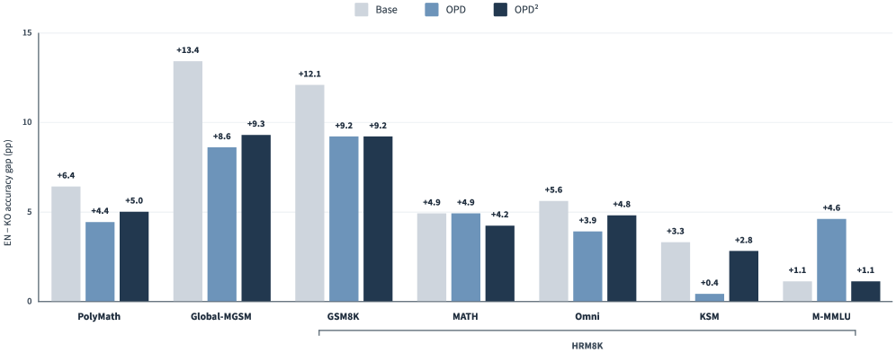

> **论文**：On-Policy Delta Distillation for Multilingual Math Reasoning
> **作者**：Byeongho Heo, Jaehui Hwang, Sangdoo Yun, Dongyoon Han（NAVER AI Lab）
> **arXiv ID**：2608.05802
> **发表时间**：2026-08-06
> **许可协议**：Apache 2.0（官方实现 naver-ai/opd2）
> **代码仓库**：https://github.com/naver-ai/opd2

## 第 1 章 概述

### 1.1 一句话定位

本论文将 On-Policy Delta Distillation (OPD2)——一种以「教师模型与其基础模型概率差」为 token 级学习信号的 LLM 后训练方法——首次系统性地扩展到多语言数学推理场景（英语/韩语/日语），实证其优于原版 OPD、能缩小英韩性能差距，并揭示「推理能力可跨语言迁移但目标语言生成必须依赖多语言数据」的关键规律。

### 论文图表总览

| 编号 | 内容 | 章节 |
|------|------|------|
| **Figure 1** | OPD 与 OPD2 三语言数学推理性能对比（PolyMath + Global-MGSM） | 第 4 章 |
| **Figure 2** | 英语–韩语准确率差距分析（thinking 模式，7 基准） | 第 4 章 |
| **Figure 3** | English-only OPD2 与 multilingual OPD2 性能对比 | 第 4 章 |
| **Table 1** | 目标语言响应率（多语言 vs English-only，OPD/OPD2，thinking/non-thinking） | 第 4 章 |
| **Table 2-4** | Qwen3-1.7B 多语言训练完整结果（EN/KO/JA × 7 基准） | 第 4 章 |
| **Table 5-7** | Qwen3-1.7B English-only 训练完整结果 | 第 4 章 |
| **Table 8-10** | Qwen3-8B 多语言训练完整结果 | 第 4 章 |

### 1.2 核心贡献

**贡献 1 — 多语言 OPD 首研**：首次系统研究 OPD/OPD2 在多语言（EN/KO/JA）数学推理中的效果，填补此前仅限英文或非洲语言 self-distillation 的研究空白。

**贡献 2 — 100K 三语数据集**：构建 100K 多语言数学训练集（EN:KO:JA = 1:1:1，无跨语言重叠），仅需问题字段——因 OPD 不需要参考答案，teacher 直接提供 token-level 监督信号。

**贡献 3 — OPD2 一致优于 OPD 并缩小语言差距**：在 Qwen3-1.7B/8B 上，OPD2 在三语设置中一致超越 OPD，韩/日语提升尤其显著（1.7B：KO +3.1、JA +4.0 vs OPD），并在 7 个基准中 6 个缩小英韩性能差距。

**贡献 4 — EN-only 迁移推理但不保语言**：发现 English-only OPD/OPD2 能提升 KO/JA 准确率（推理能力跨语言迁移），但模型转用英语回答韩/日问题（目标语言响应率从 90%+ 降至 30-48%），由此区分「推理能力迁移」与「目标语言生成保持」两个独立维度。

### 1.3 关键结果速览

**准确率提升**（PolyMath+GMGSM avg，non-thinking，base→OPD2）：

- Qwen3-1.7B：EN 55.1→63.6 (+8.5)，KO 40.9→51.9 (+11.0)，JA 37.2→52.0 (+14.8)
- Qwen3-8B：EN 62.8→70.5 (+7.7)，KO 57.0→64.4 (+7.4)，JA 57.1→65.0 (+7.9)

韩/日语的相对增益 ≥ 英语，多语言场景下非英语语言获益更大。

**OPD2 vs OPD 边际增益**（OPD2 超出 OPD 的幅度）：

- 1.7B：KO +3.1，JA +4.0，EN +2.1
- 8B：KO +3.3，JA +3.1，EN +0.7

英语的增益差最小（1.7B 仅 +2.1，8B 仅 +0.7），韩/日语差距更大——delta signal 对非英语语言的改善幅度更显著。

**目标语言响应率**：

- multilingual OPD2：KO 90.5–97.6%，JA 90.9–95.2%（双模式范围）
- EN-only OPD2：KO 36.1–48.3%，JA 29.6–30.8%

**英韩性能差距缩小**（1.7B thinking，7 个基准）：OPD2 在 6/7 个基准上缩小 EN-KO gap，而 OPD 仅缩小 3/5（且 M-MMLU 上 gap 反而从 1.1 增至 4.6）。

**强模型可靠性**（8B thinking）：原版 OPD 使英语 80.9→79.9、韩语 78.0→75.7（回退），OPD2 提升至 83.2/80.4——delta signal 在强 base 上更可靠。

## 第 2 章 方法原理

### 2.1 On-Policy Distillation (OPD)

#### token 级监督 vs RL 序列级监督

RL 方法（如 GRPO）在序列级计算奖励：完整生成 $y$ 后获得标量奖励，再通过组相对优势进行策略更新。奖励信号稀疏，仅在序列末端出现一次。

OPD 将监督下沉至 token 级：student 模型 $\pi_\theta$ on-policy 生成响应 $y \sim \pi_\theta(\cdot|x)$，teacher 模型 $\pi^*$ 对每个 token 位置提供对数概率，形成密集的 per-token 奖励信号。

#### Eq.1 — OPD 目标

最小化 student 与 teacher 之间的期望 KL 散度：

$$
\mathbb{E}_{y\sim\pi_\theta(\cdot\mid x)}\left[D_{\mathrm{KL}}\left(\pi_\theta(y\mid x)\,\middle\|\,\pi^{*}(y\mid x)\right)\right]
$$

#### Eq.2 — token 级奖励

上述目标经 REINFORCE 梯度估计器自然转化为每个 token 位置的奖励：

$$
R_t = \log \pi^*(y_t \mid y_{<t}, x) - \log \pi_\theta(y_t \mid y_{<t}, x)
$$

$R_t > 0$ 表示 teacher 赋予 token $y_t$ 的概率高于 student 自身——teacher 鼓励该 token；$R_t < 0$ 则抑制。

#### Eq.3 — 策略更新

以 REINFORCE 式梯度上升更新 student 参数：

$$
\theta \leftarrow \theta + \alpha \sum_t R_t \, \nabla_\theta \log \pi_\theta(y_t \mid y_{<t}, x)
$$

实现层面（naver-ai/opd2 仓库，基于 trl 的 GRPOTrainer 改编），实际采用 per-token advantage + PPO-clipped surrogate loss，而非裸 REINFORCE——共享 open-r1 框架的 rollout 基础设施。

### 2.2 OPD2：Delta Signal

#### 核心改进——用 teacher-base 替换 student

OPD 的 token 奖励 $R_t = \log \pi^* - \log \pi_\theta$ 混合了 teacher 的绝对分布与 student 当前状态。当 student 已较强时（如 8B thinking 基线高），$\log \pi_\theta$ 项可能引入与 teacher 改进方向无关的噪声。

OPD2 的关键洞察：仅提取 teacher 在 post-training 过程中习得的**增量方向**作为学习信号。

#### Eq.4 — delta 奖励

将 Eq.2 中的 student $\pi_\theta$ 替换为 teacher 的 base 模型 $\pi^*_{\mathrm{base}}$：

$$
R_t^{\mathrm{OPD2}} = \log \pi^*(y_t \mid y_{<t}, x) - \log \pi^*_{\mathrm{base}}(y_t \mid y_{<t}, x)
$$

$\pi^*$ 是 post-trained teacher，$\pi^*_{\mathrm{base}}$ 是该 teacher 训练前的 base 模型。delta signal 隔离了「teacher 学到了什么」——即 teacher 在 post-training 中上调/下调的概率方向——而非 teacher 的绝对输出分布。

本论文的模型配置：student 为 Qwen3-1.7B / Qwen3-8B，teacher 为 Qwen3-30B-A3B-2507，teacher-base 为对应的 Qwen3 base 模型。训练 100 步。

#### 附加机制（细节见原论文 arXiv:2607.15161）

**Reward centering**（期望校正）：对 $R_t^{\mathrm{OPD2}}$ 减去其批量均值，消除恒正或恒负的偏置，降低梯度方差。

**Conditioning criterion**（门控条件）：delta signal 仅在 teacher 的更新方向（$\pi^*$ vs $\pi^*_{\mathrm{base}}$）与 student-teacher 改进方向一致时生效。代码实现中（`opd2.py`），该门控由 "teacher−student update direction" 决定——当 delta 信号会推动 student 远离 teacher 时，跳过该 token 的更新，过滤误导性信号。

仓库中的 `exopd.py` 提供了一种扩展变体：$\lambda \cdot (\text{teacher} - \text{teacher}_{\text{base}}) - (\text{student} - \text{teacher}_{\text{base}})$，将 delta signal 与 student-teacher 距离组合。

### 2.3 与 RL / GRPO 的关系

**on-policy 共享**：OPD、OPD2 与 RL（GRPO）都要求 student 自行生成训练样本 $y \sim \pi_\theta(\cdot|x)$，无法使用离线固定数据。三者共享 vLLM rollout + 多节点训练基础设施（open-r1 / trl 框架），实现上 OPD/OPD2 直接改编自 GRPOTrainer。

**信号差异**：

- **RL/GRPO**：序列级标量奖励，需要外部奖励函数或规则验证器，需要参考答案。
- **OPD**：token 级奖励 $R_t = \log \pi^* - \log \pi_\theta$，信号来自 teacher log-prob，不需要参考答案。
- **OPD2**：token 级 delta 奖励 $R_t = \log \pi^* - \log \pi^*_{\mathrm{base}}$，信号来自 teacher 自身的 post-training 增量，不需要参考答案。

OPD/OPD2 的「不需要参考答案」特性在多语言场景中具有实践优势——构建 100K 三语数学训练集只需问题字段，无需为每种语言标注标准解答。

## 第 3 章 实验设置与数据构建

### 3.1 多语言训练数据集

论文构建了一个 100K 规模的多语言数学训练集，语言配比为英语:韩语:日语 = 1:1:1，且三个语言子集之间**不存在重叠问题**：

- **英语子集**：从 Nemotron-Math-v2（Du et al., 2025）中采样——该数据集也是 Nemotron-SFT-Multilingual-v2 中数学问题的来源
- **韩语/日语子集**：分别从 Nemotron-SFT-Multilingual-v2（NVIDIA, 2026）的对应语言子集中随机采样
- **英语-only 对照集**：另构建 100K 纯英语问题集（同样采样自 Nemotron-Math-v2），用于研究英语监督能否迁移到非英语语言

一个关键设计是：由于 OPD 类方法**不需要参考答案或推理轨迹**（teacher 直接对 student 的 rollout 打分），数据集仅保留 question 字段，无需标注答案，大幅降低了数据构建成本。

### 3.2 模型与训练配置

| 配置项 | 值 |
|:------|:---|
| 学生模型 | Qwen3-1.7B、Qwen3-8B |
| 教师模型 | Qwen3-30B-A3B-2507（MoE） |
| 训练模式 | Thinking / Non-thinking 双模式 |
| 优化步数 | 100 步（多语言与英语-only 设置使用相同超参数和样本数） |
| 训练实现 | 官方 OPD2 实现（https://github.com/naver-ai/opd2） |

两个学生模型覆盖了不同规模梯度：1.7B 为小模型、8B 为中等规模，用于检验 OPD2 在多语言场景下是否对模型规模鲁棒。

### 3.3 评估基准

评估覆盖三个语言的数学推理基准，按语言划分：

**英语 / 韩语**（HRM8K 的五个子集 + 通用基准）：
- PolyMath（多语言数学推理基准，Wang et al., 2026）
- Global-MGSM（多语言 chain-of-thought 基准）
- HRM8K 五个子集：GSM8K、MATH、Omni、KSM、M-MMLU

**日语**：
- PolyMath、Global-MGSM、MAWPS（日语数学应用题基准，Horio et al., 2023）

每个语言的最终平均分由该语言下的所有基准取平均。全部实验在思考（thinking）与非思考（non-thinking）两种模式下分别评估。

### 3.4 研究问题回顾

论文围绕三个研究问题（RQ）设计实验：

| RQ | 问题 | 对应实验 |
|:--|:-----|:--------|
| RQ1 | OPD2 在多语言设置下是否仍优于原版 OPD？ | 第 4.1-4.2 节多语言 OPD 对比 |
| RQ2 | OPD2 后训练是否缩小了语言间的推理性能差距？ | 第 4.3 节英韩差距分析 |
| RQ3 | 英语-only 的 OPD 如何影响多语言推理与目标语言生成？ | 第 4.4-4.5 节英语-only 对比 + 响应语言分析 |

## 第 4 章 实验结果与分析

### 4.1 多语言 OPD 的整体效果

**结论先行**：OPD 与 OPD2 在所有模型规模、所有语言上均显著提升数学推理性能，证明 on-policy 蒸馏的有效性**不局限于英语**。

*图1：OPD 与 OPD2 在三种语言上均大幅提升 PolyMath 与 Global-MGSM 平均分，非英语语言（尤其日语）的绝对提升最大。*

以 PolyMath + Global-MGSM 平均分（non-thinking 模式）计，Qwen3-1.7B 的 OPD2 提升幅度为：

| 语言 | base | +OPD2 | 提升 |
|:----|:----:|:-----:|:----:|
| 英语 | 55.1 | 63.6 | +8.5 |
| 韩语 | 40.9 | 51.9 | +11.0 |
| 日语 | 37.2 | 52.0 | +14.8 |

Qwen3-8B 的对应提升：

| 语言 | base | +OPD2 | 提升 |
|:----|:----:|:-----:|:----:|
| 英语 | 62.8 | 70.5 | +7.7 |
| 韩语 | 57.0 | 64.4 | +7.4 |
| 日语 | 57.1 | 65.0 | +7.9 |

两个观察：① 非英语语言的绝对起点更低，因此提升空间更大（1.7B 日语提升 14.8 分）；② 更强的 8B 模型同样获得显著提升，说明 OPD2 不是小模型专属。

### 4.2 OPD2 与 OPD 的对比

OPD2 在全部语言上一致优于原版 OPD。**在韩语和日语上的优势比英语更明显**：

| 模型 | 语言 | OPD2 超出 OPD 的幅度 |
|:----|:----|:------------------:|
| Qwen3-1.7B | 英语 | +2.1 |
| Qwen3-1.7B | 韩语 | +3.1 |
| Qwen3-1.7B | 日语 | +4.0 |
| Qwen3-8B | 英语 | +0.7 |
| Qwen3-8B | 韩语 | +3.3 |
| Qwen3-8B | 日语 | +3.1 |

delta signal 的优势在非英语语言中至少与英语同等显著，说明 OPD2 并非单纯模仿教师整体输出分布，而是提供了跨语言、跨规模的推理能力迁移信号。

### 4.3 英语–韩语性能差距的缩小

以 Qwen3-1.7B thinking 模式为例，base 模型明显偏向英语：Global-MGSM 上英韩差距达 13.4 分，HRM8K-GSM8K 上达 12.1 分。

*图2：thinking 模式下各基准的英韩准确率差距，OPD2 在 6/7 个基准上缩小差距，而 OPD 在 M-MMLU 上反而扩大差距。*

- **OPD** 部分缩小差距：PolyMath 6.4→4.4、Global-MGSM 13.4→8.6、KSM 3.3→0.4；但 M-MMLU 差距反增 1.1→4.6
- **OPD2** 更一致：在报告的全部 7 个基准中，**6 个缩小、1 个持平**（M-MMLU 维持 1.1），HRM8K-GSM8K 从 12.1 缩至 9.2

总体规律：多语言后训练对韩语的增益通常大于英语，从而在不牺牲英语性能的前提下压缩跨语言差距。

### 4.4 English-only OPD2 的迁移效应

**意外发现**：仅用英语数据训练的 OPD2 也能显著提升韩语和日语基准分数：

*图3：English-only OPD2 在 non-thinking 模式下对韩/日基准的提升与多语言 OPD2 相当，但 thinking 模式下多语言训练仍略优。*

- Non-thinking 模式：韩语 40.9→52.6、日语 37.2→53.4（与多语言训练的 51.9 / 52.0 相当）
- Thinking 模式：韩语 57.6、日语 57.5（略低于多语言训练的 59.2 / 59.1）

这说明英语监督学到的推理能力可以**跨语言迁移**到非英语输入——模型能够理解韩/日问题并用推理能力求解，即使训练时从未见过这些语言的题目。

### 4.5 目标语言响应率：基准分数的盲区

基准准确率无法反映模型**用哪种语言**作答。论文测量了「目标语言响应率」（输出文本语言与输入问题语言一致的比例），结果揭示了关键差异（Table 1）：

**Thinking 模式（统计 `</think>` 之后的最终回答）**：

| 训练数据 | 方法 | 韩语响应率 | 日语响应率 |
|:--------|:----|:--------:|:--------:|
| 多语言 | OPD | 72.9% | 70.1% |
| 多语言 | OPD2 | 97.6% | 95.2% |
| English-only | OPD | 83.1% | 36.9% |
| English-only | OPD2 | 36.1% | 30.8% |

**Non-thinking 模式（统计完整响应）**：

| 训练数据 | 方法 | 韩语响应率 | 日语响应率 |
|:--------|:----|:--------:|:--------:|
| 多语言 | OPD | 99.7% | 99.8% |
| 多语言 | OPD2 | 90.5% | 90.9% |
| English-only | OPD | 83.6% | 40.5% |
| English-only | OPD2 | 48.3% | 29.6% |

核心洞见：
1. **English-only OPD2 的韩语响应率从 90%+ 暴跌至 36-48%**——模型虽然答对了韩语题，却用英语作答
2. 多语言 OPD2 在 thinking 模式下响应率最高（KO 97.6% / JA 95.2%）
3. 该现象在两种模式下都成立，与 thinking/non-thinking 无关，只取决于训练数据语言构成

### 4.6 完整实验结果（附录）

附录 A 报告了全部基准的完整数值（Qwen3-1.7B / Qwen3-8B × multilingual / English-only × thinking / non-thinking）：

**Qwen3-1.7B 多语言训练**（HRM8K 五子集 + PolyMath + GMGSM 平均）：

| 模式 | 语言 | base | +OPD | +OPD2 |
|:----|:----|:----:|:----:|:-----:|
| Non-thinking | 英语 | 47.6 | 61.7 | 65.7 |
| Non-thinking | 韩语 | 37.4 | 48.7 | 56.5 |
| Non-thinking | 日语 | 55.5 | 62.9 | 65.4 |
| Thinking | 英语 | 70.4 | 71.4 | 73.4 |
| Thinking | 韩语 | 63.7 | 66.2 | 68.2 |
| Thinking | 日语 | 68.5 | 70.5 | 71.2 |

**Qwen3-1.7B English-only 训练**：

| 模式 | 语言 | base | +OPD | +OPD2 |
|:----|:----|:----:|:----:|:-----:|
| Non-thinking | 英语 | 47.6 | 63.3 | 66.9 |
| Non-thinking | 韩语 | 37.4 | 50.1 | 59.3 |
| Non-thinking | 日语 | 55.5 | 62.9 | 66.5 |
| Thinking | 英语 | 70.4 | 69.4 | 69.3 |
| Thinking | 韩语 | 63.7 | 48.5 | 65.1 |
| Thinking | 日语 | 68.5 | 69.3 | 69.9 |

⚠️ 值得注意：**English-only OPD 在 thinking 模式下使韩语平均分从 63.7 暴跌至 48.5**（-15.2），而 OPD2 保持稳定（65.1）。英语-only 后训练的影响高度依赖蒸馏目标与生成模式。

**Qwen3-8B 多语言训练**：

| 模式 | 语言 | base | +OPD | +OPD2 |
|:----|:----|:----:|:----:|:-----:|
| Non-thinking | 英语 | 58.7 | 74.0 | 75.3 |
| Non-thinking | 韩语 | 55.4 | 67.1 | 72.2 |
| Non-thinking | 日语 | 70.2 | 73.4 | 75.2 |
| Thinking | 英语 | 80.9 | 79.9 | 83.2 |
| Thinking | 韩语 | 78.0 | 75.7 | 80.4 |
| Thinking | 日语 | 77.7 | 77.6 | 78.9 |

**Qwen3-8B thinking 模式的原版 OPD 出现性能回退**（英语 80.9→79.9、韩语 78.0→75.7），而 OPD2 依然稳定提升（英语→83.2、韩语→80.4）。在强 base 模型上，delta signal 的可靠性优势更加突出。

## 第 5 章 深入分析

### 5.1 推理能力迁移 ≠ 目标语言生成保持

本文最核心的洞见：**benchmark 准确率的提升与目标语言生成的保持是两个正交维度，必须分别评估。**

English-only OPD2 训练（仅用英文数据 100K）后，模型在韩语/日语数学基准上的准确率显著提升——数学推理逻辑在英语上学到后，确实跨语言迁移至 KO/JA：

- 1.7B non-thinking 7 基准 avg：KO 37.4→59.3 (+21.9)，JA 55.5→66.5 (+11.0)
- 1.7B non-thinking PolyMath+GMGSM avg：KO 40.9→52.6 (+11.7)，JA 37.2→53.4 (+16.2)

但目标语言响应率急剧崩塌。multilingual OPD2 保持 KO 90.5–97.6%、JA 90.9–95.2% 的目标语言响应率（thinking / non-thinking 双模式），而 EN-only OPD2 降至 KO 36.1–48.3%、JA 29.6–30.8%。模型用英语回答韩/日问题——准确率上升，语言忠实度崩塌。

这两个维度必须在评估中同时报告。仅看准确率会得出「English-only 训练对多语言有效」的错误结论。

### 5.2 English-only 的「英语化」现象

English-only OPD/OPD2 导致的响应语言偏移（「英语化」）在不同配置下表现不同：

**non-thinking 模式**：准确率提升显著（1.7B KO +21.9），但响应率已大幅下降（EN-only OPD2 KO 48.3%、JA 29.6%）。模型在生成过程中逐渐切换到英语表达。

**thinking 模式更严重**：EN-only OPD 出现灾难性下降——1.7B thinking KO 63.7→48.5 (↓15.2)。原因是 thinking 模式依赖长链推理，当模型用英语生成推理链但需要输出韩语答案时，语言不一致导致连锁错误。OPD2 在同配置下为 63.7→65.1 (+1.4)，delta signal 的可靠性缓解了这一问题。

JA 受影响程度大于 KO：EN-only OPD (thinking) JA 响应率仅 36.9%，而 KO 为 83.1%——日语模型对英语训练数据的「抵抗力」更弱。

实践中，这意味着仅用英语数据做 post-training 后，模型可能丧失目标语言的表达能力，即便底层推理逻辑充分。

### 5.3 OPD 在 thinking 模式下的偶发下降 vs OPD2 的稳定提升

在 8B thinking 模式下（基线性能已较高），OPD 出现性能下降而 OPD2 保持稳定提升：

- 8B thinking EN：OPD 80.9→79.9 (↓1.0)，OPD2 80.9→83.2 (↑2.3)
- 8B thinking KO：OPD 78.0→75.7 (↓2.3)，OPD2 78.0→80.4 (↑2.4)
- 1.7B EN-only thinking KO：OPD 63.7→48.5 (↓15.2)，OPD2 63.7→65.1 (+1.4)

原因分析：OPD 的 $R_t = \log \pi^* - \log \pi_\theta$ 包含 student 当前状态 $\log \pi_\theta$。当 student 基线已强（8B thinking），该项可能引入与 teacher 改进方向无关的梯度噪声，甚至产生误导。OPD2 的 delta signal $R_t = \log \pi^* - \log \pi^*_{\mathrm{base}}$ 完全不依赖 student，仅反映 teacher 的 post-training 增量，信号更纯净——加上 conditioning criterion 的门控过滤，确保了更新方向的可靠性。

### 5.4 多语言数据的作用：保持目标语言生成

多语言训练数据（EN:KO:JA = 1:1:1）的核心价值不在于提升推理能力（English-only 也能跨语言迁移推理），而在于**维持目标语言的生成能力**。

数据设计上，本文采用三语等量配比且无跨语言重叠（每个数学问题仅出现在一种语言中），避免翻译泄露导致的评估偏差。OPD/OPD2 仅需问题字段，无需为每种语言标注标准解答——多语言数据扩展的边际成本较低，这是 OPD 相对 RL 的实践优势。

响应率数据清晰展示差异：multilingual OPD2 在 thinking 模式下保持 KO 97.6%、JA 95.2%，non-thinking 模式下 KO 90.5%、JA 90.9%；同模型 EN-only 训练后降至 30–48% 范围。多语言数据不是「锦上添花」，而是保持目标语言生成的必要条件。

## 第 6 章 代码实现详解

论文使用官方 OPD2 实现（`naver-ai/opd2`，Apache 2.0 许可），该仓库由 OPD2 原始论文作者维护（Heo/Hwang/Yun/Han, NAVER AI Lab），支持 OPD、ExOPD、OPD² 三种训练器。

### 6.1 仓库结构

| 路径 | 内容 |
|:-----|:-----|
| `src/open_r1/opd.py` | 原版 OPD 训练器：`teacher − student` log-prob 差作为 per-token 信号 |
| `src/open_r1/exopd.py` | ExOPD 训练器：`λ·(teacher − teacher_base) − (student − teacher_base)` |
| `src/open_r1/opd2.py` | OPD² 训练器：delta signal `(teacher − teacher_base)` + expectation correction，由 `(teacher − student)` 更新方向门控 |
| `recipes/` | 各学生模型的自包含训练配置（Qwen3-1.7B/4B/8B、Gemma4-E4B-it） |
| `evaluation/` | 评估适配器（evalchemy + 自定义 benchmark 适配） |
| `docker/` | 固定训练环境镜像 |

### 6.2 训练信号实现

三种训练器的核心差异在于 per-token advantage 信号：

| 训练器 | 每 token 信号 | 说明 |
|:------|:------------|:-----|
| OPD | `log π*(y_t) − log πθ(y_t)` | teacher 与 student 的概率差 |
| ExOPD | `λ·(log π* − log π*_base) − (log πθ − log π*_base)` | 带外推系数的 delta |
| OPD² | `log π*(y_t) − log π*_base(y_t)` | delta signal，期望校正 + OPD 方向门控 |

信号直接作为密集 per-token advantage 用于 GRPO 的 PPO-clipped loss（构建于 trl 的 `GRPOTrainer`，改编自 open-r1）。

### 6.3 训练配置

- **硬件**：Qwen3-1.7B 单节点 8×H100 80GB（teacher 与 student 同机，teacher 用 ZeRO-3 分片）；Qwen3-4B/8B 及 Gemma4-E4B 用 4 节点 32×H100（1 台 vLLM rollout 服务器 + 3 台训练节点）
- **数据**：官方仓库默认使用 NVIDIA 开放推理数据集（OpenMathReasoning / OpenCodeReasoning / OpenScienceReasoning-2，各 33,333 条混合成 100K），而本论文的多语言实验另行使用 Nemotron-SFT-Multilingual-v2 与 Nemotron-Math-v2 构建的三语数据集
- **教师配置**：Qwen3-1.7B 学生 → Qwen3-4B-Instruct-2507 教师（base 为 Qwen3-4B-Base）；Qwen3-8B 学生 → Qwen3-30B-A3B-Instruct-2507 教师

⚠️ 注意：官方仓库 recipes 仅含英语推理数据配置，**不含本论文的三语（EN/KO/JA）配方**——多语言数据构建是本论文的独立贡献。

## 第 7 章 局限性与延伸阅读

### 7.1 局限性

1. **语言覆盖有限**：实验仅覆盖英语、韩语、日语三种语言，且韩语/日语同属东亚语言系统，与英语的句法差异小于低资源语言（如非洲语言）。OPD2 在更远距离语言对（如英语–阿拉伯语、英语–斯瓦希里语）上的表现仍属未知。
2. **数据规模与来源单一**：训练数据仅 100K 题（三语各约 33K），且全部来自 NVIDIA 的 Nemotron 系列数据集。数据规模对 OPD2 多语言效果的上限影响未做缩放研究。
3. **模型家族局限**：学生模型仅为 Qwen3 家族（1.7B/8B），教师固定为 Qwen3-30B-A3B-2507。OPD2 的多语言效果是否依赖特定教师-学生组合（如同族模型、同一 tokenizer 家族）未经验证。
4. **响应语言检测粒度**：目标语言响应率是粗粒度的整体判断，未分析代码混写、数学符号夹注等中间形态；thinking 模式的中间推理链（`</think>` 之前）几乎全为英语，其语言混用对下游能力的影响未深入探讨。
5. **训练步数固定**：所有实验固定 100 优化步，未探索更长训练的收益曲线；English-only OPD 在 thinking 模式下对韩语的大幅回退（63.7→48.5）的机制解释仍不完整。
6. **未与 RL 直接对比**：论文未将 OPD2 与同设置的 GRPO/RLVR 多语言基线直接对比，无法定位 OPD2 相对 RL 在跨语言场景的相对优势区间。

### 7.2 延伸阅读

- **OPD2 原始论文**：Heo et al. (2026), "On-policy delta distillation"（arXiv:2607.15161）——delta signal、reward centering、conditioning criterion 的完整推导
- **OPD 泛化变体**：Yang et al. (2026), "Learning beyond teacher: generalized on-policy distillation with reward extrapolation"（ExOPD）
- **跨语言 OPD 相关工作**：Liu et al. (2026), "Crosslingual on-policy self-distillation for multilingual reasoning"（self-distillation 到非洲语言）
- **多语言数学基准**：PolyMath（Wang et al., 2026）、Global-MGSM（Shi et al., 2022）、HRM8K（Ko et al., 2025）
- **官方代码**：https://github.com/naver-ai/opd2（Apache 2.0）

### 7.3 总结

本论文系统验证了 OPD2 在多语言数学推理上的有效性，核心结论有三层递进：

1. **方法层**：delta signal 的优势（teacher 与其 base 模型的概率差作为学习信号）在多语言场景下依然成立，且对非英语语言的增益不低于英语；
2. **能力层**：OPD2 后训练能缩小英韩推理性能差距，但「缩小差距」在不同基准上并不均匀；
3. **语言层**：推理能力可跨语言迁移（英语监督→韩日推理），但目标语言的**生成保持**必须依赖多语言训练数据——这是论文最重要的实践启示：评估多语言模型时，基准准确率与响应语言是两个必须分开考察的维度。
