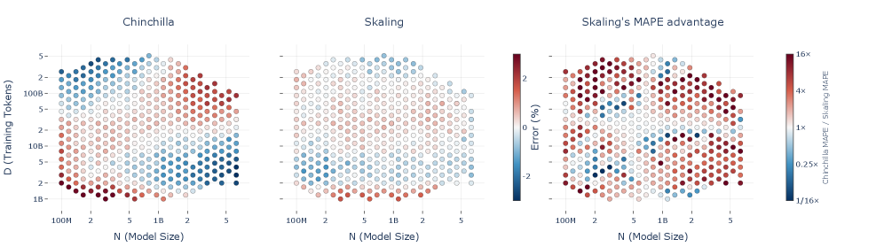
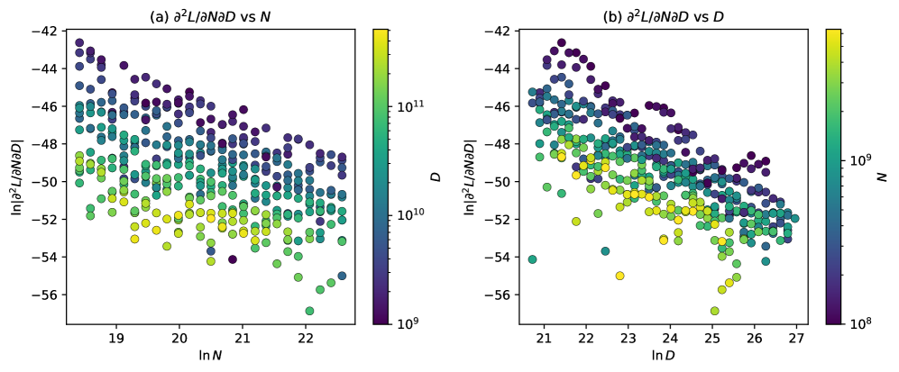
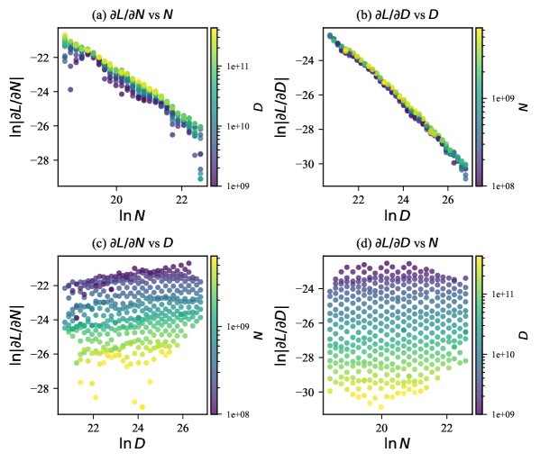
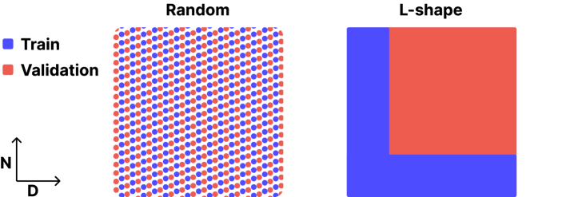
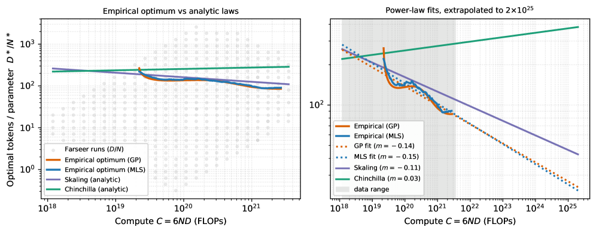

## 第 1 章 概述

> **论文**：Skaling: Chinchilla's Exponents Meet Kaplan's Coupling
> **作者**：Mathurin Videau, Badr Youbi-Idrissi, David Lopez-Paz, Kartik Ahuja（Meta FAIR）
> **arXiv ID**：2608.07222
> **发表时间**：2026-08-07（v1）
> **许可协议**：arXiv 预印本（未标注明确许可）
> **代码仓库**：无官方实现（截至 2026-08-11 检索）

### 1.1 一句话定位

Skaling law 是一种新型神经缩放定律形式，在 Chinchilla 加法内部项之外引入单一耦合指数 $k$ 将模型大小 $N$ 与训练数据量 $D$ 统一到一个交互项中，修正了 Chinchilla 关于 $N$ 与 $D$ 严格独立的隐含假设在数据稀缺与过度训练极端处产生的系统性边界偏差。

### 论文图表总览

| 编号 | 内容 | 章节 |
|:----:|------|:----:|
| Figure 1 | Chinchilla vs Skaling 残差热图（$N \times D$ 网格）+ MAPE 比值图，揭示加法定律的鞍形边界偏差 | 第 1 章 |
| Figure 2 | 一阶导数投影：$\partial L/\partial N$ 与 $\partial L/\partial D$ 在 log-log 空间的幂律衰减及交叉斜率诊断 | 第 3 章 |
| Figure 3 | 混合导数 $\partial^2 L / \partial N \partial D$ 非零的经验证据（核心动机） | 第 3 章 |
| Figure 4 | L-shape 稀疏采样策略示意（D-band + N-band）及交叉验证协议（Interp / ExtN / ExtD / Far 分区） | 第 4 章 |
| Figure 6 | 经验最优 token-to-parameter 比 vs compute（GP / MLS / Skaling / Chinchilla 对比），展示外推分歧 | 第 6 章 |
| Table 1 | 主结果：Farseer 与 SK-Grid 双网格在四种交叉验证 regime 下的 MAPE 对比 | 第 5 章 |
| Table 2 | 全网格拟合参数（Skaling vs Chinchilla，$A$, $B$, $\alpha$, $\beta$, $k$, $E$） | 第 5 章 |
| Table 3 | iso-ratio compute 外推 MAPE（Skaling vs Chinchilla vs per-ratio power law） | 第 5 章 |
| Table 5 / 6 | 额外数据集结果（Farseer-code 117 运行、原始 Chinchilla 245 散点） | 第 5 章 |
| Table 9 | dominated-pair 拟合结果（配对差消去 $E$ 后的 MAPE 对比） | 第 5 章 |

### 1.2 核心贡献

**贡献 1：Skaling 函数形式（Eq. 3）**

论文提出缩放定律的新形式：

$$L(N, D) = \left(\frac{A}{N^\alpha} + \frac{B}{D^\beta}\right)^k + E$$

Skaling 将 Chinchilla 的加法内部项（$A/N^\alpha + B/D^\beta$）包裹在一个外层耦合指数 $k$ 中。当 $k = 1$ 时，Skaling 退化为 Chinchilla 加法定律；当 $0 < k < 1$ 时，混合偏导数 $\partial^2 L / \partial N \partial D$ 为负值——模型容量与数据量之间存在协同效应，同时增加 $N$ 和 $D$ 带来的损失下降超过单独增加之和。该形式仅比 Chinchilla 多一个参数，却在函数结构层面修正了边界偏差。形式名称"Skaling"直接体现了这一思想：**Chinchilla's Exponents Meet Kaplan's Coupling**——用 Kaplan 式的耦合外壳包裹 Chinchilla 式的加法内核。

**贡献 2：混合导数非零的经验证据**

论文利用 Moving Least Squares（MLS）与 Gaussian Process（GP）两种无模型方法从损失面估计导数，经验性地证明 $\partial^2 L / \partial N \partial D \neq 0$。具体地，混合导数拟合值 $a \approx b \approx -1.1$ 且为负；一阶导数呈幂律衰减（$\alpha_N \approx \alpha_D \approx -1.3$），交叉斜率虽小但非零（$\gamma_N \approx 0.13$，$\gamma_D \approx 0.07$）。这直接否定了 Chinchilla 加法形式所隐含的严格独立性假设，为耦合形式的引入提供了经验依据。

**贡献 3：L-shape 稀疏采样网格（~10× 计算节省）**

论文提出 L-shape 采样策略：仅在低计算量区域沿 D-band（固定小模型扫数据量）和 N-band（固定小数据量扫模型大小）采集训练点，而不运行昂贵的全网格角点配置。该策略通过边界锚定重建全网格外推，在保持预测精度的前提下实现约 10× 的计算节省。这使得从实验室规模模型可靠地预测生产规模性能成为可能。

**贡献 4：计算最优分配的差异与影响**

Skaling 继承了 Chinchilla 的闭式最优 token-to-parameter 比公式（$R_{\text{opt}}$ 结构不变），但因拟合参数不同，实际最优比显著不同。在 Farseer 网格上，最优比 $D^*/N^*$ 随 compute 增加而下降——经验指数 $m \approx -0.14$（GP）、$m \approx -0.15$（MLS），Skaling 解析值 $m \approx -0.11$——而 Chinchilla 预测近平坦（$m \approx +0.03$）。外推到 $2 \times 10^{25}$ FLOPs 时，Chinchilla 预测约 380 tokens/param，而 Skaling 与经验观测一致落在 20–40 tokens/param，二者差距超过 10×。这一分歧对下一代大模型的数据预算规划具有直接影响。

### 1.3 关键结果速览

*图1：左侧为 Chinchilla 在 N×D 网格上的鞍形残差（数据稀缺与过度训练角落误差达数个百分点），右侧为 Skaling/Chinchilla MAPE 比值——耦合形式系统性消除边界偏差，是本论文的核心动机图。*

| 指标 | Chinchilla | Skaling | 来源 |
|------|:---------:|:-------:|:----:|
| Farseer 全网格 Far MAPE（%） | 2.46 | **2.31** | Table 1 |
| SK-Grid 全网格 Far MAPE（%） | 5.17 | **0.70** | Table 1 |
| Farseer L-shape Far MAPE（%） | 9.82 | **1.51** | Table 1 |
| SK-Grid L-shape Far MAPE（%） | 14.63 | **1.15** | Table 1 |
| 全网格 $R^2$（Farseer / SK-Grid） | 0.995 / 0.992 | **0.998 / 0.998** | Table 1 |
| L-shape $R^2$（Farseer / SK-Grid） | 0.954 / 0.955 | **0.995 / 0.998** | Table 1 |
| iso-ratio compute 外推 pooled MAPE（%） | 2.34 ± 1.11 | **0.60 ± 0.27**（3.9× 改进） | Table 3 |

总体而言，Skaling 在插值与外推 regime 上均实现 1.5–3× 的 MAPE 降低。在 L-shape 稀疏采样下改善尤为显著：SK-Grid Far MAPE 从 14.63% 降至 1.15%（超 12× 改善），Farseer Far MAPE 从 9.82% 降至 1.51%。全部网格（全网格与 L-shape）拟合的耦合指数 $k$ 落在 0.31–0.45 区间（全网格为 0.31–0.41，Table 2），远低于 Chinchilla 隐含的 $k = 1$。

---

## 第 2 章 研究背景与动机

### 2.1 缩放定律的三大基石

神经缩放定律描述模型损失 $L$ 与参数量 $N$、训练 token 数 $D$ 之间的函数关系，是大模型计算预算分配的理论基础。该领域沿三条主线演进：

**Kaplan et al. (2020)——耦合形式。** Kaplan 的缩放定律将 $N$ 与 $D$ 耦合在一个共享外层指数的幂律结构中，模型大小与数据量以非加法方式交互。该耦合形式隐含 $\partial^2 L / \partial N \partial D \neq 0$，即 $N$ 对损失的边际效应依赖于 $D$，反之亦然。但该工作基于有限的模型规模，其拟合结果后来被发现高估了计算最优时的数据需求——建议约 20× 以上参数量的 token，使得业界一度倾向于训练大模型而非"充分训练"。

**Hoffmann et al. (2022)——Chinchilla 加法形式。** Chinchilla 定律将损失拆分为两个独立的加法项加一个不可约常数：

$$L(N, D) = \frac{A}{N^\alpha} + \frac{B}{D^\beta} + E$$

其中 $A/N^\alpha$ 描述模型容量瓶颈、$B/D^\beta$ 描述数据瓶颈、$E$ 为不可约损失。加法结构的核心假设是 $\partial^2 L / \partial N \partial D = 0$——$N$ 与 $D$ 对损失的影响严格可分离。该假设使得闭式最优 token-to-parameter 比推导极为简洁，Chinchilla 据此得出最优 $D/N$ 比约 20 tokens/param 的经典结论，深刻修正了 Kaplan 时代的训练实践，成为后续大模型开发的事实标准。

**Bi et al. (2024)——DeepSeek compute 外推实践。** DeepSeek 定律在 Chinchilla 框架内，将损失重新参数化为关于计算量 $C = 6ND$ 的函数，并引入 iso-FLOP 切片方法进行大规模 compute 外推。该工作展示了加法定律在 compute 投影下的实用价值，但其外推可靠性仍受 Chinchilla 加法形式在网格边界处的系统性偏差制约。

### 2.2 加法形式的结构性缺陷

Chinchilla 加法形式的独立性假设 $\partial^2 L / \partial N \partial D = 0$ 在实际损失面上并不成立。论文通过 Figure 1 的残差热图清晰揭示：Chinchilla 定律在 $N \times D$ 网格上产生系统性的**鞍形残差**——在数据稀缺区（小 $D$）和过度训练区（大 $D$、小 $N$）的角点处，预测误差达几个百分点，且偏差方向在对角两端相反（一端系统性低估、另一端系统性高估）。

这种鞍形残差正是混合导数为零假设的直接几何后果。若真实 $\partial^2 L / \partial N \partial D \neq 0$，则模型容量与数据之间存在协同效应——增加 $N$ 的收益随 $D$ 增大而变化，反之亦然。加法形式对此完全无法建模，其拟合参数被迫在网格中心与边界之间做妥协，导致边界处产生方向可预测的系统性偏差。

论文 Section 2 提供了直接的导数层面证据：

- **一阶导数诊断（Eq. 1）**：$\partial L / \partial N$ 与 $\partial L / \partial D$ 在 log-log 空间呈幂律衰减（$\alpha_N \approx \alpha_D \approx -1.3$），交叉斜率虽小但显著非零（$\gamma_N \approx 0.13$，$\gamma_D \approx 0.07$），表明一阶导数对另一变量的依赖已存在。

- **混合导数（Eq. 2）**：经验估计 $a \approx b \approx -1.1$ 且符号为负。负的混合导数意味着 $N$ 与 $D$ 存在协同效应——同时增大模型容量与数据量，损失下降幅度超过两者独立贡献之和。

这两条证据共同排除了加法形式作为损失面精确描述的可能性，并为引入耦合指数 $k$ 提供了经验动机。

### 2.3 相关工作与本文定位

**Kaplan–Chinchilla 分歧的已有归因。** Pearce & Song (2024) 与 Porian et al. (2024) 将 Kaplan 与 Chinchilla 之间的指数差异归因于拟合程序层面的技术因素——参数计数方式（是否计入嵌入参数）和 FLOP 记账方法的差异。这些工作在拟合层面解释了两者的分歧。本文则指出一个更深层的结构性问题：即使在统一的拟合框架与数据来源下，加法形式本身在网格边界处的曲率方向就是错误的。鞍形残差不是拟合偏差或参数计数差异的产物，而是 $\partial^2 L / \partial N \partial D = 0$ 这一函数形式假设的内禀后果。

**Busbridge et al. (2025)——同形式，不同场景。** Busbridge 使用了与 Skaling 结构相同的 untied outer-exponent 形式 $E + (A/N^\alpha + B/D^\beta)^\gamma$ 构建蒸馏缩放定律（distillation scaling law），在脚注中提及 untied exponents 可改善拟合，但未进行受控对比实验。本文是首个在自回归预训练缩放网格上系统验证该耦合形式、并通过严格的交叉验证协议（Interp / ExtN / ExtD / Far）量化其相对于 Chinchilla 的改进的工作。

**Farseer (Li et al., 2025)——9 参数更重形式。** Farseer 提出 9 参数缩放定律形式，在插值区精度更高，但在数据外推区 MAPE 反而更高（4.13 / 4.45），且拟合难度大。这表明仅靠增加参数数量无法系统解决外推问题——关键在于函数形式是否正确刻画 $N$–$D$ 间的耦合关系。Skaling 仅用 6 参数（比 Chinchilla 多 1 个）便在外推区全面优于 9 参数的 Farseer 形式。

**数据混合与重复训练的缩放。** Muennighoff et al. (2023) 研究了重复数据下的缩放行为；Ye et al. (2024) 与 Shukor et al. (2026) 关注多源数据混合的缩放定律。这些工作在 Chinchilla 加法框架内运作，其结论同样可能受独立性假设偏差影响——当数据组成或重复程度变化时，$N$–$D$ 耦合的形态可能进一步偏离加法假设。

## 第 3 章 Skaling 定律：耦合模型大小与数据

标准缩放定律（Chinchilla/Hoffmann et al. 2022）将可约损失建模为模型大小 $N$ 与数据量 $D$ 各自独立幂律项之和。这一加法结构隐含着一个极强的假设：两个变量的交叉导数恒等于零，即它们对损失的影响彼此独立。本章追溯这一假设的经验证据，说明它为何失效，并由此推导出 Skaling 定律——一种以单一外指数 $k$ 耦合 $N$ 与 $D$ 的极简推广形式。

### 3.1 损失面耦合的经验证据

在选择函数形式之前，作者直接向数据提问：模型大小与训练数据是否存在交互？他们通过估计损失面的导数来探测这一问题，使用了两种无网格（mesh-free）梯度估计器——移动最小二乘（Moving Least Squares, MLS; Lancaster and Salkauskas, 1981）和高斯过程（Gaussian Process, GP）——以提供互相独立的验证。

**导数估计方法。** 由于实验网格在对数空间中等距排列，两种估计器返回的都是 log-slope，需转换到真实空间导数：

$$\frac{\partial L}{\partial N}=\frac{L}{N}\frac{\partial\ln L}{\partial\ln N},\qquad\frac{\partial L}{\partial D}=\frac{L}{D}\frac{\partial\ln L}{\partial\ln D}$$

这一转换自动消去了不可约误差 $E$（常数在微分下消失），从而隔离可约损失的内部结构。

MLS 是一种局部估计器：在每个查询点 $x_\star$ 的邻域内，以距离加权岭回归拟合截断泰勒展开

$$z(x_{i})\approx c_{0}+g^{\top}\Delta x_{i}+\frac{1}{2}\Delta x_{i}^{\top}H\,\Delta x_{i}+\dots$$

其中 $g$ 为梯度、$H$ 为含目标交叉导数的 Hessian 矩阵。将多项式系数堆叠为向量 $c$ 后，用 $k$ 个最近邻求解

$$\hat{c}=\big(\Phi^{\top}W\Phi+\lambda I\big)^{-1}\Phi^{\top}Wz$$

权重矩阵 $W$ 对角元为高斯核 $w_{i}=\exp\!\big(-\|\Delta x_{i}\|^{2}/\sigma^{2}\big)$，$\lambda I$ 提供数值稳定所需的岭正则化。一阶导数直接从 $\hat{c}$ 的对应分量读取，混合交叉导数则从 $\Delta x_{i,1}\,\Delta x_{i,2}$ 交互基项的系数读取。

GP 是一种全局估计器：对所有点拟合单一高斯过程（RBF 核），其后验均值在闭式下可微。预测的 log-loss 为 $\hat{z}(x_\star)=k(x_\star,X)\,\alpha$，其中 $\alpha=(K+\sigma_{n}^{2}I)^{-1}z$。由于微分是线性算子，GP 的导数仍是 GP，可直接对核函数求导获得：

$$\widehat{\frac{\partial z}{\partial x_{j}}}(x_{\star})=\frac{\partial k(x_{\star},X)}{\partial x_{j}}\,\alpha$$

RBF 核的导数为 $\partial k(x,x')/\partial x_{j}=k(x,x')(x'_{j}-x_{j})/\ell_{j}^{2}$。GP 还提供闭式预测方差以量化估计不确定性，并通过最大化边际似然自动调节长度尺度与噪声水平。

两种方法给出完全独立的梯度估计，其一致性为后续结论提供了稳健性保证。

**一阶 log-linear 诊断。** 作者首先用如下对数线性模型（Eq.1）概括一阶结构：

$$\ln\!\left|\frac{\partial L}{\partial N}\right|=\alpha_{N}\,\ln N+\gamma_{N}\,\ln D+c_{N},\qquad\ln\!\left|\frac{\partial L}{\partial D}\right|=\gamma_{D}\,\ln N+\alpha_{D}\,\ln D+c_{D} \tag{1}$$

其中 $\alpha_N, \alpha_D$ 捕捉同变量主衰减斜率，$\gamma_N, \gamma_D$ 捕捉对另一轴的残余依赖。Figure 2 的投影显示：

- 同变量投影近似线性，$\alpha_{N}\approx\alpha_{D}\approx-1.3$，即边际导数约以幂律衰减；
- 交叉斜率很小，$\gamma_{N}\approx0.13$、$\gamma_{D}\approx0.07$，表面在一阶上近乎可分。

但一阶投影无法排除更弱的交互——正如论文指出的："first-order projections alone, however, cannot rule out a weaker interaction"。

**混合导数：决定性检验。** 任何加法定律 $L=f(N)+g(D)+E$ 恒满足 $\partial^{2}L/\partial N\,\partial D=0$，不论 $f$ 和 $g$ 选取何种幂律。因此混合偏导数是判别加法独立性假设成立与否的决定性检验。作者用如下对数线性模型（Eq.2）拟合混合导数的衰减结构：

$$\ln\!\left|\frac{\partial^{2}L}{\partial N\,\partial D}\right|=a\,\ln N+b\,\ln D+c \tag{2}$$

Figure 3 的结果显示：估计的混合导数在整个网格上非零，且服从自身的幂律衰减，拟合得 $a\approx b\approx-1.1$，**符号以负为主**。负号意味着同时增大 $N$ 和 $D$ 降低损失的幅度，超过单独增大任一变量——这是一种协同效应（synergy），而加法定律的结构从根本上无法表达这种协同。这正是 Skaling 形式提出的直接经验动机。

*图3：混合偏导数的对数线性衰减结构。加法定律强制该导数为零，而数据在整个网格上显示显著非零的负值（N 与 D 协同降低损失），直接否定了 Chinchilla 的独立性假设。*

### 3.2 Skaling 形式

**两种范式。** 缩放定律文献中存在两种锚定形式，其区别在于 $N$ 与 $D$ 的组合方式。Chinchilla 定律将二者完全解耦——以独立内指数 $\alpha$、$\beta$ 求和：

$$L(N,D)=\frac{A}{N^{\alpha}}+\frac{B}{D^{\beta}}+E$$

数学上便利，但强制交叉导数 $\partial^{2}L/\partial N\,\partial D$ 恒为零。更早的 Kaplan 形式（Kaplan et al., 2020）走的是另一个极端：

$$L(N,D)=\bigl[(N_{c}/N)^{\alpha_{N}/\alpha_{D}}+D_{c}/D\bigr]^{\alpha_{D}}$$

外指数 $\alpha_{D}$ 扮演了 Skaling 中 $k$ 的角色，但 Kaplan 还通过比值 $\alpha_{N}/\alpha_{D}$ 将内项绑定在一起，使各轴衰减率不再独立。

**Skaling 桥接。** Skaling 定律（Eq.3）保留了 Chinchilla 可解释的基项与独立内指数，同时仿照 Kaplan，将它们的和提升到一个自由外指数 $k$：

$$L(N,D)=\left(\frac{A}{N^{\alpha}}+\frac{B}{D^{\beta}}\right)^{k}+E \tag{3}$$

记 $u = AN^{-\alpha}+BD^{-\beta}$，Skaling 的混合导数为

$$\frac{\partial^{2}L}{\partial N\,\partial D}=k(k-1)\,u^{k-2}\,\alpha A\,N^{-\alpha-1}\,\beta B\,D^{-\beta-1}$$

由此可读出若干关键性质：

- **$k=1$ 恢复 Chinchilla**：混合导数恰好为零，回到纯加法形式；
- **$0<k<1$ 时混合导数为负**：因 $k(k-1)<0$，而其余因子皆为正，混合导数符号为负，与 Figure 3 观测到的负协同一致；
- **严格递减**：因 $k>0$，函数对 $N$ 和 $D$ 均严格递减——增加模型容量或训练数据永远不会提高预测损失；
- **内指数独立可解释性**：外指数 $k$ 决定两个源项如何"聚合"为最终损失，每个源项仍保留各自的解释力。

Skaling 的一阶导数为

$$\frac{\partial L}{\partial N}=-k\alpha A\,N^{-\alpha-1}u^{k-1},\qquad\frac{\partial L}{\partial D}=-k\beta B\,D^{-\beta-1}u^{k-1}$$

同变量幂律因子仍主导，交叉变量依赖仅通过共享因子 $u^{k-1}$ 进入。因此 Skaling 在一阶上可以显得"几乎可分"，同时仍允许数据所揭示的非零混合导数。

*图2：一阶 log-linear 诊断显示同变量投影近似线性（α_N≈α_D≈−1.3），交叉斜率虽小但非零（γ_N≈0.13, γ_D≈0.07）——一阶上近乎可分，但无法排除更弱的交互。*

**计算最优分配的继承。** 一个实际收益是：在固定预算 $C=6ND$ 下最小化损失，会化归到与 Chinchilla 完全相同的驻点条件 $Z'(N)=0$（因为 $k\cdot Z(N)^{k-1}$ 恒非零，最小化 $L$ 等价于最小化内层 $Z(N)$）。由此 Skaling 继承了 Chinchilla 的闭式最优 token-to-parameter 比（Eq.8）：

$$R_{opt}=6^{\frac{\beta-\alpha}{\alpha+\beta}}\left(\frac{\beta B}{\alpha A}\right)^{\frac{2}{\alpha+\beta}}C^{\frac{\alpha-\beta}{\alpha+\beta}} \tag{8}$$

当 $\alpha\approx\beta$ 时，最优比 $D^{*}/N^{*}$ 跨尺度恒定。$k$ 控制损失面的形状，但单调外映射 $x\mapsto x^{k}+E$ 不改变最小化器的位置——Skaling 在获得表达力的同时不牺牲可解性。需要注意的是：代数公式相同，但由于拟合参数 $A,B,\alpha,\beta$ 在两种形式间不传递，实际最优比会不同。

**稳定耦合的实验验证。** 在多个网格上，Skaling 一致地拟合出亚单位耦合指数 $k<1$（而非坍缩回 $k=1$），如下表所示：

| 数据集 / 设置 | $k$ 拟合值 | $E$（Chinchilla → Skaling） |
|---|---|---|
| Farseer, full grid | $0.41 \pm 0.01$ | $0.45 \pm 0.01 \to 0.03 \pm 0.02$ |
| Farseer, L-shape | $0.45 \pm 0.03$ | $0.59 \pm 0.01 \to 0.05 \pm 0.06$ |
| SK-Grid, full grid | $0.31 \pm 0.02$ | $1.75 \pm 0.02 \to 1.14 \pm 0.06$ |
| SK-Grid, L-shape | $0.31 \pm 0.02$ | $2.16 \pm 0.02 \to 1.18 \pm 0.12$ |
| Farseer-code, full | $0.77 \pm 0.03$ | $0.65 \to 0.60$ |
| Chinchilla 原始数据, full | $0.77 \pm 0.06$ | $1.91 \to 1.85$ |

Farseer 全网格上的 $E$ 几乎消失（$0.45\to0.03$），并非表示损失下限为零；而是 $k<1$ 的凹外映射使耦合可约项在大尺度下衰减更慢，能吸收加法定律只能用更大 $E$ 来表达的曲率。由于实验未达损失饱和尺度，数据固定总损失但无法区分衰减项与常数下限——Skaling 通过压低 $E$ 来消解这一模糊性。在耦合较弱的数据集（Farseer-code、原始 Chinchilla 数据）上 $k\approx 0.77$–$0.90$，接近加法极限，Skaling 的精度优势相应缩减——这正是嵌套形式的预期自适应行为。

### 3.3 为什么乘法耦合而非加法交互项

面对非零混合导数，一个自然的替代方案是保持 Chinchilla 加法结构不变，额外添加一个乘积项：

$$L=AN^{-\alpha}+BD^{-\beta}+G\,N^{-\mu}D^{-\nu}+E$$

这一项确实能产生非零混合导数。但 $G$ 的符号会同时控制两个量，且方向相反。该模型的混合导数及交互项对 $\partial L/\partial N$ 的贡献分别为

$$\frac{\partial^{2}L}{\partial N\,\partial D}=\mu\nu\,G\,N^{-\mu-1}D^{-\nu-1},\qquad\frac{\partial L}{\partial N}\!\left(GN^{-\mu}D^{-\nu}\right)=-\mu\,G\,N^{-\mu-1}D^{-\nu}$$

- 匹配观测到的**负**混合导数需要 $G<0$（因 $\mu,\nu>0$）；
- 但 $G<0$ 时，交互项对 $\partial L/\partial N$ 贡献为**正**（$-\mu G>0$），与单调递减相抵触；
- 更严重的是，拟合的混合导数衰减暗示 $\mu\approx 0.1$，小于主尺寸指数 $\alpha$，这意味着正贡献随 $N$ 的衰减比主导负项更慢——在大 $N$、小 $D$ 处可能使 $\partial L/\partial N>0$，预测"模型越大损失越高"。

反过来，选 $G>0$ 虽可避免单调性失效，但混合导数变为正，协同效应消失。因此，**单一加法乘积项无法同时保持单调性并匹配观测到的负交互**。

Skaling 通过正乘性因子而非独立带符号项来引入交互，绕过了这一困境：

$$\frac{\partial L}{\partial N}=-k\,\alpha A\,N^{-\alpha-1}u^{k-1}$$

对于任意 $k>0$，该导数为负。对数据的依赖仅通过正因子 $u^{k-1}$ 进入。当 $0<k<1$ 时：增大 $D$ 使 $u$ 减小，因 $k-1<0$ 故 $u^{k-1}$ 增大，从而增大已为负的梯度绝对值。这产生 $\partial^{2}L/\partial N\,\partial D<0$ 而**从不改变** $\partial L/\partial N$ 的符号。在此参数化中，单调性与协同效应天然兼容。

### 3.4 一阶斜率解释

Skaling 形式还能解释 Figure 2 中观测到的非对称一阶交叉斜率。定义内层和中数据项与尺寸项的份额：

$$w_{D}=\frac{BD^{-\beta}}{u},\qquad w_{N}=\frac{AN^{-\alpha}}{u}$$

对 $\ln|\partial L/\partial N|$ 和 $\ln|\partial L/\partial D|$ 关于交叉变量求导，得

$$\gamma_{N}=(1-k)\,\beta\,w_{D},\qquad\gamma_{D}=(1-k)\,\alpha\,w_{N}$$

因此交叉斜率之比为

$$\frac{\gamma_{N}}{\gamma_{D}}=\frac{\beta}{\alpha}\cdot\frac{w_{D}}{w_{N}}$$

当 $\beta>\alpha$ 且内层和偏向数据项（$w_D>w_N$）时，该比值大于 1。这恰好重现了测量到的 $\gamma_{N}\approx 0.13 > \gamma_{D}\approx 0.07$——无需引入偏斜的交互项，仅凭单一耦合指数 $k$ 与内指数比即可生成非对称斜率。该结果为经验观测提供了机制层面的解释：非对称性是耦合结构与内项权重比的自然产物。

---

## 第 4 章 L-shape 稀疏采样与评估协议

即便有了正确的函数形式，参数估计的质量仍取决于实验网格的设计。本章介绍论文提出的 L-shape 稀疏采样策略及其配套的严格交叉验证协议，前者将性能分析（profiling）的计算开销降低约 10 倍，后者则系统量化插值与多级外推的预测精度。

### 4.1 动机

标准全网格（full grid）设置在对数等距的 $N$-$D$ 方形上采样，以覆盖多个数量级的行为。然而由于计算量 $C=6ND$ 随两个轴同时增长，总计算开销被网格**右上角**——即最大模型训练最长轮次的那些配置——压倒性地主导。这种计算资源在几何上的高度集中，使密集采样极为浪费：绝大部分实验预算消耗在少数几个大规模运行上，而这些点对拟合各轴独立衰减率的边际信息量并不高。论文指出，与其将巨额预算耗费在几个巨型 run 上，不如将计算更优地分配给一组更具判别力的采样点。缩放定律的数学结构自然地催生了 L-shape 采样策略。

### 4.2 L-shape 策略

L-shape 的设计源于损失函数的渐近行为。当数据量趋向无穷时，估计误差消失，损失逼近仅依赖模型大小的近似误差：

$$\lim_{D\to\infty}L(N,D)=\left(\frac{A}{N^{\alpha}}\right)^{k}+E$$

因此增大 $D$ 可干净地隔离 $N$ 依赖的系数 $(A,\alpha)$。对称地，当模型大小趋向无穷时，近似误差消失，隔离数据依赖的参数：

$$\lim_{N\to\infty}L(N,D)=\left(\frac{B}{D^{\beta}}\right)^{k}+E$$

实践中无需达到这些理论极限——固定一个轴、变动另一个轴即可提供足够的信号来追踪对应的衰减率。L-shape 策略在最低计算尺度上应用这一原理，将采样分解为两条带（参见 Figure 4a）：

- **D-band**：仅对最小模型扫描数据量 $D$，用于拟合数据参数 $(B,\beta)$；
- **N-band**：仅在最短训练轮次（少量数据）上扫描模型大小 $N$，用于拟合尺寸参数 $(A,\alpha)$。

两条带的交汇处——即小模型 × 少量数据的角点——提供了 $N$ 与 $D$ 同时活跃的观测，使耦合指数 $k$ 与其余参数在 L-shape 网格上联合拟合成为可能。通过将独立衰减率锚定在网格边界上，这种稀疏几何在相同总预算约束下比全网格扫描更高效地映射 $N$-$D$ 交互。实验验证表明，L-shape 网格的拟合计算量约为全网格的 1/10：Farseer 从 $\sim5.0\times10^{22}$ FLOPs 降至 $\sim5.1\times10^{21}$ FLOPs，SK-Grid 从 $\sim3.1\times10^{21}$ FLOPs 降至 $\sim6.5\times10^{20}$ FLOPs。

*图4：L-shape 稀疏采样策略（Figure 4a）。D-band 固定小模型扫数据量拟合数据参数 (B,β)，N-band 固定短训练扫模型大小拟合尺寸参数 (A,α)，交汇角点提供 N 与 D 同时活跃的观测，k 与其余参数联合拟合——稀疏采样将 profiling 计算量降低约 10× 而不损失外推精度。*

### 4.3 交叉验证协议

为严格测试各定律的预测能力与算法稳定性，论文采用全面的交叉验证框架。该框架不依赖单一静态训练-测试划分，而是反复重采样训练数据并构造对应的留出集，从而显式量化预测不确定性、评估拟合参数方差、检验模型向未见尺度外推的可靠性。

每次交叉验证折中，评估集划分为四个层级（参见 Figure 4b）：

- **Interpolation（插值）**：训练网格边界内随机留出的点；
- **Extrapolation N（模型外推）**：超出训练集的更大模型尺寸，模拟对更大架构的预测；
- **Extrapolation D（数据外推）**：更大的数据量，检验对延长训练轮次的预测；
- **Far Extrapolation（远端外推）**：最具挑战性的区域，由最大模型 × 最大数据组成，完全落在训练网格的 $N$ 和 $D$ 双重边界之外。

所有折上报告各评估集的 MAPE 及插值集的决定系数 $R^2$。对于评估集 $\mathcal{S}$（其中 run $i$ 的实测损失为 $L_i$、拟合定律预测为 $\hat{L}_i$），MAPE 定义为（Eq.4）：

$$\mathrm{MAPE}(\mathcal{S})=\frac{100}{|\mathcal{S}|}\sum_{i\in\mathcal{S}}\frac{|\hat{L}_{i}-L_{i}|}{L_{i}}\quad[\%] \tag{4}$$

$R^2$ 仅限于插值集，原因在于：外推集点数少、覆盖网格中狭窄且某种程度上任意的切片；由于 $R^2$ 以留出目标的方差归一化误差，在该区域变得不稳定且缺乏信息量（常取很小的正值或强负值），而 MAPE 在所有区域保持直接可比。聚合多折后，报告各指标的均值与方差。

### 4.4 iso-ratio compute 外推

前沿实验室几乎完全依赖一维 compute 幂律来规划大规模预训练的性能轨迹。由于这些模型通常沿固定 token-to-parameter 比 $D/N$ 放缩（如 DeepSeek, Bi et al. 2024），沿这些特定操作射线进行 compute 外推，对任何缩放形式都是有意义的比较基准。此协议直接对应一个操作层面的问题：**一个全局拟合的定律能否仅用廉价低计算数据，可靠预测最昂贵的 run？**

具体流程如下（参见 Figure 5）：

1. 将所有 run 按固定 $D/N$ 比分组为 iso-ratio 切片；
2. 每个切片内留出 $K=8$ 个最高 compute 的点；
3. 每个缩放定律在**池化剩余数据**（所有切片低 compute 点的并集）上**仅重拟合一次**，然后在留出的高 compute run 上评估；
4. 这确保每个函数形式看到完全相同的训练集，实现严格的全局比较。

**强基线。** 作为经验上界，额外在每个切片内独立拟合单变量幂律 $L=A\,C^{a}+E$（per-ratio），复现 DeepSeek 方法论。该 per-ratio 基线高度定制于单一配比、无法为联合 $N$-$D$ 分配提供信息，但作为专用一维 compute 定律沿固定射线外推的表现上限，是有意义的参照。

在 Farseer 数据上的结果表明（Table 3）：Skaling 是所有全局定律在每个区域及总体上最优且最稳定的——池化 MAPE 为 $0.60 \pm 0.27\%$，较加法 Chinchilla（$2.34 \pm 1.11\%$）降低 3.9 倍，其误差在任何区域均不超过 $0.9\%$。Chinchilla 则呈强区域依赖性，在 optimal 带最弱（$3.47\%$）。唯一能略微胜过 Skaling 的是 per-ratio 幂律，且仅在 optimal 带附近（$0.77\%$ vs $0.88\%$）——这是一维定律沿固定比值的自然优势所在，但它无法服务于联合 $N$-$D$ 分配决策。

## 第 5 章 实验结果与分析

### 5.1 实验设置

Skaling 定律在两个预训练网格上拟合与评估：公开的 Farseer 网格（Li et al., 2025a）与论文自建的 SK-Grid。

**Farseer 网格**：404 个 (N, D) 配置，覆盖 25 个模型大小（100M 至 6.4B 参数）与 55 个数据预算（1B 至 512B tokens），compute 范围 1.6×10^18 至 4.1×10^21 FLOPs，所有模型序列长度 2048。留出三个评估集：Extrapolation N（最大的 3 个模型大小 4.5B–6.4B，36 个点）、Extrapolation D（每个剩余模型大小前 3 个数据预算，66 个点）、Far extrapolation（网格外的 7 个更大规模运行，2.3B–25B 参数、126B–453B tokens）。剩余 302 个配置用于拟合，总计算量约 5.0×10^22 FLOPs。

**SK-Grid**：论文自建网格，134 个配置，覆盖 15 个模型大小（134M 至 4.9B）与 16 个数据预算（316M 至 316B tokens），compute 范围 9.0×10^16 至 9.9×10^20 FLOPs。同方案留出 7 个 Extrapolation N 点（2.8B–4.9B）、33 个 Extrapolation D 点、3 个 far-extrapolation 运行（约 10^22 FLOPs，5.8B–10.8B 参数）。拟合网格总计约 3.1×10^21 FLOPs。

**拟合设置**：所有缩放定律用同一优化器与 log-space 目标函数拟合——Huber loss（δ=0.05）+ L-BFGS-B + basin-hopping（Sobol 拟随机序列初始化），系数 A、B 在对数尺度优化。备选 BIPOP-CMA-ES 进化策略达到同等拟合质量。统一拟合流程保证对比反映函数形式而非拟合程序差异。

**训练设置**（SK-Grid）：模型按宽度与深度同时增长（d_model 672→3264，深度 7→34 层），Llama 3 tokenizer（词表 128,256），序列长度 2048；数据混合 60% DCLM-Edu 网页文本、30% code、10% math；batch size 与峰值学习率遵循 StepLaw 处方（$B=896.07\,F^{0.231}$，$\eta=0.0709\,F^{-0.4303}\,D^{0.2785}$）；AdamW（β=(0.9, 0.95)，weight decay 0.1，grad clip 0.1，cosine LR，warmup 10%，final LR 1×10^-6）。

### 5.2 主结果：边界误差

加性 Chinchilla 定律在网格内部插值已相当准确，但误差在单轴与 far 外推集上放大——正是鞍形残差（Figure 1）最显著的区域。Table 1 显示 Skaling 定律全面降低边界误差：

**Table 1：主结果 MAPE（%）与 R²（Farseer 与 SK-Grid 全网格 + L-shape 网格）**

| Law | R² | Interp. | Ext. N | Ext. D | Far |
|:----|:---:|:---:|:---:|:---:|:---:|
| **Farseer 全网格**（5.0×10^22 FLOPs） | | | | | |
| Chinchilla | 0.995 | 0.77±0.04 | 1.48±0.03 | 1.98±0.08 | 2.46±0.19 |
| Farseer | 0.982 | 1.73±0.45 | 2.37±0.08 | 4.13±1.36 | 2.43±1.93 |
| **Skaling** | **0.998** | **0.41±0.05** | **0.47±0.03** | **0.88±0.06** | **2.31±0.18** |
| **Farseer L-shape**（5.1×10^21 FLOPs） | | | | | |
| Chinchilla | 0.954 | 2.51±0.07 | 4.32±0.13 | 3.29±0.11 | 9.82±0.48 |
| Farseer | 0.974 | 1.81±1.23 | 2.07±1.72 | 2.52±1.95 | 2.37±1.33 |
| **Skaling** | **0.995** | **0.85±0.10** | **0.89±0.23** | **1.35±0.20** | **1.51±0.67** |
| **SK-Grid 全网格**（3.1×10^21 FLOPs） | | | | | |
| Chinchilla | 0.992 | 0.81±0.14 | 0.83±0.11 | 1.44±0.03 | 5.17±0.28 |
| Farseer | 0.967 | 1.66±0.32 | 0.90±0.49 | 4.45±0.21 | 3.98±1.25 |
| **Skaling** | **0.998** | **0.33±0.11** | **0.39±0.05** | **0.58±0.07** | **0.70±0.39** |
| **SK-Grid L-shape**（6.5×10^20 FLOPs） | | | | | |
| Chinchilla | 0.955 | 2.19±0.10 | 6.09±0.24 | 3.63±0.13 | 14.63±0.39 |
| Farseer | 0.987 | 0.82±0.52 | 1.19±0.82 | 2.66±2.42 | 4.64±1.31 |
| **Skaling** | **0.998** | **0.33±0.03** | **0.77±0.44** | **0.55±0.08** | **1.15±0.53** |

最大收益出现在最失衡的角落：SK-Grid 上 far-extrapolation 误差在全网格从 5.17% 降至 0.70%，在 L-shape 网格从 14.63% 降至 1.15%；最大 N 的 L-shape 误差从 6.09% 降至 0.77%。

### 5.3 稀疏采样下的鲁棒性

仅在 L-shape 网格（约 10× 更少拟合 compute）上训练时，Skaling 在插值与单轴外推上仍保持接近或优于全网格 Chinchilla 基线。Chinchilla 在同一限制下显著退化：Farseer 上插值 MAPE 从 0.77% 升至 2.51%，SK-Grid 上 far MAPE 从 5.17% 升至 14.63%。耦合形式因此能在训练网格集中于低 compute 边界时保持预测精度——这正是稀疏采样策略所需的场景。

### 5.4 拟合参数：稳定耦合

Table 2 显示 Skaling 定律在全部网格上恢复亚单位耦合指数 k≈0.31–0.45，而非塌缩回加法情形 k=1。拟合不可约误差 E 系统性低于 Chinchilla：Farseer 上从 0.45 降至 0.03（全网格）、0.59 降至 0.05（L-shape），SK-Grid 上从 1.75 降至 1.14。

**Table 2：拟合参数（全网格 / L-shape）**

| Setup | Law | A | B | α | β | k | E |
|:------|:----|:---|:---|:---:|:---:|:---:|:---:|
| Farseer 全网格 | Chinchilla | (4.8±1.2)×10^1 | (1.1±0.1)×10^2 | 0.27±0.01 | 0.24±0.00 | 1 | 0.45±0.01 |
| | **Skaling** | (2.9±0.2)×10^2 | (6.0±0.3)×10^3 | 0.32±0.01 | 0.39±0.00 | **0.41±0.01** | 0.03±0.02 |
| Farseer L-shape | Chinchilla | (2.6±0.6)×10^2 | (1.0±0.1)×10^2 | 0.39±0.02 | 0.24±0.00 | 1 | 0.59±0.01 |
| | **Skaling** | (2.5±0.7)×10^2 | (1.7±0.4)×10^3 | 0.32±0.01 | 0.33±0.01 | **0.45±0.03** | 0.05±0.06 |
| SK-Grid 全网格 | Chinchilla | (5.0±1.2)×10^2 | (7.1±0.8)×10^2 | 0.34±0.01 | 0.31±0.01 | 1 | 1.75±0.02 |
| | **Skaling** | (5.3±1.8)×10^6 | (7.1±2.8)×10^6 | 0.73±0.01 | 0.63±0.01 | **0.31±0.02** | 1.14±0.06 |
| SK-Grid L-shape | Chinchilla | (1.0±0.0)×10^4 | (1.7±0.4)×10^3 | 0.52±0.00 | 0.36±0.01 | 1 | 2.16±0.02 |
| | **Skaling** | (1.0±0.0)×10^7 | (6.5±2.4)×10^6 | 0.77±0.02 | 0.63±0.01 | **0.31±0.02** | 1.18±0.12 |

作者不将 E≈0 解读为消失的损失下限：耦合 k 与下限 E 相互权衡——k<1 的凹外层映射使耦合可约项在大规模下衰减更慢，能吸收加法定律只能靠更大 E 表示的曲率。除 E 外，每个参数在拟合内都精确确定，fold 间标准差很小：指数与耦合为几个百分点，振幅最多约 40%。

**参数数量不是关键**：9 参数的 Farseer 定律并未凭额外自由度消除边界失败——它在多数 regime 下不如 Skaling，最大误差集中在数据外推（Farseer 与 SK-Grid 全网格上 MAPE 4.13 与 4.45）。增益来自函数形式的归纳偏置匹配了观测到的 N–D 交互，而非参数更多。

**耦合强度依数据而定**：在 Farseer-code 与原始 Chinchilla 数据上，拟合耦合接近加法（k≈0.77–0.90），Skaling 精度相应与 Chinchilla 相当。这是嵌套形式的预期行为：k=1 恢复加法定律，数据支持耦合面时 Skaling 偏离加法，否则保持接近加法拟合。

### 5.5 计算外推（iso-ratio 切片）

Table 3 测试操作性场景：从计算便宜的运行预测每种配方最昂贵的运行。112 个留出的高 compute Farseer 运行按训练 regime（D/N 分组的 undertrained / optimal / overtrained 三段）报告误差，每个定律只在便宜剩余集上重拟合一次。

**Table 3：compute 外推（112 个留出高 compute Farseer 运行）**

| Law | Undertrained R² | Undertrained MAPE | Optimal R² | Optimal MAPE | Overtrained R² | Overtrained MAPE | All R² | All MAPE |
|:----|:---:|:---:|:---:|:---:|:---:|:---:|:---:|:---:|
| Power law (per-ratio) | 0.94 | 1.32±0.87 | 0.96 | **0.77±0.39** | 0.97 | 0.86±0.75 | 0.95 | 0.99±0.69 |
| Chinchilla | 0.89 | 1.52±0.80 | 0.47 | 3.47±0.65 | 0.87 | 1.94±0.66 | 0.74 | 2.34±1.11 |
| Farseer | 0.99 | 0.46±0.20 | 0.94 | 1.20±0.20 | 0.99 | 0.73±0.23 | 0.97 | 0.80±0.38 |
| **Skaling** | **0.99** | **0.45±0.21** | 0.97 | 0.88±0.15 | **0.99** | **0.42±0.15** | **0.98** | **0.60±0.27** |

Skaling 是每个 regime 与总体最优的全局定律（pooled MAPE 0.60±0.27%，较加性 Chinchilla 降低 3.9×，且低于参数多很多的 Farseer 定律），且最稳定——任何 regime 误差不超过 0.9%。Chinchilla 强依赖 regime，在 optimal 带是最差的定律（3.47%），其 pooled 数字掩盖了失败位置。唯一胜过 Skaling 的参照是 per-ratio power law，且仅在 optimal 带附近（0.77% vs 0.88%）——一维定律沿固定比天然良好，但它按配方分别拟合，无法指导联合 N–D 分配。

### 5.6 额外数据集验证

在两个进一步数据集上重复交叉验证协议（Table 5）：**Farseer-code**（Farseer 的代码域对应，117 个运行、9 个模型大小 201M–3.18B、20 个 token 预算 2B–128B，compute 2.4×10^18–2.4×10^21 FLOPs，支持全网格与 L-shape 划分）与**原始 Chinchilla 测量**（Besiroglu et al., 2024，245 个散点，57M–16.2B 参数、245M–318B tokens、1.4×10^18–1.3×10^22 FLOPs，非规则网格仅适用随机划分，16.2B 与 318B-token 点构成两个外推集）。

**Table 5：额外数据集结果（MAPE %）**

| Law | R² | Interp. | Ext. N | Ext. D |
|:----|:---:|:---:|:---:|:---:|
| **Farseer-code 全网格** | | | | |
| Chinchilla | 0.998 | 0.28±0.07 | 0.93±0.15 | 0.60±0.04 |
| Farseer | 0.983 | 0.89±0.12 | 1.01±0.04 | 3.74±0.23 |
| **Skaling** | **0.999** | **0.24±0.09** | **0.67±0.19** | **0.26±0.06** |
| **Farseer-code L-shape** | | | | |
| Chinchilla | 0.991 | 0.59±0.06 | 1.93±0.18 | 1.60±0.12 |
| Farseer | 0.993 | 0.53±0.16 | **0.96±0.27** | **0.91±0.68** |
| **Skaling** | **0.995** | **0.45±0.12** | 1.39±0.49 | 1.14±0.41 |
| **Chinchilla 数据（全网格）** | | | | |
| Chinchilla | **0.993** | 0.63±0.15 | **1.16±0.33** | 0.63±0.06 |
| Farseer | 0.955 | 1.27±0.55 | 1.23±1.10 | 1.12±0.21 |
| **Skaling** | **0.993** | **0.61±0.14** | 1.28±0.29 | **0.51±0.03** |

对应的系数（Table 6）显示同样模式：Skaling 拟合 k<1 且 E 小于 Chinchilla，但耦合较弱（k≈0.77–0.90），与更混合的精度增益一致。

### 5.7 计算最优分配方向

Farseer 数据上的交互有具体分配后果。数值损失梯度恢复随 compute 下降的 token-to-parameter 比，拟合指数 −0.14 与 −0.15（GP 与 MLS），与 Skaling 的解析指数 −0.11 一致，与 Chinchilla 的近平坦预测 +0.03 符号相反。超出数据一个数量级时，两种处方推荐的 token-to-parameter 比相差约 10×（Figure 6）。在 2×10^25 FLOPs 外推点：Chinchilla 接近约 380 tokens/parameter，而经验拟合与 Skaling 落到 20–40。

分配方向数据集相关而非耦合形式的普遍后果：Farseer 上 α<β 给出随 compute 增长的递减 D⋆/N⋆；SK-Grid 上 α>β（全网格与 L-shape 皆然），同一闭式最优随 compute 增加 token-to-parameter 比。稳健结论是耦合改变大规模分配，方向取决于拟合数据与架构。

### 5.8 dominated-pair 拟合

受支配配对拟合（Section 12）从目标中完全移除 E：对任一有序配对 i 支配 j（F_i≥F_j、D_i≥D_j 且 L_i<L_j），加法下限在损失差中抵消。它主要作为加性 Chinchilla 的修正——全网格上 Chinchilla 的 far 误差从 2.46% 降至 0.79%（Farseer）、5.17% 降至 3.67%（SK-Grid）。这暗示 Chinchilla 大量外推误差源于下限 E 的弱辨识；Skaling 不受此修正的持续改善（Table 9），因为其耦合形式已正确捕获全局损失面形状。

## 第 6 章 计算最优训练与拟合细节

### 6.1 计算最优分配推导

Skaling 定律在固定预算 C=6ND 下最小化。将 D=C/(6N) 代入，内层加性项化为 N 的函数 $Z(N)=\frac{A}{N^{\alpha}}+B\left(\frac{C}{6N}\right)^{-\beta}$，损失目标为 $L(N)=Z(N)^{k}+E$。对 N 求导：

$$\frac{dL}{dN}=k\cdot Z(N)^{k-1}\cdot Z^{\prime}(N)$$

由于 Z(N) 是严格正项之和且经验拟合 k>0，缩放因子 k·Z(N)^{k-1} 非零，最小化损失严格等价于 Z′(N)=0——恰是加性 Chinchilla 定律的驻点条件。**Skaling 定律因此继承 Chinchilla 的计算最优分配不变**。求解 Z′(N)=−αA·N^{−α−1}+βB·(6/C)^β·N^{β−1}=0 得 N^{α+β}=αA/(βB)·(C/6)^β，代回 D*=C/(6N*) 得到最优 token-to-parameter 比：

$$R_{opt}=6^{\frac{\beta-\alpha}{\alpha+\beta}}\left(\frac{\beta B}{\alpha A}\right)^{\frac{2}{\alpha+\beta}}C^{\frac{\alpha-\beta}{\alpha+\beta}}$$

若 α≈β（Chinchilla 观测），最优比 D/N 跨尺度恒定。更一般地，Skaling 干净地分离损失面形状（由 k 控制）与最优分配位置（Z′(N)=0）：单调外层映射 x↦x^k+E 重新缩放损失但不改变其最小化点，因此 Skaling 在表达力增强的同时保持可解性。

**关键警示**：虽然代数公式相同，实际最优比不同——底层拟合参数 A、B、α、β 在两种函数形式之间不传递。Chinchilla 与 Skaling 对同一数据给出不同参数，导致 R_opt 具体值分歧。这解释了 Figure 6 中两种定律在 frontier compute 尺度上的 100 倍分歧（结合 5.7 节的 10× 与 380 vs 20–40 tokens/param 差距——注意"100-fold"指累积到 frontier 尺度的分歧）。

*图6：GP 与 MLS 两种独立数值估计恢复随 compute 递减的最优比（指数约 −0.14/−0.15），与 Skaling 解析值 −0.11 一致；Chinchilla 预测近平坦（+0.03）。外推到 2×10^25 FLOPs 时两者推荐的 token/parameter 相差超过 10×（约 380 vs 20–40）。*

### 6.2 拟合挑战

尽管参数少，拟合缩放定律是脆弱的非凸优化问题：参数数值尺度差异巨大（A、B 的大幅值 vs α、β 的小指数，病态化 L-BFGS）、损失面平坦（对数衰减导致优化器过早停止）、参数强补偿（E 尤其难估计，其他系数可偏移吸收其值）。

**Table 4：各定律拟合配置**

| Law | Params | Log params | Bounds |
|:----|:---:|:---:|:---|
| Chinchilla | 5 | A, B | A∈[10^-6, 10^4], B∈[10^-6, 5×10^4], α,β∈[0,1], E∈[0,3] |
| Skaling | 6 | A, B | A,B∈[10^-6, 10^7], α,β,k∈[0.01,2], E∈[0,3] |
| Farseer | 9 | — | E∈[0,5], s∈[−10,10], q∈[−0.5,0.5], S∈[−30,10], B_c∈[−10,500], b∈[−2,0.5], Q∈[−10,15], A_c∈[−25,5], a∈[−0.5,0.2] |

L-BFGS-B + basin-hopping（autograd 解析梯度，Sobol 拟随机起点）与 BIPOP-CMA-ES（无梯度，双倍种群、active CMA、9 次 BIPOP 重启）达到同等拟合质量；差异是实践性的——L-BFGS 需精细调参（初始化、重启、log-space 目标），CMA-ES 开箱即得。报告结果全部用 L-BFGS-B + basin-hopping（文献更常用）。

**拟合 Farseer 的说明**：Farseer 与其他定律一样用这个共同直接优化器拟合，保证对比反映函数形式而非拟合流程。Farseer 原管线用固定 N 下连续 D 差分估计分量，需要每模型大小多个均匀 D 值——L-shape 稀疏网格与散乱非网格数据集不满足；直接优化是唯一统一适用的流程。原管线在相同交叉验证下未显著更优（除更大 D 外推，仅与 Skaling 持平），因此报告共同直接拟合作为最佳 Farseer 结果。

### 6.3 代码与可复现性

截至检索时点（2026-08-11）论文未发布官方代码仓库。Farseer 网格数据来自 Li et al. (2025a) 已发布运行；Chinchilla 数据来自 Besiroglu et al. (2024) 公开测量；SK-Grid 为 Meta 内部训练网格（基于 Meta Lingua 框架），正文描述含 134 个配置、15 个模型大小（附录 E.1 与 Table 8 另写 125 runs / 14 sizes，论文自身存在轻微内部不一致，本报告以正文为准）。Skaling 形式（Eq.3）仅 6 参数，任何缩放定律拟合代码库（如 chinchilla 工具包、Farseer 开源管线）均可直接实现。

## 第 7 章 局限性与延伸阅读

### 7.1 主要局限

1. **E 与 k 的权衡模糊性**：拟合不可约误差 E 与耦合指数 k 存在补偿权衡。论文明确不将 Farseer 上 E≈0 解读为消失的损失下限——数据未达到损失饱和尺度，总损失被固定但"衰减项 vs 常数下限"的划分未被数据唯一确定。这削弱了将 E 作为物理量的解释力度。

2. **耦合强度数据集相关**：Skaling 的增益在 Farseer-code 与原始 Chinchilla 数据上显著减弱（k≈0.77–0.90，精度与 Chinchilla 相当）。论文归因于超参数策略差异（StepLaw 处方 vs 原始配方），但也意味着耦合并非普遍强交互——跨数据集推广需要谨慎。

3. **超参数敏感性**：损失面形状对训练配方高度敏感，不同超参策略可人为压低或扭曲测量的 N–D 交互与最优比。论文自身承认跨数据集比较反映特定训练配方与数据。

4. **SK-Grid 规模上限**：最大模型 4.9B 参数、316B tokens，外推到 frontier（数百 B 参数、数 T tokens）依赖函数形式假设，无法直接验证。

5. **无官方代码**：截至检索时点未发布代码仓库，复现需自行实现 6 参数拟合（研究材料已记录全部超参与边界）。

### 7.2 与现有工作的关系

- **Kaplan vs Chinchilla 之争**：Pearce & Song (2024) 归因于参数计数，Porian et al. (2024) 归因于 FLOP 记账/预热/优化器——都在拟合层面解决，保留加法形式。本文证据指向形式本身：混合导数非零，加法形式在网格边缘弯曲方向错误。
- **Busbridge et al. (2025)**：蒸馏缩放定律中使用相同 untied outer-exponent 形式 E+(A/N^α+B/D^β)^γ 作为监督缩放定律，脚注提及 untied exponents 改善拟合与外推但未做受控对比。本文把该交互作为中心问题。
- **Farseer (Li et al., 2025a)**：9 参数形式引入 N–D 交互但更难拟合，本文实验中边界精度不如 Skaling。
- **其他扩展轴**：Muennighoff et al. (2023) 重复数据（映射为有效 token/参数计数）、Ye et al. (2024)/Shukor et al. (2026) 数据混合（域权重输入）。Skaling 隔离单个耦合参数的效应，作者预期类似耦合沿其他缩放轴同样重要。

### 7.3 未来方向

- 验证 N–D 耦合沿其他缩放轴（数据混合、重复数据、架构维度）的普遍性
- 在更大规模网格（>100B 参数）上直接验证 L-shape 外推
- 将耦合形式融入 compute 预算分配工具，替代固定 20 tokens/parameter 经验法则
- 分析不同训练配方（超参策略）如何系统性地塑造观测耦合强度
