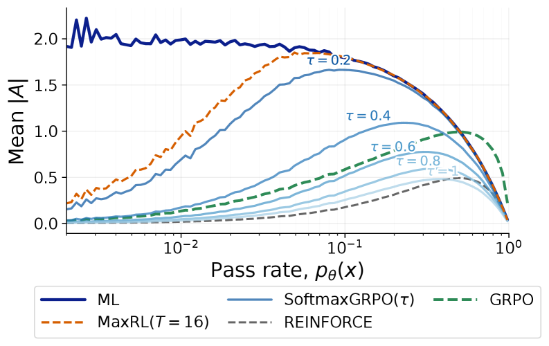
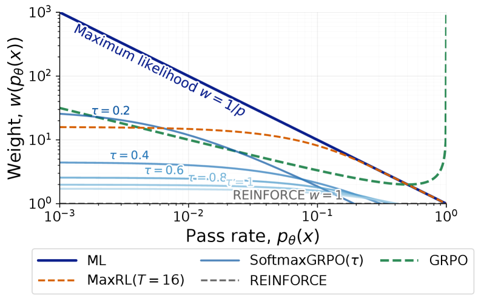
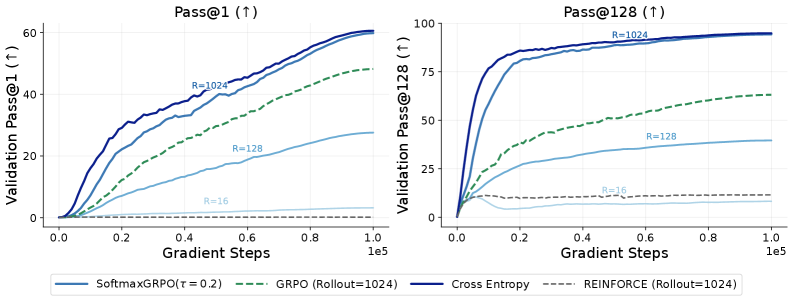

> **论文**：SoftmaxGRPO: Learning to Reason using Softmax Advantage Group Estimation
> **作者**：Jefferson Hernandez, Jaywon Koo, Zilin Xiao, Chen Wei, Vicente Ordonez（Rice University）
> **arXiv ID**：2608.09271
> **发表时间**：2026-08-11（COLM 2026）
> **许可协议**：CC BY 4.0
> **代码仓库**：无官方实现

---

## 第 1 章 论文概述

### 1.1 一句话定位

SoftmaxGRPO 是 GRPO 组目标的 **drop-in 替代**：将 z-score 组归一化 advantage 替换为温度缩放的 softmax advantage，使得在任意 pass rate（尤其是 near-solved prompt）下梯度权重始终有界，同时在二值奖励与有界标量奖励下均有严格理论刻画。

### 论文图表总览

| 编号 | 内容 | 所在章节 |
|:---:|------|:---:|
| Figure 1 | prompt 权重函数 $\omega(p)$ 对比（REINFORCE / ML / GRPO / MaxRL / SoftmaxGRPO，左）与 $\tau$ 族扫描（右） | 第 3 章 |
| Figure 2 | ImageNet ResNet-50 分类训练曲线：REINFORCE 几乎不学习、GRPO 居中、SoftmaxGRPO 紧密跟踪精确 MLE | 第 5 章 |
| Table 1 | 现有方法的二值奖励权重函数 $\omega(p)$ 对比表 | 第 3 章 |
| Table 2 | 可验证任务主结果（GSM8K / Countdown / DeepMath，Exact 与 Sim 两种奖励） | 第 5 章 |
| Table 3 | 梯度分配测量：按 pass rate bin 统计梯度预算占比 | 第 5 章 |
| Table 4 | 非可验证任务结果（Poetry / MeetingBank）及迁移评估（AlpacaEval 2.0 / MMLU / GPQA） | 第 5 章 |
| Table 5 | 超参消融：$\tau \in \{0.1, 0.3, 0.5, 1.0, 1.3, 1.5, 10.0\}$、$M \in \{4, 8\}$ | 第 6 章 |

### 1.2 核心贡献

1. **方法（SoftmaxGRPO）**：用一行 softmax 温度缩放替换 GRPO 的 z-score 归一化——权重 $w_i = \exp(R_i/\tau) \big/ \sum_j \exp(R_j/\tau)$，advantage $A_i = M w_i - 1$（组内和为零），所有 pass rate 下权重有界，是 GRPO 训练管线的直接替代。

2. **理论——二值奖励**：对有限 group size $M$，导出精确的群体目标 $h_{M,\tau}(p)$（以正则化不完全 beta 函数的闭式表达），并证明其低温极限 $\omega_{M,0}(p) = \bigl(1-(1-p)^{M-1}\bigr)/p$ 恰为 MaxRL with $T=M-1$，由此将 SoftmaxGRPO 置于 REINFORCE（高温）与 MaxRL（低温）之间的连续插值谱上。

3. **理论——有界标量奖励与负面结果**：证明大组更新精确优化 log-moment-generating-function 目标 $\nabla_\theta \log Z_\tau(\theta;x)$，其中 $Z_\tau = \mathbb{E}[e^{R/\tau}]$；同时给出**不存在性定理**——对三水平以上奖励，通用有限-$M$ 标量群体目标不存在（one-form 非保守：Eq.8 交叉偏导 $-1/15 \neq 1/15$），划定了方法的理论适用边界。

4. **实证——梯度重分配与跨场景一致改进**：在 8 个 benchmark 上验证梯度预算从 near-solved prompt 流向中等难度 prompt，且在相同弱奖励（string-overlap）下一致优于 GRPO。

### 1.3 关键结果速览

| 维度 | 关键数字 | 来源 |
|------|---------|------|
| 可验证任务（Exact reward） | DeepMath **51.8%**（GRPO-Exact 50.9%）；GSM8K **75.8%**（GRPO-Exact 73.5%）；Countdown **58.1%**（GRPO-Exact 57.7%） | Table 2 |
| 弱奖励增益（Sim reward） | GSM8K **+7.0 pp**（71.0% vs 64.0%）；Countdown **+3.3 pp**（48.4% vs 45.1%）；DeepMath **+1.2 pp**（39.7% vs 38.5%） | Table 2 |
| 非可验证任务 | Poetry **35.0% → 68.0%**（Base → SoftmaxGRPO）；vs GRPO-Sim **+13.4 pp**（68.0 vs 54.6） | Table 4 |
| 梯度分配 | GSM8K 上 $p \geq 0.9$ 区间梯度占比：GRPO **36.4%** → SoftmaxGRPO **10.0%**；$p \in [0.2, 0.9)$ 区间：GRPO 58.9% → SoftmaxGRPO **82.7%** | Table 3 |
| 竞争力 | GSM8K 75.8% 与 OPD（Qwen3-8B teacher）76.0% 接近 | Table 2 |

---

## 第 2 章 研究背景与动机

### 2.1 GRPO 组归一化在二值奖励下的发散权重问题

GRPO（Group Relative Policy Optimization）通过组内 z-score 归一化将 rollout-level 奖励转化为 advantage：对同一 prompt 采样 $M$ 条 rollout，计算组内均值 $\bar{R}$ 与标准差 $\sigma_R$，令 advantage 为

$$
A_i = \frac{R_i - \bar{R}}{\sigma_R + \epsilon}.
$$

当奖励为二值 $\{0, 1\}$（即数学正确性等可验证奖励）时，设 pass rate $p = k/M$（$k$ 条正确），则组内方差为 $p(1-p)$。论文 Table 1 给出了各方法的 per-correct-rollout 权重函数 $\omega(p)$：

| 方法 | $\omega(p)$ | $p \to 1$ 行为 |
|------|:-----------:|:--------------:|
| REINFORCE | $1$ | 有界 |
| Maximum Likelihood | $1/p$ | 有界（$\to 1$） |
| **GRPO** | $1/\sqrt{p(1-p)}$ | **发散** $\to +\infty$ |
| MaxRL ($T$ samples) | $\bigl(1-(1-p)^T\bigr)/p$ | 有界（$\to 1$） |
| **SoftmaxGRPO** | 有界（$\omega(1) = 1 - M/(1+(M-1)e^{1/\tau}) < \infty$） | **有界** |

核心问题在于：当 prompt 已近解决（$p \to 1$，即 $M$ 条 rollout 几乎全对）时，组内方差 $p(1-p) \to 0$，GRPO 的权重 $\omega(p) = [p(1-p)]^{-1/2}$ 发散至无穷。这意味着：

- **梯度预算浪费**：近已解 prompt 吸收了不成比例的梯度信号。Table 3 的直接测量证实：GSM8K 上 GRPO 将 **36.4%** 的梯度分配给 $p \geq 0.9$ 的近已解 prompt，而这些 prompt 的学习空间已极小。
- **有效样本量下降**：中等难度 prompt（$p \in [0.2, 0.9)$，学习信号最丰富的区间）在 GRPO 下仅获得 58.9% 的梯度预算，SoftmaxGRPO 将这一比例提升至 **82.7%**。

同理，当 $p \to 0$（全错 prompt）时权重同样发散，但论文将治理重心放在 $p \to 1$ 端，因为这是训练过程中 prompt 自然趋近的状态——随着模型能力提升，越来越多的 prompt 变为近已解，发散问题随之加剧。

### 2.2 弱奖励场景的挑战

"弱奖励"（weak reward）指那些基于字符串重叠的代理奖励（如 ROUGE-L、BLEU、F1），而非精确匹配的验证器奖励。这类奖励广泛存在于**非可验证任务**（non-verifiable tasks）中——诗歌生成、会议摘要等开放式生成任务没有唯一正确答案，无法用 Exact Match 判定。

弱奖励场景放大了 GRPO 的权重发散问题，原因有二：

1. **奖励连续化使 $p(1-p) \to 0$ 更频繁**：精确奖励下 $p = k/M$ 是离散的；弱奖励的连续分布使得更多 prompt 落入极端 pass rate 区间，发散权重被更频繁地触发。
2. **奖励噪声与方差的混淆**：弱奖励本身的噪声进一步扰动组内方差估计，使 advantage 的方差更大、训练更不稳定。

论文的实证设计刻意隔离了这一变量：Table 2 中 GRPO-Sim 与 SoftmaxGRPO-Sim 使用**完全相同的** string-similarity 奖励 $r_{\text{sim}} = 0.6\,\text{F1}_{\text{SQuAD}} + 0.4\,\text{ROUGE-L}$，唯一差异是组目标的几何形状。在此受控对比下，SoftmaxGRPO-Sim 在 GSM8K 上比 GRPO-Sim 高 **+7.0 pp**（71.0% vs 64.0%），直接归因于权重有界性带来的梯度分配改善。

### 2.3 相关工作

#### 2.3.1 RLVR 与组目标变体

Reinforcement Learning with Verifiable Rewards（RLVR）是当前 LLM 推理训练的主流范式，GRPO 是其中应用最广的组目标。论文将 SoftmaxGRPO 置于以下组目标变体的谱系中：

- **Dr.GRPO**：移除 GRPO 的组均值偏移，直接使用 reward 本身。
- **DAPO**：引入动态采样策略与 clip 机制改进。
- **CISPO / DPPO**：在组目标的基础上修改采样或截断策略。

这些方法的共同特点是仍依赖某种形式的组内归一化或 reward 中心化，未从根本上解决 $p \to 1$ 的权重发散问题。SoftmaxGRPO 的区别在于直接替换归一化方式——从 z-score 到 softmax 温度缩放——而非在归一化后修补。

#### 2.3.2 RAML / MPO 指数化奖励

Reward-Augmented Maximum Likelihood（RAML）与 Maximum a Posteriori Policy Optimization（MPO）等工作已使用指数化奖励 $e^{R/\tau}$ 作为权重，但论文明确区分了贡献边界（§7 讨论）：

> SoftmaxGRPO 的创新**不在于**指数化奖励权重本身（RAML/MPO 已有），而在于**有限组的 prompt 级几何**——包括有限-$M$ 精确目标的闭式推导、MaxRL 低温极限的确立、以及标量目标存在性的理论边界（三水平以上不存在）。

换言之，RAML/MPO 的指数化是在样本级（per-sample reweighting），SoftmaxGRPO 的 softmax 是在**组内竞争**（within-group competition）意义上：$A_i = M w_i - 1$ 强制组内 advantage 之和为零，使得高奖励 rollout 的收益以低奖励 rollout 的损失为代价。

#### 2.3.3 弱奖励与非可验证训练

弱奖励训练的相关工作包括使用 LLM-as-judge、string-similarity 等代理信号进行 RL 训练的已有路线。论文在此场景下的贡献是实证性的：在 Poetry 任务上，SoftmaxGRPO 以仅 string-similarity 奖励即可将 1.5B instruction-tuned 模型从 35.0% 提升至 **68.0%**（LLM-Judge 评分），超越 SFT（53.7）和 GRPO-Sim（54.6），表明有界权重在噪声奖励下具有更好的训练稳定性。

附录 B.4 进一步通过双 LLM-Judge（Qwen3-30B-A3B-Thinking 与 gemma-4-31B-it）与单人类评审员（30 Poetry + 30 MeetingBank 样本）验证了评分的可靠性：Poetry 的 judge 秩相关为 0.854，人类-judge 相关为 0.74；MeetingBank 分别为 0.945 与 0.89。

## 第 3 章 SoftmaxGRPO 方法：更新规则与二值奖励几何

### 3.1 更新规则

SoftmaxGRPO 是 GRPO 的一行替代：给定一个 prompt $x$ 的 $M$ 条 rollout 及其奖励 $\{r_i\}_{i=1}^{M}$，将 z-score 组归一化替换为温度缩放的 softmax 权重：

$$
w_i = \frac{\exp(R_i/\tau)}{\sum_{j=1}^{M}\exp(R_j/\tau)},\qquad A_i = M w_i - 1
$$

（论文 Eq.1）。由于 $\sum_{i=1}^{M} A_i = 0$，SoftmaxGRPO 对组内奖励的加性平移不变，且当所有 rollout 获得相同奖励时不产生更新。其底层无裁剪组目标为：

$$
\mathcal{J}_{\mathrm{SoftmaxGRPO}}^{\mathrm{uc}}(\theta;x,\mathcal{G}) = \frac{1}{M}\sum_{i=1}^{M}A_i \log \pi_\theta(z_i \mid x)
$$

（论文 Eq.2）。从式 (9) 的变分视角看，softmax 权重 $w_i \propto e^{r_i/\tau}$ 是如下指数倾斜问题的唯一解：

$$
q^{\star} = \arg\max_{q\in\Delta^M}\left\{\sum_{i=1}^{M}q_i R_i - \tau\,\mathrm{KL}(q\|u)\right\},\qquad q_i^{\star} = w_i,\quad u_i = \tfrac{1}{M}
$$

（论文 Eq.9）。这使 $\tau$ 获得精确语义：它是控制倾斜后组内目标偏离均匀 on-policy 经验先验程度的 Lagrange 乘子（trust-region 预算）。小 $\tau$ 允许较大 KL 偏离——将质量集中到高奖励 rollout；大 $\tau$ 迫使 $q$ 贴近均匀分布，将优势信号平滑为居中策略梯度。

### 3.2 二值奖励下的 prompt 权重函数

在二值正确性奖励、无裁剪 on-policy 机制下，SoftmaxGRPO 在 pass probability 为 $p$ 的 prompt 上的期望更新取形式 $\omega(p)\,\nabla_\theta p_\theta(x)$，其中 $\omega(p)$ 是 prompt 难度权重函数。

**大组均值场形式**：设 $p := p_\theta(x)$，$c := e^{1/\tau}$。大组中约 $p$ 比例的 rollout 正确（携带未归一化 softmax 质量 $c$），$1-p$ 比例错误（质量 1）。SoftmaxGRPO 诱导的成功-失败差距为：

$$
\omega_\tau(p) \approx \frac{c-1}{1-p+pc} = \frac{e^{1/\tau}-1}{1-p+pe^{1/\tau}}
$$

（论文 Eq.3）。大 $\tau$ 使 $\omega_\tau(p)$ 近似常数（REINFORCE 式加权）；小 $\tau$ 将质量移向难题，逼近 $1/p$（最大似然式加权）。与 GRPO 的二进制权重 $[p(1-p)]^{-1/2}$ 不同，SoftmaxGRPO 在 $p\to 1$ 时保持有限，不会过度强调已解 prompt。

**精确有限-$M$ 形式**：设 $S_i := \sum_{j\neq i} R_j$ 为样本 $i$ 看到的其他成功 rollout 数。条件于 $S_i = s$，成功与失败 rollout 分别获得权重：

$$
w_s^{(1)} = \frac{c}{M+(s+1)(c-1)},\qquad w_s^{(0)} = \frac{1}{M+s(c-1)}
$$

其居中优势差距为 $\Delta_s^{(\tau)} := M(w_s^{(1)} - w_s^{(0)})$。对 $S \sim \mathrm{Binomial}(M-1, p)$ 取期望得到精确权重函数：

$$
\omega_{M,\tau}(p) = \mathbb{E}_{S\sim\mathrm{Binomial}(M-1,p)}\left[\Delta_S^{(\tau)}\right]
$$

（论文 Eq.4），即 SoftmaxGRPO 优化标量变换 $h_{M,\tau}(p)$，其导数 $h'_{M,\tau}(p) = \omega_{M,\tau}(p)$。$h_{M,\tau}$ 的闭式表达（正则化不完全 beta 函数形式）与 $\omega_{M,\tau}$ 的 Bernstein 多项式表示见论文附录 A（Eq.15-16）。

**低温极限**：$\tau\downarrow 0$ 时精确有限-$M$ 极限为：

$$
\omega_{M,0}(p) = \frac{1-(1-p)^{M-1}}{p}
$$

（论文 Eq.5），正是截断 $T = M-1$ 的 MaxRL 权重。因此 SoftmaxGRPO 是一个平滑的温度参数化方法，随 $\tau$ 缩小从 REINFORCE 插值到 MaxRL，再随 $M$ 增长逼近 ML 式 $1/p$ 加权。

**有限性**：$\omega_{M,\tau}(1) = 1 - \frac{M}{1+(M-1)e^{1/\tau}} < \infty$（论文 Eq.17），有限组大小下无易 prompt 奇点。

### 3.3 各目标权重几何对比

| Objective | 权重 $\omega(p)$ | 几何 |
|-----------|-----------------|------|
| REINFORCE | $1$ | 对 prompt 难度均匀加权 |
| ML | $1/p$ | train-on-successes 几何，强调整难题 |
| GRPO | $\frac{1}{\sqrt{p(1-p)}}$ | 在极难与已解 prompt 上都发散 |
| MaxRL(T) | $\frac{1-(1-p)^T}{p}$ | 截断 ML 加权，有限 $T$ 封顶难题发散 |
| SoftmaxGRPO | $\frac{e^{1/\tau}-1}{1-p+pe^{1/\tau}}$ | 有限 $M$ 下 REINFORCE 到 MaxRL 插值；联合低温大组极限 ML 式；$p\to 1$ 有限 |

（论文 Table 1）

### 3.4 极限行为

- **低温极限**（精确）：$\lim_{\tau\downarrow 0}\Delta_s^{(\tau)} = \begin{cases} M-1, & s=0 \\ \frac{M}{s+1}, & s=1,\dots,M-1 \end{cases}$，代入 Bernstein 展开即得 Eq.5 的 MaxRL 形式。
- **大 $M$ 均值场**：将 $s = (M-1)p$ 代入 $\Delta_s^{(\tau)}$，$M\to\infty$ 时恢复 Eq.3。
- **高温极限**：$\tau\to\infty$（即 $c = 1 + 1/\tau + O(\tau^{-2})$）时，$\omega_{M,\tau}(p) = \frac{M-1}{M\tau} + O(\tau^{-2})$ 为 $p$ 无关常数；且 $A_i \approx \frac{R_i - \bar{R}}{\tau} + O(\tau^{-2})$（论文 Eq.18），恢复居中组奖励（REINFORCE 式）加权。
- **低温组内集中**：$\tau\downarrow 0$ 时质量集中于最高奖励 rollout，得到 best-of-group 更新。

*图1：论文 Figure 1a 对比 REINFORCE、ML、GRPO、MaxRL 与 SoftmaxGRPO 的权重函数 $\omega(p)$，直观展示 GRPO 在 $p\to 1$ 发散而 SoftmaxGRPO 保持有限的核心几何差异。*

*图2：论文 Figure 1b 展示温度 $\tau$ 如何在 REINFORCE 式与 MaxRL 式加权之间平滑移动 SoftmaxGRPO 的权重函数。*

## 第 4 章 一般标量奖励：目标、极限与边界

### 4.1 大组极限：log-moment-generating 目标

对有界标量奖励，定义 $Z_\tau(\theta;x) := \mathbb{E}_{z\sim\pi_\theta(\cdot\mid x)}[e^{R(x,z)/\tau}]$（论文 Eq.6）。对 i.i.d. on-policy 组，softmax 分母集中到 $M Z_\tau$，应用 score identity 得精确极限：

$$
\lim_{M\to\infty}\mathbb{E}_{\mathcal{G}(x)}\left[\nabla_\theta \mathcal{J}_{\mathrm{SoftmaxGRPO}}^{\mathrm{uc}}\right] = \nabla_\theta \log Z_\tau(\theta;x)
$$

（论文 Eq.7）。即大组 SoftmaxGRPO 精确优化奖励的 log-moment-generating 函数（等价于指数效用目标，差一个正因子 $\tau$）。对二值奖励，$Z_\tau = 1-p+pe^{1/\tau}$，Eq.7 精确恢复 Eq.3 的大 $M$ 权重。完整证明（含大数定律 + 分数恒等式分解）见论文附录 A.1。

**高斯奖励示例**：若 $R_\theta \sim \mathcal{N}(\mu_\theta, \sigma_\theta^2)$，则 $\log Z_\tau(\theta) = \frac{\mu_\theta}{\tau} + \frac{\sigma_\theta^2}{2\tau^2}$（论文 Eq.21），指数化引入温度控制的方差红利 $\sigma_\theta^2/(2\tau)$；同方差政策无关噪声的梯度为零，不偏置群体方向。有效样本量满足 $\frac{\mathrm{ESS}}{M} \to \exp(-\sigma_\theta^2/\tau^2)$（论文 Eq.22），说明 $\tau$ 必须按奖励标准差校准——本文实际范围 $\tau \in [0.1, 0.3]$ 针对归一化到 $[0,1]$ 的奖励，不可直接迁移到无界未归一化奖励。

### 4.2 有限-$M$ 标量目标的不存在性

大组结果一般不能加强为有限-$M$ 标量目标。考虑 $M=2$、三个奖励水平（概率 $p_k$，指数化值 $t_k = e^{r_k/\tau}$），水平 $k$ 的期望系数为 $m_k(p) = 2\sum_{\ell} p_\ell t_k/(t_k+t_\ell)$。在单纯形 $p_3 = 1-p_1-p_2$ 上，标量势要求 one-form $(m_1-m_3)dp_1 + (m_2-m_3)dp_2$ 闭合。对 $t = (1,2,4)$，代入得 $m_1 = \frac{3}{5}p_1 + \frac{4}{15}p_2 + \frac{2}{5}$，$m_2 = \frac{2}{3}p_1 + \frac{1}{3}p_2 + \frac{2}{3}$，$m_3 = \frac{3}{5}p_1 + \frac{1}{3}p_2 + 1$，交叉偏导：

$$
\frac{\partial(m_1-m_3)}{\partial p_2} = -\frac{1}{15} \neq \frac{1}{15} = \frac{\partial(m_2-m_3)}{\partial p_1}
$$

（论文 Eq.8）。因此奖励分布有三水平及以上时，有限组更新一般非保守，不存在通用有限组标量目标。二值奖励特殊之处在于其状态是一维的，标量变换 $h_{M,\tau}(p)$ 自动存在。

### 4.3 噪声鲁棒性

设干净二值奖励 $Y_i \in \{0,1\}$ 被观测为 $R_i = Y_i + \varepsilon_i$，$|\varepsilon_i| \le \delta$。噪声权重满足乘性包络：

$$
e^{-2\delta/\tau} w_i^0 \le \tilde{w}_i \le e^{2\delta/\tau} w_i^0
$$

（论文 Eq.24），且 $\|\tilde{G}_M - G_M^0\| \le (e^{2\delta/\tau}-1)\sum_i w_i^0 \|g_\theta(z_i)\|$，群体更新被扰动 $O(\delta/\tau)$（论文 Eq.25）。对零均值 i.i.d. 噪声，一阶项在条件化后消失，期望扰动为 $O(\sigma_\varepsilon^2/\tau^2)$。关键敏感参数是噪声-温度比：小验证器噪声保持二值几何；噪声尺度接近 $\tau$ 时上界失效。

### 4.4 温度 τ 的信任域语义与自适应选择

变分表示（Eq.9）将 $\tau$ 精确定义为控制组内目标偏离均匀先验的 KL trust-region 预算。对二值奖励还可导出自适应规则：设组内 $k$ 条正确，$c = e^{1/\tau}$，组内 ESS 为：

$$
\mathrm{ESS}(k,c) = \frac{(kc+M-k)^2}{kc^2+M-k}
$$

目标 $\mathrm{ESS} = \nu$（$\nu \in (k,M]$）时闭式解：

$$
c = \frac{k(M-k) + \sqrt{k(M-k)\,\nu(M-\nu)}}{k(\nu-k)},\qquad \tau = \frac{1}{\log c}
$$

（论文 Eq.26）。目标 $\nu = M/2$ 确保更新永不被单一 rollout 主导；$k=0$ 或 $k=M$（全等奖励、无信号）时规则退化但无需自适应。自适应 $\tau$ 的完整实证评估留待未来工作。

## 第 5 章 实验设置与主要结果

### 5.1 任务与数据集

SoftmaxGRPO 在八个 benchmark 上评估，覆盖可验证与非可验证推理，统一使用 *think-then-answer* 格式与官方划分：

**可验证任务**（程序化正确性检查）：
- **GSM8K**：小学多步算术，精确匹配准确率；训练演示来自 HAD653/gsm8k-cot-120b（gpt-oss-120b 生成的 CoT）
- **Countdown**：24 点式组合任务，四整数通过基本运算与括号组合成目标值，确定性表达式求值验证正确性；演示来自 Countdown-Task-GOLD verified 划分
- **DeepMath**：通用数学推理，答案验证本身不平凡（常需从零解题或符号操作）；每个样例含 DeepSeek-R1 生成并验证正确的三个解，取最短者作训练演示

**非可验证任务**（LLM-based 或启发式评估）：
- **Poetry Writing**：自定义数据集，创意 prompt 配对专家参考诗，LLM judge 评估；源诗来自 jnb666/poems，prompt 由 gpt-5-instant 反向生成
- **MeetingBank**：城市议会会议记录的长上下文摘要，LLM-as-a-judge 评估

**迁移基准**（OpenThoughts3-1.2M 独立训练 run 后评估，无任务特定微调）：AlpacaEval 2.0（指令遵循，长度控制胜率）、MMLU（57 学科通识）、GPQA（研究生级科学推理）。

### 5.2 训练设置

主实验微调 **Qwen2.5-1.5B**，AdamW 优化器，学习率 $1\times10^{-6}$，bfloat16 精度，VeRL 框架，NVIDIA H200/A100 GPU。基线包括 SFT、Rationalization（STaR 式）、Iterative DPO（3 轮）、RL-Logit、RARO（相对推理 critic）、OPD（Qwen3-8B teacher 的逐 token 反向 KL 蒸馏）、GRPO-Sim、GRPO-Exact。所有 objective-isolation 对比中方法共享模型、数据、奖励、rollout 组大小、PPO clip、KL 系数、学习率与训练预算，仅组优势计算不同。

| 超参数 | GSM8K | Countdown | DeepMath | Poetry | MeetingBank | OpenThoughts |
|--------|:-----:|:---------:|:--------:|:------:|:-----------:|:------------:|
| 温度 $\tau$ | 0.1 | 0.1 | 0.3 | 0.3 | 0.3 | 0.3 |
| 组大小 $M$ | 8 | 8 | 16 | 8 | 8 | 8 |
| Rollout batch | 64 | 64 | 512 | 64 | 512 | 512 |
| 训练迭代 | 1,000 | 2,000 | 3,220 | 1,350 | 3,220 | 3,220 |
| 最大响应 token | 256 | 256 | 1,024 | 1,024 | 4,096 | 6,144 |
| GPU | 8×A100 | 8×H200 | 16×H200 | 8×A100 | 16×H200 | 16×H200 |

（论文 Table B.1/B.2，共享设置：PPO clip $\varepsilon=[0.20,0.28]$，KL 系数 $\beta=10^{-3}$，lr $1\times10^{-6}$）

### 5.3 ImageNet 受控实验

ImageNet 分类（ResNet-50）提供精确最大似然可闭合形式（标准交叉熵）的受控测试，直接测量 SoftmaxGRPO 逼近精确 MLE 的程度。四种目标对比：带标准 baseline 的 REINFORCE、GRPO、SoftmaxGRPO、精确最大似然。每个 rollout 采样一个类别预测，预测匹配真实标签得 1 否则 0。

*图3：论文 Figure 2 展示期望奖励优化与最大似然式训练的差距——REINFORCE 即使在大型 per-example rollout 预算下也几乎不进步，SoftmaxGRPO 观察相同的稀疏成功轨迹却将其转化为显著更强的更新，随 rollout 数增加稳步逼近精确 MLE，GRPO 优于 REINFORCE 但明显落后于精确 MLE。*

### 5.4 可验证任务主结果

| 方法 | GSM8K | Countdown | DeepMath |
|------|:-----:|:---------:|:--------:|
| Base | 23.0 | 2.0 | 30.0 |
| SFT | 68.3 | 40.7 | 35.7 |
| Rationalization | 65.2 | 12.5 | 34.5 |
| Iterative DPO | 73.1 | 40.4 | 33.0 |
| RL-Logit | 71.2 | 2.2 | 37.7 |
| RARO | – | 54.4 | 41.3 |
| OPD | 76.0 | 3.4 | 42.2 |
| GRPO-Sim | 64.0 | 45.1 | 38.5 |
| GRPO-Exact | 73.5 | 57.7 | 50.9 |
| **SoftmaxGRPO-Sim（本文）** | **71.0** | **48.4** | **39.7** |
| **SoftmaxGRPO-Exact（本文）** | **75.8** | **58.1** | **51.8** |

（论文 Table 2，主结果；GSM8K/Countdown 用 $M{=}8,\tau{=}0.1$，DeepMath 用 $M{=}16,\tau{=}0.3$）

要点：
- **相同弱相似性奖励下**：SoftmaxGRPO-Sim 三项全胜 GRPO-Sim——GSM8K +7.0 pp、Countdown +3.3 pp、DeepMath +1.2 pp；且仅凭弱输出重叠奖励即在 GSM8K、Countdown 超过演示式 SFT
- **精确验证器奖励下**：SoftmaxGRPO-Exact 三项全胜 GRPO-Exact，取得 Countdown 与 DeepMath 最佳结果；GSM8K 与 OPD 竞争（75.8 vs 76.0——OPD 使用更强 teacher 的密集逐 token 蒸馏）
- 3B 规模（论文 Table B.2）：Qwen2.5-3B 上 SoftmaxGRPO 优于 GRPO 2.1 pp（GSM8K 82.3 vs 80.2）与 9.5 pp（Countdown 60.4 vs 50.9）；注意 GRPO 从 1.5B 到 3B 在 Countdown 上回归（57.7→50.9），与 Cai & Provilkov 独立报告的 verifier-RL 缩放行为一致，而 SoftmaxGRPO 在该匹配对比中无此回归

### 5.5 梯度分配测量

$\omega(p)$ 在 $p\to1$ 的发散本身并不直接证明计算浪费（$\nabla p$ 可同时消失）。Table 3 直接测量实现的梯度分配：

| 任务 | 方法 | [0,0.2) | [0.2,0.5) | [0.5,0.7) | [0.7,0.9) | [0.9,1] |
|------|------|:------:|:--------:|:--------:|:--------:|:------:|
| GSM8K | GRPO | 4.7% | 4.3% | 40.1% | 14.5% | 36.4% |
| | SoftmaxGRPO | 7.3% | 33.9% | 11.9% | 36.9% | 10.0% |
| Countdown | GRPO | 12.2% | 20.2% | 39.6% | 18.4% | 9.6% |
| | SoftmaxGRPO | 16.0% | 30.7% | 33.1% | 15.1% | 5.1% |

（论文 Table 3）

- GSM8K 上 GRPO 将 36.4% 梯度预算花在 $p \ge 0.9$ 的近已解 prompt 上，SoftmaxGRPO 仅 10.0%；SoftmaxGRPO 将 82.7% 分配给中等难度 $p \in [0.2, 0.9)$，GRPO 为 58.9%
- Countdown 近已解 prompt 较少，但呈现相同偏移：SoftmaxGRPO 对 $p<0.5$ 分配更多预算（46.7% vs 32.4%），对 $p\ge0.9$ 更少（5.1% vs 9.6%）
- 这些测量直接验证了远离已易 prompt、转向提升空间更大的样本的再分配预测

### 5.6 非可验证任务主结果

| 方法 | Poetry | MeetingBank Summ. | AlpacaEval 2.0 | MMLU | GPQA |
|------|:------:|:-----------------:|:--------------:|:----:|:----:|
| Base | 35.0 | 35 | 1.61 | 60.9 | 24.2 |
| SFT | 53.7 | 55 | 2.18 | 61.4 | 25.6 |
| GRPO-Sim | 54.6 | 62 | 2.24 | 62.2 | 23.8 |
| OPD | 42.6 | 42 | 2.41 | 64.1 | 25.3 |
| **SoftmaxGRPO（本文）** | **68.0** | **70** | **2.50** | **65.2** | **27.1** |

（论文 Table 4）

- SoftmaxGRPO 五项全最优，证明奖励增强蒸馏有效迁移到可验证机制之外
- 最大增益出现在创意/生成任务：Poetry 68.0（较次优基线 GRPO-Sim 54.6 提升 +13.4），MeetingBank 70 vs 62——确认方法扩展到无程序化验证的长程生成
- 通用能力亦领先：AlpacaEval 2.0 2.50（vs OPD 2.41）、MMLU 65.2（vs 64.1）、GPQA 27.1（vs 25.6）

### 5.7 LLM-Judge 验证

主评估器为 Qwen3-30B-A3B-Thinking-2507，配任务特定 rubric。两种验证：①用架构不同的 gemma-4-31B-it 重新评分相同输出并比较方法排序；②单人类评审员盲评 30 个 Poetry 与 30 个 MeetingBank 输出。

| 评估 | Poetry | MeetingBank |
|------|:------:|:-----------:|
| 主 judge 分数 | 68.0 | 70.0 |
| 第二 judge 分数 | 59.2 | 65.4 |
| 跨 judge 秩相关 | 0.854 | 0.945 |
| 人类-judge 相关 | 0.74 | 0.89 |

（论文 Table B.4）

第二 judge 绝对分数系统性更严，但两 judge 在方法排序上强一致并保持 SoftmaxGRPO vs 基线排序。人类一致性 MeetingBank（事实覆盖提供更客观锚点）高于 Poetry（质量本质上更主观）。校准使用单人类评审员，衡量的是与该评审员的一致性而非评审员间变异性。

## 第 6 章 消融实验与超参数分析

### 6.1 温度 τ 与组大小 M 扫描

对 $\tau \in \{0.1, 0.3, 0.5, 1.0, 1.3, 1.5, 10.0\}$ 与 $M \in \{4, 8\}$ 做全因子扫描（论文 Table 5）：

**GSM8K**：

| $\tau$ | M=4 Pass@1 | M=4 Len | M=8 Pass@1 | M=8 Len |
|:------:|:----------:|:-------:|:----------:|:-------:|
| 0.1 | 75.4% | 102.5 | 75.8% | 100.2 |
| 0.3 | 74.6% | 101.6 | 75.7% | 102.8 |
| 0.5 | 74.4% | 102.9 | 75.0% | 104.0 |
| 1.0 | 46.1% | 75.2 | 61.1% | 92.7 |
| 1.3 | 53.5% | 99.6 | 63.4% | 96.8 |
| 1.5 | 41.8% | 72.8 | 50.2% | 82.7 |
| 10.0 | 31.7% | 74.0 | 52.5% | 86.8 |

**Countdown**：

| $\tau$ | M=4 Pass@1 | M=4 Len | M=8 Pass@1 | M=8 Len |
|:------:|:----------:|:-------:|:----------:|:-------:|
| 0.1 | 54.8% | 74.0 | 58.1% | 57.8 |
| 0.3 | 57.8% | 60.3 | 55.2% | 134.3 |
| 0.5 | 29.8% | 134.0 | 55.8% | 21.7 |
| 1.0 | 50.0% | 59.6 | 54.6% | 22.8 |
| 1.3 | 53.8% | 70.3 | 55.2% | 68.7 |
| 1.5 | 51.6% | 64.6 | 54.6% | 63.1 |
| 10.0 | 46.0% | 71.8 | 45.2% | 57.7 |

### 6.2 消融结论

- **GSM8K**：低温下对 $\tau$ 与 $M$ 均稳健——$\tau \le 0.5$ 时 Pass@1 稳定在 74.4–75.8% 窄带内（两组合大小），$M=8$ 在 $\tau=0.1$ 比 $M=4$ 边际提升（75.8% vs 75.4%）；$\tau \ge 1.0$ 后准确率急剧下降（$\tau=10$ 时低至 31.7%），因 softmax 权重趋平为均匀平均、逐步训练信号减弱；低 $\tau$ 区间答案长度稳定（≈100 token），无坍塌 run
- **Countdown**：对 $\tau$ 更敏感，最佳 $M=8$ 时为 $\tau=0.1$（58.1%），$M=4$ 时为 $\tau=0.3$（57.8%）；多个 $(\tau, M)$ 配置出现膨胀（>100 token）或坍塌（<30 token）响应——更尖锐的 softmax 将更新集中于更少 rollout 抬高方差，更平坦权重削弱优势信号，二者都可能与 PPO trust region 及任务短输出格式交互产生长度漂移
- **实践建议**：两任务均偏好低温，$\tau \le 0.3$ 提供最佳准确率-稳定性权衡。对归一化到 $[0,1]$ 的奖励，$\tau \in [0.1, 0.3]$ 是可靠起始范围而非尺度无关默认；$\tau$ 应与组大小、PPO clip、参考 KL 联合调优

### 6.3 非可验证任务配置

非可验证 run 使用固定默认 $(M, \tau) = (8, 0.3)$，未跑全扫描；温度是 SoftmaxGRPO 特有超参，GRPO 无对应物。

## 第 7 章 局限性与延伸阅读

### 7.1 声明范围与局限性

- **理论边界**：有限-$M$ 定理仅在二值奖励、on-policy 无裁剪优化下精确；标量奖励定理在组大小上渐近；实际方法使用 PPO 裁剪与参考 KL，属于对无裁剪 on-policy 目标的 trust-region 近似——裁剪在 $\theta = \theta_{\mathrm{old}}$ 时一阶不活跃，远离局部机制时裁剪与参考 KL 以目标保真度换取稳定性
- **评估规模**：主评估集中在 1.5B 模型（3B 验证为补充），更大规模的验证仍是开放方向
- **非可验证评估依赖**：Poetry/MeetingBank 依赖不完美的重叠奖励与 LLM judge；judge 校准仅使用单人类评审员，衡量与特定评审员的一致性而非评审员间变异性
- **温度调参**：$\tau$ 需与组大小、PPO clip、参考 KL 联合调优；对无界未归一化奖励，$\tau \in [0.1, 0.3]$ 的推荐范围不成立（有效样本量 $\exp(-\sigma_\theta^2/\tau^2)$ 表明 $\tau$ 须按奖励标准差校准）
- **Countdown 长度漂移**：部分 $(\tau, M)$ 配置出现响应长度膨胀或坍塌，低温下更尖锐的 softmax 集中与 PPO trust region 的交互需额外稳定性处理
- **无官方代码实现**：论文未提供官方代码仓库，实验基于 VeRL 框架复现；附录 B.8 给出各基线实现细节（Rationalization 按 STaR、Iterative DPO 3 轮、OPD 用 Qwen3-8B teacher 逐 token 反向 KL、RARO 用相对推理 critic）

### 7.2 理论贡献的定位

SoftmaxGRPO 的贡献不在于指数化奖励权重本身（RAML、softmax policy gradient、MPO 早已使用），而在于**组级几何**：二值奖励下精确的有限-$M$ prompt 权重目标、其 MaxRL 极限、大组标量奖励目标，以及标量目标存在性的边界（三水平以上奖励的非保守性）。这为"组归一化如何塑造 prompt 难度加权"提供了首个精确刻画，并将此前的实践变体（Dr.GRPO、DAPO、CISPO、DPPO 的裁剪/过滤/重加权方案）统一理解为在修正同一底层几何失衡的各类尝试。

### 7.3 延伸阅读

- **GRPO 权重几何分析**：论文引用的 [6][36] 对组目标如何优化 pass probability 的不同单调变换做了系统刻画，是理解本工作理论起点的基础
- **MaxRL**：截断 ML 式加权 $[1-(1-p)^T]/p$ 作为 SoftmaxGRPO 的低温极限，两者关系见论文 Eq.5
- **指数效用/MPO 家族**：RAML、softmax policy gradient、MPO 的指数化奖励视角（论文 [25][9][1]），SoftmaxGRPO 在有限 $M$ 时保持其指数倾斜解释
- **verifier-RL 缩放行为**：Cai & Provilkov 独立报告的 GRPO 从 1.5B 到 3B 的 Countdown 回归现象（论文 [3]），与本文 3B 匹配对比直接相关
- **弱奖励后训练**：无验证器域（摘要、开放问答、创意生成）的方法论挑战与 process-level 约束方案（论文 [19][24][45]）
