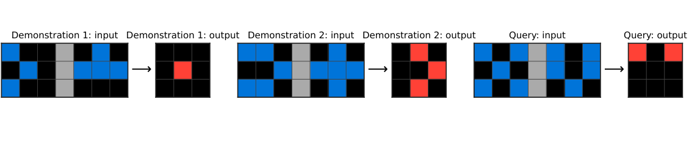
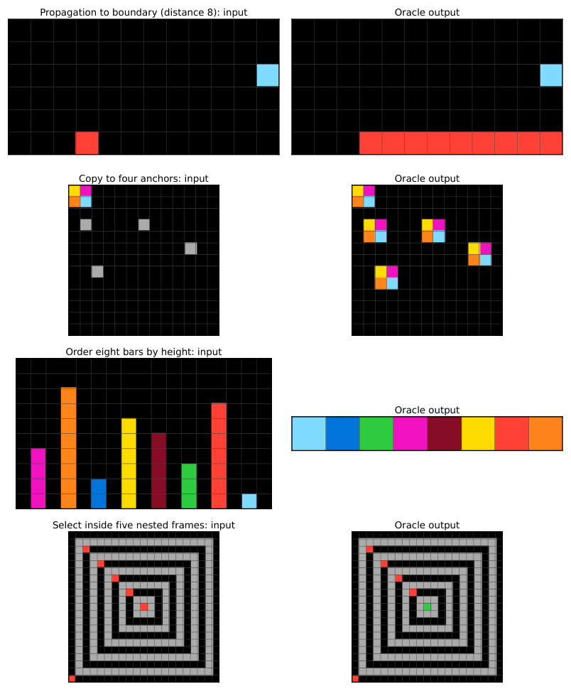
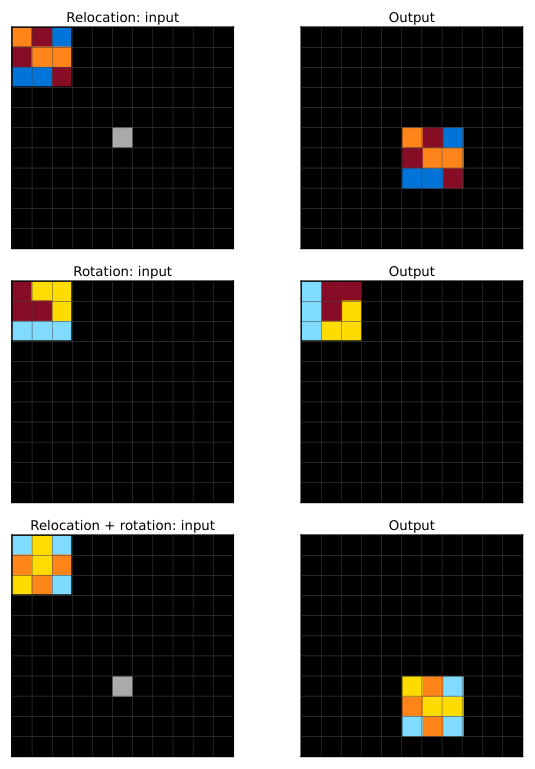

# BDH-CQ: In-Context Learning with Recurrent Latent Reasoning

> **论文**：BDH-CQ: In-Context Learning with Recurrent Latent Reasoning
> **作者**：B. Engdahl, A. Kosowski, J. Chorowski, Z. Stamirowska, P. Uznański, J. Jiang, R. Phadke, R. Kinas, R. Zhong（Pathway）
> **arXiv ID**：2608.09888
> **发表时间**：2026-08-10（v1）
> **许可协议**：MIT（配套代码仓库）
> **代码仓库**：https://github.com/pathwaycom/arc-task-gen（另见 https://github.com/pathwaycom/bdh）

## 第 1 章 概述

### 1.1 一句话定位

BDH-CQ 是一个结合 in-context learning（推理时演示更新循环记忆）与 recurrent latent reasoning（无语言中间步骤的迭代潜空间计算）的推理系统，以 150M 参数在 ARC-AGI-1 公共评估集上达到 29.5% pass@2、每任务计算成本仅 $0.00070，突破此前报告的成本–准确率 Pareto 前沿。

### 论文图表总览

| 编号 | 内容 | 章节 |
|------|------|------|
| **Figure 1** | ARC 任务示例（从演示推断交集变换） | 第 2 章 |
| **Figure 2** | ARC-AGI-1 成本–准确率 Pareto 前沿（leaderboard） | 第 5 章 |
| **Figure 3** | ConceptARC 16 概念家族能力画像 | 第 5 章 |
| **Figure 4** | 外推实验 held-out 输入与 oracle 输出示例 | 第 5 章 |
| **Figure 6** | 组合实验任务构造（操作与重定位组合） | 第 5 章 |
| **Figure 7** | 推理努力（LOW/MEDIUM/HIGH）缩放 | 第 5 章 |
| **Table 1** | ARC-AGI-1 与 ConceptARC 总体结果 | 第 5 章 |
| **Table 2** | ConceptARC 16 家族逐家族结果 | 第 5 章 |
| **Table 3** | 排序/嵌套外推：短 vs 支持上下文 | 第 5 章 |
| **Table 4** | 组合实验：单独 vs 与重定位组合 | 第 5 章 |
| **Table 5** | 推理努力三档 pass@2 与成本削减 | 第 5 章 |

> 注：论文 Figure 5 在 HTML 版本中无独立图片文件；Table 6-9 位于附录（评估集队列、机制分层、结构操纵、失败结构），见第 6 章。

### 1.2 核心贡献

1. **系统**：提出 BDH-CQ，将「演化式循环记忆的 in-context learning」与「结构化连续潜空间的迭代推理」统一进同一计算结构——演示在推理时更新循环记忆，查询通过高维潜空间迭代求解，中间推理状态不解码为语言；任务标识符与评估任务演示对均不参与训练，推理时零参数更新。
2. **成本–准确率前沿突破**：150M 参数配置在公共 ARC-AGI-1 评估集上达到 29.5% pass@2，每任务约 0.85 H200 GPU 秒、计算成本 $0.00070——按 ARC Prize 2026 年 7 月报价比 GPT 5.6 Luna (Low)（34.2%，$0.040/任务）便宜约 57 倍；计入 OpenAI 7 月 30 日 80% 降价后约 11 倍。独立黑盒审计（Bielik + NYU 共同作者）复现 29.5%。
3. **能力画像**：用 ConceptARC 16 概念家族与受控 ARC-like 干预实验系统刻画能力与失败边界——稠密映射绑定（96/96）、传播/拷贝无限外推（48/48）、排序/嵌套的执行与外推区分、组合的表示依赖、任务内一致性的短板（52/160 部分成功）。
4. **开源工具**：发布 arc-task-gen（MIT）——生成分布匹配 ARC-AGI-1 公共评估集的新任务，用于评估模型对未见任务的泛化；BDH 架构代码亦开源（pathwaycom/bdh，3.5k+ stars）。

### 1.3 关键结果速览

| 指标 | 数值 | 条件 |
|:---|:---|:---|
| ARC-AGI-1 pass@2 | **29.5%**（118/400，Wilson [25.24, 34.15]） | 150M 参数，默认（HIGH 努力）配置 |
| ARC-AGI-1 计算成本 | **$0.00070/任务**（约 0.85 H200 GPU 秒） | 按 $3/H200-小时折算 |
| 相对 GPT 5.6 Luna (Low) | 便宜约 57 倍（ARC Prize 2026-07 报价） | 34.2% @ $0.040/任务；计入 7/30 降价后约 11 倍 |
| ConceptARC strict task pass@2 | semantic 59.38%（95/160）/ opaque 60.00%（96/160） | 16 家族，每族 10 任务 |
| 最强家族（opaque） | ExtendToBoundary / FilledNotFilled / TopBottom2D 各 9/10 | 最弱：Copy / Order 各 2/10 |
| 稠密映射绑定 | 96/96 rank-one（2–8 个同时绑定） | 完全通过上下文引入 |
| 外推 | 传播 48/48（距离 2–8）、拷贝 48/48（1–4 位置） | 排序长度 8 仅 1/24；嵌套深度 5 为 29/36 |
| 组合 | 旋转+重定位 72/72；反射+重定位 47/72；颜色交换+重定位 0/72 | 72 held-out/条件 |
| 推理努力缩放 | LOW 21% → MEDIUM 27% → HIGH 29.5% | 成本削减 22%/11%/0% |

## 第 2 章 研究背景与动机

### 2.1 言语化推理的代价

In-context learning 允许模型从推理时呈现的示例习得新技能（Brown et al. 2020）。在自回归语言模型中，chain-of-thought（CoT）提示（Wei et al. 2022）为此补充了计算工作区：演示指定做什么，生成的中间 token 支持完成它所需的计算（Nye et al. 2021）。在可验证问题上的强化学习使这一组合日益强大——引出长推理轨迹、自验证与自适应求解策略（DeepSeek-AI et al. 2025）。

但这一组合将推理耦合到**串行叙述**：随着推理轨迹变长，token 消耗、延迟与推理算力同步增长。每个中间状态都必须投影到离散词表、自回归发射、再次消费后才能继续计算。

### 2.2 潜空间推理：另一计算体制

Latent reasoning 打开不同的计算体制：模型反复变换连续隐状态，仅解码答案，而非言语化每个中间结果。这消除了自然语言 token 作为内部计算强制表示的要求，允许一个状态同时保留部分假设或候选变换而不逐一序列化。连续思维与循环深度模型（Coconut，Hao et al. 2024；Geiping et al. 2025；Saunshi et al. 2025）表明此类计算可并行探索多条解路径。该分离也与人类概念推理与语言部分分离的证据一致（Fedorenko and Varley 2016）。

### 2.3 两条线的分离与合流动机

然而 latent reasoning 与 in-context learning 大体上各自独立发展：

- CoT 推理语言模型能灵活地从上下文学习，但通常通过生成的 token 分配额外计算
- 紧凑递归求解器在潜空间迭代推理，但其 ARC 管线通过优化与任务特定身份学习评估任务（HRM/TRM，Wang et al. 2025; Jolicoeur-Martineau 2025；ARC Prize Foundation 2025）——它们不会在推理时**仅从演示**习得未见变换

BDH-CQ 的目标正是这个结合点：**任务信息通过上下文写入循环记忆，潜空间计算应用它而无需谜题特定优化**。

### 2.4 ARC 作为受控、可验证的测试床

ARC（Abstraction and Reasoning Corpus，Chollet 2019）专为研究**技能获取效率**而设计——不仅系统是否拥有技能，还有获取它需要多少经验与先验结构。每个任务通过少量演示指定新变换；系统必须推断哪些对象、关系与操作构成变换规则并应用到新输入。ARC 将 in-context learning 旨在提供的快速泛化操作化。

*图1：输入含由灰色列分隔的两个二元面板。从演示中系统必须推断输出标记两面板共同占用的 cell，并将该关系迁移到查询——输入中没有任何内容命名交集、对齐或输出颜色含义。*

任务格式也使 BDH-CQ 行为可受控分析：演示构成任务规格，小尺寸彩色网格几乎不需要事实知识或语言流畅度，却能表达对象关系、计数、对称、拓扑、空间变换与组合；每个答案精确可验证、每个失败可视化可检查、多个测试输入揭示规则是否一致应用而非偶然猜中一次（Chollet et al. 2024）。

## 第 3 章 BDH-CQ 系统设计

### 3.1 BDH 血统

BDH-CQ 构建于 Dragon Hatchling（BDH）之上——一种后 Transformer 序列模型架构，围绕高维正激活、低秩通信与循环联想状态设计（Kosowski et al. 2025）。其 GPU 导向公式使用 BDH 层，在大神经元/特征空间中组合 ReLU 低秩变换与线性注意力。设计受大脑启发但非模仿：采用生物学正确的局部交互、稀疏活动、持续状态与持续调整原则，应用于现代序列模型。此前工作确立了 BDH 的语言、序列建模与可解释性性质。

BDH 层还支持约束满足的循环系统——Sudoku 系统迭代精炼视觉状态直至满足谜题约束（Pathway Research 2025）。BDH-CQ 将这一路线扩展为结合结构化潜空间工作区、跨模型深度的循环计算，以及从演示学习视觉变换的接口。

### 3.2 通过循环记忆实现 In-Context Learning

设任务提供演示 $D=\{(x_t, y_t)\}_{t=1}^{K}$ 与查询输入 $x^{\star}$。BDH-CQ 不将演示压缩为单一任务向量，而是顺序处理其元素。高层级上，其循环记忆演化：

$$S_{t}=U_{\theta}(S_{t-1}, D_{t}) \tag{1}$$

其中 $D_t$ 表示第 $t$ 个演示的内容，$\theta$ 保持固定。因此，后续输入可用的信息取决于先前输入与输出累积的关联。该循环上下文状态扮演的角色类似于注意力构建的上下文依赖关联，但避免了不断增长的显式键–值缓存。这一解读一般关联于注意力、快权重记忆与线性注意力的上下文关联视角（Vaswani et al. 2017; Ba et al. 2016; Katharopoulos et al. 2020; Geva et al. 2021）——线性注意力是 $S$ 上线性校正规则的概念上最简单的独立实现，捕获特例：

$$S_{t}=S_{t-1}+U_{\theta}(D_{t})$$

### 3.3 循环潜空间推理

演示与查询摄入后，BDH-CQ 在结构化潜空间工作区 $H_r$ 中执行迭代计算（在 $K$ 个演示并入记忆之后）。编码输入 $x^{\star}$、潜推理与解码输出 $\hat{y}$ 的过程由以下方程概括：

$$H_{0}=E_{\theta}(x^{\star}, S_{K}) \tag{2}$$

$$H_{r+1}=F_{\theta}(H_{r}, S_{K}), \quad r=0,\ldots,R-1 \tag{3}$$

$$\hat{y}=G_{\theta}(H_{R}) \tag{4}$$

上下文记忆 $S_t$ 与推理工作区 $H_r$ 具有不同概念角色：$S_t$ 随证据出现而变化，支持 in-context learning；$H_r$ 承载用于回答当前查询的持续计算。这一组织定义了本文研究的系统级接口。

> ⚠️ **专有实现说明**：维度、精确更新规则与实现细节保持专有（proprietary）未公开。论文报告的是任务接口、数据来源与系统级行为；内部训练配方同样未公开。
## 第 4 章 训练数据与评估协议

### 4.1 ARC 任务形式化

ARC 任务 $T_i$ 包含 $K_i$ 个演示对和 $Q_i$ 个测试对（$Q_i \geq 1$）：

$$T_i = \left(\{(x_{i,j}, y_{i,j})\}_{j=1}^{K_i}, \{(x^{\mathrm{test}}_{i,q}, y^{\mathrm{test}}_{i,q})\}_{q=1}^{Q_i}\right) \tag{5}$$

训练目标：模型在先前示例已并入循环上下文后，预测输出并产出精确的目标网格。论文报告了任务接口与数据来源，但**完整的内部训练配方（recipe）保持专有（proprietary）未公开**。

### 4.2 训练数据混合

150M 参数模型在一个精选的 ARC 风格数据集合上训练，混合了：

- 私有精选示例（privately curated examples）
- ARC-AGI-1 官方训练集（Chollet 2019）
- RE-ARC（Hodel 2024）
- ConceptARC（Moskvichev et al. 2023）
- ARC-Heavy（Li et al. 2025）
- ARC-GEN100K（Moffitt 2025）

并应用额外的数据增强以增加训练数据多样性。

### 4.3 评估设置

- **评估集**：ARC-AGI-1 公共评估集 400 个任务（Chollet 2019; Chollet et al. 2024）
- **计分惯例**：遵循 ARC-AGI 排行榜双尝试惯例（pass@2）——系统生成至多两个排序候选，任一候选正确即得分
- **成本核算**：从排行榜 score–cost 平面的实测硬件时间计算；默认配置约 0.85 H200 GPU 秒/任务，按 $3/H200-小时 折算约 $0.00070/任务
- **行为分析补充指标**：pass@1 与 test-pair 准确率
- **推理时零参数更新**：任务标识符与评估任务演示对均不参与训练

## 第 5 章 实验结果与分析

### 5.1 主结果：ARC-AGI-1 成本–准确率前沿突破

150M 参数系统在默认配置下达到 **29.5% pass@2**（118/400 任务，95% Wilson 置信区间 [25.24, 34.15]），耗时约 0.85 H200 GPU 秒/任务。按 $3/H200-小时折算，计算成本为 **$0.00070/任务**（不到十分之一美分）。如图 2 所示，该点位于此前报告的 Pareto 前沿之外——没有已绘制的系统能以同等或更低报告成本达到至少这一准确率。

*图2：BDH-CQ（150M）以 $0.0007/任务的成本达到 29.5% pass@2，突破此前 ARC-AGI-1 成本–准确率 Pareto 前沿。*

与 GPT 5.6 Luna (Low) 的对比（该模型以 $0.040 取得 34.2%）：

- 按 ARC Prize 2026 年 7 月报告成本计算：BDH-CQ 便宜约 **57 倍**
- 计入 OpenAI 2026 年 7 月 30 日 80% 公开 API 降价（截至 2026 年 8 月 6 日 ARC Prize 数据未反映）后：约 **11 倍** 便宜

**成本口径说明**：报告的美元价值从排行榜 score–cost 平面的实测硬件时间计算。默认点约 0.85 H200 GPU 秒/任务，按 $3/H200-小时折算 $0.00070/任务。排行榜上其他系统使用其报告成本（可能为硬件估算或 API 价格），因此成本比较的精确性受各系统报告口径差异影响。ARC Prize 2026 年 7 月数据中 GPT 5.6 Luna (Low) 为 34.2% @ $0.040；OpenAI 2026 年 7 月 30 日宣布 80% 公开 API 降价后，实际比价约为 11 倍而非 57 倍。

**独立评估**：由 Bielik 与纽约大学共同作者（Remigiusz Kinas、Richard Zhong）执行的独立黑盒审计，在文档化协议下（无权重访问）复现了部署系统的 29.5% pass@2；审计还评估了 ConceptARC 与手工构建评估集。此外，Transformer 架构共同作者 Łukasz Kaiser 亦复现了 ARC-AGI-1 结果。

### 5.2 能力画像：ARC-AGI-1 与 ConceptARC 总体表现

| 集合 / 条件 | 单位 | NN | pass@1 | pass@2 [95% Wilson] |
|:---|:---:|:---:|:---:|:---:|
| ARC-AGI-1 公共集 | tasks | 400 | 97 (24.25%) | 118 (29.50%) [25.24, 34.15] |
| | test pairs | 419 | 108 (25.78%) | 130 (31.03%) |
| ConceptARC, semantic IDs | tasks | 160 | 73 (45.63%) | 95 (59.38%) [51.63, 66.68] |
| | test pairs | 480 | 332 (69.17%) | 374 (77.92%) |
| ConceptARC, opaque IDs | tasks | 160 | 72 (45.00%) | 96 (60.00%) [52.26, 67.27] |
| | test pairs | 480 | 334 (69.58%) | 374 (77.92%) |

ConceptARC 将任务组织为 16 个概念家族，每族 10 个任务、30 个测试输入。严格任务准确率（一个任务仅在全部三个测试输入均解决时计为正确）作为主要度量，test-pair 准确率用于区分「变换的一致应用」与「单个输入上的偶然成功」。

### 5.3 概念家族级能力画像

各家族表现差异显著（opaque 标识复现中）：ExtendToBoundary、FilledNotFilled、TopBottom2D 各达 9/10 pass@2，而 Copy 与 Order 仅 2/10。注意每族仅 10 个任务，这些计数是「画像」而非可靠排序——9/10 与 2/10 的描述性 Wilson 区间（分别为 59.6%–98.2% 与 5.7%–51.0%）大幅重叠。

*图3：BDH-CQ 在 ConceptARC 16 个概念家族上的能力画像，展示变换类型间的显著性能差异。*

| 概念区域 | Task p@2 semantic | Task p@2 opaque | Task p@1 | Pair p@1 | Pair p@2 |
|:---|:---:|:---:|:---:|:---:|:---:|
| FilledNotFilled | 9 | 9 | 8 | 27 | 29 |
| TopBottom2D | 9 | 9 | 7 | 26 | 28 |
| ExtendToBoundary | 8 | 9 | 7 | 27 | 28 |
| CleanUp | 8 | 8 | 7 | 23 | 26 |
| HorizontalVertical | 7 | 7 | 4 | 21 | 25 |
| TopBottom3D | 7 | 7 | 7 | 25 | 26 |
| ExtractObjects | 7 | 6 | 5 | 19 | 22 |
| Center | 6 | 7 | 3 | 18 | 25 |
| CompleteShape | 6 | 6 | 4 | 21 | 26 |
| Count | 6 | 6 | 2 | 20 | 25 |
| AboveBelow | 5 | 5 | 4 | 20 | 21 |
| MoveToBoundary | 5 | 5 | 5 | 19 | 19 |
| InsideOutside | 4 | 4 | 2 | 16 | 20 |
| SameDifferent | 4 | 4 | 4 | 20 | 22 |
| Copy | 2 | 2 | 2 | 19 | 20 |
| Order | 2 | 2 | 2 | 11 | 12 |
| **Total** | **95** | **96** | **73** | **332** | **374** |

多个家族在 test-pair 与严格任务准确率之间存在显著差异。例如 Copy：semantic 复现中 test-pair pass@2 达 19/30，但严格任务仅 2/10（opaque 复现为 20/30 对）。系统能在该家族的许多输入上产出正确输出，但尚未在所有输入上一致地应用推断出的变换。

### 5.4 外推：简单算子外推，排序与嵌套暴露边界

模型冻结后构建受控任务，一次只改变一个复杂度来源。每个任务包含 3 个演示与 2 个保留输入，所有目标输出由确定性 oracle 生成。传播距离 1–3、拷贝 1–2 个、序列长度 2–4、嵌套深度 1–3 用于演示；保留实例超出这些范围。

*图4：各家族测试范围上端的 held-out 输入与 oracle 输出——传播与拷贝放大局部指定的操作，排序需从 8 个空间分离对象构造序列，嵌套需先解析 5 层包含关系。*

泛化模式差异显著：

- **传播（Propagation）**：距离 2–8 范围内 48/48 保留输出在 pass@1 与 pass@2 均正确；测试范围内未见天花板
- **拷贝（Copying）**：目标位置从 1 增至 4 时 48/48 正确
- **排序（Ordering）**：5 个对象内几乎饱和，长度 6 降至 29/36，长度 7 降至 8/24，长度 8 仅 1/24（pass@2）
- **嵌套（Nesting）**：深度 4 内几乎饱和，深度 5 降至 29/36

两类下降的失败签名不同：长度 8 排序仅 3/24 输出维度正确——失败影响输出整体构造；而深度 5 嵌套全部 36 个输出维度正确，平均最佳候选 cell 准确率超过 99.9%——错误通常仅在单个包含决策上偏离目标。

**执行能力 vs 外推能力归因实验**：对字节相同的长度-8 排序与深度-5 嵌套输入，在两种上下文复杂度下重跑。「short」上下文在长度/深度 3–4 处停止；「supported」上下文包含一个测试复杂度的演示。

| 家族 | 上下文 | Output p@1 | Output p@2 |
|:---|:---|:---:|:---:|
| Ordering (length 8) | Short | 0/24 | 0/24 |
| Ordering (length 8) | Supported | 12/24 | 13/24 |
| Nesting (depth 5) | Short | 15/24 | 19/24 |
| Nesting (depth 5) | Supported | 16/24 | 24/24 |

匹配的支持将深度-5 嵌套从 19/24 提升至 24/24 精确输出（pass@2）；排序从 0/24 基线恢复 13/24 输出。嵌套悬崖因此主要是未能外推演示的关系深度；长排序也受益于支持，但仍保留执行瓶颈。

### 5.5 上下文绑定与组合

**稠密映射绑定**：每个任务通过演示定义全新颜色置换，需对两个保留序列逐元素应用。同时绑定数从 2 增至 8 时，系统以 rank one 解决全部 96 个保留输出（每个级别 24/24）——能恢复并一致应用完全通过上下文引入的相对稠密的任务特定映射。

**组合实验**：演示为单一操作或操作组合；每个演示/测试输入板为 3×3 颜色网格（motif）置于左上角。测试水平反射、演示定义的双色交换、顺时针旋转，以及与「motif 重定位到标记位置」的组合。三个稠密非对称 3×3 motif 家族提供每条件 72 个保留输出。

*图6：组合实验构造——单一操作或其与重定位的组合作为演示，检验 BDH-CQ 对操作的组合能力。*

| 操作 | Alone | 与重定位组合 |
|:---|:---:|:---:|
| Relocation | 72/72 | n/a |
| Reflection | 72/72 | 47/72 |
| Rotation | 72/72 | 72/72 |
| Color swap | 26/72 | 0/72 |

重定位单独、原子反射、原子旋转均在 72/72 保留输出上解决。旋转+重定位 72/72，反射+重定位 47/72——模型学会了在大多数（非全部）颜色布局上组合反射与重定位。颜色交换仅在原始家族原子习得（26/72 合并），且从未学会与重定位组合（0/72）；两个打乱家族各自仅 1/24，说明原始家族固定布局使交换更易推断，其组合失败不能单独归因于组合本身。

### 5.6 任务内一致性

semantic ConceptARC pair 准确率（77.92%）与严格任务准确率（59.38%）之间 18.5 个百分点的差距不仅是更严格度量的结果。pass@2 下系统在 13 个任务上解决 0 个测试对、15 个任务 1 个、37 个任务 2 个、95 个任务全部 3 个——即 52/160 任务有一个或两个正确测试输入但未作为任务解决。在规则归纳视角下，正确归纳的规则应迁移到任务每个测试输入；这种部分成功说明观察到的变换未跨输入一致应用。

### 5.7 标识符与批次上下文复现

最直接的请求侧混杂：系统可能利用语义 task_id 或概念分组批次上下文而非网格本身。opaque 复现将标识符替换为密码学不透明标签并混合批次内的概念区域。聚合性能未移动：两种条件下均解决 374/480 test pairs，opaque 96/160 任务 vs semantic 95/160；配对 test-pair 结果恰好 6 个 semantic-only 与 6 个 opaque-only pass@2 成功——无方向性证据表明移除请求侧线索改变性能。

聚合稳定不意味着输出相同：两次执行中 442/480 首候选、276/480 完整有序候选列表、455/480 尝试次数一致。请求上下文、调用时间或内部搜索路径可改变返回的候选而不改变聚合分数。复现排除了「标识符+批次」组合混杂作为 ConceptARC 得分的解释；它不使 ConceptARC 成为新基准、不排除训练/检查点选择的暴露，也不对两干预做因子化隔离。

### 5.8 尝试交付、可重复性与努力档位

opaque ConceptARC 复现中，全部 75 个单候选记录在 rank one 已正确——名义 pass@2 不应被解读为每个输入两次独立采样尝试的结果。

**MIN 努力档位**：成本为标准的三分之一（$0.00088399 vs $0.00265246/任务），得分 111/400 而非 118/400 pass@2，差 −1.75 个百分点。配对划分为 105 个任务两种设置均解决、13 个仅标准、6 个仅 MIN、276 个均未解决（双边精确 McNemar p=0.167）。四项端点均在点估计上偏向标准，但此比较统计上未决。

重复相同请求在两种档位字节一致：标准重跑匹配先前标准运行全部 419 个 ARC-AGI-1 测试输入，重复 MIN 运行同样匹配全部 419 个。

### 5.9 推理努力缩放

训练时改变 latent reasoning 级别，得到暴露于不同推理努力的模型；推理时可选应用级别。

*图7：从 LOW 到 MEDIUM 到 HIGH 提升 latent reasoning 努力稳定提升 pass@2（21%→27%→29.5%），HIGH 为默认操作点。*

| 努力 | Pass@2 | 成本削减 |
|:---|:---:|:---:|
| HIGH | 29.5% | 0% |
| MEDIUM | 27% | 11% |
| LOW | 21% | 22% |

从 LOW 到 MEDIUM、MEDIUM 到 HIGH 增加努力均提升准确率。

## 第 6 章 能力画像与失败结构分析

### 6.1 三个评估队列对比

| 评估队列 | 任务数 | 解决 | 解决率 |
|:---|:---:|:---:|:---:|
| 公共 ARC-AGI-1 评估集 | 400 | 118 | 29.5% |
| 校准生成集（calibrated generated） | 400 | 149 | 37.2% |
| 机制分层生成集（mechanic-stratified） | 1,131 | 337 | 29.8% |

简单表面属性几乎无法解释成功：对公共集 39 个分桶（网格大小、颜色数、对象数、演示数）、生成集 38 个分桶的评估中，仅公共集 9 个分桶超过置换搜索零假设，生成集为 0。网格大小是最强单一描述符但仍很弱——公共任务 pseudo-$R^2 = 0.072$，生成任务 0.010。测量到的成功差异不能约化为单一粗略表面描述符。

### 6.2 变换机制（Mechanic）分层

不控制所需变换机制的自由生成，每 3 个 gravity-and-stacking 任务约产生 80 个旋转任务，罕见机制样本过稀。因此在 16 个机制上生成近似平衡样本，共 1,131 个任务。

| Mechanic | n | 解决率 | 95% CI | 平均边长 |
|:---|:---:|:---:|:---:|:---:|
| Flood fill | 51 | 68.6% | [55,80] | 15.6 |
| Denoising | 65 | 56.9% | [45,68] | 18.8 |
| Scaling | 82 | 53.7% | [43,64] | 15.1 |
| Cropping and extraction | 74 | 44.6% | [34,56] | 19.0 |
| Translation | 87 | 35.6% | [26,46] | 16.6 |
| Tiling and repetition | 79 | 34.2% | [25,45] | 19.5 |
| Line drawing | 84 | 29.8% | [21,40] | 16.6 |
| Rotation | 75 | 25.3% | [17,36] | 14.9 |
| Recolor by property | 75 | 25.3% | [17,36] | 17.0 |
| Object sorting and rank | 68 | 19.1% | [12,30] | 14.9 |
| Object counting | 86 | 18.6% | [12,28] | 16.7 |
| Reflection | 72 | 16.7% | [10,27] | 17.7 |
| Symmetry completion | 61 | 16.4% | [9,28] | 25.5 |
| Occlusion repair | 56 | 16.1% | [9,28] | 24.3 |
| Panel set operation | 48 | 10.4% | [5,22] | 11.0 |
| Gravity and stacking | 68 | 2.9% | [1,10] | 14.6 |

机制是有用的诊断分层器：解决率跨度 65.7 个百分点（flood fill 68.6% 到 gravity and stacking 2.9%）。20,000 次固定组大小置换中，95 百分位跨度 27.0 点，无一次置换匹配观测跨度（p<0.00005）。类别层面，平均网格边长与机制解决率基本无线性关联（r=−0.022）；panel set operation 平均边长最小但解决率倒数第二。此聚合相关不控制机制内大小变化。

**重要限定**：该画像不是操作的内在排序。每个分层任务由 GPT-5.6 从命名目标机制的 prompt 生成，因此每个比率也反映该生成器如何实例化请求的操作。公共与生成机制比率无可靠秩对应（16 个机制 ρ=0.300）。手工书写对比家族暴露实质任务构造混杂：手写 gravity 任务 80–100% vs 生成 2.9%；手写 counting 85–95% vs 生成 18.6%；touching-panel overlays 两种模式都难（手写 7.5% vs 生成 10.4%）。

### 6.3 受控结构操纵（ladders）

十个确定性 Python 生成阶梯（ladder）直接改变演示如何选择/参数化变换。每级保持 12×12 网格、3 个演示、1 个测试对、固定调色板、40 个任务。保留分析含 1,840 次任务评估；选择结果使用修正的 240 任务重跑（原始生成器遗漏部分演示集所需规则）。

| 操纵 | 参照 | 变更条件 | 变化 |
|:---|:---:|:---:|:---:|
| 条件规则选择 | 100.0% | 56.7% | −43.3 |
| 演示中缺失参数 | 30.0% | 0.0% | −30.0 |
| Panel union，两到三面板 | 65.0% | 2.5% | −62.5 |
| 支撑链，最短到 8 对象 | 80.0% | 27.5% | −52.5 |

**条件规则选择**：角标记决定两个演示规则中哪一个适用。对照（标记变化但两值调用同一规则）40/40 解决。合并颜色/位置/计数线索，两规则间真实选择在 68/120 任务（56.7%，95% CI [48,65]）上解决，下降 43.3 点（p=9×10⁻⁹，双边 Fisher 精确检验）。对照表明下降归于使用线索选择规则，而非可变标记本身。

**演示缺失参数**：标记计数指定向下偏移。测试值出现在演示中时解决 12/40；值缺失时 0/120（插值未见值 0/40、两种外推条件 0/80；对演示值条件合并检验 p=1.4×10⁻⁸）。边界在于值是否被演示，而非是否在演示范围内。但演示值条件本身仅 30.0%，可能与条件参数化限制共享根因。

**Panel union**：对角两面板 26/40，三面板仅 1/40。分离本身即重要：两触摸面板 3/40 vs 对角面板 26/40。与分割（segmentation）限制一致，但分析未直接测试模型分割。

**无检测代价的操纵**：四个轴对齐操作序列 38/40；计数 10–12 对象 34/40 vs 1–3 对象 36/40；三个独立运动对象 40/40。轴对齐家族中操作数在测试范围内无检测代价。对象依赖则不同：支撑链从 80.0%（一对象支撑另一对象）单调降至 67.5%、52.5%、27.5%（链长 3、5、8）。三对象独立对照表明该规模下多重性本身不导致失败。较长链中对象数与依赖深度共变，因此梯度与依赖代价一致但未在每一级与对象数隔离。

### 6.4 失败结构

| 失败属性 | 校准生成集 | 公共集 |
|:---|:---:|:---:|
| 输出维度正确 | 89.2% | 89.7% |
| 调色板正确 | 72.9% | 78.0% |
| 中位 cell 误差（形状正确） | 4.0% | 8.3% |
| 逐字复现输入 | 8.4% | 4.6% |
| 目标编辑覆盖不足 | 15.5% | 7.8% |

大部分失败保留输出维度与调色板；形状正确失败常仅在小部分 cell 上与目标不同。校准集 251 个失败任务、公共集 282 个。这些输出级签名刻画最终网格但不识别模型遵循的潜在规则——评估器返回网格而非推理轨迹，因此「正确规则应用不完整」与「更窄规则完整应用」观测上不可区分。

### 6.5 分析范围限制

- 手工检查发现至少一个任务其声明的测试输出与演示一致表达的规则相矛盾；该缺陷普遍性未知
- 独立 LLM 机制标签与请求标签在已标注非随机 659 任务子集上 82.9% 一致；部分机制定义重叠
- 去重移除合并生成池 24%（集中于 flood fill 与 panel set operation）
- 每阶梯条件仅含同一谜题家族 40 个任务：结果确立了条件选择、未见参数值、面板数量/分离的强家族内差异及支撑链长度的分级关联；尚未确立这些差异跨视觉操作泛化

### 6.6 能力画像的综合解读

将主结果与受控实验合并，BDH-CQ 的能力不是单一「推理难度」标量，而是一个由四类因素塑造的画像：

1. **上下文绑定能力**：稠密映射实验（96/96 rank-one）与 ConceptARC 中多个家族的 9/10 表明，演示驱动的循环记忆能可靠绑定并一致应用任务特定变换；这是 in-context learning 核心机制的直接证据。
2. **演示覆盖决定外推**：深度-5 嵌套从 19/24 提升至 24/24、长度-8 排序从 0/24 恢复至 13/24，说明演示中是否包含测试复杂度级别的示例直接决定操作能否外推——「值是否被演示」比「是否在演示范围内」更关键。
3. **执行能力与输出构造分离**：排序失败破坏输出整体（长度 8 仅 3/24 维度正确），嵌套失败保留结构（100% 维度正确、cell 准确率 >99.9%）；两类失败需要不同的修复路径（前者提升执行容量，后者增加演示覆盖）。
4. **组合的表示依赖**：旋转与重定位全组合成功（72/72），反射部分成功（47/72），颜色交换从不组合成功（0/72）——组合能力不是通用属性，而是随操作的具体表示与训练分布而变化。

这些结果共同支持论文的核心主张：in-context latent reasoning 是一个具体的、可分解的研究方向，其能力边界可以被系统刻画并在不同维度上独立改进。

## 第 7 章 局限性与延伸阅读

### 7.1 系统级局限

- **专有实现**：维度、精确更新规则与实现细节未公开；训练配方 proprietary——第三方无法复现训练过程，只能进行黑盒行为评估
- **评估子集性质**：ARC-AGI-1 公共评估集作为公共基准，无法完全隔离少样本规则归纳与对任务的潜在先验熟悉；arc-task-gen 生成的私有评估集（37.2% 解决率）提供互补度量
- **严格任务一致性的持续短板**：52/160 ConceptARC 任务存在部分成功，Copy/Order 家族严格任务仅 2/10——规则归纳后未一致应用
- **组合的表示依赖**：颜色交换未在打乱布局家族可靠习得（1/24）且从未与重定位组合（0/72），说明组合能力依赖操作的具体表示
- **条件执行与参数化边界**：条件规则选择（−43.3 pp）与演示缺失参数（30.0%→0.0%）暴露条件绑定限制；长排序（长度 8 仅 1/24）显示执行瓶颈
- **生成评估集的构造混杂**：机制分层任务由 GPT-5.6 生成，手写/生成任务解决率差异巨大（gravity 80–100% vs 2.9%），机制画像不能解读为操作内在难度排序
- **审计覆盖**：独立审计为黑盒（无权重访问），未测试训练数据暴露与检查点选择路径

### 7.2 延伸方向（论文展望）

- **规模扩展**：BDH-CQ 架构天然支持大规模，继承 BDH 的张量分片模式，1T 规模训练便利；1B–600B 预训练实验确认 Transformer 类似 scaling laws，同时保留 BDH-CQ 的 latent reasoning 能力
- **ARC-AGI-2**：下一视觉推理目标；本文诊断提供输出构造、条件绑定、演示覆盖、多算子组合的具体开发议程
- **约束满足**：Sudoku 等域提供长视界潜在精炼的互补测试
- **语言与数学推理**：测试同一循环记忆能否从文本演示习得任务，同时保留 BDH 的序列建模能力
- **混合推理**：BDH 层同时支持语言建模与 latent reasoning，未来系统可在需要通信/验证/工具使用时组合连续内部计算与言语化步骤

### 7.3 相关文献延伸

| 方向 | 代表工作 | 与 BDH-CQ 的关系 |
|:---|:---|:---|
| 言语化推理 | CoT (Wei et al. 2022) | 上下文规格 + 自回归计算 scratchpad；BDH-CQ 使中间语言生成不必要 |
| 连续思维 | Coconut (Hao et al. 2024) | 首个连续隐状态反馈演示；BDH-CQ 用多向量工作区 + 演示更新循环任务记忆 |
| 连续思维理论 | Zhu et al. 2025（图可达性）、Xu and Sato 2026 | 一个连续状态可并行携带多个活跃假设；潜在迭代 vs 随机 token 解码的并行/采样权衡 |
| 抽象离散思维 | Abstract-CoT (Ramji et al. 2026) | 保留字词汇短自回归序列，至多 11.6 倍更少推理 token；离散端非语言推理 |
| 循环深度 | Geiping et al. 2025; Saunshi et al. 2025; Zhu et al. 2026 | 共享块循环应用改进推理基准；BDH-CQ 关注演示依赖学习 |
| 任务训练递归求解器 | HRM/TRM (Wang et al. 2025; Jolicoeur-Martineau 2025) | 转导式 ARC 管线：评估任务演示增强 + 优化，任务标识嵌入，投票；$1.48–$1.76/任务；BDH-CQ 目标无需谜题特定优化的上下文学习 |
| 概念组织评估 | ConceptARC (Moskvichev et al. 2023) | BDH-CQ 能力画像的组织图 |
