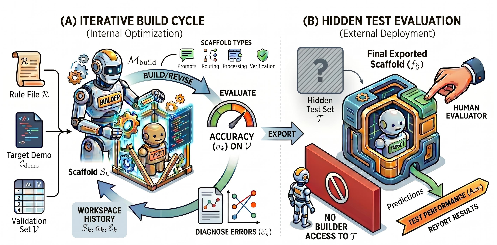

> **论文**：AI4AI at Test-Time: Strong-to-Weak Capability Transfer via Harnesses
> **作者**：Cheng Qian, Wenting Zhao, Liangwei Yang, Heng Wang, Jielin Qiu, Heng Ji, Silvio Savarese, Huan Wang, Shelby Heinecke（UIUC / NVIDIA）
> **arXiv ID**：2608.12307
> **发表时间**：2026-08-12
> **许可协议**：未标注
> **代码仓库**：无官方实现

## 第 1 章 概述

### 1.1 一句话定位

论文提出 **strong-to-weak scaffolding** 范式：强 builder 模型在推理时为弱 target 模型构建 harness（推理时脚手架），在不修改 target 权重的前提下实现能力迁移。

### 论文图表总览

| 编号 | 内容 | 章节 |
|------|------|------|
| **Figure 1** | 系统框架图：builder 构建 scaffold 并部署到 target 的流程 | 第 3 章 |
| **Figure 2** | 实验设计概览热图 | 第 4 章 |
| **Table 1** | 各 builder scaffold 的 macro-average 准确率 | 第 5 章 |
| **Table 2** | 12 类 scaffold 技术普及率 | 第 5 章 |

### 1.2 核心贡献

1. **范式形式化**：将 strong-to-weak scaffolding 定义为训练时蒸馏的互补范式——能力通过 harness 而非权重迁移，target 模型参数保持冻结。
2. **系统实证分析**：72 次实验（11 builders × 3 platforms × repeats + target 对比），从 10 个方面（Aspect 0–9）考察效果量、稳定性、验证效率、技术分类、平台效应、target 依赖、builder 推理努力、归因机制、认知负荷降低、残余错误。
3. **设计原则提取**：成功 scaffold 由确定性卸载（deterministic offloading）、基准感知路由（benchmark-aware routing）、格式控制、定向分解驱动，而非暴力验证搜索。
4. **数据级证据**：GPT-5.4-mini 从 0.488 → 0.912（最佳 run，+0.423，论文正文表述为 87% 相对提升），100% runs 超过 baseline，接近人类设计的 UserHarness (0.939)。

### 1.3 关键结果速览

| 指标 | 数值 | 说明 |
|------|------|------|
| 最佳 run | 0.488 → 0.912（+0.423） | GPT-5.5 builder on GPT Codex，GPT-5.4-mini target |
| 全部 scaffolded runs 均值 | 0.763（+0.275） | 57 个 GPT-5.4-mini-target scaffolded runs 宏平均 |
| 超基线比例 | 100%（57/57 runs） | GPT-5.4-mini target 下全部 run 超 vanilla baseline |
| 人类设计上界参考 | 0.939 / 0.941 | UserHarness，GPT-5.4-mini target / Gemini-3.5-flash target |
| 实验规模 | 72 runs | 3 platforms × 11 builders × repeats + target 对比 |
| 隐藏测试集 | 3900 items | BigToM 1200 + Hi-ToM 1200 + MMToM-QA 600 + MuMA-ToM 900 |
| Validation 比例 | 5%（195 items） | 固定随机种子采样 |

## 第 2 章 研究背景与动机

### 2.1 蒸馏范式及其训练前提

主流能力迁移方法——data distillation、on-policy distillation、teacher forcing——均通过更新弱模型参数实现。这类方法的共同前提是**可训练性**：需要梯度访问、训练基础设施与参数更新权限。当 target 模型为闭源 API 或部署环境不支持微调时，这些方法无法适用。

论文提出互补路径：能力可在**测试时**迁移。模型表现受任务呈现方式产生的 cognitive load 影响，改进路径因此有两条——改进模型本身，或改进任务呈现方式使其更易解。后一路径不触及 target 参数，仅改变推理时环境。

### 2.2 从 cognitive load 到 harness 工程

模型在 raw benchmark 格式下直接作答时承担全部认知负荷：解析题面、规划推理步骤、格式化输出、自我验证。harness 工程将这些步骤**外部化**——通过 routing logic、prompt templates、verification passes、deterministic solvers 等机制将推理结构移入 scaffold，使 target 模型专注于其能力范围内的子任务。

### 2.3 与 weak-to-strong generalization 的区别

weak-to-strong generalization 研究用弱标注信号引导强模型学习，其机制仍依赖权重更新。本文方向相反（strong-to-weak）：强模型为弱模型构建推理时 scaffold，且整个流程不触及任何模型的参数。两者互补——前者改进模型，后者改进任务呈现。

### 2.4 为何选 Theory-of-Mind 基准

四个 ToM benchmark 的结构化程度形成梯度，为测试 scaffold 的编译能力提供了差异化测试床：

- **BigToM**（1200 items）：binary belief/goal/action 判定，观察世界变化——结构高度可编译，最佳 scaffold 达 1.00 准确率。
- **Hi-ToM**（1200 items）：recursion depth 0–4、deception、multi-room——递归深度增大时残余错误集中（order 4 仅 0.700）。
- **MMToM-QA**（600 items）：Bayesian goal/belief inference from action trace——依赖概率推理，部分题型可确定性卸载。
- **MuMA-ToM**（900 items）：3-choice multi-agent social reasoning——模型主导（model-only share GPT target 40% → Gemini target 73%），确定性卸载空间最小。

## 第 3 章 方法形式化

### 3.1 设定

强 builder 模型 $M_{\text{build}}$ 为固定弱 target 模型 $M_{\text{tar}}$ 构建推理时 scaffold。每个 benchmark 采样 5% 数据作为 validation $V$，其余为隐藏测试集 $T$；builder 永不访问 $T$。

Builder 初始工作区定义为：

$$W_0 = \{R,\; C_{\text{demo}},\; V\}$$

其中 $R$ 为规则文件（任务说明与提交格式约束），$C_{\text{demo}}$ 为演示文件（展示如何调用 target 模型 $M_{\text{tar}}$），$V$ 为 5% validation 集（195 items）。

### 3.2 优化目标

理想最优 scaffold 在隐藏测试集上最大化 target 准确率：

$$S^* = \arg\max_{S}\; \text{Acc}(S,\; M_{\text{tar}};\; T)$$

由于 $T$ 对 builder 隐藏，builder 以 validation 集上的准确率为代理目标：

$$\hat{S} = \arg\max_{S \in \mathcal{S}_{\text{build}}} \operatorname{Acc}(S,\; M_{\text{tar}};\; V)$$

该代理的有效性经实证验证：最佳 validation 准确率与完整测试准确率的 Pearson 相关系数 $r = 0.96$，optimism gap 仅 0.021；validation 迭代次数与最终准确率无相关（$r = 0.17$），表明 builder 质量而非验证次数驱动性能。

### 3.3 Builder 可用机制

Builder 不受约束，可实施任意推理时程序。论文观察到的机制清单：

| 机制 | 说明 | 普及率 |
|------|------|--------|
| Format enforcement | 强制输出格式约束 | 100% |
| Greedy decoding | 确定性解码策略 | 98% |
| Benchmark routing | 按数据集分发到不同处理路径 | 95% |
| Forced CoT | 强制链式推理 | 79% |
| Polarity alignment | 答案极性对齐 | 79% |
| Token-budget control | token 预算控制 | 75% |
| Hybrid fallback | 混合回退策略 | 60% |
| Deterministic solver | 确定性符号求解器 | 54% |
| Structured extraction | 结构化信息抽取 | 51% |
| Few-shot retrieval | 少量示例检索 | 21% |
| Verification pass | 验证检查 | 12% |
| Self-consistency | 自一致性采样 | 5% |

普及率数据来源：论文 Table 2（§5.4），反映 72 runs 中各技术的出现频率。

### 3.4 评估流程

人类评估者运行 builder 导出的 entry point 于隐藏测试集 $T$，过程中 builder 无任何干预——builder 无法查看 $T$ 上的结果或据此调整 scaffold。这确保 $\hat{S}$ 的选择完全基于 validation $V$，测试集性能为无偏估计。

*图 1：builder 构建 scaffold 并部署到 target 的流程。Builder 在工作区 $W_0$ 中以 validation 集 $V$ 为反馈信号迭代优化 scaffold $\hat{S}$，人类评估者将最终 $\hat{S}$ 部署到 target 模型 $M_{\text{tar}}$ 上运行隐藏测试集 $T$。*
## 第 4 章 实验设置

### 4.1 任务与指标

论文聚合四个 Theory-of-Mind 数据集构成 3900-item 隐藏测试集，全部采用文本格式问题：

| 数据集 | 规模 | 问题类型 | 结构特征 |
|:------|:-----|:---------|:---------|
| BigToM | 1200 条 | binary belief/goal/action 判定 | 依赖 agent 是否观察到世界变化 |
| Hi-ToM | 1200 条 | 嵌套信念问题，recursion order 0–4 | 含 deception 与 multi-room object tracking |
| MMToM-QA | 600 条 | binary Bayesian goal/belief 推断 | 从动作轨迹推断意图 |
| MuMA-ToM | 900 条 | 3-choice multi-agent 问题 | belief / social-goal / belief-of-goal |

每个 builder 额外获得 195-item（5%）validation 样本（固定随机种子采样）。主指标为四个 benchmark 全量准确率的 **unweighted macro average**；validation 使用次数作为次级效率指标。

### 4.2 实验设计

控制三个维度的超参数：

| 维度 | 取值 |
|:-----|:-----|
| **Platform**（builder 运行环境） | Cursor、Claude Code、GPT Codex |
| **Builder Model**（编写 scaffold 的模型） | Opus-4.7（low/med/high/x-high 四档推理努力）、Sonnet-4.6、GPT-5.5、GPT-5.4-mini、Codex-5.3、Gemini-3.1-Pro、Gemini-3.5-flash、Grok-0.1 |
| **Target Model**（被 scaffold 的弱模型） | GPT-5.4-mini（主 target）、Gemini-3.5-flash |

每个实验设置重复 3 次（Repeats）以考察 harness 稳定性，共 **72 个实验 run**。主设置固定 target 为 GPT-5.4-mini 作为多数受控对比的公共对照组。

### 4.3 基线

| 基线 | 定义 | GPT-5.4-mini | Gemini-3.5-flash |
|:-----|:-----|:------------:|:----------------:|
| Vanilla | 直接调用 target，无任务级 scaffold | 0.488 | 0.761 |
| Human-Inspired Harness | UserHarness（人类设计的 ToM harness） | 0.939 | 0.941 |

Vanilla 基线衡量 scaffold 应提升的起点；UserHarness 提供人类设计的 harness 有效性参照点。

*图 2：72 个实验 run 的配置热图——横轴为 builder×platform 组合，纵轴为四个 benchmark 准确率与 macro-average，直观呈现各配置的相对表现分布。*

## 第 5 章 实验结果与分析

### 5.1 主结果（Aspect 0）：强到弱 scaffold 提升显著且稳健

**设置**：target 固定为 GPT-5.4-mini（无 scaffold 直接调用基线 macro-average 0.488）。对每个 builder 模型聚合其跨平台与重复的 run，报告各 benchmark 准确率与 macro-average。

**结果**：

| Scaffold builder | RR | BigToM | Hi-ToM | MMToM | MuMA | Avg. (±sd) | Δ |
|:----------------|:--:|:------:|:------:|:-----:|:----:|:----------:|:---:|
| Baseline (no scaffold) | – | 0.503 | 0.569 | 0.412 | 0.469 | 0.488 | – |
| GPT-5.5 | 6 | 1.000 | 0.803 | 0.842 | 0.857 | 0.875 ± 0.036 | +0.387 |
| Opus-4.7 (x-high) | 6 | 0.970 | 0.791 | 0.788 | 0.876 | 0.856 ± 0.022 | +0.368 |
| Gemini-3.5-flash | 3 | 0.986 | 0.712 | 0.778 | 0.777 | 0.813 ± 0.047 | +0.325 |
| Sonnet-4.6 | 6 | 0.977 | 0.712 | 0.742 | 0.810 | 0.810 ± 0.069 | +0.322 |
| Opus-4.7 (high) | 6 | 0.922 | 0.739 | 0.777 | 0.791 | 0.807 ± 0.033 | +0.319 |
| Opus-4.7 (med) | 6 | 0.944 | 0.699 | 0.751 | 0.778 | 0.793 ± 0.065 | +0.305 |
| Gemini-3.1-Pro | 3 | 0.910 | 0.732 | 0.618 | 0.593 | 0.713 ± 0.027 | +0.225 |
| Opus-4.7 (low) | 6 | 0.887 | 0.688 | 0.609 | 0.659 | 0.711 ± 0.031 | +0.222 |
| GPT-5.4-mini | 6 | 0.981 | 0.649 | 0.619 | 0.474 | 0.681 ± 0.062 | +0.193 |
| Codex-5.3 | 6 | 0.983 | 0.625 | 0.563 | 0.528 | 0.675 ± 0.043 | +0.187 |
| Grok-0.1 | 3 | 0.613 | 0.592 | 0.537 | 0.511 | 0.563 ± 0.036 | +0.075 |

*表 1：GPT-5.4-mini target 下各 builder 的 scaffold 效果（论文 Table 1）。RR = 该 builder 的 run 数。*

全部 57 个 scaffolded GPT-5.4-mini run 的均值 macro-average 为 **0.763（+0.275）**，100% 的 run 超过基线；11 个 builder 配置全部优于基线。最佳单 run 由 GPT-5.5 on GPT Codex 产生，达 **0.912（+0.423，87% 相对提升）**。

与参考点对比：最佳自动 scaffold 在全部四个 benchmark 上同时超越无 scaffold 的 GPT-5.4（0.619）与 GPT-OSS-120B；相对人类设计的 UserHarness，BigToM 上自动 scaffold 达到近上限（1.00 vs 0.95）且略超，但 Hi-ToM（0.80 vs 0.87）、MMToM-QA（0.84 vs 0.98）、MuMA-ToM（0.88 vs 0.96）仍有明显差距——残余差距集中在难以编译为确定性结构的推理场景。

### 5.2 稳定性（Aspect 1）：可复现但非完全确定

同一设置（相同 platform、builder、target）内 3 次独立重复的 macro-average 标准差均值为 **0.036**，比 +0.275 的均值提升小一个数量级；最宽设置的重复跨度达 0.201。

逐案调查发现最大离散出现在 **deterministic-solver 策略**：benchmark 特定规则中的单个逻辑错误可导致 1000+ item 全量集上数十个百分点的偏移。Prompt-only scaffold 更稳定但增益更小。实用配方：构建 2–3 个 scaffold 并选择 validation 表现最佳者，可低成本逼近设置性能上限。

### 5.3 Validation 效率（Aspect 2）：builder 质量优于验证次数

Builder 平均使用 4.9 次 validation 评估（中位数 5，范围 2–15）。run 内 refinement 有效：从首次记录迭代到最佳迭代，validation 准确率平均提升 0.216。

| 关系 | 统计量 | 结论 |
|:-----|:-------|:-----|
| 最佳 validation 分 vs 全量准确率 | Pearson r = 0.96 | 5% validation 是隐藏集的忠实代理，几乎一一对应 |
| Optimism gap | 均值 0.021 | 少量过拟合，不显著 |
| Validation 迭代次数 vs 全量准确率 | Pearson r = 0.17 | 几乎不相关——builder 质量主导，验证预算次要 |

### 5.4 Scaffold 技术（Aspect 3）：纪律性任务工程为主

对全部 72 run 的 scaffold 代码与优化日志做 12 类技术分类编码（仅统计 target 为 GPT-5.4-mini 的 run）：

| 技术 | 出现次数 | 占比 |
|:-----|:-------:|:----:|
| Format enforcement | 57/57 | 100% |
| Greedy / temp control | 56/57 | 98% |
| Benchmark routing | 54/57 | 95% |
| Forced CoT | 45/57 | 79% |
| Polarity / negation logic | 45/57 | 79% |
| Token-budget tuning | 43/57 | 75% |
| Hybrid fallback | 34/57 | 60% |
| Deterministic solver | 31/57 | 54% |
| Structured extraction | 29/57 | 51% |
| Few-shot examples | 12/57 | 21% |
| Verification / arbiter | 7/57 | 12% |
| Self-consistency vote | 3/57 | 5% |

*表 2：12 类 scaffold 技术普及率（论文 Table 2，§5.4）。*

两种技术近乎通用：robust format enforcement（可靠解析答案选项）与 greedy decoding（temperature 0）。复杂策略（deterministic solvers、self-consistency voting、verification/arbiter）仅出现在少数 scaffold。技术选择强烈依赖任务：BigToM 常被确定性/混合规则求解（问题暴露 observed/unobserved 区分），MuMA-ToM 几乎总是由模型自行处理。per-benchmark 方法图实际上构成 ToM 任务的 **compilability ranking**：BigToM 高度可规则编译，MuMA-ToM 基本保持模型中介。

### 5.5 平台效应（Aspect 4）：二阶因素，条件性存在

(i) **Native-platform 增益小且不一致**：8 组匹配配置中，从 Cursor 迁移到 native 平台仅改变 macro 准确率 +0.013（native 在 5/8 cells 胜出，配对置换检验 p=0.484）；GPT 家族略大（+0.020，主要由 Codex-5.3 的 +0.069 驱动），Claude 家族 +0.008。两个家族各有反例：GPT-5.4-mini 与 Sonnet-4.6 在 native 平台反而更差。

(ii) **平台优势仅在 builder 推理预算充足时显现**：对 Opus-4.7，Claude Code 在 low effort 时落后 Cursor（−0.034），但在 medium（+0.045）、high（+0.038）、extra-high（+0.032）时反超——平台×努力存在交互。

(iii) **Pooled 平台均值主要反映 builder 组成**：Claude Code 边际均值最高（0.799 vs GPT Codex 0.754 vs Cursor 0.750），但这是因为其 Opus/Sonnet 阵容更强，而非平台因果效应（平台分别托管 11/5/3 个 builder）。

结论：**builder 身份主导平台身份**。strong-to-weak 配方的可移植性比平台特定解释所暗示的更强。

### 5.6 Target 依赖（Aspect 5）：headroom 定律

平台固定为 Cursor，5 个 builder（Opus-4.7、GPT-5.5、Gemini-3.1-Pro、Gemini-3.5-flash、Grok-0.1）同时 scaffold 两个 target（各 3 次重复）。

| Builder | Target | Baseline | Scaffolded | Δ |
|:--------|:------:|:--------:|:----------:|:---:|
| Gemini-3.5-flash | GPT | 0.488 | 0.813 | +0.325 |
| Gemini-3.5-flash | Gemini | 0.761 | 0.872 | +0.111 |
| Gemini-3.1-Pro | GPT | 0.488 | 0.713 | +0.225 |
| Gemini-3.1-Pro | Gemini | 0.761 | 0.881 | +0.120 |
| GPT-5.5 | GPT | 0.488 | 0.855 | +0.367 |
| GPT-5.5 | Gemini | 0.761 | 0.901 | +0.140 |
| Grok-0.1 | GPT | 0.488 | 0.563 | +0.075 |
| Grok-0.1 | Gemini | 0.761 | 0.780 | +0.019 |
| Opus-4.7 (x-high) | GPT | 0.488 | 0.840 | +0.352 |
| Opus-4.7 (x-high) | Gemini | 0.761 | 0.923 | +0.162 |

*表 3：5 个 builder × 2 个 target 的匹配对比（§5.6）。*

四个关键发现：

(i) **Uplift 遵循 headroom 定律**：跨全部 builder×benchmark×target 设置，实现 uplift 与 target 在该 benchmark 上的可用 headroom（1 − baseline）强相关（Pearson r = 0.75）。Scaffolding 主要恢复 target 已具备但未可靠部署的潜在能力（遵循答案格式、追踪观察线索、维持递归状态）。

(ii) **增益位置取决于 target**：GPT-5.4-mini 的 uplift 分散于四个 benchmark；Gemini-3.5-flash 的增益几乎全部集中于 BigToM（占其 macro uplift 的 96%，0.42）——BigToM 既是强 target 仍有 headroom 的 benchmark，也是结构最易编译为规则的 task。

(iii) **Builder 适应 target 调整策略**：scaffold Gemini-3.5-flash 时 deterministic 机制使用减少，model-only 处理比例在所有任务上上升，MuMA-ToM 从 40% 升至 73%。

(iv) **对强 target，过度 scaffold 可能反噬**：GPT-5.4-mini 无任何 builder 在 benchmark 上低于基线（0/20）；Gemini-3.5-flash 每个 builder 至少在 1 个 benchmark 上回归（9/20 cases），集中于 Hi-ToM（−0.04）与近饱和的 MuMA-ToM（−0.02）。

**Insight**：target 的身份不如其 headroom 重要。Scaffolding 是能力恢复机制，收益由 target 未部署的潜在能力决定。对已接近上限的强 target，应在子任务级别选择性应用并依据实测 headroom 门控。

### 5.7 Builder 推理努力（Aspect 6）：单调递增的杠杆

固定 builder 为 Opus-4.7、target 为 GPT-5.4-mini，仅变化 builder 推理努力（low/medium/high/extra-high 四档）：

| Platform | Effort | RR | Avg. (±sd) | Val. Runs | Py LOC |
|:--------|:------:|:--:|:----------:|:---------:|:------:|
| Cursor | low | 3 | 0.728 ± 0.036 | 3.7 | 653 |
| Cursor | medium | 3 | 0.770 ± 0.078 | 5.0 | 1037 |
| Cursor | high | 3 | 0.788 ± 0.034 | 4.7 | 972 |
| Cursor | extra-high | 3 | 0.840 ± 0.020 | 4.7 | 1274 |
| Claude Code | low | 3 | 0.694 ± 0.004 | 2.7 | 510 |
| Claude Code | medium | 3 | 0.816 ± 0.038 | 5.3 | 685 |
| Claude Code | high | 3 | 0.826 ± 0.017 | 4.3 | 870 |
| Claude Code | extra-high | 3 | 0.872 ± 0.005 | 6.3 | 987 |

*表 4：Opus-4.7 builder 推理努力扫描（论文 Table 3，§5.7）。*

Pooled 跨平台：macro 准确率从 low 0.711 单调升至 extra-high 0.856（Spearman ρ = 0.77）。extra-high 显著优于 high（0.856 vs 0.807，置换检验 p=0.013）与 low（p=0.002）。最大增益出现在 low→medium，更高档位提供更小但仍为正的提升。scaffold 代码规模同步增长（low ~510–650 LOC → extra-high ~1000–1300 LOC），支持「更大 builder 推理将更多任务逻辑编译进 harness」的解释。与 Aspect 2 对比：更多 validation 探测无益，但更深的任务结构假设形成持续有效——**有用的测试时算力不是更多探测，而是更深的假设形成**。

### 5.8 归因（Aspect 7）：任务结构编译技术驱动提升

对每个 taxonomy 技术，比较使用/不使用该技术的 GPT-5.4-mini-target run 的均值全量准确率：

| 技术 | 使用 (n_w/) | 不使用 (n_w/o) | Acc w/ | Acc w/o | Δ |
|:-----|:----------:|:-------------:|:------:|:-------:|:---:|
| Polarity / negation logic | 45 | 12 | 0.782 | 0.693 | +0.090 |
| Structured extraction | 29 | 28 | 0.790 | 0.736 | +0.055 |
| Few-shot examples | 12 | 45 | 0.796 | 0.755 | +0.042 |
| Hybrid fallback | 34 | 23 | 0.779 | 0.740 | +0.040 |
| Self-consistency vote | 3 | 54 | 0.799 | 0.761 | +0.038 † |
| Benchmark routing | 54 | 3 | 0.765 | 0.732 | +0.033 † |
| Deterministic solver | 31 | 26 | 0.775 | 0.750 | +0.026 |
| Forced CoT | 45 | 12 | 0.765 | 0.758 | +0.007 |
| Token-budget tuning | 43 | 14 | 0.752 | 0.799 | −0.047 |
| Verification / arbiter | 7 | 50 | 0.679 | 0.775 | −0.097 |
| Greedy / temp control | 56 | 1 | 0.762 | 0.871 | −0.110 † |
| Format enforcement | 57 | 0 | 0.763 | – | – † |

*表 5：技术归因分析（§5.8）。† = 低对比度（较小分组 <5 runs），Δ 不可靠。*

交叉检验：

- **McNemar 配对检验**：最佳 scaffold（GPT-5.5/GPT Codex）将 GPT-5.4-mini 从 0.488 提升至 0.912，修复 1717 个基线错误、仅破坏 105 个原本正确的 item（χ² = 1424.4，p < 10⁻⁴）；Gemini target 最佳 scaffold 0.761→0.939，修复 772、破坏 63（χ² = 600.3，p < 10⁻⁴）。提升不是噪声或错误再分配，而是广泛的不正确→正确迁移。
- **Self-scaffold 对照**：GPT-5.4-mini 为自己构建 scaffold 已可提升 +0.17~+0.22；强 builder 在 GPT Codex 上达 +0.31（vs self +0.17）——强 builder 是解锁高性能区的必要条件。
- **互补性分析**：top scaffolds 的修复并集覆盖 97% 的基线错误，超过任何单个 scaffold——不同 builder 发现部分不同的修复机制。

### 5.9 认知负荷降低（Aspect 8）：机制核心

用 scaffold provenance tags 计算 **determinism fraction**（3900 items 中完全由代码/结构化规则回答的比例），并关联最终准确率：

| Builder | Platform | Det. Frac. | Acc. | Py LOC |
|:--------|:---------|:----------:|:----:|:------:|
| Opus-4.7 (x-high) | Claude Code | 1.00 | 0.879 | 1052 |
| GPT-5.5 | GPT Codex | 0.99 | 0.903 | 1285 |
| GPT-5.5 | Cursor | 0.98 | 0.908 | 1026 |
| GPT-5.5 | GPT Codex | 0.86 | 0.912 | 1288 |
| GPT-5.5 | Cursor | 0.85 | 0.837 | 1107 |
| GPT-5.5 | GPT Codex | 0.78 | 0.872 | 1294 |
| GPT-5.4-mini | GPT Codex | 0.75 | 0.749 | 1170 |
| GPT-5.4-mini | Cursor | 0.69 | 0.702 | 1462 |
| Opus-4.7 (x-high) | Cursor | 0.62 | 0.865 | 1293 |
| Codex-5.3 | GPT Codex | 0.58 | 0.667 | 1028 |
| GPT-5.4-mini | Cursor | 0.48 | 0.762 | 1596 |
| Sonnet-4.6 | Claude Code | 0.46 | 0.870 | 856 |
| GPT-5.4-mini | GPT Codex | 0.39 | 0.614 | 1129 |
| Codex-5.3 | Cursor | 0.31 | 0.664 | 1026 |
| Codex-5.3 | GPT Codex | 0.31 | 0.746 | 903 |
| GPT-5.4-mini | GPT Codex | 0.31 | 0.605 | 779 |
| Opus-4.7 (med) | Cursor | 0.31 | 0.798 | 796 |
| Opus-4.7 (med) | Cursor | 0.10 | 0.664 | 1553 |

*表 6：Determinism fraction 与准确率（论文 Table 4，§5.9）。*

确定性卸载与 scaffold 质量强相关（Pearson r = 0.72）：builder 转换进可执行结构的任务越多，弱 target 剩余的推理负担越少。该关系高度依赖 benchmark：BigToM 几乎完全可卸载（mean determinism ~0.94），Hi-ToM 部分可卸载（~0.51，通常经符号信念状态追踪），MMToM-QA 略低（~0.44），MuMA-ToM 最不可编译为确定性代码（~0.36）。scaffold 代码规模与准确率仅弱相关（r ≈ 0.22）——关键不是写更多代码，而是**移除正确的认知负荷**。

### 5.10 残余错误分析（Aspect 9）：不可编译的核心

对 8 个最强 GPT-5.4-mini scaffold（各 platform×builder 设置中均值 >0.80 的最佳重复）的残余错误切片：

| Benchmark | Slice | Accuracy | n (pooled) |
|:----------|:------|:--------:|:----------:|
| BigToM | goal/observed | 0.955 | 1600 |
| BigToM | belief/observed | 0.980 | 1600 |
| BigToM | action/observed | 0.988 | 1600 |
| BigToM | goal/unobserved | 0.993 | 1600 |
| BigToM | belief/unobserved | 0.996 | 1600 |
| BigToM | action/unobserved | 0.998 | 1600 |
| Hi-ToM | order 0 | 0.999 | 1920 |
| Hi-ToM | order 1 | 0.814 | 1920 |
| Hi-ToM | order 2 | 0.736 | 1920 |
| Hi-ToM | order 3 | 0.754 | 1920 |
| Hi-ToM | order 4 | 0.700 | 1920 |
| Hi-ToM | deception=False | 0.829 | 4800 |
| Hi-ToM | deception=True | 0.772 | 4800 |
| MMToM | qtype 2.1 | 0.680 | 600 |
| MMToM | qtype 2.4 | 0.755 | 600 |
| MMToM | qtype 1.3 | 0.790 | 800 |
| MMToM | qtype 1.2 | 0.800 | 800 |
| MMToM | qtype 2.3 | 0.828 | 600 |
| MMToM | qtype 2.2 | 0.863 | 600 |
| MMToM | qtype 1.1 | 0.929 | 800 |
| MuMA | social_goal | 0.872 | 1616 |
| MuMA | belief_of_goal | 0.880 | 3968 |
| MuMA | belief | 0.985 | 1616 |

*表 7：最强 scaffold 的残余错误切片（论文 Table 5，§5.10）。*

(i) 最强 scaffold 平均修复 83% 的基线错误 item，仅破坏 7% 的基线正确 item——接近 Pareto 改进而非错误再分配。

(ii) 残余错误集中于最不可编译的部分：BigToM 已基本解决（每 slice ≥0.95）；Hi-ToM 准确率随递归深度从 order 0 的 0.999 降至 order 4 的 0.700，deception 进一步降低表现；MMToM-QA 错误集中于 Bayesian goal-inference 子类型（type-2 "which container/goal" 问题）；MuMA-ToM 的 social-goal 与 belief-of-goal 标签仍困难，尽管简单 belief 问题已近解决。

**Insight**：残余错误边界标记当前 scaffold 可编译范围。Builder 能处理可转化为确定性规则/技能/路由/受限 prompt 的重复结构；当任务要求 deception 下的嵌套高阶信念追踪或从模糊动作轨迹进行 Bayesian goal 推断时，scaffold 必须将更多推理留给弱 target——恰恰在其最不可靠之处。最深的递归与 goal-inference 错误可能需要更强的显式信念追踪机制，而非更多同构 scaffold 变体。

*图 3：top scaffolds 的修复互补性。不同 builder 发现的 scaffold 在简单修复上大量重叠，但在困难案例上分化——并集覆盖 97% 的基线错误，超过任何单个 scaffold。*

## 第 6 章 设计原则与可复用配方

论文未开源官方代码仓库，但附录 B 提供了全部 72 run 的完整结果表。本章基于论文分析提炼可直接复用的工程原则。

### 6.1 五条设计原则

1. **使用最强的可用 builder，并分配高推理努力**（Aspect 6）：builder 能力与推理努力是 scaffold 质量的主导因素（effort 单调提升，ρ = 0.77）；平台选择是二阶因素（native 优势仅 +0.013，p=0.484）。

2. **验证预算保持克制**（Aspect 2）：中位数 5 次 validation 评估足够；额外探测无收益（r = 0.17）。5% validation 是忠实代理（r = 0.96），无需更多数据。

3. **优先认知卸载**（Aspect 8）：确定性卸载与准确率强相关（r = 0.72）。将可编译子问题（BigToM 式规则、符号信念追踪、格式约束）移入代码/规则，将模型保留给不可编译部分。

4. **构建多个独立 scaffold 并选择/集成**（Aspect 1 & 7）：不同 builder 的 scaffold 修复互补错误（并集覆盖 97% 基线错误）；选择 validation 最佳者或集成可捕获互补修复。Deterministic-solver 策略离散大，多候选选择可缓解。

5. **依据 target headroom 门控应用**（Aspect 5）：弱 target 收益大（+0.262 vs +0.110）；对已近饱和的强 target，过度 scaffold 会破坏正确行为（9/20 回归 cases），应在子任务级别选择性应用。

### 6.2 技术优先级

| 优先级 | 技术 | 理由 |
|:------|:-----|:-----|
| 必选 | Format enforcement、Greedy decoding | 100%/98% 普及率，构成可靠性地板 |
| 强烈建议 | Benchmark routing、Forced CoT | 95%/79%，低成本可靠性控制 |
| 视任务而定 | Deterministic solver、Structured extraction、Polarity logic | 仅当任务暴露可编译规律时有效（+0.026~+0.090） |
| 谨慎 | Verification/arbiter、Token-budget tuning | 关联分析呈负向（−0.097/−0.047），需更多验证 |

### 6.3 与既有 harness 工程框架的关系

论文定位在 DSPy（声明式 LM pipeline 编译）、SWE-agent（agent-computer interface 工程）、ADAS/Meta-Harness（harness 代码自动搜索）、Harness-Bench（harness 配置评估）构成的 harness 工程谱系中，但隔离出特定的 **strong-to-weak 迁移区制**：衡量 builder 能力、推理努力、平台选择、验证预算、target headroom 与确定性可卸载性如何联合塑造 harness 质量。

## 第 7 章 局限性与延伸阅读

### 7.1 局限性

1. **基准范围**：仅在 ToM 基准上验证。ToM 是特意选择的测试床——既含可 scaffold 的结构（BigToM 可编译），又含残余推理难度（Hi-ToM 深递归、MMToM Bayesian 推断）。结论向其他基准族（不同符号结构、歧义度、开放式推理混合）的外推尚待验证。

2. **自动 scaffold 与人类 harness 仍有差距**：即使在最佳设置下，Hi-ToM（0.80 vs 0.87）、MMToM-QA（0.84 vs 0.98）、MuMA-ToM（0.88 vs 0.96）仍落后人类设计的 UserHarness。

3. **无官方开源**：论文未提供代码仓库，72 run 的 scaffold 代码不可复现验证（附录 B 仅有数值结果）。

4. **技术归因是关联性而非因果性**：技术常共现（如 format enforcement 100% 普及），单技术效应难以隔离；低对比度组（<5 runs）的 Δ 不可靠。

5. **可编译性边界**：最深的递归与 Bayesian goal-inference 错误无法被当前 scaffold 编译机制解决，可能需要更强的显式信念追踪。

### 7.2 延伸方向

1. **Harness 自进化**：现代 agentic 编码环境（Claude Code、Codex、Cursor）的 harness 设计仍主要依赖人类。本设置询问模型能否自动改进 target 周围的 harness——进展可能不仅来自改进 agent 本身，也来自改进结构化 agent 推理的环境。

2. **Scaffolding 作为 builder 能力基准**：可将该设置发展为标准 benchmark——给定 workspace、弱 target、固定任务与 validation 集，builder 只写 scaffold，最终分数在隐藏全量测试集上衡量。这评估的不是"builder 能否直接答题"，而是"builder 能否改进另一模型答题"。

3. **模型与环境的共同进化**：改进模型能力与改进任务呈现两条路线互补；未来模型可被训练以更有效使用特定 harness，harness 也可围绕特定模型的强弱自动优化。

### 7.3 关键参考

| 方向 | 代表工作 |
|:-----|:---------|
| 蒸馏范式 | distilling step-by-step、on-policy distillation、weak-to-strong generalization |
| 推理时 prompting | CoT、self-consistency、least-to-most、Self-Refine、Tree-of-Thoughts |
| 确定性卸载 | Toolformer、ReAct、PAL、Program-of-Thoughts、Faithful CoT |
| Harness 工程 | DSPy、SWE-agent、ADAS、Meta-Harness、Harness-Bench |
| ToM 评估 | BigToM、Hi-ToM、MMToM-QA、MuMA-ToM、UserHarness |
