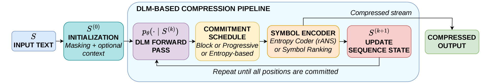
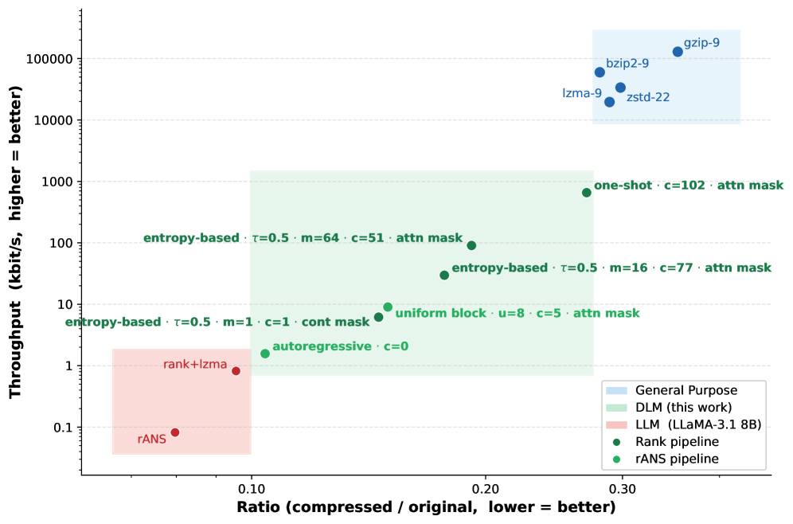
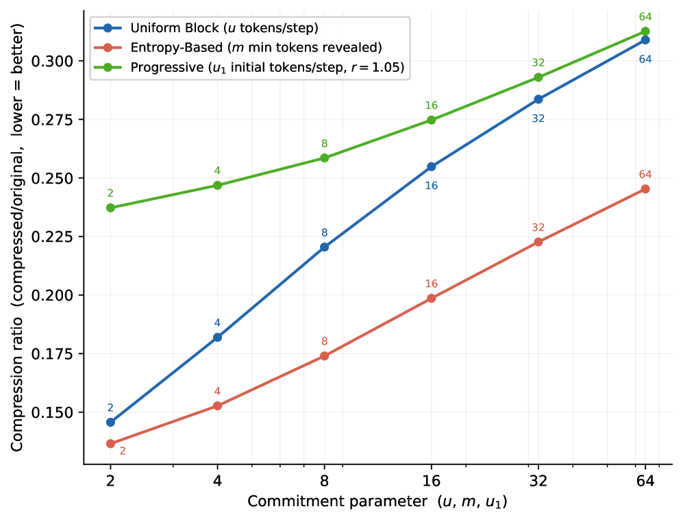

# 精读报告：Diffuse to Compress —— 首次将扩散语言模型引入无损文本压缩

> **论文**：Diffuse to Compress: Leveraging Diffusion LMs for Lossless Compression
> **作者**：Angelo Nardone（通讯作者）、Paolo Ferragina（比萨大学，University of Pisa）
> **arXiv ID**：2608.11249
> **发表时间**：2026-08-04（v1，[cs.CL]，8/13 批次收录）
> **许可协议**：arXiv.org perpetual non-exclusive license
> **代码仓库**：无官方实现（论文正文及外部检索均未发现 GitHub 仓库）

---

## 第 1 章 概述

### 1.1 一句话定位

本文首次将 Diffusion Language Model（DLM，扩散语言模型）作为非自回归推理范式引入无损文本压缩场景，以 LLaDA-8B 为 backbone，通过精心设计的 commitment schedule 与 initial context 策略，在 enwik8 上实现了相比传统 LLM 压缩器高出最多四个数量级的压缩吞吐和约六个数量级的解压吞吐，同时保持优于通用压缩器的压缩率，开辟了高吞吐神经压缩的新方向。

### 论文图表总览

| 编号 | 类型 | 内容描述 | 在本报告中的引用位置 |
|------|------|---------|---------------------|
| Figure 1 | 架构示意图 | 迭代 DLM 压缩管线（从全 [MASK] 到逐步揭示） | 第 3 章 |
| Figure 2 | 散点图 | CR vs 吞吐（对数尺度），enwik8 前 1MB，三区域分离 | 第 5 章 |
| Figure 3 | 折线图 | 三种 commitment schedule 的压缩率对比 | 第 5 章 |
| Table 1 | 主结果表 | enwik8 前 10MB，各方法 CR、C-Thr.、D-Thr. | 第 1 章 / 第 5 章 |
| Table 2（附录） | 超参表 | 各实验配置的具体超参列表 | 第 4 章 |
| Figure 4-5（附录） | 消融图 | 末步压缩器选择与窗口大小消融 | 第 5 章 |
| Figure 8-11（附录） | 消融图 | 初始上下文策略消融 | 第 5 章 |

### 1.2 核心贡献

论文围绕"用 DLM 替代自回归 LLM 进行无损文本压缩"这一核心命题，提出三项贡献。

**贡献一：建立非自回归神经压缩的新范式。** 论文首次提出将 Diffusion Language Model 应用于无损文本压缩，取代传统自回归 LLM 的逐步预测范式。实例化采用 LLaDA（Large Language Diffusion with RoPE），这是 HuggingFace 上公开的首批 masked DLM 之一，其语言建模能力与 LLaMA 3 8B 相当。DLM 的关键架构优势在于：单次前向传播可对所有被 mask 的位置同时输出预测分布，且被 mask 位置之间可以双向注意（无左到右前缀约束），从而从根本上突破自回归"一次一符号"的吞吐瓶颈。论文不仅提出这一范式，还系统性地将其与已有的预测式编码（rANS）和 Symbol Ranking 编码管线对接，形成完整的端到端压缩系统。

**贡献二：系统解决 DLM 应用于压缩的两个算法挑战。** DLM 的灵活性——每步可自由决定编码多少个符号、编码哪些位置——既是优势也是挑战。论文设计并评估了两类策略加以应对：

第一类是 **Commitment schedule**（每步提交策略），决定每一步推理中"提交"（即编码并揭示为上下文）多少个、哪些位置的符号。论文提出三种方案：Uniform Block（均匀块状提交）、Progressive（几何增长提交）、Entropy-Based（按预测熵选择提交位置）。

第二类是 **Initial context**（初始上下文策略），解决管线从全 [MASK] 起步时首步预测缺乏上下文的"冷启动"问题。论文提出四种保留初始可见符号的策略：Contiguous（连续前缀）、Random（随机位置）、Frequency-Based（保留低频 token）、Attention-Based（用注意力机制选择最具上下文价值的 c 个位置）。

所有策略均为确定性方案（仅由超参决定），解压器无需额外计算即可复现编码过程：schedule 的每步选择由相同的模型前向输出和确定性规则完全决定，而初始上下文的位置索引（如 Attention-Based 选出的 c 个位置）作为压缩文件头的一部分随文件存储，保证无损可逆性。

**贡献三：在 enwik8 上的系统性实验对比。** 论文将 DLM 压缩器与基于 LLM 的方法（LLMZip、FineZip）以及通用压缩器（gzip、lzma、zstd、bzip2）进行端到端对比。实验结果表明，DLM 方法在压缩率-吞吐权衡上覆盖了更宽的谱系：在压缩率仍优于通用压缩器的前提下，吞吐相比 LLM 方法提升最多四个数量级（压缩方向）、约六个数量级（解压方向）。此外，DLM 天然具有压缩-解压吞吐对称性，克服了 LLM 方法因 teacher forcing 导致的解压严重慢于压缩的工程缺陷。

### 1.3 关键结果速览

以下为 Table 1（enwik8 前 10MB）的核心数据，后续章节将逐项展开分析。

| Pipeline | CR | C-Thr.（kbit/s） | D-Thr.（kbit/s） |
|----------|------|-----------------|-----------------|
| LLMZip（AC） | 0.079 | 0.09 | ≪0.09 |
| LLMZip（symb） | 0.116 | 0.09 | ≪0.09 |
| FineZip（AC） | 0.079 | 0.10 | ≪0.10 |
| FineZip（symb） | 0.128 | 5.33 | ≪5.33 |
| DLM（rANS） | 0.127 | 1.01 | 1.01 |
| DLM（symb） | 0.176 | 11.23 | 11.23 |
| DLM（symb） | 0.223 | 44.34 | 44.35 |
| DLM（symb） | 0.246 | 165.79 | 166.12 |

关键结论可概括为以下几点。

**吞吐优势显著**：DLM 压缩器在最高吞吐配置下达到 165.79 kbit/s（压缩）与 166.12 kbit/s（解压），相比 LLMZip 的 0.09 kbit/s 提升约四个数量级（压缩方向），而解压方向因 LLM 解压比压缩再慢约两个数量级，DLM 的解压优势达约六个数量级。

**解压对称性**：DLM 的压缩与解压吞吐几乎完全一致（如 165.79 vs 166.12 kbit/s 的微小差异仅来自 I/O 计时噪声），而 LLMZip/FineZip 因解压时必须逐步解码（teacher forcing 仅压缩阶段可用），解压吞吐比压缩低约两个数量级。

**压缩率仍优于通用压缩器**：DLM 最高吞吐配置的 CR=0.246 仍优于通用压缩器（通用压缩器吞吐高约六个数量级但压缩率更差），说明 DLM 在压缩质量上始终优于纯模式匹配方法。

**压缩率-吞吐可调谱系**：通过调整每步提交 token 数，DLM 在 CR=0.127（1.01 kbit/s）到 CR=0.246（166 kbit/s）之间形成连续的操作点谱系，用户可根据应用场景灵活权衡。

---

## 第 2 章 背景与动机

### 2.1 无损压缩的三种范式

无损文本压缩的目标是在保证比特级可逆的前提下减少数据体积。传统通用压缩器（general-purpose compressors）可归纳为三大范式。

**统计编码（Statistical Coding）** 利用符号出现频率的不均匀性进行编码：高频符号分配短码、低频符号分配长码，使平均码长接近符号分布的信息熵。典型代表是 rANS（range Asymmetric Numeral Systems），它在算术编码的压缩率接近性与编码速度之间取得了良好平衡，是现代神经压缩系统中常用的"后端"编码器。rANS 的优势在于：只需模型提供符号的离散概率分布，编码器即可高效地将其映射为接近最优码长的比特流。

**字典编码（Dictionary Coding）** 在输入流中维护一个滑动窗口，用指针引用之前出现过的子串（match），从而避免重复存储相同内容。LZ77 是其基础算法，gzip、lzma（LZMA）、zstd 等工业级压缩器均构建在 LZ77 框架之上，通过不同的匹配搜索策略和后端编码器实现不同的压缩率-速度权衡。lzma 以高压缩率著称但速度较慢；zstd 以高速度著称但压缩率略逊；gzip 介于两者之间。

**块排序编码（Block-Sort Coding）** 先对输入进行 Burrows-Wheeler Transform（BWT）块排序，使得相似字符聚集在一起，再进行游程编码或统计编码。bzip2 是这一范式的代表，在压缩率上通常优于 gzip 但不如 lzma。

通用压缩器的共同局限在于：它们仅依赖输入流内部的局部重复模式和频率统计，无法建模自然语言的深层语义和长程依赖关系。当面对具有丰富语法结构的英文文本时，通用压缩器的压缩率远低于基于大规模语言模型的神经压缩方法。然而，通用压缩器的吞吐极高（相比神经方法高约六个数量级），在日常存储传输场景中仍占主导地位。论文的 Figure 2 清晰展示了这一差距：通用压缩器位于吞吐-压缩率平面的右上角，吞吐远高于神经方法但压缩率也远差于神经方法。

### 2.2 神经压缩的两条管线

基于大语言模型（LLM）的无损压缩继承自 Shannon（1951）关于预测与压缩等价性的经典洞察。其核心思想是：一个好的预测器隐含一个好的压缩器——如果能精确预测下一个符号的概率分布，就可以用接近最优的码长对其进行编码。LLM 通过链式法则将序列概率分解为逐位置的条件概率：

$$p_\theta(S) = \prod_{t=1}^{n} p_\theta(s_t \mid s_1, \dots, s_{t-1})$$

这一因子分解将序列建模归约为了**下一符号预测**（next-symbol prediction）问题：给定长度为 k 的上下文窗口 $W_{t,k} = s_{t-k}, \dots, s_{t-1}$，模型预测 $p(s_t \mid W_{t,k})$。

在工程实现上，神经压缩形成了两条主要管线。

**管线一：预测式压缩（Predictive Pipeline / Arithmetic Coding）。** 模型在每个位置输出完整概率分布 $p(\cdot \mid W_{t,k}) \in \Delta(\Sigma)$（$\Sigma$ 为词表），然后用算术编码（Arithmetic Coding, AC）或其变体（如 rANS）按该分布为实际符号 $s_t$ 分配码长。由于算术编码的理论码长接近分布的交叉熵 $-\log_2 p(s_t \mid W_{t,k})$，只要预测分布接近真实分布，压缩率就接近信息论下界。该管线的精度取决于概率分布的质量，但每编码一个符号都需要模型输出 $|\Sigma|$ 维分布向量。LLMZip（AC）和 FineZip（AC）即采用此管线。

**管线二：符号排名压缩（Symbol Ranking）。** 不直接编码概率分布，而是将模型预测的分布按似然从高到低排序，输出原始符号在排序中的排名（rank）。形式化定义（论文 Definition 2）如下：

$$\text{Rank}(s_t \mid W_{t,k}) = j \iff s_t = \sigma_j$$

其中 $\sigma_0, \sigma_1, \dots, \sigma_{|\Sigma|-1}$ 满足 $p(\sigma_0 \mid W_{t,k}) \geq p(\sigma_1 \mid W_{t,k}) \geq \dots \geq p(\sigma_{|\Sigma|-1} \mid W_{t,k})$。排名 $r_t = \text{Rank}(s_t \mid W_t)$ 是一个非负整数：低 rank 表示符号被模型高概率预测（信息量小），高 rank 表示模型意外（信息量大）。所有位置的 rank 构成一个整数序列 R，随后交由通用压缩器（如 lzma）做二次压缩。Symbol Ranking 的优势在于：不需要精确的概率标定，只需要正确的排序顺序，且 rank 序列通常具有结构（大量低值聚集），通用压缩器能有效捕捉这种模式。LLMZip（symb）和 FineZip（symb）即采用此管线。

两条管线代表了不同的精度-效率权衡：预测式管线理论上更精确但计算更重；Symbol Ranking 管线更轻量但牺牲部分压缩率。在 Table 1 中可以清楚看到这一差异——无论是 LLMZip 还是 FineZip，AC 配置的 CR 都低于 Symbol Ranking 配置（LLMZip: 0.079 vs 0.116; FineZip: 0.079 vs 0.128）。论文的 DLM 压缩器同时实现了两条管线，rANS 对应预测式，Symbol Ranking 对应符号排名。

### 2.3 自回归吞吐瓶颈

尽管基于 LLM 的神经压缩在压缩率上远超通用压缩器，但其工程应用受到严重的吞吐瓶颈制约。根本原因在于自回归（autoregressive）架构的固有限制：**每次前向传播只能预测一个符号**。

以压缩一段 $n$ 个 token 的文本为例，自回归 LLM 需要 $n$ 次前向传播，每次根据已生成的 $t-1$ 个 token 预测第 $t$ 个。即使借助 KV-cache 避免重复计算已处理前缀的注意力，每步仍需完整的注意力计算（新 token 对所有历史 token 的注意力），吞吐被限制在 kbit/s 级别。Table 1 中 LLMZip 的压缩吞吐仅 0.09 kbit/s，FineZip（AC）仅 0.10 kbit/s，与通用压缩器的 GB/s 级吞吐相比差约六个数量级。

更关键的是**压缩-解压的非对称性**。LLMZip 和 FineZip 在压缩阶段利用了 teacher forcing——已知原始文本，每步只需一次前向即可获得下一个 token 的预测分布，无需等待生成。但解压阶段无法使用 teacher forcing（因为原始文本正是待解压的对象），必须逐 token 自回归生成：每解出一个 token 才能将其作为下一步的输入，每个文本窗口需要 $n$ 次串行推理步。这导致解压吞吐比压缩低约两个数量级。Table 1 中 LLMZip 和 FineZip 的 D-Thr. 标注为"≪C-Thr."，精确数值未被报告，但论文明确指出解压约慢两个数量级。对于需要频繁读取的存储场景，这一非对称性是致命的：数据一旦写入冷存储，读取速度极慢，严重影响用户体验。

研究者尝试通过多 GPU 分块并行来缓解吞吐问题。FineZip 等工作将输入文本切分为独立窗口，跨 GPU 并行处理。但由于瓶颈是架构性的——每个窗口内部仍然是严格的逐 token 自回归——分块并行只能线性扩展窗口数，无法从根本上改变单窗口内的吞吐量级。FineZip（symb）通过管线优化将吞吐提升到 5.33 kbit/s，已是此前 LLM 方法中的最佳水平，但与通用压缩器仍有巨大差距。

本文正是从这一架构性瓶颈出发，提出用 DLM 替代自回归 LLM。DLM 的核心优势——单次前向同时预测多个位置、被 mask 位置之间双向注意——使得推理步数 K 可远小于序列长度 n，从根本上突破了吞吐上限。

### 2.4 Shannon 预测-压缩关联

Shannon 在"Prediction and Entropy of Printed English"（1951）及"A Mathematical Theory of Communication"（1948）等工作中首次系统性地建立了预测与压缩的等价关系：**一个序列的最优编码长度等于其最优预测模型的累积负对数似然**。形式化地，给定一个概率模型 $p_\theta$，序列 $S = s_1, \dots, s_n$ 的理想编码长度为：

$$L(S) = -\sum_{t=1}^{n} \log_2 p_\theta(s_t \mid s_1, \dots, s_{t-1})$$

这一关联意味着，提升语言模型的预测能力直接等价于提升压缩率。近年来大规模 LLM（GPT、LLaMA 等）在语言建模上的突破，正是神经压缩压缩率大幅超越通用压缩器的根本原因。Delétang 等人（2024）系统验证了"更大的模型 → 更好的预测 → 更高的压缩率"这一链条，AlphaZip 等工作进一步探索了超大模型在压缩上的极限。

但 Shannon 的框架隐含一个假设：预测是**顺序的**——预测 $s_t$ 只能依赖 $s_1, \dots, s_{t-1}$。自回归 LLM 严格遵循这一假设（通过 causal mask 实现），也因此继承了逐符号处理的吞吐代价。DLM 的核心洞见在于：对于**压缩**任务（而非开放式生成任务），我们不需要严格的自回归生成顺序——我们可以利用双向上下文，在单次前向中同时预测多个位置。这并不违背 Shannon 的预测-压缩等价性，而是将"顺序预测"推广为"批量预测"：只要每个符号仍然被一个合理的条件分布编码，总体码长仍然接近信息论下界。关键区别在于条件分布不再限于左前缀 $p(s_t \mid s_1, \dots, s_{t-1})$，而是扩展为基于任意可见子集的双向条件 $p(s_t \mid \text{可见位置})$，这在压缩场景下是完全合法的——因为我们只是在编码时利用更多上下文来获得更紧的分布。

这一理论基础为 DLM 压缩提供了正当性：它不是对 Shannon 框架的违反，而是对其在特定约束下的推广。代价是解压时也需要迭代式的前向传播（而非逐符号生成），但由于每步可以解码多个符号，总步数 K 远小于 n，吞吐大幅提升。

---

## 第 3 章 DLM 压缩框架

### 3.1 Masked DLM 的定义

Diffusion Language Model（DLM）借鉴了图像扩散模型的思想，将其迁移到离散文本域。本文使用的是 **Masked DLM**（掩码扩散语言模型），其核心机制是对输入序列中的部分位置用特殊 token [MASK] 替换，然后训练模型预测被 mask 的原始符号。

形式化定义（论文 Definition 3）如下：给定部分观测序列 $\tilde{S}$（其中若干位置为 [MASK]），令 $\mathcal{M} = \{x : \tilde{s}_x = \texttt{[MASK]}\}$ 为被 mask 的位置集合。Masked DLM 通过单次前向传播，对每个 masked 位置输出一个概率分布：

$$p_\theta(\cdot \mid \tilde{S}) \in \Delta(\Sigma)^{|\mathcal{M}|}$$

即模型同时对所有 $|\mathcal{M}|$ 个 masked 位置各输出一个 $|\Sigma|$ 维概率分布。每个分布 $p_\theta(\cdot \mid \tilde{S})_t$ 表示在当前观测 $\tilde{S}$ 下位置 $t$ 上各候选符号的条件概率。

Masked DLM 与自回归 LLM 存在三个关键区别。

**批量预测**：自回归 LLM 每次前向只预测一个下一个符号（序列末尾位置），而 DLM 每次前向同时预测所有 masked 位置的符号。这意味着同样一次前向传播的算力，DLM 可以产出 $|\mathcal{M}|$ 个预测结果，吞吐潜力远高于自回归模型。

**双向注意**：被 mask 的位置之间可以互相注意（bidirectional attention），不存在左到右的前缀约束。模型可以利用右侧上下文进行预测——例如，给定 "The cat sat on the [MASK]" 时，右侧的语境可以帮助缩小 [MASK] 位置的候选范围。而自回归模型严格不能使用右侧上下文（通过 causal mask 保证生成顺序）。双向注意使得 DLM 在压缩场景下具有天然优势：压缩时已知完整原始文本，可以灵活决定每步揭示哪些位置，利用双侧上下文获得更准确的预测分布。

**位置灵活**：哪些位置被 mask 是可自由选择的，赋予了对推理过程的精细控制能力。这一灵活性是 commitment schedule（第 3.3 节）和 initial context（第 3.4 节）策略的基础——通过精心选择 mask 模式和揭示顺序，可以在压缩率和吞吐之间实现精细权衡。

本文实例化使用的 backbone 是 **LLaDA（Large Language Diffusion with RoPE）**，参数规模 8B（LLaDA-8B），由 Nie 等人（2025）提出。LLaDA 是 HuggingFace 上公开的首批 masked DLM 之一，论文指出其语言建模能力与 LLaMA 3 8B 相当。这一对等性至关重要——它确保了后续 DLM 压缩器与 LLM 压缩器的对比是基于"同等能力模型"的公平对比，而非"DLM 恰好用了更强模型"的混淆。论文通过将 LLaDA-8B 配置为自回归模式（每步一个 token）作为对照，在实验中验证了这一对等性（见第 5 章）。

*图1：迭代 DLM 压缩管线示意图。从全 [MASK] 序列 $S^{(0)}$ 出发（除初始上下文外），每步通过 DLM 前向获得所有 masked 位置的预测分布，按 commitment schedule 选定子集位置编码原始符号（rANS 或 Symbol Ranking），编码后将这些位置揭示为可见上下文，形成 $S^{(k+1)}$，迭代 K 步直到全部符号编码完成。*

### 3.2 迭代压缩管线

DLM 压缩的核心是一个 K 步迭代过程。初始状态 $S^{(0)}$ 为全 [MASK] 序列（除初始上下文位置保留原始符号外），随后通过函数 $f_\theta$ 迭代更新：

$$S^{(k+1)} = f_\theta\!\left(S^{(k)}\right), \quad k = 0, 1, \dots, K-1$$

每一步 $f_\theta$ 包含以下四个操作。

**前向传播**：将当前序列 $S^{(k)}$ 输入 DLM，获得所有 masked 位置的预测分布 $p_\theta(\cdot \mid S^{(k)})$。由于 DLM 的批量预测特性，这一次前向即可获得所有 $|\mathcal{M}_k|$ 个待预测位置的完整分布。

**位置选择（Commitment）**：根据 commitment schedule（第 3.3 节详述）从当前 masked 位置集合 $\mathcal{M}_k$ 中选出一个子集 $\mathcal{C}_k \subseteq \mathcal{M}_k$。这个子集的大小和位置由 schedule 策略和超参决定。

**编码**：对 $\mathcal{C}_k$ 中的每个位置 $t$，使用其预测分布对原始符号 $s_t$ 进行编码。具体方式取决于选择的编码管线：若用 rANS（预测式），则按分布 $p_\theta(\cdot \mid S^{(k)})$ 在位置 $t$ 上的概率为 $s_t$ 分配接近最优码长；若用 Symbol Ranking，则计算 $r_t = \text{Rank}(s_t \mid S^{(k)})$，将 rank 值追加到待压缩的整数序列中。

**揭示（Reveal）**：将 $\mathcal{C}_k$ 中位置的 [MASK] 替换为原始符号，形成 $S^{(k+1)}$。这些新揭示的符号成为后续步骤的可见上下文，使得后续步骤的预测分布更加准确（因为上下文更丰富）。

经过 K 步后，所有位置被编码并揭示，压缩完成。

**推理步数 K 的权衡**是整个框架的核心超参。K 控制压缩率与吞吐的权衡：

当 K 很小时（如 $K = n / b$，其中 b 较大），每步需要提交较多符号（约 $n/K$ 个），但每步的可见上下文较少——特别是早期步骤几乎只有初始上下文可用——预测质量较低，压缩率较差。优点是前向传播次数少，吞吐高。

当 K 很大时（如 $K = n$，每步一个符号），每步只提交少量符号，渐进式揭示使得后续步骤拥有丰富上下文，预测更准，压缩率更好。缺点是前向传播次数多，吞吐低。极端情况下 $K = n$ 退化为自回归管线。

自回归 LLM 的管线等价于 $K = n$（每步一个符号）的极端情形。DLM 的优势在于 K 可自由调远小于 n——如 $K = n/2, n/4, n/8, \dots$——从而以可控的压缩率损失换取大幅的吞吐提升。这一灵活性使 DLM 压缩器能够根据应用场景在压缩率和吞吐之间灵活选择操作点，而自回归 LLM 压缩器则被锁定在 $K = n$ 的单一操作点上。

### 3.3 Commitment Schedule（提交策略）

Commitment schedule 是 DLM 压缩框架的核心算法创新之一。它决定每一步 $k$ 中编码并揭示多少个、哪些位置的符号。不同的 schedule 策略会直接影响管线中上下文积累的效率，从而影响压缩率。论文提出三种策略。

#### 3.3.1 Uniform Block（均匀块）

最简单的策略：固定一个超参数 $u$（block size），每步提交连续的 $u$ 个符号。具体地，将所有 masked 位置按从左到右排列，每步选取最前面的 $u$ 个提交。提交数量在所有步骤中恒定：

$$|\mathcal{C}_k| = u \quad \text{对所有 } k$$

这种策略实现简单、确定性高，提交顺序从左到右，行为类似于"块状自回归"——每次前进 u 个位置。缺点是它完全不考虑各位置的可预测性差异：某些位置可能已有足够的双向上下文可以高置信预测（应优先提交以提供更多上下文），而某些位置上下文稀少（应推迟提交等待上下文积累）。Uniform Block 对所有位置一视同仁。

实验中（Figure 3），Uniform Block 在低 token/step（如 1-2 token/step）时压缩率与 Entropy-Based 相当——此时每步提交少，位置选择差异影响不大。但在多 token/step 时压缩率逐渐接近 Progressive（较差）。尽管如此，Uniform Block 在整个压缩率-吞吐谱系上的权衡最为均衡，是一个稳健的默认选择。

#### 3.3.2 Progressive（渐进式）

Progressive schedule 采用几何增长模型：初始预算 $u_1$ 和增长率 $r$（$r > 1$），第 $k$ 步的提交数量为：

$$u_k = \lfloor u_1 \cdot r^{k-1} \rfloor$$

当 $r = 1$ 时，$u_k = u_1$ 恒定，退化为 Uniform Block。$r > 1$ 时，提交数量随步数几何增长：早期步骤提交少量符号（因为此时上下文稀少、预测不可靠，少提交可以避免在不可靠分布上浪费码长），后期步骤随着上下文积累提交更多符号（预测可靠性提高，可以安全地批量提交）。

这一策略的直觉是合理的——先慢后快、先积累上下文再高效批量编码——但实验结果表明它是三种策略中最差的（Figure 3）。可能的原因是：早期提交太少导致前几步几乎没有上下文积累，推迟了"上下文丰富期"的到来。而 Entropy-Based 通过选择高置信位置，即使早期提交少量符号也能有效积累高质量上下文，形成正向循环；Progressive 盲目地少提交则无法获得这种优势。

#### 3.3.3 Entropy-Based（基于熵）

Entropy-Based schedule 是论文最具创新性的策略，利用 DLM 双向注意的能力，让模型自身的预测置信度来指导提交决策。具体过程如下。

前向后，对每个 masked 位置 $t$ 计算预测分布的香农熵：

$$H(t) = -\sum_{\sigma \in \Sigma} p_\theta(\sigma \mid S^{(k)}) \cdot \log_2 p_\theta(\sigma \mid S^{(k)})$$

低熵意味着预测分布集中（模型对预测有高置信度），高熵意味着分布分散（模型不确定）。提交策略为：

提交所有满足 $H(t) \leq \tau$ 的位置，其中 $\tau$ 为预设的熵阈值。低熵位置的编码码长短（模型已高概率预测正确，信息量小），优先提交它们可以以低成本为后续步骤提供上下文。

若满足 $H(t) \leq \tau$ 条件的候选位置不足 $m$ 个，则退而提交熵最低的 $m$ 个位置。这一"兜底"机制确保每步至少提交 $m$ 个符号，避免在极端情况下（如首步所有位置熵都很高）推理步数膨胀至 K 过大。

这一策略充分利用了 DLM 的双向上下文优势：与自回归模型只能从左到右不同，DLM 可以同时利用左右上下文预测中间位置，使得某些位置（如语法功能词、高频结构中的位置、被丰富上下文包围的"填充"位置）在早期就能被高置信预测。优先提交这些"容易"的位置，可以为后续步骤提供高质量上下文，使得后续的困难位置也逐渐变得可预测，形成正向循环。

实验结果（Figure 3）证实 Entropy-Based 在所有 token/step 配置下压缩率始终最优。论文由此得出两个重要结论：

(i) 放松自回归的 token/step 约束（即每步提交多于一个符号）确实可以保持甚至提升压缩质量——因为 DLM 的双向上下文使得多符号批量预测不会显著降低精度；

(ii) 当为了提升吞吐而增加 token/step 时，只有 Entropy-Based 能保持有利的压缩率，Uniform Block 和 Progressive 的压缩率快速恶化。

**所有策略的共同性质**：三种 schedule 均为确定性策略，仅由超参（$u$ 或 $u_1, r$ 或 $\tau, m$）决定。不需要额外边信息记录每步选择了哪些位置——解压器在解压时执行相同的前向传播，用相同的 schedule 规则和相同的模型输出即可完全复现选择过程。这是保证无损可逆性的关键设计。

### 3.4 Initial Context（初始上下文策略）

迭代管线从 $S^{(0)}$（几乎全 [MASK]）起步。如果第一步没有任何可见符号（除了 [MASK] 本身），DLM 只能基于空的上下文对所有位置进行预测，输出近乎均匀的分布——因为没有任何信息来区分不同候选符号。这种"冷启动"状态的编码效率极低。

为解决这一问题，论文提出在压缩文件头中保留 $c$ 个原始符号不 mask，作为初始可见上下文。这 $c$ 个符号的值和位置都存入压缩文件头，解压器读取后即可恢复初始上下文配置。保留哪些 $c$ 个位置是关键设计决策——好的初始上下文应该能为管线早期步骤提供最大的预测辅助。论文提出四种策略。

#### 3.4.1 Contiguous（连续前缀）

保留序列前 $c$ 个符号不 mask。这是最直觉的策略，直接模拟自回归模型的前缀上下文模式——第一步时，前 $c$ 个符号可见，后续位置可以基于这个前缀进行预测。随着迭代推进，揭示的符号逐步延伸前缀，形成与自回归类似的上下文增长模式。

Contiguous 策略适用于低 token/step 场景，此时效果最好——逐步揭示后，上下文很快积累为连续前缀模式，行为接近自回归。但在高 token/step 和 Entropy-Based 调度下，Contiguous 表现下降——甚至最终差于 Random。原因在于：当每步提交多个非连续位置时，连续前缀提供的上下文不能有效覆盖所有提交区域，而非连续分布的可见符号反而能提供更均匀的全局"种子"信息。

#### 3.4.2 Random（随机）

随机选择 $c$ 个位置保留（使用固定随机种子保证确定性）。优点是实现极简，且能提供分散在整个序列上的上下文"锚点"，使模型在管线早期就能获得全局视野。缺点是没有针对性——随机选择可能保留了大量低信息量的位置（如标点、空格、重复字符），而遗漏了高信息量的关键位置。Random 策略的效果介于 Contiguous 和 Attention-Based 之间，作为基准线存在。

#### 3.4.3 Frequency-Based（频率优先）

基于 LLaDA tokenizer 的词频统计，保留 $c$ 个最不频繁出现的符号。直觉是：稀有 token 的出现更"意外"（自信息 $-\log p$ 更高），在缺乏上下文时最难预测。预先揭示它们可以最大程度减少早期的高码长编码——因为如果不揭示，模型对这些稀有位置的预测分布会非常分散，导致高熵和高码长。常见 token 即使不揭示，模型也能基于语言先验较好地预测（它们在训练数据中大量出现，模型对其分布有较好的估计）。

Frequency-Based 的局限在于：它使用的是 tokenizer 全局的词频统计，而非当前序列的局部统计。某些 token 在全局频率上很低，但在当前文本中可能频繁出现（如特定主题文档中的领域术语），此时预先揭示它们并不一定最优。

#### 3.4.4 Attention-Based（注意力优先）

最具技术含量的策略，利用 DLM 自身的注意力机制来选择初始上下文。过程分三个步骤。

**互补前向**：执行两次前向传播。第一次 mask 所有偶数位置（奇数位置可见），第二次 mask 所有奇数位置（偶数位置可见）。这种互补设计保证了：每个位置在一次前向中是被预测的目标（masked），在另一次前向中是上下文（可见）。

**Attention Rollout 评分**：通过 Attention Rollout 技术估计每个位置对 masked token 预测的"重要性"。Attention Rollout 追踪注意力权重在 Transformer 各层之间的传播路径，累积得到每个输入位置对最终预测输出的总贡献。得分高的位置被更多 masked 位置关注——换言之，揭示这些位置能为最多的其他位置提供有效的预测辅助。

**选择**：选取 Attention Rollout 得分最高的 $c$ 个位置作为初始上下文。这些位置的选择结果（即 $c$ 个位置索引）存入压缩文件头。

**开销分析**：Attention-Based 在压缩时需要额外 2 次前向传播（用于互补 mask 和计算注意力得分），这增加了压缩阶段的固定开销。但选择结果一旦确定并存入文件头，解压时无需任何额外计算——解压器直接读取文件头中的位置索引即可恢复初始上下文配置。因此，Attention-Based 对解压吞吐零影响，仅在压缩时增加少量固定开销（2 次额外前向传播）。

**实验结论**：Attention-Based 在所有配置（所有 token/step 和 schedule 组合）下都是最优的初始上下文策略。这验证了"用模型自身的注意力来指导上下文选择"这一思路的有效性——模型比任何外部启发式（频率统计、随机选择、连续前缀）都更清楚哪些位置对预测其他位置最有帮助。

---

## 第 4 章 实验设置

### 4.1 数据集与评估协议

实验使用 **enwik8**——Hutter Prize 标准基准数据集，包含 100MB 维基百科英文 XML 文本。enwik8 是神经压缩领域最常用的评估数据集之一，先前工作（LLMZip、FineZip）均在同一数据集上报告结果，确保了跨论文可比性。

论文采用两级评估策略：

**前 1MB 用于消融实验**（ablation study），快速评估不同超参和策略组合的效果。消融覆盖 commitment schedule 对比（Figure 3）、初始上下文策略对比（附录 Figure 8-11）、末步压缩器选择（附录 Figure 4-5）和窗口大小对比。消融实验使用 1MB 子集可以大幅缩短实验时间，允许穷举搜索超参空间。

**前 10MB 用于最终主对比表**（Table 1），与先前工作（LLMZip、FineZip）的评估协议保持完全一致。10MB 子集提供了更大的统计样本量，使压缩率和吞吐数值更具代表性。

### 4.2 对比方法

论文设置了三类对比方法，覆盖从极致压缩率到极致吞吐的完整谱系。

**基于 LLM 的神经压缩器**：

LLMZip（Valmeekam et al. 2023）是首批将 LLM 与 AC（Arithmetic Coding）和 Symbol Ranking 两种编码管线结合的无损文本压缩工作，压缩率远超通用压缩器，但吞吐极低（0.09 kbit/s）。

FineZip（Mittu et al. 2024）同样基于大模型预测，但对 LLMZip 的吞吐进行了系统性优化。FineZip（Symbol Ranking）是此前 LLM 方法中吞吐最好的（5.33 kbit/s），通过 LoRA 参数高效微调和分块并行实现了较 LLMZip 约两个数量级的吞吐提升（5.33/0.09 ≈ 59 倍）。

两者均支持 AC 和 Symbol Ranking 两种编码管线，对应 Table 1 中的四个操作点。

**通用压缩器**：

gzip、lzma、zstd、bzip2 作为压缩率下限基准。它们的吞吐极高（比神经方法高约六个数量级），但压缩率远低于神经方法。在 Figure 2 中，通用压缩器位于吞吐-压缩率平面的右上角（高吞吐、高 CR 即低压缩率），与神经方法形成鲜明对比。

**自回归对照（Llama-3.1-8B）**：

论文将 Llama-3.1-8B 以自回归方式接入本管线（每步一个 token，无初始上下文），作为 LLaDA-8B 的公平对照。目的在于验证：在相同压缩框架下，LLaDA-8B 的自回归配置与 Llama-3.1-8B 的压缩率和吞吐是否相当。如果相当，则说明 LLaDA-8B 与 Llama-3.1-8B 的语言建模能力对等，后续 DLM（非自回归）配置的优势可以归因于架构而非模型能力差异。实验结果证实了这一对等性（见第 5.2 节）。

### 4.3 硬件与实现细节

**硬件**：NVIDIA DGX H100。H100 是当前最强力的 AI 加速器之一，确保了吞吐测量的上限代表性。窗口之间可以并行跨 GPU 执行，充分利用 DGX 的多 GPU 配置。

**DLM backbone**：LLaDA-8B，通过 HuggingFace Transformers 库加载，使用 LLaDA 自带的 tokenizer 进行文本编码。LLaDA 的 Transformer 架构支持双向注意力（不像自回归模型使用 causal mask），天然适配 masked DLM 的推理模式。

**窗口划分**：将输入文本切分为非重叠的固定大小窗口。窗口大小为超参（消融实验确定最优区间为 256-512 token，见第 5.5 节），存入压缩文件头。窗口内独立执行迭代管线——每步的前向传播、位置选择、编码和揭示都在窗口内进行，窗口间无注意力交互。窗口间可以并行处理（跨 GPU 分配），进一步提升吞吐。

**附录 Table 2** 提供了所有实验配置的完整超参列表，包括窗口大小、K 值（推理步数）、schedule 参数（$u$ 或 $u_1, r$ 或 $\tau, m$）、c 值（初始上下文大小）等，确保实验可复现。

### 4.4 编码方案

论文为 DLM 管线实现了两种符号编码方案，对应传统神经压缩的两条管线。

**rANS（range Asymmetric Numeral Systems）**：将每步选定位置的预测分布输入 rANS 编码器，按分布为原始符号分配码长。rANS 的理论码长接近 $-\log_2 p(s_t \mid S^{(k)})$，是预测式压缩管线的标准后端。rANS 的优势是编码精度高（接近信息论最优），但需要模型输出完整的、归一化的概率分布。在 Table 1 中，DLM（rANS）的最佳压缩率为 0.127。

**Symbol Ranking**：计算每个选定位置的 rank $r_t = \text{Rank}(s_t \mid S^{(k)})$，将 rank 序列以 byte-aligned varint 格式编码（可变长整数编码，小 rank 用少字节、大 rank 用多字节），再交给通用压缩器做最终压缩。消融实验表明 lzma-9（最高压缩级别）在末步压缩率上最佳（见第 5.5 节），因此被选为默认末步压缩器。Symbol Ranking 不需要精确的概率标定，实现更轻量，但压缩率略逊于 rANS。在 Table 1 中，DLM（symb）的最佳压缩率为 0.176。

两种方案均应用于 DLM 管线，在 Table 1 中分别报告。rANS 提供更高的压缩率精度但计算更重；Symbol Ranking 更轻量且能利用通用压缩器的二次压缩能力。DLM（rANS）只有一个操作点（CR=0.127, 1.01 kbit/s），而 DLM（symb）通过调整 token/step 提供了三个操作点（CR 从 0.176 到 0.246，吞吐从 11.23 到 165.79 kbit/s），构成了压缩率-吞吐的可调谱系。

---

## 第 5 章 实验结果与分析

### 5.1 主表分析（Table 1, enwik8 前 10MB）

Table 1 是论文最核心的结果表，汇总了所有方法在 enwik8 前 10MB 上的压缩率（CR）、压缩吞吐（C-Thr.）和解压吞吐（D-Thr.）。

| Pipeline | CR | C-Thr.（kbit/s） | D-Thr.（kbit/s） |
|----------|------|-----------------|-----------------|
| LLMZip（AC） | 0.079 | 0.09 | ≪0.09 |
| LLMZip（symb） | 0.116 | 0.09 | ≪0.09 |
| FineZip（AC） | 0.079 | 0.10 | ≪0.10 |
| FineZip（symb） | 0.128 | 5.33 | ≪5.33 |
| DLM（rANS） | 0.127 | 1.01 | 1.01 |
| DLM（symb） | 0.176 | 11.23 | 11.23 |
| DLM（symb） | 0.223 | 44.34 | 44.35 |
| DLM（symb） | 0.246 | 165.79 | 166.12 |

以下逐行解读各方法的性能表现。

**LLMZip（AC）与 FineZip（AC）**：压缩率最优（CR=0.079），但压缩吞吐仅 0.09-0.10 kbit/s。两者压缩率相同并非巧合——它们采用相同的编码管线（算术编码），而 AC 的压缩率主要由预测模型能力和编码精度决定。注意 D-Thr. 标注为"≪C-Thr."：这是因为 LLMZip 和 FineZip 在压缩时利用 teacher forcing（已知原始文本，每步一次前向即可获得下一个 token 的预测），但解压时必须逐步解码——每解出一个窗口的 $n$ 个 token 需要 $n$ 次自回归推理步，解压吞吐因此比压缩低约两个数量级。论文未给出精确的解压吞吐数值。

**LLMZip（symb）与 FineZip（symb）**：Symbol Ranking 管线压缩率略差（0.116 和 0.128），但 FineZip（symb）的压缩吞吐达到 5.33 kbit/s——在此前 LLM 方法中吞吐最高（Table 1）。原因是 Symbol Ranking 的 rank 计算比 AC 更轻量，且 FineZip 对管线做了批处理和并行优化，实现了约 59 倍于 LLMZip（symb）的吞吐（5.33/0.09 ≈ 59）。LLMZip（symb）的吞吐仍为 0.09 kbit/s，说明 LLMZip 本身未做 Symbol Ranking 管线的吞吐优化。

**DLM（rANS）**：CR=0.127，压缩吞吐 1.01 kbit/s。压缩率与 FineZip（symb）的 0.128 基本持平，但这是在 rANS 高精度编码下的最佳 DLM 压缩率。关键的是，D-Thr.=C-Thr.=1.01，压缩与解压吞吐完全对称——因为 DLM 的迭代管线在压缩和解压时的推理过程结构相同（K 步前向，每步选择相同位置），不存在 LLM 方法的 teacher forcing 不对称问题。

**DLM（symb）三档配置**：通过调整 token/step（每步提交的符号数），DLM（Symbol Ranking）实现了从 0.176 到 0.246 的压缩率谱系，对应吞吐从 11.23 到 165.79 kbit/s。每个操作点的压缩与解压吞吐几乎一致（如 165.79 vs 166.12 kbit/s 的微小差异来自 I/O 和计时噪声）。这三个操作点构成了 DLM 的核心价值——覆盖了从"接近 LLM 压缩率"到"远超 LLM 吞吐"的连续谱系。

**核心对比结论如下。**

**DLM vs LLM 吞吐优势**：DLM 最高吞吐 165.79 kbit/s 相比 LLMZip 的 0.09 kbit/s，提升比率为 $165.79 / 0.09 \approx 1842$ 倍，约 $\log_{10}(1842) \approx 3.27$ 个数量级（论文表述为"最多四个数量级"）。在解压方向，由于 LLM 解压比压缩再慢约两个数量级，DLM 的解压优势达约六个数量级。FineZip（symb）虽然将吞吐提升到 5.33 kbit/s，但 DLM 最高吞吐仍是其约 31 倍。

**DLM 压缩率 vs 通用压缩器**：DLM 最差配置 CR=0.246 仍优于通用压缩器（gzip、lzma、zstd、bzip2）在 enwik8 上的压缩率（论文 Figure 2 对数坐标对比，原文未给出通用压缩器具体 CR 数值），同时吞吐虽不及通用压缩器（差约三个数量级——通用压缩器比 LLM 方法高约六个数量级，DLM 比 LLM 方法高约 3.3 个数量级），但已远超 LLM 方法。

**压缩率-吞吐可调性**：DLM 提供了从 0.127/1.01 到 0.246/166 的连续操作点，而 LLM 方法只能提供吞吐无法调高的单一（或少数）操作点——自回归架构将 LLM 锁定在 K=n 的固定步数上。这是 DLM 架构灵活性的直接工程体现。

### 5.2 Figure 2：三个区域的清晰分离

*图2：enwik8 前 1MB 上各方法的压缩率（CR，纵轴，越低越好）与吞吐（kbit/s，横轴，对数尺度，越高越好）散点图。蓝色为通用压缩器、红色为基于 LLM 的方法、绿色为 DLM 方法。三类方法在图中形成三个清晰分离的区域，DLM 占据了 LLM 与通用压缩器之间的宽阔中间地带。*

Figure 2 在对数尺度的吞吐-压缩率平面上展示了三类方法的分布，三类方法形成了三个清晰分离的区域。

**蓝色区域（通用压缩器）**：位于图的右上角——压缩率最高（最差，CR 值最大）但吞吐极高（比神经方法高约六个数量级）。通用压缩器利用 LZ77/BWT 等局部模式匹配，不涉及神经网络推理，吞吐在 MB/s 到 GB/s 量级。它们是日常存储传输的主力工具，但在压缩率上远不及神经方法。

**红色区域（LLM 方法）**：位于图的左下角——压缩率最低（最好，CR ≈ 0.08-0.13）但吞吐极低（0.09-5.33 kbit/s）。LLMZip 和 FineZip 的操作点集中在这一区域，吞吐受限于自回归的一次一符号机制。这一区域的特征是"极致压缩率但不可用的吞吐"，适用于冷存储等对压缩率绝对敏感且很少读取的场景。

**绿色区域（DLM 方法）**：位于红蓝之间——压缩率中等（CR ≈ 0.13-0.25），吞吐覆盖从约 1 到约 166 kbit/s 的宽范围。DLM 的多个操作点在图上形成一条从红区向蓝区延伸的曲线，清晰展示了压缩率-吞吐的可调谱系。这一区域填补了 LLM 与通用压缩器之间的空白，为需要"合理压缩率 + 可接受吞吐"的应用场景提供了新的选择。

**LLaDA-8B 自回归对照点**值得特别关注。论文将 LLaDA-8B 配置为自回归模式（每步一个 token，无初始上下文），在 Figure 2 中的位置与 LLM Symbol Ranking 方法（如 LLMZip symb）重合。这一结果验证了 LLaDA-8B 与 Llama-3.1-8B 在语言建模能力上的对等性——排除了"DLM 优势来自更强 backbone"这一混淆因素。当放松 token/step 约束（每步提交更多 token）时，DLM 操作点沿曲线向高吞吐方向移动，压缩率略有下降但仍优于通用压缩器。

### 5.3 Commitment Schedule 对比（Figure 3）

*图3：三种 commitment schedule（Uniform Block、Progressive、Entropy-Based）在不同 token/step 配置下的压缩率（CR）对比。实验使用 Symbol Ranking 编码和 c=2 的 Contiguous 初始上下文。Entropy-Based 在全配置下压缩率最优，Progressive 始终最差。*

Figure 3 是理解 DLM 压缩框架中 schedule 设计价值的关键图表。横轴为 token/step（每步提交的平均符号数），纵轴为 CR（越低越好）。三条曲线分别对应三种 schedule。

**Entropy-Based（熵调度）** 在所有 token/step 值上压缩率始终最优。特别是在高 token/step（多符号批量提交）时，其他两种策略的压缩率快速恶化，而 Entropy-Based 保持了相对平缓的退化。这验证了"按置信度优先提交高置信位置"策略的鲁棒性：当模型可以自由选择揭示哪些位置时，即使每步提交大量符号，它也能优先处理容易的位置（低熵、高置信），为后续步骤积累有效上下文，使困难位置在后续步骤中逐渐变得可预测。

**Uniform Block（均匀块）** 在低 token/step（1-2 token/step）时与 Entropy-Based 相当——此时每步提交少，提交顺序的差异影响不大，从左到右的块状提交已经足够。但随着 token/step 增加，Uniform Block 的压缩率逐渐接近 Progressive（恶化）。原因是固定地从左到右块状提交不考虑位置的可预测性差异，在高批量时编码效率下降——某些位置上下文已经充足却被推迟提交，某些位置上下文不足却被过早提交。

**Progressive（渐进）** 在所有配置下压缩率始终最差。尽管"先少后多"的直觉合理，但实验表明早期提交太少符号反而拖慢了上下文积累，总体编码效率最低。Progressive 的失败说明：仅凭步数启发式（"早期少提交"）而不考虑位置质量，无法有效指导上下文积累。

**论文从 Figure 3 提炼出两个重要结论。**

结论 (i)：**放松自回归约束可以提升压缩质量**。对比自回归配置（token/step=1）和稍高的 token/step，后者在 Entropy-Based 下压缩率不降反升——因为 DLM 的双向上下文使得多符号批量预测不会降低精度，反而通过更多揭示加速了上下文积累。这是对"自回归一次一符号"范式的直接挑战。

结论 (ii)：**高吞吐场景下 Entropy-Based 不可或缺**。当需要通过增加 token/step 来克服吞吐瓶颈时，只有 Entropy-Based 能维持有利的压缩率。Uniform Block 和 Progressive 在高 token/step 时压缩率恶化严重，不适合高吞吐操作点。这一结论对实际部署具有直接指导意义——追求高吞吐的 DLM 压缩器应使用 Entropy-Based schedule。

### 5.4 初始上下文策略分析

附录 Figure 8-11 展示了四种初始上下文策略在不同配置下的消融结果。

**Attention-Based 全局最优**：在所有 token/step 和 schedule 的组合配置下，Attention-Based 初始上下文都取得了最佳压缩率。这验证了用模型自身注意力来选择"最有价值的上下文位置"这一思路的有效性。Attention Rollout 能准确识别哪些位置对其他 masked 位置的预测贡献最大——这些位置一旦被揭示为初始上下文，能够最大化管线早期步骤的预测质量，从而通过正向循环提升整体压缩率。Attention-Based 的唯一代价是压缩阶段需要 2 次额外前向传播（互补 mask），但对解压吞吐零影响。

**Contiguous 的条件性表现**：Contiguous 策略在低 token/step 时表现良好（接近 Attention-Based），因为逐步揭示很快形成连续前缀，行为接近自回归。但在高 token/step 和 Entropy-Based 调度下，Contiguous 显著下降——最终甚至差于 Random。原因在于：高批量提交时，位置选择不再遵循从左到右的顺序（Entropy-Based 按熵选择），连续前缀不能有效覆盖分散的提交区域；而随机分布的可见符号反而提供了更均匀的上下文覆盖。

**Frequency-Based 和 Random**：两者介于 Contiguous 和 Attention-Based 之间。Frequency-Based 验证了"保留稀有 token"这一先验的部分有效性——稀有 token 确实更难预测，预先揭示有助于减少高码长编码。但全局词频统计不如模型驱动的 Attention Rollout 精准，因为 Attention Rollout 考虑的是位置之间的实际注意力依赖关系，而非全局频率先验。

**总体趋势**：合适的初始上下文能改善压缩率（除自回归配置外），且其重要性随 token/step 增加而增大——token/step 越高，每步提交越多符号，初始上下文的质量对后续预测的影响越大。在自回归配置（token/step=1）下，初始上下文的影响较小，因为逐步揭示很快使上下文积累超过初始 c 个符号的贡献。

### 5.5 消融实验

论文在 1MB 子集上进行了两项关键消融实验，为超参选择提供了实验依据。

**末步压缩器选择（附录 Figure 4-5）**：在 Symbol Ranking 管线中，rank 序列最终交给通用压缩器做二次压缩。论文对比了不同通用压缩器（gzip、lzma、zstd、bzip2）及其压缩级别作为末步编码器的效果。结论有两点。第一，各压缩器的吞吐相当——瓶颈不在末步压缩器，而在 DLM 推理本身（DLM 的前向传播占据了绝大部分时间）。第二，lzma-9（最高压缩级别）在压缩率上最优，因此被选为 DLM（Symbol Ranking）的默认末步压缩器。这一选择使得 rank 序列的二次压缩最大化，进一步提升整体压缩率。

**窗口大小（附录 Figure 4-5）**：对比了不同窗口大小（token 数）对压缩率和吞吐的影响。结论是：**256-512 token 窗口**在压缩率与吞吐之间取得了最佳权衡。更小的窗口限制了模型的有效上下文范围——由于窗口间无注意力交互，模型无法利用跨窗口的长程依赖关系，压缩率下降。更大的窗口增加了单窗口推理的计算量和显存消耗，吞吐下降，同时压缩率的边际提升递减。256-512 token 在两者之间达到最优平衡区间。窗口大小作为超参存入压缩文件头，解压器据此正确切分窗口。

### 5.6 teacher forcing 与解压吞吐的非对称性

一个贯穿全文的重要工程洞察是 **teacher forcing 造成的压缩-解压非对称性**，以及 DLM 如何天然克服这一问题。

对于自回归 LLM 压缩器（LLMZip、FineZip），压缩阶段可以使用 teacher forcing：已知原始文本，每步只需一次前向传播即可获得下一个 token 的预测分布，无需等待生成。这使得压缩吞吐可达 0.09-5.33 kbit/s。但解压阶段无法使用 teacher forcing（因为原始文本正是待解压的对象），必须逐 token 自回归生成：每解出一个 token 才能将其作为下一步的输入，每个窗口需要 $n$ 次串行推理步。这导致解压吞吐比压缩低约两个数量级。Table 1 中 LLMZip 和 FineZip 的 D-Thr. 标注为"≪C-Thr."即反映了这一严重非对称性。

DLM 管线天然避免了这一非对称性。在 DLM 的迭代管线中，压缩和解压的推理结构完全对称：

压缩时——每步前向 → 按 schedule 选位置 → 用预测分布编码原始符号 → 揭示。

解压时——每步前向 → 按相同 schedule 选位置（确定性复现） → 用预测分布解码符号 → 揭示。

两个方向的推理步数（K）和每步操作完全一致：都需要 K 次前向传播，每次都按相同的确定性 schedule 选择位置，每次编码/解码相同数量的符号。唯一的区别是编码（压缩方向，写入码字）和解码（解压方向，读取码字）的操作，但这两者的计算量远小于 DLM 前向传播。因此，压缩与解压吞吐几乎完全相等。

Table 1 中 DLM 各配置的 C-Thr. 和 D-Thr. 数值几乎完全相同（如 165.79 vs 166.12 kbit/s 的微小差异仅来自 I/O 计时噪声），实证了这一对称性。这是 DLM 在实际存储场景中的重要工程优势——用户不会面临"压缩快但解压极慢"的困境，数据一旦压缩存储，后续可以以与压缩时相同的速度进行读取和解压。

---

## 第 6 章 局限与延伸

### 6.1 局限

**无官方代码实现**：截至论文发表（2026-08-04），作者未公开官方代码仓库。论文正文及外部检索（web_search、HTML 全文扫描）均未发现可用的 GitHub 实现。这影响了实验结果的可复现性和社区验证——后续研究者需要根据论文描述自行实现 LLaDA 接入、三种 commitment schedule、四种 initial context 策略、rANS 与 Symbol Ranking 编码管线等全部组件。附录 Table 2 的超参列表部分缓解了这一问题，但完整复现仍需相当工程投入，且无法保证实现细节与原作者完全一致。

**仅验证单一 backbone（LLaDA-8B）**：论文的所有实验均基于 LLaDA-8B。虽然论文以 Llama-3.1-8B 自回归对照验证了 LLaDA-8B 的能力对等性，但未测试其他 DLM 架构（论文引用的 DiffusionGemma、von Rütte 等人的离散扩散模型等）。DLM 压缩效果在多大程度上依赖于 LLaDA 的特定架构设计（如 RoPE 位置编码、mask 训练策略、注意力模式）尚不清楚。不同 DLM 架构可能对 commitment schedule 和 initial context 策略的响应不同，这一泛化性有待验证。

**单一数据集（enwik8）**：所有实验仅在 enwik8 上进行。enwik8 为英文维基百科 XML 文本，其语言模式（百科叙事、XML 标签结构）具有特殊性。对于其他类型的数据（源代码、多语言文本、结构化 JSON、日志文件等），DLM 压缩的效果未经验证。特别是代码数据具有强结构性和非顺序依赖关系（如函数调用前后引用），DLM 的双向注意力可能在此类数据上表现更优或有所不同，但这一假设需要实验支持。

**压缩率仍不及 LLM 方法**：DLM 的最佳压缩率（rANS: 0.127, symb: 0.176）仍显著差于 LLMZip/FineZip 的 AC 配置（0.079）。在以压缩率为绝对主导指标的冷存储场景中（如长期归档，几乎不读取），LLM 方法仍有明显优势。DLM 的核心价值在于提供了吞吐-压缩率的可调谱系和压缩-解压对称性，而非在极致压缩率上取代 LLM。

**Attention-Based 初始上下文的额外开销**：Attention-Based 策略虽然在压缩率上最优，但需要在压缩阶段额外执行 2 次前向传播（互补 mask 计算 Attention Rollout 得分）。对于极大量数据的批量压缩场景，这一固定开销需要考虑——尽管单次压缩中 2 次额外前向传播的绝对时间不大，但在大规模批处理时累积开销不可忽视。不过，这一开销仅影响压缩阶段，对解压吞吐零影响。

### 6.2 延伸方向

**小模型蒸馏是提升吞吐的直接途径**。论文使用的是 8B 参数的 LLaDA-8B，其推理速度受限于模型规模。论文指出，参考 LLM 领域的成熟结论——小模型在语言建模上可达到接近大模型的能力，同时推理吞吐提升数倍——将 LLaDA-8B 蒸馏为更小的 DLM 是提升吞吐的天然方向。蒸馏后的 DLM 可以在保持压缩率接近的前提下，将 Table 1 中 DLM 的各操作点吞吐进一步提升，使 DLM 压缩器向通用压缩器的吞吐量级靠拢。

**DLM 范式的快速发展提供了持续改进空间**。DLM 是一个非常年轻的研究范式——截至论文发表时（2026 年），masked DLM 的研究历史仅约 1-2 年。已有多个后续工作涌现：DiffusionGemma（Google DeepMind，2026）展示了 DLM 的吞吐可远超同规模自回归模型，验证了 DLM 在效率上的架构性优势；FlexiDiT（2025）探索了灵活推理步数的 DLM 架构，与本文的 K 步迭代管线直接相关；von Rütte 等人（2025）推进了 DLM 的语言建模能力基础。这些进展预示着 DLM 作为压缩 backbone 的潜力仍有大幅提升空间——更好的 DLM（更强预测能力、更高推理效率）将直接转化为更好的 DLM 压缩器，正如 LLM 领域"更好的 LLM → 更好的 LLMZip"的链条。

**更丰富的 schedule 与 context 策略值得探索**。本文提出的三种 schedule 和四种 initial context 策略是对这一问题的首次系统尝试。未来可以探索更智能的自适应策略：基于强化学习动态选择每步的提交位置和数量，使 schedule 能够根据当前序列的内容自适应调整；跨窗口共享上下文信息，利用相邻窗口的语言连贯性减少重复建模；或者混合 schedule，在不同推理阶段切换策略（如早期用 Entropy-Based 积累高质量上下文，后期切换到 Uniform Block 加速完成）。Attention-Based 初始上下文的思路也可以推广到每一步的位置选择中（而不仅限于初始步），利用注意力信号动态指导每步的 commitment 决策。

**多模态与结构化数据是潜在应用方向**。DLM 的双向注意力机制天然适合处理具有非顺序依赖关系的结构化数据。代码数据集（如 Stack）中的函数定义-调用关系、跨文件引用、import 依赖等都是非顺序的——DLM 可以利用后续代码来辅助预测前面的代码，而自回归模型严格不能。将 DLM 压缩扩展到代码、多语言语料、JSON/XML 等结构化格式，是有潜力的应用方向，且可能展现出比 enwik8 上更大的优势。

**端到端可用的神经压缩器是最终愿景**。论文的终极目标是"向可用的端到端神经压缩器迈进"。结合小模型蒸馏（提升吞吐）、更高效的 DLM 架构（如 DiffusionGemma 式的高吞吐设计）和优化的 schedule 策略（Entropy-Based + Attention-Based 的组合），DLM 压缩器有望在不久的将来达到通用压缩器的吞吐量级（Mbit/s 到 Gbit/s），同时保持远优于通用压缩器的压缩率。这将使神经压缩从学术研究走向实际部署——用户可以在日常存储传输中使用基于 DLM 的高压缩率工具，而无需忍受自回归 LLM 的极低吞吐。

Paolo Ferragina 作为比萨大学的知名压缩算法学者——在 PPM（Prediction by Partial Matching）相关算法和数据压缩教材（Ferragina 2023）方面有长期贡献——其团队对 DLM 压缩的探索为这一新兴方向奠定了系统性的基础框架。 commitment schedule 与 initial context 策略的设计空间、压缩率-吞吐可调谱系的实验验证、以及压缩-解压对称性的工程优势，构成了后续工作可以在此基础上持续改进的理论与实验基石。随着 DLM 范式的快速成熟和小模型蒸馏技术的引入，DLM 压缩器有望在压缩率-吞吐权衡平面上持续向理想区域（低 CR、高吞吐）推进，最终弥合神经压缩与通用压缩器之间的效率鸿沟。
