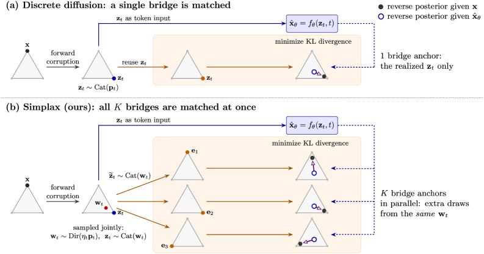
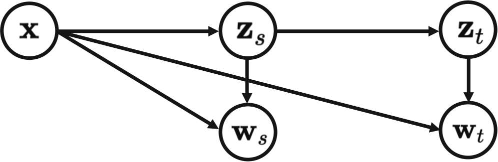
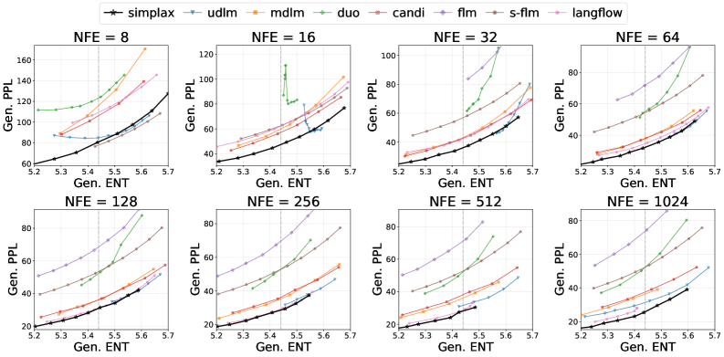

> **论文**：Simplex Relaxation for Discrete Diffusion
> **作者**：Jinya Sakurai, Patrick Pynadath, Satoshi Hayakawa, Jaehong Yoon, Xulei Yang, Nancy F. Chen, Xun Xu（NTU Singapore、University of Tokyo、Purdue University、A*STAR IAIC/CFAR 等）
> **arXiv ID**：2608.10615
> **发表时间**：2026-08-11
> **许可协议**：arXiv 预印本（未标注）
> **代码仓库**：无官方实现（论文未提供代码链接）

# 精读报告：Simplex Relaxation for Discrete Diffusion（arXiv:2608.10615，2026）

## 第 1 章 概述

### 1.1 一句话定位

Simplax 通过一个**精确的 Dirichlet–categorical augmentation**，为 uniform 离散扩散（uniform discrete diffusion）同时丰富了训练目标与反向采样器——每个被破坏的 categorical 状态 $z_t$ 被耦合到一个取值于 simplex 的辅助变量 $w_t$ 上，而原始的 categorical 破坏过程保持不变、categorical 状态仍是 denoiser 的输入。换言之，它回答的问题是：能否在不改动 underlying categorical corruption process 的前提下，让目标函数与 reverse transition 变得更有表达力？

### 论文图表总览

| 编号 | 内容 | 章节 |
|------|------|------|
| **Figure 1** | Simplax 方法总览（z_t 输入 denoiser，w_t 定义目标与反向更新） | 第 3 章 |
| **Figure 2** | 联合因子分解的图模型 | 第 3 章 |
| **Figure 3** | 设计诊断（self-conditioning、denoiser input、UDLM 初始化） | 第 5 章 |
| **Figure 4** | Llama-2 7B 下各方法 Gen. PPL–Gen. ENT 前沿 | 第 4 章 |
| **Figure 5** | Sudoku 定性生成对比 | 第 5 章 |
| **Table 1** | OpenWebText 无条件生成主结果 | 第 4 章 |
| **Table 2** | Sudoku 跨线索密度条件/无条件结果 | 第 4 章 |

### 1.2 核心贡献

第一，**精确 augmentation**：引入 uniform discrete diffusion 的精确 Dirichlet–categorical augmentation。联合分布的因子分解中，每个被破坏的 categorical 状态 $z_t$ 通过 shifted Dirichlet 条件分布 $q(w_t\mid z_t,x)=\mathrm{Dir}(w_t;\eta_t p_t+z_t)$ 耦合一个辅助 simplex 变量 $w_t$，且原始 categorical 过程作为其边际保持不变——这一"精确性"不是变分近似，而是分布层面的恒等。

第二，**可处理的训练目标与采样器**：直接在 simplex bridge 上写 KL 会遇到不可解的 Dirichlet mixture；论文转而在辅助解码样本 $\tilde z_t\sim\mathrm{Cat}(w_t)$ 上平均离散 reverse KL，得到 Rao–Blackwellized 的 reverse-bridge 目标（闭式解），并配以对应的随机 ancestral sampler。其连续时间极限 $\ell_{\mathrm{ct}}$ 恰为 UDLM 目标的 simplex-relaxed 连续时间类比。

第三，**实证改善**：在 OpenWebText（OWT）无条件生成上改善 generative perplexity–entropy 权衡；在 Sudoku 上，仅在 30-clue 谜题上训练的模型在全部评估 clue 密度（40/35/30/25/20/17/0）上取得被比较方法中最高的准确率或有效性，包括最小唯一可解的 17-clue 区间。

### 1.3 关键结果速览

在 OWT 无条件生成上（GPT-2 Large 判分），少步采样区间 Simplax 的优势最显著：NFE=16 时 Simplax 达到 90.5，而 UDLM 为 186.0、MDLM 为 117.9、Duo 为 166.1、FLM 为 259.5——Simplax 将少步 UDLM 的 PPL 大约减半。在 NFE=1024 时，Simplax 在 GPT-2 Large / GPT-2 XL / Llama-2 7B 三个判分器上全部最优，分别为 45.1 / 46.8 / 25.5。在 Sudoku 上，仅用 30-clue 训练的 Simplax 在最难的 17-clue（9×9 数独唯一可解的最小线索数，McGuire et al. 2014）区间达到 1.20% 准确率，强于 FLM（0.45%）与 Duo（0.40%）等基线；在 0-clue 无条件生成下 validity 为 95.85%，对最强基线 Duo 的 80.95% 高出 14.90 个百分点。这组数字共同说明：目标与采样器的丰富化在**少步采样**与**分布外 clue 密度**两个最有压力的场景下收益最大。

## 第 2 章 背景

### 2.1 离散扩散的谱系与 corruption kernel 的角色

离散扩散模型是 categorical 数据（文本 token、图节点类别、谜题格子）的生成框架。其核心设计自由度是 **corruption kernel**：它决定了前向过程的中间状态空间，也决定了反向过程要解的预测问题。谱系大致为：multinomial diffusion（Hoogeboom et al., 2021）首次将扩散搬到 categorical 状态上；D3PM（Austin et al., 2021）系统化了 transition matrix 的选择；continuous-time 推广（Campbell et al., 2022）给出连续时间离散扩散；concrete score 视角（Lou et al., 2024）统一了离散去噪目标；此后 masked 分支（MDLM、SEDD 等）以吸收态为唯一破坏模式，而 uniform 分支（UDLM、Duo）让每个位置以概率对称地重采样为词表中任意类别。

前向过程可写成 $q(z_t\mid x)=\mathrm{Cat}(z_t;p_t(x))$，其中 $p_t(x)=\alpha_t x+(1-\alpha_t)\pi$，$\alpha_0=1$、$\alpha_1=0$，$\pi$ 为词表上的均匀分布（对 uniform 扩散而言）。corruption kernel 的选择直接塑造两端：masked 扩散的中间状态是"原 token 或 [MASK]"，反向过程学的是"哪里被遮、填什么"；uniform 扩散没有吸收态、所有类别对称，中间状态是全词表上的噪声 token，反向过程学的是"每个位置现在最可能是什么"。masked 分支因训练目标可写成简单加权交叉熵而成为主流，但 uniform 分支保留了完整词表信息、避免了 mask 这一语料外符号，UDLM 与 Duo 的工作表明它在少步采样上具备竞争力，代价是其目标与采样器相对受限。

### 2.2 离散扩散的形式化基础

离散扩散在形式上与连续扩散平行。给定噪声 schedule $\alpha_t \in [0,1]$（$\alpha_0=1$，$\alpha_1=0$），t 时刻的噪声状态为

$$
q(\mathbf{z}_t\mid \mathbf{x}) = \mathrm{Cat}\left(\mathbf{z}_t;\ \mathbf{p}_t(\mathbf{x})\right),\qquad \mathbf{p}_t(\mathbf{x}) \coloneqq \alpha_t \mathbf{x} + (1-\alpha_t)\boldsymbol{\pi},
$$

即在干净 one-hot 向量 $\mathbf{x}$ 与先验 $\boldsymbol{\pi}$ 之间插值。两个时刻 $s<t$ 之间的前向转移为

$$
q(\mathbf{z}_t\mid \mathbf{z}_s) = \mathrm{Cat}\left(\mathbf{z}_t;\ \alpha_{t\mid s}\mathbf{z}_s + (1-\alpha_{t\mid s})\boldsymbol{\pi}\right),\qquad \alpha_{t\mid s} \coloneqq \frac{\alpha_t}{\alpha_s},
$$

对应的反向后验有闭式解

$$
\mathbf{r}_{s\mid t}(\mathbf{x}, \mathbf{z}_t) \coloneqq \frac{\left[\alpha_{t\mid s}\mathbf{z}_t + (1-\alpha_{t\mid s})\langle \mathbf{z}_t, \boldsymbol{\pi}\rangle \mathbf{1}\right] \odot \mathbf{p}_s(\mathbf{x})}{\langle \mathbf{z}_t, \mathbf{p}_t(\mathbf{x})\rangle},
$$

标准训练目标为离散反向 KL：

$$
\mathcal{L}_{z_s\mid z_t}(\mathbf{z}_t, \hat{\mathbf{x}}_\theta, \mathbf{x}) = D_{\mathrm{KL}}\left[q(\mathbf{z}_s\mid \mathbf{z}_t, \mathbf{x}) \,\middle\|\, q(\mathbf{z}_s\mid \mathbf{z}_t, \hat{\mathbf{x}}_\theta)\right],
$$

其中 $\hat{\mathbf{x}}_\theta = f_\theta(\mathbf{z}_t, t) \in \Delta^{K-1}$ 是 denoiser 对干净 token 分布的预测。Simplax 的全部构造都建立在这套标准形式之上——它不改变 $q(\mathbf{z}_t\mid \mathbf{x})$ 与反向 KL 的语义，只在每个中间状态周围附加 simplex 结构。

### 2.3 开放问题

论文把动机收敛为一个明确的问题：**能否保持 categorical 破坏过程不变，而丰富其训练目标与反向采样器？** 换一个 simplex 状态空间（见 2.4）固然能引入连续几何，但会把 denoiser 的输入也换成非 categorical 对象，脱离已验证的离散扩散基建。理想方案应当是"增广而不替换"：categorical 状态 $z_t$ 仍是生成状态与网络输入，新变量只负责让目标与 reverse transition 携带更多信息。直接在 $z_t$ 上添加 Dirichlet 辅助变量的朴素做法会遇到 Dirichlet mixture 的 KL 不可解问题（第 3.2 节），这正是方法部分要绕开的障碍。

### 2.4 相关工作与 Simplax 的位置

与本文最相关的一类工作是**辅助变量 / 混合 formulation**：Di4C 用 mixture product models 表示反向分布；VADD 在 masked denoising 中引入 Gaussian latent；CoDD 用 probabilistic circuits 拓宽反向分布族；Duo/Duo++ 在离散状态之外添加 Gaussian-relaxed 视图；FLM 在 one-hot 上做 Euclidean denoising；CANDI 将离散与连续过程混合。这些方法的共同点是引入的连续结构与 categorical 过程的耦合是**构造性的、通常非精确的**。

另一类是**直接在 simplex 上做扩散**：softmax-transformed 扩散（Floto et al., 2023）、categorical SDEs（Richemond et al., 2023）、DDSM 学习 Dirichlet score、Dirichlet Flow Matching（Stark et al., 2024），以及后续的统一框架（Chandra et al., 2026）。这一类的共同点是**把 simplex 当作主生成状态**——生成轨迹本身在 simplex 上演化，解码时再取 categorical。

Simplax 与两者都不同：它把 simplex 变量 $w_t$ 作为**附加在标准离散扩散之上的精确辅助 bridge**——$w_t$ 的条件分布是 Dirichlet，其 categorical 边际恰好就是原 uniform 扩散过程；同时它保留 categorical 状态 $z_t$ 作为 denoiser 输入。换言之，simplex 是"丰富目标与采样器的介质"，而不是"替代的生成状态"。这个定位使其可以即插即用地套在既有 uniform 扩散基建（如 MDLM backbone）上。

## 第 3 章 方法

### 3.1 Simplex relaxation：精确的 Dirichlet–categorical augmentation

回顾前向过程：$q(z_t\mid x)=\mathrm{Cat}(z_t;p_t(x))$，$p_t(x)=\alpha_t x+(1-\alpha_t)\pi$；forward transition 为 $q(z_t\mid z_s)=\mathrm{Cat}(\alpha_{t\mid s}z_s+(1-\alpha_{t\mid s})\pi)$，$\alpha_{t\mid s}=\alpha_t/\alpha_s$；reverse posterior $r_{s\mid t}(x,z_t)$ 有闭式；标准训练目标是 $\mathrm{KL}[q(z_s\mid z_t,x)\,\|\,q(z_s\mid z_t,\hat x_\theta)]$。Simplax 的构造是把每个 $z_t$ 嵌入 simplex $\Delta^{K-1}$ 的邻域：定义联合因子分解（Eq. 6），其中关键的 shifted Dirichlet 条件为

$$
q(w_t\mid z_t,x)=\mathrm{Dir}\!\left(w_t;\ \eta_t p_t + z_t\right),
$$

即以 $\eta_t p_t + z_t$ 为（未归一化的）浓度向量。浓度参数 $\eta_t>0$ 控制 Dirichlet 的集中度：$\mathrm{Dir}(\cdot;\eta p)$ 的中心在 $p$。

**Proposition 1** 给出该 augmentation 的四条精确性质：

其一（Eq. 8），$w_t$ 的边际为单个 Dirichlet：

$$
q(w_t\mid x)=\mathrm{Dir}(w_t;\eta_t p_t).
$$

其成立依赖 **Corollary 1** 的塌缩机制：对任一类别 $k$，

$$
p_k\,\mathrm{Dir}(w;\eta p+e_k)=w_k\,\mathrm{Dir}(w;\eta p),
$$

即"先采 $z_t\sim\mathrm{Cat}(p_t)$、再采 $w_t\sim\mathrm{Dir}(\eta_t p_t+z_t)$"的 mixture，逐项等于"直接采 $w_t\sim\mathrm{Dir}(\eta_t p_t)$、再采 $z_t\sim\mathrm{Cat}(w_t)$"。混合权重 $p_k$ 被恰好换成了 $w_k$，Dirichlet mixture 塌缩为单个 Dirichlet——这是 augmentation 精确性的核心机制。

其二（Eq. 9），**精确解码器**：$q(z_t\mid w_t,x)=\mathrm{Cat}(z_t;w_t)$。simplex 变量 $w_t$ 本身就是 categorical 状态的软标签。

其三（Eq. 10–11），**lifted reverse posterior**：给定 $w_t$ 而非 $z_t$，反向后验仍是 categorical，$q(z_s\mid w_t,x)=\mathrm{Cat}(z_s;\rho_{s\mid t}(x,w_t))$，其中

$$
\rho_{s\mid t}=p_s\odot\Big[\alpha_{t\mid s}\,(w_t\oslash p_t)+(1-\alpha_{t\mid s})\,\langle w_t,\ \pi\oslash p_t\rangle\,\mathbf{1}\Big].
$$

其四（Eq. 12），$q(w_s\mid w_t,x)$ 是一个 **Dirichlet mixture**——正是这个混合结构使得任何直接以 $w$ 为两端点的 bridge KL 都不可解。

### 3.2 Rao–Blackwellized 训练目标

朴素方案是直接匹配 simplex bridge 的 KL（Eq. 13），但由 Proposition 1 第四条，$q(w_s\mid w_t,x)$ 是 Dirichlet mixture，该 KL 没有闭式。论文的替代路线：**在辅助解码样本上平均离散 reverse KL**（Eq. 14）——先采 $\tilde z_t\sim\mathrm{Cat}(w_t)$，再计算以 $\tilde z_t$ 为条件的标准离散反向 KL，并对 $\tilde z_t$ 取期望。由于反向后验本身是 categorical 且闭式（$\rho_{s\mid t}$），这一期望可以解析完成——这正是 **Rao–Blackwellization**：用条件期望替代蒙特卡洛采样，降低方差并换来闭式。

**Proposition 2**（Eq. 15）给出闭式目标：

$$
\bar{\mathcal{L}}=\big\langle w_t,\ \log\hat p_t-\log p_t\big\rangle+\big\langle\rho_{s\mid t}(x,w_t),\ \log p_s-\log\hat p_s\big\rangle,
$$

其中 $\hat p_\cdot$ 由 denoiser 预测的 $\hat x_\theta$ 经 $\hat p_t=\alpha_t\hat x_\theta+(1-\alpha_t)\pi$ 类似构造。目标对 $w_t$ 的依赖仅通过两项进入：内积 $\langle w_t,\log\hat p_t\rangle$ 与 lifted posterior $\rho_{s\mid t}(x,w_t)$——结构上，它是标准离散 KL 的逐项软化（categorical 概率被 simplex 权重 $w_t$ 加权），而非另起炉灶的损失。

**Proposition 3** 给出连续时间极限：当 $s=t-\Delta$、$\Delta\to 0$ 时，

$$
\bar{\mathcal{L}}=\Delta\,\ell_{\mathrm{ct}}+o(\Delta),
$$

其中 $\ell_{\mathrm{ct}}$（Eq. 17）含有信号率 $\lambda(t)=-\frac{d}{dt}\log\alpha(t)$，配套的连续时间目标为 Eq. 18。与 UDLM 的关系在此清晰：UDLM 直接从离散状态推导连续时间 reverse-KL；Simplax 先在辅助 $\tilde z_t$ 上做 Rao–Blackwellized 平均、再取连续时间极限，得到的 $\ell_{\mathrm{ct}}$ 是 **UDLM 目标的 simplex-relaxed 连续时间类比**（论文原文表述：*"a simplex-relaxed continuous-time analogue of the UDLM objective"*）。

### 3.3 反向采样：ancestral sampler 与输入选择

反向采样在时间格点 $1=t_N>\cdots>t_0=0$ 上进行。**初始化**（Eq. 19）：

$$
w_{t_N}\sim\mathrm{Dir}(\eta_{t_N}\pi),\qquad z_{t_N}\sim\mathrm{Cat}(w_{t_N}),
$$

即先在纯噪声的 Dirichlet 上采 simplex 变量，再解码出 categorical 状态。**每步更新**（Eq. 21）交替进行：

$$
z_s\sim\mathrm{Cat}\big(\rho_{s\mid t}(\hat x_\theta,w_t)\big),\qquad w_s\sim\mathrm{Dir}\big(\eta_s\hat p_s+z_s\big),
$$

其中 $\rho_{s\mid t}(\hat x_\theta,w_t)$ 是把 lifted posterior（Proposition 1 第三条）中的真值 $x$ 换成 denoiser 预测 $\hat x_\theta$。采出的 $z_s$ 作为下一步网络的输入，$w_s$ 则携带 bridge 信息进入下一轮更新——两条链在每一步通过 shifted Dirichlet 条件互相耦合。

denoiser 输入存在两种选择：以 $z_t$ 为输入时，状态以整数 token index 存储，网络第一层是标准的 embedding 查表；以 $w_t$ 为输入时，需要 $w_t^{\top}E$ 的稠密矩阵乘法。论文的设计诊断（Figure 3）表明，在相同 $w_t$ 目标下 $z_t$-input 的 PPL 更低且避免了稠密投影开销，故主实验采用 $z_t$-input——这也呼应了方法的整体定位：categorical 状态始终是 denoiser 看到的对象，simplex 变量只在目标函数与 reverse 更新中起作用。

*图1：Simplax 将每个被破坏的 categorical 状态 $z_t$ 与辅助 simplex 变量 $w_t$ 耦合，denoiser 仍以 $z_t$ 为输入*

*图2：联合因子分解的图模型，$w_s/w_t$ 通过 shifted Dirichlet 条件与 $z_s/z_t$ 耦合*

### 3.4 方法小结

Simplax 的三个组件环环相扣：Dirichlet–categorical augmentation 提供**分布层面的精确性**（Proposition 1 + Corollary 1，mixture 塌缩为单个 Dirichlet）；Rao–Blackwellization 提供**可处理性**（Proposition 2 闭式目标，Proposition 3 连续时间极限与 UDLM 的对齐）；ancestral sampler 提供**一致性**（Eq. 19 与 Eq. 21 严格复用训练时的条件结构，无采样-训练错配）。方法的三条限制在结论章被明确承认：仅适用于 uniform categorical corruption、辅助 simplex 状态的计算开销未完全刻画、浓度 schedule $\eta_t$（实验取常量 $0.01$）是设计选择而非理论确定。

## 第 4 章 实验设置与结果

### 4.1 实验设置

#### OpenWebText 设置

- 分词：GPT-2 BPE tokenizer，词表大小 $|\mathcal{V}| = 50{,}257$，序列长度 $L = 1{,}024$。
- 模型：Sahoo et al. (2024) 的 179M 参数扩散 Transformer：12 个 Transformer block、旋转位置编码 (RoPE)、AdaLN 时间条件、softmax 输出头。
- 优化：Adam，学习率 $3\times10^{-4}$，batch size 512，总预算 1M iterations。
- Simplax 默认配置：$\mathbf{z}_t$ 作为 denoiser 输入，常量浓度 $\eta_t \equiv 0.01$。主实验 Simplax checkpoint 由 UDLM 训练 800k iterations 后切换 Simplax 目标再训练 200k iterations 得到（总 1M steps，见论文附录 E；UDLM 初始化对 PPL–ENT 前沿的改善见第 5.3 节诊断）。
- 评估：生成 1,024 条序列，报告生成 unigram entropy 与生成困惑度（GPT-2 Large、GPT-2 XL、Llama-2 7B 三个评估器）。OpenWebText 的 unigram entropy 为 5.44 nats。
- 温度扫描：每个方法在每个 NFE 预算下扫 15 个温度（0.84 到 1.12，步长 0.02），选择生成 entropy 最接近 5.44 nats 的操作点。

#### Sudoku 设置

- 数据集：48,000 训练谜题 + 2,000 验证谜题，每个谜题有唯一解。所有模型仅用 30-clue 谜题训练（cross-clue 泛化协议）。
- 序列表示：180-token 序列 = 91-token 谜题前缀（BOS + 81 个单元格 + 8 个行分隔符 + 第二个 BOS）+ 89-token 解（81 个已填单元格 + 8 个行分隔符）。词表 12 个符号：blank 标记、数字 1-9、行分隔符、BOS。训练损失仅施加在解的部分。
- 模型：8 个 Transformer block，hidden 512，8 个 attention head（维度 64），dropout 0.1，参数量 25.21M-28.59M。自动回归模型用 causal attention 无时间条件；其余模型用双向 attention + AdaLN 时间条件（条件维度 128）。
- 优化：20,000 steps，Adam 学习率 $3\times10^{-4}$，$\beta_1=0.9$，$\beta_2=0.999$，梯度范数裁剪 1.0，全局 batch size 256，bfloat16 精度，线性 warmup 2,500 steps 后保持恒定，EMA decay 0.9999，antithetic 时间采样，随机种子 1。
- 评估：同一 30-clue 训练的 checkpoint 在 40/35/30/25/20/17 clues 条件下评估（30-clue 为训练分布内，40/35 为更多条件信息，25/20/17 为更少）。17 是标准 $9\times9$ Sudoku 唯一解的最小线索数。另外评估 all-blank 前缀（0-clue 无条件生成）。
- 指标：条件生成报告求解准确率；无条件生成报告 validity（满足全部 Sudoku 约束的棋盘比例）。

### 4.2 OpenWebText 无条件生成结果（论文 Table 1）

*图4：Llama-2 7B 评估器下各方法在全部 NFE 预算的生成困惑度-熵前沿，Simplax 在多数操作点取得更优权衡。*

各方法在三个 NFE 预算下的生成熵与三个评估器的生成困惑度（值越低越好）：

| Method | NFE=16 Ent. | NFE=16 GPT-2 L | NFE=16 GPT-2 XL | NFE=16 Llama-2 | NFE=128 Ent. | NFE=128 GPT-2 L | NFE=128 GPT-2 XL | NFE=128 Llama-2 | NFE=1,024 Ent. | NFE=1,024 GPT-2 L | NFE=1,024 GPT-2 XL | NFE=1,024 Llama-2 |
|:---|:---:|:---:|:---:|:---:|:---:|:---:|:---:|:---:|:---:|:---:|:---:|:---:|
| CANDI | 5.43 | 97.2 | 99.6 | 56.0 | 5.45 | 67.2 | 69.2 | 36.8 | 5.46 | 74.3 | 76.6 | 39.2 |
| UDLM | 5.53 | 186.0 | 190.1 | 79.0 | 5.49 | 62.9 | 64.9 | 34.6 | 5.46 | 59.2 | 61.2 | 32.2 |
| MDLM | 5.47 | 117.9 | 120.6 | 63.8 | 5.46 | 65.4 | 67.2 | 37.3 | 5.40 | 55.1 | 56.6 | 33.9 |
| Duo | 5.45 | 166.1 | 168.3 | 87.1 | 5.45 | 93.9 | 95.9 | 53.3 | 5.43 | 88.9 | 90.6 | 50.4 |
| FLM | 5.58 | 259.5 | 262.6 | 139.3 | 5.42 | 112.0 | 113.7 | 66.5 | 5.45 | 125.6 | 127.2 | 74.4 |
| LangFlow | 5.42 | 115.1 | 116.6 | 59.9 | 5.42 | 60.2 | 61.7 | 30.0 | 5.41 | 68.3 | 70.0 | 28.2 |
| S-FLM | 5.45 | 124.6 | 126.4 | 62.9 | 5.43 | 103.4 | 105.1 | 52.4 | 5.46 | 108.5 | 110.2 | 53.7 |
| **Simplax** | **5.46** | **90.5** | **93.1** | **49.3** | **5.45** | **56.9** | **58.9** | 31.4 | **5.44** | **45.1** | **46.8** | **25.5** |

**结果分析**：
- **NFE=16**（低推理预算）：Simplax 在三个评估器下均为最低生成困惑度（90.5/93.1/49.3），大幅优于 UDLM（186.0/190.1/79.0）和 Duo（166.1/168.3/87.1）。相比最强基线 CANDI（97.2/99.6/56.0），Simplax 在 GPT-2 L/XL 下领先 6.7/6.5，Llama-2 下领先 6.7。
- **NFE=128**（中等预算）：Simplax 在 GPT-2 Large 和 GPT-2 XL 下最优（56.9/58.9）；Llama-2 7B 下 LangFlow 最优（30.0），Simplax 次之（31.4）。
- **NFE=1,024**（高预算）：Simplax 在全部三个评估器下均为最优（45.1/46.8/25.5）；相比 MDLM（55.1/56.6/33.9）在 GPT-2 L/XL 下领先约 10/10，Llama-2 下领先 8.4；相比 LangFlow（68.3/70.0/28.2）在 GPT-2 L/XL 下领先 23.2/23.2，Llama-2 下仅领先 2.7。
- 总体而言，Simplax 在生成熵接近数据熵（5.44 nats）的前提下取得更低的生成困惑度，说明其在多样性与质量之间取得了更好的权衡。

### 4.3 Sudoku 约束生成结果（论文 Table 2）

各方法在 6 种线索密度下的条件求解准确率（%）与无条件生成 validity（%）：

| Method | 40 clues | 35 clues | 30 clues | 25 clues | 20 clues | 17 clues | 0 clues (validity) |
|:---|:---:|:---:|:---:|:---:|:---:|:---:|:---:|
| AR | 16.00 | 4.05 | 0.70 | 0.05 | 0.00 | 0.00 | 8.15 |
| Duo | 97.00 | 84.15 | 48.85 | 16.00 | 4.80 | 0.40 | 80.95 |
| FLM | 96.45 | 83.80 | 48.30 | 14.05 | 3.30 | 0.45 | 34.05 |
| MDLM | 98.45 | 85.15 | 48.00 | 11.80 | 2.70 | 0.20 | 22.35 |
| S-FLM | 77.70 | 42.40 | 10.75 | 1.15 | 0.05 | 0.00 | 1.25 |
| S-FLM (truncated-adaptive) | 94.70 | 78.70 | 41.60 | 11.90 | 2.95 | 0.25 | 3.45 |
| **Simplax** | **98.55** | **91.05** | **61.75** | **25.90** | **8.80** | **1.20** | **95.85** |

**结果分析**：
- Simplax 在全部条件设置与无条件设置中均为最高性能。
- **分布内（30-clue）**：Simplax 61.75%，相比最强基线 Duo（48.85%）领先 12.90 pp。
- **更易密度（40/35-clue）**：40-clue 下 Simplax 98.55% vs MDLM 98.45%（+0.10 pp）；35-clue 下 91.05% vs MDLM 85.15%（+5.90 pp）。优势在中等线索密度时最为显著。
- **更难密度（25/20/17-clue）**：25-clue 25.90% vs Duo 16.00%（+9.90 pp）；20-clue 8.80% vs Duo 4.80%（+4.00 pp）；17-clue 1.20% vs FLM 0.45%（+0.75 pp）与 Duo 0.40%。17-clue 是唯一解最小线索数，所有方法在此均极难，但 Simplax 仍保持领先。
- **无条件生成（0-clue）**：Simplax validity 95.85%，vs 最强基线 Duo 80.95%（+14.90 pp）。这是差距最大的一项，说明 Simplax 从 30-clue 训练分布学到的全局约束一致性显著优于其他方法。
- 无条件 validity 与条件准确率的巨大差距（95.85% vs 61.75% @ 30-clue）表明：有线索时的局部求解仍具挑战，但无线索时模型已能稳定生成满足行列宫约束的完整棋盘。

### 4.4 温度匹配评估协议

Table 1 与 Table 2 之外，论文的评估协议本身有一个值得注意的设计：**entropy-matching 操作点选择**。扩散语言模型生成时存在 quality-diversity 权衡——温度高则多样性高但质量下降，温度低则相反。直接在固定温度下比较生成困惑度会产生误导（某方法可能只是靠低多样性取得低困惑度）。论文的做法是：对每个方法在每个 NFE 预算下扫描 15 个温度（0.84 到 1.12，步长 0.02），选择生成 unigram entropy 最接近数据熵（5.44 nats）的操作点，再在该操作点报告生成困惑度。这样所有方法都在"多样性等价"的前提下比较质量，避免了温度调节带来的不公平优势。Table 1 中各方法的 Ent. 列（5.40-5.58）均在 5.44 附近，验证了这一协议的有效执行。

### 4.5 数据集构造细节

Sudoku 评估集的构造值得注意：20-clue 与 17-clue 评估集并非从 30-clue 谜题中随机删减，而是直接使用 Lin et al. (2013) 研究的唯一可解 17-clue 谜题（17-clue 直接用，20-clue 由每个 17-clue 谜题从唯一解中增补 3 个线索构造）。40/35/30/25-clue 评估集与训练集由 greedy Sudoku 生成器（Alp 2024）以 seed 42 生成。这保证了最难密度区间的评估基准是经过验证的唯一可解谜题，而非任意删减可能产生无解谜题。20-clue 的构造方式也使其与 17-clue 保持同源，测的是同一批困难谜题在增加 3 个线索后的表现。

### 4.6 与主题相关方法的定位

Simplax 的实验对比覆盖了离散扩散的三个主要方向：masked 分支（MDLM）、uniform 分支（UDLM、Duo）、连续/混合分支（FLM、LangFlow、CANDI、S-FLM）。在 OWT 少步采样（NFE=16）下 Simplax 对 uniform 分支的 UDLM 优势最明显（186.0 → 90.5，PPL 近乎减半；Duo 166.1 → 90.5，降幅约 45%），说明 Rao-Blackwellized 目标对少步采样场景的 reverse bridge 质量提升是实质性的；在 Sudoku 上 Simplax 同时击败 masked（MDLM）、uniform（Duo）与连续（FLM、S-FLM）三路基线，说明 simplex 辅助结构带来的收益不限于某一类扩散设置。

## 第 5 章 设计诊断与消融分析

### 5.1 Denoiser 输入选择：z_t vs w_t

论文测试了两种 denoiser 输入：categorical 状态 $\mathbf{z}_t$ 与辅助 simplex 状态 $\mathbf{w}_t$。在相同的 $\mathbf{w}_t$-based 目标下，$\mathbf{z}_t$-input 模型在 NFE=16 与 NFE=128 两个预算下均取得更低的生成困惑度（相近的生成熵）。

此外，$\mathbf{z}_t$-input 有计算优势：在标准 token 模型中，$\mathbf{z}_t$ 存为整数 token index，embedding 通过查表获得；若改用稠密 simplex 向量 $\mathbf{w}_t$，则每个序列位置都需要计算 $\mathbf{w}_t^\top E$（$E$ 为词表 embedding 矩阵），引入一次词表大小的稠密矩阵乘与相应内存流量。因此主实验采用 $\mathbf{z}_t$-input 形式，$\mathbf{w}_t$ 保留在训练目标与反向更新中。

### 5.2 Self-conditioning 诊断（论文 Figure 3a, 3d）

对于 $\mathbf{w}_t$-input 诊断，self-conditioning 的收益依赖推理预算：NFE=16（接近数据熵操作点）时省略 self-conditioning 更好；NFE=128 时使用 self-conditioning 更好。该实验不支持 budget 无关的结论——即 self-conditioning 的效用与推理步数强耦合，不能脱离 NFE 单独判断。

### 5.3 UDLM 初始化诊断（论文 Figure 3c, 3f）

将 UDLM 训练 800k iterations 后切换 Simplax 目标再训练 200k iterations，相比从头训练 1M iterations 的 Simplax，在两个 NFE 值下均改善了 Gen. PPL-Gen. ENT 前沿。说明 Simplax 目标与 UDLM 目标兼容，可作为 UDLM 训练的后续精炼阶段——这为实际部署提供了一条低成本迁移路径：先在成熟的 UDLM 基建上训练，再用 Simplax 目标精炼。

### 5.4 数值稳定性细节（附录 E）

论文在实现层面对数值稳定性做了明确处理：Dirichlet 采样与浓度相关计算在 float64 精度下执行；浓度值裁剪到 $[10^{-10}, 10^{8}]$；归一化前输出 logits 用 $\ell \leftarrow 30\tanh(\ell/30)$ 软约束。这些细节对 Simplax 的实用部署很重要——当 $\eta_t$ 取较小值（如 0.01）时 Dirichlet 采样可能进入极端区域，float64 与裁剪避免了下溢。

### 5.5 定性分析

#### OpenWebText 定性生成

论文在 NFE=16/128/1,024 各展示了一条代表性生成（选自 entropy-matching 操作点，未人工改写）。Simplax 的生成在语法流畅性与局部主题连贯性上表现良好；基线中 UDLM 与 FLM 在低 NFE 时出现明显语义漂移（如 UDLM 在 NFE=16 的"bus un the altitude"类不连贯片段）。

#### Sudoku 定性生成（论文 Figure 5）

从 25-clue 评估集选出的示例中，基线模型常能恢复许多单个格子但无法形成全局一致的棋盘：MDLM 最接近，与唯一解仅差 8 个格子，但即使这些稀疏错误也足以使棋盘无效。相比之下，Simplax 同时满足行、列、宫三重约束。这直观展示了局部一致性与全局有效性之间的区别——个体格子的局部正确性并不保证整体棋盘的有效性，而 Simplax 的全局约束一致性是其在无条件生成中取得 95.85% validity 的直接原因。

## 第 6 章 局限性与延伸阅读

### 6.1 局限性

1. **uniform corruption 专用**：当前 formulation 专用于 uniform categorical corruption。扩展到 masked/absorbing 等其他 corruption kernel 是未来工作。
2. **计算开销未完全刻画**：辅助 simplex 状态相对标准离散扩散的计算开销（Dirichlet 采样、浓度相关计算）未被完整量化。附录提到 Dirichlet 采样与浓度相关计算在 float64 下执行，浓度裁剪到 $[10^{-10}, 10^{8}]$，输出 logits 用 $\ell \leftarrow 30\tanh(\ell/30)$ 软约束。
3. **浓度 schedule 是设计选择**：$\eta_t$ 的 schedule 仍是额外设计自由度，而非由理论确定。主实验采用常量 $\eta_t \equiv 0.01$。

### 6.2 延伸阅读

- **离散扩散谱系**：D3PM (Austin et al., 2021)、continuous-time 离散扩散 (Campbell et al., 2022)、concrete score matching (Lou et al., 2024)、MDLM (Sahoo et al., 2024)、SEDD。
- **uniform 扩散方向**：UDLM (Schiff et al., 2025)、The diffusion duality (Sahoo et al., 2025)、scaling behavior of discrete diffusion (von Rütte et al., 2026)。
- **辅助变量与混合 formulation**：Di4C (Hayakawa et al., 2025)、VADD (Xie et al., 2026)、CoDD (Li et al., 2026)、CANDI (Pynadath et al., 2025)、FLM (Lee et al., 2026)。
- **simplex 上的扩散**：categorical SDEs with simplex diffusion (Richemond et al., 2023)、DDSM (Avdeyev et al., 2023)、Dirichlet Flow Matching (Stark et al., 2024)、unification (Chandra et al., 2026)。
- **开放方向**：将 Simplax 扩展到更广的 corruption kernels、更高效的 reverse solver、以及将浓度 schedule 由数据驱动确定。
