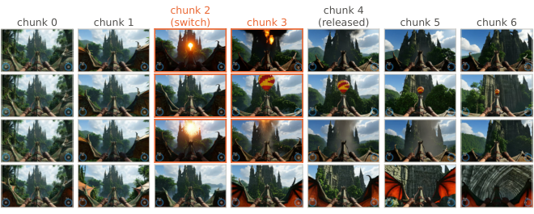
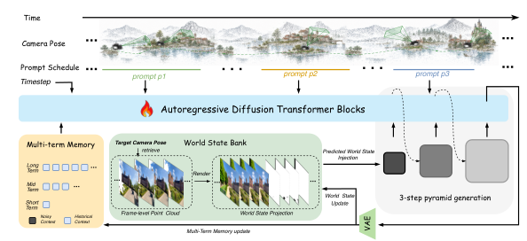

> **论文**：Alaya-EVOKE: From Linear-Scaling Supervision to Endless World
> **作者**：Yuanyang Yin, Gongxuan Wang, Yifan Zhan, Chuanhao Li, Kaipeng Zhang, Feng Zhao 等（MoE Key Lab of BIPC, USTC / Shanghai Innovation Institute / Alaya Lab）
> **arXiv ID**：2608.13546
> **发表时间**：2026-08-14
> **许可协议**：Apache-2.0
> **代码仓库**：https://github.com/SII-YuanyangYin/Evoke

## 第 1 章 概述

### 1.1 一句话定位与图表总览

Evoke 是一个交互式视频世界模型：将场景几何持久化于外部、以相机位姿索引的世界状态库（world state bank），并以重新设计的教师提供 30 s 长视界分布匹配监督，使学生的去噪器上下文、位置编码范围与计算成本均与会话时长解耦，在单张 H200 上以 3 步、无 CFG 推理实现开放式（endless）长会话生成与响应式中途控制。

### 论文图表总览

| 编号 | 内容 | 论文章节 |
|:---:|------|:---:|
| Figure 1 | 7 个 2 小时连续生成 rollout 演示 | §1 |
| Figure 2 | evocation 案例：定时指令按指定时刻引入/撤出场景元素 | §1 |
| Figure 3 | 循环推理流程：student 与 world state bank 的读–生成–写循环 | §3 |
| Figure 6 | 长/短视界教师蒸馏出的学生对比 | §3.3 |
| Figure 7 | 短时记忆召回可视化 | §3.4 |
| Figure 8 | evocation 受控评估：中途子句实现率 67% / 需替换几何 4% | §4.4 |
| Figure 10 | 几何路径成本分解 | §7 |
| Figure 11 | 教师 prompt 调度：4 分钟 rollout × 12 条 20 s 指令 | §8 |
| Figure 12 | 定性 rollout 汇总：9 个会话、4 类场景 | §9 |
| Table 1 | WBench 导航 split（158 例）分组得分 | §4.1 |
| Table 2 | VBench-2.0 与 VBench-Long 总分对比 | §4.1 |
| Table 3 | VBench-2.0 完整榜单 | §10 |
| Table 4 | VBench-Long 完整榜单 | §10 |
| Table 7 | WBench 公共榜单（30 个系统） | §11 |



*图 2：evocation 案例——定时指令在指定时刻向场景引入或从中撤出元素；测试中新内容实现率为 67%，而需要替换已有几何的情况仅占 4%（§4.4）。*

### 1.2 核心贡献

1. **有界循环公式化**：将交互式世界生成公式化为读写外部世界状态库的循环过程。场景几何存放于外部、以相机位姿索引的世界状态库，仅检索当前视角相关的信息；去噪器上下文规模与位置编码范围均与会话时长解耦。
2. **面向长视界交互监督的教师重设计**：教师不再沿用短视界、静态条件的通用视频模型，而是采用 chunk-wise 稀疏注意力 + per-chunk 独立文本条件，使激活内存与计算随 rollout 线性增长；由此能够暴露长距离内容漂移（content drift）与中途指令变化。
3. **30 s 长视界蒸馏**：以 self-forced rollouts 上的 30 s 长视界分布匹配目标，将上述能力转移到 3 步、CFG-free 的学生，实现有界成本的开放式生成，兼顾长视界一致性与响应式中途控制。

### 1.3 关键结果速览

| 基准 / 指标 | 数值 | 排名 | 对照 |
|------|:---:|:---:|------|
| WBench 公共榜单 Average | 80.8 | 1 / 30 | 第 2 名 HiDream-O1-World 80.7 |
| VBench-2.0 Total | 66.77 | 1 / 10 | Veo 3 66.72 |
| VBench-Long Total | 85.11 | 7 / 10 | IPOW 88.26；Veo 3 85.06 |
| 生成延迟（单 H200，384×640） | 2.11 s / 1.5 s chunk | — | 3 步、无 CFG |

WBench 导航 split（158 例）分组得分：Quality 82.79、Setting 83.76、Interaction 78.63、Consistency 86.87、Physical 72.06；Evoke 在 Quality / Setting / Physical 组平均领先，Consistency 与最强方法并列，最大增益出现在 scene-level 与 causal-fidelity 能力上，Navigation / Perspective 偏弱（受相机控制路径限制）。VBench-2.0 与 VBench-Long 成绩均在 3 步 CFG-free 采样下取得，对比方法多为多步默认采样器（非 step-matched）。长会话稳定性：8 个 65.5 分钟 rollout（各 2,619 chunks、各 94,281 帧，合计约 75.4 万帧），光度统计在初始瞬态后保持稳定，计算成本有界（源池填满后不再增长）。

## 第 2 章 背景与动机

### 2.1 交互式世界模型的三个冲突需求

| 需求 | 常规实现方式 | 冲突根源 |
|------|------|------|
| 持久记忆 | 历史帧 / KV cache 进入 denoiser 上下文 | 上下文随会话时长增长，显存与计算不可持续，长上下文稀释注意力 |
| 响应式交互 | few-step 蒸馏 + 逐 chunk 流式生成 | 学生上限受教师约束：教师若只见过短视界、静态条件，学生无法获得长视界一致性 |
| 长视界生成 | 自回归外推 | 误差沿 rollout 累积，产生画质退化与内容漂移 |

三个需求两两冲突：上下文有界对抗记忆持久，少步快采样依赖强教师，自回归外推天然漂移。Evoke 的核心设计原则是**解耦**——持久空间状态放入外部世界状态库，教师专门提供长视界 + 动态条件监督。

### 2.2 三条技术路线

| 路线 | 代表机制 | 局限 |
|------|------|------|
| (a) denoiser 内维护历史 | context frames / KV cache 扩展，配合 windowing、eviction、retrieval | 记忆与模型上下文耦合，成本仍随历史增长 |
| (b) 几何外部化 | warp-based conditioning，单目深度提升（monocular depth lift） | 通常未与长视界监督、few-step 学生联合设计 |
| (c) few-step 蒸馏 | distribution matching，self-forcing | 教师能力直接决定学生上限 |

Evoke 组合路线 (b) 与 (c)，同时把教师本身当作设计变量，引入两个此前被忽视的自由度：**监督视界**（supervision horizon）与**条件调度**（conditioning schedule）。

### 2.3 两类漂移：degradation drift 与 content drift

- **degradation drift（退化漂移）**：画质与细节保真度沿 rollout 逐步劣化，在局部窗口内即可检测（相邻 chunk 比较）。曝光增长、饱和偏移、纹理退化等都属于此类；既有 long-video 目标（Cui et al., 2025；Liu et al., 2025）能显著改善此类局部稳定性，但这种改善可能伴随时间动态/多样性的降低。
- **content drift（内容漂移）**：场景语义与内容缓慢偏离初始设定，只有跨长距离比较才能暴露。场景身份、物体外观或空间布局的渐进演变在每一个局部窗口中都看似合理，因此不能靠加强局部稳定性解决——这正是监督视界成为独立设计变量的原因。

两类漂移对应两个正交问题，Evoke 用两个正交机制治理：时间轴上的内容漂移由长视界监督解决（教师对整个窗口联合评分，见 §3.2）；空间上的重访不一致由外部世界状态库解决（几何召回，见 §3.4）。教师侧的两个设计变量（监督视界 + 条件调度）正是为了让教师有能力区分并暴露这两类漂移。

需要说明的是：论文 §4.3 的受控消融中，长视界教师带来的**可验证**收益主要落在光度/退化稳定性上（内容描述符未显著分离，结论被论文明确限定于光度稳定性）；content drift 的理论治理依赖长视界监督，而空间重访一致性由世界状态库承担——两类机制的分工是论文设计层面的一贯立场，但各自的独立因果贡献未被完全剥离（详见 §4.4 与第 6 章）。

## 第 3 章 方法（Evoke）

### 3.1 循环会话公式化

会话被切分为连续的 chunk 序列，第 k 步的读–生成–写循环为：

$$r_k = \mathrm{Read}(M_k, P_k),\qquad x_k \sim p_\theta\!\left(\cdot \mid r_k,\ h_k,\ c_k\right),\qquad M_{k+1} = \mathrm{Write}(M_k, x_k, P_k)$$

- $M_k$：外部世界状态库——显式、有界、以相机位姿索引；
- $P_k$：当前 chunk 的相机轨迹，Read 按位姿检索并渲染当前视角相关的观测 $r_k$；
- $h_k$：本地历史（最近若干 latent 帧），$c_k$：文本条件，每步可变；
- Write 将生成结果 $x_k$ 对应的几何写回库中，库的三个基本操作为 write / read / evict。

时间离散化：1 个 chunk = 9 latent 帧 = 36 pixel 帧 = 1.5 s @ 24 fps。位置编码层面，每个 chunk 复用同一套局部位置布局，位置范围不随会话增长。



*图 3：Evoke 循环推理流程——学生仅携带 19 帧本地历史，几何在世界状态库中按相机位姿读写，去噪器上下文规模与会话时长无关。*

### 3.2 长视界监督

学生以滚动窗口方式被监督，目标为窗口上的分布匹配：

$$\mathcal{L}_W(\theta) = \mathbb{E}_k\!\left[\, D\!\left( q_\theta^{\,k:k+W-1} \,\Big\|\, p^{\,k:k+W-1} \right) \right]$$

其中 $q_\theta$ 为学生在窗口 $[k,\ k+W-1]$ 上的自强制生成分布，$p$ 为参考分布，$D$ 为散度型差异度量。

监督视界 $W$ 的取值由漂移的可检测尺度决定：degradation drift 局部可检，短视界教师即可发现；content drift 需跨长距离比较，只有 $W$ 足够大时教师才能"看见"并惩罚。$W$ 的收益先大后饱和，约 30 s 处饱和；监督视界无需与最终会话时长成比例——30 s 的监督即可支撑小时级会话。训练时的具体配置为 1 个 GT 前缀 + 20 个生成 chunk = 189 latent 帧 = 753 pixel 帧 ≈ 31.4 s。附录 §8 在 13 种扰动条件下测得 $W > 2$ chunks 后 teacher–critic detectability 变化不大，提示收益更多来自完整的长视界训练过程而非窗口长度本身。

### 3.3 教师：长视界交互监督

**骨干与共享结构。** 教师基于 14B 的 Wan2.2 A14B diffusion transformer（保留高/低噪声专家）；teacher 与 critic 共享同一 backbone，通过 LoRA 切换——LoRA 开启时为 critic，关闭时为 teacher。

**稀疏注意力。** 教师对长 rollout 的注意力按五类组织：

| 组成 | 作用 |
|------|------|
| 全局 sink | 稳定长序列注意力 |
| 局部上下文（相邻 chunk 间 1 帧重叠） | 保持短时连贯 |
| 空间压缩的近帧 | 低成本覆盖近期历史 |
| 少量远处帧 | 检索远距离内容 |
| 线性注意力全局状态 | 常数代价的全局摘要 |

激活内存与计算随序列长度线性增长（标题中 "linear-scaling supervision" 的直接来源），支撑分钟级 rollout：4 分钟教师 rollout × 12 条 20 s 指令（Figure 11）。

**per-chunk 文本条件。** 每个 chunk 携带独立文本条件，训练 caption 以 12 s 间隔分段，使教师能在会话中途响应指令变化。

**DMD 蒸馏目标。** 学生在 self-forced rollout 上按分布匹配距离（DMD）形式被监督：

$$\Delta s = s_{\mathrm{fake}} - s_{\mathrm{real}}$$

$$\nu = \mathrm{mean}_\Omega\!\left[\, \lvert \hat{x}_0 - s_{\mathrm{real}} \rvert \,\right]$$

$$\mathcal{L}_{\mathrm{gen}} = \frac{1}{2}\left\| \hat{x}_0 - \left(\hat{x}_0 - \Delta s / \nu\right)_{\mathrm{detach}} \right\|_2^2$$

掩码 $\Omega$ 排除 GT 前缀与第 1 个生成 chunk——后者与 GT 前缀交界处存在边界闪烁。

**监督视界 ≠ 梯度视界。** rollout 中 chunk 之间梯度相互 detach（梯度视界为单个 chunk），但评分在全窗口上联合进行（监督视界为整窗 $W$）——学生以单 chunk 的反向传播成本获得长视界的分布约束。long-distill 阶段使用 6×8 GPUs。

### 3.4 几何世界状态库

学生仅保留最近 19 个 latent 帧 ≈ 3.2 s 的本地历史（long 16 / mid 2 / short 1 帧），更久远的场景信息全部经世界状态库以几何形式存取。

**写（Write）。** 对每个生成 chunk 抽取 12 帧做单目深度估计 → 按相机位姿 unproject 为 3D 点 → 独立插入世界点云；独立插入避免尺度漂移（scale drift）。

**读（Read）。** 按目标相机位姿做 co-visibility 排序 → 选取至多 8 个源视图 → batched z-buffering 渲染 → 输出 warped observation 与 per-pixel visibility mask。

**不确定性映射。** visibility < 0.5 的像素视为无信息，取 σ=1（交由学生自行生成）；支持区域的 σ ∈ [0, 0.135]，与可见度挂钩。

**保留预算。** 世界状态库保留 2160 pixel 帧 = 90 s 的几何；每 3 帧摄入一次，活跃源池 ≤ 720 帧。当前实现保留有限时间窗口内的几何，几何路径的成本有界、依赖覆盖量而非会话时长。

### 3.5 有界 3 步推理

学生为 3 步、无 CFG 采样：每 chunk 共 3 次去噪函数评估，按粗到细的 latent 金字塔推进：

$$12 \times 20 \;\rightarrow\; 24 \times 40 \;\rightarrow\; 48 \times 80$$

几何条件（warped observation + visibility mask）只在最粗阶段（12×20）注入；visibility-based pruning 在后续阶段移除不被支持的 token。推理成本严格有界：单张 H200、384×640 分辨率下每 1.5 s chunk 生成耗时 2.11 s，该测量使用完整 VAE 解码器，且不依赖 KV cache、编译或量化加速。
## 第 4 章 实验评估

### 4.1 实验设置

**模型与训练协议。** Evoke 学生模型基于 Helios（Yuan et al., 2026）构建，经过渐进式训练：先训练相机可控生成与少步推理（*stage1_camera_control*，50 步、CFG 5.0），再做少步蒸馏（*stage2_few_step*，3 步金字塔），随后进行长视界蒸馏（*long-distill*），最后做短时后蒸馏续训（*post-distill*）以巩固相机控制。训练数据使用 Sekai 视频数据集（Li et al., 2026）与额外的内部视频数据。Evoke Teacher 基于 14B 参数的 Wan2.2 A14B 扩散 Transformer（Peebles & Xie, 2023；Wan et al., 2025）改造，针对长序列监督训练（架构见第 3.3 节）。教师与 critic 共享同一 backbone：启用 LoRA adapter 即为 critic，禁用即为 teacher，保证教师/critic 分数始终在同一专家内计算。

**推理配置。** 除特别说明外，发布的学生模型每 chunk 使用 3 次去噪评估、不使用 classifier-free guidance。所有运行时测量在单张 H200 上、384×640 分辨率、使用完整 VAE 解码器、不启用 KV cache 缓存、编译、量化或蒸馏解码器等推理加速手段下进行。

**长会话定量评估。** 使用 8 条 65.5 分钟的 rollout（每条 2,619 个 chunk、94,281 帧），世界状态库限制为保留 90 秒的观测。报告的 2.11 s 延迟指扩散过程的 wall clock，而非端到端执行时间（完整路径含几何渲染与视频 I/O，见第 4.5 节）。另有一条小时级 rollout 作为一致性检查，其光度与内容相似度轨迹保持在 8 条会话评估的范围内。

**受控蒸馏对比协议。** 为隔离教师视界的影响，论文用匹配的配方分别蒸馏「短视界教师」与「Evoke 长视界教师」两个学生；发布的 Evoke 学生由长视界管线继续训练得到。长会话评估沿光度（photometric）与内容（content descriptor）两条互补线索展开：光度统计量化亮度/饱和度等低层外观的渐进变化；内容描述符度量与各会话自身开场片段的相似度，属自一致性度量而非基于参考的身份指标——真实视频对照组随相机自然穿越新内容也呈现显著描述符去相关，因此绝对相似度值不应解读为场景身份的永久保持。

### 4.2 基准性能

**WBench 交互式世界模型性能。** 在 WBench（Ying et al., 2026）158 例导航 split 上，Evoke 在评估的少步系统中 Video Quality、Setting 与 Physical 三个组平均分领先，Consistency 与最强结果持平。最大增益出现在场景级与因果保真度指标，与 Evoke 强调持久场景状态和长时生成一致。Navigation 与 Perspective 相对较弱，反映当前相机控制路径的局限（论文单独分析）。

Table 1 为论文主结果表：9 个少步交互式世界模型在 WBench 导航 split 各维度得分对比（数值来源：论文 Table 1，精确值）。

| 指标 | Yume 1.5 | Matrix-Game 2.0 | HY-World 1.5 ar-distill | HY-GameCraft | LingBot-World fast | LingBot-World v2 fast | Genie 3 | Happy Oyster | **Evoke (ours)** |
|------|:---:|:---:|:---:|:---:|:---:|:---:|:---:|:---:|:---:|
| **Video Quality** | | | | | | | | | |
| Aesthetic | 58.7 | 54.0 | 60.1 | 52.6 | 62.6 | 64.4 | 51.6 | 56.6 | **66.12** |
| Imaging | 63.3 | 60.3 | 65.4 | 58.7 | 63.8 | 67.5 | 59.3 | 63.9 | **67.86** |
| Flickering | 93.0 | 94.6 | 93.5 | 93.7 | 92.4 | 91.4 | 95.0 | 94.0 | 94.31 |
| Dynamic | 96.8 | 94.9 | 91.1 | 96.8 | 95.6 | 96.2 | 92.4 | 94.2 | **96.84** |
| Smoothness | 97.0 | 98.2 | 98.1 | 97.6 | 96.0 | 96.5 | 97.8 | 97.0 | 97.86 |
| HPSv3-Norm | 57.0 | 41.0 | 60.5 | 38.3 | 65.7 | 74.6 | 55.2 | 58.3 | 73.75 |
| **Quality avg. (6)** | 77.63 | 73.83 | 78.12 | 72.95 | 79.35 | 81.77 | 75.22 | 77.33 | **82.79** |
| **Setting** | | | | | | | | | |
| Scene | 53.1 | 49.4 | 53.5 | 50.6 | 63.4 | 66.7 | 61.1 | 57.4 | **74.68** |
| Subject | 91.7 | 84.9 | 90.8 | 82.5 | 92.4 | 86.9 | 83.8 | 91.1 | **92.84** |
| **Setting avg. (2)** | 72.40 | 67.15 | 72.15 | 66.55 | 77.90 | 76.80 | 72.45 | 74.25 | **83.76** |
| **Interaction** | | | | | | | | | |
| Navigation | 72.0 | 80.6 | 87.5 | 67.8 | 79.4 | 82.8 | 73.3 | 85.1 | 78.63 |
| **Consistency** | | | | | | | | | |
| Background | 90.3 | 86.9 | 92.7 | 86.5 | 90.9 | 92.5 | 90.7 | 91.4 | **92.27** |
| Spatial | 71.5 | 64.5 | 90.6 | 60.5 | 77.2 | 82.3 | 79.9 | 77.7 | 84.26 |
| Gated Spatial | 71.4 | 64.5 | 84.9 | 60.5 | 76.9 | 78.7 | 78.4 | 75.8 | 82.45 |
| Segment | 99.4 | 21.0 | 100.0 | 99.4 | 98.1 | 98.1 | 93.6 | 96.2 | **100.00** |
| Perspective | 48.0 | 29.2 | 62.5 | 17.9 | 82.8 | 84.5 | 54.5 | 75.0 | 69.74 |
| Subject | 88.8 | 87.2 | 89.1 | 82.6 | 88.6 | 88.9 | 90.4 | 91.5 | **91.03** |
| Geometric | 88.0 | 86.1 | 92.0 | 88.3 | 85.4 | 87.1 | 88.6 | 87.2 | **92.68** |
| Photometric | 83.3 | 81.3 | 83.1 | 85.0 | 79.1 | 79.8 | 84.5 | 79.8 | 82.53 |
| **Consistency avg. (8)** | 80.09 | 65.09 | 86.86 | 72.59 | 84.88 | 86.49 | 82.58 | 84.33 | **86.87** |
| **Physical** | | | | | | | | | |
| Causal Fidelity | 72.7 | 59.3 | 74.0 | 68.3 | 72.5 | 76.7 | 71.7 | 69.3 | **82.44** |
| Visual Plausibility | 57.7 | 55.0 | 58.6 | 56.5 | 58.8 | 61.4 | 59.7 | 57.6 | **61.67** |
| **Physical avg. (2)** | 65.20 | 57.15 | 66.30 | 62.40 | 65.65 | 69.05 | 65.70 | 63.45 | **72.06** |

> 数值来源：论文 Table 1（精确值）。Evoke 列以粗体标注；各组领先情况见下方分组解读。

**分组解读。** 逐组分析 Evoke 的优势来源：

- **Video Quality（82.79，领先第 2 名 LingBot-World v2 fast 的 81.77）**：最大单项增益来自 Aesthetic（66.12 vs 第 2 名 64.4）；HPSv3-Norm 73.75 位列第 2（leader 74.6），明显高于多数少步系统——HPSv3 是人工偏好评分，说明 3 步蒸馏并未显著牺牲主观画质。
- **Setting（83.76，领先第 2 名 LingBot-World fast 的 77.90 达 5.86）**：Scene 维度 74.68 远超所有对比（第 2 名 66.7），与 Evoke 的持久场景状态设计直接相关——场景结构跨 chunk 保持一致正是世界状态库的目标。
- **Consistency（86.87，与 HY-World 1.5 ar-distill 的 86.86 基本持平、差 0.01，LingBot-World v2 fast 86.49 次之）**：Segment 满分 100.00，Geometric 92.68 领先，但 Perspective（69.74）与 Photometric（82.53）落后——Perspective 弱反映相机控制路径限制，Photometric 弱则与论文 §4.2 承认的"光度统计稳定但非永久保真"一致。
- **Physical（72.06，领先第 2 名 LingBot-World v2 fast 的 69.05）**：Causal Fidelity 82.44 大幅领先（第 2 名 76.7），Visual Plausibility 61.67 排名第 1——因果保真度优势与长视界监督暴露的远距一致性问题直接相关。
- **Interaction/Navigation（78.63，第 6）**：是 Evoke 最弱的一组，落后 HY-World 1.5 ar-distill（87.5）、Happy Oyster（85.1）、LingBot-World v2 fast（82.8）、Matrix-Game 2.0（80.6）与 LingBot-World fast（79.4）五个系统，论文归因于当前相机控制路径的局限。

**WBench 公共榜单（Table 7）。** 同一运行放入 WBench 公开榜单（该 split 按五个组分的非加权均值排名，共 30 个任意采样预算的系统；Interaction 组在此 split 即导航维度）。Evoke 以 3 步、无 CFG 采样，而榜单中多数行使用各自的多步默认采样器，因此比较**不是 step-matched**。Evoke 以 80.8 Average 领先榜单第 1（比第二名 HiDream-O1-World 的 80.7 高 0.1，论文声明该幅度的领先与文中拒绝视为胜出的差异同阶）。下表仅展示前 10 名，完整榜单（30 个系统）见论文 Table 7。

| # | Model | Average | Quality | Setting | Inter. | Consist. | Phys. |
|---|--------|:---:|:---:|:---:|:---:|:---:|:---:|
| 1 | **Evoke (ours, 3 step)†** | **80.8** | 82.8 | 83.8 | 78.6 | 86.9 | 72.1 |
| 2 | HiDream-O1-World | 80.7 | 81.9 | 81.9 | 79.5 | 88.0 | 72.1 |
| 3 | LingBot-World v2 fast | 79.4 | 81.8 | 76.8 | 82.8 | 86.5 | 69.1 |
| 4 | Kling 3.0 | 79.0 | 81.4 | 91.0 | 69.4 | 83.7 | 69.3 |
| 5 | LingBot-World base-camera | 78.5 | 78.9 | 72.6 | 80.1 | 89.9 | 71.2 |
| 6 | Wan 2.7 | 78.1 | 81.5 | 91.4 | 64.4 | 81.6 | 71.8 |
| 7 | HY-World 1.5 ar-distill | 78.1 | 78.1 | 72.2 | 86.8 | 86.9 | 66.3 |
| 8 | HY-Video 1.5 | 77.9 | 77.6 | 85.6 | 71.4 | 87.4 | 67.4 |
| 9 | LingBot-World fast | 77.4 | 79.4 | 77.9 | 79.2 | 84.9 | 65.7 |
| 10 | Happy Oyster | 76.8 | 77.3 | 74.2 | 84.9 | 84.3 | 63.5 |

> † 为作者对已发布学生模型的自行评估，非榜单提交。数值来源：论文 Table 7（精确值）。

**通用视频质量（Table 2）。** 尽管仅使用 3 次 CFG-free 评估，Evoke 在 VBench-2.0（Zheng et al., 2025）与 VBench-Long（Huang et al., 2024；2025b）上与多步系统保持竞争力，说明交互生成所需的高效性并未带来通用视频质量的大幅下降。两个比较均非 step-matched（Evoke 3 步无 CFG，对手段列使用各自多步默认采样器）。协议偏差声明于论文附录 §10。

| Benchmark | Evoke | Rank | Leader | Nearest peer |
|-----------|:---:|:---:|:---:|:---:|
| VBench-2.0 | **66.77** | 1 of 10 | — | Veo 3, 66.72 |
| VBench-Long | 85.11 | 7 of 10 | IPOW, 88.26 | Veo 3, 85.06 |

> 数值来源：论文 Table 2（精确值）。「Leader」为最强对手段总分，「—」表示 Evoke 领先。

**VBench-2.0 完整榜单（论文 Table 3）。** 下表为 VBench-2.0 的 Top-10 总分及各维度分解（Creat./Comm./Contr./Human/Phys. = Creativity / Commonsense / Controllability / Human Fidelity / Physics）。Evoke 以 3 步无 CFG 采样，排名第 1（66.77），领先 Veo 3（66.72）0.05 分——论文明确提示该幅度与协议偏差同阶，排名不应过度解读。Peer 行取自 2026-08-09 的公共榜单。

| Model | Total | Creat. | Comm. | Contr. | Human | Phys. |
|-------|:---:|:---:|:---:|:---:|:---:|:---:|
| **Evoke (3 step)** | **66.77** | 55.22 | 76.62 | 41.99 | 94.23 | 65.80 |
| Veo 3 | 66.72 | 60.85 | 69.48 | 47.04 | 86.88 | 69.35 |
| JT-CV | 64.60 | 51.80 | 66.94 | 45.47 | 83.53 | 75.23 |
| ABot-World v0.1 | 64.47 | 55.29 | 72.93 | 44.13 | 85.36 | 64.61 |
| Vidu Q1 (2025-04-17) | 62.70 | 56.54 | 65.98 | 38.13 | 81.24 | 71.63 |
| ToMoviee 2.0 | 61.78 | 45.96 | 67.41 | 45.37 | 80.68 | 69.47 |
| Wan2.1 | 60.20 | 55.25 | 63.98 | 37.32 | 81.60 | 62.84 |
| Seedance 1.0 Pro (2025-05-28) | 59.81 | 53.04 | 64.31 | 39.84 | 77.06 | 64.81 |
| Kling 1.6 | 59.00 | 48.58 | 65.45 | 33.05 | 83.56 | 64.35 |
| Sora-480p | 58.38 | 60.57 | 64.32 | 22.09 | 87.72 | 57.18 |

> 数值来源：论文 Table 3（精确值）。协议偏差：每 prompt 单采样（Diversity 保留官方要求的 20）、5.875 s clip、640×384 分辨率、prompt augmentation。

**VBench-Long 完整榜单（论文 Table 4）。** Evoke 排名第 7（85.11），领先 Veo 3（85.06）0.05 分。榜单按 Quality / Semantic 两维度组织。

| Model | Total | Quality | Semantic |
|-------|:---:|:---:|:---:|
| IPOW | 88.26 | 87.83 | 90.01 |
| Vidu Q1 (2025-04-17) | 87.41 | 87.28 | 87.94 |
| IPOC (2025-04-14) | 86.57 | 87.00 | 84.84 |
| Wan2.1 (2025-02-24) | 86.22 | 86.67 | 84.44 |
| IPOC | 85.71 | 86.12 | 84.09 |
| MiracleVision V5 | 85.23 | 86.68 | 79.43 |
| **Evoke (3 step)** | **85.11** | 85.55 | 83.36 |
| Veo 3 | 85.06 | 85.70 | 82.49 |
| LanDiff | 84.87 | 85.41 | 82.72 |
| Wan2.1 | 84.70 | 85.64 | 80.95 |

> 数值来源：论文 Table 4（精确值）。协议偏差：每 prompt 单采样、8.875 s clip（官方 10 s，官方代码支持；两个受控探针显示约 +0.02 Total 的有利偏差）、prompt augmentation。VBench-Long 的 Evoke 行在源数据中存储为归一化值，此处按官方常数去归一化以共享榜单尺度。

### 4.3 长会话稳定性与有界运行成本

论文 Figure 1 定性展示了在连续相机控制下的 7 条不间断两小时 rollout。定量分析中，8 条 65.5 分钟会话显示：

- **光度统计**（亮度、饱和度等低层外观的渐进变化）：在初始瞬态后趋于稳定，剩余会话中漂移很小。
- **内容描述符**（与各会话自身开场片段的相似度）：rollout 初期变化更快，随后显著放缓；重要的是，真实视频对照组随时间也呈现相当的描述符去相关。因此这些测量被解释为「不支持失控式长会话退化」的证据，而非「场景身份永久保持」的证据。
- **计算行为有界**：固定保留预算填满后，活跃几何源池不再随流逝时间增长，单个循环步的成本在整个 rollout 中保持稳定。会话时长只增加循环调用次数，不增加单次调用的状态或计算量。学生模型在单张 H200 上每 1.5 s chunk 去噪耗时 2.11 s。

### 4.4 长视界教师监督的效应（消融）

论文用匹配的配方分别从短视界教师与 Evoke 长视界教师蒸馏学生，进行配对的长 rollout 评估：

- 长视界教师监督的学生在**光度稳定性**上显著更强（Figure 6 提供受控对比）。但测量的内容描述符未显著区分两个学生，因此结论限定为光度稳定性，而非把所有长程一致性都归因于教师视界。
- 论文进一步检验该收益能否简化为「更长的评分窗口使漂移更可检测」：受控评分扫描（13 种扰动条件）显示，窗口超过短视界（W>2 chunks）后教师-critic 的可检测性变化很小，且随 W 增大无一致尖锐阈值。5,749 个记录训练步的随机波动分析显示，单次教师-critic 评估的随机变化相对系统漂移分量很大。因此长视界教师的经验收益应归因于**完整的训练过程**（教师 + rollout 分布），而非单一的窗口长度可检测性阈值。

### 4.5 几何召回与定时交互

**位姿寻址召回。** 测试世界状态库能否恢复已离开 denoiser 上下文的信息：测量相同相机位姿下两个 12 s 窗口之间的重访 PSNR。在 leave-and-return 轨迹上（不同重访间隔），当保留几何时长短于离开时间时，召回接近同 run 内测量的 far-pose 下限；一旦保留窗口覆盖重访，召回持续改善。受控条件下 21 组对比中有 20 组符合此预测转换；保留窗口至少与离开时间等长时，比更短窗口高 2.3–3.2 dB。15.4–17.8 dB 的平台表明当前几何记忆是「可辨识而非像素保真」的重建。

**定时文本控制（evocation）。** per-chunk 条件接口允许文本指令在会话中途改变。受控 evocation 评估中：针对先前未锚定内容的中途子句实现率为 **67%**，而实现需要替换世界状态库已支持几何的子句仅 **4%**（Figure 8）。定性示例（Figure 2）显示：定时指令可引入和撤出新元素，同时已锚定的场景结构保持稳定。这说明两条控制路径存在有用交互：文本管内容（可自由演化），持久几何抵抗覆盖（已锚定的观测）。匹配的短/长教师对比在样本量下未显著分离中途实现率，因此 per-chunk 条件被解释为表达定时控制的接口，而非该能力的孤立因果解释。

**几何记忆成本。** 几何路径构造上保持有界：只渲染固定数量的源观测，不支持 warp 的 token 在去噪前被移除。附加的几何条件成本取决于当前视图中可见的已观测内容量，而非会话已运行时长。详细的 wall-clock 分解与几何覆盖依赖分析见论文附录。

## 第 5 章 代码实现详解

### 5.1 仓库结构

官方实现仓库为 **SII-YuanyangYin/Evoke**（Apache-2.0，19 commits，项目页 https://evoke-world.github.io/Evoke/）。目录结构：

```
Evoke/
├── assets/          # 演示素材（promo 等）
├── configs/         # 各阶段训练/推理配置
├── evoke/           # 核心实现
│   └── third_party/ # 供应商化的深度后端（ViGeo、Depth-Anything-3）
├── examples/        # 演示数据（含 60s clip）
├── scripts/         # 训练/推理 launcher（infer_post_distill.sh 等）
├── tools/           # 工具（merge_lora_ckpt.py 等）
├── train_evoke.py   # 训练入口
├── requirements.txt # torch 2.4 / deepspeed 0.14.5 / flash-attn
└── LICENSE          # Apache-2.0
```

### 5.2 学生模型架构（chunk 布局）

学生模型在 latent chunk 上自回归（`latent_window_size = 9`）。每个 chunk 沿 RoPE 帧索引排布为：

```
prefix | long(16) | mid(2) | warp(W) | prev_short(1) | noise(W)
```

| tier | 内容 |
|------|------|
| `prefix` | 帧 0 全局锚点（i2v 为输入图像；v2v 为参考视频首 latent） |
| `long` / `mid` | 多术语参数化记忆（`history_sizes = [16, 2, 1]`），long 用更粗 patch 核 `(4,8,8)`，mid 用 `(2,4,4)`，其余 `(1,2,2)` |
| `warp` | 世界状态库渲染到当前视图的结果；其 RoPE 与 noise 窗口重叠 |
| `prev_short` | 上一 chunk 的最后 latent，最接近 noise 的连续性锚点 |

所有 tier 位于相同 latent 分辨率（res/8），压缩仅来自 patchify 卷积核，不存低分辨率 latent。短 tier `[prefix | warp | prev_short]` 中，残差 MLP 与逐阶段压缩只作用于中间的 warp 帧。

**三种条件模式（Conditioning Modes）。** README 提供三种推理输入模式，与论文的相机/文本条件接口对应：

| mode | 输入 | 相机控制 |
|------|------|---------|
| `v2v` | 参考视频 + 位姿轨迹 | 有——可继续延伸参考窗口之后 |
| `i2v` | 单张首帧 + 位姿轨迹 | 有 |
| `t2v` | 仅 prompt | 无（引擎禁止 warp + t2v 组合） |

关键实现约束：所有蒸馏模型（stage2/stage3）只用 v2v 条件训练（配置 `geo_condition_{i2v,t2v}_ratio: 0.0`），因此对它们执行 i2v / t2v 属于**零样本**推理，launcher 启动时会打印相应提示；只有 `stage1_camera_control` 三种模式都在训练分布内（ratio 0.1 / 0.2）。这一设计直接对应论文 §3.4 的"几何记忆只贡献于有覆盖的区域"——warp 条件依赖已观测几何，t2v 无几何可用时引擎直接禁用 warp 路径。

### 5.3 世界状态库实现

三个操作：

- **write（写）**：单目深度模型对生成的 chunk 在其已知位姿下估计深度（论文主文为 12 帧/chunk；README 说明 ViGeo 为默认后端，Depth-Anything-3 可选），按相机内外参反投影为持久点云。不同 chunk 的几何独立插入，避免长序列深度估计融合中的 scale drift 与渲染伪影。
- **read（读）**：当前相机位姿直接寻址状态库；源视图按与目标视图的 co-visibility 排序，最多选 8 个足够不同的源，批量化 z-buffer 投影渲染，返回视图对齐的 warped 观测 + 逐像素可见性掩码。
- **evict（驱逐）**：可选保留窗口；小时级运行显式启用（保留 2,160 像素帧 ≈ 90 s 几何；因每 3 帧摄入，活跃源池至多 720 帧）。

### 5.4 训练/推理配置

- 环境：Python 3.10 + CUDA 12.4；torch 2.4.0、torchvision 0.19.0（cu124）、deepspeed 0.14.5、flash-attn。`diffusers` 固定为开发 fork（不在 PyPI），`postprocess_viz.py` 需要系统 `ffmpeg`。
- 权重结构（`models/` 下，均含 `transformer/` 子目录，以 `from_pretrained(path, subfolder="transformer")` 加载）：
  - `evoke-base/`：vae / text_encoder / tokenizer / scheduler（来自 Helios，溯源 Wan）
  - `stage1_camera_control/`：多步相机可控模型（50 步，CFG 5.0）
  - `stage2_few_step_training/`：少步蒸馏（3 步金字塔）
  - `stage3_long_distillation/`：30 s 长视频蒸馏（post-distill 初始）
  - `stage3_post_distillation/`：发布的学生模型（3 步、CFG-free）
  - `evoke_teacher/{high,low}_noise/`：双专家 DMD 教师（仅训练用）
- 推理 launcher：`infer_post_distill.sh`（3 步 CFG-free，发布模型）、`infer_stage1.sh`（50 步 CFG 5.0）、`infer_evoke_teacher.sh`（教师，示例用）。支持 `MODE=v2v|i2v|t2v` 三种条件模式。
- 注意：蒸馏模型仅训练 v2v 条件（`geo_condition_{i2v,t2v}_ratio: 0.0`），因此 i2v/t2v 对它们是**零样本**；仅 `stage1_camera_control` 三模式在分布内（ratio 0.1 / 0.2）。
- 训练：每个发布模型一个 launcher，从各自发布的 checkpoint 续训；默认指向 `examples/data/` 的单条 60 s clip 做 pipeline 检查（无外部数据集，一条 clip 会立即过拟合），真实训练需替换 `data_yaml_path`。规模由 `ACCELERATE_CONFIG` 决定。LoRA checkpoint 合并用 `tools/merge_lora_ckpt.py`（`--dtype fp32`：delta 约为权重量级的 5e-4，bf16 会吞掉）。

### 5.5 代码与论文对应

| 论文概念 | 代码实现 |
|---------|---------|
| chunk 自回归（9 latent 帧） | `latent_window_size = 9` |
| 长/中/短记忆分层 | `history_sizes = [16, 2, 1]` + 不同 patch 核 |
| 世界状态库写/读/驱逐 | monocular depth（ViGeo/DA3）→ unproject → 点云；co-visibility 排序 + z-buffer 渲染 |
| 教师双专家 | `evoke_teacher/{high,low}_noise/` |
| 3 步金字塔推理 | `stage3_post_distillation` + infer launcher |

## 第 6 章 局限性与展望

### 6.1 局限性

1. **几何记忆是粗粒度的**：当前几何世界状态主要保留粗略场景结构，物体身份、外观与局部细节的细粒度一致性仍有限。论文以「可辨识而非像素保真」（15.4–17.8 dB 重访 PSNR 平台）界定当前几何记忆范围。
2. **动态状态缺失**：持久世界不仅要建模静态几何，还要建模动态状态——物体运动、状态转换及其长期演化。论文未提供能持续更新的显式动态世界表示。
3. **实时性仍不足**：单张 H200 上每 1.5 s chunk 需 2.11 s 扩散 wall clock，未达实时；论文指出需更高压缩的视频 VAE、更高效的少步生成器与更低成本的几何条件。
4. **导航/透视指标偏弱**：WBench 上 Navigation（78.63）与 Perspective（69.74）相对落后，反映当前相机控制路径的局限。
5. **定时控制的边界**：需要替换世界状态库已锚定几何的指令实现率仅 4%，持久几何会抵抗覆盖；evocation 能力依赖 per-chunk 条件接口，但其独立因果归因未被消融证明（短/长教师无显著差异）。
6. **比较的非对称性**：所有基准比较均非 step-matched（Evoke 3 步无 CFG vs 对手段多步默认），VBench-2.0 领先 Veo 3 的 0.05 分与 VBench-Long 的协议偏差（单采样、clip 时长差异）意味着排名不应过度解读。
7. **无永久记忆**：世界状态库是有限时间窗口（90 s 几何），提供「保留覆盖内的恒定成本召回」而非「每个访问过位置的永久记忆」。
8. **监督视界与条件调度的独立因果未被完全分离**：§4.4 的匹配短/长教师对比在中途实现率上无显著差异，论文明确将 per-chunk 条件视为「表达定时控制的接口」而非「能力的孤立因果解释」；13 种扰动下的 detectability 扫描也显示收益来自完整训练过程而非窗口长度本身。

### 6.2 延伸阅读

- **几何外部化路线**：Wang & He (2026) 的 warp 历史条件、Ren et al. (2025)、Shen et al. (2026)、Wu et al. (2026) 的几何提升做法；Evoke 在显式世界状态库上有界化 read/write/evict。
- **少步蒸馏路线**：distribution matching distillation（Yin et al., 2024a/b, 2025）、self-forcing（Huang et al., 2025）；Evoke 把教师当作设计变量，关注监督视界与条件调度。
- **双向教师与因果学生失配**：Zhu et al. (2026)。
- **长视频生成**：Cui et al. (2025)、Liu et al. (2025) 的长视频目标；Ball et al. (2025)、He et al. (2025b)、Sun et al. (2025) 的扩展生成视界系统。
- **相关基准**：WBench（Ying et al., 2026）、VBench-2.0（Zheng et al., 2025）、VBench-Long（Huang et al., 2024/2025b）。
- **相关系统**：Genie 3（Bruce et al., 2024）、LingBot-World（Robbyant Team, 2026）、HY-World、Kling 3.0、Wan 2.7、HiDream-O1-World 等（论文 Table 1/7 对比对象）。
