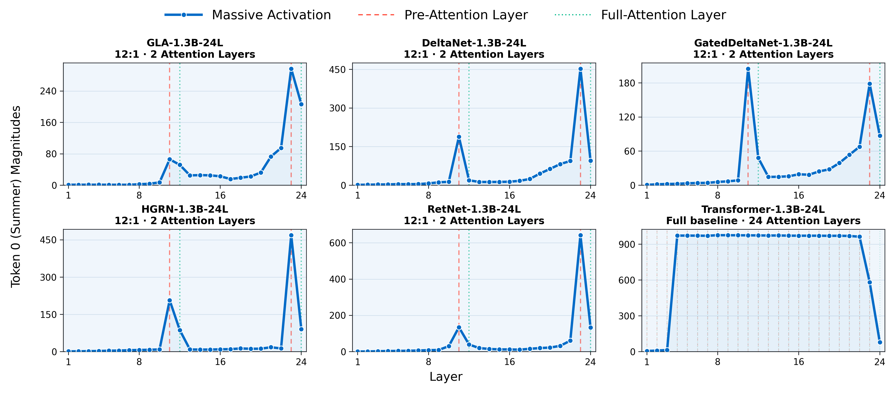
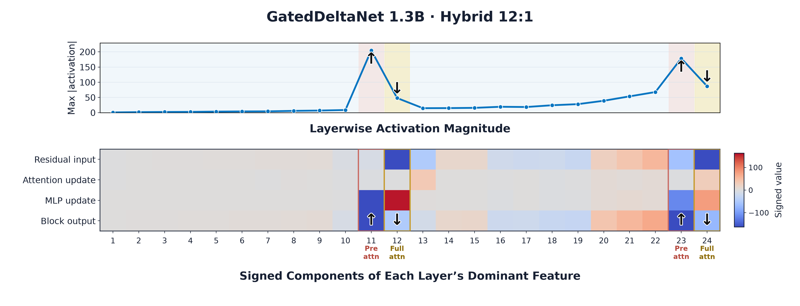
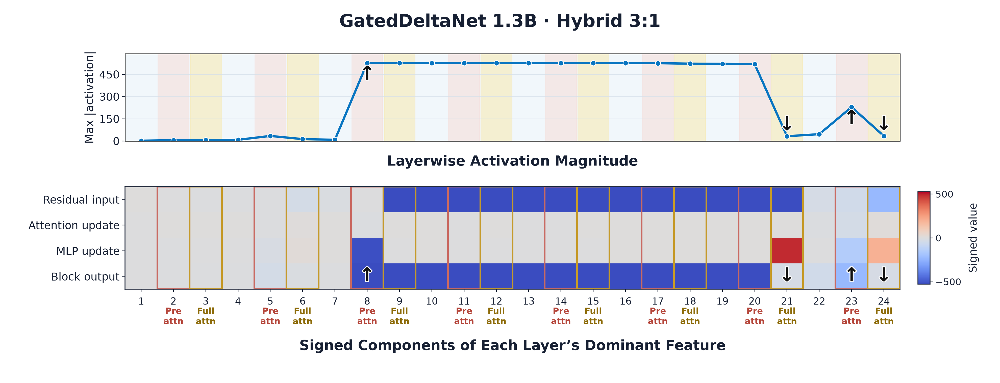
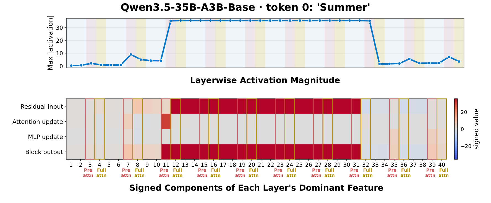

> **论文**：Massive Activations in Hybrid Linear Attention Large Language Models: Pre-Attention Spikes and Inter-Spike Plateaus
> **作者**：Zunhai Su, Bohan Sun, Xialie Zhuang 等（StartLux Models）
> **arXiv ID**：2608.12149
> **发表时间**：2026-08-12
> **许可协议**：CC BY 4.0
> **代码仓库**：https://github.com/StartluxLabs/Massive-Activations-HLA

## 第 1 章 概述

### 1.1 一句话定位

本文是混合线性注意力（Hybrid Linear Attention, HLA）大语言模型中大规模激活（massive activations, MA）的首次系统研究：在层间交错（layer-interleaved）的混合架构中，MA 并非随机数值异常，而是与全注意力层位置严格对齐的结构化现象，呈现 **PAS（pre-attention spikes，前注意力尖峰）** 与 **ISP（inter-spike plateaus，尖峰间平台）** 两种形态；随着全注意力密度增加，二者在 $\rho=1$ 的全注意力极限下合并，恢复全注意力 LLM 的稳定 MA 形态。

### 论文图表总览

| 编号 | 内容 | 章节 |
|------|------|------|
| Figure 1 | HLA 中 MA 形态总览：PAS、ISP 与全注意力极限的对照 | 第 1/3 章 |
| Table 1 | Sink-spike 对齐率（五架构 × 五域，1.3B、12:1） | 第 3 章 |
| Table 2 | ISR 随混合比变化（$\rho \in \{12, 6, 3\}$，1.3B/340M） | 第 3 章 |
| Figure 3 | 五架构 PAS 定性轨迹（12:1，1.3B） | 第 3 章 |
| Figure 6 | PAS 的 write-sink-cancel 生命周期 | 第 4 章 |
| Figure 7 | ISP 的延迟取消生命周期 | 第 4 章 |
| Figure 4 | Qwen3.5-35B-A3B-Base 的 PAS/ISP 层间组织 | 第 5 章 |
| Table 9 | 受控预训练：PAS 涌现、门控消融与检索性能 | 第 5 章 |
| Table 10 | 受控预训练：ISR、门控消融与检索性能 | 第 5 章 |

*图 1：Gated DeltaNet 混合架构的 MA 形态总览——稀疏混合下表现为全注意力层前的局部尖峰（PAS），全注意力加密后尖峰间出现持续平台（ISP），$\rho=1$ 极限下合并为全注意力 LLM 的稳定 MA 形态。*

### 1.2 核心贡献

1. **系统实证研究与 PAS/ISP 发现**：首次对 layer-interleaved HLA LLM 中的 MA 开展系统研究，覆盖五个线性注意力架构（RetNet/HGRN/GLA/DeltaNet/GDN）、六种混合配置（$\rho \in \{24, 12, 6, 3\}$ 加全注意力极限）、五个数据域（WikiText/Scientific/GSM8K/CodeSearchNet/FLORES）与 12 个大规模开源混合模型（1.2B-397B），发现并量化了 PAS 与 ISP 两种架构对齐形态，并在 $\rho = 1$ 全注意力极限下验证 PAS+ISP 合并。
2. **受控预训练揭示门控不对称性**：基于 GDN 的受控预训练（340M/1.3B）表明两种形态在训练早期即涌现（PAS 于 1B tokens 后可见）；全注意力层的 element-wise 输出门控（GatedFA）强衰减 PAS/ISP 的绝对幅度但不消除层组织，而移除 GDN 自身输出门控（NoOutGate）仅增大幅度、影响较小——门控效应取决于 gate 的放置位置而非数量。
3. **write-sink-cancel 机制**：提出统一的 MA 生命周期机制——pre-attention 层将大 outlier 写入残差流，sink token 在 FA 层获得超额注意力，随后反号更新大幅抵消；PAS 对应局部化的写-汇-消事件，ISP 对应跨多个线性注意力层的延迟取消，全注意力极限下取消持续推迟、合并为持续 MA。

### 1.3 关键结果速览

- **对齐率近乎完美**：sink-spike 对齐率在五架构 × 五域上为 99.4%-100.0%（1.3B、12:1、500 inputs）；non-sink 对照仅 40.8%-93.5%（差距 6.5-58.6 pp，peak excess 差距 0.97-4.42 个 $\log_2$ 单位，所有 95% CI 排除 0），随机层基线仅 9.1%。
- **ISP 随全注意力密度单调上升**：ISR 在全部 20 组配置上随 $\rho$ 减小而显著增加（bootstrap 检验），如 GDN 1.3B 从 18.4%（12:1）升至 26.6%（6:1）再至 77.8%（3:1）；绝对 inter-spike 激活 $A_{\mathrm{ISP}}$ 在 19/20 组相邻比较中同步增加。
- **门控衰减不消除组织**：GatedFA 强衰减 PAS/ISP 绝对幅度但层组织保留（ISR 99.48% @340M）；移除 GDN 门控（NoOutGate）反而增大幅度（ISR 96.48%），影响小于 GatedFA。
- **大规模模型全面复现**：跨 post-training 阶段（Kimi Linear Base/Instruct）、跨尺度（Qwen3.5 35B/122B/397B 检查点）、跨序列混合器（线性注意力 Kimi Linear/Qwen3.5 与状态空间 Nemotron-H/Zamba2）形态一致——形态比幅度更稳定，架构决定 MA 位置，输入调制其强度。
- **受控预训练下的涌现时序**：两尺度对齐率均达 100%；PAS 于训练 1B tokens 后可见（1.3B 在 5B tokens 出现前兆、10B 显著、50B 持续）；全注意力层放置越深 PAS 越强（layer 4 弱、12 显著、20 最强），且放置影响检索性能（NIAH/FDA/SWDE/NQ/SQuAD）而几乎不影响对齐率。

## 第 2 章 研究背景与动机

### 2.1 softmax 注意力的复杂度瓶颈与线性注意力的容量折衷

标准 Transformer 的 softmax 注意力在序列长度上代价为二次：

$$[Q, K, V] = X[W_Q, W_K, W_V], \qquad \mathrm{FA}(X) = \mathrm{softmax}\!\left(QK^\top/\sqrt{d_h} + M\right)V W_O$$

长上下文场景下推理与训练成本随 $n^2$ 增长，推动了对线性复杂度序列混合器的研究。线性注意力将显式交互矩阵替换为固定维度的循环状态：

$$S_t = F_t S_{t-1} + k_t^\top v_t, \qquad y_t = q_t S_t W_O$$

其计算与内存随序列长度线性增长，但代价是**固定状态容量**：无论序列多长，历史信息都要压缩进维度恒定的 $S_t$，长程精确检索能力受限。两种机制构成复杂度—容量的两端。

### 2.2 混合线性注意力（HLA）：交错两种机制

HLA 在单一网络中按层交错线性注意力与全注意力，由混合比

$$\rho = \frac{L}{L_{\mathrm{FA}}}$$

刻画——每 $\rho$ 个 sequence-mixing 层设置 1 个全注意力层，$\rho = 1$ 即退化为全注意力 LLM。该设计以少量全注意力层恢复检索与精确回忆能力，同时保留线性注意力在大多数层上的效率优势，已成为主流开源模型的实际部署形态：

| 模型家族 | 线性混合器 | 混合模式 | 代表检查点 |
|----------|-----------|---------|-----------|
| Kimi Linear | Kimi Delta Attention | 20 KDA + 7 全局 MLA（~3:1） | 48B-A3B Base/Instruct |
| Qwen3.5 | Gated DeltaNet | 3 GDN + 1 gated FA | 35B-A3B、122B-A10B、397B-A17B |
| Nemotron-H | Mamba-2 | Mamba-2 与 SA 交替（8B 为 24/4，56B 为 54/10） | 8B、47B、56B Base |
| Zamba2 | Mamba2 | 周期共享 Transformer block（~每 6 层一个） | 1.2B、2.7B、7B |

值得注意的是，Qwen3.5 的全注意力层自带 element-wise 输出门控（40/48/60 层中含 10/12/15 个 FA 层）——这一工程选择在后文的受控预训练中被证明对 MA 幅度有系统性影响。

### 2.3 大规模激活研究史与 HLA 中的空白

MA 的研究在全注意力 LLM 中经历了三个阶段的认识演进：最初被视为威胁训练稳定性的**数值异常**；随后被发现与**注意力 sink**（对特定 token 的超额注意力分配，可由跨层跨头平均注意的共识 sink $t^*_x = \arg\max$ 刻画）紧密**耦合**；最终被理解为 **outlier 特征的系统性机制**——大激活承担特定功能角色，而非可简单剪除的噪声。

这一整条研究线均在全注意力 LLM 上展开。HLA 打破了其隐含前提：序列混合器在层间异构，MA 若存在，其对齐对象是层几何而非均匀的注意力堆栈。HLA 中 MA 是否存在、以何种形态出现、是否仍与 sink 耦合、混合比 $\rho$ 如何调制其行为——在本文之前完全未被探索。鉴于 HLA 已是 1.2B-397B 尺度上的主流部署形态，该空白既关系到对其内部机制的理解，也直接影响量化、剪枝与数值稳定性等下游工程决策。
## 第 3 章 实验设置与 PAS/ISP 现象发现

本章介绍 M-A-P 受控检查点套件与 sink 引导的激活追踪方法(3.1-3.2),报告两项核心经验发现:全注意力层前一层的 PAS 跨五种线性注意力架构高度对齐(3.3),相邻 PAS 之间的 ISP 随全注意力密度单调增强(3.4),并在 12 个大规模开源混合模型上完成外部验证(3.5)。记 $m(\ell)$ 为层 $\ell$ 的激活幅度,$f$ 为某一全注意力(FA)层索引,$\mathcal{B}_f$ 为该 FA 层所在的混合块(自上一个 FA 层之后至层 $f$ 的层集合)。

### 3.1 M-A-P 套件:受控预训练检查点

M-A-P 套件（Hybrid Linear Attention Research 模型集合，HuggingFace 发布）覆盖五种代表性线性注意力架构,在两个参数规模(340M、1.3B)与六种混合配置($\rho\in\{24,12,6,3\}$ 加极限配置)下从零预训练,共 52 个检查点。混合比定义为

$$\rho=\frac{L}{L_{\mathrm{FA}}}$$

其中 $L$ 为 sequence-mixing 层总数,$L_{\mathrm{FA}}$ 为全注意力层数,即每 $\rho$ 个 sequence-mixing 层含 1 个 FA 层;$\rho=1$ 对应全注意力极限。

HLA 模型沿用标准 pre-norm 残差架构:

$$H^{(\ell)}=X^{(\ell-1)}+\mathrm{Mixer}\big(\mathrm{Norm}_{\mathrm{mix}}(X^{(\ell-1)})\big)$$

$$X^{(\ell)}=H^{(\ell)}+\mathrm{FFN}\big(\mathrm{Norm}_{\mathrm{ffn}}(H^{(\ell)})\big)$$

其中 $\mathrm{Mixer}$ 依层取全注意力或线性注意力。全注意力层为

$$[Q,K,V]=X\,[W_Q,\,W_K,\,W_V],\qquad \mathrm{FA}(X)=\mathrm{softmax}\!\Big(\frac{QK^{\top}}{\sqrt{d_h}}+M\Big)V\,W_O$$

线性注意力层以循环状态实现序列混合:

$$S_t=F_t\,S_{t-1}+k_t^{\top}v_t,\qquad y_t=q_t\,S_t\,W_O$$

其中 $S_t$ 为隐状态,$F_t$ 为遗忘/衰减算子(形式因架构而异)。五种架构在状态结构与更新规则上的差异(论文 Table 3):

| 架构 | 状态结构 | 保持机制 | 更新规则 |
|------|---------|---------|---------|
| HGRN | Vector | 输入依赖遗忘 | 门控循环 |
| RetNet | Matrix | 固定指数衰减 | 外积累积 |
| GLA | Matrix | 输入依赖衰减 | 门控外积累积 |
| DeltaNet | Matrix | 无显式衰减 | delta-rule 修正 |
| GDN | Matrix | 输入依赖遗忘 | 门控 delta-rule 修正 |

预训练配方(论文 Table 5):

| 配置 | 340M | 1.3B |
|------|------|------|
| 层数 | 24 | 24 |
| 语料 | FineWeb-Edu | FineWeb-Edu |
| 训练量 | 20B tokens | 100B tokens |
| batch size | 50K | 1M |
| 优化器 | AdamW | AdamW |
| 学习率 | Cosine 调度 | Cosine 调度 |

该设计使两个因素正交:其一,五种架构覆盖向量/矩阵状态、固定/输入依赖衰减、外积/delta-rule 更新,跨架构一致结论不受单一状态形式制约;其二,混合比与规模独立变化,可将 PAS/ISP 的形态归因于层间组织而非容量。

### 3.2 sink 引导追踪:magnitude ranking 失效与共识 sink

在纯全注意力 LLM 的大规模激活研究中,通常按激活幅度对 token 排序以定位 outlier。该做法在 HLA 中失效:线性注意力层不产生可比较的 token 级注意力分布,最大幅度 token 的身份在层间频繁切换,与 FA 层的 sink 逐渐失对齐(论文 Fig 2 的 max-magnitude-token 切换热图)。

为此作者改用共识 sink 锚定。对输入 $x$,将全部 FA 层、全部注意力头的 softmax 归一化注意力对合法 query 位置取平均（按每个源位置可被查询的 query 数量 $|\mathcal{Q}_t|$ 归一化,以消除因果掩码下前部位置天然拥有更多合法 query 的偏差）后,再跨层跨头平均,取该平均值最大的 token 为共识 sink:

$$t_x^{\ast}=\operatorname*{arg\,max}_{t\in[1,|x|]}\; \frac{1}{|\mathcal{I}_{\mathrm{FA}}|\,H}\sum_{\ell\in\mathcal{I}_{\mathrm{FA}}}\sum_{h=1}^{H}\frac{1}{|\mathcal{Q}_t|}\sum_{q\in\mathcal{Q}_t} A_{x,q,t}^{(\ell,h)},\qquad \mathcal{Q}_t=\{q:q>t\}$$

其中 $\mathcal{Q}_t=\{q:q>t\}$ 为位置 $t$ 之后（即因果注意力下可合法查询 $t$ 的）query 位置集合，除以 $|\mathcal{Q}_t|$ 是对合法 query 数量归一化，以消除不同源位置可被查询次数的差异。

锚定共识 sink 后,对激活轨迹执行条件追踪,使层间形态观测不再依赖 magnitude ranking 的稳定性。3.3 的对齐率与 3.4 的 ISR 均建立在该追踪协议之上。

### 3.3 跨架构 PAS:sink 位置与对齐率

经验发现一(PAS):在五种架构、两个规模的全部混合配置中,MA 在每个 FA 层的前一层($f-1$)形成局部极大值;其承载坐标与共识 sink token 对齐,sink 位置集中于输入首 token、标点与功能词。对齐率定义为

$$\mathrm{Align}(\mathcal{D})=\frac{1}{|\mathcal{D}|}\sum_{x\in\mathcal{D}}\mathbb{1}\Big[f_x-1\in\operatorname*{arg\,max}_{\ell\in\mathcal{B}_{f_x}}m_x(\ell)\Big]$$

即检验 $f-1$ 层是否为其混合块内激活幅度最大的层。1.3B、12:1 检查点在 500 条输入、五个数据域上的结果(X/Y = 宏平均/域内最小)(论文 Table 1):

| 架构 | WikiText | Scientific | GSM8K | CodeSearchNet | FLORES | Overall |
|------|----------|-----------|-------|---------------|--------|---------|
| RetNet | 99.5/100.0 | 100/100 | 100/100 | 100/100 | 100/100 | 99.9/100.0 |
| HGRN | 100/100 | 100/100 | 100/100 | 100/100 | 100/100 | 100.0/100.0 |
| GLA | 100/99.5 | 100/100 | 100/100 | 100/100 | 100/98.5 | 100.0/99.6 |
| DeltaNet | 100/100 | 100/98.0 | 100/100 | 100/99.5 | 100/99.5 | 100.0/99.4 |
| GDN | 100/100 | 100/100 | 100/100 | 100/100 | 100/100 | 100.0/100.0 |

总体对齐率区间为 99.4%-100%,与数据域基本无关。

对照实验(论文 Table 6,App B.5)排除了"任何高频 token 均可对齐"的解释:以 non-sink token 或首 token 为锚的对齐率仅 40.8%-93.5%,sink 对齐与 non-sink 对齐的差距为 6.5-58.6 pp;peak excess(Eq.8)差距为 0.97-4.42 log2 单位;所有配对比较的 95% CI 均排除 0。随机层基线仅为 1/11 = 9.1%。peak excess 定义为

$$E=\log_2\frac{m(f-1)}{\max_{\ell\in\mathcal{B}_f\setminus\{f-1\}}m(\ell)}$$

$E$ 每增加 1 个 log2 单位,表示 $f-1$ 层幅度与块内其余最强层的比值翻倍（$E=1$ 即达到 2 倍,$E=2$ 即 4 倍）。

*图 3：五种架构(RetNet/HGRN/GLA/DeltaNet/GDN)在 12:1 混合比、同一输入 token 上的激活-层轨迹。每个 FA 层位置的前一层均出现幅度尖峰,尖峰之间的线性注意力层保持低幅度;五条轨迹的 spike 位置逐层重合,直观呈现 PAS 的跨架构一致性。*

### 3.4 跨混合比 ISP:ISR 随全注意力密度单调增长

经验发现二(ISP):当 FA 层变密集时,激活不再回落至基线,而是在相邻 PAS 之间持续形成 plateau。量化指标为 inter-spike ratio(Eq.7):

$$\mathrm{ISR}=\mathbb{E}_{\ell\in\mathcal{I}_i}\Big[\min\Big(1,\;\frac{m(\ell)}{\min\big(m(p_i),\,m(p_{i+1})\big)}\Big)\Big]$$

其中 $p_i,p_{i+1}$ 为相邻两个 PAS spike 层(两个 FA 层的 $f-1$),$\mathcal{I}_i$ 为其间的线性注意力层集合;$\mathrm{ISR}\approx 100\%$ 表示激活在整个 inter-spike 区间持续。各架构 ISR(%)随混合比的变化(X/Y = 1.3B/340M)(论文 Table 2):

| 架构 | 12:1 | 6:1 | 3:1 |
|------|------|-----|-----|
| RetNet | 18.8/36.8 | 60.0/69.8 | 85.4/87.2 |
| HGRN | 7.2/5.0 | 40.2/49.6 | 92.5/81.2 |
| GLA | 27.3/31.9 | 51.7/61.6 | 88.0/88.1 |
| DeltaNet | 23.1/46.5 | 44.6/82.8 | 84.4/99.8 |
| GDN | 18.4/39.7 | 26.6/45.2 | 77.8/86.7 |

三点观察:

1. **单调性**:全部架构与规模组合中,ISR 随 FA 密度增加(12:1→6:1→3:1)单调上升,bootstrap 检验全部 20 组相邻比较显著。
2. **ISP 时机因架构而异**:DeltaNet 340M 在 6:1 即达 82.8%,已接近其 3:1 的 99.8%;GDN 340M 在 6:1 仅 45.2%,到 3:1 才升至 86.7%。ISP 的出现门槛取决于状态更新规则(delta-rule 修正更早触发持续形态,门控 delta-rule 需要更密的 FA 层)。
3. **绝对幅度同步增长**:inter-spike 层激活均值 $A_{\mathrm{ISP}}$(Eq.9)在 19/20 组相邻比较中增加,唯一例外为 340M GDN 12:1→6:1(19.7→16.3)(论文 Table 7):

| 架构 | 12:1 | 6:1 | 3:1 |
|------|------|-----|-----|
| RetNet | 25.2/15.9 | 102.7/23.2 | 236.8/89.1 |
| HGRN | 14.7/8.5 | 132.8/70.2 | 368.9/165.5 |
| GLA | 37.8/13.1 | 71.4/20.9 | 360.5/89.7 |
| DeltaNet | 42.4/35.4 | 85.2/57.1 | 405.6/290.4 |
| GDN | 33.4/19.7 | 34.0/16.3 | 304.4/122.8 |

相对形态(ISR)与绝对幅度($A_{\mathrm{ISP}}$)随混合比同向变化,表明 ISP 既是持续的也是增强的。

### 3.5 大规模验证:12 个开源混合模型

为检验 PAS/ISP 是否为受控套件的伪影,作者对 4 个家族、12 个大规模开源混合检查点(1.2B-397B)复现实验(论文 Table 8):

| 家族 | 线性混合器 | 混合模式 | 检查点 |
|------|-----------|---------|--------|
| Kimi Linear | Kimi Delta Attention | 20 KDA + 7 全局 MLA(约 3:1) | 48B-A3B Base/Instruct |
| Qwen3.5 | Gated DeltaNet | 3 GDN + 1 gated FA | 35B-A3B Base/Instruct、122B-A10B、397B-A17B |
| Nemotron-H | Mamba-2 | Mamba-2 与 SA 交替 | 8B、47B、56B Base |
| Zamba2 | Mamba2 | 周期性共享 Transformer block | 1.2B、2.7B、7B |

各家族的层组织细节:Qwen3.5 三档规模分别为 40/48/60 层、10/12/15 个 FA 层,且 FA 输出带 element-wise 门控;Kimi Linear 序列混合栈共 27 层;Nemotron-H 的 Mamba-2/SA 层数为 8B=24/4、47B=45/5、56B=54/10;Zamba2 在 38/54/81 层位置插入 6/9/13 个 hybrid blocks(约每 6 层一个)。

四项发现:

1. **跨 post-training 阶段一致**:Kimi Linear Base 与 Instruct 的 PAS 位置与 ISP 边界对齐,post-training 不改变层组织。
2. **跨尺度复现**:Qwen3.5 各检查点(35B-397B)的 PAS/ISP 均与 FA 放置对齐,形态比幅度更稳定。
3. **跨序列混合器**:无论线性注意力(Kimi Linear、Qwen3.5)还是状态空间(Nemotron-H、Zamba2)混合器,均出现 PAS/ISP。
4. **跨域一致**:五个数据域输入下 PAS 位置与 ISP 跨度稳定,仅幅度变化——架构决定组织位置,输入调制强度。

PAS/ISP 因此不是特定训练配方或特定线性混合器的产物,而是 layer-interleaved HLA 的普遍组织方式。

## 第 4 章 机制分析:write-sink-cancel 生命周期

第 3 章的两项现象——PAS 严格锚定于 $f-1$(Eq.6)、ISP 随 FA 密度增强(Eq.7)——由同一机制解释:write-sink-cancel 生命周期。PAS 与 ISP 是同一事件在两种取消时机下的观测形态。

### 4.1 PAS:局部 write-sink-cancel 事件

PAS 对应一个局部化的三阶段生命周期:

1. **Write(写入)**:pre-attention 线性注意力层 $f-1$ 将大的 outlier 分量写入残差流,$m(f-1)$ 出现块内极大(对应 Eq.6 的对齐与 Eq.8 的 peak excess)。
2. **Sink(汇聚)**:紧随其后的 FA 层(层 $f$)中,共识 sink token 获得超额注意力,注意力的 outlier 坐标与残差 outlier 坐标耦合。
3. **Cancel(抵消)**:FA 层经 $W_O$ 输出的更新以相反符号大幅抵消残差 outlier,激活回落至基线。

由于抵消在同一 FA 层内完成,生命周期是局部的,表现为离散 spike。

**固定坐标验证**:在 1.3B GDN 12:1 检查点的 FA 层 $f=12$ 上,固定同一 outlier 坐标,三个阶段——outlier formation、attention-sink coupling、cancellation——分别被直接观测验证。这排除了统计平均伪影:写入、汇聚、抵消是同一坐标上先后发生的事件,而非不同层各自独立的现象。

*图 6：PAS 的 write-sink-cancel 三阶段轨迹。pre-attention 线性层将 outlier 写入残差流(write);FA 层中 sink token 获得超额注意力并与 outlier 坐标耦合(sink);FA 层输出的反号更新在同一层内抵消 outlier(cancel),激活回落,形成离散 spike。*

### 4.2 ISP:延迟取消与持久性连续体

ISP 是同一生命周期的延迟版本:write 之后,sink 耦合与抵消不在同一 FA 层内立即完成,outlier 分量跨多个线性注意力层持续存在,形成 plateau,直到后续 FA 层的反号更新累积完成抵消。ISP 的跨度因此介于两个 PAS spike 之间,与 Eq.7 ISR 的定义一致。

*图 7：ISP 的延迟取消轨迹。outlier 写入后未在紧邻的 FA 层内被完全抵消,激活跨多个线性注意力层维持在高位(plateau),抵消被推迟到更晚的 FA 更新中完成;取消越晚,ISR 越接近 100%。*

**取消时机的统一解释**:随混合比减小($\rho: 24\rightarrow 3\rightarrow 1$),FA 层密度升高,单次反号更新被摊薄并推迟,表现为 ISR 单调上升(3.4);在 $\rho=1$ 的全注意力极限,取消推迟至持续不发生,PAS 与 ISP 合并为全注意力 LLM 文献报道的持续 MA 形态。由此,三类现象构成取消时机上递增持久性的连续体:

| 形态 | 取消时机 | 持久性 |
|------|---------|--------|
| PAS | 写入后立即局部抵消（FA 层内完成） | 单层 spike |
| ISP | 延迟数个线性层后取消 | inter-spike plateau |
| 全注意力 MA | 持续不取消 | 稳定持续形态 |

该连续体将第 3 章的全部经验规律——$f-1$ 对齐、ISR 随 $\rho$ 单调增长、架构间 ISP 时机差异(DeltaNet 6:1 vs GDN 3:1)——归约为单一变量:反号抵消更新的延迟程度。
## 第 5 章 实验结果与分析

### 5.1 跨架构一致性：sink–spike 对齐率

为定量刻画 PAS 的位置一致性，论文对每个输入用式 (5) 选出共识注意力 sink 令牌，并计算式 (6) 定义的 sink–spike 对齐率（Align）：统计在多少个「全注意力层及其紧邻的前置线性注意力块」上，sink 令牌的最大激活恰好出现在全注意力层的前一层（即 $f-1$ 处）。评估集为 500 个输入（五个领域各 100 个），宏平均结果如表 5-1 所示（每格为宏平均 / 域内最小值，1.3B 尺度、12:1 混合比）。

| 线性注意力架构 | WikiText | Scientific Papers | GSM8K | CodeSearchNet | FLORES | Overall |
|:---|:---:|:---:|:---:|:---:|:---:|:---:|
| RetNet | 99.5 / 100.0 | 100.0 / 100.0 | 100.0 / 100.0 | 100.0 / 100.0 | 100.0 / 100.0 | 99.9 / 100.0 |
| HGRN | 100.0 / 100.0 | 100.0 / 100.0 | 100.0 / 100.0 | 100.0 / 100.0 | 100.0 / 100.0 | 100.0 / 100.0 |
| GLA | 100.0 / 99.5 | 100.0 / 100.0 | 100.0 / 100.0 | 100.0 / 100.0 | 100.0 / 98.5 | 100.0 / 99.6 |
| DeltaNet | 100.0 / 100.0 | 100.0 / 98.0 | 100.0 / 100.0 | 100.0 / 99.5 | 100.0 / 99.5 | 100.0 / 99.4 |
| GDN | 100.0 / 100.0 | 100.0 / 100.0 | 100.0 / 100.0 | 100.0 / 100.0 | 100.0 / 100.0 | 100.0 / 100.0 |

*表 5-1：五种线性注意力架构在 12:1 混合比下的 sink–spike 对齐率（%，宏平均 / 域内最小值），对应论文 Table 1。*

五种架构的宏平均对齐率均不低于 99.4%，几乎所有架构-域组合达到 100%。这说明 PAS 的位置组织对底层线性注意力机制（固定衰减的 RetNet、输入依赖门控的 HGRN/GLA、delta 规则的 DeltaNet/GDN）高度不敏感——只要采用层间交错（layer-interleaved）的混合结构，sink 令牌的最大激活就稳定落在全注意力层之前。

控制实验进一步确认了该效应的特异性（论文附录 B.5，Table 6）：

| 线性注意力 | 对齐率：Sink | 对齐率：Non-sink | 对齐率：首令牌 | 峰超额：Sink | 峰超额：Non-sink | 峰超额：首令牌 |
|:---|:---:|:---:|:---:|:---:|:---:|:---:|
| RetNet | 99.9 / 100.0 | 57.1 / 71.5 | 99.9 / 100.0 | 2.70 / 2.70 | 0.07 / 0.18 | 2.69 / 2.62 |
| HGRN | 100.0 / 100.0 | 93.3 / 84.3 | 100.0 / 100.0 | 4.32 / 4.83 | 0.52 / 0.41 | 4.32 / 4.83 |
| GLA | 100.0 / 99.6 | 75.9 / 69.4 | 100.0 / 99.7 | 3.70 / 3.18 | 0.21 / 0.17 | 2.34 / 2.81 |
| DeltaNet | 100.0 / 99.4 | 57.6 / 40.8 | 99.8 / 99.9 | 2.86 / 0.89 | 0.04 / −0.08 | 2.85 / 1.01 |
| GDN | 100.0 / 100.0 | 81.2 / 93.5 | 100.0 / 100.0 | 3.04 / 2.01 | 0.28 / 0.54 | 3.03 / 2.01 |

*表 5-2：对齐控制实验（1.3B / 340M），对齐率单位为 %，峰超额单位为 log2 倍，对应论文附录 Table 6。*

非 sink 令牌的对齐率显著更低（40.8%–93.5%），峰超额接近零甚至为负，而随机层基线仅为 1/11 ≈ 9.1%。在全部十个架构-尺度组合上，sink 与非 sink 的对齐率差距为 6.5–58.6 个百分点，峰超额差距为 0.97–4.42 log2 单位，所有成对 95% 自助置信区间均排除零。

### 5.2 跨混合比：inter-spike 保留率（ISR）

为量化 ISP 的持续性，论文定义式 (7) 的 inter-spike 保留率（ISR）：对每对相邻 PAS，取中间线性层激活相对相邻较弱 PAS 的比值（上限截断为 1），再跨层、跨输入平均。ISR 接近 1 表示持续的平台，接近 0 表示 spike 之间大幅衰减。固定线性注意力架构、变化混合比 $\rho \in \{12, 6, 3\}$ 的结果如表 5-3 所示（每格为 1.3B / 340M）：

| 线性注意力架构 | 12:1 | 6:1 | 3:1 |
|:---|:---:|:---:|:---:|
| RetNet | 18.8 / 36.8 | 60.0 / 69.8 | 85.4 / 87.2 |
| HGRN | 7.2 / 5.0 | 40.2 / 49.6 | 92.5 / 81.2 |
| GLA | 27.3 / 31.9 | 51.7 / 61.6 | 88.0 / 88.1 |
| DeltaNet | 23.1 / 46.5 | 44.6 / 82.8 | 84.4 / 99.8 |
| GDN | 18.4 / 39.7 | 26.6 / 45.2 | 77.8 / 86.7 |

*表 5-3：各架构在不同混合比下的 inter-spike 保留率（ISR，%，1.3B / 340M），对应论文 Table 2。*

ISR 随全注意力密度单调上升：所有 20 个架构-尺度相邻比较（12:1→6:1、6:1→3:1）在成对分层自助检验中均显著为正，12:1→6:1 的增幅为 5.5–44.5 个百分点，6:1→3:1 的增幅为 17.0–52.3 个百分点。绝对 inter-spike 激活（论文附录 Table 7 的 $A_{\mathrm{ISP}}$）也随密度上升（19/20 个比较），但两个指标不可互换：ISR 衡量平台相对相邻 PAS 的保留度，$A_{\mathrm{ISP}}$ 衡量其绝对幅度。

值得注意的是 ISP 的**出现时机因架构而异**：DeltaNet 在 6:1 即开始出现显著的 inter-spike 持续，而 GDN 要到 3:1 才表现出可比的平台。这暗示线性注意力机制的状态更新规则（delta 修正 vs 门控遗忘）会影响 outlier 的跨层传播速率。在 $\rho=1$ 的全注意力极限下，孤立的 PAS 与中间 ISP 完全融合，形成横跨大部分网络深度的持续 MA 形态——与常规全注意力 LLM 的已知形态一致。

### 5.3 大规模开源混合模型验证

受控套件之外，论文在 12 个公开检查点（4 个模型家族、1.2B–397B 参数）上验证 PAS/ISP 的复现性（论文附录 Table 8）：

| 模型家族 | 线性/状态空间混合器 | 混合模式 | 评估检查点 |
|:---|:---|:---|:---|
| Kimi Linear | Kimi Delta Attention | 20 个 KDA + 7 个全局 MLA 层，约 3:1 | 48B-A3B Base / Instruct |
| Qwen3.5 | Gated DeltaNet | 每 3 个 GDN 层后接 1 个门控全注意力层 | 35B-A3B Base / Instruct；122B-A10B；397B-A17B |
| Nemotron-H | Mamba-2 | Mamba-2 与自注意力（含独立 MLP 层）非均匀交错 | 8B、47B、56B Base |
| Zamba2 | Mamba2 | Mamba2 主干周期插入共享 Transformer 块 | 1.2B、2.7B、7B |

*表 5-4：大规模评估的模型家族与检查点（对应论文附录 Table 8）。*

*图4：Qwen3.5-35B-A3B-Base（原生全注意力输出门控）中首令牌激活跨层轨迹，PAS 与全注意力层放置精确对齐。*

跨模型分析得到四个发现：

1. **跨 post-training 阶段一致**：Kimi Linear 的 Base 与 Instruct 检查点尽管激活幅度不同，PAS 位置与 ISP 边界保持紧密对齐——SFT/RL 后处理不改变 MA 的层间组织。
2. **跨尺度复现**：Qwen3.5 的 35B/122B/397B 检查点上 PAS/ISP 始终与全注意力放置对齐，但幅度与显著性呈非单调变化——层间形态比数值幅度更稳定。
3. **跨序列混合器复现**：PAS/ISP 同时出现在线性注意力混合（Kimi Linear、Qwen3.5）与状态空间混合（Nemotron-H、Zamba2）中。这一组织与层间交错本身相关，而非特定线性时间序列混合器。
4. **跨领域输入一致**：五个领域的代表性输入上，PAS 位置与 ISP 跨度保持稳定、幅度变化——混合架构主要组织 MA 的层间位置，输入内容调制其强度。

### 5.4 受控预训练：PAS 的训练时涌现

论文用 Flash Linear Attention 框架从零训练 24 层 GDN 混合模型（340M / 1.3B，FineWeb-Edu 语料），插入单个全注意力层并考察其放置位置（层 4/12/20）的影响。最终检查点的对齐率与下游性能如表 5-5 所示：

| 变体 | 尺度 | FA 层 | Tokens | 对齐率 (%) | PPL (WikiText-103) | FDA | SWDE | NQ | SQuAD |
|:---|:---:|:---:|:---:|:---:|:---:|:---:|:---:|:---:|:---:|
| GDN | 340M | 4/24 | 10B | 99.53 | 14.00 | 8.02 | 20.21 | 14.95 | 25.30 |
| GDN | 340M | 12/24 | 10B | 100.00 | 13.78 | 60.43 | 40.49 | 19.61 | 32.81 |
| GDN | 340M | 20/24 | 10B | 100.00 | 13.84 | 53.71 | 35.80 | 21.10 | 35.42 |
| GDN | 1.3B | 12/24 | 50B | 100.00 | 9.79 | 66.58 | 45.36 | 23.57 | 36.96 |
| GDN-NoOutGate | 340M | 12/24 | 10B | 100.00 | 13.96 | 49.86 | 41.77 | 19.61 | 34.32 |
| GDN-GatedFA | 340M | 12/24 | 10B | 100.00 | 13.80 | 53.38 | 34.21 | 18.37 | 31.70 |

*表 5-5：PAS 受控预训练的对齐率、语言建模（PPL）与真实世界检索（%），对应论文附录 Table 9(a)。*

| 变体 | NIAH-1 | NIAH-2 | NIAH-3 | HellaSwag | PIQA | ARC-E |
|:---|:---:|:---:|:---:|:---:|:---:|:---:|
| GDN 340M FA=4/24 | 57.40 | 27.20 | 2.40 | 38.92 | 65.61 | 50.72 |
| GDN 340M FA=12/24 | 61.80 | 97.00 | 25.80 | 39.61 | 65.56 | 50.17 |
| GDN 340M FA=20/24 | 90.60 | 87.20 | 69.00 | 39.04 | 64.42 | 52.27 |
| GDN 1.3B FA=12/24 | 99.40 | 93.60 | 2.60 | 53.37 | 70.40 | 60.06 |
| GDN-NoOutGate 340M | 80.40 | 94.40 | 39.40 | 38.87 | 65.78 | 49.33 |
| GDN-GatedFA 340M | 41.60 | 16.80 | 30.80 | 39.73 | 65.13 | 50.63 |

*表 5-6：PAS 受控预训练的综合检索（NIAH-1/2/3，%）与常识推理（%），对应论文附录 Table 9(b)。*

三个主要观察：

1. **PAS 位置由全注意力层放置决定，幅度随深度增强**：层 4 放置只产生弱局部极大值，层 12 产生显著 spike，层 20 产生最强 PAS。训练 1B tokens 后 PAS 即已可见，随后逐步锐化稳定；1.3B 模型在 5B tokens 出现前兆、10B 显著、持续到 50B。两个尺度的最终对齐率均为 100%。
2. **全注意力放置显著影响检索性能**：层 12/20 放置大幅优于层 4（如 FDA 从 8.02% 提升到 60.43%/53.71%，NIAH-3 从 2.40% 提升到 25.80%/69.00%），尽管三种放置的对齐率都接近完美、语言建模与常识推理性能相当。值得注意的是层 12 与层 20 在指标间排序不完全一致——FDA 在层 12 已接近饱和（60.43% vs 53.71%），而「最深最强」的效应主要体现在 NIAH-3（25.80% → 69.00%）。
3. **下游能力与 MA 形态解耦**：对齐率几乎不受放置影响，但检索能力对放置深度敏感——说明 PAS 是架构的「伴随现象」，其位置本身不直接决定任务能力。

### 5.5 受控预训练：ISP 的训练时涌现与门控干预

ISP 实验采用 3:1 混合比（8 个全注意力层 + 16 个 GDN 层），并测试两种门控干预：GDN-GatedFA（给全注意力层加逐元素输出门）与 GDN-NoOutGate（移除 GDN 原生输出门）。结果如表 5-7、5-8 所示：

| 变体 | 尺度 | Tokens | ISR (%) | PPL | FDA | SWDE | NQ | SQuAD |
|:---|:---:|:---:|:---:|:---:|:---:|:---:|:---:|:---:|
| GDN | 340M | 10B | 90.56 | 13.74 | 54.62 | 39.68 | 21.63 | 38.40 |
| GDN | 1.3B | 50B | 94.47 | 9.80 | 64.82 | 45.92 | 24.90 | 40.65 |
| GDN-NoOutGate | 340M | 10B | 96.48 | 13.78 | 49.32 | 39.33 | 21.82 | 35.25 |
| GDN-GatedFA | 340M | 10B | 99.48 | 13.68 | 65.12 | 40.49 | 21.32 | 36.60 |

*表 5-7：ISP 受控预训练与门控干预的 ISR、语言建模与真实世界检索，对应论文附录 Table 10(a)。*

| 变体 | NIAH-1 | NIAH-2 | NIAH-3 | HellaSwag | PIQA | ARC-E |
|:---|:---:|:---:|:---:|:---:|:---:|:---:|
| GDN 340M | 78.60 | 99.40 | 63.60 | 39.56 | 65.67 | 50.93 |
| GDN 1.3B | 96.00 | 100.00 | 90.00 | 53.36 | 71.55 | 61.11 |
| GDN-NoOutGate 340M | 57.20 | 48.20 | 14.20 | 39.57 | 66.16 | 50.25 |
| GDN-GatedFA 340M | 61.00 | 98.20 | 5.00 | 39.38 | 66.00 | 50.34 |

*表 5-8：ISP 受控预训练与门控干预的综合检索与常识推理，对应论文附录 Table 10(b)。*

三个主要观察：

1. **ISP 早期涌现并持续巩固**：1B tokens 后相邻 PAS 之间已出现抬升的激活区域，随后逐渐巩固为持续平台。最终 ISR 从 340M 的 90.56% 上升到 1.3B 的 94.47%（相对保留度随尺度增强，但不构成受控的尺度规律）。需要说明的是，此处的 90.56% 与 3.4 节 Table 2 中 GDN 340M 在 3:1 配置下的 86.7% 并非同一实验：Table 2 来自 M-A-P 套件（340M 在 20B tokens、batch 50K 配方下预训练），而本节为受控实验（340M 在 10B tokens、batch 0.5M 配方下从零训练），两者架构配置同为 3:1（8 个 FA 层 + 16 个 GDN 层）但训练预算与配方不同，故 ISR 数值存在约 3.9 pp 的差异。
2. **门控干预呈强不对称性**：给全注意力层加输出门（GatedFA）大幅衰减 PAS/ISP 的绝对幅度（弱 spike 与平台仍存留并随训练变得可见，ISR 反而升至 99.48%——因为相对保留度以相邻 PAS 为基准）；移除 GDN 门（NoOutGate）只产生中等幅度增强，对平台的影响更明显但整体小于 GatedFA。
3. **效果取决于门控位置而非数量**：只门控少数全注意力层产生的激活轨迹变化大于移除全部 GDN 层门控——全注意力在组织 MA 动力学中起核心作用，GDN 门控主要调节其传播。这与 Qwen3.5（原生门控全注意力）仍表现出两种形态的观测一致：输出门控**衰减但不消除**架构对齐的 MA 组织。

### 5.6 消融与统计稳健性小结

- **令牌控制**：共识 sink 的对齐率与峰超额显著高于非 sink 令牌与随机层基线（9.1%），全部 95% 置信区间排除零。
- **输入规模**：所有定量指标基于 500 个输入（5 域 × 100），bootstrap 重采样 10,000 次。
- **架构-尺度对照**：M-A-P 套件覆盖 5 架构 × 2 尺度 × 6 配置（ρ=∞/24/12/6/3/1），全部共享统一预训练配方（FineWeb-Edu、AdamW、cosine LR），排除训练差异对 MA 形态的干扰。
## 第 6 章 局限性与延伸阅读

### 6.1 局限性

**机制解释的间接性**。论文的 write–sink–cancel 生命周期建立在逐层、逐坐标（固定 token–feature）的 signed outlier 追踪之上，验证对象是代表性配置（1.3B GDN、12:1 混合比、全注意力层 f=12）中的单个 PAS 与 ISP 案例，并通过跨模型层间模式的复现性加以支撑。这为「取消时机」的统一解释提供了强证据，但并未给出决定取消时机的具体可操作因素——论文明确将「什么调节取消时机」列为未来工作，也未证明瞬时 PAS 与持续 ISP 各自承担不同的计算角色。

**形态与能力的解耦不完整**。受控预训练显示全注意力放置深度显著影响检索能力而几乎不影响对齐率，说明 PAS 位置与任务能力弱相关；但论文没有系统研究「消除/增强 PAS-ISP 形态是否带来下游性能的因果变化」，门控干预实验（GatedFA / NoOutGate）在下游指标上呈现混合信号（如 GatedFA 提升 FDA 至 65.12% 但压低 NIAH-3 至 5.00%），未给出明确的因果结论。

**评估输入的代表性局限**。主分析以 8 令牌的运行示例（"Summer is warm. Winter is cold."）与每域 100 个代表性输入为主，域间一致性在「位置/跨度」层面成立，但幅度与显著性的跨域方差未做细粒度归因；500 个输入的样本规模对极端 token 行为的覆盖有限。

**预训练尺度有限**。受控预训练仅到 1.3B 参数 / 50B tokens，ISR 从 340M 到 1.3B 的上升（90.56% → 94.47%）不构成受控尺度规律；更大尺度下形态是否继续巩固或发生相变仍未验证。大规模结论依赖开源检查点（Kimi Linear、Qwen3.5、Nemotron-H、Zamba2）的间接观测，其训练配方非受控。

**对低比特量化的影响未量化**。论文指出 MAs 的极端幅度会拓宽张量动态范围、在激活或 KV 缓存量化下放大量化误差（引用 outlier-aware 变换与 sink-preserving 量化方法），但未在 HLA 模型上直接测量 PAS/ISP 对实际量化精度损失的具体贡献。

### 6.2 延伸阅读

- **HLA 架构**：Qwen3-Next / Qwen3.5（Gated DeltaNet + 门控全注意力交错）、Kimi Linear（Kimi Delta Attention + 全局 MLA）、Jamba / Nemotron-H（Mamba + 全注意力）、MiniMax-01（Lightning Attention + softmax 注意力）、Zamba2（Mamba2 主干 + 共享 Transformer 块）。
- **线性注意力机制**：RetNet（固定指数衰减 retention）、HGRN（层次化输入依赖门控）、GLA（输入依赖衰减）、DeltaNet（delta-rule 关联记忆修正）、GDN（门控 delta-rule 修正）、Mamba-2（选择性状态转移）。
- **Massive activations 研究**：MAs 首次系统识别（Sun et al., 2024）；MAs 与注意力 sink 的耦合（Cai et al.；Li et al.）；系统性 outlier 机制与 pre-normalization 的中心作用（Zhao et al.；Nayyeri et al.）；MoE 中超专家作为 MA 来源（Luo et al.）；训练期 MA 轨迹（Anagnostidis et al.）。
- **量化与 MA 的交汇**：outlier-aware 变换、sink-preserving KV 缓存量化方法，以及低比特推理下的动态范围管理。
- **注意力 sink 机制**：sink 的成因（softmax 归一化导致的恒定注意力吸引子）、其在长上下文与流式推理中的工程利用。

### 6.3 对实践者的启示

1. **架构设计**：若目标是在混合模型中抑制极端激活（如为低比特量化创造更友好数值域），应优先为**全注意力层**配置输出门控——论文证明门控放置比门控数量更关键，门控少数全注意力层的效果大于移除全部 GDN 门控。
2. **调试与可解释性**：在 HLA 模型中定位「异常激活」时，不能直接沿用全注意力模型按幅度排序的做法——混合结构下最大幅度令牌会在相邻层之间频繁切换，应改用注意力 sink 引导的追踪（式 5）保持令牌身份一致。
3. **形态作为诊断信号**：PAS/ISP 的层间位置由全注意力放置决定且跨域稳定，可作为一种廉价的「架构指纹」，用于验证训练/后处理管线是否意外改变序列混合层的分布。

## 结语

本文首次系统刻画了层间交错式混合线性注意力 LLM 中的大规模激活组织，确立了 pre-attention spikes 与 inter-spike plateaus 两种架构对齐形态，并用受控预训练与机制分析将其统一为「取消时机」主导的 write–sink–cancel 生命周期。这一组织在五种线性注意力架构、六种混合配置、五个数据域与 1.2B–397B 的开源模型中稳定复现，且对全注意力输出门控呈不对称响应——为理解混合注意力模型的内部计算提供了新的分析透镜，也为激活抑制、量化友好设计与可解释性工具的开发给出了可操作的架构线索。
