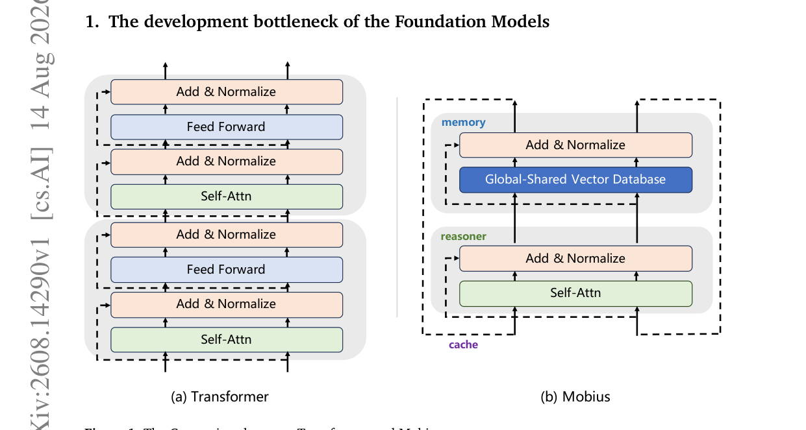
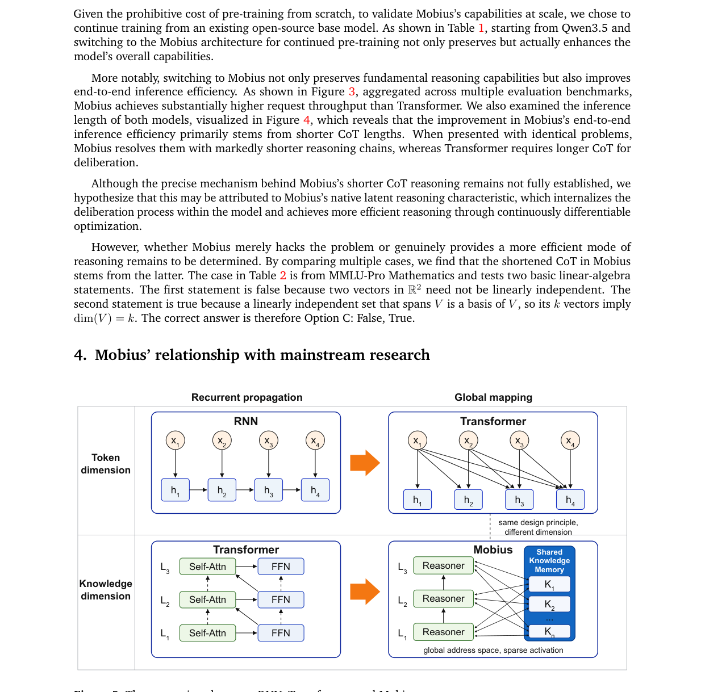
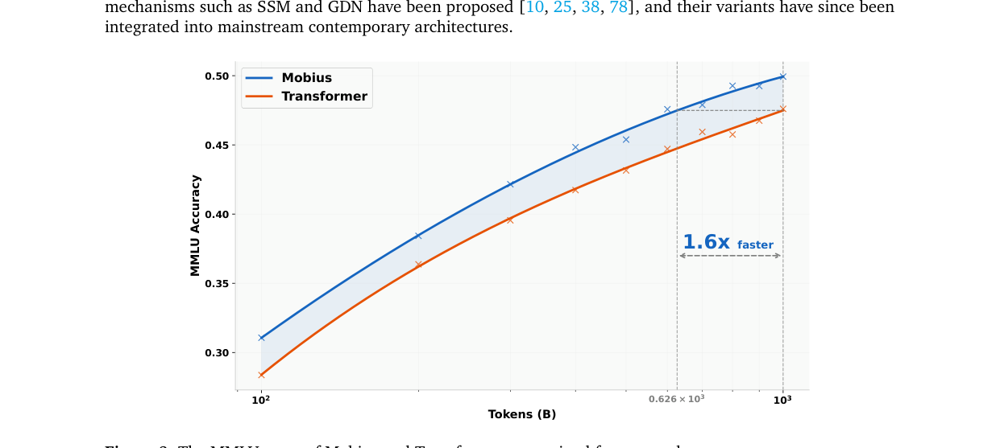
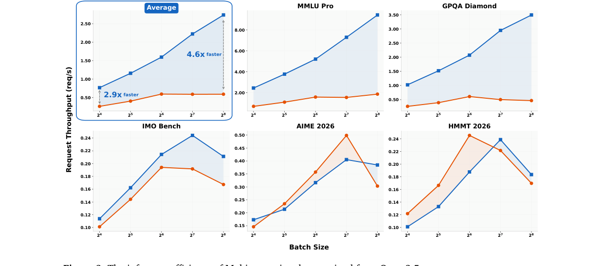
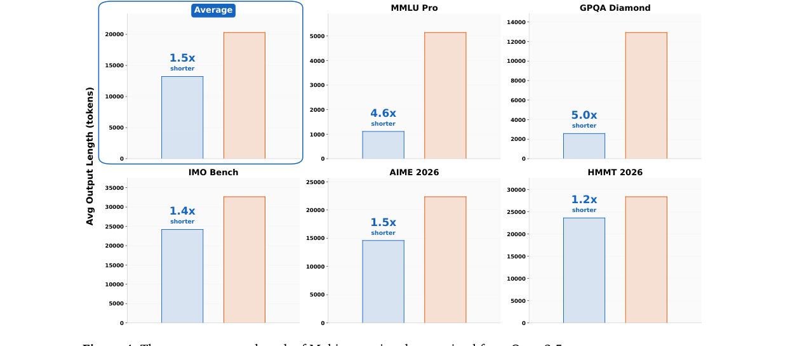
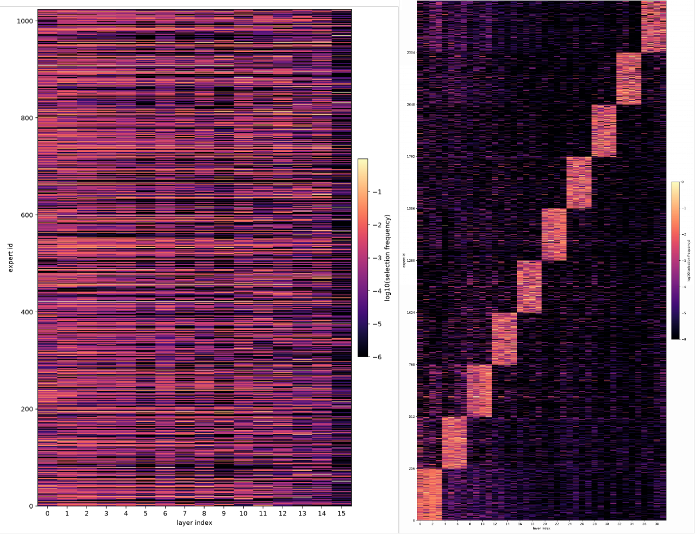
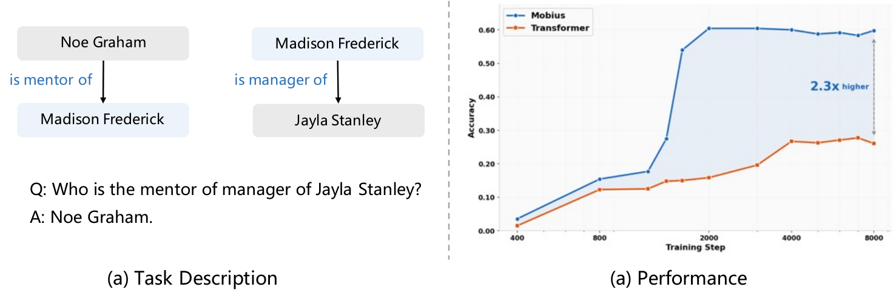
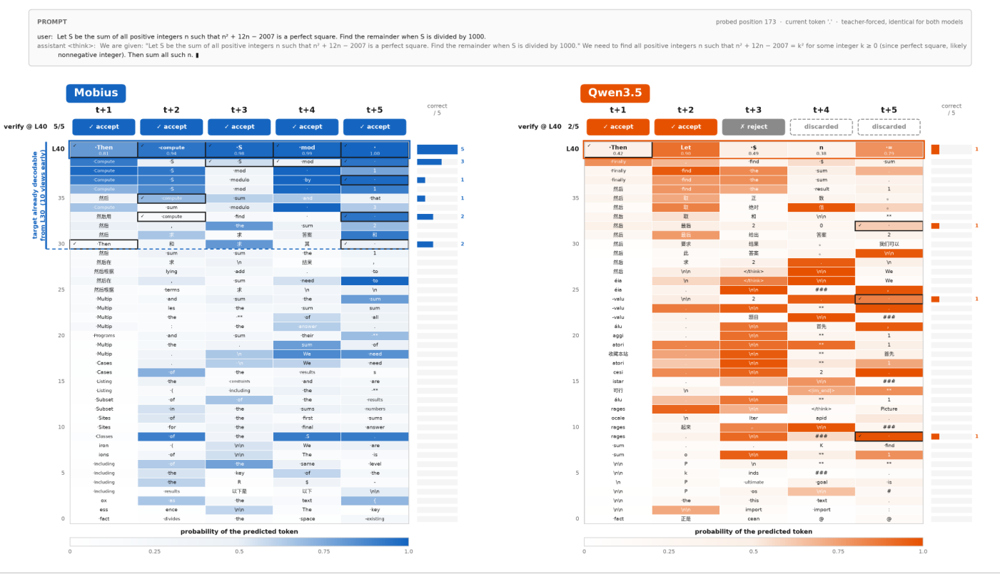

# Intern-S2-Mobius：知识与推理解耦的基础模型 — 精读报告

> **论文**：Intern-S2-Mobius: Foundation Model with Decoupled Knowledge and Reasoning
> **作者**：Intern-S2-Mobius Team, Shanghai AI Laboratory（项目负责人 Ermo Hua；顾问 Qi Zhang、Kai Chen、Dahua Lin、Bowen Zhou；核心贡献者 Ermo Hua、Xiangyu Hong、Che Jiang、Baiting Wu 等）
> **arXiv ID**：2608.14290
> **发表时间**：2026-08-14（v1）
> **许可**：Apache 2.0
> **代码仓库**：https://github.com/InternLM/Intern-S2-Mobius
> **模型权重**：https://huggingface.co/internlm/Intern-S2-Mobius-35B

## 第 1 章 概述

### 1.1 一句话定位

Mobius-v0 将 Transformer 中的 FFN 提炼为一个全局共享的知识向量数据库（Memory），将 Self-Attention 保留为可反复查询该数据库的推理算子（Reasoner），以「知识存储—推理计算」物理分离的架构，在同等下游分数的前提下把训练数据需求压缩到 Transformer 基线的 62.6%（约 1.6× 数据效率），并在持续预训练的 35B 模型上以显著更少的输出 token 实现近 4× 的端到端推理加速。

论文的核心命题是：当前大模型沿两条路线演进——堆参数服从 Scaling Law 但边际收益递减，或以线性注意力牺牲能力换取效率——而 Mobius 选择第三条路，即通过增加架构复杂度来提高智能上限，从而降低端到端开销。知识以向量形式集中存储、推理以迭代方式反复检索，二者不再耦合在同一条层级残差流水线上。

### 论文图表总览

| 编号 | 内容 | 出现章节 |
|:---:|:---|:---:|
| Figure 1 | Transformer（层级 FFN + Self-Attn）与 Mobius（全局共享向量数据库 + Reasoner）架构对比 | 第 2 章 |
| Figure 2 | 7B 从头训练：Mobius 与 Transformer 的 MMLU 训练曲线 | 第 5 章 |
| Figure 3 | 推理效率：请求吞吐对比 | 第 5 章 |
| Figure 4 | 平均输出长度对比（CoT 缩短效果） | 第 5 章 |
| Figure 5 | RNN、Transformer、Mobius 三种架构的信息流与循环特性对比 | 第 2 章 |
| Figure 6 | 专家激活模式：7B 从头训练与 35B 持续预训练的分布差异 | 第 5 章 |
| Figure 7 | 组合泛化 toy task 收敛曲线（Physics of LLM 设定） | 第 5 章 |
| Figure 8 | 逐层预测 lens：MTP 多 token draft 的接受情况 | 第 5 章 |
| Table 1 | Intern-S2-Mobius-35B 与 Qwen3.5-35B 的全 benchmark 对比 | 第 5 章 |
| Table 2 | MMLU-Pro 线性代数题的逐步推理 trace token 对比 | 第 5 章 |
| Table 3 | 生物学案例的推理 trace token 对比（附录 D） | 第 5 章 |

### 1.2 核心贡献

1. **Mobius-v0 架构**。将 Transformer 的 FFN（知识存储）与 Self-Attention（推理算子）解耦：FFN 的知识向量被水平拼接、全局共享，构成一个巨型 Memory；多个 Reasoner 通过隐藏状态反复查询 Memory，取回所需知识向量后再传回推理算子。知识压缩率与推理效率同时受益于这一物理分离。

2. **Backward Residual Connection（原生天赋一）**。共享存储使深层隐藏状态也能访问浅层写入的知识，形成反向信息流；这与 Transformer 仅「浅层 → 深层」的单向残差形成对比。间接双向残差增强了跨层组合泛化，加速关键信息合成，同时避免了显式反向残差带来的非友好计算图。

3. **Dynamic Latent Reasoning（原生天赋二）**。将 deliberation、trial-and-error、refinement 内化为连续向量的迭代优化：极少数层即可完成一次表示迭代，深层可同步解码多个 token（MTP），并为不同 token 动态分配计算量。其宏观表现是 Chain-of-Thought 长度的显著缩短。

4. **数据效率的实证**。7B-A1B MoE 模型从头训练 1TB tokens，仅用 Transformer 基线 62.6% 的数据即达到相同的 MMLU 分数（约 1.6× 数据效率）。论文给出的假设是：Transformer 存在跨层参数冗余，而 Mobius 的知识压缩率更高。

5. **推理效率的实证**。Intern-S2-Mobius-35B 由 Qwen3.5-35B-A3B 持续预训练 1TB tokens，再经 SFT 与 RL，在推理 benchmark 上持平或超越基线，输出 token 显著更少，端到端推理加速近 4×。

6. **科学任务的大幅提升**。对比基线 Qwen3.5-35B：Biology-Instructions 51.40 分 vs 3.77 分、Mol-Instructions 45.73 分 vs 21.70 分、MolecularIQ 59.29 分 vs 29.13 分，科学任务平均分 52.14 分 vs 18.20 分。

7. **扩展性展望**。知识/推理解耦为四个方向提供结构基础：自进化（无界知识扩展）、世界模型（连续空间建模先验）、科学发现（扁平化知识促进跨域组合泛化）、软硬件协同设计（知识参数可驻留 SSD 按需加载）。

### 1.3 关键结果速览

| 指标 | Intern-S2-Mobius | 基线 | 备注 |
|:---|:---:|:---:|:---|
| 训练数据需求（7B 从头训练，相同 MMLU 分数） | 62.6% | 100% | 约 1.6× 数据效率，训练量均为 1TB tokens 量级设定下的对照 |
| 端到端推理加速（35B 持续预训练） | 近 4× | 1× | 输出 token 显著更少 |
| MMLU-Pro 线性代数 trace 长度 | 516 tokens | 2,364 tokens | 压缩至约 21.8%，基线为 Qwen3.5-35B |
| 生物学案例 trace 长度 | 472 tokens | 1,649 tokens | 压缩至约 28.6% |
| Table 1 平均分（AVG Score） | 67.88 分 | 65.05 分 | +2.83 分 |
| Table 1 科学任务平均分 | 52.14 分 | 18.20 分 | +33.94 分 |
| Biology-Instructions | 51.40 分 | 3.77 分 | +47.63 分，单项最大涨幅 |
| AIME 2026 | 95.31 分 | 92.08 分 | +3.23 分 |
| UGD hard | 73.02 分 | 78.02 分 | −5.00 分，落后项 |
| HLE | 19.11 分 | 22.40 分 | −3.29 分，落后项 |

两个落后项（UGD hard、HLE）与整体优势并存，说明解耦架构并非全域无损，具体分析见第 5 章与第 8 章。

## 第 2 章 研究背景与动机

### 2.1 Transformer 面临的三重瓶颈

论文在第一章将现状归纳为三条互相纠缠的瓶颈：

1. **Scaling Law 边际收益递减**。继续堆叠参数与数据的回报持续下降，工业界在同等算力下能换取的智能增量越来越少。
2. **长 CoT 的冗长**。推理能力以 token 介导的 Chain-of-Thought 形式外化，模型必须把中间过程全部写成分离散 token，deliberation、trial-and-error、refinement 的每一次尝试都消耗输出带宽与延迟。
3. **线性注意力的权衡**。以线性注意力替代全注意力可以降低复杂度，但本质上是牺牲能力换效率，属于在既有架构内的节流。

Mobius 的回应是第三条路：不降低单步能力，而是增加架构复杂度以提高智能上限，再让更高的智能上限去压缩端到端开销——更少的 token 完成同样的推理。

### 2.2 Transformer 内部的功能分工

论文的出发点是一组经验观察：在标准 Transformer 中，FFN 承担知识存储（key-value 记忆向量），隐藏状态承担信息传输，Self-Attention 承担组合推理。三种功能本可以解耦，却被层级结构、前向残差与 token 介导的 CoT 三者捆绑在一起：

- 层级结构：每个层自带一份私有 FFN，知识被复制到 40 层各一份；
- 前向残差：信息只能从浅层流向深层，知识访问是单向的；
- token 介导 CoT：迭代推理必须经过离散 token 的编码—解码往返。

三者的组合低效，正是 Mobius 要拆除的对象。



*图 1：(a) 标准 Transformer 的层级结构，每层私有 FFN + Self-Attention，残差单向流动；(b) Mobius 将 FFN 抽取为全局共享的知识向量数据库（Memory），多个 Reasoner 通过隐藏状态反复查询。*

### 2.3 Backward Residual Connection

标准 Transformer 的前向残差可以写成：

$$h^{(l+1)} = h^{(l)} + \mathrm{FFN}^{(l)}\!\left(\mathrm{LN}\!\left(h^{(l)} + \mathrm{Attn}^{(l)}\!\left(\mathrm{LN}(h^{(l)})\right)\right)\right)$$

残差链条决定了信息流的单向性：第 $l$ 层 FFN 写入的知识只对 $l' > l$ 的层可见，第 $l'$ 层合成出的关键信息无法回流到浅层。跨层组合泛化因此受限——需要深层与浅层知识反复组合的任务，只能靠加深网络或拉长 CoT 来弥补。

显式的反向残差（例如允许深层输出直接加回浅层）会引入循环依赖，计算图对硬件并行不友好。Mobius 的做法是间接双向：所有层的知识都写入同一个 Memory，每个层在概念上可以访问全部知识；实现中按 `layer_idx % num_blocks` 分区路由、稀疏激活（每层实际访问其对应的一个分区，分区被约 10 层共享，见第 3 章），反向信息流经由同分区内多层共享同一 Memory 参数实现，计算图保持前馈。



*图 5：三种架构在循环性与信息流方向上的定位——RNN 天然循环但难以并行，Transformer 可并行但残差单向，Mobius 以前馈计算图实现间接双向的知识访问与迭代。*

### 2.4 Dynamic Latent Reasoning

第二条原生天赋针对 token 介导的 CoT。人类式的深思、试错与修正被内化为连续向量的迭代优化：

$$z^{(k+1)} = z^{(k)} + \Delta\!\left(z^{(k)},\ \mathrm{Read}(M, q^{(k)})\right)$$

其中 $z^{(k)}$ 是第 $k$ 轮迭代的隐藏状态（同时充当 cache 与 carrier），$\mathrm{Read}(M, q)$ 从共享 Memory 中取回知识向量，$\Delta$ 表示极少数层内的表示更新。三个关键性质：

1. **高迭代频率**：一次表示迭代只需经过极少数层，而不是整个网络或一整个 token 的解码周期；
2. **多 token 联合表示**：深层可以同步解码多个 token（MTP），表示层面的迭代与 token 层面的产出解耦；
3. **动态计算分配**：不同 token 难度不同，分配的计算量也随之不同，简单的 token 走得快，困难的 token 多迭代。

宏观效果即第 5 章 Table 2 所示：同样的 MMLU-Pro 题目，516 tokens 对 2,364 tokens。

### 2.5 知识/推理解耦的总纲

把 2.2–2.4 合并成一句话：Transformer 把「存什么知识」与「怎么推理」焊死在同一组层级参数里，Mobius 把它们拆成两个可以独立扩展的部件——Memory 负责压缩知识，Reasoner 负责组合推理，隐藏状态在两者之间充当总线。第 3 章给出这一总纲的具体架构，第 4 章给出训练流程，第 5 章给出实证。

## 第 3 章 Mobius-v0 架构设计

### 3.1 总体结构：一个 Memory，多个 Reasoner

Mobius-v0 由两类部件组成：

$$M = \{v_1, v_2, \dots, v_N\}$$

是全局共享的知识向量库（源自被解耦的 FFN），$v_i$ 为知识向量；Reasoner（源自 Self-Attention）以隐藏状态为查询，从 $M$ 中稀疏取回相关知识并完成组合推理：

$$\mathrm{Read}(M, q) = \sum_{i \in \mathrm{TopK}(q)} g_i(q)\, v_i$$

在 35B 配置中 $\mathrm{TopK}$ 取 8（num_experts_per_tok=8），候选池为 256 个专家（num_experts=256），$g_i(q)$ 为路由权重。知识取回后经由隐藏状态传回推理算子，隐藏状态同时是 cache（跨迭代保留中间结果）与 carrier（承载往返传输的内容）。

### 3.2 共享 Memory 的两级实现

论文给出从概念到实现的映射：

1. **概念级：水平拼接**。把所有层的 FFN key-value 向量水平拼接成一个共享 KV 知识向量池，任意 Reasoner 可查询全部知识。
2. **实现级：MoE block-wise 分区 + 稀疏激活**。池子大到一定程度后，按块分区管理，查询时稀疏激活。官方配置中 `num_blocks=4`，即全局共享 4 个 MetaMoeBlock；40 层（num_hidden_layers=40）按 `layer_idx % 4` 路由，每个 MetaMoeBlock 被约 10 层共享。

分区与稀疏激活保证了 Memory 的容量可以按专家数扩展（256 个专家、每 token 激活 8 个），而单次查询的计算量保持有界。这就是「全局共享、分区管理、稀疏访问」的 Memory 设计。

### 3.3 Reasoner 的迭代查询

每个 DecoderLayer 的前向可以概括为：

1. 残差进入 Token Mixer（Reasoner 主体），执行组合推理；
2. 按层索引计算 Memory 分区 `block_idx = layer_idx % num_blocks`；
3. 查询该分区的 MetaMoE 得到专家输出（知识向量）；
4. 逐层 shared expert 与专家输出合并（combine）；
5. 写回残差。

关键点在于第 3 步与第 1 步的关系：每一轮表示更新（一个 DecoderLayer）都会执行一次 Memory 查询。相比 Looped Transformer 需要整个网络循环一轮才完成一次迭代，Mobius 在极少数层内就完成一次「查询—融合—更新」，迭代频率高出一个量级；同时每次查询面对的是全量 Memory 的分区视图，而不是该层私有的知识。

### 3.4 混合注意力底座与 MTP

官方配置采用混合注意力：`full_attention_interval=4`，即每 4 层设置一个 full_attention 层，其余为 linear_attention（Gated DeltaNet：linear_conv_kernel_dim=4、linear_key_head_dim=128、linear_value_head_dim=128、linear_num_key_heads=16、linear_num_value_heads=32）。40 层中共 10 层全注意力、30 层线性注意力（由 interval 推得）。

这与第 2 章的动机一致：Mobius 不通过降低注意力复杂度来省算力（线性注意力层是为了控制长序列开销的常规手段），而是通过提高「推理密度」——每层做的组合推理更多、更频繁地访问知识。深层同步解码多 token（MTP）则把表示迭代与 token 产出解耦：一次迭代可以产出 $t+1$ 至 $t+5$ 的多 token draft（见第 5 章附录 E 的 Fig 8）。

### 3.5 与 Looped Transformer / Diffusion LM 的关系

论文将 Dynamic Latent Reasoning 定位为 Looped Transformer 与 Diffusion LM 的升级综合，并给出三项差异：

| 维度 | Looped Transformer / Diffusion LM | Mobius |
|:---|:---|:---|
| 迭代粒度 | 整个网络（或大块）循环一轮为一次迭代 | 极少数层即完成一次表示迭代，循环频率更高 |
| 表示对象 | 通常单 token 或整体扩散步 | 多 token 联合表示，深层同步产出 MTP draft |
| KV 管理 | 循环结构使 KV 缓存管理复杂 | 前馈计算图，KV 管理与标准 Transformer 一致，简化部署 |

第三点对工程意义重大：Mobius 保留了前馈结构，因此可以直接接入现有推理框架的 KV cache 与推测解码管线（第 6 章的 LMDeploy/vLLM/SGLang 部署均开箱可用）。

### 3.6 复杂度视角

设层数 $L$、Memory 分区数 $N_b$、每分区专家数 $E=256$、激活专家数 $k=8$。单 token 单层的 Memory 访问代价为 $O(k \cdot d_{\mathrm{ffn}})$（$d_{\mathrm{ffn}}$ 为 moe_intermediate_size=512），与总层数解耦；Memory 总容量为 $O(N_b \cdot E \cdot d_{\mathrm{ffn}})$，可独立于推理路径深度扩展。这正是第 8 章「知识参数驻留 SSD、按需加载」的复杂度基础：容量与带宽需求分离后，存储介质的分层才成为可能。

## 第 4 章 训练流程

### 4.1 两条互补的路线

论文用两个实验分别回答两个问题：

1. **7B 从头训练（TFS）**：架构本身是否更数据高效？在完全相同的设定下对照从头训练的 Transformer 基线。
2. **35B 持续预训练（CPT）**：架构能否嫁接到已有的强基线上？从 Qwen3.5-35B-A3B 出发，验证解耦改造后能力不掉、效率大增。

### 4.2 7B 从头训练

设定：7B-A1B MoE（总参数 7B、激活约 1B）、1TB tokens 训练量、对照为同规模同数据的 Transformer 基线。结果（Figure 2 的训练曲线）：Mobius 在全部训练阶段 MMLU 分数高于 Transformer，达到相同分数只需基线 62.6% 的数据：

$$\eta_{\text{data}} = \frac{1}{0.626} \approx 1.60\times$$

论文对数据效率的解释是一个假设而非定论：Transformer 各层的 FFN 存在跨层参数冗余（同样的知识被多层重复存储），而 Mobius 将知识集中到共享 Memory，压缩率更高，等量数据能沉淀更多不重复的知识。

### 4.3 35B 持续预训练：Qwen3.5-35B-A3B → 1TB CPT → SFT → RL

流程为四步：以 Qwen3.5-35B-A3B 为起点，先做 1TB tokens 的持续预训练（将权重改造为 Mobius 结构），随后 SFT，最后 RL。最终模型 Intern-S2-Mobius-35B 权重为 bfloat16。

研究材料未覆盖以下细节，报告中如实标注：SFT 的数据构成与规模 [VERIFY: SFT 数据规模与配方未在材料中给出]、RL 的算法族（如 GRPO/PPO 类别）与奖励设计 [VERIFY: RL 算法与奖励函数未在材料中给出]、训练硬件与并行策略 [VERIFY: 训练集群与并行配置未在材料中给出]。

CPT 路线的意义在于工程可行性：不需要从零重训 35B，而是把既有强模型的 FFN 重组为共享 Memory。附录 B（Fig 6）显示这一过程留有痕迹——持续预训练得到的 35B 模型专家激活范围比从头训练的 7B 更宽，但仍保留块对角模式，说明源 checkpoint 的层组织影响了路由先验（详见第 5 章）。

### 4.4 配置参数表

以下为官方仓库 `configuration_interns2_mobius.py` 中的关键取值：

| 模块 | 参数 | 取值 |
|:---|:---|:---:|
| 文本主干 | hidden_size | 2048 |
| 文本主干 | num_hidden_layers | 40 |
| 文本主干 | num_attention_heads | 16 |
| 文本主干 | num_key_value_heads（GQA） | 2 |
| 文本主干 | head_dim | 256 |
| 文本主干 | vocab_size | 248320 |
| 文本主干 | max_position_embeddings | 32768 |
| Memory | num_blocks（全局共享 MetaMoeBlock 数） | 4 |
| Memory | num_experts | 256 |
| Memory | num_experts_per_tok | 8 |
| Memory | moe_intermediate_size | 512 |
| Memory | shared_expert_intermediate_size | 512 |
| Memory | router_aux_loss_coef | 0.001 |
| 混合注意力 | full_attention_interval | 4 |
| 线性注意力 | linear_conv_kernel_dim | 4 |
| 线性注意力 | linear_key_head_dim | 128 |
| 线性注意力 | linear_value_head_dim | 128 |
| 线性注意力 | linear_num_key_heads | 16 |
| 线性注意力 | linear_num_value_heads | 32 |
| 视觉 | depth | 27 |
| 视觉 | hidden_size | 1152 |
| 视觉 | patch_size | 16 |
| 视觉 | temporal_patch_size（视频支持） | 2 |
| 视觉 | out_hidden_size | 3584 |
| 多模态 | image_token_id | 248056 |
| 多模态 | video_token_id | 248057 |

该配置文件与 HuggingFace 上 35B 权重 config.json 的对应关系未在研究材料中确认 [VERIFY: 上表为仓库默认配置，与 35B 发布权重的精确对应待核对]。

### 4.5 多模态扩展

架构类为 `InternS2MobiusForConditionalGeneration`，注册于 AutoModelForImageTextToText / AutoModelForMultimodalLM。视觉侧参数（depth=27、patch_size=16、temporal_patch_size=2 的视频编码）与 248,320 的词表（含 image/video 专用 token id 248056、248057）表明 Mobius-v0 的代码实现原生覆盖多模态，尽管论文实验以文本推理与科学任务为主。词表规模与 Qwen 系的具体对应关系待核实（248,320 与已知 Qwen 开源词表数值不同），但从 Qwen3.5 持续预训练能够顺畅进行，说明词表在工程上是兼容的 [VERIFY: 词表与 Qwen 系版本的精确对应关系待官方确认]。

### 4.6 训练与架构的协同要点

1. **block 路由即课程**：`layer_idx % num_blocks` 的分区方式在初始化 CPT 时决定了原 40 层私有 FFN 如何归并到 4 个共享分区，附录 B 的块对角激活模式即其残留痕迹。
2. **router_aux_loss_coef=0.001**：负载均衡以极小系数正则，避免路由坍缩破坏 Memory 的全局共享性。
3. **shared expert 的角色**：每个 DecoderLayer 除查询共享 Memory 外，还保留逐层 shared expert（shared_expert_intermediate_size=512）与 combine 结构，兼顾层特有变换与全局知识。

## 第 5 章 实验结果

### 5.1 评估设置

评估使用 OpenCompass。最大推理长度：MMLU Pro、SimpleQA、HLE 为 64K，其余 benchmark 为 128K。对比对象：基线 Qwen3.5-35B（CPT 起点），保证对比只反映架构改造的影响。

### 5.2 Table 1：主结果

| Benchmark | Intern-S2-Mobius-35B | Qwen3.5-35B | Δ |
|:---|:---:|:---:|:---:|
| MMLU Pro | 89.05 分 | 85.31 分 | +3.74 分 |
| GPQA Diamond | 80.81 分 | 80.24 分 | +0.57 分 |
| IMO Bench | 81.25 分 | 77.50 分 | +3.75 分 |
| AIME 2026 | 95.31 分 | 92.08 分 | +3.23 分 |
| HMMT 2026 | 85.51 分 | 78.50 分 | +7.01 分 |
| UGD hard | 73.02 分 | 78.02 分 | −5.00 分 |
| AMO | 58.00 分 | 50.00 分 | +8.00 分 |
| SimpleQA | 28.90 分 | 21.39 分 | +7.51 分 |
| HLE | 19.11 分 | 22.40 分 | −3.29 分 |
| AVG Score | 67.88 分 | 65.05 分 | +2.83 分 |
| Biology-Instructions | 51.40 分 | 3.77 分 | +47.63 分 |
| Mol-Instructions | 45.73 分 | 21.70 分 | +24.03 分 |
| MolecularIQ | 59.29 分 | 29.13 分 | +30.16 分 |
| Scientific AVG | 52.14 分 | 18.20 分 | +33.94 分 |

Δ 列为两列之差（本文计算）。14 项中 12 项领先、2 项落后（UGD hard、HLE）；数学竞赛类（AIME 2026、HMMT 2026、IMO Bench）与奥赛级推理（AMO）全面提升，涨幅在 +3.23 至 +8.00 分之间。

### 5.3 从头训练的数据效率（Figure 2）



*图 2：7B 从头训练中，Mobius 与 Transformer 基线的 MMLU 分数随训练进程的对比——Mobius 全阶段高于基线，达到相同分数只需 62.6% 的数据。*

该实验隔离了架构变量（同规模 7B-A1B、同 1TB tokens 预算、从头训练），是「知识压缩率更高」这一假设最直接的证据链。论文同时坦承这只是假设层面的解释，跨层冗余的定量刻画留待后续 [VERIFY: 论文未给出逐层知识冗余度的定量测量]。

### 5.4 推理效率（Figure 3、Figure 4）



*图 3：推理效率对比——Intern-S2-Mobius-35B 的请求吞吐显著高于基线，端到端加速近 4×。*



*图 4：平均输出长度对比——Mobius 在各 benchmark 上的 CoT 输出显著短于基线，是吞吐提升的直接来源。*

加速的机制分解为两项：输出 token 数下降（Dynamic Latent Reasoning 把迭代搬进表示空间）与 MTP 推测解码（深层一次产出多 token draft，且接受率高，见 5.7 节 Fig 8）。

### 5.5 Table 2：逐步 trace 对比

题目为 MMLU-Pro 线性代数题，正确答案 C（False, True），两模型均答对：

| 对齐步骤 | Intern-S2-Mobius-35B | Qwen3.5-35B |
|:---|:---:|:---:|
| Task framing | 17 tokens | 20 tokens |
| Statement 1 | 178 tokens | 283 tokens |
| Statement 2 | 142 tokens | 197 tokens |
| Option matching | 22 tokens | 122 tokens |
| Repeated derivation | — | 1,147 tokens |
| Visible final answer | 157 tokens | 595 tokens |
| **Total** | **516 tokens** | **2,364 tokens** |

$$\rho_{\text{MMLU-Pro}} = \frac{516}{2364} \approx 21.8\%$$

差距的最大单一来源是基线的 Repeated derivation（1,147 tokens，占其总量 48.5%）：Qwen3.5 在选项匹配后仍反复重推同一推导，而 Mobius 的对应步骤为空。论文以逐步对齐的方式证明缩短源于真实的高效推理（同样的 framing、同样的两条 statement 判定、同样的正确答案），而非跳步或猜测之类的 hack。

### 5.6 Table 3 与科学任务

附录 D 的生物学案例：Mobius 472 tokens vs Qwen3.5 1,649 tokens，压缩至约 28.6%，与 MMLU-Pro 案例的压缩幅度同量级。

科学任务三项（Biology-Instructions 51.40 vs 3.77 分、Mol-Instructions 45.73 vs 21.70 分、MolecularIQ 59.29 vs 29.13 分）的涨幅远超通用 benchmark。论文在潜力章节给出的解释是：扁平化的全局知识库促进了跨域知识的组合泛化——生物学与分子任务要求把化学、序列、结构等分散知识重组，而这正是共享 Memory + 反复查询结构的强项。涨幅是否部分来自 SFT/RL 数据分布的针对性 [VERIFY: 科学任务的 SFT 数据构成未在材料中说明]，材料未给出消融。

### 5.7 附录分析

1. **专家激活模式（Fig 6，附录 B）**：7B 从头训练模型的专家激活分布较均匀；35B 持续预训练模型的激活范围更宽，但保留块对角模式——源 checkpoint（Qwen3.5-35B-A3B）的层组织在路由先验中留下了痕迹。



*图 6：左为 Mobius-7B 从头训练（激活分布较均匀），右为 Intern-S2-Mobius-35B 持续预训练（激活范围更宽但仍保留块对角模式）。*

2. **组合泛化 toy task（Fig 7，附录 C）**：采用 Physics of LLM 设定，500 实体单跳 + 400 实体双跳训练，100 实体双跳测试。未来版本的 Mobius 收敛更快、最终分数更高，为 Backward Residual Connection 增强跨层组合泛化提供了受控证据。



*图 7：组合泛化任务上 Mobius（未来版本）与 Transformer 的收敛对比——Mobius 收敛更快且最终分数更高。*

3. **逐层预测 lens（Fig 8，附录 E）**：Mobius 的中间层预测与目标更对齐，$t+1$ 至 $t+5$ 的五 token draft 全部被接受；基线的第三位 draft 被拒，仅两 token 接受前缀。这直接解释了 MTP 推测解码在 Mobius 上的高接受率与吞吐收益。



*图 8：相同 teacher-forced 上下文下的逐层预测 lens——Mobius 的中间层预测更贴近目标，五 token draft 全接受；基线的 draft 在第三位被拒。*

### 5.8 落后项分析

UGD hard（73.02 vs 78.02 分）与 HLE（19.11 vs 22.40 分）两项落后。研究材料未提供论文对这两个回归的归因 [VERIFY: 论文正文对 UGD hard 与 HLE 回归的解释未包含在研究材料中]。从任务形态看，二者分别对应超长/高难通用推理与长上下文的综合考试（HLE 在 64K 推理长度设置下评估，UGD hard 为 128K），潜在的解释方向包括：CoT 压缩对需要长程外部检索型推导的任务存在代价、MTP 多 token 产出在高不确定性区域的接受率下降。这些属于本报告的推测性分析，不是论文结论。

## 第 6 章 代码实现

### 6.1 仓库概览

| 项目 | 内容 |
|:---|:---|
| 仓库 | https://github.com/InternLM/Intern-S2-Mobius（2026-08 发布，Apache 2.0） |
| 核心文件 | modeling_interns2_mobius.py（104KB、26 个类）、configuration_interns2_mobius.py |
| 附带资产 | Technical Report PDF、figs/ |
| 模型集合 | https://huggingface.co/collections/internlm/intern-s2 |
| 架构探索仓库 | https://github.com/InternLM/archspace |
| 评估工具 | OpenCompass |
| 部署框架 | LMDeploy、vLLM、SGLang、Transformers（均支持 MTP 推测解码） |

### 6.2 DecoderLayer.forward 核心逻辑

依据官方 `modeling_interns2_mobius.py` 的调用关系整理的结构复述（非逐行拷贝）：

```python
class InternS2MobiusDecoderLayer(nn.Module):
    """Mobius DecoderLayer：Token Mixer（Reasoner）+ 全局共享 MetaMoE（Memory）"""

    def __init__(self, config, layer_idx):
        super().__init__()
        self.layer_idx = layer_idx
        self.num_blocks = config.num_blocks                    # 4：全局共享 Memory 分区数
        # 混合注意力：每 4 层一个全注意力 Reasoner（第 4/8/12…层）
        if (layer_idx + 1) % config.full_attention_interval == 0:
            self.token_mixer = Attention(config)               # full_attention
        else:
            self.token_mixer = GatedDeltaNet(config)           # linear_attention
        self.input_layernorm = RMSNorm(config.hidden_size, config.rms_norm_eps)
        self.post_attention_layernorm = RMSNorm(config.hidden_size, config.rms_norm_eps)
        # meta_mlp 由模型统一构建后注入：nn.ModuleList[MetaMoeBlock] * num_blocks
        self.meta_mlp = None
        self.mlp = InternS2MobiusMLP(config)                   # 逐层 shared expert + combine

    def forward(self, hidden_states, attention_mask=None, **kwargs):
        # 1) Reasoner：组合推理
        residual = hidden_states
        hidden_states = self.input_layernorm(hidden_states)
        hidden_states = self.token_mixer(hidden_states, attention_mask, **kwargs)
        hidden_states = residual + hidden_states

        # 2) Memory 查询：按层索引路由到全局共享分区
        residual = hidden_states
        hidden_states = self.post_attention_layernorm(hidden_states)
        block_idx = self.layer_idx % self.num_blocks          # layer_idx % 4
        expert_output = self.meta_mlp[block_idx](hidden_states)  # 查询共享 Memory
        hidden_states = self.mlp(hidden_states, expert_output)   # shared expert 融合
        hidden_states = residual + hidden_states
        return hidden_states
```

三个要点：

1. `meta_mlp` 不属于任何单个层——它是模型级共享的 `nn.ModuleList`，包含 `num_blocks=4` 个 MetaMoeBlock，每个 DecoderLayer 按 `layer_idx % 4` 取用。这正是「共享 Memory」在代码中的落点。
2. FFN 位置被拆成两半：全局共享的专家输出（知识）+ 逐层 shared expert 的 combine（层特有变换）。
3. 整体仍是标准 pre-norm 残差骨架，因此 KV cache、推测解码等推理栈无需改造。

### 6.3 配置类

依据官方 `configuration_interns2_mobius.py` 整理的骨架：

```python
@dataclass
class InternS2MobiusTextConfig(PretrainedConfig):
    model_type = "interns2_mobius"

    def __init__(
        self,
        # 文本主干
        hidden_size=2048,
        num_hidden_layers=40,
        num_attention_heads=16,
        num_key_value_heads=2,          # GQA
        head_dim=256,
        vocab_size=248320,
        max_position_embeddings=32768,
        # Memory（全局共享 MoE 分区）
        num_blocks=4,                   # MetaMoeBlock 数量，全局共享
        num_experts=256,
        num_experts_per_tok=8,
        moe_intermediate_size=512,
        shared_expert_intermediate_size=512,
        router_aux_loss_coef=0.001,
        # 混合注意力
        layer_types=None,               # 默认按 full_attention_interval=4 生成
        linear_conv_kernel_dim=4,
        linear_key_head_dim=128,
        linear_value_head_dim=128,
        linear_num_key_heads=16,
        linear_num_value_heads=32,
        **kwargs,
    ):
        super().__init__(**kwargs)
        ...


@dataclass
class InternS2MobiusVisionConfig(PretrainedConfig):
    model_type = "interns2_mobius_vision"

    def __init__(self, depth=27, hidden_size=1152, patch_size=16,
                 temporal_patch_size=2, out_hidden_size=3584, **kwargs):
        ...
```

顶层模型类 `InternS2MobiusForConditionalGeneration` 注册于 `AutoModelForImageTextToText` 与 `AutoModelForMultimodalLM`，词表中预留 image_token_id=248056、video_token_id=248057 及 vision_start/end token。

### 6.4 部署

权重为 bfloat16 的 35B 模型，四个框架均可加载，且均推荐开启 MTP 推测解码（draft tokens=4）：

```bash
# LMDeploy
lmdeploy serve api_server internlm/Intern-S2-Mobius-35B \
    --speculative-algorithm qwen3_5_mtp \
    --speculative-num-draft-tokens 4

# vLLM
vllm serve internlm/Intern-S2-Mobius-35B \
    --spec-method mtp --spec-tokens 4

# SGLang
python -m sglang.launch_server \
    --model-path internlm/Intern-S2-Mobius-35B \
    --speculative-algorithm NEXTN \
    --speculative-num-draft-tokens 4
```

Transformers 路线通过远程代码（trust_remote_code）加载。推荐采样参数：top_p=1、top_k=50、min_p=0.0、temperature=0.8。

推测解码的算法名在不同框架中分别叫 qwen3_5_mtp / mtp / NEXTN，命名沿用了 MTP 头的部署惯例；结合 Fig 8（五 token draft 全接受 vs 基线两 token 后被拒），MTP 的高接受率是 4× 端到端加速中不可省略的组成部分。Fig 8 展示的 $t+1$ 至 $t+5$ 是 MTP 头支持的最大预测跨度（论文层析实验的评估上限），而部署推荐 draft tokens=4 是保守配置——只取前 4 个位置的草稿参与验证，换取更低的草稿生成开销与更高的接受裕度，两者并不矛盾（见第 3.4 节「一次迭代可以产出 $t+1$ 至 $t+5$ 的多 token draft」）。

### 6.5 二次开发注意事项

1. **修改 Memory 分区数**：`num_blocks` 改动会同时改变路由关系与权重复用方式，从已发布权重继续训练时需保持 4 不变，否则需重做 CPT。
2. **MetaMoE 注入时序**：DecoderLayer 构造时 `meta_mlp` 尚未就位，由外层模型统一创建并赋值，自定义加载逻辑需遵守该顺序。
3. **混合注意力与框架兼容**：linear_attention 层（GatedDeltaNet）在旧版推理框架中可能缺 kernel，部署前需确认框架版本对 gated delta net 的支持。

## 第 7 章 与主流研究关系

### 7.1 Latent Reasoning 谱系

论文将相关工作分为三支，并逐一给出 Mobius 的差异：

| 分支 | 代表工作 | 核心机制 | Mobius 的差异 |
|:---|:---|:---|:---|
| Continuous thought | COCONUT、CODI、SoftCoT | 把 CoT 的中间步骤替换为连续向量 | 向量迭代不依赖外加的隐式步骤位，而是内建于层结构 |
| Looped 结构 | Universal Transformer、Looped LM | 同一组层反复循环执行 | 每轮更新仅涉及极少数层但可访问共享 Memory（按层路由到对应分区，见第 3.2 节），循环频率更高 |
| Additional latent steps | pause-token、Hidden Decoding、Diffusion LM | 在前向中插入额外隐式计算步 | 多 token 联合表示 + MTP 同步解码，且 KV 管理保持前馈式简化 |

共性目标是把推理从离散 token 空间搬回连续表示空间；Mobius 的增量在于迭代的「频率—覆盖—产出」三者同时改善：频率（少数层一轮）、覆盖（每轮经分区路由访问全局共享 Memory）、产出（多 token draft）。

### 7.2 Speculative Decoding

推测解码的传统角色是用小模型起草、大模型验证，知识只被单次遍历。Mobius 与它的关系是两层的：

1. **机制层**：Mobius 的推理本身是多轮知识遍历（每次 DecoderLayer 都查询 Memory），与单次遍历的 draft-verify 范式正交；
2. **工程层**：Mobius 原生支持 MTP，深层直接产出多 token draft（Fig 8 的 $t+1$–$t+5$ 全接受），把推测解码从「外挂加速」变成「内生属性」，这也是第 6 章三个框架均以 draft tokens=4 为推荐配置的原因。

### 7.3 Concise CoT / Efficient Reasoning

压缩显式 CoT 的常见做法是在监督数据或 RL 奖励上施加长度约束，让模型学会少写。这类方法改变的是「表达习惯」，推理仍在 token 空间展开。Mobius 改变的是「表达介质」：trial-and-error 与 refinement 在连续向量中迭代完成，输出只保留结论性内容。Table 2 的逐步对齐（Reframing、Statement 判定、Option matching 俱全，仅 Repeated derivation 为空）是介质迁移生效的证据形态。

### 7.4 注意力与残差的设计哲学

| 设计维度 | 主流做法 | Mobius 立场 |
|:---|:---|:---|
| 注意力 | 降低复杂度（稀疏、线性、局部） | 不降复杂度而提高密度：推理算子做更多组合工作 |
| 残差 | 单向前向残差 | 经共享 Memory 实现间接双向知识访问 |
| 知识存储 | 逐层私有 FFN | 全局共享、分区管理、稀疏查询 |

这张对照表概括了论文的架构立场：效率不是从算子里省出来的，而是从「知识与推理的组织方式」里重构出来的。

### 7.5 定位总结

在 Latent Reasoning × Efficient Reasoning × 架构重构的三维坐标里，Mobius 的落点是：以 Looped/Diffusion 一系的表示迭代为内核，以 MoE 分区为存储载体，以 MTP 为产出接口，以前馈计算图为工程边界。四者的组合使其既有别于纯算法层面的 CoT 压缩，也有别于纯系统层面的解码加速。

## 第 8 章 潜力方向与局限

### 8.1 Self-Evolving

Transformer 的知识与推理耦合在同一组参数中，端到端训练必然同时改变两者，增量更新知识时难以避免灾难性遗忘。Mobius 的解耦使知识扩展可以限定在 Memory 分区内进行，推理算子保持稳定，理论上支持无界的知识扩展。这一主张与第 5 章 35B CPT 的实践互为印证：改造存储结构而推理能力不掉，本身就是解耦可维护性的一个数据点。

### 8.2 World Model

连续空间的物理世界建模被论文估计需要 petabyte 级参数。如此规模的参数无法全部驻留 GPU，必须依赖能以连续向量迭代的方式高效检索的知识结构——Mobius 的 latent reasoning 提供了这样的先验：表示空间的迭代天然适合状态演化的建模，共享 Memory 天然适合大规模状态知识的存放。

### 8.3 Scientific Discovery

第 5 章科学任务 +33.94 分的平均涨幅是这一方向的经验基础。论文的机制解释是「扁平化知识促进跨域组合泛化」：科学发现要求把分散在多个领域的知识重组，而全局共享、不分层的知识库降低了重组的检索成本。Fig 7 的组合泛化 toy task（双跳测试集上收敛更快、分数更高）提供了受控环境下的旁证。

### 8.4 软硬件协同设计

Memory 的容量与推理路径的深度解耦后，知识参数可以驻留 SSD、按需加载，推理参数（Reasoner、路由）驻留 GPU。这开启了一条与 GPU 显存墙正交的扩展路径：存储介质分层（HBM/DDR/SSD）与知识访问的稀疏性相匹配。实现前提是第 3.6 节的复杂度分离——单次查询代价有界（top-8 of 256 专家），总容量可独立扩展。

### 8.5 局限

1. **存在落后项**。UGD hard（73.02 vs 78.02 分）与 HLE（19.11 vs 22.40 分）落后于基线。HLE 在 64K 推理长度设置下评估，UGD hard 为 128K。CoT 压缩对特定任务形态的代价尚未被论文定量解释 [VERIFY: 论文对该回归的归因未包含在研究材料中]。
2. **CPT 路由先验的残留**。附录 B 显示 35B 持续预训练模型的专家激活保留了源 checkpoint 层组织的块对角痕迹，从头训练的均匀激活才是架构的「理想态」；CPT 路线以效率换纯度，长程影响未知。
3. **数据效率解释停留在假设层面**。跨层参数冗余的定量测量、知识压缩率的直接度量均未给出，62.6% 这一数字的机理支撑仍属推断。
4. **关键训练细节未公开**。SFT 数据、RL 算法与奖励设计、训练硬件与并行策略在研究材料中均缺席，复现需要对官方仓库与后续技术报告的持续跟踪 [VERIFY: 待官方 Technical Report 补充]。
5. **收益与 MTP 耦合**。近 4× 的端到端加速同时来自输出缩短与推测解码，二者的贡献拆分（例如关闭 MTP 后的纯架构收益）未在材料中给出 [VERIFY: 消融数据缺失]。
6. **生态成熟度**。仓库 2026-08 发布，40 stars，部署依赖远程代码与对 Gated DeltaNet 的框架支持，生产采用需评估维护节奏。

综合判断：Mobius-v0 用一次架构层面的重构，把「知识存哪里、推理怎么迭代、token 怎么产出」三个此前捆绑的问题拆开回答，并在数据效率（1.6×）、推理加速（近 4×）、科学任务（+33.94 分）三个维度拿到了实证支撑；其代价是架构复杂度上升、两个 benchmark 的回归，以及机理层面尚待补齐的解释链。它更接近一个纲领性的起点（v0 之名亦如是）——自进化、世界模型、科学发现与软硬件协同四条延伸线，都建立在这同一个解耦地基上。
