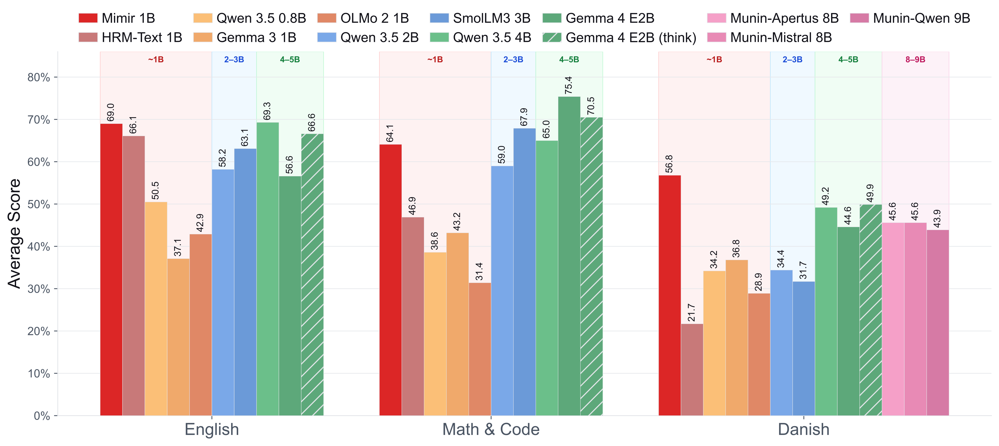

# 《DFM Mimir v1》论文精读报告

> **论文**：DFM Mimir v1: An Open HRM Delivering Frontier Performance at 1B Parameters Using Only Permissible Post-Training Data
> **作者**：Peter Schneider-Kamp, Jacob Nielsen, Gianluca Barmina, Kenneth Enevoldsen, Lukas Galke Poech（南丹麦大学 OdenseNLP / 丹麦基础模型项目 DFM）
> **arXiv ID**：2608.13517
> **发表时间**：2026-08-13
> **许可协议**：Apache 2.0
> **代码仓库**：https://github.com/schneiderkamplab/HRM-Text

## 第 1 章 概述

### 1.1 一句话定位

本文发布 Mimir v1——首个完全基于 permissible post-training data（开放许可、协议授权或 EU TDM 研究例外）从零训练的 1B 参数 Hierarchical Reasoning Model（HRM）：仅用 161 个数据集、每 epoch 70.48B tokens，在 20 个基准上做到英文平均分与 Qwen3.5 4B 仅差 0.3 分、Math & Code 较同架构的 HRM-Text 1B 提升 36.7%，并刷新丹麦语 SOTA。

### 论文图表总览

| 编号 | 内容 | 详见 |
|------|------|------|
| Figure 1 | 聚合成绩图（Mimir 1B 与对比模型在 English / Math & Code / Danish 三组的平均分） | 第 5 章 |
| Table 1 | 数据分类分布（8 类功能分类的 token 量与占比） | 第 3 章 |
| Table 2 | 语言分布 | 第 3 章 |
| Table 3 | 数据处理形式 | 第 3 章 |
| Table 4 | Top-10 数据集 | 第 3 章 |
| Table 5 | 架构配置 | 第 4 章 |
| Table 6 | 训练超参 | 第 4 章 |
| Table 7 | 英文基准 | 第 5 章 |
| Table 8 | 数学与代码基准 | 第 5 章 |
| Table 9 | 丹麦语基准 | 第 5 章 |

### 1.2 核心贡献

1. **基于 permissible 数据从零训练的 1B HRM**：在严格许可约束（开放许可 / 协议授权 / EU TDM 研究例外）下，用 161 个数据集、70.48B tokens/epoch 训练 1B 参数 HRM，证明不依赖大规模非合规语料也能达到前沿性能；模型权重（HuggingFace `danish-foundation-models/DFM-Mimir`）、训练框架（Apache 2.0）与数据配方全部开放。
2. **丹麦语 SOTA**：Danish Avg 56.8%，远超全部对比模型（次优 Gemma 4 E2B think 49.9%、第三 Qwen 3.5 4B 49.2%），并在 DaLA（96.1%）、GEC（85.6%）、WikiQA（66.8%）上全面领先，验证了 HRM 架构对低资源语言的适用性。
3. **合成 transplant 数据集**：针对 HRM-Text 原始数据中不符合 DFM 许可标准的部分，用 Gemma4 31B 生成并经质量审计的合成数据集进行替换，效果相当或更优。
4. **生成式任务导向的数据配比**：训练数据从「判别式多选题」转向「自由生成式」，83% tokens 来自非 Sapient 集合，56.1% 按 exact-match 评分（GSM8K / MATH / DROP），使数据形式与评测目标对齐。

### 1.3 关键结果速览

| 指标 | Mimir 1B | 参照 | 说明 |
|------|----------|------|------|
| GSM8K | 89.9% | Gemma4 E2B (think) 90.3% | 全局第二、同参数量级第一 |
| English Avg | 69.0% | Qwen3.5 4B 69.3% | 仅差 0.3 分 |
| Danish Avg | 56.8% | Qwen3.5 4B 49.2% | 领先 7.6 分，设立 SOTA |
| Math & Code Avg | 64.1% | HRM-Text 1B 46.9% | 相对提升 36.7% |

- **英文单项领先**：BoolQ 87.8%、Winogrande 73.5%、DROP 83.1%，均超过包括 Qwen3.5 4B 在内的所有对比模型。
- **代码能力从无到有**：HumanEval 56.7%，而 HRM-Text 1B 为 0.0%。
- **训练成本可控**：1.65M steps，8×NVIDIA B200（180GB HBM3e），不到 3 周，平均 step 时间 <1.1s。

## 第 2 章 研究背景与动机

### 2.1 主流 LLM 开发的「monolithic recipe」与进入壁垒

当前主流 LLM 开发遵循一种 monolithic recipe：超大规模（且大量非 permissible 的）数据，叠加多阶段训练流水线。这一模式为坚持开源与数据合规的研究者设置了高进入壁垒——许可合规、数据获取与算力成本同样高昂，中小团队难以复现前沿结果。

### 2.2 丹麦语的数据困境与 DFM 的许可原则

丹麦语的高质量数据池有限，若再叠加「只用 permissible 数据」的约束，传统「堆预训练语料」的路线直接不可行。丹麦基础模型项目（DFM）正是以该约束为前提：训练数据必须满足三类来源之一——开放许可、协议授权、或 EU TDM（Text and Data Mining）研究例外。

### 2.3 HRM 架构：把优化重心从预训练规模移到 post-training 数据

HRM 概念论文（arXiv:2506.21734）与 HRM-Text（arXiv:2605.20613，Sapient，Guan Wang et al.）提供了另一条路径：HRM 采用双时间尺度循环结构——高层模块 H（慢）与低层模块 L（快）两个 Transformer 对同一输入 embedding 反复迭代、以加性方式注入彼此状态：

$$z_H \leftarrow \mathrm{embed}(x)\cdot s,\qquad z_L \leftarrow \mathbf{0}$$

$$\begin{aligned}
&\textbf{for}\ h = 1,\dots,\mathrm{H\_cycles}:\\
&\qquad \textbf{for}\ l = 1,\dots,\mathrm{L\_cycles}:\quad z_L \leftarrow L(z_L + z_H)\\
&\qquad z_H \leftarrow H(z_H + z_L)
\end{aligned}$$

有效计算深度约为 $\mathrm{H\_cycles}\times(\mathrm{L\_cycles}+1)$ 轮迭代——参数量固定而计算深度近似无界。Mimir 的配置为 2×(3+1)=8 轮迭代（16 层 H + 16 层 L）。这一特性使模型性能主要取决于 post-training 数据的质量与配比，而非预训练语料规模，恰好适配低资源语言 + 严格许可约束的场景。

### 2.4 原始 HRM-Text 数据不合规：以合成数据移植替代

直接沿用 HRM-Text 的训练数据并不可行：其中相当一部分不符合 DFM 的许可标准。本文的对策是用合成 transplant 数据集（Gemma4 31B 生成 + 质量审计）替换不合规部分，在保持任务分布的前提下重建一个完全 permissible 的 161 数据集混合体——这也是 Mimir 得以在合规约束下复现并超越 HRM-Text 1B 的关键前提。

## 第 3 章 训练数据与数据工程

Mimir v1 的训练数据是本文的核心创新载体：161 个数据集、每 epoch 70,479,308,606 tokens（约 70.48B），几乎全部来自 HuggingFace Hub 上的公开数据集。数据工程的目标是在「permissible data」约束下构造一个兼顾英语能力、丹麦语 SOTA 与推理/生成能力的高质量语料。

### 3.1 数据规模与功能分类

全部 161 个数据集按内容与用途划分为八个功能类别。Table 1（论文 Table 1）给出各类别的 token 规模与占比：

| 类别 | Tokens/epoch | 占比 | 数据集数 | 平均 tokens/数据集 |
|:-----|:---:|:---:|:---:|:---:|
| Danish instruction & knowledge | 15.56B | 22.07% | 30 | 518.6M |
| English instruction | 13.58B | 19.26% | 16 | 848.5M |
| Sapient mixed (Flan/Platypus) | 12.00B | 17.02% | 71 | 169.0M |
| Math & reasoning | 10.40B | 14.76% | 10 | 1,040.2M |
| Mimir synthetic | 7.05B | 10.00% | 16 | 440.4M |
| Agentic & tool use | 6.66B | 9.46% | 8 | 832.5M |
| Machine translation | 3.50B | 4.96% | 5 | 699.0M |
| Science & summarization | 1.74B | 2.47% | 5 | 348.5M |
| **Total** | **70.48B** | **100%** | **161** | — |

三大类合计占比超 58%：Danish instruction & knowledge（22.07%）、English instruction（19.26%）、Sapient mixed（17.02%）；加上 Math & reasoning（14.76%）后前四类合计 73%。丹麦语指令与知识类别是 token 量最大的单一类别，主要由 lærebogen（丹麦语指令跟随数据集，贡献 8.32B tokens，占语料 11.8%，4×重复）、dfm-dyna-instruct（3.54B）与 synquid/wiki-instruct-da（0.99B）驱动。英语指令类以 Dolci（合计 7.71B）、Tulu 3 变体（1.57B）与 Nemotron 指令跟随（1.60B）为核心。

### 3.2 语言分布

Table 2（论文 Table 2）给出语料按语言的分布。语料以英语为主（68.5%），丹麦语占 24.7%（8 个类别中有 6 个完全为英语），双语丹麦语-英语数据占 6.4%：

| 语言 | Tokens/epoch | 占比 |
|:-----|:---:|:---:|
| English (en) | 48.36B | 68.62% |
| Danish (da) | 17.44B | 24.74% |
| Bilingual da+en | 4.61B | 6.54% |
| other | 0.14B | 0.20% |

双语 da+en 类别包含机器翻译数据与成对的丹麦语-英语合成转换数据。这一语言配比使 Mimir 在保持英语竞争力的同时，为丹麦语提供了远超一般多语言模型的训练覆盖。

### 3.3 数据处理的七种形式

数据集以七种不同形态进入训练语料，反映数据管线的处理阶段。Table 3（论文 Table 3）汇总各形态的 token 规模：

| 处理形态 | Tokens/epoch | 占比 |
|:---------|:---:|:---:|
| Reformatted（格式转换） | 46.49B | 65.96% |
| Curated + reformatted（精选+转换） | 11.92B | 16.91% |
| Synthetic + audited（合成+审计） | 7.81B | 11.08% |
| Tool-call formatted（工具调用格式） | 1.87B | 2.65% |
| Translated + audited（翻译+审计） | 1.59B | 2.26% |
| Agreement-supplied（协议授权提供） | 0.67B | 0.95% |
| Derived task（派生任务） | 0.13B | 0.18% |

其中「Reformatted」是公开数据的默认通路：已有 HuggingFace 仓库仅转换为训练格式。「Curated + reformatted」应用于 Sapient mega 仓库（其 107 个子集合先经过精选子集筛选再格式化）。「Synthetic + audited」数据由 Gemma4 31B 生成并经质量审计后纳入，不同类别的接受率从个位数百分比到九成以上不等；这包括将高质量英语（Common Pile）与丹麦语（Danish Dynaword）文本语料转换为 span-filling、denoising、reordering、continuation 等任务，以及 dfm8-synthetic-* 指令数据集与 Sapient-synth 移植数据集。「Tool-call formatted」为 agentic 训练保留原生工具调用结构。「Translated + audited」覆盖 OpenHermes 基础数据与修复审计后的丹麦语-英语翻译数据。「Agreement-supplied」来自丹麦基础模型协议方（DBC、Lex.dk），其许可不允许公开共享。「Derived task」数据由现有数据集派生新任务形态。

### 3.4 数据集中度与重复策略

Table 4（论文 Table 4）列出按每 epoch 采样 token 数排序的前 10 大数据集。语料高度集中：这 10 个数据集合计占 66.5% 的 token，前 3 个占 38.1%，其余 151 个数据集合计占 33.5%：

| 数据集 | Tokens/epoch | 占比 |
|:-------|:---:|:---:|
| sapientinc/HRM-Text-data-io-cleaned-20260515 | 11.92B | 16.91% |
| danish-foundation-models/lærebogen | 8.32B | 11.81% |
| nvidia/OpenMathInstruct-2 | 6.60B | 9.37% |
| nvidia/Nemotron-SFT-Agentic-v2 | 4.27B | 6.06% |
| danish-foundation-models/dfm-dyna-instruct | 3.54B | 5.03% |
| allenai/Dolci-Instruct-SFT-No-Tools | 3.49B | 4.95% |
| schneiderkamplab/opus-da-en-permissive | 2.90B | 4.12% |
| allenai/Dolci-Instruct-SFT | 2.24B | 3.17% |
| nvidia/AceReason-1.1-SFT | 1.95B | 2.76% |
| allenai/big-reasoning-traces | 1.66B | 2.35% |

有两个单一来源占比超 10%：Sapient mega 仓库（16.9%）与 lærebogen（11.8%）。Dolci 家族两个数据集合计贡献 5.73B tokens，是清理后的 Sapient 语料之外最大的英语指令贡献；NVIDIA 来源在 Top-10 中合计占 12.82B tokens（推理、数学与 agentic 数据集）。

数据集中度部分是刻意构造的：多个数据集在每 epoch 中被重复采样多次。lærebogen 重复 4×，将 2.08B 基础 tokens 放大到 8.32B，成为语料第二大条目；8 个小型丹麦语数据集重复 10× 以保证有限源数据下的充分覆盖；Dolci-Instruct-SFT-No-Tools 加倍以增强英语指令贡献；重复倍数最高的是 kaenguruen（20×），但其体量仅 638K tokens，可忽略不计。

### 3.5 从判别式到生成式的数据配比转变

原始 Sapient 训练数据主要由 Flan、Platypus 与 tasksource 子集合构成，而这些子集合本身以多选题分类任务为主（从 A/B/C/D 中选择正确选项），这是其来源基准（Flan NIV2、Platypus 的 Reclor/SciBench、tasksource 的 PragmEval/Reclor）的结构性结果。Mimir 的训练数据将配比向自由生成倾斜，构成一个对模型难度显著更高的设定——需要在 exact-match 精度上获胜而非选项判别：

- 语料 83% 的 token 来自 Sapient 集合之外；
- 三大非 Sapient 类别（English instruction 13.58B、Math & reasoning 10.40B、Danish instruction & knowledge 15.56B）合计 39.54B tokens（56.1%），几乎全部按 exact-match 或自由生成评分（GSM8k、MATH、DROP 等），而非多选题准确率；
- 即使在 Sapient-synth 移植数据集（70 个数据集、75M tokens）内部，许多原多选题分类任务也被重写为开放式生成或答案生成形态（例如 task590-amazonfood-summary-correction-classification、task870-msmarco-answer-generation 要求模型产出自由形式答案）。

这一配比转变意味着 Mimir v1 被训练为「生成答案」而非「判别选项」，与优先 exact-match 评分的评测套件（GSM8k、MATH、DROP）而非多选题准确率（ARC-C、MMLU、Hellaswag）对齐。

### 3.6 合成 transplant 数据集

论文的核心方法贡献之一是「transplant datasets」（移植数据集）：由于原始 HRM-Text 使用的部分数据集不符合 DFM 的 permissibility 标准（可能包含个人信息或版权材料），作者用 Gemma4 31B 合成生成这些任务的许可合规变体，并经质量审计后纳入训练。结果表明这些合成替代品在性能上达到与原始数据相当甚至更优的水平，且不牺牲数据权利。Sapient-synth 移植数据集共 70 个，合计 75M tokens，覆盖 Flan NIV2、Flan Dialog、Platypus（Reclor、SciBench）、tasksource（Reclor、PragmEval）等任务的生成式重写。

## 第 4 章 HRM 架构与训练配置

### 4.1 HRM 双时间尺度循环架构

Mimir 基于 Hierarchical Reasoning Model Text（HRM-Text）架构（Sapient 提出，论文 2506.21734 / 2605.20613）。HRM 是一种双时间尺度循环架构：两个 Transformer 模块——H（high-level，高层/慢时间尺度）与 L（low-level，低层/快时间尺度）——对同一组输入 embeddings 迭代 $H_{cycles} \times (L_{cycles} + 1)$ 步，通过加性状态注入 $z_L + z_H$ 交互。其核心思想是：在固定参数量下获得近似无界的有效计算深度。

循环核心（推理模式下的单次前向）可表示为：

```python
z_H = embed(input_ids) * embedding_scale
z_L = z_L_init.expand_as(z_H)
for _ in range(H_cycles):
    for _ in range(L_cycles):
        z_L = L_module(z_L + z_H)
    z_H = H_module(z_H + z_L)
return z_H
```

其中 H 与 L 两个栈共享相同的 Transformer block 设计（gated attention、RoPE、SwiGLU、pre-RMSNorm），但承担不同角色：L 模块以快时间尺度细化局部表示，H 模块以慢时间尺度整合全局推理状态。

### 4.2 Mimir 配置

Table 5（论文 Table 5）给出 Mimir v1 的完整架构配置：

| 超参数 | 值 |
|:-------|:---:|
| Hidden size | 1,536 |
| Layers | 32（half_layers=true → H/L 各 16 层） |
| Attention heads | 12 |
| FFN expansion | 4 |
| H cycles × L cycles | 2 × 3 |
| Truncated BPTT max steps | 5 |
| BPTT warmup ratio | 0.2 |
| Positional encoding | RoPE（θ=10,000） |
| Normalization | pre-norm（ε=1e-6） |

与原始 HRM-Text 1B（hidden 1,536、16 层 per H/L stack、12 heads、2×3 cycles、SwiGLU、gated attention、pre-RMSNorm、PrefixLM 掩码）相比，Mimir 采用相同的总体架构尺度，但有两处关键差异：其一，使用 Gemma-4 tokenizer 而非 HRM-Text 的自定义 tokenizer；其二，通过 Gemma 4 chat template 从头训练，使模型直接学习现代对话式 AI 的结构约定与行为模式。

### 4.3 训练设置

Table 6（论文 Table 6）汇总训练超参数：

| 超参数 | 值 |
|:-------|:---:|
| Learning rate | 3×10⁻⁴ |
| LR warmup | 2,000 步（线性） |
| LR min ratio | 1.0（常数 schedule） |
| Adam β1 / β2 | 0.9 / 0.95 |
| Weight decay | 0.1 |
| EMA decay | 0.9999 |
| Global batch size | 262,144 tokens |
| Grad. accumulation | 2 |
| Seed | 0 |

模型从零开始训练，采用 Fully Sharded Data Parallelism（FSDP），计算精度 bfloat16、gathering 精度 fp32（常规配置）。全局 batch 262,144 tokens 配合梯度累积 2，在 8 个加速器上每加速器 batch 为 16,384 tokens（4 个 context 长度 4,096 的序列）。训练共 1.65M 步，运行在 8× NVIDIA B200 GPU（180 GB HBM3e）上，总耗时不到 3 周，平均每步约 1.1 秒。

### 4.4 PrefixLM 掩码与推理兼容性

HRM-Text 以 PrefixLM 掩码预训练（prompt tokens 彼此双向注意、response tokens 因果注意）。论文在评测节明确指出：Mimir 需要 FlashAttention 以正确捕获 PrefixLM 与 Gemma 4 chat template，因此无法直接使用 vLLM 默认的 FlashInfer 后端，评测同时用 FlashAttention 4（vLLM）与 HuggingFace Transformers 完成、结果可比。HRM-Text 框架文档（模型卡）进一步说明：推理时需通过 `token_type_ids` 标记 prefix 位置以匹配训练时前向分布，否则退化为纯因果注意会导致 logits 明显变差。

## 第 5 章 实验结果与分析

### 5.1 评测设置

Mimir 在 20 个基准上评测，覆盖英语、数学与代码、丹麦语三组套件。全部基准在 temperature 0（贪心解码）、shuffle seed 4242、全量数据集上评测。基线模型使用 vLLM 服务端点 + FlashInfer；Mimir 因 PrefixLM + Gemma 4 chat template 需 FlashAttention 4，同时用 vLLM 与 HuggingFace Transformers 评测结果可比，报告采用 HF Transformers 结果以保证可复现性。部分英语基准使用 few-shot prompting（shot 数沿用 HRM-Text 论文 2605.20613 的评测配置），所有丹麦语任务为 0-shot，MCQ 任务 max_tokens=1。Gemma 4 以 thinking 与非 thinking 两种模式评测（vLLM 的 --reasoning-parser gemma4 剥离思考 token 后计分），thinking 模式约需 500–650 tokens。

### 5.2 英文基准

Table 7（论文 Table 7）给出英文基准结果（BoolQ/Winogrande/Hellaswag/MMLU/ARC-C 为 Acc，DROP 为 F1，GovReport 为 R1）：

| 模型 | BoolQ | Wino. | Hella. | MMLU | ARC-C | DROP | GovRep. | **Avg.** |
|:-----|:---:|:---:|:---:|:---:|:---:|:---:|:---:|:---:|
| **Mimir 1B** | **87.8** | **73.5** | 67.3 | 57.5 | 81.6 | **83.1** | 32.0 | **69.0** |
| HRM-Text 1B | 87.5 | 70.4 | 60.4 | 58.7 | 82.2 | 78.1 | 25.4 | 66.1 |
| Qwen 3.5 0.8B | 69.8 | 48.9 | 37.0 | 51.5 | 68.4 | 45.2 | 32.5 | 50.5 |
| Gemma 3 1B | 62.4 | 49.1 | 30.6 | 37.5 | 43.5 | 7.0 | 29.5 | 37.1 |
| OLMo 2 1B | 67.2 | 51.0 | 42.4 | 41.6 | 48.1 | 12.4 | 37.7 | 42.9 |
| Qwen 3.5 2B | 80.8 | 53.4 | 64.6 | 62.8 | 82.7 | 31.3 | 31.5 | 58.2 |
| SmolLM3 3B | 84.3 | 60.3 | 65.1 | 60.2 | 79.5 | 54.0 | 38.1 | 63.1 |
| Qwen 3.5 4B | 87.0 | 70.0 | 83.2 | 75.8 | 92.9 | 48.0 | 27.9 | 69.3 |
| Gemma 4 E2B | 64.1 | 56.7 | 55.6 | 59.3 | 69.8 | 57.3 | 33.6 | 56.6 |
| Gemma 4 E2B (think) | 83.4 | 63.0 | 55.8 | 72.0 | 86.8 | 70.8 | 34.7 | 66.6 |

Mimir 在 BoolQ（87.8%）、Winogrande（73.5%）、DROP（83.1% F1）上超越所有对比模型；在 ARC-C（81.6%）上仅次于 Gemma 4 E2B think（86.8%）与 Qwen 3.5 4B（92.9%）。平均分 69.0%，仅比 Qwen 3.5 4B（69.3%）低 0.3 个百分点，超过 2-3B 档次的 SmolLM3 3B（63.1%）与 Gemma 4 E2B 两种模式（56.6% / 66.6%）。注意 Mimir 在 MMLU（57.5%）上低于 HRM-Text 1B（58.7%）与 SmolLM3 3B（60.2%），这是生成式训练配比（自由生成优先）在多选题基准上的代价。

### 5.3 数学与代码基准

Table 8（论文 Table 8）给出 Math & Code 结果（均为 Acc）：

| 模型 | GSM8K | MATH | HumanEval | **Avg.** |
|:-----|:---:|:---:|:---:|:---:|
| **Mimir 1B** | **89.9** | 45.8 | **56.7** | **64.1** |
| HRM-Text 1B | 84.8 | 56.0 | 0.0 | 46.9 |
| Qwen 3.5 0.8B | 49.1 | 36.1 | 30.5 | 38.6 |
| Gemma 3 1B | 49.7 | 37.2 | 42.7 | 43.2 |
| OLMo 2 1B | 59.4 | 18.8 | 15.9 | 31.4 |
| Qwen 3.5 2B | 73.7 | 55.7 | 47.6 | 59.0 |
| SmolLM3 3B | 80.0 | 62.2 | 61.6 | 67.9 |
| Qwen 3.5 4B | 60.5 | 56.5 | 78.0 | 65.0 |
| Gemma 4 E2B | 88.3 | 64.2 | 73.8 | 75.4 |
| Gemma 4 E2B (think) | 90.3 | 49.1 | 72.0 | 70.5 |

Mimir 在其参数量级内 GSM8K（89.9%）与 HumanEval（56.7%）领先；GSM8K 全局第二（仅次于 Gemma 4 E2B think 的 90.3%），HumanEval 优于 Qwen 3.5 2B（47.6%）。MATH 上 Mimir（45.8%）低于 HRM-Text 1B（56.0%）——这与英文基准 MMLU 的表现一致，反映 Mimir 的合成/生成式数据在部分封闭式推理基准上的权衡。平均分 64.1% 比 HRM-Text 1B（46.9%）提升 36.7%，比 SmolLM3 3B（67.9%）低 3.8%。

### 5.4 丹麦语基准

Table 9（论文 Table 9）给出丹麦语基准结果（10 个任务 + 平均）。这是 Mimir 的主场：HRM-Text 1B 在丹麦语上的惨淡表现（Avg 21.7%）说明其自定义 tokenizer 与训练数据对丹麦语覆盖严重不足，而 Mimir 通过 Gemma-4 tokenizer + 24.7% 丹麦语语料实现了质的飞跃：

| 模型 | Angry Tweets | DaLA | GEC | PIQA | Daisy | WikiQA | WMT | N.News | IFEval | Hella.-DA | **Avg.** |
|:-----|:---:|:---:|:---:|:---:|:---:|:---:|:---:|:---:|:---:|:---:|:---:|
| **Mimir 1B** | **67.4** | **96.1** | **85.6** | 53.7 | **9.6** | **66.8** | 53.9 | 35.87 | 63.9 | 35.3 | **56.8** |
| HRM-Text 1B | 42.4 | 26.7 | 0.5 | 13.0 | 0.0 | 34.9 | 25.4 | 26.76 | 18.5 | 28.8 | 21.7 |
| Qwen 3.5 0.8B | 53.8 | 51.0 | 0.7 | 56.5 | 0.7 | 41.6 | 37.8 | 35.30 | 39.6 | 25.0 | 34.2 |
| Gemma 3 1B | 54.4 | 41.0 | 3.3 | 72.2 | 1.4 | 42.6 | 45.1 | 35.56 | 47.2 | 24.8 | 36.8 |
| OLMo 2 1B | 33.6 | 48.7 | 0.2 | 75.0 | 0.0 | 8.4 | 30.0 | 33.77 | 32.5 | 26.7 | 28.9 |
| Qwen 3.5 2B | 61.6 | 36.4 | 8.0 | 25.0 | 2.5 | 49.4 | 45.6 | 34.85 | 56.1 | 24.7 | 34.4 |
| SmolLM3 3B | 63.2 | 33.5 | 3.3 | 51.9 | 2.2 | 0.3 | 37.3 | 35.98 | 49.8 | 40.1 | 31.7 |
| Qwen 3.5 4B | 69.1 | 50.1 | 42.6 | 70.4 | 4.7 | 57.1 | 52.1 | 37.03 | 73.7 | 34.7 | 49.2 |
| Gemma 4 E2B | 64.6 | 56.7 | 36.9 | 46.3 | 5.6 | 44.1 | 55.2 | 35.67 | 75.5 | 25.6 | 44.6 |
| Gemma 4 E2B (think) | 67.7 | 66.8 | 23.4 | 63.9 | 5.1 | 59.3 | 56.0 | 36.30 | 81.2 | 39.0 | 49.9 |
| Munin-Apertus 8B | 60.6 | 46.1 | 42.1 | 81.5 | 12.5 | 49.9 | 55.8 | 30.30 | 53.0 | 24.5 | 45.6 |
| Munin-Mistral 8B | 61.3 | 48.8 | 26.4 | 76.9 | 8.4 | 48.4 | 51.8 | 32.92 | 67.8 | 33.6 | 45.6 |
| Munin-Qwen 9B | 69.1 | 60.6 | 11.4 | 38.9 | 5.4 | 55.7 | 56.1 | 35.89 | 71.8 | 34.3 | 43.9 |

Mimir 在语法任务（DaLA 96.1% F1、GEC 85.6% EM）、问答任务（WikiQA 66.8% EM）上超越所有对比模型（包括 8-9B 的 Munin 系列），在 Nordjylland News 摘要（35.87 chrF）上接近最优。平均分 56.8% 遥遥领先——次优为 Gemma 4 E2B (think) 的 49.9%，Qwen 3.5 4B（49.2%）居第三。PIQA（53.7%）与 IFEval（63.9%）弱于 Qwen 3.5 4B（70.4% / 73.7%）与 Gemma 4 E2B think（63.9% / 81.2%），表明常识与指令跟随仍受 1B 参数量限制。



*图1：论文 Figure 1 展示了 Mimir 1B 与 HRM-Text 1B、Qwen 3.5 2B、Gemma 4 E2B 在英语、数学与代码、丹麦语三组套件上的平均分对比——Mimir 在丹麦语上的优势与在英语上的竞争力一目了然，是全文核心结论的可视化。*

### 5.5 总体分析

三个维度的对比呈现一致图景：

- **同架构对比**：Mimir 相对 HRM-Text 1B 的改进集中在数据与训练配方——英语 Avg 66.1% → 69.0%（+2.9 pp）、Math & Code 46.9% → 64.1%（+36.7% 相对提升）、丹麦语 21.7% → 56.8%。HRM-Text 1B 的 HumanEval 为 0.0%、丹麦语 GEC 仅 0.5%、DaLA 仅 26.7%，说明其自定义 tokenizer 与数据配比在代码与丹麦语上的系统性缺陷；Mimir 的 Gemma-4 tokenizer 与生成式数据配比直接修复了这两块短板。
- **跨规模对比**：Mimir 1B 在英语与丹麦语平均分上逼近乃至超过 4-5B 模型（Qwen 3.5 4B 英语 69.3% vs Mimir 69.0%；丹麦语 49.2% vs 56.8%），在 GSM8K 上超过所有 2-3B 与 4-5B 模型（除 Gemma 4 E2B think 外）。这与 HRM 架构「固定参数量下近似无界计算深度」的设计目标一致。
- **明确的短板**：MATH（45.8%）、MMLU（57.5%）与 IFEval 指令跟随（丹麦语 63.9%）弱于同量级最优模型；Math & Code 平均分仍落后 Gemma 4 E2B（75.4%）10.9 pp。论文将 MATH/MMLU 的落后归因于数据配比从多选题向自由生成的转变（exact-match 导向），将整体差距归因于参数量与数据规模上限。

## 第 6 章 代码实现与开源生态

### 6.1 官方代码仓库

Mimir 的训练框架完全开源：https://github.com/schneiderkamplab/HRM-Text（Apache 2.0 许可），由 DFM 基于 Sapient 的 HRM-Text 代码构建。仓库特性包括：

- **层次循环架构实现**：HRM 双时间尺度循环（H/L 双模块迭代）的模型代码，位于 `models/` 目录（含 flash_attention_prefixlm 系列变体、layers.py、lm_head.py 等）
- **PrefixLM 序列打包**：`dataset_new.py` 的 PrefixLM packed dataset loader 与 `multipack_sampler.py` 分布式 multipack batch sampler
- **FSDP2 预训练入口**：`pretrain.py`，配合 Hydra 配置体系（`config/` 下 arch/net 与 arch/size 两级配置）
- **评测与转换工具**：`evaluation/` 评测引擎、`eval_scheduler/`、`conversion/convert_to_hf.py` 将 FSDP2 检查点转换为 HF 格式导出
- **规模配置**：L（0.6B，8 GPU，约 50 小时）与 XL（1B，16 GPU，约 46 小时）两档参考配置；HRM-Text 报告 XL 档 GSM8K 84.7%、MMLU 60.7%、DROP 82.3%
- **架构对照基线**：hrm（HRM-Text）、transformer（标准 Transformer wrapper）、trm（Tiny Recursive Model）、trm_match_recurrence、rins（Recursive Inference Scaling）、ut（Universal Transformer）

### 6.2 模型权重与推理要点

模型权重发布于 HuggingFace：danish-foundation-models/DFM-Mimir。推理时需注意两点兼容性要求：

1. **PrefixLM mask**：prompt 需标记为双向 prefix 块（`token_type_ids` 全 1，要求见 HRM-Text 框架文档/模型卡），否则退化为纯因果注意，logits 明显变差；
2. **FlashAttention 依赖**：Mimir 需要 FlashAttention 以正确捕获 PrefixLM 与 Gemma 4 chat template；vLLM 默认 FlashInfer 后端不兼容（论文评测中 Mimir 用 FlashAttention 4 / HF Transformers 完成）。

### 6.3 数据开源

161 个训练数据集几乎全部在 HuggingFace Hub 上公开（论文附录 A 的 Table 10 列出完整清单与 token 规模），例外仅为协议授权数据（DBC、Lex.dk，约 0.67B tokens）与许可不允许公开共享的部分。数据管线 companion 仓库 schneiderkamplab/data_io（及上游 sapientinc/data_io）负责清洗、分词与分层采样。

## 第 7 章 局限性与未来方向

### 7.1 Math & Code 仍落后于更大有效规模的模型

Mimir 的 Math & Code Avg 为 64.1%，落后 Gemma 4 E2B 的 75.4%（think 模式 70.5%）约 11.3 分，也落后 SmolLM3 3B（67.9%）3.8 分。需要指出的是，Gemma 4 E2B 虽以有效参数命名，实际为 5B 总参数 / 2.3B 有效参数，仍显著大于 Mimir 的 1B。细项上差距同样明显：MATH 45.8% vs 64.2%，HumanEval 56.7% vs 73.8%。

### 7.2 助手能力有限，RL 尚未探索

论文自述模型的通用助手能力仍然有限。一个佐证是丹麦语 IFEval：Mimir 1B 为 63.9%，低于 Gemma4 E2B (think) 的 81.2% 与 Qwen3.5 4B 的 73.7%。此外，强化学习（RL）后训练完全未探索，作者将其留作后续提升指令遵循与推理能力的方向。

### 7.3 HRM 缩放行为待研究

本文只在 1B 规模上验证了「permissible post-training 数据 + HRM」的配方，HRM 在更大参数量与更大计算预算下的缩放行为（scaling behavior）仍是开放问题。

### 7.4 数据全开放目标

将训练数据完全开放是项目的持续目标：当前模型权重已在 Hugging Face Hub 发布，训练框架以 Apache 2.0 开源，论文亦给出 161 个数据集的完整清单（Appendix A, Table 10），以便社区审计与复现。
