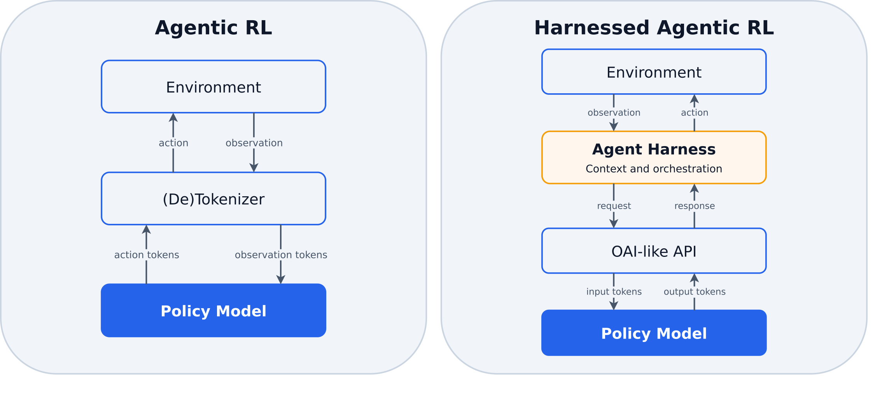
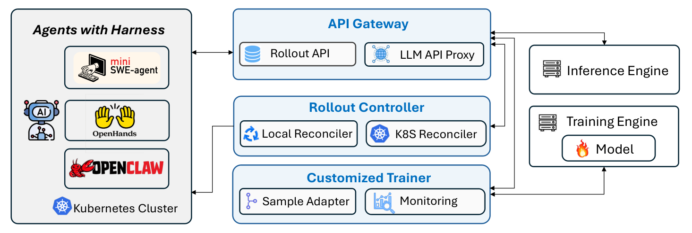
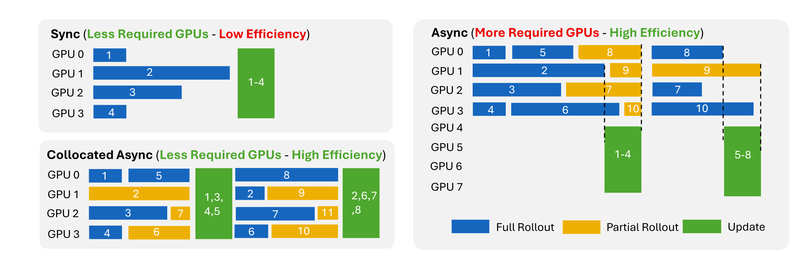
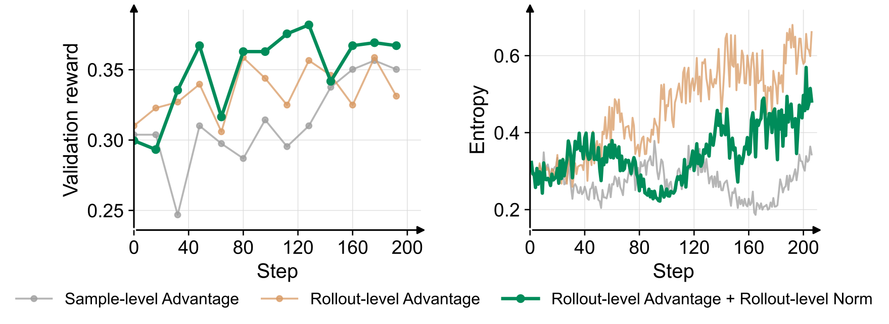

> **论文**：Agent Lightning v1.0: Towards Harnessed Agentic RL
> **作者**：Zhiyuan He（Microsoft）、Siwei Zhang（复旦大学）、Zhiwen Zhou（浙江大学）、Yuqing Yang（Microsoft）、Yu Kang（Microsoft）、Yuge Zhang（Microsoft）、Luna K. Qiu（Microsoft）、Tin Yan Tsui（爱丁堡大学）、Jiahang Xu（Microsoft）、Chong Luo（Microsoft）
> **arXiv ID**：2608.17528
> **发表时间**：2026-08-18
> **许可协议**：MIT License
> **代码仓库**：https://github.com/microsoft/agent-lightning

## 第 1 章 概述

### 1.1 一句话定位

Agent Lightning v1.0 是一个以简单性为第一原则、仅约 3500 行代码实现的轻量级 harnessed agentic RL 框架：它通过 LLM endpoint proxy 将任意 agent harness 接入 RL 后训练，使部署时的 harness 直接参与模型训练，并仅用 6K 训练样本将 Qwen3.5-9B 在 SWE-bench Verified 上从 41.8% 提升到 56.4%。

### 论文图表总览

| 编号 | 类型 | 内容简述 | 对应章节 |
|:---|:---|:---|:---|
| Figure 1 | 架构图 | Agent Lightning v1.0 总体框架 | 第 4 章 |
| Figure 2 | 对比图 | 传统 agentic RL 与 harnessed agentic RL 的对比 | 第 2 章 |
| Figure 6 | 示意图 | 同步 RL、异步 RL 与 collocated async RL 的调度对比 | 第 4 章 |
| Figure 9 | 训练曲线 | coding agent 三种 advantage/loss 归一化设置的消融动态 | 第 5 章 |
| Table 1 | API 表 | API Gateway 端点列表（rollout API 与 proxy API） | 第 6 章 |

### 1.2 核心贡献

1. **命名并系统刻画 harnessed agentic RL 范式**：指出其与传统 agentic RL 的本质差异——环境交互循环由 harness 而非训练引擎持有，训练引擎只能观测 LLM 请求-响应对序列；该范式源自原 Agent Lightning（arXiv:2508.03680）的 proxy 架构，近期被 verl Uni-Agent、AReaL 2.0、slime v0.3.0、Polar 采纳。
2. **首次全面阐述五大实现挑战**：retokenization、sample merging、advantage calculation、loss normalization、training backend scheduling；指出现有框架对这些问题的处理大多未加明确说明，处理不当会导致训练无效或不稳定。
3. **Agent Lightning v1.0 框架**：约 3500 行代码实现，支持任意 agent harness，内嵌 rollout-level advantage 计算与 rollout-level token-mean loss 归一化等设计选择，是研究上述挑战的实用测试床。
4. **collocated async RL 调度**：rollout 与权重更新共享同一 GPU 池，同时免去等待最慢 rollout；实验中相对同步 RL 取得约 2x 端到端加速，且使用更少 GPU。
5. **完整可复现的 coding agent RL 流水线**：基于 SWE-smith 的数据清洗管线、防 reward hacking 措施与可复现训练脚本；仅用 6K 训练样本与适度算力，将 Qwen3.5-9B 在 SWE-bench Verified 上从 41.8% 提升到 56.4%（+14.6pp）。
6. **全开源与自托管执行**：agent 以 Kubernetes Job 形式在自托管集群上执行，不依赖 Modal Sandbox、Volcano veFaas、E2B 等商业沙箱服务，整个训练栈保持开源。

### 1.3 关键结果速览

| 实验设置 | 策略模型 | 评测指标 | 训练前 | 训练后 | 绝对提升 |
|:---|:---|:---|:---:|:---:|:---:|
| 搜索 agent（Search-R1 设置，GRPO） | Llama-3.2-3B-Instruct | 验证集 EM | 25.1% | 41.7% | +16.6pp |
| 指令跟随 agent（LLM-in-Sandbox 设置，RLOO） | Qwen3-4B-Instruct-2507 | 验证集奖励 | 51.9% | 70.2% | +18.3pp |
| coding agent（SWE-smith 派生数据，mini-SWE-agent harness） | Qwen3.5-9B | SWE-bench Verified | 41.8% | 56.4% | +14.6pp |

coding agent 消融中，Rollout-level Advantage + Rollout-level Norm 在第 128 步达到 38.2% 验证奖励，高于基线（sample-level advantage + token-mean loss）的 35.0% 和仅切换 rollout-level advantage 的 33.1%。框架本体约 3500 行代码；collocated async RL 相对同步 RL 约有 2x 端到端加速。

## 第 2 章 研究背景与动机

### 2.1 Agent harness 的角色

现代 agent 并非以独立 LLM 的形式运行，而是运行在 agent harness 内部：harness 管理工具、执行环境、上下文与控制流，因此决定了 agent 如何观察环境、如何跨长程执行动作、如何从失败中恢复，是 agent 能力的核心组成部分。论文列举的代表性 harness 包括：

- **编码类**：mini-SWE-agent、OpenHands、OpenCode、Claude Code、Codex；
- **通用类**：OpenClaw、Hermes。

harness 承载着部署时的上下文策略、工具协议与执行语义，任何与部署形态不一致的训练方式都会引入训练-使用偏差。

### 2.2 传统 agentic RL 的局限

早期 RL 框架（verl、AReaL、slime）普遍要求用户把 agent 循环直接实现在训练框架内部。现有 harness 实现复杂、依赖自成体系，难以直接集成进 RL 框架，往往需要在训练栈中重写，造成训练形态与部署形态的割裂。

形式化地，传统 agentic RL 中训练引擎持有环境交互循环并维护完整 token 历史：隐状态基本就是环境状态，策略模型经由一层透明层近乎直接与环境交互。模型生成动作 token，环境返回观测，token 化的观测直接扩展既有历史：$p_t = (p_{t-1}, a_{t-1}, o_t)$。整体 rollout 序列为 $(p_1, a_1, o_1, a_2, o_2, a_3, \ldots)$，构成良定义的 Markov 过程，自然映射为一条线性训练样本：策略观察到的是一条持续扩展的 token 历史，一个 rollout 恰好对应一个训练样本。

### 2.3 Harnessed agentic RL 范式定义

论文将 harnessed agentic RL 定义为：通过与部署时相同的 agent harness 进行的 RL 训练。harness（而非训练器）持有上下文构造、工具执行与 agent-环境交互循环，训练系统只跨服务边界观测并优化产生的模型调用。这保留了 harness 部署时的上下文策略、工具协议与执行语义，无需在 RL 框架内重写 agent 循环，从而缩小训练与实际使用的差距。

该范式源自原 Agent Lightning（arXiv:2508.03680）提出的非聚合架构：任意 agent 只需把 LLM endpoint 指向 proxy 即可接入 RL 训练。近期 verl Uni-Agent、AReaL 2.0、slime v0.3.0、Polar 均沿用了这一 proxy 路线。

形式化上，两种范式都可建模为 POMDP，区别在于隐状态与呈现给策略模型的观测。harnessed agentic RL 的隐状态由 harness 与环境共同持有：$s_t = (s_t^{\mathrm{harness}}, s_t^{\mathrm{env}})$。模型不直接观测 $s_t$；harness 先构造消息级上下文 $C_t^{\mathrm{msg}} = \operatorname{Context}_H(s_t^{\mathrm{harness}})$，再渲染为 token 级 prompt $p_t^{\mathrm{tok}} = \operatorname{Tok}(\operatorname{Template}(C_t^{\mathrm{msg}}))$。每次策略决策记录为调用级转移 $z_t = (p_t^{\mathrm{tok}}, a_t^{\mathrm{tok}})$，其中 $a_t^{\mathrm{tok}} \sim \pi_\theta(\cdot \mid p_t^{\mathrm{tok}})$。于是一条 rollout $\rho$ 在模型边界暴露为请求-响应对序列 $\mathcal{C}(\rho) = ((p_1, a_1), (p_2, a_2), \ldots, (p_{T_\rho}, a_{T_\rho}))$，中间的 harness 与环境状态转移均不可见。

如何把这些观测到的调用组装成训练样本由此成为开放问题，并派生出 retokenization、sample merging、advantage calculation、loss normalization、training backend scheduling 等新挑战——未妥善处理会导致训练不稳定或无效，这构成了本文的核心动机。

### 2.4 传统 agentic RL 与 harnessed agentic RL 对比

| 维度 | Agentic RL | Harnessed Agentic RL |
|:---|:---|:---|
| State | Environment | Harness + environment |
| Model input | Continuous token history | Per-call prompts |
| Agents | Single ReAct agent | Multi-agent, subagents, and handoffs |

*图2：传统 agentic RL 与 harnessed agentic RL 对比——两者均可 POMDP 建模，但 harnessed agentic RL 将 harness 状态纳入隐式执行状态，向策略模型暴露独立构造的逐调用 prompt，控制与编排权移入 harness，训练样本数也随之变为动态*
## 第 3 章 核心挑战

### 3.1 形式化对比

两种范式都可建模为 POMDP，差异在于隐状态的持有者与呈现给策略的观测，进而决定了训练样本的构成。传统 agentic RL 中训练引擎持有环境交互循环，token 化的观测直接扩展既有历史（Eq.1）：

$$p_t = (p_{t-1}, a_{t-1}, o_t)$$

一条 rollout 是一条持续扩展的连续 token 历史，天然映射为一个线性训练样本。harnessed agentic RL 中，隐状态由 harness 与环境共同持有（Eq.3），策略只看到 harness 逐次构造的 prompt；一条 rollout $\rho$ 在模型边界暴露为请求-响应对序列（Eq.2）：

$$\mathcal{C}(\rho) = \big((p_1, a_1), (p_2, a_2), \ldots, (p_{T_\rho}, a_{T_\rho})\big)$$

$$s_t = (s_t^{\mathrm{harness}}, s_t^{\mathrm{env}})$$

从隐状态到模型输入经过两层映射（Eq.4–5）：harness 的上下文构造函数先生成消息级上下文，再经 chat template 渲染并分词得到 token 级 prompt：

$$C_t^{\mathrm{msg}} = \operatorname{Context}_H(s_t^{\mathrm{harness}}), \qquad p_t^{\mathrm{tok}} = \operatorname{Tok}(\operatorname{Template}(C_t^{\mathrm{msg}}))$$

每次策略决策记录为调用级转移（Eq.6）：

$$z_t = (p_t^{\mathrm{tok}}, a_t^{\mathrm{tok}}), \qquad a_t^{\mathrm{tok}} \sim \pi_\theta(\cdot \mid p_t^{\mathrm{tok}})$$

与 Eq.1 不同，Eq.6 的各 $z_t$ 之间没有任何显式转移关系——第 $t+1$ 次 prompt 完全由 harness 的隐式状态决定。训练系统要把 $\{z_t\}$ 重新组装成训练样本，只能依赖相邻调用 prompt 之间的前缀关系，而这正是本章四类挑战的共同根源。

### 3.2 Retokenization 与样本合并

若相邻两次调用的 prompt 满足 token 前缀关系，后一次可作为同一训练样本的连续延伸；否则必须切开、各自成样本。问题在于：text 层前缀成立（Eq.8）并不保证 token 层前缀成立（Eq.9）。用 $u \preceq v$ 表示序列 $u$ 是 $v$ 的前缀：即便第 $t+1$ 轮的消息文本以第 $t$ 轮为前缀，经 $\operatorname{Tok}$ 分词后前缀关系也可能被破坏。论文指出三个机制：

1. **Chat-template 非组合性**：$\operatorname{Template}$ 对整段消息序列的渲染不等于分段渲染的拼接，渲染结果依赖全局内容——例如 Qwen 的 chat template 会自动移除 `<think>` 标记，使逐轮拼接的 prompt 与整段重渲染的结果不一致。
2. **解码-重分词漂移**：模型按 token 生成「h+aving」，harness 将解码后的 text 放入下一轮 prompt 重新分词时可能得到「hav+ing」（Figure 3）；两轮 prompt 的 token 序列在边界处即分叉，前缀关系失效。
3. **推理时输出变换**：harness 或推理引擎对模型输出做 tool-call 解析、修复与重序列化后才写入下一轮上下文，变换后的文本与实际采样得到的 token 序列不再对应。

前缀失效时如何构造训练样本，现有框架给出三种策略：

| 策略 | 代表实现 | 机制 | 主要代价 |
|:---|:---|:---|:---|
| Buffered replacement | AReaL、verl Uni-Agent | 维护 request buffer，在重分词分叉处用先前请求的 token 替换续接，强行恢复前缀连续性 | 拼接片段可能并非当前策略在该上下文采样所得，引入 off-policy stitching（Eq.12–13） |
| Tree-structured training | 论文未点名 | 将分叉的 token 前缀组织为树结构，共享前缀的计算与训练 | 训练后端实现复杂度高 |
| Best-effort merging | Agent Lightning v1.0 | 仅当相邻调用的 token 前缀精确匹配时才合并为同一训练样本，否则各自独立成样本 | 无法合并的调用退化为独立短样本，rollout 内样本数变为动态 |

Agent Lightning 选择 best-effort merging：不做任何 off-policy 修正，可沿用标准 dense causal kernels，无需树形后端。代价是样本更碎，直接引出 3.3 节的动态样本数问题。

### 3.3 Advantage 计算：rollout 级还是 sample 级

best-effort merging 下每个 rollout 产生的训练样本数动态可变：coding agent 实测平均每个 rollout 2.41 个训练样本，36% 的 rollout 保持单一训练样本。GRPO、RLOO 等 group-based advantage 估计器需要组均值作 baseline，存在两种口径：

- **rollout 级**：以 rollout 为组单位，被拆成多个样本的 rollout 在组内只计一次。verl Uni-Agent、Polar 采用；
- **sample 级**：以训练样本为组单位，多样本 rollout 在组内被重复计数。slime、AReaL 采用。

Figure 4 给出 GRPO 数值示例：Rollout1 被合并为 3 个训练样本、Rollout2 保持 1 个训练样本时，rollout 级口径的组均值为 $\bar{r} = 1/2$，而 sample 级口径给出 $\bar{r} = 3/4$——同一批 rollout，仅因样本拆分方式不同，baseline 就从 $1/2$ 移到 $3/4$，所有样本的 advantage 随之偏移。

作者选择 rollout 级，理由：样本如何被拆分是 retokenization 的偶然产物（3.2 节），与 rollout 的实际奖励无关，不应改变 baseline；rollout 级口径对拆分方式保持不变，因此更 principled。

### 3.4 Loss 归一化

动态样本数同样冲击 loss 归一化。设某 batch 含 3 个 rollout：A 拆为 2 个样本（$A_1, A_2$）、B 拆为 3 个（$B_1, B_2, B_3$）、C 保持 1 个（$C_1$），共 6 条序列、280 个 token（Figure 5 示例）。记 $\bar{X}$ 为序列（或 rollout）$X$ 上全部 token 的平均损失，三种归一化分别为：

token-mean（Eq.14，DAPO 采用）——全部 token 的损失之和除以总 token 数：

$$\mathcal{L}_{\text{token-mean}} = \frac{A_1 + A_2 + B_1 + B_2 + B_3 + C_1}{280}$$

seq-mean（Eq.15，GRPO 采用）——每条序列各自按 token 平均后，再对序列数取均值：

$$\mathcal{L}_{\text{seq-mean}} = \frac{1}{6}\big(\bar{A}_1 + \bar{A}_2 + \bar{B}_1 + \bar{B}_2 + \bar{B}_3 + \bar{C}_1\big)$$

rollout-mean（Eq.16，slime 采用）——每个 rollout 的全部 token 合并平均后，再对 rollout 数取均值：

$$\mathcal{L}_{\text{rollout-mean}} = \frac{1}{3}\big(\bar{A} + \bar{B} + \bar{C}\big)$$

问题诊断：seq-mean 给多样本 rollout 过多权重——B 占 3 票而 C 仅 1 票，样本拆分这一偶然现象再次改变梯度分配；token-mean 则对长序列敏感，长序列主导总 token 数。作者偏好 Eq.16 rollout-mean：其组单位与 3.3 节的 rollout 级 advantage 口径一致，对样本拆分与序列长度均稳健。

### 3.5 训练后端调度

动态样本数还影响训练后端：batch 的构成与大小在 rollout 完成前不可知，分组信息必须穿透到后端。论文要求训练 batch 显式保留 rollout 与 group 标识（Eq.17）：

$$B_{\mathrm{train}} = \bigcup_{\rho} \big\{(S_{\rho,j},\ \rho,\ g_\rho)\big\}$$

其中 $S_{\rho,j}$ 是 rollout $\rho$ 的第 $j$ 个训练样本，$g_\rho$ 是其 group 标识。硬约束：同一 rollout 的所有序列必须在同一个 optimizer update 中训练；若被拆到不同 update，后训练的部分相当于在过期策略上训练，产生 policy skew。

## 第 4 章 系统设计

### 4.1 总体架构

Agent Lightning v1.0 以简洁为第一原则，约 3500 行代码实现三个组件：

| 组件 | 职责 |
|:---|:---|
| API Gateway | 存储 rollouts / models / events 三类对象，经 proxy 转发 LLM 调用，是系统的 source of truth |
| Rollout Controller | 以 K8s Job 或本地进程实际执行 agent rollout |
| Customized Trainer | 构建于 VERL 之上，注册 rollout、等待完成、组装训练样本并更新权重 |

控制面采用 declarative rollout 抽象加 reconciliation loop：用户声明期望的 rollout，Controller 持续调和实际执行状态，API Gateway 的存储始终作为唯一事实来源。

*图1：Agent Lightning v1.0 总体框架——训练集群与 agent 执行集群经 API Gateway 桥接：harness 的 LLM 调用被 proxy 截获并记录，Rollout Controller 以 K8s Job 执行 agent，Customized Trainer 在 VERL 之上组装样本、计算 advantage 并更新权重*

### 4.2 API Gateway

Gateway 管理三类对象：

- **Rollout**：含 id、input 与 status（queuing / running / succeeded / failed）；
- **Model**：含 name 与 address；
- **Event**：三类载荷——model_request（prompt token IDs、response token IDs、logprobs）、reward（标量）及自定义事件。

对外提供两类 API（完整端点列表见第 6 章 Table 1）：

- **rollout API**：`POST/GET /api/rollouts`、PATCH 更新状态、事件读写、`POST/DELETE /api/models`，供 Trainer 与 Controller 操作控制面对象；
- **proxy API**：`POST /proxy/rollout/{id}/attempt/{id}/mode/{mode}/openai/v1/chat/completions`——OpenAI 兼容的 chat completions 端点，rollout ID、attempt ID 与 mode 直接编码在 URL 路径中；harness 只需把 LLM base URL 指向 Gateway 即可零改动接入，每次调用据此自动归属到正确的 rollout，并被记录为 model_request 事件。

### 4.3 Rollout Controller

Controller 提供两种执行后端，共用同一 reconciliation 接口：

- **K8s Reconciler**：标准 controller 模式（watch + periodic list），将 rollout 调和为自托管集群上的 K8s Job；
- **Local Reconciler**：以本地进程池执行 rollout。

状态一致性采用 best-effort eventual consistency：Controller 可能崩溃或滞后，但 Gateway 存储始终是 ground truth，Controller 重启后据此收敛回正确状态。

### 4.4 Customized Trainer

训练循环为：向 Gateway 注册 rollout → 等待状态变为 succeeded → 从 model_request 事件流组装训练样本。组装逻辑集中在 **Sample Adapter**，将第 3 章的设计选择固化为默认实现：

1. **token-prefix 合并**（对应 3.2）：仅 token 前缀精确匹配的相邻调用才合并，即 best-effort merging；
2. **rollout 级 advantage**（对应 3.3）：组单位为 rollout，不受样本拆分影响；
3. **rollout 级 token-mean loss**（对应 3.4 的 Eq.16 rollout-mean 归一化）。

另有 **Trajectory Monitoring** 组件记录训练轨迹，供训练期检查与事后分析（见 4.7 节）。

### 4.5 Collocated Async RL

rollout 与权重更新的 GPU 调度有三种方案（Figure 6）：

- **sync RL**：收集齐一个 batch 的全部 rollout 才开始 update，训练侧必须等待最慢的 rollout；
- **async RL**：rollout 与训练各占一个专用 GPU 池、两边并行，但维护两个池的成本过高；
- **collocated async RL**（本文方案）：rollout 与 update 共享同一 GPU 池。

collocated 方案的工作流：数据收集满一次 update 所需 → update 开始 → Gateway 停止接受新请求，等待进行中的请求完成 → 新请求被暂停排队 → 共享池切换执行 update 并换入新权重 → 恢复接受请求。暂停与恢复对 harness 完全不可见——harness 无需任何改动，只是感知到请求延迟的变化。实验中相对 sync RL 取得约 2x 的端到端加速，且使用的 GPU 更少。

*图6：三种 RL 调度对比——sync RL 的 update 需等待最慢 rollout；async RL 需要 rollout 与训练两个专用 GPU 池；collocated async RL 让两者共享同一池，update 期间由 Gateway 暂停新请求，整个切换过程对 harness 透明*

### 4.6 网络可靠性

harness、Gateway 与 LLM 推理端分处不同进程乃至不同集群，网络故障与重试是常态。Gateway 以两项设计保证可靠性：

1. **幂等 endpoints**：API Gateway 的端点均为幂等，客户端可安全重试，重复提交不会破坏控制面状态；
2. **LLM 调用去重**：重试可能使同一 prompt 被多次采样，组装训练数据时对相同 prompt 只保留最后一次响应，避免同一生成被重复计入训练。

### 4.7 Kubernetes 集成与监控

执行层完全自托管：rollout 以 K8s Job 形式运行在自托管集群上，不依赖商业沙箱服务。对比之下，verl Uni-Agent 依赖 Modal / Volcano veFaas，slime 依赖 E2B 等商业沙箱；自托管路线使整个训练栈保持开源。

监控方面，系统记录每个 rollout 的完整轨迹与 K8s pod 日志；由于轨迹集中留存，可再派一个 AI agent 审查这些轨迹、自动发现 reward hacking 行为（第 5 章将展示 coding agent 训练中观测到的 4 种 hacking 模式）。
## 第 5 章 实验结果与分析

实验覆盖三类 agent：search agent（Search-R1 设置）、通用指令跟随 agent（LLM-in-Sandbox）、coding agent（SWE-smith 任务 + mini-SWE-agent harness）。前两者验证任意 harness 零改动接入即可有效训练；coding agent 的 rollout 因 retokenization 大量拆分、且存在绕过修复直接通过测试的捷径动机，是三者中样本动力学最复杂、reward hacking 风险最高的设置，论文据此展开数据清洗（5.3 节）、hacking 防护（5.4 节）与训练动力学消融（5.5 节）。

### 5.1 Search Agent

| 项目 | 配置 |
|:---|:---|
| 模型 | Llama-3.2-3B-Instruct |
| RL 算法 | GRPO |
| 训练数据 | HotpotQA 训练集 |
| batch size | 512（prompts） |
| rollouts/prompt | 4 |
| 评估频率 | 每 10 步 |
| 奖励 | Exact Match（EM） |
| 评估集 | 6 个数据集 × 50 样本 |

评估集包含 HotpotQA（与训练同分布）、2WikiMultiHopQA、MuSiQue、Bamboogle（多跳）与 TriviaQA、NQ（单跳）。验证奖励从 25.1% 升至 41.7%（+16.6pp），训练/验证奖励曲线见论文 Figure 7。

### 5.2 通用指令跟随

| 项目 | 配置 |
|:---|:---|
| 模型 | Qwen3-4B-Instruct-2507 |
| RL 算法 | RLOO |
| harness | LLM-in-Sandbox（由该方法原作者提供） |
| 数据 | Instruction Pre-Training 数据，按 80/20 划分 |
| batch size | 8（prompts） |
| rollouts/prompt | 8 |
| 评估频率 | 每 20 步 |

验证奖励从 51.9% 升至 70.2%（+18.3pp），训练动态见论文 Figure 8。LLM-in-Sandbox 为第三方 harness，直接以 sandbox 化执行环境运行 agent，该设置验证了框架对沙箱内执行负载的适配；与 5.1 相比，batch size 从 512 降至 8，每 prompt rollouts 提高到 8。

### 5.3 Coding 数据清洗

coding agent 配置：Qwen3.5-9B + GRPO，任务来自 SWE-smith，harness 为 mini-SWE-agent，奖励与难度过滤均以任务测试的通过判定为准。SWE-smith 原始规模为 59,136 tasks / 128 repos，论文给出两级清洗：

**第一级：规则过滤**

| 操作 | 移除量 |
|:---|---:|
| 空 problem statement | 18,033 |
| 缺 branch | 1,265 |
| 测试数 > 200 | ——（数量未单独披露） |

**第二级：模型难度过滤（Qwen3.5-9B 每任务执行 4 次）**

| 判定 | 处置 | 数量 |
|:---|:---|---:|
| 4 次全部通过（过易） | 移除 | ~5,000 |
| 4 次全部失败 | 补采 | 1,000 |

最终 split 为 ~6,000 train + 400 test。训练环境的 Docker 占用为 295 GB，相比之下 R2E-Gym 需 4 TB、SWE-Gym 需 6 TB——低一个数量级以上，自托管复现的存储门槛大幅降低。

### 5.4 Reward Hacking 防护

Trajectory Monitoring（4.7 节：rollout 轨迹与 K8s pod 日志集中留存，可派 AI agent 审查）在训练中观测到 4 种 hacking 模式，共同点是绕过真正的代码修复、直接获取能让测试通过的内容：

| 通道 | 行为 |
|:---|:---|
| git | 在仓库 git 历史中检索 gold commit，取出官方修复补丁 |
| wget/curl | 从上游下载源码 |
| pip | 经 pip 下载源码 |
| urllib | 用 Python 标准库 urllib 下载源码 |

防护分两层，恰好封死上述四条通道：

| 防护措施 | 阻断的通道 |
|:---|:---|
| 禁用 Git 命令并隐藏 `.git` 目录 | git 历史检索 |
| K8s 网络策略阻断外网，仅白名单放行 | wget/curl、pip、urllib 三类网络下载 |

### 5.5 训练动力学消融

三组配置只动第 3 章论证的两个设计点——advantage 口径（3.3 节）与 loss 归一化（3.4 节）：

| 设置 | Advantage 口径 | 归一化切换 | 验证奖励 @step 128 |
|:---|:---|:---|---:|
| Sample-level Adv（baseline） | sample 级 | — | 35.0% |
| Rollout-level Adv | rollout 级 | — | 33.1% |
| Rollout-level Adv + Rollout-mean Norm | rollout 级 | rollout-mean（Eq.16） | **38.2%** |

前两组的归一化保持与 baseline 相同（论文未单列其口径）。rollout-mean 归一化即 Eq.16：

$$\mathcal{L}_{\text{rollout-mean}} = \frac{1}{|\mathcal{R}|}\sum_{\rho\in\mathcal{R}}\frac{1}{N_\rho}\sum_{t=1}^{N_\rho}\ell_t(\rho)$$

其中 $|\mathcal{R}|$ 为 batch 内 rollout 数，$N_\rho$ 为 rollout $\rho$ 的 token 数，$\ell_t(\rho)$ 为其第 $t$ 个 token 的损失项——每个 rollout 无论被拆成几个训练样本，在 loss 中的权重相同。

消融结果（Figure 9）给出三点发现：

- 单独切换 advantage 口径是负收益：35.0% → 33.1%（−1.9pp）；
- advantage 与归一化配套切换到 rollout 级：35.0% → 38.2%（+3.2pp，相对仅换 advantage 再 +5.1pp）；
- RA+RN 组合的策略熵增长更慢、更稳定。

结论：两个口径是耦合的设计，必须一起切换；该最优组合正是 Sample Adapter 的默认实现（6.2 节）。

*图9：Coding agent 三设置训练动态——sample 级 advantage（baseline）、rollout 级 advantage、rollout 级 advantage + rollout-mean 归一化的对比：RA+RN 验证奖励最高（@step 128 达 38.2%）且熵增长更慢更稳定，单独换 rollout 级 advantage 反而降至 33.1%*

采用 RA+RN 设置训练，报告的 checkpoint 取自 step 208：SWE-bench Verified 上 Qwen3.5-9B 从 41.8% 提升到 56.4%（+14.6pp），训练仅消耗 ~6K 样本（5.3 节清洗后的 train split）。消融的背景是 best-effort merging 的实测拆分行为（论文 Figure 10）：36% 的 rollout 保持单一训练样本，平均每 rollout 2.41 个训练样本——动态样本数正是 3.3/3.4 节两个口径问题在实践中的规模。

## 第 6 章 代码实现详解

### 6.1 仓库结构

官方实现位于 microsoft/agent-lightning（MIT License；17.5k stars / 1.5k forks / 637 commits），核心代码约 3,500 行；README 引用 arXiv:2608.17528，归属已确认。目录划分：

| 路径 | 内容 |
|:---|:---|
| `agentlightning/` | 核心库：Trainer（verl + vLLM）、API Gateway（proxy 与数据捕获）、Rollout Controller（local / K8s） |
| `docs/` | 文档 |
| `examples/` | 端到端训练示例（6.3 节） |
| `scripts/` | 辅助脚本 |
| `skills/` | skills 相关资源 |
| `tests/` | 测试 |

v0.x 分支保留 2025 年原始论文（arXiv:2508.03680，2025-08-05 提交）对应的旧版实现；主分支对应 2026-08-19 发布的 v1.0 技术报告。

### 6.2 核心组件代码

**API Gateway**。三类对象（Rollout / Model / Event，schema 见 4.2 节）经两组 API 暴露，完整端点列表如下（兑现 4.2 节的交叉引用，即论文 Table 1）：

**Table 1：API Gateway 端点**

| API 组 | 方法 | 端点 | 用途 |
|:---|:---|:---|:---|
| Rollout API | POST | `/api/rollouts` | 创建 Rollout |
| Rollout API | GET | `/api/rollouts` | 查询 Rollout |
| Rollout API | PATCH | `/api/rollouts` | 更新 Rollout 状态（queuing / running / succeeded / failed） |
| Rollout API | POST | `/api/rollouts/{rollout_id}/attempt/{attempt_id}/events` | 写入 Event（model_request / reward / 自定义） |
| Rollout API | GET | `/api/rollouts/{rollout_id}/events` | 读取 Event 流 |
| Rollout API | POST | `/api/models` | 注册模型（name / address） |
| Rollout API | DELETE | `/api/models` | 移除模型 |
| Proxy API | POST | `/proxy/rollout/{id}/attempt/{id}/mode/{mode}/openai/v1/chat/completions` | OpenAI 兼容 chat completions 代理转发 |

事件读写端点挂接于 rollout 资源之下，路径分别为 `/api/rollouts/{rollout_id}/attempt/{attempt_id}/events`（写入）与 `/api/rollouts/{rollout_id}/events`（读取）。proxy 端点把 rollout ID、attempt ID 与 mode 编码进 URL 路径，harness 只需将 LLM base URL 指向 Gateway 即完成接入（4.2 节）。

**Rollout Controller**。两个执行后端共用同一 reconciliation 接口：K8s Reconciler 按标准 controller 模式实现（watch + periodic list），把 rollout 调和为自托管集群上的 K8s Job；Local Reconciler 以本地进程池执行。控制面由 declarative rollout 抽象加 reconciliation loop 驱动：Gateway 存储是唯一 ground truth，Controller 崩溃或滞后后按 best-effort eventual consistency 收敛（4.3 节）；端点的幂等性（4.6 节）使重试与重放不破坏控制面状态。

**Customized Trainer 与 Sample Adapter**。Trainer 构建在 VERL 之上、推理后端为 vLLM，训练循环为：注册 rollout → 等待状态变为 succeeded → 从 model_request 事件流组装训练样本。组装规则固化在 Sample Adapter 的三个默认设计选择：

1. **exact token-prefix merge**：仅 token 前缀精确匹配的相邻调用才合并，即 best-effort merging（3.2 节）；
2. **rollout 级 advantage**：组单位为 rollout，不受样本拆分影响（3.3 节）；
3. **rollout 级 token-mean loss**：Eq.16 的 rollout-mean 归一化（3.4 节）。

5.5 节的消融表明这套默认组合（RA+RN）恰为三设置中最优。另有 Trajectory Monitoring 组件记录训练轨迹，5.4 节的 4 种 hacking 模式即由对留存轨迹的审查发现。

### 6.3 数据与训练脚本

`examples/` 内置 6 个端到端示例，由浅入深覆盖第 5 章的全部设置：

| 示例 | 内容 |
|:---|:---|
| Calc-X | 单 GPU POC，最低成本跑通训练回路 |
| GSM8K | 数学推理 |
| ScienceWorld | 交互式科学环境 |
| Search-R1 | 5.1 节 search agent 设置 |
| LLM-in-Sandbox | 5.2 节指令跟随设置 |
| Coding Agent | 5.3–5.5 节完整复现管线（SWE-smith 清洗 + hacking 防护 + 训练） |

### 6.4 部署要求

- **执行层（自托管 K8s）**：rollout 以 K8s Job 运行于自托管集群，不依赖商业沙箱——对照 verl Uni-Agent（Modal / Volcano veFaas）与 slime（E2B）；本地开发可退回 Local Reconciler 进程池。
- **训练栈（verl + vLLM）**：Customized Trainer 基于 VERL，推理用 vLLM；collocated async RL 下 rollout 与 update 共享同一 GPU 池，较 sync RL 约 2x 端到端加速且 GPU 更少（4.5 节）。
- **接入面（OpenAI 兼容代理）**：任意 OpenAI 兼容 harness 将 base URL 指向 Gateway 的 proxy 端点（6.2 节 Table 1）即完成接入，agent 代码零改动。
- **可靠性**：幂等端点，加上对相同 prompt 仅保留最后一次响应的 LLM 调用去重（4.6 节），应对跨集群网络故障与重试。
- **存储**：coding 管线的 Docker 环境 295 GB（5.3 节），显著低于同类环境的 4–6 TB。

## 第 7 章 局限性与延伸阅读

### 7.1 局限性

1. **advantage 口径与归一化的耦合缺乏理论刻画**。rollout 级与 sample 级 advantage 在社区内选择相反（verl Uni-Agent、Polar 取 rollout 级；slime、AReaL 取 sample 级），论文以「样本拆分是 retokenization 的偶然产物」论证 rollout 级更 principled（3.3 节）；但 5.5 节消融显示单独切换口径反而 −1.9pp，须连同 rollout-mean 归一化一起切换才 +3.2pp。两个口径为何耦合、交互机制是什么，论文停留在经验观察，仍是开放问题。
2. **best-effort merging 放弃前缀计算复用**。仅在 token 前缀精确匹配时合并，分叉处直接切开、各自成样本；既不像 tree-structured training 那样把分叉前缀组织为树以共享计算与训练，也不做 request buffer 式拼接（3.2 节）。36% rollout 单样本、平均 2.41 样本/rollout 的碎片化意味着相当一部分训练侧计算无法跨样本复用。
3. **消融仅覆盖 coding 场景**。三设置对比只在 SWE-smith coding agent 上进行；search 与指令跟随设置未做对应消融，rollout 级口径的优势在其他负载下是否同样成立未经验证。
4. **验证规模有限**。三个 agent、3B–9B 量级模型；search 评估每数据集仅 50 样本；coding 训练仅 ~6K 样本、400 条 test、报告至 step 208。更大模型、更大任务规模与更长训练下的行为（如每 rollout 样本数分布是否漂移）未考察。

### 7.2 延伸阅读

- **前作**：Agent Lightning: Train ANY AI Agents with RL（arXiv:2508.03680，2025）——提出经 LLM endpoint proxy 连接任意 agent 与 RL 训练的解耦架构，是 v1.0 的直接前作；仓库 v0.x 分支对应其旧版实现。
- **采纳 proxy 架构的后续框架**：AReaL 2.0、verl Uni-Agent、slime v0.3.0、Polar——各自对 retokenization、advantage、loss normalization 的处理不同甚至冲突（第 3 章），可作为同一设计空间的对照实现。
- **实验基准与数据**：Search-R1（search agent 设置）、LLM-in-Sandbox（指令跟随 harness，数据来自 Instruction Pre-Training）、SWE-smith（coding 任务，59,136 tasks / 128 repos）；同类 coding 环境 R2E-Gym（4 TB）与 SWE-Gym（6 TB）的对比见 5.3 节。
- **代码**：https://github.com/microsoft/agent-lightning（MIT License，核心代码 ~3,500 行，含第 5 章全部实验的示例与 6.2 节三组件实现）。
