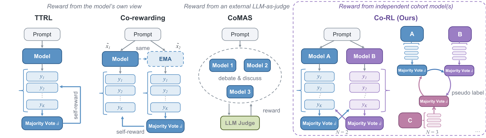
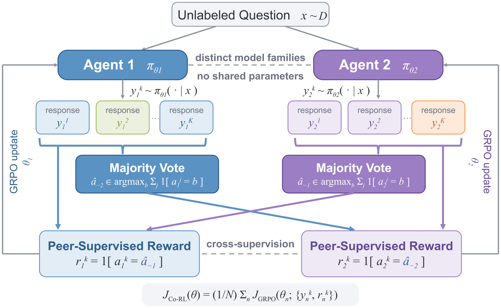
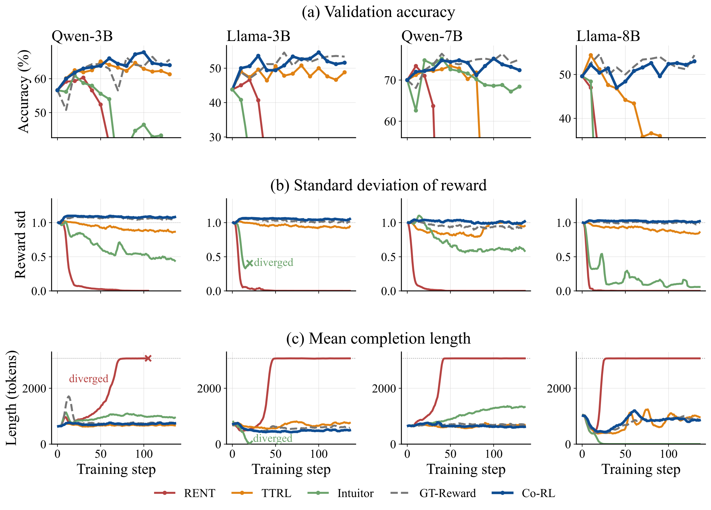

> **论文**：Co-RL: Unsupervised Reasoning Emerges from Diverse Cohort in Multi-agent RL
> **作者**：Yunhao Yang, Yuexin Bian, Yunjie Tian, Di Fu, Tianjin Huang, Yuanyuan Shi, Ziang Xiao, Nuno Vasconcelos, Yijiang Li（UC San Diego 等）
> **arXiv ID**：2608.17253
> **发表时间**：2026-08-18
> **许可协议**：Apache-2.0
> **代码仓库**：https://github.com/DrStranded/Co-RL

## 第 1 章 概述

### 1.1 一句话定位

**无监督推理能力可以从一组独立训练、错误不相关的模型（diverse cohort）的相互监督中涌现。** Co-RL 将 N 个不共享参数的策略放进同一个 RL 循环：对每个无标注问题 x，各 agent 独立采样 K 个 completion 并抽取答案，以**指定 peer**（而非自己）的多数投票答案作为伪标签，以"答案是否与该伪标签一致"的二元信号作为奖励，同步执行 GRPO 优化。全程不使用 ground-truth 标签、外部 LLM judge 与学习型 reward model；每个 agent 同时充当学习者与监督源，机制对称、开销与 N 个独立单智能体 RL 相当。



*图 1：Co-RL 与先验 label-free RL 方法的奖励来源对比。TTRL、Co-rewarding 等自强化方法的监督信号取自单一模型自身（自一致性/自置信度），CoMAS 等多智能体方法依赖外部 judge 或 reward model；Co-RL 由两个独立模型互相提供多数投票伪标签，形成对称的交叉监督。*

### 论文图表总览

| 编号 | 内容 | 所在章节 |
|------|------|----------|
| Figure 1 | Co-RL 与先验 label-free RL 方法（自一致性信号、judge 机制 vs 交叉监督）对比 | 第 1 章 |
| Figure 2 | 7B 尺度两模型 agreement、伪标签准确率、评估性能与 RL 前错误重叠 | 第 5 章 |
| Figure 3 | 两 agent Co-RL 框架：各自采样 K 响应 → 多数投票伪标签 → 互相监督 | 第 3 章 |
| Figure 4 | 文本 4 尺度训练动态（MATH-500 验证准确率 / reward std / completion length） | 第 5 章 |
| Figure 5 | VLM 7B 训练动态（评估准确率 / completion 长度 / agreement 与伪标签准确率） | 第 5 章 |
| Table 1 | 3B 文本模型七基准全表（Qwen2.5-3B、Llama-3.2-3B-Instruct 两侧） | 第 5 章 |
| Table 2 | CoMAS benchmark 套件多智能体对比（MAPoRL / TTRL / CoMAS / Co-RL） | 第 5 章 |
| Table 3 | 三 agent 联合训练（Qwen2.5-3B + Llama-3.2-3B-Instruct + Qwen3-1.7B） | 第 5 章 |
| Table 4 | VLM 2B–3B 四基准（InternVL-3.5-2B、Qwen2.5-VL-3B × 两训练集） | 第 5 章 |

论文另有附录表 Table 5–7（预训练错误解耦四格指标）与 Table 10–11（训练预算控制），均在第 5 章分析中引用。

### 1.2 核心贡献

**① Co-RL 框架：多智能体 peer-reward 的无监督 RL。** 以循环 peer 伪标签 $\hat{a}_{-n}(x)$（agent n 由 agent n−1 监督，agent 1 由 agent N 监督）替代 ground-truth 奖励与自一致性奖励，二元奖励 + GRPO 同步优化 N 个策略；无标签、无 judge、无 learned reward model，框架轻量对称，每个 agent 同为学习者与监督源。

**② 多样性 cohort 的三维设计。** 策略解耦（独立参数与 optimizer state，仅通过 reward 耦合）、模型家族与规模（Qwen2.5 × Llama 3 × Gemma；VLM 侧 Qwen2.5-VL × InternVL3.5 × Gemma-3）、输入改写 data decoupling（DeepSeek-V3 改写 MATH 题目，一 agent 用原题、一 agent 用改写题）。并给出可量化的 cohort 选择依据：跨家族配对全部 κ ≤ 0.42 且互补性 c ≥ 29.4，同家族/同 seed 配对全部 κ ≥ 0.51 且 c ≤ 24.6，两者之间无中间带。

**③ 交叉监督优于自监督的理论刻画。** 将两 agent 训练动力学建模为耦合系统：Proposition 2 证明 self-rewarding 是自确认的（$\mathrm{sign}(G_K^{\mathrm{self}}(p))=\mathrm{sign}(p-1/2)$，强化当前偏好答案无论对错）；Theorem 1 证明 Co-RL 把正确收敛域从 $\{p_A>1/2,\ p_B>1/2\}$ 严格扩大到 $\{p_A+p_B>1\}$（$B_{\mathrm{self}}^+ \subsetneq B_{\mathrm{Co\text{-}RL}}^+$），分界线为 $p_A+p_B=1$，$(1/2,1/2)$ 为鞍点。

**④ 文本与多模态的双重验证。** LLM 七基准平均提升 3.0–8.6 个百分点，VLM 四基准平均提升 2.3–7.2 个百分点；相对每个模型上最强 self-rewarding 基线高 0.8–2.0 个百分点；CoMAS benchmark 套件平均领先 CoMAS 4.03 个百分点且只用一半 agent；预算控制实验排除"算力/ensemble"解释；随论文开源 llm/ + mllm/ 双栈训练代码。

### 1.3 关键结果速览

- **文本主结果（Table 1，七基准平均）**：Qwen2.5-3B 从 Base 40.7 升至 Co-RL Different family+ 49.3（+8.6 个百分点）；Llama-3.2-3B-Instruct 从 Base 38.7 升至 43.9（+5.2 个百分点）。论文口径：LLM 平均提升 3.0–8.6 个百分点。
- **对 self-rewarding 基线的优势**：相对各模型上最强 self-rewarding 基线高 0.8–2.0 个百分点（Qwen 侧 49.3 vs TTRL 47.3；Llama 侧 43.9 vs TTRL 43.1）。
- **对有监督参考的追赶**：Different family+ 在两个 3B 模型上均超过 GT-Reward 平均（49.3 vs 47.4；43.9 vs 43.0），实现 label-free 匹敌乃至超越有监督 GRPO。
- **三 agent 扩展（Table 3）**：Qwen2.5-3B +7.8、Llama-3.2-3B-Instruct +6.0、Qwen3-1.7B +8.2 个百分点，三个 agent 全部匹敌或超越 GT-Reward 平均。
- **多智能体对比（Table 2，CoMAS 套件）**：Co-RL 平均 62.97，领先 CoMAS（58.94）4.03 个百分点、MAPoRL（58.22）4.75 个百分点；7 基准中 5 个最优；只用 2 个 agent（CoMAS 为 4 个）且无 judge。
- **VLM 主结果（Table 4）**：2B–3B 四个设置中 3 个取得最佳平均；Qwen2.5-VL-3B 在 MMR1 上 37.24 → 41.12（+3.88）、open-r1 上 37.24 → 43.89（+6.65，同时超过 GT 42.97 与 TTRL 42.54）。论文口径：VLM 平均提升 2.3–7.2 个百分点。
- **预算控制（D.4）**：同等两 agent 训练预算下，Co-RL + ensemble 文本 66.9 vs TTRL 独立训练 + ensemble 64.9；VLM open-r1 50.88 vs 48.80、MMR1 52.30 vs 49.19——收益来自交叉监督而非额外算力或单纯 ensemble。
- **训练稳定性（Figure 4/5）**：RENT reward std → 0 且 completion length 激增，Intuitor 类似退化，TTRL reward 变化下降且性能低于 Co-RL；Co-RL 全程保持非退化 reward std、稳定长度、验证准确率稳步上升，且两 agent agreement 始终低于全一致、交换伪标签准确率持续上升（不坍缩到相同行为）。
- **错误解耦实证（附录 A）**：12 个模型配对中 κ 与互补性 c 相关 r = −0.98；跨家族平均 κ 0.53 → 0.38、c 23.2 → 30.8；7B 跨家族对（Qwen2.5-7B × Llama-3.1-8B）oracle 准确率 71.4、both-wrong 答案一致率仅 1.8。

## 第 2 章 研究背景与动机

### 2.1 RLVR 对 ground-truth 监督的依赖

RLVR（RL with verifiable rewards）是当前推理强化的主流范式：奖励 $r=\mathbb{1}[a=a^{*}]$ 依赖每个训练问题附带的可验证 ground-truth 答案 $a^{*}$。这一依赖构成两重瓶颈：其一，可验证标注的获取成本高；其二，随着模型推理能力超越人类评估能力，可靠的 ground-truth 监督本身成为稀缺资源。论文实验中的 GT-Reward 基线即"用真实标签做 GRPO"的有监督上界参考（Qwen2.5-3B 七基准平均 47.4）——而 Co-RL 在完全不接触标签的情况下于两个 3B 模型上分别达到 49.3 与 43.9，均超过该有监督参考（47.4/43.0），说明 ground-truth 并非推理 RL 的必要条件。

### 2.2 自强化偏差：self-rewarding RL 的结构性缺陷

去除标签的既有路线是 self-rewarding RL，让模型从自身生成中构造奖励信号，四种代表方法的信息来源各不相同：

- **TTRL**：对同一问题采样 K 个 rollout，取自身多数投票答案为伪标签；
- **Intuitor**：以自置信度作为内在奖励；
- **RENT**：以预测熵作为奖励信号；
- **Co-rewarding**：构造改写/慢复制任务，以交互一致性评分。

四者的共同结构性缺陷是：**监督信号全部来自单一模型自身**。无论信号形式是多数投票、置信度还是熵，模型都无法从自身生成分布中得到"自己偏错的答案被纠正"的负反馈，结果是放大自身偏差、降低输出多样性、输出趋同（homogenized），直至训练崩溃。论文 Figure 4 的训练动态给出直接证据：RENT 的 reward std 衰减到 0 且 completion length 激增（发散），Intuitor 出现类似退化；TTRL 相对稳定，但 reward 变化持续下降，最终性能低于 Co-RL。理论侧（第 4 章 Proposition 2）将此定性为自确认动力学：$\mathrm{sign}(G_K^{\mathrm{self}}(p))=\mathrm{sign}(p-1/2)$，即自监督只会强化当前被偏好的答案，$p(0)<1/2$ 时错误答案收敛到 1。

### 2.3 Co-training：交叉视图监督的渊源

Co-RL 的核心洞察来自 co-training 传统：独立训练的模型错误不相关（decorrelated），因而可以互相提供对方无法从自身生成中获得的纠正信号。Blum & Mitchell (1998) 的经典 co-training 证明，同一样本在两个条件独立视图下的分类器可以交替为对方标注无标注数据并共同提升；Li et al. (2023) 将交叉视图思想延续到现代大规模模型。Co-RL 把"两个视图"实例化为"两个独立模型"：视图间的条件独立性对应模型间错误的低相关性。

论文附录 A 对这一前提做了系统量化，采用四格混淆矩阵指标：互补性 c（恰好一个模型正确的问题占比）、oracle 准确率 u（不在 both-wrong 格的占比）、错误一致率 w（both-wrong 中答案相同的占比）与 Cohen's κ。12 个模型配对上 κ 与 c 的相关系数为 r = −0.98；不同家族配对（如 Llama-3.2-3B × Phi-3.5-mini κ=0.31、c=32.8）与同家族/同 seed 配对（如 Qwen2.5-3B × 自身 κ=0.56、c=22.0）之间不存在中间带；固定 anchor Qwen2.5-3B 时，同家族 partner 只把 κ 降低 0.04–0.07，跨家族 partner 降低 0.16–0.18、c 升高 9.2–10.4 个百分点。这些数字直接规定了第 3.3 节多样性设计的选型空间：**cohort 多样性 = 错误解耦程度 = 交叉监督的互补质量**。

### 2.4 多智能体 RL：协作训练为何仍依赖 judge

多智能体路线的既有工作（MAPoRL、CoMAS）让多个 LLM 联合训练并互相评分，但奖励信号仍需 LLM judge 或学习型 reward model 产生：judge 引入额外推理开销，其偏差会向全部 agent 传导，且通常伴随多智能体间交互讨论的通信结构。另一类多智能体 debate 属于 inference-time 方法，需要多轮交互与多次前向传播来改进单次输出，不改变模型权重。

Co-RL 与上述两条路线的差异在于监督的位置与来源：它是**训练期**的互相监督，rollout 阶段各 agent 之间无交互、无通信；伪标签只由 peer 的多数投票产生，无需 judge 与 reward model；机制对称——每个 agent 同时是学习者与监督源，任意方向的监督共享同一套计算。Table 2 的对比给出代价-收益证据：Co-RL 以 2 个 agent（CoMAS 用 4 个）、无 judge 的配置取得平均 62.97，高于 CoMAS 的 58.94 与 MAPoRL 的 58.22。

## 第 3 章 Co-RL 方法

### 3.1 问题设定与记号

设 N 个参数独立的策略 $\{\pi_{\theta_n}\}_{n=1}^{N}$，可同源初始化（同家族不同实例）也可跨家族、跨规模组合。训练集只含无标注问题：对每个 prompt $x$，agent $n$ 以 rollout 温度 1.0 采样 $K$ 个 completion $\{y_n^k\}_{k=1}^{K}\sim\pi_{\theta_n}(\cdot\mid x)$，并抽取最终答案 $a_n^k=g(y_n^k)$。优化器为 GRPO，其单 agent 目标为：

$$
J_{\mathrm{GRPO}}(\theta_n)=\mathbb{E}\left[\frac{1}{K}\sum_{k=1}^{K}\frac{1}{|y_n^k|}\sum_{t=1}^{|y_n^k|}\min\left(\rho_{n,t}^{k}\hat{A}_n^{k},\ \mathrm{clip}(\rho_{n,t}^{k},1-\varepsilon,1+\varepsilon)\hat{A}_n^{k}\right)\right]-\beta\,D_{\mathrm{KL}}\left(\pi_{\theta_n}\,\|\,\pi_{\mathrm{ref},n}\right)
$$

其中 $\rho_{n,t}^{k}$ 为当前策略对参考策略的 token 级重要性采样比率，$\hat{A}_n^k$ 为组内归一化 advantage（见 3.2），KL 项以各 agent 自身的参考策略 $\pi_{\mathrm{ref},n}$ 为锚。Co-RL 兼容 REINFORCE++ 等其他 sequence-level reward 优化器。

实践配置：文本侧训练数据为 MATH level 3–5 split（MARTI 设置），模型对为 Qwen2.5-3B × Llama-3.2-3B-Instruct 与 Qwen2.5-7B × Llama-3.1-8B-Instruct，K=12，每 agent 有效 batch 128 prompts、3072-token cap、LR 3e-6、2 epochs；VLM 侧训练数据为 MMR1-Math 与 multimodal-open-r1，K=8、1024-token cap、LR 1e-6、1 epoch；全部使用 AdamW，单节点 8×H100、每 agent 4 GPU。

### 3.2 协作奖励机制

奖励的唯一来源是 peer 的多数投票。对每个 agent $n$，其伪标签由前一个 agent 产生（循环拓扑，agent 1 由 agent N 监督）：

$$
\hat{a}_{-n}(x)\in\arg\max_{b}\ \sum_{j=1}^{K}\mathbb{1}\!\left[a_{n-1}^{j}=b\right]
$$

即取 agent $n-1$ 的 $K$ 个答案中出现次数最多者。奖励为二元一致信号：

$$
r_n^{k}=\mathbb{1}\!\left[a_n^{k}=\hat{a}_{-n}(x)\right]
$$

组内归一化得到 advantage：

$$
\hat{A}_n^{k}=\frac{r_n^{k}-\operatorname{mean}(\{r_n^{j}\}_{j=1}^{K})}{\operatorname{std}(\{r_n^{j}\}_{j=1}^{K})}
$$

N 个 agent 的总体目标为各自 GRPO 目标的平均：

$$
\max_{\theta}\ \frac{1}{N}\sum_{n=1}^{N}J_{\mathrm{GRPO}}\left(\theta_n;\ \{y_n^k,r_n^k\}_{k=1}^{K}\right)
$$

执行顺序上，每个训练步先完成**所有** agent 的 rollout 与伪标签计算，再独立更新各策略——监督信号取自同步快照，更新互不干扰。$N=2$ 时两 agent 互为监督者；$N=3$ 时形成循环链（Table 3 的 Qwen2.5-3B + Llama-3.2-3B-Instruct + Qwen3-1.7B 配置）。



*图 3：两 agent Co-RL 框架。Agent A 与 Agent B 对同一无标注问题各自采样 K 个 completion，抽取答案后各自做多数投票，将投票结果交叉作为对方的伪标签，由答案一致与否产生二元奖励，随后各自独立执行 GRPO 更新。*

该框架的三个设计要点：**其一，切断自确认回路**——伪标签与奖励均不含 agent 自身生成分布的信息，监督方向与被监督方向分离，这是相对 self-rewarding（Proposition 2 的自确认动力学）的本质区别，也是第 4 章 Theorem 1 中正确收敛域得以扩大的机制来源。**其二，监督成本近零**——奖励只需答案等值判断，无 judge 调用、无 reward model 训练，每个 agent 4 块 GPU 即可参与，总开销与 N 个独立单智能体 RL 持平。**其三，对称性**——两个监督方向共享同一套机制，不区分教师/学生角色。理论分析（第 4 章）采用奇数 K 以避免平票；实践配置为文本 K=12、VLM K=8。

### 3.3 多样性的三个维度

交叉监督的价值上限由 cohort 内错误相关性决定（2.3 节），Co-RL 从三个维度构造解耦：

**维度一：策略解耦。** 各 agent 拥有独立参数与独立 optimizer state，训练中无梯度互传，唯一耦合通道是 reward。探索轨迹与更新方向不会通过共享梯度同化，从动力学上保持错误不相关。该维度是所有配置的公共底座；仅靠它（同 seed 复制）解耦有限——附录 A 中 seed-only 配对 κ 仍达 0.51–0.58、c 仅 19.0–24.6，互补性弱。

**维度二：模型家族与规模。** 跨家族配对在 tokenizer/词表、架构与预训练语料上天然不同：Qwen2.5 vs Llama 3 之外，Gemma 使用 256K 词表与 interleaved local-global attention；VLM 侧差异更大——Qwen2.5-VL 动态分辨率 ViT、InternVL InternViT、Gemma-3 SigLIP 三种视觉编码器互不相同。跨家族将平均 κ 从 0.53 降至 0.38、c 从 23.2 升至 30.8。Table 1 的实验变体即按此分级：Same family（同家族配对）、Different family（Qwen2.5-3B × Llama-3.2-3B-Instruct；Qwen2.5-7B × Llama-3.1-8B-Instruct）、Different family+（在跨家族配对之上再叠加第三维输入改写 data decoupling）。

**维度三：输入改写（data decoupling）。** 用 DeepSeek-V3 改写 MATH 训练题目：保留答案与样本顺序，改写具体场景表述，长度约翻倍；配对中一个 agent 收到原题、另一个收到改写题。即使两个 agent 架构相同，输入分布的差异也能压低错误相关性，是对维度二的补充。

三维可叠加。Table 1 中 Qwen2.5-3B 侧三种变体平均分为 48.7（Same family）→ 48.5（Different family）→ 49.3（Different family+），Llama-3.2-3B-Instruct 侧为 42.7 → 43.7 → 43.9 单调上升；跨家族不必然在单个模型上占优（Qwen 侧 48.5 < 48.7），但叠加到最强多样性配置后两侧均取得各自最高平均分，且 Different family+ 在两个模型上同时超过 GT-Reward。

## 第 4 章 理论分析：交叉监督如何扩大正确收敛域

### 4.1 问题设定与二元约化

为获得可处理的动力学刻画，论文将固定 prompt $x$ 诱导的答案分布约化为二值：正确答案 $a^{\star}$ 与聚合错误答案。设 $p_n = \Pr_{\pi_{\theta_n}}(a = a^{\star} \mid x)$ 为 agent $n$ 输出正确答案的概率；单 agent 情形记为 $p$。假设采样 $K$ 个独立 rollout（论文实验用偶数 $K$，平票时确定性裁决；理论分析为便于表述假设奇数 $K$ 使多数投票无平票），并令 $\eta$ 为 GRPO 更新率。

### 4.2 训练动力学对比（Proposition 1）

设 $C \sim \mathrm{Bin}(K, p)$ 为 $K$ 个 rollout 中正确响应的个数。论文证明两种监督机制下的概率动力学具有不同形式：

**自监督（self-rewarding）**：

$$
\dot{p} = \eta\, p(1-p)\, \mathbb{E}_{C \sim \mathrm{Bin}(K,p)}\left[\mathrm{sign}\!\left(C - \frac{K}{2}\right)\frac{\sqrt{C(K-C)}}{K}\right], \tag{7}
$$

**交叉监督（Co-RL）**：对 agent $n$，设 $C_n \sim \mathrm{Bin}(K, p_n)$，$Z_{-n} = \mathbf{1}[\hat{a}_{-n}(x) = a^{\star}]$ 表示 peer 构造的伪标签是否正确，则

$$
\dot{p}_n = \eta_n\, p_n(1-p_n)\, \mathbb{E}\left[\mathrm{sign}\!\left(Z_{-n} - \frac{1}{2}\right)\right] \mathbb{E}_{C_n \sim \mathrm{Bin}(K, p_n)}\left[\frac{\sqrt{C_n(K-C_n)}}{K}\right]. \tag{8}
$$

在两 agent 情形，定义带符号多数投票方向 $\phi_K(p) = 2V_K(p) - 1$ 与正更新幅度 $q_K(p) = \eta\, p(1-p)\, \mathbb{E}_{C \sim \mathrm{Bin}(K,p)}\left[\frac{\sqrt{C(K-C)}}{K}\right] > 0$，则式 (8) 约化为对称形式：

$$
\dot{p}_A = q_K(p_A)\, \phi_K(p_B), \qquad \dot{p}_B = q_K(p_B)\, \phi_K(p_A). \tag{9}
$$

Proposition 1 揭示了两种机制的结构性差异：自监督下伪标签与正在优化的 rollout 组同源，更新是**自我确认**（self-confirming）的——agent 强化当前更可能的答案，无论其是否正确；Co-RL 则将监督与优化对象解耦，由于 $q_K(p_A) > 0$，agent A 的更新方向完全由 peer B 的监督信号 $\phi_K(p_B)$ 决定。

### 4.3 自监督的自确认性（Proposition 2）

对奇数 $K$，有

$$
\mathrm{sign}\left(G_K^{\mathrm{self}}(p)\right) = \mathrm{sign}\left(p - \frac{1}{2}\right),
$$

即自监督的期望 GRPO 更新方向恒与 $(p - 1/2)$ 同号。因此 $p(0) < \frac{1}{2} \Rightarrow p(t) \to 0$，$p(0) > \frac{1}{2} \Rightarrow p(t) \to 1$：当模型对正确答案的先验概率低于 1/2 时，自监督不仅不纠正错误，反而进一步压制正确答案，这正是 self-rewarding 训练崩溃的动力学根源。

### 4.4 主定理：Co-RL 扩大正确收敛域（Theorem 1）

考虑式 (9) 的对称两 agent 动力学，内部初始条件 $(p_A(0), p_B(0)) \in (0,1)^2$。正确共识态 $(1,1)$ 与错误共识态 $(0,0)$ 均渐近稳定，$(1/2, 1/2)$ 为鞍点，其内部 separatrix 恰为直线 $p_A + p_B = 1$。因此：

$$
p_A(0) + p_B(0) > 1 \quad\Longrightarrow\quad (p_A(t), p_B(t)) \to (1,1),
$$

$$
p_A(0) + p_B(0) < 1 \quad\Longrightarrow\quad (p_A(t), p_B(t)) \to (0,0).
$$

证明要点（附录 B.3）：定义守恒量 $F_K(p) \triangleq \int_{1/2}^{p} \frac{\phi_K(u)}{q_K(u)}\, du$，可证沿任意内部轨迹 $F_K(p_A) - F_K(p_B) = \text{const}$，且 $F_K(1-p) = F_K(p)$。在分歧区域 $p_A < 1/2 < p_B$ 中两 agent 相向运动；当 $p_A + p_B > 1$ 时守恒量阻止 agent B 先于 agent A 到达 1/2，故 A 先跨越决策边界，之后双方进入 $(1/2,1)^2$ 区域单调上升收敛至 $(1,1)$。对称地，$p_A + p_B < 1$ 时 B 先越过 1/2，双方收敛至 $(0,0)$。线性化分析给出 $(1/2,1/2)$ 处 Jacobian 特征值 $\lambda_{\pm} = \pm q_K(1/2)\, \phi_K'(1/2)$，其中 $\phi_K'(1/2) = 2K \binom{K-1}{(K-1)/2} \left(\frac{1}{2}\right)^{K-1} > 0$，一正一负确认鞍点性质。

### 4.5 理论意义：从自监督到交叉监督的收敛域扩展

自监督下独立训练的两 agent 各自正确收敛域为 $\mathcal{B}_{\mathrm{self}}^{+} = \{(p_A, p_B) : p_A > \frac{1}{2},\, p_B > \frac{1}{2}\}$；Co-RL 的收敛域为 $\mathcal{B}_{\mathrm{\textsc{Co-RL}}}^{+} = \{(p_A, p_B) : p_A + p_B > 1\}$。由于 $\mathcal{B}_{\mathrm{self}}^{+} \subsetneq \mathcal{B}_{\mathrm{\textsc{Co-RL}}}^{+}$，交叉监督**严格扩大**了正确收敛的初始条件集合：即使两个 agent 单独看来都以低于 1/2 的概率出错（如 $p_A = 0.45, p_B = 0.60$，或 $p_A = 0.4, p_B = 0.65$），只要二者正确概率之和超过 1，协作训练仍可把双方推向正确答案。这为「cohort 多样性带来互补错误结构 → 交叉监督可纠正自监督无法纠正的错误」提供了理论保证，也与附录 A 实测的错误解耦数据（不同家族配对 $\kappa$ 显著更低、互补性 $c$ 更高）相互印证。

## 第 5 章 实验结果与分析

### 5.1 实验设置

**训练数据**：文本模型在 MATH level 3-5 划分上训练（沿用 MARTI 设置）；VLM 在 MMR1-Math（对齐 MM-UPT 基线训练数据）与 multimodal-open-r1（验证收益非数据集特化）两个多模态数学数据集上训练。

**模型配对**：
- 文本：Qwen3-1.7B；Qwen2.5-3B × Llama-3.2-3B-Instruct；Qwen2.5-7B × Llama-3.1-8B-Instruct
- VLM：Qwen2.5-VL (3B, 7B)、InternVL3.5 (2B, 8B)、Gemma-3 (4B, 12B)，按可比规模配对

**基线**：文本侧为 TTRL、Intuitor、RENT、Co-rewarding-II（均为 label-free self-rewarding），GRPO 配 ground-truth reward（GT-Reward）作有监督参考；VLM 侧为 MM-UPT（采用 TTRL 奖励公式）；多智能体基线为 MAPoRL 与 CoMAS。

**训练细节**：全部使用 AdamW，rollout 采样温度 1.0。文本模型：学习率 $3\times10^{-6}$、每 agent 有效 batch 128 prompts、3072-token 上限、$K=12$ 响应/prompt、2 epochs。VLM：学习率 $1\times10^{-6}$、1024-token 上限、$K=8$、1 epoch；Gemma-3 因 rollout 与策略分布漂移额外应用 token-level importance-sampling correction。所有实验在单节点 8×H100（每 agent 4 GPU）上完成。

**评估**：文本七基准——GSM8K、MATH-500、AMC、HumanEval、MBPP、LiveCodeBench、GPQA（Diamond 子集）；VLM 四基准——MathVision、MathVerse、MathVista、We-Math。文本经 lm-evaluation-harness（温度 0.6、top-p 0.95、3072-token 预算；AMC 采样 8 响应取 avg@8 并平均三个种子；LiveCodeBench v6 官方 harness 温度 0.2 单采样）；VLM 贪心解码、16384-token 预算、图像长边 ≤1024px，两阶段评分（rule-based + Qwen2.5-32B-Instruct 作为仅能恢复规则漏判的 LLM judge）。

### 5.2 文本主结果：3B 模型（论文 Table 1）



*图4：Qwen2.5-3B、Llama-3.2-3B、Qwen2.5-7B、Llama-3.1-8B 四种 backbone 下 Co-RL 与 self-rewarding 基线的训练动态对比，(a) MATH-500 验证准确率、(b) 奖励标准差、(c) 平均完成长度；Co-RL 保持非退化奖励信号与稳定长度，RENT/Intuitor 出现崩溃或退化。*

表：Qwen2.5-3B 七基准结果（%，论文 Table 1）

| 方法 | GSM8K | MATH-500 | AMC | HumanEval | GPQA | MBPP | LCB | Avg |
|:-----|:-----:|:--------:|:---:|:---------:|:----:|:----:|:---:|:---:|
| Base | 73.4 | 56.6 | 28.9 | 39.0 | 21.2 | 52.2 | 13.7 | 40.7 |
| GT-Reward（有监督参考） | 76.2 | 64.6 | 36.1 | 65.2 | 20.7 | 54.4 | 14.5 | 47.4 |
| TTRL | 80.4 | 66.4 | 31.3 | 63.4 | 22.2 | 51.8 | 15.9 | 47.3 |
| RENT | 75.6 | 62.8 | 31.3 | 59.2 | 18.2 | 52.4 | 14.5 | 44.9 |
| Intuitor | 74.9 | 64.2 | 26.5 | 59.8 | 27.3 | 50.4 | 16.4 | 45.6 |
| Co-rewarding-II | 75.5 | 63.4 | 30.1 | 61.0 | 24.8 | 53.2 | 11.0 | 45.6 |
| Co-RL（Same family） | 78.5 | 66.0 | 37.4 | 65.8 | 22.2 | 56.0 | 15.2 | 48.7 |
| Co-RL（Different family） | 80.1 | 66.8 | 33.7 | 64.0 | 22.7 | 56.8 | 15.2 | 48.5 |
| Co-RL（Different family+） | 81.0 | 66.6 | 36.1 | 62.8 | 25.8 | 55.6 | 17.2 | 49.3 |

表：Llama-3.2-3B-Instruct 七基准结果（%，论文 Table 1）

| 方法 | GSM8K | MATH-500 | AMC | HumanEval | GPQA | MBPP | LCB | Avg |
|:-----|:-----:|:--------:|:---:|:---------:|:----:|:----:|:---:|:---:|
| Base | 73.6 | 43.8 | 18.1 | 51.2 | 21.2 | 50.8 | 12.0 | 38.7 |
| GT-Reward（有监督参考） | 78.8 | 53.8 | 25.3 | 60.4 | 20.7 | 50.2 | 12.1 | 43.0 |
| TTRL | 77.9 | 50.2 | 26.5 | 59.2 | 24.8 | 51.2 | 12.0 | 43.1 |
| RENT | 75.4 | 45.2 | 12.0 | 59.2 | 17.7 | 49.4 | 11.5 | 38.6 |
| Intuitor | 75.8 | 40.8 | 21.7 | 54.3 | 21.7 | 51.4 | 12.0 | 39.7 |
| Co-rewarding-II | 75.4 | 53.4 | 24.1 | 54.9 | 23.7 | 49.2 | 12.1 | 41.8 |
| Co-RL（Same family） | 78.4 | 52.4 | 26.5 | 57.9 | 21.7 | 49.6 | 12.4 | 42.7 |
| Co-RL（Different family） | 80.5 | 56.2 | 27.7 | 59.2 | 21.2 | 50.4 | 11.0 | 43.7 |
| Co-RL（Different family+） | 78.4 | 55.2 | 30.1 | 59.2 | 22.2 | 50.4 | 12.0 | 43.9 |

**分析**：对 Qwen2.5-3B，最易获取的 Same family 设置已较 Base 平均提升 8.0 pp（40.7% → 48.7%），且超越全部四个 self-rewarding 基线（最强 TTRL 47.3%）；引入跨家族多样性后 Different family+ 达到 49.3% 平均，为全部 label-free 方法中最强，仅比有监督 GT-Reward（47.4%）高 1.9 pp。对 Llama-3.2-3B-Instruct，Same family 较 Base 提升 4.0 pp（38.7% → 42.7%），Different family+ 达 43.9%，同样为 label-free 最优。值得注意的是 Llama 侧 Co-RL 全部变体在 GSM8K 上均超过 Base（最高 80.5%），且 Different family 在 MATH-500 上达到 56.2%，较 TTRL（50.2%）高 6.0 pp。

### 5.3 多智能体对比：CoMAS 设置（论文 Table 2）

在 CoMAS 官方实现、评估基准（GSM8K、MATH-500、HumanEval、MBPP、MMLU、GPQA、SciBench）与训练 prompt 混合（MATH + KodCode + WebInstruct-verified 共 2,000 题）完全对齐的条件下，所有方法训练 Qwen2.5-3B-Instruct：

| 方法 | GSM8K | MATH-500 | HumanEval | MBPP | MMLU | GPQA | SciBench | Avg |
|:-----|:-----:|:--------:|:---------:|:----:|:----:|:----:|:--------:|:---:|
| Base | 85.40 | 55.00 | 73.78 | 55.80 | 63.20 | 28.79 | 36.47 | 56.92 |
| MAPoRL | 85.80 | 55.40 | 75.61 | 57.00 | 63.20 | 31.47 | 39.08 | 58.22 |
| TTRL | 88.20 | 56.80 | 73.78 | 59.00 | 63.80 | 27.23 | 38.48 | 58.18 |
| CoMAS | 87.20 | 55.80 | 77.44 | 59.20 | 65.60 | 29.69 | 37.68 | 58.94 |
| Co-RL（Different family） | 89.5 | 68.6 | 82.32 | 68.00 | 65.80 | 29.69 | 36.87 | 62.97 |

Co-RL 平均 62.97%，领先 CoMAS 4.0 pp，且在七个基准中五个取得最优（GSM8K、MATH-500、HumanEval、MBPP、MMLU），同时仅使用一半数量的 agent（2 个 vs CoMAS 4 个）且无需任何额外 judge 机制。论文还指出 CoMAS 协议在代码基准上存在聚合漏洞（五采样后第六次调用、逐代码块执行至首个通过，使「引用多个候选解」的模型事实上按 pass@5 计分），经修正后 Co-RL 的领先仍然成立。

### 5.4 扩展到三 agent（论文 Table 3）

将 Qwen2.5-3B、Llama-3.2-3B-Instruct、Qwen3-1.7B 三模型在单次运行中联合训练：

| 模型 | Base Avg | GT-Reward Avg | TTRL Avg | Co-RL（Different family）Avg | Co-RL 较 Base 提升 |
|:-----|:--------:|:-------------:|:--------:|:----------------------------:|:-----------------:|
| Qwen2.5-3B | 40.7 | 47.4 | 47.3 | 48.5（Different family 单 agent） | +7.8 pp |
| Llama-3.2-3B-Instruct | 38.7 | 43.0 | 43.1 | 44.7（Different family 单 agent） | +6.0 pp |
| Qwen3-1.7B | 39.1 | 47.2 | 47.3 | 47.3 | +8.2 pp |

三 agent 设置下 Co-RL 一致提升三个 Base（平均 +7.8% / +6.0% / +8.2%），且在平均分上全部匹敌或超越 GT-Reward，其中 Qwen2.5-3B 与 Llama-3.2-3B-Instruct 同时超越 TTRL。这证明 Co-RL 自然扩展到 pairwise 之外，多种异构 agent 可在同一训练运行中从交叉监督获益。（注：Table 3 中 Co-RL 各模型数值与 Table 1 的 Different family 行对应同一训练配置。）

### 5.5 VLM 主结果：2B-3B 规模（论文 Table 4）

VLM 家族在视觉编码器与语言 backbone 上均不同（Qwen2.5-VL 用动态分辨率 ViT、InternVL 用 InternViT、Gemma-3 用 SigLIP），为异构架构下的 Co-RL 提供了更强测试：

| Backbone | 数据集 | 方法 | MathVision | MathVerse | MathVista | We-Math | Avg |
|:---------|:------:|:-----|:----------:|:---------:|:---------:|:-------:|:---:|
| InternVL-3.5-2B | open-r1 | GT-Reward | 26.55 | 35.33 | 59.60 | 59.31 | 45.20 |
| | | Base | 24.77 | 34.21 | 55.60 | 57.87 | 43.11 |
| | | TTRL | 25.86 | 34.24 | 57.60 | 62.47 | 45.04 |
| | | Co-RL（Different family） | 26.25 | 34.92 | 58.90 | 61.55 | 45.40 |
| | MMR1 | GT-Reward | 25.99 | 34.37 | 59.00 | 59.25 | 44.65 |
| | | Base | 24.77 | 34.21 | 55.60 | 57.87 | 43.11 |
| | | TTRL | 26.38 | 35.36 | 57.70 | 61.78 | 45.30 |
| | | Co-RL（Different family） | 26.05 | 34.80 | 58.60 | 61.15 | 45.15 |
| Qwen2.5-VL-3B | open-r1 | GT-Reward | 21.71 | 31.29 | 60.90 | 57.99 | 42.97 |
| | | Base | 18.55 | 26.04 | 52.70 | 51.67 | 37.24 |
| | | TTRL | 21.15 | 30.05 | 57.40 | 61.55 | 42.54 |
| | | Co-RL（Different family） | 21.94 | 30.48 | 60.20 | 62.93 | 43.89 |
| | MMR1 | GT-Reward | 19.57 | 27.34 | 59.40 | 57.82 | 41.03 |
| | | Base | 18.55 | 26.04 | 52.70 | 51.67 | 37.24 |
| | | TTRL | 17.99 | 24.72 | 56.30 | 52.87 | 37.97 |
| | | Co-RL（Different family） | 21.05 | 28.91 | 57.20 | 57.30 | 41.12 |

Co-RL 在四个 2B-3B 设置中的三个取得最佳平均（InternVL-3.5-2B open-r1 45.40%、Qwen2.5-VL-3B open-r1 43.89%、Qwen2.5-VL-3B MMR1 41.12%），其余一个设置（InternVL-3.5-2B MMR1）与 TTRL 基本持平（45.15% vs 45.30%），且始终与 GT-Reward 竞争。Qwen2.5-VL-3B 上收益尤其显著：open-r1 设置较 Base 平均提升 6.65 pp（37.24% → 43.89%）、MMR1 设置提升 3.88 pp（37.24% → 41.12%），其中 MMR1 下 TTRL 几乎无收益（37.97%），而 Co-RL 仍稳定提升，凸显交叉监督在异构 VLM 上的鲁棒性。

### 5.6 更大规模：7B-8B 文本与 7B-12B VLM（附录 D.1 / D.2，论文 Table 8-9）

表：Qwen2.5-7B 与 Llama-3.1-8B-Instruct 七基准结果（%，论文 Table 8）

| 方法 | GSM8K | MATH-500 | AMC | HumanEval | GPQA | MBPP | LCB | Avg |
|:-----|:-----:|:--------:|:---:|:---------:|:----:|:----:|:---:|:---:|
| Qwen2.5-7B Base | 82.9 | 70.0 | 39.8 | 47.6 | 18.7 | 62.8 | 21.1 | 49.0 |
| GT-Reward | 84.8 | 77.6 | 49.4 | 56.1 | 23.7 | 64.4 | 25.5 | 54.5 |
| TTRL | 80.6 | 74.8 | 39.8 | 51.8 | 25.8 | 65.4 | 23.9 | 51.7 |
| RENT | 78.8 | 75.4 | 47.0 | 50.6 | 29.8 | 61.6 | 26.2 | 52.8 |
| Intuitor | 82.9 | 75.4 | 41.0 | 51.8 | 28.3 | 64.0 | 24.8 | 52.6 |
| Co-rewarding-II | 81.9 | 72.6 | 43.4 | 52.4 | 26.8 | 64.0 | 25.9 | 52.4 |
| Co-RL（Same family） | 78.9 | 74.6 | 41.0 | 52.4 | 25.8 | 61.8 | 25.0 | 51.4 |
| Co-RL（Different family） | 81.3 | 75.2 | 44.6 | 52.4 | 26.3 | 65.6 | 26.5 | 53.1 |
| Co-RL（Different family+） | 80.2 | 74.4 | 38.6 | 54.3 | 37.9 | 63.2 | 26.6 | 53.6 |
| Llama-3.1-8B-Instruct Base | 82.9 | 49.6 | 18.1 | 65.2 | 22.2 | 58.4 | 16.8 | 44.7 |
| GT-Reward | 82.7 | 53.2 | 25.3 | 64.0 | 30.3 | 59.2 | 15.2 | 47.1 |
| TTRL | 83.9 | 51.0 | 27.7 | 64.6 | 21.2 | 58.2 | 16.3 | 46.1 |
| RENT | 79.5 | 48.2 | 21.7 | 67.7 | 19.7 | 60.0 | 16.0 | 44.7 |
| Intuitor | 79.7 | 45.8 | 21.7 | 65.8 | 26.8 | 58.0 | 16.1 | 44.8 |
| Co-rewarding-II | 84.7 | 52.0 | 24.1 | 67.1 | 22.2 | 59.8 | 16.5 | 46.6 |
| Co-RL（Same family） | 85.4 | 51.4 | 22.9 | 68.3 | 23.2 | 60.4 | 15.8 | 46.8 |
| Co-RL（Different family） | 83.6 | 54.8 | 27.7 | 67.7 | 18.2 | 57.6 | 17.7 | 46.8 |
| Co-RL（Different family+） | 85.4 | 55.6 | 26.5 | 64.6 | 27.3 | 57.2 | 17.1 | 47.7 |

7B-8B 尺度延续 3B 趋势：Co-RL（Different family+）将 Qwen2.5-7B 从 49.0% 提升至 53.6%（超最强 self-rewarding 基线 RENT 52.8% 0.8 pp），将 Llama-3.1-8B-Instruct 从 44.7% 提升至 47.7%——后者甚至**超越有监督 GT-Reward（47.1%）**，尽管未使用任何 ground-truth 标签。Qwen2.5-7B 的 GPQA 提升尤为突出（Base 18.7% → Different family+ 37.9%）。

表：7B-12B VLM 结果（open-r1，论文 Table 9）

| Backbone | 方法 | MathVision | MathVerse | MathVista | We-Math | Avg |
|:---------|:-----|:----------:|:---------:|:---------:|:-------:|:---:|
| Qwen2.5-VL-7B | GT-Reward | 26.74 | 41.07 | 71.90 | 67.01 | 51.68 |
| | Base | 23.36 | 33.32 | 56.60 | 62.47 | 43.94 |
| | TTRL | 23.62 | 37.26 | 69.40 | 65.23 | 48.88 |
| | Co-RL（Different family） | 26.87 | 38.43 | 71.00 | 68.22 | 51.13 |
| InternVL-3.5-8B | GT-Reward | 37.24 | 43.35 | 69.30 | 73.51 | 55.85 |
| | Base | 29.21 | 36.65 | 65.70 | 60.69 | 48.06 |
| | TTRL | 35.07 | 41.24 | 68.60 | 71.72 | 54.16 |
| | Co-RL（Different family） | 35.30 | 40.74 | 70.60 | 70.98 | 54.40 |
| Gemma-3-12B | GT-Reward | 30.89 | 33.63 | 56.90 | 59.25 | 45.17 |
| | Base | 27.20 | 32.70 | 46.70 | 60.50 | 41.78 |
| | TTRL | 27.93 | 36.37 | 54.70 | 58.79 | 44.45 |
| | Co-RL（Different family） | 32.01 | 35.91 | 55.60 | 66.72 | 47.56 |

VLM 大尺度上 Co-RL 较各自 Base 平均提升 7.2%（Qwen2.5-VL-7B）、6.3%（InternVL-3.5-8B）、5.8%（Gemma-3-12B），全部超越 TTRL；在 Qwen2.5-VL-7B 与 InternVL-3.5-8B 上接近 GT-Reward，在 **Gemma-3-12B 上超越 GT-Reward（47.56% vs 45.17%）**。跨三种视觉编码器与语言 backbone 的一致性提升表明交叉监督收益不依赖特定架构。

### 5.7 错误解耦分析（附录 A，论文 Table 5-7）

为量化「cohort 多样性如何减少相关错误」，论文在**未训练（RL 前）的 base checkpoint** 上评估 500 道 MATH level 3-5 题（零样本、单采样、T=0.8），按四格混淆矩阵定义四个指标：互补性 $c$（恰好一个模型正确的问题占比，$c$ 越高 peer 越能纠正）、oracle 准确率 $u$（不在 both-wrong 格的问题占比）、错误一致 $w$（both-wrong 中两模型答案相同的占比）、Cohen's $\kappa$（两模型落入相同格的程度，越低错误越解耦）。$\kappa$ 与 $c$ 在 12 个配对间相关 $r = -0.98$。

表：三层次错误解耦（论文 Table 6）

| 层级 | 配对 | $\kappa \downarrow$ | $c \uparrow$ (%) | $w \downarrow$ (%) | $u \uparrow$ (%) |
|:-----|:-----|:-----:|:---:|:---:|:---:|
| *3B tier* | | | | | |
| different family | Llama-3.2-3B × Phi-3.5-mini | 0.31 | 32.8 | 3.0 | 53.0 |
| different family | Qwen2.5-3B × Llama-3.2-3B | 0.38 | 31.2 | 2.4 | 63.0 |
| different family | Qwen2.5-3B × Phi-3.5-mini | 0.38 | 31.2 | 4.0 | 55.4 |
| different family | Qwen2.5-3B × MiniCPM3-4B | 0.41 | 29.4 | 4.4 | 60.4 |
| same family | Qwen2.5-3B × Qwen3-1.7B-Base | 0.52 | 24.2 | 4.2 | 63.2 |
| seed only | Qwen3-1.7B-Base × itself | 0.52 | 24.0 | 5.0 | 66.4 |
| seed only | Qwen2.5-3B × itself | 0.56 | 22.0 | 4.4 | 62.6 |
| *7B tier* | | | | | |
| different family | Qwen2.5-7B × Llama-3.1-8B | 0.42 | 29.4 | 1.8 | 71.4 |
| same family | Qwen2.5-7B × Qwen2.5-3B | 0.51 | 24.2 | 3.8 | 69.8 |
| same family | Qwen2.5-7B × Qwen3-1.7B-Base | 0.51 | 24.4 | 4.0 | 70.4 |
| seed only | Llama-3.1-8B × itself | 0.51 | 24.6 | 3.0 | 62.0 |
| seed only | Qwen2.5-7B × itself | 0.58 | 19.0 | 5.2 | 74.6 |

三个层次**无重叠分离**：所有 different family 配对满足 $\kappa \le 0.42$ 且 $c \ge 29.4$；所有 same family / seed only 配对满足 $\kappa \ge 0.51$ 且 $c \le 24.6$，两组之间不存在中间地带。按组平均，跨越家族将 $\kappa$ 从 0.53 降至 0.38、将 $c$ 从 23.2% 升至 30.8%。而同家族内改变规模、代数或采样种子几乎不改变错误结构（seed only 与 same family 无法区分）——即「换个采样种子或换个体量相近的同族模型」无法买到真正的错误解耦，只有跨家族才能买到。

固定 anchor 验证（论文 Table 7）给出单调阶梯：以 Qwen2.5-3B 为 anchor，partner 从「自身新种子」→「Qwen3-1.7B-Base（同族）」→「MiniCPM3-4B（跨族）」→「Phi-3.5-mini（跨族）」→「Llama-3.2-3B（跨族）」时 $\kappa$ 从 0.56 单调降至 0.38、$c$ 从 22.0% 升至 31.2%；同族 partner 只将 $\kappa$ 降低 0.04-0.07，跨族 partner 降低 0.16-0.18 并将 $c$ 提高 9.2%-10.4%。由于 seed-only 行即 anchor 与自身配对，能力完全一致，partner 来源是唯一变量，结论不受模型强弱混淆。

### 5.8 训练稳定性与预算控制

**训练动态**（论文 Figure 4/5，附录 D.3）：四种文本 backbone 下 Co-RL 保持非退化奖励标准差、稳定完成长度，同时验证准确率稳步上升；RENT 的奖励标准差快速趋零且完成长度剧增（伴随准确率下降或发散），Intuitor 出现奖励方差显著缩减与部分模型长度退化，TTRL 相对稳定但奖励变化下降、验证性能低于 Co-RL。VLM 侧（Qwen2.5-VL-7B × InternVL-3.5-8B）Co-RL 持续提升准确率并维持稳定长度，而 TTRL 最终在准确率与响应长度上双双退化；更重要的是，两个 agent 的 agreement 始终显著低于完全一致，而交换的伪标签准确率持续上升——agent 并未坍缩为相同行为，而是在保持有意义的差异的同时向彼此提供越来越可靠的监督。这与 Theorem 1 的预测一致：交叉学习受益于互补监督，而非要求 agent 收敛到相同预测。

**预算控制**（附录 D.4，论文 Table 10-11）：为排除「Co-RL 只是多训了一个模型」的解释，论文构造匹配基线——用相同两个 base 模型分别独立训练 TTRL，推理时两模型各生成 4 个响应、合并 8 个响应做多数投票；Co-RL 侧采用完全相同的 ensemble 协议。

表：文本推理预算控制（论文 Table 10）

| 设置 | GSM8K | MATH-500 | AMC | Avg |
|:-----|:-----:|:--------:|:---:|:---:|
| TTRL（Qwen2.5-3B） | 88.2 | 68.8 | 39.8 | 65.6 |
| TTRL（Llama-3.2-3B） | 65.7 | 56.0 | 27.7 | 49.8 |
| TTRL（ensemble） | 88.2 | 68.0 | 38.6 | 64.9 |
| Co-RL（Qwen2.5-3B） | 87.4 | 72.8 | 37.4 | 65.9 |
| Co-RL（Llama-3.2-3B） | 87.3 | 58.8 | 33.7 | 59.9 |
| Co-RL（ensemble） | 90.1 | 70.8 | 39.8 | 66.9 |

表：多模态推理预算控制（论文 Table 11）

| 设置 | MathVision | MathVerse | MathVista | We-Math | Avg |
|:-----|:----------:|:---------:|:---------:|:-------:|:---:|
| open-r1: TTRL（ensemble） | 27.24 | 35.13 | 65.40 | 67.41 | 48.80 |
| open-r1: Co-RL（ensemble） | 28.95 | 38.48 | 67.00 | 69.08 | 50.88 |
| MMR1: TTRL（ensemble） | 25.53 | 37.77 | 67.00 | 66.44 | 49.19 |
| MMR1: Co-RL（ensemble） | 30.49 | 39.75 | 69.40 | 69.54 | 52.30 |

文本侧 Co-RL ensemble 平均 66.9% 领先 TTRL ensemble（64.9%）2.0 pp；多模态两侧分别领先 2.08 pp（open-r1）与 3.11 pp（MMR1）。单独训练两个 self-rewarding agent 再 ensemble 只带来有限增益，而 Co-RL 训练出的 agent 在相同训练与推理预算下组合更有效——收益来自交叉监督本身，而非双模型算力或 ensemble 技巧。

## 第 6 章 代码实现详解

### 6.1 仓库结构

官方代码仓库 DrStranded/Co-RL（Apache-2.0，2026/08 发布）采用文本与多模态双栈组织：

```
Co-RL/
├── llm/                    # 文本 LLM 实验（MATH-Level345）
│   ├── trainers/
│   │   ├── co_rl/          # Co-RL 实现
│   │   ├── self_rewarding/ # TTRL / RENT / Intuitor 基线
│   │   └── grpo/           # GT-Reward 有监督参考
│   ├── examples/           # 每方法一个 launcher shell 脚本
│   └── eval/               # 七基准评估（lm-evaluation-harness 等）
├── mllm/                   # VLM 实验（open-r1 / MMR1）
│   ├── trainers/           # Co-RL 与单模型入口平铺
│   ├── setup/prepare_data.sh
│   ├── examples/
│   └── eval/
└── assets/                 # overview.png / compare.png
```

每个子目录自包含（独立依赖冻结、launcher、README）。llm/ 与 mllm/ 分别面向 CUDA 12.8，Python 版本 3.12（llm）与 3.11（mllm），`tools/verify.py` 断言已安装版本与论文运行一致。

### 6.2 训练入口与配置

```bash
git clone https://github.com/DrStranded/Co-RL
cd Co-RL/llm      # 或: cd Co-RL/mllm
pip install -r requirements.txt
python tools/verify.py
```

示例 launcher（illustrative 配置，小模型对 + 短 rollout 预算 + step cap，正式数值配置见论文）：

```bash
cd llm
bash examples/ttrl_qwen25_1p5b.sh                          # TTRL 基线
bash examples/same_family_qwen25_1p5b.sh                   # Co-RL（Same family）
bash examples/different_family_qwen25_1p5b_x_llama32_1b.sh # Co-RL（Different family）

cd mllm
bash setup/prepare_data.sh                                  # 一次性预处理两个训练集
bash examples/ttrl_qwen25vl3b.sh                            # TTRL 基线
bash examples/different_family_qwen25vl3b_x_internvl35_2b.sh  # Co-RL（Different family）
```

关键环境变量：`MODEL_A` / `MODEL_B`（配对模型）、`BS` / `GA` / `MAX_STEPS` / `DATASET` 可覆盖任意配置，`MAX_STEPS=1` 提供单步冒烟测试。所有 launcher 以 env 标志门控（`LLM_ENV_READY=1` 文本 / `MLLM_ENV_READY=1` VLM，另有 `HF_TOKEN` 用于 gated 模型）；VLM launcher 额外需要 `MLLM_PRE_DIR`、`MLLM_EVAL_PATH`、`MLLM_EVAL_IMAGE_DIR`（由 `setup/prepare_data.sh` 打印）。正式实验在每节点 8×80GB GPU 上运行。

### 6.3 核心训练流程

Co-RL 每步训练遵循「先 rollout 后更新」的同步流程：对每个未标注 prompt，各 agent 独立采样 $K$ 个响应 → 抽取答案 → 由指定 peer 的答案多数投票构造伪标签 $\hat{a}_{-n}(x)$ → 计算二元奖励 $r_n^k = \mathbf{1}[a_n^k = \hat{a}_{-n}(x)]$ → 组内归一化 advantage → GRPO 更新各自策略。循环索引保证 agent 1 由 agent N 监督，形成对称监督环。实现基于 TRL（GRPO trainer）、vLLM（rollout 引擎）与 DeepSpeed（ZeRO-3 分布式），全部 agent 在同一训练运行内以每 agent 4 GPU 并行推进。

### 6.4 评估流程

文本侧 `llm/eval/` 覆盖 GSM8K、MATH-500、AMC、HumanEval、MBPP、GPQA-Diamond、LiveCodeBench 七基准，经 lm-evaluation-harness 运行（AMC avg@8 三种子、LiveCodeBench v6 官方 harness）。VLM 侧：

```bash
cd mllm
export VLLM_WORKER_MULTIPROC_METHOD=spawn
python eval/prepare_benchmarks.py all
bash eval/run_eval_all.sh --model [checkpoint] --prompt boxed --gpu 0 --out_dir [dir]
```

VLM 采用贪心解码 + 规则评分，评分逻辑派生自 Qwen2.5-Math、open-r1 与 prm800k。

### 6.5 工程修复清单（随代码发布）

论文附录 D.5 记录了四个不影响语义的工程修复，均随正式代码发布：

1. **Gemma-3 ZeRO-3 embedding 初始化**：weight initializer 将 padding_idx 对应 embedding 行置零，但 ZeRO-3 下多数 rank 持有空分片导致写入失败；修复为跳过本地分片为空的 embedding（仅 Gemma-3 设置 padding_idx）。
2. **Gemma-3 batched prompt tokenization**：processor 将 batch 内未 padding 的 prompt 直接堆叠，prompt 长度不等时首个训练步即失败；包装为 padding 后经 attention mask 去除。
3. **Gemma-3 log-probability drift**：vLLM rollout 与训练前向间存在约 0.13 的逐 token log-prob 系统漂移（架构性差异而非可修 bug）；仅 Gemma-3 运行采用 token-level importance-sampling ratio truncation。
4. **Qwen2.5-VL vision tower attention backend**：vLLM 0.11.2 的 helper 将 xFormers 静默提升为捆绑的 FlashAttention 构建，而后者仅支持 32 倍数 head 维度，Qwen2.5-VL vision tower head 维度为 80 导致加载崩溃；patch 保留 xFormers 选择。
5. **InternVL3.5 处理器与 tiling**：使用 transformers-native HF 变体（AutoProcessor 加载，绕过 legacy remote-code 路径），训练与评估均禁用 dynamic patch tiling 保证 image-token 数一致；模型家族从 checkpoint config 检测而非目录名（Co-RL 运行目录含双方名称）。

## 第 7 章 局限性与延伸阅读

### 7.1 局限性

1. **peer 信号质量的隐性假设**：Co-RL 的有效性依赖 cohort 成员错误结构互补（$\kappa$ 低、$c$ 高）。附录 A 显示只有跨家族配对才提供显著解耦，若可用模型家族有限或同质化，交叉监督收益将大幅缩水。论文未量化「cohort 多样性下限」——即错误重叠高到何种程度时 Co-RL 退化回 self-rewarding 行为。
2. **多数投票伪标签的早期噪声**：训练初期 base 模型正确率低（如 Qwen2.5-VL-3B 仅 37.24% 平均），peer 的多数投票伪标签错误率可能较高；Co-RL 虽在实验中稳定，但理论分析假定伪标签正确性 $Z_{-n}$ 的外生分布，未建模伪标签质量随训练动态演化。
3. **偶数 $K$ 的平票处理**：理论证明假设奇数 $K$ 无平票，但实验使用偶数 $K$（文本 12、VLM 8）并确定性裁决平票；平票裁决规则对训练动力学的影响未在理论中刻画。
4. **两阶段评分的 judge 依赖**：VLM 评估中 Qwen2.5-32B-Instruct judge 用于规则评分失败但格式合法的响应，虽只能恢复漏判、不可推翻规则得分，但 judge 自身错误率未消融。
5. **计算成本**：Co-RL 同时训练 $N$ 个 agent，训练算力为单 agent 的 $N$ 倍（预算控制实验证明收益非单纯 ensemble 可解释，但总算力开销客观存在）。
6. **领域范围**：实验集中于数学推理（MATH、GSM8K 等）与多模态数学，未覆盖开放式问答、代码执行类 agentic 任务或需要长程规划的推理；Co-RL 对非可验证式奖励的通用性有待验证。

### 7.2 延伸阅读

- **Self-rewarding RL**：TTRL（Zuo et al. 2025，多数投票奖励）、Intuitor（Zhao et al. 2026，自置信度）、RENT（Prabhudesai et al. 2025，预测熵）、Co-rewarding（Zhang et al. 2026b，改写/慢复制双视图）
- **两视图学习起源**：Blum & Mitchell 1998（co-training）、Li et al. 2023（视图相似度与错误强化）、Zhang et al. 2018（deep mutual learning）、对比学习中的 stop-gradient / momentum target（SimCLR、BYOL、SwAV 的防坍缩机制）
- **多智能体 RL 推理**：CoMAS（Xue et al. 2026，LLM judge 打分交互）、MAPoRL（Park et al. 2025，learned reward）、推理时多智能体 debate（Du et al. 2024；Liang et al. 2024）
- **RLVR 多模态**：R1 风格 rule-based reward 家族（Huang et al. 2026b；Shen et al. 2025；Feng et al. 2025 等），课程/感知感知奖励（Deng et al. 2025a；Yu et al. 2025a），MM-UPT 的 TTRL 式 label-free 多模态 RL
