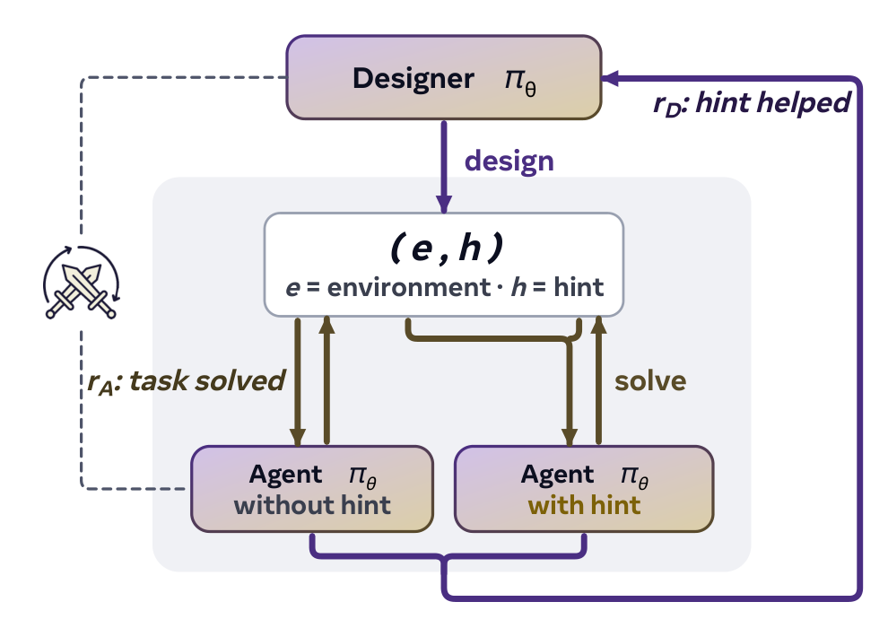
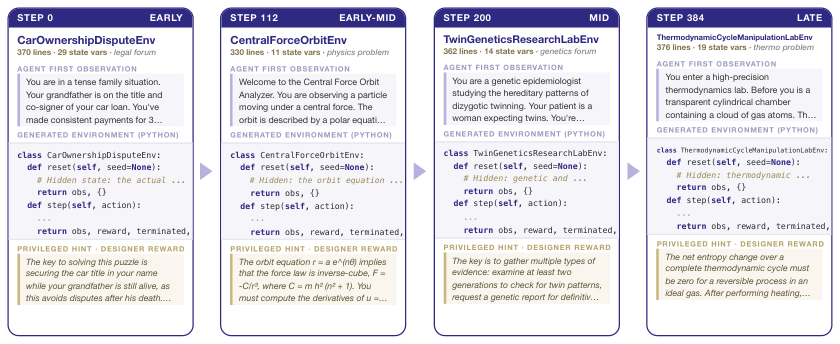

# SPADE 精读：Self-Play in Adaptive Synthetic Executable Environments（arXiv:2608.19197）


> **论文**：SPADE: Self-Play in Adaptive Synthetic Executable Environments
> **作者**：Bo Liu, Simon Yu, Yiding Jiang, Ao Qu, Andrew Zhao, Zichen Liu, Junsu Kim, Zijian Zhou, Seungone Kim, Tongzheng Ren, Mickel Liu, Hanfei Yu, Zhaorun Chen, Weiyan Shi, Paul Pu Liang, Luke Zettlemoyer, Yejin Choi, Natasha Jaques（UW / Stanford / Northeastern / CMU / MIT / NUS / SNU / Stevens / UChicago）
> **arXiv ID**：2608.19197（2026-08-19 v1）
> **发表时间**：2026-08-19
> **许可协议**：MIT（代码）；Apache-2.0（固定环境池数据）
> **代码仓库**：https://github.com/spade-rl/spade（模型与数据：https://huggingface.co/spade-rl）

---

## 第 1 章 概述

### 1.1 一句话定位

SPADE 让**同一个 LLM 在自博弈（self-play）中同时扮演环境设计者（Environment Designer, ED）与推理智能体（Reasoning Agent, RA）**：ED 从语料与环境记忆出发生成完整可执行的 Python 环境并给出特权 hint，RA 在无 hint 条件下求解，二者通过 hint-based regret 奖励协同演化——环境课程随智能体能力实时适配，在 Qwen3-30B-A3B 上将 8 个游戏类 benchmark 的平均分从 50.2 提升至 58.3（+8.1），并同步在 BFCL v4 multi-turn（+5.7）与 ACEBench-Agent（+13.9）上取得工具使用增益。

### 论文图表总览（本报告 8 章落点）

| 编号 | 内容 | 章节 |
|---|---|---|
| Teaser（论文未编号，本报告记为 Figure 1）  | ED 生成环境 + RA 求解的自博弈闭环概念图 | 第 3 章 |
| Figure 2 | env curriculum filmstrip：环境复杂度与形态随训练步数演化 | 第 6 章 |
| Figure 4 | SPADE 框架图：corpus/memory → ED → 环境验证 → 训练池 → RA 的完整管线 | 第 3 章 |
| Table 1 | Games 主结果：Qwen3-4B / 8B / 30B-A3B × 8 benchmarks（AIME'25, AIME'26, GPQA-D, LCB-v6, RG-Math/Algo/Cog/Logic） | 第 5 章 |
| Table 2 | Tool use 结果：BFCL v4、τ²（Retail/Airline/Telecom）、ACEBench | 第 5 章 |
| Table 3 | 消融：ED training / corpus grounding / memory / fixed designer | 第 6 章 |
| Table 6–8 | 扩展消融、环境质量信号、多样性（Vendi） | 第 6 章 |

### 1.2 核心贡献

**贡献 1：code-as-environment 统一环境接口。** 环境本身即一段可执行 Python 程序，暴露 Gym 风格的 `reset()` / `step()` 接口；隐藏状态、观测生成、奖励函数与终止条件全部由代码显式定义。单轮推理任务与多轮 agentic 任务在该表示下统一——前者是 `reset()` 后一步出答案的 episode，后者是至多 25 turns 的交互过程——同一套训练循环与代码路径同时产出 Table 1（games）与 Table 2（tool use）两类结果。

**贡献 2：hint-based regret 奖励。** ED 的奖励定义为特权 hint 存在与否时 RA 回报之差：

$$r_D(e) = \bar{r}_A(e \mid h) - \bar{r}_A(e) \quad \text{(Eq. 3)}$$

其中 $h$ 是 ED 自己生成的数句 hint（禁止透露精确答案）。该信号是 PAIRED 式 minimax regret 的轻量估计，**无需独立对抗者**，只在 RA 能力前沿（有 hint 能解、无 hint 不能解）取正值，从机制上排除"已掌握"与"不可解"两类无效环境。附录 E 给出均衡刻画：定理 E.5 证明在三条假设下，每个纯 Nash 均衡处 RA 在所有生成环境上都达到 hint-free 最优。

**贡献 3：corpus-grounded + memory-augmented 环境设计管线。** ED 的生成以语料为锚：游戏设定使用 15k 文档（10k math + 5k science，来自 DCLM 与 MegaScience），工具使用设定使用 15k Nemotron 代码语料；辅以上限 200 条的环境记忆（每条含 regret 分数与技能标签，最旧优先逐出）。消融显示去掉 corpus grounding 后环境多样性崩塌（Vendi/nn 从 0.68 跌至 0.04，steps 290–312 间同一旋转迷宫任务被重复生成 41 次），去掉 memory 后 30B 平均分从 58.3 降至 53.2（详见第 6 章）。

**贡献 4：30B+ 规模验证与完整训练配方。** 在 Qwen3-4B-Instruct-2507、Qwen3-8B、Qwen3-30B-A3B-Instruct-2507 三个规模上验证（RL 骨干为 slime），平均增益随规模递增（+5.2 / +5.7 / +8.1），而 Fixed-env GRPO 基线在三个规模上恒为 +1.0~+1.2。配方覆盖环境验证（deterministic reset gate + LLM check、每环境最多 5 次生成重试）、reward hacking 规避与课程设计；代码（MIT）、模型与固定环境池（含 GPT-5.5 生成的 7,872 个验证环境，SHA-256 校验）全部开源。

### 1.3 关键结果速览

- **Games（Table 1，Qwen3-30B-A3B，套件平均 = 8 benchmarks 均值）**：SPADE 58.3，vs base 50.2（**+8.1**）；vs 最强固定环境基线 Fixed-env RLVE 53.0（**+5.3**）；vs Fixed-env GRPO 51.4（+6.9）。分项：RG-Math 45.0→63.3（+18.3）、RG-Cog 23.0→37.7（+14.7）、RG-Algo 18.0→32.1（+14.1）、RG-Logic 67.0→72.8（+5.8）、GPQA-D 70.4→75.8（+5.4）、LCB-v6 43.2→47.3（+4.1）、AIME'25 61.5→62.8（+1.3）、AIME'26 73.5→74.4（+0.9）。
- **Tool use（Table 2，30B）**：BFCL v4 multi-turn **+5.7**（4B 上 +10.3）；ACEBench-Agent **+13.9**；τ² 套件 49.0→52.6（+3.6）。
- **消融关键锚点（Table 3，30B）**：冻结 ED 训练并去掉 memory 后平均分 40.5，比 base 低 9.7 分——自博弈的环境适应不是锦上添花而是必要条件；固定 GPT-5.5 做 designer 仅得 53.0（只恢复约 35% 的 +8.1 增益）。
- **环境质量（Table 7）**：训练全程 97%+ 环境通过 LLM rubric 的 well-posed 检查、90%+ 具备可验证终止答案；RA win-rate 从 0.30 升至 0.62，learnable-band（win-rate 20–80%）环境占比从 0.16 升至 0.31。

---

## 第 2 章 研究背景与动机

### 2.1 环境池瓶颈

RL 训练 LLM 的当前瓶颈正从"算法与算力"转向"环境供给"。静态环境池（人工策划的 benchmark 回放，或一次性合成后冻结的任务集）存在结构性缺陷：环境难度分布与智能体当前能力之间的匹配会随训练单调恶化——开局太难、中局饱和、终局无题可做。论文的固定环境基线量化了这一点：即便使用 GPT-5.5 预先生成的 7,872 个验证环境（SHA-256 校验的大规模静态池），Fixed-env GRPO 在 4B/8B/30B 三个规模上的平均增益恒定在 +1.0~+1.2，完全不随规模扩大；Fixed-env RLVE 在 30B 上平均仅 +2.8，且 AIME'25 从 base 的 61.5 回退到 56.9——静态合成分布与强模型的考场分布错配时甚至造成负迁移。产业侧亦在加大环境基础设施投入，据论文引述已达约 $1B 量级（Zeff, 2025；PYMNTS, 2026）。SPADE 的回应是让环境供给本身成为被训练的策略：每次 regeneration 生成新环境集、删除旧集，环境池生命周期与智能体进步同步。

### 2.2 现有四条路线的局限

**（a）harness engineering。** 通过 prompt、工作流编排、工具接口设计榨取 base model 的现有能力，不更新权重。能力天花板被冻结的模型参数锁死；Table 2 中依赖外部 harness 的 Agent-World、AWM 系列在 τ² 上表现参差（AWM-14B 仅 37.6）即为佐证——外围工程无法替代权重层面的能力增长。

**（b）human-curated 环境。** 人工策划环境（基准题库、标注任务）质量高但供给受限：无法随智能体进步实时扩产，人工成本构成规模瓶颈，且分布不可避免地窄。

**（c）synthetic generation（生成器固定）。** RLVE 一类方法用强模型一次性合成环境后冻结生成器。合成环境的绝对数量可以很大（上述 7,872 环境池即此路线的强化版），但难度分布固定：30B 上 RLVE 平均 +2.8 且 AIME'25 出现 −4.6 回退（2.1 节数字），说明静态合成分布在强模型上既饱和又错配。

**（d）传统 self-play。** 让模型互相出题、互相博弈（辩论、任务生成）。两个角色由同一模型扮演且**信息对称**：出题者并不拥有关于正确答案或环境难度的特权信息，正确性与可解性判定回退到同一个模型的自由发挥，信号 ungrounded；难度无法被可靠校准，课程容易漂向模型自以为难/自以为对的伪前沿。

### 2.3 UED 谱系与 SPADE 的位置

Unsupervised Environment Design（UED）的既有方案：**POET**（Wang et al., 2019）让环境与智能体协同演化但环境空间由手工参数化（低维连续参数）；**PAIRED**（Dennis et al., 2020）引入对抗 teacher，以 minimax regret——最优对抗者回报与当前策略回报之差——驱动课程，但 regret 的估计依赖一个独立的对抗者，且环境表达仍受参数化限制；**PLR**（Jiang et al., 2021）按 learning potential 对已生成环境做优先回放。SPADE 的推进有两点：其一，**regret 进入由代码定义的开放环境空间**——LLM 生成的 Python 程序可表达任意 MDP（隐藏状态平均 13 个以上变量、交互深度 8–10 turns、程序长度 300+ 行，见 Table 7），不受参数化族约束；其二，**hint 取代独立对抗者**：ED 生成环境时天然持有特权信息（它知道解法的关键路径），hint 增益差即为 regret 的一步内估计（引理 E.4 证明在 articulated hint 假设下二者相等），训练成本远低于维护一个 minimax 对抗者。论文同时用消融检验了 regret 与 PLR 式信号的差异：把 ED 奖励换成 EMA learning potential，30B 平均分从 58.3 降至 55.9（仅恢复约 70% 增益），且约 50 个训练步后两条学习曲线分离（Table 6，详见第 6 章）。

### 2.4 与 SPIRAL / SPICE 的区别：完整 MDP 环境而非 task

先前的 LLM self-play 工作（SPIRAL、SPICE 等）让模型生成的对象是 **task**——一段问题描述或挑战，agent 对其作答。task 是单轮、静态、语义层的：没有可执行的动力学，没有隐藏状态与多轮交互，难度与正确性仍由出题模型自身判定（信息对称、grounding 缺失的问题依旧存在；SPICE 的 corpus grounding 改善了多样性但不改变这一结构）。SPADE 的生成对象是**完整 MDP**：`reset()` 定义初始状态分布、`step()` 定义转移与奖励、程序内部变量构成部分可观测的隐藏状态。三个直接后果：（i）单轮与多轮任务被同一接口覆盖（工具使用环境同样是带 `reset()`/`step()` 的程序，SPADE 在 games 与 tool use 两个设定间复用全部训练代码）；（ii）正确性由确定性程序执行判定，而非出题者口头认定；（iii）交互深度、奖励粒度、信息结构本身成为可被课程化的设计变量——训练中环境奖励粒度从平均 3.7 个等级细化到 5.8 个（严格部分 2.2→4.0，Table 7 相关统计，详见第 6 章）。ED 相对 RA 拥有环境内部信息（可生成有效 hint），信息不对称使 regret 信号 grounded——这是 SPADE 对 2.2（d）所述传统 self-play 结构缺陷的直接修复。

---

## 第 3 章 SPADE 框架与方法

### 3.1 双角色自博弈与 code-as-environment

**双角色、单模型、共享参数。** SPADE 由一个参数为 $\theta$ 的 LLM $\pi_\theta$ 承担两个角色，仅通过 system prompt 切换：

- **role=D（Environment Designer）**：输入为语料文档 + 环境记忆（最多 200 条，含各环境的 regret 分数与技能标签），输出为完整环境（Python 代码）与一条 hint $h$（数句话，禁止透露精确答案）。
- **role=A（Reasoning Agent）**：在 ED 生成的环境中交互求解，无 hint。

同一份权重既是出题者又是解题者，任何一方的进步立即抬高另一方的训练难度——这是"课程自动适配"的机制来源，也带来显著训练不稳定性（3.3 节）。

**code-as-environment。** 每个环境是一段实现 Gym 接口的可执行程序：

```python
obs = env.reset()          # 初始观测（内部隐藏状态不暴露给 RA）
obs, reward, done = env.step(action)  # 转移、奖励、终止
```

单轮推理任务（如数学题）实现为 `reset()` 后一步提交答案、程序校验并终止；多轮 agentic 任务（如带工具的客服流程）实现为至多 25 turns 的 `step()` 循环。两类任务共用同一训练循环、同一 RA 策略接口与同一套环境验证逻辑（工具使用设定附加 deterministic reset gate——同一环境两次 reset 必须给出相同初始状态——以及 LLM check：逐条确认每个成功准则均可由某个工具满足）。

**环境池生命周期。** 每个 rollout 周期由 ED 重新生成一批环境（24 个/rollout，按 6 个技能中取 active skills、每技能 8×3 个），进入验证管线：静态检查与沙盒执行、最多 5 次生成重试、失败候选持久化留档分析；通过者进入训练池，每次 regeneration 时旧环境集被整体删除。RA 在每个环境上无 hint 玩 $16 \times k$ 次（games 设定 $k=4$，tool use 设定 $k=8$）、有 hint 玩 16 次，regret 由**同一步**的 16+16 plays 计算，避免跨步能力漂移污染难度信号。


*图4：SPADE 整体框架。corpus/memory 输入 → Environment Designer 写出带特权 hint 的可执行环境 → 结构/运行时验证 → 训练池 → Reasoning Agent 有/无 hint 求解：任务回报训练 agent 角色，hint-based regret 训练 designer 角色，per-role advantage 归一化保持联合更新稳定。*



*图1：自博弈闭环概念图：同一个 LLM 交替扮演环境设计者与推理智能体，环境课程随智能体能力实时适配。*

### 3.2 hint-based regret：能力前沿的三区间结构

ED 的奖励（Eq. 3）：

$$r_D(e) = \bar{r}_A(e \mid h) - \bar{r}_A(e)$$

记 $p = \bar{r}_A(e)$（无 hint 表现）、$q = \bar{r}_A(e \mid h)$（有 hint 表现），环境空间被划分为三个区间：

| 区间 | 条件 | $r_D$ | 课程含义 |
|---|---|---|
| 已掌握 | $p \approx q$，均高 | $\approx 0$ | ED 不得分，课程自动越过已掌握技能 |
| **能力前沿** | $q$ 显著高于 $p$ | $> 0$ | 唯一得正分的区域：hint 能救、裸做不能 |
| 不可解 | $p \approx q \approx 0$ | $\approx 0$（regret floor 0 截断） | 不可解环境无利可图 |

对比纯对抗奖励 $-\mathbb{E}[R_\pi(e)]$：该奖励在不可解区间取最大值，最优响应是课程坍缩为智能体永远失败的最难题；regret 只在前沿为正，从奖励结构上排除了坍缩路径。对比 PAIRED 的 minimax regret $\max_{\pi'} R_{\pi'}(e) - R_\pi(e)$：后者需要额外维护一个对抗者来逼近 $\max_{\pi'}$；SPADE 用 hint 作 ED 的特权信息，一次前向即得估计。引理 E.4 给出二者相等的条件：在 articulated hints 假设（E.2）下

$$R^h_\pi(e) - R_\pi(e) = R^*(e) - R_\pi(e)$$

即 hint 增益恰等于到最优回报 $R^*(e)$ 的差距。训练动态印证了三区间结构：learnable-band（RA win-rate 20–80%）环境占比从 0.16 升至 0.31，RA win-rate 从 0.30 升至 0.62（Table 7，详见第 6 章）。

### 3.3 自博弈训练的稳定化

两个被训练角色共享参数、互为对手，天然非平稳。SPADE 的稳定化组件：

1. **per-role advantage 独立标准化**：RA 的 advantage 按环境内 rollout 标准化；ED 的 advantage 按 skill 内 mean-center。两个角色的奖励尺度（RA 为环境得分、ED 为 regret 混合分）互不污染，并对低频 ED 轨迹上加权。
2. **ED 更新延迟与重要性采样**：ED 生成的环境要经过 RA 的 $k$ 个 rollouts 才产生完整回报信号，ED 的策略更新相应延迟 $k$ rollouts，并施加截断重要性采样修正 off-policy 偏差。
3. **非对称 PPO clip**：$\epsilon_{\text{low}} = 0.2$、$\epsilon_{\text{high}} = 0.28$——上界放宽，给 ED 更大的探索性更新幅度。
4. **regret floor 0**：负 regret 截断为零，与三区间设计配合。
5. **ED reward 混合**：

$$r_D^{\text{total}}(e) = 0.6 \cdot \underbrace{\text{anchor}\big(\bar{r}_A(e)\big)}_{\text{flat-top 难度锚}} + 0.4 \cdot \underbrace{\hat{r}_D(e)}_{\text{floored regret},\ [0,1]\ \text{归一化（scale 0.15）}}$$

其中难度锚在 RA 无 hint 表现落入 $[0.4, 0.6]$ band 内时取满值、越界线性衰减，直接压制"太难/太易"两端；regret 项负责前沿定位。纯 regret（无锚）在训练早期 RA 全面失败时信号退化为 0，难度锚保证了冷启动阶段的梯度。

### 3.4 理论保证：纯 Nash 均衡处的 hint-free 最优性

附录 E 在三条假设下刻画自博弈的均衡：

- **E.1（sound generation）**：ED 生成的环境良构——well-posed、可解、答案可验证；
- **E.2（articulated hints）**：ED 能把通往最优解的关键信息表述进 hint，使接收方达到最优回报，$R^h_\pi(e) = R^*(e)$；
- **E.3（internalizability）**：RA 容量足以把 hint 携带的信息内化为无 hint 行为。

**定理 E.5**：满足上述假设时，每个纯 Nash 均衡 $(D^\circ, \pi^\circ)$ 满足 $u_D = 0$，且对环境支持集 $M$ 中的每个 $e$：

$$R_{\pi^\circ}(e) = R^*(e), \qquad R^h_{\pi^\circ}(e) = R_{\pi^\circ}(e)$$

直觉：ED 的均衡收益为零，意味着不存在任何使 RA "有 hint 能解、无 hint 不能解"的环境——RA 已把全部可表述的特权信息内化，在所有生成环境上达到 hint-free 最优。定理把 3.2 节的机制论证收敛为一个固定点命题：自博弈的终点恰是能力前沿被完全吸收。论文同时声明其边界（第 8 章详述）：SPADE 不修改自身的优化器（两角色均用固定 GRPO），不提供开放式推理增长的形式化最优性保证；定理依赖 E.1–E.3 三条理想化假设，实际训练中 well-posed 率约 97%、可验证终止答案率约 93%（Table 7），与假设的偏离即均衡理论的现实噪声。


---


## 第 4 章 环境设计管线

### 4.1 Corpus Grounding：对抗「隐形 leash」

一个只以自己的输出为条件的生成器，其创新来源不会超出自身权重，因此会收敛到它已偏好的模式并发生 mode collapse——论文引述为「隐形 leash」（Chae et al., 2025；Zhang et al., 2026c）。SPADE 将外部语料视为拉长这条 leash 的机制：**每一轮** Environment Designer 都以新采样的人类语料文档为条件。

- **游戏设定**：15k 文档（10k 数学 + 5k 科学），取自 DCLM 与 MegaScience，覆盖网页、物理论坛、大学级科学教材
- **工具使用设定**：15k 文档，取自 Nemotron 预训练代码语料（提供算法实现与 API 文档）

SPICE（Liu et al., 2025b）建立了 *task* 生成的 corpus grounding——从文档中挖掘推理问题；SPADE 将其推广到 *环境* 生成：采样段落种出一个可执行 MDP 而非问答对。消融（Table 3/8）显示这是多样性的关键：去掉 grounding 后 Vendi/nn 从 0.68 崩塌至 0.04，steps 290–312 间同一旋转迷宫任务被重复生成 41 次；而冻结 ED + 去 memory 但保留语料的控制仍保持完整多样性（0.70）。结论：语料提供广度，ED 训练提高难度，两者正交。

### 4.2 环境记忆：防止重复已掌握内容

跨 episode 记忆防止 ED 重复提出 RA 已掌握的问题（Schmidhuber, 2013）。缓冲区存储过去生成的环境，每条带 regret 分数与技能标签，上限 200 条、最旧优先逐出。ED 每轮从中获取两类参考：

- **高 regret 种子**：RA 当前觉得难的环境，作为变异基础
- **过易/过难负例**：避免重复的失败模式

因此每轮从 RA 当前觉得难的地方开始，而非从零开始——这是 agentic-memory 系统「不靠梯度更新也能持续改进」机制在设计侧的对应物。corpus 与 memory 在两个轴工作：corpus 决定环境「关于什么」（广度），memory 决定「多难」（难度），Table 3 分别移除二者验证了各自贡献（w/o memory 53.2 vs 完整 58.3；w/o corpus 53.5）。

### 4.3 验证与池生命周期

每个候选环境在进入训练池前必须通过程序化 smoke test：实例化类、调用 `reset()`、步进几个 probe action；解析失败或崩溃的候选被丢弃。工具使用设定附加两项语义检查：

1. **deterministic reset gate**：多种子下对重置状态执行每个成功准则，任何准则报错即拒绝
2. **LLM solvability screen**：拒绝不可达/预满足/不可推导的成功准则，保留难而可行者

池生命周期：每次 regeneration 删除旧环境集并重建；失败候选持久化供人工检查；每环境最多 5 次生成重试。raw 生成代码的独立沙盒可执行性为 84.9%（剥离 stray Markdown fence 后 90.3%；主导残差为 $\backslash$boxed{} 动作模板的 f-string 大括号转义 bug，占 7.4%——训练管线 sanitizer 修复后过滤后 100% 有效）。

### 4.4 提示与 Hint 生成

ED 生成 prompt 的输入槽位为技能名、难度、示例概念（corpus-grounded 模式用采样文档替代示例概念槽）。Hint 由独立的 designer 侧调用生成：**hint writer 能看到环境源码，而 RA 永远看不到**——这是 hint 成为特权信息的前提。Hint 为数句话（关键洞见/策略 + 期望答案格式），禁止透露精确答案。工具使用设定的 hint 为分步计划（如查记录→更新→对账），因此 RA 仍需调用工具找到精确参数。生成 prompt 全程固定（400 步不变），grounding 文档每步重采样无趋势——因此生成环境的任何系统性变化都归因于 ED 训练而非 prompt 漂移。


---


## 第 5 章 实验设置与结果

### 5.1 训练配方

SPADE 在三个 Qwen3 骨干上训练：Qwen3-4B-Instruct-2507、Qwen3-8B、Qwen3-30B-A3B-Instruct-2507（primary 模型）。4B 和 30B 使用 instruct 模型；8B 运行对 Environment Designer 和 Reasoning Agent 都启用思考模式。训练使用 GRPO，共 400 rollouts，每个 rollout 含 24 个环境。Environment Designer 每 $k$ 个 rollouts 重新生成环境集，其更新也延迟相同的 $k$（即 $k$ 决定 Reasoning Agent 在固定环境集上训练多久后课程才移动）。

Reasoning Agent 对每个环境无 hint 玩 $16 \times k$ 次、有 hint 玩 16 次；regret 使用同一 regeneration step 的 16+16 次 plays 计算。特权 hint 由 Environment Designer 自己生成（无需外部模型），每轮还从环境记忆中抽取过去的环境（高 regret 种子与过易/过难负例）。奖励按环境归一化。RL 骨干为 slime（Zhu et al., 2025）。

**超参数**（附录 F.2，Table 5）：学习率 $1\times10^{-6}$（常数）；优化器 Adam，$\beta=(0.9, 0.98)$，weight decay 0.1；KL 惩罚 $\beta_{\text{KL}}=0$（8B 为 0.005）；非对称裁剪 $\varepsilon_{\text{low}}=0.20,\ \varepsilon_{\text{high}}=0.28$；截断重要性采样开启；奖励归一化为 outcome-only 的按游戏 z-score；rollout batch 24，global batch 192（动态）；组大小 $G=16$；总 rollouts 400；每 rollout 环境数 24（6 个技能中 3 个活跃，round-robin，每技能 8 个）；regeneration interval $k=4$ rollouts；ED 温度 0.6，ED max tokens 16,384（8B 为 20,000）；RA 温度 0.6，RA max tokens 8,192；每 episode 最多 25 turns；最大上下文 32,768（4B 运行后期 49,152）；ED 奖励混合为 plateau 0.6（band [0.4,0.6]，4B 后期 [0.2,0.4]）+ floored regret 0.4；regret 归一化 scale 0.15；plateau ramp width 0.25；ED 更新延迟 4 rollouts；corpus grounding 15k 文档（10k math + 5k science）。

### 5.2 游戏设定（Games）

Environment Designer 将每个环境写为自包含的 Python 游戏，带可验证奖励。每个 rollout 使用 24 个游戏，三个活跃技能各 8 个；六个认知技能类别（Mathematical Reasoning、Logical Deduction、Spatial Reasoning、Pattern Recognition、Optimization、Causal Inference）每次三个轮换，$k=4$。生成基于 15k 文档的 math+science 语料。除 floored hint-based regret 外，ED 奖励含 flat-top difficulty anchor（RA 赢率落入目标 band 才给奖励），每个游戏必须通过语法和执行检查才能进入池。

**基线**：每个骨干重训两个固定环境基线，同为 400 训练迭代——*Fixed-env RLVE*（在官方 RLVE 集上跑 GRPO）与 *Fixed-env GRPO*（在 GPT-5.5 生成的静态环境上跑 GRPO）。RLVE 全程是两者中更强的。

**评估**：两个距离训练分布的维度——*程序性推理*：Reasoning-Gym 四个类别（hard 难度）；*分布外推理与代码*：AIME 2025/2026（Avg@32）、GPQA-Diamond（accuracy）、LiveCodeBench-v6（Pass@1）。所有 benchmark 均从训练中留出。

### 5.3 工具使用设定（Tool Use）

Environment Designer 改为写可执行的工具使用环境：一组 OpenAI function-calling 格式的模拟工具、一个工具可修改的后端状态、以及三到五条逐个到达的自然语言用户指令（每条附对结果状态的检查）。生成基于 15k 文档的代码语料，工具环境生成成本更高，因此 $k=8$。Reasoning Agent 通过多轮调用工具求解，且仅当完成全部用户指令才获得奖励。特权 hint 是分步计划（查记录→更新→对账），因此 RA 仍需调用工具找到精确参数。验证在游戏检查之外增加两项：deterministic reset gate（多种子下锻炼每条成功准则）与 LLM 检查（每条成功准则可被某工具满足）。

**对比系统**：AgentScaler、Agent-World、Agent World Model (AWM)、EnvScaler——结果从原论文转录，训练数据/预算/部分基线模型/评估协议存在差异（附录 F.3.1）。评估用 BFCL v4 multi-turn、$\tau^2$-bench、ACEBench-Agent（ACEBench-en 的 Agent 类）。

### 5.4 游戏设定主结果（Table 1）

下表为八基准套件上的完整结果（每格为 %）：

| 模型 | AIME'25 | AIME'26 | GPQA-D | LCB-v6 | RG-Math | RG-Algo. | RG-Cog. | RG-Logic | Avg | Δ vs Base |
|---|---|---|---|---|---|---|---|---|---|---|
| Qwen3-4B-Instruct-2507 (Base) | 47.4 | 58.3 | 55.9 | 35.1 | 31.6 | 11.8 | 16.4 | 54.7 | 38.9 | – |
| Fixed-env GRPO | 47.1 | 58.6 | 56.2 | 35.4 | 34.0 | 13.5 | 18.1 | 56.3 | 39.9 | +1.0 |
| Fixed-env RLVE | 49.6 | 62.1 | 57.3 | 35.9 | 38.6 | 16.3 | 21.0 | 59.1 | 42.5 | +3.6 |
| **+ SPADE (Games)** | **48.9** | **60.2** | **58.1** | **37.2** | **44.6** | **19.8** | **23.1** | **60.8** | **44.1** | **+5.2** |
| Qwen3-8B (Base) | 67.1 | 71.2 | 59.4 | 46.3 | 47.2 | 19.6 | 24.8 | 63.1 | 49.8 | – |
| Fixed-env GRPO | 67.4 | 71.0 | 59.9 | 46.8 | 49.8 | 21.9 | 26.5 | 64.6 | 51.0 | +1.2 |
| Fixed-env RLVE | 69.6 | 75.0 | 61.6 | 47.4 | 52.7 | 25.0 | 31.0 | 67.9 | 53.8 | +3.9 |
| **+ SPADE (Games)** | **68.8** | **73.1** | **62.9** | **49.4** | **57.3** | **29.2** | **33.8** | **69.7** | **55.5** | **+5.7** |
| Qwen3-30B-A3B-Instruct-2507 (Base) | 61.5 | 73.5 | 70.4 | 43.2 | 45.0 | 18.0 | 23.0 | 67.0 | 50.2 | – |
| Fixed-env GRPO | 61.2 | 73.8 | 70.9 | 43.7 | 48.1 | 20.3 | 24.6 | 68.4 | 51.4 | +1.2 |
| Fixed-env RLVE | 56.9 | 69.8 | 69.8 | 42.5 | 55.8 | 24.7 | 30.9 | 73.7 | 53.0 | +2.8 |
| **+ SPADE (Games)** | **62.8** | **74.4** | **75.8** | **47.3** | **63.3** | **32.1** | **37.7** | **72.8** | **58.3** | **+8.1** |

*注：SPADE 行中论文标注的逐项增益为 4B：+1.5/+1.9/+2.2/+2.1/+13.0/+8.0/+6.7/+6.1；8B：+1.7/+1.9/+3.5/+3.1/+10.1/+9.6/+9.0/+6.6；30B：+1.3/+0.9/+5.4/+4.1/+18.3/+14.1/+14.7/+5.8。*

**分析**：30B-A3B 上 SPADE 达到套件平均 58.3，较 base +8.1、较最强固定环境基线（Fixed-env RLVE）**+5.3**，且优势随模型规模增大（4B +5.2、8B +5.7、30B +8.1）。Environment Designer 只在合成游戏上训练、从未见过任何留出任务，增益却转移到了 science（GPQA-D +5.4）、code（LCB-v6 +4.1）和程序性推理（RG 四类全部提升），竞争性数学保持（AIME'25 +1.3、AIME'26 +0.9）。增益集中在程序性推理——生成的游戏通过多种问题结构锻炼每个技能，而非固定任务集。Fixed-env GRPO 在各规模都只有约 +1.2 的增益，说明静态环境是固定的训练信号，大模型很快拟合完毕并停止学习。

### 5.5 工具使用结果（Table 2）

| 模型 | BFCL v4 (multi-turn): Base | Miss Func | Miss Param | Long Ctx | Avg | τ²: Retail | Airline | Telecom | Avg | ACEBench: Multi-Step | Multi-Turn | Avg | 总 Avg | Δ |
|---|---|---|---|---|---|---|---|---|---|---|---|---|---|---|
| AgentScaler-30B-A3B | – | – | – | – | – | 70.2 | 60.0 | 55.3 | 61.8 | – | – | 60.0 | – | – |
| Agent-World-8B | – | – | – | – | 44.5 | 72.8 | 40.0 | 50.9 | 54.6 | – | – | – | – | – |
| Agent-World-14B | – | – | – | – | 53.9 | 74.5 | 52.0 | 56.1 | 60.9 | – | – | – | – | – |
| AWM-8B | – | – | – | – | 45.0 | 41.2 | 38.5 | 23.5 | 34.4 | – | – | – | – | – |
| AWM-14B | – | – | – | – | 51.9 | 63.6 | 31.5 | 17.8 | 37.6 | – | – | – | – | – |
| EnvScaler-4B | 51.0 | 34.0 | 28.0 | 39.0 | 38.0 | – | – | – | – | 80.0 | 61.1 | 70.6 | – | – |
| EnvScaler-8B | 55.5 | 36.0 | 35.0 | 41.0 | 41.9 | – | – | – | – | 85.0 | 60.0 | 72.5 | – | – |
| Qwen3-4B (Base) | 34.0 | 16.0 | 12.5 | 25.5 | 22.0 | 43.0 | 32.0 | 18.0 | 31.0 | 55.0 | 41.7 | 48.4 | 33.8 | – |
| **+ SPADE (Tool Use)** | 46.0 | 26.5 | 22.0 | 34.7 | 32.3 (+10.3) | 47.2 | 35.6 | 21.5 | 34.8 (+3.8) | 65.0 | 49.5 | 57.3 (+8.9) | 41.4 | +7.7 |
| Qwen3-8B (Base) | 52.0 | 30.0 | 24.0 | 35.6 | 35.4 | 34.0 | 26.5 | 18.0 | 26.2 | 63.3 | 56.7 | 60.0 | 40.5 | – |
| **+ SPADE (Tool Use)** | 58.0 | 36.0 | 30.0 | 43.2 | 41.8 (+6.4) | 37.8 | 29.5 | 21.2 | 29.5 (+3.3) | 73.0 | 65.0 | 69.0 (+9.0) | 46.8 | +6.2 |
| Qwen3-30B-A3B (Base) | 66.0 | 44.0 | 38.0 | 48.0 | 49.0 | 62.0 | 50.0 | 35.0 | 49.0 | 70.0 | 54.0 | 62.0 | 53.3 | – |
| **+ SPADE (Tool Use)** | 72.0 | 50.0 | 44.0 | 52.9 | 54.7 (+5.7) | 65.5 | 53.5 | 38.8 | 52.6 (+3.6) | 82.0 | 69.8 | 75.9 (+13.9) | 61.1 | +7.7 |

*注：单位均为 %。对比系统的分数由其作者报告，训练数据与预算与 SPADE 不同；AWM 与 EnvScaler 报告 BFCL v3（与 v4 同四个多轮子类）；AWM 使用 τ²-bench-verified fork；Agent-World 与 AWM 的 Avg 为其自报聚合（非域分数无权重均值）。*

**分析**：同一配方用于工具使用环境设计，每个骨干都提升（30B 总 Avg 53.3→61.1，+7.7）。30B 上增益大小与 benchmark 任务结构对生成环境的匹配度成正比：ACEBench-Agent 增益最大（+13.9，总 Avg 62.0→75.9），其有状态多步任务镜像了生成环境「数据库 + 工具 schema + 多调用目标」的模式；其次 BFCL v4 multi-turn（+5.7，4B 上 +10.3）与 τ²-bench（+3.6）。30B 的 SPADE 在 BFCL v4 multi-turn 与 ACEBench-Agent 上都领先专门的数据合成系统（EnvScaler-8B 的 ACEBench 72.5 vs SPADE 75.9；Agent-World-14B 的 BFCL 53.9 vs SPADE 54.7）——结构化训练信号转移到了领域专用数据采集达不到的地方。


---


## 第 6 章 消融与扩展分析

### 6.1 组件消融（Table 3）

对 Environment Designer 的两个设计选择进行消融：它是否在训练中自适应（6.1），以及它如何被奖励（6.2）。Table 3 覆盖训练设置与环境来源的消融：前两个设置分别移除 corpus grounding 与环境记忆；后两个变体冻结 Environment Designer——一个同时移除环境记忆，另一个用固定前沿模型（GPT-5.5）替代自博弈 Environment Designer（保留两个输入）。所有变体都在 Qwen3-30B-A3B-Instruct-2507 上跑游戏设定，用与主实验相同的八基准套件评估，各变体报告套件平均最优 checkpoint。

| Setting | ED design | ED trained | Corpus grounding | Env. memory | AIME'25 | AIME'26 | GPQA-D | LCB-v6 | RG-Math | RG-Algo. | RG-Cog. | RG-Logic | Avg |
|---|---|---|---|---|---|---|---|---|---|---|---|---|---|
| Qwen3-30B-A3B (Base) | – | – | – | – | 61.5 | 73.5 | 70.4 | 43.2 | 45.0 | 18.0 | 23.0 | 67.0 | 50.2 |
| **SPADE** | Self | ✓ | ✓ | ✓ | 62.8 | 74.4 | 75.8 | 47.3 | 63.3 | 32.1 | 37.7 | 72.8 | **58.3** |
| w/o memory | Self | ✓ | ✓ | ✗ | 59.3 | 75.0 | 72.3 | 45.7 | 49.1 | 22.9 | 30.7 | 70.9 | 53.2 |
| w/o corpus grounding | Self | ✓ | ✗ | ✓ | 61.1 | 74.1 | 71.8 | 46.3 | 51.6 | 22.3 | 32.4 | 68.7 | 53.5 |
| w/o ED training and memory | Self | ✗ | ✓ | ✗ | 59.4 | 73.5 | 65.8 | 39.1 | 22.5 | 10.0 | 7.6 | 46.0 | 40.5 |
| Fixed ED (GPT-5.5) | GPT-5.5 | ✗ | ✓ | ✓ | 59.9 | 72.8 | 74.2 | 42.6 | 51.2 | 24.3 | 30.7 | 68.0 | 53.0 |

*注：单位均为 %。*

**ED 自适应（6.1）**：两角色协同适应是增益来源——课程与下游提升来自 ED 与 RA 一起训练，冻结 designer 即丢失它们。冻结自博弈 ED 并去掉其记忆，模型比不训练更差：八基准平均降到 40.5，**低于未训练 base 9.7 分**。保留 corpus grounding 与记忆的固定 GPT-5.5 designer 更好（53.0 vs 50.2），但只恢复 SPADE +8.1 增益的约 35%，且未改善代码（LCB-v6 42.6 vs 43.2）。部分与冻结变体提前达峰随后衰减（no-corpus 运行约 step 111，GPT-5.5 designer 约 step 175），而完整 SPADE 在训练后期仍然最强。每个控制同时改变多项（冻结 designer 同时移除其记忆或换模型），因此共同说明完整协同自适应配置胜出，但无法把增益单独归因于梯度更新。

**ED 奖励（6.2）**：替代方案为 EMA-based learning potential——按 RA 在该技能上的近期平均的成功偏离来打分（式 4-6：$\mu^{\gamma}_t(s)=(1-\gamma)\mu^{\gamma}_{t-1}(s)+\gamma\bar{r}_{A,t}(s)$，$\rho(e)=|\bar{r}_A(e)-\mu_{\text{slow},t}(s)|$，$r^{\text{LP}}_D(e)=\rho(e)-\frac{1}{|\mathcal{E}_s|}\sum_{e'\in\mathcal{E}_s}\rho(e')$）。它更便宜（复用已收集的 RA rollouts，无需 hinted replay）。hint-based regret 将八基准平均从 50.2 抬到 58.3（+8.1）；EMA learning potential 只到该增益的约 70%（+5.7，到 55.9）且爬升更慢，两信号在约前 50 步后分离。两者都远高于联合冻结 ED/no-memory 控制（低于未训练模型 9.7 分）。偏差是无符号的，因此 RA 总能解的环境与总解不了的环境得分可以一样高；且 $\mu_{\text{fast}}$ 只作为诊断记录而不参与奖励。

### 6.2 扩展消融（附录 G，Table 6）

| Setting | Ckpt | AIME'25 | AIME'26 | GPQA-D | LCB-v6 | RG-Math | RG-Algo. | RG-Cog. | RG-Logic | GEM | Avg |
|---|---|---|---|---|---|---|---|---|---|---|---|
| Base | – | 61.5 | 73.5 | 70.4 | 43.2 | 45.0 | 18.0 | 23.0 | 67.0 | 41.0 | 50.2 |
| SPADE | 303 | 62.8 | 74.4 | 75.8 | 47.3 | 63.3 | 32.1 | 37.7 | 72.8 | 50.2 | 58.3 |
| ED w/ learning potential | – | 62.4 | 74.1 | 74.2 | 46.1 | 57.8 | 27.9 | 33.3 | 71.1 | 47.4 | 55.9 |
| 2-skill curriculum | 399 | 60.6 | 71.3 | 71.7 | 44.7 | 53.6 | 26.7 | 30.5 | 70.7 | 46.0 | 53.7 |
| w/o corpus grounding | 111 | 61.1 | 74.1 | 71.8 | 46.3 | 51.6 | 22.3 | 32.4 | 68.7 | 45.1 | 53.5 |
| w/o memory | 111 | 59.3 | 75.0 | 72.3 | 45.7 | 49.1 | 22.9 | 30.7 | 70.9 | 42.4 | 53.2 |
| w/o ED training and memory | 271 | 59.4 | 73.5 | 65.8 | 39.1 | 22.5 | 10.0 | 7.6 | 46.0 | 26.4 | 40.5 |
| Fixed ED (GPT-5.5) | 175 | 59.9 | 72.8 | 74.2 | 42.6 | 51.2 | 24.3 | 30.7 | 68.0 | 45.6 | 53.0 |

**跨家族迁移**：同一配方在 Nemotron-30B-A3B-BF16 上运行（只评估 Reasoning-Gym 套件；AIME/GPQA-D/LCB 未评估），四个 RG 类别全部高于未训练 base，最大增益在 RG-Cognition（+9.6）与 RG-Algorithmic（+9.3）——说明训练动态不是 Qwen 特有。

### 6.3 定性分析（Section 6.2 + 附录 I/J）



*图2：定性分析中的环境课程演化序列。SPADE 生成的训练环境从早期简单的单技能任务逐步演化为后期需要长程交互的多约束复杂环境，展示出涌现式课程。*

**ED 持续供应可学习环境**：learnable share（RA 赢率落在 20%-80% 的环境比例）随训练上升，400 步后期达到约三分之一。corpus grounding 维持环境多样性（Vendi/nn 0.68，无语料 0.04）；冻结 ED 并移除 memory 但保留语料的控制保持完整多样性（0.70）。语料提供广度，ED 训练提高难度。无语料运行在 steps 290-312 连续 41 次生成同一旋转迷宫任务。

**ED 训练使环境以可测的代码级方式变难**：生成指令 400 步全程固定、grounding 文档每步重采样无趋势，因此任何系统性变化都归于 ED 训练。两个度量同步移动：① Physics 内开场观测打印公式的环境占比从 25% 降到 5%（473 个 Physics 环境）；② 奖励分级更细，每环境 3.7→5.8 个不同级别（其中 2.2→4.0 为严格部分奖励）。

**RA 学会基于证据行动而非预先推导**：step 0 它完全预先推理、接口拒绝答案后无法恢复；step 200 测试短假设并根据返回结果修正；step 300 先收集证据、证据足够时只推导一次。该转变只出现在任务奖励推理的程序性环境上（后期中位 8 tokens 的短命令），需要长推导的任务仍长推导，后期 checkpoint 的 benchmark 增益（Table 1）确认能力保留。

**环境质量与多样性（附录 I.1，Table 7/8）**：

| 质量信号 | Early (0-40) | Mid (150-250) | Late (340-396) |
|---|---|---|---|
| Learnable-band fraction (win-rate ∈ [0.2,0.8]) | 0.16 | 0.16 | 0.31 |
| Reasoning Agent win-rate | 0.30 | 0.46 | 0.62 |
| Well-posed (LLM rubric) | 0.98 | 0.97 | 0.97 |
| Verifiable terminal answer (LLM rubric) | 0.90 | 0.91 | 0.93 |
| Interaction depth (turns/episode) | 8.8 | 8.2 | 9.8 |
| Program length (lines of code) | 316 | 333 | 321 |
| Hidden state variables | 13.0 | 13.3 | 13.4 |

raw 生成代码可执行性 84.9%（剥离 stray Markdown fence 后 90.3%；主导残差是 $\backslash$boxed{} 动作模板的 f-string 大括号转义 bug，占 7.4%，训练管线 sanitizer 修复后过滤后 100% 有效）。程序长度稳定在约 320 行、约 13 个隐藏状态变量、每 episode 8-10 turns——ED 没有走捷径生成琐碎程序来虚增奖励。

| Run | Sample | Vendi/nn ↑ | Mean pairwise dist. ↑ |
|---|---|---|---|
| SPADE (full) | 3,310 | 0.68 | 0.94 |
| w/o memory | 3,746 | 0.69 | 0.94 |
| w/o ED training, w/o memory | 4,929 | 0.70 | 0.94 |
| w/o corpus | 866 | 0.04 | 0.34 |

Vendi 校准：24 个相同环境 = 1.0；单域批次 14.8-16.5；全 run 混合批次 21.3（n=24 的实用上限）。per-step Vendi 全程平直（early 20.8 vs late 21.0）；新意饱和（100 个 logged steps 中 97 个全部为未见初始状态）；13 域 taxonomy 从 step 0 全在（每批 24 平均 8.4 个域：Mathematics 30%、Physics 20%、Medicine 11%、Chemistry 10%、CS 7%、Engineering 6%、other 16%）。分布平稳（去种子文档复用后，线性探针无法区分前半与后半环境，5-fold AUC 0.551±0.024）。canonical run 的 3,310 个环境全部唯一程序哈希（2,388 个不同初始状态、1,513 个不同种子文档）。

### 6.4 规模扩展（Section 8）

共享训练配方下，相对各自 base 的平均增益从 4B +5.2、8B +5.7 增长到 30B-A3B +8.1，而 Fixed-env GRPO 各规模恒为 +1.2。静态环境是大模型快速拟合完毕的固定信号；ED 的自适应课程持续在 RA 能力前沿生成环境，大模型受益更多。

课程多样性：六技能课程 vs 二技能版本（其余全同）。二技能也提升，但只获得约一半的 Reasoning-Gym 增益，GPQA-Diamond 与 LCB-v6 增益小得多（八基准最优 checkpoint 53.7 vs 58.3）。增益随课程多样性增长，而非任何单一游戏家族。

## 第 7 章 代码实现详解

### 7.1 仓库结构

官方仓库：**github.com/spade-rl/spade**（MIT License），模型与数据发布在 HuggingFace（huggingface.co/spade-rl）。仓库采用「core + 分布式后端」两层结构：

| 目录 | 职责 |
|---|---|
| `spade/core/` | 后端无关的核心编排（环境生成、验证、双角色 rollout、reward 计算） |
| `spade/slime/` | Slime 集成：SGLang 推理 + Megatron-LM 策略更新 + Ray 编排（论文主配方） |
| `spade/tinker/` | Thinking Machines Tinker 分布式训练框架集成 |
| `cmd/games/` | 游戏设定训练脚本 `train_spade_{4b,8b,30b}.sh` |
| `cmd/tool_use/` | 工具使用设定训练脚本 `train_spade_{4b,8b,30b}.sh` |
| `cmd/ablations/` | 论文消融脚本 |
| `eval_offline/` | 离线评估（对已训练 checkpoint 或 OpenAI 兼容端点跑 benchmark 套件） |
| `eval_configs/` | 训练中评估的 YAML 配置 |
| `tests/` | 测试 |
| `scripts/`、`slurm/` | 工具脚本与 SLURM 作业脚本 |

依赖子模块：`slime`（THUDM，bf14dc2）、`tinker-cookbook`（thinking-machines-lab，2c87e8f）。

### 7.2 支持模型与运行方式

SPADE 与模型无关：训练循环只需要可聊天的 policy。论文训练：Qwen3-4B-Instruct-2507、Qwen3-8B、Qwen3-30B-A3B-Instruct-2507；仓库还支持 Qwen3-32B、Qwen3.5 系列、openai/gpt-oss-20b/120b、NVIDIA Nemotron-3-Nano-30B-A3B、GLM-5.2/5.3 等。安装：Python 3.10-3.12，`python -m pip install -e ".[dev]"`（GEM 支持需 `--ignore-requires-python gem-llm`）。

训练脚本从环境变量读取路径与凭据；游戏设定 400 rollouts 的单 8-GPU 节点即可运行两个角色的 GRPO 训练。固定环境基线配方无需 `CORPUS_FILE`：使用发布的静态 GPT-5.5 语料（`spade-rl/SPADE-Environment-Pool-GPT5.5-Games`，7,872 个验证过的 Python 环境，跨六个认知技能，pinned revision + 每环境 SHA-256 校验，Apache-2.0）。

### 7.3 关键实现要点

- **环境生成**：ED 收到含技能名/难度/语料文档（corpus-grounded 模式）的 prompt，输出自包含 Python 类（`reset()`/`step()`），每环境附带特权 hint（由 hint writer 单独调用生成，hint writer 看到环境源码，RA 永远看不到）
- **验证**：程序化 smoke test（实例化类、调用 reset()、步进几个 probe action，解析失败或崩溃的候选被丢弃）；工具使用设定加 deterministic reset gate 与 LLM solvability screen（拒绝不可达/预满足/不可推导的成功准则，保留难而可行者）
- **池生命周期**：每次 regeneration 删除旧环境集；环境记忆 200 记录上限、最旧优先淘汰；失败候选持久化供检查；每环境最多 5 次生成重试
- **训练稳定性**：per-role advantage 独立标准化、ED 更新延迟 $k$ rollouts + 截断重要性采样、非对称 clip（0.20/0.28）、regret floor 0
- **评估**：`eval_offline/` 对 checkpoint 或端点跑 AIME/GPQA-D/LCB-v6/Reasoning-Gym（游戏）与 BFCL v4/τ²-bench/ACEBench-Agent（工具使用）


---


## 第 8 章 局限性与延伸阅读

### 8.1 局限性

(a) **复杂度受规模与 invisible leash 约束**（Chae et al., 2025）。Environment Designer 无法生成超出其基础模型在上下文中可表达能力的环境，因此可达环境复杂度随模型规模与生成预算增长。

(b) **人工设计的优化器**。两个角色都由固定的、人工撰写的 RL 算法（GRPO）更新；SPADE 不修改自身的学习规则。论文明确将「自动化学习规则本身」列为未来工作。

(c) **无形式化最优性，且评估为固定任务**。hint-based regret 受 PAIRED 启发，但未被证明产生最优课程；当前 benchmark 测量固定任务性能而非开放式推理增长。理论结果（定理 E.5）依赖理想化假设：E.1 sound generation（ED 只采样数学上有效的可执行环境，即 $\mathcal{M}$）、E.2 articulated hints（对任意策略 $\pi$ 与任意环境 $e$，$R^h_\pi(e)=R^\star(e)$，即 hint 条件化达到最优无 hint 值）、E.3 internalizability（hinted 行为在无 hint 时也可达）。

(d) **评估协议差异**。工具使用对比系统（AgentScaler、Agent-World、AWM、EnvScaler）的结果由其作者在各自 harness 上报告，与 SPADE 的训练数据、预算、部分基线模型与评估协议存在差异（附录 F.3.1：BFCL v3/v4 差异、$\tau^2$-bench-verified fork、用户模拟器差异、聚合方式差异）。

(e) **环境奖励信号的非平稳性**。per-environment 标量奖励未在公开运行日志中保留，learnability 以 step 级（win rate、learnable-band fraction）而非环境级测量；LLM rubric 测绝对难度与连贯性而非对当前 agent 的适配度。

### 8.2 延伸阅读与开放问题

- **开放世界/开放式自我改进**：SPADE 使环境设计成为可学习组件，是向开放式持续自我改进的一步。相关工作谱系：PowerPlay（Schmidhuber, 2013）、POET（Wang et al., 2019）、PAIRED（Dennis et al., 2020）、OMNI-EPIC（Faldor et al., 2024）、SPIRAL/SPICE（Liu et al., 2025）、R-Zero（Huang et al., 2025）、AZR（Zhao et al., 2025）、G-Zero（Huang et al., 2026，DPO-based hint 蒸馏）
- **环境合成与扩展**：Agent World Model（AWM，五阶段合成 1,000 个 SQLite 工具环境）、ScaleEnv、TermiGen、Nemotron-Terminal（Terminal-Task-Gen 两阶段）、SkillSynth、Endless Terminals（3,255 个验证终端任务）、Eurekaverse（机器人）、WebScale-RL（预训练规模的数据管线）、RLVE（400 个人工可验证环境）、SCALER（CodeContests 参数化）
- **可组合方向**（论文明确点出）：SPADE 的自适应环境生成可为 ALMA 式记忆系统与 MemRL 式运行时 RL 填充经验流；「学习权重更新 vs 上下文内演化，哪个是更好的 designer，在什么规模」是开放问题
- **Agentic 记忆**：MemRL（运行时 RL on 情景记忆）、ALMA（元学习记忆架构设计）、HyperAgents（自引用代码演化）——与 SPADE 互补，后者解决如何生成产生经验的训练环境

### 8.3 评价与定位

SPADE 的核心贡献不是新的 RL 算法（沿用 GRPO），而是把「环境设计」从静态资源变成 RL 训练目标：同一个 LLM 的 Designer 角色通过 hint-based regret 学习生成处于 Agent 能力前沿的完整 MDP（代码形式），与 Agent 角色协同演化。三个证据支撑该定位：① 消融显示冻结 designer（即使换成更强的 GPT-5.5）只能恢复约 35% 的增益，而完全冻结 + 去记忆会低于不训练；② 增益随模型规模增长（+5.2→+8.1），而固定环境基线恒为 +1.2，说明自适应课程是规模友好信号；③ corpus grounding 是多样性的关键（Vendi 0.68 vs 0.04），从机制上回应了 ungrounded self-play 的信息对称限制。其局限在于复杂度上界受基础模型表达力约束、评估停留在固定 benchmark、以及 hint 质量依赖 designer 自身的自我反思能力。
