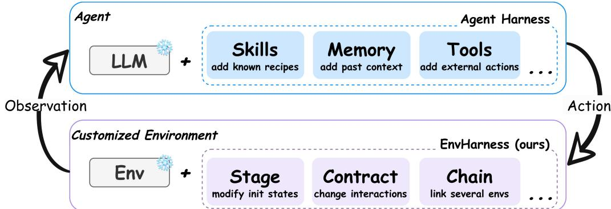
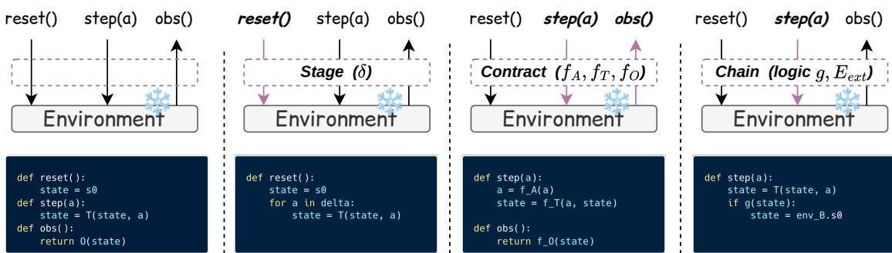
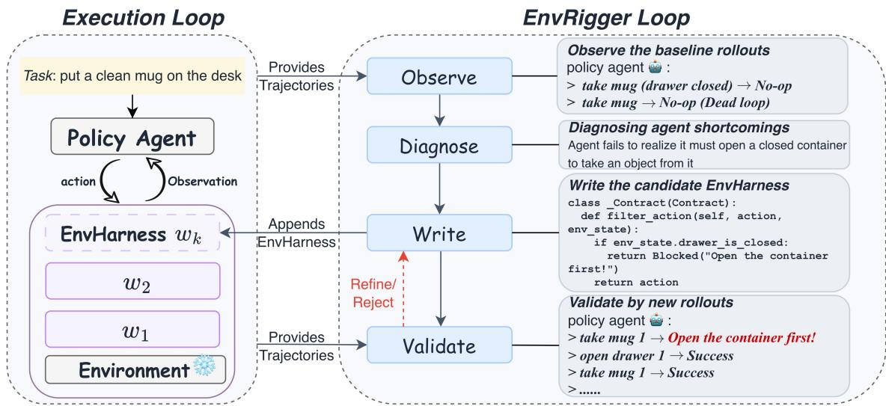
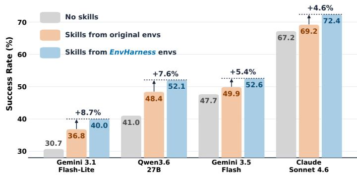
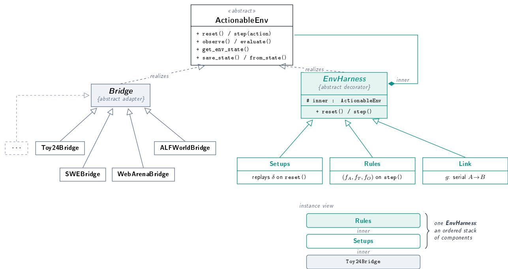

# EnvHarness 精读：Awakening Static Worlds for Agent Learning（arXiv:2608.19880）

> **论文**：EnvHarness: Awakening Static Worlds for Agent Learning
> **作者**：Chengsong Huang（Washington University in St. Louis）, Zifeng Wang, Rujun Han, Jun Yan, Yanfei Chen, Zoey CuiZhu, Ke Jiang, Han Yu, Yufan Zhuang, Yifei Ming, Bhavana Dalvi Mishra, Jiaxin Huang, Burak Gokturk, Tomas Pfister, Chen-Yu Lee（Google Cloud AI Research）, Peng Xia（UNC Chapel Hill）, Jiaqi Pan（Google Cloud）
> **arXiv ID**：2608.19880（2026-08-20 v1）
> **发表时间**：2026-08-20
> **许可协议**：Apache-2.0
> **代码仓库**：https://github.com/google-research/envharness（项目网站：https://envharness.com）

---
## 第 1 章 概述

### 1.1 一句话定位

EnvHarness（Environment Harness）是一个**包装而非创作**（wrapping, not authoring）环境的可编程层：它由一组即插即用组件构成，通过 reset/step 标准接口包裹一个静态环境，在不修改其底层逻辑与验证器的前提下重塑环境行为——改写初始状态、重写交互规则、或将多个环境串成长链。论文的核心主张由此而来：环境构建应当被视为一个 wrapping problem 而非 authoring problem；与其从零重建环境，不如让既有环境重新变得可控、可教。

### 论文图表总览

| 编号 | 内容 | 章节 |
|------|------|------|
| **Figure 2** | Agent Harness vs EnvHarness 结构类比 | 第 3 章 |
| **Figure 3** | Stage/Contract/Chain 三组件包装标准接口总览 | 第 3 章 |
| **Figure 4** | EnvRigger 四阶段工作流（Observe/Diagnose/Write/Validate） | 第 4 章 |
| **Figure 5** | SWE-bench 环境缩放曲线（策略-环境共同进化） | 第 6 章 |
| **Figure 6** | 跨模型 SWE-bench 结果（4 个策略模型） | 第 6 章 |
| **Figure 7** | 框架类结构与实例结构（Bridges + 组件栈） | 第 7 章 |
| **Table 2** | ALFWorld 与 WebArena 主结果（技能来源对比） | 第 5 章 |
| **Table 3** | SWE-bench Verified / OfficeQA / SpreadsheetBench 主结果 | 第 5 章 |
| **Table 4** | 强化学习结果（ALFWorld + WebShop，GRPO） | 第 6 章 |
| **Table 5** | Chain 长程环境性能 | 第 6 章 |
| **Table 9** | 跨模型结果（SR 与平均步数） | 第 6 章 |
| **Table 10** | ALFWorld 留一法泛化 | 第 6 章 |
| **Table 11** | 估算 token 消耗 | 第 6 章 |
| **Table 12** | 客观指标定向（ALFWorld） | 第 6 章 |

（论文 Figure 1「总体性能」与 Table 2/3、Figure 5 内容重复，未纳入本报告；Table 6/7/8/13 细节见正文对应章节。）

### 1.2 核心贡献

**贡献一：EnvHarness——包装静态环境的可编程层。** 通过 reset/step 标准接口将静态环境重塑为可控环境，提供三种即插即用组件：Stage（改初始状态 $s_0'$）、Contract（改交互 $(f_A, f_T, f_O)$）、Chain（组合多环境）。原环境的任务定义与验证器完全不动，因而天然规避了自建 LLM verifier 的成本与不可靠性。

**贡献二：EnvRigger——自动化环境定制循环。** 一个任务-策略条件化的 Observe → Diagnose → Write → Validate 循环：把目标策略当作黑盒，从其执行轨迹中诊断系统性缺陷，据此合成 EnvHarness 组件，再用新鲜 rollout 验证；只接受确实能教会策略所缺能力的候选。

**贡献三：跨域实验验证。** 在 4 个域的 5 个 benchmark（ALFWorld、WebArena、SWE-bench Verified、OfficeQA、SpreadsheetBench）上，EnvHarness 同时超越原始环境与领域特定环境生成流水线：技能学习范式在 held-out 实例上最高 +9.0 分、执行步数减少 9.8%；RL 范式最高 +6.5 分。

### 1.3 关键结果速览

- ALFWorld（技能学习范式）：avg 68.3% vs Original Envs 62.4%（**+5.9 分**）；OOD 70.4% vs 61.4%（**+9.0 分**，全文最大提升）；相对 GenEnv avg +5.7 分、OOD +8.5 分。
- SWE-bench Verified：SR 52.58% vs Original 49.88%（**+2.70 分**）；AS（平均步数）49.61 vs 55.01，相对减少 **9.8%**；相对 SWE-smith SR +2.46 分。
- SpreadsheetBench：Pass@1 49.15% vs Original 45.88%（**+3.27 分**）。
- OfficeQA：EM 56.20% vs Original 54.40%（+1.80 分）。
- WebArena：Avg 41.6% vs Original 38.5%（+3.1 分）。
- RL 范式（GRPO + Qwen3-8B-base）：ALFWorld In-Dist 81.4% → 87.9%，最高 **+6.5 分**。

## 第 2 章 研究背景与动机

### 2.1 静态环境的两重限制

现行的 LLM agent 学习环境是人工构建且静态的，其限制有二。

其一，**对 agent 的弱点是盲的**。静态环境无法感知当前策略会在哪里失败，也就无法针对弱点给出有针对性的训练信号；同一批环境对强策略与弱策略一视同仁。

其二，**agent 学会之后便无可再教**。随着策略能力提升，环境很快被甩在身后——成功率饱和之后，环境不再提供新的可学内容，训练信号随之枯竭。

两条限制合起来指向同一个需求：环境应当随策略的状态而变，既能瞄准弱点，又能持续提供新挑战。

### 2.2 环境生成方法的局限

近来的环境生成方法试图回应上述需求，但论文指出其两大局限。

其一，**domain-specific**：现有方法依赖领域特定的生成流水线，难以跨域复用。

其二，**验证昂贵且不可靠**：生成的新环境需要判定 agent 是否成功，通常依赖昂贵的 LLM verifier，且判定本身不可靠。更根本的是，这些方法产出的仍是静态环境——一次性生成一批，之后照旧固化，并未真正解决"环境落后于策略"的问题。

### 2.3 Agent Harness 类比：冻结对象 + 外挂控制层

论文的破题来自一个类比。在 agent 一侧，agent harness 的做法是冻结 LLM 权重，在外面加一层可编程的外部能力层（工具、记忆、脚手架），不改动模型内部即可改变其行为；在环境一侧，EnvHarness 冻结静态环境的内部逻辑，在外面加一层可编程的控制层（组件包装），不改动环境内部即可重塑其行为。

两侧共享同一个洞见：与其修改被冻结对象的内部——权重或环境逻辑——不如在其接口之外挂一个可编程层。这一定位决定了 EnvHarness 的工程形态：包装而非创作、接口级而非侵入式、保留原验证器而非另建 verifier。

## 第 3 章 EnvHarness：包装静态环境的可编程层



*图 2：Agent Harness 与 EnvHarness 的结构类比——前者在冻结的 LLM 之外挂能力层，后者在冻结的环境之外挂控制层；共同点是不修改被包裹对象的内部，只在其接口上做文章。*

### 3.1 环境形式化与组件变换

论文将一个静态环境形式化为六元组：

$$E = (S, A, O, T, R, s_0)$$

其中 $S$ 为状态空间，$A$ 为动作空间，$O$ 为观测空间，$T$ 为状态转移函数，$R$ 为奖励/成功验证函数，$s_0$ 为初始状态。

EnvHarness 的组件被定义为该元组上的变换 $w$：

$$E' = w(E)$$

关键在于 $w$ 只作用在接口层（reset/step/observe/evaluate）：它不修改环境的内部逻辑，只是包裹并改写经接口暴露出来的轴——初始状态、动作、转移、观测，或多个环境的拼接方式。三种内置组件分别对应不同的轴。



*图 3：Stage、Contract、Chain 三种即插即用组件通过 reset/step 标准接口包裹静态环境；无论内层环境属于哪个域，外层组件看到的都是同一套接口。*

### 3.2 Stage：重放动作序列，改写初始状态

Stage 组件 $w_{\mathrm{stage},\delta}$ 由一段动作序列 $\delta$ 参数化。reset 时，环境先从 $s_0$ 出发自动重放 $\delta$，把系统推进到新初始状态 $s_0'$，此后才交还给 agent：

$$E' = w_{\mathrm{stage},\delta}(E) = (S, A, O, T, R, s_0'), \qquad s_0' = \mathrm{Replay}(s_0, \delta)$$

任务定义与验证器 $R$ 原封不动，变的只是开局。一个直观例子：在 ALFWorld 类家庭任务环境中，令 $\delta$ =（拿起杯子 1 → 打开抽屉 1 → 把杯子 1 放进抽屉 1 → 关上抽屉 1）；agent 面对的初始场景里杯子已被藏进抽屉，而任务（找到并处理杯子）与成功判定完全不变。原本一眼可见的物体变得需要主动探索才能找到——环境由此"变难"，却没有新增任何人工标注或验证逻辑。

### 3.3 Contract：三元组重写交互

Contract 组件 $w_{\mathrm{contract},r}$ 由三元组 $r = (f_A, f_T, f_O)$ 参数化，分别重写动作空间、转移函数与观测：

$$E' = w_{\mathrm{contract},r}(E), \qquad r = (f_A, f_T, f_O)$$

- $f_A$ 重写动作空间：例如**阻止动作**——拦截某些"捷径"操作，迫使 agent 走更规范、更细粒度的操作路径；
- $f_T$ 改写转移函数：在动作与状态更新之间插入改写逻辑；
- $f_O$ 重写观测：例如**截断观测**——收紧单步输出的信息量，迫使 agent 主动发起查询而非被动等待完整信息。

两种典型机制（截断观测、阻止动作）都在收紧 agent 与环境之间的信息/动作带宽，逼出原本不会练到的能力。实现上，Contract 对应代码中的 Rules 组件，以三个 hook（filter_action / modify_transition / filter_observation）覆写交互；其生成代码以源码字符串保存、加载时重新编译，并在每集独立子进程中执行——坏代码只会毁掉一集，不会拖垮整个进程。

### 3.4 Chain：组合多环境

Chain 组件 $w_{\mathrm{chain},\ell}$ 由一个外部环境 $E_{\mathrm{ext}}$ 与组合逻辑 $g$ 参数化，把两个环境接成一条链：

$$E' = w_{\mathrm{chain},\ell}(E), \qquad \ell = (E_{\mathrm{ext}}, g)$$

链上环境的验证函数取联合形式：

$$R' = R_A \wedge R_B$$

即两个子任务的验证都通过才算成功。典型例子是**双任务验证**：论文以 ALFWorld 的"把干净杯子放到桌上"任务为例，在其后追加"加热一个土豆并放到台面上"——只有两个子任务各自的验证器都通过时 $R'$ 才判成功，agent 必须把目标带过它原本会停下的位置。长程实验（Table 5）则把两个随机配对的基座环境（如两个 SWE-bench 修复任务）串接成单个 episode，共享步数预算——长程依赖由此在不动任何验证器的情况下被制造出来。实现上（代码中的 Link 组件）采用懒重置：外层环境直到内层任务完成后才真正启动；组合模式支持顺序、按结果分支、中途切换与交替。

### 3.5 组件的组合：非交换

三种组件可以嵌套组合，例如先 Stage、再 Contract、最后 Chain：

$$E' = w_{\mathrm{chain}}\big(w_{\mathrm{contract}}(w_{\mathrm{stage}}(E))\big)$$

组合是非交换的：

$$w_i \circ w_j \neq w_j \circ w_i$$

原因在于包装层级决定作用次序：最外层组件最先见到 agent 的动作、最后送出观测，因此"先包谁、再包谁"会产生语义不同的环境。代码实现中，检查点按由内向外的顺序记录环境与组件栈，正是对这一层级结构的显式保存。

### 3.6 三条关键性质

**验证器不动。** 一切组件变换都保留原环境的 $R$；Chain 虽引入联合验证 $R' = R_A \wedge R_B$，其成分仍是各原环境自带的验证器。EnvHarness 因此不需要新建任何 LLM verifier，绕开了环境生成方法"验证昂贵且不可靠"的痼疾。

**接口级。** 组件只通过 reset/step 等标准接口作用于环境，不触碰内部逻辑；对组件而言，内层环境是一个实现了 ActionableEnv 接口的黑盒。

**域无关。** 只要环境暴露标准接口，同一套组件即可跨域复用。论文以 7 个 Bridge（Toy24/ALFWorld/WebArena/SWE-bench/OfficeQA/SpreadsheetBench/WebShop）覆盖 4 类运行时（内存游戏、TextWorld、Docker、Playwright），印证了这一点。

## 第 4 章 EnvRigger：自动化环境定制



*图 4：EnvRigger 的四阶段循环——Observe 采集策略执行轨迹，Diagnose 定位系统性缺陷，Write 合成 EnvHarness 组件，Validate 以新鲜 rollout 裁决 ACCEPT/REJECT/REFINE。*

### 4.1 问题设定

EnvRigger 要自动化的问题是：给定静态环境 $E$、任务 $t$ 与目标策略 $\pi$，合成一个 EnvHarness 组件序列，使重塑后的环境恰好针对 $\pi$ 的弱点。这被形式化为任务-策略条件化的映射：

$$H(E, t; \pi) = (w_k \circ \cdots \circ w_1)(E)$$

策略 $\pi$ 被当作黑盒：EnvRigger 只观察其执行轨迹，不访问其权重或内部状态。设计者与策略使用同一 backbone 模型（Table 8：designer backbone = policy；如 ALFWorld/WebArena 上均为 Gemini-3.1-Flash-Lite，其余 benchmark 为 Gemini-3.5-Flash）。

### 4.2 四阶段循环

**Observe。** 在当前环境上运行 $K = 5$ 条 rollout，采集策略的执行轨迹（动作、观测、成败）。

**Diagnose。** 从轨迹中定位**系统性缺陷**——反复出现而非偶发的失败模式，例如重复动作循环、长观测下的解析失败、对工具约束的误读。若策略在该任务上 100% 成功，则诊断为"过易"，转为加大难度（例如注入 Stage/Contract 使任务更难）。

**Write。** 依据诊断写出 EnvHarness 组件或组件集。对应到候选的字段：rules_code 承载 Contract（代码中的 Rules），in_env_actions 承载 Stage（代码中的 Setups）。

**Validate。** 用 $K = 5$ 条**新鲜** rollout 检验候选——与 Observe 阶段不同的轨迹，避免对已见轨迹过拟合的假阳性。裁决三选一：ACCEPT（接受）、REJECT（拒绝）、REFINE（修订）；修订预算为 5 次，超出则该实例不产出组件。

### 4.3 三条设计原则

**候选整体接受。** Validate 不对组件集内的单个组件做归因，而是把整组候选作为一个单元接受或拒绝。这避免了逐组件消融的额外 rollout 成本，也与"组件协同产生教学效果"的直觉一致。

**不可解与过易同样无用。** 一个候选环境若根本无法解决，策略学不到东西；若策略轻松全对，同样学不到东西。EnvRigger 在 prompt 层显式标记不可解任务（PITFALL）并要求规避；Diagnose 阶段对 100% 成功的任务主动加难。两个方向对称地维持"可教区间"。

**确定性 reset 假设。** 整套机制——尤其是 Stage 的动作重放与 Validate 的可复现检验——假设环境的 reset 是确定性的：同一初始状态重放同一段动作序列必然到达同一结果。这也是 EnvHarness 适用边界的一部分（见第 8 章）。

## 第 5 章 实验评估

### 5.1 实验设置

**基准与评测。** 论文在五个 benchmark、四个域上评估 EnvHarness：ALFWorld（文本具身）、WebArena（网页交互）、SWE-bench Verified（软件工程）、OfficeQA 与 SpreadsheetBench（办公自动化）。每个 benchmark 使用其原生指标，并在 SWE-bench Verified 上额外跟踪平均步数（Average Steps，AS）作为执行效率指标。训练与评估 episode 严格分离，详细划分见 Table 7：

| Benchmark | 训练集 | 评估集 |
|-----------|--------|--------|
| ALFWorld | 标准训练集 100 个任务 | 全部剩余 held-out 任务 |
| WebArena | 每子域 20 个任务 | 全部剩余任务 |
| SWE-bench Verified | SWE-bench Lite 中 100 个任务 | 不在 Lite 中的 407 个 Verified 问题 |
| OfficeQA | 官方划分 50 个任务 | 官方 172 个测试任务 |
| SpreadsheetBench | 400 个已验证任务中的 100 个 | 299 个 held-out 任务（897 个实例） |

**模型配置。** EnvRigger 与策略智能体在每个 benchmark 上使用同一模型主干：ALFWorld 与 WebArena 用 Gemini-3.1-Flash-Lite，其余用 Gemini-3.5-Flash——确保性能增益不来自蒸馏更强外部模型。技能抽取同样使用同一模型，遵循 ReasoningBank（Ouyang et al., 2025）的协议：在 EnvHarness 定制环境中收集轨迹，抽取技能，再评估装备技能后的策略在 held-out 实例上的表现。EnvRigger 只操作训练 episode，且与基线享有相同的 oracle 验证访问。

**基线方法。** 四个技能来源基线：No Skills（冻结策略本身）、Original Envs（从原始环境抽取技能，隔离重塑效应）、以及各自 benchmark 上的领域专用生成器——GenEnv（ALFWorld）、VeriEnv（WebArena）、SWE-smith（SWE-bench Verified）。这些生成器都是领域特定的，办公域不存在任何生成基线。所有基线共享相同的种子实例、环境数量、抽取流水线与策略模型，唯一差异是技能来源环境。论文明确排除 Chain 组件于自动化流水线之外（EnvRigger 难以观测联合环境的内部状态），其效果在第 6 章单独分析。

### 5.2 主结果：技能学习

Table 2 与 Table 3 汇总五个 benchmark 的主结果（均为 3 次独立运行均值）：

**Table 2 | ALFWorld 与 WebArena 上的技能来源对比（单位：%，越高越好）**

| 技能来源 | ALFWorld In-Dist | ALFWorld OOD | ALFWorld Avg. | WebArena Reddit | WebArena Shopping | WebArena Shop Admin | WebArena GitLab | WebArena Avg. |
|---------|:---:|:---:|:---:|:---:|:---:|:---:|:---:|:---:|
| No Skills | 62.6 | 60.7 | 61.7 | 39.6 | 35.2 | 44.1 | 35.8 | 38.7 |
| Original Envs | 63.3 | 61.4 | 62.4 | 38.7 | 35.2 | 44.6 | 35.4 | 38.5 |
| GenEnv | 63.3 | 61.9 | 62.6 | — | — | — | — | — |
| VeriEnv | — | — | — | 39.6 | 30.2 | 49.7 | 38.9 | 39.6 |
| **EnvHarness Envs** | **66.2** | **70.4** | **68.3** | **40.6** | **37.4** | **50.8** | 37.7 | **41.6** |
| Δ (EnvHarness - Original) | +2.9 | +9.0 | +5.9 | +1.9 | +2.2 | +6.2 | +2.3 | +3.1 |

（"—"表示该基线是 benchmark 特定的，无法应用于另一域；3 次运行标准差作为下标：如 ALFWorld In-Dist No Skills 为 62.6₁.₇、EnvHarness 为 66.2₀.₃。）

**Table 3 | SWE-bench Verified、OfficeQA 与 SpreadsheetBench 上的技能来源对比**

| 技能来源 | SWE-verified SR (%) ↑ | SWE-verified Avg Step ↓ | OfficeQA EM (%) ↑ | OfficeQA F1 (%) ↑ | SpreadsheetBench Pass@1 (%) ↑ | SpreadsheetBench Mean Score ↑ |
|---------|:---:|:---:|:---:|:---:|:---:|:---:|
| No Skills | 47.67 | 53.58 | 54.23 | 55.77 | 46.44 | 61.32 |
| Original Envs | 49.88 | 55.01 | 54.40 | 55.77 | 45.88 | 61.47 |
| SWE-smith | 50.12 | 54.72 | — | — | — | — |
| **EnvHarness Envs** | **52.58** | **49.61** | **56.20** | **57.73** | **49.15** | **62.48** |
| Δ (EnvHarness - Original) | +2.70 | -5.40 | +1.80 | +1.96 | +3.27 | +1.01 |

**关键观察 1：EnvHarness 在静态环境无法获益的地方带来一致增益。** 在 EnvHarness 定制环境中习得的技能在每个 benchmark 上都优于从原始环境抽取的技能，ALFWorld 最高提升 9.0 个点（OOD 列）。相反，从静态基座环境抽取技能甚至可能降低性能：SpreadsheetBench 上原始环境技能（45.88% Pass@1）低于无技能基线（46.44%），SWE-bench Verified 上原始环境技能把平均步数从 53.58 拉长到 55.01。原因在于静态环境只能让智能体练习它已经会做的行为，检索到的往往是冗余甚至次优的技能；而 EnvRigger 的 write-and-validate 循环只提交经过新鲜 rollout 验证的组件，保证 EnvHarness 在所有 benchmark 上都稳定高于无技能基线。

**关键观察 2：通过统一接口跨域泛化。** 底层接口协议、EnvRigger 循环与技能抽取流水线在五个 benchmark 上完全一致，只需领域特定的 prompt 模板适配。对比之下，专用生成基线只能在各自目标 benchmark 上运行（表中以"—"标注），且 EnvHarness 在可应用的每个基准上均胜过它们：ALFWorld 上比 GenEnv 平均高 5.7 个点（68.3% vs 62.6%）、OOD 高 8.5 个点（70.4% vs 61.9%）——通用实例生成只是增加重复练习，未针对策略弱点；SWE-bench Verified 上比 SWE-smith 成功率高出 2.46 个点（52.58% vs 50.12%），每 episode 平均步数少 5.11 步（49.61 vs 54.72）。

**关键观察 3：通过修复浪费性行为提升效率。** 在 SWE-bench Verified 上，EnvHarness 定制环境抽取的技能把平均步数从 53.58 降到 49.61，而原始环境技能反而增至 55.01（相对原始环境减少 9.8% 的步数）。效率增益直接对应 EnvRigger 的具体诊断：针对重复动作循环与冗长观测过滤设计的 Contract 与 Stage 组件成功缩短了执行轨迹。

### 5.3 与领域专用生成基线的公平性说明

为保证对比公平，论文对每个基线使用与 EnvHarness 相同的种子任务、相同模型与相同环境数量——差异只来自生成策略本身。GenEnv（Guo et al., 2025）用 LLM 模拟器在智能体能力边界生成新任务；VeriEnv（Chae et al., 2026）把网站克隆为可执行合成环境并以程序化方式校验奖励；SWE-smith（Yang et al., 2026a）合成新的仓库级任务实例。生成流水线必须深入环境内部并构造验证器，这正是它们无法跨域的原因；EnvHarness 则只触及接口层，天然跨域。

## 第 6 章 深入分析

### 6.1 EnvHarness 环境为强化学习提供更优训练信号

除技能学习外，论文检验 EnvHarness 定制环境能否为在线强化学习提供主动训练信号：在 ALFWorld 与 WebShop 上用 GRPO 优化 Qwen3-8B-base 策略，分别训练两个策略——一个只用原始静态环境、一个只用 EnvHarness 重塑环境，在同一 held-out 实例上评估。

**Table 4 | ALFWorld 与 WebShop 上的强化学习对比（GRPO，Qwen3-8B-base）**

| 训练集 | ALFWorld In-Dist (%) | ALFWorld OOD (%) | ALFWorld Avg. (%) | WebShop Score | WebShop SR (%) |
|--------|:---:|:---:|:---:|:---:|:---:|
| Original Envs | 81.4 | 89.6 | 85.5 | 75.6 | 66.0 |
| **EnvHarness Envs** | **87.9** | 88.8 | **88.4** | **79.2** | **67.4** |

EnvHarness 环境训练的策略在四项指标中的三项上超过原始环境基线：ALFWorld In-Dist 成功率 87.9% vs 81.4%（+6.5 分），WebShop Score 79.2 vs 75.6、成功率 67.4% vs 66.0%。ALFWorld OOD 有轻微可忽略的权衡（88.8% vs 89.6%）。总体结论：重塑环境不只是辅助数据，而是为在线策略学习提供高度有效、独立的优化信号。

RL 训练细节（论文附录 F.1）：单节点 8×NVIDIA H100；rollout 用 vLLM（TP=1，GPU 内存利用率 0.5，eager 执行）；训练开启 FSDP 与参数/优化器 offload、梯度检查点；全局 batch size 16，PPO mini-batch 256，micro-batch 每 GPU 4；最大 prompt 长度 4096 token、最大响应长度 512 token；EnvHarness 集成环境 history 长度 50、最大 episode 长度 50 步、随机种子 0；无效动作惩罚系数 0.1，rollout 采样温度 0.4；共训练 150 epochs。

### 6.2 Chain 组件实现高效长程任务求解

真实应用常要求智能体在更长的视界上操作。Chain 把两个随机配对的基座环境连接成单个扩展 episode；为隔离其效果，配对独立于 EnvRigger 循环运行，技能在标准单环境测试实例上评估。

**Table 5 | 长程环境上的性能（SR = 成功率，AS = 平均步数）**

| 技能来源 | SR (%) ↑ | AS ↓ |
|---------|:---:|:---:|
| No Skills | 47.67 | 53.58 |
| Original Envs | 49.88 | 55.01 |
| EnvHarness (Stage/Contract Only) | 52.58 | 49.61 |
| EnvHarness (Chain Only) | 49.63 | **41.96** |
| Combined Skills (Stage/Contract + Chain) | **54.30** | 43.12 |

Chain 环境技能带来显著效率增益：AS 从 53.58 降至 41.96；其单独 SR（49.63%）略低于 49.88% 的原始环境基线——这符合其严苛训练条件（成功需要同时解决两半任务，优先长程目标保持而非短任务最大化）。两类技能结合（Stage/Contract + Chain）兼得两者之长：最高 SR（54.30%）与优秀效率（43.12 步），证明两者行为高度互补。

### 6.3 环境缩放：与策略共同进化

环境缩放实验在相同预算下比较三种分配策略：EnvHarness 环境、未修改 benchmark 环境、SWE-smith 生成环境。策略模型、环境预算与技能检索协议全部固定：每批 50 个环境产出一个技能库（每库交替 2-3 个技能，300 环境共 15 个技能）。关键差异：两个基线独立于学习者抽取环境批次，而 EnvHarness 针对装备了此前累积技能的策略逐批合成环境，使环境与策略共同进化。


*图 5：SWE-bench Verified 上的环境缩放曲线——EnvHarness 在 300 个环境时持续上升至 54.79%，而原始环境与生成环境均趋于平坦。*

如图 5 所示，EnvHarness 从 47.67% 爬升至 54.79%（+7.12 分）且在 300 个环境处仍保持上升趋势；相同预算下原始环境仅达 52.13%、生成环境 50.37%。性能差距证明：针对学习者当前能力边界的环境定制，本质上比无条件的环境扩展更有效。

### 6.4 跨模型泛化：增益与策略强度基本无关

论文在 SWE-bench Verified 上测试四个模型：Gemini 3.1 Flash-Lite、Qwen3.6 27B、Gemini 3.5 Flash、Claude Sonnet 4.6，覆盖开放权重与专有架构、从弱到强的能力谱系。每个设置中目标策略与 EnvRigger 使用同一模型主干，抽取流水线与协议不变。



*图 6：四个策略模型在 SWE-bench Verified 上的无技能/原始环境技能/EnvHarness 技能成功率对比，百分比为相对原始环境的增益。*

**Table 9 | 跨模型结果（SR = 成功率 %，AS = 平均步数；Gemini 3.5 Flash 列与 Table 3 同一次运行）**

| 技能来源 | Gemini 3.1 Flash-Lite SR/AS | Qwen3.6 27B SR/AS | Gemini 3.5 Flash SR/AS | Claude Sonnet 4.6 SR/AS |
|---------|:---:|:---:|:---:|:---:|
| No Skills | 30.7 / 36.7 | 41.0 / 69.8 | 47.7 / 53.6 | 67.2 / 29.3 |
| Original Envs | 36.8 / 50.0 | 48.4 / 37.1 | 49.9 / 55.0 | 69.2 / 25.4 |
| **EnvHarness Envs** | **40.0** / 50.6 | **52.1** / 40.8 | **52.6** / **49.6** | **72.4** / 25.6 |

EnvHarness 技能在全部四个策略上超过原始环境技能 2.7 至 3.7 个绝对点，尽管无技能成功率横跨 30.7% 到 67.2%。增益大小基本独立于底层策略强度：定制循环既不在最弱模型上崩溃、也不在最强模型上饱和，同一套流水线、prompt 与接受标准贯穿始终；策略能力水平改变的是诊断内容而非循环的适用性。另外，两类技能对两个最弱策略的相对增益最大（EnvHarness 相对无技能 +9.3 与 +11.1 个点，原始环境 +6.1 与 +7.4；两个最强策略均低于 5.5 个点）。

平均步数揭示三种不同 regime：Qwen3.6 27B 裸跑 69.8 步（所有模型最长），技能使其近乎减半至 37.1——裸策略把大部分预算花在无方向试错上；Gemini 3.1 Flash-Lite 相反，裸策略 36.7 步提前放弃，技能使其坚持约 50 步并解决更多任务；Claude Sonnet 4.6 几乎不动（29.3 → 约 25 步），因为已有方向的策略几乎没有死时间可回收。论文据此强调：平均步数单独不是质量信号——短 episode 既可能是高效解（Sonnet），也可能是过早放弃（裸 Flash-Lite）。

### 6.5 按需产出环境：显式用户约束

EnvRigger 循环在标准设置下通过行为诊断自主识别训练目标，同一机制也能接受显式、用户定义的约束，分两类评估：

**定量指标目标。** 在 100 个 ALFWorld 任务上运行循环，每个任务用 K=10 次 rollout 测量：每任务成功率（SR）目标带 [0.4, 0.6]；成功 episode 平均步数（AS）目标带 [25, 35]。

**Table 12 | ALFWorld 客观指标定向（落在目标带内的任务占比）**

| 指标 | 目标带 | 原始环境 | EnvHarness |
|------|--------|:---:|:---:|
| 成功率 SR | [0.4, 0.6] | 6.0% | **80.0%** |
| 平均步数 AS | [25, 35] | 18.0% | **53.0%** |

SR 是更易处理的指标：原始任务强烈双峰（大多数要么全解要么全败），EnvHarness 把它们压缩进带内，覆盖率从 6.0% 升至 80.0%，均值 SR 从 0.74 移至 0.48。AS 更苛刻（固定精确步数而非比率），覆盖率仍从 18.0% 升至 53.0%。单一接口即可在完全不触及内部的情况下按显式可测目标校准环境。

**自然语言弱点约束。** 对每个案例给设计师一句能力弱点描述，设计师编写使该弱点在普通 benchmark 任务中致命化的组件，运行策略并蒸馏技能（完整 9 案例见 Table 13）。典型例子（主文展示）：弱点为"策略未运行失败测试就提交补丁，修复未经验证"→ 设计师生成一个 Contract（f_T 轴）——拦截提交命令，除非 env_state 中已记录运行过 pytest/runtests.py，否则返回失败响应（"githook: pre-commit hook 'verify-tests' failed. Run the test suite before submitting."）→ 蒸馏出「Verification-Driven Development Loop」技能：最终确定变更前先运行相关测试套件确认失败存在，补丁后再运行验证修复。设计师自行选择组件轴（Stage 布初始状态、Contract 的 filter_action 挡捷径、modify_transition 伪造后果），全程不越出源码发行版、不触碰目标与评分器。

### 6.6 技能泛化：留一法评估

为检验技能是否超越所学任务类型迁移，论文在 ALFWorld 上做留一法（leave-one-out）评估：从覆盖除一种类型外全部任务类型的环境中抽取技能，只在被排除类型上评估——任何增益必须来自跨类型携带的行为。

**Table 10 | ALFWorld 留一法泛化（成功率 %）**

| Held-out 类型 | 原始环境 | EnvHarness | Δ |
|--------------|:---:|:---:|:---:|
| clean | 54.8 | 71.2 | +16.4 |
| cool | 38.5 | 39.3 | +0.8 |
| heat | 61.1 | 52.4 | -8.7 |
| look_lamp | 79.0 | 82.7 | +3.7 |
| simple | 83.6 | 83.6 | 0.0 |
| two_obj | 46.4 | 52.9 | +6.5 |
| **Average** | **60.6** | **63.7** | **+3.1** |

EnvHarness 技能在六种类型中的四种上超过原始环境技能，平均 +3.1 分，最大增益 clean 类型 +16.4 分，heat 类型有一个 -8.7 的回归。重塑环境在抽取期间把策略推出其记忆化流程，使所得技能编码跨任务类型适用的行为，而非绑定单一类型的配方。

### 6.7 计算开销：设计成本小，rollout 主导

**Table 11 | 估算 token 消耗（Design Tok. = 设计 token，Rollout Tok. = rollout token）**

| Benchmark | 方法 | Design Tok. | Rollout Tok. | Total Tok. |
|-----------|------|:---:|:---:|:---:|
| ALFWorld | GenEnv | 38K | 64.2M | 64.2M |
| ALFWorld | EnvHarness | 1.46M | 226.6M | 228.0M |
| WebArena | VeriEnv | 20K | 137.7M | 137.8M |
| WebArena | EnvHarness | 1.58M | 135.7M | 137.3M |

EnvHarness 的设计 token 远高于单遍基线（ALFWorld 1.46M vs 38K）——这是把完整轨迹喂进 prompt 诊断弱点的刻意代价。但设计只占任一预算的很小份额，rollout 主导。与同样在真实环境执行的 VeriEnv 相比，总量基本相同（137.3M vs 137.8M）——第 5 章的增益并非靠超出基线花费得来。GenEnv 总量低 3.5×，但其 rollout 是 LLM 模拟而非真实执行，省下的钱换来的是幻觉转移与漂移的成功信号。额外成本是"落地"（grounding）的成本：同等落地程度下 EnvHarness 与基线持平。

## 第 7 章 代码实现详解

### 7.1 仓库概览

官方实现位于 https://github.com/google-research/envharness（Apache-2.0 许可）。仓库结构：

```
envharness/            # 核心框架包
├── core/              # ActionableEnv 契约、EnvHarness 基类、registry、types、tool
├── harnesses/         # 三组件实现：setup.py (Stage)、rules.py (Contract)、link.py (Chain)
├── agents/            # EnvRigger 设计师智能体（harness_agent）
├── bridges/           # 各 benchmark 的 Bridge（唯一接触运行时的一层）
├── orchestration/     # 运行器（runner.py：episode 执行、候选组装）
├── persistence/       # 检查点保存/加载（栈式持久化）
├── prompts/           # 设计师智能体的系统 prompt
├── reasoning_bank/    # 技能库（采用 ReasoningBank 记忆设计）
├── infra/             # 模型提供商抽象（openai/vertex_ai/gemini）
└── third_party/
experiments/           # toy24/alfworld/swebench/webarena/officeqa/spreadsheetbench
                       # 每个 benchmark 一个 reproduce.py 一键复现
rl/                    # GRPO 强化学习（基于 verl-agent）
tests/                 # 组合测试（test_envharness_composition.py 等）
```

⚠️ 命名对照：论文术语 **Stage / Contract / Chain** 在代码中对应 **Setups / Rules / Link**（论文 Table 6）；设计师候选携带两个字段——`rules_code`（Contract 的 Python 源码）与 `in_env_actions`（Stage 的动作重放列表）。



*图 7：框架类结构与实例结构——七个 Bridge 适配异构运行时到 ActionableEnv 契约，EnvHarness 为同一契约上的抽象装饰器，实例视图为一个 Bridge 上按序堆叠的组件栈。*

### 7.2 ActionableEnv：统一环境接口

`ActionableEnv`（envharness/core/actionable_env.py）是每个 benchmark 直接实现的抽象基类，由两组方法构成：

- **Gymnasium 式交互环**：`reset(seed, options)` 初始化 episode；`step(action)` 消费 Action（工具名 + JSON 可序列化 kwargs）并返回 EnvResponse（Gymnasium 五元组 observation/reward/terminated/truncated/info 的 Pydantic 包装）；`evaluate()` 返回终止态 EvaluationResult；`observe()` 返回当前状态的即时观测——刻意与 reset() 分离，因为组件可能在 reset 返回后、策略行动前改变状态，observe() 让外层无需再付一次 reset 代价即可重读世界；`get_env_state()` 暴露运行时安全的内部状态视图（纯数据，无 Docker 句柄/浏览器页/socket——组件 hook 只允许读它）。
- **环境自有持久化**：`save_state()` 返回 JSON 可序列化字典；类方法 `from_state(dict)` 重建实例。契约不规定存什么：纯内存环境存完整活状态，容器/浏览器/游戏引擎等无法廉价克隆运行时的环境只存 reset 参数（restore 仅在 episode 边界有效）。每个具体类通过注册装饰器登记稳定字符串标签，检查点无需嵌入 import 路径即可重建。
- **可选能力**（安全默认）：`step_reward(step_info)` 每步稠密奖励钩子（非致命：异常被记录但不终止 episode）；`notify_replay_complete()` 让环境在状态准备重放后回卷每 episode 簿记（步数预算、重复守卫）；`list_tasks()` 任务枚举；`close()` 释放外部运行时资源。

### 7.3 Bridges：适配异构 benchmark

Bridge 是 benchmark 对 ActionableEnv 的直接实现，也是系统内唯一知道底层运行时的层。论文实现了七个 Bridge、四类运行时：

| Bridge | 运行时 | 说明 |
|--------|--------|------|
| Toy24 | 纯内存 | 24 点算术游戏，state 即运行时，step 走工具注册表 |
| ALFWorld | TextWorld | 文本冒险引擎 |
| SWE-bench / OfficeQA / SpreadsheetBench | Docker | 每实例独立 Docker 容器，每步为对任务仓库的无状态 docker exec |
| WebArena / WebShop | Playwright | BrowserGym 驱动的浏览器 |

Bridge 之上的所有代码（策略循环、编排器、全部组件）在七个环境间逐字共享。每个 Bridge 用 tool_registry 声明动作空间为类型化工具集，签名内省为策略 prompt 的函数调用 schema；schema 生成是通用的，dispatch 则可选（Toy24 走注册表，ALFWorld/SWE-bench/WebArena 直接驱动引擎句柄）。Bridge 还发布人类可读的 `env_state_schema()`，描述组件 hook 可读的字段——注入设计师 prompt，闭合"Bridge 暴露什么 ↔ 生成代码能依赖什么"的回路。

### 7.4 组件：可组合装饰器

每个环境携带一个 EnvHarness——其 Bridge 上按序堆叠的组件栈，代码上用装饰器模式实现。EnvHarness 是所有组件派生的抽象基类，本身是包装另一 ActionableEnv 的 ActionableEnv：默认实现把每个接口方法委托给内层环境，具体组件只覆盖受其影响的轴。因为被包装对象可能自身携带组件，栈可任意叠加——`Rules(Setups(Toy24Bridge))` 仍是 ActionableEnv，与最外层交互的策略无法感知底下有多少层。持久化分层：每个组件只序列化自己的字段，检查点记录环境 + 有序组件列表（内层在前），加载器由内向外重建。

**Setups（Stage）：动作重放实现初始状态突变。** 携带动作列表 δ，无需任何环境内部特权。reset() 时先重置内层环境，再把 δ 中每个动作经普通 inner.step() 重放，返回重放后观测作为 episode 初始观测——突变后的起始状态总是可达状态，用环境自己的动作词汇表达，保存形式就是动作列表本身。重放后调用 notify_replay_complete() 让内层回卷不应为准备阶段计费的每 episode 计数器。重放确定性继承自种子 reset，保证同一 Setups 组件跨 rollout 复现完全相同的起始状态。

**Rules（Contract）：逐步 I/O 变换钩子。** 把 Eq. (3) 的三元组 (f_A, f_T, f_O) 实现为三个纯函数钩子：`filter_action(action, env_state)` 实现 f_A，可在动作到达内层环境前改写或返回类型化 Blocked 结果；`modify_transition(action, response, env_state)` 实现 f_T，改写内层 EnvResponse；`filter_observation(obs, env_state)` 实现 f_O，变换策略最终所见（含 reset 的初始观测）。全部默认恒等。设计师智能体输出的正是覆盖部分钩子的 `_Rules(Rules)` 子类源码；Rules 的保存状态即源码字符串，加载时重编译，编译代码在每 episode 独立子进程执行——坏代码只崩一集而非整个框架。两个刻意边界：被 Blocked 的动作不触碰环境，返回当前（重观测 + f_O 过滤后）状态与阻止原因，拒绝永远不会搁浅策略；Rules 不实现 S0（属 Setups）也不实现 R（任务成败永远是 benchmark 自己的裁决）。

**Link（Chain）：长程 episode 组合。** Link 把两个 ActionableEnv 组合进一个 episode，实例化 Eq. (4) 的组合逻辑 g。交接由逐步 hook 决定：留在当前子环境或路由到另一环境，因此串行拼接、按结果分支、任务中途切换都可表达（本工作全部使用串行组合）。agent 与环境 A 交互至任务结束，被交给拼接的过渡观测，在共享步数预算下继续环境 B。Link 屏蔽子环境终止信号，只有组合体决定 episode 何时结束；在交接点懒重置 B（A 早败时避免容器/浏览器启动成本），在各边界缓存每腿结果（evaluate 不重跑昂贵评分器）。组合裁决是合取 R' = R_A ∧ R_B，每因子由对应子环境自己的验证器裁决——链接任务从两部分同时继承可信验证。因 Link 只调用 ActionableEnv 契约，任意已注册环境对都可链接，包括跨 benchmark 组合。

### 7.5 EnvRigger：设计师智能体

EnvRigger 的自动化循环（Observe → Diagnose → Write → Validate）由编排器（envharness/orchestration/runner.py）与设计师智能体（envharness/agents/harness_agent.py）实现。共享系统 prompt 要点（附录 A）：

- **两个独立杠杆**：`rules_code`（`_Rules(Rules)` 子类，覆盖至多三个逐步 hook：filter_action 对应 A 轴、modify_transition 对应 T 轴、filter_observation 对应 O 轴）与 `in_env_actions`（框架通过 env.step() 在策略开始前重放的工具调用轨迹——S0 机制：不写代码，写环境替你走的轨迹）。两者自由组合（如先 in_env_actions 布状态，再 filter_action 封捷径）。R 轴不暴露：成功是 benchmark 自己的裁决，重塑奖励无法移动评测指标。
- **PITFALL 指令**：不要让任务不可解——把成功概率从不可能性变成 0 与从平凡性变成 1 同样无用；若 rollout 大多超时或 SR=0 且失败指向动作轴，下一提案必须反转或放松相应限制；偏好狭窄、微妙的扰动（一个操作、一个观测键）而非大范围禁令。
- **BASELINE 指令**：首提案前看 K 条未突变 rollout（成功率、逐 rollout 结果、样本轨迹），判定策略能否解任务、解法留有多少余量（4 步解法比 30 步余量小）、实际依赖环境哪部分；把基线当原始数据而非提示。
- **REFINE 指令**：K 条候选 rollout 后以统计量（K 次 SR、失败分布、超时数）决定 ACCEPT/REFINE/REJECT，绝不依据单条轨迹；精修时若突变把 SR 推向目标带则保留工作钩子逐字不动、只调幅度；若相反则换扰动类型重来。

EnvRigger 超参数（Table 8，全 benchmark 统一）：Observe 阶段每任务基线 rollout K=5；Write 阶段每候选组件数不设上限（设计师自定），候选整体接受/拒绝而非逐组件；Validate 阶段每候选新鲜 rollout K=5，write-and-validate 修订预算 5 轮（耗尽则该实例不产出组件）；设计师主干 = 策略模型。

### 7.6 复现与配置

- **模型配置**：`MODEL` 环境变量接受 `openai/gpt-4.1-mini`、`vertex_ai/claude-sonnet-4-6`、`gemini/gemini-3.5-flash` 等前缀字符串，驱动该次运行每一阶段（语料策略、harness 智能体、技能归纳、评估），保证一次运行不跨提供商。未设 MODEL 时按各角色配置（策略与设计师可用不同模型）。README 中所有结果表均由 Gemini 产出（`MODEL=gemini/gemini-3.5-flash python experiments/swebench/reproduce.py`）。
- **嵌入模型配对**：openai/text-embedding-3-small（1536 维）、vertex_ai/text-embedding-004（768 维）、gemini/gemini-embedding-001（3072 维）；`EH_EMBED_MODEL` 可覆盖。技能库存向量，Bank.retrieve 拒绝不同宽度的查询向量——换嵌入模型需重建库。
- **并发**：每 benchmark 用工作池（CORPUS_WORKERS/EVAL_WORKERS/EVAL_CONCURRENCY），池过大触发 429 会以意外低成功率而非报错的形式截断 episode。
- **RL 训练**：`rl/` 目录提供 GRPO 直接训练（verl-agent），配置与论文附录 F.1 一致（Qwen3-8B-base、ALFWorld/WebShop）。
- **新增 benchmark**：实现 ActionableEnv 一个接口（reset/step/observe/evaluate/get_env_state/save_state/from_state），用 @register_harness 注册标签，下游设计师/组件/循环/评估零改动；`tests/test_envharness_composition.py` 提供栈式组合的通过性不变量测试模板。
## 第 8 章 局限性与展望

### 8.1 局限性

**其一，设计循环的成本。** EnvRigger 每轮 Observe/Validate 都要跑 rollout，加上 Diagnose/Write 的推理，token 开销显著高于"一次生成"式的环境合成方法。以 ALFWorld 为例，EnvHarness 总消耗 228.0M tokens（设计 1.46M + rollout 226.6M），而 GenEnv 仅 64.2M（设计 38K + rollout 64.2M）；WebArena 上两者大体相当（EnvHarness 137.3M vs VeriEnv 137.8M）。成本与教学收益的权衡需按域评估。

**其二，依赖可重置的 gym 风格接口。** EnvHarness 只能包装暴露 reset/step 标准接口的环境。无法重置的真实服务（生产系统、线上站点）与物理机器人被排除在外——它们既不能任意重放动作序列，也无法为新策略副本提供一致的起点。

**其三，Chain 只支持纯顺序组合。** 组合逻辑的控制流本身可以按结果分支或中途切换，但只有串行拼接能得到合法的组合验证器（$R' = R_A \wedge R_B$ 需要每腿各自终止并贡献裁决）；Chain 因此无法表达带分支或共享中间状态的工作流，也缺乏子任务间语义相关性的概念。语义组合需要额外的子任务兼容性度量，以及定义在组合目标上的验证器。

### 8.2 展望

**新组件类型。** 现有三种组件覆盖了初始状态、交互与组合三个轴，自然的扩展是引入新的轴：注入随机性（同一任务多种开局分布）、部分可观测（系统性遮蔽状态，而非仅截断观测）、多智能体（在包装层引入对手或协作者）。

**超越文本环境。** 论文的实验均在文本、代码与网页域。组件作用于标准接口这一设计并不天然限于文本——把 Bridge 扩展到视觉、具身等多模态运行时，是让"唤醒静态世界"覆盖更广环境谱系的下一步。

论文的结论同时是一个立场：环境构建应被当作 wrapping problem 而非 authoring problem。这与 agent 侧的自我进化研究（prompt、skill、记忆、权重乃至 harness 的进化）形成对照——当 agent 的每个侧面都在进化时，EnvHarness 把"环境"也纳入了可编程、可自动进化的清单。
