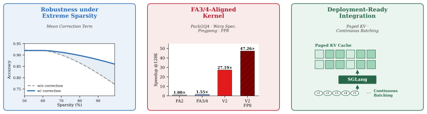
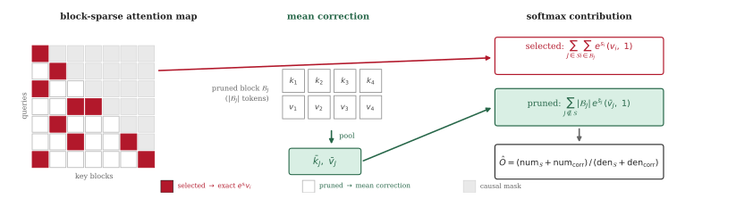
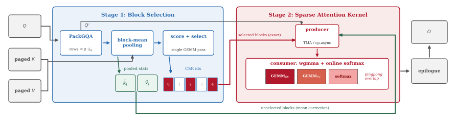
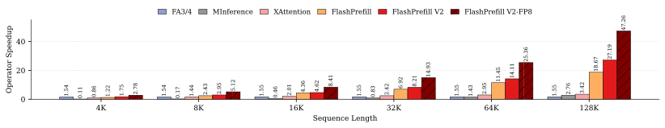

# FlashPrefill V2: Block-Sparse Prefill Attention for Long-Context LLM Serving

> **论文**：FlashPrefill V2: Block-Sparse Prefill Attention for Long-Context LLM Serving
> **作者**：Qihang Fan, Huaibo Huang, Zhiying Wu, Bingning Wang, Ran He
> **arXiv ID**：2608.19758
> **发表时间**：2026-08-20
> **许可协议**：Apache 2.0
> **代码仓库**：https://github.com/qhfan/FlashPrefillv2

## 第 1 章 概述

### 1.1 一句话定位

FlashPrefill V2 是一个面向长上下文 LLM serving 的 block-sparse prefill attention 系统：它在 prefill 阶段以 training-free 的瞬时模式发现（instantaneous pattern discovery）在线挑选需要精确计算的 KV 块，用均值校正项（mean correction term）补偿被剪枝块在 softmax 归一化中被截断的质量，并将"索引 + 稀疏 attention + 校正"全流程实现为对齐 FlashAttention-3/4 工程水准的 Hopper 算子（PackGQA、warp specialization、pingpong、FP8、paged KV cache），可直接作为 SGLang 的 attention backend 部署——128K 上下文下算子级相对 FA2 加速 27.19×（BF16）/ 47.26×（FP8），端到端 TTFT 降低至 1/4.8（FP8），同时 RULER 精度损失平均控制在 1.1 分以内。

### 论文图表总览

| 编号 | 内容 | 章节 |
|------|------|------|
| **Figure 1** | FlashPrefill V1 → V2 的三维演进路线（精度可控、算子对齐 FA3/4、系统可部署） | 第 2 章 |
| **Figure 2** | 各稀疏算子在 H20 上相对 FlashAttention-2 的加速比（含 FA3/4-aligned dense 基线） | 第 5 章 |
| **Figure 3** | FlashPrefill V2 两阶段 prefill pipeline（index 阶段 + attention 阶段，含校正路径） | 第 3 章 |
| **Figure 4** | 均值校正示意：选中块（红）精确计算，剪枝块用均值统计量补偿 | 第 3 章 |
| **Figure 5** | 与 HPC-Ops BSA 生产算子在 64K FP8 下的延迟对比 | 第 5 章 |
| **Figure 6** | 均值校正的运行时间开销（64K，各稀疏度） | 第 5 章 |
| **Table 1** | RULER 分数 + 注意力算子相对 FA2 的加速比（3 模型 × 6 长度） | 第 5 章 |
| **Table 2** | LongBench 全部 21 个任务对比（3 模型 × 7 方法） | 第 5 章 |
| **Table 3** | 各序列长度下的注意力密度（needle-in-a-haystack 测量） | 第 5 章 |
| **Table 4** | 端到端 TTFT（SGLang，3 模型 × 4 batch size × 128K） | 第 5 章 |
| **Table 5** | 开放回路 serving 结果（Poisson 到达 1-16 req/s） | 第 5 章 |
| **Table 6** | chunked prefill 兼容性（8K/16K chunk） | 第 5 章 |
| **Table 7** | 与 HPC-Ops BSA 的设计差异对比 | 第 5 章 |
| **Table 8** | 均值校正消融（RULER，Qwen3-4B，BF16/FP8） | 第 5 章 |
| **Table 9** | 选择阈值 α 扫描（64K，Qwen3-4B，FP8） | 第 5 章 |

### 1.2 核心贡献

论文将 V1 到 V2 的演进组织为三个正交维度——精度、算子性能、系统可部署性——分别对应 FlashPrefill V1 遗留的三个不足（见 2.4 节）。

**贡献一：均值校正项，使稀疏剪枝的近似误差降到二阶**

V1 的 max 动态阈值（$\text{thresh}_I = \alpha \cdot \max_J \text{Score}_{I,J}$）直接丢弃未选中块，softmax 中被截断的概率质量没有任何补偿，精度随稀疏度恶化且不可控。V2 对每个被剪枝块 $J$ 用均值池化统计量（$\bar{k}_J$、$\bar{v}_J$）构造校正项，将 $|B_J| e^{\bar{s}_J} \bar{v}_J$ 同时注入输出估计的分子与分母：

$$\hat{O} = \frac{\sum_{J \in \mathcal{S}} \sum_i e^{s_i} v_i + \sum_{J \notin \mathcal{S}} |B_J|\, e^{\bar{s}_J} \bar{v}_J}{\sum_{J \in \mathcal{S}} \sum_i e^{s_i} + \sum_{J \notin \mathcal{S}} |B_J|\, e^{\bar{s}_J}}$$

理论上给出三条误差界：(i) max 阈值本身限制被剪枝块的质量份额 $w_J/D \lesssim \alpha$；(ii) 校正后的残余误差是块内协方差项，块内独立时消失、Cauchy-Schwarz 下有界；(iii) 相对直接丢弃（零阶误差），校正把逐块误差比压到 $O(\delta_{\text{rms}})$。实验上，消融显示 FP8 下无校正时 128K RULER 退化 6.2 分（62.78 vs 68.97），加校正后 FP8 平均分 85.82 全程跟踪 BF16 的 86.23；$\alpha$ 从 0.2 扫到 0.0125（64K 下选中密度 5.2%→23.6%）时，校正后 FP8 分数始终平坦在 80.12–80.75，而无校正版本退化 2.73–5.44 分。

**贡献二：Hopper 对齐的 block-sparse attention 算子**

V1 的 CUDA 算子停留在 FA2 世代的工程水准。V2 按 FlashAttention-3/4 的最新实践重新设计稀疏算子：

- **PackGQA 内存布局**：将 Q 从 $L \times H_q \times d$ 重排为 $(gL) \times H_{kv} \times d$（$g$ 为 GQA 组数），每个 KV block 被 query tile 的所有行消费，index 元数据规模随 $g$ 缩小，decode 侧 KV staging 最多节省 $g$ 倍搬运；
- **warp specialization 的 producer–consumer 流水线**：1 个 producer warpgroup 以 TMA 加载数据、2 个 consumer warpgroup 执行 wgmma，经 warpgroup 寄存器重分配衔接；consumer 内部以 pingpong 交替 GEMM 与 online-softmax；
- **FP8（e4m3）执行**：$\tilde{P}$ 以 $2^8$ 偏移用满 [0, 256] 动态范围；针对 wgmma K-major B 操作数约束做寄存器重排（shfl + byte_perm）；$\tilde{V}$ 以列主零拷贝转置（LDSM → byte-permute → STSM）；
- **index-driven CSR 遍历与单趟融合**：反向遍历序匹配 dense schedule 的降序访问，producer 与 consumer 无同步地独立评估同一序列；running max 与 block energies 在线融合、直接写入 index buffer，消除独立 score buffer 与第二趟 GEMM；针对 heavy-tail tiles 的稀疏感知负载均衡（block-sparse 路径总是允许 KV split，设备端按因果负载降序排序）。

效果：128K 下算子级相对 FA2 加速 27.19×（BF16，Qwen3-30B-A3B）/ 47.26×（FP8），相对 FA3/4 对齐的 dense 基线仍有 17.54×（BF16）/ 30.49×（FP8）；显著超过先前 training-free 稀疏方法（FlashPrefill V1 18.7×、FlexPrefill 5.4×、XAttention 3.4×、MInference 2.8×）。

**贡献三：面向生产 serving 的系统级可部署性**

V2 原生支持 paged KV cache（以 page_table 间接寻址）与 variable-length / continuous batching，并配备 varlen-aware persistent scheduler。整个 prefill 组织为两阶段 pipeline：index 阶段（pack queries、score pooled blocks、compact 为 CSR）与 attention 阶段（warp-specialized 稀疏算子 + 均值校正）。系统以 SGLang 0.5.10 attention backend 形式集成，无任何模型侧修改：extend 阶段走稀疏路径、decode 阶段回退 dense；$\alpha$/sink/window 作为 server 级参数；每步构建一次供所有层共享的 index 元数据。端到端效果：128K 下 TTFT 降低 3.4×（BF16）/ 4.8×（FP8）（batch=16、Qwen3-30B-A3B：123.23 s → 36.21 s → 25.51 s）；open-loop 低请求速率（1 req/s）下 P50 TTFT 改善 4.5×–5.1×（BF16）、11.4×–27.5×（FP8），高负载下仍保持 1.8×–2.3× / 3.1×–3.3×。

### 1.3 关键结果速览

| 指标 | 结果 | 说明 |
|------|------|------|
| 128K 上下文算子加速（BF16） | 27.19× vs FlashAttention-2 | Qwen3-30B-A3B，Table 1 |
| 128K 上下文算子加速（FP8） | 47.26× vs FlashAttention-2 | Qwen3-30B-A3B，Table 1 |
| 128K 上下文加速（FP8，vs FA3/4-aligned dense） | 30.49× | 摘要/Fig 2 |
| 128K 上下文加速（BF16，vs FA3/4-aligned dense） | 17.54× | Fig 2 |
| RULER 平均精度损失 | ≤ 1.1 分（3 模型） | 87.79 vs 88.82 等，Table 1 |
| LongBench 平均精度损失 | ≤ 0.9 分 | 50.73 vs 51.63 等，Table 2 |
| 128K 注意力密度 | < 5% | Table 3（4.6%-4.9%） |
| 端到端 TTFT 降幅（SGLang 集成） | 最高 3.4×（BF16）/ 4.8×（FP8） | Table 4 |
| 均值校正 FP8 收益（128K） | 6.2 分 | Table 8：62.78 → 68.97 |
## 第 2 章 研究背景与动机

### 2.1 注意力的二次复杂度

对长度为 $L$ 的序列，标准 attention 需要计算 $L \times L$ 的 score 矩阵并做两次相应规模的矩阵乘：

$$\text{FLOPs} \propto L^2 d, \quad d \text{ 为 head 维度}$$

FlashAttention 一类 IO-aware tiling 算子消除了 $L \times L$ 中间矩阵的 HBM 物化，把 attention 变成基于 online-softmax 的流式计算，但计算量本身仍是 $O(L^2)$。上下文从 4K 增长到 128K 时，attention 的绝对计算量按 $L^2$ 放大约 1024 倍（$(128/4)^2 = 1024$），远超 FFN 等随 $L$ 线性增长的组件，使 attention 成为长上下文的主导成本。

论文的密度分析（Table 3）进一步指出：注意力的有效信息随 $L$ 增长急剧稀疏化——4K 上下文时三个模型的选中密度约 70%（Llama-3.1-8B 76.0%、Qwen3-4B 72.0%、Qwen3-30B-A3B 70.4%），而 128K 时降至 5% 以下（4.6%–4.9%）。也就是说，$L^2$ 增长中的绝大部分计算花在了对输出几乎无贡献的块上：上下文越长，稀疏化的潜在收益越大，这构成了 block-sparse prefill 的实证基础。

### 2.2 prefill 阶段的计算瓶颈

LLM serving 两个阶段的负载特性截然不同：decode 每 step 只处理 1 个 token，受限于 KV cache 读取带宽，是 memory-bound；prefill 需一次性并行处理整个 prompt，attention 部分是 compute-bound。长上下文请求的 TTFT（time-to-first-token）因此主要由 prefill 决定，并随上下文长度平方恶化——在 RAG、长文档理解、agent 历史回放等场景中，128K 级 prompt 的 prefill 可达百秒量级（论文 Table 4：batch=16 时 Qwen3-30B-A3B 的 128K prefill 为 123.23 s）。

现有框架缓解 prefill 压力的常规手段是 chunked prefill——把长 prompt 切成多个 chunk、与 decode 交错执行，以平衡显存占用与调度并发。但对动态稀疏方法而言，chunk 切分引入了额外代价：每个新 chunk 到达时都需要对已有 KV 前缀重新执行索引计算，chunk 越小、重复越多（量化后果见 7.2 节）。这使得"一次索引、全程复用"与"细粒度调度"之间存在张力，是稀疏 prefill 落地到生产框架时必须正面处理的系统问题。

### 2.3 稀疏注意力的三条技术路线

降低 attention 复杂度的稀疏化工作大致分为三类：

1. **固定稀疏布局**（window、global/sink、hash 等）：以静态先验决定保留哪些块。布局已知、kernel 可高度优化，但对内容不敏感，为保证精度必须保守地选择较高密度，在 128K 这类本可稀疏到 5% 以下的场景收益有限。
2. **可学习稀疏**：在训练或微调阶段学习稀疏模式或门控。能贴合数据分布，但需要改动训练流程，对"直接服务已发布 checkpoint"的 serving 场景不适用。
3. **training-free 估计**：推理时在线估计各 KV 块的重要性分数再剪枝，MInference、FlexPrefill、XAttention、FlashPrefill 均属此类。它们共同的工程挑战有二：其一，估计本身要快——Top-k 或 p-percentile 类选择需要对分数排序，产生随序列规模增长的排序延迟；其二，"估计"与"执行"两个阶段若 kernel 割裂，稀疏省下的计算会被低效实现吃掉。

与稀疏化平行的一条路线是线性/循环注意力，将复杂度降到 $O(L)$，但改变了计算语义、通常需要重训，与 training-free serving 的目标不兼容。

系统侧的进展同样关键。FlashAttention-2/3/4 序列定义了 dense attention 算子的性能上限：TMA 异步加载、wgmma 张量核指令、warp specialization 的 producer–consumer 划分、pingpong 重叠与 FP8 量化逐代引入。由此得出一个朴素但重要的推论：稀疏 attention 算子若不达到同等工程水准，其"少算 $\rho$ 倍计算"的理论收益可能整体被 kernel 效率差距抵消。Serving 框架方面，vLLM 的 PagedAttention 与 SGLang 以 paged KV cache 和 continuous batching 成为事实标准，任何算子要进入生产都必须原生适配其 KV 布局与调度模型。

### 2.4 FlashPrefill V1 的贡献与三个不足

FlashPrefill（V1）在 training-free 路线上推进了一步，其框架为两件事：**块级分数估计**——probe queries 均匀分布在 query 序列上，一次前向同时解析 vertical、slash、block-sparse 等模式，AM-GM 不等式保证池化分数是块内真实分数的下界，融合 kernel 直接在片上完成估计、避免 $L \times (L/B)$ score 矩阵的物化；**max 动态阈值**——对每个 query tile 取 $\text{thresh}_I = \alpha \cdot \max_J \text{Score}_{I,J}$，超阈值块入选，并始终保留 attention sink、局部 window 与 recent 块。该设计以逐 tile 的 max 代替全局排序，消除了 Top-k/p 方法的排序延迟。

但作者明确指出 V1 是算法原型，距生产部署存在三个不足，构成 V2 的直接动机：

1. **精度不可控**。阈值剪枝直接丢弃未选中块，被截断的 softmax 质量没有任何补偿；稀疏度越高退化越明显，FP8 量化误差叠加下进一步放大（消融显示无校正时 FP8 的 128K RULER 相对有校正退化 6.2 分）。精度随稀疏度不可控地漂移，使 V1 难以给出"多稀疏是安全的"这类部署承诺。
2. **kernel 落后 FA3/4**。V1 算子未采用 TMA、wgmma、warp specialization、pingpong、FP8 等 FlashAttention-3/4 世代的硬件特性，与最新 dense 算子存在工程代差，稀疏收益被实现效率折损。
3. **不兼容 paged KV**。V1 假设 KV 连续存放，无法直接接入 vLLM PagedAttention / SGLang 的 paged KV cache 与 continuous batching 调度，也缺少 variable-length 支持，因而不具备作为现代推理框架 attention backend 的条件。

三个不足分别指向算法、算子、系统三个层面，V2 的三项贡献与之逐一对应（见 1.2 节）。

---



*图1：FlashPrefill V1 → V2 的三维演进——精度可控（均值校正）、算子对齐 FA3/4（PackGQA + warp 特化 + pingpong）、系统可部署（paged KV + continuous batching + SGLang 集成）。*


## 第 3 章 均值校正：极端稀疏下的精度保障

### 3.1 FlashPrefill 框架回顾

FlashPrefill V2 建立在 V1 的块级稀疏框架之上。考虑 prefill 阶段长度为 $L$ 的序列，单注意力头的查询、键、值矩阵为 $Q, K, V \in \mathbb{R}^{L \times d}$，因果输出为：

$$O = \mathrm{softmax}(QK^{\top}/\sqrt{d} + \mathcal{M})\,V$$

FlashPrefill 将 $K$ 和 $V$ 划分为大小为 $B$ 的块，通过两阶段加速 prefill：先用均匀分布的 probe queries 估计块级分数，再做基于最大值的动态阈值选择。

#### 块级分数估计

每个键块 $\mathcal{B}_J$ 用其均值池化键 $\bar{k}_J = \frac{1}{B}\sum_{k_i \in \mathcal{B}_J} k_i$ 表示。由于 $\exp(q \cdot \bar{k}_J)$ 是逐 token 分数 $\{\exp(q \cdot k_i)\}$ 的几何平均，由 AM-GM 不等式可知它下界于块的真实贡献 $\frac{1}{B}\sum_i \exp(q \cdot k_i)$；而注意力分布的低块内方差保证了跨块排序得以保持。为避免物化 $L \times (L/B)$ 的分数矩阵，一个融合 kernel 对每个查询 tile $I$ 和键块 $J$ 计算：

$$m_{I,J} = \max_{q_i \in I}\,(q_i \cdot \bar{k}_J), \qquad \mathcal{S}_{I,J} = \sum_{q_i \in I} \exp(q_i \cdot \bar{k}_J - m_{I,J}) \tag{1}$$

随后用全局重缩放 $\mathcal{M}_I = \max_J m_{I,J}$ 与行归一化：

$$\mathrm{Score}_{I,J} = \frac{\mathcal{S}_{I,J} \cdot \exp(m_{I,J} - \mathcal{M}_I)}{\sum_{J'} \mathcal{S}_{I,J'} \cdot \exp(m_{I,J'} - \mathcal{M}_I) + \varepsilon} \tag{2}$$

内存占用从 $O(L^2/B)$ 降至 $O((L/B)^2)$。

#### 基于最大值的动态阈值

V1 不用需要全局排序或累加求和的 Top-$k$/Top-$p$ 选择，而是为每个查询块 $I$ 从其峰值分数推导剪枝阈值：

$$\mathrm{thresh}_I = \alpha \cdot \max_J \mathrm{Score}_{I,J} \tag{3}$$

保留所有满足 $\mathrm{Score}_{I,J} \geq \mathrm{thresh}_I$ 的键块，以及因果约束下的首个 sink 块、局部滑窗带和最近的若干块。随后只对选中块执行块稀疏注意力。

### 3.2 均值校正项

对查询 $q$ 及其逐 token logits $s_i = q \cdot k_i / \sqrt{d}$，设 $\mathcal{S}$ 为选中块集合。FlashPrefill 将 softmax 的两个求和都截断到 $\mathcal{S}$ 来近似精确输出：

$$O = \frac{\sum_J \sum_{i \in \mathcal{B}_J} e^{s_i} v_i}{\sum_J \sum_{i \in \mathcal{B}_J} e^{s_i}} \approx \frac{\sum_{J \in \mathcal{S}} \sum_{i \in \mathcal{B}_J} e^{s_i} v_i}{\sum_{J \in \mathcal{S}} \sum_{i \in \mathcal{B}_J} e^{s_i}} \tag{4}$$

在极端稀疏下，被丢弃的质量 $\sum_{J \notin \mathcal{S}} \sum_{i \in \mathcal{B}_J} e^{s_i}$ 不能再被忽略。FlashPrefill V2 用零阶均值校正恢复它：对每个键块 $J$ 预计算

$$\bar{k}_J = \frac{1}{|\mathcal{B}_J|}\sum_{i \in \mathcal{B}_J} k_i, \qquad \bar{v}_J = \frac{1}{|\mathcal{B}_J|}\sum_{i \in \mathcal{B}_J} v_i, \qquad \bar{s}_J = q \cdot \bar{k}_J / \sqrt{d} \tag{5}$$

校正后的输出为：

$$\hat{O} = \frac{\sum_{J \in \mathcal{S}} \sum_{i \in \mathcal{B}_J} e^{s_i} v_i + \sum_{J \notin \mathcal{S}} |\mathcal{B}_J|\, e^{\bar{s}_J} \bar{v}_J}{\sum_{J \in \mathcal{S}} \sum_{i \in \mathcal{B}_J} e^{s_i} + \sum_{J \notin \mathcal{S}} |\mathcal{B}_J|\, e^{\bar{s}_J}} \tag{6}$$

即每个被剪枝的块以单个均值向量 $(\bar{k}_J, \bar{v}_J)$ 的形式参与 softmax 的分子和分母。

#### 近似误差分析

记 $\delta_i = s_i - \bar{s}_J$（满足 $\sum_i \delta_i = 0$），块内均值用 $\overline{(\cdot)}$ 表示。块 $J$ 的精确质量和加权值围绕 $\bar{s}_J$ 展开为：

$$\sum_{i \in \mathcal{B}_J} e^{s_i} = |\mathcal{B}_J|\, e^{\bar{s}_J}\Big(1 + \tfrac{\overline{\delta^2}}{2} + O(\overline{\delta^3})\Big), \qquad \sum_{i \in \mathcal{B}_J} e^{s_i} v_i = |\mathcal{B}_J|\, e^{\bar{s}_J}\Big(\bar{v}_J + \overline{\delta v} + O(\overline{\delta^2 v})\Big) \tag{7}$$

其中 $\overline{\delta v} = \frac{1}{|\mathcal{B}_J|}\sum_i \delta_i (v_i - \bar{v}_J)$ 是 logit 偏差与值之间的块内协方差：**质量代理是二阶精确的，而分子代理保留一阶协方差项**。

设块质量 $w_J = \sum_{i \in \mathcal{B}_J} e^{s_i}$、总质量 $D = \sum_J w_J$、精确块均值 $\mu_J = w_J^{-1}\sum_{i \in \mathcal{B}_J} e^{s_i} v_i$。用代理替换剪枝块会使输出偏移：

$$\Delta_J = \frac{w_J}{D}\,\big(\mu_J - \bar{v}_J\big) + O\!\Big(\frac{w_J}{D}\,\overline{\delta^2}\Big), \qquad \mu_J - \bar{v}_J = \overline{\delta v} + O(\overline{\delta^2 v}) \tag{8}$$

该误差由三个界控制：

**(i) 质量份额界**。基于最大值的阈值化（式 3）限制每个剪枝块的质量份额 $w_J / D \lesssim \alpha$，因此总偏移是有符号小份额之和：

$$\Big\|\sum_{J \notin \mathcal{S}} \Delta_J\Big\| \leq \rho_{\mathrm{pr}} \cdot \max_{J \notin \mathcal{S}} \big\|\mu_J - \bar{v}_J\big\|, \qquad \rho_{\mathrm{pr}} = \sum_{J \notin \mathcal{S}} \frac{w_J}{D} \tag{9}$$

**(ii) 协方差有界性**。块内偏差是一个协方差：块内独立时消失，且由 Cauchy–Schwarz 不等式受分散度约束：

$$\overline{\delta v} = 0 \ \text{if} \ \delta \perp (v - \bar{v}_J), \qquad \big\|\overline{\delta v}\big\| \leq \delta_{\mathrm{rms}} \cdot \sigma_v \tag{10}$$

其中 $\sigma_v$ 是块内值分散度，在支撑块均值分数估计的低块内方差假设下本身很小。

**(iii) 相对直接丢弃的优势**。相对于直接丢弃该块 $\Delta_J^{\mathrm{none}} = \frac{w_J}{D}(\mu_J - O)$，校正消除了零阶项而只保留协方差：

$$\frac{\|\Delta_J\|}{\|\Delta_J^{\mathrm{none}}\|} = \frac{\|\mu_J - \bar{v}_J\|}{\|\mu_J - O\|} \sim O(\delta_{\mathrm{rms}}) \tag{11}$$

因为 $\mu_J - O$ 是块间偏差而 $\mu_J - \bar{v}_J$ 是块内偏差。显著块始终走精确路径，只有小 $w_J$ 尾部进入式 9。实验上（Table 8），移除校正项在 128K FP8 下代价高达 6.2 分，而校正后的流水线在 128K BF16 下距全注意力仅 1.5 分。

#### 实现

如图 3 的绿色校正路径所示，只有对整块查询 tile 完全可见的块才被校正；与对角线带相交的块由精确的 sink/window/recent 选择覆盖。在 kernel 内部，每个被校正块作为一次额外迭代进入流水线，其分数偏移 $\log|\mathcal{B}_J|$，使单个均值向量在式 6 的分子和分母中都代表 $|\mathcal{B}_J|$ 个 token——复用同一 MMA 流水线和 online-softmax 重缩放，无需额外 kernel 启动。具体地，对选中块列表做两指针扫描，将每个 chunk 的校正目标聚合为位掩码 $\mathrm{todo} = \mathrm{valid} \mathbin{\&} \lnot\,\mathrm{selected}$，所有块都被选中的 chunk 由 producer 和 consumer 同样跳过，流水线无需额外同步即可保持锁步。



*图4：均值校正示意——红色选中块走精确 softmax 路径，被剪枝块以均值统计量 $(\bar{k}_J, \bar{v}_J)$ 补偿进分子与分母，实现零阶误差恢复。*


## 第 4 章 Hopper 对齐的稀疏注意力算子与系统集成

### 4.1 PackGQA 内存布局

分组查询注意力（GQA）比例 $g = H_q / H_{kv}$ 下，朴素映射为每个（查询头, MM-tile）对分配一个线程块，导致 $g$ 个线程块重复加载同一 KV 块。V2 将查询矩阵重塑为：

$$Q \in \mathbb{R}^{L \times H_q \times d} \longrightarrow Q' \in \mathbb{R}^{(g \cdot L) \times H_{kv} \times d} \tag{12}$$

打包后的行索引 $r$ 通过以下映射对应位置和头：

$$\mathrm{pos}(r) = \lfloor r/g \rfloor, \qquad h(r) = h_{kv} \cdot g + (r \bmod g) \tag{13}$$

每行只需一次快速 divmod。$Q'$ 的每个 MM-tile 覆盖 $kBlockM/g$ 个位置、全部 $g$ 个头（同一 KV 组），获得三个性质：(i) 每个暂存的 KV 块被 tile 的所有行消费，保证共享内存内的组内共享，不依赖跨 CTA 的 L2 驻留；(ii) 稀疏索引按 KV 头定义，索引元数据缩小 $g$ 倍；(iii) tile 对任意 $L$ 保持满占用——朴素映射的浪费行比例为 $(\lceil L/kBlockM\rceil kBlockM - L)/(\lceil L/kBlockM\rceil kBlockM)$，打包后降为 $(\lceil gL/kBlockM\rceil kBlockM - gL)/(\lceil gL/kBlockM\rceil kBlockM)$，对 $L \leq kBlockM/g$（如 decode）可将 KV 暂存最多削减整个 $g$ 倍。$Q$ 用向量化 cp.async 加载，同行线程共享一个 warp 以摊薄页表查找。

### 4.2 Warp 特化的 Producer-Consumer 流水线

持久化 kernel 将 warpgroup 分为：一个 producer warpgroup 负责发起异步 TMA/cp.async 加载 K/V（及校正 chunk）到多级共享内存流水线，两个 consumer warpgroup 在暂存的 tile 上执行 wgmma，两角色间通过寄存器重分配（warpgroup_reg_dealloc/alloc）切换。在此基础上，每个 consumer warpgroup 内 GEMM 与 softmax 以 pingpong 方式推进：每一步发出块 $n$ 的 QK GEMM、块 $n{+}1$ 的 PV GEMM 和块 $n$ 的 online softmax：

$$\underbrace{S^{(n)} = Q\,K_{(n)}^{\top}}_{\mathrm{GEMM}_0} \;\parallel\; \underbrace{O \mathrel{+}= P^{(n+1)}\,V_{(n+1)}}_{\mathrm{GEMM}_1} \;\parallel\; \underbrace{\tilde{P}^{(n)} = \mathrm{online\text{-}softmax}(S^{(n)})}_{\mathrm{softmax}} \tag{14}$$

使 MMA 与非 MMA（指数、重缩放）单元重叠而非互相阻塞。这与 FA3/4 的 warpgroup 内重叠调度一致，V2 的稠密路径复刻了该调度以提供强基线。

### 4.3 FP8 执行

采用 per-tensor 缩放因子 $c_q, c_k, c_v$，FP8-e4m3 操作数在 online softmax 内部即时反量化：

$$S = c_q c_k \cdot \big(\tilde{Q}\,\tilde{K}^{\top}\big), \qquad \tilde{P} = \big\lfloor 2^{8} \cdot \exp(S - m)\big\rceil_{\mathrm{e4m3}} \in [0, 256], \qquad O = c_v \cdot \frac{\sum_t \tilde{P}^{(t)} \tilde{V}^{(t)}}{\sum_t \tilde{P}^{(t)}} \tag{15}$$

其中 $\lfloor\cdot\rceil_{\mathrm{e4m3}}$ 表示 FP8 量化、$m$ 为行运行最大值。$2^8$ 偏移将概率映射到 $[0, 256]$，充分利用 e4m3 动态范围；它在 softmax 比值中抵消，仅在 finalize 的 log-sum-exp 中恢复。

第二个 GEMM 需要特殊处理：FP8 wgmma 要求 B 操作数为 K-major（转置）布局，约束了 $\tilde{V}$ 的喂入方式：

- **列主 $\tilde{V}$**：天然满足布局，零拷贝消费；概率片段 $\tilde{P}$ 则通过 warp shuffles 和字节置换在寄存器内重排为 wgmma A 操作数布局，输出列在 epilogue 中对称地反置换：

$$\tilde{P} \xrightarrow{\ \mathrm{shfl} + \mathrm{byte\_perm}\ } \tilde{P}', \qquad O' = \tilde{P}'\,\tilde{V} \xrightarrow{\ \mathrm{epilogue}\ } O \tag{16}$$

- **行主 $\tilde{V}$**：由 producer 在共享内存内用 LDSM.T → byte-permute → STSM 序列即时转置；为避免 bank 冲突，转置时对 $\tilde{V}$ 的列做置换，并在 epilogue 恢复 $O$ 的列序。

两种情况下布局转换都不产生全局内存流量，PV GEMM 直接从寄存器消费 $\tilde{P}$（RS-mode wgmma）。

### 4.4 索引驱动的稀疏遍历

选择结果存储为 CSR 索引：对每个（batch, head, tile）段 $g$ 有偏移 $\mathrm{cu}[g]$ 和 $T = \mathrm{cu}[g{+}1] - \mathrm{cu}[g]$，升序索引列表 $\{\mathrm{idx}[\mathrm{cu}[g]+i]\}_{i=0}^{T-1}$ 定义迭代块序列：

$$n^{(t)} = \mathrm{idx}\big[\mathrm{cu}[g] + T - 1 - t\big], \qquad t = 0, \dots, T-1 \tag{17}$$

反向遍历以匹配稠密调度的降序。Producer 和 consumer 独立求值同一序列 $\{n^{(t)}\}$，控制流按构造一致，流水线无需任何块跳过同步即保持锁步；$n^{(t)}$ 的加载与 GEMM 还在飞行时即预取下一索引 $n^{(t+1)}$，索引解析不落在关键路径上。在 KV 分裂下，分裂 $u$（共 $U$ 份）接收连续子序列：

$$t \in \big[\,u \cdot \lceil T/U \rceil,\; \min\big((u{+}1)\lceil T/U \rceil,\, T\big)\,\big) \tag{18}$$

即 CSR 列表按**选中块数量**而非位置区间分割，使各分裂的实际工作量均衡。

### 4.5 单趟分数与选择

分数计算与阈值化融合为对池化键的一次遍历。以 $s_{iJ} = q_i \cdot \bar{k}_J / \sqrt{d}$ 计，打分 kernel 维护行运行最大值 $M$ 和块能量在线量：

$$M \leftarrow \max(M, M_{\text{tile}}), \qquad E_J = \sum_{q_i \in I} 2^{\,s_{iJ} \log_2 e - M} \tag{19}$$

然后直接写入索引缓冲区本身（连同每 chunk 最大值），消除单独的分数缓冲区和第二趟 GEMM。选择只需重缩放和阈值化：

$$\hat{E}_J = E_J \cdot 2^{\,M_c - M_{\text{final}}}, \qquad J \in \mathcal{S} \Longleftrightarrow \hat{E}_J \geq \alpha \cdot \max_{J'} \hat{E}_{J'} \lor J \in \{\text{sink}\} \cup \{\text{window}\} \cup \{\text{diag}\} \tag{20}$$

幸存者在原地压缩——写位置永不越过扫描位置，因此安全。

### 4.6 稀疏感知的负载均衡

PackGQA 后，tile $I$ 的代价与其选中块数成正比：

$$C(I) \propto T_I = O(L) \ \text{for the last tiles}, \qquad O(1) \ \text{otherwise} \tag{21}$$

稠密启发式在 tile 覆盖所有 SM 后禁用分裂，会把重尾 tile 串行化。V2 在块稀疏路径上总是允许分裂：请求按因果工作负载降序由调度器准备阶段的设备端排序排列，每个 tile 的选中块列表按数量均匀分割到各分裂（式 18），使每个分裂获得相等的实际稀疏工作量；tile 分配由对每请求长度的 warp 级并行前缀扫描解析。

### 4.7 Paged 与变长执行

K/V 寻址经过页表：请求 $b$ 的键 token $j$ 的全局地址为：

$$\mathrm{addr}(b,j) = \mathrm{page\_table}\big[b,\ \lfloor j/p \rfloor\big] \cdot p + (j \bmod p) \tag{22}$$

页大小 $p$，用 cp.async 即时解析；varlen 感知的持久调度器从每请求长度 $(L_b^q, L_b^{kv})$ 枚举 $(b, h, I)$ 工作单元——这正是 continuous batching 的执行模型。CSR 索引格式与 SGLang 兼容，可直接作为注意力后端集成。

#### 实现细节

所有实例共用单一 tile 配置（$128 \times 64$，两阶段 smem 流水线，每个逻辑块 $B/64$ 个物理 tile）；寄存器在角色间静态重分配：producer 持 24 个寄存器（paged 路径的 cp.async 为 40 个），每个 consumer warpgroup 持 240 个（paged 路径 232 个）。

### 4.8 端到端 Prefill 流水线与开销分析

给定一批请求，新 token 长度 $\{L_b^q\}$ 与缓存 KV 长度 $\{L_b^{kv}\}$，V2 每层执行两个阶段：index 阶段（打包查询、给池化块打分、压缩幸存者为 CSR 索引）和 attention 阶段（对选中块运行 warp 特化稀疏算子 + 均值校正）。

对 KV 组大小 $g$、查询长度 $L_q$、KV 长度 $L$，三个组件的 FLOP 代价为：

$$C_{\text{idx}} = O\!\Big(gL_q \cdot \tfrac{L}{B} \cdot d\Big), \qquad C_{\text{corr}} = O\!\Big(gL_q \cdot \tfrac{(1-\rho)L}{B} \cdot d\Big), \qquad C_{\text{attn}} = O\!\big(gL_q \cdot \rho L \cdot 2d\big) \tag{23}$$

其中 $\rho$ 为保留密度、$B$ 为块大小、因子 2 对应 QK 与 PV 两个 GEMM。index 阶段和校正都只对每块一个池化向量操作，因此比稠密参考低 $B$ 倍；相对稀疏注意力本身：

$$\frac{C_{\text{idx}} + C_{\text{corr}}}{C_{\text{attn}}} = O\!\Big(\frac{2 - \rho}{2\rho\,B}\Big) \tag{24}$$

辅助 FLOPs 随保留密度增长而消失，即使 $\rho = 4\%$、$B = 128$ 时也仅约 19%——与 Fig 2 中长上下文的 attention-only 与端到端加速差一致。



*图3：V2 两阶段 prefill pipeline——第一阶段（index）打包查询、池化块均值统计、产出 CSR 索引；第二阶段（attention）在选中块上运行 warp 特化稀疏算子并叠加均值校正。*

### 4.9 Serving 集成

FlashPrefill V2 作为标准注意力后端集成进 SGLang。两阶段流水线运行在 extend（prefill）阶段，decode 回退到稠密注意力——单查询 token 每步没有块级稀疏空间。kernel 所需的 page 级索引由 SGLang 的 token 级映射每 $p$ 条步进派生，per-forward 元数据每步构建一次并由所有层共享。选择超参数（$\alpha$、sink/window 大小）作为 server 参数暴露；index 阶段复用 per-stream workspace cache，容量匹配的复用避免了稳态下的 host 同步或分配器往返。**无需修改模型定义、KV cache 布局或调度逻辑。**


## 第 5 章 实验结果与分析

### 5.1 实验设置

**基准与模型**。在两个广泛认可的长上下文基准上评估：RULER（受控序列长度下的长上下文检索与推理）和 LongBench（多样化真实长上下文任务套件）。评估模型为 Llama-3.1-8B-Instruct、Qwen3-4B-Instruct-2507、Qwen3-30B-A3B-Instruct-2507。

**基线**。对比 Full Attention、MInference、FlexPrefill、XAttention。所有方法在 NVIDIA H20 GPU 上以相同超参设置评估。稠密参考使用 FlashAttention-2 和一个 FA3/4-aligned 稠密 kernel——后者与 V2 稀疏算子共享同一 warp 特化流水线，使测得的加速比隔离稀疏性的收益而非 kernel 工程差异。

**实现细节**。块稀疏算子以固定 tile 大小编译：查询 tile 128 行（kBlockM）、键 tile 64 列（kBlockN）。所有精度评估共享单一配置、不做逐模型调优：选择块大小 $B=128$、256 个 sink token、512 token 局部窗口、max 阈值化 $\alpha = 0.1$。算子级结果在单张 H20 上测得；端到端结果（Table 4/5/6）来自每配置单个 SGLang server 实例，张量并行 $TP{=}4$（四张 H20），无数据并行；decode 注意力后端固定为 FA3/4，仅 prefill 注意力后端变化。软件栈：CUDA 12.9（driver 535.161.08）、PyTorch 2.9.1、CUTLASS 4.3（注意力 kernel）、SGLang 0.5.10（serving）。

各序列长度下测得的注意力密度（needle-in-a-haystack 输入）：

| 模型 | 4K | 8K | 16K | 32K | 64K | 128K |
|------|:---:|:---:|:---:|:---:|:---:|:---:|
| Llama-3.1-8B | 76.0% | 54.2% | 33.6% | 18.7% | 9.0% | 4.6% |
| Qwen3-4B | 72.0% | 48.5% | 29.8% | 17.6% | 9.2% | 4.9% |
| Qwen3-30B-A3B | 70.4% | 46.0% | 29.6% | 16.2% | 9.4% | 4.9% |

密度从 4K 的约 70% 下降到 128K 的约 5%——这是加速比随长度增长的根本来源。

### 5.2 RULER 精度与算子加速

Table 1 报告 RULER 分数（左）与端到端注意力算子相对 FA2 的加速比（右）。三个模型上 V2 平均分距 Full 注意力均在 1.1 分以内（Llama-3.1-8B 87.79 vs 88.82、Qwen3-4B 86.23 vs 87.06、Qwen3-30B-A3B 91.76 vs 92.05），FP8 变体仅额外损失 0.4-1.2 分。差距在 128K 最大——该处密度低于 5%——但 V2 仍保持在 Full 注意力的 1.8 分以内。同时，含索引选择的稀疏算子已在 4K 超越 FA2，128K 时达 BF16 27.2×-27.5×、FP8 47.3×-47.6×。

**Table 1（节选）：RULER 平均分与 128K 加速比**

| 模型 | 方法 | RULER Avg. | 4K 加速 | 128K 加速 |
|------|------|:---:|:---:|:---:|
| Llama-3.1-8B | Full | 88.82 | 1.00× | 1.00× |
| | MInference | 87.30 | 0.12× | 2.45× |
| | FlexPrefill | 87.42 | 0.12× | 5.18× |
| | XAttention | 87.37 | 0.79× | 3.48× |
| | FlashPrefill (V1) | 87.36 | 1.21× | 22.67× |
| | **FlashPrefill V2** | **87.79** | 1.66× | **27.21×** |
| | FlashPrefill V2-FP8* | 86.57 | 2.67× | 47.33× |
| Qwen3-4B | Full | 87.06 | 1.00× | 1.00× |
| | MInference | 85.92 | 0.11× | 2.53× |
| | FlexPrefill | 85.40 | 0.12× | 5.27× |
| | XAttention | 85.74 | 0.81× | 3.43× |
| | FlashPrefill (V1) | 85.90 | 1.21× | 19.26× |
| | **FlashPrefill V2** | **86.23** | 1.72× | **27.45×** |
| | FlashPrefill V2-FP8 | 85.82 | 2.75× | 47.59× |
| Qwen3-30B-A3B | Full | 92.05 | 1.00× | 1.00× |
| | MInference | 91.16 | 0.11× | 2.76× |
| | FlexPrefill | 91.09 | 0.12× | 5.43× |
| | XAttention | 90.67 | 0.86× | 3.42× |
| | FlashPrefill (V1) | 91.11 | 1.22× | 18.67× |
| | **FlashPrefill V2** | **91.76** | 1.75× | **27.19×** |
| | FlashPrefill V2-FP8 | 91.39 | 2.78× | 47.26× |

*注：FP8 带 ∗ 的行表示直接在线量化结果（Llama-3.1-8B 仅该行用直接在线量化）。*

Fig 2 在 batch size 4 下对比 FA3/4-aligned dense kernel 与先前的稀疏算子：128K 时 V2 算子相对 FA2 达 27.2×（BF16）与 47.3×（FP8），相对 FA3/4-aligned dense kernel 为 17.5× 与 30.5×，并显著超越先前稀疏算子（FlashPrefill 18.7×、FlexPrefill 5.4×、XAttention 3.4×、MInference 2.8×）。



*图2：H20 上各注意力算子相对 FA2 的加速比（batch size 4）——V2 在 128K 以 BF16 达 27.2×、FP8 达 47.3×，全面超越先前稀疏算子与 FA3/4-aligned 稠密基线。*

### 5.3 LongBench 精度

Table 2 报告 LongBench 全部 21 个任务（按任务类别分组）的结果。V2 在每个模型上都取得所有稀疏算子中的最高平均分：Llama-3.1-8B 49.31（最强基线 XAttention 48.25）、Qwen3-4B 46.96（vs 45.90）、Qwen3-30B-A3B 50.73（vs 49.61），距全注意力均在 0.9 分以内。优势在检索敏感的合成任务上最显著：英文段落检索上 V2 保持 96.0-99.5 分而基线跌至 91.0-97.0；计数任务上 V2 在三个模型上都是最接近全注意力的。摘要任务近乎无损，V2 偶尔还超过全注意力（如 Llama-3.1-8B 的 SAMSum 44.76 vs 43.59）。FP8 变体即便直接在线量化，平均分仍超过所有基线（48.76 / 46.07 / 50.29）。

**Table 2（节选）：LongBench 平均分与代表任务**

| 模型 | 方法 | Avg. | PR-en | PR-zh | SAMSum | Count | LCC |
|------|------|:---:|:---:|:---:|:---:|:---:|:---:|
| Llama-3.1-8B | Full | 49.76 | 100.00 | 90.45 | 43.59 | 11.10 | 62.93 |
| | XAttention | 48.25 | 95.50 | 85.68 | 44.05 | 6.88 | 61.05 |
| | **FlashPrefill V2** | **49.31** | 97.00 | 89.47 | 44.76 | 7.39 | 62.68 |
| | FlashPrefill V2-FP8* | 48.76 | 96.50 | 85.68 | 44.80 | 6.88 | 63.65 |
| Qwen3-4B | Full | 47.66 | 100.00 | 98.04 | 45.55 | 0.75 | 62.99 |
| | XAttention | 45.90 | 96.00 | 93.89 | 45.13 | 0.00 | 62.24 |
| | **FlashPrefill V2** | **46.96** | 96.00 | 97.17 | 45.78 | 0.50 | 63.50 |
| | FlashPrefill V2-FP8 | 46.07 | 93.00 | 94.67 | 45.89 | 0.50 | 60.85 |
| Qwen3-30B-A3B | Full | 51.63 | 100.00 | 100.00 | 45.79 | 16.50 | 72.12 |
| | XAttention | 49.61 | 97.00 | 99.00 | 45.92 | 3.00 | 71.42 |
| | **FlashPrefill V2** | **50.73** | 99.50 | 99.50 | 46.59 | 6.50 | 72.51 |
| | FlashPrefill V2-FP8 | 50.29 | 98.00 | 99.00 | 46.08 | 8.50 | 72.16 |

*注：Llama-3.1-8B 的 FP8 行（∗）为直接在线量化结果。*


### 5.4 端到端 Serving 延迟

**固定批次（Table 4）**。在 SGLang 中部署 V2，batch size 1-16（continuous batching）。算子级收益直接转化为 serving 延迟：128K 时 V2 将 TTFT 降低 BF16 2.1×-3.4×、FP8 3.7×-4.8×（如 Qwen3-30B-A3B batch 16 从 123.2s 降至 36.2s（BF16）与 25.5s（FP8））。加速比几乎与 batch 无关，表明稀疏算子与稠密后端一样随 continuous batching 扩展。端到端加速比受注意力占 prefill 总计算比例的上限约束，故小于算子级；它随序列长度增长（注意力占比上升），在 Qwen3-30B-A3B 上最大（注意力占 prefill 计算比例更高）。4K 时（密度约 70%）BF16 与 FA3/4 持平（1.01×-1.09×），注意力节省大部分被 index 阶段开销抵消，而 FP8 已交付 1.1×-1.8×。

**开放回路 serving（Table 5）**。请求以 Poisson 过程到达（1-16 req/s），prompt 长度在 4K-128K 混合，prefill 与 decode 持续共享引擎。FA3/4 后端在每个速率下饱和（P50 TTFT 77-106s，请求吞吐上限 0.31-0.37 req/s）；V2 维持约两倍请求吞吐（0.70-0.76 req/s）并将 P50 TTFT 降至 17-46s；FP8 下请求吞吐升至 0.88-1.34 req/s、P50 TTFT 进一步降至 2.8-33s。加速在最低速率最大（1 req/s 时 P50 提升 BF16 4.5×-5.1×、FP8 11.4×-27.5×），此时更快的 prefill 比高负载下更显著地缩短排队；系统加载后仍保持 BF16 1.8×-2.3×、FP8 3.1×-3.3×。更短的 prefill 也惠及 decode：长稠密 prefill 会阻塞并发请求的 decode 步，P50 TPOT 提升 BF16 1.6×-2.4×、FP8 2.3×-8.8×，输出吞吐分别提升 1.9×-2.4× 与 2.4×-3.6×。

**Table 5（节选）：开放回路 serving（Qwen3-4B，128K 混合负载）**

| 速率 (req/s) | 后端 | TTFT P50 (s) | TTFT P99 (s) | TPOT P50 (ms) | 吞吐 (tok/s) | 吞吐 (req/s) |
|:---:|------|:---:|:---:|:---:|:---:|:---:|
| 1 | FA3/4 | 76.73 | 154.64 | 419 | 24.0 | 0.37 |
| | FlashPrefill V2 | 17.23 (4.45×) | 48.73 (3.17×) | 258 (1.62×) | 45.5 (1.90×) | 0.71 |
| | FlashPrefill V2-FP8 | 2.79 (27.47×) | 17.27 (8.95×) | 47 (8.84×) | 58.4 (2.44×) | 0.91 |
| 16 | FA3/4 | 81.91 | 160.99 | 481 | 23.8 | 0.37 |
| | FlashPrefill V2 | 43.22 (1.90×) | 78.68 (2.05×) | 263 (1.83×) | 48.9 (2.05×) | 0.76 |
| | FlashPrefill V2-FP8 | 25.14 (3.26×) | 45.16 (3.56×) | 152 (3.17×) | 85.5 (3.59×) | 1.34 |

**Chunked prefill 兼容性（Table 6）**。chunked prefill（限制每调度步处理的 token 数）是生产引擎保护 token 间延迟的标准机制。Table 6 在 16 req/s 下以 8K/16K chunk 重复开放回路实验。Chunking 几乎不影响稠密后端 TTFT，但侵蚀 V2 的加速——index 选择在每个 chunk 上重跑，且强制尾部块抬高了短 chunk 的有效密度：BF16 的 P50 TTFT 加速在 Qwen3-4B 上从无 chunking 的 1.9× 降至 8K chunk 的 1.6×，在 Qwen3-30B-A3B 上从 2.2× 降至 1.2×。即便如此 V2 在 8K chunk 下仍快于稠密后端（BF16 1.2×-1.6×、FP8 1.5×-2.4×），16K chunk 恢复大部分差距（1.8×-2.0× 与 2.8×-3.0×）——作者建议部署 V2 与 chunked prefill 时 chunk 至少 8K。

**与生产 kernel 的对比**。Fig 5 对比 V2 块稀疏算子与 HPC-Ops 中的块稀疏注意力（BSA）生产 kernel。HPC-Ops BSA 仅支持 FP8，故对比在 64K 序列长度 FP8 下进行。V2 在所有稀疏度上都更快（6% 至 7%），且两个稠密参考相当（123.7 ms vs 133.4 ms），确认收益来自稀疏执行路径而非稠密主干。Table 7 总结设计差异：

| 维度 | HPC-Ops BSA | FlashPrefill V2 |
|------|------------|----------------|
| 稀疏索引格式 | 稠密掩码、padding、按 Q 头 | 选中块的 CSR、按 KV 头 |
| 64K/128K 索引内存 | 8 MB / 32 MB（任意密度） | 3 MB / 6 MB（9% / 5% 密度） |
| GEMM-softmax 重叠 | 串行 | warpgroup 内 pingpong |
| Paged KV 寻址 | per-page TMA（页大小 | 128） | cp.async，任意页大小 |
| KV 分裂 | 无 | 计数均衡的 CSR 分裂 |
| 均值校正 | 无 | 融合进主循环 |
| 精度 | 仅 FP8 | BF16 + FP8 |

**均值校正的开销（Fig 6）**。64K 下，因查询 tile 内所有剪枝块被单趟池化 K/V 均值替换，额外延迟小且绝对量近似恒定：稠密极限下最多 12.2 ms，90% 稀疏时仅 3.6-4.5 ms。相对开销在 50% 稀疏以内保持 5%-14%，仅 90% 稀疏时达 18%（BF16）至 27%（FP8）——而该区域正是校正最需要的精度保障区间。

### 5.5 消融研究

**均值校正的效果（Table 8）**。在 RULER 上用 Qwen3-4B-Instruct-2507 消融均值校正项，对比完整 V2 流水线与直接丢弃所有未选中块的变体：

| 方法 | 4K | 8K | 16K | 32K | 64K | 128K | Avg. |
|------|:---:|:---:|:---:|:---:|:---:|:---:|:---:|
| Full Attention | 94.82 | 92.98 | 91.68 | 88.86 | 82.81 | 71.22 | 87.06 |
| V2 w/o correction | 94.38 | 92.06 | 91.18 | 87.21 | 80.92 | 68.86 | 85.77 |
| **FlashPrefill V2** | 94.49 | 92.42 | 91.56 | 87.48 | 81.67 | 69.76 | 86.23 |
| V2-FP8 w/o correction | 93.78 | 91.82 | 90.68 | 85.04 | 76.86 | 62.78 | 83.49 |
| **FlashPrefill V2-FP8** | 94.13 | 92.37 | 91.36 | 87.47 | 80.59 | 68.97 | 85.82 |

无校正时，丢弃的概率质量随密度下降而增长，精度差距随序列长度扩大：BF16 下变体到 32K 平均仅落后校正流水线 0.3 分，但 64K 时 0.8 分、128K 时 0.9 分（该处选中块不足 5%）。恢复校正项以可忽略的运行时代价（Fig 6）回收几乎全部退化，使 V2 平均距全注意力 0.9 分以内、128K 也仅 1.5 分。

校正项在 FP8 下重要得多：无校正时 FP8 变体相对校正版平均损失 2.3 分、128K 损失 6.2 分（对比 BF16 仅 0.5 与 0.9 分）。作者归因于量化压缩了分数余量，使 max 阈值丢弃的块承载更大 softmax 质量份额，因此恢复它们更关键。开启校正后 FP8 流水线紧密跟随 BF16（平均 85.82 vs 86.23），确认即使池化统计量被量化校正依然有效。

**选择阈值的效果（Table 9）**。在 64K 用 Qwen3-4B-Instruct-2507（FP8）扫描 max 选择阈值 $\alpha$，报告实测注意力密度与带/不带均值校正的分数：

| α | 0.2 | 0.1 | 0.05 | 0.025 | 0.0125 |
|:---:|:---:|:---:|:---:|:---:|:---:|
| Density (%) | 5.2 | 9.2 | 14.1 | 19.8 | 23.6 |
| V2-FP8 w/o correction | 74.68 (−5.44) | 76.86 (−3.73) | 77.16 (−3.51) | 77.41 (−3.31) | 78.02 (−2.73) |
| **FlashPrefill V2-FP8** | 80.12 | 80.59 | 80.67 | 80.72 | 80.75 |

$\alpha$ 从 0.2 降到 0.0125 时，密度从 5.2% 升至 23.6%。校正后的 FP8 流水线在整趟扫描中异常平坦——即便 5.2% 密度也距全注意力（82.81）仅 2.7 分、默认 $\alpha=0.1$ 时 2.3 分——而无校正持续多损失 2.7-5.4 分，差距随密度下降扩大。均值校正因此扩大了可用稀疏范围：有补偿时 $\alpha$ 可在 64K 推到 0.2——相对默认减半密度——仍保持 80.12 分。


## 第 6 章 代码实现详解

官方代码仓库：https://github.com/qhfan/FlashPrefillv2（Apache-2.0，11 stars，1 fork，7 commits）

### 6.1 仓库结构

```
FlashPrefillv2/
├── flashprefill_ops/          # 块稀疏注意力算子（CUDA/CuTe C++，SM90）
│   ├── setup.py, generate_kernels.py, instantiations/   # 构建系统
│   ├── flashprefill/          # 安装后的 Python 包（FlashPrefill、接口、配置）
│   ├── flash_block_sparse_index_triton.py   # Triton 索引选择阶段
│   ├── test_*.py              # 正确性测试（dense/FA3 对比、FP8、均值校正等）
│   └── bench/                 # 基准脚本
├── csrc/cutlass/              # vendored CUTLASS 4.3.4 头文件（仅编译期）
├── sglang_int/                # SGLang 0.5.10 源码树 + FlashPrefill V2 注意力后端
├── install_ops.sh             # 一键算子构建与安装
└── eval_install.py            # 安装冒烟测试（覆盖主要 API）
```

### 6.2 构建与安装

```bash
bash install_ops.sh
```

脚本清理陈旧构建产物、设置论文 H20 环境使用的构建标志（forward only、BF16+FP8、head-dim 128/256、SM90）、在 `flashprefill_ops/` 内运行 `pip install . --no-build-isolation -v`，最后做 import 冒烟测试。安装产物为 `flashprefill` 包（含编译好的 `_C.abi3.so` 扩展）与顶层模块 `flash_block_sparse_index_triton`。

三个常见陷阱：

- **`--no-build-isolation` 必需**（已在 install_ops.sh 中）：构建过程 import torch，而隔离构建环境中不存在 torch
- **`FLASH_ATTENTION_FORCE_BUILD=TRUE` 必需**：否则 setup.py 回退为下载官方上游 FlashAttention-3 wheel 并安装错误的包
- 系统 CUDA 既非 12.8 也非 >= 13.0 时，setup.py 从 developer.download.nvidia.com 下载 nvcc 12.6 + ptxas 12.8 工具链（缓存于 `~/.flashattn`）；离线机器需从已有缓存拷贝或设置 `FLASH_ATTENTION_HOME`

安装验证：`python eval_install.py`，在 paged KV cache（token 级分页）上覆盖 `flash_attn_func`、`flash_attn_with_kvcache`（稠密）、`FlashPrefill.index_select`、`block_sparse_attention`、带/不带均值校正的完整稀疏流水线、两步高层调用、低层直接调用、FP8 流水线。所有检查为冒烟测试（运行 + shape/dtype/有限性）；数值验证用 `flashprefill_ops/test_compare_fa3.py` 与 `flashprefill_ops/test_mean_correction.py`。

### 6.3 高层 API

`FlashPrefill` 类捆绑索引选择与稀疏注意力，内部管理索引 workspace 与校正统计量：

```python
import torch
from flashprefill import FlashPrefill

fp = FlashPrefill(
    k_block_m=128,      # 查询 tile 大小
    k_block_n=128,      # 选择块大小
    abs_threshold=0.1,  # max 选择阈值（越高越稀疏）
    attention_sink=2,   # 始终选中的 sink 块
    window_size=4,      # 始终选中的局部窗口块
    last_n_blocks=8,
    use_mean_correction=True,  # 剪枝块的零阶校正
)
# q: (total_q, num_q_heads, head_dim) varlen 打包查询
# k/v_cache: (num_pages, page_size, num_kv_heads, head_dim) paged KV cache
# page_table: (batch, max_pages) int32; cache_seqlens: (batch,) int32
# cu_seqlens_q: (batch+1,) int32
out = fp(q, k_cache, v_cache, page_table, cache_seqlens, cu_seqlens_q, q_lens)
# -> (total_q, num_q_heads, head_dim)
```

跨调用复用索引时可将流水线拆分：`fp.index_select(...)` 产出索引，随后 `fp.block_sparse_attention(...)` 消费。`k_mean` / `v_mean` / `block_sparse_*` 随索引一起产出并自动接线，无需手动传入。

### 6.4 低层直接调用

完全控制索引/workspace 生命周期时，使用 `flash_block_sparse_index_triton.build_block_sparse_index_fast` 构建索引，再调用 `flash_attn_with_kvcache` 的块稀疏路径（`block_sparse_cu` / `block_sparse_idx` / `k_mean` / `v_mean` 参数，`mean_k_block_size=128` 必须等于选择的 k_block_n，置 0 禁用校正）。

### 6.5 SGLang Serving 集成

`sglang_int/` 是集成了 FlashPrefill V2 后端的 SGLang 0.5.10 源码树。将 Python 路径指向它后启动 server；算子需先安装（`bash install_ops.sh`），后端运行时 import `flashprefill` 与 `flash_block_sparse_index_triton`。`--flashprefill-full-attention-layers N` 将前 N 层路由到 decode（稠密）后端。

### 6.6 许可与衍生

Apache-2.0。捆绑/衍生第三方项目：`flashprefill_ops/` 衍生自 FlashAttention-3（BSD-3-Clause）；`csrc/cutlass/` 含 NVIDIA CUTLASS 头文件（BSD-3-Clause）；`sglang_int/` 含 SGLang 源码树（Apache-2.0）。


## 第 7 章 局限性与延伸阅读

### 7.1 极端稀疏下的残余精度损失

均值校正将剪枝误差压到二阶，但并未归零。整体上 V2 与 Full attention 的 RULER 平均差距在 1.1 分以内（Llama-3.1-8B：87.79 vs 88.82；Qwen3-4B：86.23 vs 87.06；Qwen3-30B-A3B：91.76 vs 92.05），FP8 再额外损失 0.4–1.2 分；但在 128K、密度低于 5% 的极端稀疏区间，残余差距扩大到 ≤1.8 分（Llama-3.1-8B 128K：72.08 vs 73.82，差 1.74 分）。阈值扫描给出更清晰的边界：$\alpha = 0.2$（密度 5.2%）时 FP8 为 80.12 分，距 Full 的 82.81 差 2.7 分——校正让精度对 $\alpha$ 几乎不敏感（80.12–80.75 区间平坦），却不能完全抹平极端压缩下的信息损失。对需要全局精确聚合的任务，残余损失是否可接受仍需按业务逐案评估。

### 7.2 chunked prefill 下的索引重复计算

V2 的 index 阶段针对当前累积的 KV 前缀一次性执行；当 serving 框架启用 chunked prefill 时，长 prompt 被切成多个 chunk 交错处理，每个新 chunk 都要对已有 KV 前缀重新计算块分数并重建 CSR 索引，索引开销随 chunk 数重复发生，稀疏收益被侵蚀。论文 Table 6 的量化结果：chunk=8K 时，BF16 的 prefill 加速从无切分的 1.9× 降至 1.6×（Qwen3-4B），Qwen3-30B-A3B 从 2.2× 降至 1.2×；将 chunk 增大到 16K 后恢复至 1.8×–2.0×（BF16）与 2.8×–3.0×（FP8）。这构成一个部署权衡：chunk 越小，显存占用与调度并发越好，但索引重复的相对代价越重。跨 chunk 增量索引（复用已计算的前缀块分数）是显而易见但论文未实现的改进方向。

### 7.3 decode 阶段无稀疏收益

块级稀疏的前提是 query 侧形成 tile（论文配置为 128×64 tile）：decode 每 step 只有 1 个 query token，无法构成块级稀疏结构，V2 因此在 decode 阶段回退到 dense 路径（官方代码另提供 `--flashprefill-full-attention-layers N`，可将前 N 层显式路由到 dense decode 后端）。换言之，V2 的稀疏收益严格限于 prefill/extend 阶段；论文观测到的端到端 TPOT 改善（1.6×–2.4× BF16、2.3×–8.8× FP8）并非来自稀疏化直接加速 decode，而是因为更短的稀疏 prefill 减少了长稠密 prefill 对并发请求 decode 步的阻塞（实验设置中 decode backend 固定为 FA3/4，仅 prefill 后端变化）。对"长输入、短输出"场景，TTFT 收益显著；对长生成任务，收益结构需要按 prefill/decode 分开核算。

### 7.4 辅助 FLOPs 与校正的运行时开销

稀疏化不是免费的：index 阶段与均值校正都是附加计算。论文的解析分析（Eq23–24）给出辅助 FLOPs 与稀疏 attention 主计算之比：

$$\frac{C_{\text{idx}} + C_{\text{corr}}}{C_{\text{attn}}} = O\!\left(\frac{2-\rho}{2\rho B}\right)$$

其中 $\rho$ 为选中密度、$B$ 为块大小。该比值随密度降低而增大——恰恰在最稀疏（理论收益最大）的工况下，辅助开销占比最高：$\rho = 4\%$、$B = 128$ 时约为 19%。运行时测量（Fig 6）同样显示校正路径的开销随稀疏度上升：稀疏度 ≤50% 时校正占 attention 阶段 5%–14%，90% 稀疏时增至 BF16 18% / FP8 27%（64K 下 3.6–4.5 ms），因为被剪枝块越多、需要校正的块越多。这意味着实际净收益恒小于密度倒数所暗示的理论上限，且 FP8 下（主计算更快）辅助开销的相对占比更高。

### 7.5 硬件与生态边界

算子深度绑定 NVIDIA Hopper（sm_90a，实测于 H20；TMA、wgmma、warp specialization、FP8 wgmma 均为 Hopper 特性），不向下兼容 Ampere/Ada 等旧架构，向更新架构的迁移需重写指令路径。软件依赖链为 CUDA 12.x（论文用 12.9）、PyTorch 2.9.1、Triton（index 阶段）、CUTLASS 4.3 与 SGLang 0.5.10，且构建参数（`--no-build-isolation`、`FLASH_ATTENTION_FORCE_BUILD=TRUE`）对环境敏感。算子以 head-dim 128/256、tile 128×64、$B=128$ 等配置实例化，超出该集合的模型结构需重新实例化 kernel。此外，统一评测配置为 256 sink tokens、512 window、$\alpha = 0.1$，这些超参数虽作为 server 参数暴露，但跨模型/跨负载的最优值仍需使用者自行标定。

### 7.6 延伸阅读

- **FlashAttention 2/3/4**：dense attention 算子的演进脉络（TMA → wgmma → warp specialization/pingpong → FP8），也是 V2 稀疏算子对齐的工程基线（17.54×/30.49× 的对照对象）。
- **training-free 稀疏估计**：MInference、FlexPrefill、XAttention 与 FlashPrefill V1——论文的主要精度与速度基线；比较它们的块选择策略（Top-k / p-percentile / max 阈值）有助于理解 V1→V2 在选择机制与误差补偿上的推进。
- **线性 / 循环注意力**：与稀疏化平行的 $O(L)$ 路线，需重训且改变计算语义，适合作为部署约束下的对照方案。
- **serving 系统**：vLLM PagedAttention（paged KV cache 的起源）、SGLang（V2 的集成宿主，含 continuous batching）、disaggregated prefill/decode 架构（长上下文 TTFT 优化的另一条系统路线）。
- **代码**：官方实现见 https://github.com/qhfan/FlashPrefillv2（Apache-2.0；`flashprefill_ops/` 为 SM90 CUDA/CuTe 算子，`sglang_int/` 为 SGLang 集成源码树，经 `--prefill-attention-backend flashprefill` 启用）。
