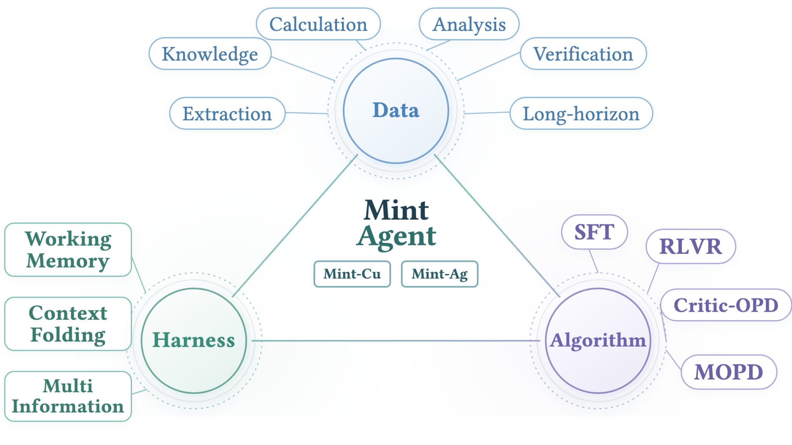
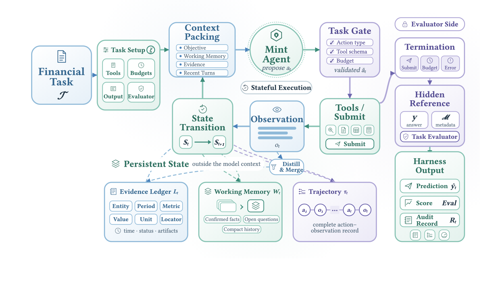
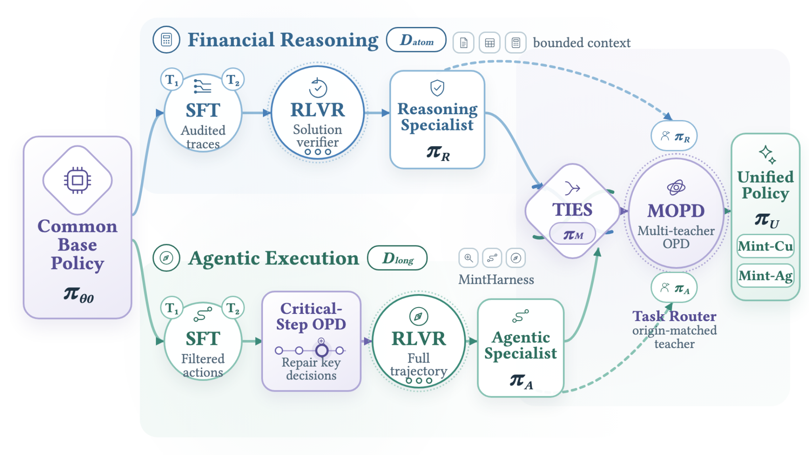
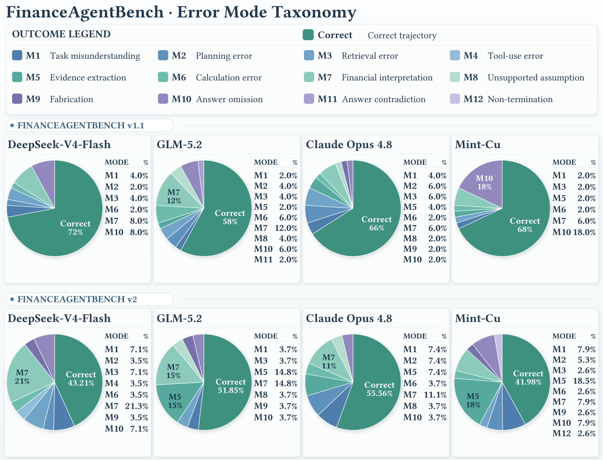

> **论文**：Mint-Agent: Introducing Finance-Native Agentic Foundation Models
> **作者**：Mint-Agent Team（负责人 Gavin Zhang；核心 Yaze Geng、Lei Tang、Yaoyang Yi、Zonghan Wu；贡献 Yifan Hu；通讯 Kun Wang、Qingsong Wen、Yilei Shao）
> **arXiv ID**：2608.16386
> **发表时间**：2026-08-17（v1 提交；v2 更新于 8 月 21 日，8 月 24 日公告）
> **许可协议**：CC BY 4.0
> **代码仓库**：无官方实现（官网 https://mint-fin.github.io/mint-agent，权重未公开）

## 第 1 章 概述

### 1.1 一句话定位

Mint-Agent 是一组**金融原生（finance-native）的 agentic 基础模型**：它不把金融能力视为通用 agent 之上的提示工程或事后补丁，而是让数据构建、执行 harness 与训练算法三个层面围绕同一份**可恢复证据契约（recoverable evidence contract）**协同设计，使模型产出的每一个金融答案都能被还原为"权威证据 + 可复现计算"的完整链条。论文发布两个旗舰模型——Mint-Ag（27B，基座 Qwen3.6-27B）与 Mint-Cu（9B，基座 Qwen3.5-9B），在 7 个专业金融基准上与 frontier 闭源模型、开源 agentic 模型及通用 deep research 模型同台评测，并系统给出成本、轨迹与失败模式分析。论文无官方代码实现，模型权重未公开，评测所用均为第三方基准仓库（vals-ai finance-agent v1.1/v2、DeepResearch、ASearcher、OpenResearcher）。

### 论文图表总览

| 编号 | 内容 | 本报告所属章节 |
|------|------|:---:|
| Figure 1 | 三支柱总览（数据/harness/算法） | 第 1 章 |
| Figure 4 | MintHarness 有状态执行循环 | 第 4 章 |
| Figure 5 | 双专家训练与集成管线 | 第 5 章 |
| Figure 7 | FAB v1.1/v2 失败分类网格 | 第 6 章 |
| Table 1 | 数据源（EDGAR/XBRL/交易所/FRED/Γ_fin） | 第 3 章 |
| Table 2 | 七基准主结果对比 | 第 6 章 |
| Table 3 | 专家集成效果（TIES vs MOPD） | 第 6 章 |

### 1.2 核心贡献

论文的贡献可归纳为四条：

1. **可恢复证据契约**：提出统一的形式化契约，要求数据、执行、学习三个层面共同强化金融正确性——证据可溯源、程序可回放、答案可复现，任何"看起来正确"但证据链不可恢复的输出都不被接纳。
2. **两个金融原生 agentic 基础模型**：Mint-Cu（9B，基座 Qwen3.5-9B）与 Mint-Ag（27B，基座 Qwen3.6-27B）。
3. **三支柱方法框架**：数据引擎（原子任务 + 长程任务）、MintHarness（证据优先的有状态执行）、训练配方（SFT + critical-step OPD + RLVR + TIES 合并 + 多教师 OPD）。
4. **系统性评测**：7 个专业金融基准上全面领先 GPT-5.6-Sol、Claude Opus 4.8、GLM-5.2 等，并附成本/轨迹/失败模式/专家集成分析。

### 1.3 关键结果速览

| 基准 | Mint-Ag (27B) | Mint-Cu (9B) |
|------|:---:|:---:|
| BizFinBench | 55.71% | 53.86% |
| FinanceBench | 91.33% | 90.00% |
| RFC-Bench | 98.33% | 96.67% |
| FAB v1.1 | 76.00% | 68.00% |
| FAB v2 | 60.49% | 41.98% |
| FinSearchComp T2 | 89.04% | 69.86% |
| FinSearchComp T3 | 54.07% | 34.88% |

- **RFC-Bench 98.33%**：超 GPT-5.6-Sol（94.67%）3.66pp、超 Claude Opus 4.8（95.33%）3.00pp；
- **BizFinBench 55.71%**：超最强外部模型 GPT-5.6-Sol（51.57%）4.14pp；
- **FAB v1.1 76.00% / v2 60.49%**：分别领先次优 4.00pp（DeepSeek-V4-Flash 与 Cursor Composer 2.5 并列 72.00%）与 3.70pp（GPT-5.6-Sol 56.79%）；
- **FinSearchComp T2 89.04%**：超 Cursor (Grok 4.5)（81.74%）7.30pp；T3 54.07% 与 Codex (GPT-5.6) 并列最高（论文自称"全部 7 个基准最高分"，T3 实为并列）；
- **9B 模型的跨量级竞争力**：Mint-Cu T2 69.86%，超开源 agentic 模型 Agents-A1-35B（47.03%）22.83pp、超 Nex-N2-mini（57.08%）12.78pp；FAB v1.1 68.00%；
- **成本-精度 Pareto 前沿**：FAB v1.1 上 Mint-Cu 以 $0.016/任务取得 68.00%（最低成本锚点），Mint-Ag 以 $0.090/任务取得 76.00%（比对比组 $0.327 均值低 72.5%）；FAB v2 上 Mint-Cu $0.069/任务仍为最低成本，Mint-Ag 60.49% @ $0.213，较 GPT-5.6-Sol 精度高 3.70pp 且成本低 77.8%（$0.213 vs $0.959）。成本口径为基座模型 API 价 × 实测 token 用量（本地位托管）。

*图1：数据/harness/算法三支柱围绕同一可恢复证据契约协同，是全文方法主线。*

## 第 2 章 研究背景与动机

论文的相关工作沿三条技术脉络展开，Mint-Agent 的定位恰好落在三者的交集处：用 agentic 基础模型的训练范式，解决金融智能的可验证性要求，并修正 deep research 系统的"自主但不可信"缺陷。

### 2.1 Agentic Models：从工具调用到恢复协调

agentic 基础模型的演进可概括为四个阶段：**工具调用**（模型学会按 schema 调用 API 与检索器）→ **规划执行**（多步任务分解、子目标推进与重试）→ **记忆与上下文管理**（长程任务要求跨轮保持计划、已确认结论与中间计算）→ **恢复协调**（失败可观测、动作可门控、轨迹可审计）。Mint-Agent 落点在最后一环：MintHarness 中失败调用不产生证据但错误观测保留给下一轮，动作须经任务门控 $Gate_\xi$ 校验（类型/工具 schema/剩余预算），最终输出附可审计执行记录 $R_T$（第 4 章）。

开源 agentic 模型与 frontier 之间存在明显差距：Agents-A1-35B 在 BizFinBench 仅 41.86%、FAB v1.1 42.00%、v2 11.11%；OpenThinkerAgent-32B RFC-Bench 71.00%；Nex-N2-mini FinanceBench 69.33%。更关键的是多能力集成路线之争——**权重组合**（如 TIES 合并）与**蒸馏**（如 OPD/MOPD）：论文 Table 3 显示 TIES 合并 $\pi_M$ 在四个指标上全面落后于多教师蒸馏 $\pi_U$（88.67%→90.00%、50.00%→53.86%、64.00%→68.00%、66.67%→69.86%，提升 +1.33/+3.86/+4.00/+3.19pp），为"蒸馏优于纯权重组合"提供了直接证据（第 5 章）。

### 2.2 Financial Intelligence：从领域适配到可验证推理

金融智能的研究重心经历了两次迁移。**领域适配阶段**以金融语料上的继续训练与指令微调为主，评测以单轮问答为主——FinanceBench 上 frontier 模型已达 82.00%–90.00%（Mint-Ag 91.33%），问答式基准接近饱和，区分度有限。**可验证推理阶段**要求计算过程与证据链本身可检验：RFC-Bench（财报变更四标签分类：numerical/flipping/sentiment/causal，论文报告 Task-2 分类精度）、FAB v1.1/v2（多步 agentic 金融任务）、FinSearchComp（带时间截止的竞争性信息检索）。

任务形态也从"回答问题"升级为"完成分析师工作"：FAB v1.1/v2 的 frontier 上限仅 72.00%/56.79%，FinSearchComp T3 最高 54.07%，长程分析师级任务远未解决。而**可审计性是金融领域的刚性需求**——无法回溯证据与计算的答案没有落地价值。论文案例研究给出范式：TSMC 2025 年 3 月季度收入预测 NT$825,110 百万，最终偏差 NT$8,010 百万可复现（37 步轨迹，保留有效 Q1 2025 guidance、恢复 2022–2024 窗口后重算历史 3 月增长率）；BKR 收购案从 definitive proxy 锁定未受影响收盘价 $171.65、22.3% 溢价与 $325M 协同比率（对收入与 SG&A 双口径）均可复现。

### 2.3 Deep Research：自主性不等于可信

deep research 有两条实现路线：**harness 系统**（在闭源或编码模型外挂检索与执行框架，如 Codex (GPT-5.6) 与 Cursor 系列）与**训练内化**（把检索-执行行为训进权重，如 Tongyi-DeepResearch、OpenResearcher、ASearcher）。Table 2 的数据揭示"自主性 ≠ 可信"：

- 通用 deep research 模型在金融可验证任务上大幅崩塌：OpenResearcher-30B-A3B BizFinBench 10.71%、FinanceBench 50.00%、RFC-Bench 22.00%；Tongyi-DeepResearch-30B-A3B FinanceBench 42.67%、RFC-Bench 57.67%；ASearcher-32B FAB v1.1 24.00%、v2 3.70%、T3 4.07%——自主检索能力并未转化为金融正确性；
- harness 型编码 agent 呈两极：Codex (GPT-5.6) 与 Cursor 系在 FinSearchComp T2 拿到 77.63%–81.74% 的顶尖成绩，但 Cursor (Grok 4.5) RFC-Bench 仅 63.33%、Cursor (Composer 2.5) 69.67%，金融专业推理仍是短板。

论文的回应是：自主性必须被证据约束——执行侧用 MintHarness 的证据账本与门控，训练侧用证据路径奖励（正确外观的答案若证据路径不可恢复则无奖励）。

### 2.4 核心动机：答案即"可恢复证据 + 可复现计算"的声明

金融错误的三个典型来源——**非权威源**（引用不可考）、**错期间**（数据窗口与查询时间不符）、**单位混淆**（口径与量纲错配）——都不是知识缺失，而是证据纪律缺失。论文因此把"正确答案"重新定义为一份**可恢复证据 + 可复现计算的声明**，并以 recoverable evidence contract 落实到三处：

- **数据侧**：证据图的 provenance 映射 $\rho$、时间索引面 $W_{t\_cut}$、含期间与单位约束的推导校验 $C_\kappa$；
- **执行侧**：Evidence Ledger 记录带来源定位符的类型化证据，失败检索路径与支持证据分开记录；
- **学习侧**：奖励函数把"证据路径可回放"作为得分的必要条件。

失败模式分析佐证了这一动机：FAB v2 上主导错误为证据提取（M5，18.5%），v1.1 上为答案遗漏（M10，18%）——瓶颈集中在证据闭环而非知识缺失，正是证据契约的攻击点。

## 第 3 章 数据引擎

数据引擎是三支柱中的第一根，产出两类可审计任务：**原子金融任务** $T_{atom}$ 与**长程执行任务** $T_{long}$。前者供金融推理分支 $\pi_R$ 训练并由 $R_{atom}$ 验证，后者供智能体执行分支 $\pi_A$ 训练并由 $R_{long}$ 验证——契约从数据端即被锁定。

### 3.1 原子金融能力与数据源

原子能力划分为五组 $\kappa\in K$：**Knowledge / Extraction / Calculation / Analysis / Verification**，覆盖从事实检索、结构化抽取、公式计算、指标分析到结果校验的完整链路。原子任务采用单轮评测。

数据来自权威、可交叉验证的来源（论文 Table 1）：

| 数据源 | 提供内容 |
|--------|---------|
| EDGAR + 发行人 IR 档案 | 披露文档 |
| XBRL | 结构化事实 |
| 交易所记录 + FRED | 市场/宏观数据 |
| 会计分类体系 Γ_fin | 指标语义与合法公式 |

一条候选记录被保留，必须同时满足三个条件：

$$\mathrm{supp}(r)\subseteq E,\qquad \mathrm{Eval}(r;E)=y,\qquad |\mathrm{Ans}(q;E)|=1$$

即：参考解 $r$ 引用的全部证据都落在给定证据集 $E$ 内（可回放）；在 $E$ 上执行 $r$ 恰好得到标注答案 $y$；问题在 $E$ 上答案唯一（全程可溯源、无歧义）。三条件合起来保证每条原子任务自带"证据 + 程序 + 唯一答案"的完整审计包。

### 3.2 长程执行：时间面与证据图

长程任务的第一个约束是**时间索引金融面** $W_{t\_cut}$：任意任务都定义在时间切点 $t_{cut}$ 处的快照上，快照存储保证可复现；时间敏感查询必须声明 $t_{cut}$，否则期间错配无从审计。

第二个约束是**证据图**：

$$G_0=(V_F\cup V_O,\,A,\,\rho)$$

其中 $V_F$ 为 fact 节点、$V_O$ 为 operation 节点、$A$ 为边集、$\rho$ 为 provenance 映射——图中每个事实与操作都可回指其权威来源。终端事实 $v_y$ 的祖先图 $G_y$ 须满足深度与多源条件：

$$\mathrm{depth}(G_y)\ge h_{\min},\qquad |\mathrm{Src}(G_y)|\ge b_{\min}$$

即任务具备足够的推理深度且证据依赖不止一个来源，防止浅层单源任务混入长程集合。

构造出的查询还需通过四项审计：

$$\mathrm{Eval}(G_y)=y,\qquad \mathrm{Ans}(q;G_y)=\{y\},\qquad \mathrm{Loc}(G_y)=1,\qquad \mathrm{Expose}(q;G_y)=0$$

含义依次为：证据图上重放推导得到 $y$；在图内答案唯一；$\mathrm{Loc}$ 为证据定位符条件（取 1 表示满足）；$\mathrm{Expose}$ 要求任务陈述不泄漏定位符或中间事实（防泄漏）。此外，与 seed 重合或与评估集重叠的查询一律拒绝——数据引擎内置去污染。

### 3.3 保留任务的形式化

两类任务的最终形式为：

$$T_{atom}=\big((c,q),\,y,\,M_{atom}=(s,E,r,\kappa)\big)$$

$$T_{long}=(q,\,y,\,M_{long}=(q_0,t_{cut},P_0,G_y))$$

原子任务 $T_{atom}$ 由能力-问题对 $(c,q)$、答案 $y$ 与元组 $M_{atom}$ 构成：seed $s$、证据集 $E$、参考 trace $r$、能力组 $\kappa$。值得注意的是，参考 trace $r$ 只规定所需财务关系，不限定措辞与求解路径——这一自由度延续到验证器 $C_\kappa(r̂,ŷ;r,\Gamma_{fin})$ 中，学生可以走任何合法路径，只要财务关系与期间、单位约束得到满足。

长程任务 $T_{long}$ 由查询 $q$、答案 $y$ 与元组 $M_{long}$ 构成：seed 查询 $q_0$、时间截止 $t_{cut}$、初始执行状态 $P_0$、终端事实祖先图 $G_y$。

由此，数据引擎的契约贯穿到训练与奖励：$T_{atom}$ 进入 $\pi_R$ 的 SFT→RLVR 管线并由 $R_{atom}=A_\kappa\cdot S\cdot C_\kappa$ 校验；$T_{long}$ 进入 $\pi_A$ 的 SFT→critical-step OPD→RLVR 管线并由 $R_{long}=A_{long}\cdot G\cdot H$ 校验（第 5 章）。执行这些任务的环境则由 MintHarness 提供（第 4 章）。
## 第 4 章 MintHarness：证据优先的有状态执行

MintHarness 是三支柱中的第二根：把有界金融问题与开放式研究目标统一为同一个有状态执行过程。它规范化每个任务、暴露任务特定的动作空间、记录完整交互，并把持久状态保存在模型上下文之外。论文给出的执行循环形式化如下（公式编号沿用论文）。

### 4.1 执行循环

#### 任务初始化

设 $\xi$ 为任务 $\mathcal{T}$ 的配置（工具、预算、输出格式、评估器）。MintHarness 将 $\mathcal{T}$ 映射为可见输入 $x_{\mathcal{T}}$ 与合法动作集 $\mathcal{A}_{\xi}$：原子任务的输入为 $x_{\mathcal{T}}=(c,q)$（证据块+问题）且动作集只有 $\{\textsc{Submit}\}$；长程任务输入为 $x_{\mathcal{T}}=q$，动作集为 $\mathcal{U}_{\xi}\cup\{\textsc{Submit}\}$（$\mathcal{U}_{\xi}$ 为配置的工具集）。初始状态为：

$$ \mathbf{S}_{0}=\mathrm{Init}_{\xi}(\mathcal{T})\equiv\bigl(x_{\mathcal{T}},\mathcal{A}_{\xi},\mathbf{b}_{0},\mathbf{L}_{0},\mathbf{W}_{0},\boldsymbol{\tau}_{0}\bigr) \tag{4}$$

其中 $\mathbf{b}_{0}$ 为初始步数/工具/上下文预算，$\mathbf{L}_{0}$、$\mathbf{W}_{0}$、$\boldsymbol{\tau}_{0}$ 分别初始化证据账本、工作记忆与轨迹为空对象。参考答案 $y$ 与验证元数据 $\mathcal{M}$ 始终留在评估器一侧，绝不进入 $\mathbf{S}_{0}$。

#### 动作循环

第 $t$ 轮，打包函数 $\mathrm{Pack}_{B}(\mathbf{S}_{t})$ 在 token 预算 $B$ 下，从任务、紧凑工作记忆、相关账本条目与近期轮次构造模型可见上下文。策略基于该视图提出动作，harness 通过任务门控将其映射为可执行动作或显式错误：

$$ a_{t}\sim\pi_{\theta}\!\left(\,\cdot\mid\mathrm{Pack}_{B}(\mathbf{S}_{t})\right),\qquad \bar{a}_{t}=\mathrm{Gate}_{\xi}(a_{t};\mathbf{S}_{t}) \tag{5}$$

$\mathrm{Gate}_{\xi}$ 校验动作类型、工具 schema 与剩余执行预算——门控只决定动作能否执行，研究决策本身仍由策略做出。

#### 证据更新

若 $\bar{a}_{t}\in\mathcal{U}_{\xi}$，令 $r_{t}=\mathcal{U}_{\bar{a}_{t}}(\mathrm{args}(\bar{a}_{t}))$ 为原始工具结果。MintHarness 先将其蒸馏为带定位的金融记录，再合并进账本：

$$ \mathbf{L}_{t+1}=\mathrm{Merge}\!\left(\mathbf{L}_{t},\mathrm{Distill}(r_{t};x_{\mathcal{T}});\nu_{t}\right),\qquad \bar{a}_{t}\in\mathcal{U}_{\xi} \tag{6}$$

$\mathrm{Distill}$ 产出类型化、带来源定位符的金融记录；$\nu_{t}$ 保留获取时间、工具状态与工件引用。失败的调用不产生证据，但其错误观测保留给下一轮；提交与错误动作同样产生观测 $o_{t}$，而 $\mathbf{L}_{t+1}=\mathbf{L}_{t}$ 不变。

#### 状态转移与完成

转移算子把 $(\bar{a}_{t},o_{t})$ 追加进轨迹、推进剩余预算、从更新后的轨迹与账本刷新工作记忆；账本始终持久，即便只有选定视图被打包进下一轮 prompt：

$$ \mathbf{S}_{t+1}=F_{\xi}(\mathbf{S}_{t};\bar{a}_{t},o_{t},\mathbf{L}_{t+1}) \tag{7}$$

公式 (5)–(7) 循环直至模型提交答案、步数预算耗尽或出现不可恢复的环境错误。终止时 $\hat{y}_{T}$ 为提交答案（无提交则为 $\bot$），可审计执行记录为 $\mathbf{R}_{T}=(\mathbf{L}_{T},\boldsymbol{\tau}_{T},\mathrm{Usage}_{T},\mathrm{Status}_{T})$，任务输出为：

$$ \mathrm{Out}_{\xi}(\mathcal{T})=\bigl(\hat{y}_{T},\,\mathrm{Eval}_{\xi}(\hat{y}_{T};y),\,\mathbf{R}_{T}\bigr) \tag{8}$$

即预测、分数与完整执行记录三件套——"结论可被追责"是 harness 的硬性产出。

### 4.2 模块设计

#### Evidence Ledger（证据账本）

公式 (6) 存入的蒸馏事实是类型化、带来源定位符的持久记录，附带金融范围与获取元数据。关键设计是**把失败的检索路径与支持证据分开记录**——区分"缺少支持"与"来源不可达"，避免把检索失败误判为证据缺失，也为后续轨迹分析保留错误信号。

#### Working Memory（工作记忆）

$\mathbf{W}_{t}$ 是持久但紧凑的语义状态，跨轮次携带调查进程。每次状态转移后，它从轨迹与账本刷新，只保留当前计划、已确认结论、未决问题与中间计算，且事实性声明回链到账本记录。它不复制账本，而是充当"注意力的外部化"——限制过载与注意力漂移。

#### Context Management（上下文管理）

公式 (5) 与 (7) 把持久执行状态与模型可见的有界上下文分离：近期轮次逐字保留，旧交互压缩进工作记忆，长文档/长表格通过工件引用保持可访问。打包函数在每个轮次按 token 预算挑选目标、相关状态与账本条目——模型的即时视野始终受限，但调查的完整状态永不丢失。

*图4：MintHarness 有状态执行循环——证据账本、工作记忆与上下文管理构成模型上下文之外的持久状态层，使长程调查可中断、可续接、可审计。*

## 第 5 章 训练管线：双专家与多教师集成

训练配方是三支柱中的第三根。从同一基座策略 $\pi_{\theta_{0}}$ 出发，先分别在 $\mathcal{D}_{\mathrm{atom}}$ 上训练**金融推理专家** $\pi_{R}$、在 $\mathcal{D}_{\mathrm{long}}$ 上训练**智能体执行专家** $\pi_{A}$，再通过 TIES 合并与多教师 on-policy 蒸馏（MOPD）整合为统一策略 $\pi_{U}$。

### 5.1 金融推理分支 $\pi_{R}$

推理分支教模型在相关上下文已就绪时执行第 3 章的五类原子能力。输入为 $(c,q)$，响应为"金融推导 + 答案"。两阶段训练：SFT 先锚定合法解题形式，RLVR 再直接针对隐藏证据与解结构优化。

**SFT**：对每个 $\mathcal{T}_{\mathrm{atom}}$，用 GLM-5.2 与 DeepSeek-V4-Pro 以 $(c,q)$ 为输入采样多条候选 trace（完整推导+最终答案），过三道门才成为监督信号：①正确性——答案与 $y$ 一致、推导可在 $E$ 上按 $\Gamma_{\mathrm{fin}}$ 回放；②模式过滤——确定性规则拒绝重复步骤、在可用答案前中断、大段复述 prompt 的 trace；③trace 择优——同一输入多条候选幸存时，由独立 LLM judge 按固定 rubric（完整推导优先、惩罚无依据跳跃、同等正确选最清晰）选最强。选中教师 trace 与数据引擎审计 trace $r$ 一起作为一轮 SFT 的目标，得到 $\pi_{R}^{\mathrm{SFT}}$。

**验证器**：RLVR 的奖励来自数据引擎保留的审计信息。对 rollout $o=(\hat{r},\hat{y})$ 与 $\mathcal{T}_{\mathrm{atom}}=((c,q),y,\mathcal{M}_{\mathrm{atom}}=(s,E,r,\kappa))$：

$$ R_{\mathrm{atom}}(o,\mathcal{T}_{\mathrm{atom}})=\mathsf{A}_{\kappa}(\hat{y},y)\,\mathsf{S}(\hat{r};s,E)\,\mathsf{C}_{\kappa}(\hat{r},\hat{y};r,\Gamma_{\mathrm{fin}})\in\{0,1\} \tag{9}$$

其中 $\mathsf{A}_{\kappa}$ 为能力感知的答案等价检查，$\mathsf{S}$ 验证 $\hat{r}$ 中每个实质前提都能在 $E$ 与其来源 $s$ 中找到定位符，$\mathsf{C}_{\kappa}$ 在 $\Gamma_{\mathrm{fin}}$ 下回放推导（含期间与单位约束）。参考 trace $r$ 只规定所需财务关系、不限定措辞或路径——任何 grounded、自洽且到达已验证答案的替代推导都得分。

**RLVR 课程**：从 $\pi_{R}^{\mathrm{SFT}}$ 初始化，把训练集组织为难度感知课程。对任务 $\mathcal{T}_{j}$ 先从 SFT checkpoint 采 10 条独立 rollout，令 $p_{j}^{(0)}$ 为被 $R_{\mathrm{atom}}$ 接受的比例；初始池 $\mathcal{D}_{R}^{(0)}=\{\mathcal{T}_{j}:p_{j}^{(0)}\le 0.8\}$（超过 8 次尝试仍稳定的任务不进 RL）。难度在线刷新而非冻结：更新 $m$ 时旧策略为每个候选任务产出 $G$ 条响应，得组通过率：

$$ p_{j}^{(m)}=\frac{1}{G}\sum_{g=1}^{G}R_{\mathrm{atom}}\!\left(o_{j,g},\mathcal{T}_{j}\right),\qquad \mathcal{B}_{m}=\left\{\mathcal{T}_{j}\in\mathcal{D}_{R}^{(0)}:0<p_{j}^{(m)}<1\right\} \tag{10}$$

$\mathcal{B}_{m}$ 为活跃批：候选任务过采样直至填满；全零/全一奖励的组无相对学习信号，延迟处理。组内对已验证奖励归一化，用 sequence-level GSPO 优化（重要性比率为当前与 rollout 策略 token 似然比的几何均值），每个更新对应验证器打分下的完整金融解。

### 5.2 智能体执行分支 $\pi_{A}$

执行分支教模型在证据未预先给定时持续工作：在 MintHarness 内长程收集信息、区分有用证据与噪声、把幸存证据带进可复现可审计的答案。三阶段：SFT 建立稳定交互行为；critical-step OPD 修复该 checkpoint 暴露的后果性决策；RLVR 针对隐藏答案图优化完整轨迹。

**SFT**：对每个 $\mathcal{T}_{\mathrm{long}}$，用 GLM-5.2 与 DeepSeek-V4-Pro 在 MintHarness 中执行 $q$ 收集轨迹 $\tau=(a_{1},o_{1},\dots,a_{T},o_{T},\hat{y})$，两层过滤：轨迹门（$\hat{y}$ 与 $y$ 一致且证据可按 $\mathcal{P}_{0}$ 与 $\mathbb{G}_{y}$ 回放）；轮次门（删除"重复动作未获新证据""对答案图无贡献的调用""调用不存在工具"的轮次——但保留其上下文，不破坏后续动作所见状态）。只对保留的模型动作与最终答案做 SFT，环境观测从不作为预测目标，得 $\pi_{A}^{\mathrm{SFT}}$。

**Critical-Step OPD**：SFT 给出可用策略，但失败轨迹暴露了稀疏结果监督过粗的决策点。用 LLM judge 在每条失败轨迹 $\tau^{-}$ 中标注关键轮次 $\mathcal{I}(\tau^{-})$——"改变该轮动作即可在不改动前序交互的前提下恢复通往 $\mathbb{G}_{y}$ 的合法路径"的轮次。对每个选中轮次，保留轮前状态 $h_{t}$；当前学生从 $h_{t}$ 重采样下一动作，冻结的 DeepSeek-V4-Pro 教师对同一状态与学生续写打分。蒸馏聚焦后果性决策，而非模仿整条教师轨迹。

因师生 tokenizer 不同，按 GOLD 风格把二者对齐为解码文本相同的最小块。设 $z_{t,1:L_{t}}$ 为学生动作 token，块 $c$ 的师生块对数似然为 $\ell^{S}_{t,c}$ 与 $\ell^{T}_{t,c}$，把教师块似然按学生 token 位置分发，得 token 级优势：

$$ \widetilde{\ell}^{T}_{t,l}=\frac{\ell^{T}_{t,c}}{\ell^{S}_{t,c}}\log\pi_{\theta_{\mathrm{old}}}(z_{t,l}\mid h_{t},z_{t,<l}),\qquad \widehat{A}^{\mathrm{OPD}}_{t,l}=\operatorname{sg}\!\left[\widetilde{\ell}^{T}_{t,l}-\log\pi_{\theta_{\mathrm{old}}}(z_{t,l}\mid h_{t},z_{t,<l})\right],\quad l\in C^{S}_{t,c} \tag{11}$$

$\operatorname{sg}$ 截断通过优势的梯度。用标准 clipped token 级 OPD surrogate（当前/rollout 学生似然比）优化选中动作 token，得到 $\pi_{A}^{\mathrm{OPD}}$——恰在学生自己执行首次变得后果性错误的位置修正。

**RLVR**：从 $\pi_{A}^{\mathrm{OPD}}$ 出发与 MintHarness 全交互优化。对 $\mathcal{T}_{\mathrm{long}}=(q,y,\mathcal{M}_{\mathrm{long}}=(q_{0},t_{\mathrm{cut}},\mathcal{P}_{0},\mathbb{G}_{y}))$ 的 rollout $\tau$：

$$ R_{\mathrm{long}}(\tau,\mathcal{T}_{\mathrm{long}})=\mathsf{A}_{\mathrm{long}}(\hat{y},y)\,\mathsf{G}(\tau;\mathcal{P}_{0},\mathbb{G}_{y})\,\mathsf{H}(\tau;t_{\mathrm{cut}})\in\{0,1\} \tag{12}$$

$\mathsf{A}_{\mathrm{long}}$ 检查最终答案，$\mathsf{G}$ 验证 $\tau$ 恢复的证据能以 $\mathcal{P}_{0}$ 中的 provenance 回放 $\mathbb{G}_{y}$ 的必需路径，$\mathsf{H}$ 检查交互使用合法 MintHarness 动作并遵守截止 $t_{\mathrm{cut}}$。**正确外观的答案若支撑路径不可恢复则无奖励**。每查询采 $G$ 条完整轨迹，复用公式 (10) 的活跃批规则，同一 sequence-level GSPO 更新；似然比覆盖模型生成的推理、动作与最终答案，环境观测仅为条件状态、不进 loss。得 $\pi_{A}$。

### 5.3 专家集成：TIES 合并 + 多教师 OPD

**TIES 合并**：两专家同源于 $\pi_{\theta_{0}}$。把 $\pi_{R}$、$\pi_{A}$ 相对基座的参数位移作为任务向量，TIES 先修剪每个任务向量的低幅坐标，再在每个坐标上选举共享符号、丢弃与之冲突的专家更新，最后把存留的对齐更新平均、缩放、加回基座参数；无存活更新的坐标保留基座值。得 $\pi_{M}$——保留专家的主导兼容方向、压制直接符号冲突。但权重空间兼容不保证行为保留。

**Multi-Teacher On-Policy Distillation（MOPD）**：从 $\pi_{M}$ 初始化学生 $\pi_{\theta}$，冻结 $\pi_{R}$ 与 $\pi_{A}$ 为教师。MOPD 按任务来源分配监督而非让两教师在同一批样本上竞争：

$$ \mathcal{D}_{\mathrm{mix}}=\alpha_{R}\mathcal{D}_{\mathrm{atom}}+\alpha_{A}\mathcal{D}_{\mathrm{long}},\qquad \pi^{T}_{\mathcal{T}}=\begin{cases}\pi_{R}, & \mathcal{T}\in\mathcal{D}_{\mathrm{atom}},\\ \pi_{A}, & \mathcal{T}\in\mathcal{D}_{\mathrm{long}},\end{cases}\qquad \alpha_{R}+\alpha_{A}=1 \tag{13}$$

原子问题接收金融推理信号，长程交互接收智能体执行信号。学生在自己生成的状态上产出 token $z_{1:L}$，路由教师在同一学生状态上做前缀，MOPD 最小化学生到教师的 token 平均反向 KL。因两专家共享基座架构与 tokenizer，分布逐 token 对齐；优化策略梯度形式——设 $\pi_{\theta^{-}}$ 为产出 rollout 的学生快照，师生对数概率差给出每个生成 token 的稠密优势：

$$ A^{\mathrm{MOPD}}_{t}=\operatorname{sg}\!\left[\log\pi^{T}_{\mathcal{T}}(z_{t}\mid h_{t})-\log\pi_{\theta^{-}}(z_{t}\mid h_{t})\right],\qquad \mathcal{L}_{\mathrm{MOPD}}(\theta)=-\mathbb{E}\!\left[\frac{1}{L}\sum_{t=1}^{L}\operatorname{clip}\!\left(A^{\mathrm{MOPD}}_{t},-A_{\max},A_{\max}\right)\log\pi_{\theta}(z_{t}\mid h_{t})\right] \tag{14}$$

状态来自学生、信号来自对应专家，直接修复合并留下的行为干扰而不引入 off-policy 模仿差距。最小化公式 (14) 得到统一策略 $\pi_{U}$：单一 checkpoint 同时保留原子金融推理与长程智能体执行。

*图5：推理与执行双专家分别经 SFT→RLVR 训练后，通过 TIES 权重合并与多教师 OPD 蒸馏为统一策略——MOPD 按任务来源路由教师，修复合并行为干扰。*
## 第 6 章 实验评估与结果分析

### 6.1 实验设置

#### 模型

Mint-Cu（9B）与 Mint-Ag（27B）分别以 Qwen3.5-9B 和 Qwen3.6-27B 为基座模型，通过第 5 章描述的"双专家 + 多教师集成"管线训练得到。对照模型分三组：

- **前沿闭源模型**：Gemini-3.5-Flash、Claude Opus 4.8、GPT-5.6-Sol、GLM-5.2、MiniMax-M3、Kimi-K2.7-Code、DeepSeek-V4-Pro、DeepSeek-V4-Flash、MiMo-V2.5-Pro、Qwen3.7-Plus；
- **开源模型**：Agents-A1-35B、Nex-N2-mini、ASearcher-32B、OpenThinkerAgent-32B、OpenResearcher-30B-A3B、Tongyi-DeepResearch-30B-A3B；
- **Agent 系统**：Codex（GPT-5.6）、Cursor（Grok 4.5）、Cursor（Composer 2.5）。

#### 基准

评估覆盖两类互补能力：

- **原子金融推理**（单轮、给定上下文）：BizFinBench（商业分析）、FinanceBench（披露 grounded QA）、RFC-Bench Task 2（反事实误导分类，四标签 numerical/flipping/sentiment/causal 之一；报告值为 Task-2 分类精度而非整套分数）；
- **智能体执行**（多步检索/计算/综合）：FinanceAgentBench v1.1 与 v2（官方评测 harness，分别使用公开的 50 个与 27 个任务——基准无公开 held-out 验证集，论文向维护者申请额外划分未获回复）、FinSearchComp T2 与 T3。

#### 协议

- 原子基准单轮评测；FinSearchComp 中 Mint 模型与前沿模型使用 MintHarness 评测，Tongyi-DeepResearch、ASearcher、OpenResearcher 保留官方评测 harness，其余开源模型用 MintHarness；
- 温度 0、repetition penalty 1.1、每任务 128K token 上下文；
- FinanceAgentBench v2 运行 3 次，报告均值与跨运行方差；
- 所有基准均遵循官方答案匹配协议（协议细节与 judge prompt 见论文附录 A），不使用统一 LLM judge。

### 6.2 总体性能

论文 Table 2 给出 7 个基准上的完整对比（下表中的 FAB v2 列标注的 ± 值为论文报告的 100×[0,1] 精度上的跨运行方差，数值极小）：

| 模型 | BizFinBench | FinanceBench | RFC-Bench | FAB v1.1 | FAB v2 | FinSearch T2 | FinSearch T3 |
|:-----|:-----------:|:------------:|:---------:|:--------:|:------:|:------------:|:------------:|
| Gemini-3.5-Flash | 50.71% | 85.33% | 92.33% | 62.00% | 25.93% | 36.53% | 44.19% |
| Claude Opus 4.8 | 49.71% | 90.00% | 95.33% | 66.00% | 55.56% | 45.66% | 51.16% |
| GPT-5.6-Sol | 51.57% | 86.67% | 94.67% | 66.00% | 56.79% | 41.10% | 50.58% |
| GLM-5.2 | 47.57% | 88.00% | 94.33% | 58.00% | 51.85% | 68.49% | 34.88% |
| MiniMax-M3 | 40.71% | 86.00% | 91.33% | 70.00% | 38.27% | 60.27% | 30.23% |
| Kimi-K2.7-Code | 46.57% | 82.00% | 92.67% | 62.00% | 43.21% | 56.62% | 25.00% |
| DeepSeek-V4-Pro | 44.00% | 87.33% | 91.33% | 60.00% | 40.74% | 60.73% | 31.40% |
| DeepSeek-V4-Flash | 45.71% | 88.67% | 89.67% | 72.00% | 43.21% | 59.82% | 25.00% |
| MiMo-V2.5-Pro | 45.00% | 87.33% | 91.33% | 66.00% | 37.04% | 58.45% | 26.16% |
| Qwen3.7-Plus | 48.43% | 88.00% | 93.33% | 64.00% | 48.15% | 62.10% | 31.98% |
| Agents-A1-35B | 41.86% | 84.00% | 90.00% | 42.00% | 11.11% | 47.03% | 11.63% |
| Nex-N2-mini | 27.43% | 69.33% | 83.33% | 38.00% | 7.41% | 57.08% | 20.35% |
| ASearcher-32B | 28.14% | 81.33% | 84.00% | 24.00% | 3.70% | 42.92% | 4.07% |
| OpenThinkerAgent-32B | 25.00% | 66.67% | 71.00% | 34.00% | 0.00% | 36.07% | 14.53% |
| OpenResearcher-30B-A3B | 10.71% | 50.00% | 22.00% | 42.00% | 0.00% | 53.88% | 16.86% |
| Tongyi-DeepResearch-30B-A3B | 19.57% | 42.67% | 57.67% | 58.00% | 9.88% | 72.15% | 18.02% |
| Codex (GPT-5.6) | 46.14% | 85.33% | 86.33% | 66.00% | 54.32% | 80.37% | 54.07% |
| Cursor (Grok 4.5) | 48.29% | 88.00% | 63.33% | 66.00% | 53.09% | 81.74% | 52.33% |
| Cursor (Composer 2.5) | 47.00% | 84.67% | 69.67% | 72.00% | 49.38% | 77.63% | 51.16% |
| **Mint-Cu (9B)** | 53.86% | 90.00% | 96.67% | 68.00% | 41.98% | 69.86% | 34.88% |
| **Mint-Ag (27B)** | **55.71%** | **91.33%** | **98.33%** | **76.00%** | **60.49%** | **89.04%** | **54.07%** |

注：FAB v2 列报告 3 次运行均值，± 值为 100×跨运行方差（如 Mint-Cu 41.98±0.21、Mint-Ag 60.49±0.03），此处省略方差位。全部分数为百分比。

#### 原子推理

Mint-Ag 在三个有界金融任务基准上均取得最高分：BizFinBench 55.71%（超出最强外部模型 GPT-5.6-Sol 的 51.57% 达 4.14pp）、FinanceBench 91.33%（超出最强外部 Claude Opus 4.8 的 90.00% 达 1.33pp）、RFC-Bench 98.33%（超出最强外部 Claude Opus 4.8 的 95.33% 达 3.00pp）。三基准同时领先表明：规模化 agentic checkpoint 不会牺牲精确金融推理能力——分析、披露 QA 与主张验证三个维度协同成立。

#### 智能体执行

当任务需要开放式研究时优势进一步扩大：Mint-Ag 在 FinanceAgentBench v1.1 达 76.00%（超出最强外部 DeepSeek-V4-Flash 与 Cursor (Composer 2.5) 并列的 72.00% 达 4.00pp）、v2 达 60.49%（超出最强外部 GPT-5.6-Sol 的 56.79% 达 3.70pp）、FinSearchComp T2 达 89.04%（超出最强外部 Cursor (Grok 4.5) 的 81.74% 达 7.30pp），并在 T3 以 54.07% 与 Codex (GPT-5.6) 并列最高。9B 的 Mint-Cu 也在 T2 取得 69.86%，说明长程金融执行能力可以在紧凑规模上保留。

#### 规模效应小结

论文强调两点：其一，Mint-Ag 在全部 7 个基准上取得最高（或并列最高）分数，覆盖"可靠性"（原子推理）与"可执行性"（长程研究）两个维度；其二，Mint-Cu 以 9B 规模全面超越 <32B 参数类别的所有对照，并在 T2 以 69.86% 超过 Agents-A1-35B（47.03%）22.83pp、超过 Nex-N2-mini（57.08%）12.78pp（后两对比较出自论文摘要），证明垂直化训练数据与验证信号可以显著压缩达成专业能力所需的模型规模。

### 6.3 成本分析（Pareto 效率）

论文 Figure 6 联合对比任务精度与每问平均 API 成本。两个 Mint checkpoint 在 FinanceAgentBench 两个版本上均位于经验 Pareto 前沿——不存在同时更准且更便宜的对照方案：

| 基准 | 模型 | 精度 | 每任务成本 | 对比 |
|:-----|:-----|:-----|:----------|:-----|
| FAB v1.1 | Mint-Cu | 68.0% | $0.016 | 最低成本锚点 |
| FAB v1.1 | Mint-Ag | 76.0% | $0.090 | 比 $0.327 对照均值低 72.5% |
| FAB v2 | Mint-Cu | 41.98% | $0.069 | 最低成本点 |
| FAB v2 | Mint-Ag | 60.49% | $0.213 | 比 GPT-5.6-Sol 精度高 3.70pp 且成本低 77.8%（$0.213 vs $0.959） |

成本口径：对本地托管的 checkpoint，按各自基座模型的 API 价格（Mint-Cu 对应 Qwen3.5-9B、Mint-Ag 对应 Qwen3.6-27B）乘以实测 token 用量估算 API 等价成本。结论是优势并非孤立地"便宜"：两个 checkpoint 在 Pareto 前沿上分别锚定低成本的 9B 端与高性能的 27B 端，形成互补操作点。

### 6.4 案例研究

论文给出两个成功轨迹（外加附录 B 一个补充案例），展示 Evidence Ledger 如何支撑时间消歧、长程重算与多源对账。

**TSMC 预测（Figure 9）**：37 步轨迹贯穿受阻文件、错误季度页面、年度数据集与最初错误的四年平均窗口。模型保留已恢复的有效 Q1 2025 guidance 与月度收入记录；恢复 2022–2024 窗口后重算历史 3 月增长率，估计 2025 年 3 月季度收入为 NT$825,110 百万。由于 guidance 中点与汇率换算锁定在账本中，最终 NT$8,010 百万的偏差可以在不信任中间弯路的前提下复现。

**BKR 收购（Figure 10）**：整合交易条款、会计输入、市场数据与收购理由。多数字段从公告材料与 GTLS 文件中早期恢复，但"未受影响收盘价"在多个受阻/歧义来源上无法确认。智能体将这些页面保留为发现线索而非证据，最终从 definitive proxy 锁定 $171.65 的精确收盘价；据此账本支撑 22.3% 的溢价，并对照收入与 SG&A 双口径复现 $325 百万的协同比率，每个报告数量均保留一手来源。

**AMD 指引（附录 B，Figure 11）**：13 步轨迹为四个季度测算 AMD 收入指引区间。初始 accession 猜测失败后扩大 SEC 检索，定位相关 EX-99.1 exhibits，记录各季度中点与区间端点；账本使模型无需重复完整搜索即可重开 Q3 来源。最终答案由四份一手文件支撑，报告区间宽度分别为 midpoints 的 10.53%、8.96%、8.00% 与 8.45%。

### 6.5 模型分析

#### 专家集成的效果（论文 Table 3）

下表隔离集成阶段，各专家仅在目标域内评测（— 表示该专家未在目标域外评测；均为 9B 模型）：

| Checkpoint | FinanceBench | BizFinBench | FAB v1.1 | FinSearch T2 |
|:-----------|:------------:|:-----------:|:--------:|:------------:|
| 推理专家 (π_R) | 88.00% | 53.86% | — | — |
| 执行专家 (π_A) | — | — | 66.21% | 72.15% |
| TIES 合并 (π_M) | 88.67% | 50.00% | 64.00% | 66.67% |
| MOPD (π_U) | 90.00% | 53.86% | 68.00% | 69.86% |

TIES 合并跨四个基准产生不均匀迁移（BizFinBench 从 53.86% 掉到 50.00%，FAB v1.1 从 66.21% 掉到 64.00%）；MOPD 在合并基础上分别提升 1.33pp（FinanceBench）、3.86pp（BizFinBench）、4.00pp（FAB v1.1）与 3.19pp（FinSearch T2），恢复后的分数与论文 Table 2 中 Mint-Cu 的结果一致——说明多教师按任务来源路由的蒸馏既修复了权重空间合并留下的行为干扰，又保留了两类能力的分工。

#### 失败模式（论文 Figure 7）

金融+AI 双背景的博士研究员人工审阅全部轨迹，标注最早后果性错误：

- **v1.1**：Mint-Cu 解决 68% 的任务；最大残留失败模式是答案遗漏（M10，18%），而任务误解、检索、证据提取、计算各占 2%；
- **v2**：精度降至 41.98%，主导错误转移为证据提取（M5，18.5%），任务误解、金融解释、答案遗漏各贡献 7.9%，检索/计算/捏造/不终止均较小。

*图7：FinanceAgentBench v1.1/v2 正确率与主要失败模式对比——v2 的瓶颈从"执行收尾"前移到"证据提取"，提示感知记忆→工作记忆接口是下一步能力缺口。*

这一转移表明：更难基准的约束主要不在"能否访问来源"，而在"能否把检索到的材料转换成完整、范围正确的金融证据"。

#### 机制分析

结合失败分类学，专业化-集成模式呈现一种结构化认知架构：MintHarness 先把观测变成外部感知记忆（Evidence Ledger 记录观察了什么、来自哪个来源、什么时间，缓解长轨迹上的记忆衰减与来源混淆）；紧凑的工作记忆再从持久记录中仅挑选当前目标、未决子问题与下一步所需证据，限制过载与注意力漂移而不复制账本；记忆层之上，推理专家提供金融敏感的解释与计算核心，执行专家提供搜索、工具使用、进度监控与终止的执行核心；MOPD 把二者整合进单一策略，保留分工的同时降低技能干扰与切换协调成本。

v1.1 上占主导的答案遗漏类似"执行闭环破裂"——有用的中间工作未转化为最终回复；v2 上转移到证据提取失败则把瓶颈前移到感知-工作记忆接口——来源可达，但金融相关事实未被按正确范围选择和编码。MOPD 后的增益表明两个核心可以统一而不牺牲互补优势；剩余分类学指向"对证据的选择性注意"是下一项待提升的能力。

## 第 7 章 代码实现与可复现性

### 7.1 官方实现状态

论文**未提供官方代码仓库与模型权重**。项目官网（https://mint-fin.github.io/mint-agent）提供研究演示与结果可视化；GitHub 组织 mint-fin 下仅有项目网站仓库（HTML），未发布训练代码、harness 实现或 Mint-Cu/Mint-Ag 权重。论文采用 CC BY 4.0 许可，但当前无法复现训练管线或直接部署模型。

### 7.2 可复现要素

尽管代码未开源，论文给出了若干可复现性关键要素：

- **基座模型公开**：Qwen3.5-9B 与 Qwen3.6-27B 均为可获取的开源权重，双专家训练在此之上进行；
- **评测协议完整**：温度 0、repetition penalty 1.1、128K token 上下文；FAB v2 三次运行报告均值±方差；所有基准使用官方评估器/参考答案/评分细则（附录 A 逐基准给出），不引入统一 LLM judge；
- **评估任务集公开**：FAB v1.1 的 50 个与 v2 的 27 个公开任务、FinSearchComp 官方 released test data；
- **第三方基准 harness 可复用**：vals-ai/finance-agent（v1.1）与 vals-ai/finance-agent-v2（v2）官方 harness，Alibaba-NLP/DeepResearch、inclusionAI/ASearcher、TIGER-AI-Lab/OpenResearcher 等基线系统仓库；
- **数据构建逻辑可审计**：数据源全部来自公开的一手材料（EDGAR、XBRL、交易所记录、FRED、会计分类体系），任务保留条件（证据可回放、答案唯一、来源可定位）在论文中形式化给出。

### 7.3 实现要点解读

从论文描述可还原的工程要点：

- **训练成本结构**：双专家各自从同一基座出发（SFT → RLVR），集成阶段仅需 TIES 合并 + MOPD 蒸馏，无需训练第三个从头模型；MOPD 的教师路由（原子任务→π_R、长程任务→π_A）使蒸馏信号按任务来源分配，避免两个教师在同一样本上竞争；
- **跨 tokenizer 蒸馏**：Critical-Step OPD 采用 GOLD 风格的最小块 token 对齐（学生 Qwen tokenizer 与教师 DeepSeek-V4-Pro tokenizer 不同），块级 log-likelihood 按学生 token 位置分发；
- **验证器即奖励**：R_atom 与 R_long 均为 {0,1} 硬验证（答案等价 × 证据可支撑 × 推导可回放），LLM 仅参与 SFT trace 择优与关键轮次标注，训练信号本身不依赖 LLM judge 打分；
- **难度自适应课程**：初始池排除 p_j^(0) > 0.8 的已稳定任务，在线刷新活跃批 B_m={0<p<1}（全对/全错组不提供相对信号，延迟处理）。

## 第 8 章 局限性与延伸阅读

### 8.1 局限性

1. **代码与权重未开源**：无法独立复现或部署；"金融原生"效果与数据/训练配方高度耦合，缺少权重使得第三方验证受限；
2. **评估规模有限**：FAB 无公开 held-out 验证集，论文仅使用 50（v1.1）+ 27（v2）个公开任务，样本量小、方差口径特殊（± 值为 100×方差而非标准差），单点精度差异的统计显著性有限；
3. **基准时效与污染风险**：数据引擎的种子查询来自分析师撰写请求并显式去除与评估集的重叠，但 W_tcut 快照金融面与公开基准同源，长期存在隐含污染风险；
4. **垂直单域**：模型为金融专用，跨域泛化（通用 deep research、代码、多模态）未验证；领域迁移到法律/医疗等同样需要可审计性的场景尚未探索；
5. **失败模式揭示的能力缺口**：v2 上证据提取（M5）成为主导失败（18.5%），说明"选择性注意证据"是明确的下一步能力短板；v1.1 的答案遗漏（18%）提示执行闭环在长轨迹中仍会破裂；
6. **成本口径为估算**：本地托管成本按基座 API 价 × token 用量折算，未包含推理基础设施、检索工具与审计存储的真实开销。

### 8.2 延伸阅读

- **基座与蒸馏线**：Qwen3.5/Qwen3.6 技术报告；TIES（Yadav et al. 2023，权重空间合并）；MOPD 多教师 on-policy 蒸馏（Ma et al. 2026）；GOLD 跨 tokenizer OPD（Patiño et al. 2025）；GSPO sequence-level 策略优化（Zheng et al. 2025）；
- **Agentic 后训练**：Tongyi-DeepResearch（训练内化研究循环）、OpenResearcher/ASearcher（开源 research agent）、Agent Lightning（harness 化 agentic RL）等本仓库已精读系列；
- **金融 NLP**：BizFinBench、FinanceBench、RFC-Bench（反事实误导）、FinSearchComp、FinanceAgentBench（vals-ai）等基准的定义与评估协议见论文附录 A 及各自仓库；
- **可审计 AI 研究**：deep research 可靠性讨论（证据误配、流畅报告的虚假归因等）是论文 2.3 节的核心动机，与"可恢复证据契约"一脉相承。
