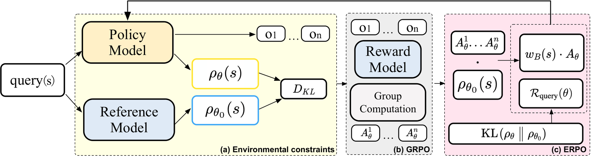
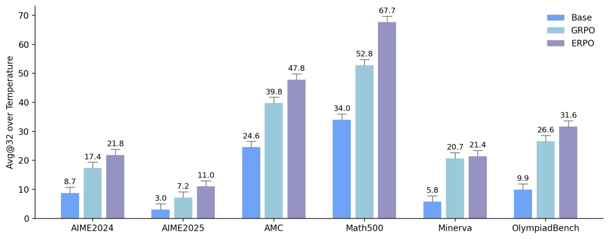
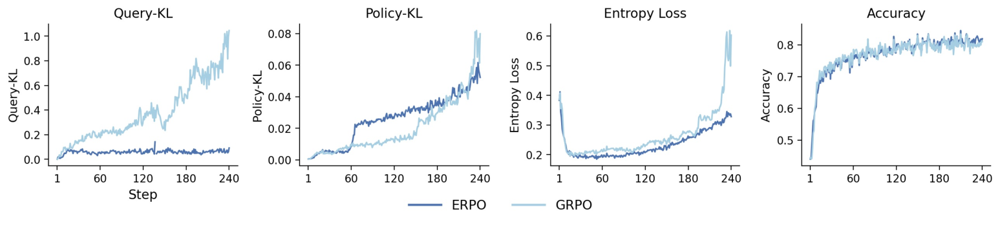
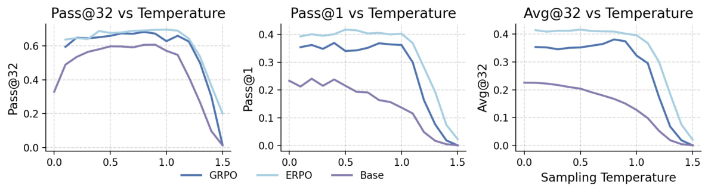

## 第 1 章 概述

> **论文**：Beyond the Stability-Exploration Dilemma: Environmental Regularization for LLM Policy Optimization（ERPO）
> **作者**：Xianlei Zhou, Xiangdi Meng, Yu He, Tianyu Qi, Shuyan Guan, Xianli Zhang, Jian Zhang, Xin Li, Qika Lin, Jun Liu（Alibaba / 学术合作）
> **arXiv ID**：2608.23311
> **发表时间**：2026-08-26 提交 v1；会议标注 EMNLP 2026（HF Community 标注）
> **许可**：未标注（arXiv 页面与论文 HTML 均无 license 标识）
> **代码仓库**：https://github.com/alibaba/ERPO（论文声明地址；截至 2026-08-27 访问返回 404，代码尚未上传）

### 1.1 一句话定位

ERPO（Environment-Regularized Policy Optimization）把 LLM 策略优化中的稳定性正则从 action 侧整体搬到 input 侧：用 Query-KL（QKL）约束策略诱导的查询分布 ρ_θ 相对 RL 前参考分布 ρ_θ0 的漂移，取代主流的 Policy-KL。由于 QKL 的梯度只经查询似然流动、完全不触碰策略梯度所依赖的响应 score function，稳定性与探索不再争夺同一个梯度通道——在不增加任何额外前向传播开销的前提下，六个数学推理基准上同时取得更高准确率与更稳定的训练、解码行为。

### 论文图表总览

| 编号 | 内容 | 所在章 |
|---|---|---|
| Figure 1 | 固定 Policy-KL 预算下 Query-KL 与 Policy-KL 漂移对比（动机实验） | 第 2 章 |
| Figure 2 | ERPO 方法总览（架构图） | 第 3 章 |
| Figure 3 | 六基准 Avg@32 主结果（温度 0.1–1.5 聚合） | 第 4 章 |
| Figure 4–6 | 训练动态曲线 | 第 5 章 |
| Figure 7 | 性能–温度曲线与训练动态 | 第 5 章 |
| Figure 8 | 指标随解码温度变化 | 第 5 章 |
| Figure 9 | 查询–响应 NLL 相关性（对应附录 D） | 第 5 章 |
| Table 1 | 主结果：6 基准 × 3 指标（Avg@32 / Pass@32 / Pass@1） | 第 4 章 |
| Table 2 | 消融与超参：重加权、系数 α、rollout 数 n、模型规模（MATH500 多温度） | 第 5 章 |
| Table 3 | 机制消融：Query-KL / Policy-KL / 策略熵 | 第 5 章 |
| Table 4 | Train–Eval 一致性（reward hacking 量化，6 checkpoint 平均） | 第 5 章 |
| Table 5 | checkpoint 轨迹（Step 0→240） | 第 5 章 |
| Table 6 | ERPO 叠加于 DAPO / RLOO 及不同规模模型 | 第 5 章 |

注：论文共 9 个 Figure，本报告纳入其中 5 张关键图（Figure 1/2/3/4/8），图片经 alphaXiv CDN 采集（arxiv.org 直连被网络重置）。

### 1.2 核心贡献

1. **Query-KL 环境控制**：把模型查询似然视为可正则化的输入端统计量，引入 QKL 显式约束策略诱导查询分布 ρ_θ 相对 RL 前参考 ρ_θ0 的漂移；配套数据集静态（dataset-static）、参考派生（reference-derived）的逐查询权重，在降低方差的同时驯服高温采样行为。
2. **Estimator-agnostic 实例化**：方法与梯度估计器解耦——只需在 GRPO / PPO / REINFORCE 风格 pipeline 上叠加 QKL 项与查询权重即可，论文给出统一的 PG surrogate 及三种算法的特化形式，改动量极小。
3. **多温度稳定性评估协议**：用多温度采样（0.1–1.5）配合多指标套件（Pass@k、Pass@1、Avg@k）评估 RL 训练的稳定性，而不是只看单一温度下的 Pass@1——这套协议本身放大并量化了现有方法的高温崩溃问题。
4. **六基准一致提升**：在 AIME24、AIME25、AMC、MATH500、Minerva、OlympiadBench 六个数学推理基准上，ERPO 替换标准 Policy-KL 正则后准确率一致提升。

### 1.3 关键结果速览

| 指标（6 基准均值，温度 0.1–1.5 聚合） | GRPO 基线 | ERPO | 变化 |
|---|---|---|---|
| Avg@32 | 0.274 | 0.336 | +6.2 个百分点（论文口径：整体平均提升 6.2%） |
| Pass@32 | 0.575 | 0.611 | +3.6 个百分点（论文口径 +3.64%） |
| Pass@1 | 0.275 | 0.332 | +5.7 个百分点（论文口径 +5.69%） |
| Train–Eval gap（6 checkpoint 平均） | 6.47% | 3.14% | −3.33 个百分点（缩小 51%） |

补充亮点（数据均来自论文表格）：

- 单基准最大增益：MATH500 Avg@32 0.528 → 0.677（+14.9 个百分点，Table 1）。
- 高温稳定性：MATH500 上温度 1.2–1.5 区间均值 12.50 → 37.90（GRPO → ERPO，Qwen-7B、n=8，Table 2）；长训练中 GRPO 在低温区（<1.0）仅稳定至约 240 步（epoch=15），高温区约 400 步后率先退化、后蔓延至全温度，ERPO 退化显著更小、高温区甚至提升。
- 机制验证：仅加入 Query-KL 后，训练中实测 Query-KL 从 0.9679 降至 0.0041，而策略熵从 0.5063 微升至 0.5674——漂移被压住、探索未被压缩（Table 3）。
- 跨算法可叠加：MATH500 温度 ≤1.0 均值上，DAPO+ERPO 较 DAPO +10.24 个百分点、RLOO+ERPO 较 RLOO +2.28 个百分点、Qwen-32B 上 ERPO 较 GRPO +2.98 个百分点（Table 6）。

## 第 2 章 背景与动机

### 2.1 RLVR：可验证奖励下的策略优化

以 AlphaCode 为代表的工作确立了"大规模采样 + 程序化验证"的强化学习路线：奖励来自可执行判据而非人工标注或学习得到的奖励模型，天然规避了奖励模型被策略钻空子的部分风险。数学推理随后成为这条 RLVR（Reinforcement Learning with Verifiable Rewards）路线最成功的主战场——答案从 `\boxed{}` 中提取、与标准答案规则比对，奖励信号精确、可大规模并行。

策略优化算法层面，GRPO 类方法成为主流骨架：对每个查询采样一组响应，在组内标准化优势后更新策略。本文的实验设置正是如此——Qwen2.5-Math-7B 与 Qwen2.5-32B，EasyR1 框架，每问题 8 个响应 @ 温度 1.0。与之并行的 PRM（Process Reward Model，过程奖励模型）路线把奖励从"只看结果"细化为"逐步打分"，但代价是把奖励从规则换回了模型，重新引入一个可被钻空子的失效面。

随着训练规模扩大，稳定性问题持续浮现，其中两条失效线被反复研究：**reward hacking**（训练奖励持续上升而评测性能停滞甚至下降）与 **alignment tax**（为换取稳定/对齐所付出的能力损失）。本文的位置正在于此：它不换奖励、不换算法骨架，而是追问——现有方法的稳定性正则，究竟加在了正确的位置上吗？

### 2.2 现有方法的盲区：正则全部压在 action 侧

当前主流的稳定手段是 **Policy-KL 正则**：在目标函数中加入响应分布相对参考策略的 KL 散度，约束 π_θ(o|q) 的漂移。论文指出这把从业者推入双重困境（double bind）：

- **保留 Policy-KL**：响应行为被持续约束，探索需要策略偏离参考分布，而正则恰好惩罚这种偏离——探索预算被正则吃掉；
- **去掉 Policy-KL**：优化失去显式的漂移控制，训练动态不稳定。

困境的根源在于：稳定与探索共享同一个梯度作用面（响应分布）。只要正则还压在 action 侧，两者就必然此消彼长。

论文 Figure 1 给出关键的实证观察：在 Policy-KL 被固定预算约束住的训练中，**Query-KL（查询分布相对参考的漂移）持续上升，而 Policy-KL 保持平稳**。换言之，输入侧的漂移不仅真实存在，而且完全游离于现有正则的监测与约束之外——action 侧被牢牢看住的同时，input 侧在无人看管地漂移。

*图 1：动机实验——Policy-KL 被约束住的同时 Query-KL 持续上升，证明输入侧漂移游离于现有正则监测之外。*

### 2.3 被忽视的输入侧：查询分布漂移及其代价

RLVR 训练中，训练查询的分布并非固定，而是由当前策略诱导：ρ_θ(q) = P_θ(q)，随策略每一步更新而演化。策略在采样与筛选意义上会不断偏向自己已强化的查询类型，查询分布随之收窄、偏离 RL 前的参考分布——一个无人约束的自我强化回路。

论文用两组实验量化了这个回路的代价（详见第 5 章）：

- **Train–Eval gap（reward hacking 的量化表现）**：GRPO 训练奖励 77.3%，而评测仅 69.8%（Eval@TP1）/ 70.1%（Eval@TP2），平均 gap 6.47%（Table 4）；
- **高温崩溃**：GRPO 的 checkpoint 轨迹在 Step-240 处 Eval@TP1 从约 75% 骤跌至 58.4%（Table 5）；1K 步长训练中，GRPO 在低温区（<1.0）约 240 步（epoch=15）内保持稳定，高温区约 400 步后率先退化，随后蔓延至全部温度。

### 2.4 环境非平稳性：把 RL 的旧问题映射到 LLM 新场景

经典 RL 理论假设环境固定——状态转移与奖励函数不随策略变化，策略只是学习者。RLVR 的实际结构却不同：训练查询由策略诱导，策略每更新一步，它所面对的"环境"（查询分布）就跟着变形一步。**策略既是学习者，又是环境的塑造者**，这正是教科书意义上的非平稳环境问题：优化目标在训练全程不断变形。

由此得出本文的核心洞察，也解释了方法名中的 "Environmental"：既然漂移发生在输入（查询）侧，正则就应该放在输入侧——用 Query-KL 直接约束漂移的源头 ρ_θ 相对 ρ_θ0，而把 action 侧彻底解放给探索。稳定与探索从此各占一侧，两难在结构上被拆解，而非在系数上被调和。

## 第 3 章 方法原理

*图 2：ERPO 方法总览——在标准 RLVR 管线（查询→响应采样→可验证奖励→PG 更新）上叠加 Query-KL 正则项与参考派生的逐查询权重，正则从 action 侧移到 input 侧。*

### 3.1 核心思想：正则化从 action 侧移到 input 侧

标准 RLVR 目标只追求奖励期望：

$$J_{\mathrm{RL}}(\theta) = \mathbb{E}_{q \sim \rho_{\mathrm{train}},\; o \sim \pi_\theta}\left[\, g(q, o) \,\right]$$

其中 g 为可验证奖励函数。ERPO 在其上叠加一个输入侧正则项，直接惩罚环境（查询分布）漂移：

$$J_{\mathrm{ERPO}}(\theta) = J_{\mathrm{RL}}(\theta) - \alpha \cdot R_{\mathrm{query}}(\theta)$$

$$R_{\mathrm{query}}(\theta) = \mathrm{KL}\left(\rho_\theta \,\|\, \rho_{\theta_0}\right) = \mathbb{E}_{q \sim \rho_\theta}\left[\log \rho_\theta(q) - \log \rho_{\theta_0}(q)\right]$$

其中 θ_0 为 RL 前的参考模型，ρ_θ(q) = P_θ(q) 为策略诱导的查询分布（论文第 3 节 Preliminaries 定义）。论文将 EnvShift(θ) = KL(ρ_θ ∥ ρ_θ0) 定义为环境漂移度量，R_query 与之同式。α 为正则系数，实验设置记录的默认 KL 系数为 0.01。

与主流 Policy-KL 正则的对照：

| 维度 | Policy-KL（主流） | Query-KL（ERPO） |
|---|---|---|
| 约束对象 | 响应分布 π_θ(o\|q) 相对 π_ref | 查询分布 ρ_θ(q) 相对 ρ_θ0 |
| 梯度作用面 | 响应 score function | 查询似然 ℓ_θ(q) |
| 对探索的影响 | 直接压缩探索预算 | 无直接梯度压力（Proposition 1） |
| 漂移控制位置 | action 侧，间接 | input 侧，直指漂移源头 |

### 3.2 查询似然：环境成为模型内部可正则化的统计量

QKL 的操作对象是查询似然——模型把查询当作普通序列打分的对数似然：

$$\ell_\theta(q) = \sum_t \log P_\theta(x_t \mid x_{<t})$$

这一点在实现上至关重要：RLVR 训练本来就要对每个 (q, o) 样本做前向传播，查询段的对数似然可以从这次前向中直接读出。"环境"由此不再是一个外生的、不可观测的对象，而是模型内部一个可观测、可求导、可正则化的统计量——这是整个方法得以零开销落地的前提。

### 3.3 Proposition 1：结构解耦，探索保留

论文对 R_query 求梯度，得到全文最关键的结构性结论（Proposition 1）：

$$\nabla_\theta R_{\mathrm{query}}(\theta) = \mathbb{E}_{q \sim \rho_\theta}\left[\left(\ell_\theta(q) - \ell_{\theta_0}(q)\right) \cdot \nabla_\theta \ell_\theta(q)\right]$$

三个观察：

1. 梯度中出现的模型量**只有** ∇_θ ℓ_θ(q)——查询似然自身的梯度；
2. 策略梯度估计器赖以更新响应分布的 score function（log π_θ(o|q) 的梯度）**完全不出现在该项中**（直觉上，对 KL 中 log ρ_θ 求导产生的 score-function 项在期望下相消，这是 KL 散度梯度的标准性质；完整证明见论文附录）；
3. 因此 QKL 只拉动模型对查询的似然、把查询分布往 ρ_θ0 方向拉回，对响应分布没有任何直接梯度压力——**探索预算完整保留**。

这正是"打破稳定–探索两难"的机制核心：稳定性的担子从响应侧卸下、移交给查询侧，响应侧的熵与探索不再被正则惩罚。论文用机制消融验证了这一点（Table 3，MATH500，Avg@3 设定）：GRPO 仅加入 Query-KL 后，实测 Query-KL 从 0.9679 骤降至 0.0041，而策略熵从 0.5063 微升至 0.5674——漂移被压住的同时探索未被压缩（详见第 5 章）。

### 3.4 参考派生的查询重加权

仅有 QKL 还不够。论文进一步从期望等价形式出发：

$$J_{\mathrm{ERPO}}(\theta) = \mathbb{E}_{q \sim \rho_{\theta_0},\; o \sim \pi_\theta}\left[\, g(q, o) \,\right]$$

即把 RL 期望从漂移中的查询分布拉回参考分布之下。按重要性加权的标准做法，理论最优权重为：

$$w^*(q) = \frac{\rho_{\theta_0}(q)}{\rho_{\mathrm{train}}(q)}$$

但 ρ_θ0 与 ρ_train 的显式分布均不可得，于是论文用**数据集静态、参考派生**的代理权重。记参考模型给查询的 NLL 为 s_i，全体 N 个训练查询的均值为 s̄：

$$s_i = -\log p_{\theta_0}(q_i), \qquad \bar{s} = \frac{1}{N}\sum_{j=1}^{N} s_j$$

$$\tilde{w}(q_i) = \frac{\bar{s}}{s_i}, \qquad w(q_i) = \mathrm{clip}\big(\tilde{w}(q_i),\; 0,\; 2\big)$$

设计解读：

- **偏向参考分布下的典型查询**：s_i 小（参考模型似然高、查询"典型"）→ w̃ > 1，该查询的更新被放大；s_i 大（非典型）→ 权重被压低。每次更新由此向"参考分布下典型的查询"倾斜，与摘要所述 "biases each per-query update toward queries typical under the reference" 一致；
- **clip 到 [0, 2]**：截断极端权重，防止个别离群查询主导 batch 梯度；
- **dataset-static**：s_i 只依赖 θ_0 与固定数据集，训练全程不变，无需在线估计分布，方差低；
- **经验依据**（附录 D）：查询 NLL 与响应 NLL 正相关，95% 样本上相关系数接近 1（Figure 9）——查询似然并非与响应行为无关的量，用它构造权重有实证支撑。

带权重的 batch 级损失为：

$$\hat{L}_{\mathrm{ERPO}}(\theta) = -\frac{1}{m}\sum_{q \in B} w_B(q)\, \bar{g}_\theta(q) + \alpha\, \hat{R}_{\mathrm{query}}(\theta)$$

### 3.5 零额外开销与 PG-compatible 实例化

**计算账**（附录 F 给出零开销论证）：

- ℓ_θ0(q)：训练开始时用参考模型对数据集中每个查询计算一次并缓存——一次性成本，此后不再产生；
- ℓ_θ(q)：策略梯度更新本来就要对 (q, o) 做前向传播，查询段的对数似然直接从中复用——**零额外前向传播**。

**通用 PG surrogate**（estimator-agnostic 的形式化）：

$$\hat{L}_{\mathrm{PG}}(\theta) = -\frac{1}{m}\sum_{q \in B} \frac{w_B(q)}{K} \sum_{o \in G(q)} u_\theta(q, o)\, A^*_\theta(q, o) + \alpha\, \hat{R}_{\mathrm{query}}(\theta)$$

三种算法的特化只体现在重要性比率 u_θ 与优势 A* 上：

**GRPO**（组内标准化优势，无裁剪比率）：

$$A^{\mathrm{GRPO}}_\theta\big(q, o^{(k)}\big) = \frac{g(q, o^{(k)}) - \mathrm{mean}(g)}{\mathrm{std}(g)}$$

$$\hat{L}_{\text{ERPO-GRPO}}(\theta) = -\frac{1}{m}\sum_{q \in B} \frac{w_B(q)}{K} \sum_{o \in G(q)} A^{\mathrm{GRPO}}_\theta(q, o)\, \log \pi_\theta(o \mid q) + \alpha\, \hat{R}_{\mathrm{query}}(\theta)$$

**PPO**（裁剪新旧策略比率）：

$$u_\theta(q, o) = \mathrm{clip}\left(\frac{\pi_\theta(o \mid q)}{\pi_{\theta_{\mathrm{old}}}(o \mid q)},\; 1 - \varepsilon,\; 1 + \varepsilon\right)$$

**REINFORCE**（无裁剪比率、带基线）：

$$u_\theta(q, o) \equiv 1, \qquad A^*_\theta(q, o) = g(q, o) - b_\theta(q)$$

即：任何形如"score function × 优势 × 重要性比率"的策略梯度估计器，都可以在损失上乘逐查询权重 w、加上 α·R_query 变成 ERPO，无需改动估计器本身。实证上这一即插即用性成立（Table 6，MATH500 温度 ≤1.0 均值）：GRPO n=8 +9.94、DAPO +10.24、RLOO +2.28、Qwen-32B GRPO +2.98 个百分点（详见第 5 章）。

## 第 4 章 实验设置与主结果

### 4.1 实验设置

ERPO 的实验聚焦数学推理任务，训练数据采用 MATH 数据集中 Level 3–5 的题目，共约 8.5K 条。模型须将中间推理过程包裹在 `<think></think>` 标签内，最终答案置于 `\boxed{}` 中。训练与评测均在 Qwen2.5-Math-7B 与 Qwen2.5-32B 两个模型上进行，框架采用 EasyR1。

| 超参数 | 设置 |
|:---|:---:|
| 训练数据 | MATH Level 3–5（约 8.5K 条） |
| 模型 | Qwen2.5-Math-7B / Qwen2.5-32B |
| 最大序列长度 | 3K tokens |
| 每问题采样数 | 8（消融实验扩展至 16） |
| 采样温度 | 1.0 |
| Rollout batch size | 512 |
| Update batch size | 128 |
| 训练步数 | 240（长训练实验扩展至 1K） |
| KL 系数 | 0.01（默认） |
| 损失类型 | Token-level loss |
| 推理框架 | EasyR1 |

评测沿用标准做法，在六个广泛使用的基准上评估：AIME24、AIME25、AMC、MATH500、Minerva、OlympiadBench。已有工作通常只报告 Avg@K、Pass@1、Pass@K 三类指标，且往往不指定、不控制推理采样温度——这会使结果不可比。ERPO 论文发现推理温度对性能影响显著，且该影响随训练推进而加剧。为控制该因素，所有模型固定训练步数，在 0.1 到 1.5 的温度范围内评测，并对该范围聚合报告。

### 4.2 主结果：六个基准一致超越 GRPO

Table 1 汇总了 Avg@32、Pass@32、Pass@1 三种指标在六个基准上的结果，数值为 0.1–1.5 采样温度的平均值（论文 Table 1 / Figure 3）。

| 指标 | 方法 | AIME24 | AIME25 | AMC | MATH500 | Minerva | Olympiad | Avg |
|:---|:---|:---:|:---:|:---:|:---:|:---:|:---:|:---:|
| **Avg@32** | Base | 0.087 | 0.030 | 0.246 | 0.340 | 0.058 | 0.099 | 0.143 |
| | GRPO | 0.174 | 0.072 | 0.398 | 0.528 | 0.207 | 0.266 | 0.274 |
| | ERPO | **0.218** | **0.110** | **0.478** | **0.677** | 0.214 | **0.316** | **0.336** |
| **Pass@32** | Base | 0.373 | 0.206 | 0.674 | 0.764 | 0.349 | 0.411 | 0.463 |
| | GRPO | 0.471 | 0.287 | 0.768 | 0.850 | 0.516 | 0.558 | 0.575 |
| | ERPO | **0.509** | **0.342** | **0.820** | **0.904** | 0.500 | **0.593** | **0.611** |
| **Pass@1** | Base | 0.090 | 0.038 | 0.264 | 0.342 | 0.062 | 0.099 | 0.149 |
| | GRPO | 0.169 | 0.084 | 0.398 | 0.533 | 0.201 | 0.263 | 0.275 |
| | ERPO | **0.207** | **0.091** | **0.477** | **0.679** | **0.217** | **0.320** | **0.332** |

*表 4-1：主结果。加粗为 GRPO 与 ERPO 中的较优值；Base 为未训练基线。*

*图 3：主结果图——六个数学推理基准上 ERPO 的 Avg@32 一致超越 GRPO，MATH500 增益最大（0.528 → 0.677）。*

ERPO 在六个基准上整体一致超越 GRPO：Avg@32 平均从 0.274 提升至 0.336（+6.2 pp），其中 MATH500 提升最大（0.528 → 0.677，+14.9 pp）；Pass@32 平均 0.575 → 0.611（+3.64 pp）；Pass@1 平均 0.275 → 0.332（+5.69 pp）。唯一例外是 Minerva 基准上 ERPO 的 Pass@32 略低于 GRPO（0.500 vs 0.516），但 Pass@1 反超（0.217 vs 0.201）。GRPO 与 ERPO 的训练 prompt 一致，Qwen 基线采用 Dr.GRPO 的默认配置。

### 4.3 跨算法通用性：DAPO 与 RLOO

ERPO 的核心设计不依赖特定 PG 估计器。论文将 ERPO 概念进一步应用到 DAPO 与 RLOO 两种 RLVR 算法（论文 Table 6，MATH500，≤1.0 温度区间均值）：

| 算法 | 配置 | ≤1.0 均值 | 1.2–1.5 均值 |
|:---|:---|:---:|:---:|
| Baseline | — | 44.44 | 6.15 |
| GRPO | n=8 | 68.80 | 12.50 |
| GRPO | n=16 | 75.22 | 39.75 |
| ERPO | n=8 | 78.74（+9.94） | 37.90 |
| ERPO | n=16 | 77.82（+2.60） | 66.25 |
| DAPO | n=8 | 68.16 | 14.00 |
| DAPO+ERPO | n=8 | 78.40（+10.24） | 36.93 |
| RLOO | n=8 | 77.28 | 35.93 |
| RLOO+ERPO | n=8 | 79.56（+2.28） | 40.80 |
| GRPO (32B) | n=8 | 81.62 | 57.20 |
| ERPO (32B) | n=8 | 84.60（+2.98） | 82.80 |

*表 4-2：ERPO 在不同 RLVR 算法上的增益（括号内为相对基线的绝对提升）。*

在温度 ≤1.0 区间，DAPO+ERPO 相对 DAPO 提升 10.24 pp，RLOO+ERPO 相对 RLOO 提升 2.28 pp；Qwen-32B 上 ERPO 相对 GRPO 提升 2.98 pp。值得注意的是 1.2–1.5 高温区间的稳定性差异：Qwen-32B 上 GRPO 的高温均值仅 57.20，而 ERPO 达到 82.80——高温稳定性是 ERPO 相对传统 Policy-KL 正则的最显著优势之一。

## 第 5 章 训练稳定性与消融分析

### 5.1 消融：QKL 与查询重加权的独立贡献

论文在 MATH500 上对 ERPO 的两个机制分别进行消融（论文 Table 2，Qwen-7B，n=8）：

| 方法 | 温度 0.1 | 温度 0.6 | 温度 1.0 | 温度 1.5 | ≤1.0 均值 | 1.2–1.5 均值 |
|:---|:---:|:---:|:---:|:---:|:---:|:---:|
| Baseline | 52.40 | 46.80 | 32.80 | 0.40 | 44.44 | 6.15 |
| GRPO | 66.80 | 68.40 | 73.80 | 0.40 | 68.80 | 12.50 |
| GRPO*（仅查询重加权） | 78.20 | 76.80 | 71.20 | 7.60 | 76.14 | 23.79 |
| ERPO（无重加权） | 81.60 | 81.60 | 79.00 | 2.60 | 80.90 | 38.00 |
| ERPO（完整） | 79.40 | 80.60 | 75.20 | 8.60 | 78.74 | 37.90 |

*表 5-1：Qwen-7B n=8 消融。GRPO* 表示仅使用查询重加权、不改变 KL 正则；前 3 行构成消融对比。*

消融结论：
- **仅查询重加权（GRPO*）**即可将 ≤1.0 均值从 GRPO 的 68.80 提升至 76.14——重加权本身就有显著收益；
- **仅 Query-KL（ERPO 无重加权）**达到 80.90，超过 GRPO* 与完整 ERPO（78.74）——QKL 是更主要的增益来源；
- 完整 ERPO（QKL + 重加权）在 ≤1.0 区间 78.74，略低于单独 QKL 的 80.90，但在 1.2–1.5 高温区间保持 37.90（与单独 QKL 的 38.00 相当），显著优于 GRPO 的 12.50 与 GRPO* 的 23.79；
- 论文指出完全移除所有 KL 约束会导致训练不收敛，因此所有实验均保留某种形式的 KL 控制。

### 5.2 α 超参数影响

| 方法 | α | 温度 0.1 | 温度 0.6 | 温度 1.0 | 温度 1.5 | ≤1.0 均值 | 1.2–1.5 均值 |
|:---|:---:|:---:|:---:|:---:|:---:|:---:|:---:|
| ERPO | 5×10⁻³ | 53.80 | 60.60 | 66.20 | 15.40 | 59.94 | 39.30 |
| ERPO | 1×10⁻² | 79.40 | 80.60 | 75.20 | 8.60 | 78.74 | 37.90 |
| ERPO | 5×10⁻² | 78.80 | 81.00 | 76.00 | 15.00 | 79.00 | 43.35 |

*表 5-2：α 正则强度的影响（Qwen-7B，n=8，含重加权）。*

α 从 5×10⁻³ 增至 5×10⁻² 时，≤1.0 均值从 59.94 升至 79.00，高温区间 1.2–1.5 从 39.30 升至 43.35——更强的查询分布约束带来更稳定的采样能力。论文保留默认 α=1×10⁻² 以保持与 GRPO 的公平对比，未对 α 做穷举搜索。

### 5.3 训练动态：Query-KL vs Policy-KL

论文追踪了训练过程中查询级与策略级 KL 的演化（论文 Table 3，MATH500）：

| 方法 | Query-KL | Policy-KL | Entropy |
|:---|:---:|:---:|:---:|
| GRPO（Avg@3） | 0.9679 | 0.0601 | 0.5063 |
| GRPO + 查询重加权 | 0.5933 | 0.0113 | 0.2782 |
| GRPO + Query-KL | 0.0041 | 0.1001 | 0.5674 |
| ERPO（Avg@3） | 0.0828 | 0.0728 | 0.4244 |

*表 5-3：机制消融的 KL/熵测量。*

- GRPO 的 Query-KL 高达 0.9679，而 Policy-KL 仅 0.0601——查询分布漂移比策略分布漂移高一个数量级，验证了「环境非平稳性」假设（固定 Policy-KL 预算约束不住查询漂移）；
- 仅加查询重加权（GRPO + wB(s)）将 Query-KL 从 0.9679 压到 0.5933，同时 Policy-KL 降至 0.0113、熵降至 0.2782——重加权能降低低概率查询产生的梯度方差；
- GRPO + Query-KL 将 Query-KL 压到 0.0041，但熵升至 0.5674；
- 完整 ERPO 将 Query-KL 控制在 0.0828、Policy-KL 0.0728、熵 0.4244——在无需显式 Policy-KL 项的情况下达到与 GRPO 相当的策略约束水平。

### 5.4 长期训练与高温稳定性

将训练步数扩展至 1K 步观察长期稳定性（论文 Figure 5/6）：GRPO 在温度低于 1.0 时约 240 步（epoch=15）内保持稳定，但 400 步后首先在高温采样区间出现明显性能退化，随后逐步蔓延至所有温度；ERPO 虽不能完全免疫训练后期的坍缩现象（表现为熵突增、采样能力丧失），但退化幅度显著更小，且高温区间性能甚至有所提升。

*图 4：训练动态——GRPO 高温区间率先退化后蔓延至全温度，ERPO 退化显著更小、高温区间甚至提升。*

*图 8：指标随解码温度变化——ERPO 在高温区间（1.2–1.5）的性能衰减显著小于 GRPO，验证多温度稳定性评估协议的必要性。*

### 5.5 Reward Hacking 分析：训练-评测一致性

论文每 10 步用 vLLM 在 TP1/TP2 两种张量并行设置下评估训练准确率与评测准确率，量化训练-评测差距（论文 Table 4/5，六个检查点 Step 40/80/120/160/200/240 的平均值）：

| 方法 | Avg. Train Acc | Avg. Eval@TP1 | Avg. Eval@TP2 | Gap@TP1 | Gap@TP2 | Avg. Gap |
|:---|:---:|:---:|:---:|:---:|:---:|:---:|
| GRPO | 77.3% | 69.8% | 70.1% | 7.5 pp | 5.5 pp | 6.47 pp |
| ERPO | 77.1% | 74.1% | 73.8% | 3.0 pp | 3.3 pp | 3.14 pp |

*表 5-4：训练-评测一致性（论文 Table 4）。*

GRPO 的训练-评测平均差距为 6.47 pp，且 Step-240 时评测准确率从约 75% 骤降至 58.4%（TP1），而训练准确率仍保持高位——这是典型的 reward hacking 特征。ERPO 将平均差距缩减约 51%（6.47 → 3.14 pp），训练准确率相当（77.1% vs 77.3%）但评测准确率显著更高，说明 ERPO 有效防止了模型对奖励信号的过拟合，使训练收益可靠地迁移到推理阶段。

### 5.6 Rollout 数量影响

将每问题采样数从 8 增至 16（论文 Table 2 下半部分）：Qwen-7B 上 ERPO 的平均 Pass@1 提升至 74.6%（最佳配置），高温区间 1.2–1.5 均值从 37.90 大幅提升至 66.25，而不显著增加与参考模型的偏离。更高的采样数还帮助 ERPO 模型更有效地习得正确的推理格式。

## 第 6 章 代码实现与可复现性

### 6.1 官方实现状态

论文在摘要中声明源代码位于 https://github.com/alibaba/ERPO。截至本报告撰写时（2026-08-27），该仓库返回 404 Page not found——论文刚于 2026-08-26 提交，代码尚未公开。因此本章基于论文附录中的算法描述与实现细节整理复现要点，不引用任何实际代码文件。

### 6.2 ERPO 的三步接入配方

ERPO 与底层 PG 估计器正交，接入现有 pipeline 只需三步（论文 Appendix G「Drop-in modification recipe」）：

1. **预计算参考似然**：用参考模型 πθ₀ 在全部训练集上一次性计算并缓存查询序列似然 ℓθ₀(q)（训练期间视为常数，不参与反向传播）；
2. **替换外层查询权重**：将 mini-batch 中每个查询的外层权重 1/m 替换为 wB(q)/m，其中 w(q) 为数据集静态、参考派生的有界权重；
3. **添加 QKL 正则项**：在损失中加上 α·R̂_query(θ)，用当前步的 ℓθ(q)（复用 PG forward pass）与缓存的 ℓθ₀(q) 做 K3 风格 mini-batch 估计。

不需要额外的 forward pass、无架构改动、不修改内层 PG 估计器的 clip/baseline 逻辑。

### 6.3 查询权重的工程实现

参考模型对查询 qᵢ 的缓存序列 log 概率取负得到 NLL：sᵢ = −log pθ₀(qᵢ)；参考概率越大 sᵢ 越小。权重构造为逆归一化 NLL：

$$s_i = -\log p_{\theta_0}(q_i)$$

$$\bar{s} = \frac{1}{N}\sum_{j=1}^{N} s_j$$

$$\tilde{w}(q_i) = \frac{\bar{s}}{s_i}$$

$$w(q_i) = \mathrm{clip}\left(\tilde{w}(q_i),\, 0,\, 2\right)$$

*公式 6-1：查询权重构造（论文 Eq. 25-28）。* 归一化使权重无量纲且以数据集均值为中心；clip 到 [0, 2] 防止单条查询主导优化。sᵢ → 0（参考模型极可能生成）时权重接近上限 2，sᵢ 大（参考模型不熟悉）时权重趋近 0——优化方向偏向参考分布典型的查询。

### 6.4 QKL 的零开销实现

QKL 的两种似然来源使其几乎零成本：ℓθ₀(q) 训练前对全数据集计算一次并缓存；ℓθ(q) 每步从当前模型读取，而该 forward pass 已被底层 PG 估计器执行（用于逐查询优势评估）。论文强调查询权重 wB(q) 完全预计算、不产生梯度、无额外 forward；QKL 估计器 R̂_query(θ) 是唯一使用每步 ℓθ(q) 的组件，且直接复用现有 PG forward pass 的值。

### 6.5 超参数与训练配置

| 配置项 | 值 | 说明 |
|:---|:---:|:---|
| 框架 | EasyR1 | 训练框架 |
| 模型 | Qwen2.5-Math-7B / 32B | 与 GRPO 相同 |
| 训练数据 | MATH L3–5，约 8.5K | 训练集 |
| 采样 | n=8，temp=1.0 | rollout |
| 批大小 | rollout 512 / update 128 | — |
| 训练步数 | 240（最长 1K） | 长训练实验 |
| 最大长度 | 3K tokens | — |
| KL 系数 | 0.01 | 默认 |
| 权重范围 | [0, 2] | clip 边界 |

复现时唯一需要额外实现的组件是：参考似然缓存表（一次前向）、逐步查询似然读取、QKL 项与权重乘子。其余逻辑与标准 GRPO pipeline 完全一致。
## 第 7 章 局限性与延伸阅读

### 7.1 论文自述的局限性

论文第 6 节（Conclusion / Limitations）自述四点局限：

1. **评测域单一**：全部实验限于六个数学推理基准（AIME24、AIME25、AMC、MATH500、Minerva、OlympiadBench），训练数据也仅为 MATH Level 3–5 约 8.5K 例；方法在其他能力域（代码、通用推理等）的泛化未经验证。
2. **模型家族单一**：仅使用 Qwen2.5-Math-7B 与 Qwen2.5-32B（EasyR1 框架），未覆盖其他模型家族，规模档位也只有 7B / 32B 两档。
3. **查询似然估计成本**：QKL 依赖查询似然的估计；尽管该项复用策略梯度的前向传播（附录 F 的零开销论证），似然估计本身仍带有成本与近似性。
4. **α 未穷举**：正则系数 α 只在少量取值上验证（Table 2 中出现 5e-3 与 5e-2，默认 0.01），未做系统性超参搜索。

### 7.2 报告视角的补充观察

以下为基于研究材料数据的报告补充，非论文自述：

- **复现性受限**：官方仓库 https://github.com/alibaba/ERPO 截至 2026-08-27 访问返回 404（论文 2026-08-26 刚发布，代码尚未上传），第三方当前无法直接复现；
- **高温崩溃被缓解、未被根除**：MATH500 温度 1.5 下，ERPO（含重加权）仅 8.60，α=5e-2 时 15.00——相对 GRPO 的 0.40 是量级上的改善（Table 2），但绝对性能仍然很低，"稳定–探索两难"在极端温度下只是被推远、并非消失；
- **重加权并非在所有配置下净增益**：MATH500 温度 ≤1.0 均值上，ERPO 无重加权 80.90 略高于含重加权的 78.74（Table 2）——主增益来自 QKL，重加权的贡献更多体现在高温区间与方差控制，配置时不应默认开启；
- **长训练证据有限**：长训练实验至 1K 步（240 步标准训练 + 延伸），更万步级、多 epoch 数据复用场景下 QKL 的行为未知；
- **奖励类型单一**：全部实验为可验证数学奖励；在模糊奖励（如 RLHF 偏好奖励）下查询分布漂移是否同样是被忽视的失效模式、QKL 是否仍然有效，论文未讨论。

### 7.3 延伸方向与延伸阅读

**延伸验证方向**（论文局限所指向、尚未覆盖的场景）：

- **指令跟随**：查询为自然语言指令，ρ_θ 漂移同样可能发生（策略偏科于某类指令风格）；需验证 QKL 在非数学奖励下是否同样缩小 Train–Eval gap；
- **对话 / 多轮场景**：查询携带上下文依赖，ρ_θ(q) = P_θ(q) 的定义需扩展为条件分布，重加权中"典型性"的含义也需要重新审视——这是迁移中理论工作量最大的方向；
- **代码生成**：可验证奖励（单元测试通过）与数学 RLVR 结构同构，是迁移成本最低的下一个域；
- **多语种**：查询似然 ℓ_θ0 携带语言先验偏置，重加权可能系统性偏向高资源语言，需检查权重 w 在语言维度的分布是否引入新的偏置。

**延伸阅读线索**（按主题，均为论文相关工作线中确认涉及的对象）：

- **RLVR 主线**：AlphaCode（程序验证奖励路线的源头）；GRPO（本文实验骨架算法）；DAPO 与 RLOO（Table 6 已验证可叠加 ERPO 的两个 PG 家族成员）；
- **奖励信号设计**：PRM（过程奖励模型）——相对规则奖励更细粒度，但把奖励换回模型、重新引入失效面；
- **稳定性研究线**：reward hacking、alignment tax、训练分布偏移——本文把其中"分布"一环的处理从 action 侧移到了 input 侧，可与这两条线的既有工作对照阅读；
- **论文附录**：C（reward hacking 量化，即 Train–Eval gap 51% 缩减）、D（查询–响应 NLL 相关性）、F–I（查询似然零开销证明、GRPO/PPO/REINFORCE 特化、Proposition 1 证明、重加权推导）。
