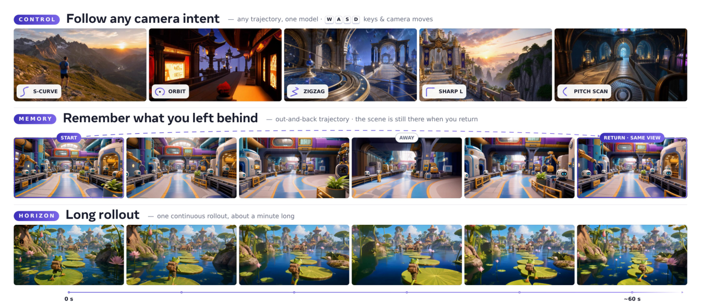
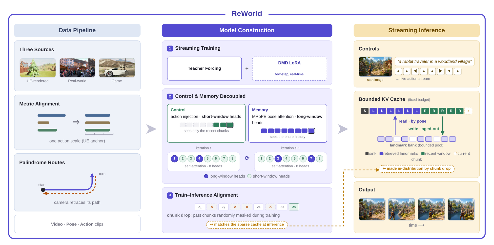
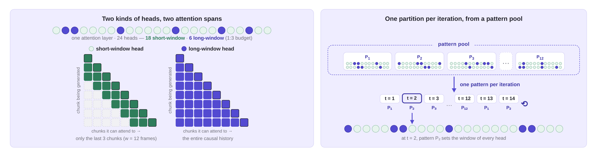
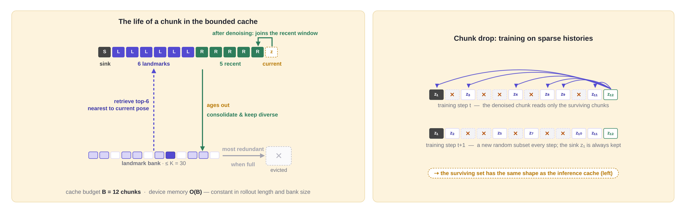
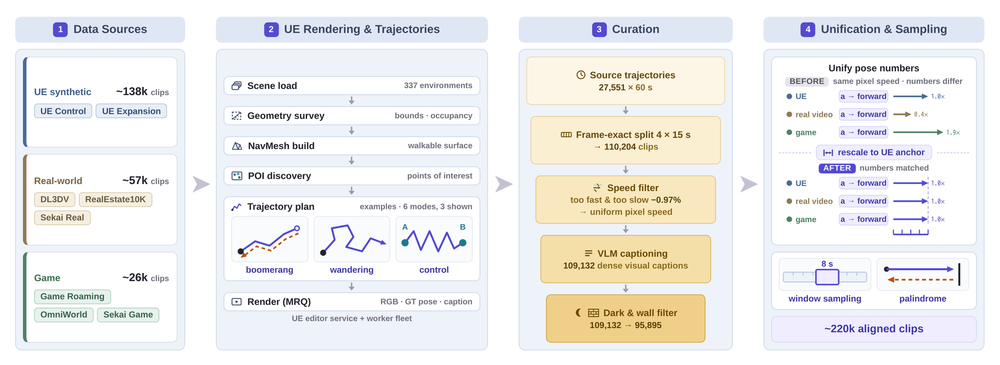
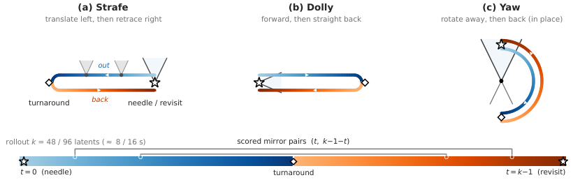
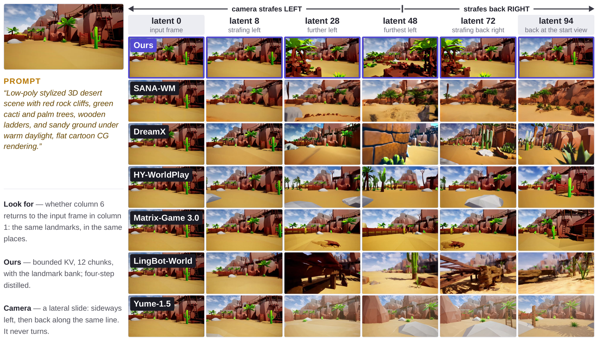
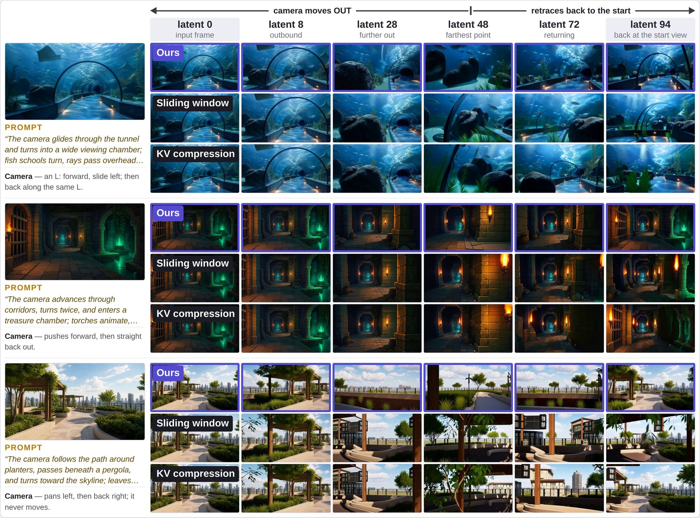
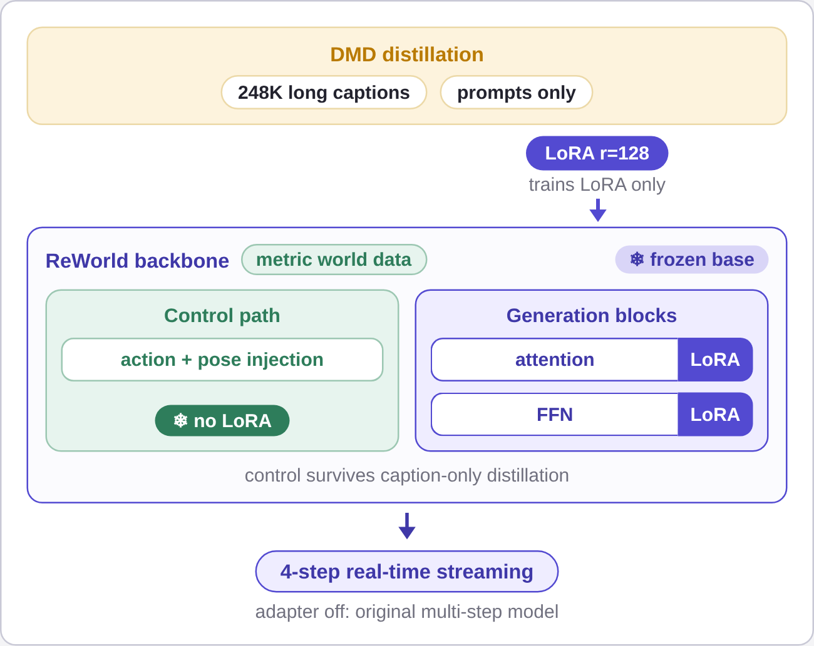

> **论文**：ReWorld: An Interactive World Model with Long-Horizon Memory
> **作者**：Zhifei Chen, Luozhou Wang, Guibao Shen, Dongyu Yan, Shuai Yang, Tianshuo Xu, Yihua Du, Wei Wang, Tianyi Gui, Lianghua Huang, Yingcong Chen（HKUST(GZ) / Alibaba ATH）
> **arXiv ID**：2608.23565
> **发表时间**：2026-08-24（v1 提交；21 页，9 图）
> **许可协议**：CC BY 4.0
> **代码仓库**：无官方代码（项目主页 https://zhifeichen097.github.io/ReWorld/）

## 第 1 章 概述

### 1.1 一句话定位

ReWorld 是一个动作可控的流式交互世界模型：在固定 KV 缓存预算下同时实现相机动作跟随、长时空间记忆与实时高分辨率视频生成——通过在训练期按注意力窗口分离"控制"与"记忆"两种能力、在推理期用姿态索引的 landmark bank 在有界预算内整合全部历史实现。

*图1：ReWorld 的三重能力——反应（跟随相机意图）、记忆（重访场景还原）、流式（长 rollout 实时生成），全文围绕三者间的结构性张力展开。*

### 论文图表总览

| 编号 | 内容 | 章节 |
|------|------|------|
| **Figure 1** | Teaser：跟随相机意图 / 重访重生成 / 流式长 rollout | 第 1 章 |
| **Figure 2** | 系统总览：数据管线 + 训练 + 推理 | 第 3 章 |
| **Figure 3** | 混合 per-head 注意力窗口与随机头路由 | 第 3 章 |
| **Figure 4** | 记忆整合：推理缓存组成 + chunk-drop 训练 | 第 4 章 |
| **Figure 5** | DMD LoRA 实时蒸馏 | 第 4 章 |
| **Figure 6** | 四阶段数据管线 | 第 4 章 |
| **Figure 7** | palindrome 轨迹构造（NIAH 协议） | 第 5 章 |
| **Figure 8** | 定性记忆对比（strafe-and-return rollout） | 第 5 章 |
| **Figure 9** | 推理 cache 策略定性消融 | 第 5 章 |
| **Table 1** | 注意力姿态条件化设计对比（MRoPE vs two-pass） | 第 3 章 |
| **Table 2** | 八源训练语料（220,724 clips） | 第 4 章 |
| **Table 3** | 相机可控性（7 方法 × 6 轨迹） | 第 5 章 |
| **Table 4** | 长时记忆（palindrome NIAH，k=48/96） | 第 5 章 |
| **Table 5** | VBench 视频质量（7 维度） | 第 5 章 |
| **Table 6** | 训练配方 + cache 策略消融（Revisit SSIM） | 第 5 章 |
| **Table 7** | 控制–记忆解耦研究 | 第 5 章 |

### 1.2 核心贡献

1. **窗口分离训练控制与记忆**：混合 per-head 注意力窗口（18 个 local 头看最近 w=12 帧 + 6 个 global 头看完整因果历史），随机头路由（12 个随机六头分区池逐优化步切换），使控制能力在短窗口内完整学习、记忆在长窗口下学习，且部署时缓存压缩不干扰动作跟随（结构约束不损失控制权威）。
2. **Chunk-drop 训练 + 整合式推理**：训练时随机遮蔽历史 chunk（12 中保留 6 + sink）使稀疏非连续 KV cache 在分布内；推理时老化 chunk 整合进有界 landmark bank（odometer 准入规则 + 冗余驱逐，K=30），按当前姿态检索最近的 landmark 填充固定 B=12 缓存——空间记忆在固定 KV 预算下跨任意长 rollout 持久。
3. **度量对齐多源数据管线**：UE 渲染、真实世界与游戏三类八源共 220,724 clips 通过每源单除数 σ_s 对齐到同一物理动作尺度（同一按键在所有源中移动相机相同物理距离），palindrome 轨迹提供重访监督证据。
4. **实时部署与评估**：DMD 蒸馏限制在 rank-128 LoRA adapter 内（2.6 GB），一个 backbone 同时提供高保真多步模式与实时 4 步模式；三轴评估协议（动作跟随 / 长时召回 / 视频质量）覆盖 6 个近期交互世界模型基线。

### 1.3 关键结果速览

- **控制保真度最优**：相机可控性基准（40 图 × 6 轨迹 × 7 方法）上，ReWorld 取得最佳 overall RotErr 11.95°（次优 LingBot-World 12.59°）与最佳相机运动一致性 CamMC 0.332（次优 LingBot-World 0.354）。
- **长时记忆判别性长度领先**：k=96 palindromic NIAH（间隔 95 latents，起始视图离开所有有界窗口）上 DINO 0.932、ORB 0.379；在 64 s / 384 latents 的分钟级 out-and-back rollout 上，固定 12-chunk 缓存仍重建起始视图——滑动窗口早已驱逐证据、full-KV 注意力 OOM 的长度区间。
- **生成质量平均最优**：VBench 7 维平均 0.850（领先 HY-WorldPlay 0.842），时间轴维度（Motion Smoothness 0.979、Temporal Flickering 0.952）第一梯队，同时保持高 Dynamic Degree 0.912。
- **消融验证解耦**：chunk drop + 随机路由组合将 k=384 重访 SSIM 从 0.3387（base）提升至 0.3752；landmark bank 在 k=384 得 0.3752 vs 滑动窗口 0.3476；Routing 在控制不损失（RotErr 12.94° vs 无路由 13.21°）前提下将重访 SSIM 从 0.3376 恢复至 0.3752。

## 第 2 章 研究背景与动机

### 2.1 交互世界模型的三重能力要求

一个交互式世界模型（interactive world model）必须同时做到三件事：

- **react（即时响应）**：用户的按键与控制信号必须立即反映在生成画面中；
- **remember（长时记忆）**：模型已经展示过的场景，在用户重访时必须保持原样，即跨任意时间跨度的空间一致性；
- **stream（实时流式）**：以实时帧率进行无限长 rollout，输出 704×1280 视频，而非固定时长的离线片段。

ReWorld 的核心判断是：三者之间的矛盾是**结构性的**——控制需要短 horizon，记忆需要无界 horizon。一方面，动作跟随所依赖的视觉证据集中在本 chunk 与最近若干 latent frame，短注意力窗口即可满足；另一方面，"记住到过的地方"要求模型在任意长的时间跨度后仍能取回早期证据。同时，流式推理中 KV cache 随 chunk 数线性增长，在 720p 分辨率下无界 cache 会提前耗尽显存，"无限记忆"与"有限显存"构成直接冲突：滑动窗口有界但会遗忘，full-KV 不遗忘但无法部署。

### 2.2 现有方法的两条设计轴

**控制轴：相机位姿如何进入模型。** 现有工作分两类。其一，pose 进入 attention index：把相机位姿编入注意力索引，使注意力本身携带几何信息（PM-RoPE 一类的 pose-dependent attention）。其二，action 直接注入：把控制信号作为输入注入网络（Matrix-Game、LingBot-World、SANA-WM、Vid2World 等）。HY-WorldPlay 则两者兼有。

**记忆轴：pose 如何用于检索历史。** 现有工作有三种形式：

1. 从历史中**选帧重新进入上下文**（past-frame archives 路线，如 Context as Memory、WorldMem）；
2. **外部记忆库索引**（显式 3D 重建路线，如 Video World Models with Long-Term Spatial Memory）；
3. **进入 attention index**（pose-dependent attention，如 PM-RoPE）。

sink + 滑动窗口类方案缓存有界但必然遗忘：一旦承载证据的 chunk 被滑出窗口，重访保真度便永久丢失。

### 2.3 核心洞察：控制与记忆无法在同一窗口下共训

ReWorld 的关键实验发现是：**控制与记忆放在一起训练时，控制学得好而记忆学不好**。在固定推理配方下对比三种融合方式：

| 融合方式 | RotErr°↓ | TransErr↓ | CamMC↓ | Revisit SSIM↑ |
|:---|:---:|:---:|:---:|:---:|
| MRoPE only | 17.66 | 0.204 | 0.394 | 0.3898 |
| Action + MRoPE | 13.21 | 0.107 | 0.371 | 0.3376 |
| Routing（ReWorld） | **12.94** | **0.093** | **0.346** | 0.3752 |

直接加入 action 注入后所有控制指标全面改善（RotErr 从 17.66° 降至 13.21°），但重访保真度反而恶化（Revisit SSIM 从 0.3898 跌至 0.3376）——控制信号干扰了记忆能力。进一步分析表明，两种能力需要**不同的 attention 窗口**：控制在只覆盖最近 $w=12$ latent frames（3 chunks）的短窗口下即可完整学习，而记忆必须在不截断的长窗口下学习。随机头路由（3.5 节）在保留 action 注入带来的控制收益的同时，把重访保真度恢复到 0.3752，且控制不损失（RotErr 12.94°、TransErr 0.093、CamMC 0.346 均为三者最优）。

### 2.4 ReWorld 的两步解法

ReWorld 把上述冲突拆解为两个正交步骤：

1. **训练时按窗口分离控制与记忆**。混合 per-head attention 窗口让两种能力各自在合适的窗口下学习：18 个 local 头只看最近 $w=12$ latent frames，6 个 global 头看全历史；随机头路由（$|\mathcal{P}|=12$ 个随机六头全局集、每 optimizer step 切换）防止任一能力绑定到特定 head；chunk-drop 使稀疏、非连续的 KV cache 成为 in-distribution 输入。
2. **推理时在固定 KV 预算下整合记忆**。整个历史被收纳进一个有界结构：$B=12$ chunks 的 KV cache，背后是 $K=30$ 的 pose 索引 landmark bank——旧 chunk 以全分辨率写入 bank，推理时按当前位姿检索最近邻 landmark。由此在固定显存预算下实现任意远的空间记忆：在 64 s、384 latents 的分钟级 out-and-back rollout 上，固定 12-chunk cache 仍能重新生成起始视图，而滑动窗口早已驱逐证据、full-KV 注意力早已显存耗尽。

配套地，度量尺度对齐的八源数据引擎（4.3–4.6 节）为记忆训练提供重访监督，限制在 LoRA adapter 内的 DMD 蒸馏保证实时流式部署。

## 第 3 章 相机可控流式生成

*图2：系统总览图，一条横轴贯通数据→训练→推理三阶段，是理解 ReWorld 全貌的关键架构图。*

### 3.1 Backbone 与 chunkwise 因果结构

ReWorld 采用 Wan2.2-TI2V-5B 视频 diffusion transformer 作为 backbone，工作于其 causal VAE latent space，遵循 AR-train-then-distill 路线（LongLive-2.0）：先以多步自回归方式训练，再蒸馏为少步实时模型。训练 clip 组织为 $L=12$ 个 chunks、每 chunk 4 latent frames；注意力因果性按 chunk 划分——**chunk 内 full attention，跨 chunk causal attention**。这一 chunkwise 因果结构是流式生成的基础：生成每个新 chunk 时，模型可以读取此前所有 chunk 留下的 KV cache。

整个系统由五个组件构成：MRoPE（姿态进入注意力索引）、action injection（Plücker 光线图注入）、mixed windows + random routing（控制与记忆的窗口分离训练）、chunk-drop + landmark retrieval（有界 KV 预算下的记忆整合，见第 4 章）、LoRA 蒸馏（实时化）。

### 3.2 MRoPE：以姿态差索引注意力

MRoPE（Memory-RoPE）让相机位姿直接参与注意力索引。每个 latent frame 携带 relative SE(3) pose $P_f$，由描述子

$$c_f = [\mathrm{vec}(R_f);\; t_f] \in \mathbb{R}^{12}$$

经一个 zero-init MLP 映射为 phase offset $\delta_f$，作用在 RoPE 的 Q/K 上（公式 (1)）：

$$\tilde{q}_f = \mathrm{RoPE}(q)\, e^{i\delta_f}, \qquad \langle \tilde{q}_f, \tilde{k}_g \rangle \propto e^{i(\delta_f - \delta_g)} \tag{1}$$

由于注意力得分只依赖两帧 pose 的 phase 差，**视点相近的帧无论时间距离多远都会被拉近**——这正是"以 pose 差索引相似视点"的含义，也是重访检索得以在注意力内部发生的机制。

除 Q/K phase 外，MRoPE 还在 V/O 上施加 zero-init 的 SE(3) residuals：

$$\tilde{v} = v + W_v(P_f^{-1} \circ v), \qquad \mathrm{out} = W_o\, y + W_p(P_f \circ y)$$

zero-init 保证训练起点等价于恒等映射，姿态调制随训练渐进引入。与 two-pass 类设计相比，MRoPE 只需单次 attention pass、额外开销仅 1 个小 MLP + 2 个 linears：

| 设计 | Attention index | 姿态入口 | Attn passes | 额外成本 |
|:---|:---|:---|:---:|:---|
| Temporal RoPE | time & space | — | 1 | — |
| HY-World 1.5（two-pass） | time + projective pose | 独立 camera-aware pass 融合 | 2 | ~2× attention FLOPs |
| E-PRoPE | time + projective pose | 独立缩减 token 的 camera pass 加回 | 2 | 一个缩减 pass（~4.5× 更少 token） |
| **MRoPE（ReWorld）** | time, space & pose | Q/K phase + zero-init V/O residuals | **1** | 1 small MLP + 2 linears |

### 3.3 动作注入：Plücker 光线图

控制信号经 Plücker ray map 注入网络：每个空间位置接收其 viewing ray 的 6-D Plücker 坐标

$$[d;\; o \times d]$$

其中 $d$ 为光线方向、$o$ 为相机光心，叉积 $o \times d$ 编码光心到该位置的有向距离。ray map 经 MLP 投影到 model width 后**加到 patch embeddings** 上。由此形成明确的分工：**ray map 告诉当前 chunk 的每个 token 相机朝哪看，MRoPE 告诉 attention 里的缓存 token 是从哪里看到的**——前者作用于输入端控制新帧的生成，后者作用于注意力端对齐历史帧的检索。

### 3.4 混合 per-head 注意力窗口

ReWorld 不在"短窗"与"长窗"之间二选一，而是在 head 维度上混合两种窗口（公式 (2)）。每个 block 的 $H=24$ 个 heads 划分为两组：

$$\mathrm{Attn}_h(i) = \begin{cases} \{\, j : t_j \in [\,t_i - w,\; t_i\,] \,\}, & h \in \mathcal{G}_{\mathrm{loc}},\; |\mathcal{G}_{\mathrm{loc}}| = 18 \\[4pt] \{\, j : t_j \le t_i \,\}, & h \in \mathcal{G}_{\mathrm{glob}},\; |\mathcal{G}_{\mathrm{glob}}| = 6 \end{cases} \qquad w = 12 \tag{2}$$

18 个 local heads 只看最近 $w=12$ latent frames（即 3 chunks），承载短 horizon 的控制能力；6 个 global heads 看全部 causal history，承载长 horizon 的记忆能力。1:3 的 global-to-local 预算把大部分容量留给控制，只留一小部分给记忆——与 2.3 节的洞察一致：控制需要的是密集的近期证据，记忆只需要一条能取回远期证据的通路。

### 3.5 随机头路由

混合窗口带来一个隐患：global 能力可能绑定到特定的 6 个 head 上。ReWorld 用**随机头路由**消除这种绑定：维护 $|\mathcal{P}|=12$ 个随机的 6-head 全局集，**每个 optimizer step 切换一次**，即"哪些 head 当 global"在训练中不断轮换。

其效果由部署方式反推保证：推理时**所有 head 读取同一个有界 cache**（第 4.1 节的 $B=12$ chunks），因此任何 head 都不能依赖某个特定窗口形状。这给出一个可检验的预测——更换 cache 压缩策略不会改变控制误差。3.4 节的混合窗口与 3.5 节的随机路由合起来，正是 2.3 节表中所验证的 Routing 配方：控制与记忆同时达到最优。

*图3：窗口分离训练的核心机制——局部/全局头的动态划分，使控制与记忆两种能力不在特定头上绑定。*

## 第 4 章 记忆整合与数据管线

### 4.1 有界 KV 预算下的记忆整合

流式推理中 KV cache 线性增长，720p 下 unbounded cache 提前耗尽显存。ReWorld 的目标是在 constant-size cache 下保留任意远的回忆，分为写侧与读侧两个机制。

**写侧：consolidation 进 landmark bank。** 当一个 chunk 从最近窗口中老化（aging out），其 KV 以**全分辨率**写入有界 landmark bank——不做池化、不合并、不剪枝，避免压缩破坏重访保真度。准入采用 **odometer 规则**：只有当相机自上次写入以来走过的位移超过 stride $\delta$ 时才存入，保证 bank 内 pose 的多样性。bank 容量 $K=30$；写满时驱逐 pose 空间中最冗余的成员（nearest neighbour 距离最近者），而**前两个成员永不驱逐**——它们锚定起始视图，是 out-and-back rollout 的关键证据。

**读侧：按位姿检索。** 推理时每个 chunk 携带单一 pose $P_k$，注意力读集由公式 (3) 给出：

$$C_k = \{\mathrm{sink}\} \cup \{k-5, \ldots, k-1\} \cup T_k, \qquad |T_k| = 6, \qquad |C_k| = B = 12 \tag{3}$$

即 1 个 sink chunk + 5 个最近 chunk + 6 个从 bank 中按当前位姿检索出的最近邻 landmark，总共 $B=12$ chunks 的固定 KV 预算。工程上，landmark 主副本放在 host memory，工作集驻留 device，prefetch 走独立 stream，检索不阻塞生成。

*图4：记忆整合机制图——写侧 consolidation 与读侧 retrieval 的分工，以及 chunk-drop 训练使稀疏缓存 in-distribution。*

### 4.2 Chunk-drop 训练

consolidation 后的 cache 是稀疏且非连续的（旧 chunk 被整合掉，只留 landmark），直接部署会让模型面对 out-of-distribution 的输入。**Chunk-drop 训练**在训练期显式模拟这一分布：训练 clip 共 $L=12$ chunks，每个 step 保留 sink + 5 个随机幸存者（每 step 重新采样），query 只 attend 幸存 chunk 的 clean keys 与自身 chunk。两条关键规则：

- **queries 永不 drop**——每个 chunk 仍然收到 denoising loss，训练信号不因 drop 而丢失；
- **keep-set 广播到所有 parallel ranks**——保证数据并行各 rank 看到一致的历史视图。

消融对比了四个备选策略：full-KV（不可部署的上界）、sliding-window + sink（遗忘基线）、mean-pooled compression、retrieval-free（6 个 pose 去重的静态 landmark）。在 k=384 latents 的重访任务上，训练配方从 base 的 Revisit SSIM 0.3387 提升到 +chunk-drop 的 0.3463，再加 random routing 达到完整配方的 0.3752。

### 4.3 八源训练语料

ReWorld 的数据引擎整合八个来源、共 220,724 clips，覆盖 UE 渲染、真实世界、游戏三类世界外观：

| 源 | #Clips | 时长 | Pose | Caption |
|:---|:---:|:---:|:---|:---|
| UE control（自建） | 95,895 | 15 s | engine GT（c2w, cm） | pipeline-generated |
| UE expansion（自建） | 42,536 | 30–60 s | engine GT（c2w, cm） | scene summary + camera |
| DL3DV | 29,864 | 15 s | VIPE | Qwen-VL |
| RealEstate10K | 12,065 | ≥8 s | VIPE（re-estimated） | pre-computed |
| Sekai real-walking-hq | 14,730 | 60 s | MegaSaM（c2w） | official CSV |
| Game roaming（79 games） | 18,387 | 15 s | VIPE（metric） | Qwen-VL |
| OmniWorld-Game | 5,629 | ~12 s | engine（w2c→c2w） | per-clip JSON |
| Sekai game-walking | 1,618 | 60 s | engine GT（UE5, c2w） | official CSV |
| **Total** | **220,724** | | | |

采样采用 clip 级均匀混合（与时长无关），最终比例为 63% UE / 26% real / 11% game。各源经过滤后才进入语料：UE control 从 110,204 过滤到 95,895 clips（约 −13%，速度与暗帧/贴墙过滤），UE expansion 从 47,726 到 42,536（−10.9%）；game roaming 从 494.7 小时、168 个游戏筛到 18,387 clips、79 个游戏。采样窗口为 189 frames，重采样到 24 fps（约 8 s）。

### 4.4 UE 渲染管线

UE 侧在 **337 个环境**上自动生产控制数据。管线由自动化 UE editor 服务驱动，依次完成场景加载、几何 survey、NavMesh 构建、POI 发现、轨迹规划与 Movie Render Queue 渲染。轨迹规划覆盖六种模式：

| 轨迹模式 | 占比 |
|:---|:---:|
| local_explore | ~29% |
| reveal_pan | ~26% |
| aerial | ~15.5% |
| control | ~15% |
| wandering | ~8% |
| boomerang | ~6% |

其中 control 模式专为动作跟随设计：锚定两个 POI，并做方向平衡的随机运动——后退、侧向、斜向与前进以等概率采样，避免数据集中"只前进"的偏置。速度设定上，control 模式 180 cm/s，探索类模式 120 cm/s。

*图6：数据管线全流程——从八类素材到同一物理动作尺度上可训练 clip 的完整工程链路。*

### 4.5 度量尺度对齐

八源数据的 pose 来自引擎真值、VIPE、MegaSaM 等不同估计器，平移单位与尺度互不兼容——必须对齐到同一物理动作尺度，才能让"同一次按键在所有源中移动相机同样的距离"。ReWorld 为每个源估计单一全局除数（公式 (4)）：

$$\sigma_s = \frac{\mathrm{med}_s[\|\Delta t\|]}{\mathrm{med}_{\mathrm{UE}}[\|\Delta t\|]}, \qquad \mathrm{med}_{\mathrm{UE}}[\|\Delta t\|] = 0.3667, \qquad t \leftarrow t / \sigma_s \tag{4}$$

即以 UE 源的逐帧平移中位数为基准，把各源平移除以自身与基准的中位数之比。各源除数为：

| 源 | $\sigma_s$ |
|:---|:---:|
| UE（两源） | 100（cm→m） |
| DL3DV | 0.1923 |
| RealEstate10K | 0.2273 |
| OmniWorld-Game | 1.75 |
| Sekai real | 0.0086 |
| Sekai game | 0.0107 |
| Game roaming | 1 |

单全局标量即已足够：per-clip 尺度展布（p90/p10）在所测源上有界（3.65/2.66/2.86/2.67），无需逐 clip 标定。post-hoc 审计的中位数比为 1.00/0.92/1.00/1.21/0.96/0.94，各源对齐后落在同一动作尺度上。

### 4.6 Palindrome 轨迹

记忆训练需要"重访"监督：轨迹必须回到先前看过的视角，模型才有机会学习取回早期证据。真实拍摄数据几乎不包含精确回访，因此 ReWorld 在 UE 源上以 **20% 概率**将轨迹替换为 **palindrome（回文）轨迹**——取随机半窗做时间反转拼接，使后半程精确重演前半程的视点序列。这一构造同时服务于训练（提供重访梯度）与评估（实验章的 palindrome NIAH 协议以 mirror pairs 评分），是第 2.1 节 remember 能力得以落地的数据基础。

## 第 5 章 实验评估

### 5.1 实验设置

ReWorld 在 Wan2.2-TI2V-5B backbone 上分两阶段训练：先 480p（384×640）预训练，再 720p（704×1280）warm-start（空间 RoPE 位置插值）。每个训练窗口覆盖 L=12 个 latent chunk，按每 chunk 动作 a_k 与姿态 P_k 条件化。H=24 个注意力头中，全局集 G（|G|=6）关注完整因果历史，其余头使用 w=12 帧局部窗口；训练时 G 在 12 个随机六头分区的固定池中逐优化步循环（随机头路由），KV chunk 随机丢弃至 6 个保留 chunk 加 1 个 sink chunk。

部署与计时结果统一使用 4 步 DMD 蒸馏 LoRA（rank 128、block size 16、单 rollout student），应用于多步模型 EMA 权重，采用 self-forcing 风格蒸馏配方。推理在 720p、4 步去噪、CFG scale 1、每 block 16 latent 帧下运行；per-head 窗口是训练期构造，评估时不施加——所有头都关注有界缓存。有界内存 arm 在缓存 C 上使用 KV chunk 预算 B=12，landmark bank M 上限 |M|≤K=30。

评估四轴：①相机可控性（6 个交互世界模型/相机控制视频生成基线共享轨迹基准）；②长时记忆（palindrome 重访轨迹 NIAH 协议，最长 384 latents）；③视频质量（VBench 7 个 video-intrinsic 维度）；④消融（训练配方 chunk drop/随机头路由、推理 cache 策略、动作/姿态融合设计）。

### 5.2 相机可控性

基准构造：40 张起始图（取自六个基线官方仓库，704×1280，避免偏向任何方法）× 6 条规范轨迹 = 每方法 240 clips。轨迹包括 dolly（持续前进）、strafe（左右横移）、arc_yaw（前进+偏航）、arc_pitch（前进+俯仰）、s_curve（前进+交替偏航）、palindrome（前进后精确返回）。每方法收到相同相机意图并通过其原生控制接口（动作键、姿态序列或文本）执行。生成片段用 ViPE 重新跟踪，估计轨迹经 Sim(3) 位置对齐 + 全局朝向对齐（限制 det=+1）注册到意图轨迹，吸收每方法在步长、手性、坐标系上的约定差异，比较轨迹形状是否遵循意图。报告每轨迹旋转误差 RotErr（测地线，度）与聚合平移误差 TransErr、相机运动一致性 CamMC。

表 5-1：相机可控性基准（40 图 × 6 轨迹，每方法 240 clips；RotErr/TransErr/CamMC 越低越好）

| 方法 | Overall RotErr°↓ | TransErr↓ | CamMC↓ | dolly | strafe | arc_yaw | arc_pitch | s_curve | palindrome |
|:---|:---:|:---:|:---:|:---:|:---:|:---:|:---:|:---:|:---:|
| SANA-WM | 13.02 | 0.123 | 0.388 | 4.95 | 1.51 | 32.01 | 21.33 | 17.54 | 0.80 |
| DreamX | 13.10 | 0.114 | 0.381 | 2.50 | 1.21 | 33.00 | 20.71 | 18.06 | 3.13 |
| HY-WorldPlay | 14.66 | 0.114 | 0.427 | 0.26 | 0.24 | 43.53 | 22.00 | 21.73 | 0.20 |
| Matrix-Game 3.0 | 15.45 | 0.075 | 0.394 | 8.19 | 1.00 | 39.93 | 20.59 | 17.75 | 5.24 |
| LingBot-World | 12.59 | 0.107 | 0.354 | 3.10 | 6.01 | 26.21 | 26.83 | 12.23 | 1.16 |
| Yume-1.5 | 14.24 | 0.131 | 0.428 | 0.84 | 2.01 | 29.05 | 24.57 | 25.60 | 3.38 |
| **ReWorld（本文）** | **11.95** | 0.102 | **0.332** | 2.69 | 1.07 | 27.63 | 23.61 | 16.06 | 0.64 |

ReWorld 取得最佳 overall RotErr（11.95°）与最佳 CamMC（0.332），在平移主导轨迹（dolly、strafe、palindrome）上处于第一梯队，在旋转主导弧线（arc_yaw、arc_pitch）上保持竞争力——后者对所有方法都是最困难区间。

*图7：长时记忆 NIAH 协议的轨迹构造——折返结构保证早期视图必须跨越长间隔被召回。*

### 5.3 长时记忆

空间记忆用基于 palindrome 轨迹的 needle-in-a-haystack（NIAH）协议探测：相机移出后沿原路径折返，clip 早期生成的视图必须在长时间间隔后重现——这些早期视图即 needles。基线基准配对 12 张起始图与 3 条规范 palindrome（strafe、dolly、yaw），在两种 rollout 长度 k∈{48,96} latents（约 8 s 与约 16 s）下每方法每长度 36 clips。计分重访对为 palindrome 的镜像对，锚定在 clip 最早五分之一，仅保留间隔覆盖至少半个 rollout 的对，每 clip 最多 5 对。自有 arm 额外运行长版记忆测试：分组动作探索补全为 palindrome，嵌套长度 k∈{96,192,288,384} latents；每长度是同一条轨迹的前缀，得分跨 k 可比。

每个重访对比较 needle 处预测帧与相机返回该姿态时预测帧的相似度，四种计分：SSIM（像素级结构）、LPIPS（深度特征感知距离，越低越好）、DINO（DINO ViT 特征余弦相似度，是否同一场景布局）、ORB（匹配 ORB 关键点比例，特定地标是否回到原位）。各得分在重访对上平均、再在 clips 上平均。为避免"几乎不动得高分"，同时报告各方法执行路径长度（外行半程累积中位光流，即翻转前实际覆盖的视觉地面量）。

表 5-2：palindromic 重访基准上的长时记忆（k=48 与 k=96 latents；SSIM/LPIPS/DINO/ORB 为绝对重访相似度得分）

| 方法 | k=48 路径 | k=48 SSIM↑ | k=48 LPIPS↓ | k=48 DINO↑ | k=48 ORB↑ | k=96 路径 | k=96 SSIM↑ | k=96 LPIPS↓ | k=96 DINO↑ | k=96 ORB↑ |
|:---|:---:|:---:|:---:|:---:|:---:|:---:|:---:|:---:|:---:|:---:|
| SANA-WM | 296 | 0.318 | 0.433 | 0.810 | 0.174 | 499 | 0.313 | 0.528 | 0.700 | 0.161 |
| DreamX | 279 | 0.214 | 0.553 | 0.740 | 0.180 | 454 | 0.194 | 0.627 | 0.603 | 0.159 |
| HY-WorldPlay | 113† | 0.448 | 0.163 | 0.969 | 0.464 | 210† | 0.427 | 0.247 | 0.942 | 0.460 |
| Matrix-Game 3.0 | 312 | 0.318 | 0.369 | 0.891 | 0.292 | 724 | 0.275 | 0.478 | 0.850 | 0.247 |
| LingBot-World | 352 | 0.274 | 0.557 | 0.663 | 0.177 | 834 | 0.251 | 0.635 | 0.509 | 0.162 |
| Yume-1.5 | 165 | 0.268 | 0.533 | 0.747 | 0.179 | 332 | 0.269 | 0.586 | 0.661 | 0.152 |
| **ReWorld（本文）** | 286 | 0.349 | 0.282 | 0.913 | 0.325 | 615 | 0.384 | 0.332 | 0.932 | 0.379 |

† HY-WorldPlay 执行路径最短（113/210 px，其他方法 279–352/454–834 px），短路径更容易从记忆复现。

两种长度角色不同：k=48 时重访间隔达 47 latents，多个基线仍把起始视图留在上下文内（LingBot-World 保持 52-latent 窗口，SANA-WM 线性注意力与 Yume-1.5 无界）——作为 sanity check；k=96 时间隔达 95 latents，起始视图已离开所有有界窗口，必须从记忆召回——这是判别性长度。HY-WorldPlay 基线得分最强，但它移动最少（k=96 中位外行路径 210 px vs 其他 332–834 px），短路径更易从记忆复现。ReWorld 在 k=96 取得 DINO 0.932 与 ORB 0.379（第二），SSIM 0.384 与 LPIPS 0.332（第二，仅次于 HY-WorldPlay 但路径长 2.9 倍）。

*图8：k=96 strafe-and-return rollout 的定性对比——所有方法从同一输入帧出发执行同一横向 palindrome，最后一列应复现第一列；ReWorld（顶行，有界缓存 B=12 + landmark bank + 4 步蒸馏）以布局完整返回起始视图，基线要么偏离指令路径，要么以改变的几何重新生成重访区域。*

### 5.4 生成质量

VBench 7 个 video-intrinsic 维度评估感知质量：Imaging Quality、Aesthetic Quality、Subject Consistency、Background Consistency、Temporal Flickering、Dynamic Degree、Motion Smoothness，在与可控性基准相同的 clip 集上计算。方法原生输出在长度、分辨率、帧率上不同，全部归一化到统一规格（32 个均匀采样帧、1280×704、16 fps 重编码）后计分，比较内部受控但与原生长度输出的公开数值不可直接比。

表 5-3：VBench 质量（7 个 video-intrinsic 维度，越高越好；共享基准 clip 归一化为 32 帧 / 1280×704 / 16 fps）

| 方法 | Mean↑ | Imaging | Aesthetic | Subject Cons. | Background Cons. | Temporal Flick. | Dynamic Degree | Motion Smooth. |
|:---|:---:|:---:|:---:|:---:|:---:|:---:|:---:|:---:|
| SANA-WM | 0.835 | 0.668 | 0.537 | 0.908 | 0.919 | 0.942 | 0.900 | 0.969 |
| DreamX | 0.828 | 0.670 | 0.542 | 0.880 | 0.904 | 0.909 | 0.946 | 0.946 |
| HY-WorldPlay | 0.842 | 0.670 | 0.601 | 0.976 | 0.957 | 0.973 | 0.733 | 0.987 |
| Matrix-Game 3.0 | 0.836 | 0.713 | 0.461 | 0.894 | 0.919 | 0.921 | 0.983 | 0.962 |
| LingBot-World | 0.841 | 0.692 | 0.577 | 0.905 | 0.915 | 0.918 | 0.933 | 0.947 |
| Yume-1.5 | 0.844 | 0.669 | 0.565 | 0.878 | 0.911 | 0.934 | 0.988 | 0.964 |
| **ReWorld（本文）** | **0.850** | 0.665 | 0.579 | 0.929 | 0.929 | 0.952 | 0.912 | 0.979 |

ReWorld 平均分最佳（0.850）：无单一维度统治，但在时间轴维度（Motion Smoothness 0.979、Temporal Flickering 0.952）处于第一梯队，同时维持高 Dynamic Degree（0.912）；逐维领先的 HY-WorldPlay 以显著更低的运动（Dynamic 0.733）换取一致性得分。Dynamic Degree 应与 5.3 节重访指标联读——一致性/重访指标都偏好低运动 rollout。

### 5.5 消融实验

消融在长 rollout 记忆测试上报告重访 SSIM，rollout 长度 k∈{96,192,288,384} latents。

**训练配方消融**（上块）：变化训练配方——仅 chunk drop（CD）、仅随机头路由（RH）、两者组合（本文）。所有变体在相同设置下从头训练（720p、20k steps），并用相同 consolidation arm 评估，仅配方不同。

表 5-4：训练配方消融（Revisit SSIM↑，consolidation arm 固定）

| 配方 | k=96 | k=192 | k=288 | k=384 |
|:---|:---:|:---:|:---:|:---:|
| base | 0.4019 | 0.3747 | 0.3698 | 0.3387 |
| + CD（chunk drop） | 0.4043 | 0.3941 | 0.3846 | 0.3463 |
| + RH（随机头路由） | 0.4319 | 0.3787 | 0.3836 | 0.3565 |
| **+ CD + RH（本文）** | **0.4358** | **0.3929** | **0.3943** | **0.3752** |

**推理 cache 策略消融**（下块）：固定最终配方，仅在同一预算 B=12 下变化推理 cache 策略。每个有界 arm 保留相同 sink chunk，仅预算其余部分填充方式不同：window 用最近 chunk 滑动窗口；naive-merge 池化老化 chunk 而非驱逐；consolidation w/o bank 加 6 个静态 landmark（无检索）；consolidation w/ bank 从有界 bank 检索最接近当前姿态的 6 个 landmark；full-KV 保留全部（不可部署上界，k>192 时 OOM）。

表 5-5：推理 cache 策略消融（Revisit SSIM↑，预算 B=12）

| 策略 | k=96 | k=192 | k=288 | k=384 |
|:---|:---:|:---:|:---:|:---:|
| full-KV（上界） | 0.4463 | 0.4231 | (OOM) | (OOM) |
| window（滑动窗口） | 0.4129 | 0.3687 | 0.3505 | 0.3476 |
| naive-merge | 0.3741 | 0.3371 | 0.3467 | 0.3541 |
| consolidation w/o bank | 0.4376 | 0.3758 | 0.3743 | 0.3629 |
| **consolidation w/ bank（本文）** | 0.4358 | 0.3929 | 0.3943 | 0.3752 |

远间隔长度 k∈{288,384} 是判别性设置——滑动窗口必然已驱逐 needle。landmark bank 在此区间保持最高有界得分（0.3943、0.3752），且与 full-KV 上界差距收窄（k=384 时 0.3752 vs 上界不可用，k=192 时 0.3929 vs 0.4231）。naive-merge 在 k=384 不降反升（0.3541），源于池化 chunk 保留了部分聚合线索。

*图9：out-and-back 轨迹上不同推理 cache 策略的定性对比——滑动窗口与 KV 压缩漂移或重新发明重访场景；landmark cache（本文）返回起始视图。*

**控制–记忆解耦**：验证路由头结构是否将动作跟随与长距召回解耦，比较三种融合变体（相同协议训练）：MRoPE only（去掉动作嵌入，全部 H=24 头全局，控制只能从姿态索引位置编码推断）；Action + MRoPE（保留加性动作嵌入，全部头全局，即无路由的融合）；Routing（完整配置，混合全局/局部头 + 每步头路由）。在长 rollout 记忆测试上报告 4.2 节控制指标。

表 5-6：控制–记忆解耦（长 rollout 记忆测试上的控制指标与重访保真度）

| 方法 | RotErr°↓ | TransErr↓ | CamMC↓ | Revisit SSIM↑ |
|:---|:---:|:---:|:---:|:---:|
| MRoPE only | 17.66 | 0.204 | 0.394 | 0.3898 |
| Action + MRoPE | 13.21 | 0.107 | 0.371 | 0.3376 |
| **Routing（本文）** | **12.94** | **0.093** | **0.346** | 0.3752 |

加入动作注入改善全部控制指标（RotErr 17.66°→13.21°，TransErr 0.204→0.107，CamMC 0.394→0.371）但重访 SSIM 从 0.3898 降至 0.3376——正是窗口分离要解决的干扰。Routing 在控制上与无路由变体持平（12.94°、0.093、0.346）同时将重访 SSIM 恢复至 0.3752：结构约束不损失控制权威，并保持长间隔召回。

## 第 6 章 实现要点与工程细节

> 论文未提供官方代码仓库（仅有项目主页 https://zhifeichen097.github.io/ReWorld/），本章要点全部来自论文正文与附录。

### 6.1 训练配置

ReWorld 以 Wan2.2-TI2V-5B 视频 diffusion transformer 为 backbone（在 causal VAE 的 latent 空间运作），采用 AR-train-then-distill 路线（跟随 LongLive 系列）。两阶段分辨率训练：

- **480p 预训练阶段**：384×640 分辨率，训练窗口覆盖 L=12 个 latent chunk（每 chunk 4 latent 帧）。
- **720p warm-start 阶段**：704×1280，空间 RoPE 位置插值热启动；消融实验在 720p 下 20k steps。

每训练窗口按每 chunk 动作 a_k∈R^6 与相对 SE(3) 轨迹 P_k 条件化。H=24 注意力头中全局集 G（|G|=6）关注完整因果历史，其余 18 头使用 w=12 帧局部窗口；G 在 12 个随机六头分区的固定池中逐优化步循环。KV chunk 随机丢弃至 6 个保留 chunk 加 1 个 sink chunk。

### 6.2 实时推理配置

- 4 步 DMD 蒸馏 LoRA（rank 128、block size 16、单 rollout student），应用于多步模型 EMA 权重，self-forcing 风格蒸馏。
- 推理 720p、4 步去噪、CFG scale 1、每 block 16 latent 帧。
- per-head 窗口为训练期构造，评估时不施加——所有头关注同一有界缓存。
- 有界内存：KV cache chunk 预算 B=12；landmark bank 上限 K=30（tiered store：host memory 主副本保存全部 K 成员，仅检索工作集暂存 device；landmark 传输在独立 stream 预取与去噪重叠）。

*图5：LoRA 限定蒸馏示意——蒸馏只改生成质量路径，控制能力不受影响，是"一个 backbone 两种模式"的实现基础。*

### 6.3 蒸馏细节

- Student = 冻结 backbone + rank-128 LoRA（attention 与 feed-forward 层），DMD critic 同为冻结权重上的 LoRA；action/pose 注入路径不携带 LoRA，控制不受蒸馏影响。
- 蒸馏仅需文本 prompt（无视频）：student 从自身 KV cache 流式（self-forcing rollouts），prompt 用 248K 条通用长 caption（扩展自 VidProM）。
- 双模式：adapter off = 原始多步模型；adapter on = 实时 4 步流式。2.6 GB adapter 可跨 base checkpoint 迁移（需 2k–4k steps 重蒸馏）。
- 实用规则：在部署分辨率蒸馏，prompt 贴近部署分布；生产 student 用 block size 16 + 单 rollout，classifier-free guidance 折叠进 adapter。

### 6.4 数据工程

- 八源 220,724 clips（63% UE / 26% real / 11% game，clip 级均匀采样）。
- UE 渲染：自动化 UE editor 服务驱动 337 环境（场景加载、几何 survey、NavMesh 构建、POI 发现、轨迹规划、Movie Render Queue 渲染）；六种轨迹模式（local_explore ~29%、reveal_pan ~26%、aerial ~15.5%、control ~15%、wandering ~8%、boomerang ~6%），速度恒定（control 180 cm/s、探索模式 120 cm/s）。
- 度量对齐：每源单除数 σ_s（DL3DV 0.1923、RealEstate10K 0.2273、OmniWorld-Game 1.75、Sekai real 0.0086、Sekai game 0.0107、game-roaming σ=1、UE σ=100 即 cm→m），t←t/σ_s；旋转不缩放。
- 过滤：UE control 110,204→95,895（约 −13%，速度与暗帧/贴墙过滤）、expansion 47,726→42,536（−10.9%）；game roaming 494.7 小时 168 游戏→18,387 clips 79 游戏。
- Palindrome 增强：UE 源 20% 概率将窗口替换为随机半窗 + 时间反转；pose 降采样 SE(3)-aware（rotation slerp）。

## 第 7 章 局限性与延伸阅读

### 7.1 论文自述局限

1. **记忆仅以相机姿态为 key**：landmark bank 的检索、准入与驱逐全部基于 SE(3) 姿态相似度，无法处理动态场景（移动物体）与"相机没看但世界变了"的状态演化。扩展到动态场景与更丰富的非导航交互是作者指出的自然下一步。
2. **轨迹模式受限**：数据管线与评估集中于导航型相机运动（平移/旋转/重访），对物体交互、场景编辑、多智能体等交互类型未覆盖。

### 7.2 方法与局限分析

- **控制–记忆窗口分离的可测试预测**：论文提出"切换推理 cache 压缩策略控制误差不变"，并由 Table 7（Routing 控制 12.94° 与无路由 13.21° 相当）支持；但该预测只在路由池覆盖的窗口结构下验证，更大头数/窗口配置的泛化未测。
- **评估对齐的公平性**：可控性基准通过 Sim(3)+朝向对齐吸收每方法步长/手性/坐标系约定，比较的是轨迹形状而非绝对幅度；长时记忆基准以 path length 辅助解释——HY-WorldPlay 得分高但移动最少，ReWorld 在移动 2.9 倍路径的同时保持相近得分，说明记忆真实而非"少动取胜"。
- **VBench 归一化限制**：质量比较在统一 32 帧/1280×704/16 fps 规格下进行，与原生长度输出的公开数值不可直接比。
- **backbone 依赖**：方法建立在 Wan2.2-TI2V-5B 上，窗口分离/路由/chunk-drop 配方对更大模型或其他 diffusion backbone 的迁移性未验证；LoRA 蒸馏的 2.6 GB adapter 与 backbone 解耦，但控制/记忆机制本身与 backbone 绑定。

### 7.3 延伸阅读

| 方向 | 代表工作 |
|------|---------|
| 流式视频生成（AR-train-then-distill） | LongLive / LongLive-2.0（NVFP4 长视频基础设施） |
| 交互世界模型 | Genie（latent-action 预训练）、Matrix-Game 3.0（实时流式 + 长时记忆）、LingBot-World（开源世界模型）、HY-WorldPlay / WorldPlay（长期几何一致性）、SANA-WM（混合线性 diffusion transformer）、DreamX-World、Yume-1.5、Vid2World、HunyuanWorld、360Explorer |
| 世界模型记忆 | Context as Memory（记忆检索）、WorldMem（长期一致世界模拟）、Video World Models with Long-Term Spatial Memory（显式 3D 重建）、PM-RoPE（动态记忆 eliciting）、Attention Sinks（流式 LLM 有界缓存）、Self Forcing（AR 视频扩散训练-测试鸿沟） |
| 动作控制接口 | RealWonder（物理动作条件视频生成）、StreamDiT（实时流式 T2V）、MAGI-1（自回归视频生成规模化） |
