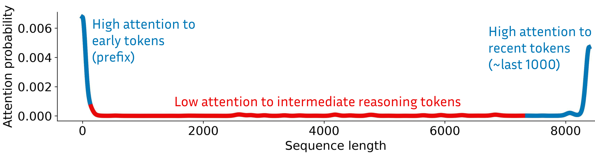
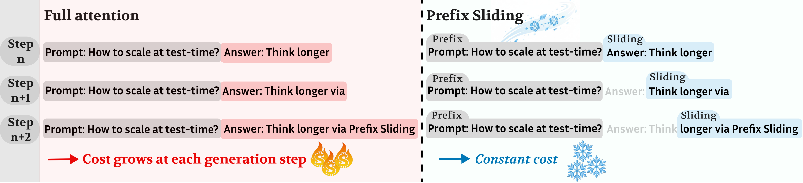
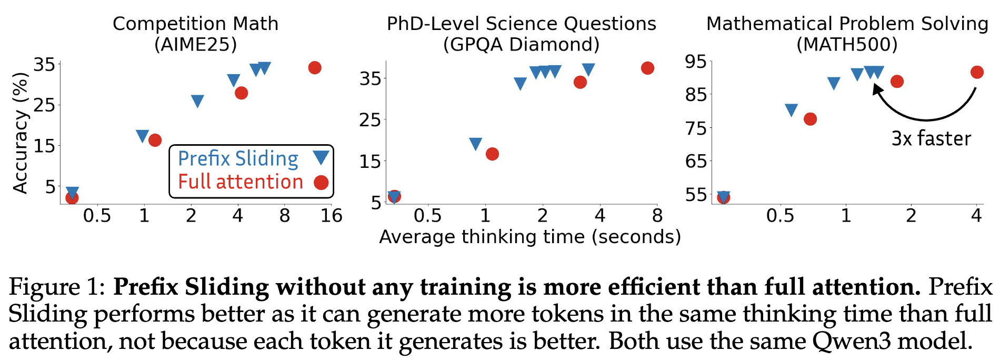
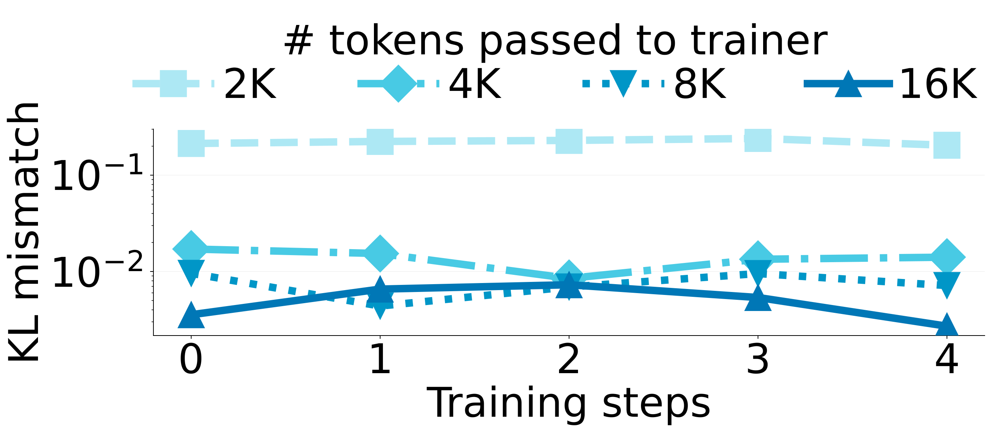
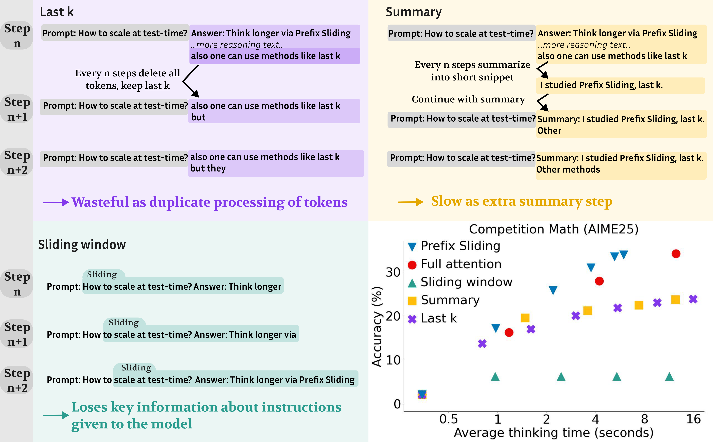

> **论文**：Prefix Sliding for efficient test-time scaling
> **作者**：Niklas Muennighoff, Zhengyang Wang, Zeyi Chen, Weijia Shi, Binyuan Hui, John Yang, Dapeng Jiang, Mika Senghaas, Fares Obeid, Johannes Hagemann, Sami Jaghouar, Ludwig Schmidt, Percy Liang, Jason Wei, Andrew Y. Ng, Luke Zettlemoyer, Yejin Choi, Mike Lewis（共 17 位作者）
> **arXiv ID**：2608.26070
> **发表时间**：2026-08-26
> **许可协议**：Apache-2.0
> **代码仓库**：https://github.com/Muennighoff/prefix-sliding

## 第 1 章 概述

### 1.1 一句话定位

本文提出 **Prefix Sliding（PS）**：一种免训练即可使用的 test-time scaling 注意力管理机制——在长推理过程中只保留 **prefix（系统指令/任务描述/工具定义）+ 最近数个 token 的滑动窗口**，丢弃中间推理 token，从而使每个新 token 的生成成本恒定（与已生成 token 总数无关），让语言模型可以以有界内存与有界单位成本进行任意长度的思考。

论文的出发点是一个朴素的观察：**推理轨迹中的大多数中间 token 会随着模型继续推理而迅速失去重要性**。既然如此，为它们支付 full attention 下逐 token 线性增长（总体二次增长）的注意力成本是否值得？论文的回答是：不值得。基于此，Prefix Sliding 把"必须记住的"（prefix 中的关键指令与工具）与"正在使用的"（最近的推理状态）留下，其余丢弃。

这一设计的直接收益体现在三个层面：

- **免训练场景**：已有模型（以 full attention 训练）可直接切换到该机制，配合 vLLM + 定制 FlashAttention kernel，获得约 3× 加速且性能不降；
- **RL 训练场景**：配合截断反向传播（truncated backpropagation）与 4× 窗口倍率，RL rollout 可扩展到超过 100,000 tokens，并通过更长思考取得更高 reward；
- **对比替代方案**：消融显示 Prefix Sliding 优于 summarization（compaction）、last k 与纯 sliding window 三类同样支持无限 test-time scaling 的方案。

从作者构成看，这是一项横跨斯坦福（一作为斯坦福 Knight-Hennessy 学者）与多个工业实验室（顾问团队含 Percy Liang、Andrew Y. Ng、Luke Zettlemoyer、Yejin Choi、Jason Wei、Mike Lewis 等）的系统性工作：既有机制与算法层面的创新（注意力结构、RL 截断方案），也有完整的系统落地（定制 Hopper kernel、vLLM 集成、开源代码与数据托管）。

### 论文图表总览

本报告引用论文 5 张核心图（Figure 1/2/3/8/9）并完整转录 3 张核心表（Table 1/2/3），各自与本报告章节的对应关系如下：

| 编号 | 内容简述 | 对应章节 |
|---|---|---|
| Figure 1 | 免训练主结果：Prefix Sliding vs full attention 的效率-性能对比曲线 | 第 5 章 |
| Figure 2 | Motivation：注意力分布分析（prefix attention sink、`<think>` 分隔符高注意力、轨迹中段低、末尾升高） | 第 3 章 |
| Figure 3 | 方法示意：prefix + 滑动窗口，丢弃中间推理 token | 第 3 章 |
| Figure 8 | RL 训练：更长推理轨迹 → 更高 reward；KL 消融（1×/2×/4×/8× 倍率） | 第 5 章 |
| Figure 9 | 消融对比：Prefix Sliding vs last k vs summary vs 纯 sliding window | 第 5 章 |
| Table 1 | 窗口大小扫描（Qwen3-1.7B，avg@64）：AIME25/GPQA/MATH500 精度、平均生成长度与吞吐 | 第 5 章 |
| Table 2 | Last k 超参扫描：k 从 64 到 1024 的 MATH500 与 AIME25 结果 | 第 5 章 |
| Table 3 | Summary prompt 消融：三种摘要提示的 AIME25 精度与 coverage | 第 5 章 |

论文中未被本报告直接引用的图表（Figure 4/5 为位置编码与反向传播示意、Figure 6 为 kernel 速度对比、Figure 10–13 为附录补充图）会在正文相应位置以文字形式转述其结论。

### 1.2 核心贡献

论文的贡献可以归纳为以下 6 条，分别覆盖观察、方法、系统与实验四个层面：

1. **关键观察（观察层）**：通过注意力分布分析（Figure 2）发现，推理轨迹的中间 token 重要性迅速衰减；而 prefix（系统指令/任务/工具定义）与最近的 token 构成两个高注意力区域——前者对应 attention sink 现象与模型对指令/工具的反复回查，后者对应模型当前正在进行的推理状态。这一观察为"丢弃中间 token"提供了实证依据，也是全文的逻辑起点。

2. **提出 Prefix Sliding（方法层）**：推理时仅保留 prefix + 滑动窗口内的 token，其余中间推理 token 全部丢弃。这使得每个新 token 的生成成本恒定（与已生成 token 总数无关），从机制上封顶了总内存需求，支持无限时长的 test-time scaling。方法本身无需重新训练预训练模型，直接修改推理时的注意力可见范围即可。

3. **免训练可用（实验层）**：方法可以直接应用于现有已训练模型（无需任何微调），配合 vLLM + 定制 FlashAttention kernel，在保持性能的同时取得约 3× 加速。这一点非常重要：它意味着任何已有的 full-attention 推理模型都能零成本迁移到有界注意力模式。

4. **RL 训练配合（方法 + 系统层）**：提出截断反向传播（truncated backpropagation）机制——按 4× 倍率把 token 传给 trainer（窗口 4 倍大小的上下文传入、仅窗口内部分计算 loss，以 loss mask 实现），支持超过 100,000 token 的 RL rollout；既兼容异步 RL（prime-rl），也兼容同步 RL（trl GRPO）。KL 消融（1×/2×/4×/8×）系统性地确定了该倍率。

5. **定制 FlashAttention kernel（系统层）**：针对 Hopper 架构实现两级过滤的 kernel——intra-tile masking（tile 与允许区域部分重叠时做元素级 mask）+ inter-tile skipping（完全落在允许区域外的 tile 直接跳过，producer-consumer 流水线迭代 prefix blocks 与 window blocks 两个不相交块区间），运行效率接近标准 sliding window kernel。

6. **系统优于替代方案（实验层）**：消融显示 Prefix Sliding 在性能-效率权衡上优于 last k、summarization（compaction）与无 prefix 的纯 sliding window 三类同样支持无限 test-time scaling 的替代方案，并逐一分析了每个替代方案的结构性缺陷（token 重复处理、摘要额外开销、任务信息丢失）。

### 1.3 关键结果速览

以下数值均来自论文正文、Table 1/2/3 与附录（详见第 5 章逐项分析）：

- **免训练加速**：直接应用于已训练模型（full attention 训练）即可获得约 **3× 加速**且性能不降（摘要声明）。窗口扫描（Table 1，Qwen3-1.7B，avg@64）显示：窗口 **8192** 时 AIME25 **35.8%** > full attention 的 **34.2%**，GPQA **38.0%** > **37.6%**，MATH500 **91.4%** ≈ **91.7%**——即性能不降甚至略升。
- **吞吐对比**：在 128K tokens 序列长度下，窗口 8192 的吞吐为 **2788 tok/s**，而 full attention 仅 **448 tok/s**（约 **6.2×**）；在 32K tokens 序列长度下为 **3291 tok/s** vs **1477 tok/s**（约 **2.2×**）。Full attention 的速度随序列长度持续下降，Prefix Sliding 则保持稳定。
- **窗口过小的代价**：窗口 2048 时 AIME25 降至 **27.7%**（vs full 的 34.2%），但吞吐高达 **8737 tok/s**（@128K tokens）；窗口 4096 起精度即接近 full attention（AIME25 **33.9%**）同时保有 **5224 tok/s**（@128K tokens）。
- **平均生成长度异常**：窗口 2048 时 AIME25 平均生成长度达 **47643 tokens**，远高于其他配置（约 19K–30K tokens），提示窗口过小时模型以更长的重试轨迹补偿信息丢失。
- **Kernel 效率**：定制 FlashAttention kernel 的吞吐接近普通 sliding window kernel，稳定在约 **5,000 tok/s**（Figure 6）。
- **RL 训练**：在相近内存预算下，RL + Prefix Sliding 支持更长推理轨迹 → 更高 reward（Figure 8）。KL 消融显示：只传窗口本身（1×，2K tokens）时 KL > 0.1，2×（4K tokens）显著降低，4×（8K tokens）被选定——KL 略低且与 8×（16K tokens）相当。
- **7B 规模验证**：DeepSeek-R1-Distill-Qwen-7B + prime-rl 异步 RL 下，**32768 tokens** 传给 trainer、Prefix Sliding 仅反向传播 **8192 tokens**（窗口 8192，倍率 4×），性能与控制序列长度的 full attention 相当（Appendix E）。
- **超长 rollout**：RL 训练可扩展到超过 **100,000 tokens** 的推理轨迹（摘要声明）；论文整体验证规模到 7B 模型与数十万 token 轨迹。
- **消融结论**：Prefix Sliding 提供最佳性能-效率权衡（Figure 9）；last k 超参扫描选定 k=256（MATH500 **60.8%**、AIME25 **4.2%**，Table 2）；summary prompt 消融选定 prompt 2（AIME25 **26.4%**、coverage **53.3%**，Table 3）。
- **边界情形**：LiveCodeBench 需更大窗口才能匹配 full attention（Figure 11）；HealthBench 任务平均仅 2086 tokens，窗口 2048 下极少滑动，无加速空间（Figure 12）。

### 1.4 报告结构导读

第 2 章梳理动机：full attention 的成本结构与长上下文病理，以及支撑方法的两个注意力观察。第 3 章拆解方法三层设计：免训练机制、RL 截断反向传播、定制 kernel。第 4 章给出实验协议的全部关键设定。第 5 章逐表逐图分析免训练、RL 与消融结果。第 6 章覆盖官方仓库的复现路径。第 7 章讨论局限与相关工作谱系。

## 第 2 章 研究背景与动机

### 2.1 Test-time scaling 的现状

Test-time scaling 指利用额外的推理期（test-time）计算来提升模型性能，典型形式是让语言模型在解决问题时"思考得更久"——生成长篇推理链（reasoning trace）后再给出最终答案。这一范式在数学、代码、科学问答等可验证任务上已被反复证明有效：同一模型在允许更长思考时，可以完成分解、试错、验证、回溯等在短答案中无法容纳的推理行为。

论文将 test-time scaling 的计算扩展方式分为两类：

- **顺序扩展（sequential）**：模型在单个推理轨迹内持续生成更长的思考。思考预算 $N$ 越大，可完成的推理深度越大。本文所针对的正是这一类——论文标题中的 "efficient test-time scaling" 即指让顺序扩展在成本上可行；
- **并行扩展（parallel）**：并行采样多条独立轨迹后聚合（如 majority voting）。相关工作指出并行方式的收益会随规模**递减**——采样条数翻倍带来的精度提升远小于线性。

顺序扩展因此成为通向"极长思考"的主要路径。但它在现代模型架构下有一个根本性障碍：几乎所有大模型都采用 **full attention**，即每个新 token 都要对之前所有 token 计算注意力，整条推理轨迹必须以 KV cache 的形式完整驻留在内存中，且无法提前丢弃任何一部分。

### 2.2 Full attention 的逐 token 成本线性增长

在 full attention 下，生成第 $n$ 个 token 时，注意力计算需要访问前 $n-1$ 个 token 的 key/value 向量（加上自身共 $n$ 个位置）：

$$
\text{Attention}(q_n) = \sum_{i \in \{1,\dots,n\}} \frac{\exp(q_n^\top k_i / \sqrt{d})}{\sum_{j=1}^{n} \exp(q_n^\top k_j / \sqrt{d})} \, v_i
$$

分子分母都要遍历全部历史位置。因此**每个新 token 的计算与内存访问成本随序列长度线性增长**：生成从第 1 个到第 $N$ 个 token，累计的注意力计算量为：

$$
\sum_{n=1}^{N} n = \frac{N(N+1)}{2} = O(N^2)
$$

KV cache 的内存占用则是 $O(N)$——但必须**一次性全部驻留**，没有压缩或丢弃的空间。这带来三重后果：

- **吞吐随长度衰减**：思考越长，每个后续 token 生成越慢（Table 1 中 full attention 从 @32K 的 **1477 tok/s** 掉到 @128K 的 **448 tok/s**，正是这一机制的直接体现）；
- **总成本二次增长**：思考预算翻倍，总计算量约翻四倍，"用 10 倍思考换一点精度"在成本上很快变得不可接受；
- **内存硬上限**：即便计算预算充足，KV cache 的显存占用也会把最大思考长度封死在某个上限。

这就是论文摘要中 "hard tasks that need long thinking can be prohibitively expensive"（需要长思考的难题可能昂贵到无法承受）的量化含义。Test-time scaling 想要继续向数十万 token 的思考长度推进，full attention 的无界成本是首要瓶颈。

### 2.3 长上下文的既有问题

即便不考虑成本，把整条长推理轨迹完整留在上下文中本身也有害。论文在引言中列举了长上下文带来的四类已知问题：

- **旧 token 干扰**：早期生成的中间结论（哪怕是已被后续推理推翻的）持续留在注意力范围内，对当前推理产生干扰；
- **上下文投毒（context poisoning）**：错误信息一旦写入轨迹便持续存在并污染后续推理——模型早期的一个失误会被自己反复读到；
- **重复循环（repetition loops）**：模型在长轨迹中容易陷入自我重复，且上下文越长越难跳出（重复内容本身又成为诱发重复的上下文）；
- **知识丢失（knowledge forgetting）**：任务的关键约束被海量中间 token 淹没，模型"忘了题目要求"。

这四类问题共同指向一个疑点：**中间推理 token 不仅昂贵，而且可能是有害的**。如果保留它们既要付出线性增长的注意力成本、又可能引入干扰，那么丢弃它们就同时解决成本与干扰两个问题——这为 Prefix Sliding 提供了第二重动机：它不只是省钱的手段，也天然规避了长上下文病理。

### 2.4 两个关键观察

论文的 motivation 建立在两个实证观察上（对应论文 Figure 2 的注意力分布分析，见第 3.1 节图 2）：

**观察一：中间推理 token 的重要性迅速衰减。** 对推理过程中注意力分布的分析显示，推理轨迹的**中段**获得的注意力很低。这些 token 记录的是模型已经走过、且已被后续推理步骤吸收或替代的中间过程——一旦某个中间结论被写进更晚的推理或最终答案，其原始表述就不再被需要。随着模型继续推理，这些中间 token 迅速失去重要性。这一观察直接质疑了"保留它们是否值得付出 full attention 的成本"——论文摘要将其表述为 "we find most intermediate reasoning tokens lose importance as the model continues reasoning. This calls into question whether retaining them is worth the cost."。

**观察二：prefix 与最近 token 是高注意力区。** 注意力集中在上下文的两端，形成多个结构性热点：

- **Prefix（轨迹开头）**：前几个 token 呈现典型的 **attention sink** 现象——Figure 2 显示**前 4 个 token**吸收大量注意力，这是 softmax 注意力的已知特性（模型把"无处安放"的注意力倾泻到序列开头）；同时 **`<think>` 分隔符**等结构性 token 也获得高注意力。更重要的是，prefix 承载系统指令、任务描述与工具定义，是模型在推理全程反复回查的关键信息源；
- **最近 token（轨迹末尾）**：注意力在轨迹末尾显著升高——这是模型当前正在书写、正在依赖的推理状态，自然获得最高关注度。

两个观察合并起来，恰好刻画出一个**"哑铃形"的注意力分布：两端高、中段低**。既然模型真正关心的是 prefix 和最近几千个 token，那么中间部分可以安全丢弃。

这就是 Prefix Sliding 的全部出发点：把每个新 token 的注意力可见范围从"所有 $n$ 个历史 token"收缩为"prefix $|P|$ 个 + 最近 $W$ 个"，即：

$$
\text{cost per token}: \quad O(n) \;\longrightarrow\; O(|P| + W)
$$

其中 $|P|$ 与 $W$ 均为常数，与已生成长度 $n$ 无关。这个收缩保留了 Figure 2 中两个高注意力区域，只砍掉了低注意力的中段——机制与观察严丝合缝。

## 第 3 章 Prefix Sliding 方法

### 3.1 免训练机制：prefix + 滑动窗口

Prefix Sliding 的核心机制极其简单：在推理（解码）过程中，模型的可见上下文由两个不相交的部分构成——

- **Prefix** $P$：系统指令、任务描述、工具定义等关键信息，**始终保留**，从不滑出；
- **滑动窗口** $W$：最近 $W$ 个生成的 token，随生成不断向前滑动；

**既不属于 prefix、也不在最近 $W$ 个 token 之内的中间推理 token，其 KV cache 直接丢弃，此后不再参与任何注意力计算。**

*图2：Motivation 的注意力分布分析。注意力呈现"两端高、中段低"的形态：prefix 区域（前 4 个 token 出现 attention sink）、`<think>` 分隔符等结构性位置获得高注意力；推理轨迹中段注意力很低（中间 token 重要性衰减）；轨迹末尾（最近 token）注意力重新升高，对应模型当前正在进行的推理。这一分布支撑了"保留 prefix + 最近窗口、丢弃中段"的设计。*

以论文给出的具体例子说明驻留规模的计算：假设系统指令占 40 tokens、任务提示占 60 tokens，则 prefix 长度为 100 tokens；取窗口大小 4096，则无论模型思考 1 万还是 10 万个 token，任一时刻驻留在内存（参与注意力计算）的 token 最多为：

$$
|P| + W = 100 + 4096 = 4196 \text{ tokens}
$$

因此：

- **每个新 token 的生成成本恒定**为 $O(|P| + W)$，与已生成 token 总数 $N$ 完全无关；
- **总成本**从 full attention 的 $O(N^2)$ 降为 $O(N \cdot (|P| + W))$，即关于生成长度线性；
- **内存占用被机制性封顶**在 $|P| + W$——这就是摘要中 "caps the total memory requirement regardless of how long the model reasons" 的含义，也是 "efficient long-horizon test-time scaling" 得以成立的基础。

*图3：Prefix Sliding 方法示意。推理轨迹被分为三段：开头的 prefix（系统指令/任务/工具定义，始终保留）、中间的推理 token（随窗口滑动被逐步丢弃）、以及最近 $W$ 个 token 组成的滑动窗口（始终保留）。注意力计算只需覆盖 prefix 与窗口两个不相交区域，每 token 成本与已生成长度无关。*

**为什么 prefix 必须显式保留？** 直觉上滑动窗口本身就会"保住最近的"，但 prefix 位于序列最开头，恰恰是纯滑动窗口**最先丢弃**的部分。Figure 2 的观察表明 prefix 承载任务约束与工具语义、attention sink 也落在那里，因此必须把它从"可滑出"改为"钉死"。这个设计决策的消融验证见第 5.3.3 节——去掉 prefix 后纯 sliding window 在长思考时迅速失效。

**窗口内的信息如何跨越窗口边界？** 需要注意感受野的层级效应：由于 Transformer 各层各自维护自己的滑动窗口，第 $L$ 层的第 $n$ 个 token 理论上可以间接聚合到 $W \times L$ 范围内的信息（$W$ 为窗口大小、$L$ 为层数）——底层窗口滑出后其信息已被写入高层表征。但实践中有效感受野约为 **1.5×W**——窗口是信息瓶颈，超出约 1.5 倍窗口的信息难以可靠地传递到当前步。这正是窗口大小成为关键超参（见第 5 章 Table 1 扫描）的原因：窗口过小，有效感受野不足以容纳解题所需的历史；窗口过大，成本优势被稀释。

**与方法无关的额外收益**：由于中段 token 被丢弃，第 2.3 节列举的旧 token 干扰、上下文投毒、重复循环、知识丢失四类长上下文病理也在机制层面被缓解——被丢弃的不只是成本，还有干扰源。

### 3.2 Continue PE vs Reset PE

丢弃中间 token 后，留在窗口内 token 的**位置编码（PE）如何处理**是一个必须回答的实现问题：被丢弃区段的长度是动态增长的，prefix 与窗口之间的"空隙"越来越大，位置编号怎么编？论文比较了两种方案：

- **Continue PE（继续计数）**：位置编号持续累积。token 滑出窗口后，窗口内 token 保留其原始（持续增长）的绝对位置编号。prefix 与窗口内 token 之间的位置差随生成长度增大，但窗口内部 token 之间的相对位置关系保持真实值；
- **Reset PE（重置计数）**：在滑动时重置位置编码，使窗口内 token 的位置编号重新从较小的值开始，prefix 与窗口被"拉近"。

实验（Appendix D）显示两种方案的差异**不显著**——模型对这两种编号方式都足够鲁棒。据此论文选择 **Continue PE**，理由是实现上可以**复用 KV cache 中已有的表征**：

- Continue PE 下，窗口内 token 的位置编号在生成时已确定且不再改变，缓存中的 key/value 无需任何重算或平移；
- Reset PE 则可能要求对缓存表征做额外的位置重编码处理，引入不必要的计算。

论文同时提到 **DroPE**（dropped / removed position encoding，移除位置编码）作为该方向的未来工作——即在丢弃 token 时连位置信息一并特殊处理。

### 3.3 RL 训练：截断反向传播与 4× 倍率

免训练使用已能提速，但直接把 full-attention 训练的模型用于受限上下文存在分布偏移——模型在训练中从未见过"中段消失"的上下文。用 RL 让模型**适应** prefix + 窗口的注意力模式，可以进一步解锁更长的推理轨迹（第 5.2 节显示更长轨迹带来更高 reward）。

挑战在于：RL rollout 长达十万 token，而 trainer 若对整条轨迹做 full attention 反向传播，内存与算力都不可行——训练侧的瓶颈比推理侧更严重，因为反向传播需要保留完整的计算图。

论文的解法是**截断反向传播（truncated backpropagation）**，以论文给出的具体配置说明（窗口 2048、100,000-token 轨迹）：

1. **生成器**（rollout 引擎）用 Prefix Sliding 采样出 100,000 tokens 的完整轨迹——生成侧成本恒定，不受总长影响；
2. **只把轨迹的最后 8192 tokens 传给 trainer**——其中 $8192 = 2048 \times 4$，即 **4× 倍率**（4 倍于窗口大小）；
3. 在 trainer 侧，这 8192 tokens 中**前 6144 tokens 作为上下文**（提供反向传播的历史信息），**仅在最后 2048 tokens（= 窗口大小）上计算 token-level RL loss**；
4. 第 3 步通过 **loss mask** 实现：对上下文部分的预测不计入损失、不回传梯度，只对窗口部分计算 policy gradient。

形式化地，设传入 trainer 的序列为 $x_{1:T}$（$T = 4W$），RL 损失仅在尾部窗口上计算：

$$
\mathcal{L}_{\text{RL}} = -\sum_{t = 3W + 1}^{4W} \mathbb{1}[\text{mask}_t] \cdot A_t \cdot \log \pi_\theta(x_t \mid x_{<t})
$$

其中 $\mathbb{1}[\text{mask}_t]$ 在前 $3W$（纯上下文）部分为 0、在最后 $W$ 部分为 1，$A_t$ 为优势项。这样反向传播的计算图被截断到 $4W$ 长度，与 rollout 总长 $N$ 无关——训练成本同样有界。

**为什么是 4× 倍率？** 倍率过小，trainer 看到的上下文不足以重建生成器所依赖的信息，策略估计与生成器分布脱节；倍率过大，白白消耗 trainer 内存。论文做了 1×/2×/4×/8× 的 KL 消融（Figure 8，详见第 5.2.1 节），结论：

- 只传窗口本身（1×，即 2K tokens）时 trainer 与生成器之间 **KL > 0.1**，偏移过大；
- 2×（4K tokens）显著降低；
- **4×（8K tokens）被选定**——KL 略低且与 8×（16K tokens）相当；
- 继续加倍不再有收益，反而增加 trainer 内存。

值得注意的是，消融还发现残余的 KL 差异并非信息不足所致，而是来自**生成器使用的自定义 FA kernel 与 trainer 使用的 FlexAttention 之间的数值差异**——即两套注意力实现在浮点层面的不一致。该 4× 倍率对大窗口同样适用（例如第 5.2.2 节 7B 实验中窗口 8192、传入 32768 tokens）。

**同步 vs 异步 RL**：论文两种都支持——

- **异步 RL（prime-rl）**：rollout 生成与参数训练解耦到不同 worker，避免 trainer 等待生成交互空转。在 100,000+ tokens 的超长 rollout 场景下，单条轨迹生成耗时可观，异步是避免 GPU 空闲的必要选择；
- **同步 RL（trl GRPO）**：标准同步 GRPO 训练循环亦可直接使用 Prefix Sliding，无需异步基础设施。

### 3.4 定制 FlashAttention kernel

要让"prefix + 滑动窗口"真正跑出接近 sliding window 的速度，通用 kernel 并不直接可用：标准 FlashAttention 的 sliding window 变体假设允许区域是**连续的最近 $W$ 个 token**——一个以序列末尾为右端点的连续区间；而 Prefix Sliding 的允许区域是**两个不相交区间**（开头的 prefix blocks + 结尾的 window blocks），中间隔着一段随生成长度增长的被丢弃区段。直接用连续区间的 kernel 要么错误地把中段算进来，要么需要退化为逐元素掩码而失去 tile 级跳过的效率。

论文在 **Hopper 架构**上定制了 FlashAttention kernel，采用两级过滤：

- **Intra-tile masking（tile 内掩码）**：当 attention tile 与允许区域**部分重叠**时，对该 tile 内元素施加掩码。典型情形是某个 tile 的左半覆盖 prefix 的尾部、右半落入被丢弃区段——此时该 tile 必须计算，但只放行属于 prefix 的元素；同理，窗口左边界切过的 tile 也按元素掩码处理；
- **Inter-tile skipping（tile 间跳过）**：当 tile **完全落在允许区域之外**（即整个位于被丢弃的中间区段）时，直接跳过该 tile——不加载、不计算。被丢弃区段越长（思考越长），被跳过的 tile 越多，这正是成本恒定的实现来源。

实现上，kernel 采用 **producer-consumer 流水线**，迭代 **prefix blocks 与 window blocks 两个不相交的块区间**——等价于把注意力计算组织为对两段连续区域的顺序扫描，中间区段在调度层面就被排除，甚至不会进入流水线。效率测量（Figure 6）显示该 kernel 的吞吐**接近标准 sliding window kernel**，稳定在约 **5,000 tok/s**，而 full attention 的吞吐随序列长度持续下降——"两个不相交区间"的注意力模式几乎没有引入额外计算开销。

结合第 6 章的实现细节，该 kernel 通过 vLLM 集成对外暴露：用户只需设置 `use_sliding_window=True`、`sliding_window=w` 与环境变量 `SWF`，即可在标准推理流程中启用。

### 3.5 方法小结：三层设计的分工

Prefix Sliding 的三层设计环环相扣，各解决一个层面的瓶颈：

| 层面 | 组件 | 解决的瓶颈 | 关键设定 |
|---|---|---|---|
| 推理层 | prefix + 滑动窗口 | 每 token 成本随长度线性增长 | $O(\|P\|+W)$ 恒定；Continue PE 复用缓存 |
| 训练层 | 截断反向传播 | RL trainer 无法对超长轨迹回传 | 4× 倍率传入 + loss mask 只训窗口 |
| 系统层 | 定制 FlashAttention kernel | 通用 kernel 不支持双区间注意力 | intra-tile masking + inter-tile skipping |

三层都可以直接套用在现有预训练模型上——这正是论文与 RNN/SSM 类"有界成本但需从头训练"方案的本质区别（见第 7.3 节）：Prefix Sliding 不改架构、不重训底座，把有界成本作为推理时的一种"视角切换"注入现有模型。

## 第 4 章 实验设置

### 4.1 模型与推理框架

- **默认模型**：**Qwen3-1.7B**——主实验（Table 1 的窗口扫描、RL 训练与消融）全部基于该模型。选用较小默认模型的好处是 RL 训练与 64 次采样的 avg@64 评估在算力上可行；
- **规模验证**：Appendix E 使用 **DeepSeek-R1-Distill-Qwen-7B** 验证截断反向传播在更大模型上的有效性；
- **推理框架**：**vLLM + FlashAttention**，配合论文定制的 Hopper 架构 kernel（第 3.4 节）；
- **验证规模上限**：论文整体覆盖到 7B 模型与数十万 token 的轨迹（见第 7.1 节局限）。

### 4.2 窗口大小

窗口大小的扫描范围为 **512 / 1024 / 2048 / 4096 / 8192 / 16384**（tokens）：

- Table 1（Appendix C）报告其中 **2048 / 4096 / 8192 / 16384** 四档与 full attention 的完整对比；
- 其他窗口大小（512/1024 等）的补充结果见 **Appendix B（Figure 13）**；
- LiveCodeBench 的评估使用**窗口 16384 的专门配置**（见第 5.4 节与第 6 章）。

窗口是本方法最核心的超参，直接决定 1.5×W 有效感受野的大小与吞吐水平（第 5.1.2 节逐行分析）。

### 4.3 评估基准与采样协议

**基准选择**：主基准为三个难度梯度分明的推理基准——

- **GPQA**：研究生级科学问答，考察跨领域知识与多步推理；
- **MATH500**：500 题的数学基准，难度中等，用于检验常规数学能力是否受损；
- **AIME25**：美国数学邀请赛（2025），高难度竞赛数学，是长思考收益最显著、也最能检验"极长推理"能力的基准。

另在 **HealthBench** 与 **LiveCodeBench** 上做针对性分析，用于刻画方法的适用边界（结果与讨论见第 5.4 节）。

**指标定义**：

- **avg@64**：每题采样 **64 次**取平均精度——相比单次 greedy 采样，该指标能反映分布层面的能力，也与 test-time scaling 的采样式使用方式一致；
- **avglen**：平均生成长度（tokens），用于监测不同注意力机制是否改变了模型的生成行为（如窗口过小诱发更长重试轨迹）；
- **吞吐（tok/s）**：在 **32K 与 128K tokens** 两个序列长度下测量，用于量化成本曲线。

**采样参数**：温度 **0.6**、top-p **0.95**——推理模型的标准采样配置。

**思考预算控制**：**budget forcing**——通过强制注入结束思考的信号来控制每题的思考 token 预算。这使不同注意力机制可以在**相同生成长度预算**下公平对比：不是"谁想生成就生成"，而是"给同样的思考预算，谁的利用率高"。

**答案验证**：**simpleverify**——从自由格式的推理输出中抽取并验证最终答案，避免手工判分的主观性。

**速度度量**：**每样本平均思考时间（秒）**——直接以墙钟时间衡量真实效率，把 kernel 效率、内存占用、生成长度变化等所有因素都折算进去，而非仅统计 token 数。

### 4.4 RL 训练配置

- **算法**：**GRPO**（Group Relative Policy Optimization）；
- **两种实现**：
  - **trl 同步 GRPO**：标准同步训练循环，实现简单；
  - **prime-rl 异步 RL**：生成与训练解耦，避免长 rollout 下 GPU 空闲；环境使用 **Python 3.12**；
- **截断配置**：传给 trainer 的 token 量为窗口的 **4× 倍率**，仅窗口部分计算 loss（第 3.3 节）；KL 消融覆盖 1×/2×/4×/8× 四档；
- **trainer 注意力实现**：**FlexAttention**——与生成器的定制 FA kernel 存在数值差异，是消融中残余 KL 的来源（第 5.2.1 节）；
- **loss mask**：对传入序列的前 3W（上下文）部分置零掩码，只对最后 W（窗口）部分计算 policy gradient。

### 4.5 训练数据集与三准则过滤

RL 训练数据基于 **SkyWork + s1** 两个数据集的合并构建：

- **s1** 本身汇聚了 **NuminaMATH、MATH、OlympicArena、OmniMath、AGIEval、OlympiadBench、TheoremQA、JEEBench、GPQA、SciEval** 等多个数学/科学推理来源；
- 数据处理**按 s1 的设置做去污染（decontamination）**，避免训练数据与评估基准（GPQA/MATH500/AIME25）发生泄漏。

在合并数据上，论文施加**三条过滤准则**（Appendix F），每条都针对 RL 训练的一种失效模式：

1. **Guessability（可猜答性）**：若小模型在**不思考**的情况下 **8 次采样**就能答出某题，说明该题靠猜测即可通过——保留它只会奖励随机性，删除；
2. **Verifiability（可验证性）**：题面含 **"How"、"Explain"** 等开放表述、无法客观验证答案的题目删除——RL 的 reward 依赖机械化判分，不可验证的样本会污染奖励信号；
3. **Difficulty（难度校准）**：**弱模型总能解出**（太简单，无梯度信号）或**强模型总解不出**（太难，同样无学习信号）的题目删除——保留难度落在模型能力边界附近的样本，使 GRPO 的组内相对优势有区分度。

三准则共同确保 RL 数据既可验证、又处于合适的难度区间。最终数据集托管于 **`hf.co/datasets/prefixsliding/train_v6_filtered`**（命名中的 v6 与 filtered 即过滤流水线的产物）。

## 第 5 章 实验结果与分析

### 5.1 免训练结果：效率与性能兼得

#### 5.1.1 定性结论（Figure 1）

*图1：免训练主结果。将 Prefix Sliding 直接应用于以 full attention 训练的现有模型，依然取得更优的效率-性能权衡：其吞吐（配合定制 kernel）稳定在约 5,000 tok/s 不随序列长度衰减，而 full attention 每 token 成本随序列长度持续增长、吞吐持续下降；两者精度相当。*

核心定性结论有两条：

- **Prefix Sliding 应用于已训练模型仍然更高效**：模型虽以 full attention 训练，但推理时切换到 prefix + 窗口后性能得以维持，效率显著提升——这验证了"免训练 3× 加速"（摘要声明）的可行性。其隐含结论同样重要：full-attention 训练的模型对"中段上下文消失"具有天然的鲁棒性，这与第 2.4 节观察一（中间 token 本就不被关注）互为印证；
- **kernel 效率接近普通 sliding window kernel**（Figure 6，本报告以文字转述）：定制 kernel 的吞吐稳定在约 **5,000 tok/s**，不随序列增长衰减；full attention 则持续变慢。这说明"两个不相交区间"的注意力模式在 tile 级调度下几乎没有引入额外计算开销——理论上中段区段被整块跳过，实际测量与标准 sliding window 几乎持平。

#### 5.1.2 窗口大小扫描（论文 Table 1 完整数据）

下表为 Appendix C 的窗口扫描完整结果（Qwen3-1.7B，avg@64；精度单位 %，avglen 单位 tokens，吞吐单位 tok/s，分别在 32K 与 128K tokens 序列长度下测量）：

| Window size (tokens) | AIME25 avg@64 (%) | AIME25 avglen (tokens) | GPQA avg@64 (%) | GPQA avglen (tokens) | MATH500 avg@64 (%) | MATH500 avglen (tokens) | Tok/s @32K | Tok/s @128K |
|---|---|---|---|---|---|---|---|---|
| 2048 | 27.7 | 47643 | 35.9 | 30107 | 89.8 | 9310 | 8973 | 8737 |
| 4096 | 33.9 | 29943 | 37.0 | 16707 | 91.5 | 7069 | 5479 | 5224 |
| 8192 | 35.8 | 19373 | 38.0 | 13605 | 91.4 | 6229 | 3291 | 2788 |
| 16384 | 35.3 | 19872 | 38.2 | 14378 | 91.5 | 6160 | 2441 | 1420 |
| Full | 34.2 | 19158 | 37.6 | 11403 | 91.7 | 6056 | 1477 | 448 |

**（一）性能：不降甚至略升。** 三个基准上受限窗口与 full attention 的对比：

- **AIME25**：窗口 8192 取得 **35.8%**，高于 full attention 的 **34.2%**（+1.6 个百分点）；窗口 16384 为 **35.3%**，同样高于 full；窗口 4096 为 **33.9%**，与 full 基本持平；窗口 2048 掉到 **27.7%**（−6.5 个百分点）；
- **GPQA**：四个窗口全部不低于 full（**37.6%**），且随窗口单调改善：2048→**35.9%**、4096→**37.0%**、8192→**38.0%**、16384→**38.2%**（+0.6 个百分点）；
- **MATH500**：所有窗口都在 **89.8%–91.5%** 区间，与 full 的 **91.7%** 几乎无差。

受限窗口不伤性能、甚至在 AIME25/GPQA 上略优，与第 2.3 节的长上下文病理一致——丢弃中段 token 同时丢弃了干扰源。窗口 2048 在 AIME25 上的明显退化则标出了信息瓶颈的底线：1.5×W ≈ 3072 tokens 的有效感受野对竞赛级长推理不够用。

**（二）吞吐：优势巨大且随序列长度放大。**

- **@128K tokens**：窗口 8192 为 **2788 tok/s** vs full 的 **448 tok/s**，约 **6.2×**；窗口 2048/4096 分别为 **8737 / 5224 tok/s**，约为 full 的 19.5×/11.7×；
- **@32K tokens**：窗口 8192 为 **3291 tok/s** vs full 的 **1477 tok/s**，约 **2.2×**；
- 序列从 32K 增到 128K（4 倍），full attention 吞吐从 **1477** 掉到 **448 tok/s**（约 3.3 倍衰减），而窗口 8192 只从 **3291** 降到 **2788 tok/s**（约 1.2 倍衰减）——full attention 随序列增长持续变慢，Prefix Sliding 基本稳定，因此**加速比随思考长度增长**，越长的思考收益越大。

**（三）吞吐-窗口的权衡曲线。** 窗口每缩小一半，吞吐大约翻倍（16384→8192：1420→2788 tok/s @128K；8192→4096：2788→5224；4096→2048：5224→8737），而窗口 4096 起精度即接近 full 水平——**窗口 4096–8192 是精度-速度的甜蜜区**：比 full 快 2.2×–11.7×（@32K–@128K tokens）且 AIME25/GPQA/MATH500 三项均不低于或优于 full。

**（四）avglen：窗口过小诱发更长的重试轨迹。** 窗口 2048 时 AIME25 avglen 达 **47643 tokens**，远高于其他配置（19158–29943 tokens）；GPQA 也呈同样趋势（2048 窗口 avglen **30107 tokens** vs full 的 **11403 tokens**）。这提示窗口过小时模型因丢失中间推理而倾向反复重试、生成更长轨迹——总 token 开销上升，部分抵消了高吞吐的优势。窗口 8192/16384 的 avglen（19373/19872 tokens）与 full（19158 tokens）几乎一致，说明在合理窗口下模型的生成行为不受影响。

### 5.2 RL 训练结果

#### 5.2.1 更长轨迹 → 更高 reward（Figure 8）

*图8：RL 训练结果。在相近内存预算下，RL + Prefix Sliding 支持显著更长的推理轨迹，从而取得更高的 reward——full attention 在同等内存下无法容纳这些超长 rollout。KL 消融显示：仅窗口（1×，2K tokens）时 KL > 0.1；2×（4K tokens）显著降低；4×（8K tokens）选定——KL 略低且与 8×（16K tokens）相当。*

RL 部分的核心结论：由于 trainer 的反向传播被截断到 $4W$ 长度、生成器侧每 token 成本恒定，**在相近内存预算下 Prefix Sliding 允许远长于 full attention 的 rollout**，而更长的思考带来更高的 reward。

这里的因果链值得强调：不是"Prefix Sliding 让 RL 更快收敛"，而是**它把被内存封顶的思考长度上限推开了**——同样的训练预算下，模型可以探索 100,000+ tokens 的推理轨迹（摘要声明的规模），这类轨迹在 full attention 下根本无法进入训练循环。reward 的提升来自更长思考解锁的解题能力，这正是 test-time scaling 的本意。

**KL 消融细节**（Figure 8 右侧，量化"传给 trainer 的 token 量"这一超参）：

| 倍率 | 传给 trainer 的 tokens（窗口 2048 时） | KL 结果 |
|---|---|---|
| 1× | 2K（= 窗口本身，无额外上下文） | KL > 0.1，偏移过大 |
| 2× | 4K | 显著降低 |
| 4× | 8K | **选定**：KL 略低且与 8× 相当 |
| 8× | 16K | 与 4× 相当，无额外收益 |

倍率不足时，trainer 看到的上下文太短、与生成器的（受限注意力）分布脱节，导致策略偏移（KL 超过 0.1）；4× 之后继续加倍只是浪费 trainer 内存。**残余 KL 并非信息不足所致**，而是生成器自定义 FA kernel 与 trainer FlexAttention 的**数值差异**——两套注意力实现的浮点不一致。该 4× 倍率对大窗口同样适用。

#### 5.2.2 7B 规模验证（Appendix E）

为验证截断反向传播不依赖 1.7B 的小模型规模，论文在 **DeepSeek-R1-Distill-Qwen-7B + prime-rl 异步 RL** 上重复实验：

- 配置：**32768 tokens 传给 trainer**，Prefix Sliding **仅反向传播 8192 tokens**（窗口 8192，倍率 4×——与 3.3 节方案一致）；
- 对照：控制序列长度的 full attention；
- 结果：**性能相当**。

这说明"传入 4×、只回传 1× 窗口"的截断方案在更大模型上没有引入性能损失，配合异步 RL（prime-rl）即可在 7B 规模复现完整训练流程。

### 5.3 消融：与替代方案对比（Figure 9）

论文将 Prefix Sliding 与三类同样支持"无限 test-time scaling"的替代方案系统对比：

- **Last k**：生成超过阈值 $n$ 后只保留最后 $k$ 个 token——连 prefix 也一并丢弃；
- **Summary（compaction）**：定期让模型把中间推理摘要为一段总结文本并替换原文，以摘要承载被压缩的历史；
- **Sliding window**：不带 prefix 保留的"裸"滑动窗口，即 Prefix Sliding 去掉 prefix 的直接消融版本。

*图9：消融对比（Prefix Sliding vs last k vs summary vs 纯 sliding window）。Prefix Sliding 提供最佳性能-效率权衡：纯 sliding window 在长思考时因丢失任务信息迅速失效；last k 与 summary 可达到不错的性能，但分别受 token 重复处理与额外摘要步骤的限制，效率不及 Prefix Sliding。*

#### 5.3.1 Last k：超参扫描与结构性缺陷（Table 2）

Last k 的关键超参 $k$ 在 Appendix G.1 中扫描（注：该表的评估预算设置与主表不同，数值**不可与 Table 1 直接对比**）：

| k (tokens) | MATH500 (%) | AIME25 (%) |
|---|---|---|
| 64 | 58.2 | 3.2 |
| 128 | 59.7 | 3.5 |
| 256 | 60.8 | 4.2 |
| 512 | 60.3 | 4.2 |
| 1024 | 54.6 | 2.4 |

扫描结果选定 **k=256**（MATH500 **60.8%**、AIME25 **4.2%**）。趋势清晰：$k$ 从 64 增到 256 单调改善（58.2→60.8 / 3.2→4.2），256→512 收益持平（60.3 / 4.2），512→1024 反而下降（54.6 / 2.4）——过大的 $k$ 保留了太多无用中间内容，重新引入干扰与成本。

Last k 的结构性缺陷有二：

- **Token 处理两次（tokens processed twice）**：截断时刻附近，已生成的内容需要以新的（截断后的）上下文重新处理，引入额外计算开销；
- **易失内存**：一次性硬截断把窗口之外的一切——**包括 prefix 中的任务信息**——全部丢弃，模型可能忘记题目本身。

#### 5.3.2 Summary：prompt 消融与结构性缺陷（Table 3）

摘要方案在 Appendix G.2 中做了 prompt 消融（AIME25 精度单位 %，coverage 单位 %）：

| Prompt | AIME25 Accuracy (%) | Coverage (%) |
|---|---|---|
| 1: Tool only | 23.2 | 33.3 |
| 2: Tool/context examples | 26.4 | 53.3 |
| 3: Tool/context examples with info | 25.8 | 46.7 |

选定 **prompt 2**（AIME25 **26.4%**、coverage **53.3%**）。其余摘要配置（Appendix G.2）为：

- 摘要长度上限 **k=256** tokens（与 last k 的选定值一致）；
- **强制摘要**：若剩余不足 k token 时模型仍未调用摘要工具，则强制插入摘要——防止模型拖到预算耗尽也未曾压缩；
- **用模型自身做 summarizer**（而非引入外部模型）；
- **不做摘要长度抵减**：不因插入摘要而扣减模型的思考预算，相当于**给 summary 方案轻微优势**，保证与 Prefix Sliding 的对比对 summary 公平（甚至略偏袒）。

Summary 的结构性缺陷：

- **新超参数多**：摘要触发时机、摘要长度、摘要 prompt 设计、是否强制等都需要调优，工程复杂度显著高于 PS 的单一窗口超参；
- **摘要额外开销**：每次压缩都是一次额外的生成步骤，占用思考预算与墙钟时间；
- **信息跨轮丢失**：摘要是有损压缩，关键细节可能在多轮压缩中逐步丢失（摘要的摘要会不断失真）。

#### 5.3.3 纯 sliding window：prefix 保留的反面验证

无 prefix 的滑动窗口是 PS 最直接的消融：**一旦生成 token 数到达窗口大小，就开始丢弃含关键信息的开头 token**——任务描述、约束条件、工具定义先后滑出窗口，模型在长思考时"忘了题目"，性能迅速失效。

这从反面证明了 **prefix 保留是 Prefix Sliding 的关键组件**：Figure 2 中 prefix 的高注意力（attention sink + 指令回查）并非冗余，而是必须显式保护的区域。纯 sliding window 与 PS 的全部差异就在"prefix 是否钉死"，而 Figure 9 中两者的性能差距就是这一设计决策的价值。

#### 5.3.4 综合结论

Figure 9 的总体结论：**Prefix Sliding 提供最佳的性能-效率权衡**——

| 方案 | 性能 | 效率 | 结构性缺陷 |
|---|---|---|---|
| Prefix Sliding | 最佳权衡 | 高（无额外步骤） | 无（信息瓶颈由窗口超参控制） |
| Last k | 不错 | 受限 | token 处理两次；硬截断易失任务信息 |
| Summary | 不错 | 受限 | 额外摘要步骤；超参多；跨轮信息丢失 |
| 纯 sliding window | 长思考迅速失效 | 高 | 丢失任务信息（无 prefix 保护） |

它是四者中唯一**无需任何额外生成步骤**（摘要/重处理）、且**显式保护任务信息**（prefix 钉死）的方案。

### 5.4 边界情形分析

论文进一步考察了方法在两类非典型任务上的表现，刻画其适用边界：

- **LiveCodeBench（Figure 11）**：代码任务需要**更大的窗口**才能匹配 full attention。原因是模型会在代码注释中思考数千 token，而代码的开头部分（任务要求对应的初始代码结构）可能在长注释思考期间滑出窗口——这类"开头内容必须完整保留"的任务对窗口大小更敏感。仓库为此提供了窗口 16384 的专门评估配置（第 6 章）；
- **HealthBench（Figure 12）**：任务平均仅 **2086 tokens**，窗口 2048 下**几乎从不发生滑动**，行为约等于 full attention，因此**没有加速空间**——短生成场景下 Prefix Sliding 既不伤性能也无收益，方法的价值集中在长思考场景。

此外，Appendix G 还讨论了与 **H2O（Heavy Hitter Oracle）** 的对比：H2O 依据历史注意力得分保留"重击"（heavy hitter）token，属于 **backward-looking** 策略——回头看哪些 token 曾经重要；Prefix Sliding 则是 **forward-looking** 的结构性保留——预先规定 prefix 与最近窗口两个区域。两者结合有前景（H2O 或许能在被丢弃的中段中再抢救出少量高价值 token），但 H2O 的动态 token 选择机制**难以与 RL 训练集成**（选择不稳定/不可微），故未作为主对比方法。

## 第 6 章 代码实现

### 6.1 仓库概况

官方仓库 **`github.com/Muennighoff/prefix-sliding`**（Apache-2.0 许可，2026-08 发布，3 commits，新发布尚无 star）。README 中标注的 arXiv ID 与论文一致，可确认官方归属。实现思路是**对 vLLM / flash-attn / RL 框架做少量修改**，而非重写框架；代码基于较旧版本的 torch / vLLM / prime-rl / flash-attn，作者强调正因如此**易于移植**到其他版本栈。

仓库目录结构：

- **`data/`**：训练数据集构建脚本——SkyWork + s1 合并、按 s1 设置去污染、guessability/verifiability/difficulty 三准则过滤的完整流水线（第 4.5 节）；
- **`scripts/`**：
  - `eval.sh`——评估入口（AIME/GPQA/MATH500/HealthBench/LiveCodeBench）；
  - `plot.py`——绘图脚本（含 Figure 2 的注意力可视化）；
  - `speed/`——吞吐与速度测量脚本（对应 Table 1 的 tok/s 列与"每样本平均思考时间"度量）；
- **`visuals/`**：论文全部图（fig1–15）的 pdf/png 源文件、`visuals.ipynb`（Colab 中生成图表的 notebook）、`ps.fig`（方法示意图的 Figma 源文件）。

### 6.2 推理：定制 FlashAttention 与 vLLM 构建

使用 Prefix Sliding 推理需要编译**定制的 Flash-Attention 与 vLLM 构建**，README 估计编译耗时约 **10 小时**（主要开销在 flash-attn 的 CUDA 编译）。启用方式是对模型加载做 `hf_overrides` 配置覆盖：

- `use_sliding_window=True`：开启 vLLM 的滑动窗口推理路径；
- `sliding_window=w`：设定窗口大小 $w$（对应 Table 1 的扫描档位）；
- `max_position_embeddings=length*2`：把最大位置编码扩为期望生成长度的两倍——Continue PE（第 3.2 节）下窗口内 token 的位置编号持续增长，必须预留空间；
- 环境变量 `SWF=str(w)`：向定制 kernel 传递窗口大小，供双区间调度使用。

### 6.3 评估用法

`scripts/eval.sh` 支持五个基准与速度测量：

| 脚本/配置 | 覆盖内容 |
|---|---|
| `scripts/eval.sh` | AIME、GPQA、MATH500、HealthBench、LiveCodeBench |
| LiveCodeBench 专门配置 | 窗口 16384（代码任务需大窗口，见第 5.4 节） |
| `scripts/speed/` | 吞吐（tok/s）与每样本平均思考时间测量 |

**全部 eval 结果托管在 `hf.co/datasets/prefixsliding/evals`**——读者无需重跑即可核对论文表格数值，这也是论文可复现性承诺的一部分。

### 6.4 RL 用法

两条训练路径对应第 3.3 节的两种实现：

- **prime-rl（异步 RL，推荐用于超长 rollout）**：Python 3.12 环境；生成与训练解耦，避免 GPU 空闲；7B 验证实验（Appendix E）即基于此；
- **trl（同步 GRPO）**：标准 trl 训练循环即可接入 Prefix Sliding。

RL 训练数据集托管于 **`hf.co/datasets/prefixsliding/train_v6_filtered`**（第 4.5 节三准则过滤后的最终版本）。

### 6.5 复现要点汇总

| 环节 | 入口 | 关键配置 |
|---|---|---|
| 推理 | 定制 vLLM/flash-attn 构建（约 10 小时编译） | `use_sliding_window=True`、`sliding_window=w`、`max_position_embeddings=length*2`、`SWF` 环境变量 |
| 评估 | `scripts/eval.sh` + `scripts/speed/` | AIME/GPQA/MATH500/HealthBench/LiveCodeBench（窗口 16384 配置） |
| RL | prime-rl（异步，Python 3.12）或 trl（同步 GRPO） | 4× 倍率传 trainer + loss mask 只训窗口 |
| 训练数据 | `data/` 构建脚本 | 产物托管于 `prefixsliding/train_v6_filtered` |
| 评估结果 | `hf.co/datasets/prefixsliding/evals` | 全部 eval 结果可核对 |
| 绘图 | `visuals/visuals.ipynb` + `scripts/plot.py` | 论文 fig1–15 源文件 |

## 第 7 章 局限性与相关工作

### 7.1 局限性

论文在 Limitations 一节列出了方法的边界，可归纳为四条主要局限（外加规模说明）：

1. **有限比较（limited comparison）**：实验只与"**开箱即用 + 有界每 token 成本**"的方法对比——last k、summary、纯 sliding window。这个对比集合是刻意收窄的（同为可直接用于现有模型的方案），但也意味着结论不能外推到所有长上下文/压缩方法：需要额外训练的方法、成本无界的方法（以及 H2O 这类难以与 RL 集成的方法，见第 5.4 节）都未被纳入主对比；
2. **信息丢失**：中间 token 的丢弃并非零代价。**LiveCodeBench**（Figure 11）表明代码任务需要**更大的窗口**才能匹配 full attention——模型在注释中思考数千 token 时，代码开头可能滑出窗口，而代码任务恰恰要求开头内容完整保留。信息瓶颈（1.5×W 感受野）在"开头信息关键"的任务上代价最高；
3. **短生成收益有限**：**HealthBench**（Figure 12）任务平均仅 **2086 tokens**，窗口 2048 下极少滑动，行为约等于 full attention，**无加速空间**——Prefix Sliding 的收益集中在长思考场景，短生成任务既不受益也不受损；
4. **系统输出与多轮问题**：在 agent/工具调用等多轮场景中，外部系统的输出（工具返回、环境反馈）可能大量涌入并淹没滑动窗口，挤占模型自身推理 token 的空间——如何区分"系统输出"与"自身推理"的保留优先级是论文明确指出的未解决问题；
5. **规模（补充）**：验证仅覆盖到 **7B 模型**与**数十万 token** 的轨迹；更大模型（数十/数百 B）与更长轨迹（百万 token 级）下结论是否保持有待检验。

### 7.2 相关工作：test-time scaling

论文把 test-time scaling 工作分为顺序与并行两支：

- **并行扩展**：多轨迹采样 + 聚合（majority voting 等），已知结论是收益随规模递减；
- **顺序扩展**：单轨迹更长思考，是本文路径，但受 full attention 成本制约。

本文的定位是为顺序扩展提供**成本有界**的基础设施。相关工作还包括 efficient thinking 方向——Appendix A 将其分为 **train-time**（训练时压缩思考）与 **test-time**（推理时控制思考）两类，Prefix Sliding 属于后者中"注意力结构"这一支。

### 7.3 相关工作：context extension 的有界 vs 无界成本

论文用一个统一视角组织上下文方法——**每 token 成本是否有界**：

- **Full attention**：每 token 成本**无界**（随序列线性增长），长思考不可扩展；
- **RNN / SSM 类架构**（线性注意力状态空间模型等）：每 token 成本**有界**（固定大小状态），但需要**从头训练**，无法利用现有预训练模型及其能力；
- **Prefix Sliding**：每 token 成本**有界**（$O(|P|+W)$），且与**现有预训练模型开箱即用**。

PS 在这个谱系中占据了此前空缺的象限：**既有界又免训练**——这是论文在相关工作中为自己划定的核心位置，也是与 RNN/SSM 路线的本质区别。

### 7.4 相关工作：KV cache 管理

Appendix A 综述了 KV cache 相关工作，按策略分为：**pre-fill/post-fill** 划分、基于 **recency** 的驱逐（eviction）、**量化**等。其中与本文最相关的是 **H2O（Heavy Hitter Oracle）**：

- H2O 依据历史注意力得分保留"重击" token，是 **backward-looking** 策略——回头看哪些 token 曾经获得高注意力；
- Prefix Sliding 是 **forward-looking** 的结构性保留——预先规定 prefix 与最近窗口两个区域，不依赖运行时统计。

Appendix G 讨论两者**结合有前景**——H2O 或许能在被丢弃的中段中再抢救出少量高价值 token，形成"结构性保留 + 统计性保留"的混合策略；但 H2O 的动态选择与 **RL 训练集成困难**（选择不可微/不稳定），留作未来工作。

### 7.5 结论

论文的收束（Sec 7 Conclusion）可以概括为四点：

1. **极长思考成为可能**：RL rollout 扩展到超过 100,000 tokens（摘要声明），思考长度不再被 full attention 的内存与成本封顶；
2. **短思考也更高效**：免训练约 3× 加速；128K tokens 序列下窗口 8192 的吞吐 2788 tok/s vs full 的 448 tok/s（约 6.2×），32K 下约 2.2×；
3. **两条使用路径均可行**：免训练直接用于现有模型（Table 1），RL 训练进一步解锁更长轨迹与更高 reward（Figure 8，Appendix E 的 7B 验证）；
4. **优于替代方案**：在支持无限 test-time scaling 的方法中，Prefix Sliding 的性能-效率权衡最佳（Figure 9）。

结合第 3 章的三层实现（Continue PE 复用缓存、4× 截断反向传播 + loss mask、Hopper 两级过滤 kernel）与第 6 章的开源交付（`Muennighoff/prefix-sliding`，Apache-2.0，代码/数据/评估结果全托管），Prefix Sliding 提供了一条从注意力机制层面解除 test-time scaling 成本约束的完整路径：保留模型真正关注的 prefix 与当前推理状态，放弃已被后续推理吸收的中间历史，把长思考的每 token 成本钉在常数上——$$O(n) \;\longrightarrow\; O(|P| + W)$$ 这一步收缩，就是全文全部收益的来源。
