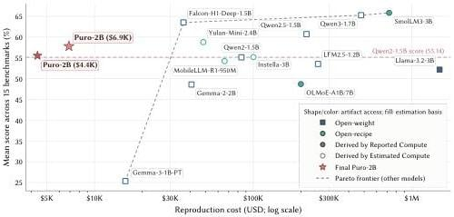
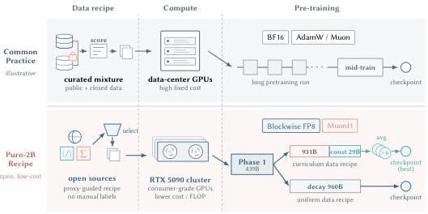
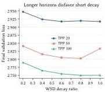
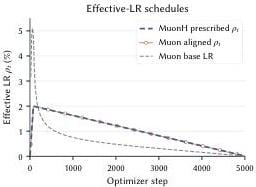
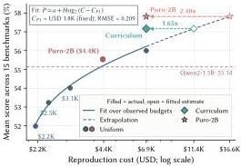
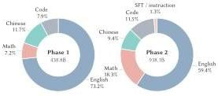

> **论文**：Puro-2B: Poor Lab's Qwen2-1.5B Trained on RTX 5090 within $5090
> **作者**：Kairong Luo, Jiarui Cui, Yaorui Yin, Shengqi Chen, Yiming Yang, Linxiang Gao, Yanmohan Wang, Mingzhe Zhang, Kaiyue Wen, Kaifeng Lyu, Wenguang Chen（清华大学）
> **arXiv ID**：2608.27370
> **发表时间**：2026-08-27
> **许可协议**：Apache 2.0（各数据组件 license 不同）
> **代码仓库**：https://github.com/thu-pacman/Puro-Megatron

## 第 1 章 概述

### 1.1 一句话定位

Puro-2B 是一套面向"贫困实验室"（poor lab）的**从零预训练复现配方**：在消费级 RTX 5090 集群上用 FP8 精度从随机初始化训练 2B 参数、1.4T tokens 的稠密模型，最优 checkpoint 复现成本仅 **$6.9K**（22,514 GPU-hours、17.6 个日历日），并配套开源了数据、代码、权重、中间 checkpoint 与完整成本账本。

### 论文图表总览

| 编号 | 内容 | 章节 |
|------|------|------|
| **Figure 1** | 各模型性能 vs 复现成本（Pareto 前沿） | 第 6 章 |
| **Figure 2** | (a) 各效率组件的成本节省分解；(b) Puro Cost Scaling Law | 第 6 章 |
| **Figure 3** | Puro-2B 训练流水线总览（poor-lab design） | 第 3 章 |
| **Figure 7** | CMA 数据课程化与优化流程 | 第 5 章 |
| **Figure 8** | 两阶段数据域组成 | 第 5 章 |
| **Figure 11** | Post-training 转移结果（GSM8K 等） | 第 7 章 |
| **Table 1** | 两条生产运行的成本核算 | 第 6 章 |
| **Table 2** | 两阶段数据域组成（tokens/份额） | 第 5 章 |
| **Table 3** | 数学与代码主结果（4 基准） | 第 6 章 |
| **Table 4** | 推理与知识主结果（11 基准） | 第 6 章 |

### 1.2 核心贡献

1. **低成本从零预训练配方**：硬件（RTX 5090 集群）、精度（blockwise FP8）、优化器（MuonH Hyperball）、数据顺序（Curriculum Model Averaging）与数据选择（proxy benchmarking）五个效率组件协同设计，最优模型以 **$6.9K** 复现成本逼近 Qwen2.5-1.5B，$4.4K 变体已超过 Qwen2-1.5B。
2. **Puro Cost Scaling Law**：配方专属的"预算→能力"缩放关系 $P = a + b\log_2(C - C_{P1})$，为有限算力社区提供预算规划参考；拟合在 $4.4K$ 处跨越 Qwen2-1.5B 性能聚合线。
3. **端到端 post-training 案例研究**：证明预训练阶段 curriculum/CMA 与 uniform 两种配方的差异在相同 SFT 后依然可测——聚焦数学 GSM8K +1.77pp、扩展数学 +2.02pp、广度指令 15-task 宏平均 +1.59pp（18 项评估中 15 项占优）。
4. **全量开源**：10 个中间 checkpoint、数据 manifest 与组件、训练代码（Puro-Megatron）、数据处理代码（Kaiyuan-Spark）均以 Apache 2.0 发布，使预训练流程本身可被科学审视与复现。

### 1.3 关键结果速览

| 指标 | 数值 | 说明 |
|------|------|------|
| 总训练 tokens | 1.40T（Phase 1: 438.84B + Phase 2: 960.0B） | Table 1 |
| 总 active GPU-hours | 22,514（P1: 6,009.46 + P2: 16,504.95） | 实测 |
| 复现成本（canonical） | $6.89K（46,905 RMB，RTX 5090 $0.31/h） | 租用等价核算 |
| 复现成本（uniform 1/2） | $4.37K（14,262 GPU-h） | Table 1 |
| 训练日历时长 | 17.6 天（P1: 10.43d + P2: 7.16d） | Table 1 |
| 最优模型 15 基准平均（Avg15） | 57.81% | Table 16 |
| 数学与代码 4 基准平均 | 43.50%（GSM8K 59.67%、MATH 30.30%、MBPP 52.92%、HumanEval 31.10%） | Table 3 |
| 推理与知识 11 基准平均 | 63.02% | Table 4 |
| 混合精度 MFU | ~73%（FP8 72% + BF16 28% 加权峰值） | §3.1.3 |
| Phase 1 / Phase 2 吞吐 | 238 / 192 TFLOP/s/GPU | Table 7 |
| 数据规模 | P1: 438.84B（EN 73.2%）；P2: 938.06B 池（Math 18.3%） | Table 2 |

*图1：论文的核心主张——在统一的租用等价成本核算协议下，Puro-2B 位于对比模型 Pareto 前沿的左上侧（成本更低、性能更高），这是全文所有成本论证的锚点。*

## 第 2 章 研究背景与动机

### 2.1 开放的三层光谱

大模型发布实践可划分为三个开放层级：

| 层级 | 代表 | 发布内容 | 局限 |
|------|------|---------|------|
| **Closed（闭源）** | GPT、Claude、Gemini | 托管 API + 技术报告 | 权重与预训练产物均不可得 |
| **Open-weight（开放权重）** | Qwen、Gemma、Llama、LFM、Falcon | 权重 checkpoint | 预训练数据、样本顺序、完整训练状态不公开，无法独立重建训练过程 |
| **Open-recipe（开放配方）** | OLMo/OLMoE、SmolLM、YuLan、Marin、Instella | 权重 + 可重建数据配方 + 训练/评测代码 + 配置 + 中间产物 | 科学可审视，但**复现成本可能仍然高昂** |

Open-recipe 项目（Pythia、OLMo、SmolLM3、Yulan-Mini-2.4B、Instella）提供了研究预训练本身所需的完整实验栈，但它们的训练资源门槛依然很高：Yulan-Mini-2.4B 用了 48 张 A800，SmolLM3 用了 384 张 H100，Instella-3B 第一阶段用了 128 张 MI300X。**"开放"与"可负担"之间仍存在一道实际鸿沟**——这正是 Puro-2B 试图填补的位置：它定位于第三层，且进一步把 open-recipe 的门槛从机构级预算压到个人可负担的水平。

### 2.2 复现成本鸿沟

论文按统一的租用等价核算协议估算了代表性模型的重训成本：

| 模型 | 估算复现成本 | 依据 |
|------|-------------|------|
| Llama 3.2-3B | > $1.5M | 官方报告 GPU-hours（460,000 H100-h） |
| SmolLM3-3B | $719K（719,000） | 报告 GPU 数与时长（221,184 H100-h） |
| OLMoE-1B-7B | $200K（199,680） | 报告 GPU 数与时长（61,440 H100-h） |
| Puro-2B（本文） | **$6.89K** | 实测 active GPU-hours（22,514 RTX 5090-h） |

即使是完全透明的 open-recipe 发布，也可能"对世界开放但对贫困实验室遥不可及"。论文的口号是：不仅开源权重，还要开源**可负担性**本身。

### 2.3 低成本预训练的相关工作

相关研究沿两条互补路线降低预训练成本：

- **低精度训练**（降低固定工作负载的执行成本）：DeepSeek-V3 验证了 FP8 混合精度在大规模下的稳定性；Quartet II 将其扩展到 NVFP4 并改善数值行为。这类方法提升执行效率，但不减少达到目标质量所需的 token/FLOP 预算。
- **减少训练工作负载**（数据选择、分阶段训练、系统优化）：TinyLlama、JetMoE、Yulan-Mini-2.4B、Kaiyuan-2B 证明小模型能力可以在大幅缩减的算力预算下获得，但这些运行通常依赖数据中心级加速器，**硬件门槛依旧存在**。
- **消费级硬件可行性研究**：LLMQ 在 RTX 4090 上用 FP8、重计算、分片与 CPU offload 做全模型预训练；Quartet II 测量了单卡 RTX 5090 上 NVFP4 的吞吐收益。但这些工作主要证明"系统可行"，并未发布万亿 token 规模、带明确复现成本边界的 base 模型。

Puro-2B 位于这三条线的交汇点：多节点 RTX 5090 集群 + FP8 + 1.4T tokens 从零训练 + 实测 GPU-hours + 明确成本边界，端到端同时衡量模型质量与复现成本。

## 第 3 章 训练基础设施与系统优化

### 3.1 RTX 5090 的性价比论证

Puro-2B 的全部预训练与后训练都运行在消费级 RTX 5090 集群上（8 卡/节点，双 CPU socket 各 4 卡）。论文以规格与租用价核算了候选 GPU 的成本效率（Table 于 §3.1.1）：

| GPU | 峰值 BF16 (TFLOPS) | 峰值 FP8 (TFLOPS) | 显存 | 显存带宽 | TDP | 单卡价格 | BF16 计算/$ (EFLOP/USD) | FP8 计算/$ |
|-----|-----|-----|------|---------|-----|---------|------|------|
| A100 SXM4 | 312 | N/A | 80 GB | 2 TB/s | 400 W | $1.79/h | 0.63 | N/A |
| H200 SXM5 | 989.5 | 1979 | 141 GB | 4.8 TB/s | 700 W | $4.00/h | 0.89 | 1.78 |
| RTX PRO 6000 | 503.8 | 1007.6 | 96 GB | 1.8 TB/s | 600 W | $1.89/h | 0.96 | 1.92 |
| RTX 5090 | 209.5 | 419 | 32 GB | 1.8 TB/s | 575 W | $0.31/h | 2.43 | 4.87 |

RTX 5090 的绝对峰值吞吐远低于数据中心 GPU（其 Tensor Core 在 FP32 累加下被限制为实际峰值的一半），但极低的有效价格带来约 **2.7×（BF16）/ 2.74×（FP8）H200 的单位美元计算量**。此外，受政策与成本约束拿不到 GB200 等 Blackwell 数据中心加速器时，RTX 5090 也是唯一具备 FP4 支持的现实选择。

### 3.2 硬件破解：P2P 与 GDR

RTX 5090 没有 NVLink，且 NVIDIA 在驱动层禁用了消费卡的 PCIe P2P 与 GPUDirect RDMA（GDR）——P2P 流量被迫经主机内存"乒乓"中转，通信效率大幅下降。论文团队通过修改开源驱动与 CUDA 用户态驱动绕过了这两项软件限制（EULA 约束下不公开细节），实测收益：

| 指标 | 修改前 | 修改后 | 理论极限 |
|------|--------|--------|---------|
| P2P 单向带宽 | 31.5 GB/s | 56 GB/s | 64 GB/s（PCIe 5.0 ×16） |
| P2P 双向带宽 | 32 GB/s | 111 GB/s | 128 GB/s |
| P2P 通信延迟 | 14.3 μs | 0.4 μs | — |
| 8-GPU AllReduce（busbw） | 14.75 GB/s | 27.34 GB/s | — |
| 4-GPU（单 socket）AllReduce | 16.33 GB/s | 46.31 GB/s（约 2.8×） | — |
| 24-GPU 跨节点 AllReduce（GDR） | 8.87 GB/s | 19.93 GB/s | — |

启用条件包括禁用 IOMMU 与 PCIe ACS、调整 NPS 等平台配置。论文明确警告：驱动修改不受厂商支持、不能超过 PCIe 物理带宽上限、且并非所有拓扑都适合盲目开启 P2P（低端平台 peer-switching 能力有限时乒乓传输反而更快）。

### 3.3 并行配置与 MFU

训练系统基于 Megatron Core v0.16.0 + Transformer Engine。针对消费卡通信带宽受限的特点，只使用通信需求适度的并行维度：**数据并行（DP）+ 流水线并行（PP），不使用张量并行（TP）**，并采用 pp-dp 排序把每个 PP group 放在拓扑上更近的 GPU 上。

| 阶段 | GPUs | TP/PP/DP | 序列长度 | 全局 batch | micro-batch | 吞吐 | 最终验证损失 |
|------|------|----------|---------|-----------|------------|------|-------------|
| Phase 1 | 24 | 1/2/12 | 4,096 | 1,536 | 2 | 238 TFLOP/s/GPU | 2.730 |
| Phase 2 | 96 | 1/4/24 | 4,096 | 1,536 | 2 | 192 TFLOP/s/GPU | 2.488 |

混合精度 MFU 约 **73%**：按 FP8 占 72%、BF16 占 28% 的理论计算比例加权峰值（$P_{\mathrm{eff}} = (0.72/419 + 0.28/209.5)^{-1} \approx 327$ TFLOP/s/GPU），这是混合精度口径下的结果而非纯 BF16 全规模结果。Phase 2 强扩展受 Amdahl 定律限制，梯度同步占比上升，改用 PP=4 布局 (9|9|9|1) + DP=24。

*图3：Puro-2B 的完整训练流水线——上行为常规做法，下行为本文的开放低成本配方：公开数据采集与筛选 → FP8 预训练（优化器与课程化设计）→ 模型平均 → 后训练与评测，五个效率组件在系统层协同设计。*

### 3.4 Blockwise FP8 混合精度

从随机初始化起就全程使用 FP8 混合精度（无 BF16 预热阶段、无中途切换）。设计要点：

- **格式**：线性层 GEMM（QKV 投影、注意力输出投影、MLP 投影的 Fprop/Dgrad/Wgrad）操作数与保存的激活使用 **E4M3**；FlashAttention/SDPA 核心、LayerNorm、Embedding、残差流保持 BF16；梯度、优化器状态累加与 softmax 保持 FP32。FP8 是"在线计算与激活存储格式"而非模型持久 dtype（checkpoint 权重仍为 BF16）。
- **Blockwise 缩放**：激活与激活梯度沿 GEMM reduction 维按 128 个连续值一维分组，权重按 128×128 二维分块——沿用 DeepSeek-V3 的块尺寸设计。RTX 5090（SM 120）上每个逻辑块缩放被约束为 2 的幂（E8M0 指数表达），经 Transformer Engine 走 Blackwell 原生 MXFP8 路径。
- **计算占比**：FP8 加速的操作占整体计算约 72%。

**质量与吞吐实测**（TPP=20 五尺度缩放梯子，0.17B→1.7B）：blockwise FP8 相对 BF16 的验证损失增加仅 0.0031–0.0039；共享形状拟合给出 BF16 等价计算保留率 $\rho_C = 98.0\%$（匹配 BF16 质量需额外约 2.0% 名义计算）。而在 1.7B 规模（最接近 2B 生产模型的吞吐代理），中位吞吐提升 **1.36×**，扣除质量代价后净加速 **1.34×**（匹配质量下少用 25.2% GPU-hours）。反事实推算：2B/1.4T 运行约需 30,286 BF16 GPU-hours vs 22,654 质量调整后 FP8 GPU-hours。

## 第 4 章 优化器与学习率调度：MuonH 与 ELR

### 4.1 Hyperball 优化（MuonH）

论文对选定的近似尺度不变矩阵（注意力与 MLP 矩阵）使用带 Hyperball 约束的 Muon 优化器（MuonH，源自 Wen et al. 2026），Embedding、归一化层、LM head 等其余参数使用 AdamW。MuonH 把每个被包装矩阵固定在初始 Frobenius 半径的球面上：

$$
\widetilde{W}_{t+1} = W_t - \eta_t R \hat{u}_t, \qquad W_{t+1} = R\,\operatorname{Normalize}(\widetilde{W}_{t+1}), \qquad R = \lVert W_0 \rVert_F, \quad \hat{u}_t = u_t / \lVert u_t \rVert_F \tag{1}
$$

先归一化更新尺度，再把更新后的权重投影回初始半径。生产中 MuonH 组零权重衰减，AdamW 组 weight decay 0.1；两组共享 base LR 调度，MuonH 组的 Hyperball 权重 LR 为 base 的 **10 倍**（$m=10$）。

### 4.2 有效学习率（ELR）的显式控制

对近似尺度不变矩阵（$c>0$ 时 $\mathcal{L}(cW) \approx \mathcal{L}(W)$），更新幅度应相对当前权重尺度理解。普通 Muon 的矩阵级有效学习率为：

$$
\rho_t(W) = \frac{\eta_t \lVert u_t \rVert_F}{\lVert W_t \rVert_F} \tag{4}
$$

由于权重范数与 Muon 更新范数都在训练中演化，普通 Muon 的 ELR 由标量 LR 间接决定。而 MuonH 更新预投影位移 $\eta_t R \hat{u}_t$ 的范数恰为 $\eta_t R$，包装矩阵范数为 $R$，因此其有效学习率**数值上等于 Hyperball 权重学习率**（$\rho_t = \eta_t$）——ELR 调度被显式化，这是 Hyperball 对后续调度设计最关键的性质。

### 4.3 ELR 对齐实验证据

170M BF16 三组对照（相同架构/batch/序列长度/seed）：普通 LR Muon、有效 LR 对齐 Muon（在线调整标量 LR 使 ELR 跟踪同一曲线）、MuonH：

$$
\eta_t = \rho_t^H \frac{\lVert W_t \rVert_F}{\lVert u_t \rVert_F} \tag{5}
$$

| 运行 | 最终验证损失 |
|------|-------------|
| 普通 LR Muon | 3.073 |
| 有效 LR 对齐 Muon | 3.030 |
| MuonH | **3.029** |

普通 LR Muon 的 ELR 轨迹早期衰减过快、后期趋零；MuonH 与对齐 Muon 遵循接近线性的 ELR 衰减，早期收敛较慢但后期反超。**ELR 对齐后普通 Muon 几乎复现 MuonH 的损失曲线**——说明 ELR 调度是 MuonH 训练行为的关键因素，也支撑生产中采用线性衰减调度。附带诊断：用 Multi-Power Law 拟合损失曲线时，用有效 LR 作为描述符比原始标量 LR 的留出 RMSE 更低（0.0210 vs 0.0265），支持 ELR 是更信息量的训练动态描述符。

### 4.4 学习率调度设计

WSD（Warmup-Stable-Decay）扫描（0.6B 模型、TPP=20、有效峰值 0.008–0.024、衰减比 0.2–1.0）得到两条经验规律：

- **更高的有效峰值 LR 需要更长的衰减**：最佳衰减比随峰值从 0.4（peak 0.008）上升到 1.0（peak 0.024）；0.01 损失带下边缘随峰值为 0.4、0.4、0.6、0.6、0.8 单调非降。高峰值区间（0.020/0.024）接近全线性衰减已具竞争力。
- **更长的训练视野需要更长的衰减**：固定有效峰值 0.012 时，竞争区下边缘随 TPP 20→50→100 从 0.4 移至 0.6；点最优为 1.0、0.8、0.8。
- **双锚点 MPL 诊断**：只用两个端点调度（衰减比 0.2 与 1.0）拟合 MPL，即可恢复峰值→衰减趋势（估计最优比从 peak 0.008 的 0.33 升至 peak 0.024 的 0.85），作为有限算力下的粗估工具。

**生产调度**（Hyperball 权重 LR，即 MuonH 矩阵的 ELR）：

- Phase 1（power 调度，开放端）：$\eta_{\mathrm{base}}(k) = \begin{cases} 5\times10^{-3}\,k/1000, & 0 \le k \le 1000, \\ 5\times10^{-4} + 4.5\times10^{-3}\left(1 + \dfrac{k-1000}{1000}\right)^{-1/2}, & k > 1000. \end{cases}$ —— 从约 $5\times10^{-2}$（Hyperball 组）/ $5\times10^{-3}$（base）指数衰减到 $1.04\times10^{-3}$（base），尾部保留持续训练路径。
- Phase 2（长线性衰减）：从共享的 Phase 1 终点 $\eta_0 = 1.04\times10^{-3}$ 线性衰减到 $\eta_{\min} = 10^{-5}$，跨 960.0B tokens；5 个 uniform 变体对应 horizon 约 60.1/120.1/240.2/480.5/960.9B。

## 第 5 章 数据配方与 Curriculum Model Averaging

### 5.1 数据域组成

训练语料全部来自许可允许使用的公开数据集（网页文本、代码、数学、合成数据），可重建复现。两阶段域组成（Table 2，token 数按物化组件实测）：

| 域 | Phase 1 tokens | Phase 1 份额 | Phase 2 tokens | Phase 2 份额 |
|------|---------------|-------------|---------------|-------------|
| English | 321.31B | 73.2% | 557.52B | 59.4% |
| Math | 31.56B | 7.2% | 171.29B | 18.3% |
| Chinese | 51.34B | 11.7% | 88.48B | 9.4% |
| Code | 34.62B | 7.9% | 108.11B | 11.5% |
| SFT / instruction | – | 0.0% | 12.66B | 1.3% |
| **Total** | **438.84B** | 100.0% | **938.06B** | 100.0% |

Phase 1 强调广度覆盖（英语 73.2%），Phase 2 把数学提升为最大专项分配（18.3%），并引入指令格式数据（1.3%）。P1→P2 过渡跨越约 43.9B tokens：Phase 1 replay 权重线性下降、Phase 2 混合权重线性上升，过渡消耗 21.9B replay + 21.9B Phase 2 池头部；过渡后剩余 916.1B Phase 2 tokens 无 replay，Phase 2 总消耗 960.0B = 21.9B + 938.1B。

*图8：两阶段数据域组成的可视化——Phase 1 以英语为主的广度覆盖，Phase 2 向数学倾斜并引入指令数据，体现了"先广度、后专项"的配方思想。*

### 5.2 Proxy Benchmarking 数据选择

不存在跨来源可比的样本级质量分数，因此论文用 **proxy benchmarking** 代替全局文档排序：用共享的 Qwen3-0.6B proxy checkpoint 在候选来源（或其切片）的 token 上继续训练，再用固定的 15-benchmark 套件评测，把得到的分数向量当作该候选的"能力画像"。

- **更细粒度**：对带样本级质量分数的大来源，按分数排序后取 0th/25th/50th/75th 百分位（q00–q75）的 token 匹配窗口分别做 proxy 评测（如 DCLM、FineWeb-Edu-CN/EN 的四个切片），支持来源内的细粒度筛选决策。
- **目标驱动选择**：因为目标强化数学推理（且数学数据预训练被报告能外推至更广推理），Phase 2 数学成为最大专项；PCA 辅助解释——General 对齐 PC1（34.5%）、Code 与之对抗，Math 对齐 PC2（28.1%），支撑"数学配额高于代码"的分配。MegaMath-Web-Pro 数学与 General 点估计最高（+2.88/+0.67），故 Phase 2 加入 13.5B tokens 并移除 FineMath，Nemotron-CC-Math 4+ 份额从 2.62% 降至 0.26%、SwallowMath 从 2.28% 降至 1.42%。
- **域内过滤**：供应超预算时保留 proxy 分更高的切片；轴领先数据集（FineWeb-Edu-CN、DCLM、MegaMath-Code）分别补足 Chinese/General/Code 轴。

### 5.3 Kaiyuan-Spark 预处理流水线

数据物化由 Spark 框架 **Kaiyuan-Spark** 完成，四阶段：来源内去重（MinHash，跨来源不去重——分析发现额外体积缩减有限）→ proxy 评测 → 启发式过滤（能力画像 × 域覆盖 × 语言平衡 × token 预算）→ 最终物化（冻结来源修订、保留规则、混合权重与随机种子，训练时顺序读取，无在线混采）。MinHash 等计算密集型操作经 Chukonu 集成走原生 C++ kernel（约 2.5× 相对 JVM 实现加速）。Kaiyuan-Spark 还支持课程化 bucket 物化：同一组件池只改物化顺序即可产出 uniform 流或 curriculum 流。

### 5.4 课程化排序与 CMA

Phase 2 的课程化目标：让模型在训练后期接触各来源内更偏好的分数区间。具体机制：

1. 每个组件单独建立可复现顺序（有可用质量分 → 按分数与配置方向排序；无分 → 固定随机序），按累计 token 质量给每个样本分配**组件内归一化秩**（如 0.25 = 该组件 25% 的 token 排在其前）。
2. 把归一化秩范围切成 **376 个区间**，第 k 个课程 bucket = 从每个组件取第 k 个区间——每个 bucket 约含每个组件的 1/376 tokens，**保持跨组件混合比例**；bucket 目标约 2.5B tokens 每个。分数只作来源内排序依据，不跨组件比较，因此不是全局质量排名。
3. 训练沿 bucket 推进：有分组件从低分走向高分，无分组件按固定随机序前进。

**Late-stage 优化与 CMA**：课程末尾呈现的高质量样本恰逢参数更新变小，两者冲突。生产方案：Phase 2 先按调度走完，再从 **step 218,000** 恢复，**base LR 固定为 4.08×10⁻⁵**（Hyperball 组 4.08×10⁻⁴），继续训练约最后 29B tokens，最后对间隔约 100 步（约 0.63B tokens）的 **6 个 checkpoint 等权平均**作为发布模型。

*图7：Phase 2 生产的 CMA 数据与优化流程——组件内排序、Phase 1→2 过渡、后期常数 LR 延续与六 checkpoint 平均一体呈现。*

### 5.5 消融分析

六个端点的结构化对比（Figure 13b，Avg15）：

| 配置 | Avg15 | 对比结论 |
|------|-------|---------|
| Uniform decay final（无平均） | 55.99 | — |
| Curriculum decay final（无平均） | 57.17 | 课程化优于 uniform **+1.18pp** |
| Uniform decay avg | 55.57 | 相对 55.99 **−0.42pp** |
| Curriculum decay avg | 57.18 | 相对 57.17 **+0.01pp** |
| 课程化 + const-LR（step 215k）avg | 56.80 | — |
| 课程化 + const-LR（step 218k）avg | **57.81** | 高于 215k 分支 **+1.01pp**、高于无延续的课程化 avg **+0.63pp** |

三点结论：① 课程化排序无平均时提升 1.18pp，有平均时提升 1.61pp（57.18 vs 55.57）；② 模型平均本身在两种排序下都非独立有益（uniform −0.42pp、curriculum +0.01pp）；③ 合适的常数 LR 延续（step 218,000 + 6-checkpoint 平均）最强，达 57.81。论文承认课程化优势可能部分来自后期数据中的 benchmark 污染（见第 9 章），但 post-training 后优势依然存在，污染难以单独解释全部提升。

## 第 6 章 实验结果与成本分析

### 6.1 评估设置

- **基线**：1B–3B 范围近期模型，分组为 open-weight（Qwen2/2.5/3/3.5、Gemma-2/3/4、Llama-3.2-3B、LFM2.5、Falcon-H1 标准与深层变体）与 open-recipe（Instella-3B、OLMoE-1B-7B、Yulan-Mini-2.4B、SmolLM3-3B、MiniCPM5-1B、MobileLLM-R1-950M-base），统一评测 base/预训练版本。
- **15 基准**：数学与代码（GSM8K、MATH、sanitized-MBPP、HumanEval）+ 推理与知识（MMLU、MMLU-Pro、ARC-C/E、BoolQ、CSQA、HellaSwag、PIQA、SIQA、WinoGrande、BBH）。
- **实现**：OpenCompass 统一管线（固定 checkpoint/tokenizer/数据集快照/prompt/shot/生成配置/后处理器）。GSM8K、MATH、MBPP、HumanEval、MMLU-Pro、BBH 用生成式（GEN）贪婪解码；其余 9 个用困惑度式（PPL）候选排序。按 OLMES 惯例，支持 cloze 与 multiple-choice 双表述的任务取每模型更优表述计入聚合。所有分数为百分比。

### 6.2 数学与代码能力（Table 3）

| 模型 | Params | GSM8K 4-shot | MATH 4-shot | MBPP 3-shot | HumanEval 3-shot | Avg |
|------|--------|-------------|-------------|-------------|-----------------|-----|
| Qwen2-1.5B | 1.5B | 59.82 | 23.70 | 50.19 | 27.44 | 40.29 |
| Qwen2.5-1.5B | 1.5B | 67.70 | 32.28 | 58.37 | 31.71 | 47.52 |
| Qwen3-1.7B-Base | 1.7B | 76.04 | 42.44 | 64.20 | 51.22 | 58.48 |
| Qwen3.5-2B-Base | 2B | 69.83 | 35.82 | 43.58 | 32.32 | 45.39 |
| Gemma-2-2B | 2B | 33.81 | 14.84 | 38.52 | 20.12 | 26.82 |
| Gemma-3-1B-PT | 1B | 2.58 | 0.94 | 9.34 | 8.54 | 5.35 |
| Gemma-4-E2B-Base | E2B | 30.71 | 9.68 | 47.86 | 24.39 | 28.16 |
| Llama-3.2-3B | 3B | 28.20 | 8.14 | 50.19 | 31.10 | 29.41 |
| LFM2.5-1.2B-Base | 1.2B | 53.22 | 28.00 | 38.13 | 25.61 | 36.24 |
| Falcon-H1-1.5B-Base | 1.5B | 74.68 | 42.60 | 61.09 | 28.05 | 51.61 |
| Falcon-H1-Deep-1.5B-Base | 1.5B | 53.53 | 41.28 | 63.04 | 32.93 | 47.70 |
| Instella-3B | 3B | 64.44 | 13.30 | 41.25 | 14.63 | 33.41 |
| OLMoE-1B-7B-0125 | A1B/7B | 54.59 | 15.48 | 33.46 | 12.80 | 29.08 |
| Yulan-Mini-2.4B | 2.4B | 68.99 | 27.18 | 62.26 | 50.00 | 52.11 |
| SmolLM3-3B-Base | 3B | 81.73 | 56.12 | 60.31 | 37.80 | 58.99 |
| MiniCPM5-1B-Base | 1B | 39.88 | 23.34 | 46.30 | 29.27 | 34.70 |
| MobileLLM-R1-950M-base | 950M | 68.31 | 27.24 | 50.58 | 43.29 | 47.36 |
| Puro-2B ($4.4K) | 2B | 56.03 | 27.86 | 49.81 | 20.73 | 38.61 |
| **Puro-2B** | **2B** | **59.67** | **30.30** | **52.92** | **31.10** | **43.50** |

Puro-2B 四基准平均 43.50%，超过 Qwen2-1.5B 3.21pp、距 Qwen2.5-1.5B 4.02pp；在 open-recipe 组中超越 Instella-3B、OLMoE-A1B/7B、MiniCPM5-1B，低于 Yulan-Mini-2.4B、SmolLM3-3B 与 MobileLLM-R1（数学/代码导向的强紧凑基线，高出 Puro-2B 3.86pp——注意其参数与能力侧重点不同）。

### 6.3 推理与知识能力（Table 4）

| 模型 | MMLU | MMLU-Pro | ARC-C | ARC-E | BoolQ | CSQA | HSwag | PIQA | SIQA | Wino | BBH | Avg |
|------|------|----------|-------|-------|-------|-------|-------|------|------|------|-----|-----|
| Qwen2-1.5B | 56.39 | 23.62 | 69.83 | 83.77 | 71.90 | 70.52 | 59.91 | 75.19 | 63.36 | 59.67 | 31.73 | 60.54 |
| Qwen2.5-1.5B | 61.56 | 30.43 | 79.32 | 90.48 | 76.39 | 75.10 | 64.18 | 76.17 | 64.94 | 59.67 | 42.64 | 65.53 |
| Qwen3-1.7B-Base | 65.47 | 37.60 | 80.34 | 91.89 | 79.63 | 74.69 | 60.47 | 76.06 | 68.68 | 59.19 | 51.18 | 67.75 |
| Qwen3.5-2B-Base | 63.95 | 37.34 | 83.73 | 93.12 | 85.63 | 73.05 | 63.52 | 76.50 | 69.14 | 58.80 | 60.37 | 69.56 |
| Gemma-2-2B | 55.22 | 24.40 | 66.44 | 82.54 | 71.83 | 66.18 | 35.22 | 66.10 | 65.86 | 52.01 | 35.88 | 56.52 |
| Gemma-3-1B-PT | 26.17 | 11.77 | 26.78 | 26.46 | 62.91 | 20.56 | 25.65 | 49.40 | 32.55 | 49.57 | 26.89 | 32.61 |
| Gemma-4-E2B-Base | 59.72 | 25.55 | 73.56 | 86.24 | 77.28 | 65.77 | 44.38 | 67.79 | 65.66 | 52.64 | 39.69 | 59.84 |
| Llama-3.2-3B | 57.55 | 27.71 | 72.88 | 84.83 | 76.02 | 66.91 | 48.12 | 76.06 | 64.28 | 52.57 | 38.01 | 60.45 |
| LFM2.5-1.2B-Base | 57.50 | 17.74 | 82.03 | 87.83 | 74.40 | 59.13 | 54.20 | 74.97 | 59.26 | 57.54 | 33.54 | 59.83 |
| Falcon-H1-1.5B-Base | 65.32 | 36.44 | 81.02 | 90.30 | 78.84 | 71.25 | 62.24 | 75.73 | 67.30 | 57.77 | 45.35 | 66.51 |
| Falcon-H1-Deep-1.5B-Base | 68.74 | 42.99 | 85.08 | 93.12 | 85.23 | 72.40 | 65.24 | 76.61 | 70.83 | 60.14 | 41.86 | 69.29 |
| Instella-3B | 58.55 | 25.32 | 74.92 | 87.30 | 76.76 | 75.43 | 59.92 | 73.23 | 69.91 | 53.99 | 39.11 | 63.13 |
| OLMoE-1B-7B-0125 | 54.11 | 19.67 | 66.44 | 84.30 | 72.97 | 62.82 | 36.54 | 71.16 | 65.15 | 50.28 | 30.74 | 55.83 |
| Yulan-Mini-2.4B | 51.74 | 23.68 | 65.08 | 82.54 | 78.47 | 66.18 | 59.92 | 76.22 | 63.31 | 62.35 | 44.12 | 61.24 |
| SmolLM3-3B-Base | 62.24 | 39.02 | 79.32 | 89.95 | 84.80 | 72.73 | 70.23 | 81.12 | 70.62 | 64.25 | 37.52 | 68.35 |
| MiniCPM5-1B-Base | 45.01 | 21.98 | 46.44 | 70.90 | 73.12 | 56.92 | 51.51 | 71.87 | 50.15 | 54.06 | 36.51 | 52.59 |
| MobileLLM-R1-950M-base | 48.24 | 21.95 | 58.31 | 78.13 | 78.87 | 61.59 | 54.16 | 73.50 | 59.77 | 55.33 | 34.15 | 56.73 |
| Puro-2B ($4.4K) | 54.82 | 24.02 | 66.78 | 84.66 | 77.34 | 67.65 | 63.62 | 75.84 | 62.90 | 59.91 | 41.14 | 61.70 |
| **Puro-2B** | **57.44** | **25.81** | **74.24** | **86.07** | **76.85** | **67.81** | **63.21** | **75.52** | **63.61** | **60.62** | **42.05** | **63.02** |

（注：上表列顺序为 MMLU 5-shot、MMLU-Pro 5-shot CoT、ARC-C/E 5-shot、BoolQ、CSQA、HSwag、PIQA、SIQA、Wino、BBH 4-shot；数值为百分比）

Puro-2B 平均 63.02%，超 Qwen2-1.5B 2.48pp、距 Qwen2.5-1.5B 2.51pp；open-recipe 组内超越 OLMoE、Yulan-Mini、MiniCPM5、MobileLLM-R1（高出后者 6.29pp），仅落后更大的 Instella-3B 0.11pp。

### 6.4 复现成本核算

成本核算边界：**仅含重跑最终两阶段预训练配方的加速器计算成本**——Phase 1 与 Phase 2 生产运行的实测 GPU-hours 乘以归一化 RTX 5090 租用等价费率（$0.31/h = 2.0833 RMB/h，按 8 卡节点月租 12,000 CNY 摊销硬件与电费）。**不含**数据获取与预处理、proxy 实验、消融/探索运行、post-training、评测、人力、CPU/存储/网络及税费折旧。RMB 保留账本可溯源性，USD 按 6.8067 汇率换算。

四个成本因子的独立估计（各用各自参考系，非端到端连续加速的乘积）：

| 成本因子 | 参考对比 | 效率提升 | 说明 |
|---------|---------|---------|------|
| 硬件价格效率 | H200 | BF16 2.77×、FP8 2.74× 计算/美元 | 规格与价格核算 |
| Blockwise FP8 | BF16（MuonH 固定） | 净 1.34×（1.36× 吞吐 × 98.0% 质量保留） | 匹配质量下少 25.2% GPU-hours |
| MuonH 完整配方 | 调优 Muon（FP8 固定） | compute-equivalent κ=1.19×（16.1% 理论计算减少） | TPP=20 梯子共享形状拟合 |
| Phase 2 课程化/CMA | uniform 等价 | 见下方 scaling law 反推 | 配方级点估计 |

### 6.5 Puro Cost Scaling Law

从同一 Phase 1 checkpoint 出发、以 uniform 配方在不同预算下继续 Phase 2，拟合"总成本→评估聚合"的配方专属缩放关系：

$$
P = a + b \log_2 (C - C_{P1}), \qquad C_{P1} = \$1.84K
$$

$C_{P1}$ 取实测 Phase 1 active GPU-hours 固定不变，对增量 Phase 2 成本拟合；移位拟合使样本内 RMSE 从非移位 log-cost 拟合的 0.452 降到 **0.209**。约 $4.4K 的 uniform checkpoint（无 CMA）已超过 Qwen2-1.5B 聚合。反推：curriculum-decay 端点分数对应的 uniform 配方成本等价约 **$11.36K（1.65× 生产配方 $6.89K）**；含常数 LR 延续 + 六 checkpoint 平均的发布模型对应约 **$16.55K（2.40×）**。注意课程化端点同时改变了排序、延续与平均，其拟合成本等价是配方级点估计而非"纯课程化增益"或通用成本定律。

*图2(b)：Puro Cost Scaling Law——同一配方下模型能力随复现预算的缩放曲线，虚线标出跨越 Qwen2-1.5B 性能聚合的约 $4.4K 成本点，为有限预算实验室提供能力规划参考。*

### 6.6 跨模型复现成本对比（Pareto 前沿）

成本坐标构建遵循证据层级：报告货币成本 > 报告 GPU-hours > 6ND 估算（无报告时以 H100 等价、70% MFU、989.5 TFLOP/s 估算）。Table 6 关键坐标：

| 模型 | 证据 | GPU-hours | Cost (USD) | Avg score |
|------|------|-----------|-----------|-----------|
| Qwen2-1.5B | 6ND | 25,939 | 84,302 | 55.14 |
| Qwen2.5-1.5B | 6ND | 66,700 | 216,776 | 60.73 |
| Qwen3-1.7B-Base | 6ND | 147,261 | 478,597 | 65.27 |
| Gemma-2-2B | 6ND | 12,560 | 40,821 | 48.60 |
| Llama-3.2-3B | 报告 GPU-hours | 460,000 | 1,495,000 | 52.17 |
| LFM2.5-1.2B-Base | 6ND | 78,828 | 256,190 | 53.54 |
| Falcon-H1-Deep-1.5B-Base | 6ND | 11,189 | 36,364 | 63.53 |
| Instella-3B | 6ND | 30,851 | 100,265 | 55.20 |
| OLMoE-1B-7B-0125 | 报告计数/时长 | 61,440 | 199,680 | 48.70 |
| Yulan-Mini-2.4B | 6ND + 报告 MFU | 27,073 | 48,461 | 58.80 |
| SmolLM3-3B-Base | 报告计数/时长 | 221,184 | 718,848 | 65.85 |
| MobileLLM-R1-950M-base | 报告计数/时长 | 36,864 | 65,987 | 54.23 |
| **Puro-2B** | **实测 GPU-hours** | **22,514** | **6,891** | **57.81** |

（Avg score 为 15 基准等权平均；Puro-2B 用实测 active 训练时间而非 6ND 估算。完整坐标与来源见论文 Table 6 与附录 B）

在统一核算下，Puro-2B 位于对比模型 Pareto 前沿的左上侧，且在完全开放（open-recipe）对比组中优势尤其显著。注意论文假设理想 MFU 估算多数对比模型，这些成本是复现下界估计。

## 第 7 章 后训练转移分析

后训练实验回答：**预训练阶段配方差异（uniform vs curriculum/CMA）在相同 SFT 后是否依然可测？** 三个设置逐步扩展（聚焦数学 → 扩展数学 → 广度指令），每组内部 curriculum 与 uniform 使用相同 tokenizer、数据与顺序、优化器、LR 调度，仅预训练初始化不同。

### 7.1 聚焦数学（Focused Mathematics）

清洁 GSM8K 配置（191,767 条打包记录 / 41.4M 监督 tokens，无预训练 replay，172 步，3 次重复）：

| Run | Step | Uniform | Curriculum | Δ | IoU | C-only | U-only |
|-----|------|---------|-----------|-----|-----|--------|--------|
| 1 | 100 | 65.88 | 67.40 | +1.52 | .707 | 161 | 141 |
| 1 | 172 | 67.32 | 69.14 | +1.82 | .754 | 138 | 114 |
| 2 | 100 | 66.41 | 68.39 | +1.97 | .723 | 156 | 130 |
| 2 | 172 | 67.10 | 69.22 | +2.12 | .721 | 160 | 132 |
| 3 | 100 | 66.11 | 66.72 | +0.61 | .724 | 144 | 136 |
| 3 | 172 | 66.26 | 67.63 | +1.36 | .730 | 147 | 129 |
| **Mean** | 100 | 66.14 | 67.50 | **+1.36** | – | – | – |
| **Mean** | **172** | **66.89** | **68.66** | **+1.77** | – | – | – |

全部 6 次配对比较（含全部 3 个端点）均 favor curriculum；端点优势 1.36–2.12pp、平均 1.77pp。IoU 约 0.72–0.75 且每行 C-only > U-only，说明增益不是多次运行平均出来的伪象；显式答案计分下平均优势保持，排除格式效应。

### 7.2 扩展数学（Scaled Mathematics）

更大数学混合（2,014,933 对话，含 99,989 条 replay 记录，2,431 步）：

| Run | Uniform | Curriculum | Δ | IoU | C-only | U-only |
|-----|---------|-----------|-----|-----|--------|--------|
| 1 | 73.24 | 76.50 | +3.26 | .792 | 136 | 93 |
| 2 | 75.06 | 76.27 | +1.21 | .798 | 120 | 104 |
| 3 | 74.00 | 75.59 | +1.59 | .786 | 129 | 108 |
| **Mean** | **74.10** | **76.12** | **+2.02** | – | – | – |

三次运行全部 curriculum 领先，平均 +2.02pp（范围 1.21–3.26pp）。绝对分数不与聚焦设置直接比较（混合与预算不同），配对差才是设计对比量。

*图11(a)：聚焦与扩展数学 SFT 的最终 GSM8K 结果——柱状图为三次重复均值，误差棒跨最小最大，标签为 curriculum 相对 uniform 的领先幅度，直观呈现预训练配方差异在 SFT 后的保持。*

### 7.3 广度指令微调（Broad Instruction）

Tulu-3 SFT 来源（264,612 条打包记录 / 82.2M 监督 tokens，step 300 对比，15-task OpenCompass 宏平均）：

| Benchmark | Uniform | Curriculum | C−U (pp) |
|-----------|---------|-----------|----------|
| GSM8K | 59.82 | 59.97 | +0.15 |
| MATH | 21.70 | 25.56 | +3.86 |
| HumanEval | 44.51 | 41.46 | −3.05 |
| MBPP | 50.58 | 51.36 | +0.78 |
| C-Eval | 43.96 | 45.78 | +1.82 |
| CMMLU | 46.64 | 47.19 | +0.54 |
| MMLU | 53.66 | 55.55 | +1.89 |
| ARC-C | 61.02 | 66.44 | +5.42 |
| ARC-E | 80.42 | 81.83 | +1.41 |
| BoolQ | 73.30 | 70.37 | −2.93 |
| CommonsenseQA | 65.77 | 68.39 | +2.62 |
| HellaSwag | 43.72 | 49.59 | +5.88 |
| PIQA | 67.85 | 70.08 | +2.23 |
| SIQA | 60.49 | 62.64 | +2.15 |
| WinoGrande | 51.46 | 52.57 | +1.10 |
| **15-task 宏平均** | **54.99** | **56.58** | **+1.59** |

| 附加评估 | Uniform | Curriculum | C−U (pp) |
|---------|---------|-----------|----------|
| IFEval | 49.26 | 53.14 | +3.88 |
| BBH | 34.94 | 34.19 | −0.75 |
| MMLU-Pro | 25.58 | 26.08 | +0.50 |

15-task 宏平均 +1.59pp、13/15 组件提升；加上 IFEval/BBH/MMLU-Pro 共 **15/18 项评估占优**。负转移集中在 HumanEval（−3.05pp）与 BoolQ（−2.93pp），论文在附录完整披露。三组研究共同结论：**curriculum 预训练配方的优势在聚焦数学、扩展数学与广度指令三个尺度上都经受住了监督适应的检验**。

## 第 8 章 开源资源与复现指南

### 8.1 发布物清单

全部以 Apache 2.0 发布（上游数据组件许可各异）：

| 资源 | 地址 | 内容 |
|------|------|------|
| 模型权重 | https://huggingface.co/thu-pacman/Puro-2B-Base | 10 个 checkpoint：Base-Phase1、Uniform 1of16/1of8/1of4/1of2、Uniform、Curriculum-DecayFinal、Curriculum-SMA6-Inputs、Puro-2B、Puro-2B-Base |
| 训练代码 | https://github.com/thu-pacman/Puro-Megatron | Megatron Core v0.16 系适配（branch puro-2b） |
| 数据处理代码 | https://github.com/thu-pacman/Kaiyuan-Spark | Spark 框架，含课程化 bucket 物化 |
| 数据集 | https://huggingface.co/datasets/thu-pacman/Puro-2B | 数据 manifest 与物化组件（逐组件许可声明） |

10 个 checkpoint 覆盖两阶段（Phase 1 共享终点）、5 个 uniform 缩放点、curriculum 端点及其 SMA6 输入，构成 Puro Cost Scaling Law 的完整账本。

### 8.2 生产训练配置（Table 7/8 摘要）

| 参数 | 值 |
|------|-----|
| 架构 | Qwen3-1.7B 配置，解绑输入/输出 embedding（约 2B 总参数），dense decoder-only |
| 序列长度 / 全局 batch / micro-batch | 4,096 / 1,536 / 2 |
| 精度 | blockwise E4M3 FP8（线性层）+ BF16/FP32 训练状态 |
| 优化器 | MuonH（选定注意力/MLP 矩阵，wd 0，10× base LR）+ AdamW（其余，wd 0.1） |
| Phase 1 | 438.84B tokens，24 GPU（TP/PP/DP 1/2/12），power LR 5e-3→1.04e-3，238 TFLOP/s/GPU |
| Phase 2 | 959.99B tokens，96 GPU（1/4/24），linear LR 1.04e-3→1e-5，192 TFLOP/s/GPU |
| 课程化 | 376 buckets（~2.5B tokens/桶），组件内分数排序 |
| 后期延续 | step 218,000 起 base LR 固定 4.08e-5，最后 ~29B tokens，6-checkpoint 等权平均 |

### 8.3 成本账本与假设（附录 B 要点）

- 参考费率：H200 $4.00/h、H100 $3.25/h、A100 80GB $1.79/h、A100 40GB $1.29/h、A800 $1.79/h、RTX 5090 $0.31/h（2.0833 RMB/h）；USD:CNY = 6.8067。
- Puro-2B 实测：P1 6,009.46 + P2 16,504.95 = 22,514.41 GPU-hours → 46,905.03 RMB = $6,891。
- 坐标证据层级与 6ND 估算公式、Pareto 前沿构造规则（去 Puro-2B 后按成本排序、保留严格更优点）均在附录 B 完整披露。

## 第 9 章 局限性与展望

### 9.1 数据污染与处理痕迹（contamination & processed-data provenance）

训练语料以公开的已处理（processed）数据组件为主，经 Hugging Face 数据集仓库以 manifest + 组件形式发布。由此带来两方面局限：

- **Provenance 传递性**：各组件的数据来源、清洗与去重程度依赖上游提供方，license 亦各不相同；本工作在组件之上做 MinHash 去重与配比，无法完全追溯每个 token 的原始出处。论文未对上游组件执行独立的语料级污染检测，依赖上游组件的去污报告。
- **评测污染风险**：数据 recipe 中的 proxy benchmarking（Qwen3-0.6B 续训 + 15 benchmark 评估）用于数据切片选择，若上游语料已包含评测基准内容，则基准分数可能被系统性高估。论文附录 A 明确承认：未提供针对评测基准的严格语料级精确/近似重复审计。这削弱课程化对比的证据强度——好在课程化优势在 post-training 后依然存在，可以部分排除纯污染解释，但完整语料审计仍是必要的后续工作。

### 9.2 中文能力范围

中文并非本 recipe 的能力重点。训练语料中中文占比有限：P1 为 51.34B tokens（11.7%），P2 为 88.48B tokens（9.4%）；论文的 15 个评测基准均为英文任务（GSM8K、MATH、MBPP、HumanEval、MMLU/MMLU-Pro、ARC-C/E、BoolQ、CSQA、HellaSwag、PIQA、SIQA、WinoGrande、BBH），不含中文评测。面向发布的主对比表也省略了中文基准分数（中文 proxy 轴仅用于审计数据混合决策）。因此 Puro-2B 的中文能力应视为训练配比的自然副产物，对中文能力有要求的下游使用需要额外的中文数据配比与 post-training。

### 9.3 成本核算边界

报告数字是"重跑最终预训练配方一次"的狭义边际加速器成本，**不包含**数据获取/预处理、proxy 实验、消融与探索运行、后训练、评测、人力、CPU/存储/网络、税费与折旧。这些排除不意味着活动免费，而是提示数字的解读边界。硬件价格核算依赖特定时点的租用市场价，RTX 5090 因 EULA 限制无公开租用渠道，其费率按五年摊销估算。

### 9.4 未来方向

1. **配方向 post-training 扩展**：本文已在 focused/scaled/broad 三种设置下验证初始化差异可穿透 SFT（GSM8K +1.77pp / +2.02pp、15-task +1.59pp），但完整的 post-training 流水线（指令、偏好对齐、RL）尚待按同样的 open-recipe 标准开源，重点发展 agentic 能力研究。
2. **架构空间扩展**：当前 recipe 针对 dense Transformer（2B、序列长度 4,096）；向 looped Transformer、线性注意力、MoE 等架构与更长上下文的推广有待验证。
3. **硬件范围扩展**：五大组件中的 FP8 blockwise、MuonH、CMA 均不绑定 RTX 5090，但硬件选择（含 P2P/GDR 驱动级适配）是针对 5090 深度调优的；向其他消费级乃至数据中心 GPU 的移植、以及 Puro Cost Scaling Law 在其他成本档位的适用性，是自然的后续工作。

论文将 Puro-2B 定位为"可负担、可审视的模型训练在今天已经可行"的证据，以及未来向更低成本、更广可及性推进的基线。
