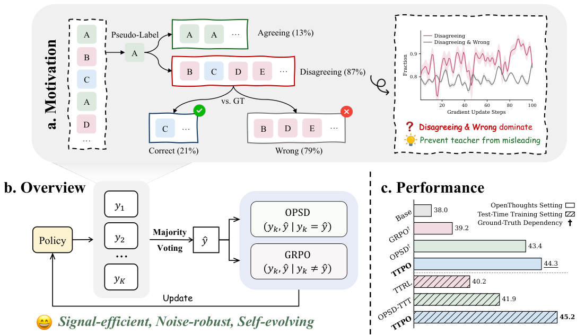

# TTPO: Test-Time Policy Optimization

> **论文**：TTPO: Test-Time Policy Optimization
> **作者**：Aozhe Wang、Zhengxi Lu（共同一作）、Jianze Wang、Shangke Lv、Ying Liu、Weiming Lu、Jun Xiao、Yueting Zhuang、Hua Yang、Qianglong Chen、Yongliang Shen（通讯）；浙江大学 + Alibaba Group
> **arXiv ID**：2608.27448（cs.CL）
> **发表时间**：2026-08-27（arXiv 提交）；Hugging Face Daily Paper 2026-08-28（当日 #2，48 upvotes）
> **代码仓库**：https://github.com/ZJU-REAL/TTPO

## 第 1 章 概述

### 1.1 一句话定位

TTPO（Test-Time Policy Optimization）是一个**无标签**的测试时训练（TTT, Test-Time Training）框架：在不接触任何真值标签的情况下，直接在测试问题上更新模型参数。其核心是一个**非对称目标**——对与多数投票伪标签（majority-vote pseudo-label）一致的 rollout，用 OPSD 风格的前向 KL 蒸馏，由 answer-conditioned teacher 提供 token 级稠密监督；对与伪标签不一致的 rollout，用 GRPO 的 group-relative advantage 施加惩罚。两条分支各自配备针对其性质设计的 token 级选择机制：蒸馏分支用 Soft-OR 加权，RL 分支用 top-50% token 掩码。

非对称性是整个设计的支点。错误投票会污染 teacher 并误导每一个 token，因此把错误伪标签当作蒸馏目标是危险的；但「不同意伪标签」的 rollout 本身大概率也是错的，无论投票对错与否——因此惩罚分歧在约 79% 的情况下是安全的（同时约 1/5 的正确分歧 rollout 会被误罚，这是该方法接受的代价）。蒸馏与分歧惩罚的这种可靠性差异，决定了两条分支必须采用不同的学习信号形式，而不是把同一种损失对称地套在两组样本上。

把 TTPO 放进后训练方法的坐标系中：

| 维度 | RLVR/GRPO | OPSD | TTRL | TTPO |
|---|---|---|---|---|
| 需要标签 | 是（结果奖励） | 是（teacher 条件） | 否（多数投票伪奖励） | 否 |
| 监督粒度 | 序列级标量 | token 级稠密 | 序列级标量 | token 级稠密 |
| 信号方向 | 正/负（奖励驱动） | 正向（蒸馏） | 正/负（伪奖励驱动） | 非对称：正向蒸馏 + 负向惩罚 |
| 训练时机 | 训练后 | 训练后 | 测试时 | 测试时 |

TTPO 占据的格子（无标签 × token 级 × 非对称 × 测试时）在此前是空的：TTRL 牺牲了粒度，OPSD 牺牲了无标签性。

### 论文图表总览

| 编号 | 内容 | 章节 |
|---|---|---|
| Figure 1 | 动机统计图：竞赛级问题上伪标签约 85% 错误，但约 79% 的分歧 rollout 本身也错（非对称性来源） | 第 2 章 2.3 |
| Figure 3 | 更新策略消融：正样本 FKL + 负样本 GRPO（48.9）vs 各替代组合 | 第 5 章 5.2 |
| Figure 5 | GT 标签上界对比：伪标签 TTPO 反超 TTPO w/ GT 与 OPSD（Leakage） | 第 5 章 5.5 |
| Figure 6 | 可持续自进化：Avg@12 升至 base Maj@12，Maj@12 同步上升 | 第 5 章 5.6 |
| Table 1 | OpenThoughts 训练主结果：TTPO（无标签）对比 OPSD†/GRPO†（GT 标签），三规模 × 五基准，Avg@12 | 第 1 章 1.3 |
| Table 2 | TTT 主结果：完全无标签、直接在测试题上训练，Qwen3-1.7B 38.0 → 45.2 | 第 1 章 1.3 |
| Table 3 | Token 级选择消融（Soft-OR 权重 / top-50% 掩码） | 第 5 章 5.1 |
| Table 4 | 特权信息消融（answer / trajectory × thinking 教师模式） | 第 5 章 5.3 |
| Table 7 | Non-thinking 评估：关闭思考模式后 TTPO 相对 base 提升 +25.2 ~ +36.4 个百分点 | 第 1 章 1.3 |
| Table 8 | RL 权重 λ 消融（0.10 处峰值） | 第 5 章 5.8 |

### 1.2 核心贡献

**贡献一：非对称失效模式的实证观察（85% / 79%）。**

论文测量了多数投票伪标签在竞赛级问题上的可靠性，得到两个数字：

- 伪标签本身约 **85%** 是错的——竞赛级问题单次命中真值的概率很低，多数投票难以挽回；
- 在与伪标签不一致的 rollout 中，约 **79%** 同样是错的。

两者组合出关键结论：惩罚分歧样本的误伤率很低（无论投票对错，分歧者大概率确实错了），而把错误伪标签蒸馏进模型则会污染 teacher 输出、误导每一个 token。监督信号的可靠性在两组样本上分布不对称，这是后续一切设计的依据。

**贡献二：非对称目标 TTPO。**

基于上述观察，TTPO 把无标签 TTT 拆成两条性质不同的分支：

- **正样本分支（同意伪标签的 rollout 集合 $P$）**：OPSD 前向 KL 蒸馏。以伪标签 $\hat{a}$ 条件化的 teacher（共享权重、answer-conditioned、无梯度）逐 token 监督 student（有梯度），提供稠密 token 级监督。
- **负样本分支（分歧 rollout 集合 $N$）**：GRPO 惩罚。group-relative advantage 构造保证 $A_k < 0$ 恒成立，对分歧序列施加负梯度。
- **token 级选择**：蒸馏分支用 Soft-OR 权重 $w(t)$（高熵或高 teacher–student 分歧的 token 获得更大权重）；RL 分支用 top-50% 掩码 $m(t)$（以未归一化负对数似然锚定，天然排除局部正确的 token）。
- 两分支以 $\lambda = 0.1$ 的权重合并为统一目标 $\mathcal{L}_{\text{TTPO}}$。

**贡献三：实验结果。**

在三个规模（Qwen3-1.7B/4B/8B）、五个竞赛级基准（AIME25/HMMT25/AIME26/HMMT26/BRUMO25）上，无标签 TTPO 匹配或超越使用 GT 标签的 OPSD：

- 1.7B 平均 40.1 vs OPSD† 39.7；4B 58.6 vs 58.4；8B 62.6 vs 61.7；
- TTT 设定下 Qwen3-1.7B 从 38.0 提升到 45.2；
- 关闭思考模式时相对 base 提升 +25.2 ~ +36.4 个百分点；
- 跨任务泛化：在任一基准上训练都能改善其余基准的表现。

### 1.3 关键结果速览

**无标签匹配有标签（Table 1，OpenThoughts 训练，Avg@12，† = 使用 GT 标签）：**

| 方法 | AIME25 | HMMT25 | AIME26 | HMMT26 | BRUMO25 | Avg |
|---|---|---|---|---|---|---|
| Qwen3-1.7B Base | 36.9 | 21.9 | 37.8 | 28.8 | 47.5 | 34.6 |
| +GRPO† | 37.3 | 23.6 | 40.3 | 29.3 | 48.1 | 35.7 |
| +OPSD† | 40.3 | 28.1 | 46.4 | 31.4 | 52.5 | 39.7 |
| +TTPO | **41.7** | 26.1 | **46.5** | **31.6** | **54.7** | **40.1** |
| Qwen3-4B Base | 66.1 | 41.9 | 65.8 | 42.4 | 64.0 | 56.0 |
| +GRPO† | 66.7 | 45.0 | 66.6 | 43.2 | 66.1 | 57.5 |
| +OPSD† | 68.3 | 44.2 | 68.1 | 44.4 | 67.2 | 58.4 |
| +TTPO | **69.4** | 43.6 | **68.1** | **44.7** | **67.2** | **58.6** |
| Qwen3-8B Base | 66.7 | 44.2 | 67.5 | 45.5 | 69.2 | 58.6 |
| +GRPO† | 70.3 | 46.7 | 69.2 | 48.0 | 71.9 | 61.2 |
| +OPSD† | 70.8 | 46.4 | 72.5 | 47.2 | 71.4 | 61.7 |
| +TTPO | **71.4** | 46.1 | **74.2** | **48.0** | **73.1** | **62.6** |

TTPO 不使用任何标签，却在三个规模上全部超过使用 GT 标签的 OPSD† 与 GRPO†。

**TTT 设定（Table 2，直接在测试题上训练，完全无标签）：**

| 方法 | AIME26 | HMMT26 | BRUMO25 | Avg |
|---|---|---|---|---|
| Qwen3-1.7B Base | 37.8 | 28.8 | 47.5 | 38.0 |
| +TTRL | 39.2 | 30.6 | 50.9 | 40.2 |
| +OPSD-TTT | 44.7 | 30.3 | 50.8 | 41.9 |
| +TTPO | **48.9** | **33.6** | **53.1** | **45.2** |
| Qwen3-4B Base | 65.8 | 42.4 | 64.0 | 57.4 |
| +TTRL | 66.4 | 43.2 | 66.7 | 58.8 |
| +OPSD-TTT | 67.8 | 43.4 | 66.9 | 59.4 |
| +TTPO | **70.8** | **45.7** | **66.9** | **61.1** |
| Qwen3-8B Base | 67.5 | 45.5 | 69.2 | 60.7 |
| +TTRL | 70.8 | 48.0 | 70.1 | 63.0 |
| +OPSD-TTT | 71.7 | 47.2 | 72.2 | 63.7 |
| +TTPO | **73.9** | **48.5** | **73.6** | **65.3** |

TTPO 在三个规模上均为最优；经过 TTT 的 Qwen3-4B（61.1）已超过未训练的 Qwen3-8B base（60.7）。OPSD-TTT（把伪标签直接喂给 OPSD 蒸馏的天真方案）全面落后于 TTPO，量化了伪标签错误的代价。

**无思考模式（Table 7，thinking disabled）：**

| 方法 | AIME25 | HMMT25 | AIME26 | HMMT26 | BRUMO25 | Avg |
|---|---|---|---|---|---|---|
| 1.7B Base | 9.2 | 5.6 | 8.8 | 6.1 | 17.8 | 9.5 |
| 1.7B +OPSD† | 16.9 | 9.2 | 19.4 | 11.9 | 25.6 | 16.6 |
| 1.7B +TTPO | 39.2 | 20.6 | 39.8 | 26.3 | 47.5 | 34.7 |
| 4B Base | 22.2 | 12.5 | 19.4 | 17.2 | 28.3 | 19.9 |
| 4B +OPSD† | 26.7 | 18.9 | 24.4 | 22.5 | 36.1 | 25.7 |
| 4B +TTPO | 57.2 | 36.7 | 61.4 | 36.4 | 60.8 | 50.5 |
| 8B Base | 20.6 | 11.4 | 21.1 | 18.7 | 29.7 | 20.3 |
| 8B +OPSD† | 25.0 | 14.2 | 22.2 | 19.9 | 37.8 | 23.8 |
| 8B +TTPO | 67.8 | 42.5 | 65.0 | 41.2 | 67.2 | 56.7 |

TTPO 相对 base 的绝对提升为：1.7B +25.2、4B +30.6、8B +36.4 个百分点。收益来源在于 TTPO 的 teacher 为 thinking-on、student 为 thinking-off 的配置，训练过程本身就完成了一次思考能力向无思考模式的迁移。

**其他速览：**

- token 级选择消融（Table 3，1.7B）：去掉正分支 Soft-OR 权重，AIME26 从 46.5 降至 43.3；去掉负分支 top-50% 掩码，BRUMO25 从 54.7 降至 50.0。
- λ 消融（Table 8，1.7B）：$\lambda = 0.1$ 处性能峰值（AIME26 46.5），过大（0.20 时 41.7）或过小（0.01 时 41.4）均退化。
- 更新策略反转会崩溃（Figure 3）：正样本改用 GRPO、负样本改用 FKL，AIME26 从 48.9 跌至 37.2。

## 第 2 章 研究背景与动机

### 2.1 RLVR 与 OPSD：监督粒度的进化，以及共同的标签依赖

RLVR（RL with Verifiable Rewards）是当前 LLM 数学推理后训练的主流路线：以最终答案的可验证正确性作为奖励，用 PPO/GRPO 等策略梯度方法优化。其局限在于监督粒度：

- 奖励是**序列级**标量——整个 rollout 只得到一个信号；
- 模型必须自行完成从「这条轨迹最终对了/错了」到「哪个 token 是关键」的 credit assignment；
- 长推理链场景下这种粒度过于粗糙，GRPO 的 group-relative baseline 只能缓解、无法消除。

OPSD（On-Policy Self-Distillation）系列工作将监督粒度细化到 token 级：

- 利用真值答案 $a^*$ 构造 **answer-conditioned teacher**——同一模型在输入中拼接 $a^*$ 后再生成，得到在答案提示下逐 token 的目标分布；
- teacher 与 student on-policy 同源，对 student 的每个 token 位置提供稠密监督；
- 避开了奖励信号的稀疏性，在数学推理上显著优于结果奖励 RL。

但两条路线共享同一个前提：**需要真值标签**。RLVR 需要标签判定奖励，OPSD 需要标签条件化 teacher。在测试时（test time）——模型面对的是没有标签的全新问题——这两条路线都无法直接使用。TTPO 要解决的问题是：如何把 token 级稠密监督带入无标签的测试时训练。

### 2.2 TTT 与伪标签：多数投票的脆弱性

测试时训练的现有做法依赖**伪标签**：

- **TTRL**：对同一测试题采样多个 rollout，以多数投票结果作为伪奖励做 RL。伪标签替代了标签，但监督信号仍停留在**序列级**——伪奖励同样只回答「这条轨迹对不对」，没有解决 credit assignment。
- **Hi-TTRL / SCRL**：沿此方向改进了奖励的构造与鲁棒性，但奖励形态仍是序列级标量。

把伪标签直接接入 OPSD 式蒸馏是看似自然的下一步——用伪标签 $\hat{a}$ 条件化 teacher，即可获得 token 级监督。但论文测量表明这条路极其脆弱：在竞赛级问题上，多数投票伪标签约 **85% 是错的**。错误的 $\hat{a}$ 会污染 answer-conditioned teacher 的整个输出分布，蒸馏过程随之把错误信息写入每一个 token——一个错误标签不是被稀释，而是被放大成整条序列的稠密错误监督。

这正是天真方案失效的机制：Table 2 中的 OPSD-TTT（1.7B 平均 41.9）虽高于 TTRL（40.2），但显著低于 TTPO（45.2）——稠密监督的收益被标签噪声的放大效应部分抵消。

### 2.3 非对称性动机：85% 错误的标签，与 79% 也错的分歧者

论文的核心观察（Figure 1）是：伪标签的错误并非均匀地伤害所有用法，其影响是**不对称**的。

一方面，伪标签约 85% 错误，因此任何「向伪标签学习」的操作都大概率在引入错误监督——蒸馏首当其冲，因为它把伪标签变成了逐 token 的目标。

另一方面，与伪标签不一致的 rollout 中约 **79% 本身也是错的**，且这一比例对投票正确与否不敏感：无论 $\hat{a}$ 是否等于真值 $a^*$，分歧者大概率确实答错了。换句话说，「与伪标签分歧」这一事件本身就是「该 rollout 错误」的强信号——**惩罚分歧几乎总是安全的**。



*图1：论文的动机统计图（Figure 1）——伪标签在竞赛级问题上约 85% 错误，但分歧 rollout 约 79% 本身也是错的，两种信号可靠性不对称，是 TTPO 非对称设计的经验支点。*

这构成一对非对称的可靠性结构：

| 操作 | 依赖的前提 | 前提成立的概率 | 失效后果 |
|---|---|---|---|
| 向伪标签蒸馏 | 伪标签正确 | ~15% | 错误写入每个 token |
| 惩罚分歧 rollout | 分歧者错误 | ~79% | 少量误伤 |

这与 noisy labels 文献中的 **negative learning** 思想同构：在标签噪声严重的场景里，可靠地「识别出肯定错误的样本」比「识别出正确的样本」容易得多，因此以负向信号为主的学习更鲁棒。TTPO 把这一思想从样本级推进到 token 级，并按分支差异化地设计了信号形式。

由此得到设计原则：**对同意样本提供正向稠密监督（蒸馏），对分歧样本提供负向惩罚（RL）**——而不是用同一种损失对称地处理两组样本，也不是单纯把伪标签当真值用。

### 2.4 token 级选择相关工作

监督信号细化到 token 之后，哪些 token 值得学习/惩罚成为独立问题。相关工作包括：

- **TIP**：发现 token 级选择极为高效——选出的 token 不足全量的 10%，即可接近全 token 训练的效果。说明 token 集合的信息密度高度不均。
- **STAPO**：对低概率、低熵的异常 token 施加掩码处理，剔除噪声 token。
- **Wu et al.**：reward recalibration，对奖励信号重新校准。

TTPO 在两条分支中分别引入了与分支性质匹配的 token 级选择：

- 正分支（蒸馏）用 **Soft-OR 权重**——熵与 teacher–student 分歧的概率并集，让监督集中在决策关键或 student 偏离的位置；
- 负分支（RL）用 **top-50% 掩码**——以未归一化负对数似然锚定，自动放过局部正确的 token。

消融（Table 3）显示两个机制分别带来约 3.2 与 4.7 个百分点（AIME26 / BRUMO25）的收益。

## 第 3 章 方法

### 3.1 问题设定

给定策略模型 $\pi_\theta$ 与一道无标签测试题 $x$：

1. 采样 $K$ 条 rollout $\{y_k\}_{k=1}^{K}$（论文取 $K = 64$）。
2. 对每条 rollout 抽取最终答案，以**多数投票**得到伪标签 $\hat{a}$。
3. 按 rollout 与 $\hat{a}$ 是否一致划分集合：
   - **正样本集合 $P$**：$\mathrm{answer}(y_k) = \hat{a}$（同意伪标签）；
   - **负样本集合 $N$**：$\mathrm{answer}(y_k) \neq \hat{a}$（分歧）。
4. 训练时从 $P$、$N$ 中各取 50%（$K_{\text{train}} = 8$，即 4 正 4 负）。

关键超参数（Appendix A，Table 5–6）：

| 类别 | 配置 |
|---|---|
| 优化 | LR 5e-6；max grad norm 0.1（OPSD/TTPO）；batch 32；steps 100（OPSD/TTPO）/ 500（GRPO/TTRL） |
| LoRA | r = 64，α = 128，全部线性层（q/k/v/o/gate/up/down proj） |
| 采样 | $K$ = 64 rollouts/题；$K_{\text{train}}$ = 8（50% 正 50% 负）；temp 1.1（TTPO/OPSD）/ 1.2（GRPO/TTRL）；top-p 0.95；top-k 20；max gen 16000 token |
| 梯度 | 仅回传 completion 前 1024 个 token |
| 正则 | GRPO KL β = 0.0；JSD token clip τ = 0.05（1.7B/4B）/ 0.06（8B） |
| 评估 | thinking enabled，12 samples，temp 1.0，top-p 0.95，max 38912 token，指标 Avg@12 |
| 硬件 | TTPO 4×H20（其余 8×H20），bf16 + Flash Attention 2，全词表 logit 蒸馏 |

正负比例与样本选择另有消融支撑：固定 0.5 比例优于随机与动态比例（Table 9）；从两组中取 shortest rollout 优于 random/longest/top-signal（Table 10）。

### 3.2 answer-conditioned teacher 与 student（Eq 1–2）

TTPO 沿用 OPSD 的自教师结构：teacher 与 student 共享同一组权重，区别只在输入条件与梯度路径。

$$q_t^{(\hat{a})} = \pi_\theta\!\left(\,\cdot \mid [x;\hat{a}]_{\text{teacher}},\, y_{<t}\,\right) \qquad \text{（无梯度）}$$

$$p_t = \pi_\theta\!\left(\,\cdot \mid x_{\text{student}},\, y_{<t}\,\right) \qquad \text{（有梯度）}$$

| | teacher $q_t^{(\hat{a})}$ | student $p_t$ |
|---|---|---|
| 输入条件 | 拼接伪标签 $\hat{a}$ | 不加标签 |
| 思考模式 | thinking-on | thinking-off |
| 权重 | 固定 base 权重（LoRA 禁用） | LoRA 更新 |
| 梯度 | 无 | 有 |

伪标签在此充当 answer conditioning——即使 $\hat{a}$ 有误，teacher 仍是在「某个答案已给定」的条件下生成逐 token 分布，其输出对错误答案的暴露方式与序列级奖励不同。

消融（Table 4）验证了这种条件化与模式配置的必要性：

| Privilege | TM-on Teacher | TM-off Teacher |
|---|---|---|
| None | 45.8 (36.1) | 41.7 (8.1) |
| Answer | **46.5** (39.8) | 33.6 (6.7) |
| Trajectory | 41.1 (8.9) | 40.8 (10.6) |

*表注：括号内数值为论文 Table 4 原表附带数据，论文正文未标注其含义。* answer privilege 配合 thinking-on teacher 达到最优 46.5；而 thinking-off teacher 下加 answer privilege 反而崩到 33.6——错误标签在无思考 teacher 中无法转化为有效监督。

### 3.3 正样本分支：OPSD 蒸馏 + Soft-OR token 加权（Eq 3–4）

对 $k \in P$，以前向 KL 蒸馏到 answer-conditioned teacher：

$$\mathcal{L}_{\text{OPSD}}(k) = \frac{1}{T_k} \sum_{t=1}^{T_k} w(t)\, \mathrm{KL}\!\left(q_t^{(\hat{a})}\,\Big\|\,p_t\right)$$

token 权重采用 Soft-OR 组合：

$$w(t) = \hat{H}(t) + \hat{\Delta}(t) - \hat{H}(t)\,\hat{\Delta}(t)$$

其中 $\hat{H}(t)$ 为按样本内 min-max 归一化的熵，$\hat{\Delta}(t)$ 为同法归一化的 teacher–student 分歧度。Soft-OR 是离散 OR 的概率松弛，语义为「任一信号足够大即选中」：

- 高熵 token——模型不确定、决策关键——权重大；
- 高分歧 token——student 明显偏离 teacher——权重大；
- 两者皆低的 token——teacher 与 student 已一致且无歧义——权重趋近于 0。

去掉该权重（Table 3，w/o pos. weight）使 AIME26 从 46.5 降至 43.3、HMMT26 从 31.6 降至 30.6、BRUMO25 从 54.7 降至 52.8，说明加权有效地把蒸馏算力集中在有信息量的 token 上。附录 C 的可视化案例（几何题）与之相符：坐标类数字 token 权重低，几何洞察类 token 权重高。

### 3.4 负样本分支：GRPO 惩罚 + top-50% token 掩码（Eq 5–7）

对 $k \in N$，用 GRPO 风格的目标惩罚：

$$\mathcal{L}_{\text{GRPO}}(k) = -\frac{A_k}{T_k} \sum_{t=1}^{T_k} m(t)\, \log \pi_\theta\!\left(y_k^{(t)} \mid x,\, y_k^{(<t)}\right)$$

advantage 按 group-relative 方式构造（Eq 12）：

$$A_k = -\sqrt{\frac{|P|/K}{1 - |P|/K}}, \qquad k \in N$$

由构造 $A_k < 0$ 恒成立，配合损失前的负号，整条序列获得负梯度（惩罚）。其幅值随正样本占比 $|P|/K$ 自适应：正样本占比越高（共识越强），对分歧样本的惩罚越强；正样本越稀少（问题越难、伪标签共识越弱），惩罚越弱。

token 掩码通过两步构造。先定义 token 级惩罚分数：

$$s(t) = -\log \pi_\theta\!\left(y_k^{(t)} \mid x,\, y_k^{(<t)}\right) \cdot \left(1 - \hat{H}(t)\right)$$

再按样本内中位数取 top-50%：

$$m(t) = \mathbb{1}\!\left[s(t) \geq \mathrm{median}\!\left(\{s(t')\}_{t'=1}^{T_k}\right)\right]$$

$s(t)$ 的设计有两个要点：

- **未归一化的 $-\log \pi_\theta$ 锚定**：不依赖任何归一化，低概率 token 分数天然更高。由于模型对局部正确的 token（如合理的中间步骤）通常赋予较高概率，这些 token 的 $s(t)$ 天然偏低，被自动排除在惩罚之外——惩罚集中在「低熵（自信）语境中产生高 surprisal（低概率）内容」的异常 token 上，即论文所称 "confidently produced unlikely content"。
- **$(1 - \hat{H}(t))$ 折扣**：高熵 token（模型的随机探索）不一定是错误的根源，按熵折扣避免惩罚纯随机性。

实现上该分支不使用 KL 正则（$\beta = 0$）。去掉掩码（Table 3，w/o neg. mask）使 AIME26 从 46.5 降至 45.4、HMMT26 从 31.6 降至 29.5、BRUMO25 从 54.7 降至 50.0——无差别惩罚全 token 会误伤局部正确内容。

### 3.5 统一目标（Eq 8）

两条分支合并为：

$$\mathcal{L}_{\text{TTPO}} = \frac{1}{|B|}\left(\sum_{k \in P} \mathcal{L}_{\text{OPSD}}(k) + \lambda \sum_{k \in N} \mathcal{L}_{\text{GRPO}}(k)\right)$$

$\lambda$ 控制蒸馏与惩罚的配比，论文取 $\lambda = 0.1$——蒸馏为主、惩罚为辅。Table 8 的消融（1.7B，AIME26/HMMT26/BRUMO25）显示性能峰恰在 0.10：

| $\lambda$ | AIME26 | HMMT26 | BRUMO25 |
|---|---|---|---|
| 0.01 | 41.4 | 28.8 | 51.1 |
| 0.05 | 43.9 | 29.0 | 50.6 |
| **0.10** | **46.5** | **31.6** | **54.7** |
| 0.15 | 44.7 | 29.5 | 50.3 |
| 0.20 | 41.7 | 26.3 | 51.6 |

两端均明显退化：惩罚过弱退回天真蒸馏的脆弱性，惩罚过强则误伤上升。配套消融：

| 正负样本选择 | AIME26 | HMMT26 | BRUMO25 |
|---|---|---|---|
| Random | 45.8 | 30.3 | 50.9 |
| Fixed 0.5 | **46.5** | **31.6** | **54.7** |
| Dynamic | 46.1 | 31.1 | 51.1 |

| 训练样本策略 | AIME26 | HMMT26 | BRUMO25 |
|---|---|---|---|
| Random | 45.0 | 31.1 | 50.7 |
| Shortest | **46.5** | **31.6** | **54.7** |
| Longest | 45.6 | 30.8 | 51.1 |
| Top signal | 45.8 | 30.6 | 51.9 |

### 3.6 为何必须不对称：理论分析

论文附录 E 从两个层面论证了非对称结构的必然性。

**层面一：两种信号作用在错误样本集合上的风险不对称（Eq 10–11）。**

- 对正样本集合 $P$ 做前向 KL，至坏无害（Eq 10）：即使 $\hat{a} \neq a^*$，蒸馏目标退化为 thinking-to-non-thinking 蒸馏——teacher 与 student 条件不同但同源，仍是一次有效的模式迁移（Figure 3 中纯 thinking-to-non-thinking 蒸馏单独可得 45.7，本身即为有效信号）。
- 对负样本集合 $N$ 做前向 KL 则包含一项 $\Delta_{\text{conflict}} \geq 0$（Eq 11）：当 $\hat{a} \neq a^*$ 时该项系统性为正，蒸馏会迫使模型偏离本可能正确的推理路径，造成真实伤害。

这解释了 Figure 3 的更新策略消融（Qwen3-1.7B TTT，AIME26）：

| 更新策略 | AIME26 |
|---|---|
| TTPO（正 FKL + 负 GRPO） | **48.9** |
| 纯 FKL 处理全部样本 | 46.3 |
| 仅正样本 FKL | 46.7 |
| 仅负样本 FKL | 43.9 |
| thinking-to-non-thinking 蒸馏（无答案条件） | 45.7 |
| 正样本 GRPO | 37.2 |
| 反转（正 GRPO + 负 FKL） | 37.2 |

反转配置暴跌至 37.2，与「对正样本做 GRPO」同分——对少数派正确路径施加负梯度是灾难性的。

**层面二：标签路由的可行性不对称（Eq 13–16）。**

- 用 **GT 路由**（Eq 13–14）在难题上不可行：模型在竞赛级难题上几乎无法命中真值，$|P_{\text{GT}}| \approx 0$，蒸馏与 RL 两个分支同时失去输入，训练停滞。
- 用**投票路由**（Eq 15–16）恒可行：多数投票的胜出答案必然来自某条已采样的 rollout，因此 $|P_{\text{vote}}| > 0$ 恒成立，两条分支在任意难度上都保持活跃。

两点结合得到最终结论：非对称目标不是工程偏好，而是在「伪标签不可靠 + 分歧信号可靠」这一统计结构下唯一既安全又始终可行的组合——蒸馏为同意样本提供稠密正向监督，RL 为分歧样本提供鲁棒负向惩罚，token 级选择在两个方向上各自抑制噪声。

### 方法边界

论文附录 F 自陈三项局限，均与非对称设计的根源相关：

- **依赖投票质量**：伪标签仍是整个路由机制的锚点，当多数投票完全失效（如开放域无标准答案的问题）时 $P$、$N$ 划分失去意义；
- **仅限数学推理**：实验全部在竞赛级数学基准上完成，答案可抽取、可比较是伪标签可行性的前提；
- **固定目标**：TTT 阶段目标分布不随训练进程演化，缺少课程式或自适应的目标更新机制。

三条边界共同指向同一扩展方向：只要能构造出可靠的「同意/分歧」划分信号，非对称目标的框架即可迁移到数学之外的无标签场景。

## 第 4 章 实验设置与主结果

### 4.1 实验设置

**模型与训练**。TTPO 在 Qwen3-1.7B、Qwen3-4B、Qwen3-8B 三个规模上评估，全部使用 LoRA 微调（rank $r=64$、$\alpha=128$，作用于全部线性层）。论文考虑两种设置：

- **OpenThoughts 设置**：模型在 OpenThoughts 有标签数据上训练，但 TTPO 不使用标签——标签仅用于与依赖标签的基线（OPSD、GRPO）对比；
- **TTT 设置**：模型直接在无任何标注的测试集上训练，这是纯粹的 test-time training。

共享训练配置沿用 OPSD（学习率 $5\times10^{-6}$、有效 batch size 32、最大梯度范数 0.1、全词表 logit 蒸馏），完整配置见论文 Appendix A。

**基线方法**：
- **OPSD**（Zhao et al., 2026）：基于 ground-truth 标签的 on-policy self-distillation；
- **GRPO**（Shao et al., 2024）：基于 ground-truth 奖励的强化学习；
- **TTRL**（Zuo et al., 2026）：无标签 RL，多数投票伪奖励；
- **OPSD-TTT**：用模型自身 temperature-0 思考模式输出作为特权信息做自蒸馏。

**评估协议**。五个竞赛级数学基准：AIME 2025、AIME 2026、HMMT 2025、HMMT 2026、BRUMO 2025。所有结果以 Avg@12 报告（temperature 1.0，thinking mode 开启；非思考评估见 Appendix D.2）。OPSD 与 TTPO 训练 100 步，每 25 步存 checkpoint 取峰值；GRPO 与 TTRL 训练 500 步取峰值。

**TTPO 专属超参数**：每个问题采样 $K=64$ 条轨迹（最大生成长度 16,000 token），从中选择 $K_{\text{train}}=8$ 条（50% 正样本、50% 负样本）用于梯度更新，RL 权重 $\lambda=0.1$。

### 4.2 OpenThoughts 训练：无标签匹配有标签

Table 1 对比了 OpenThoughts 数据上各方法的表现。OPSD 与 GRPO 使用 ground-truth 标签，而 TTPO 仅依赖多数投票伪标签。

| 模型 | 方法 | AIME25 | HMMT25 | AIME26 | HMMT26 | BRUMO25 | 平均 |
|:-----|:-----|:------:|:------:|:------:|:------:|:-------:|:----:|
| Qwen3-1.7B | Base | 36.9 | 21.9 | 37.8 | 28.8 | 47.5 | 34.6 |
| | +GRPO† | 37.3 | 23.6 | 40.3 | 29.3 | 48.1 | 35.7 |
| | +OPSD† | 40.3 | 28.1 | 46.4 | 31.4 | 52.5 | 39.7 |
| | +TTPO | 41.7 | 26.1 | 46.5 | 31.6 | 54.7 | 40.1 |
| Qwen3-4B | Base | 66.1 | 41.9 | 65.8 | 42.4 | 64.0 | 56.0 |
| | +GRPO† | 66.7 | 45.0 | 66.6 | 43.2 | 66.1 | 57.5 |
| | +OPSD† | 68.3 | 44.2 | 68.1 | 44.4 | 67.2 | 58.4 |
| | +TTPO | 69.4 | 43.6 | 68.1 | 44.7 | 67.2 | 58.6 |
| Qwen3-8B | Base | 66.7 | 44.2 | 67.5 | 45.5 | 69.2 | 58.6 |
| | +GRPO† | 70.3 | 46.7 | 69.2 | 48.0 | 71.9 | 61.2 |
| | +OPSD† | 70.8 | 46.4 | 72.5 | 47.2 | 71.4 | 61.7 |
| | +TTPO | 71.4 | 46.1 | 74.2 | 48.0 | 73.1 | 62.6 |

*表注：† 表示训练时使用 ground-truth 标签；TTPO 完全无标签。*

**核心发现**：TTPO 在三个规模上平均分均超过依赖标签的 OPSD（1.7B：40.1 vs 39.7；4B：58.6 vs 58.4；8B：62.6 vs 61.7），证明多数投票伪标签配合非对称目标可以替代 ground-truth 标注而不损失性能。值得注意的是，TTPO 在 Qwen3-4B 上的平均分（58.6）已追平 Qwen3-8B base 模型（58.6）——训练配方将小模型的推理能力放大到了 $2\times$ 更大未训练模型的水平。

### 4.3 TTT 设置：完全无标签的测试时训练

Table 2 展示了纯 TTT 设置的结果——模型直接在测试问题上训练，全程没有任何标签。

| 模型 | 方法 | AIME26 | HMMT26 | BRUMO25 | 平均 |
|:-----|:-----|:------:|:------:|:-------:|:----:|
| Qwen3-1.7B | Base | 37.8 | 28.8 | 47.5 | 38.0 |
| | +TTRL | 39.2 | 30.6 | 50.9 | 40.2 |
| | +OPSD-TTT | 44.7 | 30.3 | 50.8 | 41.9 |
| | +TTPO | 48.9 | 33.6 | 53.1 | 45.2 |
| Qwen3-4B | Base | 65.8 | 42.4 | 64.0 | 57.4 |
| | +TTRL | 66.4 | 43.2 | 66.7 | 58.8 |
| | +OPSD-TTT | 67.8 | 43.4 | 66.9 | 59.4 |
| | +TTPO | 70.8 | 45.7 | 66.9 | 61.1 |
| Qwen3-8B | Base | 67.5 | 45.5 | 69.2 | 60.7 |
| | +TTRL | 70.8 | 48.0 | 70.1 | 63.0 |
| | +OPSD-TTT | 71.7 | 47.2 | 72.2 | 63.7 |
| | +TTPO | 73.9 | 48.5 | 73.6 | 65.3 |

**核心发现**：
- Qwen3-1.7B 上 TTPO 平均分 45.2，比 OPSD-TTT 高 +3.3（45.2 vs 41.9）、比 TTRL 高 +5.0（45.2 vs 40.2，按 Table 2 平均值计算；论文正文表述为 +5.4），相对 base 模型提升 7.2 个百分点；
- 与 TTRL 的差距体现了 dense 分布监督的价值：TTRL 只有二元奖励信号，TTPO 额外通过 answer-conditioned teacher 在正确轨迹上传递 token 级知识；
- 与 OPSD-TTT 的差距说明非对称设计从负样本的选择性 RL 惩罚中提取了更多信号；
- 跨规模对比：TTPO 在 Qwen3-4B 上（61.1）已超越 Qwen3-8B base（60.7），无标签测试时训练可以拉近模型规模差距。

## 第 5 章 分析与消融

### 5.1 Token 级选择消融

Table 3（Qwen3-1.7B，AIME26 / HMMT26 / BRUMO25）分别去掉两个 token 级机制：

| 方法 | AIME26 | HMMT26 | BRUMO25 |
|:-----|:------:|:------:|:-------:|
| TTPO（完整） | 46.5 | 31.6 | 54.7 |
| w/o pos. weight（去掉正样本加权） | 43.3 | 30.6 | 52.8 |
| w/o neg. mask（去掉负样本掩码） | 45.4 | 29.5 | 50.0 |

两个组件都有贡献且互补，针对不同失败模式：
- 去掉**正样本加权**后，蒸馏均匀作用于所有 token，包括低价值（低熵、低分歧）的已收敛位置，稀释了信息量高的 token 的梯度；
- 去掉**负样本掩码**后，无差别惩罚所有 token——不仅对局部正确的推理步骤造成附带损伤（在无正优势更新抵消的情况下无法修复），还让异常（低概率、低熵）token 主导梯度更新，注入噪声。

### 5.2 更新策略消融

Figure 3（Qwen3-1.7B TTT，AIME26）对比了正/负样本信号组合：

| 策略 | AIME26 |
|:-----|:------:|
| 全 FKL（所有样本蒸馏） | 46.3 |
| 仅正样本 FKL | 46.7 |
| 仅负样本 FKL | 43.9 |
| 思考→非思考蒸馏（无答案条件） | 45.7 |
| 正样本 GRPO、负样本 FKL（反向分配） | 37.2 |
| **TTPO（正=FKL，负=GRPO）** | **48.9** |

分析：
- FKL 适合正样本：正样本答案与伪标签一致，即使伪标签错误，teacher 也条件在 student 自己产生的答案上，退化为思考→非思考蒸馏（45.7），安全迁移谨慎推理；
- GRPO 适合负样本：虽然信用分配更粗糙，但 TTT 数据上大多数负样本被正确识别（答案≠伪标签且≠真值），无标签惩罚严格比污染蒸馏安全；
- 反向分配（正=GRPO、负=FKL）最差（37.2）：正样本上强化学习在伪标签错误时会反转更新，负样本上污染蒸馏传播错误。

### 5.3 特权信息消融

Table 4（Qwen3-1.7B）对比了 teacher 不同特权信息与教师模式（括号内数值为论文原表附带数据，论文正文未标注其含义）：

| 特权信息 | 思考模式 teacher | 非思考 teacher |
|:---------|:----------------:|:--------------:|
| 无 | 45.8 (36.1) | 41.7 (8.1) |
| 答案（answer） | 46.5 (39.8) | 33.6 (6.7) |
| 完整轨迹（trajectory） | 41.1 (8.9) | 40.8 (10.6) |

思考 teacher + 答案是最佳组合：思考模式下师生分布差距大，短答案足以作为轻量提示引导 teacher 而不挤占其推理空间；完整轨迹则主导上下文，把 teacher 退化为补全给定前缀。即使伪标签错误，正样本中伪标签仍与学生答案一致，更新退化为思考→非思考蒸馏——依然是良定义且有益的信号（46.5 vs 无特权 45.8）。

### 5.4 跨任务泛化

Figure 4：在每个基准上单独训练并评估全部三个基准。任一基准训练的模型在另外两个基准上也一致提升——说明 TTPO 强化的是底层推理能力而非记忆特定问题模式。

### 5.5 有标签监督的上界对比

Figure 5：用 ground-truth 替换伪标签（TTPO w/ GT）。反直觉的是，伪标签 TTPO 超过了 TTPO w/ GT 和 OPSD（Leakage）：
1. 难题上完美标签难以匹配，每个实例的正样本为零或极少，FKL 分支饿死、GRPO 优势趋近于零（图 8）；
2. AIME26 的 GT 答案（短数字）几乎不改变思考 teacher 的分布，而 OpenThoughts 轨迹更丰富。

伪标签更容易匹配，保持了健康的正负样本划分，且多数投票与蒸馏共同促进探索，熵保持更高——最终超越完美标签的理论收益。

### 5.6 可持续自进化

Figure 6：base 模型的 Maj@12 设定了伪标签质量的初始上限。训练中 Avg@12 稳步上升至 base Maj@12（多数投票中的集体知识被蒸馏进单样本性能），同时 Maj@12 同步上升（模型变好后 rollout 质量更高→伪标签更准→提高后续训练上限），形成自我进化循环，最终超越模型当前能力之上的 GT 训练。

### 5.7 非思考模式评估

Table 7：训练（思考 teacher → 非思考 student）后关闭思考模式的评估。TTPO 的增益远大于 OPSD：

| 模型 | 方法 | AIME25 | HMMT25 | AIME26 | HMMT26 | BRUMO25 | 平均 |
|:-----|:-----|:------:|:------:|:------:|:------:|:-------:|:----:|
| Qwen3-1.7B | Base | 9.2 | 5.6 | 8.8 | 6.1 | 17.8 | 9.5 |
| | +OPSD† | 16.9 | 9.2 | 19.4 | 11.9 | 25.6 | 16.6 |
| | +TTPO | 39.2 | 20.6 | 39.8 | 26.3 | 47.5 | 34.7 |
| Qwen3-4B | Base | 22.2 | 12.5 | 19.4 | 17.2 | 28.3 | 19.9 |
| | +OPSD† | 26.7 | 18.9 | 24.4 | 22.5 | 36.1 | 25.7 |
| | +TTPO | 57.2 | 36.7 | 61.4 | 36.4 | 60.8 | 50.5 |
| Qwen3-8B | Base | 20.6 | 11.4 | 21.1 | 18.7 | 29.7 | 20.3 |
| | +OPSD† | 25.0 | 14.2 | 22.2 | 19.9 | 37.8 | 23.8 |
| | +TTPO | 67.8 | 42.5 | 65.0 | 41.2 | 67.2 | 56.7 |

TTPO 相对 base 的增益为 +25.2（1.7B）、+30.6（4B）、+36.4（8B）分，而 OPSD 仅 +7.1、+5.8、+3.5 分。归因于非对称目标：负样本上的 GRPO 分支直接惩罚学生自身生成模式中的错误推理，而 OPSD 的纯蒸馏只是被动对齐 teacher，不主动抑制失败模式。

### 5.8 附加消融（Appendix D.3）

**RL 权重 λ**（Table 8，1.7B）：GRPO 原始损失比 OPSD 前向 KL 大一个数量级，且正样本比例随训练上升。λ=0.1 时梯度大小近似均衡，性能峰值：

| λ | AIME26 | HMMT26 | BRUMO25 |
|:--|:------:|:------:|:-------:|
| 0.01 | 41.4 | 28.8 | 51.1 |
| 0.05 | 43.9 | 29.0 | 50.6 |
| **0.10** | **46.5** | **31.6** | **54.7** |
| 0.15 | 44.7 | 29.5 | 50.3 |
| 0.20 | 41.7 | 26.3 | 51.6 |

**$K_{\text{train}}$ 正负比例**（Table 9）：固定 50/50 优于随机与动态比例。动态策略存在两难：正样本占比高时减少负样本会抵消放大的 group-relative 优势；反过来又牺牲了伪标签最可信时的细粒度 FKL 监督。

**$K_{\text{train}}$ 选择策略**（Table 10）：选择最短补全最佳。因为只有前 1,024 token 参与梯度更新，短轨迹保证关键推理步骤落在梯度窗口内；长轨迹的前 1,024 token 往往只是初步探索。

| 策略 | AIME26 | HMMT26 | BRUMO25 |
|:-----|:------:|:------:|:-------:|
| Random | 45.0 | 31.1 | 50.7 |
| Shortest | 46.5 | 31.6 | 54.7 |
| Longest | 45.6 | 30.8 | 51.1 |
| Top signal | 45.8 | 30.6 | 51.9 |

## 第 6 章 代码实现详解

### 6.1 仓库结构

官方代码库 [ZJU-REAL/TTPO](https://github.com/ZJU-REAL/TTPO)（论文摘要与 README 双重确认，GitHub API 当前 24 stars）结构简洁：

```
TTPO/
├── TTPO/            # 训练代码
├── docs/figures/    # 论文图表资源
└── README.md
```

环境要求：Python 3.10、PyTorch 2.8.0、vLLM 0.11.0。训练使用 4 张 GPU（论文实验 TTPO 用 4×H20，其他方法 8×H20）、LoRA 微调、与 vLLM 生成共置。

### 6.2 训练与评估用法

训练命令从 `TTPO/TTPO` 目录执行（Qwen3-1.7B / 4B / 8B 各有对应启动脚本）。切换到其他 HuggingFace 数据集时设置 `--dataset_name`；数据集需包含 `train` split 与 `problem` 字段，`answer` 仅 ground-truth routing 消融需要。

评估在 `eval/` 目录：省略 `--checkpoint_dir` 评估 base 模型，加 `--no_thinking` 做非思考评估。

### 6.3 实现要点（结合论文超参）

| 配置项 | GRPO / TTRL | OPSD / OPSD-TTT | TTPO |
|:-------|:------------|:----------------|:-----|
| 学习率 | $5\times10^{-6}$ | $5\times10^{-6}$ | $5\times10^{-6}$ |
| 最大梯度范数 | – | 0.1 | 0.1 |
| 有效 batch size | 32 | 32 | 32 |
| 训练步数 | 500 | 100 | 100 |
| LoRA rank | 64 | 64 | 64 |
| LoRA alpha | 128 | 128 | 128 |
| 目标模块 | 全部线性层 | 全部线性层 | 全部线性层 |
| 训练 rollout 数 | 8 | 1 | 8 |
| 最大梯度 token 数 | 16,000 | 1,024 | 1,024 |
| 采样温度 | 1.2 | 1.1 | 1.1 |
| Top-p | – | 0.95 | 0.95 |
| Top-k | – | 20 | 20 |
| KL 系数 β | 0.0 | – | – |
| JSD token clip τ | – | 0.05 / 0.06 | 0.05 / 0.06 |

实现细节：AdamW 优化器、bfloat16 精度、Flash Attention 2；蒸馏类方法（OPSD、OPSD-TTT、TTPO）使用全词表 logit 蒸馏；student 思考模式关闭、teacher 思考模式开启，teacher 固定为 base 模型权重（LoRA adapter 禁用）。TTPO 与 OPSD-TTT 最大采样长度 16,000 token 以减少截断导致的答案提取失败，但梯度更新只作用于前 1,024 个补全 token。TTPO 依赖 OPSD（siyan-zhao/OPSD）与 vLLM 两个开源项目。

## 第 7 章 局限性与延伸阅读

### 7.1 局限性

**依赖多数投票质量**。TTPO 用多数投票生成伪标签并划分正/负样本。当采样预算 $K$ 很小、或问题难到没有任何 rollout 产生正确答案时，投票信号退化，两个分支都收到噪声监督。论文建议的自适应策略——根据共识度调整正负比例或在低共识时回退到纯 RL——尚未实现。

**领域范围**。实验局限于可自动验证最终答案的数学推理。扩展到代码生成（需要执行验证）或开放式推理（需要学习奖励模型）等难以自动提取正确性的领域仍未探索。

**固定训练目标**。TTPO 全程使用固定非对称目标。模型改进、伪标签准确率上升后，蒸馏与 RL 的最佳平衡可能移动。按训练动态动态调整 RL 权重或正负比例的教学计划（curriculum）可能进一步提升效率。

### 7.2 相关工作脉络与延伸阅读

**测试时训练（TTT）**：
- TTRL（Zuo et al., 2026）：多数投票伪奖励 + GRPO 的无标签 RL，序列级信号；
- Hi-TTRL（Xu et al., 2026b）：带提示的分层奖励塑形；
- SCRL（Yan et al., 2026）：选择性伪标注过滤不可靠多数。

**自蒸馏**：
- OPSD（Zhao et al., 2026）：同策略自蒸馏，answer-conditioned teacher；
- U-OPSD（Li et al., 2026b）：仅蒸馏与伪标签分歧的 rollout——TTPO 的理论分析（Eq. 11）指出其在伪标签错误时会误导正确轨迹。

**Token 级选择**：
- TIP（Xu et al., 2026c）：不到 10% 的 token（按学生熵与师生分歧选择）即可接近全 token 性能；
- STAPO（Liu et al., 2026a）：掩码正样本中低概率低熵的异常 token；
- Wu et al. (2026)：奖励重校准，解决失败轨迹中局部正确 token 被错误惩罚的问题。

### 7.3 关键要点总结

1. **非对称性是核心洞察**：伪标签 ~85% 错误时，惩罚「分歧」依然可靠（~79% 分歧 rollout 本身错误），而蒸馏「错误答案」则误导每个 token——把每个信号用在它可靠的地方；
2. **TTPO = OPSD（正）+ GRPO（负）+ token 级选择**：蒸馏提供正样本 dense 监督，RL 提供负样本鲁棒惩罚，token 加权/掩码从两端聚焦高信号位置；
3. **无标签超越有标签**：多数投票路由（vote routing）在难题上保证两分支活跃，而 GT 路由（ground-truth routing）会因 $|\mathcal{P}_{\text{GT}}|\approx 0$ 让两个分支同时消失——这是 TTPO 超越 GT 监督的根本机制；
4. **自我进化**：Avg@12 升至 base Maj@12，同时 Maj@12 同步上升，形成「模型变好→伪标签更准→上限更高」的正反馈循环；
5. **非思考模式增益巨大**（+25.2~+36.4 vs OPSD 的 +3.5~+7.1）：GRPO 分支直接惩罚学生生成模式中的错误，比被动蒸馏更有效地把思考能力吸收进非思考分布。
