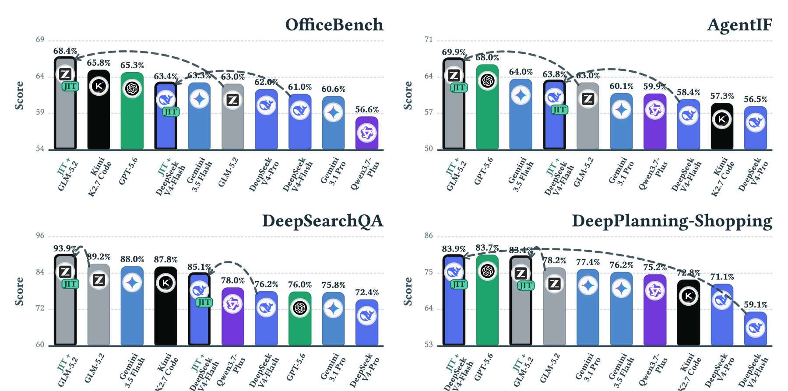
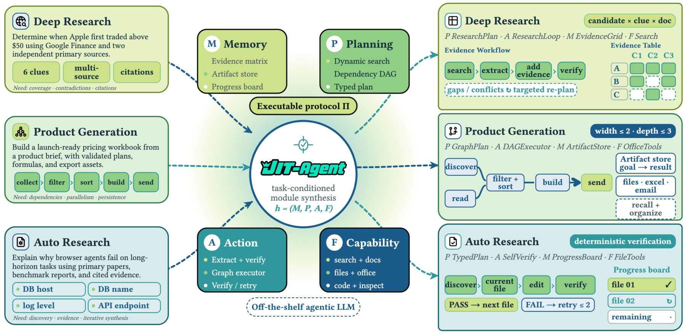

> **论文**：JIT-Agent: Scaling Harness Intelligence via Just-in-Time Harness Evolution
> **作者**：Guibin Zhang、Leo Lu、Fangzhou Xie（核心贡献者）等；通讯作者 Wangchunshu Zhou、Shuicheng Yan（新加坡国立大学 NUS 系）
> **arXiv ID**：2608.25593（cs.CL）
> **发表时间**：2026-08-26
> **代码仓库**：https://github.com/bingreeky/JIT（模型权重：https://huggingface.co/JIT-Agent，JIT-Agent/jit-27b）

## 第 1 章 概述

### 1.1 一句话定位

JIT-Agent 是首个专门为"即时（just-in-time, JIT）harness 生成"而训练的 harness intelligence 模型：给定任意现成（off-the-shelf）agentic LLM 与一个新任务，它在推理时现场合成任务自适应的 agent harness（记忆管理、规划策略、动作协议、工具/技能编排），并通过三阶段训练管线让这种合成能力本身可学习、可修复、可持续自演化——从而把"agent 能力由 harness 主导"这一现象从手工工程转化为一个可缩放的模型能力维度。

*图1：JIT-Agent 在四个代表性 benchmark 上的排行榜表现：配合 GLM-5.2 与 DeepSeek-V4-Flash 两个执行模型，JIT 生成的 harness 相对前沿闭源模型（GPT-5.6、Gemini 3.1 Pro、Gemini 3.5 Flash 等）取得整体领先。*

#### 论文图表总览

| 图表 | 内容 | 所在章节 |
|------|------|----------|
| Figure 1 | 四个代表 benchmark 的 JIT-Agent 排行榜（本文第 1 章引用） | 论文 §1（本报告第 1 章） |
| Figure 2 | 方法总览：四模块（memory/planning/action/capability）harness 合成 | 论文 §3（本报告第 3 章） |
| Table 1 | AOT vs JIT 方法特性对比（实例合成 / harness 模型 / 学习修复 / 在线演进） | 论文 §2（本报告第 2 章） |
| Table 2 | 13 种 scaffold 的模块配置清单（HarnessFactory 种子库 K0=13） | 论文 §3（本报告第 3 章） |
| Table 3 | 9 个 benchmark 主结果（0-100 分制，10 模型 × 9 指标） | 论文 §6.2（本报告第 5 章） |
| Table 4 | harness 受控对比（性能 / token / 成本，6 设置） | 论文 §6.3（本报告第 5 章） |

### 1.2 核心贡献

1. **Harness Intelligence 概念与 Model-as-a-Harness 范式**：将 agent harness 形式化为一个由固定四模块协议（memory、planning、action、capability）约束的可组合、机器可生成的工件，并提出用训练好的 meta-agent 在推理时按任务现场生成 harness；该能力维度正交于模型规模缩放（model scaling）。
2. **JIT-Agent-27B 与三阶段训练管线**：基于 Qwen3.6-27B 训练的 meta 模型——Stage I 任务条件定制（教师示例 SFT + 参考锚定偏好优化）、Stage II 有界修复（失败生成转为修复监督，K*≤2 轮）、Stage III Evo-GDPO（进化式组解耦策略优化，实现 test-time harness 演进）。
3. **系统实验验证**：9 个 benchmark（4 类任务）× 多 backbone（GLM-5.2、DeepSeek-V4-Flash 为主，Qwen3.6、Mimo-V2.5 泛化），18 对同 backbone 匹配对比全部提升；与 OpenCode、Claude Code 等成熟 harness 运行时竞争且 token/成本最低。

### 1.3 关键结果速览

全部 benchmark 采用 0-100 分制（越高越好）。

| 维度 | 结果 |
|------|------|
| 主结果（Table 3） | JIT 系统在 9 列中 8 列最优；JIT+GLM-5.2 七项第一：DSQA 93.9、AgentIF 69.9、PinchBench 93.3 等；JIT+DS-V4-Flash 领跑 Shopping 83.9 |
| 平均提升 | GLM-5.2 九项均值 74.1→81.8（+7.7）；DeepSeek-V4-Flash 66.7→75.5（+8.8） |
| 最大单项增益 | DS-V4-Flash DeepPlanning-Shopping +24.8（59.1→83.9）；GLM-5.2 DeepPlanning-Travel +20.2（62.8→83.0） |
| 对闭源前沿 | DS-V4-Flash + JIT-Agent 在 DeepSearchQA 上超 GPT-5.6 +9.1、OdysseyBench +4.3；GLM-5.2 最高 +20.2 分 |
| 成本效率（Table 4） | 6 个 harness 受控设置中 token 与成本全部最低；相比各设置最便宜的固定 harness 每例成本降 14.9%–54.1%，平均降 36.0% |
| 跨模型对泛化 | 6 backbone × 3 模型对 × 4 benchmark 共 24 对匹配对比全部胜过 ReAct，平均 +7.6 |
| 唯一例外 | Travel 列未被 JIT 领跑：GLM-5.2+JIT 83.0，距 GPT-5.6（84.9）差 1.9 |

## 第 2 章 研究背景与动机

### 2.1 Harness 决定 Agent 能力

论文的核心出发点是：agent 的能力并非仅由底层模型决定。agent harness——包括 memory 管理、planning 策略、action 协议、工具/技能编排——可以主导（dominate）底层 foundation model 的贡献。同样的 backbone 在不同 harness 下表现差异巨大；反之，一个精心设计的 harness 可以让较弱的执行模型超过更强的裸模型。既然 harness 的影响如此之大，harness 设计本身就应该成为一等公民的研究对象，而不是每个任务手工调一次的工程脚手架。然而现实中的 harness 设计仍然是手工的、任务特定的、根本不可缩放的。

### 2.2 AOT 假设与局限

现有方法大多隐含或显式采用 **AOT（ahead-of-time）假设**：harness 是一个预先优化好的耐久工件（durable artifact），先离线搜索/设计，再部署复用。论文在 Table 1 中按此维度梳理了相关工作：

| 方法 | 范式 | 实例合成 | harness 模型 | 学习修复 | 在线演进 |
|------|------|----------|--------------|----------|----------|
| AutoHarness / Meta-Harness / AHE | AOT（search） | ✗ | ✗ | ✗ | ✗ |
| Adaptive AH / TTHE / RHI | AOT（test-time editing） | ✗ | ✗ | ✗ | ✓ |
| Harness-R1 | AOT（test-time editing） | ✗ | ✓ | ✓ | ✓ |
| **JIT-Agent（本文）** | **JIT** | ✓ | ✓ | ✓ | ✓ |

AOT 的局限在于：离线优化出的 harness 与推理时遇到的真实任务分布存在错配，面对新任务域、新工具集、新执行模型时缺乏自适应能力；即使部分方法支持 test-time editing，也只是对既有工件的修补，而不是按任务实例从头合成。相关工作还包括 harness 工程的模块化（HarnessX、Code-as-Agent-Harness 等）与 harness 优化的 diagnose–propose–validate 闭环，但它们都没有把"harness 生成"本身建模为一个可训练的模型能力。

### 2.3 JIT 视角

论文提出从软件工程借用的对照视角：正如 JIT 编译相对 AOT 编译把优化推迟到运行时并利用运行时信息，**JIT harness 生成**把 harness 的构造推迟到推理时刻、条件于具体任务实例（任务描述、执行模型、可用工具集）。由此 harness 从"预先优化的耐久工件"变为"按需合成的一次性/可演进产物"，harness intelligence 成为与 model intelligence 正交、可独立训练与缩放的能力维度。JIT-Agent 是第一个专门为该范式构建的模型：输入任务上下文，输出一个满足四模块协议、可直接执行的完整 harness。

### 2.4 三大挑战

把 JIT harness 生成做成一个可靠的学习系统，必须同时解决三个挑战，它们分别对应训练管线的三个阶段：

1. **Adaptivity（自适应性）**：生成的 harness 必须匹配任务实例的特征（搜索型、规划型、办公型等），而非泛泛的通用 scaffold → 对应 Stage I 任务条件定制。
2. **Reliability（可靠性）**：生成的 harness 可能违反协议、无法执行或运行不稳定，需要可控的修复机制而非推倒重来 → 对应 Stage II 有界修复。
3. **Evolvability（可演化性）**：harness 生成策略应能从持续累积的执行反馈中改进，实现 test-time 的自我演进 → 对应 Stage III Evo-GDPO 与流式推理中的档案更新。

### 2.5 前作：MemEvolve 与 TodoEvolve

作者团队的前作分别处理了 harness 的单个模块：**MemEvolve** 针对 memory 模块，**TodoEvolve** 针对 planning 模块。JIT-Agent 将这一思路从单模块推广到完整四模块 harness 的统一生成与训练，是"harness 进化"研究线从局部模块走向整体协议的延伸。

## 第 3 章 四模块协议与 HarnessFactory

### 3.1 模块化设计空间

论文将统一的 harness 设计空间组织为嵌套的集合层级：

$$\mathcal{G} \supseteq \mathcal{H}^{\mathrm{syn}} \supseteq \mathcal{H}_{\Pi} \supseteq \mathcal{H}_{\Pi}^{\mathrm{exec}}$$

其中 𝒢 为全局设计空间，ℋ^syn 为可合成（machine-generatable）子空间，ℋ_Π 为满足四模块协议 Π 的子空间，ℋ^exec_Π 为其中可实际执行的子空间。训练目标是让模型把概率质量集中到 ℋ^exec_Π 上。

一次 agent rollout 定义为（公式 1）：

$$\xi \sim \mathrm{Rollout}(\tau, \pi_\psi, h, \mathcal{C}_\tau; \Pi) = (s_1, e_1, o_1, \ldots, s_T, e_T, o_T)$$

其中 τ 为任务，π_ψ 为执行模型（任意现成 agentic LLM），h 为 harness，𝒞_τ 为任务可用的工具/技能注册表。

一个 harness 是四元组（公式 2）：

$$h = (M, P, A, F) \in \mathfrak{M} \times \mathfrak{P} \times \mathfrak{A} \times \mathfrak{F}$$

四个模块之间存在固定的运行时依赖序 **M→P→F→A**：memory 先把历史压缩成视图，planning 基于视图产出局部指令，capability 按指令编排可用工具，action 最后执行。具体地：

**Memory M**：将轨迹历史映射为工作视图（公式 3）：

$$v_t = M(\xi_{<t}, s_t) \in \mathcal{V}$$

**Planning P**：基于任务、状态与视图生成本步局部指令（公式 4）：

$$d_t = P(\tau, s_t, v_t) \in \mathcal{D}_{\mathrm{dir}}$$

**Capability F**：指令条件化的能力编排，从注册表中筛出本步可用子集（公式 5）：

$$\mathcal{C}_t = F(\mathcal{C}_\tau, s_t, v_t, d_t) \subseteq \mathcal{C}_\tau$$

**Action A**：在编排后的能力下产出下一状态与动作（公式 6）：

$$(s_{t+1}, e_t) = A(s_t, \tau, v_t, d_t, \mathcal{C}_t) \in \mathcal{S} \times \mathcal{A}$$

**执行**：动作若属于可执行空间 𝒰 则由环境执行产生观测，否则记为失败 ⊥，并拼接进轨迹（公式 7）：

$$o_t = \mathrm{Exec}(e_t; \mathcal{C}_t) \ \text{if}\ e_t \in \mathcal{U},\ \text{else}\ \bot; \qquad \xi_{\le t} = \xi_{<t} \oplus (s_t, e_t, o_t)$$

#### 经典 agent 的模块实例化

| Agent | Memory M | Planning P | Action A | Capability F |
|-------|----------|------------|----------|--------------|
| ReAct | M_full（全历史） | P_∅（无规划器） | A_react | F_all（全注册表） |
| Codex / OpenCode | M_compact（紧凑历史） | P_todo（todo 列表） | A_react | F_all |
| 递归 agent（ROMA 类） | M_subproblem（子问题上下文） | P_decomp（分解） | A_rec（递归执行） | F_route（按子代理路由） |

*图2：JIT-Agent 方法总览：meta 模型以任务上下文为条件，现场合成由 memory、planning、action、capability 四模块组成的完整 harness，交由任意执行模型运行。*

### 3.2 HarnessFactory：13 种 scaffold 种子库

**HarnessFactory** 是论文构建的统一 harness 代码库与种子库 ℬ_0，包含 K0=13 种代表性 scaffold 设计，作为 Stage I 教师示例与候选采样的来源（Table 2）。每个 scaffold 都按四模块协议归一化表述：

| # | Scaffold | 模块配置要点（按 M / P / A / F） |
|---|----------|----------------------------------|
| 1 | ReAct | FullHistory memory / 无规划器 / ReAct / 全注册表 |
| 2 | Plan-and-Execute | FullHistory / 线性路线图规划 |
| 3 | ReSum | ReSum memory |
| 4 | Flash-Searcher | FullHistory / DAG 规划 |
| 5 | GAM | GAM retrieval memory / DAG 规划 |
| 6 | MemoBrain | 推理图 memory / 标记引导执行 |
| 7 | AggAgent | 隔离 rollout 历史 / 多 rollout 聚合 |
| 8 | OAgent | 协调器历史 / 集成投票 |
| 9 | AgentFold | AgentFold memory / DAG / ReActFold 动作 |
| 10 | HiAgent | 分层 memory |
| 11 | DeepAgent | 三层 memory / 标记引导执行 / 工具搜索 |
| 12 | ROMA | 上下文隔离 / Atomizer + DAG 规划 / 递归执行 |
| 13 | AOrchestra | 上下文隔离 / Atomizer + DAG / 递归执行 / 代理委派 |

这些 scaffold 覆盖了从单 agent 循环到多 rollout 聚合、再到递归子代理委派的宽谱设计，为 JIT 生成提供了结构多样的参照点；meta 模型并不从中硬选一个，而是以任务上下文为条件生成可偏离种子结构的新配置。（GitHub README 中 HarnessFactory 写为 11 个设计，论文正文以 K0=13 为准。）

## 第 4 章 三阶段训练管线

### 4.0 统一目标

三个阶段共同优化同一个 harness intelligence 目标（公式 8）：

$$\theta^* = \arg\max_\theta\ \mathbb{E}_{\tau \sim \mathcal{D}_{\mathrm{task}},\ \pi_\psi \sim \mathcal{M},\ h \sim p_\theta(\cdot \mid c_\tau)}\left[\mathcal{U}(\tau, \pi_\psi, h)\right]$$

其中效用 𝒰 综合三项：任务奖励、延迟与成本。偏好信号与 Evo-GDPO 的优势通道均按此三维度构造。以下分阶段展开；训练超参数（如组大小 G、β_pref、λ_evo 的具体取值）论文未给出，本报告不作臆测。

### 4.1 Stage I：任务条件定制（公式 9–13）

Stage I 让模型学会"为新任务生成合适的 harness"。对每个任务采样三个候选示例并获取教师 harness（公式 9）：

$$\mathcal{E}_\tau = \{h^{(1)}, h^{(2)}, h^{(3)}\} \sim \mathrm{Sample}_3(\mathcal{B}_0^{(d(\tau))}); \qquad h_{\mathrm{teach}} \sim q_\varphi(\cdot \mid c_\tau)$$

只保留通过协议有效性校验的样本构成 Stage I 数据集（公式 10）：

$$\mathcal{D}_I = \{(\tau, \pi_\psi, \mathcal{C}_\tau, \mathcal{E}_\tau, h_{\mathrm{teach}}) \mid \mathrm{Valid}_\Pi(h_{\mathrm{teach}}) = 1\}$$

生成目标为教师生成 token 的标准 SFT 交叉熵（公式 11）：

$$\mathcal{L}_I^{\mathrm{gen}} = -\mathbb{E}_{\mathcal{D}_I}\left[\sum_{j} \log p_\theta\!\left(h_{\mathrm{teach},j} \mid c_\tau, h_{\mathrm{teach},<j}\right)\right]$$

偏好对由严格的三维 Pareto 规则构造（公式 12）：偏好对必须奖励更高且延迟、成本均不更差，并至少在一项辅助维度严格更优；偏好强度由各维度的松弛量加权构成：

$$h^+ \succ_\tau h^- \iff r^+ > r^- \ \wedge\ \ell^+ \le \ell^- \ \wedge\ \kappa^+ \le \kappa^- \ \wedge\ (\ell^+ < \ell^- \ \vee\ \kappa^+ < \kappa^-)$$

$$\Delta_{\mathrm{val}} = \alpha_r (r^+ - r^-) + \alpha_\ell [\ell^- - \ell^+]_+ + \alpha_\kappa [\kappa^- - \kappa^+]_+$$

偏好损失为参考锚定形式（公式 13）：以冻结的 SFT checkpoint 为参考分布 p_ref，长度归一化 log 似然，β_pref 控制锐度；最终 Stage I 损失为两项加权和：

$$\mathcal{L}_I^{\mathrm{pref}} = -\mathbb{E}\left[\sigma\!\left(\beta_{\mathrm{pref}}\left(\log\tfrac{p_\theta(h^+ \mid c_\tau)}{p_{\mathrm{ref}}(h^+ \mid c_\tau)} - \log\tfrac{p_\theta(h^- \mid c_\tau)}{p_{\mathrm{ref}}(h^- \mid c_\tau)}\right)\right)\right]$$

$$\mathcal{L}_I = \mathcal{L}_I^{\mathrm{gen}} + \lambda_{\mathrm{pref}} \cdot \mathcal{L}_I^{\mathrm{pref}}$$

### 4.2 Stage II：有界修复（公式 14–18）

Stage II 解决可靠性问题：把 Stage I 中无法通过协议/执行校验的失败生成转化为修复监督。失败样本集定义为（公式 14）：

$$\mathcal{D}_I^{\mathrm{fail}} = \{(\tau, \pi_\psi, \mathcal{C}_\tau, \mathcal{E}_\tau, \tilde{h}^{(0)}, g^{(0)}) \mid \tilde{h}^{(0)} \notin \mathcal{H}_{\Pi}^{\mathrm{exec}}\}$$

其中 g^(0) 为失败诊断信息。修复以 patch 序列形式进行（公式 15）：每轮在 patch 空间 𝒫 中取一个增量修改并应用到当前 harness：

$$\tilde{h}^{(k+1)} = \mathrm{Apply}(\tilde{h}^{(k)}, \Delta^{(k+1)}), \qquad \Delta \in \mathcal{P}$$

修复轮数有界（公式 16）——最多 2 轮，避免开放式修补：

$$K^* = \min\{k \in \{1, 2\} : \mathrm{Valid}_\Pi(\tilde{h}^{(k)}) = 1\}$$

修复轨迹（初始失败 harness、逐轮诊断与最优 patch）构成 Stage II 数据集（公式 17）：

$$\mathcal{D}_{II} = \{(\tau, \pi_\psi, \mathcal{C}_\tau, \mathcal{E}_\tau, \mathcal{R}_{K^*})\}, \qquad \mathcal{R}_{K^*} = \{(\tilde{h}^{(j)}, g^{(j)}, \Delta^{*(j+1)})\}_{j=0}^{K^*-1}$$

训练目标为条件于修复历史的 SFT（公式 18）：

$$\mathcal{L}_{II} = -\mathbb{E}_{\mathcal{D}_{II}}\left[\sum_{j}\log p_\theta\!\left(\Delta^{*(j+1)}_j \mid c_\tau, \tilde{h}^{(j)}, g^{(j)}, \Delta^{*(j+1)}_{<j}\right)\right]$$

即模型学会在看到失败 harness 与诊断后，一步产出正确 patch，且最多堆叠两轮。

### 4.3 Stage III：Evo-GDPO 进化式策略优化（公式 19–22）

Stage III 用强化学习直接对真实执行信号优化生成策略，实现 test-time harness 演进。对每个任务上下文从旧策略独立采样 G>1 个 harness 构成一组（公式 19）：

$$h_i \overset{\mathrm{i.i.d.}}{\sim} p_{\theta_{\mathrm{old}}}(\cdot \mid c_{\tau,n}), \qquad i = 1, \ldots, G$$

组内每个候选按三通道计算优势原材料（公式 20）：奖励通道带演化塑形项（相对组基线 b_r 的超额奖励），延迟与成本通道仅在奖励达标时才给效率激励：

$$R_i^{\mathrm{rew}} = r_i + \lambda_{\mathrm{evo}} [r_i - b_r]_+; \qquad R_i^{\mathrm{lat}} = \mathbb{I}[r_i \ge b_r]\,[b_\ell - \bar{\ell}_i]_+; \qquad R_i^{\mathrm{cost}} = \mathbb{I}[r_i \ge b_r]\,[b_\kappa - \bar{\kappa}_i]_+$$

三通道分别组内标准化后加权聚合（公式 21）：奖励权重必须严格大于延迟与成本权重之和，保证质量优先于效率；聚合后再做批次归一化：

$$A_i^m = \frac{R_i^m - \mathrm{mean}}{\mathrm{std} + \varepsilon_{\mathrm{num}}}, \quad m \in \{\mathrm{rew}, \mathrm{lat}, \mathrm{cost}\}; \qquad A_i^\Sigma = w_{\mathrm{rew}} A_i^{\mathrm{rew}} + w_{\mathrm{lat}} A_i^{\mathrm{lat}} + w_{\mathrm{cost}} A_i^{\mathrm{cost}}, \quad w_{\mathrm{rew}} > w_{\mathrm{lat}} + w_{\mathrm{cost}}$$

$$\hat{A}_i^\Sigma = \mathrm{BatchNorm}\!\left(A_i^\Sigma\right)$$

最终损失为 PPO 风格的 clip 目标（公式 22）：重要性比 ρ_{i,j} 做 ratio clipping，聚合优势 Â^Σ 作为信号，按 |h_i| 做 token 长度归一，并加 KL 正则锚定参考策略：

$$\mathcal{L}_{III}^{\mathrm{Evo\text{-}GDPO}} = -\mathbb{E}\left[\frac{1}{|h_i|}\sum_{j}\min\!\left(\rho_{i,j}\,\hat{A}_i^\Sigma,\ \mathrm{clip}(\rho_{i,j}, 1-\epsilon, 1+\epsilon)\,\hat{A}_i^\Sigma\right)\right] + \beta_{\mathrm{KL}}\,\mathbb{E}\left[\mathrm{KL}(p_\theta \,\|\, p_{\mathrm{ref}})\right]$$

组解耦（group-decoupled）的含义在于：优势只由同组内比较得出，任务间的难度差异被自动消去，跨任务档案带来的偏置不会污染单任务的相对信号。

### 4.4 档案保守更新规则

流式推理下，harness 档案 ℬ 会随任务流不断扩张，但更新是保守的：**仅当候选 harness 在前沿维度（奖励 / 延迟 / 成本）上严格改进时才被保留进档案**。该规则与公式 12 的 Pareto 偏好规则同构，保证档案只增质量、不增冗余，为后续任务的检索提供单调变优的经验池；具体档案更新与流式推理循环的公式化表述见 4.5 节。
## 第 5 章 实验结果与分析

### 5.1 推理架构（静态与流式）

论文将训练好的 JIT-Agent 部署为两种推理模式，区别在于任务结束后经验是否被保留以支持后续任务：

**静态推理**：JIT-Agent 并行生成 N 个 harness、从中选择 1 个、只执行被选中的那一个。这是轻量形式的测试时扩展：增加候选多样性而不增加环境 rollout 次数；选中的 harness 仍走相同的校验与有界修复流程。

**流式推理**：跨任务序列携带有用经验。对第 n 个任务 τ_n，JIT-Agent 从当前档案 ℬ_n 检索参考（公式 23）：

$$\xi_n \sim \mathrm{Rollout}(\tau_n, \pi_\psi, h_n^\dagger, \mathcal{C}_{\tau_n}; \Pi), \qquad \mathbf{m}_n = \mathrm{Eval}(\xi_n), \qquad \mathcal{B}_{n+1} = \mathrm{Update}_{III}(\mathcal{B}_n; \tau_n, h_n^\dagger, \mathbf{m}_n)$$

其中 $\mathbf{m}_n = (r_n, \bar{\ell}_n, \bar{\kappa}_n)$ 为奖励、平均延迟与平均成本；$\mathcal{E}_{\tau_{n+1},n+1} = \mathrm{Retrieve}(\tau_{n+1}; \mathcal{B}_{n+1})$ 为下一任务的参考检索。按 Stage III 的保留规则，当完成的 harness 无合格改进时 ℬ_n 保持不变；否则保留为后续任务的参考。流式推理通过演进中的 harness 档案跨任务传递经验，不向当前 rollout 注入环境反馈、也不更新模型参数。

### 5.2 实验设置

**评估基准（9 个，分 4 类任务）**：

- **Deep Research（深度研究）**：BrowseComp-Plus（BC+，准确率）、DeepSearchQA（DSQA，答案 F1）、xBench-DeepSearch（xBench-DS，准确率）
- **Daily Work（日常办公）**：AgentIF-Oneday（AgentIF，归一化加权评分）、PinchBench（平均分）
- **Planning（规划）**：DeepPlanning-Shopping（Shop，购物车匹配率）、DeepPlanning-Travel（Travel，组合约束分）
- **Workspace（工作区）**：OfficeBench（Office，任务成功率）、OdysseyBench（Odyssey，任务成功率）

所有指标统一为 0–100 分制，越高越好。

**Backbone 模型**：JIT-Agent 基于 Qwen3.6-27B 训练；主要实例化为 GLM-5.2（Z.ai 的强开源长程模型）与 DeepSeek-V4-Flash-Preview（推理效率优先）；泛化测试另用 Qwen3.6、Mimo-V2.5 系列。

**基线两组**：
1. 端到端对比组：vanilla Qwen3.7-Plus、GLM-5.2、DeepSeek-V4-Flash/Pro（均为 preview 版）、Kimi K2.7 Code、GPT-5.6、Gemini 3.1 Pro / 3.5 Flash；
2. 固定 harness 组（固定 backbone 只换 harness）：Claude Code、Codex、OpenCode、Hermes、NanoBot——用于隔离 harness 设计与模型权重各自的贡献。

### 5.3 主结果：JIT 生成的 harness 在 9 列中 8 列最优

Table 3 对比了 JIT 生成 harness 与 vanilla backbone 及前沿模型的端到端表现：

| 模型 | BC+ | DSQA | xBench | AgentIF | PinchBench | Shop | Travel | Office | Odyssey |
|------|:---:|:---:|:---:|:---:|:---:|:---:|:---:|:---:|:---:|
| Qwen3.7-Plus | 70.5 | 78.0 | 75.0 | 59.9 | 80.5 | 75.2 | 52.1 | 56.6 | 67.7 |
| GLM-5.2 | 72.0 | 89.2 | 76.0 | 63.0 | 87.0 | 78.2 | 62.8 | 63.0 | 75.3 |
| DeepSeek-V4-Flash | 68.1 | 76.2 | 70.1 | 58.4 | 81.7 | 59.1 | 54.8 | 61.0 | 71.0 |
| DeepSeek-V4-Pro | 71.4 | 72.4 | 79.0 | 56.5 | 61.1 | 71.1 | 55.2 | 62.0 | 72.0 |
| Kimi K2.7 Code | 73.6 | 87.8 | 79.0 | 57.3 | 76.1 | 72.8 | 56.9 | 65.8 | 69.9 |
| GPT-5.6 | 76.9 | 76.0 | 81.0 | 68.0 | 84.2 | 83.7 | 84.9 | 65.3 | 68.7 |
| Gemini 3.1 Pro | 67.5 | 75.8 | 83.0 | 60.1 | 81.0 | 77.4 | 70.7 | 60.6 | 74.0 |
| Gemini 3.5 Flash | 75.0 | 88.0 | 85.0 | 64.0 | 74.2 | 76.2 | 50.3 | 63.3 | 78.0 |
| **JIT-Agent + GLM-5.2** | **78.0** | **93.9** | **88.0** | **69.9** | **93.3** | 83.4 | 83.0 | **68.4** | **78.7** |
| **JIT-Agent + DeepSeek-V4-Flash** | 74.0 | 85.1 | 82.0 | 63.8 | 92.9 | **83.9** | 61.3 | 63.4 | 73.0 |

**同 backbone 一致增益**：18 对直接匹配的 backbone–benchmark 对比中，JIT harness 全部优于默认 scaffold。GLM-5.2 九项均值从 74.1 升至 81.8（+7.7 分）；DeepSeek-V4-Flash 从 66.7 升至 75.5（+8.8 分）。最大增益出现在需要持续状态管理与约束跟踪的任务上：DeepSeek-V4-Flash 在 DeepPlanning-Shopping 提升 24.8 分（59.1→83.9），GLM-5.2 在 DeepPlanning-Travel 提升 20.2 分（62.8→83.0）；搜索与开放式交互也有显著提升，如 DeepSeek-V4-Flash 的 xBench-DS +11.9、DeepSearchQA +8.9。这说明 harness 适配改变的不只是 prompt 风格，而是 backbone 对上下文分配、长程目标分解与外部动作协调的方式。

**与前沿模型竞争**：JIT 系统在 9 个 benchmark 列中 8 列取得最优，且全部使用开源 backbone。JIT-Agent + GLM-5.2 在 7 个基准上排名第一（DeepSearchQA 93.9、AgentIF 69.9、PinchBench 93.3）；JIT-Agent + DeepSeek-V4-Flash 领跑 DeepPlanning-Shopping（83.9），并在每一个 benchmark 上超过更强的 DeepSeek-V4-Pro，平均领先 8.7 分。DeepPlanning-Travel 是唯一未被 JIT 系统领跑的列：GLM-5.2 + JIT 达 83.0，距 GPT-5.6 的 84.9 仅差 1.9 分。总体而言，改进操作脚手架可以回收相当一部分原本需要 backbone 缩放才能获得的能力。

### 5.4 与成熟 agent harness 的受控对比

固定 backbone 只改变 harness（DeepSeek-V4-Flash 与 Qwen3.6-Flash），在 DeepSearchQA、xBench-DS、AgentIF 三个基准上同时报告性能、每例平均 token 消耗与 API 成本，以区分「有效编排」与「单纯多花推理算力」：

| Backbone | Harness | DSQA Perf↑ | Tokens (K) | Cost↓ | xBench Perf↑ | Tokens (K) | Cost↓ | AgentIF Perf↑ | Tokens (K) | Cost↓ |
|----------|---------|:---:|:---:|:---:|:---:|:---:|:---:|:---:|:---:|:---:|
| DeepSeek-V4-Flash | Claude Code | 79.6 | 625 | $0.088 | 75.0 | 559 | $0.079 | 66.9 | 808 | $0.114 |
| | Codex | 77.8 | 760 | $0.107 | 70.0 | 680 | $0.096 | 58.5 | 870 | $0.123 |
| | OpenCode | 75.9 | 1,832 | $0.258 | 65.0 | 1,157 | $0.159 | 48.1 | 950 | $0.135 |
| | Hermes | 69.9 | 1,157 | $0.163 | 72.0 | 1,254 | $0.177 | 60.3 | 1,000 | $0.142 |
| | NanoBot | 80.4 | 924 | $0.131 | 78.0 | 527 | $0.075 | 53.1 | 1,034 | $0.147 |
| | **JIT-Agent** | **85.1** | **400** | **$0.066** | **82.0** | **212** | **$0.039** | 63.8 | **476** | **$0.097** |
| Qwen3.6-Flash | Claude Code | 72.8 | 710 | $0.140 | 58.0 | 650 | $0.128 | 55.4 | 900 | $0.177 |
| | Codex | 68.5 | 980 | $0.193 | 52.0 | 874 | $0.172 | 34.2 | 839 | $0.170 |
| | OpenCode | 64.1 | 1,968 | $0.384 | 44.0 | 1,300 | $0.256 | 38.7 | 961 | $0.217 |
| | Hermes | 60.8 | 1,319 | $0.256 | 36.0 | 1,155 | $0.227 | 49.7 | 1,184 | $0.223 |
| | NanoBot | 74.2 | 892 | $0.197 | 63.0 | 597 | $0.119 | 43.5 | 950 | $0.187 |
| | **JIT-Agent** | 70.3 | **464** | **$0.095** | **70.0** | **300** | **$0.069** | **58.3** | **394** | **$0.078** |

**性能**：JIT-Agent 在 6 个 backbone–benchmark 设置中 4 个取得最高性能。DeepSeek-V4-Flash 上，DSQA 较最强固定 harness（NanoBot）高 4.7 分（85.1 vs 80.4），xBench-DS 高 4.0 分（82.0 vs 78.0）；Qwen3.6-Flash 上 xBench-DS +7.0 分（70.0 vs 63.0）、AgentIF +2.9 分（58.3 vs 55.4）。两处例外呈现有界的质量–效率权衡：DeepSeek-V4-Flash 的 AgentIF 落后 Claude Code 3.1 分，Qwen3.6-Flash 的 DSQA 落后 NanoBot 3.9 分，且两者 token 消耗都明显更少。没有哪个固定 harness 能跨任务通吃——例如 NanoBot 在 Qwen3.6-Flash 的 DSQA 上最强，但在 AgentIF 上落后 JIT-Agent 14.8 分。这种差异正是需要按任务生成 harness 而非全局选定一个耐用脚手架的理由。

**token 与成本效率**：JIT-Agent 在全部 6 个设置中 token 消耗与 API 成本均最低。相比每个设置中最便宜的固定 harness，每例成本降低 14.9%–54.1%，平均降低 36.0%。DeepSeek-V4-Flash 的 xBench-DS 上，token 从 527K 降至 212K，成本从 $0.075 降至 $0.039，同时性能从 78.0 提升至 82.0。最大的成本降幅出现在 Qwen3.6-Flash 的 AgentIF：JIT 仅用 394K tokens、$0.078，固定 harness 至少 839K tokens、$0.170，且最优分数从 55.4 提升到 58.3。因此增益并非来自更长的轨迹——生成的 harness 通常以更短、更有选择性的执行取得更强结果。

### 5.5 成本–性能 Pareto 前沿

Figure 4 展示了受控对比在 DeepSearchQA 与 AgentIF 上的成本–性能几何。每个点是 backbone–harness 组合，越靠近左上角越优：

- **DeepSearchQA**：DeepSeek-V4-Flash + JIT-Agent 是评估组合中的强 Pareto 最优点（85.1 分 @ 每例 $0.066）。相对最强固定 harness NanoBot，+4.7 分且成本降 49.6%（$0.131→$0.066）。Qwen3.6-Flash 上 JIT 提供低算力运行点：70.3 分 @ $0.095，对比 NanoBot 的 74.2 分 @ $0.197，以 3.9 分代价节省 51.8% 成本。
- **AgentIF**：前沿结构互补。DeepSeek-V4-Flash 上 JIT 相对 Claude Code 成本降 14.9%（$0.097 vs $0.114），性能仅差 3.1 分（63.8 vs 66.9），两者都位于前沿上。Qwen3.6-Flash 上 JIT 严格支配所有固定 harness：最优分数从 55.4 提升至 58.3，同时最低成本从 $0.170 降至 $0.078。

前沿随任务而变，但 JIT 点的持续左移说明任务自适应 harness 改善的是推理效率，而非用更长轨迹换取准确率。

### 5.6 跨模型对的泛化

为检验 JIT harness 生成是否跨模型族与变体迁移，论文评估了 6 个 backbone（3 个模型对：DeepSeek-V4-Flash/Pro、Qwen3.6-Flash/Plus、Mimo-V2.5-Flash/Pro），在 DeepSearchQA、AgentIF-Oneday、DeepPlanning-Shopping、OfficeBench 四个基准上固定模型、对比标准 ReAct harness 与 JIT 生成 harness（Figure 5）。

24 对直接匹配的 backbone–benchmark 对比中，JIT harness 全部胜过 ReAct，平均增益 7.6 分。每个模型族及族内两个变体都成立：DeepSeek V4 平均 +10.2 分、Qwen 3.6 +4.0 分、Mimo 2.5 +8.6 分。DeepSearchQA 平均增益最大（+15.2 分），包括 Mimo-V2.5-Pro +22.2、DeepSeek-V4-Flash +19.0；DeepPlanning-Shopping 平均 +7.5 分，包括 DeepSeek-V4-Flash 的 +24.8。同 backbone 内的一致增益说明 harness 智能跨模型族与变体迁移，而非针对特定 backbone 的补偿。

### 5.7 测试时 harness 演进

JIT-Agent 不仅一次性生成 harness，还从执行反馈中改进其档案（archive）。论文对比 Static JIT（各次生成相互独立）与 Streaming JIT（跨任务检索并更新 harness 档案）：

Streaming JIT 在 DeepPlanning-Shopping、DeepPlanning-Travel、OfficeBench 上均高于 Static 变体。三个流上，累计准确率优势随执行反馈积累而出现，并保持为正直到评估结束；伴随的成本与工具调用轨迹显示，端点的增益并未统一耦合到更大的交互预算。这一模式与 Evo-GDPO 的目标一致——只有当 harness 推进档案前沿时才保留。

### 5.8 生成 harness 的可视化

Figure 7/8 展示了同一四模块协议下、面向计算结构迥异任务的两个生成 harness：

- **Palimpsest（工件生产 → 依赖图）**：跨应用任务——发现联系人卡片、排除一人、归一化排序剩余记录、创建工作簿并邮件交付。JIT-Agent 将需求编译为显式 DAG：发现与 schema 检查是过滤的前置条件，工作簿构建等待归一化记录，交付等待工件验证。GraphPlanAction 以有界宽度/深度执行就绪节点，GraphPlanMemory 索引中间目标、证据与工件，下游节点消费已完成结果而非从 transcript 重建。
- **Trapdoor（深度研究 → 有界递归委派）**：多跳身份问题（线索横跨历史引文、大学合并、回忆录、研究论文）。固定 DAG 会过早承诺不确定的证据路径，因此生成的 harness 用 DynamicDecomposer 形成并修正子问题，并为研究工具策略增加合成委派能力：委派调用打开私有研究子 agent（自有 memory、研究专用工具、五步预算），返回答案作为普通 observation 回到父循环；FactGraphMemory 从增长的历史中提取紧凑键值事实，父循环无需继承每个子 agent 轨迹即可跨分支整合证据。

核心定性结论：同一个生成器，把一个任务映射为「带工件存储的图执行」，把另一个映射为「带事实存储的递归编排」。共享协议约束的是接口而非行为。附录 A 还给出 8 个额外案例（Origami、Turnstile、Gearbox、Pegboard、Appraiser、Abacus、Player Piano、Mulligan），覆盖层次化上下文折叠、完成门控工具访问、相位条件执行、证据矩阵搜索、选择性上下文渲染、类型化计算状态、确定性逐文件验证与局部动作修复。

## 第 6 章 代码实现详解

### 6.1 仓库结构

官方代码仓库 https://github.com/bingreeky/JIT（已通过 README 验证归属：引用 arXiv 2608.25593 与论文标题一致），主要目录：

| 目录 | 内容 |
|------|------|
| `jit/` | meta-agent 本体：harness 生成/修复 prompts、best-of-N 选择 |
| `scripts/` | agent kernel、工具、模型、评估引擎与两个 runner（`run_seed_harness` / `run_jit`） |
| `harness_factory/` | 手写 harness 实现与其设计文档（README 称 11 个设计；论文正文种子库为 13 种 scaffold，以论文为准） |
| `benchmark/` | 每个 benchmark 一个 adapter、config 与 evaluator |
| `dataset/` | benchmark 数据（大文件走文档化下载） |

### 6.2 环境与配置

- Python 3.11，依赖见 `requirements.txt` / `environment.yml`；本地 meta 模型用 vLLM/SGLang 服务（管线只通过 HTTP 与其通信，`serve_meta_model.sh` 提供启动脚本）。
- 凭据通过 `.env` 配置：执行模型（`OPENAI_API_BASE` / `OPENAI_API_KEY` / `EXEC_MODEL`，运行生成 harness 的 agent 循环）、裁判模型（`JUDGE_MODEL`，为产物打分，可回退到执行端点）、meta 模型（`META_MODEL` / `META_API_BASE` / `META_API_KEY` / `META_TOKENIZER`，写 harness）、工具（`SERPER_API_KEY`、`JINA_API_KEY` 用于 `web_search` / `crawl_page`）。shell 已导出的环境变量优先于 `.env`。

### 6.3 三种运行模式

1. **测试固定 HarnessFactory 设计**（不调用 meta 模型）：`python -m scripts.run_seed_harness --bench xbench --harness plan_and_execute --max-samples 5`
2. **用托管 API 作 meta-agent**（托管 API 通常不暴露 `prompt_logprobs`，需显式用 judge 选择）：`python -m scripts.run_jit --bench xbench --meta-model provider-model --selector judge --rollouts 3 --max-samples 5`
3. **评估 JIT checkpoint**：先 `MODEL=JIT-Agent/jit-27b SERVED_NAME=jit TP=4 bash scripts/serve_meta_model.sh` 服务模型，再 `python -m scripts.run_jit --bench xbench --meta-model jit --selector logprob --tokenizer JIT-Agent/jit-27b --rollouts 3 --meta-temperature 1.0`（`--selector logprob` 使用本地 tokenizer 的 log-prob 选择器，与论文 best-of-N 选择一致）。

支持的 benchmark：`xbench`、`deepsearchqa`、`agentif`、`officebench`、`odyssey`、`shopping`、`travel`。

### 6.4 输出与可复现性

JIT 运行分离生成/选择/执行三个产物：`summary.json`（headline 指标+运行配置）、`generate/`（每例 N 个候选 harness 及其 prompts 与 responses）、`select/`（每例的挑选结果、规则与逐候选分数）、`execute/`（实际运行的 harness、轨迹与报告数值）。固定 harness 运行直接写 `summary.json`、`scores.jsonl` 与逐例报告。相同命令重跑会续传已完成工作、只重试基础设施失败；`--skip-generate` / `--skip-select` 可复用早期 JIT 阶段。模型权重托管于 Hugging Face（`JIT-Agent/jit-27b`）。

## 第 7 章 局限性与延伸阅读

### 7.1 局限性

- **依赖协议先验**：JIT 生成空间被固定四模块协议 Π 约束（公式 2），协议本身仍由人设计；协议覆盖不到的 harness 形态不在生成范围内。
- **修复深度有界**：Stage II 只保留两轮内（K*≤2）可修复的失败轨迹，需要整体重设计的失败被排除在监督之外；部署时同样只有有界修复能力。
- **backbone 依赖**：三阶段训练全程使用冻结执行器 πψ 评估（公式 8），训练分布（GLM-5.2 / DeepSeek-V4-Flash 系）之外的执行器仍主要依赖 6.5 节的迁移证据支撑。
- **数值来源**：论文未给出消融表与关键超参数具体值（组大小 G、β_pref、λ_evo 等），报告无法覆盖这些细节。
- **论文自身定位**：作者明确将生成 harness 的「自我再设计」视为激进形态，未来生产运行时更可能保留稳定核心、仅按需替换组件。

### 7.2 延伸阅读

- **harness 优化闭环**：AutoHarness、Meta-Harness、AHE（AOT 搜索）；Adaptive AH、TTHE、RHI、Harness-R1（AOT 测试时编辑）——与 JIT-Agent 的对比见论文 Table 1。
- **组件级自设计前作**：MemEvolve（memory 模块演进）、TodoEvolve（planning 模块演进）——JIT-Agent 是其统一延续。
- **harness 模块化表征**：HarnessX（prompts/tools/memory/control flow 分解）、Code-as-Agent-Harness（interface/mechanism/multi-agent scaling 分层）。
- **成熟 harness 基线**：Claude Code、Codex、OpenCode、Hermes、NanoBot（Table 4 受控对比对象）。
